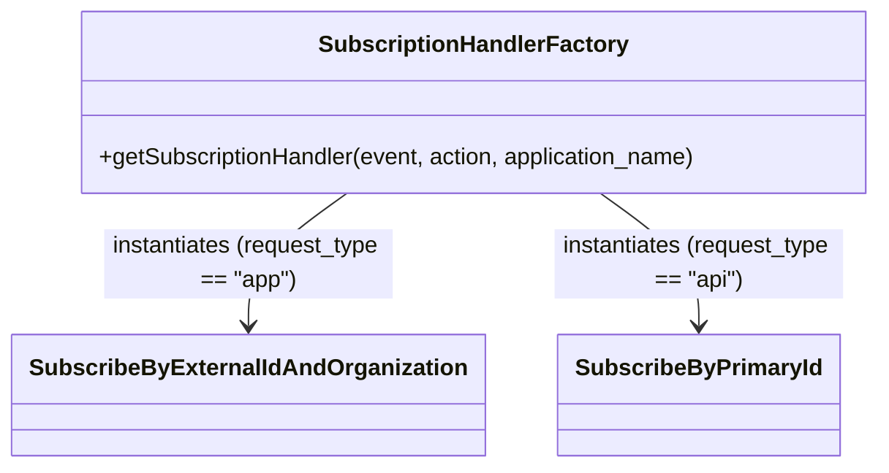

# Diagram: partview_core/partview_service/partview_service/api/package_container/subscription/classes/SubscriptionHandlerFactory.py


> Auto-generated by Obscura crawlers

## Diagram 1



### SVG

<svg id="container" width="595.734375" xmlns="http://www.w3.org/2000/svg" class="classDiagram" height="324" viewBox="0 0 595.734375 324" role="graphics-document document" aria-roledescription="class"><style>#container{font-family:"trebuchet ms",verdana,arial,sans-serif;font-size:16px;fill:#333;}@keyframes edge-animation-frame{from{stroke-dashoffset:0;}}@keyframes dash{to{stroke-dashoffset:0;}}#container .edge-animation-slow{stroke-dasharray:9,5!important;stroke-dashoffset:900;animation:dash 50s linear infinite;stroke-linecap:round;}#container .edge-animation-fast{stroke-dasharray:9,5!important;stroke-dashoffset:900;animation:dash 20s linear infinite;stroke-linecap:round;}#container .error-icon{fill:#552222;}#container .error-text{fill:#552222;stroke:#552222;}#container .edge-thickness-normal{stroke-width:1px;}#container .edge-thickness-thick{stroke-width:3.5px;}#container .edge-pattern-solid{stroke-dasharray:0;}#container .edge-thickness-invisible{stroke-width:0;fill:none;}#container .edge-pattern-dashed{stroke-dasharray:3;}#container .edge-pattern-dotted{stroke-dasharray:2;}#container .marker{fill:#333333;stroke:#333333;}#container .marker.cross{stroke:#333333;}#container svg{font-family:"trebuchet ms",verdana,arial,sans-serif;font-size:16px;}#container p{margin:0;}#container g.classGroup text{fill:#9370DB;stroke:none;font-family:"trebuchet ms",verdana,arial,sans-serif;font-size:10px;}#container g.classGroup text .title{font-weight:bolder;}#container .nodeLabel,#container .edgeLabel{color:#131300;}#container .edgeLabel .label rect{fill:#ECECFF;}#container .label text{fill:#131300;}#container .labelBkg{background:#ECECFF;}#container .edgeLabel .label span{background:#ECECFF;}#container .classTitle{font-weight:bolder;}#container .node rect,#container .node circle,#container .node ellipse,#container .node polygon,#container .node path{fill:#ECECFF;stroke:#9370DB;stroke-width:1px;}#container .divider{stroke:#9370DB;stroke-width:1;}#container g.clickable{cursor:pointer;}#container g.classGroup rect{fill:#ECECFF;stroke:#9370DB;}#container g.classGroup line{stroke:#9370DB;stroke-width:1;}#container .classLabel .box{stroke:none;stroke-width:0;fill:#ECECFF;opacity:0.5;}#container .classLabel .label{fill:#9370DB;font-size:10px;}#container .relation{stroke:#333333;stroke-width:1;fill:none;}#container .dashed-line{stroke-dasharray:3;}#container .dotted-line{stroke-dasharray:1 2;}#container #compositionStart,#container .composition{fill:#333333!important;stroke:#333333!important;stroke-width:1;}#container #compositionEnd,#container .composition{fill:#333333!important;stroke:#333333!important;stroke-width:1;}#container #dependencyStart,#container .dependency{fill:#333333!important;stroke:#333333!important;stroke-width:1;}#container #dependencyStart,#container .dependency{fill:#333333!important;stroke:#333333!important;stroke-width:1;}#container #extensionStart,#container .extension{fill:transparent!important;stroke:#333333!important;stroke-width:1;}#container #extensionEnd,#container .extension{fill:transparent!important;stroke:#333333!important;stroke-width:1;}#container #aggregationStart,#container .aggregation{fill:transparent!important;stroke:#333333!important;stroke-width:1;}#container #aggregationEnd,#container .aggregation{fill:transparent!important;stroke:#333333!important;stroke-width:1;}#container #lollipopStart,#container .lollipop{fill:#ECECFF!important;stroke:#333333!important;stroke-width:1;}#container #lollipopEnd,#container .lollipop{fill:#ECECFF!important;stroke:#333333!important;stroke-width:1;}#container .edgeTerminals{font-size:11px;line-height:initial;}#container .classTitleText{text-anchor:middle;font-size:18px;fill:#333;}#container .label-icon{display:inline-block;height:1em;overflow:visible;vertical-align:-0.125em;}#container .node .label-icon path{fill:currentColor;stroke:revert;stroke-width:revert;}#container :root{--mermaid-font-family:"trebuchet ms",verdana,arial,sans-serif;}</style><g><defs><marker id="container_class-aggregationStart" class="marker aggregation class" refX="18" refY="7" markerWidth="190" markerHeight="240" orient="auto"><path d="M 18,7 L9,13 L1,7 L9,1 Z"></path></marker></defs><defs><marker id="container_class-aggregationEnd" class="marker aggregation class" refX="1" refY="7" markerWidth="20" markerHeight="28" orient="auto"><path d="M 18,7 L9,13 L1,7 L9,1 Z"></path></marker></defs><defs><marker id="container_class-extensionStart" class="marker extension class" refX="18" refY="7" markerWidth="190" markerHeight="240" orient="auto"><path d="M 1,7 L18,13 V 1 Z"></path></marker></defs><defs><marker id="container_class-extensionEnd" class="marker extension class" refX="1" refY="7" markerWidth="20" markerHeight="28" orient="auto"><path d="M 1,1 V 13 L18,7 Z"></path></marker></defs><defs><marker id="container_class-compositionStart" class="marker composition class" refX="18" refY="7" markerWidth="190" markerHeight="240" orient="auto"><path d="M 18,7 L9,13 L1,7 L9,1 Z"></path></marker></defs><defs><marker id="container_class-compositionEnd" class="marker composition class" refX="1" refY="7" markerWidth="20" markerHeight="28" orient="auto"><path d="M 18,7 L9,13 L1,7 L9,1 Z"></path></marker></defs><defs><marker id="container_class-dependencyStart" class="marker dependency class" refX="6" refY="7" markerWidth="190" markerHeight="240" orient="auto"><path d="M 5,7 L9,13 L1,7 L9,1 Z"></path></marker></defs><defs><marker id="container_class-dependencyEnd" class="marker dependency class" refX="13" refY="7" markerWidth="20" markerHeight="28" orient="auto"><path d="M 18,7 L9,13 L14,7 L9,1 Z"></path></marker></defs><defs><marker id="container_class-lollipopStart" class="marker lollipop class" refX="13" refY="7" markerWidth="190" markerHeight="240" orient="auto"><circle stroke="black" fill="transparent" cx="7" cy="7" r="6"></circle></marker></defs><defs><marker id="container_class-lollipopEnd" class="marker lollipop class" refX="1" refY="7" markerWidth="190" markerHeight="240" orient="auto"><circle stroke="black" fill="transparent" cx="7" cy="7" r="6"></circle></marker></defs><g class="root"><g class="clusters"></g><g class="edgePaths"><path d="M228.821,134L217.934,142.167C207.047,150.333,185.274,166.667,174.387,182C163.5,197.333,163.5,211.667,163.5,218.833L163.5,226" id="id_SubscriptionHandlerFactory_SubscribeByExternalIdAndOrganization_1" class="edge-thickness-normal edge-pattern-solid relation" style=";;;" data-edge="true" data-et="edge" data-id="id_SubscriptionHandlerFactory_SubscribeByExternalIdAndOrganization_1" data-points="W3sieCI6MjI4LjgyMDgwMDc4MTI1LCJ5IjoxMzR9LHsieCI6MTYzLjUsInkiOjE4M30seyJ4IjoxNjMuNSwieSI6MjMyfV0=" marker-end="url(#container_class-dependencyEnd)"></path><path d="M396.789,134L407.675,142.167C418.562,150.333,440.336,166.667,451.223,182C462.109,197.333,462.109,211.667,462.109,218.833L462.109,226" id="id_SubscriptionHandlerFactory_SubscribeByPrimaryId_2" class="edge-thickness-normal edge-pattern-solid relation" style=";;;" data-edge="true" data-et="edge" data-id="id_SubscriptionHandlerFactory_SubscribeByPrimaryId_2" data-points="W3sieCI6Mzk2Ljc4ODU3NDIxODc1LCJ5IjoxMzR9LHsieCI6NDYyLjEwOTM3NSwieSI6MTgzfSx7IngiOjQ2Mi4xMDkzNzUsInkiOjIzMn1d" marker-end="url(#container_class-dependencyEnd)"></path></g><g class="edgeLabels"><g class="edgeLabel" transform="translate(163.5, 183)"><g class="label" data-id="id_SubscriptionHandlerFactory_SubscribeByExternalIdAndOrganization_1" transform="translate(-100, -24)"><foreignObject width="200" height="48"><div xmlns="http://www.w3.org/1999/xhtml" class="labelBkg" style="display: table; white-space: break-spaces; line-height: 1.5; max-width: 200px; text-align: center; width: 200px;"><span class="edgeLabel"><p>instantiates (request_type == "app")</p></span></div></foreignObject></g></g><g class="edgeLabel" transform="translate(462.109375, 183)"><g class="label" data-id="id_SubscriptionHandlerFactory_SubscribeByPrimaryId_2" transform="translate(-100, -24)"><foreignObject width="200" height="48"><div xmlns="http://www.w3.org/1999/xhtml" class="labelBkg" style="display: table; white-space: break-spaces; line-height: 1.5; max-width: 200px; text-align: center; width: 200px;"><span class="edgeLabel"><p>instantiates (request_type == "api")</p></span></div></foreignObject></g></g></g><g class="nodes"><g class="node default" id="classId-SubscriptionHandlerFactory-0" transform="translate(312.8046875, 71)"><g class="basic label-container"><path d="M-274.9296875 -63 L274.9296875 -63 L274.9296875 63 L-274.9296875 63" stroke="none" stroke-width="0" fill="#ECECFF" style=""></path><path d="M-274.9296875 -63 C-109.69743149105977 -63, 55.53482451788045 -63, 274.9296875 -63 M-274.9296875 -63 C-133.3406302187485 -63, 8.248427062503026 -63, 274.9296875 -63 M274.9296875 -63 C274.9296875 -19.20949579150882, 274.9296875 24.581008416982357, 274.9296875 63 M274.9296875 -63 C274.9296875 -14.525567401829719, 274.9296875 33.94886519634056, 274.9296875 63 M274.9296875 63 C68.60958502918805 63, -137.7105174416239 63, -274.9296875 63 M274.9296875 63 C128.7476662597437 63, -17.43435498051258 63, -274.9296875 63 M-274.9296875 63 C-274.9296875 37.590532155916435, -274.9296875 12.18106431183287, -274.9296875 -63 M-274.9296875 63 C-274.9296875 14.749322972999337, -274.9296875 -33.501354054001325, -274.9296875 -63" stroke="#9370DB" stroke-width="1.3" fill="none" stroke-dasharray="0 0" style=""></path></g><g class="annotation-group text" transform="translate(0, -39)"></g><g class="label-group text" transform="translate(-102.1875, -39)"><g class="label" style="font-weight: bolder" transform="translate(0,-12)"><foreignObject width="204.375" height="24"><div xmlns="http://www.w3.org/1999/xhtml" style="display: table-cell; white-space: nowrap; line-height: 1.5; max-width: 252px; text-align: center;"><span class="nodeLabel markdown-node-label" style=""><p>SubscriptionHandlerFactory</p></span></div></foreignObject></g></g><g class="members-group text" transform="translate(-262.9296875, 9)"></g><g class="methods-group text" transform="translate(-262.9296875, 39)"><g class="label" style="" transform="translate(0,-12)"><foreignObject width="423.671875" height="24"><div xmlns="http://www.w3.org/1999/xhtml" style="display: table-cell; white-space: nowrap; line-height: 1.5; max-width: 481px; text-align: center;"><span class="nodeLabel markdown-node-label" style=""><p>+getSubscriptionHandler(event, action, application_name)</p></span></div></foreignObject></g></g><g class="divider" style=""><path d="M-274.9296875 -15 C-75.33051577561719 -15, 124.26865594876563 -15, 274.9296875 -15 M-274.9296875 -15 C-149.4950246993601 -15, -24.060361898720174 -15, 274.9296875 -15" stroke="#9370DB" stroke-width="1.3" fill="none" stroke-dasharray="0 0" style=""></path></g><g class="divider" style=""><path d="M-274.9296875 9 C-66.03945189965796 9, 142.85078370068408 9, 274.9296875 9 M-274.9296875 9 C-155.16259396531512 9, -35.39550043063022 9, 274.9296875 9" stroke="#9370DB" stroke-width="1.3" fill="none" stroke-dasharray="0 0" style=""></path></g></g><g class="node default" id="classId-SubscribeByExternalIdAndOrganization-1" transform="translate(163.5, 274)"><g class="basic label-container"><path d="M-155.5 -42 L155.5 -42 L155.5 42 L-155.5 42" stroke="none" stroke-width="0" fill="#ECECFF" style=""></path><path d="M-155.5 -42 C-77.19718768624597 -42, 1.105624627508064 -42, 155.5 -42 M-155.5 -42 C-66.10704971830768 -42, 23.285900563384644 -42, 155.5 -42 M155.5 -42 C155.5 -12.728210989516121, 155.5 16.543578020967757, 155.5 42 M155.5 -42 C155.5 -13.340506651368226, 155.5 15.318986697263547, 155.5 42 M155.5 42 C41.90536322849894 42, -71.68927354300212 42, -155.5 42 M155.5 42 C73.42094019245161 42, -8.65811961509678 42, -155.5 42 M-155.5 42 C-155.5 16.10968827104674, -155.5 -9.780623457906522, -155.5 -42 M-155.5 42 C-155.5 17.076331348373753, -155.5 -7.847337303252495, -155.5 -42" stroke="#9370DB" stroke-width="1.3" fill="none" stroke-dasharray="0 0" style=""></path></g><g class="annotation-group text" transform="translate(0, -18)"></g><g class="label-group text" transform="translate(-143.5, -18)"><g class="label" style="font-weight: bolder" transform="translate(0,-12)"><foreignObject width="287" height="24"><div xmlns="http://www.w3.org/1999/xhtml" style="display: table-cell; white-space: nowrap; line-height: 1.5; max-width: 333px; text-align: center;"><span class="nodeLabel markdown-node-label" style=""><p>SubscribeByExternalIdAndOrganization</p></span></div></foreignObject></g></g><g class="members-group text" transform="translate(-143.5, 30)"></g><g class="methods-group text" transform="translate(-143.5, 60)"></g><g class="divider" style=""><path d="M-155.5 6 C-75.58354723532548 6, 4.332905529349034 6, 155.5 6 M-155.5 6 C-75.81572008304565 6, 3.868559833908705 6, 155.5 6" stroke="#9370DB" stroke-width="1.3" fill="none" stroke-dasharray="0 0" style=""></path></g><g class="divider" style=""><path d="M-155.5 24 C-66.35826717920274 24, 22.783465641594518 24, 155.5 24 M-155.5 24 C-68.4567470216661 24, 18.586505956667793 24, 155.5 24" stroke="#9370DB" stroke-width="1.3" fill="none" stroke-dasharray="0 0" style=""></path></g></g><g class="node default" id="classId-SubscribeByPrimaryId-2" transform="translate(462.109375, 274)"><g class="basic label-container"><path d="M-93.109375 -42 L93.109375 -42 L93.109375 42 L-93.109375 42" stroke="none" stroke-width="0" fill="#ECECFF" style=""></path><path d="M-93.109375 -42 C-39.4583525086036 -42, 14.192669982792793 -42, 93.109375 -42 M-93.109375 -42 C-27.580950907387034 -42, 37.94747318522593 -42, 93.109375 -42 M93.109375 -42 C93.109375 -8.909099302089153, 93.109375 24.181801395821694, 93.109375 42 M93.109375 -42 C93.109375 -22.83413727000229, 93.109375 -3.6682745400045818, 93.109375 42 M93.109375 42 C31.758408073226164 42, -29.592558853547672 42, -93.109375 42 M93.109375 42 C46.79540819833927 42, 0.4814413966785338 42, -93.109375 42 M-93.109375 42 C-93.109375 16.55034082550983, -93.109375 -8.899318348980337, -93.109375 -42 M-93.109375 42 C-93.109375 19.86939570829784, -93.109375 -2.2612085834043185, -93.109375 -42" stroke="#9370DB" stroke-width="1.3" fill="none" stroke-dasharray="0 0" style=""></path></g><g class="annotation-group text" transform="translate(0, -18)"></g><g class="label-group text" transform="translate(-81.109375, -18)"><g class="label" style="font-weight: bolder" transform="translate(0,-12)"><foreignObject width="162.21875" height="24"><div xmlns="http://www.w3.org/1999/xhtml" style="display: table-cell; white-space: nowrap; line-height: 1.5; max-width: 210px; text-align: center;"><span class="nodeLabel markdown-node-label" style=""><p>SubscribeByPrimaryId</p></span></div></foreignObject></g></g><g class="members-group text" transform="translate(-81.109375, 30)"></g><g class="methods-group text" transform="translate(-81.109375, 60)"></g><g class="divider" style=""><path d="M-93.109375 6 C-51.985562953599064 6, -10.861750907198129 6, 93.109375 6 M-93.109375 6 C-31.338693855458047 6, 30.431987289083906 6, 93.109375 6" stroke="#9370DB" stroke-width="1.3" fill="none" stroke-dasharray="0 0" style=""></path></g><g class="divider" style=""><path d="M-93.109375 24 C-41.461131549645756 24, 10.187111900708487 24, 93.109375 24 M-93.109375 24 C-37.993147140628835 24, 17.12308071874233 24, 93.109375 24" stroke="#9370DB" stroke-width="1.3" fill="none" stroke-dasharray="0 0" style=""></path></g></g></g></g></g></svg>

## Diagram 2

```mermaid
flowchart TD
    Start([Start]) --> ValidateEvent{event present\nand is dict\nand length>0}
    ValidateEvent -- OK --> GetAuthorizer[Get authorizer\nfrom requestContext.authorizer]
    ValidateEvent -- Fail --> ErrorBadEvent([AssertionError: Bad event])
    GetAuthorizer --> CheckAuthorizer{authorizer not None}
    CheckAuthorizer -- Fail --> ErrorBadAuthorizer([AssertionError: Bad Authorizer])
    CheckAuthorizer -- OK --> GetPathParams[Extract pathParameters\nget type (default "app")]
    GetPathParams --> NormalizeType[Lowercase type and\nvalidate in ["api","app"]]
    NormalizeType -- Invalid --> ErrorBadRequestType([AssertionError: Bad request type])
    NormalizeType -- Valid --> DecideType{type == "app" ?}
    DecideType -- Yes --> InstantiateApp[Instantiate SubscribeByExternalIdAndOrganization(event, application_name, action)]
    DecideType -- No --> InstantiateApi[Instantiate SubscribeByPrimaryId(event, application_name, action)]
    InstantiateApp --> AssertReturn{retval not None}
    InstantiateApi --> AssertReturn
    AssertReturn -- Fail --> ErrorNoHandler([AssertionError: failed to determine request type])
    AssertReturn -- OK --> ReturnHandler([return handler])
    ReturnHandler --> End([End])
```

> SVG rendering failed for this diagram.
