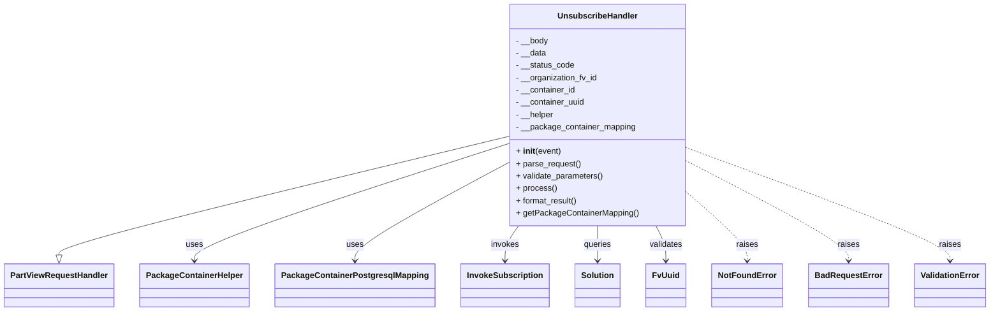
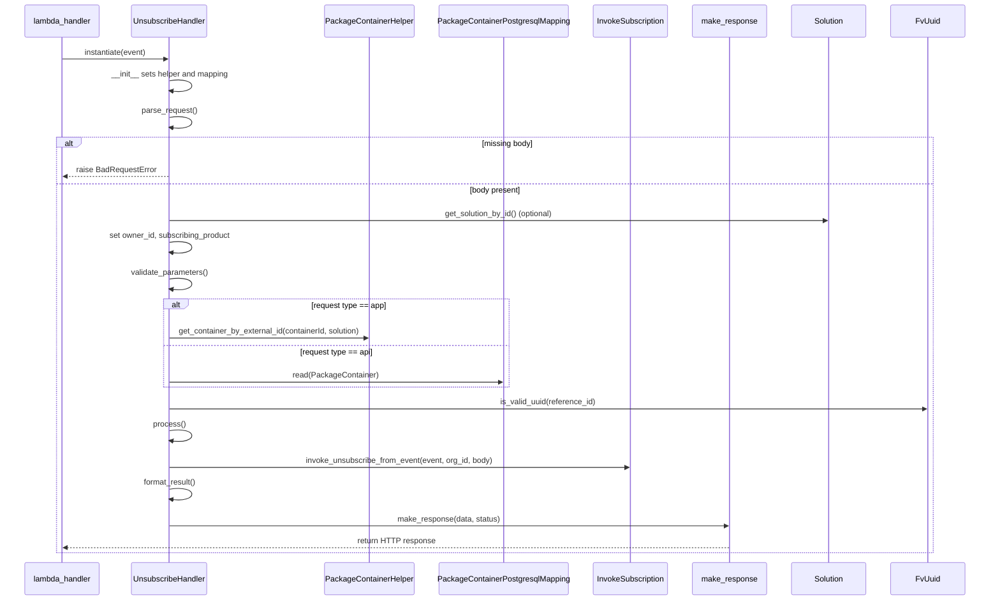

# Diagram: partview_core/partview_service/partview_service/api/package_container/subscription/unsubscribe.py

> Auto-generated by Obscura crawlers

## Diagram 1

### SVG

<svg id="container" width="1860.84375" xmlns="http://www.w3.org/2000/svg" class="classDiagram" height="606" viewBox="0 0 1860.84375 606" role="graphics-document document" aria-roledescription="class"><g><defs><marker id="container_class-aggregationStart" class="marker aggregation class" refX="18" refY="7" markerWidth="190" markerHeight="240" orient="auto"><path d="M 18,7 L9,13 L1,7 L9,1 Z"></path></marker></defs><defs><marker id="container_class-aggregationEnd" class="marker aggregation class" refX="1" refY="7" markerWidth="20" markerHeight="28" orient="auto"><path d="M 18,7 L9,13 L1,7 L9,1 Z"></path></marker></defs><defs><marker id="container_class-extensionStart" class="marker extension class" refX="18" refY="7" markerWidth="190" markerHeight="240" orient="auto"><path d="M 1,7 L18,13 V 1 Z"></path></marker></defs><defs><marker id="container_class-extensionEnd" class="marker extension class" refX="1" refY="7" markerWidth="20" markerHeight="28" orient="auto"><path d="M 1,1 V 13 L18,7 Z"></path></marker></defs><defs><marker id="container_class-compositionStart" class="marker composition class" refX="18" refY="7" markerWidth="190" markerHeight="240" orient="auto"><path d="M 18,7 L9,13 L1,7 L9,1 Z"></path></marker></defs><defs><marker id="container_class-compositionEnd" class="marker composition class" refX="1" refY="7" markerWidth="20" markerHeight="28" orient="auto"><path d="M 18,7 L9,13 L1,7 L9,1 Z"></path></marker></defs><defs><marker id="container_class-dependencyStart" class="marker dependency class" refX="6" refY="7" markerWidth="190" markerHeight="240" orient="auto"><path d="M 5,7 L9,13 L1,7 L9,1 Z"></path></marker></defs><defs><marker id="container_class-dependencyEnd" class="marker dependency class" refX="13" refY="7" markerWidth="20" markerHeight="28" orient="auto"><path d="M 18,7 L9,13 L14,7 L9,1 Z"></path></marker></defs><defs><marker id="container_class-lollipopStart" class="marker lollipop class" refX="13" refY="7" markerWidth="190" markerHeight="240" orient="auto"><circle stroke="black" fill="transparent" cx="7" cy="7" r="6"></circle></marker></defs><defs><marker id="container_class-lollipopEnd" class="marker lollipop class" refX="1" refY="7" markerWidth="190" markerHeight="240" orient="auto"><circle stroke="black" fill="transparent" cx="7" cy="7" r="6"></circle></marker></defs><g class="root"><g class="clusters"></g><g class="edgePaths"><path d="M955.609,265.841L814.901,301.034C674.193,336.228,392.776,406.614,252.068,445.099C111.359,483.583,111.359,490.167,111.359,493.458L111.359,496.75" id="id_UnsubscribeHandler_PartViewRequestHandler_1" class="edge-thickness-normal edge-pattern-solid relation" style=";;;" data-edge="true" data-et="edge" data-id="id_UnsubscribeHandler_PartViewRequestHandler_1" data-points="W3sieCI6OTU1LjYwOTM3NSwieSI6MjY1Ljg0MTMyMzE2OTM2Nn0seyJ4IjoxMTEuMzU5Mzc1LCJ5Ijo0Nzd9LHsieCI6MTExLjM1OTM3NSwieSI6NTE0fV0=" marker-end="url(#container_class-extensionEnd)"></path><path d="M955.609,279.969L857.456,312.807C759.302,345.646,562.995,411.323,464.841,449.328C366.688,487.333,366.688,497.667,366.688,502.833L366.688,508" id="id_UnsubscribeHandler_PackageContainerHelper_2" class="edge-thickness-normal edge-pattern-solid relation" style=";;;" data-edge="true" data-et="edge" data-id="id_UnsubscribeHandler_PackageContainerHelper_2" data-points="W3sieCI6OTU1LjYwOTM3NSwieSI6Mjc5Ljk2ODY4NjM5OTA5MDg3fSx7IngiOjM2Ni42ODc1LCJ5Ijo0Nzd9LHsieCI6MzY2LjY4NzUsInkiOjUxNH1d" marker-end="url(#container_class-dependencyEnd)"></path><path d="M955.609,316.737L907.426,343.447C859.242,370.158,762.875,423.579,714.691,455.456C666.508,487.333,666.508,497.667,666.508,502.833L666.508,508" id="id_UnsubscribeHandler_PackageContainerPostgresqlMapping_3" class="edge-thickness-normal edge-pattern-solid relation" style=";;;" data-edge="true" data-et="edge" data-id="id_UnsubscribeHandler_PackageContainerPostgresqlMapping_3" data-points="W3sieCI6OTU1LjYwOTM3NSwieSI6MzE2LjczNjYzOTM5MTk2ODJ9LHsieCI6NjY2LjUwNzgxMjUsInkiOjQ3N30seyJ4Ijo2NjYuNTA3ODEyNSwieSI6NTE0fV0=" marker-end="url(#container_class-dependencyEnd)"></path><path d="M972.904,440L968.622,446.167C964.34,452.333,955.775,464.667,951.493,476C947.211,487.333,947.211,497.667,947.211,502.833L947.211,508" id="id_UnsubscribeHandler_InvokeSubscription_4" class="edge-thickness-normal edge-pattern-solid relation" style=";;;" data-edge="true" data-et="edge" data-id="id_UnsubscribeHandler_InvokeSubscription_4" data-points="W3sieCI6OTcyLjkwNDM2NjM1Mzc1NSwieSI6NDQwfSx7IngiOjk0Ny4yMTA5Mzc1LCJ5Ijo0Nzd9LHsieCI6OTQ3LjIxMDkzNzUsInkiOjUxNH1d" marker-end="url(#container_class-dependencyEnd)"></path><path d="M1122.898,440L1122.898,446.167C1122.898,452.333,1122.898,464.667,1122.898,476C1122.898,487.333,1122.898,497.667,1122.898,502.833L1122.898,508" id="id_UnsubscribeHandler_Solution_5" class="edge-thickness-normal edge-pattern-solid relation" style=";;;" data-edge="true" data-et="edge" data-id="id_UnsubscribeHandler_Solution_5" data-points="W3sieCI6MTEyMi44OTg0Mzc1LCJ5Ijo0NDB9LHsieCI6MTEyMi44OTg0Mzc1LCJ5Ijo0Nzd9LHsieCI6MTEyMi44OTg0Mzc1LCJ5Ijo1MTR9XQ==" marker-end="url(#container_class-dependencyEnd)"></path><path d="M1233.373,440L1236.527,446.167C1239.681,452.333,1245.989,464.667,1249.143,476C1252.297,487.333,1252.297,497.667,1252.297,502.833L1252.297,508" id="id_UnsubscribeHandler_FvUuid_6" class="edge-thickness-normal edge-pattern-solid relation" style=";;;" data-edge="true" data-et="edge" data-id="id_UnsubscribeHandler_FvUuid_6" data-points="W3sieCI6MTIzMy4zNzI5OTI4MzU5Njg1LCJ5Ijo0NDB9LHsieCI6MTI1Mi4yOTY4NzUsInkiOjQ3N30seyJ4IjoxMjUyLjI5Njg3NSwieSI6NTE0fV0=" marker-end="url(#container_class-dependencyEnd)"></path><path d="M1290.188,374.356L1309.221,391.464C1328.255,408.571,1366.323,442.785,1385.357,465.059C1404.391,487.333,1404.391,497.667,1404.391,502.833L1404.391,508" id="id_UnsubscribeHandler_NotFoundError_7" class="edge-thickness-normal edge-pattern-dashed relation" style=";;;" data-edge="true" data-et="edge" data-id="id_UnsubscribeHandler_NotFoundError_7" data-points="W3sieCI6MTI5MC4xODc1LCJ5IjozNzQuMzU2MzMyMDQ3NDAzNn0seyJ4IjoxNDA0LjM5MDYyNSwieSI6NDc3fSx7IngiOjE0MDQuMzkwNjI1LCJ5Ijo1MTR9XQ==" marker-end="url(#container_class-dependencyEnd)"></path><path d="M1290.188,313.802L1340.857,341.002C1391.526,368.201,1492.865,422.601,1543.534,454.967C1594.203,487.333,1594.203,497.667,1594.203,502.833L1594.203,508" id="id_UnsubscribeHandler_BadRequestError_8" class="edge-thickness-normal edge-pattern-dashed relation" style=";;;" data-edge="true" data-et="edge" data-id="id_UnsubscribeHandler_BadRequestError_8" data-points="W3sieCI6MTI5MC4xODc1LCJ5IjozMTMuODAyMDYyMDk0OTE2MDR9LHsieCI6MTU5NC4yMDMxMjUsInkiOjQ3N30seyJ4IjoxNTk0LjIwMzEyNSwieSI6NTE0fV0=" marker-end="url(#container_class-dependencyEnd)"></path><path d="M1290.188,287.86L1372.767,319.383C1455.346,350.907,1620.505,413.953,1703.085,450.643C1785.664,487.333,1785.664,497.667,1785.664,502.833L1785.664,508" id="id_UnsubscribeHandler_ValidationError_9" class="edge-thickness-normal edge-pattern-dashed relation" style=";;;" data-edge="true" data-et="edge" data-id="id_UnsubscribeHandler_ValidationError_9" data-points="W3sieCI6MTI5MC4xODc1LCJ5IjoyODcuODU5ODc5MjkzNjc5NH0seyJ4IjoxNzg1LjY2NDA2MjUsInkiOjQ3N30seyJ4IjoxNzg1LjY2NDA2MjUsInkiOjUxNH1d" marker-end="url(#container_class-dependencyEnd)"></path></g><g class="edgeLabels"><g class="edgeLabel"><g class="label" data-id="id_UnsubscribeHandler_PartViewRequestHandler_1" transform="translate(0, 0)"><foreignObject width="0" height="0">

</foreignObject></g></g><g class="edgeLabel" transform="translate(366.6875, 477)"><g class="label" data-id="id_UnsubscribeHandler_PackageContainerHelper_2" transform="translate(-16.4921875, -12)"><foreignObject width="32.984375" height="24">

uses

</foreignObject></g></g><g class="edgeLabel" transform="translate(666.5078125, 477)"><g class="label" data-id="id_UnsubscribeHandler_PackageContainerPostgresqlMapping_3" transform="translate(-16.4921875, -12)"><foreignObject width="32.984375" height="24">

uses

</foreignObject></g></g><g class="edgeLabel" transform="translate(947.2109375, 477)"><g class="label" data-id="id_UnsubscribeHandler_InvokeSubscription_4" transform="translate(-27.5859375, -12)"><foreignObject width="55.171875" height="24">

invokes

</foreignObject></g></g><g class="edgeLabel" transform="translate(1122.8984375, 477)"><g class="label" data-id="id_UnsubscribeHandler_Solution_5" transform="translate(-27.2421875, -12)"><foreignObject width="54.484375" height="24">

queries

</foreignObject></g></g><g class="edgeLabel" transform="translate(1252.296875, 477)"><g class="label" data-id="id_UnsubscribeHandler_FvUuid_6" transform="translate(-32.6875, -12)"><foreignObject width="65.375" height="24">

validates

</foreignObject></g></g><g class="edgeLabel" transform="translate(1404.390625, 477)"><g class="label" data-id="id_UnsubscribeHandler_NotFoundError_7" transform="translate(-21.25, -12)"><foreignObject width="42.5" height="24">

raises

</foreignObject></g></g><g class="edgeLabel" transform="translate(1594.203125, 477)"><g class="label" data-id="id_UnsubscribeHandler_BadRequestError_8" transform="translate(-21.25, -12)"><foreignObject width="42.5" height="24">

raises

</foreignObject></g></g><g class="edgeLabel" transform="translate(1785.6640625, 477)"><g class="label" data-id="id_UnsubscribeHandler_ValidationError_9" transform="translate(-21.25, -12)"><foreignObject width="42.5" height="24">

raises

</foreignObject></g></g></g><g class="nodes"><g class="node default" id="classId-UnsubscribeHandler-0" transform="translate(1122.8984375, 224)"><g class="basic label-container"><path d="M-167.2890625 -216 L167.2890625 -216 L167.2890625 216 L-167.2890625 216" stroke="none" stroke-width="0" fill="#ECECFF" style=""></path><path d="M-167.2890625 -216 C-47.09353317232727 -216, 73.10199615534546 -216, 167.2890625 -216 M-167.2890625 -216 C-68.93311725123546 -216, 29.422827997529083 -216, 167.2890625 -216 M167.2890625 -216 C167.2890625 -75.55677726844223, 167.2890625 64.88644546311554, 167.2890625 216 M167.2890625 -216 C167.2890625 -104.18204596617251, 167.2890625 7.635908067654981, 167.2890625 216 M167.2890625 216 C90.4396436884015 216, 13.590224876803006 216, -167.2890625 216 M167.2890625 216 C83.08004670727189 216, -1.1289690854562195 216, -167.2890625 216 M-167.2890625 216 C-167.2890625 96.64942283989767, -167.2890625 -22.701154320204665, -167.2890625 -216 M-167.2890625 216 C-167.2890625 78.50999747008058, -167.2890625 -58.980005059838845, -167.2890625 -216" stroke="#9370DB" stroke-width="1.3" fill="none" stroke-dasharray="0 0" style=""></path></g><g class="annotation-group text" transform="translate(0, -192)"></g><g class="label-group text" transform="translate(-74.484375, -192)"><g class="label" style="font-weight: bolder" transform="translate(0,-12)"><foreignObject width="148.96875" height="24">

UnsubscribeHandler

</foreignObject></g></g><g class="members-group text" transform="translate(-155.2890625, -144)"><g class="label" style="" transform="translate(0,-12)"><foreignObject width="63.46875" height="24">

- __body

</foreignObject></g><g class="label" style="" transform="translate(0,12)"><foreignObject width="59.5" height="24">

- __data

</foreignObject></g><g class="label" style="" transform="translate(0,36)"><foreignObject width="114.21875" height="24">

- __status_code

</foreignObject></g><g class="label" style="" transform="translate(0,60)"><foreignObject width="160.359375" height="24">

- __organization_fv_id

</foreignObject></g><g class="label" style="" transform="translate(0,84)"><foreignObject width="117.171875" height="24">

- __container_id

</foreignObject></g><g class="label" style="" transform="translate(0,108)"><foreignObject width="135.484375" height="24">

- __container_uuid

</foreignObject></g><g class="label" style="" transform="translate(0,132)"><foreignObject width="74.359375" height="24">

- __helper

</foreignObject></g><g class="label" style="" transform="translate(0,156)"><foreignObject width="233.703125" height="24">

- __package_container_mapping

</foreignObject></g></g><g class="methods-group text" transform="translate(-155.2890625, 72)"><g class="label" style="" transform="translate(0,-12)"><foreignObject width="87.390625" height="24">

+ <strong>init</strong>(event)

</foreignObject></g><g class="label" style="" transform="translate(0,12)"><foreignObject width="126.046875" height="24">

+ parse_request()

</foreignObject></g><g class="label" style="" transform="translate(0,36)"><foreignObject width="170.953125" height="24">

+ validate_parameters()

</foreignObject></g><g class="label" style="" transform="translate(0,60)"><foreignObject width="77.96875" height="24">

+ process()

</foreignObject></g><g class="label" style="" transform="translate(0,84)"><foreignObject width="121.5" height="24">

+ format_result()

</foreignObject></g><g class="label" style="" transform="translate(0,108)"><foreignObject width="236.09375" height="24">

+ getPackageContainerMapping()

</foreignObject></g></g><g class="divider" style=""><path d="M-167.2890625 -168 C-46.30419485148636 -168, 74.68067279702728 -168, 167.2890625 -168 M-167.2890625 -168 C-64.58398452454023 -168, 38.121093450919545 -168, 167.2890625 -168" stroke="#9370DB" stroke-width="1.3" fill="none" stroke-dasharray="0 0" style=""></path></g><g class="divider" style=""><path d="M-167.2890625 48 C-40.8701999874192 48, 85.5486625251616 48, 167.2890625 48 M-167.2890625 48 C-38.016278636062395 48, 91.25650522787521 48, 167.2890625 48" stroke="#9370DB" stroke-width="1.3" fill="none" stroke-dasharray="0 0" style=""></path></g></g><g class="node default" id="classId-PartViewRequestHandler-1" transform="translate(111.359375, 556)"><g class="basic label-container"><path d="M-103.359375 -42 L103.359375 -42 L103.359375 42 L-103.359375 42" stroke="none" stroke-width="0" fill="#ECECFF" style=""></path><path d="M-103.359375 -42 C-24.122651168229922 -42, 55.114072663540156 -42, 103.359375 -42 M-103.359375 -42 C-27.186241169206994 -42, 48.98689266158601 -42, 103.359375 -42 M103.359375 -42 C103.359375 -19.146736830048557, 103.359375 3.7065263399028865, 103.359375 42 M103.359375 -42 C103.359375 -17.38050591978722, 103.359375 7.2389881604255635, 103.359375 42 M103.359375 42 C47.75449396330485 42, -7.850387073390294 42, -103.359375 42 M103.359375 42 C51.11537853342549 42, -1.128617933149016 42, -103.359375 42 M-103.359375 42 C-103.359375 24.74588745577377, -103.359375 7.491774911547537, -103.359375 -42 M-103.359375 42 C-103.359375 21.39875593893185, -103.359375 0.7975118778636983, -103.359375 -42" stroke="#9370DB" stroke-width="1.3" fill="none" stroke-dasharray="0 0" style=""></path></g><g class="annotation-group text" transform="translate(0, -18)"></g><g class="label-group text" transform="translate(-91.359375, -18)"><g class="label" style="font-weight: bolder" transform="translate(0,-12)"><foreignObject width="182.71875" height="24">

PartViewRequestHandler

</foreignObject></g></g><g class="members-group text" transform="translate(-91.359375, 30)"></g><g class="methods-group text" transform="translate(-91.359375, 60)"></g><g class="divider" style=""><path d="M-103.359375 6 C-23.773190326883295 6, 55.81299434623341 6, 103.359375 6 M-103.359375 6 C-41.582306304797726 6, 20.19476239040455 6, 103.359375 6" stroke="#9370DB" stroke-width="1.3" fill="none" stroke-dasharray="0 0" style=""></path></g><g class="divider" style=""><path d="M-103.359375 24 C-25.530044197145756 24, 52.29928660570849 24, 103.359375 24 M-103.359375 24 C-22.565991911369366 24, 58.22739117726127 24, 103.359375 24" stroke="#9370DB" stroke-width="1.3" fill="none" stroke-dasharray="0 0" style=""></path></g></g><g class="node default" id="classId-PackageContainerHelper-2" transform="translate(366.6875, 556)"><g class="basic label-container"><path d="M-101.96875 -42 L101.96875 -42 L101.96875 42 L-101.96875 42" stroke="none" stroke-width="0" fill="#ECECFF" style=""></path><path d="M-101.96875 -42 C-32.00430917220022 -42, 37.960131655599554 -42, 101.96875 -42 M-101.96875 -42 C-33.616905627880456 -42, 34.73493874423909 -42, 101.96875 -42 M101.96875 -42 C101.96875 -13.472113978027974, 101.96875 15.055772043944053, 101.96875 42 M101.96875 -42 C101.96875 -19.465005240971283, 101.96875 3.069989518057433, 101.96875 42 M101.96875 42 C59.83530656675138 42, 17.701863133502755 42, -101.96875 42 M101.96875 42 C45.6521935895196 42, -10.664362820960804 42, -101.96875 42 M-101.96875 42 C-101.96875 24.239240152855697, -101.96875 6.478480305711393, -101.96875 -42 M-101.96875 42 C-101.96875 23.028764025464795, -101.96875 4.057528050929591, -101.96875 -42" stroke="#9370DB" stroke-width="1.3" fill="none" stroke-dasharray="0 0" style=""></path></g><g class="annotation-group text" transform="translate(0, -18)"></g><g class="label-group text" transform="translate(-89.96875, -18)"><g class="label" style="font-weight: bolder" transform="translate(0,-12)"><foreignObject width="179.9375" height="24">

PackageContainerHelper

</foreignObject></g></g><g class="members-group text" transform="translate(-89.96875, 30)"></g><g class="methods-group text" transform="translate(-89.96875, 60)"></g><g class="divider" style=""><path d="M-101.96875 6 C-31.150613513469665 6, 39.66752297306067 6, 101.96875 6 M-101.96875 6 C-34.31137175492083 6, 33.346006490158345 6, 101.96875 6" stroke="#9370DB" stroke-width="1.3" fill="none" stroke-dasharray="0 0" style=""></path></g><g class="divider" style=""><path d="M-101.96875 24 C-36.103995484164116 24, 29.760759031671768 24, 101.96875 24 M-101.96875 24 C-23.209178154702144 24, 55.55039369059571 24, 101.96875 24" stroke="#9370DB" stroke-width="1.3" fill="none" stroke-dasharray="0 0" style=""></path></g></g><g class="node default" id="classId-PackageContainerPostgresqlMapping-3" transform="translate(666.5078125, 556)"><g class="basic label-container"><path d="M-147.8515625 -42 L147.8515625 -42 L147.8515625 42 L-147.8515625 42" stroke="none" stroke-width="0" fill="#ECECFF" style=""></path><path d="M-147.8515625 -42 C-76.75496513941748 -42, -5.658367778834958 -42, 147.8515625 -42 M-147.8515625 -42 C-75.31274115625442 -42, -2.7739198125088365 -42, 147.8515625 -42 M147.8515625 -42 C147.8515625 -18.248395244177324, 147.8515625 5.503209511645352, 147.8515625 42 M147.8515625 -42 C147.8515625 -23.78802583569295, 147.8515625 -5.576051671385898, 147.8515625 42 M147.8515625 42 C74.6256740058434 42, 1.3997855116867868 42, -147.8515625 42 M147.8515625 42 C44.61313033050682 42, -58.62530183898636 42, -147.8515625 42 M-147.8515625 42 C-147.8515625 9.166936042419756, -147.8515625 -23.666127915160487, -147.8515625 -42 M-147.8515625 42 C-147.8515625 10.461527274386999, -147.8515625 -21.076945451226003, -147.8515625 -42" stroke="#9370DB" stroke-width="1.3" fill="none" stroke-dasharray="0 0" style=""></path></g><g class="annotation-group text" transform="translate(0, -18)"></g><g class="label-group text" transform="translate(-135.8515625, -18)"><g class="label" style="font-weight: bolder" transform="translate(0,-12)"><foreignObject width="271.703125" height="24">

PackageContainerPostgresqlMapping

</foreignObject></g></g><g class="members-group text" transform="translate(-135.8515625, 30)"></g><g class="methods-group text" transform="translate(-135.8515625, 60)"></g><g class="divider" style=""><path d="M-147.8515625 6 C-50.16312612525583 6, 47.52531024948834 6, 147.8515625 6 M-147.8515625 6 C-54.00780440201284 6, 39.835953695974325 6, 147.8515625 6" stroke="#9370DB" stroke-width="1.3" fill="none" stroke-dasharray="0 0" style=""></path></g><g class="divider" style=""><path d="M-147.8515625 24 C-64.50587904173386 24, 18.839804416532274 24, 147.8515625 24 M-147.8515625 24 C-78.64406468600573 24, -9.436566872011468 24, 147.8515625 24" stroke="#9370DB" stroke-width="1.3" fill="none" stroke-dasharray="0 0" style=""></path></g></g><g class="node default" id="classId-InvokeSubscription-4" transform="translate(947.2109375, 556)"><g class="basic label-container"><path d="M-82.8515625 -42 L82.8515625 -42 L82.8515625 42 L-82.8515625 42" stroke="none" stroke-width="0" fill="#ECECFF" style=""></path><path d="M-82.8515625 -42 C-39.38033508790315 -42, 4.090892324193703 -42, 82.8515625 -42 M-82.8515625 -42 C-25.97522417620202 -42, 30.901114147595962 -42, 82.8515625 -42 M82.8515625 -42 C82.8515625 -13.152128237441563, 82.8515625 15.695743525116875, 82.8515625 42 M82.8515625 -42 C82.8515625 -20.689257903702128, 82.8515625 0.6214841925957444, 82.8515625 42 M82.8515625 42 C24.82819690084095 42, -33.1951686983181 42, -82.8515625 42 M82.8515625 42 C35.80138627516454 42, -11.248789949670922 42, -82.8515625 42 M-82.8515625 42 C-82.8515625 21.26390414964542, -82.8515625 0.5278082992908395, -82.8515625 -42 M-82.8515625 42 C-82.8515625 18.428713905308655, -82.8515625 -5.14257218938269, -82.8515625 -42" stroke="#9370DB" stroke-width="1.3" fill="none" stroke-dasharray="0 0" style=""></path></g><g class="annotation-group text" transform="translate(0, -18)"></g><g class="label-group text" transform="translate(-70.8515625, -18)"><g class="label" style="font-weight: bolder" transform="translate(0,-12)"><foreignObject width="141.703125" height="24">

InvokeSubscription

</foreignObject></g></g><g class="members-group text" transform="translate(-70.8515625, 30)"></g><g class="methods-group text" transform="translate(-70.8515625, 60)"></g><g class="divider" style=""><path d="M-82.8515625 6 C-43.46372925365807 6, -4.075896007316146 6, 82.8515625 6 M-82.8515625 6 C-46.5020265924596 6, -10.1524906849192 6, 82.8515625 6" stroke="#9370DB" stroke-width="1.3" fill="none" stroke-dasharray="0 0" style=""></path></g><g class="divider" style=""><path d="M-82.8515625 24 C-33.15514040373834 24, 16.541281692523313 24, 82.8515625 24 M-82.8515625 24 C-45.54398905063077 24, -8.236415601261541 24, 82.8515625 24" stroke="#9370DB" stroke-width="1.3" fill="none" stroke-dasharray="0 0" style=""></path></g></g><g class="node default" id="classId-Solution-5" transform="translate(1122.8984375, 556)"><g class="basic label-container"><path d="M-42.8359375 -42 L42.8359375 -42 L42.8359375 42 L-42.8359375 42" stroke="none" stroke-width="0" fill="#ECECFF" style=""></path><path d="M-42.8359375 -42 C-24.28955602346211 -42, -5.743174546924223 -42, 42.8359375 -42 M-42.8359375 -42 C-21.529987523273434 -42, -0.22403754654686736 -42, 42.8359375 -42 M42.8359375 -42 C42.8359375 -17.1933413222039, 42.8359375 7.613317355592201, 42.8359375 42 M42.8359375 -42 C42.8359375 -19.0392366259268, 42.8359375 3.9215267481463982, 42.8359375 42 M42.8359375 42 C18.0964312176602 42, -6.6430750646796 42, -42.8359375 42 M42.8359375 42 C14.098130309145198 42, -14.639676881709605 42, -42.8359375 42 M-42.8359375 42 C-42.8359375 15.739576160003821, -42.8359375 -10.520847679992357, -42.8359375 -42 M-42.8359375 42 C-42.8359375 9.148481581120016, -42.8359375 -23.703036837759967, -42.8359375 -42" stroke="#9370DB" stroke-width="1.3" fill="none" stroke-dasharray="0 0" style=""></path></g><g class="annotation-group text" transform="translate(0, -18)"></g><g class="label-group text" transform="translate(-30.8359375, -18)"><g class="label" style="font-weight: bolder" transform="translate(0,-12)"><foreignObject width="61.671875" height="24">

Solution

</foreignObject></g></g><g class="members-group text" transform="translate(-30.8359375, 30)"></g><g class="methods-group text" transform="translate(-30.8359375, 60)"></g><g class="divider" style=""><path d="M-42.8359375 6 C-25.369613123278793 6, -7.903288746557585 6, 42.8359375 6 M-42.8359375 6 C-24.561437121998004 6, -6.286936743996009 6, 42.8359375 6" stroke="#9370DB" stroke-width="1.3" fill="none" stroke-dasharray="0 0" style=""></path></g><g class="divider" style=""><path d="M-42.8359375 24 C-12.225793025149429 24, 18.384351449701143 24, 42.8359375 24 M-42.8359375 24 C-19.478728195402596 24, 3.8784811091948086 24, 42.8359375 24" stroke="#9370DB" stroke-width="1.3" fill="none" stroke-dasharray="0 0" style=""></path></g></g><g class="node default" id="classId-FvUuid-6" transform="translate(1252.296875, 556)"><g class="basic label-container"><path d="M-36.5625 -42 L36.5625 -42 L36.5625 42 L-36.5625 42" stroke="none" stroke-width="0" fill="#ECECFF" style=""></path><path d="M-36.5625 -42 C-16.06712302525191 -42, 4.428253949496181 -42, 36.5625 -42 M-36.5625 -42 C-17.790083290309486 -42, 0.9823334193810282 -42, 36.5625 -42 M36.5625 -42 C36.5625 -18.475270201947346, 36.5625 5.049459596105308, 36.5625 42 M36.5625 -42 C36.5625 -19.563365541632532, 36.5625 2.8732689167349363, 36.5625 42 M36.5625 42 C7.411340382156343 42, -21.739819235687314 42, -36.5625 42 M36.5625 42 C9.648773551005725 42, -17.26495289798855 42, -36.5625 42 M-36.5625 42 C-36.5625 17.284593214422607, -36.5625 -7.430813571154786, -36.5625 -42 M-36.5625 42 C-36.5625 10.881583631615285, -36.5625 -20.23683273676943, -36.5625 -42" stroke="#9370DB" stroke-width="1.3" fill="none" stroke-dasharray="0 0" style=""></path></g><g class="annotation-group text" transform="translate(0, -18)"></g><g class="label-group text" transform="translate(-24.5625, -18)"><g class="label" style="font-weight: bolder" transform="translate(0,-12)"><foreignObject width="49.125" height="24">

FvUuid

</foreignObject></g></g><g class="members-group text" transform="translate(-24.5625, 30)"></g><g class="methods-group text" transform="translate(-24.5625, 60)"></g><g class="divider" style=""><path d="M-36.5625 6 C-18.593033878618453 6, -0.6235677572369056 6, 36.5625 6 M-36.5625 6 C-10.417656949317255 6, 15.72718610136549 6, 36.5625 6" stroke="#9370DB" stroke-width="1.3" fill="none" stroke-dasharray="0 0" style=""></path></g><g class="divider" style=""><path d="M-36.5625 24 C-10.517543121426932 24, 15.527413757146135 24, 36.5625 24 M-36.5625 24 C-9.057430946118505 24, 18.44763810776299 24, 36.5625 24" stroke="#9370DB" stroke-width="1.3" fill="none" stroke-dasharray="0 0" style=""></path></g></g><g class="node default" id="classId-NotFoundError-7" transform="translate(1404.390625, 556)"><g class="basic label-container"><path d="M-65.53125 -42 L65.53125 -42 L65.53125 42 L-65.53125 42" stroke="none" stroke-width="0" fill="#ECECFF" style=""></path><path d="M-65.53125 -42 C-29.00202579595851 -42, 7.527198408082981 -42, 65.53125 -42 M-65.53125 -42 C-23.026411340496033 -42, 19.478427319007935 -42, 65.53125 -42 M65.53125 -42 C65.53125 -20.577684342879433, 65.53125 0.8446313142411341, 65.53125 42 M65.53125 -42 C65.53125 -12.689794290189745, 65.53125 16.62041141962051, 65.53125 42 M65.53125 42 C26.199512341743585 42, -13.13222531651283 42, -65.53125 42 M65.53125 42 C15.158882519818341 42, -35.21348496036332 42, -65.53125 42 M-65.53125 42 C-65.53125 10.596450872953138, -65.53125 -20.807098254093724, -65.53125 -42 M-65.53125 42 C-65.53125 8.731315158419598, -65.53125 -24.537369683160804, -65.53125 -42" stroke="#9370DB" stroke-width="1.3" fill="none" stroke-dasharray="0 0" style=""></path></g><g class="annotation-group text" transform="translate(0, -18)"></g><g class="label-group text" transform="translate(-53.53125, -18)"><g class="label" style="font-weight: bolder" transform="translate(0,-12)"><foreignObject width="107.0625" height="24">

NotFoundError

</foreignObject></g></g><g class="members-group text" transform="translate(-53.53125, 30)"></g><g class="methods-group text" transform="translate(-53.53125, 60)"></g><g class="divider" style=""><path d="M-65.53125 6 C-19.249345809181825 6, 27.03255838163635 6, 65.53125 6 M-65.53125 6 C-31.941370393214818 6, 1.6485092135703638 6, 65.53125 6" stroke="#9370DB" stroke-width="1.3" fill="none" stroke-dasharray="0 0" style=""></path></g><g class="divider" style=""><path d="M-65.53125 24 C-21.17993140059857 24, 23.17138719880286 24, 65.53125 24 M-65.53125 24 C-39.0313916156104 24, -12.531533231220806 24, 65.53125 24" stroke="#9370DB" stroke-width="1.3" fill="none" stroke-dasharray="0 0" style=""></path></g></g><g class="node default" id="classId-BadRequestError-8" transform="translate(1594.203125, 556)"><g class="basic label-container"><path d="M-74.28125 -42 L74.28125 -42 L74.28125 42 L-74.28125 42" stroke="none" stroke-width="0" fill="#ECECFF" style=""></path><path d="M-74.28125 -42 C-30.508301991312244 -42, 13.264646017375512 -42, 74.28125 -42 M-74.28125 -42 C-30.055752088851023 -42, 14.169745822297955 -42, 74.28125 -42 M74.28125 -42 C74.28125 -17.776886597162665, 74.28125 6.446226805674669, 74.28125 42 M74.28125 -42 C74.28125 -19.327710275827506, 74.28125 3.3445794483449873, 74.28125 42 M74.28125 42 C20.798079602835166 42, -32.68509079432967 42, -74.28125 42 M74.28125 42 C27.960697442546582 42, -18.359855114906836 42, -74.28125 42 M-74.28125 42 C-74.28125 12.11407074481965, -74.28125 -17.7718585103607, -74.28125 -42 M-74.28125 42 C-74.28125 8.826445827387928, -74.28125 -24.347108345224143, -74.28125 -42" stroke="#9370DB" stroke-width="1.3" fill="none" stroke-dasharray="0 0" style=""></path></g><g class="annotation-group text" transform="translate(0, -18)"></g><g class="label-group text" transform="translate(-62.28125, -18)"><g class="label" style="font-weight: bolder" transform="translate(0,-12)"><foreignObject width="124.5625" height="24">

BadRequestError

</foreignObject></g></g><g class="members-group text" transform="translate(-62.28125, 30)"></g><g class="methods-group text" transform="translate(-62.28125, 60)"></g><g class="divider" style=""><path d="M-74.28125 6 C-32.30374894320693 6, 9.673752113586147 6, 74.28125 6 M-74.28125 6 C-15.77619220887474 6, 42.72886558225052 6, 74.28125 6" stroke="#9370DB" stroke-width="1.3" fill="none" stroke-dasharray="0 0" style=""></path></g><g class="divider" style=""><path d="M-74.28125 24 C-24.97561764306169 24, 24.330014713876622 24, 74.28125 24 M-74.28125 24 C-17.36121381092245 24, 39.5588223781551 24, 74.28125 24" stroke="#9370DB" stroke-width="1.3" fill="none" stroke-dasharray="0 0" style=""></path></g></g><g class="node default" id="classId-ValidationError-9" transform="translate(1785.6640625, 556)"><g class="basic label-container"><path d="M-67.1796875 -42 L67.1796875 -42 L67.1796875 42 L-67.1796875 42" stroke="none" stroke-width="0" fill="#ECECFF" style=""></path><path d="M-67.1796875 -42 C-36.70264204980707 -42, -6.2255965996141285 -42, 67.1796875 -42 M-67.1796875 -42 C-26.20599179879232 -42, 14.767703902415363 -42, 67.1796875 -42 M67.1796875 -42 C67.1796875 -18.549016523010177, 67.1796875 4.901966953979645, 67.1796875 42 M67.1796875 -42 C67.1796875 -24.53917839870288, 67.1796875 -7.07835679740576, 67.1796875 42 M67.1796875 42 C32.3536626808158 42, -2.4723621383683962 42, -67.1796875 42 M67.1796875 42 C29.584892258674216 42, -8.009902982651568 42, -67.1796875 42 M-67.1796875 42 C-67.1796875 17.296598051114028, -67.1796875 -7.406803897771944, -67.1796875 -42 M-67.1796875 42 C-67.1796875 20.403132305907704, -67.1796875 -1.1937353881845922, -67.1796875 -42" stroke="#9370DB" stroke-width="1.3" fill="none" stroke-dasharray="0 0" style=""></path></g><g class="annotation-group text" transform="translate(0, -18)"></g><g class="label-group text" transform="translate(-55.1796875, -18)"><g class="label" style="font-weight: bolder" transform="translate(0,-12)"><foreignObject width="110.359375" height="24">

ValidationError

</foreignObject></g></g><g class="members-group text" transform="translate(-55.1796875, 30)"></g><g class="methods-group text" transform="translate(-55.1796875, 60)"></g><g class="divider" style=""><path d="M-67.1796875 6 C-21.484068572091438 6, 24.211550355817124 6, 67.1796875 6 M-67.1796875 6 C-29.124193617195537 6, 8.931300265608925 6, 67.1796875 6" stroke="#9370DB" stroke-width="1.3" fill="none" stroke-dasharray="0 0" style=""></path></g><g class="divider" style=""><path d="M-67.1796875 24 C-39.65696067213874 24, -12.134233844277482 24, 67.1796875 24 M-67.1796875 24 C-36.63473815362147 24, -6.089788807242947 24, 67.1796875 24" stroke="#9370DB" stroke-width="1.3" fill="none" stroke-dasharray="0 0" style=""></path></g></g></g></g></g></svg>

## Diagram 2

### SVG

<svg id="container" width="2099" xmlns="http://www.w3.org/2000/svg" height="1271" viewBox="-50 -10 2099 1271" role="graphics-document document" aria-roledescription="sequence"><g><rect x="1849" y="1185" fill="#eaeaea" stroke="#666" width="150" height="65" name="FvUuid" rx="3" ry="3" class="actor actor-bottom"></rect><text x="1924" y="1217.5" dominant-baseline="central" alignment-baseline="central" class="actor actor-box" style="text-anchor: middle; font-size: 16px; font-weight: 400;"><tspan x="1924" dy="0">FvUuid</tspan></text></g><g><rect x="1649" y="1185" fill="#eaeaea" stroke="#666" width="150" height="65" name="Solution" rx="3" ry="3" class="actor actor-bottom"></rect><text x="1724" y="1217.5" dominant-baseline="central" alignment-baseline="central" class="actor actor-box" style="text-anchor: middle; font-size: 16px; font-weight: 400;"><tspan x="1724" dy="0">Solution</tspan></text></g><g><rect x="1449" y="1185" fill="#eaeaea" stroke="#666" width="150" height="65" name="Response" rx="3" ry="3" class="actor actor-bottom"></rect><text x="1524" y="1217.5" dominant-baseline="central" alignment-baseline="central" class="actor actor-box" style="text-anchor: middle; font-size: 16px; font-weight: 400;"><tspan x="1524" dy="0">make_response</tspan></text></g><g><rect x="1239" y="1185" fill="#eaeaea" stroke="#666" width="160" height="65" name="Invoker" rx="3" ry="3" class="actor actor-bottom"></rect><text x="1319" y="1217.5" dominant-baseline="central" alignment-baseline="central" class="actor actor-box" style="text-anchor: middle; font-size: 16px; font-weight: 400;"><tspan x="1319" dy="0">InvokeSubscription</tspan></text></g><g><rect x="902" y="1185" fill="#eaeaea" stroke="#666" width="287" height="65" name="Mapping" rx="3" ry="3" class="actor actor-bottom"></rect><text x="1045.5" y="1217.5" dominant-baseline="central" alignment-baseline="central" class="actor actor-box" style="text-anchor: middle; font-size: 16px; font-weight: 400;"><tspan x="1045.5" dy="0">PackageContainerPostgresqlMapping</tspan></text></g><g><rect x="654" y="1185" fill="#eaeaea" stroke="#666" width="198" height="65" name="Helper" rx="3" ry="3" class="actor actor-bottom"></rect><text x="753" y="1217.5" dominant-baseline="central" alignment-baseline="central" class="actor actor-box" style="text-anchor: middle; font-size: 16px; font-weight: 400;"><tspan x="753" dy="0">PackageContainerHelper</tspan></text></g><g><rect x="223.5" y="1185" fill="#eaeaea" stroke="#666" width="169" height="65" name="Handler" rx="3" ry="3" class="actor actor-bottom"></rect><text x="308" y="1217.5" dominant-baseline="central" alignment-baseline="central" class="actor actor-box" style="text-anchor: middle; font-size: 16px; font-weight: 400;"><tspan x="308" dy="0">UnsubscribeHandler</tspan></text></g><g><rect x="0" y="1185" fill="#eaeaea" stroke="#666" width="150" height="65" name="Lambda" rx="3" ry="3" class="actor actor-bottom"></rect><text x="75" y="1217.5" dominant-baseline="central" alignment-baseline="central" class="actor actor-box" style="text-anchor: middle; font-size: 16px; font-weight: 400;"><tspan x="75" dy="0">lambda_handler</tspan></text></g><g><line id="actor7" x1="1924" y1="65" x2="1924" y2="1185" class="actor-line 200" stroke-width="0.5px" stroke="#999" name="FvUuid"></line><g id="root-7"><rect x="1849" y="0" fill="#eaeaea" stroke="#666" width="150" height="65" name="FvUuid" rx="3" ry="3" class="actor actor-top"></rect><text x="1924" y="32.5" dominant-baseline="central" alignment-baseline="central" class="actor actor-box" style="text-anchor: middle; font-size: 16px; font-weight: 400;"><tspan x="1924" dy="0">FvUuid</tspan></text></g></g><g><line id="actor6" x1="1724" y1="65" x2="1724" y2="1185" class="actor-line 200" stroke-width="0.5px" stroke="#999" name="Solution"></line><g id="root-6"><rect x="1649" y="0" fill="#eaeaea" stroke="#666" width="150" height="65" name="Solution" rx="3" ry="3" class="actor actor-top"></rect><text x="1724" y="32.5" dominant-baseline="central" alignment-baseline="central" class="actor actor-box" style="text-anchor: middle; font-size: 16px; font-weight: 400;"><tspan x="1724" dy="0">Solution</tspan></text></g></g><g><line id="actor5" x1="1524" y1="65" x2="1524" y2="1185" class="actor-line 200" stroke-width="0.5px" stroke="#999" name="Response"></line><g id="root-5"><rect x="1449" y="0" fill="#eaeaea" stroke="#666" width="150" height="65" name="Response" rx="3" ry="3" class="actor actor-top"></rect><text x="1524" y="32.5" dominant-baseline="central" alignment-baseline="central" class="actor actor-box" style="text-anchor: middle; font-size: 16px; font-weight: 400;"><tspan x="1524" dy="0">make_response</tspan></text></g></g><g><line id="actor4" x1="1319" y1="65" x2="1319" y2="1185" class="actor-line 200" stroke-width="0.5px" stroke="#999" name="Invoker"></line><g id="root-4"><rect x="1239" y="0" fill="#eaeaea" stroke="#666" width="160" height="65" name="Invoker" rx="3" ry="3" class="actor actor-top"></rect><text x="1319" y="32.5" dominant-baseline="central" alignment-baseline="central" class="actor actor-box" style="text-anchor: middle; font-size: 16px; font-weight: 400;"><tspan x="1319" dy="0">InvokeSubscription</tspan></text></g></g><g><line id="actor3" x1="1045.5" y1="65" x2="1045.5" y2="1185" class="actor-line 200" stroke-width="0.5px" stroke="#999" name="Mapping"></line><g id="root-3"><rect x="902" y="0" fill="#eaeaea" stroke="#666" width="287" height="65" name="Mapping" rx="3" ry="3" class="actor actor-top"></rect><text x="1045.5" y="32.5" dominant-baseline="central" alignment-baseline="central" class="actor actor-box" style="text-anchor: middle; font-size: 16px; font-weight: 400;"><tspan x="1045.5" dy="0">PackageContainerPostgresqlMapping</tspan></text></g></g><g><line id="actor2" x1="753" y1="65" x2="753" y2="1185" class="actor-line 200" stroke-width="0.5px" stroke="#999" name="Helper"></line><g id="root-2"><rect x="654" y="0" fill="#eaeaea" stroke="#666" width="198" height="65" name="Helper" rx="3" ry="3" class="actor actor-top"></rect><text x="753" y="32.5" dominant-baseline="central" alignment-baseline="central" class="actor actor-box" style="text-anchor: middle; font-size: 16px; font-weight: 400;"><tspan x="753" dy="0">PackageContainerHelper</tspan></text></g></g><g><line id="actor1" x1="308" y1="65" x2="308" y2="1185" class="actor-line 200" stroke-width="0.5px" stroke="#999" name="Handler"></line><g id="root-1"><rect x="223.5" y="0" fill="#eaeaea" stroke="#666" width="169" height="65" name="Handler" rx="3" ry="3" class="actor actor-top"></rect><text x="308" y="32.5" dominant-baseline="central" alignment-baseline="central" class="actor actor-box" style="text-anchor: middle; font-size: 16px; font-weight: 400;"><tspan x="308" dy="0">UnsubscribeHandler</tspan></text></g></g><g><line id="actor0" x1="75" y1="65" x2="75" y2="1185" class="actor-line 200" stroke-width="0.5px" stroke="#999" name="Lambda"></line><g id="root-0"><rect x="0" y="0" fill="#eaeaea" stroke="#666" width="150" height="65" name="Lambda" rx="3" ry="3" class="actor actor-top"></rect><text x="75" y="32.5" dominant-baseline="central" alignment-baseline="central" class="actor actor-box" style="text-anchor: middle; font-size: 16px; font-weight: 400;"><tspan x="75" dy="0">lambda_handler</tspan></text></g></g><g></g><defs><symbol id="computer" width="24" height="24"><path transform="scale(.5)" d="M2 2v13h20v-13h-20zm18 11h-16v-9h16v9zm-10.228 6l.466-1h3.524l.467 1h-4.457zm14.228 3h-24l2-6h2.104l-1.33 4h18.45l-1.297-4h2.073l2 6zm-5-10h-14v-7h14v7z"></path></symbol></defs><defs><symbol id="database" fill-rule="evenodd" clip-rule="evenodd"><path transform="scale(.5)" d="M12.258.001l.256.004.255.005.253.008.251.01.249.012.247.015.246.016.242.019.241.02.239.023.236.024.233.027.231.028.229.031.225.032.223.034.22.036.217.038.214.04.211.041.208.043.205.045.201.046.198.048.194.05.191.051.187.053.183.054.18.056.175.057.172.059.168.06.163.061.16.063.155.064.15.066.074.033.073.033.071.034.07.034.069.035.068.035.067.035.066.035.064.036.064.036.062.036.06.036.06.037.058.037.058.037.055.038.055.038.053.038.052.038.051.039.05.039.048.039.047.039.045.04.044.04.043.04.041.04.04.041.039.041.037.041.036.041.034.041.033.042.032.042.03.042.029.042.027.042.026.043.024.043.023.043.021.043.02.043.018.044.017.043.015.044.013.044.012.044.011.045.009.044.007.045.006.045.004.045.002.045.001.045v17l-.001.045-.002.045-.004.045-.006.045-.007.045-.009.044-.011.045-.012.044-.013.044-.015.044-.017.043-.018.044-.02.043-.021.043-.023.043-.024.043-.026.043-.027.042-.029.042-.03.042-.032.042-.033.042-.034.041-.036.041-.037.041-.039.041-.04.041-.041.04-.043.04-.044.04-.045.04-.047.039-.048.039-.05.039-.051.039-.052.038-.053.038-.055.038-.055.038-.058.037-.058.037-.06.037-.06.036-.062.036-.064.036-.064.036-.066.035-.067.035-.068.035-.069.035-.07.034-.071.034-.073.033-.074.033-.15.066-.155.064-.16.063-.163.061-.168.06-.172.059-.175.057-.18.056-.183.054-.187.053-.191.051-.194.05-.198.048-.201.046-.205.045-.208.043-.211.041-.214.04-.217.038-.22.036-.223.034-.225.032-.229.031-.231.028-.233.027-.236.024-.239.023-.241.02-.242.019-.246.016-.247.015-.249.012-.251.01-.253.008-.255.005-.256.004-.258.001-.258-.001-.256-.004-.255-.005-.253-.008-.251-.01-.249-.012-.247-.015-.245-.016-.243-.019-.241-.02-.238-.023-.236-.024-.234-.027-.231-.028-.228-.031-.226-.032-.223-.034-.22-.036-.217-.038-.214-.04-.211-.041-.208-.043-.204-.045-.201-.046-.198-.048-.195-.05-.19-.051-.187-.053-.184-.054-.179-.056-.176-.057-.172-.059-.167-.06-.164-.061-.159-.063-.155-.064-.151-.066-.074-.033-.072-.033-.072-.034-.07-.034-.069-.035-.068-.035-.067-.035-.066-.035-.064-.036-.063-.036-.062-.036-.061-.036-.06-.037-.058-.037-.057-.037-.056-.038-.055-.038-.053-.038-.052-.038-.051-.039-.049-.039-.049-.039-.046-.039-.046-.04-.044-.04-.043-.04-.041-.04-.04-.041-.039-.041-.037-.041-.036-.041-.034-.041-.033-.042-.032-.042-.03-.042-.029-.042-.027-.042-.026-.043-.024-.043-.023-.043-.021-.043-.02-.043-.018-.044-.017-.043-.015-.044-.013-.044-.012-.044-.011-.045-.009-.044-.007-.045-.006-.045-.004-.045-.002-.045-.001-.045v-17l.001-.045.002-.045.004-.045.006-.045.007-.045.009-.044.011-.045.012-.044.013-.044.015-.044.017-.043.018-.044.02-.043.021-.043.023-.043.024-.043.026-.043.027-.042.029-.042.03-.042.032-.042.033-.042.034-.041.036-.041.037-.041.039-.041.04-.041.041-.04.043-.04.044-.04.046-.04.046-.039.049-.039.049-.039.051-.039.052-.038.053-.038.055-.038.056-.038.057-.037.058-.037.06-.037.061-.036.062-.036.063-.036.064-.036.066-.035.067-.035.068-.035.069-.035.07-.034.072-.034.072-.033.074-.033.151-.066.155-.064.159-.063.164-.061.167-.06.172-.059.176-.057.179-.056.184-.054.187-.053.19-.051.195-.05.198-.048.201-.046.204-.045.208-.043.211-.041.214-.04.217-.038.22-.036.223-.034.226-.032.228-.031.231-.028.234-.027.236-.024.238-.023.241-.02.243-.019.245-.016.247-.015.249-.012.251-.01.253-.008.255-.005.256-.004.258-.001.258.001zm-9.258 20.499v.01l.001.021.003.021.004.022.005.021.006.022.007.022.009.023.01.022.011.023.012.023.013.023.015.023.016.024.017.023.018.024.019.024.021.024.022.025.023.024.024.025.052.049.056.05.061.051.066.051.07.051.075.051.079.052.084.052.088.052.092.052.097.052.102.051.105.052.11.052.114.051.119.051.123.051.127.05.131.05.135.05.139.048.144.049.147.047.152.047.155.047.16.045.163.045.167.043.171.043.176.041.178.041.183.039.187.039.19.037.194.035.197.035.202.033.204.031.209.03.212.029.216.027.219.025.222.024.226.021.23.02.233.018.236.016.24.015.243.012.246.01.249.008.253.005.256.004.259.001.26-.001.257-.004.254-.005.25-.008.247-.011.244-.012.241-.014.237-.016.233-.018.231-.021.226-.021.224-.024.22-.026.216-.027.212-.028.21-.031.205-.031.202-.034.198-.034.194-.036.191-.037.187-.039.183-.04.179-.04.175-.042.172-.043.168-.044.163-.045.16-.046.155-.046.152-.047.148-.048.143-.049.139-.049.136-.05.131-.05.126-.05.123-.051.118-.052.114-.051.11-.052.106-.052.101-.052.096-.052.092-.052.088-.053.083-.051.079-.052.074-.052.07-.051.065-.051.06-.051.056-.05.051-.05.023-.024.023-.025.021-.024.02-.024.019-.024.018-.024.017-.024.015-.023.014-.024.013-.023.012-.023.01-.023.01-.022.008-.022.006-.022.006-.022.004-.022.004-.021.001-.021.001-.021v-4.127l-.077.055-.08.053-.083.054-.085.053-.087.052-.09.052-.093.051-.095.05-.097.05-.1.049-.102.049-.105.048-.106.047-.109.047-.111.046-.114.045-.115.045-.118.044-.12.043-.122.042-.124.042-.126.041-.128.04-.13.04-.132.038-.134.038-.135.037-.138.037-.139.035-.142.035-.143.034-.144.033-.147.032-.148.031-.15.03-.151.03-.153.029-.154.027-.156.027-.158.026-.159.025-.161.024-.162.023-.163.022-.165.021-.166.02-.167.019-.169.018-.169.017-.171.016-.173.015-.173.014-.175.013-.175.012-.177.011-.178.01-.179.008-.179.008-.181.006-.182.005-.182.004-.184.003-.184.002h-.37l-.184-.002-.184-.003-.182-.004-.182-.005-.181-.006-.179-.008-.179-.008-.178-.01-.176-.011-.176-.012-.175-.013-.173-.014-.172-.015-.171-.016-.17-.017-.169-.018-.167-.019-.166-.02-.165-.021-.163-.022-.162-.023-.161-.024-.159-.025-.157-.026-.156-.027-.155-.027-.153-.029-.151-.03-.15-.03-.148-.031-.146-.032-.145-.033-.143-.034-.141-.035-.14-.035-.137-.037-.136-.037-.134-.038-.132-.038-.13-.04-.128-.04-.126-.041-.124-.042-.122-.042-.12-.044-.117-.043-.116-.045-.113-.045-.112-.046-.109-.047-.106-.047-.105-.048-.102-.049-.1-.049-.097-.05-.095-.05-.093-.052-.09-.051-.087-.052-.085-.053-.083-.054-.08-.054-.077-.054v4.127zm0-5.654v.011l.001.021.003.021.004.021.005.022.006.022.007.022.009.022.01.022.011.023.012.023.013.023.015.024.016.023.017.024.018.024.019.024.021.024.022.024.023.025.024.024.052.05.056.05.061.05.066.051.07.051.075.052.079.051.084.052.088.052.092.052.097.052.102.052.105.052.11.051.114.051.119.052.123.05.127.051.131.05.135.049.139.049.144.048.147.048.152.047.155.046.16.045.163.045.167.044.171.042.176.042.178.04.183.04.187.038.19.037.194.036.197.034.202.033.204.032.209.03.212.028.216.027.219.025.222.024.226.022.23.02.233.018.236.016.24.014.243.012.246.01.249.008.253.006.256.003.259.001.26-.001.257-.003.254-.006.25-.008.247-.01.244-.012.241-.015.237-.016.233-.018.231-.02.226-.022.224-.024.22-.025.216-.027.212-.029.21-.03.205-.032.202-.033.198-.035.194-.036.191-.037.187-.039.183-.039.179-.041.175-.042.172-.043.168-.044.163-.045.16-.045.155-.047.152-.047.148-.048.143-.048.139-.05.136-.049.131-.05.126-.051.123-.051.118-.051.114-.052.11-.052.106-.052.101-.052.096-.052.092-.052.088-.052.083-.052.079-.052.074-.051.07-.052.065-.051.06-.05.056-.051.051-.049.023-.025.023-.024.021-.025.02-.024.019-.024.018-.024.017-.024.015-.023.014-.023.013-.024.012-.022.01-.023.01-.023.008-.022.006-.022.006-.022.004-.021.004-.022.001-.021.001-.021v-4.139l-.077.054-.08.054-.083.054-.085.052-.087.053-.09.051-.093.051-.095.051-.097.05-.1.049-.102.049-.105.048-.106.047-.109.047-.111.046-.114.045-.115.044-.118.044-.12.044-.122.042-.124.042-.126.041-.128.04-.13.039-.132.039-.134.038-.135.037-.138.036-.139.036-.142.035-.143.033-.144.033-.147.033-.148.031-.15.03-.151.03-.153.028-.154.028-.156.027-.158.026-.159.025-.161.024-.162.023-.163.022-.165.021-.166.02-.167.019-.169.018-.169.017-.171.016-.173.015-.173.014-.175.013-.175.012-.177.011-.178.009-.179.009-.179.007-.181.007-.182.005-.182.004-.184.003-.184.002h-.37l-.184-.002-.184-.003-.182-.004-.182-.005-.181-.007-.179-.007-.179-.009-.178-.009-.176-.011-.176-.012-.175-.013-.173-.014-.172-.015-.171-.016-.17-.017-.169-.018-.167-.019-.166-.02-.165-.021-.163-.022-.162-.023-.161-.024-.159-.025-.157-.026-.156-.027-.155-.028-.153-.028-.151-.03-.15-.03-.148-.031-.146-.033-.145-.033-.143-.033-.141-.035-.14-.036-.137-.036-.136-.037-.134-.038-.132-.039-.13-.039-.128-.04-.126-.041-.124-.042-.122-.043-.12-.043-.117-.044-.116-.044-.113-.046-.112-.046-.109-.046-.106-.047-.105-.048-.102-.049-.1-.049-.097-.05-.095-.051-.093-.051-.09-.051-.087-.053-.085-.052-.083-.054-.08-.054-.077-.054v4.139zm0-5.666v.011l.001.02.003.022.004.021.005.022.006.021.007.022.009.023.01.022.011.023.012.023.013.023.015.023.016.024.017.024.018.023.019.024.021.025.022.024.023.024.024.025.052.05.056.05.061.05.066.051.07.051.075.052.079.051.084.052.088.052.092.052.097.052.102.052.105.051.11.052.114.051.119.051.123.051.127.05.131.05.135.05.139.049.144.048.147.048.152.047.155.046.16.045.163.045.167.043.171.043.176.042.178.04.183.04.187.038.19.037.194.036.197.034.202.033.204.032.209.03.212.028.216.027.219.025.222.024.226.021.23.02.233.018.236.017.24.014.243.012.246.01.249.008.253.006.256.003.259.001.26-.001.257-.003.254-.006.25-.008.247-.01.244-.013.241-.014.237-.016.233-.018.231-.02.226-.022.224-.024.22-.025.216-.027.212-.029.21-.03.205-.032.202-.033.198-.035.194-.036.191-.037.187-.039.183-.039.179-.041.175-.042.172-.043.168-.044.163-.045.16-.045.155-.047.152-.047.148-.048.143-.049.139-.049.136-.049.131-.051.126-.05.123-.051.118-.052.114-.051.11-.052.106-.052.101-.052.096-.052.092-.052.088-.052.083-.052.079-.052.074-.052.07-.051.065-.051.06-.051.056-.05.051-.049.023-.025.023-.025.021-.024.02-.024.019-.024.018-.024.017-.024.015-.023.014-.024.013-.023.012-.023.01-.022.01-.023.008-.022.006-.022.006-.022.004-.022.004-.021.001-.021.001-.021v-4.153l-.077.054-.08.054-.083.053-.085.053-.087.053-.09.051-.093.051-.095.051-.097.05-.1.049-.102.048-.105.048-.106.048-.109.046-.111.046-.114.046-.115.044-.118.044-.12.043-.122.043-.124.042-.126.041-.128.04-.13.039-.132.039-.134.038-.135.037-.138.036-.139.036-.142.034-.143.034-.144.033-.147.032-.148.032-.15.03-.151.03-.153.028-.154.028-.156.027-.158.026-.159.024-.161.024-.162.023-.163.023-.165.021-.166.02-.167.019-.169.018-.169.017-.171.016-.173.015-.173.014-.175.013-.175.012-.177.01-.178.01-.179.009-.179.007-.181.006-.182.006-.182.004-.184.003-.184.001-.185.001-.185-.001-.184-.001-.184-.003-.182-.004-.182-.006-.181-.006-.179-.007-.179-.009-.178-.01-.176-.01-.176-.012-.175-.013-.173-.014-.172-.015-.171-.016-.17-.017-.169-.018-.167-.019-.166-.02-.165-.021-.163-.023-.162-.023-.161-.024-.159-.024-.157-.026-.156-.027-.155-.028-.153-.028-.151-.03-.15-.03-.148-.032-.146-.032-.145-.033-.143-.034-.141-.034-.14-.036-.137-.036-.136-.037-.134-.038-.132-.039-.13-.039-.128-.041-.126-.041-.124-.041-.122-.043-.12-.043-.117-.044-.116-.044-.113-.046-.112-.046-.109-.046-.106-.048-.105-.048-.102-.048-.1-.05-.097-.049-.095-.051-.093-.051-.09-.052-.087-.052-.085-.053-.083-.053-.08-.054-.077-.054v4.153zm8.74-8.179l-.257.004-.254.005-.25.008-.247.011-.244.012-.241.014-.237.016-.233.018-.231.021-.226.022-.224.023-.22.026-.216.027-.212.028-.21.031-.205.032-.202.033-.198.034-.194.036-.191.038-.187.038-.183.04-.179.041-.175.042-.172.043-.168.043-.163.045-.16.046-.155.046-.152.048-.148.048-.143.048-.139.049-.136.05-.131.05-.126.051-.123.051-.118.051-.114.052-.11.052-.106.052-.101.052-.096.052-.092.052-.088.052-.083.052-.079.052-.074.051-.07.052-.065.051-.06.05-.056.05-.051.05-.023.025-.023.024-.021.024-.02.025-.019.024-.018.024-.017.023-.015.024-.014.023-.013.023-.012.023-.01.023-.01.022-.008.022-.006.023-.006.021-.004.022-.004.021-.001.021-.001.021.001.021.001.021.004.021.004.022.006.021.006.023.008.022.01.022.01.023.012.023.013.023.014.023.015.024.017.023.018.024.019.024.02.025.021.024.023.024.023.025.051.05.056.05.06.05.065.051.07.052.074.051.079.052.083.052.088.052.092.052.096.052.101.052.106.052.11.052.114.052.118.051.123.051.126.051.131.05.136.05.139.049.143.048.148.048.152.048.155.046.16.046.163.045.168.043.172.043.175.042.179.041.183.04.187.038.191.038.194.036.198.034.202.033.205.032.21.031.212.028.216.027.22.026.224.023.226.022.231.021.233.018.237.016.241.014.244.012.247.011.25.008.254.005.257.004.26.001.26-.001.257-.004.254-.005.25-.008.247-.011.244-.012.241-.014.237-.016.233-.018.231-.021.226-.022.224-.023.22-.026.216-.027.212-.028.21-.031.205-.032.202-.033.198-.034.194-.036.191-.038.187-.038.183-.04.179-.041.175-.042.172-.043.168-.043.163-.045.16-.046.155-.046.152-.048.148-.048.143-.048.139-.049.136-.05.131-.05.126-.051.123-.051.118-.051.114-.052.11-.052.106-.052.101-.052.096-.052.092-.052.088-.052.083-.052.079-.052.074-.051.07-.052.065-.051.06-.05.056-.05.051-.05.023-.025.023-.024.021-.024.02-.025.019-.024.018-.024.017-.023.015-.024.014-.023.013-.023.012-.023.01-.023.01-.022.008-.022.006-.023.006-.021.004-.022.004-.021.001-.021.001-.021-.001-.021-.001-.021-.004-.021-.004-.022-.006-.021-.006-.023-.008-.022-.01-.022-.01-.023-.012-.023-.013-.023-.014-.023-.015-.024-.017-.023-.018-.024-.019-.024-.02-.025-.021-.024-.023-.024-.023-.025-.051-.05-.056-.05-.06-.05-.065-.051-.07-.052-.074-.051-.079-.052-.083-.052-.088-.052-.092-.052-.096-.052-.101-.052-.106-.052-.11-.052-.114-.052-.118-.051-.123-.051-.126-.051-.131-.05-.136-.05-.139-.049-.143-.048-.148-.048-.152-.048-.155-.046-.16-.046-.163-.045-.168-.043-.172-.043-.175-.042-.179-.041-.183-.04-.187-.038-.191-.038-.194-.036-.198-.034-.202-.033-.205-.032-.21-.031-.212-.028-.216-.027-.22-.026-.224-.023-.226-.022-.231-.021-.233-.018-.237-.016-.241-.014-.244-.012-.247-.011-.25-.008-.254-.005-.257-.004-.26-.001-.26.001z"></path></symbol></defs><defs><symbol id="clock" width="24" height="24"><path transform="scale(.5)" d="M12 2c5.514 0 10 4.486 10 10s-4.486 10-10 10-10-4.486-10-10 4.486-10 10-10zm0-2c-6.627 0-12 5.373-12 12s5.373 12 12 12 12-5.373 12-12-5.373-12-12-12zm5.848 12.459c.202.038.202.333.001.372-1.907.361-6.045 1.111-6.547 1.111-.719 0-1.301-.582-1.301-1.301 0-.512.77-5.447 1.125-7.445.034-.192.312-.181.343.014l.985 6.238 5.394 1.011z"></path></symbol></defs><defs><marker id="arrowhead" refX="7.9" refY="5" markerUnits="userSpaceOnUse" markerWidth="12" markerHeight="12" orient="auto-start-reverse"><path d="M -1 0 L 10 5 L 0 10 z"></path></marker></defs><defs><marker id="crosshead" markerWidth="15" markerHeight="8" orient="auto" refX="4" refY="4.5"><path fill="none" stroke="#000000" stroke-width="1pt" d="M 1,2 L 6,7 M 6,2 L 1,7" style="stroke-dasharray: 0, 0;"></path></marker></defs><defs><marker id="filled-head" refX="15.5" refY="7" markerWidth="20" markerHeight="28" orient="auto"><path d="M 18,7 L9,13 L14,7 L9,1 Z"></path></marker></defs><defs><marker id="sequencenumber" refX="15" refY="15" markerWidth="60" markerHeight="40" orient="auto"><circle cx="15" cy="15" r="6"></circle></marker></defs><g><line x1="297" y1="621" x2="1056.5" y2="621" class="loopLine"></line><line x1="1056.5" y1="621" x2="1056.5" y2="807" class="loopLine"></line><line x1="297" y1="807" x2="1056.5" y2="807" class="loopLine"></line><line x1="297" y1="621" x2="297" y2="807" class="loopLine"></line><line x1="297" y1="719" x2="1056.5" y2="719" class="loopLine" style="stroke-dasharray: 3, 3;"></line><polygon points="297,621 347,621 347,634 338.6,641 297,641" class="labelBox"></polygon><text x="322" y="634" text-anchor="middle" dominant-baseline="middle" alignment-baseline="middle" class="labelText" style="font-size: 16px; font-weight: 400;">alt</text><text x="701.75" y="639" text-anchor="middle" class="loopText" style="font-size: 16px; font-weight: 400;"><tspan x="701.75">[request type == app]</tspan></text><text x="676.75" y="737" text-anchor="middle" class="loopText" style="font-size: 16px; font-weight: 400;">[request type == api]</text></g><g><line x1="64" y1="279" x2="1935" y2="279" class="loopLine"></line><line x1="1935" y1="279" x2="1935" y2="1165" class="loopLine"></line><line x1="64" y1="1165" x2="1935" y2="1165" class="loopLine"></line><line x1="64" y1="279" x2="64" y2="1165" class="loopLine"></line><line x1="64" y1="377" x2="1935" y2="377" class="loopLine" style="stroke-dasharray: 3, 3;"></line><polygon points="64,279 114,279 114,292 105.6,299 64,299" class="labelBox"></polygon><text x="89" y="292" text-anchor="middle" dominant-baseline="middle" alignment-baseline="middle" class="labelText" style="font-size: 16px; font-weight: 400;">alt</text><text x="1024.5" y="297" text-anchor="middle" class="loopText" style="font-size: 16px; font-weight: 400;"><tspan x="1024.5">[missing body]</tspan></text><text x="999.5" y="395" text-anchor="middle" class="loopText" style="font-size: 16px; font-weight: 400;">[body present]</text></g><text x="190" y="80" text-anchor="middle" dominant-baseline="middle" alignment-baseline="middle" class="messageText" dy="1em" style="font-size: 16px; font-weight: 400;">instantiate(event)</text><line x1="76" y1="113" x2="304" y2="113" class="messageLine0" stroke-width="2" stroke="none" marker-end="url(#arrowhead)" style="fill: none;"></line><text x="309" y="128" text-anchor="middle" dominant-baseline="middle" alignment-baseline="middle" class="messageText" dy="1em" style="font-size: 16px; font-weight: 400;">__init__ sets helper and mapping</text><path d="M 309,161 C 369,151 369,191 309,181" class="messageLine0" stroke-width="2" stroke="none" marker-end="url(#arrowhead)" style="fill: none;"></path><text x="309" y="206" text-anchor="middle" dominant-baseline="middle" alignment-baseline="middle" class="messageText" dy="1em" style="font-size: 16px; font-weight: 400;">parse_request()</text><path d="M 309,239 C 369,229 369,269 309,259" class="messageLine0" stroke-width="2" stroke="none" marker-end="url(#arrowhead)" style="fill: none;"></path><text x="193" y="329" text-anchor="middle" dominant-baseline="middle" alignment-baseline="middle" class="messageText" dy="1em" style="font-size: 16px; font-weight: 400;">raise BadRequestError</text><line x1="307" y1="362" x2="79" y2="362" class="messageLine1" stroke-width="2" stroke="none" marker-end="url(#arrowhead)" style="stroke-dasharray: 3, 3; fill: none;"></line><text x="1015" y="422" text-anchor="middle" dominant-baseline="middle" alignment-baseline="middle" class="messageText" dy="1em" style="font-size: 16px; font-weight: 400;">get_solution_by_id() (optional)</text><line x1="309" y1="455" x2="1720" y2="455" class="messageLine0" stroke-width="2" stroke="none" marker-end="url(#arrowhead)" style="fill: none;"></line><text x="309" y="470" text-anchor="middle" dominant-baseline="middle" alignment-baseline="middle" class="messageText" dy="1em" style="font-size: 16px; font-weight: 400;">set owner_id, subscribing_product</text><path d="M 309,503 C 369,493 369,533 309,523" class="messageLine0" stroke-width="2" stroke="none" marker-end="url(#arrowhead)" style="fill: none;"></path><text x="309" y="548" text-anchor="middle" dominant-baseline="middle" alignment-baseline="middle" class="messageText" dy="1em" style="font-size: 16px; font-weight: 400;">validate_parameters()</text><path d="M 309,581 C 369,571 369,611 309,601" class="messageLine0" stroke-width="2" stroke="none" marker-end="url(#arrowhead)" style="fill: none;"></path><text x="529" y="671" text-anchor="middle" dominant-baseline="middle" alignment-baseline="middle" class="messageText" dy="1em" style="font-size: 16px; font-weight: 400;">get_container_by_external_id(containerId, solution)</text><line x1="309" y1="704" x2="749" y2="704" class="messageLine0" stroke-width="2" stroke="none" marker-end="url(#arrowhead)" style="fill: none;"></line><text x="675" y="764" text-anchor="middle" dominant-baseline="middle" alignment-baseline="middle" class="messageText" dy="1em" style="font-size: 16px; font-weight: 400;">read(PackageContainer)</text><line x1="309" y1="797" x2="1041.5" y2="797" class="messageLine0" stroke-width="2" stroke="none" marker-end="url(#arrowhead)" style="fill: none;"></line><text x="1115" y="822" text-anchor="middle" dominant-baseline="middle" alignment-baseline="middle" class="messageText" dy="1em" style="font-size: 16px; font-weight: 400;">is_valid_uuid(reference_id)</text><line x1="309" y1="855" x2="1920" y2="855" class="messageLine0" stroke-width="2" stroke="none" marker-end="url(#arrowhead)" style="fill: none;"></line><text x="309" y="870" text-anchor="middle" dominant-baseline="middle" alignment-baseline="middle" class="messageText" dy="1em" style="font-size: 16px; font-weight: 400;">process()</text><path d="M 309,903 C 369,893 369,933 309,923" class="messageLine0" stroke-width="2" stroke="none" marker-end="url(#arrowhead)" style="fill: none;"></path><text x="812" y="948" text-anchor="middle" dominant-baseline="middle" alignment-baseline="middle" class="messageText" dy="1em" style="font-size: 16px; font-weight: 400;">invoke_unsubscribe_from_event(event, org_id, body)</text><line x1="309" y1="981" x2="1315" y2="981" class="messageLine0" stroke-width="2" stroke="none" marker-end="url(#arrowhead)" style="fill: none;"></line><text x="309" y="996" text-anchor="middle" dominant-baseline="middle" alignment-baseline="middle" class="messageText" dy="1em" style="font-size: 16px; font-weight: 400;">format_result()</text><path d="M 309,1029 C 369,1019 369,1059 309,1049" class="messageLine0" stroke-width="2" stroke="none" marker-end="url(#arrowhead)" style="fill: none;"></path><text x="915" y="1074" text-anchor="middle" dominant-baseline="middle" alignment-baseline="middle" class="messageText" dy="1em" style="font-size: 16px; font-weight: 400;">make_response(data, status)</text><line x1="309" y1="1107" x2="1520" y2="1107" class="messageLine0" stroke-width="2" stroke="none" marker-end="url(#arrowhead)" style="fill: none;"></line><text x="801" y="1122" text-anchor="middle" dominant-baseline="middle" alignment-baseline="middle" class="messageText" dy="1em" style="font-size: 16px; font-weight: 400;">return HTTP response</text><line x1="1523" y1="1155" x2="79" y2="1155" class="messageLine1" stroke-width="2" stroke="none" marker-end="url(#arrowhead)" style="stroke-dasharray: 3, 3; fill: none;"></line></svg>
