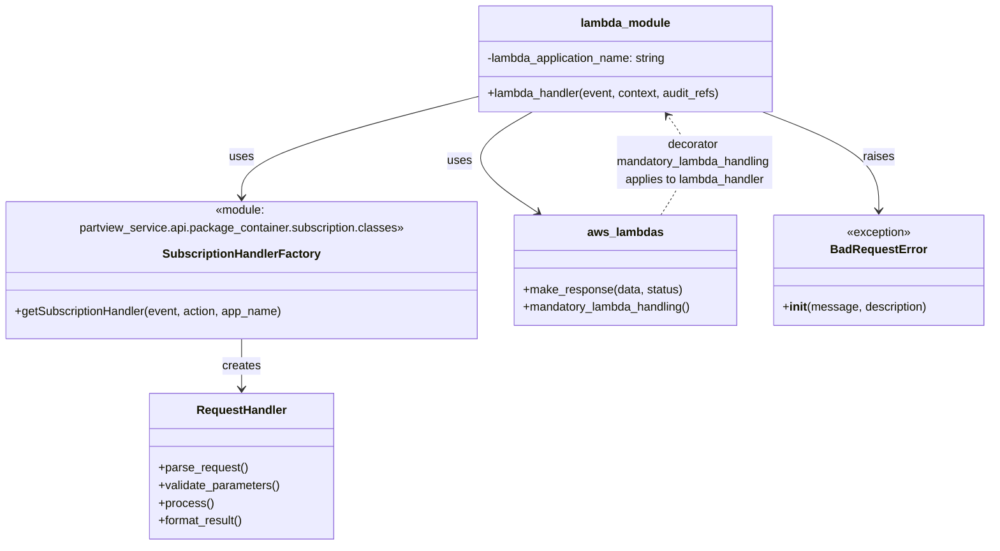

# Diagram: partview_core/partview_service/partview_service/api/package_container/subscription/update_subscription.py


> Auto-generated by Obscura crawlers

## Diagram 1

```mermaid
flowchart LR
    A[lambda_handler(event, context, audit_refs)] --> B{pathParameters.subscription_id exists?}
    B -- yes --> C[SubscriptionHandlerFactory.getSubscriptionHandler(event, "update", lambda_application_name)]
    C --> D[request_handler.parse_request()]
    D --> E[request_handler.validate_parameters()]
    E --> F[request_handler.process()]
    F --> G[request_handler.format_result()]
    G --> H[make_response(data, status)]
    B -- no --> I[AssertionError]
    I --> J[Raise BadRequestError(message)]
    J --> K[Lambda exits with error]
```

> SVG rendering failed for this diagram.

## Diagram 2



### SVG

<svg id="container" width="1355.2109375" xmlns="http://www.w3.org/2000/svg" class="classDiagram" height="704" viewBox="0 0 1355.2109375 704" role="graphics-document document" aria-roledescription="class"><style>#container{font-family:"trebuchet ms",verdana,arial,sans-serif;font-size:16px;fill:#333;}@keyframes edge-animation-frame{from{stroke-dashoffset:0;}}@keyframes dash{to{stroke-dashoffset:0;}}#container .edge-animation-slow{stroke-dasharray:9,5!important;stroke-dashoffset:900;animation:dash 50s linear infinite;stroke-linecap:round;}#container .edge-animation-fast{stroke-dasharray:9,5!important;stroke-dashoffset:900;animation:dash 20s linear infinite;stroke-linecap:round;}#container .error-icon{fill:#552222;}#container .error-text{fill:#552222;stroke:#552222;}#container .edge-thickness-normal{stroke-width:1px;}#container .edge-thickness-thick{stroke-width:3.5px;}#container .edge-pattern-solid{stroke-dasharray:0;}#container .edge-thickness-invisible{stroke-width:0;fill:none;}#container .edge-pattern-dashed{stroke-dasharray:3;}#container .edge-pattern-dotted{stroke-dasharray:2;}#container .marker{fill:#333333;stroke:#333333;}#container .marker.cross{stroke:#333333;}#container svg{font-family:"trebuchet ms",verdana,arial,sans-serif;font-size:16px;}#container p{margin:0;}#container g.classGroup text{fill:#9370DB;stroke:none;font-family:"trebuchet ms",verdana,arial,sans-serif;font-size:10px;}#container g.classGroup text .title{font-weight:bolder;}#container .nodeLabel,#container .edgeLabel{color:#131300;}#container .edgeLabel .label rect{fill:#ECECFF;}#container .label text{fill:#131300;}#container .labelBkg{background:#ECECFF;}#container .edgeLabel .label span{background:#ECECFF;}#container .classTitle{font-weight:bolder;}#container .node rect,#container .node circle,#container .node ellipse,#container .node polygon,#container .node path{fill:#ECECFF;stroke:#9370DB;stroke-width:1px;}#container .divider{stroke:#9370DB;stroke-width:1;}#container g.clickable{cursor:pointer;}#container g.classGroup rect{fill:#ECECFF;stroke:#9370DB;}#container g.classGroup line{stroke:#9370DB;stroke-width:1;}#container .classLabel .box{stroke:none;stroke-width:0;fill:#ECECFF;opacity:0.5;}#container .classLabel .label{fill:#9370DB;font-size:10px;}#container .relation{stroke:#333333;stroke-width:1;fill:none;}#container .dashed-line{stroke-dasharray:3;}#container .dotted-line{stroke-dasharray:1 2;}#container #compositionStart,#container .composition{fill:#333333!important;stroke:#333333!important;stroke-width:1;}#container #compositionEnd,#container .composition{fill:#333333!important;stroke:#333333!important;stroke-width:1;}#container #dependencyStart,#container .dependency{fill:#333333!important;stroke:#333333!important;stroke-width:1;}#container #dependencyStart,#container .dependency{fill:#333333!important;stroke:#333333!important;stroke-width:1;}#container #extensionStart,#container .extension{fill:transparent!important;stroke:#333333!important;stroke-width:1;}#container #extensionEnd,#container .extension{fill:transparent!important;stroke:#333333!important;stroke-width:1;}#container #aggregationStart,#container .aggregation{fill:transparent!important;stroke:#333333!important;stroke-width:1;}#container #aggregationEnd,#container .aggregation{fill:transparent!important;stroke:#333333!important;stroke-width:1;}#container #lollipopStart,#container .lollipop{fill:#ECECFF!important;stroke:#333333!important;stroke-width:1;}#container #lollipopEnd,#container .lollipop{fill:#ECECFF!important;stroke:#333333!important;stroke-width:1;}#container .edgeTerminals{font-size:11px;line-height:initial;}#container .classTitleText{text-anchor:middle;font-size:18px;fill:#333;}#container .label-icon{display:inline-block;height:1em;overflow:visible;vertical-align:-0.125em;}#container .node .label-icon path{fill:currentColor;stroke:revert;stroke-width:revert;}#container :root{--mermaid-font-family:"trebuchet ms",verdana,arial,sans-serif;}</style><g><defs><marker id="container_class-aggregationStart" class="marker aggregation class" refX="18" refY="7" markerWidth="190" markerHeight="240" orient="auto"><path d="M 18,7 L9,13 L1,7 L9,1 Z"></path></marker></defs><defs><marker id="container_class-aggregationEnd" class="marker aggregation class" refX="1" refY="7" markerWidth="20" markerHeight="28" orient="auto"><path d="M 18,7 L9,13 L1,7 L9,1 Z"></path></marker></defs><defs><marker id="container_class-extensionStart" class="marker extension class" refX="18" refY="7" markerWidth="190" markerHeight="240" orient="auto"><path d="M 1,7 L18,13 V 1 Z"></path></marker></defs><defs><marker id="container_class-extensionEnd" class="marker extension class" refX="1" refY="7" markerWidth="20" markerHeight="28" orient="auto"><path d="M 1,1 V 13 L18,7 Z"></path></marker></defs><defs><marker id="container_class-compositionStart" class="marker composition class" refX="18" refY="7" markerWidth="190" markerHeight="240" orient="auto"><path d="M 18,7 L9,13 L1,7 L9,1 Z"></path></marker></defs><defs><marker id="container_class-compositionEnd" class="marker composition class" refX="1" refY="7" markerWidth="20" markerHeight="28" orient="auto"><path d="M 18,7 L9,13 L1,7 L9,1 Z"></path></marker></defs><defs><marker id="container_class-dependencyStart" class="marker dependency class" refX="6" refY="7" markerWidth="190" markerHeight="240" orient="auto"><path d="M 5,7 L9,13 L1,7 L9,1 Z"></path></marker></defs><defs><marker id="container_class-dependencyEnd" class="marker dependency class" refX="13" refY="7" markerWidth="20" markerHeight="28" orient="auto"><path d="M 18,7 L9,13 L14,7 L9,1 Z"></path></marker></defs><defs><marker id="container_class-lollipopStart" class="marker lollipop class" refX="13" refY="7" markerWidth="190" markerHeight="240" orient="auto"><circle stroke="black" fill="transparent" cx="7" cy="7" r="6"></circle></marker></defs><defs><marker id="container_class-lollipopEnd" class="marker lollipop class" refX="1" refY="7" markerWidth="190" markerHeight="240" orient="auto"><circle stroke="black" fill="transparent" cx="7" cy="7" r="6"></circle></marker></defs><g class="root"><g class="clusters"></g><g class="edgePaths"><path d="M333.898,424L333.898,430.167C333.898,436.333,333.898,448.667,333.898,460C333.898,471.333,333.898,481.667,333.898,486.833L333.898,492" id="id_SubscriptionHandlerFactory_RequestHandler_1" class="edge-thickness-normal edge-pattern-solid relation" style=";;;" data-edge="true" data-et="edge" data-id="id_SubscriptionHandlerFactory_RequestHandler_1" data-points="W3sieCI6MzMzLjg5ODQzNzUsInkiOjQyNH0seyJ4IjozMzMuODk4NDM3NSwieSI6NDYxfSx7IngiOjMzMy44OTg0Mzc1LCJ5Ijo0OTh9XQ==" marker-end="url(#container_class-dependencyEnd)"></path><path d="M660.086,130.931L605.721,144.609C551.357,158.287,442.628,185.644,388.263,208.488C333.898,231.333,333.898,249.667,333.898,258.833L333.898,268" id="id_lambda_module_SubscriptionHandlerFactory_2" class="edge-thickness-normal edge-pattern-solid relation" style=";;;" data-edge="true" data-et="edge" data-id="id_lambda_module_SubscriptionHandlerFactory_2" data-points="W3sieCI6NjYwLjA4NTkzNzUsInkiOjEzMC45MzA2NzA2MDc3OTYwNn0seyJ4IjozMzMuODk4NDM3NSwieSI6MjEzfSx7IngiOjMzMy44OTg0Mzc1LCJ5IjoyNzR9XQ==" marker-end="url(#container_class-dependencyEnd)"></path><path d="M733.77,152L715.591,162.167C697.412,172.333,661.055,192.667,659.786,212.504C658.517,232.34,692.336,251.681,709.246,261.351L726.156,271.021" id="id_lambda_module_aws_lambdas_3" class="edge-thickness-normal edge-pattern-solid relation" style=";;;" data-edge="true" data-et="edge" data-id="id_lambda_module_aws_lambdas_3" data-points="W3sieCI6NzMzLjc3MDA1OTkxNTQxMzUsInkiOjE1Mn0seyJ4Ijo2MjQuNjk3MjY1NjI1LCJ5IjoyMTN9LHsieCI6NzMxLjM2NDA0MjM5NDMwMTUsInkiOjI3NH1d" marker-end="url(#container_class-dependencyEnd)"></path><path d="M1048.579,152L1074.852,162.167C1101.125,172.333,1153.672,192.667,1179.945,212C1206.219,231.333,1206.219,249.667,1206.219,258.833L1206.219,268" id="id_lambda_module_BadRequestError_4" class="edge-thickness-normal edge-pattern-solid relation" style=";;;" data-edge="true" data-et="edge" data-id="id_lambda_module_BadRequestError_4" data-points="W3sieCI6MTA0OC41Nzg2ODMwMzU3MTQyLCJ5IjoxNTJ9LHsieCI6MTIwNi4yMTg3NSwieSI6MjEzfSx7IngiOjEyMDYuMjE4NzUsInkiOjI3NH1d" marker-end="url(#container_class-dependencyEnd)"></path><path d="M915.861,274L923.093,263.833C930.325,253.667,944.788,233.333,945.213,213.809C945.639,194.284,932.025,175.568,925.218,166.21L918.412,156.852" id="id_aws_lambdas_lambda_module_5" class="edge-thickness-normal edge-pattern-dashed relation" style=";;;" data-edge="true" data-et="edge" data-id="id_aws_lambdas_lambda_module_5" data-points="W3sieCI6OTE1Ljg2MTExMjcwNjgwMTUsInkiOjI3NH0seyJ4Ijo5NTkuMjUxOTUzMTI1LCJ5IjoyMTN9LHsieCI6OTE0Ljg4MjM3MTk0NTQ4ODcsInkiOjE1Mn1d" marker-end="url(#container_class-dependencyEnd)"></path></g><g class="edgeLabels"><g class="edgeLabel" transform="translate(333.8984375, 461)"><g class="label" data-id="id_SubscriptionHandlerFactory_RequestHandler_1" transform="translate(-26.171875, -12)"><foreignObject width="52.34375" height="24"><div xmlns="http://www.w3.org/1999/xhtml" class="labelBkg" style="display: table-cell; white-space: nowrap; line-height: 1.5; max-width: 200px; text-align: center;"><span class="edgeLabel"><p>creates</p></span></div></foreignObject></g></g><g class="edgeLabel" transform="translate(333.8984375, 213)"><g class="label" data-id="id_lambda_module_SubscriptionHandlerFactory_2" transform="translate(-16.4921875, -12)"><foreignObject width="32.984375" height="24"><div xmlns="http://www.w3.org/1999/xhtml" class="labelBkg" style="display: table-cell; white-space: nowrap; line-height: 1.5; max-width: 200px; text-align: center;"><span class="edgeLabel"><p>uses</p></span></div></foreignObject></g></g><g class="edgeLabel" transform="translate(624.697265625, 213)"><g class="label" data-id="id_lambda_module_aws_lambdas_3" transform="translate(-16.4921875, -12)"><foreignObject width="32.984375" height="24"><div xmlns="http://www.w3.org/1999/xhtml" class="labelBkg" style="display: table-cell; white-space: nowrap; line-height: 1.5; max-width: 200px; text-align: center;"><span class="edgeLabel"><p>uses</p></span></div></foreignObject></g></g><g class="edgeLabel" transform="translate(1206.21875, 213)"><g class="label" data-id="id_lambda_module_BadRequestError_4" transform="translate(-21.25, -12)"><foreignObject width="42.5" height="24"><div xmlns="http://www.w3.org/1999/xhtml" class="labelBkg" style="display: table-cell; white-space: nowrap; line-height: 1.5; max-width: 200px; text-align: center;"><span class="edgeLabel"><p>raises</p></span></div></foreignObject></g></g><g class="edgeLabel" transform="translate(959.08386, 212.7689)"><g class="label" data-id="id_aws_lambdas_lambda_module_5" transform="translate(-108.9765625, -36)"><foreignObject width="217.953125" height="72"><div xmlns="http://www.w3.org/1999/xhtml" class="labelBkg" style="display: table; white-space: break-spaces; line-height: 1.5; max-width: 200px; text-align: center; width: 200px;"><span class="edgeLabel"><p>decorator mandatory_lambda_handling applies to lambda_handler</p></span></div></foreignObject></g></g></g><g class="nodes"><g class="node default" id="classId-SubscriptionHandlerFactory-0" transform="translate(333.8984375, 349)"><g class="basic label-container"><path d="M-325.8984375 -75 L325.8984375 -75 L325.8984375 75 L-325.8984375 75" stroke="none" stroke-width="0" fill="#ECECFF" style=""></path><path d="M-325.8984375 -75 C-96.3438816698081 -75, 133.2106741603838 -75, 325.8984375 -75 M-325.8984375 -75 C-184.61527790505028 -75, -43.332118310100554 -75, 325.8984375 -75 M325.8984375 -75 C325.8984375 -39.00717173386213, 325.8984375 -3.0143434677242595, 325.8984375 75 M325.8984375 -75 C325.8984375 -40.861026704737085, 325.8984375 -6.722053409474171, 325.8984375 75 M325.8984375 75 C105.42537551903573 75, -115.04768646192855 75, -325.8984375 75 M325.8984375 75 C129.78831100632138 75, -66.32181548735724 75, -325.8984375 75 M-325.8984375 75 C-325.8984375 26.71470592918518, -325.8984375 -21.570588141629642, -325.8984375 -75 M-325.8984375 75 C-325.8984375 16.278285596980417, -325.8984375 -42.443428806039165, -325.8984375 -75" stroke="#9370DB" stroke-width="1.3" fill="none" stroke-dasharray="0 0" style=""></path></g><g class="annotation-group text" transform="translate(-258.84375, -51)"><g class="label" style="" transform="translate(0,-12)"><foreignObject width="517.6875" height="24"><div xmlns="http://www.w3.org/1999/xhtml" style="display: table-cell; white-space: nowrap; line-height: 1.5; max-width: 568px; text-align: center;"><span class="nodeLabel markdown-node-label" style=""><p>«module: partview_service.api.package_container.subscription.classes»</p></span></div></foreignObject></g></g><g class="label-group text" transform="translate(-102.1875, -27)"><g class="label" style="font-weight: bolder" transform="translate(0,-12)"><foreignObject width="204.375" height="24"><div xmlns="http://www.w3.org/1999/xhtml" style="display: table-cell; white-space: nowrap; line-height: 1.5; max-width: 252px; text-align: center;"><span class="nodeLabel markdown-node-label" style=""><p>SubscriptionHandlerFactory</p></span></div></foreignObject></g></g><g class="members-group text" transform="translate(-313.8984375, 21)"></g><g class="methods-group text" transform="translate(-313.8984375, 51)"><g class="label" style="" transform="translate(0,-12)"><foreignObject width="368.953125" height="24"><div xmlns="http://www.w3.org/1999/xhtml" style="display: table-cell; white-space: nowrap; line-height: 1.5; max-width: 426px; text-align: center;"><span class="nodeLabel markdown-node-label" style=""><p>+getSubscriptionHandler(event, action, app_name)</p></span></div></foreignObject></g></g><g class="divider" style=""><path d="M-325.8984375 -3 C-115.28828619139216 -3, 95.32186511721568 -3, 325.8984375 -3 M-325.8984375 -3 C-159.30268630520007 -3, 7.2930648895998615 -3, 325.8984375 -3" stroke="#9370DB" stroke-width="1.3" fill="none" stroke-dasharray="0 0" style=""></path></g><g class="divider" style=""><path d="M-325.8984375 21 C-92.30407412934073 21, 141.29028924131853 21, 325.8984375 21 M-325.8984375 21 C-145.8695241814046 21, 34.15938913719077 21, 325.8984375 21" stroke="#9370DB" stroke-width="1.3" fill="none" stroke-dasharray="0 0" style=""></path></g></g><g class="node default" id="classId-RequestHandler-1" transform="translate(333.8984375, 597)"><g class="basic label-container"><path d="M-124.80859375 -99 L124.80859375 -99 L124.80859375 99 L-124.80859375 99" stroke="none" stroke-width="0" fill="#ECECFF" style=""></path><path d="M-124.80859375 -99 C-45.44837452356478 -99, 33.91184470287044 -99, 124.80859375 -99 M-124.80859375 -99 C-28.27129327990322 -99, 68.26600719019356 -99, 124.80859375 -99 M124.80859375 -99 C124.80859375 -49.02265585766185, 124.80859375 0.9546882846762941, 124.80859375 99 M124.80859375 -99 C124.80859375 -47.3371813041641, 124.80859375 4.325637391671805, 124.80859375 99 M124.80859375 99 C40.50988052864277 99, -43.788832692714465 99, -124.80859375 99 M124.80859375 99 C36.306003318890404 99, -52.19658711221919 99, -124.80859375 99 M-124.80859375 99 C-124.80859375 31.67361892072249, -124.80859375 -35.65276215855502, -124.80859375 -99 M-124.80859375 99 C-124.80859375 53.90280580805563, -124.80859375 8.805611616111264, -124.80859375 -99" stroke="#9370DB" stroke-width="1.3" fill="none" stroke-dasharray="0 0" style=""></path></g><g class="annotation-group text" transform="translate(0, -75)"></g><g class="label-group text" transform="translate(-59.0703125, -75)"><g class="label" style="font-weight: bolder" transform="translate(0,-12)"><foreignObject width="118.140625" height="24"><div xmlns="http://www.w3.org/1999/xhtml" style="display: table-cell; white-space: nowrap; line-height: 1.5; max-width: 168px; text-align: center;"><span class="nodeLabel markdown-node-label" style=""><p>RequestHandler</p></span></div></foreignObject></g></g><g class="members-group text" transform="translate(-112.80859375, -27)"></g><g class="methods-group text" transform="translate(-112.80859375, 3)"><g class="label" style="" transform="translate(0,-12)"><foreignObject width="121.796875" height="24"><div xmlns="http://www.w3.org/1999/xhtml" style="display: table-cell; white-space: nowrap; line-height: 1.5; max-width: 179px; text-align: center;"><span class="nodeLabel markdown-node-label" style=""><p>+parse_request()</p></span></div></foreignObject></g><g class="label" style="" transform="translate(0,12)"><foreignObject width="166.546875" height="24"><div xmlns="http://www.w3.org/1999/xhtml" style="display: table-cell; white-space: nowrap; line-height: 1.5; max-width: 224px; text-align: center;"><span class="nodeLabel markdown-node-label" style=""><p>+validate_parameters()</p></span></div></foreignObject></g><g class="label" style="" transform="translate(0,36)"><foreignObject width="73.734375" height="24"><div xmlns="http://www.w3.org/1999/xhtml" style="display: table-cell; white-space: nowrap; line-height: 1.5; max-width: 131px; text-align: center;"><span class="nodeLabel markdown-node-label" style=""><p>+process()</p></span></div></foreignObject></g><g class="label" style="" transform="translate(0,60)"><foreignObject width="117.015625" height="24"><div xmlns="http://www.w3.org/1999/xhtml" style="display: table-cell; white-space: nowrap; line-height: 1.5; max-width: 174px; text-align: center;"><span class="nodeLabel markdown-node-label" style=""><p>+format_result()</p></span></div></foreignObject></g></g><g class="divider" style=""><path d="M-124.80859375 -51 C-61.697980947223236 -51, 1.4126318555535278 -51, 124.80859375 -51 M-124.80859375 -51 C-53.75907512477254 -51, 17.290443500454927 -51, 124.80859375 -51" stroke="#9370DB" stroke-width="1.3" fill="none" stroke-dasharray="0 0" style=""></path></g><g class="divider" style=""><path d="M-124.80859375 -27 C-64.95274633806932 -27, -5.09689892613865 -27, 124.80859375 -27 M-124.80859375 -27 C-49.27056027278934 -27, 26.26747320442132 -27, 124.80859375 -27" stroke="#9370DB" stroke-width="1.3" fill="none" stroke-dasharray="0 0" style=""></path></g></g><g class="node default" id="classId-lambda_module-2" transform="translate(862.51171875, 80)"><g class="basic label-container"><path d="M-202.42578125 -72 L202.42578125 -72 L202.42578125 72 L-202.42578125 72" stroke="none" stroke-width="0" fill="#ECECFF" style=""></path><path d="M-202.42578125 -72 C-109.83602352271222 -72, -17.24626579542445 -72, 202.42578125 -72 M-202.42578125 -72 C-62.396234944918035 -72, 77.63331136016393 -72, 202.42578125 -72 M202.42578125 -72 C202.42578125 -38.61788960695966, 202.42578125 -5.235779213919315, 202.42578125 72 M202.42578125 -72 C202.42578125 -37.019014574584126, 202.42578125 -2.0380291491682527, 202.42578125 72 M202.42578125 72 C77.60090286183778 72, -47.22397552632444 72, -202.42578125 72 M202.42578125 72 C69.22810369637557 72, -63.96957385724886 72, -202.42578125 72 M-202.42578125 72 C-202.42578125 38.7938225994461, -202.42578125 5.587645198892204, -202.42578125 -72 M-202.42578125 72 C-202.42578125 21.91599084208606, -202.42578125 -28.16801831582788, -202.42578125 -72" stroke="#9370DB" stroke-width="1.3" fill="none" stroke-dasharray="0 0" style=""></path></g><g class="annotation-group text" transform="translate(0, -48)"></g><g class="label-group text" transform="translate(-59.1640625, -48)"><g class="label" style="font-weight: bolder" transform="translate(0,-12)"><foreignObject width="118.328125" height="24"><div xmlns="http://www.w3.org/1999/xhtml" style="display: table-cell; white-space: nowrap; line-height: 1.5; max-width: 168px; text-align: center;"><span class="nodeLabel markdown-node-label" style=""><p>lambda_module</p></span></div></foreignObject></g></g><g class="members-group text" transform="translate(-190.42578125, 0)"><g class="label" style="" transform="translate(0,-12)"><foreignObject width="249.90625" height="24"><div xmlns="http://www.w3.org/1999/xhtml" style="display: table-cell; white-space: nowrap; line-height: 1.5; max-width: 308px; text-align: center;"><span class="nodeLabel markdown-node-label" style=""><p>-lambda_application_name: string</p></span></div></foreignObject></g></g><g class="methods-group text" transform="translate(-190.42578125, 48)"><g class="label" style="" transform="translate(0,-12)"><foreignObject width="321.6875" height="24"><div xmlns="http://www.w3.org/1999/xhtml" style="display: table-cell; white-space: nowrap; line-height: 1.5; max-width: 379px; text-align: center;"><span class="nodeLabel markdown-node-label" style=""><p>+lambda_handler(event, context, audit_refs)</p></span></div></foreignObject></g></g><g class="divider" style=""><path d="M-202.42578125 -24 C-66.19298771351646 -24, 70.03980582296708 -24, 202.42578125 -24 M-202.42578125 -24 C-41.92387478001271 -24, 118.57803168997458 -24, 202.42578125 -24" stroke="#9370DB" stroke-width="1.3" fill="none" stroke-dasharray="0 0" style=""></path></g><g class="divider" style=""><path d="M-202.42578125 24 C-111.75506760871781 24, -21.084353967435618 24, 202.42578125 24 M-202.42578125 24 C-57.65221354315881 24, 87.12135416368238 24, 202.42578125 24" stroke="#9370DB" stroke-width="1.3" fill="none" stroke-dasharray="0 0" style=""></path></g></g><g class="node default" id="classId-aws_lambdas-3" transform="translate(862.51171875, 349)"><g class="basic label-container"><path d="M-152.71484375 -75 L152.71484375 -75 L152.71484375 75 L-152.71484375 75" stroke="none" stroke-width="0" fill="#ECECFF" style=""></path><path d="M-152.71484375 -75 C-33.33350671147733 -75, 86.04783032704535 -75, 152.71484375 -75 M-152.71484375 -75 C-34.55568589608383 -75, 83.60347195783234 -75, 152.71484375 -75 M152.71484375 -75 C152.71484375 -29.626692196336677, 152.71484375 15.746615607326646, 152.71484375 75 M152.71484375 -75 C152.71484375 -17.035629316758936, 152.71484375 40.92874136648213, 152.71484375 75 M152.71484375 75 C35.04673995839684 75, -82.62136383320632 75, -152.71484375 75 M152.71484375 75 C54.57089167880538 75, -43.57306039238924 75, -152.71484375 75 M-152.71484375 75 C-152.71484375 27.99266565945848, -152.71484375 -19.014668681083037, -152.71484375 -75 M-152.71484375 75 C-152.71484375 36.621158224142, -152.71484375 -1.7576835517159992, -152.71484375 -75" stroke="#9370DB" stroke-width="1.3" fill="none" stroke-dasharray="0 0" style=""></path></g><g class="annotation-group text" transform="translate(0, -51)"></g><g class="label-group text" transform="translate(-49.3515625, -51)"><g class="label" style="font-weight: bolder" transform="translate(0,-12)"><foreignObject width="98.703125" height="24"><div xmlns="http://www.w3.org/1999/xhtml" style="display: table-cell; white-space: nowrap; line-height: 1.5; max-width: 148px; text-align: center;"><span class="nodeLabel markdown-node-label" style=""><p>aws_lambdas</p></span></div></foreignObject></g></g><g class="members-group text" transform="translate(-140.71484375, -3)"></g><g class="methods-group text" transform="translate(-140.71484375, 27)"><g class="label" style="" transform="translate(0,-12)"><foreignObject width="216.96875" height="24"><div xmlns="http://www.w3.org/1999/xhtml" style="display: table-cell; white-space: nowrap; line-height: 1.5; max-width: 274px; text-align: center;"><span class="nodeLabel markdown-node-label" style=""><p>+make_response(data, status)</p></span></div></foreignObject></g><g class="label" style="" transform="translate(0,12)"><foreignObject width="232.078125" height="24"><div xmlns="http://www.w3.org/1999/xhtml" style="display: table-cell; white-space: nowrap; line-height: 1.5; max-width: 289px; text-align: center;"><span class="nodeLabel markdown-node-label" style=""><p>+mandatory_lambda_handling()</p></span></div></foreignObject></g></g><g class="divider" style=""><path d="M-152.71484375 -27 C-56.15306237299991 -27, 40.408719004000176 -27, 152.71484375 -27 M-152.71484375 -27 C-76.4358934735518 -27, -0.15694319710360105 -27, 152.71484375 -27" stroke="#9370DB" stroke-width="1.3" fill="none" stroke-dasharray="0 0" style=""></path></g><g class="divider" style=""><path d="M-152.71484375 -3 C-61.71158934881552 -3, 29.291665052368955 -3, 152.71484375 -3 M-152.71484375 -3 C-59.178430933893324 -3, 34.35798188221335 -3, 152.71484375 -3" stroke="#9370DB" stroke-width="1.3" fill="none" stroke-dasharray="0 0" style=""></path></g></g><g class="node default" id="classId-BadRequestError-4" transform="translate(1206.21875, 349)"><g class="basic label-container"><path d="M-140.9921875 -75 L140.9921875 -75 L140.9921875 75 L-140.9921875 75" stroke="none" stroke-width="0" fill="#ECECFF" style=""></path><path d="M-140.9921875 -75 C-80.8986228380779 -75, -20.805058176155796 -75, 140.9921875 -75 M-140.9921875 -75 C-29.272310571683377 -75, 82.44756635663325 -75, 140.9921875 -75 M140.9921875 -75 C140.9921875 -24.305996481594327, 140.9921875 26.388007036811345, 140.9921875 75 M140.9921875 -75 C140.9921875 -31.25035613982152, 140.9921875 12.49928772035696, 140.9921875 75 M140.9921875 75 C48.22689204042446 75, -44.53840341915108 75, -140.9921875 75 M140.9921875 75 C36.06865159580984 75, -68.85488430838032 75, -140.9921875 75 M-140.9921875 75 C-140.9921875 38.9407794498011, -140.9921875 2.8815588996021972, -140.9921875 -75 M-140.9921875 75 C-140.9921875 44.22674702979409, -140.9921875 13.45349405958818, -140.9921875 -75" stroke="#9370DB" stroke-width="1.3" fill="none" stroke-dasharray="0 0" style=""></path></g><g class="annotation-group text" transform="translate(-44.3515625, -51)"><g class="label" style="" transform="translate(0,-12)"><foreignObject width="88.703125" height="24"><div xmlns="http://www.w3.org/1999/xhtml" style="display: table-cell; white-space: nowrap; line-height: 1.5; max-width: 139px; text-align: center;"><span class="nodeLabel markdown-node-label" style=""><p>«exception»</p></span></div></foreignObject></g></g><g class="label-group text" transform="translate(-62.28125, -27)"><g class="label" style="font-weight: bolder" transform="translate(0,-12)"><foreignObject width="124.5625" height="24"><div xmlns="http://www.w3.org/1999/xhtml" style="display: table-cell; white-space: nowrap; line-height: 1.5; max-width: 174px; text-align: center;"><span class="nodeLabel markdown-node-label" style=""><p>BadRequestError</p></span></div></foreignObject></g></g><g class="members-group text" transform="translate(-128.9921875, 21)"></g><g class="methods-group text" transform="translate(-128.9921875, 51)"><g class="label" style="" transform="translate(0,-12)"><foreignObject width="195.703125" height="24"><div xmlns="http://www.w3.org/1999/xhtml" style="display: table-cell; white-space: nowrap; line-height: 1.5; max-width: 284px; text-align: center;"><span class="nodeLabel markdown-node-label" style=""><p>+<strong>init</strong>(message, description)</p></span></div></foreignObject></g></g><g class="divider" style=""><path d="M-140.9921875 -3 C-36.601637384900414 -3, 67.78891273019917 -3, 140.9921875 -3 M-140.9921875 -3 C-48.63328057702023 -3, 43.72562634595954 -3, 140.9921875 -3" stroke="#9370DB" stroke-width="1.3" fill="none" stroke-dasharray="0 0" style=""></path></g><g class="divider" style=""><path d="M-140.9921875 21 C-76.99144130178303 21, -12.990695103566054 21, 140.9921875 21 M-140.9921875 21 C-67.10698858927918 21, 6.778210321441634 21, 140.9921875 21" stroke="#9370DB" stroke-width="1.3" fill="none" stroke-dasharray="0 0" style=""></path></g></g></g></g></g></svg>
