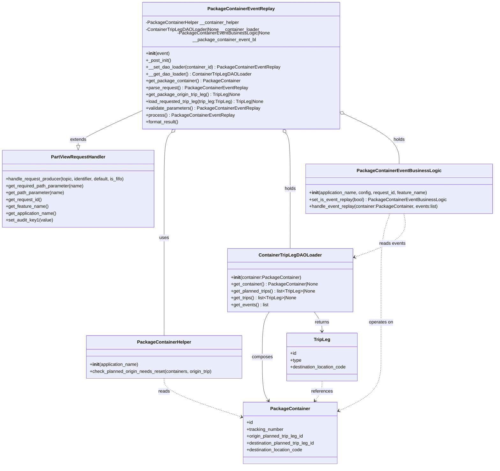
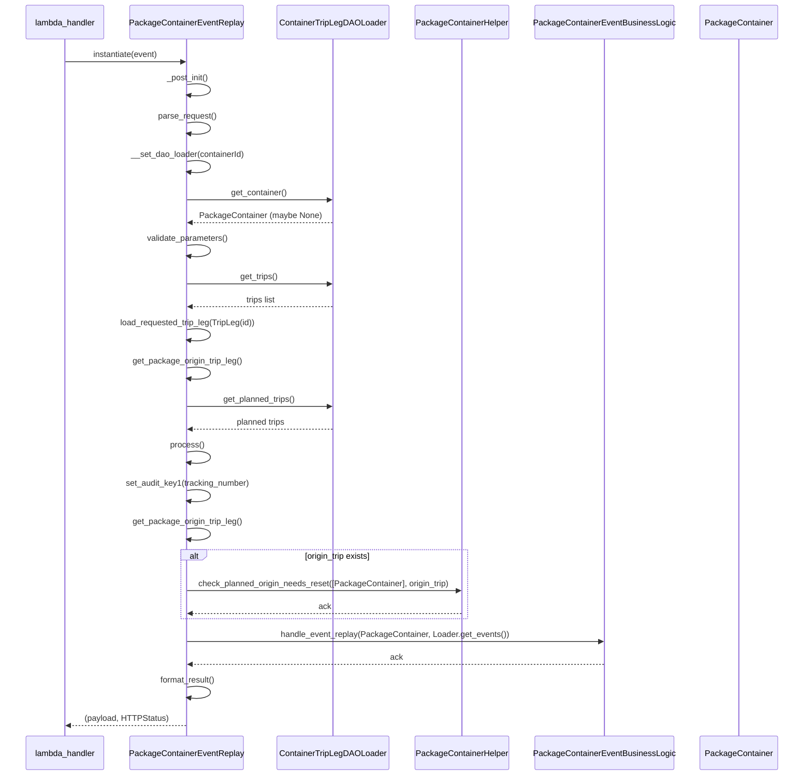

# Diagram: partview_core/partview_service/partview_service/api/package_container/trip_leg/event/replay/package_container_event_replay.py

> Auto-generated by Obscura crawlers

## Diagram 1

### SVG

<svg id="container" width="1731.951171875" xmlns="http://www.w3.org/2000/svg" class="classDiagram" height="1620" viewBox="0 0 1731.951171875 1620" role="graphics-document document" aria-roledescription="class"><g><defs><marker id="container_class-aggregationStart" class="marker aggregation class" refX="18" refY="7" markerWidth="190" markerHeight="240" orient="auto"><path d="M 18,7 L9,13 L1,7 L9,1 Z"></path></marker></defs><defs><marker id="container_class-aggregationEnd" class="marker aggregation class" refX="1" refY="7" markerWidth="20" markerHeight="28" orient="auto"><path d="M 18,7 L9,13 L1,7 L9,1 Z"></path></marker></defs><defs><marker id="container_class-extensionStart" class="marker extension class" refX="18" refY="7" markerWidth="190" markerHeight="240" orient="auto"><path d="M 1,7 L18,13 V 1 Z"></path></marker></defs><defs><marker id="container_class-extensionEnd" class="marker extension class" refX="1" refY="7" markerWidth="20" markerHeight="28" orient="auto"><path d="M 1,1 V 13 L18,7 Z"></path></marker></defs><defs><marker id="container_class-compositionStart" class="marker composition class" refX="18" refY="7" markerWidth="190" markerHeight="240" orient="auto"><path d="M 18,7 L9,13 L1,7 L9,1 Z"></path></marker></defs><defs><marker id="container_class-compositionEnd" class="marker composition class" refX="1" refY="7" markerWidth="20" markerHeight="28" orient="auto"><path d="M 18,7 L9,13 L1,7 L9,1 Z"></path></marker></defs><defs><marker id="container_class-dependencyStart" class="marker dependency class" refX="6" refY="7" markerWidth="190" markerHeight="240" orient="auto"><path d="M 5,7 L9,13 L1,7 L9,1 Z"></path></marker></defs><defs><marker id="container_class-dependencyEnd" class="marker dependency class" refX="13" refY="7" markerWidth="20" markerHeight="28" orient="auto"><path d="M 18,7 L9,13 L14,7 L9,1 Z"></path></marker></defs><defs><marker id="container_class-lollipopStart" class="marker lollipop class" refX="13" refY="7" markerWidth="190" markerHeight="240" orient="auto"><circle stroke="black" fill="transparent" cx="7" cy="7" r="6"></circle></marker></defs><defs><marker id="container_class-lollipopEnd" class="marker lollipop class" refX="1" refY="7" markerWidth="190" markerHeight="240" orient="auto"><circle stroke="black" fill="transparent" cx="7" cy="7" r="6"></circle></marker></defs><g class="root"><g class="clusters"></g><g class="edgePaths"><path d="M516.951,373.081L477.358,390.401C437.764,407.721,358.577,442.36,318.984,462.972C279.391,483.583,279.391,490.167,279.391,493.458L279.391,496.75" id="id_PackageContainerEventReplay_PartViewRequestHandler_1" class="edge-thickness-normal edge-pattern-solid relation" style=";;;" data-edge="true" data-et="edge" data-id="id_PackageContainerEventReplay_PartViewRequestHandler_1" data-points="W3sieCI6NTE2Ljk1MTE3MTg3NSwieSI6MzczLjA4MDg0ODcwNzExNjR9LHsieCI6Mjc5LjM5MDYyNSwieSI6NDc3fSx7IngiOjI3OS4zOTA2MjUsInkiOjUxNH1d" marker-end="url(#container_class-extensionEnd)"></path><path d="M612.925,451.749L608.401,455.958C603.877,460.166,594.829,468.583,590.305,501.458C585.781,534.333,585.781,591.667,585.781,649C585.781,706.333,585.781,763.667,585.781,817C585.781,870.333,585.781,919.667,585.781,969C585.781,1018.333,585.781,1067.667,585.781,1100C585.781,1132.333,585.781,1147.667,585.781,1155.333L585.781,1163" id="id_PackageContainerEventReplay_PackageContainerHelper_2" class="edge-thickness-normal edge-pattern-solid relation" style=";;;" data-edge="true" data-et="edge" data-id="id_PackageContainerEventReplay_PackageContainerHelper_2" data-points="W3sieCI6NjI1LjU1NTYyMTYwMzI2MDksInkiOjQ0MH0seyJ4Ijo1ODUuNzgxMjUsInkiOjQ3N30seyJ4Ijo1ODUuNzgxMjUsInkiOjY0OX0seyJ4Ijo1ODUuNzgxMjUsInkiOjgyMX0seyJ4Ijo1ODUuNzgxMjUsInkiOjk2OX0seyJ4Ijo1ODUuNzgxMjUsInkiOjExMTd9LHsieCI6NTg1Ljc4MTI1LCJ5IjoxMTYzfV0=" marker-start="url(#container_class-aggregationStart)"></path><path d="M1015.303,454.236L1017.9,458.03C1020.496,461.824,1025.688,469.412,1028.285,501.873C1030.881,534.333,1030.881,591.667,1030.881,649C1030.881,706.333,1030.881,763.667,1030.881,798.5C1030.881,833.333,1030.881,845.667,1030.881,851.833L1030.881,858" id="id_PackageContainerEventReplay_ContainerTripLegDAOLoader_3" class="edge-thickness-normal edge-pattern-solid relation" style=";;;" data-edge="true" data-et="edge" data-id="id_PackageContainerEventReplay_ContainerTripLegDAOLoader_3" data-points="W3sieCI6MTAwNS41NjE2MTIyMTU5MDkxLCJ5Ijo0NDB9LHsieCI6MTAzMC44ODA4NTkzNzUsInkiOjQ3N30seyJ4IjoxMDMwLjg4MDg1OTM3NSwieSI6NjQ5fSx7IngiOjEwMzAuODgwODU5Mzc1LCJ5Ijo4MjF9LHsieCI6MTAzMC44ODA4NTkzNzUsInkiOjg1OH1d" marker-start="url(#container_class-aggregationStart)"></path><path d="M1214.21,388.793L1246.01,403.494C1277.81,418.195,1341.41,447.598,1373.21,476.465C1405.01,505.333,1405.01,533.667,1405.01,547.833L1405.01,562" id="id_PackageContainerEventReplay_PackageContainerEventBusinessLogic_4" class="edge-thickness-normal edge-pattern-solid relation" style=";;;" data-edge="true" data-et="edge" data-id="id_PackageContainerEventReplay_PackageContainerEventBusinessLogic_4" data-points="W3sieCI6MTE5OC41NTI3MzQzNzUsInkiOjM4MS41NTM4OTA4NDc4MzUxfSx7IngiOjE0MDUuMDA5NzY1NjI1LCJ5Ijo0Nzd9LHsieCI6MTQwNS4wMDk3NjU2MjUsInkiOjU2Mn1d" marker-start="url(#container_class-aggregationStart)"></path><path d="M956.75,1080L952.631,1086.167C948.513,1092.333,940.276,1104.667,936.157,1131C932.039,1157.333,932.039,1197.667,932.039,1238C932.039,1278.333,932.039,1318.667,935.679,1344.174C939.32,1369.681,946.601,1380.362,950.241,1385.702L953.881,1391.042" id="id_ContainerTripLegDAOLoader_PackageContainer_5" class="edge-thickness-normal edge-pattern-solid relation" style=";;;" data-edge="true" data-et="edge" data-id="id_ContainerTripLegDAOLoader_PackageContainer_5" data-points="W3sieCI6OTU2Ljc0OTUxMTcxODc1LCJ5IjoxMDgwfSx7IngiOjkzMi4wMzkwNjI1LCJ5IjoxMTE3fSx7IngiOjkzMi4wMzkwNjI1LCJ5IjoxMjM4fSx7IngiOjkzMi4wMzkwNjI1LCJ5IjoxMzU5fSx7IngiOjk1Ny4yNjA3NjIzOTIyNDE0LCJ5IjoxMzk2fV0=" marker-end="url(#container_class-dependencyEnd)"></path><path d="M1110.718,1080L1115.153,1086.167C1119.589,1092.333,1128.459,1104.667,1132.895,1116C1137.33,1127.333,1137.33,1137.667,1137.33,1142.833L1137.33,1148" id="id_ContainerTripLegDAOLoader_TripLeg_6" class="edge-thickness-normal edge-pattern-solid relation" style=";;;" data-edge="true" data-et="edge" data-id="id_ContainerTripLegDAOLoader_TripLeg_6" data-points="W3sieCI6MTExMC43MTc3NzM0Mzc1LCJ5IjoxMDgwfSx7IngiOjExMzcuMzMwMDc4MTI1LCJ5IjoxMTE3fSx7IngiOjExMzcuMzMwMDc4MTI1LCJ5IjoxMTU0fV0=" marker-end="url(#container_class-dependencyEnd)"></path><path d="M1373.751,736L1368.661,750.167C1363.571,764.333,1353.391,792.667,1348.301,831.5C1343.211,870.333,1343.211,919.667,1343.211,969C1343.211,1018.333,1343.211,1067.667,1343.211,1112.5C1343.211,1157.333,1343.211,1197.667,1343.211,1238C1343.211,1278.333,1343.211,1318.667,1319.952,1349.631C1296.694,1380.596,1250.176,1402.192,1226.918,1412.989L1203.659,1423.787" id="id_PackageContainerEventBusinessLogic_PackageContainer_7" class="edge-thickness-normal edge-pattern-dashed relation" style=";;;" data-edge="true" data-et="edge" data-id="id_PackageContainerEventBusinessLogic_PackageContainer_7" data-points="W3sieCI6MTM3My43NTEwNTYwNTAxNDUzLCJ5Ijo3MzZ9LHsieCI6MTM0My4yMTA5Mzc1LCJ5Ijo4MjF9LHsieCI6MTM0My4yMTA5Mzc1LCJ5Ijo5Njl9LHsieCI6MTM0My4yMTA5Mzc1LCJ5IjoxMTE3fSx7IngiOjEzNDMuMjEwOTM3NSwieSI6MTIzOH0seyJ4IjoxMzQzLjIxMDkzNzUsInkiOjEzNTl9LHsieCI6MTE5OC4yMTY3OTY4NzUsInkiOjE0MjYuMzEzODgzMTczOTc2fV0=" marker-end="url(#container_class-dependencyEnd)"></path><path d="M1421.71,736L1424.429,750.167C1427.148,764.333,1432.587,792.667,1404.31,818.101C1376.034,843.534,1314.043,866.069,1283.047,877.336L1252.051,888.603" id="id_PackageContainerEventBusinessLogic_ContainerTripLegDAOLoader_8" class="edge-thickness-normal edge-pattern-dashed relation" style=";;;" data-edge="true" data-et="edge" data-id="id_PackageContainerEventBusinessLogic_ContainerTripLegDAOLoader_8" data-points="W3sieCI6MTQyMS43MDk1Mjk0MzMxMzk2LCJ5Ijo3MzZ9LHsieCI6MTQzOC4wMjUzOTA2MjUsInkiOjgyMX0seyJ4IjoxMjQ2LjQxMjEwOTM3NSwieSI6ODkwLjY1MjgyMjE1MTIyNDd9XQ==" marker-end="url(#container_class-dependencyEnd)"></path><path d="M585.781,1313L585.781,1320.667C585.781,1328.333,585.781,1343.667,631.124,1366.105C676.468,1388.543,767.154,1418.086,812.497,1432.857L857.84,1447.629" id="id_PackageContainerHelper_PackageContainer_9" class="edge-thickness-normal edge-pattern-dashed relation" style=";;;" data-edge="true" data-et="edge" data-id="id_PackageContainerHelper_PackageContainer_9" data-points="W3sieCI6NTg1Ljc4MTI1LCJ5IjoxMzEzfSx7IngiOjU4NS43ODEyNSwieSI6MTM1OX0seyJ4Ijo4NjMuNTQ0OTIxODc1LCJ5IjoxNDQ5LjQ4NzAwOTE0MDMzNDV9XQ==" marker-end="url(#container_class-dependencyEnd)"></path><path d="M1137.33,1322L1137.33,1328.167C1137.33,1334.333,1137.33,1346.667,1133.395,1358.194C1129.459,1369.721,1121.589,1380.442,1117.653,1385.803L1113.718,1391.163" id="id_TripLeg_PackageContainer_10" class="edge-thickness-normal edge-pattern-dashed relation" style=";;;" data-edge="true" data-et="edge" data-id="id_TripLeg_PackageContainer_10" data-points="W3sieCI6MTEzNy4zMzAwNzgxMjUsInkiOjEzMjJ9LHsieCI6MTEzNy4zMzAwNzgxMjUsInkiOjEzNTl9LHsieCI6MTExMC4xNjcxNzQwMzAxNzI0LCJ5IjoxMzk2fV0=" marker-end="url(#container_class-dependencyEnd)"></path></g><g class="edgeLabels"><g class="edgeLabel" transform="translate(279.390625, 477)"><g class="label" data-id="id_PackageContainerEventReplay_PartViewRequestHandler_1" transform="translate(-28.5078125, -12)"><foreignObject width="57.015625" height="24">

extends

</foreignObject></g></g><g class="edgeLabel" transform="translate(585.78125, 821)"><g class="label" data-id="id_PackageContainerEventReplay_PackageContainerHelper_2" transform="translate(-16.4921875, -12)"><foreignObject width="32.984375" height="24">

uses

</foreignObject></g></g><g class="edgeLabel" transform="translate(1030.880859375, 649)"><g class="label" data-id="id_PackageContainerEventReplay_ContainerTripLegDAOLoader_3" transform="translate(-20.1875, -12)"><foreignObject width="40.375" height="24">

holds

</foreignObject></g></g><g class="edgeLabel" transform="translate(1405.009765625, 477)"><g class="label" data-id="id_PackageContainerEventReplay_PackageContainerEventBusinessLogic_4" transform="translate(-20.1875, -12)"><foreignObject width="40.375" height="24">

holds

</foreignObject></g></g><g class="edgeLabel" transform="translate(932.0390625, 1238)"><g class="label" data-id="id_ContainerTripLegDAOLoader_PackageContainer_5" transform="translate(-36.453125, -12)"><foreignObject width="72.90625" height="24">

composes

</foreignObject></g></g><g class="edgeLabel" transform="translate(1137.330078125, 1117)"><g class="label" data-id="id_ContainerTripLegDAOLoader_TripLeg_6" transform="translate(-26.265625, -12)"><foreignObject width="52.53125" height="24">

returns

</foreignObject></g></g><g class="edgeLabel" transform="translate(1343.2109375, 1117)"><g class="label" data-id="id_PackageContainerEventBusinessLogic_PackageContainer_7" transform="translate(-43.2890625, -12)"><foreignObject width="86.578125" height="24">

operates on

</foreignObject></g></g><g class="edgeLabel" transform="translate(1382.89082, 841.04182)"><g class="label" data-id="id_PackageContainerEventBusinessLogic_ContainerTripLegDAOLoader_8" transform="translate(-46.03125, -12)"><foreignObject width="92.0625" height="24">

reads events

</foreignObject></g></g><g class="edgeLabel" transform="translate(585.78125, 1359)"><g class="label" data-id="id_PackageContainerHelper_PackageContainer_9" transform="translate(-20.0078125, -12)"><foreignObject width="40.015625" height="24">

reads

</foreignObject></g></g><g class="edgeLabel" transform="translate(1137.330078125, 1359)"><g class="label" data-id="id_TripLeg_PackageContainer_10" transform="translate(-37.828125, -12)"><foreignObject width="75.65625" height="24">

references

</foreignObject></g></g></g><g class="nodes"><g class="node default" id="classId-PackageContainerEventReplay-0" transform="translate(857.751953125, 224)"><g class="basic label-container"><path d="M-340.80078125 -216 L340.80078125 -216 L340.80078125 216 L-340.80078125 216" stroke="none" stroke-width="0" fill="#ECECFF" style=""></path><path d="M-340.80078125 -216 C-168.0189847993983 -216, 4.7628116512033785 -216, 340.80078125 -216 M-340.80078125 -216 C-174.70774068119906 -216, -8.614700112398111 -216, 340.80078125 -216 M340.80078125 -216 C340.80078125 -128.09234782619632, 340.80078125 -40.184695652392634, 340.80078125 216 M340.80078125 -216 C340.80078125 -80.68009281899847, 340.80078125 54.63981436200305, 340.80078125 216 M340.80078125 216 C198.37352309884164 216, 55.94626494768329 216, -340.80078125 216 M340.80078125 216 C117.41354436225302 216, -105.97369252549396 216, -340.80078125 216 M-340.80078125 216 C-340.80078125 82.6316472921877, -340.80078125 -50.73670541562461, -340.80078125 -216 M-340.80078125 216 C-340.80078125 99.95305702339807, -340.80078125 -16.093885953203852, -340.80078125 -216" stroke="#9370DB" stroke-width="1.3" fill="none" stroke-dasharray="0 0" style=""></path></g><g class="annotation-group text" transform="translate(0, -192)"></g><g class="label-group text" transform="translate(-110.4140625, -192)"><g class="label" style="font-weight: bolder" transform="translate(0,-12)"><foreignObject width="220.828125" height="24">

PackageContainerEventReplay

</foreignObject></g></g><g class="members-group text" transform="translate(-328.80078125, -144)"><g class="label" style="" transform="translate(0,-12)"><foreignObject width="327.53125" height="24">

-PackageContainerHelper __container_helper

</foreignObject></g><g class="label" style="" transform="translate(0,12)"><foreignObject width="397.953125" height="24">

-ContainerTripLegDAOLoader|None __container_loader

</foreignObject></g><g class="label" style="" transform="translate(0,36)"><foreignObject width="547.1875" height="24">

-PackageContainerEventBusinessLogic|None __package_container_event_bl

</foreignObject></g></g><g class="methods-group text" transform="translate(-328.80078125, -48)"><g class="label" style="" transform="translate(0,-12)"><foreignObject width="83.140625" height="24">

+<strong>init</strong>(event)

</foreignObject></g><g class="label" style="" transform="translate(0,12)"><foreignObject width="89.984375" height="24">

+_post_init()

</foreignObject></g><g class="label" style="" transform="translate(0,36)"><foreignObject width="465.671875" height="24">

+__set_dao_loader(container_id) : PackageContainerEventReplay

</foreignObject></g><g class="label" style="" transform="translate(0,60)"><foreignObject width="362.25" height="24">

+__get_dao_loader() : ContainerTripLegDAOLoader

</foreignObject></g><g class="label" style="" transform="translate(0,84)"><foreignObject width="325.96875" height="24">

+get_package_container() : PackageContainer

</foreignObject></g><g class="label" style="" transform="translate(0,108)"><foreignObject width="351.203125" height="24">

+parse_request() : PackageContainerEventReplay

</foreignObject></g><g class="label" style="" transform="translate(0,132)"><foreignObject width="331.328125" height="24">

+get_package_origin_trip_leg() : TripLeg|None

</foreignObject></g><g class="label" style="" transform="translate(0,156)"><foreignObject width="416.484375" height="24">

+load_requested_trip_leg(trip_leg:TripLeg) : TripLeg|None

</foreignObject></g><g class="label" style="" transform="translate(0,180)"><foreignObject width="395.953125" height="24">

+validate_parameters() : PackageContainerEventReplay

</foreignObject></g><g class="label" style="" transform="translate(0,204)"><foreignObject width="303.140625" height="24">

+process() : PackageContainerEventReplay

</foreignObject></g><g class="label" style="" transform="translate(0,228)"><foreignObject width="117.015625" height="24">

+format_result()

</foreignObject></g></g><g class="divider" style=""><path d="M-340.80078125 -168 C-175.63245290174603 -168, -10.46412455349207 -168, 340.80078125 -168 M-340.80078125 -168 C-96.6544184562467 -168, 147.4919443375066 -168, 340.80078125 -168" stroke="#9370DB" stroke-width="1.3" fill="none" stroke-dasharray="0 0" style=""></path></g><g class="divider" style=""><path d="M-340.80078125 -72 C-95.9554824442638 -72, 148.8898163614724 -72, 340.80078125 -72 M-340.80078125 -72 C-150.96740570920986 -72, 38.86596983158029 -72, 340.80078125 -72" stroke="#9370DB" stroke-width="1.3" fill="none" stroke-dasharray="0 0" style=""></path></g></g><g class="node default" id="classId-PartViewRequestHandler-1" transform="translate(279.390625, 649)"><g class="basic label-container"><path d="M-271.390625 -135 L271.390625 -135 L271.390625 135 L-271.390625 135" stroke="none" stroke-width="0" fill="#ECECFF" style=""></path><path d="M-271.390625 -135 C-103.66855987955802 -135, 64.05350524088396 -135, 271.390625 -135 M-271.390625 -135 C-146.30239467397814 -135, -21.214164347956313 -135, 271.390625 -135 M271.390625 -135 C271.390625 -29.34444878908748, 271.390625 76.31110242182504, 271.390625 135 M271.390625 -135 C271.390625 -28.18085893602988, 271.390625 78.63828212794024, 271.390625 135 M271.390625 135 C80.62256126793105 135, -110.1455024641379 135, -271.390625 135 M271.390625 135 C91.5136140589465 135, -88.363396882107 135, -271.390625 135 M-271.390625 135 C-271.390625 69.73830600331864, -271.390625 4.476612006637282, -271.390625 -135 M-271.390625 135 C-271.390625 67.99507531629882, -271.390625 0.990150632597647, -271.390625 -135" stroke="#9370DB" stroke-width="1.3" fill="none" stroke-dasharray="0 0" style=""></path></g><g class="annotation-group text" transform="translate(0, -111)"></g><g class="label-group text" transform="translate(-91.359375, -111)"><g class="label" style="font-weight: bolder" transform="translate(0,-12)"><foreignObject width="182.71875" height="24">

PartViewRequestHandler

</foreignObject></g></g><g class="members-group text" transform="translate(-259.390625, -63)"></g><g class="methods-group text" transform="translate(-259.390625, -33)"><g class="label" style="" transform="translate(0,-12)"><foreignObject width="427.421875" height="24">

+handle_request_producer(topic, identifier, default, is_fifo)

</foreignObject></g><g class="label" style="" transform="translate(0,12)"><foreignObject width="276.609375" height="24">

+get_required_path_parameter(name)

</foreignObject></g><g class="label" style="" transform="translate(0,36)"><foreignObject width="206.5" height="24">

+get_path_parameter(name)

</foreignObject></g><g class="label" style="" transform="translate(0,60)"><foreignObject width="126.90625" height="24">

+get_request_id()

</foreignObject></g><g class="label" style="" transform="translate(0,84)"><foreignObject width="149.40625" height="24">

+get_feature_name()

</foreignObject></g><g class="label" style="" transform="translate(0,108)"><foreignObject width="179.859375" height="24">

+get_application_name()

</foreignObject></g><g class="label" style="" transform="translate(0,132)"><foreignObject width="164.90625" height="24">

+set_audit_key1(value)

</foreignObject></g></g><g class="divider" style=""><path d="M-271.390625 -87 C-157.40036200806378 -87, -43.41009901612756 -87, 271.390625 -87 M-271.390625 -87 C-107.03180997335545 -87, 57.3270050532891 -87, 271.390625 -87" stroke="#9370DB" stroke-width="1.3" fill="none" stroke-dasharray="0 0" style=""></path></g><g class="divider" style=""><path d="M-271.390625 -63 C-154.32879375691385 -63, -37.26696251382768 -63, 271.390625 -63 M-271.390625 -63 C-144.16694486556332 -63, -16.943264731126646 -63, 271.390625 -63" stroke="#9370DB" stroke-width="1.3" fill="none" stroke-dasharray="0 0" style=""></path></g></g><g class="node default" id="classId-PackageContainerHelper-2" transform="translate(585.78125, 1238)"><g class="basic label-container"><path d="M-274.8046875 -75 L274.8046875 -75 L274.8046875 75 L-274.8046875 75" stroke="none" stroke-width="0" fill="#ECECFF" style=""></path><path d="M-274.8046875 -75 C-59.21418580861257 -75, 156.37631588277486 -75, 274.8046875 -75 M-274.8046875 -75 C-152.31785902396274 -75, -29.831030547925508 -75, 274.8046875 -75 M274.8046875 -75 C274.8046875 -37.295175012230196, 274.8046875 0.40964997553960814, 274.8046875 75 M274.8046875 -75 C274.8046875 -25.188779308046605, 274.8046875 24.62244138390679, 274.8046875 75 M274.8046875 75 C87.77780463383422 75, -99.24907823233156 75, -274.8046875 75 M274.8046875 75 C123.83097918233227 75, -27.142729135335458 75, -274.8046875 75 M-274.8046875 75 C-274.8046875 18.29364112308847, -274.8046875 -38.41271775382306, -274.8046875 -75 M-274.8046875 75 C-274.8046875 21.762969422360925, -274.8046875 -31.47406115527815, -274.8046875 -75" stroke="#9370DB" stroke-width="1.3" fill="none" stroke-dasharray="0 0" style=""></path></g><g class="annotation-group text" transform="translate(0, -51)"></g><g class="label-group text" transform="translate(-89.96875, -51)"><g class="label" style="font-weight: bolder" transform="translate(0,-12)"><foreignObject width="179.9375" height="24">

PackageContainerHelper

</foreignObject></g></g><g class="members-group text" transform="translate(-262.8046875, -3)"></g><g class="methods-group text" transform="translate(-262.8046875, 27)"><g class="label" style="" transform="translate(0,-12)"><foreignObject width="173.734375" height="24">

+<strong>init</strong>(application_name)

</foreignObject></g><g class="label" style="" transform="translate(0,12)"><foreignObject width="435.640625" height="24">

+check_planned_origin_needs_reset(containers, origin_trip)

</foreignObject></g></g><g class="divider" style=""><path d="M-274.8046875 -27 C-66.15100849560511 -27, 142.50267050878978 -27, 274.8046875 -27 M-274.8046875 -27 C-125.81170231320624 -27, 23.18128287358752 -27, 274.8046875 -27" stroke="#9370DB" stroke-width="1.3" fill="none" stroke-dasharray="0 0" style=""></path></g><g class="divider" style=""><path d="M-274.8046875 -3 C-159.19577587931173 -3, -43.58686425862348 -3, 274.8046875 -3 M-274.8046875 -3 C-60.058162762761526 -3, 154.68836197447695 -3, 274.8046875 -3" stroke="#9370DB" stroke-width="1.3" fill="none" stroke-dasharray="0 0" style=""></path></g></g><g class="node default" id="classId-ContainerTripLegDAOLoader-3" transform="translate(1030.880859375, 969)"><g class="basic label-container"><path d="M-215.53125 -111 L215.53125 -111 L215.53125 111 L-215.53125 111" stroke="none" stroke-width="0" fill="#ECECFF" style=""></path><path d="M-215.53125 -111 C-96.72341501995346 -111, 22.084419960093072 -111, 215.53125 -111 M-215.53125 -111 C-102.5418354048416 -111, 10.447579190316787 -111, 215.53125 -111 M215.53125 -111 C215.53125 -52.69855574314867, 215.53125 5.602888513702666, 215.53125 111 M215.53125 -111 C215.53125 -50.500314139913904, 215.53125 9.999371720172192, 215.53125 111 M215.53125 111 C76.30631490965968 111, -62.91862018068065 111, -215.53125 111 M215.53125 111 C68.58723303426342 111, -78.35678393147316 111, -215.53125 111 M-215.53125 111 C-215.53125 46.76669908986942, -215.53125 -17.46660182026116, -215.53125 -111 M-215.53125 111 C-215.53125 27.999515418508594, -215.53125 -55.00096916298281, -215.53125 -111" stroke="#9370DB" stroke-width="1.3" fill="none" stroke-dasharray="0 0" style=""></path></g><g class="annotation-group text" transform="translate(0, -87)"></g><g class="label-group text" transform="translate(-103.25, -87)"><g class="label" style="font-weight: bolder" transform="translate(0,-12)"><foreignObject width="206.5" height="24">

ContainerTripLegDAOLoader

</foreignObject></g></g><g class="members-group text" transform="translate(-203.53125, -39)"></g><g class="methods-group text" transform="translate(-203.53125, -9)"><g class="label" style="" transform="translate(0,-12)"><foreignObject width="244.5625" height="24">

+<strong>init</strong>(container:PackageContainer)

</foreignObject></g><g class="label" style="" transform="translate(0,12)"><foreignObject width="303.8125" height="24">

+get_container() : PackageContainer|None

</foreignObject></g><g class="label" style="" transform="translate(0,36)"><foreignObject width="298.71875" height="24">

+get_planned_trips() : list&lt;TripLeg&gt;|None

</foreignObject></g><g class="label" style="" transform="translate(0,60)"><foreignObject width="230.53125" height="24">

+get_trips() : list&lt;TripLeg&gt;|None

</foreignObject></g><g class="label" style="" transform="translate(0,84)"><foreignObject width="131.5" height="24">

+get_events() : list

</foreignObject></g></g><g class="divider" style=""><path d="M-215.53125 -63 C-107.79201398367532 -63, -0.05277796735063589 -63, 215.53125 -63 M-215.53125 -63 C-119.22042393028904 -63, -22.90959786057809 -63, 215.53125 -63" stroke="#9370DB" stroke-width="1.3" fill="none" stroke-dasharray="0 0" style=""></path></g><g class="divider" style=""><path d="M-215.53125 -39 C-47.76310027540271 -39, 120.00504944919459 -39, 215.53125 -39 M-215.53125 -39 C-90.46858546705324 -39, 34.59407906589351 -39, 215.53125 -39" stroke="#9370DB" stroke-width="1.3" fill="none" stroke-dasharray="0 0" style=""></path></g></g><g class="node default" id="classId-PackageContainerEventBusinessLogic-4" transform="translate(1405.009765625, 649)"><g class="basic label-container"><path d="M-318.94140625 -87 L318.94140625 -87 L318.94140625 87 L-318.94140625 87" stroke="none" stroke-width="0" fill="#ECECFF" style=""></path><path d="M-318.94140625 -87 C-72.77957088810521 -87, 173.38226447378958 -87, 318.94140625 -87 M-318.94140625 -87 C-67.20715048285967 -87, 184.52710528428065 -87, 318.94140625 -87 M318.94140625 -87 C318.94140625 -29.02160443488411, 318.94140625 28.956791130231778, 318.94140625 87 M318.94140625 -87 C318.94140625 -19.632583484446855, 318.94140625 47.73483303110629, 318.94140625 87 M318.94140625 87 C113.16626124986362 87, -92.60888375027275 87, -318.94140625 87 M318.94140625 87 C72.3491768930293 87, -174.2430524639414 87, -318.94140625 87 M-318.94140625 87 C-318.94140625 36.89101664174757, -318.94140625 -13.217966716504861, -318.94140625 -87 M-318.94140625 87 C-318.94140625 29.169426939185165, -318.94140625 -28.66114612162967, -318.94140625 -87" stroke="#9370DB" stroke-width="1.3" fill="none" stroke-dasharray="0 0" style=""></path></g><g class="annotation-group text" transform="translate(0, -63)"></g><g class="label-group text" transform="translate(-137.0703125, -63)"><g class="label" style="font-weight: bolder" transform="translate(0,-12)"><foreignObject width="274.140625" height="24">

PackageContainerEventBusinessLogic

</foreignObject></g></g><g class="members-group text" transform="translate(-306.94140625, -15)"></g><g class="methods-group text" transform="translate(-306.94140625, 15)"><g class="label" style="" transform="translate(0,-12)"><foreignObject width="419.53125" height="24">

+<strong>init</strong>(application_name, config, request_id, feature_name)

</foreignObject></g><g class="label" style="" transform="translate(0,12)"><foreignObject width="476.8125" height="24">

+set_is_event_replay(bool) : PackageContainerEventBusinessLogic

</foreignObject></g><g class="label" style="" transform="translate(0,36)"><foreignObject width="452.5625" height="24">

+handle_event_replay(container:PackageContainer, events:list)

</foreignObject></g></g><g class="divider" style=""><path d="M-318.94140625 -39 C-113.18468908597467 -39, 92.57202807805066 -39, 318.94140625 -39 M-318.94140625 -39 C-175.8988111746385 -39, -32.85621609927699 -39, 318.94140625 -39" stroke="#9370DB" stroke-width="1.3" fill="none" stroke-dasharray="0 0" style=""></path></g><g class="divider" style=""><path d="M-318.94140625 -15 C-121.79236472561402 -15, 75.35667679877196 -15, 318.94140625 -15 M-318.94140625 -15 C-70.44402136528322 -15, 178.05336351943356 -15, 318.94140625 -15" stroke="#9370DB" stroke-width="1.3" fill="none" stroke-dasharray="0 0" style=""></path></g></g><g class="node default" id="classId-PackageContainer-5" transform="translate(1030.880859375, 1504)"><g class="basic label-container"><path d="M-167.3359375 -108 L167.3359375 -108 L167.3359375 108 L-167.3359375 108" stroke="none" stroke-width="0" fill="#ECECFF" style=""></path><path d="M-167.3359375 -108 C-38.152556555221935 -108, 91.03082438955613 -108, 167.3359375 -108 M-167.3359375 -108 C-51.38023717225427 -108, 64.57546315549146 -108, 167.3359375 -108 M167.3359375 -108 C167.3359375 -21.765542565617466, 167.3359375 64.46891486876507, 167.3359375 108 M167.3359375 -108 C167.3359375 -30.109632663761545, 167.3359375 47.78073467247691, 167.3359375 108 M167.3359375 108 C80.9835957050509 108, -5.368746089898195 108, -167.3359375 108 M167.3359375 108 C93.07333486402518 108, 18.81073222805037 108, -167.3359375 108 M-167.3359375 108 C-167.3359375 54.809076929792, -167.3359375 1.6181538595839982, -167.3359375 -108 M-167.3359375 108 C-167.3359375 53.86607102889953, -167.3359375 -0.2678579422009335, -167.3359375 -108" stroke="#9370DB" stroke-width="1.3" fill="none" stroke-dasharray="0 0" style=""></path></g><g class="annotation-group text" transform="translate(0, -84)"></g><g class="label-group text" transform="translate(-65.453125, -84)"><g class="label" style="font-weight: bolder" transform="translate(0,-12)"><foreignObject width="130.90625" height="24">

PackageContainer

</foreignObject></g></g><g class="members-group text" transform="translate(-155.3359375, -36)"><g class="label" style="" transform="translate(0,-12)"><foreignObject width="22.078125" height="24">

+id

</foreignObject></g><g class="label" style="" transform="translate(0,12)"><foreignObject width="131.234375" height="24">

+tracking_number

</foreignObject></g><g class="label" style="" transform="translate(0,36)"><foreignObject width="204.328125" height="24">

+origin_planned_trip_leg_id

</foreignObject></g><g class="label" style="" transform="translate(0,60)"><foreignObject width="245.21875" height="24">

+destination_planned_trip_leg_id

</foreignObject></g><g class="label" style="" transform="translate(0,84)"><foreignObject width="201.40625" height="24">

+destination_location_code

</foreignObject></g></g><g class="methods-group text" transform="translate(-155.3359375, 108)"></g><g class="divider" style=""><path d="M-167.3359375 -60 C-65.65233824195384 -60, 36.031261016092316 -60, 167.3359375 -60 M-167.3359375 -60 C-55.31508787090621 -60, 56.70576175818758 -60, 167.3359375 -60" stroke="#9370DB" stroke-width="1.3" fill="none" stroke-dasharray="0 0" style=""></path></g><g class="divider" style=""><path d="M-167.3359375 84 C-74.25506606962213 84, 18.825805360755737 84, 167.3359375 84 M-167.3359375 84 C-60.38092722102198 84, 46.574083057956045 84, 167.3359375 84" stroke="#9370DB" stroke-width="1.3" fill="none" stroke-dasharray="0 0" style=""></path></g></g><g class="node default" id="classId-TripLeg-6" transform="translate(1137.330078125, 1238)"><g class="basic label-container"><path d="M-126.23046875 -84 L126.23046875 -84 L126.23046875 84 L-126.23046875 84" stroke="none" stroke-width="0" fill="#ECECFF" style=""></path><path d="M-126.23046875 -84 C-68.00594498544618 -84, -9.78142122089237 -84, 126.23046875 -84 M-126.23046875 -84 C-28.020933121834105 -84, 70.18860250633179 -84, 126.23046875 -84 M126.23046875 -84 C126.23046875 -37.24284862393655, 126.23046875 9.514302752126895, 126.23046875 84 M126.23046875 -84 C126.23046875 -24.154608549548307, 126.23046875 35.690782900903386, 126.23046875 84 M126.23046875 84 C38.927298912659694 84, -48.37587092468061 84, -126.23046875 84 M126.23046875 84 C55.646778591032955 84, -14.93691156793409 84, -126.23046875 84 M-126.23046875 84 C-126.23046875 34.57969044896758, -126.23046875 -14.840619102064835, -126.23046875 -84 M-126.23046875 84 C-126.23046875 18.22202638385039, -126.23046875 -47.55594723229922, -126.23046875 -84" stroke="#9370DB" stroke-width="1.3" fill="none" stroke-dasharray="0 0" style=""></path></g><g class="annotation-group text" transform="translate(0, -60)"></g><g class="label-group text" transform="translate(-27.0546875, -60)"><g class="label" style="font-weight: bolder" transform="translate(0,-12)"><foreignObject width="54.109375" height="24">

TripLeg

</foreignObject></g></g><g class="members-group text" transform="translate(-114.23046875, -12)"><g class="label" style="" transform="translate(0,-12)"><foreignObject width="22.078125" height="24">

+id

</foreignObject></g><g class="label" style="" transform="translate(0,12)"><foreignObject width="39.703125" height="24">

+type

</foreignObject></g><g class="label" style="" transform="translate(0,36)"><foreignObject width="201.40625" height="24">

+destination_location_code

</foreignObject></g></g><g class="methods-group text" transform="translate(-114.23046875, 84)"></g><g class="divider" style=""><path d="M-126.23046875 -36 C-27.738862715383988 -36, 70.75274331923202 -36, 126.23046875 -36 M-126.23046875 -36 C-50.47353103690676 -36, 25.283406676186473 -36, 126.23046875 -36" stroke="#9370DB" stroke-width="1.3" fill="none" stroke-dasharray="0 0" style=""></path></g><g class="divider" style=""><path d="M-126.23046875 60 C-34.98777779174107 60, 56.254913166517866 60, 126.23046875 60 M-126.23046875 60 C-73.23801828499833 60, -20.24556781999665 60, 126.23046875 60" stroke="#9370DB" stroke-width="1.3" fill="none" stroke-dasharray="0 0" style=""></path></g></g></g></g></g></svg>

## Diagram 2

### SVG

<svg id="container" width="1622.5" xmlns="http://www.w3.org/2000/svg" height="1582" viewBox="-50 -10 1622.5 1582" role="graphics-document document" aria-roledescription="sequence"><g><rect x="1372.5" y="1496" fill="#eaeaea" stroke="#666" width="150" height="65" name="PC" rx="3" ry="3" class="actor actor-bottom"></rect><text x="1447.5" y="1528.5" dominant-baseline="central" alignment-baseline="central" class="actor actor-box" style="text-anchor: middle; font-size: 16px; font-weight: 400;"><tspan x="1447.5" dy="0">PackageContainer</tspan></text></g><g><rect x="1032.5" y="1496" fill="#eaeaea" stroke="#666" width="290" height="65" name="BL" rx="3" ry="3" class="actor actor-bottom"></rect><text x="1177.5" y="1528.5" dominant-baseline="central" alignment-baseline="central" class="actor actor-box" style="text-anchor: middle; font-size: 16px; font-weight: 400;"><tspan x="1177.5" dy="0">PackageContainerEventBusinessLogic</tspan></text></g><g><rect x="784.5" y="1496" fill="#eaeaea" stroke="#666" width="198" height="65" name="Helper" rx="3" ry="3" class="actor actor-bottom"></rect><text x="883.5" y="1528.5" dominant-baseline="central" alignment-baseline="central" class="actor actor-box" style="text-anchor: middle; font-size: 16px; font-weight: 400;"><tspan x="883.5" dy="0">PackageContainerHelper</tspan></text></g><g><rect x="510.5" y="1496" fill="#eaeaea" stroke="#666" width="224" height="65" name="Loader" rx="3" ry="3" class="actor actor-bottom"></rect><text x="622.5" y="1528.5" dominant-baseline="central" alignment-baseline="central" class="actor actor-box" style="text-anchor: middle; font-size: 16px; font-weight: 400;"><tspan x="622.5" dy="0">ContainerTripLegDAOLoader</tspan></text></g><g><rect x="200" y="1496" fill="#eaeaea" stroke="#666" width="237" height="65" name="Handler" rx="3" ry="3" class="actor actor-bottom"></rect><text x="318.5" y="1528.5" dominant-baseline="central" alignment-baseline="central" class="actor actor-box" style="text-anchor: middle; font-size: 16px; font-weight: 400;"><tspan x="318.5" dy="0">PackageContainerEventReplay</tspan></text></g><g><rect x="0" y="1496" fill="#eaeaea" stroke="#666" width="150" height="65" name="Lambda" rx="3" ry="3" class="actor actor-bottom"></rect><text x="75" y="1528.5" dominant-baseline="central" alignment-baseline="central" class="actor actor-box" style="text-anchor: middle; font-size: 16px; font-weight: 400;"><tspan x="75" dy="0">lambda_handler</tspan></text></g><g><line id="actor5" x1="1447.5" y1="65" x2="1447.5" y2="1496" class="actor-line 200" stroke-width="0.5px" stroke="#999" name="PC"></line><g id="root-5"><rect x="1372.5" y="0" fill="#eaeaea" stroke="#666" width="150" height="65" name="PC" rx="3" ry="3" class="actor actor-top"></rect><text x="1447.5" y="32.5" dominant-baseline="central" alignment-baseline="central" class="actor actor-box" style="text-anchor: middle; font-size: 16px; font-weight: 400;"><tspan x="1447.5" dy="0">PackageContainer</tspan></text></g></g><g><line id="actor4" x1="1177.5" y1="65" x2="1177.5" y2="1496" class="actor-line 200" stroke-width="0.5px" stroke="#999" name="BL"></line><g id="root-4"><rect x="1032.5" y="0" fill="#eaeaea" stroke="#666" width="290" height="65" name="BL" rx="3" ry="3" class="actor actor-top"></rect><text x="1177.5" y="32.5" dominant-baseline="central" alignment-baseline="central" class="actor actor-box" style="text-anchor: middle; font-size: 16px; font-weight: 400;"><tspan x="1177.5" dy="0">PackageContainerEventBusinessLogic</tspan></text></g></g><g><line id="actor3" x1="883.5" y1="65" x2="883.5" y2="1496" class="actor-line 200" stroke-width="0.5px" stroke="#999" name="Helper"></line><g id="root-3"><rect x="784.5" y="0" fill="#eaeaea" stroke="#666" width="198" height="65" name="Helper" rx="3" ry="3" class="actor actor-top"></rect><text x="883.5" y="32.5" dominant-baseline="central" alignment-baseline="central" class="actor actor-box" style="text-anchor: middle; font-size: 16px; font-weight: 400;"><tspan x="883.5" dy="0">PackageContainerHelper</tspan></text></g></g><g><line id="actor2" x1="622.5" y1="65" x2="622.5" y2="1496" class="actor-line 200" stroke-width="0.5px" stroke="#999" name="Loader"></line><g id="root-2"><rect x="510.5" y="0" fill="#eaeaea" stroke="#666" width="224" height="65" name="Loader" rx="3" ry="3" class="actor actor-top"></rect><text x="622.5" y="32.5" dominant-baseline="central" alignment-baseline="central" class="actor actor-box" style="text-anchor: middle; font-size: 16px; font-weight: 400;"><tspan x="622.5" dy="0">ContainerTripLegDAOLoader</tspan></text></g></g><g><line id="actor1" x1="318.5" y1="65" x2="318.5" y2="1496" class="actor-line 200" stroke-width="0.5px" stroke="#999" name="Handler"></line><g id="root-1"><rect x="200" y="0" fill="#eaeaea" stroke="#666" width="237" height="65" name="Handler" rx="3" ry="3" class="actor actor-top"></rect><text x="318.5" y="32.5" dominant-baseline="central" alignment-baseline="central" class="actor actor-box" style="text-anchor: middle; font-size: 16px; font-weight: 400;"><tspan x="318.5" dy="0">PackageContainerEventReplay</tspan></text></g></g><g><line id="actor0" x1="75" y1="65" x2="75" y2="1496" class="actor-line 200" stroke-width="0.5px" stroke="#999" name="Lambda"></line><g id="root-0"><rect x="0" y="0" fill="#eaeaea" stroke="#666" width="150" height="65" name="Lambda" rx="3" ry="3" class="actor actor-top"></rect><text x="75" y="32.5" dominant-baseline="central" alignment-baseline="central" class="actor actor-box" style="text-anchor: middle; font-size: 16px; font-weight: 400;"><tspan x="75" dy="0">lambda_handler</tspan></text></g></g><g></g><defs><symbol id="computer" width="24" height="24"><path transform="scale(.5)" d="M2 2v13h20v-13h-20zm18 11h-16v-9h16v9zm-10.228 6l.466-1h3.524l.467 1h-4.457zm14.228 3h-24l2-6h2.104l-1.33 4h18.45l-1.297-4h2.073l2 6zm-5-10h-14v-7h14v7z"></path></symbol></defs><defs><symbol id="database" fill-rule="evenodd" clip-rule="evenodd"><path transform="scale(.5)" d="M12.258.001l.256.004.255.005.253.008.251.01.249.012.247.015.246.016.242.019.241.02.239.023.236.024.233.027.231.028.229.031.225.032.223.034.22.036.217.038.214.04.211.041.208.043.205.045.201.046.198.048.194.05.191.051.187.053.183.054.18.056.175.057.172.059.168.06.163.061.16.063.155.064.15.066.074.033.073.033.071.034.07.034.069.035.068.035.067.035.066.035.064.036.064.036.062.036.06.036.06.037.058.037.058.037.055.038.055.038.053.038.052.038.051.039.05.039.048.039.047.039.045.04.044.04.043.04.041.04.04.041.039.041.037.041.036.041.034.041.033.042.032.042.03.042.029.042.027.042.026.043.024.043.023.043.021.043.02.043.018.044.017.043.015.044.013.044.012.044.011.045.009.044.007.045.006.045.004.045.002.045.001.045v17l-.001.045-.002.045-.004.045-.006.045-.007.045-.009.044-.011.045-.012.044-.013.044-.015.044-.017.043-.018.044-.02.043-.021.043-.023.043-.024.043-.026.043-.027.042-.029.042-.03.042-.032.042-.033.042-.034.041-.036.041-.037.041-.039.041-.04.041-.041.04-.043.04-.044.04-.045.04-.047.039-.048.039-.05.039-.051.039-.052.038-.053.038-.055.038-.055.038-.058.037-.058.037-.06.037-.06.036-.062.036-.064.036-.064.036-.066.035-.067.035-.068.035-.069.035-.07.034-.071.034-.073.033-.074.033-.15.066-.155.064-.16.063-.163.061-.168.06-.172.059-.175.057-.18.056-.183.054-.187.053-.191.051-.194.05-.198.048-.201.046-.205.045-.208.043-.211.041-.214.04-.217.038-.22.036-.223.034-.225.032-.229.031-.231.028-.233.027-.236.024-.239.023-.241.02-.242.019-.246.016-.247.015-.249.012-.251.01-.253.008-.255.005-.256.004-.258.001-.258-.001-.256-.004-.255-.005-.253-.008-.251-.01-.249-.012-.247-.015-.245-.016-.243-.019-.241-.02-.238-.023-.236-.024-.234-.027-.231-.028-.228-.031-.226-.032-.223-.034-.22-.036-.217-.038-.214-.04-.211-.041-.208-.043-.204-.045-.201-.046-.198-.048-.195-.05-.19-.051-.187-.053-.184-.054-.179-.056-.176-.057-.172-.059-.167-.06-.164-.061-.159-.063-.155-.064-.151-.066-.074-.033-.072-.033-.072-.034-.07-.034-.069-.035-.068-.035-.067-.035-.066-.035-.064-.036-.063-.036-.062-.036-.061-.036-.06-.037-.058-.037-.057-.037-.056-.038-.055-.038-.053-.038-.052-.038-.051-.039-.049-.039-.049-.039-.046-.039-.046-.04-.044-.04-.043-.04-.041-.04-.04-.041-.039-.041-.037-.041-.036-.041-.034-.041-.033-.042-.032-.042-.03-.042-.029-.042-.027-.042-.026-.043-.024-.043-.023-.043-.021-.043-.02-.043-.018-.044-.017-.043-.015-.044-.013-.044-.012-.044-.011-.045-.009-.044-.007-.045-.006-.045-.004-.045-.002-.045-.001-.045v-17l.001-.045.002-.045.004-.045.006-.045.007-.045.009-.044.011-.045.012-.044.013-.044.015-.044.017-.043.018-.044.02-.043.021-.043.023-.043.024-.043.026-.043.027-.042.029-.042.03-.042.032-.042.033-.042.034-.041.036-.041.037-.041.039-.041.04-.041.041-.04.043-.04.044-.04.046-.04.046-.039.049-.039.049-.039.051-.039.052-.038.053-.038.055-.038.056-.038.057-.037.058-.037.06-.037.061-.036.062-.036.063-.036.064-.036.066-.035.067-.035.068-.035.069-.035.07-.034.072-.034.072-.033.074-.033.151-.066.155-.064.159-.063.164-.061.167-.06.172-.059.176-.057.179-.056.184-.054.187-.053.19-.051.195-.05.198-.048.201-.046.204-.045.208-.043.211-.041.214-.04.217-.038.22-.036.223-.034.226-.032.228-.031.231-.028.234-.027.236-.024.238-.023.241-.02.243-.019.245-.016.247-.015.249-.012.251-.01.253-.008.255-.005.256-.004.258-.001.258.001zm-9.258 20.499v.01l.001.021.003.021.004.022.005.021.006.022.007.022.009.023.01.022.011.023.012.023.013.023.015.023.016.024.017.023.018.024.019.024.021.024.022.025.023.024.024.025.052.049.056.05.061.051.066.051.07.051.075.051.079.052.084.052.088.052.092.052.097.052.102.051.105.052.11.052.114.051.119.051.123.051.127.05.131.05.135.05.139.048.144.049.147.047.152.047.155.047.16.045.163.045.167.043.171.043.176.041.178.041.183.039.187.039.19.037.194.035.197.035.202.033.204.031.209.03.212.029.216.027.219.025.222.024.226.021.23.02.233.018.236.016.24.015.243.012.246.01.249.008.253.005.256.004.259.001.26-.001.257-.004.254-.005.25-.008.247-.011.244-.012.241-.014.237-.016.233-.018.231-.021.226-.021.224-.024.22-.026.216-.027.212-.028.21-.031.205-.031.202-.034.198-.034.194-.036.191-.037.187-.039.183-.04.179-.04.175-.042.172-.043.168-.044.163-.045.16-.046.155-.046.152-.047.148-.048.143-.049.139-.049.136-.05.131-.05.126-.05.123-.051.118-.052.114-.051.11-.052.106-.052.101-.052.096-.052.092-.052.088-.053.083-.051.079-.052.074-.052.07-.051.065-.051.06-.051.056-.05.051-.05.023-.024.023-.025.021-.024.02-.024.019-.024.018-.024.017-.024.015-.023.014-.024.013-.023.012-.023.01-.023.01-.022.008-.022.006-.022.006-.022.004-.022.004-.021.001-.021.001-.021v-4.127l-.077.055-.08.053-.083.054-.085.053-.087.052-.09.052-.093.051-.095.05-.097.05-.1.049-.102.049-.105.048-.106.047-.109.047-.111.046-.114.045-.115.045-.118.044-.12.043-.122.042-.124.042-.126.041-.128.04-.13.04-.132.038-.134.038-.135.037-.138.037-.139.035-.142.035-.143.034-.144.033-.147.032-.148.031-.15.03-.151.03-.153.029-.154.027-.156.027-.158.026-.159.025-.161.024-.162.023-.163.022-.165.021-.166.02-.167.019-.169.018-.169.017-.171.016-.173.015-.173.014-.175.013-.175.012-.177.011-.178.01-.179.008-.179.008-.181.006-.182.005-.182.004-.184.003-.184.002h-.37l-.184-.002-.184-.003-.182-.004-.182-.005-.181-.006-.179-.008-.179-.008-.178-.01-.176-.011-.176-.012-.175-.013-.173-.014-.172-.015-.171-.016-.17-.017-.169-.018-.167-.019-.166-.02-.165-.021-.163-.022-.162-.023-.161-.024-.159-.025-.157-.026-.156-.027-.155-.027-.153-.029-.151-.03-.15-.03-.148-.031-.146-.032-.145-.033-.143-.034-.141-.035-.14-.035-.137-.037-.136-.037-.134-.038-.132-.038-.13-.04-.128-.04-.126-.041-.124-.042-.122-.042-.12-.044-.117-.043-.116-.045-.113-.045-.112-.046-.109-.047-.106-.047-.105-.048-.102-.049-.1-.049-.097-.05-.095-.05-.093-.052-.09-.051-.087-.052-.085-.053-.083-.054-.08-.054-.077-.054v4.127zm0-5.654v.011l.001.021.003.021.004.021.005.022.006.022.007.022.009.022.01.022.011.023.012.023.013.023.015.024.016.023.017.024.018.024.019.024.021.024.022.024.023.025.024.024.052.05.056.05.061.05.066.051.07.051.075.052.079.051.084.052.088.052.092.052.097.052.102.052.105.052.11.051.114.051.119.052.123.05.127.051.131.05.135.049.139.049.144.048.147.048.152.047.155.046.16.045.163.045.167.044.171.042.176.042.178.04.183.04.187.038.19.037.194.036.197.034.202.033.204.032.209.03.212.028.216.027.219.025.222.024.226.022.23.02.233.018.236.016.24.014.243.012.246.01.249.008.253.006.256.003.259.001.26-.001.257-.003.254-.006.25-.008.247-.01.244-.012.241-.015.237-.016.233-.018.231-.02.226-.022.224-.024.22-.025.216-.027.212-.029.21-.03.205-.032.202-.033.198-.035.194-.036.191-.037.187-.039.183-.039.179-.041.175-.042.172-.043.168-.044.163-.045.16-.045.155-.047.152-.047.148-.048.143-.048.139-.05.136-.049.131-.05.126-.051.123-.051.118-.051.114-.052.11-.052.106-.052.101-.052.096-.052.092-.052.088-.052.083-.052.079-.052.074-.051.07-.052.065-.051.06-.05.056-.051.051-.049.023-.025.023-.024.021-.025.02-.024.019-.024.018-.024.017-.024.015-.023.014-.023.013-.024.012-.022.01-.023.01-.023.008-.022.006-.022.006-.022.004-.021.004-.022.001-.021.001-.021v-4.139l-.077.054-.08.054-.083.054-.085.052-.087.053-.09.051-.093.051-.095.051-.097.05-.1.049-.102.049-.105.048-.106.047-.109.047-.111.046-.114.045-.115.044-.118.044-.12.044-.122.042-.124.042-.126.041-.128.04-.13.039-.132.039-.134.038-.135.037-.138.036-.139.036-.142.035-.143.033-.144.033-.147.033-.148.031-.15.03-.151.03-.153.028-.154.028-.156.027-.158.026-.159.025-.161.024-.162.023-.163.022-.165.021-.166.02-.167.019-.169.018-.169.017-.171.016-.173.015-.173.014-.175.013-.175.012-.177.011-.178.009-.179.009-.179.007-.181.007-.182.005-.182.004-.184.003-.184.002h-.37l-.184-.002-.184-.003-.182-.004-.182-.005-.181-.007-.179-.007-.179-.009-.178-.009-.176-.011-.176-.012-.175-.013-.173-.014-.172-.015-.171-.016-.17-.017-.169-.018-.167-.019-.166-.02-.165-.021-.163-.022-.162-.023-.161-.024-.159-.025-.157-.026-.156-.027-.155-.028-.153-.028-.151-.03-.15-.03-.148-.031-.146-.033-.145-.033-.143-.033-.141-.035-.14-.036-.137-.036-.136-.037-.134-.038-.132-.039-.13-.039-.128-.04-.126-.041-.124-.042-.122-.043-.12-.043-.117-.044-.116-.044-.113-.046-.112-.046-.109-.046-.106-.047-.105-.048-.102-.049-.1-.049-.097-.05-.095-.051-.093-.051-.09-.051-.087-.053-.085-.052-.083-.054-.08-.054-.077-.054v4.139zm0-5.666v.011l.001.02.003.022.004.021.005.022.006.021.007.022.009.023.01.022.011.023.012.023.013.023.015.023.016.024.017.024.018.023.019.024.021.025.022.024.023.024.024.025.052.05.056.05.061.05.066.051.07.051.075.052.079.051.084.052.088.052.092.052.097.052.102.052.105.051.11.052.114.051.119.051.123.051.127.05.131.05.135.05.139.049.144.048.147.048.152.047.155.046.16.045.163.045.167.043.171.043.176.042.178.04.183.04.187.038.19.037.194.036.197.034.202.033.204.032.209.03.212.028.216.027.219.025.222.024.226.021.23.02.233.018.236.017.24.014.243.012.246.01.249.008.253.006.256.003.259.001.26-.001.257-.003.254-.006.25-.008.247-.01.244-.013.241-.014.237-.016.233-.018.231-.02.226-.022.224-.024.22-.025.216-.027.212-.029.21-.03.205-.032.202-.033.198-.035.194-.036.191-.037.187-.039.183-.039.179-.041.175-.042.172-.043.168-.044.163-.045.16-.045.155-.047.152-.047.148-.048.143-.049.139-.049.136-.049.131-.051.126-.05.123-.051.118-.052.114-.051.11-.052.106-.052.101-.052.096-.052.092-.052.088-.052.083-.052.079-.052.074-.052.07-.051.065-.051.06-.051.056-.05.051-.049.023-.025.023-.025.021-.024.02-.024.019-.024.018-.024.017-.024.015-.023.014-.024.013-.023.012-.023.01-.022.01-.023.008-.022.006-.022.006-.022.004-.022.004-.021.001-.021.001-.021v-4.153l-.077.054-.08.054-.083.053-.085.053-.087.053-.09.051-.093.051-.095.051-.097.05-.1.049-.102.048-.105.048-.106.048-.109.046-.111.046-.114.046-.115.044-.118.044-.12.043-.122.043-.124.042-.126.041-.128.04-.13.039-.132.039-.134.038-.135.037-.138.036-.139.036-.142.034-.143.034-.144.033-.147.032-.148.032-.15.03-.151.03-.153.028-.154.028-.156.027-.158.026-.159.024-.161.024-.162.023-.163.023-.165.021-.166.02-.167.019-.169.018-.169.017-.171.016-.173.015-.173.014-.175.013-.175.012-.177.01-.178.01-.179.009-.179.007-.181.006-.182.006-.182.004-.184.003-.184.001-.185.001-.185-.001-.184-.001-.184-.003-.182-.004-.182-.006-.181-.006-.179-.007-.179-.009-.178-.01-.176-.01-.176-.012-.175-.013-.173-.014-.172-.015-.171-.016-.17-.017-.169-.018-.167-.019-.166-.02-.165-.021-.163-.023-.162-.023-.161-.024-.159-.024-.157-.026-.156-.027-.155-.028-.153-.028-.151-.03-.15-.03-.148-.032-.146-.032-.145-.033-.143-.034-.141-.034-.14-.036-.137-.036-.136-.037-.134-.038-.132-.039-.13-.039-.128-.041-.126-.041-.124-.041-.122-.043-.12-.043-.117-.044-.116-.044-.113-.046-.112-.046-.109-.046-.106-.048-.105-.048-.102-.048-.1-.05-.097-.049-.095-.051-.093-.051-.09-.052-.087-.052-.085-.053-.083-.053-.08-.054-.077-.054v4.153zm8.74-8.179l-.257.004-.254.005-.25.008-.247.011-.244.012-.241.014-.237.016-.233.018-.231.021-.226.022-.224.023-.22.026-.216.027-.212.028-.21.031-.205.032-.202.033-.198.034-.194.036-.191.038-.187.038-.183.04-.179.041-.175.042-.172.043-.168.043-.163.045-.16.046-.155.046-.152.048-.148.048-.143.048-.139.049-.136.05-.131.05-.126.051-.123.051-.118.051-.114.052-.11.052-.106.052-.101.052-.096.052-.092.052-.088.052-.083.052-.079.052-.074.051-.07.052-.065.051-.06.05-.056.05-.051.05-.023.025-.023.024-.021.024-.02.025-.019.024-.018.024-.017.023-.015.024-.014.023-.013.023-.012.023-.01.023-.01.022-.008.022-.006.023-.006.021-.004.022-.004.021-.001.021-.001.021.001.021.001.021.004.021.004.022.006.021.006.023.008.022.01.022.01.023.012.023.013.023.014.023.015.024.017.023.018.024.019.024.02.025.021.024.023.024.023.025.051.05.056.05.06.05.065.051.07.052.074.051.079.052.083.052.088.052.092.052.096.052.101.052.106.052.11.052.114.052.118.051.123.051.126.051.131.05.136.05.139.049.143.048.148.048.152.048.155.046.16.046.163.045.168.043.172.043.175.042.179.041.183.04.187.038.191.038.194.036.198.034.202.033.205.032.21.031.212.028.216.027.22.026.224.023.226.022.231.021.233.018.237.016.241.014.244.012.247.011.25.008.254.005.257.004.26.001.26-.001.257-.004.254-.005.25-.008.247-.011.244-.012.241-.014.237-.016.233-.018.231-.021.226-.022.224-.023.22-.026.216-.027.212-.028.21-.031.205-.032.202-.033.198-.034.194-.036.191-.038.187-.038.183-.04.179-.041.175-.042.172-.043.168-.043.163-.045.16-.046.155-.046.152-.048.148-.048.143-.048.139-.049.136-.05.131-.05.126-.051.123-.051.118-.051.114-.052.11-.052.106-.052.101-.052.096-.052.092-.052.088-.052.083-.052.079-.052.074-.051.07-.052.065-.051.06-.05.056-.05.051-.05.023-.025.023-.024.021-.024.02-.025.019-.024.018-.024.017-.023.015-.024.014-.023.013-.023.012-.023.01-.023.01-.022.008-.022.006-.023.006-.021.004-.022.004-.021.001-.021.001-.021-.001-.021-.001-.021-.004-.021-.004-.022-.006-.021-.006-.023-.008-.022-.01-.022-.01-.023-.012-.023-.013-.023-.014-.023-.015-.024-.017-.023-.018-.024-.019-.024-.02-.025-.021-.024-.023-.024-.023-.025-.051-.05-.056-.05-.06-.05-.065-.051-.07-.052-.074-.051-.079-.052-.083-.052-.088-.052-.092-.052-.096-.052-.101-.052-.106-.052-.11-.052-.114-.052-.118-.051-.123-.051-.126-.051-.131-.05-.136-.05-.139-.049-.143-.048-.148-.048-.152-.048-.155-.046-.16-.046-.163-.045-.168-.043-.172-.043-.175-.042-.179-.041-.183-.04-.187-.038-.191-.038-.194-.036-.198-.034-.202-.033-.205-.032-.21-.031-.212-.028-.216-.027-.22-.026-.224-.023-.226-.022-.231-.021-.233-.018-.237-.016-.241-.014-.244-.012-.247-.011-.25-.008-.254-.005-.257-.004-.26-.001-.26.001z"></path></symbol></defs><defs><symbol id="clock" width="24" height="24"><path transform="scale(.5)" d="M12 2c5.514 0 10 4.486 10 10s-4.486 10-10 10-10-4.486-10-10 4.486-10 10-10zm0-2c-6.627 0-12 5.373-12 12s5.373 12 12 12 12-5.373 12-12-5.373-12-12-12zm5.848 12.459c.202.038.202.333.001.372-1.907.361-6.045 1.111-6.547 1.111-.719 0-1.301-.582-1.301-1.301 0-.512.77-5.447 1.125-7.445.034-.192.312-.181.343.014l.985 6.238 5.394 1.011z"></path></symbol></defs><defs><marker id="arrowhead" refX="7.9" refY="5" markerUnits="userSpaceOnUse" markerWidth="12" markerHeight="12" orient="auto-start-reverse"><path d="M -1 0 L 10 5 L 0 10 z"></path></marker></defs><defs><marker id="crosshead" markerWidth="15" markerHeight="8" orient="auto" refX="4" refY="4.5"><path fill="none" stroke="#000000" stroke-width="1pt" d="M 1,2 L 6,7 M 6,2 L 1,7" style="stroke-dasharray: 0, 0;"></path></marker></defs><defs><marker id="filled-head" refX="15.5" refY="7" markerWidth="20" markerHeight="28" orient="auto"><path d="M 18,7 L9,13 L14,7 L9,1 Z"></path></marker></defs><defs><marker id="sequencenumber" refX="15" refY="15" markerWidth="60" markerHeight="40" orient="auto"><circle cx="15" cy="15" r="6"></circle></marker></defs><g><line x1="307.5" y1="1113" x2="894.5" y2="1113" class="loopLine"></line><line x1="894.5" y1="1113" x2="894.5" y2="1254" class="loopLine"></line><line x1="307.5" y1="1254" x2="894.5" y2="1254" class="loopLine"></line><line x1="307.5" y1="1113" x2="307.5" y2="1254" class="loopLine"></line><polygon points="307.5,1113 357.5,1113 357.5,1126 349.1,1133 307.5,1133" class="labelBox"></polygon><text x="333" y="1126" text-anchor="middle" dominant-baseline="middle" alignment-baseline="middle" class="labelText" style="font-size: 16px; font-weight: 400;">alt</text><text x="626" y="1131" text-anchor="middle" class="loopText" style="font-size: 16px; font-weight: 400;"><tspan x="626">[origin_trip exists]</tspan></text></g><text x="195" y="80" text-anchor="middle" dominant-baseline="middle" alignment-baseline="middle" class="messageText" dy="1em" style="font-size: 16px; font-weight: 400;">instantiate(event)</text><line x1="76" y1="113" x2="314.5" y2="113" class="messageLine0" stroke-width="2" stroke="none" marker-end="url(#arrowhead)" style="fill: none;"></line><text x="320" y="128" text-anchor="middle" dominant-baseline="middle" alignment-baseline="middle" class="messageText" dy="1em" style="font-size: 16px; font-weight: 400;">_post_init()</text><path d="M 319.5,161 C 379.5,151 379.5,191 319.5,181" class="messageLine0" stroke-width="2" stroke="none" marker-end="url(#arrowhead)" style="fill: none;"></path><text x="320" y="206" text-anchor="middle" dominant-baseline="middle" alignment-baseline="middle" class="messageText" dy="1em" style="font-size: 16px; font-weight: 400;">parse_request()</text><path d="M 319.5,239 C 379.5,229 379.5,269 319.5,259" class="messageLine0" stroke-width="2" stroke="none" marker-end="url(#arrowhead)" style="fill: none;"></path><text x="320" y="284" text-anchor="middle" dominant-baseline="middle" alignment-baseline="middle" class="messageText" dy="1em" style="font-size: 16px; font-weight: 400;">__set_dao_loader(containerId)</text><path d="M 319.5,317 C 379.5,307 379.5,347 319.5,337" class="messageLine0" stroke-width="2" stroke="none" marker-end="url(#arrowhead)" style="fill: none;"></path><text x="469" y="362" text-anchor="middle" dominant-baseline="middle" alignment-baseline="middle" class="messageText" dy="1em" style="font-size: 16px; font-weight: 400;">get_container()</text><line x1="319.5" y1="395" x2="618.5" y2="395" class="messageLine0" stroke-width="2" stroke="none" marker-end="url(#arrowhead)" style="fill: none;"></line><text x="472" y="410" text-anchor="middle" dominant-baseline="middle" alignment-baseline="middle" class="messageText" dy="1em" style="font-size: 16px; font-weight: 400;">PackageContainer (maybe None)</text><line x1="621.5" y1="443" x2="322.5" y2="443" class="messageLine1" stroke-width="2" stroke="none" marker-end="url(#arrowhead)" style="stroke-dasharray: 3, 3; fill: none;"></line><text x="320" y="458" text-anchor="middle" dominant-baseline="middle" alignment-baseline="middle" class="messageText" dy="1em" style="font-size: 16px; font-weight: 400;">validate_parameters()</text><path d="M 319.5,491 C 379.5,481 379.5,521 319.5,511" class="messageLine0" stroke-width="2" stroke="none" marker-end="url(#arrowhead)" style="fill: none;"></path><text x="469" y="536" text-anchor="middle" dominant-baseline="middle" alignment-baseline="middle" class="messageText" dy="1em" style="font-size: 16px; font-weight: 400;">get_trips()</text><line x1="319.5" y1="569" x2="618.5" y2="569" class="messageLine0" stroke-width="2" stroke="none" marker-end="url(#arrowhead)" style="fill: none;"></line><text x="472" y="584" text-anchor="middle" dominant-baseline="middle" alignment-baseline="middle" class="messageText" dy="1em" style="font-size: 16px; font-weight: 400;">trips list</text><line x1="621.5" y1="617" x2="322.5" y2="617" class="messageLine1" stroke-width="2" stroke="none" marker-end="url(#arrowhead)" style="stroke-dasharray: 3, 3; fill: none;"></line><text x="320" y="632" text-anchor="middle" dominant-baseline="middle" alignment-baseline="middle" class="messageText" dy="1em" style="font-size: 16px; font-weight: 400;">load_requested_trip_leg(TripLeg(id))</text><path d="M 319.5,665 C 379.5,655 379.5,695 319.5,685" class="messageLine0" stroke-width="2" stroke="none" marker-end="url(#arrowhead)" style="fill: none;"></path><text x="320" y="710" text-anchor="middle" dominant-baseline="middle" alignment-baseline="middle" class="messageText" dy="1em" style="font-size: 16px; font-weight: 400;">get_package_origin_trip_leg()</text><path d="M 319.5,743 C 379.5,733 379.5,773 319.5,763" class="messageLine0" stroke-width="2" stroke="none" marker-end="url(#arrowhead)" style="fill: none;"></path><text x="469" y="788" text-anchor="middle" dominant-baseline="middle" alignment-baseline="middle" class="messageText" dy="1em" style="font-size: 16px; font-weight: 400;">get_planned_trips()</text><line x1="319.5" y1="821" x2="618.5" y2="821" class="messageLine0" stroke-width="2" stroke="none" marker-end="url(#arrowhead)" style="fill: none;"></line><text x="472" y="836" text-anchor="middle" dominant-baseline="middle" alignment-baseline="middle" class="messageText" dy="1em" style="font-size: 16px; font-weight: 400;">planned trips</text><line x1="621.5" y1="869" x2="322.5" y2="869" class="messageLine1" stroke-width="2" stroke="none" marker-end="url(#arrowhead)" style="stroke-dasharray: 3, 3; fill: none;"></line><text x="320" y="884" text-anchor="middle" dominant-baseline="middle" alignment-baseline="middle" class="messageText" dy="1em" style="font-size: 16px; font-weight: 400;">process()</text><path d="M 319.5,917 C 379.5,907 379.5,947 319.5,937" class="messageLine0" stroke-width="2" stroke="none" marker-end="url(#arrowhead)" style="fill: none;"></path><text x="320" y="962" text-anchor="middle" dominant-baseline="middle" alignment-baseline="middle" class="messageText" dy="1em" style="font-size: 16px; font-weight: 400;">set_audit_key1(tracking_number)</text><path d="M 319.5,995 C 379.5,985 379.5,1025 319.5,1015" class="messageLine0" stroke-width="2" stroke="none" marker-end="url(#arrowhead)" style="fill: none;"></path><text x="320" y="1040" text-anchor="middle" dominant-baseline="middle" alignment-baseline="middle" class="messageText" dy="1em" style="font-size: 16px; font-weight: 400;">get_package_origin_trip_leg()</text><path d="M 319.5,1073 C 379.5,1063 379.5,1103 319.5,1093" class="messageLine0" stroke-width="2" stroke="none" marker-end="url(#arrowhead)" style="fill: none;"></path><text x="600" y="1163" text-anchor="middle" dominant-baseline="middle" alignment-baseline="middle" class="messageText" dy="1em" style="font-size: 16px; font-weight: 400;">check_planned_origin_needs_reset([PackageContainer], origin_trip)</text><line x1="319.5" y1="1196" x2="879.5" y2="1196" class="messageLine0" stroke-width="2" stroke="none" marker-end="url(#arrowhead)" style="fill: none;"></line><text x="603" y="1211" text-anchor="middle" dominant-baseline="middle" alignment-baseline="middle" class="messageText" dy="1em" style="font-size: 16px; font-weight: 400;">ack</text><line x1="882.5" y1="1244" x2="322.5" y2="1244" class="messageLine1" stroke-width="2" stroke="none" marker-end="url(#arrowhead)" style="stroke-dasharray: 3, 3; fill: none;"></line><text x="747" y="1269" text-anchor="middle" dominant-baseline="middle" alignment-baseline="middle" class="messageText" dy="1em" style="font-size: 16px; font-weight: 400;">handle_event_replay(PackageContainer, Loader.get_events())</text><line x1="319.5" y1="1302" x2="1173.5" y2="1302" class="messageLine0" stroke-width="2" stroke="none" marker-end="url(#arrowhead)" style="fill: none;"></line><text x="750" y="1317" text-anchor="middle" dominant-baseline="middle" alignment-baseline="middle" class="messageText" dy="1em" style="font-size: 16px; font-weight: 400;">ack</text><line x1="1176.5" y1="1350" x2="322.5" y2="1350" class="messageLine1" stroke-width="2" stroke="none" marker-end="url(#arrowhead)" style="stroke-dasharray: 3, 3; fill: none;"></line><text x="320" y="1365" text-anchor="middle" dominant-baseline="middle" alignment-baseline="middle" class="messageText" dy="1em" style="font-size: 16px; font-weight: 400;">format_result()</text><path d="M 319.5,1398 C 379.5,1388 379.5,1428 319.5,1418" class="messageLine0" stroke-width="2" stroke="none" marker-end="url(#arrowhead)" style="fill: none;"></path><text x="198" y="1443" text-anchor="middle" dominant-baseline="middle" alignment-baseline="middle" class="messageText" dy="1em" style="font-size: 16px; font-weight: 400;">(payload, HTTPStatus)</text><line x1="317.5" y1="1476" x2="79" y2="1476" class="messageLine1" stroke-width="2" stroke="none" marker-end="url(#arrowhead)" style="stroke-dasharray: 3, 3; fill: none;"></line></svg>
