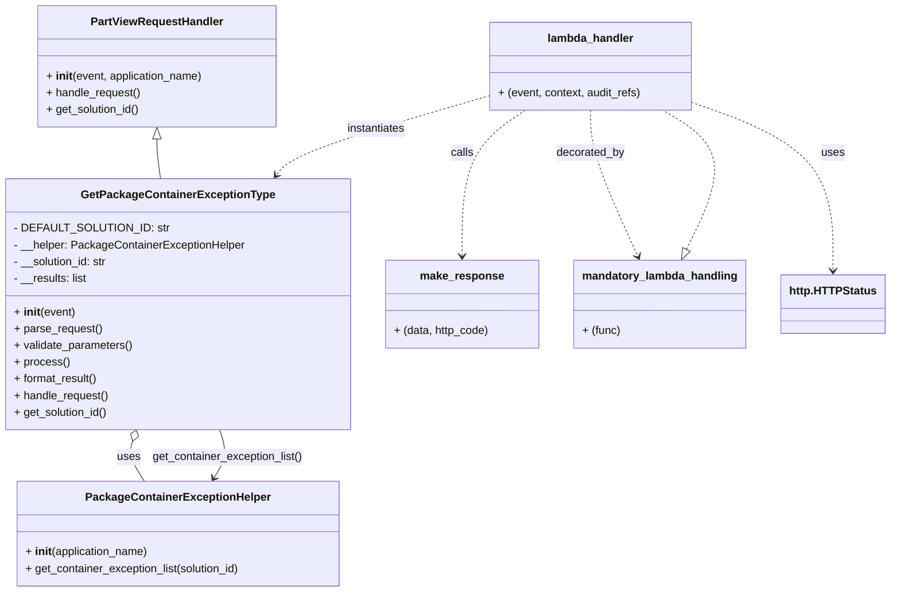

# Diagram: partview_core/partview_service/partview_service/api/package_container_exception_type/handlers/get_package_container_exception_type.py

> Auto-generated by Obscura crawlers

## Mermaid

### SVG

<svg id="container" width="1251.4921875" xmlns="http://www.w3.org/2000/svg" class="classDiagram" height="848" viewBox="0 0 1251.4921875 848" role="graphics-document document" aria-roledescription="class"><g><defs><marker id="container_class-aggregationStart" class="marker aggregation class" refX="18" refY="7" markerWidth="190" markerHeight="240" orient="auto"><path d="M 18,7 L9,13 L1,7 L9,1 Z"></path></marker></defs><defs><marker id="container_class-aggregationEnd" class="marker aggregation class" refX="1" refY="7" markerWidth="20" markerHeight="28" orient="auto"><path d="M 18,7 L9,13 L1,7 L9,1 Z"></path></marker></defs><defs><marker id="container_class-extensionStart" class="marker extension class" refX="18" refY="7" markerWidth="190" markerHeight="240" orient="auto"><path d="M 1,7 L18,13 V 1 Z"></path></marker></defs><defs><marker id="container_class-extensionEnd" class="marker extension class" refX="1" refY="7" markerWidth="20" markerHeight="28" orient="auto"><path d="M 1,1 V 13 L18,7 Z"></path></marker></defs><defs><marker id="container_class-compositionStart" class="marker composition class" refX="18" refY="7" markerWidth="190" markerHeight="240" orient="auto"><path d="M 18,7 L9,13 L1,7 L9,1 Z"></path></marker></defs><defs><marker id="container_class-compositionEnd" class="marker composition class" refX="1" refY="7" markerWidth="20" markerHeight="28" orient="auto"><path d="M 18,7 L9,13 L1,7 L9,1 Z"></path></marker></defs><defs><marker id="container_class-dependencyStart" class="marker dependency class" refX="6" refY="7" markerWidth="190" markerHeight="240" orient="auto"><path d="M 5,7 L9,13 L1,7 L9,1 Z"></path></marker></defs><defs><marker id="container_class-dependencyEnd" class="marker dependency class" refX="13" refY="7" markerWidth="20" markerHeight="28" orient="auto"><path d="M 18,7 L9,13 L14,7 L9,1 Z"></path></marker></defs><defs><marker id="container_class-lollipopStart" class="marker lollipop class" refX="13" refY="7" markerWidth="190" markerHeight="240" orient="auto"><circle stroke="black" fill="transparent" cx="7" cy="7" r="6"></circle></marker></defs><defs><marker id="container_class-lollipopEnd" class="marker lollipop class" refX="1" refY="7" markerWidth="190" markerHeight="240" orient="auto"><circle stroke="black" fill="transparent" cx="7" cy="7" r="6"></circle></marker></defs><g class="root"><g class="clusters"></g><g class="edgePaths"><path d="M219.406,199.25L219.406,202.542C219.406,205.833,219.406,212.417,220.3,221.875C221.194,231.333,222.982,243.667,223.876,249.833L224.77,256" id="id_PartViewRequestHandler_GetPackageContainerExceptionType_1" class="edge-thickness-normal edge-pattern-solid relation" style=";;;" data-edge="true" data-et="edge" data-id="id_PartViewRequestHandler_GetPackageContainerExceptionType_1" data-points="W3sieCI6MjE5LjQwNjI1LCJ5IjoxODJ9LHsieCI6MjE5LjQwNjI1LCJ5IjoyMTl9LHsieCI6MjI0Ljc2OTg5MTI3MzA0MTQ4LCJ5IjoyNTZ9XQ==" marker-start="url(#container_class-extensionStart)"></path><path d="M184.989,632.354L183.835,635.795C182.68,639.236,180.371,646.118,183.225,655.726C186.079,665.333,194.096,677.667,198.104,683.833L202.113,690" id="id_GetPackageContainerExceptionType_PackageContainerExceptionHelper_2" class="edge-thickness-normal edge-pattern-solid relation" style=";;;" data-edge="true" data-et="edge" data-id="id_GetPackageContainerExceptionType_PackageContainerExceptionHelper_2" data-points="W3sieCI6MTkwLjQ3NTUzNjQzNDMzMTgsInkiOjYxNn0seyJ4IjoxNzguMDYyNSwieSI6NjUzfSx7IngiOjIwMi4xMTI3NTgwOTE1MTc4NiwieSI6NjkwfV0=" marker-start="url(#container_class-aggregationStart)"></path><path d="M689.617,137.577L643.361,151.148C597.105,164.718,504.592,191.859,454.351,210.794C404.11,229.728,396.14,240.456,392.155,245.82L388.17,251.184" id="id_lambda_handler_GetPackageContainerExceptionType_3" class="edge-thickness-normal edge-pattern-dashed relation" style=";;;" data-edge="true" data-et="edge" data-id="id_lambda_handler_GetPackageContainerExceptionType_3" data-points="W3sieCI6Njg5LjYxNzE4NzUsInkiOjEzNy41NzczMTU2ODEyNDU4fSx7IngiOjQxMi4wODAwNzgxMjUsInkiOjIxOX0seyJ4IjozODQuNTkxNDk5ODU1OTkwOCwieSI6MjU2fV0=" marker-end="url(#container_class-dependencyEnd)"></path><path d="M742.233,158L727.303,168.167C712.374,178.333,682.515,198.667,667.586,233.5C652.656,268.333,652.656,317.667,652.656,342.333L652.656,367" id="id_lambda_handler_make_response_4" class="edge-thickness-normal edge-pattern-dashed relation" style=";;;" data-edge="true" data-et="edge" data-id="id_lambda_handler_make_response_4" data-points="W3sieCI6NzQyLjIzMjcwNTM5MzE0NTEsInkiOjE1OH0seyJ4Ijo2NTIuNjU2MjUsInkiOjIxOX0seyJ4Ijo2NTIuNjU2MjUsInkiOjM3M31d" marker-end="url(#container_class-dependencyEnd)"></path><path d="M979.875,148.365L1011.891,160.138C1043.906,171.91,1107.938,195.455,1139.953,235.394C1171.969,275.333,1171.969,331.667,1171.969,359.833L1171.969,388" id="id_lambda_handler_http.HTTPStatus_5" class="edge-thickness-normal edge-pattern-dashed relation" style=";;;" data-edge="true" data-et="edge" data-id="id_lambda_handler_http.HTTPStatus_5" data-points="W3sieCI6OTc5Ljg3NSwieSI6MTQ4LjM2NTI4ODYwNTIxOTU4fSx7IngiOjExNzEuOTY4NzUsInkiOjIxOX0seyJ4IjoxMTcxLjk2ODc1LCJ5IjozOTR9XQ==" marker-end="url(#container_class-dependencyEnd)"></path><path d="M834.746,158L834.746,168.167C834.746,178.333,834.746,198.667,845.727,233.586C856.708,268.505,878.671,318.01,889.652,342.763L900.633,367.515" id="id_lambda_handler_mandatory_lambda_handling_6" class="edge-thickness-normal edge-pattern-dashed relation" style=";;;" data-edge="true" data-et="edge" data-id="id_lambda_handler_mandatory_lambda_handling_6" data-points="W3sieCI6ODM0Ljc0NjA5Mzc1LCJ5IjoxNTh9LHsieCI6ODM0Ljc0NjA5Mzc1LCJ5IjoyMTl9LHsieCI6OTAzLjA2NjQwNjI1LCJ5IjozNzN9XQ==" marker-end="url(#container_class-dependencyEnd)"></path><path d="M968.047,357.395L978.914,334.329C989.78,311.263,1011.513,265.132,1006.105,231.899C1000.696,198.667,968.147,178.333,951.872,168.167L935.597,158" id="id_mandatory_lambda_handling_lambda_handler_7" class="edge-thickness-normal edge-pattern-dashed relation" style=";;;" data-edge="true" data-et="edge" data-id="id_mandatory_lambda_handling_lambda_handler_7" data-points="W3sieCI6OTYwLjY5NTQzODUwODA2NDUsInkiOjM3M30seyJ4IjoxMDMzLjI0NjA5Mzc1LCJ5IjoyMTl9LHsieCI6OTM1LjU5NjkwMDIwMTYxMjksInkiOjE1OH1d" marker-start="url(#container_class-extensionStart)"></path><path d="M302.884,684.969L306.347,679.641C309.811,674.313,316.737,663.656,318.132,652.162C319.526,640.667,315.389,628.333,313.32,622.167L311.251,616" id="id_PackageContainerExceptionHelper_GetPackageContainerExceptionType_8" class="edge-thickness-normal edge-pattern-solid relation" style=";;;" data-edge="true" data-et="edge" data-id="id_PackageContainerExceptionHelper_GetPackageContainerExceptionType_8" data-points="W3sieCI6Mjk5LjYxMzgwNDQwODQ4MjE3LCJ5Ijo2OTB9LHsieCI6MzIzLjY2NDA2MjUsInkiOjY1M30seyJ4IjozMTEuMjUxMDI2MDY1NjY4MiwieSI6NjE2fV0=" marker-start="url(#container_class-dependencyStart)"></path></g><g class="edgeLabels"><g class="edgeLabel"><g class="label" data-id="id_PartViewRequestHandler_GetPackageContainerExceptionType_1" transform="translate(0, 0)"><foreignObject width="0" height="0">

</foreignObject></g></g><g class="edgeLabel" transform="translate(179.453, 655.13921)"><g class="label" data-id="id_GetPackageContainerExceptionType_PackageContainerExceptionHelper_2" transform="translate(-16.4921875, -12)"><foreignObject width="32.984375" height="24">

uses

</foreignObject></g></g><g class="edgeLabel" transform="translate(528.73388, 184.77659)"><g class="label" data-id="id_lambda_handler_GetPackageContainerExceptionType_3" transform="translate(-42.9140625, -12)"><foreignObject width="85.828125" height="24">

instantiates

</foreignObject></g></g><g class="edgeLabel" transform="translate(652.65625, 219)"><g class="label" data-id="id_lambda_handler_make_response_4" transform="translate(-16.4453125, -12)"><foreignObject width="32.890625" height="24">

calls

</foreignObject></g></g><g class="edgeLabel" transform="translate(1171.96875, 219)"><g class="label" data-id="id_lambda_handler_http.HTTPStatus_5" transform="translate(-16.4921875, -12)"><foreignObject width="32.984375" height="24">

uses

</foreignObject></g></g><g class="edgeLabel" transform="translate(834.74609375, 219)"><g class="label" data-id="id_lambda_handler_mandatory_lambda_handling_6" transform="translate(-49.375, -12)"><foreignObject width="98.75" height="24">

decorated_by

</foreignObject></g></g><g class="edgeLabel"><g class="label" data-id="id_mandatory_lambda_handling_lambda_handler_7" transform="translate(0, 0)"><foreignObject width="0" height="0">

</foreignObject></g></g><g class="edgeLabel" transform="translate(322.27356, 655.13921)"><g class="label" data-id="id_PackageContainerExceptionHelper_GetPackageContainerExceptionType_8" transform="translate(-109.109375, -12)"><foreignObject width="218.21875" height="24">

get_container_exception_list()

</foreignObject></g></g></g><g class="nodes"><g class="node default" id="classId-GetPackageContainerExceptionType-0" transform="translate(250.86328125, 436)"><g class="basic label-container"><path d="M-242.86328125 -180 L242.86328125 -180 L242.86328125 180 L-242.86328125 180" stroke="none" stroke-width="0" fill="#ECECFF" style=""></path><path d="M-242.86328125 -180 C-118.44680690728512 -180, 5.969667435429756 -180, 242.86328125 -180 M-242.86328125 -180 C-52.868404110219586 -180, 137.12647302956083 -180, 242.86328125 -180 M242.86328125 -180 C242.86328125 -39.365095038426176, 242.86328125 101.26980992314765, 242.86328125 180 M242.86328125 -180 C242.86328125 -84.64697041585853, 242.86328125 10.706059168282934, 242.86328125 180 M242.86328125 180 C93.87364095438878 180, -55.11599934122245 180, -242.86328125 180 M242.86328125 180 C79.42020453541508 180, -84.02287217916984 180, -242.86328125 180 M-242.86328125 180 C-242.86328125 58.99230187850249, -242.86328125 -62.015396242995024, -242.86328125 -180 M-242.86328125 180 C-242.86328125 82.29626771721036, -242.86328125 -15.40746456557929, -242.86328125 -180" stroke="#9370DB" stroke-width="1.3" fill="none" stroke-dasharray="0 0" style=""></path></g><g class="annotation-group text" transform="translate(0, -156)"></g><g class="label-group text" transform="translate(-131.1484375, -156)"><g class="label" style="font-weight: bolder" transform="translate(0,-12)"><foreignObject width="262.296875" height="24">

GetPackageContainerExceptionType

</foreignObject></g></g><g class="members-group text" transform="translate(-230.86328125, -108)"><g class="label" style="" transform="translate(0,-12)"><foreignObject width="202.125" height="24">

- DEFAULT_SOLUTION_ID: str

</foreignObject></g><g class="label" style="" transform="translate(0,12)"><foreignObject width="330.578125" height="24">

- __helper: PackageContainerExceptionHelper

</foreignObject></g><g class="label" style="" transform="translate(0,36)"><foreignObject width="136.90625" height="24">

- __solution_id: str

</foreignObject></g><g class="label" style="" transform="translate(0,60)"><foreignObject width="106.84375" height="24">

- __results: list

</foreignObject></g></g><g class="methods-group text" transform="translate(-230.86328125, 12)"><g class="label" style="" transform="translate(0,-12)"><foreignObject width="87.390625" height="24">

+ <strong>init</strong>(event)

</foreignObject></g><g class="label" style="" transform="translate(0,12)"><foreignObject width="126.046875" height="24">

+ parse_request()

</foreignObject></g><g class="label" style="" transform="translate(0,36)"><foreignObject width="170.953125" height="24">

+ validate_parameters()

</foreignObject></g><g class="label" style="" transform="translate(0,60)"><foreignObject width="77.96875" height="24">

+ process()

</foreignObject></g><g class="label" style="" transform="translate(0,84)"><foreignObject width="121.5" height="24">

+ format_result()

</foreignObject></g><g class="label" style="" transform="translate(0,108)"><foreignObject width="136.21875" height="24">

+ handle_request()

</foreignObject></g><g class="label" style="" transform="translate(0,132)"><foreignObject width="135.703125" height="24">

+ get_solution_id()

</foreignObject></g></g><g class="divider" style=""><path d="M-242.86328125 -132 C-63.259180557576656 -132, 116.34492013484669 -132, 242.86328125 -132 M-242.86328125 -132 C-85.12724309234207 -132, 72.60879506531586 -132, 242.86328125 -132" stroke="#9370DB" stroke-width="1.3" fill="none" stroke-dasharray="0 0" style=""></path></g><g class="divider" style=""><path d="M-242.86328125 -12 C-136.93519922263434 -12, -31.007117195268677 -12, 242.86328125 -12 M-242.86328125 -12 C-49.899633104348766 -12, 143.06401504130247 -12, 242.86328125 -12" stroke="#9370DB" stroke-width="1.3" fill="none" stroke-dasharray="0 0" style=""></path></g></g><g class="node default" id="classId-PartViewRequestHandler-1" transform="translate(219.40625, 95)"><g class="basic label-container"><path d="M-170.9140625 -87 L170.9140625 -87 L170.9140625 87 L-170.9140625 87" stroke="none" stroke-width="0" fill="#ECECFF" style=""></path><path d="M-170.9140625 -87 C-62.5064047770956 -87, 45.90125294580881 -87, 170.9140625 -87 M-170.9140625 -87 C-67.98604210420714 -87, 34.94197829158571 -87, 170.9140625 -87 M170.9140625 -87 C170.9140625 -22.23006007136412, 170.9140625 42.53987985727176, 170.9140625 87 M170.9140625 -87 C170.9140625 -29.994286857088383, 170.9140625 27.011426285823234, 170.9140625 87 M170.9140625 87 C68.1356072471981 87, -34.64284800560381 87, -170.9140625 87 M170.9140625 87 C52.837608613529596 87, -65.23884527294081 87, -170.9140625 87 M-170.9140625 87 C-170.9140625 19.402964665860495, -170.9140625 -48.19407066827901, -170.9140625 -87 M-170.9140625 87 C-170.9140625 42.48096393758838, -170.9140625 -2.0380721248232447, -170.9140625 -87" stroke="#9370DB" stroke-width="1.3" fill="none" stroke-dasharray="0 0" style=""></path></g><g class="annotation-group text" transform="translate(0, -63)"></g><g class="label-group text" transform="translate(-91.359375, -63)"><g class="label" style="font-weight: bolder" transform="translate(0,-12)"><foreignObject width="182.71875" height="24">

PartViewRequestHandler

</foreignObject></g></g><g class="members-group text" transform="translate(-158.9140625, -15)"></g><g class="methods-group text" transform="translate(-158.9140625, 15)"><g class="label" style="" transform="translate(0,-12)"><foreignObject width="226.46875" height="24">

+ <strong>init</strong>(event, application_name)

</foreignObject></g><g class="label" style="" transform="translate(0,12)"><foreignObject width="136.21875" height="24">

+ handle_request()

</foreignObject></g><g class="label" style="" transform="translate(0,36)"><foreignObject width="135.703125" height="24">

+ get_solution_id()

</foreignObject></g></g><g class="divider" style=""><path d="M-170.9140625 -39 C-41.329119133480276 -39, 88.25582423303945 -39, 170.9140625 -39 M-170.9140625 -39 C-40.53655734148768 -39, 89.84094781702464 -39, 170.9140625 -39" stroke="#9370DB" stroke-width="1.3" fill="none" stroke-dasharray="0 0" style=""></path></g><g class="divider" style=""><path d="M-170.9140625 -15 C-40.51980535072144 -15, 89.87445179855712 -15, 170.9140625 -15 M-170.9140625 -15 C-58.436375901275014 -15, 54.04131069744997 -15, 170.9140625 -15" stroke="#9370DB" stroke-width="1.3" fill="none" stroke-dasharray="0 0" style=""></path></g></g><g class="node default" id="classId-PackageContainerExceptionHelper-2" transform="translate(250.86328125, 765)"><g class="basic label-container"><path d="M-231.171875 -75 L231.171875 -75 L231.171875 75 L-231.171875 75" stroke="none" stroke-width="0" fill="#ECECFF" style=""></path><path d="M-231.171875 -75 C-85.47399002348061 -75, 60.22389495303878 -75, 231.171875 -75 M-231.171875 -75 C-93.99344097710596 -75, 43.184993045788076 -75, 231.171875 -75 M231.171875 -75 C231.171875 -28.05157012986305, 231.171875 18.896859740273896, 231.171875 75 M231.171875 -75 C231.171875 -44.210465494623975, 231.171875 -13.42093098924795, 231.171875 75 M231.171875 75 C58.096999472271875 75, -114.97787605545625 75, -231.171875 75 M231.171875 75 C57.7802364827493 75, -115.6114020345014 75, -231.171875 75 M-231.171875 75 C-231.171875 40.73027541355696, -231.171875 6.46055082711392, -231.171875 -75 M-231.171875 75 C-231.171875 42.31285505548491, -231.171875 9.62571011096982, -231.171875 -75" stroke="#9370DB" stroke-width="1.3" fill="none" stroke-dasharray="0 0" style=""></path></g><g class="annotation-group text" transform="translate(0, -51)"></g><g class="label-group text" transform="translate(-125.671875, -51)"><g class="label" style="font-weight: bolder" transform="translate(0,-12)"><foreignObject width="251.34375" height="24">

PackageContainerExceptionHelper

</foreignObject></g></g><g class="members-group text" transform="translate(-219.171875, -3)"></g><g class="methods-group text" transform="translate(-219.171875, 27)"><g class="label" style="" transform="translate(0,-12)"><foreignObject width="177.984375" height="24">

+ <strong>init</strong>(application_name)

</foreignObject></g><g class="label" style="" transform="translate(0,12)"><foreignObject width="312.671875" height="24">

+ get_container_exception_list(solution_id)

</foreignObject></g></g><g class="divider" style=""><path d="M-231.171875 -27 C-89.15528760921507 -27, 52.86129978156987 -27, 231.171875 -27 M-231.171875 -27 C-96.11035579535982 -27, 38.951163409280355 -27, 231.171875 -27" stroke="#9370DB" stroke-width="1.3" fill="none" stroke-dasharray="0 0" style=""></path></g><g class="divider" style=""><path d="M-231.171875 -3 C-137.15693865895628 -3, -43.142002317912585 -3, 231.171875 -3 M-231.171875 -3 C-74.79633193671373 -3, 81.57921112657255 -3, 231.171875 -3" stroke="#9370DB" stroke-width="1.3" fill="none" stroke-dasharray="0 0" style=""></path></g></g><g class="node default" id="classId-lambda_handler-3" transform="translate(834.74609375, 95)"><g class="basic label-container"><path d="M-145.12890625 -63 L145.12890625 -63 L145.12890625 63 L-145.12890625 63" stroke="none" stroke-width="0" fill="#ECECFF" style=""></path><path d="M-145.12890625 -63 C-41.10953724753945 -63, 62.9098317549211 -63, 145.12890625 -63 M-145.12890625 -63 C-29.243165986616873 -63, 86.64257427676625 -63, 145.12890625 -63 M145.12890625 -63 C145.12890625 -33.09324110929456, 145.12890625 -3.18648221858912, 145.12890625 63 M145.12890625 -63 C145.12890625 -26.697492506220755, 145.12890625 9.60501498755849, 145.12890625 63 M145.12890625 63 C38.50084248167474 63, -68.12722128665052 63, -145.12890625 63 M145.12890625 63 C48.023225904822496 63, -49.08245444035501 63, -145.12890625 63 M-145.12890625 63 C-145.12890625 25.957379756254966, -145.12890625 -11.085240487490069, -145.12890625 -63 M-145.12890625 63 C-145.12890625 33.51310622045774, -145.12890625 4.026212440915479, -145.12890625 -63" stroke="#9370DB" stroke-width="1.3" fill="none" stroke-dasharray="0 0" style=""></path></g><g class="annotation-group text" transform="translate(0, -39)"></g><g class="label-group text" transform="translate(-59.9765625, -39)"><g class="label" style="font-weight: bolder" transform="translate(0,-12)"><foreignObject width="119.953125" height="24">

lambda_handler

</foreignObject></g></g><g class="members-group text" transform="translate(-133.12890625, 9)"></g><g class="methods-group text" transform="translate(-133.12890625, 39)"><g class="label" style="" transform="translate(0,-12)"><foreignObject width="206.28125" height="24">

+ (event, context, audit_refs)

</foreignObject></g></g><g class="divider" style=""><path d="M-145.12890625 -15 C-36.94574026379492 -15, 71.23742572241017 -15, 145.12890625 -15 M-145.12890625 -15 C-75.64803701391088 -15, -6.16716777782176 -15, 145.12890625 -15" stroke="#9370DB" stroke-width="1.3" fill="none" stroke-dasharray="0 0" style=""></path></g><g class="divider" style=""><path d="M-145.12890625 9 C-54.57941244940382 9, 35.97008135119236 9, 145.12890625 9 M-145.12890625 9 C-83.03879071575139 9, -20.948675181502793 9, 145.12890625 9" stroke="#9370DB" stroke-width="1.3" fill="none" stroke-dasharray="0 0" style=""></path></g></g><g class="node default" id="classId-make_response-4" transform="translate(652.65625, 436)"><g class="basic label-container"><path d="M-108.9296875 -63 L108.9296875 -63 L108.9296875 63 L-108.9296875 63" stroke="none" stroke-width="0" fill="#ECECFF" style=""></path><path d="M-108.9296875 -63 C-40.28453229504409 -63, 28.360622909911825 -63, 108.9296875 -63 M-108.9296875 -63 C-41.65516495591902 -63, 25.61935758816196 -63, 108.9296875 -63 M108.9296875 -63 C108.9296875 -15.078164441375158, 108.9296875 32.843671117249684, 108.9296875 63 M108.9296875 -63 C108.9296875 -32.63985311889731, 108.9296875 -2.2797062377946133, 108.9296875 63 M108.9296875 63 C52.29407124845809 63, -4.341545003083823 63, -108.9296875 63 M108.9296875 63 C40.95197457770168 63, -27.025738344596647 63, -108.9296875 63 M-108.9296875 63 C-108.9296875 36.72761605701085, -108.9296875 10.455232114021705, -108.9296875 -63 M-108.9296875 63 C-108.9296875 21.3999025953812, -108.9296875 -20.2001948092376, -108.9296875 -63" stroke="#9370DB" stroke-width="1.3" fill="none" stroke-dasharray="0 0" style=""></path></g><g class="annotation-group text" transform="translate(0, -39)"></g><g class="label-group text" transform="translate(-57.46875, -39)"><g class="label" style="font-weight: bolder" transform="translate(0,-12)"><foreignObject width="114.9375" height="24">

make_response

</foreignObject></g></g><g class="members-group text" transform="translate(-96.9296875, 9)"></g><g class="methods-group text" transform="translate(-96.9296875, 39)"><g class="label" style="" transform="translate(0,-12)"><foreignObject width="136.390625" height="24">

+ (data, http_code)

</foreignObject></g></g><g class="divider" style=""><path d="M-108.9296875 -15 C-25.771688633418975 -15, 57.38631023316205 -15, 108.9296875 -15 M-108.9296875 -15 C-33.04743677466304 -15, 42.83481395067392 -15, 108.9296875 -15" stroke="#9370DB" stroke-width="1.3" fill="none" stroke-dasharray="0 0" style=""></path></g><g class="divider" style=""><path d="M-108.9296875 9 C-22.795221338263175 9, 63.33924482347365 9, 108.9296875 9 M-108.9296875 9 C-50.353848554695745 9, 8.22199039060851 9, 108.9296875 9" stroke="#9370DB" stroke-width="1.3" fill="none" stroke-dasharray="0 0" style=""></path></g></g><g class="node default" id="classId-mandatory_lambda_handling-5" transform="translate(931.015625, 436)"><g class="basic label-container"><path d="M-119.4296875 -63 L119.4296875 -63 L119.4296875 63 L-119.4296875 63" stroke="none" stroke-width="0" fill="#ECECFF" style=""></path><path d="M-119.4296875 -63 C-25.65794527998638 -63, 68.11379694002724 -63, 119.4296875 -63 M-119.4296875 -63 C-57.70140384200721 -63, 4.0268798159855805 -63, 119.4296875 -63 M119.4296875 -63 C119.4296875 -15.882334005419224, 119.4296875 31.23533198916155, 119.4296875 63 M119.4296875 -63 C119.4296875 -26.300125485099585, 119.4296875 10.39974902980083, 119.4296875 63 M119.4296875 63 C39.06339463329864 63, -41.302898233402715 63, -119.4296875 63 M119.4296875 63 C61.502218003239356 63, 3.574748506478713 63, -119.4296875 63 M-119.4296875 63 C-119.4296875 20.08476936624094, -119.4296875 -22.830461267518118, -119.4296875 -63 M-119.4296875 63 C-119.4296875 16.763159206820205, -119.4296875 -29.47368158635959, -119.4296875 -63" stroke="#9370DB" stroke-width="1.3" fill="none" stroke-dasharray="0 0" style=""></path></g><g class="annotation-group text" transform="translate(0, -39)"></g><g class="label-group text" transform="translate(-107.4296875, -39)"><g class="label" style="font-weight: bolder" transform="translate(0,-12)"><foreignObject width="214.859375" height="24">

mandatory_lambda_handling

</foreignObject></g></g><g class="members-group text" transform="translate(-107.4296875, 9)"></g><g class="methods-group text" transform="translate(-107.4296875, 39)"><g class="label" style="" transform="translate(0,-12)"><foreignObject width="54.296875" height="24">

+ (func)

</foreignObject></g></g><g class="divider" style=""><path d="M-119.4296875 -15 C-25.16556917031771 -15, 69.09854915936458 -15, 119.4296875 -15 M-119.4296875 -15 C-41.09590922991586 -15, 37.23786904016828 -15, 119.4296875 -15" stroke="#9370DB" stroke-width="1.3" fill="none" stroke-dasharray="0 0" style=""></path></g><g class="divider" style=""><path d="M-119.4296875 9 C-49.527350740987146 9, 20.37498601802571 9, 119.4296875 9 M-119.4296875 9 C-37.45514031036923 9, 44.51940687926154 9, 119.4296875 9" stroke="#9370DB" stroke-width="1.3" fill="none" stroke-dasharray="0 0" style=""></path></g></g><g class="node default" id="classId-http.HTTPStatus-6" transform="translate(1171.96875, 436)"><g class="basic label-container"><path d="M-71.5234375 -42 L71.5234375 -42 L71.5234375 42 L-71.5234375 42" stroke="none" stroke-width="0" fill="#ECECFF" style=""></path><path d="M-71.5234375 -42 C-37.96909591233335 -42, -4.414754324666703 -42, 71.5234375 -42 M-71.5234375 -42 C-34.68185226372619 -42, 2.1597329725476158 -42, 71.5234375 -42 M71.5234375 -42 C71.5234375 -17.40560118817493, 71.5234375 7.188797623650139, 71.5234375 42 M71.5234375 -42 C71.5234375 -17.597665752539516, 71.5234375 6.804668494920968, 71.5234375 42 M71.5234375 42 C31.18060286651494 42, -9.162231766970123 42, -71.5234375 42 M71.5234375 42 C38.63181159944846 42, 5.740185698896923 42, -71.5234375 42 M-71.5234375 42 C-71.5234375 11.206131296534792, -71.5234375 -19.587737406930415, -71.5234375 -42 M-71.5234375 42 C-71.5234375 24.830638681306823, -71.5234375 7.661277362613646, -71.5234375 -42" stroke="#9370DB" stroke-width="1.3" fill="none" stroke-dasharray="0 0" style=""></path></g><g class="annotation-group text" transform="translate(0, -18)"></g><g class="label-group text" transform="translate(-59.5234375, -18)"><g class="label" style="font-weight: bolder" transform="translate(0,-12)"><foreignObject width="119.046875" height="24">

http.HTTPStatus

</foreignObject></g></g><g class="members-group text" transform="translate(-59.5234375, 30)"></g><g class="methods-group text" transform="translate(-59.5234375, 60)"></g><g class="divider" style=""><path d="M-71.5234375 6 C-21.021875431172298 6, 29.479686637655405 6, 71.5234375 6 M-71.5234375 6 C-19.44732071244735 6, 32.6287960751053 6, 71.5234375 6" stroke="#9370DB" stroke-width="1.3" fill="none" stroke-dasharray="0 0" style=""></path></g><g class="divider" style=""><path d="M-71.5234375 24 C-16.95462011687797 24, 37.61419726624406 24, 71.5234375 24 M-71.5234375 24 C-23.238632168239853 24, 25.046173163520294 24, 71.5234375 24" stroke="#9370DB" stroke-width="1.3" fill="none" stroke-dasharray="0 0" style=""></path></g></g></g></g></g></svg>
