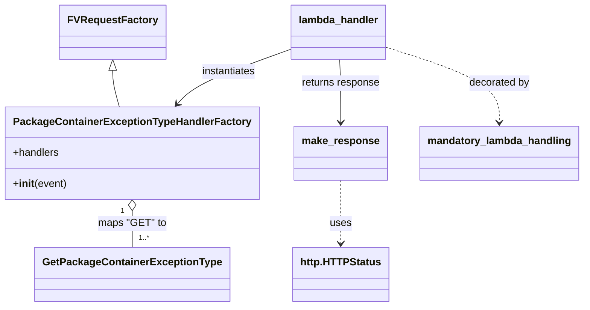

# Diagram: partview_core/partview_service/partview_service/api/package_container_exception_type/package_container_exception_type_handler.py


> Auto-generated by Obscura crawlers

## Diagram 1



### SVG

<svg id="container" width="875.0546875" xmlns="http://www.w3.org/2000/svg" class="classDiagram" height="476" viewBox="0 0 875.0546875 476" role="graphics-document document" aria-roledescription="class"><style>#container{font-family:"trebuchet ms",verdana,arial,sans-serif;font-size:16px;fill:#333;}@keyframes edge-animation-frame{from{stroke-dashoffset:0;}}@keyframes dash{to{stroke-dashoffset:0;}}#container .edge-animation-slow{stroke-dasharray:9,5!important;stroke-dashoffset:900;animation:dash 50s linear infinite;stroke-linecap:round;}#container .edge-animation-fast{stroke-dasharray:9,5!important;stroke-dashoffset:900;animation:dash 20s linear infinite;stroke-linecap:round;}#container .error-icon{fill:#552222;}#container .error-text{fill:#552222;stroke:#552222;}#container .edge-thickness-normal{stroke-width:1px;}#container .edge-thickness-thick{stroke-width:3.5px;}#container .edge-pattern-solid{stroke-dasharray:0;}#container .edge-thickness-invisible{stroke-width:0;fill:none;}#container .edge-pattern-dashed{stroke-dasharray:3;}#container .edge-pattern-dotted{stroke-dasharray:2;}#container .marker{fill:#333333;stroke:#333333;}#container .marker.cross{stroke:#333333;}#container svg{font-family:"trebuchet ms",verdana,arial,sans-serif;font-size:16px;}#container p{margin:0;}#container g.classGroup text{fill:#9370DB;stroke:none;font-family:"trebuchet ms",verdana,arial,sans-serif;font-size:10px;}#container g.classGroup text .title{font-weight:bolder;}#container .nodeLabel,#container .edgeLabel{color:#131300;}#container .edgeLabel .label rect{fill:#ECECFF;}#container .label text{fill:#131300;}#container .labelBkg{background:#ECECFF;}#container .edgeLabel .label span{background:#ECECFF;}#container .classTitle{font-weight:bolder;}#container .node rect,#container .node circle,#container .node ellipse,#container .node polygon,#container .node path{fill:#ECECFF;stroke:#9370DB;stroke-width:1px;}#container .divider{stroke:#9370DB;stroke-width:1;}#container g.clickable{cursor:pointer;}#container g.classGroup rect{fill:#ECECFF;stroke:#9370DB;}#container g.classGroup line{stroke:#9370DB;stroke-width:1;}#container .classLabel .box{stroke:none;stroke-width:0;fill:#ECECFF;opacity:0.5;}#container .classLabel .label{fill:#9370DB;font-size:10px;}#container .relation{stroke:#333333;stroke-width:1;fill:none;}#container .dashed-line{stroke-dasharray:3;}#container .dotted-line{stroke-dasharray:1 2;}#container #compositionStart,#container .composition{fill:#333333!important;stroke:#333333!important;stroke-width:1;}#container #compositionEnd,#container .composition{fill:#333333!important;stroke:#333333!important;stroke-width:1;}#container #dependencyStart,#container .dependency{fill:#333333!important;stroke:#333333!important;stroke-width:1;}#container #dependencyStart,#container .dependency{fill:#333333!important;stroke:#333333!important;stroke-width:1;}#container #extensionStart,#container .extension{fill:transparent!important;stroke:#333333!important;stroke-width:1;}#container #extensionEnd,#container .extension{fill:transparent!important;stroke:#333333!important;stroke-width:1;}#container #aggregationStart,#container .aggregation{fill:transparent!important;stroke:#333333!important;stroke-width:1;}#container #aggregationEnd,#container .aggregation{fill:transparent!important;stroke:#333333!important;stroke-width:1;}#container #lollipopStart,#container .lollipop{fill:#ECECFF!important;stroke:#333333!important;stroke-width:1;}#container #lollipopEnd,#container .lollipop{fill:#ECECFF!important;stroke:#333333!important;stroke-width:1;}#container .edgeTerminals{font-size:11px;line-height:initial;}#container .classTitleText{text-anchor:middle;font-size:18px;fill:#333;}#container .label-icon{display:inline-block;height:1em;overflow:visible;vertical-align:-0.125em;}#container .node .label-icon path{fill:currentColor;stroke:revert;stroke-width:revert;}#container :root{--mermaid-font-family:"trebuchet ms",verdana,arial,sans-serif;}</style><g><defs><marker id="container_class-aggregationStart" class="marker aggregation class" refX="18" refY="7" markerWidth="190" markerHeight="240" orient="auto"><path d="M 18,7 L9,13 L1,7 L9,1 Z"></path></marker></defs><defs><marker id="container_class-aggregationEnd" class="marker aggregation class" refX="1" refY="7" markerWidth="20" markerHeight="28" orient="auto"><path d="M 18,7 L9,13 L1,7 L9,1 Z"></path></marker></defs><defs><marker id="container_class-extensionStart" class="marker extension class" refX="18" refY="7" markerWidth="190" markerHeight="240" orient="auto"><path d="M 1,7 L18,13 V 1 Z"></path></marker></defs><defs><marker id="container_class-extensionEnd" class="marker extension class" refX="1" refY="7" markerWidth="20" markerHeight="28" orient="auto"><path d="M 1,1 V 13 L18,7 Z"></path></marker></defs><defs><marker id="container_class-compositionStart" class="marker composition class" refX="18" refY="7" markerWidth="190" markerHeight="240" orient="auto"><path d="M 18,7 L9,13 L1,7 L9,1 Z"></path></marker></defs><defs><marker id="container_class-compositionEnd" class="marker composition class" refX="1" refY="7" markerWidth="20" markerHeight="28" orient="auto"><path d="M 18,7 L9,13 L1,7 L9,1 Z"></path></marker></defs><defs><marker id="container_class-dependencyStart" class="marker dependency class" refX="6" refY="7" markerWidth="190" markerHeight="240" orient="auto"><path d="M 5,7 L9,13 L1,7 L9,1 Z"></path></marker></defs><defs><marker id="container_class-dependencyEnd" class="marker dependency class" refX="13" refY="7" markerWidth="20" markerHeight="28" orient="auto"><path d="M 18,7 L9,13 L14,7 L9,1 Z"></path></marker></defs><defs><marker id="container_class-lollipopStart" class="marker lollipop class" refX="13" refY="7" markerWidth="190" markerHeight="240" orient="auto"><circle stroke="black" fill="transparent" cx="7" cy="7" r="6"></circle></marker></defs><defs><marker id="container_class-lollipopEnd" class="marker lollipop class" refX="1" refY="7" markerWidth="190" markerHeight="240" orient="auto"><circle stroke="black" fill="transparent" cx="7" cy="7" r="6"></circle></marker></defs><g class="root"><g class="clusters"></g><g class="edgePaths"><path d="M162.715,109.25L162.715,112.542C162.715,115.833,162.715,122.417,164.495,131.875C166.274,141.333,169.834,153.667,171.613,159.833L173.393,166" id="id_FVRequestFactory_PackageContainerExceptionTypeHandlerFactory_1" class="edge-thickness-normal edge-pattern-solid relation" style=";;;" data-edge="true" data-et="edge" data-id="id_FVRequestFactory_PackageContainerExceptionTypeHandlerFactory_1" data-points="W3sieCI6MTYyLjcxNDg0Mzc1LCJ5Ijo5Mn0seyJ4IjoxNjIuNzE0ODQzNzUsInkiOjEyOX0seyJ4IjoxNzMuMzkyOTE4NTc3OTgxNjUsInkiOjE2Nn1d" marker-start="url(#container_class-extensionStart)"></path><path d="M194.172,327.25L194.172,330.542C194.172,333.833,194.172,340.417,194.172,349.875C194.172,359.333,194.172,371.667,194.172,377.833L194.172,384" id="id_PackageContainerExceptionTypeHandlerFactory_GetPackageContainerExceptionType_2" class="edge-thickness-normal edge-pattern-solid relation" style=";;;" data-edge="true" data-et="edge" data-id="id_PackageContainerExceptionTypeHandlerFactory_GetPackageContainerExceptionType_2" data-points="W3sieCI6MTk0LjE3MTg3NSwieSI6MzEwfSx7IngiOjE5NC4xNzE4NzUsInkiOjM0N30seyJ4IjoxOTQuMTcxODc1LCJ5IjozODR9XQ==" marker-start="url(#container_class-aggregationStart)"></path><path d="M571.789,72.945L601.095,82.288C630.401,91.63,689.013,110.315,718.319,129.824C747.625,149.333,747.625,169.667,747.625,179.833L747.625,190" id="id_lambda_handler_mandatory_lambda_handling_3" class="edge-thickness-normal edge-pattern-dashed relation" style=";;;" data-edge="true" data-et="edge" data-id="id_lambda_handler_mandatory_lambda_handling_3" data-points="W3sieCI6NTcxLjc4OTA2MjUsInkiOjcyLjk0NTM2NTY5OTg3Mzg5fSx7IngiOjc0Ny42MjUsInkiOjEyOX0seyJ4Ijo3NDcuNjI1LCJ5IjoxOTZ9XQ==" marker-end="url(#container_class-dependencyEnd)"></path><path d="M427.836,76.441L403.991,85.201C380.146,93.961,332.456,111.48,304.125,125.638C275.793,139.795,266.821,150.59,262.335,155.988L257.849,161.386" id="id_lambda_handler_PackageContainerExceptionTypeHandlerFactory_4" class="edge-thickness-normal edge-pattern-solid relation" style=";;;" data-edge="true" data-et="edge" data-id="id_lambda_handler_PackageContainerExceptionTypeHandlerFactory_4" data-points="W3sieCI6NDI3LjgzNTkzNzUsInkiOjc2LjQ0MTQzNzE4NjY1OTg4fSx7IngiOjI4NC43NjU2MjUsInkiOjEyOX0seyJ4IjoyNTQuMDEzNjE4MTE5MjY2MDYsInkiOjE2Nn1d" marker-end="url(#container_class-dependencyEnd)"></path><path d="M504.552,92L505.247,98.167C505.943,104.333,507.335,116.667,508.031,133C508.727,149.333,508.727,169.667,508.727,179.833L508.727,190" id="id_lambda_handler_make_response_5" class="edge-thickness-normal edge-pattern-solid relation" style=";;;" data-edge="true" data-et="edge" data-id="id_lambda_handler_make_response_5" data-points="W3sieCI6NTA0LjU1MTYyMTgzNTQ0MzAzLCJ5Ijo5Mn0seyJ4Ijo1MDguNzI2NTYyNSwieSI6MTI5fSx7IngiOjUwOC43MjY1NjI1LCJ5IjoxOTZ9XQ==" marker-end="url(#container_class-dependencyEnd)"></path><path d="M508.727,280L508.727,291.167C508.727,302.333,508.727,324.667,508.727,341C508.727,357.333,508.727,367.667,508.727,372.833L508.727,378" id="id_make_response_http.HTTPStatus_6" class="edge-thickness-normal edge-pattern-dashed relation" style=";;;" data-edge="true" data-et="edge" data-id="id_make_response_http.HTTPStatus_6" data-points="W3sieCI6NTA4LjcyNjU2MjUsInkiOjI4MH0seyJ4Ijo1MDguNzI2NTYyNSwieSI6MzQ3fSx7IngiOjUwOC43MjY1NjI1LCJ5IjozODR9XQ==" marker-end="url(#container_class-dependencyEnd)"></path></g><g class="edgeLabels"><g class="edgeLabel"><g class="label" data-id="id_FVRequestFactory_PackageContainerExceptionTypeHandlerFactory_1" transform="translate(0, 0)"><foreignObject width="0" height="0"><div xmlns="http://www.w3.org/1999/xhtml" class="labelBkg" style="display: table-cell; white-space: nowrap; line-height: 1.5; max-width: 200px; text-align: center;"><span class="edgeLabel"></span></div></foreignObject></g></g><g class="edgeLabel" transform="translate(194.171875, 347)"><g class="label" data-id="id_PackageContainerExceptionTypeHandlerFactory_GetPackageContainerExceptionType_2" transform="translate(-51.3046875, -12)"><foreignObject width="102.609375" height="24"><div xmlns="http://www.w3.org/1999/xhtml" class="labelBkg" style="display: table-cell; white-space: nowrap; line-height: 1.5; max-width: 200px; text-align: center;"><span class="edgeLabel"><p>maps "GET" to</p></span></div></foreignObject></g></g><g class="edgeLabel" transform="translate(747.625, 129)"><g class="label" data-id="id_lambda_handler_mandatory_lambda_handling_3" transform="translate(-47.328125, -12)"><foreignObject width="94.65625" height="24"><div xmlns="http://www.w3.org/1999/xhtml" class="labelBkg" style="display: table-cell; white-space: nowrap; line-height: 1.5; max-width: 200px; text-align: center;"><span class="edgeLabel"><p>decorated by</p></span></div></foreignObject></g></g><g class="edgeLabel" transform="translate(333.72063, 111.0158)"><g class="label" data-id="id_lambda_handler_PackageContainerExceptionTypeHandlerFactory_4" transform="translate(-42.9140625, -12)"><foreignObject width="85.828125" height="24"><div xmlns="http://www.w3.org/1999/xhtml" class="labelBkg" style="display: table-cell; white-space: nowrap; line-height: 1.5; max-width: 200px; text-align: center;"><span class="edgeLabel"><p>instantiates</p></span></div></foreignObject></g></g><g class="edgeLabel" transform="translate(508.7265625, 129)"><g class="label" data-id="id_lambda_handler_make_response_5" transform="translate(-61.5390625, -12)"><foreignObject width="123.078125" height="24"><div xmlns="http://www.w3.org/1999/xhtml" class="labelBkg" style="display: table-cell; white-space: nowrap; line-height: 1.5; max-width: 200px; text-align: center;"><span class="edgeLabel"><p>returns response</p></span></div></foreignObject></g></g><g class="edgeLabel" transform="translate(508.7265625, 347)"><g class="label" data-id="id_make_response_http.HTTPStatus_6" transform="translate(-16.4921875, -12)"><foreignObject width="32.984375" height="24"><div xmlns="http://www.w3.org/1999/xhtml" class="labelBkg" style="display: table-cell; white-space: nowrap; line-height: 1.5; max-width: 200px; text-align: center;"><span class="edgeLabel"><p>uses</p></span></div></foreignObject></g></g><g class="edgeTerminals" transform="translate(179.17187750000014, 327.5000021428571)"><g class="inner" transform="translate(0, 0)"><foreignObject style="width: 9px; height: 12px;"><div xmlns="http://www.w3.org/1999/xhtml" style="display: inline-block; padding-right: 1px; white-space: nowrap;"><span class="edgeLabel">1</span></div></foreignObject></g></g><g class="edgeTerminals" transform="translate(204.17187749999985, 361.5000021428571)"><g class="inner" transform="translate(0, 0)"></g><foreignObject style="width: 36px; height: 12px;"><div xmlns="http://www.w3.org/1999/xhtml" style="display: inline-block; padding-right: 1px; white-space: nowrap;"><span class="edgeLabel">1..*</span></div></foreignObject></g></g><g class="nodes"><g class="node default" id="classId-FVRequestFactory-0" transform="translate(162.71484375, 50)"><g class="basic label-container"><path d="M-77.0390625 -42 L77.0390625 -42 L77.0390625 42 L-77.0390625 42" stroke="none" stroke-width="0" fill="#ECECFF" style=""></path><path d="M-77.0390625 -42 C-35.8599971042019 -42, 5.319068291596196 -42, 77.0390625 -42 M-77.0390625 -42 C-42.20785126994814 -42, -7.376640039896273 -42, 77.0390625 -42 M77.0390625 -42 C77.0390625 -12.448044204758276, 77.0390625 17.10391159048345, 77.0390625 42 M77.0390625 -42 C77.0390625 -22.046710228697467, 77.0390625 -2.0934204573949344, 77.0390625 42 M77.0390625 42 C24.816352120670857 42, -27.406358258658287 42, -77.0390625 42 M77.0390625 42 C37.90077264048201 42, -1.237517219035979 42, -77.0390625 42 M-77.0390625 42 C-77.0390625 14.22480619239462, -77.0390625 -13.55038761521076, -77.0390625 -42 M-77.0390625 42 C-77.0390625 11.755708247497722, -77.0390625 -18.488583505004556, -77.0390625 -42" stroke="#9370DB" stroke-width="1.3" fill="none" stroke-dasharray="0 0" style=""></path></g><g class="annotation-group text" transform="translate(0, -18)"></g><g class="label-group text" transform="translate(-65.0390625, -18)"><g class="label" style="font-weight: bolder" transform="translate(0,-12)"><foreignObject width="130.078125" height="24"><div xmlns="http://www.w3.org/1999/xhtml" style="display: table-cell; white-space: nowrap; line-height: 1.5; max-width: 178px; text-align: center;"><span class="nodeLabel markdown-node-label" style=""><p>FVRequestFactory</p></span></div></foreignObject></g></g><g class="members-group text" transform="translate(-65.0390625, 30)"></g><g class="methods-group text" transform="translate(-65.0390625, 60)"></g><g class="divider" style=""><path d="M-77.0390625 6 C-29.918057058658924 6, 17.202948382682152 6, 77.0390625 6 M-77.0390625 6 C-25.848368779708437 6, 25.342324940583126 6, 77.0390625 6" stroke="#9370DB" stroke-width="1.3" fill="none" stroke-dasharray="0 0" style=""></path></g><g class="divider" style=""><path d="M-77.0390625 24 C-38.343324704428866 24, 0.3524130911422674 24, 77.0390625 24 M-77.0390625 24 C-16.491013880287674 24, 44.05703473942465 24, 77.0390625 24" stroke="#9370DB" stroke-width="1.3" fill="none" stroke-dasharray="0 0" style=""></path></g></g><g class="node default" id="classId-PackageContainerExceptionTypeHandlerFactory-1" transform="translate(194.171875, 238)"><g class="basic label-container"><path d="M-186.171875 -72 L186.171875 -72 L186.171875 72 L-186.171875 72" stroke="none" stroke-width="0" fill="#ECECFF" style=""></path><path d="M-186.171875 -72 C-63.41624230056708 -72, 59.339390398865845 -72, 186.171875 -72 M-186.171875 -72 C-84.58634537928279 -72, 16.99918424143442 -72, 186.171875 -72 M186.171875 -72 C186.171875 -43.03938020532701, 186.171875 -14.078760410654013, 186.171875 72 M186.171875 -72 C186.171875 -28.618368288245023, 186.171875 14.763263423509954, 186.171875 72 M186.171875 72 C70.82005390820873 72, -44.53176718358253 72, -186.171875 72 M186.171875 72 C61.32841117324104 72, -63.51505265351793 72, -186.171875 72 M-186.171875 72 C-186.171875 22.313053423106552, -186.171875 -27.373893153786895, -186.171875 -72 M-186.171875 72 C-186.171875 23.181317040931717, -186.171875 -25.637365918136567, -186.171875 -72" stroke="#9370DB" stroke-width="1.3" fill="none" stroke-dasharray="0 0" style=""></path></g><g class="annotation-group text" transform="translate(0, -48)"></g><g class="label-group text" transform="translate(-174.171875, -48)"><g class="label" style="font-weight: bolder" transform="translate(0,-12)"><foreignObject width="348.34375" height="24"><div xmlns="http://www.w3.org/1999/xhtml" style="display: table-cell; white-space: nowrap; line-height: 1.5; max-width: 393px; text-align: center;"><span class="nodeLabel markdown-node-label" style=""><p>PackageContainerExceptionTypeHandlerFactory</p></span></div></foreignObject></g></g><g class="members-group text" transform="translate(-174.171875, 0)"><g class="label" style="" transform="translate(0,-12)"><foreignObject width="71.75" height="24"><div xmlns="http://www.w3.org/1999/xhtml" style="display: table-cell; white-space: nowrap; line-height: 1.5; max-width: 129px; text-align: center;"><span class="nodeLabel markdown-node-label" style=""><p>+handlers</p></span></div></foreignObject></g></g><g class="methods-group text" transform="translate(-174.171875, 48)"><g class="label" style="" transform="translate(0,-12)"><foreignObject width="83.140625" height="24"><div xmlns="http://www.w3.org/1999/xhtml" style="display: table-cell; white-space: nowrap; line-height: 1.5; max-width: 172px; text-align: center;"><span class="nodeLabel markdown-node-label" style=""><p>+<strong>init</strong>(event)</p></span></div></foreignObject></g></g><g class="divider" style=""><path d="M-186.171875 -24 C-80.8167091686714 -24, 24.53845666265721 -24, 186.171875 -24 M-186.171875 -24 C-77.81579859060184 -24, 30.540277818796312 -24, 186.171875 -24" stroke="#9370DB" stroke-width="1.3" fill="none" stroke-dasharray="0 0" style=""></path></g><g class="divider" style=""><path d="M-186.171875 24 C-88.44821072028036 24, 9.275453559439285 24, 186.171875 24 M-186.171875 24 C-73.09114073267557 24, 39.98959353464886 24, 186.171875 24" stroke="#9370DB" stroke-width="1.3" fill="none" stroke-dasharray="0 0" style=""></path></g></g><g class="node default" id="classId-GetPackageContainerExceptionType-2" transform="translate(194.171875, 426)"><g class="basic label-container"><path d="M-143.1484375 -42 L143.1484375 -42 L143.1484375 42 L-143.1484375 42" stroke="none" stroke-width="0" fill="#ECECFF" style=""></path><path d="M-143.1484375 -42 C-48.17128669910852 -42, 46.80586410178296 -42, 143.1484375 -42 M-143.1484375 -42 C-43.03826604770941 -42, 57.07190540458117 -42, 143.1484375 -42 M143.1484375 -42 C143.1484375 -11.302282450883045, 143.1484375 19.39543509823391, 143.1484375 42 M143.1484375 -42 C143.1484375 -9.574758623605206, 143.1484375 22.85048275278959, 143.1484375 42 M143.1484375 42 C81.56554239371573 42, 19.982647287431448 42, -143.1484375 42 M143.1484375 42 C41.625384909353414 42, -59.89766768129317 42, -143.1484375 42 M-143.1484375 42 C-143.1484375 21.084330830412284, -143.1484375 0.16866166082456857, -143.1484375 -42 M-143.1484375 42 C-143.1484375 12.826694225446428, -143.1484375 -16.346611549107145, -143.1484375 -42" stroke="#9370DB" stroke-width="1.3" fill="none" stroke-dasharray="0 0" style=""></path></g><g class="annotation-group text" transform="translate(0, -18)"></g><g class="label-group text" transform="translate(-131.1484375, -18)"><g class="label" style="font-weight: bolder" transform="translate(0,-12)"><foreignObject width="262.296875" height="24"><div xmlns="http://www.w3.org/1999/xhtml" style="display: table-cell; white-space: nowrap; line-height: 1.5; max-width: 308px; text-align: center;"><span class="nodeLabel markdown-node-label" style=""><p>GetPackageContainerExceptionType</p></span></div></foreignObject></g></g><g class="members-group text" transform="translate(-131.1484375, 30)"></g><g class="methods-group text" transform="translate(-131.1484375, 60)"></g><g class="divider" style=""><path d="M-143.1484375 6 C-30.483851906110075 6, 82.18073368777985 6, 143.1484375 6 M-143.1484375 6 C-34.768830791600266 6, 73.61077591679947 6, 143.1484375 6" stroke="#9370DB" stroke-width="1.3" fill="none" stroke-dasharray="0 0" style=""></path></g><g class="divider" style=""><path d="M-143.1484375 24 C-46.13232472305093 24, 50.883788053898144 24, 143.1484375 24 M-143.1484375 24 C-60.79088428433303 24, 21.566668931333936 24, 143.1484375 24" stroke="#9370DB" stroke-width="1.3" fill="none" stroke-dasharray="0 0" style=""></path></g></g><g class="node default" id="classId-make_response-3" transform="translate(508.7265625, 238)"><g class="basic label-container"><path d="M-69.46875 -42 L69.46875 -42 L69.46875 42 L-69.46875 42" stroke="none" stroke-width="0" fill="#ECECFF" style=""></path><path d="M-69.46875 -42 C-16.728351023098647 -42, 36.01204795380271 -42, 69.46875 -42 M-69.46875 -42 C-14.160077734298667 -42, 41.148594531402665 -42, 69.46875 -42 M69.46875 -42 C69.46875 -12.213169814108149, 69.46875 17.573660371783703, 69.46875 42 M69.46875 -42 C69.46875 -20.51232843660635, 69.46875 0.9753431267873012, 69.46875 42 M69.46875 42 C31.55189597955217 42, -6.364958040895658 42, -69.46875 42 M69.46875 42 C30.023922408880942 42, -9.420905182238116 42, -69.46875 42 M-69.46875 42 C-69.46875 14.61869511488726, -69.46875 -12.762609770225481, -69.46875 -42 M-69.46875 42 C-69.46875 24.770945675108145, -69.46875 7.541891350216289, -69.46875 -42" stroke="#9370DB" stroke-width="1.3" fill="none" stroke-dasharray="0 0" style=""></path></g><g class="annotation-group text" transform="translate(0, -18)"></g><g class="label-group text" transform="translate(-57.46875, -18)"><g class="label" style="font-weight: bolder" transform="translate(0,-12)"><foreignObject width="114.9375" height="24"><div xmlns="http://www.w3.org/1999/xhtml" style="display: table-cell; white-space: nowrap; line-height: 1.5; max-width: 164px; text-align: center;"><span class="nodeLabel markdown-node-label" style=""><p>make_response</p></span></div></foreignObject></g></g><g class="members-group text" transform="translate(-57.46875, 30)"></g><g class="methods-group text" transform="translate(-57.46875, 60)"></g><g class="divider" style=""><path d="M-69.46875 6 C-22.49910576365413 6, 24.470538472691743 6, 69.46875 6 M-69.46875 6 C-14.600964003836353 6, 40.266821992327294 6, 69.46875 6" stroke="#9370DB" stroke-width="1.3" fill="none" stroke-dasharray="0 0" style=""></path></g><g class="divider" style=""><path d="M-69.46875 24 C-28.926040885559424 24, 11.616668228881153 24, 69.46875 24 M-69.46875 24 C-38.10428201913153 24, -6.739814038263056 24, 69.46875 24" stroke="#9370DB" stroke-width="1.3" fill="none" stroke-dasharray="0 0" style=""></path></g></g><g class="node default" id="classId-mandatory_lambda_handling-4" transform="translate(747.625, 238)"><g class="basic label-container"><path d="M-119.4296875 -42 L119.4296875 -42 L119.4296875 42 L-119.4296875 42" stroke="none" stroke-width="0" fill="#ECECFF" style=""></path><path d="M-119.4296875 -42 C-37.20093783416645 -42, 45.027811831667094 -42, 119.4296875 -42 M-119.4296875 -42 C-59.72408986746051 -42, -0.018492234921026807 -42, 119.4296875 -42 M119.4296875 -42 C119.4296875 -22.461466285154557, 119.4296875 -2.922932570309115, 119.4296875 42 M119.4296875 -42 C119.4296875 -21.473394271454552, 119.4296875 -0.9467885429091041, 119.4296875 42 M119.4296875 42 C60.28249015264334 42, 1.1352928052866815 42, -119.4296875 42 M119.4296875 42 C34.19702061368545 42, -51.035646272629094 42, -119.4296875 42 M-119.4296875 42 C-119.4296875 17.50992146540578, -119.4296875 -6.9801570691884365, -119.4296875 -42 M-119.4296875 42 C-119.4296875 19.96095786187932, -119.4296875 -2.0780842762413627, -119.4296875 -42" stroke="#9370DB" stroke-width="1.3" fill="none" stroke-dasharray="0 0" style=""></path></g><g class="annotation-group text" transform="translate(0, -18)"></g><g class="label-group text" transform="translate(-107.4296875, -18)"><g class="label" style="font-weight: bolder" transform="translate(0,-12)"><foreignObject width="214.859375" height="24"><div xmlns="http://www.w3.org/1999/xhtml" style="display: table-cell; white-space: nowrap; line-height: 1.5; max-width: 264px; text-align: center;"><span class="nodeLabel markdown-node-label" style=""><p>mandatory_lambda_handling</p></span></div></foreignObject></g></g><g class="members-group text" transform="translate(-107.4296875, 30)"></g><g class="methods-group text" transform="translate(-107.4296875, 60)"></g><g class="divider" style=""><path d="M-119.4296875 6 C-35.69603812518348 6, 48.037611249633045 6, 119.4296875 6 M-119.4296875 6 C-41.57779765050728 6, 36.27409219898544 6, 119.4296875 6" stroke="#9370DB" stroke-width="1.3" fill="none" stroke-dasharray="0 0" style=""></path></g><g class="divider" style=""><path d="M-119.4296875 24 C-58.8900365347041 24, 1.6496144305917966 24, 119.4296875 24 M-119.4296875 24 C-27.765267450935667 24, 63.899152598128666 24, 119.4296875 24" stroke="#9370DB" stroke-width="1.3" fill="none" stroke-dasharray="0 0" style=""></path></g></g><g class="node default" id="classId-lambda_handler-5" transform="translate(499.8125, 50)"><g class="basic label-container"><path d="M-71.9765625 -42 L71.9765625 -42 L71.9765625 42 L-71.9765625 42" stroke="none" stroke-width="0" fill="#ECECFF" style=""></path><path d="M-71.9765625 -42 C-35.170495198296074 -42, 1.6355721034078528 -42, 71.9765625 -42 M-71.9765625 -42 C-15.678518313347276 -42, 40.61952587330545 -42, 71.9765625 -42 M71.9765625 -42 C71.9765625 -11.74022856841884, 71.9765625 18.51954286316232, 71.9765625 42 M71.9765625 -42 C71.9765625 -24.6513977246127, 71.9765625 -7.3027954492254, 71.9765625 42 M71.9765625 42 C32.043195217383975 42, -7.890172065232051 42, -71.9765625 42 M71.9765625 42 C32.702224103905316 42, -6.572114292189369 42, -71.9765625 42 M-71.9765625 42 C-71.9765625 24.753299985559533, -71.9765625 7.506599971119066, -71.9765625 -42 M-71.9765625 42 C-71.9765625 19.39078288958784, -71.9765625 -3.218434220824321, -71.9765625 -42" stroke="#9370DB" stroke-width="1.3" fill="none" stroke-dasharray="0 0" style=""></path></g><g class="annotation-group text" transform="translate(0, -18)"></g><g class="label-group text" transform="translate(-59.9765625, -18)"><g class="label" style="font-weight: bolder" transform="translate(0,-12)"><foreignObject width="119.953125" height="24"><div xmlns="http://www.w3.org/1999/xhtml" style="display: table-cell; white-space: nowrap; line-height: 1.5; max-width: 170px; text-align: center;"><span class="nodeLabel markdown-node-label" style=""><p>lambda_handler</p></span></div></foreignObject></g></g><g class="members-group text" transform="translate(-59.9765625, 30)"></g><g class="methods-group text" transform="translate(-59.9765625, 60)"></g><g class="divider" style=""><path d="M-71.9765625 6 C-43.154051225589036 6, -14.331539951178073 6, 71.9765625 6 M-71.9765625 6 C-17.511450584165992 6, 36.953661331668016 6, 71.9765625 6" stroke="#9370DB" stroke-width="1.3" fill="none" stroke-dasharray="0 0" style=""></path></g><g class="divider" style=""><path d="M-71.9765625 24 C-23.899368202535783 24, 24.177826094928434 24, 71.9765625 24 M-71.9765625 24 C-40.69458997657674 24, -9.412617453153466 24, 71.9765625 24" stroke="#9370DB" stroke-width="1.3" fill="none" stroke-dasharray="0 0" style=""></path></g></g><g class="node default" id="classId-http.HTTPStatus-6" transform="translate(508.7265625, 426)"><g class="basic label-container"><path d="M-71.5234375 -42 L71.5234375 -42 L71.5234375 42 L-71.5234375 42" stroke="none" stroke-width="0" fill="#ECECFF" style=""></path><path d="M-71.5234375 -42 C-16.01318087411388 -42, 39.49707575177224 -42, 71.5234375 -42 M-71.5234375 -42 C-39.06169370566522 -42, -6.599949911330441 -42, 71.5234375 -42 M71.5234375 -42 C71.5234375 -23.662176231441336, 71.5234375 -5.324352462882672, 71.5234375 42 M71.5234375 -42 C71.5234375 -9.31712392459066, 71.5234375 23.36575215081868, 71.5234375 42 M71.5234375 42 C20.902798225823453 42, -29.717841048353094 42, -71.5234375 42 M71.5234375 42 C28.49598437882819 42, -14.53146874234362 42, -71.5234375 42 M-71.5234375 42 C-71.5234375 11.04197541063617, -71.5234375 -19.91604917872766, -71.5234375 -42 M-71.5234375 42 C-71.5234375 20.76236635056738, -71.5234375 -0.47526729886524066, -71.5234375 -42" stroke="#9370DB" stroke-width="1.3" fill="none" stroke-dasharray="0 0" style=""></path></g><g class="annotation-group text" transform="translate(0, -18)"></g><g class="label-group text" transform="translate(-59.5234375, -18)"><g class="label" style="font-weight: bolder" transform="translate(0,-12)"><foreignObject width="119.046875" height="24"><div xmlns="http://www.w3.org/1999/xhtml" style="display: table-cell; white-space: nowrap; line-height: 1.5; max-width: 166px; text-align: center;"><span class="nodeLabel markdown-node-label" style=""><p>http.HTTPStatus</p></span></div></foreignObject></g></g><g class="members-group text" transform="translate(-59.5234375, 30)"></g><g class="methods-group text" transform="translate(-59.5234375, 60)"></g><g class="divider" style=""><path d="M-71.5234375 6 C-16.96605748705715 6, 37.5913225258857 6, 71.5234375 6 M-71.5234375 6 C-34.68681556472407 6, 2.1498063705518575 6, 71.5234375 6" stroke="#9370DB" stroke-width="1.3" fill="none" stroke-dasharray="0 0" style=""></path></g><g class="divider" style=""><path d="M-71.5234375 24 C-18.277310516986773 24, 34.96881646602645 24, 71.5234375 24 M-71.5234375 24 C-34.85848182726988 24, 1.8064738454602463 24, 71.5234375 24" stroke="#9370DB" stroke-width="1.3" fill="none" stroke-dasharray="0 0" style=""></path></g></g></g></g></g></svg>

## Diagram 2

```mermaid
flowchart TD
    A[Incoming AWS Lambda Event] --> B[lambda_handler (decorated)]
    B --> C{PackageContainerExceptionTypeHandlerFactory}
    C --> D[handler.handle_request()]
    D --> E[GetPackageContainerExceptionType.handle_request]
    E --> F[package_container_exception_type_data]
    F --> G[make_response(data, 200)]
    G --> H[HTTP Response Returned]
    B -.->|errors handled by| I[mandatory_lambda_handling wrapper]
```

> SVG rendering failed for this diagram.
