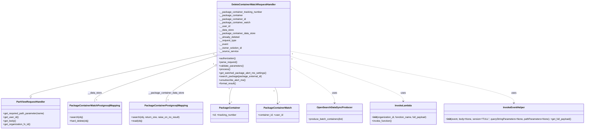
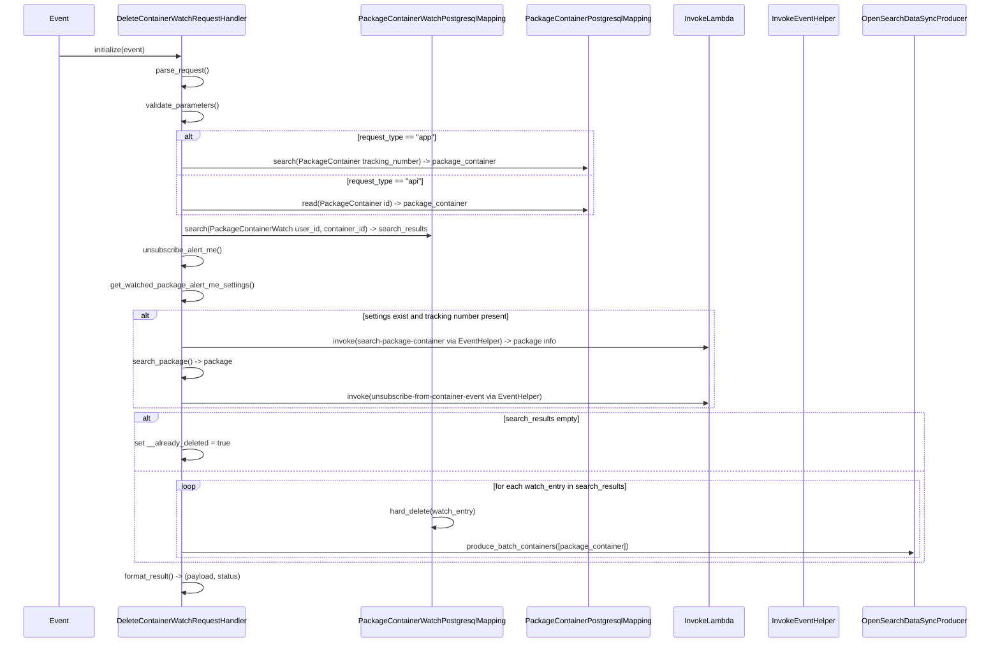

# Diagram: partview_core/partview_service/partview_service/api/package_container_watch/handlers/DeleteContainerWatchRequestHandler.py

> Auto-generated by Obscura crawlers

## Diagram 1

### SVG

<svg id="container" width="3845.3671875" xmlns="http://www.w3.org/2000/svg" class="classDiagram" height="864" viewBox="0 0 3845.3671875 864" role="graphics-document document" aria-roledescription="class"><g><defs><marker id="container_class-aggregationStart" class="marker aggregation class" refX="18" refY="7" markerWidth="190" markerHeight="240" orient="auto"><path d="M 18,7 L9,13 L1,7 L9,1 Z"></path></marker></defs><defs><marker id="container_class-aggregationEnd" class="marker aggregation class" refX="1" refY="7" markerWidth="20" markerHeight="28" orient="auto"><path d="M 18,7 L9,13 L1,7 L9,1 Z"></path></marker></defs><defs><marker id="container_class-extensionStart" class="marker extension class" refX="18" refY="7" markerWidth="190" markerHeight="240" orient="auto"><path d="M 1,7 L18,13 V 1 Z"></path></marker></defs><defs><marker id="container_class-extensionEnd" class="marker extension class" refX="1" refY="7" markerWidth="20" markerHeight="28" orient="auto"><path d="M 1,1 V 13 L18,7 Z"></path></marker></defs><defs><marker id="container_class-compositionStart" class="marker composition class" refX="18" refY="7" markerWidth="190" markerHeight="240" orient="auto"><path d="M 18,7 L9,13 L1,7 L9,1 Z"></path></marker></defs><defs><marker id="container_class-compositionEnd" class="marker composition class" refX="1" refY="7" markerWidth="20" markerHeight="28" orient="auto"><path d="M 18,7 L9,13 L1,7 L9,1 Z"></path></marker></defs><defs><marker id="container_class-dependencyStart" class="marker dependency class" refX="6" refY="7" markerWidth="190" markerHeight="240" orient="auto"><path d="M 5,7 L9,13 L1,7 L9,1 Z"></path></marker></defs><defs><marker id="container_class-dependencyEnd" class="marker dependency class" refX="13" refY="7" markerWidth="20" markerHeight="28" orient="auto"><path d="M 18,7 L9,13 L14,7 L9,1 Z"></path></marker></defs><defs><marker id="container_class-lollipopStart" class="marker lollipop class" refX="13" refY="7" markerWidth="190" markerHeight="240" orient="auto"><circle stroke="black" fill="transparent" cx="7" cy="7" r="6"></circle></marker></defs><defs><marker id="container_class-lollipopEnd" class="marker lollipop class" refX="1" refY="7" markerWidth="190" markerHeight="240" orient="auto"><circle stroke="black" fill="transparent" cx="7" cy="7" r="6"></circle></marker></defs><g class="root"><g class="clusters"></g><g class="edgePaths"><path d="M1417.117,349.614L1214.928,394.845C1012.74,440.076,608.362,530.538,406.173,579.061C203.984,627.583,203.984,634.167,203.984,637.458L203.984,640.75" id="id_DeleteContainerWatchRequestHandler_PartViewRequestHandler_1" class="edge-thickness-normal edge-pattern-solid relation" style=";;;" data-edge="true" data-et="edge" data-id="id_DeleteContainerWatchRequestHandler_PartViewRequestHandler_1" data-points="W3sieCI6MTQxNy4xMTcxODc1LCJ5IjozNDkuNjE0MzkxNDIxNzE4OX0seyJ4IjoyMDMuOTg0Mzc1LCJ5Ijo2MjF9LHsieCI6MjAzLjk4NDM3NSwieSI6NjU4fV0=" marker-end="url(#container_class-extensionEnd)"></path><path d="M1400.657,376.298L1270.57,417.081C1140.482,457.865,880.308,539.433,750.22,590.383C620.133,641.333,620.133,661.667,620.133,671.833L620.133,682" id="id_DeleteContainerWatchRequestHandler_PackageContainerWatchPostgresqlMapping_2" class="edge-thickness-normal edge-pattern-solid relation" style=";;;" data-edge="true" data-et="edge" data-id="id_DeleteContainerWatchRequestHandler_PackageContainerWatchPostgresqlMapping_2" data-points="W3sieCI6MTQxNy4xMTcxODc1LCJ5IjozNzEuMTM3MTYwNzcyMDE5MjN9LHsieCI6NjIwLjEzMjgxMjUsInkiOjYyMX0seyJ4Ijo2MjAuMTMyODEyNSwieSI6NjgyfV0=" marker-start="url(#container_class-aggregationStart)"></path><path d="M1402.102,440.03L1348.769,470.192C1295.437,500.354,1188.771,560.677,1135.438,601.005C1082.105,641.333,1082.105,661.667,1082.105,671.833L1082.105,682" id="id_DeleteContainerWatchRequestHandler_PackageContainerPostgresqlMapping_3" class="edge-thickness-normal edge-pattern-solid relation" style=";;;" data-edge="true" data-et="edge" data-id="id_DeleteContainerWatchRequestHandler_PackageContainerPostgresqlMapping_3" data-points="W3sieCI6MTQxNy4xMTcxODc1LCJ5Ijo0MzEuNTM4NzIwODgyMDE5MX0seyJ4IjoxMDgyLjEwNTQ2ODc1LCJ5Ijo2MjF9LHsieCI6MTA4Mi4xMDU0Njg3NSwieSI6NjgyfV0=" marker-start="url(#container_class-aggregationStart)"></path><path d="M1517.26,584L1514.273,590.167C1511.286,596.333,1505.311,608.667,1502.323,626.5C1499.336,644.333,1499.336,667.667,1499.336,679.333L1499.336,691" id="id_DeleteContainerWatchRequestHandler_PackageContainer_4" class="edge-thickness-normal edge-pattern-solid relation" style=";;;" data-edge="true" data-et="edge" data-id="id_DeleteContainerWatchRequestHandler_PackageContainer_4" data-points="W3sieCI6MTUxNy4yNjA0ODA3NjkyMzA4LCJ5Ijo1ODR9LHsieCI6MTQ5OS4zMzU5Mzc1LCJ5Ijo2MjF9LHsieCI6MTQ5OS4zMzU5Mzc1LCJ5Ijo2OTd9XQ==" marker-end="url(#container_class-dependencyEnd)"></path><path d="M1796.302,584L1799.289,590.167C1802.277,596.333,1808.252,608.667,1811.239,626.5C1814.227,644.333,1814.227,667.667,1814.227,679.333L1814.227,691" id="id_DeleteContainerWatchRequestHandler_PackageContainerWatch_5" class="edge-thickness-normal edge-pattern-solid relation" style=";;;" data-edge="true" data-et="edge" data-id="id_DeleteContainerWatchRequestHandler_PackageContainerWatch_5" data-points="W3sieCI6MTc5Ni4zMDIwMTkyMzA3NjkyLCJ5Ijo1ODR9LHsieCI6MTgxNC4yMjY1NjI1LCJ5Ijo2MjF9LHsieCI6MTgxNC4yMjY1NjI1LCJ5Ijo2OTd9XQ==" marker-end="url(#container_class-dependencyEnd)"></path><path d="M1896.445,442.671L1945.011,472.392C1993.577,502.114,2090.708,561.557,2139.274,602.445C2187.84,643.333,2187.84,665.667,2187.84,676.833L2187.84,688" id="id_DeleteContainerWatchRequestHandler_OpenSearchDataSyncProducer_6" class="edge-thickness-normal edge-pattern-dashed relation" style=";;;" data-edge="true" data-et="edge" data-id="id_DeleteContainerWatchRequestHandler_OpenSearchDataSyncProducer_6" data-points="W3sieCI6MTg5Ni40NDUzMTI1LCJ5Ijo0NDIuNjcwODU5MzUzNzM3NzR9LHsieCI6MjE4Ny44Mzk4NDM3NSwieSI6NjIxfSx7IngiOjIxODcuODM5ODQzNzUsInkiOjY5NH1d" marker-end="url(#container_class-dependencyEnd)"></path><path d="M1896.445,374.714L2021.426,415.761C2146.406,456.809,2396.367,538.905,2521.348,589.119C2646.328,639.333,2646.328,657.667,2646.328,666.833L2646.328,676" id="id_DeleteContainerWatchRequestHandler_InvokeLambda_7" class="edge-thickness-normal edge-pattern-dashed relation" style=";;;" data-edge="true" data-et="edge" data-id="id_DeleteContainerWatchRequestHandler_InvokeLambda_7" data-points="W3sieCI6MTg5Ni40NDUzMTI1LCJ5IjozNzQuNzEzNjIzNjU5ODE5MDZ9LHsieCI6MjY0Ni4zMjgxMjUsInkiOjYyMX0seyJ4IjoyNjQ2LjMyODEyNSwieSI6NjgyfV0=" marker-end="url(#container_class-dependencyEnd)"></path><path d="M1896.445,341.227L2143.541,387.855C2390.637,434.484,2884.828,527.742,3131.924,585.538C3379.02,643.333,3379.02,665.667,3379.02,676.833L3379.02,688" id="id_DeleteContainerWatchRequestHandler_InvokeEventHelper_8" class="edge-thickness-normal edge-pattern-dashed relation" style=";;;" data-edge="true" data-et="edge" data-id="id_DeleteContainerWatchRequestHandler_InvokeEventHelper_8" data-points="W3sieCI6MTg5Ni40NDUzMTI1LCJ5IjozNDEuMjI2NTA2MjA0NDUzMjR9LHsieCI6MzM3OS4wMTk1MzEyNSwieSI6NjIxfSx7IngiOjMzNzkuMDE5NTMxMjUsInkiOjY5NH1d" marker-end="url(#container_class-dependencyEnd)"></path></g><g class="edgeLabels"><g class="edgeLabel"><g class="label" data-id="id_DeleteContainerWatchRequestHandler_PartViewRequestHandler_1" transform="translate(0, 0)"><foreignObject width="0" height="0">

</foreignObject></g></g><g class="edgeLabel" transform="translate(620.1328125, 621)"><g class="label" data-id="id_DeleteContainerWatchRequestHandler_PackageContainerWatchPostgresqlMapping_2" transform="translate(-46.9453125, -12)"><foreignObject width="93.890625" height="24">

__data_store

</foreignObject></g></g><g class="edgeLabel" transform="translate(1082.10546875, 621)"><g class="label" data-id="id_DeleteContainerWatchRequestHandler_PackageContainerPostgresqlMapping_3" transform="translate(-118.3984375, -12)"><foreignObject width="236.796875" height="24">

__package_container_data_store

</foreignObject></g></g><g class="edgeLabel"><g class="label" data-id="id_DeleteContainerWatchRequestHandler_PackageContainer_4" transform="translate(0, 0)"><foreignObject width="0" height="0">

</foreignObject></g></g><g class="edgeLabel"><g class="label" data-id="id_DeleteContainerWatchRequestHandler_PackageContainerWatch_5" transform="translate(0, 0)"><foreignObject width="0" height="0">

</foreignObject></g></g><g class="edgeLabel" transform="translate(2187.83984375, 621)"><g class="label" data-id="id_DeleteContainerWatchRequestHandler_OpenSearchDataSyncProducer_6" transform="translate(-16.4921875, -12)"><foreignObject width="32.984375" height="24">

uses

</foreignObject></g></g><g class="edgeLabel" transform="translate(2646.328125, 621)"><g class="label" data-id="id_DeleteContainerWatchRequestHandler_InvokeLambda_7" transform="translate(-16.4921875, -12)"><foreignObject width="32.984375" height="24">

uses

</foreignObject></g></g><g class="edgeLabel" transform="translate(3379.01953125, 621)"><g class="label" data-id="id_DeleteContainerWatchRequestHandler_InvokeEventHelper_8" transform="translate(-16.4921875, -12)"><foreignObject width="32.984375" height="24">

uses

</foreignObject></g></g><g class="edgeTerminals" transform="translate(1395.9313017316465, 362.0592636563517)"><g class="inner" transform="translate(0, 0)"><foreignObject style="width: 9px; height: 12px;">
1
</foreignObject></g></g><g class="edgeTerminals" transform="translate(1394.5004038217044, 427.09674723384535)"><g class="inner" transform="translate(0, 0)"><foreignObject style="width: 9px; height: 12px;">
1
</foreignObject></g></g><g class="edgeTerminals" transform="translate(1496.131476254614, 593.209517234655)"><g class="inner" transform="translate(0, 0)"><foreignObject style="width: 9px; height: 12px;">
1
</foreignObject></g></g><g class="edgeTerminals" transform="translate(1790.4323454853834, 606.288942765345)"><g class="inner" transform="translate(0, 0)"><foreignObject style="width: 9px; height: 12px;">
1
</foreignObject></g></g><g class="edgeTerminals" transform="translate(1903.542043675079, 464.59998269170717)"><g class="inner" transform="translate(0, 0)"><foreignObject style="width: 9px; height: 12px;">
1
</foreignObject></g></g><g class="edgeTerminals" transform="translate(1908.3910303935581, 394.4252922996575)"><g class="inner" transform="translate(0, 0)"><foreignObject style="width: 9px; height: 12px;">
1
</foreignObject></g></g><g class="edgeTerminals" transform="translate(1910.8602766597376, 359.211466166361)"><g class="inner" transform="translate(0, 0)"><foreignObject style="width: 9px; height: 12px;">
1
</foreignObject></g></g><g class="edgeTerminals" transform="translate(630.13281125, 659.4999989285714)"><g class="inner" transform="translate(0, 0)"></g><foreignObject style="width: 9px; height: 12px;">
1
</foreignObject></g><g class="edgeTerminals" transform="translate(1092.105469375, 659.5000005357143)"><g class="inner" transform="translate(0, 0)"></g><foreignObject style="width: 9px; height: 12px;">
1
</foreignObject></g><g class="edgeTerminals" transform="translate(1509.33593875, 674.5000010714285)"><g class="inner" transform="translate(0, 0)"></g><foreignObject style="width: 9px; height: 12px;">
1
</foreignObject></g><g class="edgeTerminals" transform="translate(1824.22656125, 674.4999989285715)"><g class="inner" transform="translate(0, 0)"></g><foreignObject style="width: 9px; height: 12px;">
1
</foreignObject></g></g><g class="nodes"><g class="node default" id="classId-DeleteContainerWatchRequestHandler-0" transform="translate(1656.78125, 296)"><g class="basic label-container"><path d="M-239.6640625 -288 L239.6640625 -288 L239.6640625 288 L-239.6640625 288" stroke="none" stroke-width="0" fill="#ECECFF" style=""></path><path d="M-239.6640625 -288 C-91.89545258081176 -288, 55.87315733837647 -288, 239.6640625 -288 M-239.6640625 -288 C-124.37260514069555 -288, -9.08114778139111 -288, 239.6640625 -288 M239.6640625 -288 C239.6640625 -116.53636670727971, 239.6640625 54.92726658544058, 239.6640625 288 M239.6640625 -288 C239.6640625 -156.0848222506569, 239.6640625 -24.169644501313826, 239.6640625 288 M239.6640625 288 C116.04369259320416 288, -7.576677313591688 288, -239.6640625 288 M239.6640625 288 C67.65848555673108 288, -104.34709138653784 288, -239.6640625 288 M-239.6640625 288 C-239.6640625 131.67298647072093, -239.6640625 -24.654027058558142, -239.6640625 -288 M-239.6640625 288 C-239.6640625 153.8763551022213, -239.6640625 19.75271020444262, -239.6640625 -288" stroke="#9370DB" stroke-width="1.3" fill="none" stroke-dasharray="0 0" style=""></path></g><g class="annotation-group text" transform="translate(0, -264)"></g><g class="label-group text" transform="translate(-140.71875, -264)"><g class="label" style="font-weight: bolder" transform="translate(0,-12)"><foreignObject width="281.4375" height="24">

DeleteContainerWatchRequestHandler

</foreignObject></g></g><g class="members-group text" transform="translate(-227.6640625, -216)"><g class="label" style="" transform="translate(0,-12)"><foreignObject width="287.5625" height="24">

-__package_container_tracking_number

</foreignObject></g><g class="label" style="" transform="translate(0,12)"><foreignObject width="157.515625" height="24">

-__package_container

</foreignObject></g><g class="label" style="" transform="translate(0,36)"><foreignObject width="178.625" height="24">

-__package_container_id

</foreignObject></g><g class="label" style="" transform="translate(0,60)"><foreignObject width="206.78125" height="24">

-__package_container_watch

</foreignObject></g><g class="label" style="" transform="translate(0,84)"><foreignObject width="74.140625" height="24">

-__user_id

</foreignObject></g><g class="label" style="" transform="translate(0,108)"><foreignObject width="99.0625" height="24">

-__data_store

</foreignObject></g><g class="label" style="" transform="translate(0,132)"><foreignObject width="241.953125" height="24">

-__package_container_data_store

</foreignObject></g><g class="label" style="" transform="translate(0,156)"><foreignObject width="137.921875" height="24">

-__already_deleted

</foreignObject></g><g class="label" style="" transform="translate(0,180)"><foreignObject width="116.71875" height="24">

-__request_type

</foreignObject></g><g class="label" style="" transform="translate(0,204)"><foreignObject width="61.671875" height="24">

-__event

</foreignObject></g><g class="label" style="" transform="translate(0,228)"><foreignObject width="155.6875" height="24">

-__owner_solution_id

</foreignObject></g><g class="label" style="" transform="translate(0,252)"><foreignObject width="128.328125" height="24">

-__source_service

</foreignObject></g></g><g class="methods-group text" transform="translate(-227.6640625, 96)"><g class="label" style="" transform="translate(0,-12)"><foreignObject width="115.78125" height="24">

+authorization()

</foreignObject></g><g class="label" style="" transform="translate(0,12)"><foreignObject width="121.796875" height="24">

+parse_request()

</foreignObject></g><g class="label" style="" transform="translate(0,36)"><foreignObject width="166.546875" height="24">

+validate_parameters()

</foreignObject></g><g class="label" style="" transform="translate(0,60)"><foreignObject width="73.734375" height="24">

+process()

</foreignObject></g><g class="label" style="" transform="translate(0,84)"><foreignObject width="314.609375" height="24">

+get_watched_package_alert_me_settings()

</foreignObject></g><g class="label" style="" transform="translate(0,108)"><foreignObject width="281.546875" height="24">

+search_package(package_external_id)

</foreignObject></g><g class="label" style="" transform="translate(0,132)"><foreignObject width="179.625" height="24">

+unsubscribe_alert_me()

</foreignObject></g><g class="label" style="" transform="translate(0,156)"><foreignObject width="117.015625" height="24">

+format_result()

</foreignObject></g></g><g class="divider" style=""><path d="M-239.6640625 -240 C-120.451813355441 -240, -1.2395642108820084 -240, 239.6640625 -240 M-239.6640625 -240 C-85.5853573069009 -240, 68.4933478861982 -240, 239.6640625 -240" stroke="#9370DB" stroke-width="1.3" fill="none" stroke-dasharray="0 0" style=""></path></g><g class="divider" style=""><path d="M-239.6640625 72 C-131.5535470335163 72, -23.44303156703262 72, 239.6640625 72 M-239.6640625 72 C-51.309160994208355 72, 137.0457405115833 72, 239.6640625 72" stroke="#9370DB" stroke-width="1.3" fill="none" stroke-dasharray="0 0" style=""></path></g></g><g class="node default" id="classId-PartViewRequestHandler-1" transform="translate(203.984375, 757)"><g class="basic label-container"><path d="M-195.984375 -99 L195.984375 -99 L195.984375 99 L-195.984375 99" stroke="none" stroke-width="0" fill="#ECECFF" style=""></path><path d="M-195.984375 -99 C-107.17949893409694 -99, -18.37462286819388 -99, 195.984375 -99 M-195.984375 -99 C-59.199752094038274 -99, 77.58487081192345 -99, 195.984375 -99 M195.984375 -99 C195.984375 -37.87856602768638, 195.984375 23.242867944627235, 195.984375 99 M195.984375 -99 C195.984375 -37.67347323004108, 195.984375 23.653053539917835, 195.984375 99 M195.984375 99 C45.621115637222175 99, -104.74214372555565 99, -195.984375 99 M195.984375 99 C106.8282496863538 99, 17.6721243727076 99, -195.984375 99 M-195.984375 99 C-195.984375 57.60301686933067, -195.984375 16.206033738661347, -195.984375 -99 M-195.984375 99 C-195.984375 53.026174753350745, -195.984375 7.052349506701489, -195.984375 -99" stroke="#9370DB" stroke-width="1.3" fill="none" stroke-dasharray="0 0" style=""></path></g><g class="annotation-group text" transform="translate(0, -75)"></g><g class="label-group text" transform="translate(-91.359375, -75)"><g class="label" style="font-weight: bolder" transform="translate(0,-12)"><foreignObject width="182.71875" height="24">

PartViewRequestHandler

</foreignObject></g></g><g class="members-group text" transform="translate(-183.984375, -27)"></g><g class="methods-group text" transform="translate(-183.984375, 3)"><g class="label" style="" transform="translate(0,-12)"><foreignObject width="276.609375" height="24">

+get_required_path_parameter(name)

</foreignObject></g><g class="label" style="" transform="translate(0,12)"><foreignObject width="101.71875" height="24">

+get_user_id()

</foreignObject></g><g class="label" style="" transform="translate(0,36)"><foreignObject width="85.53125" height="24">

+get_body()

</foreignObject></g><g class="label" style="" transform="translate(0,60)"><foreignObject width="182.421875" height="24">

+get_organization_fv_id()

</foreignObject></g></g><g class="divider" style=""><path d="M-195.984375 -51 C-97.23431981784877 -51, 1.5157353643024578 -51, 195.984375 -51 M-195.984375 -51 C-80.01643736329144 -51, 35.95150027341711 -51, 195.984375 -51" stroke="#9370DB" stroke-width="1.3" fill="none" stroke-dasharray="0 0" style=""></path></g><g class="divider" style=""><path d="M-195.984375 -27 C-95.45426462411145 -27, 5.075845751777109 -27, 195.984375 -27 M-195.984375 -27 C-78.6438291098874 -27, 38.69671678022519 -27, 195.984375 -27" stroke="#9370DB" stroke-width="1.3" fill="none" stroke-dasharray="0 0" style=""></path></g></g><g class="node default" id="classId-PackageContainer-2" transform="translate(1499.3359375, 757)"><g class="basic label-container"><path d="M-125.421875 -60 L125.421875 -60 L125.421875 60 L-125.421875 60" stroke="none" stroke-width="0" fill="#ECECFF" style=""></path><path d="M-125.421875 -60 C-47.823619885976285 -60, 29.77463522804743 -60, 125.421875 -60 M-125.421875 -60 C-63.94963816838924 -60, -2.4774013367784846 -60, 125.421875 -60 M125.421875 -60 C125.421875 -17.51597968659629, 125.421875 24.968040626807422, 125.421875 60 M125.421875 -60 C125.421875 -15.317303218129105, 125.421875 29.36539356374179, 125.421875 60 M125.421875 60 C68.26405681807601 60, 11.106238636152028 60, -125.421875 60 M125.421875 60 C71.44776627793186 60, 17.47365755586371 60, -125.421875 60 M-125.421875 60 C-125.421875 19.092578389090313, -125.421875 -21.814843221819373, -125.421875 -60 M-125.421875 60 C-125.421875 21.798365783004193, -125.421875 -16.403268433991613, -125.421875 -60" stroke="#9370DB" stroke-width="1.3" fill="none" stroke-dasharray="0 0" style=""></path></g><g class="annotation-group text" transform="translate(0, -36)"></g><g class="label-group text" transform="translate(-65.453125, -36)"><g class="label" style="font-weight: bolder" transform="translate(0,-12)"><foreignObject width="130.90625" height="24">

PackageContainer

</foreignObject></g></g><g class="members-group text" transform="translate(-113.421875, 12)"><g class="label" style="" transform="translate(0,-12)"><foreignObject width="161.390625" height="24">

+id; +tracking_number

</foreignObject></g></g><g class="methods-group text" transform="translate(-113.421875, 60)"></g><g class="divider" style=""><path d="M-125.421875 -12 C-57.56448892915594 -12, 10.292897141688115 -12, 125.421875 -12 M-125.421875 -12 C-26.23697152730226 -12, 72.94793194539548 -12, 125.421875 -12" stroke="#9370DB" stroke-width="1.3" fill="none" stroke-dasharray="0 0" style=""></path></g><g class="divider" style=""><path d="M-125.421875 36 C-63.6824771014095 36, -1.943079202819007 36, 125.421875 36 M-125.421875 36 C-60.157400855369374 36, 5.107073289261251 36, 125.421875 36" stroke="#9370DB" stroke-width="1.3" fill="none" stroke-dasharray="0 0" style=""></path></g></g><g class="node default" id="classId-PackageContainerWatch-3" transform="translate(1814.2265625, 757)"><g class="basic label-container"><path d="M-139.46875 -60 L139.46875 -60 L139.46875 60 L-139.46875 60" stroke="none" stroke-width="0" fill="#ECECFF" style=""></path><path d="M-139.46875 -60 C-58.4476418765266 -60, 22.573466246946793 -60, 139.46875 -60 M-139.46875 -60 C-28.549996160723268 -60, 82.36875767855346 -60, 139.46875 -60 M139.46875 -60 C139.46875 -13.055989396736663, 139.46875 33.88802120652667, 139.46875 60 M139.46875 -60 C139.46875 -25.148152278145375, 139.46875 9.70369544370925, 139.46875 60 M139.46875 60 C33.70807349589468 60, -72.05260300821064 60, -139.46875 60 M139.46875 60 C31.319816287851566 60, -76.82911742429687 60, -139.46875 60 M-139.46875 60 C-139.46875 32.02461003400859, -139.46875 4.049220068017185, -139.46875 -60 M-139.46875 60 C-139.46875 26.538107157568845, -139.46875 -6.92378568486231, -139.46875 -60" stroke="#9370DB" stroke-width="1.3" fill="none" stroke-dasharray="0 0" style=""></path></g><g class="annotation-group text" transform="translate(0, -36)"></g><g class="label-group text" transform="translate(-87.765625, -36)"><g class="label" style="font-weight: bolder" transform="translate(0,-12)"><foreignObject width="175.53125" height="24">

PackageContainerWatch

</foreignObject></g></g><g class="members-group text" transform="translate(-127.46875, 12)"><g class="label" style="" transform="translate(0,-12)"><foreignObject width="167.171875" height="24">

+container_id; +user_id

</foreignObject></g></g><g class="methods-group text" transform="translate(-127.46875, 60)"></g><g class="divider" style=""><path d="M-139.46875 -12 C-30.51533988191514 -12, 78.43807023616972 -12, 139.46875 -12 M-139.46875 -12 C-38.08788269572965 -12, 63.292984608540706 -12, 139.46875 -12" stroke="#9370DB" stroke-width="1.3" fill="none" stroke-dasharray="0 0" style=""></path></g><g class="divider" style=""><path d="M-139.46875 36 C-33.21103595290708 36, 73.04667809418584 36, 139.46875 36 M-139.46875 36 C-48.41226775039415 36, 42.6442144992117 36, 139.46875 36" stroke="#9370DB" stroke-width="1.3" fill="none" stroke-dasharray="0 0" style=""></path></g></g><g class="node default" id="classId-PackageContainerWatchPostgresqlMapping-4" transform="translate(620.1328125, 757)"><g class="basic label-container"><path d="M-170.1640625 -75 L170.1640625 -75 L170.1640625 75 L-170.1640625 75" stroke="none" stroke-width="0" fill="#ECECFF" style=""></path><path d="M-170.1640625 -75 C-46.368633531004946 -75, 77.42679543799011 -75, 170.1640625 -75 M-170.1640625 -75 C-93.30619739621994 -75, -16.448332292439886 -75, 170.1640625 -75 M170.1640625 -75 C170.1640625 -41.611703919421714, 170.1640625 -8.223407838843428, 170.1640625 75 M170.1640625 -75 C170.1640625 -39.05321772368851, 170.1640625 -3.1064354473770237, 170.1640625 75 M170.1640625 75 C80.81343436908492 75, -8.537193761830167 75, -170.1640625 75 M170.1640625 75 C62.849676872318014 75, -44.46470875536397 75, -170.1640625 75 M-170.1640625 75 C-170.1640625 39.4485053848342, -170.1640625 3.897010769668398, -170.1640625 -75 M-170.1640625 75 C-170.1640625 41.148349527214336, -170.1640625 7.296699054428672, -170.1640625 -75" stroke="#9370DB" stroke-width="1.3" fill="none" stroke-dasharray="0 0" style=""></path></g><g class="annotation-group text" transform="translate(0, -51)"></g><g class="label-group text" transform="translate(-158.1640625, -51)"><g class="label" style="font-weight: bolder" transform="translate(0,-12)"><foreignObject width="316.328125" height="24">

PackageContainerWatchPostgresqlMapping

</foreignObject></g></g><g class="members-group text" transform="translate(-158.1640625, -3)"></g><g class="methods-group text" transform="translate(-158.1640625, 27)"><g class="label" style="" transform="translate(0,-12)"><foreignObject width="89.140625" height="24">

+search(obj)

</foreignObject></g><g class="label" style="" transform="translate(0,12)"><foreignObject width="128.90625" height="24">

+hard_delete(obj)

</foreignObject></g></g><g class="divider" style=""><path d="M-170.1640625 -27 C-56.58096074989422 -27, 57.002141000211566 -27, 170.1640625 -27 M-170.1640625 -27 C-77.23601758900058 -27, 15.692027321998836 -27, 170.1640625 -27" stroke="#9370DB" stroke-width="1.3" fill="none" stroke-dasharray="0 0" style=""></path></g><g class="divider" style=""><path d="M-170.1640625 -3 C-39.04640193132124 -3, 92.07125863735752 -3, 170.1640625 -3 M-170.1640625 -3 C-51.230041141807746 -3, 67.70398021638451 -3, 170.1640625 -3" stroke="#9370DB" stroke-width="1.3" fill="none" stroke-dasharray="0 0" style=""></path></g></g><g class="node default" id="classId-PackageContainerPostgresqlMapping-5" transform="translate(1082.10546875, 757)"><g class="basic label-container"><path d="M-241.80859375 -75 L241.80859375 -75 L241.80859375 75 L-241.80859375 75" stroke="none" stroke-width="0" fill="#ECECFF" style=""></path><path d="M-241.80859375 -75 C-127.53108630730034 -75, -13.253578864600684 -75, 241.80859375 -75 M-241.80859375 -75 C-100.93707351225541 -75, 39.93444672548918 -75, 241.80859375 -75 M241.80859375 -75 C241.80859375 -26.335486409334898, 241.80859375 22.329027181330204, 241.80859375 75 M241.80859375 -75 C241.80859375 -24.097872504192722, 241.80859375 26.804254991614556, 241.80859375 75 M241.80859375 75 C72.16484126431519 75, -97.47891122136963 75, -241.80859375 75 M241.80859375 75 C71.02724750770469 75, -99.75409873459063 75, -241.80859375 75 M-241.80859375 75 C-241.80859375 44.933987091768344, -241.80859375 14.867974183536695, -241.80859375 -75 M-241.80859375 75 C-241.80859375 33.51579616998595, -241.80859375 -7.968407660028106, -241.80859375 -75" stroke="#9370DB" stroke-width="1.3" fill="none" stroke-dasharray="0 0" style=""></path></g><g class="annotation-group text" transform="translate(0, -51)"></g><g class="label-group text" transform="translate(-135.8515625, -51)"><g class="label" style="font-weight: bolder" transform="translate(0,-12)"><foreignObject width="271.703125" height="24">

PackageContainerPostgresqlMapping

</foreignObject></g></g><g class="members-group text" transform="translate(-229.80859375, -3)"></g><g class="methods-group text" transform="translate(-229.80859375, 27)"><g class="label" style="" transform="translate(0,-12)"><foreignObject width="323.765625" height="24">

+search(obj, return_one, raise_on_no_result)

</foreignObject></g><g class="label" style="" transform="translate(0,12)"><foreignObject width="74.21875" height="24">

+read(obj)

</foreignObject></g></g><g class="divider" style=""><path d="M-241.80859375 -27 C-110.22074336122395 -27, 21.367107027552095 -27, 241.80859375 -27 M-241.80859375 -27 C-104.57729142782406 -27, 32.65401089435187 -27, 241.80859375 -27" stroke="#9370DB" stroke-width="1.3" fill="none" stroke-dasharray="0 0" style=""></path></g><g class="divider" style=""><path d="M-241.80859375 -3 C-57.84054436274556 -3, 126.12750502450888 -3, 241.80859375 -3 M-241.80859375 -3 C-50.25753997426196 -3, 141.29351380147608 -3, 241.80859375 -3" stroke="#9370DB" stroke-width="1.3" fill="none" stroke-dasharray="0 0" style=""></path></g></g><g class="node default" id="classId-OpenSearchDataSyncProducer-6" transform="translate(2187.83984375, 757)"><g class="basic label-container"><path d="M-184.14453125 -63 L184.14453125 -63 L184.14453125 63 L-184.14453125 63" stroke="none" stroke-width="0" fill="#ECECFF" style=""></path><path d="M-184.14453125 -63 C-47.363334732651595 -63, 89.41786178469681 -63, 184.14453125 -63 M-184.14453125 -63 C-45.224368594188064 -63, 93.69579406162387 -63, 184.14453125 -63 M184.14453125 -63 C184.14453125 -35.31815089123786, 184.14453125 -7.636301782475726, 184.14453125 63 M184.14453125 -63 C184.14453125 -18.842348168804747, 184.14453125 25.315303662390505, 184.14453125 63 M184.14453125 63 C41.62426942810035 63, -100.8959923937993 63, -184.14453125 63 M184.14453125 63 C52.1068730783125 63, -79.930785093375 63, -184.14453125 63 M-184.14453125 63 C-184.14453125 22.31306273917926, -184.14453125 -18.373874521641483, -184.14453125 -63 M-184.14453125 63 C-184.14453125 23.58892949544734, -184.14453125 -15.822141009105323, -184.14453125 -63" stroke="#9370DB" stroke-width="1.3" fill="none" stroke-dasharray="0 0" style=""></path></g><g class="annotation-group text" transform="translate(0, -39)"></g><g class="label-group text" transform="translate(-110.9765625, -39)"><g class="label" style="font-weight: bolder" transform="translate(0,-12)"><foreignObject width="221.953125" height="24">

OpenSearchDataSyncProducer

</foreignObject></g></g><g class="members-group text" transform="translate(-172.14453125, 9)"></g><g class="methods-group text" transform="translate(-172.14453125, 39)"><g class="label" style="" transform="translate(0,-12)"><foreignObject width="233.3125" height="24">

+produce_batch_containers(list)

</foreignObject></g></g><g class="divider" style=""><path d="M-184.14453125 -15 C-38.96079436161091 -15, 106.22294252677818 -15, 184.14453125 -15 M-184.14453125 -15 C-45.37781601064128 -15, 93.38889922871743 -15, 184.14453125 -15" stroke="#9370DB" stroke-width="1.3" fill="none" stroke-dasharray="0 0" style=""></path></g><g class="divider" style=""><path d="M-184.14453125 9 C-55.070705077309356 9, 74.00312109538129 9, 184.14453125 9 M-184.14453125 9 C-88.48714386594499 9, 7.170243518110027 9, 184.14453125 9" stroke="#9370DB" stroke-width="1.3" fill="none" stroke-dasharray="0 0" style=""></path></g></g><g class="node default" id="classId-InvokeLambda-7" transform="translate(2646.328125, 757)"><g class="basic label-container"><path d="M-224.34375 -75 L224.34375 -75 L224.34375 75 L-224.34375 75" stroke="none" stroke-width="0" fill="#ECECFF" style=""></path><path d="M-224.34375 -75 C-97.53897858766935 -75, 29.265792824661304 -75, 224.34375 -75 M-224.34375 -75 C-102.15308878967116 -75, 20.037572420657682 -75, 224.34375 -75 M224.34375 -75 C224.34375 -23.49624936140711, 224.34375 28.00750127718578, 224.34375 75 M224.34375 -75 C224.34375 -40.46848919949955, 224.34375 -5.936978398999102, 224.34375 75 M224.34375 75 C115.27555656388736 75, 6.207363127774727 75, -224.34375 75 M224.34375 75 C118.09866567431375 75, 11.8535813486275 75, -224.34375 75 M-224.34375 75 C-224.34375 25.91884803364487, -224.34375 -23.16230393271026, -224.34375 -75 M-224.34375 75 C-224.34375 20.581024798387432, -224.34375 -33.837950403225136, -224.34375 -75" stroke="#9370DB" stroke-width="1.3" fill="none" stroke-dasharray="0 0" style=""></path></g><g class="annotation-group text" transform="translate(0, -51)"></g><g class="label-group text" transform="translate(-53.484375, -51)"><g class="label" style="font-weight: bolder" transform="translate(0,-12)"><foreignObject width="106.96875" height="24">

InvokeLambda

</foreignObject></g></g><g class="members-group text" transform="translate(-212.34375, -3)"></g><g class="methods-group text" transform="translate(-212.34375, 27)"><g class="label" style="" transform="translate(0,-12)"><foreignObject width="371.203125" height="24">

+<strong>init</strong>(organization_id, function_name, full_payload)

</foreignObject></g><g class="label" style="" transform="translate(0,12)"><foreignObject width="134.4375" height="24">

+invoke_function()

</foreignObject></g></g><g class="divider" style=""><path d="M-224.34375 -27 C-53.52567696897441 -27, 117.29239606205118 -27, 224.34375 -27 M-224.34375 -27 C-95.42953072100516 -27, 33.48468855798967 -27, 224.34375 -27" stroke="#9370DB" stroke-width="1.3" fill="none" stroke-dasharray="0 0" style=""></path></g><g class="divider" style=""><path d="M-224.34375 -3 C-76.22593577787805 -3, 71.8918784442439 -3, 224.34375 -3 M-224.34375 -3 C-126.14357775614164 -3, -27.943405512283277 -3, 224.34375 -3" stroke="#9370DB" stroke-width="1.3" fill="none" stroke-dasharray="0 0" style=""></path></g></g><g class="node default" id="classId-InvokeEventHelper-8" transform="translate(3379.01953125, 757)"><g class="basic label-container"><path d="M-458.34765625 -63 L458.34765625 -63 L458.34765625 63 L-458.34765625 63" stroke="none" stroke-width="0" fill="#ECECFF" style=""></path><path d="M-458.34765625 -63 C-110.28734478891704 -63, 237.77296667216592 -63, 458.34765625 -63 M-458.34765625 -63 C-271.0703861004224 -63, -83.79311595084476 -63, 458.34765625 -63 M458.34765625 -63 C458.34765625 -31.686089689215766, 458.34765625 -0.37217937843153237, 458.34765625 63 M458.34765625 -63 C458.34765625 -37.70345466276551, 458.34765625 -12.406909325531018, 458.34765625 63 M458.34765625 63 C198.32657532692826 63, -61.69450559614347 63, -458.34765625 63 M458.34765625 63 C165.5680035500573 63, -127.21164914988537 63, -458.34765625 63 M-458.34765625 63 C-458.34765625 31.697200604777972, -458.34765625 0.3944012095559444, -458.34765625 -63 M-458.34765625 63 C-458.34765625 20.976986215986756, -458.34765625 -21.04602756802649, -458.34765625 -63" stroke="#9370DB" stroke-width="1.3" fill="none" stroke-dasharray="0 0" style=""></path></g><g class="annotation-group text" transform="translate(0, -39)"></g><g class="label-group text" transform="translate(-69.0859375, -39)"><g class="label" style="font-weight: bolder" transform="translate(0,-12)"><foreignObject width="138.171875" height="24">

InvokeEventHelper

</foreignObject></g></g><g class="members-group text" transform="translate(-446.34765625, 9)"></g><g class="methods-group text" transform="translate(-446.34765625, 39)"><g class="label" style="" transform="translate(0,-12)"><foreignObject width="823.609375" height="24">

+<strong>init</strong>(event, body=None, version="FULL", queryStringParameters=None, pathParameters=None); +get_full_payload()

</foreignObject></g></g><g class="divider" style=""><path d="M-458.34765625 -15 C-106.40099364476566 -15, 245.54566896046867 -15, 458.34765625 -15 M-458.34765625 -15 C-243.94854708305635 -15, -29.54943791611271 -15, 458.34765625 -15" stroke="#9370DB" stroke-width="1.3" fill="none" stroke-dasharray="0 0" style=""></path></g><g class="divider" style=""><path d="M-458.34765625 9 C-196.21796473723606 9, 65.91172677552788 9, 458.34765625 9 M-458.34765625 9 C-121.05921387076472 9, 216.22922850847056 9, 458.34765625 9" stroke="#9370DB" stroke-width="1.3" fill="none" stroke-dasharray="0 0" style=""></path></g></g></g></g></g></svg>

## Diagram 2

### SVG

<svg id="container" width="2233" xmlns="http://www.w3.org/2000/svg" height="1421" viewBox="-50 -10 2233 1421" role="graphics-document document" aria-roledescription="sequence"><g><rect x="1893" y="1335" fill="#eaeaea" stroke="#666" width="240" height="65" name="OpenSearch" rx="3" ry="3" class="actor actor-bottom"></rect><text x="2013" y="1367.5" dominant-baseline="central" alignment-baseline="central" class="actor actor-box" style="text-anchor: middle; font-size: 16px; font-weight: 400;"><tspan x="2013" dy="0">OpenSearchDataSyncProducer</tspan></text></g><g><rect x="1686" y="1335" fill="#eaeaea" stroke="#666" width="157" height="65" name="EventHelper" rx="3" ry="3" class="actor actor-bottom"></rect><text x="1764.5" y="1367.5" dominant-baseline="central" alignment-baseline="central" class="actor actor-box" style="text-anchor: middle; font-size: 16px; font-weight: 400;"><tspan x="1764.5" dy="0">InvokeEventHelper</tspan></text></g><g><rect x="1486" y="1335" fill="#eaeaea" stroke="#666" width="150" height="65" name="Lambda" rx="3" ry="3" class="actor actor-bottom"></rect><text x="1561" y="1367.5" dominant-baseline="central" alignment-baseline="central" class="actor actor-box" style="text-anchor: middle; font-size: 16px; font-weight: 400;"><tspan x="1561" dy="0">InvokeLambda</tspan></text></g><g><rect x="1149" y="1335" fill="#eaeaea" stroke="#666" width="287" height="65" name="DataStoreContainer" rx="3" ry="3" class="actor actor-bottom"></rect><text x="1292.5" y="1367.5" dominant-baseline="central" alignment-baseline="central" class="actor actor-box" style="text-anchor: middle; font-size: 16px; font-weight: 400;"><tspan x="1292.5" dy="0">PackageContainerPostgresqlMapping</tspan></text></g><g><rect x="768" y="1335" fill="#eaeaea" stroke="#666" width="331" height="65" name="DataStoreWatch" rx="3" ry="3" class="actor actor-bottom"></rect><text x="933.5" y="1367.5" dominant-baseline="central" alignment-baseline="central" class="actor actor-box" style="text-anchor: middle; font-size: 16px; font-weight: 400;"><tspan x="933.5" dy="0">PackageContainerWatchPostgresqlMapping</tspan></text></g><g><rect x="200" y="1335" fill="#eaeaea" stroke="#666" width="299" height="65" name="Handler" rx="3" ry="3" class="actor actor-bottom"></rect><text x="349.5" y="1367.5" dominant-baseline="central" alignment-baseline="central" class="actor actor-box" style="text-anchor: middle; font-size: 16px; font-weight: 400;"><tspan x="349.5" dy="0">DeleteContainerWatchRequestHandler</tspan></text></g><g><rect x="0" y="1335" fill="#eaeaea" stroke="#666" width="150" height="65" name="Event" rx="3" ry="3" class="actor actor-bottom"></rect><text x="75" y="1367.5" dominant-baseline="central" alignment-baseline="central" class="actor actor-box" style="text-anchor: middle; font-size: 16px; font-weight: 400;"><tspan x="75" dy="0">Event</tspan></text></g><g><line id="actor6" x1="2013" y1="65" x2="2013" y2="1335" class="actor-line 200" stroke-width="0.5px" stroke="#999" name="OpenSearch"></line><g id="root-6"><rect x="1893" y="0" fill="#eaeaea" stroke="#666" width="240" height="65" name="OpenSearch" rx="3" ry="3" class="actor actor-top"></rect><text x="2013" y="32.5" dominant-baseline="central" alignment-baseline="central" class="actor actor-box" style="text-anchor: middle; font-size: 16px; font-weight: 400;"><tspan x="2013" dy="0">OpenSearchDataSyncProducer</tspan></text></g></g><g><line id="actor5" x1="1764.5" y1="65" x2="1764.5" y2="1335" class="actor-line 200" stroke-width="0.5px" stroke="#999" name="EventHelper"></line><g id="root-5"><rect x="1686" y="0" fill="#eaeaea" stroke="#666" width="157" height="65" name="EventHelper" rx="3" ry="3" class="actor actor-top"></rect><text x="1764.5" y="32.5" dominant-baseline="central" alignment-baseline="central" class="actor actor-box" style="text-anchor: middle; font-size: 16px; font-weight: 400;"><tspan x="1764.5" dy="0">InvokeEventHelper</tspan></text></g></g><g><line id="actor4" x1="1561" y1="65" x2="1561" y2="1335" class="actor-line 200" stroke-width="0.5px" stroke="#999" name="Lambda"></line><g id="root-4"><rect x="1486" y="0" fill="#eaeaea" stroke="#666" width="150" height="65" name="Lambda" rx="3" ry="3" class="actor actor-top"></rect><text x="1561" y="32.5" dominant-baseline="central" alignment-baseline="central" class="actor actor-box" style="text-anchor: middle; font-size: 16px; font-weight: 400;"><tspan x="1561" dy="0">InvokeLambda</tspan></text></g></g><g><line id="actor3" x1="1292.5" y1="65" x2="1292.5" y2="1335" class="actor-line 200" stroke-width="0.5px" stroke="#999" name="DataStoreContainer"></line><g id="root-3"><rect x="1149" y="0" fill="#eaeaea" stroke="#666" width="287" height="65" name="DataStoreContainer" rx="3" ry="3" class="actor actor-top"></rect><text x="1292.5" y="32.5" dominant-baseline="central" alignment-baseline="central" class="actor actor-box" style="text-anchor: middle; font-size: 16px; font-weight: 400;"><tspan x="1292.5" dy="0">PackageContainerPostgresqlMapping</tspan></text></g></g><g><line id="actor2" x1="933.5" y1="65" x2="933.5" y2="1335" class="actor-line 200" stroke-width="0.5px" stroke="#999" name="DataStoreWatch"></line><g id="root-2"><rect x="768" y="0" fill="#eaeaea" stroke="#666" width="331" height="65" name="DataStoreWatch" rx="3" ry="3" class="actor actor-top"></rect><text x="933.5" y="32.5" dominant-baseline="central" alignment-baseline="central" class="actor actor-box" style="text-anchor: middle; font-size: 16px; font-weight: 400;"><tspan x="933.5" dy="0">PackageContainerWatchPostgresqlMapping</tspan></text></g></g><g><line id="actor1" x1="349.5" y1="65" x2="349.5" y2="1335" class="actor-line 200" stroke-width="0.5px" stroke="#999" name="Handler"></line><g id="root-1"><rect x="200" y="0" fill="#eaeaea" stroke="#666" width="299" height="65" name="Handler" rx="3" ry="3" class="actor actor-top"></rect><text x="349.5" y="32.5" dominant-baseline="central" alignment-baseline="central" class="actor actor-box" style="text-anchor: middle; font-size: 16px; font-weight: 400;"><tspan x="349.5" dy="0">DeleteContainerWatchRequestHandler</tspan></text></g></g><g><line id="actor0" x1="75" y1="65" x2="75" y2="1335" class="actor-line 200" stroke-width="0.5px" stroke="#999" name="Event"></line><g id="root-0"><rect x="0" y="0" fill="#eaeaea" stroke="#666" width="150" height="65" name="Event" rx="3" ry="3" class="actor actor-top"></rect><text x="75" y="32.5" dominant-baseline="central" alignment-baseline="central" class="actor actor-box" style="text-anchor: middle; font-size: 16px; font-weight: 400;"><tspan x="75" dy="0">Event</tspan></text></g></g><g></g><defs><symbol id="computer" width="24" height="24"><path transform="scale(.5)" d="M2 2v13h20v-13h-20zm18 11h-16v-9h16v9zm-10.228 6l.466-1h3.524l.467 1h-4.457zm14.228 3h-24l2-6h2.104l-1.33 4h18.45l-1.297-4h2.073l2 6zm-5-10h-14v-7h14v7z"></path></symbol></defs><defs><symbol id="database" fill-rule="evenodd" clip-rule="evenodd"><path transform="scale(.5)" d="M12.258.001l.256.004.255.005.253.008.251.01.249.012.247.015.246.016.242.019.241.02.239.023.236.024.233.027.231.028.229.031.225.032.223.034.22.036.217.038.214.04.211.041.208.043.205.045.201.046.198.048.194.05.191.051.187.053.183.054.18.056.175.057.172.059.168.06.163.061.16.063.155.064.15.066.074.033.073.033.071.034.07.034.069.035.068.035.067.035.066.035.064.036.064.036.062.036.06.036.06.037.058.037.058.037.055.038.055.038.053.038.052.038.051.039.05.039.048.039.047.039.045.04.044.04.043.04.041.04.04.041.039.041.037.041.036.041.034.041.033.042.032.042.03.042.029.042.027.042.026.043.024.043.023.043.021.043.02.043.018.044.017.043.015.044.013.044.012.044.011.045.009.044.007.045.006.045.004.045.002.045.001.045v17l-.001.045-.002.045-.004.045-.006.045-.007.045-.009.044-.011.045-.012.044-.013.044-.015.044-.017.043-.018.044-.02.043-.021.043-.023.043-.024.043-.026.043-.027.042-.029.042-.03.042-.032.042-.033.042-.034.041-.036.041-.037.041-.039.041-.04.041-.041.04-.043.04-.044.04-.045.04-.047.039-.048.039-.05.039-.051.039-.052.038-.053.038-.055.038-.055.038-.058.037-.058.037-.06.037-.06.036-.062.036-.064.036-.064.036-.066.035-.067.035-.068.035-.069.035-.07.034-.071.034-.073.033-.074.033-.15.066-.155.064-.16.063-.163.061-.168.06-.172.059-.175.057-.18.056-.183.054-.187.053-.191.051-.194.05-.198.048-.201.046-.205.045-.208.043-.211.041-.214.04-.217.038-.22.036-.223.034-.225.032-.229.031-.231.028-.233.027-.236.024-.239.023-.241.02-.242.019-.246.016-.247.015-.249.012-.251.01-.253.008-.255.005-.256.004-.258.001-.258-.001-.256-.004-.255-.005-.253-.008-.251-.01-.249-.012-.247-.015-.245-.016-.243-.019-.241-.02-.238-.023-.236-.024-.234-.027-.231-.028-.228-.031-.226-.032-.223-.034-.22-.036-.217-.038-.214-.04-.211-.041-.208-.043-.204-.045-.201-.046-.198-.048-.195-.05-.19-.051-.187-.053-.184-.054-.179-.056-.176-.057-.172-.059-.167-.06-.164-.061-.159-.063-.155-.064-.151-.066-.074-.033-.072-.033-.072-.034-.07-.034-.069-.035-.068-.035-.067-.035-.066-.035-.064-.036-.063-.036-.062-.036-.061-.036-.06-.037-.058-.037-.057-.037-.056-.038-.055-.038-.053-.038-.052-.038-.051-.039-.049-.039-.049-.039-.046-.039-.046-.04-.044-.04-.043-.04-.041-.04-.04-.041-.039-.041-.037-.041-.036-.041-.034-.041-.033-.042-.032-.042-.03-.042-.029-.042-.027-.042-.026-.043-.024-.043-.023-.043-.021-.043-.02-.043-.018-.044-.017-.043-.015-.044-.013-.044-.012-.044-.011-.045-.009-.044-.007-.045-.006-.045-.004-.045-.002-.045-.001-.045v-17l.001-.045.002-.045.004-.045.006-.045.007-.045.009-.044.011-.045.012-.044.013-.044.015-.044.017-.043.018-.044.02-.043.021-.043.023-.043.024-.043.026-.043.027-.042.029-.042.03-.042.032-.042.033-.042.034-.041.036-.041.037-.041.039-.041.04-.041.041-.04.043-.04.044-.04.046-.04.046-.039.049-.039.049-.039.051-.039.052-.038.053-.038.055-.038.056-.038.057-.037.058-.037.06-.037.061-.036.062-.036.063-.036.064-.036.066-.035.067-.035.068-.035.069-.035.07-.034.072-.034.072-.033.074-.033.151-.066.155-.064.159-.063.164-.061.167-.06.172-.059.176-.057.179-.056.184-.054.187-.053.19-.051.195-.05.198-.048.201-.046.204-.045.208-.043.211-.041.214-.04.217-.038.22-.036.223-.034.226-.032.228-.031.231-.028.234-.027.236-.024.238-.023.241-.02.243-.019.245-.016.247-.015.249-.012.251-.01.253-.008.255-.005.256-.004.258-.001.258.001zm-9.258 20.499v.01l.001.021.003.021.004.022.005.021.006.022.007.022.009.023.01.022.011.023.012.023.013.023.015.023.016.024.017.023.018.024.019.024.021.024.022.025.023.024.024.025.052.049.056.05.061.051.066.051.07.051.075.051.079.052.084.052.088.052.092.052.097.052.102.051.105.052.11.052.114.051.119.051.123.051.127.05.131.05.135.05.139.048.144.049.147.047.152.047.155.047.16.045.163.045.167.043.171.043.176.041.178.041.183.039.187.039.19.037.194.035.197.035.202.033.204.031.209.03.212.029.216.027.219.025.222.024.226.021.23.02.233.018.236.016.24.015.243.012.246.01.249.008.253.005.256.004.259.001.26-.001.257-.004.254-.005.25-.008.247-.011.244-.012.241-.014.237-.016.233-.018.231-.021.226-.021.224-.024.22-.026.216-.027.212-.028.21-.031.205-.031.202-.034.198-.034.194-.036.191-.037.187-.039.183-.04.179-.04.175-.042.172-.043.168-.044.163-.045.16-.046.155-.046.152-.047.148-.048.143-.049.139-.049.136-.05.131-.05.126-.05.123-.051.118-.052.114-.051.11-.052.106-.052.101-.052.096-.052.092-.052.088-.053.083-.051.079-.052.074-.052.07-.051.065-.051.06-.051.056-.05.051-.05.023-.024.023-.025.021-.024.02-.024.019-.024.018-.024.017-.024.015-.023.014-.024.013-.023.012-.023.01-.023.01-.022.008-.022.006-.022.006-.022.004-.022.004-.021.001-.021.001-.021v-4.127l-.077.055-.08.053-.083.054-.085.053-.087.052-.09.052-.093.051-.095.05-.097.05-.1.049-.102.049-.105.048-.106.047-.109.047-.111.046-.114.045-.115.045-.118.044-.12.043-.122.042-.124.042-.126.041-.128.04-.13.04-.132.038-.134.038-.135.037-.138.037-.139.035-.142.035-.143.034-.144.033-.147.032-.148.031-.15.03-.151.03-.153.029-.154.027-.156.027-.158.026-.159.025-.161.024-.162.023-.163.022-.165.021-.166.02-.167.019-.169.018-.169.017-.171.016-.173.015-.173.014-.175.013-.175.012-.177.011-.178.01-.179.008-.179.008-.181.006-.182.005-.182.004-.184.003-.184.002h-.37l-.184-.002-.184-.003-.182-.004-.182-.005-.181-.006-.179-.008-.179-.008-.178-.01-.176-.011-.176-.012-.175-.013-.173-.014-.172-.015-.171-.016-.17-.017-.169-.018-.167-.019-.166-.02-.165-.021-.163-.022-.162-.023-.161-.024-.159-.025-.157-.026-.156-.027-.155-.027-.153-.029-.151-.03-.15-.03-.148-.031-.146-.032-.145-.033-.143-.034-.141-.035-.14-.035-.137-.037-.136-.037-.134-.038-.132-.038-.13-.04-.128-.04-.126-.041-.124-.042-.122-.042-.12-.044-.117-.043-.116-.045-.113-.045-.112-.046-.109-.047-.106-.047-.105-.048-.102-.049-.1-.049-.097-.05-.095-.05-.093-.052-.09-.051-.087-.052-.085-.053-.083-.054-.08-.054-.077-.054v4.127zm0-5.654v.011l.001.021.003.021.004.021.005.022.006.022.007.022.009.022.01.022.011.023.012.023.013.023.015.024.016.023.017.024.018.024.019.024.021.024.022.024.023.025.024.024.052.05.056.05.061.05.066.051.07.051.075.052.079.051.084.052.088.052.092.052.097.052.102.052.105.052.11.051.114.051.119.052.123.05.127.051.131.05.135.049.139.049.144.048.147.048.152.047.155.046.16.045.163.045.167.044.171.042.176.042.178.04.183.04.187.038.19.037.194.036.197.034.202.033.204.032.209.03.212.028.216.027.219.025.222.024.226.022.23.02.233.018.236.016.24.014.243.012.246.01.249.008.253.006.256.003.259.001.26-.001.257-.003.254-.006.25-.008.247-.01.244-.012.241-.015.237-.016.233-.018.231-.02.226-.022.224-.024.22-.025.216-.027.212-.029.21-.03.205-.032.202-.033.198-.035.194-.036.191-.037.187-.039.183-.039.179-.041.175-.042.172-.043.168-.044.163-.045.16-.045.155-.047.152-.047.148-.048.143-.048.139-.05.136-.049.131-.05.126-.051.123-.051.118-.051.114-.052.11-.052.106-.052.101-.052.096-.052.092-.052.088-.052.083-.052.079-.052.074-.051.07-.052.065-.051.06-.05.056-.051.051-.049.023-.025.023-.024.021-.025.02-.024.019-.024.018-.024.017-.024.015-.023.014-.023.013-.024.012-.022.01-.023.01-.023.008-.022.006-.022.006-.022.004-.021.004-.022.001-.021.001-.021v-4.139l-.077.054-.08.054-.083.054-.085.052-.087.053-.09.051-.093.051-.095.051-.097.05-.1.049-.102.049-.105.048-.106.047-.109.047-.111.046-.114.045-.115.044-.118.044-.12.044-.122.042-.124.042-.126.041-.128.04-.13.039-.132.039-.134.038-.135.037-.138.036-.139.036-.142.035-.143.033-.144.033-.147.033-.148.031-.15.03-.151.03-.153.028-.154.028-.156.027-.158.026-.159.025-.161.024-.162.023-.163.022-.165.021-.166.02-.167.019-.169.018-.169.017-.171.016-.173.015-.173.014-.175.013-.175.012-.177.011-.178.009-.179.009-.179.007-.181.007-.182.005-.182.004-.184.003-.184.002h-.37l-.184-.002-.184-.003-.182-.004-.182-.005-.181-.007-.179-.007-.179-.009-.178-.009-.176-.011-.176-.012-.175-.013-.173-.014-.172-.015-.171-.016-.17-.017-.169-.018-.167-.019-.166-.02-.165-.021-.163-.022-.162-.023-.161-.024-.159-.025-.157-.026-.156-.027-.155-.028-.153-.028-.151-.03-.15-.03-.148-.031-.146-.033-.145-.033-.143-.033-.141-.035-.14-.036-.137-.036-.136-.037-.134-.038-.132-.039-.13-.039-.128-.04-.126-.041-.124-.042-.122-.043-.12-.043-.117-.044-.116-.044-.113-.046-.112-.046-.109-.046-.106-.047-.105-.048-.102-.049-.1-.049-.097-.05-.095-.051-.093-.051-.09-.051-.087-.053-.085-.052-.083-.054-.08-.054-.077-.054v4.139zm0-5.666v.011l.001.02.003.022.004.021.005.022.006.021.007.022.009.023.01.022.011.023.012.023.013.023.015.023.016.024.017.024.018.023.019.024.021.025.022.024.023.024.024.025.052.05.056.05.061.05.066.051.07.051.075.052.079.051.084.052.088.052.092.052.097.052.102.052.105.051.11.052.114.051.119.051.123.051.127.05.131.05.135.05.139.049.144.048.147.048.152.047.155.046.16.045.163.045.167.043.171.043.176.042.178.04.183.04.187.038.19.037.194.036.197.034.202.033.204.032.209.03.212.028.216.027.219.025.222.024.226.021.23.02.233.018.236.017.24.014.243.012.246.01.249.008.253.006.256.003.259.001.26-.001.257-.003.254-.006.25-.008.247-.01.244-.013.241-.014.237-.016.233-.018.231-.02.226-.022.224-.024.22-.025.216-.027.212-.029.21-.03.205-.032.202-.033.198-.035.194-.036.191-.037.187-.039.183-.039.179-.041.175-.042.172-.043.168-.044.163-.045.16-.045.155-.047.152-.047.148-.048.143-.049.139-.049.136-.049.131-.051.126-.05.123-.051.118-.052.114-.051.11-.052.106-.052.101-.052.096-.052.092-.052.088-.052.083-.052.079-.052.074-.052.07-.051.065-.051.06-.051.056-.05.051-.049.023-.025.023-.025.021-.024.02-.024.019-.024.018-.024.017-.024.015-.023.014-.024.013-.023.012-.023.01-.022.01-.023.008-.022.006-.022.006-.022.004-.022.004-.021.001-.021.001-.021v-4.153l-.077.054-.08.054-.083.053-.085.053-.087.053-.09.051-.093.051-.095.051-.097.05-.1.049-.102.048-.105.048-.106.048-.109.046-.111.046-.114.046-.115.044-.118.044-.12.043-.122.043-.124.042-.126.041-.128.04-.13.039-.132.039-.134.038-.135.037-.138.036-.139.036-.142.034-.143.034-.144.033-.147.032-.148.032-.15.03-.151.03-.153.028-.154.028-.156.027-.158.026-.159.024-.161.024-.162.023-.163.023-.165.021-.166.02-.167.019-.169.018-.169.017-.171.016-.173.015-.173.014-.175.013-.175.012-.177.01-.178.01-.179.009-.179.007-.181.006-.182.006-.182.004-.184.003-.184.001-.185.001-.185-.001-.184-.001-.184-.003-.182-.004-.182-.006-.181-.006-.179-.007-.179-.009-.178-.01-.176-.01-.176-.012-.175-.013-.173-.014-.172-.015-.171-.016-.17-.017-.169-.018-.167-.019-.166-.02-.165-.021-.163-.023-.162-.023-.161-.024-.159-.024-.157-.026-.156-.027-.155-.028-.153-.028-.151-.03-.15-.03-.148-.032-.146-.032-.145-.033-.143-.034-.141-.034-.14-.036-.137-.036-.136-.037-.134-.038-.132-.039-.13-.039-.128-.041-.126-.041-.124-.041-.122-.043-.12-.043-.117-.044-.116-.044-.113-.046-.112-.046-.109-.046-.106-.048-.105-.048-.102-.048-.1-.05-.097-.049-.095-.051-.093-.051-.09-.052-.087-.052-.085-.053-.083-.053-.08-.054-.077-.054v4.153zm8.74-8.179l-.257.004-.254.005-.25.008-.247.011-.244.012-.241.014-.237.016-.233.018-.231.021-.226.022-.224.023-.22.026-.216.027-.212.028-.21.031-.205.032-.202.033-.198.034-.194.036-.191.038-.187.038-.183.04-.179.041-.175.042-.172.043-.168.043-.163.045-.16.046-.155.046-.152.048-.148.048-.143.048-.139.049-.136.05-.131.05-.126.051-.123.051-.118.051-.114.052-.11.052-.106.052-.101.052-.096.052-.092.052-.088.052-.083.052-.079.052-.074.051-.07.052-.065.051-.06.05-.056.05-.051.05-.023.025-.023.024-.021.024-.02.025-.019.024-.018.024-.017.023-.015.024-.014.023-.013.023-.012.023-.01.023-.01.022-.008.022-.006.023-.006.021-.004.022-.004.021-.001.021-.001.021.001.021.001.021.004.021.004.022.006.021.006.023.008.022.01.022.01.023.012.023.013.023.014.023.015.024.017.023.018.024.019.024.02.025.021.024.023.024.023.025.051.05.056.05.06.05.065.051.07.052.074.051.079.052.083.052.088.052.092.052.096.052.101.052.106.052.11.052.114.052.118.051.123.051.126.051.131.05.136.05.139.049.143.048.148.048.152.048.155.046.16.046.163.045.168.043.172.043.175.042.179.041.183.04.187.038.191.038.194.036.198.034.202.033.205.032.21.031.212.028.216.027.22.026.224.023.226.022.231.021.233.018.237.016.241.014.244.012.247.011.25.008.254.005.257.004.26.001.26-.001.257-.004.254-.005.25-.008.247-.011.244-.012.241-.014.237-.016.233-.018.231-.021.226-.022.224-.023.22-.026.216-.027.212-.028.21-.031.205-.032.202-.033.198-.034.194-.036.191-.038.187-.038.183-.04.179-.041.175-.042.172-.043.168-.043.163-.045.16-.046.155-.046.152-.048.148-.048.143-.048.139-.049.136-.05.131-.05.126-.051.123-.051.118-.051.114-.052.11-.052.106-.052.101-.052.096-.052.092-.052.088-.052.083-.052.079-.052.074-.051.07-.052.065-.051.06-.05.056-.05.051-.05.023-.025.023-.024.021-.024.02-.025.019-.024.018-.024.017-.023.015-.024.014-.023.013-.023.012-.023.01-.023.01-.022.008-.022.006-.023.006-.021.004-.022.004-.021.001-.021.001-.021-.001-.021-.001-.021-.004-.021-.004-.022-.006-.021-.006-.023-.008-.022-.01-.022-.01-.023-.012-.023-.013-.023-.014-.023-.015-.024-.017-.023-.018-.024-.019-.024-.02-.025-.021-.024-.023-.024-.023-.025-.051-.05-.056-.05-.06-.05-.065-.051-.07-.052-.074-.051-.079-.052-.083-.052-.088-.052-.092-.052-.096-.052-.101-.052-.106-.052-.11-.052-.114-.052-.118-.051-.123-.051-.126-.051-.131-.05-.136-.05-.139-.049-.143-.048-.148-.048-.152-.048-.155-.046-.16-.046-.163-.045-.168-.043-.172-.043-.175-.042-.179-.041-.183-.04-.187-.038-.191-.038-.194-.036-.198-.034-.202-.033-.205-.032-.21-.031-.212-.028-.216-.027-.22-.026-.224-.023-.226-.022-.231-.021-.233-.018-.237-.016-.241-.014-.244-.012-.247-.011-.25-.008-.254-.005-.257-.004-.26-.001-.26.001z"></path></symbol></defs><defs><symbol id="clock" width="24" height="24"><path transform="scale(.5)" d="M12 2c5.514 0 10 4.486 10 10s-4.486 10-10 10-10-4.486-10-10 4.486-10 10-10zm0-2c-6.627 0-12 5.373-12 12s5.373 12 12 12 12-5.373 12-12-5.373-12-12-12zm5.848 12.459c.202.038.202.333.001.372-1.907.361-6.045 1.111-6.547 1.111-.719 0-1.301-.582-1.301-1.301 0-.512.77-5.447 1.125-7.445.034-.192.312-.181.343.014l.985 6.238 5.394 1.011z"></path></symbol></defs><defs><marker id="arrowhead" refX="7.9" refY="5" markerUnits="userSpaceOnUse" markerWidth="12" markerHeight="12" orient="auto-start-reverse"><path d="M -1 0 L 10 5 L 0 10 z"></path></marker></defs><defs><marker id="crosshead" markerWidth="15" markerHeight="8" orient="auto" refX="4" refY="4.5"><path fill="none" stroke="#000000" stroke-width="1pt" d="M 1,2 L 6,7 M 6,2 L 1,7" style="stroke-dasharray: 0, 0;"></path></marker></defs><defs><marker id="filled-head" refX="15.5" refY="7" markerWidth="20" markerHeight="28" orient="auto"><path d="M 18,7 L9,13 L14,7 L9,1 Z"></path></marker></defs><defs><marker id="sequencenumber" refX="15" refY="15" markerWidth="60" markerHeight="40" orient="auto"><circle cx="15" cy="15" r="6"></circle></marker></defs><g><line x1="338.5" y1="279" x2="1303.5" y2="279" class="loopLine"></line><line x1="1303.5" y1="279" x2="1303.5" y2="465" class="loopLine"></line><line x1="338.5" y1="465" x2="1303.5" y2="465" class="loopLine"></line><line x1="338.5" y1="279" x2="338.5" y2="465" class="loopLine"></line><line x1="338.5" y1="377" x2="1303.5" y2="377" class="loopLine" style="stroke-dasharray: 3, 3;"></line><polygon points="338.5,279 388.5,279 388.5,292 380.1,299 338.5,299" class="labelBox"></polygon><text x="364" y="292" text-anchor="middle" dominant-baseline="middle" alignment-baseline="middle" class="labelText" style="font-size: 16px; font-weight: 400;">alt</text><text x="846" y="297" text-anchor="middle" class="loopText" style="font-size: 16px; font-weight: 400;"><tspan x="846">[request_type == "app"]</tspan></text><text x="821" y="395" text-anchor="middle" class="loopText" style="font-size: 16px; font-weight: 400;">[request_type == "api"]</text></g><g><line x1="237" y1="679" x2="1572" y2="679" class="loopLine"></line><line x1="1572" y1="679" x2="1572" y2="898" class="loopLine"></line><line x1="237" y1="898" x2="1572" y2="898" class="loopLine"></line><line x1="237" y1="679" x2="237" y2="898" class="loopLine"></line><polygon points="237,679 287,679 287,692 278.6,699 237,699" class="labelBox"></polygon><text x="262" y="692" text-anchor="middle" dominant-baseline="middle" alignment-baseline="middle" class="labelText" style="font-size: 16px; font-weight: 400;">alt</text><text x="929.5" y="697" text-anchor="middle" class="loopText" style="font-size: 16px; font-weight: 400;"><tspan x="929.5">[settings exist and tracking number present]</tspan></text></g><g><line x1="338.5" y1="1056" x2="2024" y2="1056" class="loopLine"></line><line x1="2024" y1="1056" x2="2024" y2="1227" class="loopLine"></line><line x1="338.5" y1="1227" x2="2024" y2="1227" class="loopLine"></line><line x1="338.5" y1="1056" x2="338.5" y2="1227" class="loopLine"></line><polygon points="338.5,1056 388.5,1056 388.5,1069 380.1,1076 338.5,1076" class="labelBox"></polygon><text x="364" y="1069" text-anchor="middle" dominant-baseline="middle" alignment-baseline="middle" class="labelText" style="font-size: 16px; font-weight: 400;">loop</text><text x="1206.25" y="1074" text-anchor="middle" class="loopText" style="font-size: 16px; font-weight: 400;"><tspan x="1206.25">[for each watch_entry in search_results]</tspan></text></g><g><line x1="238" y1="908" x2="2034" y2="908" class="loopLine"></line><line x1="2034" y1="908" x2="2034" y2="1237" class="loopLine"></line><line x1="238" y1="1237" x2="2034" y2="1237" class="loopLine"></line><line x1="238" y1="908" x2="238" y2="1237" class="loopLine"></line><line x1="238" y1="1036" x2="2034" y2="1036" class="loopLine" style="stroke-dasharray: 3, 3;"></line><polygon points="238,908 288,908 288,921 279.6,928 238,928" class="labelBox"></polygon><text x="263" y="921" text-anchor="middle" dominant-baseline="middle" alignment-baseline="middle" class="labelText" style="font-size: 16px; font-weight: 400;">alt</text><text x="1161" y="926" text-anchor="middle" class="loopText" style="font-size: 16px; font-weight: 400;"><tspan x="1161">[search_results empty]</tspan></text></g><text x="211" y="80" text-anchor="middle" dominant-baseline="middle" alignment-baseline="middle" class="messageText" dy="1em" style="font-size: 16px; font-weight: 400;">initialize(event)</text><line x1="76" y1="113" x2="345.5" y2="113" class="messageLine0" stroke-width="2" stroke="none" marker-end="url(#arrowhead)" style="fill: none;"></line><text x="351" y="128" text-anchor="middle" dominant-baseline="middle" alignment-baseline="middle" class="messageText" dy="1em" style="font-size: 16px; font-weight: 400;">parse_request()</text><path d="M 350.5,161 C 410.5,151 410.5,191 350.5,181" class="messageLine0" stroke-width="2" stroke="none" marker-end="url(#arrowhead)" style="fill: none;"></path><text x="351" y="206" text-anchor="middle" dominant-baseline="middle" alignment-baseline="middle" class="messageText" dy="1em" style="font-size: 16px; font-weight: 400;">validate_parameters()</text><path d="M 350.5,239 C 410.5,229 410.5,269 350.5,259" class="messageLine0" stroke-width="2" stroke="none" marker-end="url(#arrowhead)" style="fill: none;"></path><text x="820" y="329" text-anchor="middle" dominant-baseline="middle" alignment-baseline="middle" class="messageText" dy="1em" style="font-size: 16px; font-weight: 400;">search(PackageContainer tracking_number) -&gt; package_container</text><line x1="350.5" y1="362" x2="1288.5" y2="362" class="messageLine0" stroke-width="2" stroke="none" marker-end="url(#arrowhead)" style="fill: none;"></line><text x="820" y="422" text-anchor="middle" dominant-baseline="middle" alignment-baseline="middle" class="messageText" dy="1em" style="font-size: 16px; font-weight: 400;">read(PackageContainer id) -&gt; package_container</text><line x1="350.5" y1="455" x2="1288.5" y2="455" class="messageLine0" stroke-width="2" stroke="none" marker-end="url(#arrowhead)" style="fill: none;"></line><text x="640" y="480" text-anchor="middle" dominant-baseline="middle" alignment-baseline="middle" class="messageText" dy="1em" style="font-size: 16px; font-weight: 400;">search(PackageContainerWatch user_id, container_id) -&gt; search_results</text><line x1="350.5" y1="513" x2="929.5" y2="513" class="messageLine0" stroke-width="2" stroke="none" marker-end="url(#arrowhead)" style="fill: none;"></line><text x="351" y="528" text-anchor="middle" dominant-baseline="middle" alignment-baseline="middle" class="messageText" dy="1em" style="font-size: 16px; font-weight: 400;">unsubscribe_alert_me()</text><path d="M 350.5,561 C 410.5,551 410.5,591 350.5,581" class="messageLine0" stroke-width="2" stroke="none" marker-end="url(#arrowhead)" style="fill: none;"></path><text x="351" y="606" text-anchor="middle" dominant-baseline="middle" alignment-baseline="middle" class="messageText" dy="1em" style="font-size: 16px; font-weight: 400;">get_watched_package_alert_me_settings()</text><path d="M 350.5,639 C 410.5,629 410.5,669 350.5,659" class="messageLine0" stroke-width="2" stroke="none" marker-end="url(#arrowhead)" style="fill: none;"></path><text x="954" y="729" text-anchor="middle" dominant-baseline="middle" alignment-baseline="middle" class="messageText" dy="1em" style="font-size: 16px; font-weight: 400;">invoke(search-package-container via EventHelper) -&gt; package info</text><line x1="350.5" y1="762" x2="1557" y2="762" class="messageLine0" stroke-width="2" stroke="none" marker-end="url(#arrowhead)" style="fill: none;"></line><text x="351" y="777" text-anchor="middle" dominant-baseline="middle" alignment-baseline="middle" class="messageText" dy="1em" style="font-size: 16px; font-weight: 400;">search_package() -&gt; package</text><path d="M 350.5,810 C 410.5,800 410.5,840 350.5,830" class="messageLine0" stroke-width="2" stroke="none" marker-end="url(#arrowhead)" style="fill: none;"></path><text x="954" y="855" text-anchor="middle" dominant-baseline="middle" alignment-baseline="middle" class="messageText" dy="1em" style="font-size: 16px; font-weight: 400;">invoke(unsubscribe-from-container-event via EventHelper)</text><line x1="350.5" y1="888" x2="1557" y2="888" class="messageLine0" stroke-width="2" stroke="none" marker-end="url(#arrowhead)" style="fill: none;"></line><text x="351" y="958" text-anchor="middle" dominant-baseline="middle" alignment-baseline="middle" class="messageText" dy="1em" style="font-size: 16px; font-weight: 400;">set __already_deleted = true</text><path d="M 350.5,991 C 410.5,981 410.5,1021 350.5,1011" class="messageLine0" stroke-width="2" stroke="none" marker-end="url(#arrowhead)" style="fill: none;"></path><text x="935" y="1106" text-anchor="middle" dominant-baseline="middle" alignment-baseline="middle" class="messageText" dy="1em" style="font-size: 16px; font-weight: 400;">hard_delete(watch_entry)</text><path d="M 934.5,1139 C 994.5,1129 994.5,1169 934.5,1159" class="messageLine0" stroke-width="2" stroke="none" marker-end="url(#arrowhead)" style="fill: none;"></path><text x="1180" y="1184" text-anchor="middle" dominant-baseline="middle" alignment-baseline="middle" class="messageText" dy="1em" style="font-size: 16px; font-weight: 400;">produce_batch_containers([package_container])</text><line x1="350.5" y1="1217" x2="2009" y2="1217" class="messageLine0" stroke-width="2" stroke="none" marker-end="url(#arrowhead)" style="fill: none;"></line><text x="351" y="1252" text-anchor="middle" dominant-baseline="middle" alignment-baseline="middle" class="messageText" dy="1em" style="font-size: 16px; font-weight: 400;">format_result() -&gt; (payload, status)</text><path d="M 350.5,1285 C 410.5,1275 410.5,1315 350.5,1305" class="messageLine0" stroke-width="2" stroke="none" marker-end="url(#arrowhead)" style="fill: none;"></path></svg>
