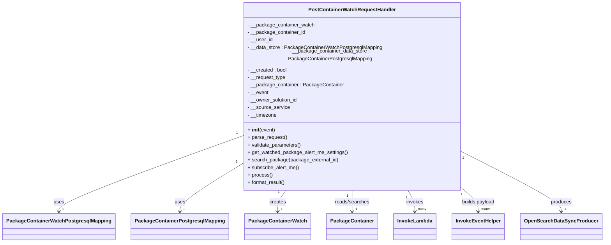
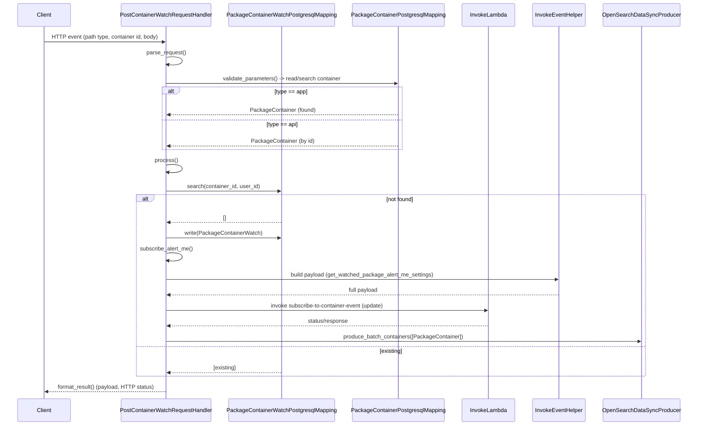

# Diagram: partview_core/partview_service/partview_service/api/package_container_watch/handlers/PostContainerWatchRequestHandler.py

> Auto-generated by Obscura crawlers

## Diagram 1

### SVG

<svg id="container" width="1845.5625" xmlns="http://www.w3.org/2000/svg" class="classDiagram" height="750" viewBox="0 0 1845.5625 750" role="graphics-document document" aria-roledescription="class"><g><defs><marker id="container_class-aggregationStart" class="marker aggregation class" refX="18" refY="7" markerWidth="190" markerHeight="240" orient="auto"><path d="M 18,7 L9,13 L1,7 L9,1 Z"></path></marker></defs><defs><marker id="container_class-aggregationEnd" class="marker aggregation class" refX="1" refY="7" markerWidth="20" markerHeight="28" orient="auto"><path d="M 18,7 L9,13 L1,7 L9,1 Z"></path></marker></defs><defs><marker id="container_class-extensionStart" class="marker extension class" refX="18" refY="7" markerWidth="190" markerHeight="240" orient="auto"><path d="M 1,7 L18,13 V 1 Z"></path></marker></defs><defs><marker id="container_class-extensionEnd" class="marker extension class" refX="1" refY="7" markerWidth="20" markerHeight="28" orient="auto"><path d="M 1,1 V 13 L18,7 Z"></path></marker></defs><defs><marker id="container_class-compositionStart" class="marker composition class" refX="18" refY="7" markerWidth="190" markerHeight="240" orient="auto"><path d="M 18,7 L9,13 L1,7 L9,1 Z"></path></marker></defs><defs><marker id="container_class-compositionEnd" class="marker composition class" refX="1" refY="7" markerWidth="20" markerHeight="28" orient="auto"><path d="M 18,7 L9,13 L1,7 L9,1 Z"></path></marker></defs><defs><marker id="container_class-dependencyStart" class="marker dependency class" refX="6" refY="7" markerWidth="190" markerHeight="240" orient="auto"><path d="M 5,7 L9,13 L1,7 L9,1 Z"></path></marker></defs><defs><marker id="container_class-dependencyEnd" class="marker dependency class" refX="13" refY="7" markerWidth="20" markerHeight="28" orient="auto"><path d="M 18,7 L9,13 L14,7 L9,1 Z"></path></marker></defs><defs><marker id="container_class-lollipopStart" class="marker lollipop class" refX="13" refY="7" markerWidth="190" markerHeight="240" orient="auto"><circle stroke="black" fill="transparent" cx="7" cy="7" r="6"></circle></marker></defs><defs><marker id="container_class-lollipopEnd" class="marker lollipop class" refX="1" refY="7" markerWidth="190" markerHeight="240" orient="auto"><circle stroke="black" fill="transparent" cx="7" cy="7" r="6"></circle></marker></defs><g class="root"><g class="clusters"></g><g class="edgePaths"><path d="M729.254,420.402L637.406,453.835C545.557,487.268,361.861,554.134,270.012,592.734C178.164,631.333,178.164,641.667,178.164,646.833L178.164,652" id="id_PostContainerWatchRequestHandler_PackageContainerWatchPostgresqlMapping_1" class="edge-thickness-normal edge-pattern-solid relation" style=";;;" data-edge="true" data-et="edge" data-id="id_PostContainerWatchRequestHandler_PackageContainerWatchPostgresqlMapping_1" data-points="W3sieCI6NzI5LjI1MzkwNjI1LCJ5Ijo0MjAuNDAyMDQzMTM3NzY5Nn0seyJ4IjoxNzguMTY0MDYyNSwieSI6NjIxfSx7IngiOjE3OC4xNjQwNjI1LCJ5Ijo2NTh9XQ==" marker-end="url(#container_class-dependencyEnd)"></path><path d="M729.254,507.633L698.742,526.527C668.229,545.422,607.204,583.211,576.692,607.272C546.18,631.333,546.18,641.667,546.18,646.833L546.18,652" id="id_PostContainerWatchRequestHandler_PackageContainerPostgresqlMapping_2" class="edge-thickness-normal edge-pattern-solid relation" style=";;;" data-edge="true" data-et="edge" data-id="id_PostContainerWatchRequestHandler_PackageContainerPostgresqlMapping_2" data-points="W3sieCI6NzI5LjI1MzkwNjI1LCJ5Ijo1MDcuNjMyOTEzNTU5Mjk2OH0seyJ4Ijo1NDYuMTc5Njg3NSwieSI6NjIxfSx7IngiOjU0Ni4xNzk2ODc1LCJ5Ijo2NTh9XQ==" marker-end="url(#container_class-dependencyEnd)"></path><path d="M869.665,584L865.354,590.167C861.042,596.333,852.42,608.667,848.108,620C843.797,631.333,843.797,641.667,843.797,646.833L843.797,652" id="id_PostContainerWatchRequestHandler_PackageContainerWatch_3" class="edge-thickness-normal edge-pattern-solid relation" style=";;;" data-edge="true" data-et="edge" data-id="id_PostContainerWatchRequestHandler_PackageContainerWatch_3" data-points="W3sieCI6ODY5LjY2NDg1NTc2OTIzMDgsInkiOjU4NH0seyJ4Ijo4NDMuNzk2ODc1LCJ5Ijo2MjF9LHsieCI6ODQzLjc5Njg3NSwieSI6NjU4fV0=" marker-end="url(#container_class-dependencyEnd)"></path><path d="M1071.016,584L1071.016,590.167C1071.016,596.333,1071.016,608.667,1071.016,620C1071.016,631.333,1071.016,641.667,1071.016,646.833L1071.016,652" id="id_PostContainerWatchRequestHandler_PackageContainer_4" class="edge-thickness-normal edge-pattern-solid relation" style=";;;" data-edge="true" data-et="edge" data-id="id_PostContainerWatchRequestHandler_PackageContainer_4" data-points="W3sieCI6MTA3MS4wMTU2MjUsInkiOjU4NH0seyJ4IjoxMDcxLjAxNTYyNSwieSI6NjIxfSx7IngiOjEwNzEuMDE1NjI1LCJ5Ijo2NTh9XQ==" marker-end="url(#container_class-dependencyEnd)"></path><path d="M1241.988,584L1245.649,590.167C1249.31,596.333,1256.631,608.667,1260.292,620C1263.953,631.333,1263.953,641.667,1263.953,646.833L1263.953,652" id="id_PostContainerWatchRequestHandler_InvokeLambda_5" class="edge-thickness-normal edge-pattern-solid relation" style=";;;" data-edge="true" data-et="edge" data-id="id_PostContainerWatchRequestHandler_InvokeLambda_5" data-points="W3sieCI6MTI0MS45ODc5MzI2OTIzMDc2LCJ5Ijo1ODR9LHsieCI6MTI2My45NTMxMjUsInkiOjYyMX0seyJ4IjoxMjYzLjk1MzEyNSwieSI6NjU4fV0=" marker-end="url(#container_class-dependencyEnd)"></path><path d="M1412.777,581.161L1420.735,587.801C1428.693,594.441,1444.608,607.72,1452.566,619.527C1460.523,631.333,1460.523,641.667,1460.523,646.833L1460.523,652" id="id_PostContainerWatchRequestHandler_InvokeEventHelper_6" class="edge-thickness-normal edge-pattern-solid relation" style=";;;" data-edge="true" data-et="edge" data-id="id_PostContainerWatchRequestHandler_InvokeEventHelper_6" data-points="W3sieCI6MTQxMi43NzczNDM3NSwieSI6NTgxLjE2MTMxMTM1MDQ2MjN9LHsieCI6MTQ2MC41MjM0Mzc1LCJ5Ijo2MjF9LHsieCI6MTQ2MC41MjM0Mzc1LCJ5Ijo2NTh9XQ==" marker-end="url(#container_class-dependencyEnd)"></path><path d="M1412.777,468.588L1463.079,493.99C1513.38,519.392,1613.983,570.196,1664.285,600.765C1714.586,631.333,1714.586,641.667,1714.586,646.833L1714.586,652" id="id_PostContainerWatchRequestHandler_OpenSearchDataSyncProducer_7" class="edge-thickness-normal edge-pattern-solid relation" style=";;;" data-edge="true" data-et="edge" data-id="id_PostContainerWatchRequestHandler_OpenSearchDataSyncProducer_7" data-points="W3sieCI6MTQxMi43NzczNDM3NSwieSI6NDY4LjU4ODA3MDY5OTM0NTd9LHsieCI6MTcxNC41ODU5Mzc1LCJ5Ijo2MjF9LHsieCI6MTcxNC41ODU5Mzc1LCJ5Ijo2NTh9XQ==" marker-end="url(#container_class-dependencyEnd)"></path></g><g class="edgeLabels"><g class="edgeLabel" transform="translate(178.1640625, 621)"><g class="label" data-id="id_PostContainerWatchRequestHandler_PackageContainerWatchPostgresqlMapping_1" transform="translate(-16.4921875, -12)"><foreignObject width="32.984375" height="24">

uses

</foreignObject></g></g><g class="edgeLabel" transform="translate(546.1796875, 621)"><g class="label" data-id="id_PostContainerWatchRequestHandler_PackageContainerPostgresqlMapping_2" transform="translate(-16.4921875, -12)"><foreignObject width="32.984375" height="24">

uses

</foreignObject></g></g><g class="edgeLabel" transform="translate(843.796875, 621)"><g class="label" data-id="id_PostContainerWatchRequestHandler_PackageContainerWatch_3" transform="translate(-26.171875, -12)"><foreignObject width="52.34375" height="24">

creates

</foreignObject></g></g><g class="edgeLabel" transform="translate(1071.015625, 621)"><g class="label" data-id="id_PostContainerWatchRequestHandler_PackageContainer_4" transform="translate(-55.75, -12)"><foreignObject width="111.5" height="24">

reads/searches

</foreignObject></g></g><g class="edgeLabel" transform="translate(1263.953125, 621)"><g class="label" data-id="id_PostContainerWatchRequestHandler_InvokeLambda_5" transform="translate(-27.5859375, -12)"><foreignObject width="55.171875" height="24">

invokes

</foreignObject></g></g><g class="edgeLabel" transform="translate(1460.5234375, 621)"><g class="label" data-id="id_PostContainerWatchRequestHandler_InvokeEventHelper_6" transform="translate(-53.484375, -12)"><foreignObject width="106.96875" height="24">

builds payload

</foreignObject></g></g><g class="edgeLabel" transform="translate(1714.5859375, 621)"><g class="label" data-id="id_PostContainerWatchRequestHandler_OpenSearchDataSyncProducer_7" transform="translate(-33.4765625, -12)"><foreignObject width="66.953125" height="24">

produces

</foreignObject></g></g><g class="edgeTerminals" transform="translate(707.6787521225075, 412.29261743396387)"><g class="inner" transform="translate(0, 0)"><foreignObject style="width: 9px; height: 12px;">
1
</foreignObject></g></g><g class="edgeTerminals" transform="translate(706.4784498585535, 504.09332916211315)"><g class="inner" transform="translate(0, 0)"><foreignObject style="width: 9px; height: 12px;">
1
</foreignObject></g></g><g class="edgeTerminals" transform="translate(847.3441231844107, 589.7475912389241)"><g class="inner" transform="translate(0, 0)"><foreignObject style="width: 9px; height: 12px;">
1
</foreignObject></g></g><g class="edgeTerminals" transform="translate(1056.0156275000002, 601.5000021428572)"><g class="inner" transform="translate(0, 0)"><foreignObject style="width: 9px; height: 12px;">
1
</foreignObject></g></g><g class="edgeTerminals" transform="translate(1238.0229254661208, 606.7052588107592)"><g class="inner" transform="translate(0, 0)"><foreignObject style="width: 9px; height: 12px;">
1
</foreignObject></g></g><g class="edgeTerminals" transform="translate(1416.6043365456026, 603.8902391586766)"><g class="inner" transform="translate(0, 0)"><foreignObject style="width: 9px; height: 12px;">
1
</foreignObject></g></g><g class="edgeTerminals" transform="translate(1421.636824598713, 489.8662181716882)"><g class="inner" transform="translate(0, 0)"><foreignObject style="width: 9px; height: 12px;">
1
</foreignObject></g></g><g class="edgeTerminals" transform="translate(188.16406124999997, 635.4999989285715)"><g class="inner" transform="translate(0, 0)"></g><foreignObject style="width: 9px; height: 12px;">
1
</foreignObject></g><g class="edgeTerminals" transform="translate(556.17968875, 635.5000010714286)"><g class="inner" transform="translate(0, 0)"></g><foreignObject style="width: 9px; height: 12px;">
1
</foreignObject></g><g class="edgeTerminals" transform="translate(853.7968774999998, 635.5000021428572)"><g class="inner" transform="translate(0, 0)"></g><foreignObject style="width: 9px; height: 12px;">
1
</foreignObject></g><g class="edgeTerminals" transform="translate(1081.0156274999997, 635.5000021428572)"><g class="inner" transform="translate(0, 0)"></g><foreignObject style="width: 9px; height: 12px;">
1
</foreignObject></g><g class="edgeTerminals" transform="translate(1273.9531274999997, 635.5000021428572)"><g class="inner" transform="translate(0, 0)"></g><foreignObject style="width: 36px; height: 12px;">
many
</foreignObject></g><g class="edgeTerminals" transform="translate(1470.52343875, 635.5000010714285)"><g class="inner" transform="translate(0, 0)"></g><foreignObject style="width: 36px; height: 12px;">
many
</foreignObject></g><g class="edgeTerminals" transform="translate(1724.58593875, 635.5000010714285)"><g class="inner" transform="translate(0, 0)"></g><foreignObject style="width: 9px; height: 12px;">
1
</foreignObject></g></g><g class="nodes"><g class="node default" id="classId-PostContainerWatchRequestHandler-0" transform="translate(1071.015625, 296)"><g class="basic label-container"><path d="M-341.76171875 -288 L341.76171875 -288 L341.76171875 288 L-341.76171875 288" stroke="none" stroke-width="0" fill="#ECECFF" style=""></path><path d="M-341.76171875 -288 C-125.52613036713416 -288, 90.70945801573168 -288, 341.76171875 -288 M-341.76171875 -288 C-156.2521484388538 -288, 29.25742187229241 -288, 341.76171875 -288 M341.76171875 -288 C341.76171875 -143.0770274148722, 341.76171875 1.845945170255618, 341.76171875 288 M341.76171875 -288 C341.76171875 -99.84265473177771, 341.76171875 88.31469053644457, 341.76171875 288 M341.76171875 288 C133.22566495934174 288, -75.31038883131652 288, -341.76171875 288 M341.76171875 288 C186.78856093671126 288, 31.815403123422527 288, -341.76171875 288 M-341.76171875 288 C-341.76171875 118.67715110798139, -341.76171875 -50.645697784037225, -341.76171875 -288 M-341.76171875 288 C-341.76171875 130.470712285708, -341.76171875 -27.058575428583993, -341.76171875 -288" stroke="#9370DB" stroke-width="1.3" fill="none" stroke-dasharray="0 0" style=""></path></g><g class="annotation-group text" transform="translate(0, -264)"></g><g class="label-group text" transform="translate(-133.1640625, -264)"><g class="label" style="font-weight: bolder" transform="translate(0,-12)"><foreignObject width="266.328125" height="24">

PostContainerWatchRequestHandler

</foreignObject></g></g><g class="members-group text" transform="translate(-329.76171875, -216)"><g class="label" style="" transform="translate(0,-12)"><foreignObject width="212.296875" height="24">

- __package_container_watch

</foreignObject></g><g class="label" style="" transform="translate(0,12)"><foreignObject width="184.15625" height="24">

- __package_container_id

</foreignObject></g><g class="label" style="" transform="translate(0,36)"><foreignObject width="79.65625" height="24">

- __user_id

</foreignObject></g><g class="label" style="" transform="translate(0,60)"><foreignObject width="427.46875" height="24">

- __data_store : PackageContainerWatchPostgresqlMapping

</foreignObject></g><g class="label" style="" transform="translate(0,84)"><foreignObject width="526.359375" height="24">

- __package_container_data_store : PackageContainerPostgresqlMapping

</foreignObject></g><g class="label" style="" transform="translate(0,108)"><foreignObject width="126.484375" height="24">

- __created : bool

</foreignObject></g><g class="label" style="" transform="translate(0,132)"><foreignObject width="122.234375" height="24">

- __request_type

</foreignObject></g><g class="label" style="" transform="translate(0,156)"><foreignObject width="303.90625" height="24">

- __package_container : PackageContainer

</foreignObject></g><g class="label" style="" transform="translate(0,180)"><foreignObject width="67.1875" height="24">

- __event

</foreignObject></g><g class="label" style="" transform="translate(0,204)"><foreignObject width="161.203125" height="24">

- __owner_solution_id

</foreignObject></g><g class="label" style="" transform="translate(0,228)"><foreignObject width="133.84375" height="24">

- __source_service

</foreignObject></g><g class="label" style="" transform="translate(0,252)"><foreignObject width="93.78125" height="24">

- __timezone

</foreignObject></g></g><g class="methods-group text" transform="translate(-329.76171875, 96)"><g class="label" style="" transform="translate(0,-12)"><foreignObject width="87.390625" height="24">

+ <strong>init</strong>(event)

</foreignObject></g><g class="label" style="" transform="translate(0,12)"><foreignObject width="126.046875" height="24">

+ parse_request()

</foreignObject></g><g class="label" style="" transform="translate(0,36)"><foreignObject width="170.953125" height="24">

+ validate_parameters()

</foreignObject></g><g class="label" style="" transform="translate(0,60)"><foreignObject width="318.859375" height="24">

+ get_watched_package_alert_me_settings()

</foreignObject></g><g class="label" style="" transform="translate(0,84)"><foreignObject width="285.78125" height="24">

+ search_package(package_external_id)

</foreignObject></g><g class="label" style="" transform="translate(0,108)"><foreignObject width="165.171875" height="24">

+ subscribe_alert_me()

</foreignObject></g><g class="label" style="" transform="translate(0,132)"><foreignObject width="77.96875" height="24">

+ process()

</foreignObject></g><g class="label" style="" transform="translate(0,156)"><foreignObject width="121.5" height="24">

+ format_result()

</foreignObject></g></g><g class="divider" style=""><path d="M-341.76171875 -240 C-72.33441104334935 -240, 197.0928966633013 -240, 341.76171875 -240 M-341.76171875 -240 C-157.53392357332658 -240, 26.69387160334685 -240, 341.76171875 -240" stroke="#9370DB" stroke-width="1.3" fill="none" stroke-dasharray="0 0" style=""></path></g><g class="divider" style=""><path d="M-341.76171875 72 C-79.89059240223065 72, 181.9805339455387 72, 341.76171875 72 M-341.76171875 72 C-79.93719055515584 72, 181.88733763968833 72, 341.76171875 72" stroke="#9370DB" stroke-width="1.3" fill="none" stroke-dasharray="0 0" style=""></path></g></g><g class="node default" id="classId-PackageContainerWatchPostgresqlMapping-1" transform="translate(178.1640625, 700)"><g class="basic label-container"><path d="M-170.1640625 -42 L170.1640625 -42 L170.1640625 42 L-170.1640625 42" stroke="none" stroke-width="0" fill="#ECECFF" style=""></path><path d="M-170.1640625 -42 C-83.15958062783794 -42, 3.84490124432412 -42, 170.1640625 -42 M-170.1640625 -42 C-80.32921159208563 -42, 9.505639315828745 -42, 170.1640625 -42 M170.1640625 -42 C170.1640625 -17.87538974932765, 170.1640625 6.249220501344702, 170.1640625 42 M170.1640625 -42 C170.1640625 -18.437419770458398, 170.1640625 5.1251604590832045, 170.1640625 42 M170.1640625 42 C95.62169639556079 42, 21.07933029112158 42, -170.1640625 42 M170.1640625 42 C99.75072139484587 42, 29.337380289691737 42, -170.1640625 42 M-170.1640625 42 C-170.1640625 23.056864801959765, -170.1640625 4.113729603919531, -170.1640625 -42 M-170.1640625 42 C-170.1640625 9.594292119853975, -170.1640625 -22.81141576029205, -170.1640625 -42" stroke="#9370DB" stroke-width="1.3" fill="none" stroke-dasharray="0 0" style=""></path></g><g class="annotation-group text" transform="translate(0, -18)"></g><g class="label-group text" transform="translate(-158.1640625, -18)"><g class="label" style="font-weight: bolder" transform="translate(0,-12)"><foreignObject width="316.328125" height="24">

PackageContainerWatchPostgresqlMapping

</foreignObject></g></g><g class="members-group text" transform="translate(-158.1640625, 30)"></g><g class="methods-group text" transform="translate(-158.1640625, 60)"></g><g class="divider" style=""><path d="M-170.1640625 6 C-48.86627684277242 6, 72.43150881445516 6, 170.1640625 6 M-170.1640625 6 C-66.52933599101875 6, 37.10539051796249 6, 170.1640625 6" stroke="#9370DB" stroke-width="1.3" fill="none" stroke-dasharray="0 0" style=""></path></g><g class="divider" style=""><path d="M-170.1640625 24 C-68.34471009504223 24, 33.47464230991554 24, 170.1640625 24 M-170.1640625 24 C-76.58824262289765 24, 16.987577254204695 24, 170.1640625 24" stroke="#9370DB" stroke-width="1.3" fill="none" stroke-dasharray="0 0" style=""></path></g></g><g class="node default" id="classId-PackageContainerPostgresqlMapping-2" transform="translate(546.1796875, 700)"><g class="basic label-container"><path d="M-147.8515625 -42 L147.8515625 -42 L147.8515625 42 L-147.8515625 42" stroke="none" stroke-width="0" fill="#ECECFF" style=""></path><path d="M-147.8515625 -42 C-51.215246999007235 -42, 45.42106850198553 -42, 147.8515625 -42 M-147.8515625 -42 C-54.220240490888614 -42, 39.41108151822277 -42, 147.8515625 -42 M147.8515625 -42 C147.8515625 -19.889307820443886, 147.8515625 2.2213843591122284, 147.8515625 42 M147.8515625 -42 C147.8515625 -20.134289046511377, 147.8515625 1.7314219069772463, 147.8515625 42 M147.8515625 42 C54.06236810209151 42, -39.72682629581698 42, -147.8515625 42 M147.8515625 42 C51.14233904433469 42, -45.56688441133062 42, -147.8515625 42 M-147.8515625 42 C-147.8515625 19.051985796017508, -147.8515625 -3.896028407964984, -147.8515625 -42 M-147.8515625 42 C-147.8515625 18.13634765345958, -147.8515625 -5.727304693080839, -147.8515625 -42" stroke="#9370DB" stroke-width="1.3" fill="none" stroke-dasharray="0 0" style=""></path></g><g class="annotation-group text" transform="translate(0, -18)"></g><g class="label-group text" transform="translate(-135.8515625, -18)"><g class="label" style="font-weight: bolder" transform="translate(0,-12)"><foreignObject width="271.703125" height="24">

PackageContainerPostgresqlMapping

</foreignObject></g></g><g class="members-group text" transform="translate(-135.8515625, 30)"></g><g class="methods-group text" transform="translate(-135.8515625, 60)"></g><g class="divider" style=""><path d="M-147.8515625 6 C-67.79627605192583 6, 12.25901039614834 6, 147.8515625 6 M-147.8515625 6 C-72.34928917728905 6, 3.1529841454218968 6, 147.8515625 6" stroke="#9370DB" stroke-width="1.3" fill="none" stroke-dasharray="0 0" style=""></path></g><g class="divider" style=""><path d="M-147.8515625 24 C-37.99516174790352 24, 71.86123900419295 24, 147.8515625 24 M-147.8515625 24 C-80.17154843164388 24, -12.49153436328777 24, 147.8515625 24" stroke="#9370DB" stroke-width="1.3" fill="none" stroke-dasharray="0 0" style=""></path></g></g><g class="node default" id="classId-PackageContainerWatch-3" transform="translate(843.796875, 700)"><g class="basic label-container"><path d="M-99.765625 -42 L99.765625 -42 L99.765625 42 L-99.765625 42" stroke="none" stroke-width="0" fill="#ECECFF" style=""></path><path d="M-99.765625 -42 C-30.12215972524494 -42, 39.52130554951012 -42, 99.765625 -42 M-99.765625 -42 C-21.777271577264244 -42, 56.21108184547151 -42, 99.765625 -42 M99.765625 -42 C99.765625 -15.633061732772795, 99.765625 10.73387653445441, 99.765625 42 M99.765625 -42 C99.765625 -11.174702236266462, 99.765625 19.650595527467075, 99.765625 42 M99.765625 42 C23.447332965142834 42, -52.87095906971433 42, -99.765625 42 M99.765625 42 C39.525302321020455 42, -20.71502035795909 42, -99.765625 42 M-99.765625 42 C-99.765625 13.137235008295299, -99.765625 -15.725529983409402, -99.765625 -42 M-99.765625 42 C-99.765625 15.637207170001542, -99.765625 -10.725585659996916, -99.765625 -42" stroke="#9370DB" stroke-width="1.3" fill="none" stroke-dasharray="0 0" style=""></path></g><g class="annotation-group text" transform="translate(0, -18)"></g><g class="label-group text" transform="translate(-87.765625, -18)"><g class="label" style="font-weight: bolder" transform="translate(0,-12)"><foreignObject width="175.53125" height="24">

PackageContainerWatch

</foreignObject></g></g><g class="members-group text" transform="translate(-87.765625, 30)"></g><g class="methods-group text" transform="translate(-87.765625, 60)"></g><g class="divider" style=""><path d="M-99.765625 6 C-33.86533166661296 6, 32.03496166677408 6, 99.765625 6 M-99.765625 6 C-33.037732972926975 6, 33.69015905414605 6, 99.765625 6" stroke="#9370DB" stroke-width="1.3" fill="none" stroke-dasharray="0 0" style=""></path></g><g class="divider" style=""><path d="M-99.765625 24 C-22.30501169849859 24, 55.15560160300282 24, 99.765625 24 M-99.765625 24 C-51.80139703939515 24, -3.8371690787902963 24, 99.765625 24" stroke="#9370DB" stroke-width="1.3" fill="none" stroke-dasharray="0 0" style=""></path></g></g><g class="node default" id="classId-PackageContainer-4" transform="translate(1071.015625, 700)"><g class="basic label-container"><path d="M-77.453125 -42 L77.453125 -42 L77.453125 42 L-77.453125 42" stroke="none" stroke-width="0" fill="#ECECFF" style=""></path><path d="M-77.453125 -42 C-29.14952478614645 -42, 19.1540754277071 -42, 77.453125 -42 M-77.453125 -42 C-29.012316882744017 -42, 19.428491234511966 -42, 77.453125 -42 M77.453125 -42 C77.453125 -16.145244963044213, 77.453125 9.709510073911574, 77.453125 42 M77.453125 -42 C77.453125 -20.75379200120205, 77.453125 0.4924159975958986, 77.453125 42 M77.453125 42 C23.135709542569273 42, -31.181705914861453 42, -77.453125 42 M77.453125 42 C34.502970221392765 42, -8.44718455721447 42, -77.453125 42 M-77.453125 42 C-77.453125 17.194815869955068, -77.453125 -7.610368260089864, -77.453125 -42 M-77.453125 42 C-77.453125 22.660204545470453, -77.453125 3.320409090940906, -77.453125 -42" stroke="#9370DB" stroke-width="1.3" fill="none" stroke-dasharray="0 0" style=""></path></g><g class="annotation-group text" transform="translate(0, -18)"></g><g class="label-group text" transform="translate(-65.453125, -18)"><g class="label" style="font-weight: bolder" transform="translate(0,-12)"><foreignObject width="130.90625" height="24">

PackageContainer

</foreignObject></g></g><g class="members-group text" transform="translate(-65.453125, 30)"></g><g class="methods-group text" transform="translate(-65.453125, 60)"></g><g class="divider" style=""><path d="M-77.453125 6 C-38.45142739848446 6, 0.5502702030310758 6, 77.453125 6 M-77.453125 6 C-46.434925589323456 6, -15.416726178646904 6, 77.453125 6" stroke="#9370DB" stroke-width="1.3" fill="none" stroke-dasharray="0 0" style=""></path></g><g class="divider" style=""><path d="M-77.453125 24 C-17.702171321181005 24, 42.04878235763799 24, 77.453125 24 M-77.453125 24 C-37.07433860726811 24, 3.304447785463779 24, 77.453125 24" stroke="#9370DB" stroke-width="1.3" fill="none" stroke-dasharray="0 0" style=""></path></g></g><g class="node default" id="classId-InvokeLambda-5" transform="translate(1263.953125, 700)"><g class="basic label-container"><path d="M-65.484375 -42 L65.484375 -42 L65.484375 42 L-65.484375 42" stroke="none" stroke-width="0" fill="#ECECFF" style=""></path><path d="M-65.484375 -42 C-30.467864644192332 -42, 4.548645711615336 -42, 65.484375 -42 M-65.484375 -42 C-32.775231912492224 -42, -0.06608882498444757 -42, 65.484375 -42 M65.484375 -42 C65.484375 -20.718452298942868, 65.484375 0.5630954021142642, 65.484375 42 M65.484375 -42 C65.484375 -19.798347565498084, 65.484375 2.4033048690038328, 65.484375 42 M65.484375 42 C14.876255511141252 42, -35.731863977717495 42, -65.484375 42 M65.484375 42 C16.54330835041643 42, -32.39775829916714 42, -65.484375 42 M-65.484375 42 C-65.484375 13.850261223687113, -65.484375 -14.299477552625774, -65.484375 -42 M-65.484375 42 C-65.484375 12.569690616084273, -65.484375 -16.860618767831454, -65.484375 -42" stroke="#9370DB" stroke-width="1.3" fill="none" stroke-dasharray="0 0" style=""></path></g><g class="annotation-group text" transform="translate(0, -18)"></g><g class="label-group text" transform="translate(-53.484375, -18)"><g class="label" style="font-weight: bolder" transform="translate(0,-12)"><foreignObject width="106.96875" height="24">

InvokeLambda

</foreignObject></g></g><g class="members-group text" transform="translate(-53.484375, 30)"></g><g class="methods-group text" transform="translate(-53.484375, 60)"></g><g class="divider" style=""><path d="M-65.484375 6 C-20.49198684869134 6, 24.50040130261732 6, 65.484375 6 M-65.484375 6 C-29.10786528106089 6, 7.268644437878223 6, 65.484375 6" stroke="#9370DB" stroke-width="1.3" fill="none" stroke-dasharray="0 0" style=""></path></g><g class="divider" style=""><path d="M-65.484375 24 C-26.364326152857487 24, 12.755722694285026 24, 65.484375 24 M-65.484375 24 C-38.41712371854978 24, -11.349872437099563 24, 65.484375 24" stroke="#9370DB" stroke-width="1.3" fill="none" stroke-dasharray="0 0" style=""></path></g></g><g class="node default" id="classId-InvokeEventHelper-6" transform="translate(1460.5234375, 700)"><g class="basic label-container"><path d="M-81.0859375 -42 L81.0859375 -42 L81.0859375 42 L-81.0859375 42" stroke="none" stroke-width="0" fill="#ECECFF" style=""></path><path d="M-81.0859375 -42 C-27.636584777374857 -42, 25.812767945250286 -42, 81.0859375 -42 M-81.0859375 -42 C-17.03268749399767 -42, 47.02056251200466 -42, 81.0859375 -42 M81.0859375 -42 C81.0859375 -17.266142954114557, 81.0859375 7.467714091770887, 81.0859375 42 M81.0859375 -42 C81.0859375 -12.37982542937048, 81.0859375 17.24034914125904, 81.0859375 42 M81.0859375 42 C32.84878809846515 42, -15.3883613030697 42, -81.0859375 42 M81.0859375 42 C37.261402546737756 42, -6.563132406524488 42, -81.0859375 42 M-81.0859375 42 C-81.0859375 10.932114464452798, -81.0859375 -20.135771071094403, -81.0859375 -42 M-81.0859375 42 C-81.0859375 11.402416073836257, -81.0859375 -19.195167852327486, -81.0859375 -42" stroke="#9370DB" stroke-width="1.3" fill="none" stroke-dasharray="0 0" style=""></path></g><g class="annotation-group text" transform="translate(0, -18)"></g><g class="label-group text" transform="translate(-69.0859375, -18)"><g class="label" style="font-weight: bolder" transform="translate(0,-12)"><foreignObject width="138.171875" height="24">

InvokeEventHelper

</foreignObject></g></g><g class="members-group text" transform="translate(-69.0859375, 30)"></g><g class="methods-group text" transform="translate(-69.0859375, 60)"></g><g class="divider" style=""><path d="M-81.0859375 6 C-48.02245887559591 6, -14.958980251191818 6, 81.0859375 6 M-81.0859375 6 C-29.830250953317915 6, 21.42543559336417 6, 81.0859375 6" stroke="#9370DB" stroke-width="1.3" fill="none" stroke-dasharray="0 0" style=""></path></g><g class="divider" style=""><path d="M-81.0859375 24 C-37.743835542976164 24, 5.5982664140476714 24, 81.0859375 24 M-81.0859375 24 C-40.24910519201268 24, 0.5877271159746442 24, 81.0859375 24" stroke="#9370DB" stroke-width="1.3" fill="none" stroke-dasharray="0 0" style=""></path></g></g><g class="node default" id="classId-OpenSearchDataSyncProducer-7" transform="translate(1714.5859375, 700)"><g class="basic label-container"><path d="M-122.9765625 -42 L122.9765625 -42 L122.9765625 42 L-122.9765625 42" stroke="none" stroke-width="0" fill="#ECECFF" style=""></path><path d="M-122.9765625 -42 C-67.17503240344317 -42, -11.373502306886351 -42, 122.9765625 -42 M-122.9765625 -42 C-70.15656366373028 -42, -17.33656482746055 -42, 122.9765625 -42 M122.9765625 -42 C122.9765625 -23.47269815616171, 122.9765625 -4.9453963123234175, 122.9765625 42 M122.9765625 -42 C122.9765625 -10.21099924241631, 122.9765625 21.57800151516738, 122.9765625 42 M122.9765625 42 C42.25514112768394 42, -38.46628024463212 42, -122.9765625 42 M122.9765625 42 C67.70733548149394 42, 12.438108462987898 42, -122.9765625 42 M-122.9765625 42 C-122.9765625 22.374662292379714, -122.9765625 2.749324584759428, -122.9765625 -42 M-122.9765625 42 C-122.9765625 24.78800231269951, -122.9765625 7.5760046253990225, -122.9765625 -42" stroke="#9370DB" stroke-width="1.3" fill="none" stroke-dasharray="0 0" style=""></path></g><g class="annotation-group text" transform="translate(0, -18)"></g><g class="label-group text" transform="translate(-110.9765625, -18)"><g class="label" style="font-weight: bolder" transform="translate(0,-12)"><foreignObject width="221.953125" height="24">

OpenSearchDataSyncProducer

</foreignObject></g></g><g class="members-group text" transform="translate(-110.9765625, 30)"></g><g class="methods-group text" transform="translate(-110.9765625, 60)"></g><g class="divider" style=""><path d="M-122.9765625 6 C-50.7467883688807 6, 21.4829857622386 6, 122.9765625 6 M-122.9765625 6 C-42.40393405062004 6, 38.168694398759925 6, 122.9765625 6" stroke="#9370DB" stroke-width="1.3" fill="none" stroke-dasharray="0 0" style=""></path></g><g class="divider" style=""><path d="M-122.9765625 24 C-38.62386598574081 24, 45.72883052851839 24, 122.9765625 24 M-122.9765625 24 C-59.533131729051014 24, 3.9102990418979715 24, 122.9765625 24" stroke="#9370DB" stroke-width="1.3" fill="none" stroke-dasharray="0 0" style=""></path></g></g></g></g></g></svg>

## Diagram 2

### SVG

<svg id="container" width="2107" xmlns="http://www.w3.org/2000/svg" height="1277" viewBox="-50 -10 2107 1277" role="graphics-document document" aria-roledescription="sequence"><g><rect x="1767" y="1191" fill="#eaeaea" stroke="#666" width="240" height="65" name="OpenSearch" rx="3" ry="3" class="actor actor-bottom"></rect><text x="1887" y="1223.5" dominant-baseline="central" alignment-baseline="central" class="actor actor-box" style="text-anchor: middle; font-size: 16px; font-weight: 400;"><tspan x="1887" dy="0">OpenSearchDataSyncProducer</tspan></text></g><g><rect x="1560" y="1191" fill="#eaeaea" stroke="#666" width="157" height="65" name="EventHelper" rx="3" ry="3" class="actor actor-bottom"></rect><text x="1638.5" y="1223.5" dominant-baseline="central" alignment-baseline="central" class="actor actor-box" style="text-anchor: middle; font-size: 16px; font-weight: 400;"><tspan x="1638.5" dy="0">InvokeEventHelper</tspan></text></g><g><rect x="1360" y="1191" fill="#eaeaea" stroke="#666" width="150" height="65" name="Lambda" rx="3" ry="3" class="actor actor-bottom"></rect><text x="1435" y="1223.5" dominant-baseline="central" alignment-baseline="central" class="actor actor-box" style="text-anchor: middle; font-size: 16px; font-weight: 400;"><tspan x="1435" dy="0">InvokeLambda</tspan></text></g><g><rect x="1023" y="1191" fill="#eaeaea" stroke="#666" width="287" height="65" name="DataStoreContainer" rx="3" ry="3" class="actor actor-bottom"></rect><text x="1166.5" y="1223.5" dominant-baseline="central" alignment-baseline="central" class="actor actor-box" style="text-anchor: middle; font-size: 16px; font-weight: 400;"><tspan x="1166.5" dy="0">PackageContainerPostgresqlMapping</tspan></text></g><g><rect x="642" y="1191" fill="#eaeaea" stroke="#666" width="331" height="65" name="DataStoreWatch" rx="3" ry="3" class="actor actor-bottom"></rect><text x="807.5" y="1223.5" dominant-baseline="central" alignment-baseline="central" class="actor actor-box" style="text-anchor: middle; font-size: 16px; font-weight: 400;"><tspan x="807.5" dy="0">PackageContainerWatchPostgresqlMapping</tspan></text></g><g><rect x="308" y="1191" fill="#eaeaea" stroke="#666" width="284" height="65" name="Handler" rx="3" ry="3" class="actor actor-bottom"></rect><text x="450" y="1223.5" dominant-baseline="central" alignment-baseline="central" class="actor actor-box" style="text-anchor: middle; font-size: 16px; font-weight: 400;"><tspan x="450" dy="0">PostContainerWatchRequestHandler</tspan></text></g><g><rect x="0" y="1191" fill="#eaeaea" stroke="#666" width="150" height="65" name="Client" rx="3" ry="3" class="actor actor-bottom"></rect><text x="75" y="1223.5" dominant-baseline="central" alignment-baseline="central" class="actor actor-box" style="text-anchor: middle; font-size: 16px; font-weight: 400;"><tspan x="75" dy="0">Client</tspan></text></g><g><line id="actor6" x1="1887" y1="65" x2="1887" y2="1191" class="actor-line 200" stroke-width="0.5px" stroke="#999" name="OpenSearch"></line><g id="root-6"><rect x="1767" y="0" fill="#eaeaea" stroke="#666" width="240" height="65" name="OpenSearch" rx="3" ry="3" class="actor actor-top"></rect><text x="1887" y="32.5" dominant-baseline="central" alignment-baseline="central" class="actor actor-box" style="text-anchor: middle; font-size: 16px; font-weight: 400;"><tspan x="1887" dy="0">OpenSearchDataSyncProducer</tspan></text></g></g><g><line id="actor5" x1="1638.5" y1="65" x2="1638.5" y2="1191" class="actor-line 200" stroke-width="0.5px" stroke="#999" name="EventHelper"></line><g id="root-5"><rect x="1560" y="0" fill="#eaeaea" stroke="#666" width="157" height="65" name="EventHelper" rx="3" ry="3" class="actor actor-top"></rect><text x="1638.5" y="32.5" dominant-baseline="central" alignment-baseline="central" class="actor actor-box" style="text-anchor: middle; font-size: 16px; font-weight: 400;"><tspan x="1638.5" dy="0">InvokeEventHelper</tspan></text></g></g><g><line id="actor4" x1="1435" y1="65" x2="1435" y2="1191" class="actor-line 200" stroke-width="0.5px" stroke="#999" name="Lambda"></line><g id="root-4"><rect x="1360" y="0" fill="#eaeaea" stroke="#666" width="150" height="65" name="Lambda" rx="3" ry="3" class="actor actor-top"></rect><text x="1435" y="32.5" dominant-baseline="central" alignment-baseline="central" class="actor actor-box" style="text-anchor: middle; font-size: 16px; font-weight: 400;"><tspan x="1435" dy="0">InvokeLambda</tspan></text></g></g><g><line id="actor3" x1="1166.5" y1="65" x2="1166.5" y2="1191" class="actor-line 200" stroke-width="0.5px" stroke="#999" name="DataStoreContainer"></line><g id="root-3"><rect x="1023" y="0" fill="#eaeaea" stroke="#666" width="287" height="65" name="DataStoreContainer" rx="3" ry="3" class="actor actor-top"></rect><text x="1166.5" y="32.5" dominant-baseline="central" alignment-baseline="central" class="actor actor-box" style="text-anchor: middle; font-size: 16px; font-weight: 400;"><tspan x="1166.5" dy="0">PackageContainerPostgresqlMapping</tspan></text></g></g><g><line id="actor2" x1="807.5" y1="65" x2="807.5" y2="1191" class="actor-line 200" stroke-width="0.5px" stroke="#999" name="DataStoreWatch"></line><g id="root-2"><rect x="642" y="0" fill="#eaeaea" stroke="#666" width="331" height="65" name="DataStoreWatch" rx="3" ry="3" class="actor actor-top"></rect><text x="807.5" y="32.5" dominant-baseline="central" alignment-baseline="central" class="actor actor-box" style="text-anchor: middle; font-size: 16px; font-weight: 400;"><tspan x="807.5" dy="0">PackageContainerWatchPostgresqlMapping</tspan></text></g></g><g><line id="actor1" x1="450" y1="65" x2="450" y2="1191" class="actor-line 200" stroke-width="0.5px" stroke="#999" name="Handler"></line><g id="root-1"><rect x="308" y="0" fill="#eaeaea" stroke="#666" width="284" height="65" name="Handler" rx="3" ry="3" class="actor actor-top"></rect><text x="450" y="32.5" dominant-baseline="central" alignment-baseline="central" class="actor actor-box" style="text-anchor: middle; font-size: 16px; font-weight: 400;"><tspan x="450" dy="0">PostContainerWatchRequestHandler</tspan></text></g></g><g><line id="actor0" x1="75" y1="65" x2="75" y2="1191" class="actor-line 200" stroke-width="0.5px" stroke="#999" name="Client"></line><g id="root-0"><rect x="0" y="0" fill="#eaeaea" stroke="#666" width="150" height="65" name="Client" rx="3" ry="3" class="actor actor-top"></rect><text x="75" y="32.5" dominant-baseline="central" alignment-baseline="central" class="actor actor-box" style="text-anchor: middle; font-size: 16px; font-weight: 400;"><tspan x="75" dy="0">Client</tspan></text></g></g><g></g><defs><symbol id="computer" width="24" height="24"><path transform="scale(.5)" d="M2 2v13h20v-13h-20zm18 11h-16v-9h16v9zm-10.228 6l.466-1h3.524l.467 1h-4.457zm14.228 3h-24l2-6h2.104l-1.33 4h18.45l-1.297-4h2.073l2 6zm-5-10h-14v-7h14v7z"></path></symbol></defs><defs><symbol id="database" fill-rule="evenodd" clip-rule="evenodd"><path transform="scale(.5)" d="M12.258.001l.256.004.255.005.253.008.251.01.249.012.247.015.246.016.242.019.241.02.239.023.236.024.233.027.231.028.229.031.225.032.223.034.22.036.217.038.214.04.211.041.208.043.205.045.201.046.198.048.194.05.191.051.187.053.183.054.18.056.175.057.172.059.168.06.163.061.16.063.155.064.15.066.074.033.073.033.071.034.07.034.069.035.068.035.067.035.066.035.064.036.064.036.062.036.06.036.06.037.058.037.058.037.055.038.055.038.053.038.052.038.051.039.05.039.048.039.047.039.045.04.044.04.043.04.041.04.04.041.039.041.037.041.036.041.034.041.033.042.032.042.03.042.029.042.027.042.026.043.024.043.023.043.021.043.02.043.018.044.017.043.015.044.013.044.012.044.011.045.009.044.007.045.006.045.004.045.002.045.001.045v17l-.001.045-.002.045-.004.045-.006.045-.007.045-.009.044-.011.045-.012.044-.013.044-.015.044-.017.043-.018.044-.02.043-.021.043-.023.043-.024.043-.026.043-.027.042-.029.042-.03.042-.032.042-.033.042-.034.041-.036.041-.037.041-.039.041-.04.041-.041.04-.043.04-.044.04-.045.04-.047.039-.048.039-.05.039-.051.039-.052.038-.053.038-.055.038-.055.038-.058.037-.058.037-.06.037-.06.036-.062.036-.064.036-.064.036-.066.035-.067.035-.068.035-.069.035-.07.034-.071.034-.073.033-.074.033-.15.066-.155.064-.16.063-.163.061-.168.06-.172.059-.175.057-.18.056-.183.054-.187.053-.191.051-.194.05-.198.048-.201.046-.205.045-.208.043-.211.041-.214.04-.217.038-.22.036-.223.034-.225.032-.229.031-.231.028-.233.027-.236.024-.239.023-.241.02-.242.019-.246.016-.247.015-.249.012-.251.01-.253.008-.255.005-.256.004-.258.001-.258-.001-.256-.004-.255-.005-.253-.008-.251-.01-.249-.012-.247-.015-.245-.016-.243-.019-.241-.02-.238-.023-.236-.024-.234-.027-.231-.028-.228-.031-.226-.032-.223-.034-.22-.036-.217-.038-.214-.04-.211-.041-.208-.043-.204-.045-.201-.046-.198-.048-.195-.05-.19-.051-.187-.053-.184-.054-.179-.056-.176-.057-.172-.059-.167-.06-.164-.061-.159-.063-.155-.064-.151-.066-.074-.033-.072-.033-.072-.034-.07-.034-.069-.035-.068-.035-.067-.035-.066-.035-.064-.036-.063-.036-.062-.036-.061-.036-.06-.037-.058-.037-.057-.037-.056-.038-.055-.038-.053-.038-.052-.038-.051-.039-.049-.039-.049-.039-.046-.039-.046-.04-.044-.04-.043-.04-.041-.04-.04-.041-.039-.041-.037-.041-.036-.041-.034-.041-.033-.042-.032-.042-.03-.042-.029-.042-.027-.042-.026-.043-.024-.043-.023-.043-.021-.043-.02-.043-.018-.044-.017-.043-.015-.044-.013-.044-.012-.044-.011-.045-.009-.044-.007-.045-.006-.045-.004-.045-.002-.045-.001-.045v-17l.001-.045.002-.045.004-.045.006-.045.007-.045.009-.044.011-.045.012-.044.013-.044.015-.044.017-.043.018-.044.02-.043.021-.043.023-.043.024-.043.026-.043.027-.042.029-.042.03-.042.032-.042.033-.042.034-.041.036-.041.037-.041.039-.041.04-.041.041-.04.043-.04.044-.04.046-.04.046-.039.049-.039.049-.039.051-.039.052-.038.053-.038.055-.038.056-.038.057-.037.058-.037.06-.037.061-.036.062-.036.063-.036.064-.036.066-.035.067-.035.068-.035.069-.035.07-.034.072-.034.072-.033.074-.033.151-.066.155-.064.159-.063.164-.061.167-.06.172-.059.176-.057.179-.056.184-.054.187-.053.19-.051.195-.05.198-.048.201-.046.204-.045.208-.043.211-.041.214-.04.217-.038.22-.036.223-.034.226-.032.228-.031.231-.028.234-.027.236-.024.238-.023.241-.02.243-.019.245-.016.247-.015.249-.012.251-.01.253-.008.255-.005.256-.004.258-.001.258.001zm-9.258 20.499v.01l.001.021.003.021.004.022.005.021.006.022.007.022.009.023.01.022.011.023.012.023.013.023.015.023.016.024.017.023.018.024.019.024.021.024.022.025.023.024.024.025.052.049.056.05.061.051.066.051.07.051.075.051.079.052.084.052.088.052.092.052.097.052.102.051.105.052.11.052.114.051.119.051.123.051.127.05.131.05.135.05.139.048.144.049.147.047.152.047.155.047.16.045.163.045.167.043.171.043.176.041.178.041.183.039.187.039.19.037.194.035.197.035.202.033.204.031.209.03.212.029.216.027.219.025.222.024.226.021.23.02.233.018.236.016.24.015.243.012.246.01.249.008.253.005.256.004.259.001.26-.001.257-.004.254-.005.25-.008.247-.011.244-.012.241-.014.237-.016.233-.018.231-.021.226-.021.224-.024.22-.026.216-.027.212-.028.21-.031.205-.031.202-.034.198-.034.194-.036.191-.037.187-.039.183-.04.179-.04.175-.042.172-.043.168-.044.163-.045.16-.046.155-.046.152-.047.148-.048.143-.049.139-.049.136-.05.131-.05.126-.05.123-.051.118-.052.114-.051.11-.052.106-.052.101-.052.096-.052.092-.052.088-.053.083-.051.079-.052.074-.052.07-.051.065-.051.06-.051.056-.05.051-.05.023-.024.023-.025.021-.024.02-.024.019-.024.018-.024.017-.024.015-.023.014-.024.013-.023.012-.023.01-.023.01-.022.008-.022.006-.022.006-.022.004-.022.004-.021.001-.021.001-.021v-4.127l-.077.055-.08.053-.083.054-.085.053-.087.052-.09.052-.093.051-.095.05-.097.05-.1.049-.102.049-.105.048-.106.047-.109.047-.111.046-.114.045-.115.045-.118.044-.12.043-.122.042-.124.042-.126.041-.128.04-.13.04-.132.038-.134.038-.135.037-.138.037-.139.035-.142.035-.143.034-.144.033-.147.032-.148.031-.15.03-.151.03-.153.029-.154.027-.156.027-.158.026-.159.025-.161.024-.162.023-.163.022-.165.021-.166.02-.167.019-.169.018-.169.017-.171.016-.173.015-.173.014-.175.013-.175.012-.177.011-.178.01-.179.008-.179.008-.181.006-.182.005-.182.004-.184.003-.184.002h-.37l-.184-.002-.184-.003-.182-.004-.182-.005-.181-.006-.179-.008-.179-.008-.178-.01-.176-.011-.176-.012-.175-.013-.173-.014-.172-.015-.171-.016-.17-.017-.169-.018-.167-.019-.166-.02-.165-.021-.163-.022-.162-.023-.161-.024-.159-.025-.157-.026-.156-.027-.155-.027-.153-.029-.151-.03-.15-.03-.148-.031-.146-.032-.145-.033-.143-.034-.141-.035-.14-.035-.137-.037-.136-.037-.134-.038-.132-.038-.13-.04-.128-.04-.126-.041-.124-.042-.122-.042-.12-.044-.117-.043-.116-.045-.113-.045-.112-.046-.109-.047-.106-.047-.105-.048-.102-.049-.1-.049-.097-.05-.095-.05-.093-.052-.09-.051-.087-.052-.085-.053-.083-.054-.08-.054-.077-.054v4.127zm0-5.654v.011l.001.021.003.021.004.021.005.022.006.022.007.022.009.022.01.022.011.023.012.023.013.023.015.024.016.023.017.024.018.024.019.024.021.024.022.024.023.025.024.024.052.05.056.05.061.05.066.051.07.051.075.052.079.051.084.052.088.052.092.052.097.052.102.052.105.052.11.051.114.051.119.052.123.05.127.051.131.05.135.049.139.049.144.048.147.048.152.047.155.046.16.045.163.045.167.044.171.042.176.042.178.04.183.04.187.038.19.037.194.036.197.034.202.033.204.032.209.03.212.028.216.027.219.025.222.024.226.022.23.02.233.018.236.016.24.014.243.012.246.01.249.008.253.006.256.003.259.001.26-.001.257-.003.254-.006.25-.008.247-.01.244-.012.241-.015.237-.016.233-.018.231-.02.226-.022.224-.024.22-.025.216-.027.212-.029.21-.03.205-.032.202-.033.198-.035.194-.036.191-.037.187-.039.183-.039.179-.041.175-.042.172-.043.168-.044.163-.045.16-.045.155-.047.152-.047.148-.048.143-.048.139-.05.136-.049.131-.05.126-.051.123-.051.118-.051.114-.052.11-.052.106-.052.101-.052.096-.052.092-.052.088-.052.083-.052.079-.052.074-.051.07-.052.065-.051.06-.05.056-.051.051-.049.023-.025.023-.024.021-.025.02-.024.019-.024.018-.024.017-.024.015-.023.014-.023.013-.024.012-.022.01-.023.01-.023.008-.022.006-.022.006-.022.004-.021.004-.022.001-.021.001-.021v-4.139l-.077.054-.08.054-.083.054-.085.052-.087.053-.09.051-.093.051-.095.051-.097.05-.1.049-.102.049-.105.048-.106.047-.109.047-.111.046-.114.045-.115.044-.118.044-.12.044-.122.042-.124.042-.126.041-.128.04-.13.039-.132.039-.134.038-.135.037-.138.036-.139.036-.142.035-.143.033-.144.033-.147.033-.148.031-.15.03-.151.03-.153.028-.154.028-.156.027-.158.026-.159.025-.161.024-.162.023-.163.022-.165.021-.166.02-.167.019-.169.018-.169.017-.171.016-.173.015-.173.014-.175.013-.175.012-.177.011-.178.009-.179.009-.179.007-.181.007-.182.005-.182.004-.184.003-.184.002h-.37l-.184-.002-.184-.003-.182-.004-.182-.005-.181-.007-.179-.007-.179-.009-.178-.009-.176-.011-.176-.012-.175-.013-.173-.014-.172-.015-.171-.016-.17-.017-.169-.018-.167-.019-.166-.02-.165-.021-.163-.022-.162-.023-.161-.024-.159-.025-.157-.026-.156-.027-.155-.028-.153-.028-.151-.03-.15-.03-.148-.031-.146-.033-.145-.033-.143-.033-.141-.035-.14-.036-.137-.036-.136-.037-.134-.038-.132-.039-.13-.039-.128-.04-.126-.041-.124-.042-.122-.043-.12-.043-.117-.044-.116-.044-.113-.046-.112-.046-.109-.046-.106-.047-.105-.048-.102-.049-.1-.049-.097-.05-.095-.051-.093-.051-.09-.051-.087-.053-.085-.052-.083-.054-.08-.054-.077-.054v4.139zm0-5.666v.011l.001.02.003.022.004.021.005.022.006.021.007.022.009.023.01.022.011.023.012.023.013.023.015.023.016.024.017.024.018.023.019.024.021.025.022.024.023.024.024.025.052.05.056.05.061.05.066.051.07.051.075.052.079.051.084.052.088.052.092.052.097.052.102.052.105.051.11.052.114.051.119.051.123.051.127.05.131.05.135.05.139.049.144.048.147.048.152.047.155.046.16.045.163.045.167.043.171.043.176.042.178.04.183.04.187.038.19.037.194.036.197.034.202.033.204.032.209.03.212.028.216.027.219.025.222.024.226.021.23.02.233.018.236.017.24.014.243.012.246.01.249.008.253.006.256.003.259.001.26-.001.257-.003.254-.006.25-.008.247-.01.244-.013.241-.014.237-.016.233-.018.231-.02.226-.022.224-.024.22-.025.216-.027.212-.029.21-.03.205-.032.202-.033.198-.035.194-.036.191-.037.187-.039.183-.039.179-.041.175-.042.172-.043.168-.044.163-.045.16-.045.155-.047.152-.047.148-.048.143-.049.139-.049.136-.049.131-.051.126-.05.123-.051.118-.052.114-.051.11-.052.106-.052.101-.052.096-.052.092-.052.088-.052.083-.052.079-.052.074-.052.07-.051.065-.051.06-.051.056-.05.051-.049.023-.025.023-.025.021-.024.02-.024.019-.024.018-.024.017-.024.015-.023.014-.024.013-.023.012-.023.01-.022.01-.023.008-.022.006-.022.006-.022.004-.022.004-.021.001-.021.001-.021v-4.153l-.077.054-.08.054-.083.053-.085.053-.087.053-.09.051-.093.051-.095.051-.097.05-.1.049-.102.048-.105.048-.106.048-.109.046-.111.046-.114.046-.115.044-.118.044-.12.043-.122.043-.124.042-.126.041-.128.04-.13.039-.132.039-.134.038-.135.037-.138.036-.139.036-.142.034-.143.034-.144.033-.147.032-.148.032-.15.03-.151.03-.153.028-.154.028-.156.027-.158.026-.159.024-.161.024-.162.023-.163.023-.165.021-.166.02-.167.019-.169.018-.169.017-.171.016-.173.015-.173.014-.175.013-.175.012-.177.01-.178.01-.179.009-.179.007-.181.006-.182.006-.182.004-.184.003-.184.001-.185.001-.185-.001-.184-.001-.184-.003-.182-.004-.182-.006-.181-.006-.179-.007-.179-.009-.178-.01-.176-.01-.176-.012-.175-.013-.173-.014-.172-.015-.171-.016-.17-.017-.169-.018-.167-.019-.166-.02-.165-.021-.163-.023-.162-.023-.161-.024-.159-.024-.157-.026-.156-.027-.155-.028-.153-.028-.151-.03-.15-.03-.148-.032-.146-.032-.145-.033-.143-.034-.141-.034-.14-.036-.137-.036-.136-.037-.134-.038-.132-.039-.13-.039-.128-.041-.126-.041-.124-.041-.122-.043-.12-.043-.117-.044-.116-.044-.113-.046-.112-.046-.109-.046-.106-.048-.105-.048-.102-.048-.1-.05-.097-.049-.095-.051-.093-.051-.09-.052-.087-.052-.085-.053-.083-.053-.08-.054-.077-.054v4.153zm8.74-8.179l-.257.004-.254.005-.25.008-.247.011-.244.012-.241.014-.237.016-.233.018-.231.021-.226.022-.224.023-.22.026-.216.027-.212.028-.21.031-.205.032-.202.033-.198.034-.194.036-.191.038-.187.038-.183.04-.179.041-.175.042-.172.043-.168.043-.163.045-.16.046-.155.046-.152.048-.148.048-.143.048-.139.049-.136.05-.131.05-.126.051-.123.051-.118.051-.114.052-.11.052-.106.052-.101.052-.096.052-.092.052-.088.052-.083.052-.079.052-.074.051-.07.052-.065.051-.06.05-.056.05-.051.05-.023.025-.023.024-.021.024-.02.025-.019.024-.018.024-.017.023-.015.024-.014.023-.013.023-.012.023-.01.023-.01.022-.008.022-.006.023-.006.021-.004.022-.004.021-.001.021-.001.021.001.021.001.021.004.021.004.022.006.021.006.023.008.022.01.022.01.023.012.023.013.023.014.023.015.024.017.023.018.024.019.024.02.025.021.024.023.024.023.025.051.05.056.05.06.05.065.051.07.052.074.051.079.052.083.052.088.052.092.052.096.052.101.052.106.052.11.052.114.052.118.051.123.051.126.051.131.05.136.05.139.049.143.048.148.048.152.048.155.046.16.046.163.045.168.043.172.043.175.042.179.041.183.04.187.038.191.038.194.036.198.034.202.033.205.032.21.031.212.028.216.027.22.026.224.023.226.022.231.021.233.018.237.016.241.014.244.012.247.011.25.008.254.005.257.004.26.001.26-.001.257-.004.254-.005.25-.008.247-.011.244-.012.241-.014.237-.016.233-.018.231-.021.226-.022.224-.023.22-.026.216-.027.212-.028.21-.031.205-.032.202-.033.198-.034.194-.036.191-.038.187-.038.183-.04.179-.041.175-.042.172-.043.168-.043.163-.045.16-.046.155-.046.152-.048.148-.048.143-.048.139-.049.136-.05.131-.05.126-.051.123-.051.118-.051.114-.052.11-.052.106-.052.101-.052.096-.052.092-.052.088-.052.083-.052.079-.052.074-.051.07-.052.065-.051.06-.05.056-.05.051-.05.023-.025.023-.024.021-.024.02-.025.019-.024.018-.024.017-.023.015-.024.014-.023.013-.023.012-.023.01-.023.01-.022.008-.022.006-.023.006-.021.004-.022.004-.021.001-.021.001-.021-.001-.021-.001-.021-.004-.021-.004-.022-.006-.021-.006-.023-.008-.022-.01-.022-.01-.023-.012-.023-.013-.023-.014-.023-.015-.024-.017-.023-.018-.024-.019-.024-.02-.025-.021-.024-.023-.024-.023-.025-.051-.05-.056-.05-.06-.05-.065-.051-.07-.052-.074-.051-.079-.052-.083-.052-.088-.052-.092-.052-.096-.052-.101-.052-.106-.052-.11-.052-.114-.052-.118-.051-.123-.051-.126-.051-.131-.05-.136-.05-.139-.049-.143-.048-.148-.048-.152-.048-.155-.046-.16-.046-.163-.045-.168-.043-.172-.043-.175-.042-.179-.041-.183-.04-.187-.038-.191-.038-.194-.036-.198-.034-.202-.033-.205-.032-.21-.031-.212-.028-.216-.027-.22-.026-.224-.023-.226-.022-.231-.021-.233-.018-.237-.016-.241-.014-.244-.012-.247-.011-.25-.008-.254-.005-.257-.004-.26-.001-.26.001z"></path></symbol></defs><defs><symbol id="clock" width="24" height="24"><path transform="scale(.5)" d="M12 2c5.514 0 10 4.486 10 10s-4.486 10-10 10-10-4.486-10-10 4.486-10 10-10zm0-2c-6.627 0-12 5.373-12 12s5.373 12 12 12 12-5.373 12-12-5.373-12-12-12zm5.848 12.459c.202.038.202.333.001.372-1.907.361-6.045 1.111-6.547 1.111-.719 0-1.301-.582-1.301-1.301 0-.512.77-5.447 1.125-7.445.034-.192.312-.181.343.014l.985 6.238 5.394 1.011z"></path></symbol></defs><defs><marker id="arrowhead" refX="7.9" refY="5" markerUnits="userSpaceOnUse" markerWidth="12" markerHeight="12" orient="auto-start-reverse"><path d="M -1 0 L 10 5 L 0 10 z"></path></marker></defs><defs><marker id="crosshead" markerWidth="15" markerHeight="8" orient="auto" refX="4" refY="4.5"><path fill="none" stroke="#000000" stroke-width="1pt" d="M 1,2 L 6,7 M 6,2 L 1,7" style="stroke-dasharray: 0, 0;"></path></marker></defs><defs><marker id="filled-head" refX="15.5" refY="7" markerWidth="20" markerHeight="28" orient="auto"><path d="M 18,7 L9,13 L14,7 L9,1 Z"></path></marker></defs><defs><marker id="sequencenumber" refX="15" refY="15" markerWidth="60" markerHeight="40" orient="auto"><circle cx="15" cy="15" r="6"></circle></marker></defs><g><line x1="439" y1="249" x2="1177.5" y2="249" class="loopLine"></line><line x1="1177.5" y1="249" x2="1177.5" y2="435" class="loopLine"></line><line x1="439" y1="435" x2="1177.5" y2="435" class="loopLine"></line><line x1="439" y1="249" x2="439" y2="435" class="loopLine"></line><line x1="439" y1="347" x2="1177.5" y2="347" class="loopLine" style="stroke-dasharray: 3, 3;"></line><polygon points="439,249 489,249 489,262 480.6,269 439,269" class="labelBox"></polygon><text x="464" y="262" text-anchor="middle" dominant-baseline="middle" alignment-baseline="middle" class="labelText" style="font-size: 16px; font-weight: 400;">alt</text><text x="833.25" y="267" text-anchor="middle" class="loopText" style="font-size: 16px; font-weight: 400;"><tspan x="833.25">[type == app]</tspan></text><text x="808.25" y="365" text-anchor="middle" class="loopText" style="font-size: 16px; font-weight: 400;">[type == api]</text></g><g><line x1="364.5" y1="571" x2="1898" y2="571" class="loopLine"></line><line x1="1898" y1="571" x2="1898" y2="1123" class="loopLine"></line><line x1="364.5" y1="1123" x2="1898" y2="1123" class="loopLine"></line><line x1="364.5" y1="571" x2="364.5" y2="1123" class="loopLine"></line><line x1="364.5" y1="1035" x2="1898" y2="1035" class="loopLine" style="stroke-dasharray: 3, 3;"></line><polygon points="364.5,571 414.5,571 414.5,584 406.1,591 364.5,591" class="labelBox"></polygon><text x="390" y="584" text-anchor="middle" dominant-baseline="middle" alignment-baseline="middle" class="labelText" style="font-size: 16px; font-weight: 400;">alt</text><text x="1156.25" y="589" text-anchor="middle" class="loopText" style="font-size: 16px; font-weight: 400;"><tspan x="1156.25">[not found]</tspan></text><text x="1131.25" y="1053" text-anchor="middle" class="loopText" style="font-size: 16px; font-weight: 400;">[existing]</text></g><text x="261" y="80" text-anchor="middle" dominant-baseline="middle" alignment-baseline="middle" class="messageText" dy="1em" style="font-size: 16px; font-weight: 400;">HTTP event (path type, container id, body)</text><line x1="76" y1="113" x2="446" y2="113" class="messageLine0" stroke-width="2" stroke="none" marker-end="url(#arrowhead)" style="fill: none;"></line><text x="451" y="128" text-anchor="middle" dominant-baseline="middle" alignment-baseline="middle" class="messageText" dy="1em" style="font-size: 16px; font-weight: 400;">parse_request()</text><path d="M 451,161 C 511,151 511,191 451,181" class="messageLine0" stroke-width="2" stroke="none" marker-end="url(#arrowhead)" style="fill: none;"></path><text x="807" y="206" text-anchor="middle" dominant-baseline="middle" alignment-baseline="middle" class="messageText" dy="1em" style="font-size: 16px; font-weight: 400;">validate_parameters() -&gt; read/search container</text><line x1="451" y1="239" x2="1162.5" y2="239" class="messageLine0" stroke-width="2" stroke="none" marker-end="url(#arrowhead)" style="fill: none;"></line><text x="810" y="299" text-anchor="middle" dominant-baseline="middle" alignment-baseline="middle" class="messageText" dy="1em" style="font-size: 16px; font-weight: 400;">PackageContainer (found)</text><line x1="1165.5" y1="332" x2="454" y2="332" class="messageLine1" stroke-width="2" stroke="none" marker-end="url(#arrowhead)" style="stroke-dasharray: 3, 3; fill: none;"></line><text x="810" y="392" text-anchor="middle" dominant-baseline="middle" alignment-baseline="middle" class="messageText" dy="1em" style="font-size: 16px; font-weight: 400;">PackageContainer (by id)</text><line x1="1165.5" y1="425" x2="454" y2="425" class="messageLine1" stroke-width="2" stroke="none" marker-end="url(#arrowhead)" style="stroke-dasharray: 3, 3; fill: none;"></line><text x="451" y="450" text-anchor="middle" dominant-baseline="middle" alignment-baseline="middle" class="messageText" dy="1em" style="font-size: 16px; font-weight: 400;">process()</text><path d="M 451,483 C 511,473 511,513 451,503" class="messageLine0" stroke-width="2" stroke="none" marker-end="url(#arrowhead)" style="fill: none;"></path><text x="627" y="528" text-anchor="middle" dominant-baseline="middle" alignment-baseline="middle" class="messageText" dy="1em" style="font-size: 16px; font-weight: 400;">search(container_id, user_id)</text><line x1="451" y1="561" x2="803.5" y2="561" class="messageLine0" stroke-width="2" stroke="none" marker-end="url(#arrowhead)" style="fill: none;"></line><text x="630" y="621" text-anchor="middle" dominant-baseline="middle" alignment-baseline="middle" class="messageText" dy="1em" style="font-size: 16px; font-weight: 400;">[]</text><line x1="806.5" y1="654" x2="454" y2="654" class="messageLine1" stroke-width="2" stroke="none" marker-end="url(#arrowhead)" style="stroke-dasharray: 3, 3; fill: none;"></line><text x="627" y="669" text-anchor="middle" dominant-baseline="middle" alignment-baseline="middle" class="messageText" dy="1em" style="font-size: 16px; font-weight: 400;">write(PackageContainerWatch)</text><line x1="451" y1="702" x2="803.5" y2="702" class="messageLine0" stroke-width="2" stroke="none" marker-end="url(#arrowhead)" style="fill: none;"></line><text x="451" y="717" text-anchor="middle" dominant-baseline="middle" alignment-baseline="middle" class="messageText" dy="1em" style="font-size: 16px; font-weight: 400;">subscribe_alert_me()</text><path d="M 451,750 C 511,740 511,780 451,770" class="messageLine0" stroke-width="2" stroke="none" marker-end="url(#arrowhead)" style="fill: none;"></path><text x="1043" y="795" text-anchor="middle" dominant-baseline="middle" alignment-baseline="middle" class="messageText" dy="1em" style="font-size: 16px; font-weight: 400;">build payload (get_watched_package_alert_me_settings)</text><line x1="451" y1="828" x2="1634.5" y2="828" class="messageLine0" stroke-width="2" stroke="none" marker-end="url(#arrowhead)" style="fill: none;"></line><text x="1046" y="843" text-anchor="middle" dominant-baseline="middle" alignment-baseline="middle" class="messageText" dy="1em" style="font-size: 16px; font-weight: 400;">full payload</text><line x1="1637.5" y1="876" x2="454" y2="876" class="messageLine1" stroke-width="2" stroke="none" marker-end="url(#arrowhead)" style="stroke-dasharray: 3, 3; fill: none;"></line><text x="941" y="891" text-anchor="middle" dominant-baseline="middle" alignment-baseline="middle" class="messageText" dy="1em" style="font-size: 16px; font-weight: 400;">invoke subscribe-to-container-event (update)</text><line x1="451" y1="924" x2="1431" y2="924" class="messageLine0" stroke-width="2" stroke="none" marker-end="url(#arrowhead)" style="fill: none;"></line><text x="944" y="939" text-anchor="middle" dominant-baseline="middle" alignment-baseline="middle" class="messageText" dy="1em" style="font-size: 16px; font-weight: 400;">status/response</text><line x1="1434" y1="972" x2="454" y2="972" class="messageLine1" stroke-width="2" stroke="none" marker-end="url(#arrowhead)" style="stroke-dasharray: 3, 3; fill: none;"></line><text x="1167" y="987" text-anchor="middle" dominant-baseline="middle" alignment-baseline="middle" class="messageText" dy="1em" style="font-size: 16px; font-weight: 400;">produce_batch_containers([PackageContainer])</text><line x1="451" y1="1020" x2="1883" y2="1020" class="messageLine0" stroke-width="2" stroke="none" marker-end="url(#arrowhead)" style="fill: none;"></line><text x="630" y="1080" text-anchor="middle" dominant-baseline="middle" alignment-baseline="middle" class="messageText" dy="1em" style="font-size: 16px; font-weight: 400;">[existing]</text><line x1="806.5" y1="1113" x2="454" y2="1113" class="messageLine1" stroke-width="2" stroke="none" marker-end="url(#arrowhead)" style="stroke-dasharray: 3, 3; fill: none;"></line><text x="264" y="1138" text-anchor="middle" dominant-baseline="middle" alignment-baseline="middle" class="messageText" dy="1em" style="font-size: 16px; font-weight: 400;">format_result() (payload, HTTP status)</text><line x1="449" y1="1171" x2="79" y2="1171" class="messageLine1" stroke-width="2" stroke="none" marker-end="url(#arrowhead)" style="stroke-dasharray: 3, 3; fill: none;"></line></svg>
