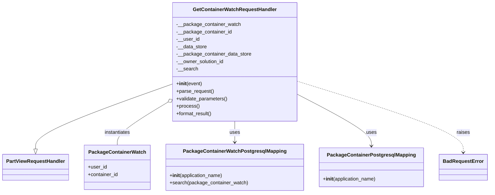

# Diagram: partview_core/partview_service/partview_service/api/package_container_watch/handlers/get_container_watch_request_handler.py

> Auto-generated by Obscura crawlers

## Mermaid

### SVG

<svg id="container" width="1548.046875" xmlns="http://www.w3.org/2000/svg" class="classDiagram" height="624" viewBox="0 0 1548.046875 624" role="graphics-document document" aria-roledescription="class"><g><defs><marker id="container_class-aggregationStart" class="marker aggregation class" refX="18" refY="7" markerWidth="190" markerHeight="240" orient="auto"><path d="M 18,7 L9,13 L1,7 L9,1 Z"></path></marker></defs><defs><marker id="container_class-aggregationEnd" class="marker aggregation class" refX="1" refY="7" markerWidth="20" markerHeight="28" orient="auto"><path d="M 18,7 L9,13 L1,7 L9,1 Z"></path></marker></defs><defs><marker id="container_class-extensionStart" class="marker extension class" refX="18" refY="7" markerWidth="190" markerHeight="240" orient="auto"><path d="M 1,7 L18,13 V 1 Z"></path></marker></defs><defs><marker id="container_class-extensionEnd" class="marker extension class" refX="1" refY="7" markerWidth="20" markerHeight="28" orient="auto"><path d="M 1,1 V 13 L18,7 Z"></path></marker></defs><defs><marker id="container_class-compositionStart" class="marker composition class" refX="18" refY="7" markerWidth="190" markerHeight="240" orient="auto"><path d="M 18,7 L9,13 L1,7 L9,1 Z"></path></marker></defs><defs><marker id="container_class-compositionEnd" class="marker composition class" refX="1" refY="7" markerWidth="20" markerHeight="28" orient="auto"><path d="M 18,7 L9,13 L1,7 L9,1 Z"></path></marker></defs><defs><marker id="container_class-dependencyStart" class="marker dependency class" refX="6" refY="7" markerWidth="190" markerHeight="240" orient="auto"><path d="M 5,7 L9,13 L1,7 L9,1 Z"></path></marker></defs><defs><marker id="container_class-dependencyEnd" class="marker dependency class" refX="13" refY="7" markerWidth="20" markerHeight="28" orient="auto"><path d="M 18,7 L9,13 L14,7 L9,1 Z"></path></marker></defs><defs><marker id="container_class-lollipopStart" class="marker lollipop class" refX="13" refY="7" markerWidth="190" markerHeight="240" orient="auto"><circle stroke="black" fill="transparent" cx="7" cy="7" r="6"></circle></marker></defs><defs><marker id="container_class-lollipopEnd" class="marker lollipop class" refX="1" refY="7" markerWidth="190" markerHeight="240" orient="auto"><circle stroke="black" fill="transparent" cx="7" cy="7" r="6"></circle></marker></defs><g class="root"><g class="clusters"></g><g class="edgePaths"><path d="M543.551,271.899L471.519,298.082C399.487,324.266,255.423,376.633,183.391,411.608C111.359,446.583,111.359,464.167,111.359,472.958L111.359,481.75" id="id_GetContainerWatchRequestHandler_PartViewRequestHandler_1" class="edge-thickness-normal edge-pattern-solid relation" style=";;;" data-edge="true" data-et="edge" data-id="id_GetContainerWatchRequestHandler_PartViewRequestHandler_1" data-points="W3sieCI6NTQzLjU1MDc4MTI1LCJ5IjoyNzEuODk4OTMxNjUxNzU0NH0seyJ4IjoxMTEuMzU5Mzc1LCJ5Ijo0Mjl9LHsieCI6MTExLjM1OTM3NSwieSI6NDk5fV0=" marker-end="url(#container_class-extensionEnd)"></path><path d="M528.865,330.947L502.348,347.289C475.83,363.631,422.794,396.316,396.276,419.324C369.758,442.333,369.758,455.667,369.758,462.333L369.758,469" id="id_GetContainerWatchRequestHandler_PackageContainerWatch_2" class="edge-thickness-normal edge-pattern-solid relation" style=";;;" data-edge="true" data-et="edge" data-id="id_GetContainerWatchRequestHandler_PackageContainerWatch_2" data-points="W3sieCI6NTQzLjU1MDc4MTI1LCJ5IjozMjEuODk2NDU0MjEzODQwNDZ9LHsieCI6MzY5Ljc1NzgxMjUsInkiOjQyOX0seyJ4IjozNjkuNzU3ODEyNSwieSI6NDY5fV0=" marker-start="url(#container_class-aggregationStart)"></path><path d="M741.348,392L741.348,398.167C741.348,404.333,741.348,416.667,741.348,428C741.348,439.333,741.348,449.667,741.348,454.833L741.348,460" id="id_GetContainerWatchRequestHandler_PackageContainerWatchPostgresqlMapping_3" class="edge-thickness-normal edge-pattern-solid relation" style=";;;" data-edge="true" data-et="edge" data-id="id_GetContainerWatchRequestHandler_PackageContainerWatchPostgresqlMapping_3" data-points="W3sieCI6NzQxLjM0NzY1NjI1LCJ5IjozOTJ9LHsieCI6NzQxLjM0NzY1NjI1LCJ5Ijo0Mjl9LHsieCI6NzQxLjM0NzY1NjI1LCJ5Ijo0NjZ9XQ==" marker-end="url(#container_class-dependencyEnd)"></path><path d="M939.145,304.526L978.402,325.271C1017.66,346.017,1096.176,387.509,1135.434,415.421C1174.691,443.333,1174.691,457.667,1174.691,464.833L1174.691,472" id="id_GetContainerWatchRequestHandler_PackageContainerPostgresqlMapping_4" class="edge-thickness-normal edge-pattern-solid relation" style=";;;" data-edge="true" data-et="edge" data-id="id_GetContainerWatchRequestHandler_PackageContainerPostgresqlMapping_4" data-points="W3sieCI6OTM5LjE0NDUzMTI1LCJ5IjozMDQuNTI1NTI4MjMyNDk0NH0seyJ4IjoxMTc0LjY5MTQwNjI1LCJ5Ijo0Mjl9LHsieCI6MTE3NC42OTE0MDYyNSwieSI6NDc4fV0=" marker-end="url(#container_class-dependencyEnd)"></path><path d="M939.145,262.527L1026.915,290.272C1114.685,318.018,1290.225,373.509,1377.995,411.921C1465.766,450.333,1465.766,471.667,1465.766,482.333L1465.766,493" id="id_GetContainerWatchRequestHandler_BadRequestError_5" class="edge-thickness-normal edge-pattern-dashed relation" style=";;;" data-edge="true" data-et="edge" data-id="id_GetContainerWatchRequestHandler_BadRequestError_5" data-points="W3sieCI6OTM5LjE0NDUzMTI1LCJ5IjoyNjIuNTI2NzI2NzM2NDQyNX0seyJ4IjoxNDY1Ljc2NTYyNSwieSI6NDI5fSx7IngiOjE0NjUuNzY1NjI1LCJ5Ijo0OTl9XQ==" marker-end="url(#container_class-dependencyEnd)"></path></g><g class="edgeLabels"><g class="edgeLabel"><g class="label" data-id="id_GetContainerWatchRequestHandler_PartViewRequestHandler_1" transform="translate(0, 0)"><foreignObject width="0" height="0">

</foreignObject></g></g><g class="edgeLabel" transform="translate(369.7578125, 429)"><g class="label" data-id="id_GetContainerWatchRequestHandler_PackageContainerWatch_2" transform="translate(-42.9140625, -12)"><foreignObject width="85.828125" height="24">

instantiates

</foreignObject></g></g><g class="edgeLabel" transform="translate(741.34765625, 429)"><g class="label" data-id="id_GetContainerWatchRequestHandler_PackageContainerWatchPostgresqlMapping_3" transform="translate(-16.4921875, -12)"><foreignObject width="32.984375" height="24">

uses

</foreignObject></g></g><g class="edgeLabel" transform="translate(1174.69140625, 429)"><g class="label" data-id="id_GetContainerWatchRequestHandler_PackageContainerPostgresqlMapping_4" transform="translate(-16.4921875, -12)"><foreignObject width="32.984375" height="24">

uses

</foreignObject></g></g><g class="edgeLabel" transform="translate(1465.765625, 429)"><g class="label" data-id="id_GetContainerWatchRequestHandler_BadRequestError_5" transform="translate(-21.25, -12)"><foreignObject width="42.5" height="24">

raises

</foreignObject></g></g></g><g class="nodes"><g class="node default" id="classId-GetContainerWatchRequestHandler-0" transform="translate(741.34765625, 200)"><g class="basic label-container"><path d="M-197.796875 -192 L197.796875 -192 L197.796875 192 L-197.796875 192" stroke="none" stroke-width="0" fill="#ECECFF" style=""></path><path d="M-197.796875 -192 C-80.97766774771117 -192, 35.84153950457767 -192, 197.796875 -192 M-197.796875 -192 C-65.32222001577676 -192, 67.15243496844647 -192, 197.796875 -192 M197.796875 -192 C197.796875 -68.80361101438521, 197.796875 54.39277797122958, 197.796875 192 M197.796875 -192 C197.796875 -50.278954220680646, 197.796875 91.44209155863871, 197.796875 192 M197.796875 192 C113.47766183027426 192, 29.158448660548515 192, -197.796875 192 M197.796875 192 C109.17398645791019 192, 20.551097915820378 192, -197.796875 192 M-197.796875 192 C-197.796875 113.86273740313442, -197.796875 35.725474806268835, -197.796875 -192 M-197.796875 192 C-197.796875 63.159972761634435, -197.796875 -65.68005447673113, -197.796875 -192" stroke="#9370DB" stroke-width="1.3" fill="none" stroke-dasharray="0 0" style=""></path></g><g class="annotation-group text" transform="translate(0, -168)"></g><g class="label-group text" transform="translate(-129.640625, -168)"><g class="label" style="font-weight: bolder" transform="translate(0,-12)"><foreignObject width="259.28125" height="24">

GetContainerWatchRequestHandler

</foreignObject></g></g><g class="members-group text" transform="translate(-185.796875, -120)"><g class="label" style="" transform="translate(0,-12)"><foreignObject width="206.78125" height="24">

-__package_container_watch

</foreignObject></g><g class="label" style="" transform="translate(0,12)"><foreignObject width="178.625" height="24">

-__package_container_id

</foreignObject></g><g class="label" style="" transform="translate(0,36)"><foreignObject width="74.140625" height="24">

-__user_id

</foreignObject></g><g class="label" style="" transform="translate(0,60)"><foreignObject width="99.0625" height="24">

-__data_store

</foreignObject></g><g class="label" style="" transform="translate(0,84)"><foreignObject width="241.953125" height="24">

-__package_container_data_store

</foreignObject></g><g class="label" style="" transform="translate(0,108)"><foreignObject width="155.6875" height="24">

-__owner_solution_id

</foreignObject></g><g class="label" style="" transform="translate(0,132)"><foreignObject width="69.109375" height="24">

-__search

</foreignObject></g></g><g class="methods-group text" transform="translate(-185.796875, 72)"><g class="label" style="" transform="translate(0,-12)"><foreignObject width="83.140625" height="24">

+<strong>init</strong>(event)

</foreignObject></g><g class="label" style="" transform="translate(0,12)"><foreignObject width="121.796875" height="24">

+parse_request()

</foreignObject></g><g class="label" style="" transform="translate(0,36)"><foreignObject width="166.546875" height="24">

+validate_parameters()

</foreignObject></g><g class="label" style="" transform="translate(0,60)"><foreignObject width="73.734375" height="24">

+process()

</foreignObject></g><g class="label" style="" transform="translate(0,84)"><foreignObject width="117.015625" height="24">

+format_result()

</foreignObject></g></g><g class="divider" style=""><path d="M-197.796875 -144 C-113.77230311598619 -144, -29.74773123197238 -144, 197.796875 -144 M-197.796875 -144 C-64.37489740470977 -144, 69.04708019058046 -144, 197.796875 -144" stroke="#9370DB" stroke-width="1.3" fill="none" stroke-dasharray="0 0" style=""></path></g><g class="divider" style=""><path d="M-197.796875 48 C-88.78471789171337 48, 20.22743921657326 48, 197.796875 48 M-197.796875 48 C-53.84312799084225 48, 90.1106190183155 48, 197.796875 48" stroke="#9370DB" stroke-width="1.3" fill="none" stroke-dasharray="0 0" style=""></path></g></g><g class="node default" id="classId-PartViewRequestHandler-1" transform="translate(111.359375, 541)"><g class="basic label-container"><path d="M-103.359375 -42 L103.359375 -42 L103.359375 42 L-103.359375 42" stroke="none" stroke-width="0" fill="#ECECFF" style=""></path><path d="M-103.359375 -42 C-38.25948532587688 -42, 26.84040434824624 -42, 103.359375 -42 M-103.359375 -42 C-30.274486932652408 -42, 42.810401134695184 -42, 103.359375 -42 M103.359375 -42 C103.359375 -17.183056423659878, 103.359375 7.633887152680245, 103.359375 42 M103.359375 -42 C103.359375 -9.327596476246526, 103.359375 23.344807047506947, 103.359375 42 M103.359375 42 C59.59828739910843 42, 15.837199798216858 42, -103.359375 42 M103.359375 42 C59.082019542306305 42, 14.804664084612611 42, -103.359375 42 M-103.359375 42 C-103.359375 23.11583593434996, -103.359375 4.2316718686999195, -103.359375 -42 M-103.359375 42 C-103.359375 20.624480675392963, -103.359375 -0.7510386492140739, -103.359375 -42" stroke="#9370DB" stroke-width="1.3" fill="none" stroke-dasharray="0 0" style=""></path></g><g class="annotation-group text" transform="translate(0, -18)"></g><g class="label-group text" transform="translate(-91.359375, -18)"><g class="label" style="font-weight: bolder" transform="translate(0,-12)"><foreignObject width="182.71875" height="24">

PartViewRequestHandler

</foreignObject></g></g><g class="members-group text" transform="translate(-91.359375, 30)"></g><g class="methods-group text" transform="translate(-91.359375, 60)"></g><g class="divider" style=""><path d="M-103.359375 6 C-42.68677163694417 6, 17.985831726111655 6, 103.359375 6 M-103.359375 6 C-45.45908037614566 6, 12.441214247708686 6, 103.359375 6" stroke="#9370DB" stroke-width="1.3" fill="none" stroke-dasharray="0 0" style=""></path></g><g class="divider" style=""><path d="M-103.359375 24 C-45.25124417616243 24, 12.85688664767514 24, 103.359375 24 M-103.359375 24 C-22.44724343130818 24, 58.46488813738364 24, 103.359375 24" stroke="#9370DB" stroke-width="1.3" fill="none" stroke-dasharray="0 0" style=""></path></g></g><g class="node default" id="classId-PackageContainerWatch-2" transform="translate(369.7578125, 541)"><g class="basic label-container"><path d="M-105.0390625 -72 L105.0390625 -72 L105.0390625 72 L-105.0390625 72" stroke="none" stroke-width="0" fill="#ECECFF" style=""></path><path d="M-105.0390625 -72 C-33.15286012462198 -72, 38.73334225075604 -72, 105.0390625 -72 M-105.0390625 -72 C-21.663681070454345 -72, 61.71170035909131 -72, 105.0390625 -72 M105.0390625 -72 C105.0390625 -38.24741012354784, 105.0390625 -4.494820247095674, 105.0390625 72 M105.0390625 -72 C105.0390625 -29.29306095357, 105.0390625 13.413878092860003, 105.0390625 72 M105.0390625 72 C30.383471239556783 72, -44.27212002088643 72, -105.0390625 72 M105.0390625 72 C47.493072713861345 72, -10.05291707227731 72, -105.0390625 72 M-105.0390625 72 C-105.0390625 21.286140657966357, -105.0390625 -29.427718684067287, -105.0390625 -72 M-105.0390625 72 C-105.0390625 29.974617044301098, -105.0390625 -12.050765911397804, -105.0390625 -72" stroke="#9370DB" stroke-width="1.3" fill="none" stroke-dasharray="0 0" style=""></path></g><g class="annotation-group text" transform="translate(0, -48)"></g><g class="label-group text" transform="translate(-87.765625, -48)"><g class="label" style="font-weight: bolder" transform="translate(0,-12)"><foreignObject width="175.53125" height="24">

PackageContainerWatch

</foreignObject></g></g><g class="members-group text" transform="translate(-93.0390625, 0)"><g class="label" style="" transform="translate(0,-12)"><foreignObject width="60.796875" height="24">

+user_id

</foreignObject></g><g class="label" style="" transform="translate(0,12)"><foreignObject width="98.3125" height="24">

+container_id

</foreignObject></g></g><g class="methods-group text" transform="translate(-93.0390625, 72)"></g><g class="divider" style=""><path d="M-105.0390625 -24 C-22.74351382690807 -24, 59.55203484618386 -24, 105.0390625 -24 M-105.0390625 -24 C-47.92304907252048 -24, 9.192964354959045 -24, 105.0390625 -24" stroke="#9370DB" stroke-width="1.3" fill="none" stroke-dasharray="0 0" style=""></path></g><g class="divider" style=""><path d="M-105.0390625 48 C-51.82425456427474 48, 1.3905533714505225 48, 105.0390625 48 M-105.0390625 48 C-55.280595399401335 48, -5.52212829880267 48, 105.0390625 48" stroke="#9370DB" stroke-width="1.3" fill="none" stroke-dasharray="0 0" style=""></path></g></g><g class="node default" id="classId-PackageContainerWatchPostgresqlMapping-3" transform="translate(741.34765625, 541)"><g class="basic label-container"><path d="M-216.55078125 -75 L216.55078125 -75 L216.55078125 75 L-216.55078125 75" stroke="none" stroke-width="0" fill="#ECECFF" style=""></path><path d="M-216.55078125 -75 C-116.15835885148574 -75, -15.765936452971488 -75, 216.55078125 -75 M-216.55078125 -75 C-80.23034540412192 -75, 56.09009044175616 -75, 216.55078125 -75 M216.55078125 -75 C216.55078125 -16.471401990418528, 216.55078125 42.057196019162944, 216.55078125 75 M216.55078125 -75 C216.55078125 -43.660318225799934, 216.55078125 -12.320636451599867, 216.55078125 75 M216.55078125 75 C87.79779521729373 75, -40.95519081541255 75, -216.55078125 75 M216.55078125 75 C63.35800478078403 75, -89.83477168843194 75, -216.55078125 75 M-216.55078125 75 C-216.55078125 21.857133621025632, -216.55078125 -31.285732757948736, -216.55078125 -75 M-216.55078125 75 C-216.55078125 44.583811678308656, -216.55078125 14.167623356617312, -216.55078125 -75" stroke="#9370DB" stroke-width="1.3" fill="none" stroke-dasharray="0 0" style=""></path></g><g class="annotation-group text" transform="translate(0, -51)"></g><g class="label-group text" transform="translate(-158.1640625, -51)"><g class="label" style="font-weight: bolder" transform="translate(0,-12)"><foreignObject width="316.328125" height="24">

PackageContainerWatchPostgresqlMapping

</foreignObject></g></g><g class="members-group text" transform="translate(-204.55078125, -3)"></g><g class="methods-group text" transform="translate(-204.55078125, 27)"><g class="label" style="" transform="translate(0,-12)"><foreignObject width="173.734375" height="24">

+<strong>init</strong>(application_name)

</foreignObject></g><g class="label" style="" transform="translate(0,12)"><foreignObject width="250.9375" height="24">

+search(package_container_watch)

</foreignObject></g></g><g class="divider" style=""><path d="M-216.55078125 -27 C-52.99267518065335 -27, 110.5654308886933 -27, 216.55078125 -27 M-216.55078125 -27 C-86.85328559038194 -27, 42.84421006923611 -27, 216.55078125 -27" stroke="#9370DB" stroke-width="1.3" fill="none" stroke-dasharray="0 0" style=""></path></g><g class="divider" style=""><path d="M-216.55078125 -3 C-46.35825538092851 -3, 123.83427048814298 -3, 216.55078125 -3 M-216.55078125 -3 C-104.03462363281253 -3, 8.481533984374948 -3, 216.55078125 -3" stroke="#9370DB" stroke-width="1.3" fill="none" stroke-dasharray="0 0" style=""></path></g></g><g class="node default" id="classId-PackageContainerPostgresqlMapping-4" transform="translate(1174.69140625, 541)"><g class="basic label-container"><path d="M-166.79296875 -63 L166.79296875 -63 L166.79296875 63 L-166.79296875 63" stroke="none" stroke-width="0" fill="#ECECFF" style=""></path><path d="M-166.79296875 -63 C-89.25984003308916 -63, -11.726711316178324 -63, 166.79296875 -63 M-166.79296875 -63 C-36.70402748537981 -63, 93.38491377924038 -63, 166.79296875 -63 M166.79296875 -63 C166.79296875 -21.75331044203459, 166.79296875 19.49337911593082, 166.79296875 63 M166.79296875 -63 C166.79296875 -25.772063969920637, 166.79296875 11.455872060158725, 166.79296875 63 M166.79296875 63 C79.69111537050337 63, -7.410738008993263 63, -166.79296875 63 M166.79296875 63 C59.82254874973873 63, -47.14787125052254 63, -166.79296875 63 M-166.79296875 63 C-166.79296875 37.220866744818764, -166.79296875 11.441733489637528, -166.79296875 -63 M-166.79296875 63 C-166.79296875 36.18547958828823, -166.79296875 9.370959176576463, -166.79296875 -63" stroke="#9370DB" stroke-width="1.3" fill="none" stroke-dasharray="0 0" style=""></path></g><g class="annotation-group text" transform="translate(0, -39)"></g><g class="label-group text" transform="translate(-135.8515625, -39)"><g class="label" style="font-weight: bolder" transform="translate(0,-12)"><foreignObject width="271.703125" height="24">

PackageContainerPostgresqlMapping

</foreignObject></g></g><g class="members-group text" transform="translate(-154.79296875, 9)"></g><g class="methods-group text" transform="translate(-154.79296875, 39)"><g class="label" style="" transform="translate(0,-12)"><foreignObject width="173.734375" height="24">

+<strong>init</strong>(application_name)

</foreignObject></g></g><g class="divider" style=""><path d="M-166.79296875 -15 C-33.49543395363301 -15, 99.80210084273398 -15, 166.79296875 -15 M-166.79296875 -15 C-81.15449666843732 -15, 4.483975413125364 -15, 166.79296875 -15" stroke="#9370DB" stroke-width="1.3" fill="none" stroke-dasharray="0 0" style=""></path></g><g class="divider" style=""><path d="M-166.79296875 9 C-54.96266833701341 9, 56.86763207597318 9, 166.79296875 9 M-166.79296875 9 C-98.15025518795665 9, -29.50754162591329 9, 166.79296875 9" stroke="#9370DB" stroke-width="1.3" fill="none" stroke-dasharray="0 0" style=""></path></g></g><g class="node default" id="classId-BadRequestError-5" transform="translate(1465.765625, 541)"><g class="basic label-container"><path d="M-74.28125 -42 L74.28125 -42 L74.28125 42 L-74.28125 42" stroke="none" stroke-width="0" fill="#ECECFF" style=""></path><path d="M-74.28125 -42 C-34.63509276632497 -42, 5.011064467350053 -42, 74.28125 -42 M-74.28125 -42 C-26.727347759041443 -42, 20.826554481917114 -42, 74.28125 -42 M74.28125 -42 C74.28125 -19.311563555520607, 74.28125 3.3768728889587862, 74.28125 42 M74.28125 -42 C74.28125 -16.766082411854242, 74.28125 8.467835176291516, 74.28125 42 M74.28125 42 C28.332596172151796 42, -17.61605765569641 42, -74.28125 42 M74.28125 42 C19.76275694381183 42, -34.75573611237634 42, -74.28125 42 M-74.28125 42 C-74.28125 22.09256023165135, -74.28125 2.1851204633027024, -74.28125 -42 M-74.28125 42 C-74.28125 20.058611385133457, -74.28125 -1.8827772297330867, -74.28125 -42" stroke="#9370DB" stroke-width="1.3" fill="none" stroke-dasharray="0 0" style=""></path></g><g class="annotation-group text" transform="translate(0, -18)"></g><g class="label-group text" transform="translate(-62.28125, -18)"><g class="label" style="font-weight: bolder" transform="translate(0,-12)"><foreignObject width="124.5625" height="24">

BadRequestError

</foreignObject></g></g><g class="members-group text" transform="translate(-62.28125, 30)"></g><g class="methods-group text" transform="translate(-62.28125, 60)"></g><g class="divider" style=""><path d="M-74.28125 6 C-19.755279921183217 6, 34.77069015763357 6, 74.28125 6 M-74.28125 6 C-23.96040928595393 6, 26.36043142809214 6, 74.28125 6" stroke="#9370DB" stroke-width="1.3" fill="none" stroke-dasharray="0 0" style=""></path></g><g class="divider" style=""><path d="M-74.28125 24 C-21.011622410657793 24, 32.258005178684414 24, 74.28125 24 M-74.28125 24 C-15.711132355962796 24, 42.85898528807441 24, 74.28125 24" stroke="#9370DB" stroke-width="1.3" fill="none" stroke-dasharray="0 0" style=""></path></g></g></g></g></g></svg>
