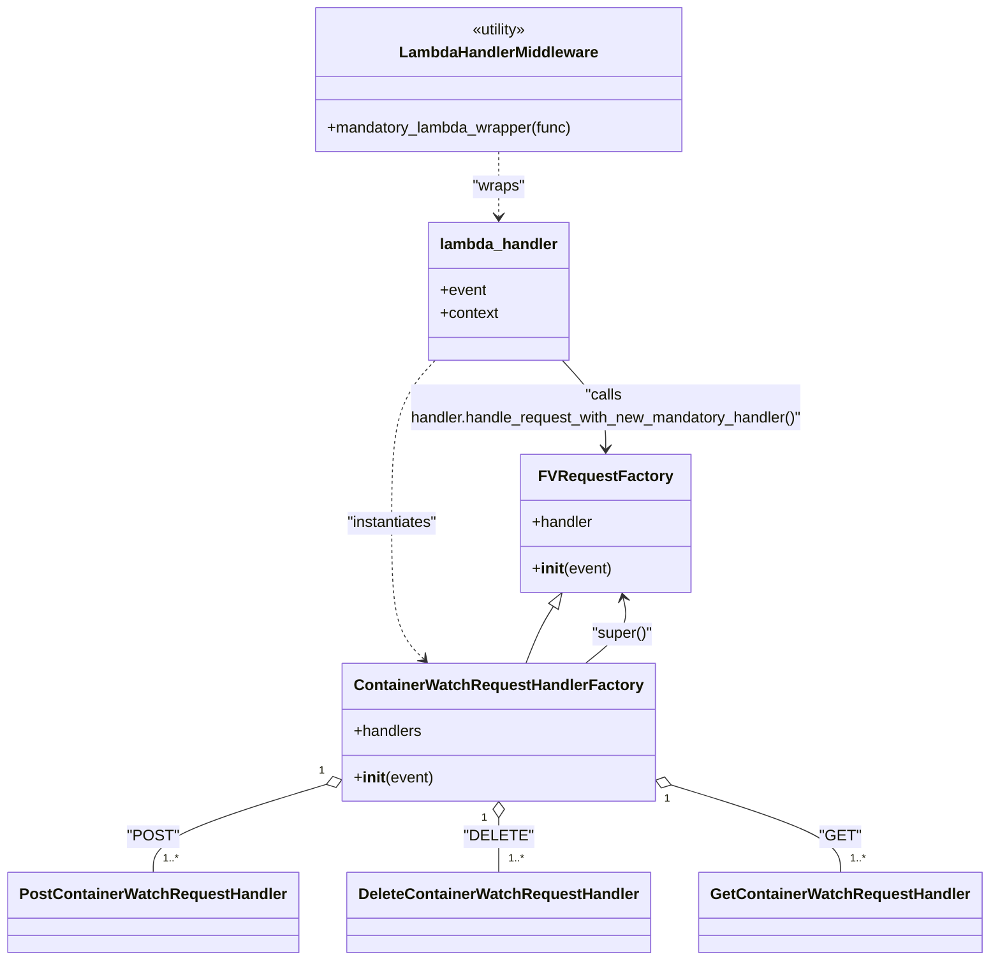

# Diagram: partview_core/partview_service/partview_service/api/package_container_watch/package_container_watch.py

> Auto-generated by Obscura crawlers

## Mermaid

### SVG

<svg id="container" width="995.046875" xmlns="http://www.w3.org/2000/svg" class="classDiagram" height="1002" viewBox="0 0 995.046875 1002" role="graphics-document document" aria-roledescription="class"><g><defs><marker id="container_class-aggregationStart" class="marker aggregation class" refX="18" refY="7" markerWidth="190" markerHeight="240" orient="auto"><path d="M 18,7 L9,13 L1,7 L9,1 Z"></path></marker></defs><defs><marker id="container_class-aggregationEnd" class="marker aggregation class" refX="1" refY="7" markerWidth="20" markerHeight="28" orient="auto"><path d="M 18,7 L9,13 L1,7 L9,1 Z"></path></marker></defs><defs><marker id="container_class-extensionStart" class="marker extension class" refX="18" refY="7" markerWidth="190" markerHeight="240" orient="auto"><path d="M 1,7 L18,13 V 1 Z"></path></marker></defs><defs><marker id="container_class-extensionEnd" class="marker extension class" refX="1" refY="7" markerWidth="20" markerHeight="28" orient="auto"><path d="M 1,1 V 13 L18,7 Z"></path></marker></defs><defs><marker id="container_class-compositionStart" class="marker composition class" refX="18" refY="7" markerWidth="190" markerHeight="240" orient="auto"><path d="M 18,7 L9,13 L1,7 L9,1 Z"></path></marker></defs><defs><marker id="container_class-compositionEnd" class="marker composition class" refX="1" refY="7" markerWidth="20" markerHeight="28" orient="auto"><path d="M 18,7 L9,13 L1,7 L9,1 Z"></path></marker></defs><defs><marker id="container_class-dependencyStart" class="marker dependency class" refX="6" refY="7" markerWidth="190" markerHeight="240" orient="auto"><path d="M 5,7 L9,13 L1,7 L9,1 Z"></path></marker></defs><defs><marker id="container_class-dependencyEnd" class="marker dependency class" refX="13" refY="7" markerWidth="20" markerHeight="28" orient="auto"><path d="M 18,7 L9,13 L14,7 L9,1 Z"></path></marker></defs><defs><marker id="container_class-lollipopStart" class="marker lollipop class" refX="13" refY="7" markerWidth="190" markerHeight="240" orient="auto"><circle stroke="black" fill="transparent" cx="7" cy="7" r="6"></circle></marker></defs><defs><marker id="container_class-lollipopEnd" class="marker lollipop class" refX="1" refY="7" markerWidth="190" markerHeight="240" orient="auto"><circle stroke="black" fill="transparent" cx="7" cy="7" r="6"></circle></marker></defs><g class="root"><g class="clusters"></g><g class="edgePaths"><path d="M567.948,633.142L565.96,636.785C563.972,640.428,559.996,647.714,554.898,657.524C549.799,667.333,543.579,679.667,540.469,685.833L537.359,692" id="id_FVRequestFactory_ContainerWatchRequestHandlerFactory_1" class="edge-thickness-normal edge-pattern-solid relation" style=";;;" data-edge="true" data-et="edge" data-id="id_FVRequestFactory_ContainerWatchRequestHandlerFactory_1" data-points="W3sieCI6NTc2LjIxMTQ3NTA1NzMzOTUsInkiOjYxOH0seyJ4Ijo1NTYuMDE5NTMxMjUsInkiOjY1NX0seyJ4Ijo1MzcuMzU5MDg4MzAyNzUyMywieSI6NjkyfV0=" marker-start="url(#container_class-extensionStart)"></path><path d="M329.008,817.904L299.701,827.087C270.393,836.269,211.779,854.635,182.471,869.984C153.164,885.333,153.164,897.667,153.164,903.833L153.164,910" id="id_ContainerWatchRequestHandlerFactory_PostContainerWatchRequestHandler_2" class="edge-thickness-normal edge-pattern-solid relation" style=";;;" data-edge="true" data-et="edge" data-id="id_ContainerWatchRequestHandlerFactory_PostContainerWatchRequestHandler_2" data-points="W3sieCI6MzQ1LjQ2ODc1LCJ5Ijo4MTIuNzQ2MzQ1MDc4NDg4Mn0seyJ4IjoxNTMuMTY0MDYyNSwieSI6ODczfSx7IngiOjE1My4xNjQwNjI1LCJ5Ijo5MTB9XQ==" marker-start="url(#container_class-aggregationStart)"></path><path d="M501.047,853.25L501.047,856.542C501.047,859.833,501.047,866.417,501.047,875.875C501.047,885.333,501.047,897.667,501.047,903.833L501.047,910" id="id_ContainerWatchRequestHandlerFactory_DeleteContainerWatchRequestHandler_3" class="edge-thickness-normal edge-pattern-solid relation" style=";;;" data-edge="true" data-et="edge" data-id="id_ContainerWatchRequestHandlerFactory_DeleteContainerWatchRequestHandler_3" data-points="W3sieCI6NTAxLjA0Njg3NSwieSI6ODM2fSx7IngiOjUwMS4wNDY4NzUsInkiOjg3M30seyJ4Ijo1MDEuMDQ2ODc1LCJ5Ijo5MTB9XQ==" marker-start="url(#container_class-aggregationStart)"></path><path d="M673.071,818.451L701.793,827.542C730.516,836.634,787.961,854.817,816.684,870.075C845.406,885.333,845.406,897.667,845.406,903.833L845.406,910" id="id_ContainerWatchRequestHandlerFactory_GetContainerWatchRequestHandler_4" class="edge-thickness-normal edge-pattern-solid relation" style=";;;" data-edge="true" data-et="edge" data-id="id_ContainerWatchRequestHandlerFactory_GetContainerWatchRequestHandler_4" data-points="W3sieCI6NjU2LjYyNSwieSI6ODEzLjI0NTExMDkzOTY5Nzh9LHsieCI6ODQ1LjQwNjI1LCJ5Ijo4NzN9LHsieCI6ODQ1LjQwNjI1LCJ5Ijo5MTB9XQ==" marker-start="url(#container_class-aggregationStart)"></path><path d="M593.854,692L601.803,685.833C609.752,679.667,625.649,667.333,632.357,655.973C639.065,644.612,636.583,634.224,635.342,629.03L634.101,623.836" id="id_ContainerWatchRequestHandlerFactory_FVRequestFactory_5" class="edge-thickness-normal edge-pattern-solid relation" style=";;;" data-edge="true" data-et="edge" data-id="id_ContainerWatchRequestHandlerFactory_FVRequestFactory_5" data-points="W3sieCI6NTkzLjg1NDIxNDQ0OTU0MTIsInkiOjY5Mn0seyJ4Ijo2NDEuNTQ2ODc1LCJ5Ijo2NTV9LHsieCI6NjMyLjcwNjYwMTIwNDEyODQsInkiOjYxOH1d" marker-end="url(#container_class-dependencyEnd)"></path><path d="M501.047,158L501.047,164.167C501.047,170.333,501.047,182.667,501.047,194C501.047,205.333,501.047,215.667,501.047,220.833L501.047,226" id="id_LambdaHandlerMiddleware_lambda_handler_6" class="edge-thickness-normal edge-pattern-dashed relation" style=";;;" data-edge="true" data-et="edge" data-id="id_LambdaHandlerMiddleware_lambda_handler_6" data-points="W3sieCI6NTAxLjA0Njg3NSwieSI6MTU4fSx7IngiOjUwMS4wNDY4NzUsInkiOjE5NX0seyJ4Ijo1MDEuMDQ2ODc1LCJ5IjoyMzJ9XQ==" marker-end="url(#container_class-dependencyEnd)"></path><path d="M432.94,376L425.215,384.167C417.49,392.333,402.04,408.667,394.315,437C386.59,465.333,386.59,505.667,386.59,544C386.59,582.333,386.59,618.667,392.341,642.31C398.092,665.954,409.595,676.908,415.346,682.385L421.097,687.862" id="id_lambda_handler_ContainerWatchRequestHandlerFactory_7" class="edge-thickness-normal edge-pattern-dashed relation" style=";;;" data-edge="true" data-et="edge" data-id="id_lambda_handler_ContainerWatchRequestHandlerFactory_7" data-points="W3sieCI6NDMyLjk0MDIxMTc3Njg1OTUsInkiOjM3Nn0seyJ4IjozODYuNTg5ODQzNzUsInkiOjQyNX0seyJ4IjozODYuNTg5ODQzNzUsInkiOjU0Nn0seyJ4IjozODYuNTg5ODQzNzUsInkiOjY1NX0seyJ4Ijo0MjUuNDQyMjMwNTA0NTg3MTQsInkiOjY5Mn1d" marker-end="url(#container_class-dependencyEnd)"></path><path d="M569.154,376L576.879,384.167C584.604,392.333,600.054,408.667,607.779,424C615.504,439.333,615.504,453.667,615.504,460.833L615.504,468" id="id_lambda_handler_FVRequestFactory_8" class="edge-thickness-normal edge-pattern-solid relation" style=";;;" data-edge="true" data-et="edge" data-id="id_lambda_handler_FVRequestFactory_8" data-points="W3sieCI6NTY5LjE1MzUzODIyMzE0MDUsInkiOjM3Nn0seyJ4Ijo2MTUuNTAzOTA2MjUsInkiOjQyNX0seyJ4Ijo2MTUuNTAzOTA2MjUsInkiOjQ3NH1d" marker-end="url(#container_class-dependencyEnd)"></path></g><g class="edgeLabels"><g class="edgeLabel"><g class="label" data-id="id_FVRequestFactory_ContainerWatchRequestHandlerFactory_1" transform="translate(0, 0)"><foreignObject width="0" height="0">

</foreignObject></g></g><g class="edgeLabel" transform="translate(153.1640625, 873)"><g class="label" data-id="id_ContainerWatchRequestHandlerFactory_PostContainerWatchRequestHandler_2" transform="translate(-24.96875, -12)"><foreignObject width="49.9375" height="24">

"POST"

</foreignObject></g></g><g class="edgeLabel" transform="translate(501.046875, 873)"><g class="label" data-id="id_ContainerWatchRequestHandlerFactory_DeleteContainerWatchRequestHandler_3" transform="translate(-32.5, -12)"><foreignObject width="65" height="24">

"DELETE"

</foreignObject></g></g><g class="edgeLabel" transform="translate(845.40625, 873)"><g class="label" data-id="id_ContainerWatchRequestHandlerFactory_GetContainerWatchRequestHandler_4" transform="translate(-19.9296875, -12)"><foreignObject width="39.859375" height="24">

"GET"

</foreignObject></g></g><g class="edgeLabel" transform="translate(632.72898, 661.84093)"><g class="label" data-id="id_ContainerWatchRequestHandlerFactory_FVRequestFactory_5" transform="translate(-32.0859375, -12)"><foreignObject width="64.171875" height="24">

"super()"

</foreignObject></g></g><g class="edgeLabel" transform="translate(501.046875, 195)"><g class="label" data-id="id_LambdaHandlerMiddleware_lambda_handler_6" transform="translate(-27.6484375, -12)"><foreignObject width="55.296875" height="24">

"wraps"

</foreignObject></g></g><g class="edgeLabel" transform="translate(386.58984375, 546)"><g class="label" data-id="id_lambda_handler_ContainerWatchRequestHandlerFactory_7" transform="translate(-49.1796875, -12)"><foreignObject width="98.359375" height="24">

"instantiates"

</foreignObject></g></g><g class="edgeLabel" transform="translate(615.50390625, 425)"><g class="label" data-id="id_lambda_handler_FVRequestFactory_8" transform="translate(-208.9140625, -24)"><foreignObject width="417.828125" height="48">

"calls handler.handle_request_with_new_mandatory_handler()"

</foreignObject></g></g><g class="edgeTerminals" transform="translate(324.2844014231834, 803.6648546943933)"><g class="inner" transform="translate(0, 0)"><foreignObject style="width: 9px; height: 12px;">
1
</foreignObject></g></g><g class="edgeTerminals" transform="translate(486.04687750000016, 853.5000021428572)"><g class="inner" transform="translate(0, 0)"><foreignObject style="width: 9px; height: 12px;">
1
</foreignObject></g></g><g class="edgeTerminals" transform="translate(668.782548018053, 832.8268369480988)"><g class="inner" transform="translate(0, 0)"><foreignObject style="width: 9px; height: 12px;">
1
</foreignObject></g></g><g class="edgeTerminals" transform="translate(163.16406124999997, 887.4999989285715)"><g class="inner" transform="translate(0, 0)"></g><foreignObject style="width: 36px; height: 12px;">
1..*
</foreignObject></g><g class="edgeTerminals" transform="translate(511.0468774999998, 887.5000021428572)"><g class="inner" transform="translate(0, 0)"></g><foreignObject style="width: 36px; height: 12px;">
1..*
</foreignObject></g><g class="edgeTerminals" transform="translate(855.40625, 887.5)"><g class="inner" transform="translate(0, 0)"></g><foreignObject style="width: 36px; height: 12px;">
1..*
</foreignObject></g></g><g class="nodes"><g class="node default" id="classId-FVRequestFactory-0" transform="translate(615.50390625, 546)"><g class="basic label-container"><path d="M-86.08984375 -72 L86.08984375 -72 L86.08984375 72 L-86.08984375 72" stroke="none" stroke-width="0" fill="#ECECFF" style=""></path><path d="M-86.08984375 -72 C-34.34163963746857 -72, 17.406564475062865 -72, 86.08984375 -72 M-86.08984375 -72 C-23.320901137732783 -72, 39.448041474534435 -72, 86.08984375 -72 M86.08984375 -72 C86.08984375 -20.605685428313485, 86.08984375 30.78862914337303, 86.08984375 72 M86.08984375 -72 C86.08984375 -21.515769628147638, 86.08984375 28.968460743704725, 86.08984375 72 M86.08984375 72 C39.491781368187894 72, -7.106281013624212 72, -86.08984375 72 M86.08984375 72 C35.11969381064476 72, -15.850456128710476 72, -86.08984375 72 M-86.08984375 72 C-86.08984375 39.224497066194886, -86.08984375 6.448994132389771, -86.08984375 -72 M-86.08984375 72 C-86.08984375 31.34549494801206, -86.08984375 -9.30901010397588, -86.08984375 -72" stroke="#9370DB" stroke-width="1.3" fill="none" stroke-dasharray="0 0" style=""></path></g><g class="annotation-group text" transform="translate(0, -48)"></g><g class="label-group text" transform="translate(-65.0390625, -48)"><g class="label" style="font-weight: bolder" transform="translate(0,-12)"><foreignObject width="130.078125" height="24">

FVRequestFactory

</foreignObject></g></g><g class="members-group text" transform="translate(-74.08984375, 0)"><g class="label" style="" transform="translate(0,-12)"><foreignObject width="64.515625" height="24">

+handler

</foreignObject></g></g><g class="methods-group text" transform="translate(-74.08984375, 48)"><g class="label" style="" transform="translate(0,-12)"><foreignObject width="83.140625" height="24">

+<strong>init</strong>(event)

</foreignObject></g></g><g class="divider" style=""><path d="M-86.08984375 -24 C-33.269205620841014 -24, 19.551432508317973 -24, 86.08984375 -24 M-86.08984375 -24 C-36.16997263845067 -24, 13.749898473098654 -24, 86.08984375 -24" stroke="#9370DB" stroke-width="1.3" fill="none" stroke-dasharray="0 0" style=""></path></g><g class="divider" style=""><path d="M-86.08984375 24 C-41.87847043591363 24, 2.332902878172746 24, 86.08984375 24 M-86.08984375 24 C-20.12815953115748 24, 45.83352468768504 24, 86.08984375 24" stroke="#9370DB" stroke-width="1.3" fill="none" stroke-dasharray="0 0" style=""></path></g></g><g class="node default" id="classId-ContainerWatchRequestHandlerFactory-1" transform="translate(501.046875, 764)"><g class="basic label-container"><path d="M-155.578125 -72 L155.578125 -72 L155.578125 72 L-155.578125 72" stroke="none" stroke-width="0" fill="#ECECFF" style=""></path><path d="M-155.578125 -72 C-77.31292376650234 -72, 0.9522774669953264 -72, 155.578125 -72 M-155.578125 -72 C-59.996600324325456 -72, 35.58492435134909 -72, 155.578125 -72 M155.578125 -72 C155.578125 -34.257173436948634, 155.578125 3.485653126102733, 155.578125 72 M155.578125 -72 C155.578125 -19.90660038737127, 155.578125 32.18679922525746, 155.578125 72 M155.578125 72 C61.74611350738613 72, -32.085897985227746 72, -155.578125 72 M155.578125 72 C74.03649541781678 72, -7.505134164366439 72, -155.578125 72 M-155.578125 72 C-155.578125 16.662198154164066, -155.578125 -38.67560369167187, -155.578125 -72 M-155.578125 72 C-155.578125 22.242908176825445, -155.578125 -27.51418364634911, -155.578125 -72" stroke="#9370DB" stroke-width="1.3" fill="none" stroke-dasharray="0 0" style=""></path></g><g class="annotation-group text" transform="translate(0, -48)"></g><g class="label-group text" transform="translate(-143.578125, -48)"><g class="label" style="font-weight: bolder" transform="translate(0,-12)"><foreignObject width="287.15625" height="24">

ContainerWatchRequestHandlerFactory

</foreignObject></g></g><g class="members-group text" transform="translate(-143.578125, 0)"><g class="label" style="" transform="translate(0,-12)"><foreignObject width="71.75" height="24">

+handlers

</foreignObject></g></g><g class="methods-group text" transform="translate(-143.578125, 48)"><g class="label" style="" transform="translate(0,-12)"><foreignObject width="83.140625" height="24">

+<strong>init</strong>(event)

</foreignObject></g></g><g class="divider" style=""><path d="M-155.578125 -24 C-92.82706097164481 -24, -30.07599694328964 -24, 155.578125 -24 M-155.578125 -24 C-82.62892406251775 -24, -9.679723125035508 -24, 155.578125 -24" stroke="#9370DB" stroke-width="1.3" fill="none" stroke-dasharray="0 0" style=""></path></g><g class="divider" style=""><path d="M-155.578125 24 C-55.74261384875898 24, 44.092897302482044 24, 155.578125 24 M-155.578125 24 C-77.4099483605973 24, 0.7582282788054044 24, 155.578125 24" stroke="#9370DB" stroke-width="1.3" fill="none" stroke-dasharray="0 0" style=""></path></g></g><g class="node default" id="classId-PostContainerWatchRequestHandler-2" transform="translate(153.1640625, 952)"><g class="basic label-container"><path d="M-145.1640625 -42 L145.1640625 -42 L145.1640625 42 L-145.1640625 42" stroke="none" stroke-width="0" fill="#ECECFF" style=""></path><path d="M-145.1640625 -42 C-70.84801181072103 -42, 3.468038878557934 -42, 145.1640625 -42 M-145.1640625 -42 C-76.82656160015397 -42, -8.489060700307931 -42, 145.1640625 -42 M145.1640625 -42 C145.1640625 -21.87455943112127, 145.1640625 -1.7491188622425398, 145.1640625 42 M145.1640625 -42 C145.1640625 -24.723875361023218, 145.1640625 -7.447750722046436, 145.1640625 42 M145.1640625 42 C78.50683167455345 42, 11.849600849106906 42, -145.1640625 42 M145.1640625 42 C38.827576757553445 42, -67.50890898489311 42, -145.1640625 42 M-145.1640625 42 C-145.1640625 10.685668625682535, -145.1640625 -20.62866274863493, -145.1640625 -42 M-145.1640625 42 C-145.1640625 14.27359296972379, -145.1640625 -13.45281406055242, -145.1640625 -42" stroke="#9370DB" stroke-width="1.3" fill="none" stroke-dasharray="0 0" style=""></path></g><g class="annotation-group text" transform="translate(0, -18)"></g><g class="label-group text" transform="translate(-133.1640625, -18)"><g class="label" style="font-weight: bolder" transform="translate(0,-12)"><foreignObject width="266.328125" height="24">

PostContainerWatchRequestHandler

</foreignObject></g></g><g class="members-group text" transform="translate(-133.1640625, 30)"></g><g class="methods-group text" transform="translate(-133.1640625, 60)"></g><g class="divider" style=""><path d="M-145.1640625 6 C-52.08033176010139 6, 41.003398979797225 6, 145.1640625 6 M-145.1640625 6 C-72.11277161028671 6, 0.938519279426572 6, 145.1640625 6" stroke="#9370DB" stroke-width="1.3" fill="none" stroke-dasharray="0 0" style=""></path></g><g class="divider" style=""><path d="M-145.1640625 24 C-34.166242484044886 24, 76.83157753191023 24, 145.1640625 24 M-145.1640625 24 C-55.400322356741 24, 34.363417786518 24, 145.1640625 24" stroke="#9370DB" stroke-width="1.3" fill="none" stroke-dasharray="0 0" style=""></path></g></g><g class="node default" id="classId-DeleteContainerWatchRequestHandler-3" transform="translate(501.046875, 952)"><g class="basic label-container"><path d="M-152.71875 -42 L152.71875 -42 L152.71875 42 L-152.71875 42" stroke="none" stroke-width="0" fill="#ECECFF" style=""></path><path d="M-152.71875 -42 C-84.7283398850692 -42, -16.737929770138408 -42, 152.71875 -42 M-152.71875 -42 C-79.61676381331904 -42, -6.514777626638079 -42, 152.71875 -42 M152.71875 -42 C152.71875 -18.885488758879724, 152.71875 4.229022482240552, 152.71875 42 M152.71875 -42 C152.71875 -15.771679834362914, 152.71875 10.456640331274173, 152.71875 42 M152.71875 42 C71.44333277897309 42, -9.832084442053826 42, -152.71875 42 M152.71875 42 C85.96227138021553 42, 19.205792760431052 42, -152.71875 42 M-152.71875 42 C-152.71875 17.372945140247076, -152.71875 -7.254109719505848, -152.71875 -42 M-152.71875 42 C-152.71875 13.299881963524825, -152.71875 -15.40023607295035, -152.71875 -42" stroke="#9370DB" stroke-width="1.3" fill="none" stroke-dasharray="0 0" style=""></path></g><g class="annotation-group text" transform="translate(0, -18)"></g><g class="label-group text" transform="translate(-140.71875, -18)"><g class="label" style="font-weight: bolder" transform="translate(0,-12)"><foreignObject width="281.4375" height="24">

DeleteContainerWatchRequestHandler

</foreignObject></g></g><g class="members-group text" transform="translate(-140.71875, 30)"></g><g class="methods-group text" transform="translate(-140.71875, 60)"></g><g class="divider" style=""><path d="M-152.71875 6 C-44.566482677707654 6, 63.58578464458469 6, 152.71875 6 M-152.71875 6 C-79.20461727406864 6, -5.690484548137277 6, 152.71875 6" stroke="#9370DB" stroke-width="1.3" fill="none" stroke-dasharray="0 0" style=""></path></g><g class="divider" style=""><path d="M-152.71875 24 C-53.197902684762624 24, 46.32294463047475 24, 152.71875 24 M-152.71875 24 C-80.94505678317151 24, -9.171363566343018 24, 152.71875 24" stroke="#9370DB" stroke-width="1.3" fill="none" stroke-dasharray="0 0" style=""></path></g></g><g class="node default" id="classId-GetContainerWatchRequestHandler-4" transform="translate(845.40625, 952)"><g class="basic label-container"><path d="M-141.640625 -42 L141.640625 -42 L141.640625 42 L-141.640625 42" stroke="none" stroke-width="0" fill="#ECECFF" style=""></path><path d="M-141.640625 -42 C-46.82836107734616 -42, 47.98390284530768 -42, 141.640625 -42 M-141.640625 -42 C-29.306739027038702 -42, 83.0271469459226 -42, 141.640625 -42 M141.640625 -42 C141.640625 -18.51650318263911, 141.640625 4.966993634721781, 141.640625 42 M141.640625 -42 C141.640625 -10.380784120630071, 141.640625 21.238431758739857, 141.640625 42 M141.640625 42 C75.99377031550621 42, 10.346915631012422 42, -141.640625 42 M141.640625 42 C68.93734064321269 42, -3.7659437135746145 42, -141.640625 42 M-141.640625 42 C-141.640625 24.954505945266607, -141.640625 7.909011890533215, -141.640625 -42 M-141.640625 42 C-141.640625 19.29507771188033, -141.640625 -3.409844576239337, -141.640625 -42" stroke="#9370DB" stroke-width="1.3" fill="none" stroke-dasharray="0 0" style=""></path></g><g class="annotation-group text" transform="translate(0, -18)"></g><g class="label-group text" transform="translate(-129.640625, -18)"><g class="label" style="font-weight: bolder" transform="translate(0,-12)"><foreignObject width="259.28125" height="24">

GetContainerWatchRequestHandler

</foreignObject></g></g><g class="members-group text" transform="translate(-129.640625, 30)"></g><g class="methods-group text" transform="translate(-129.640625, 60)"></g><g class="divider" style=""><path d="M-141.640625 6 C-51.545625134977854 6, 38.54937473004429 6, 141.640625 6 M-141.640625 6 C-78.45998629708342 6, -15.279347594166836 6, 141.640625 6" stroke="#9370DB" stroke-width="1.3" fill="none" stroke-dasharray="0 0" style=""></path></g><g class="divider" style=""><path d="M-141.640625 24 C-53.77982621076555 24, 34.0809725784689 24, 141.640625 24 M-141.640625 24 C-31.997179022733917 24, 77.64626695453217 24, 141.640625 24" stroke="#9370DB" stroke-width="1.3" fill="none" stroke-dasharray="0 0" style=""></path></g></g><g class="node default" id="classId-LambdaHandlerMiddleware-5" transform="translate(501.046875, 83)"><g class="basic label-container"><path d="M-191.9921875 -75 L191.9921875 -75 L191.9921875 75 L-191.9921875 75" stroke="none" stroke-width="0" fill="#ECECFF" style=""></path><path d="M-191.9921875 -75 C-97.92217377320495 -75, -3.8521600464098924 -75, 191.9921875 -75 M-191.9921875 -75 C-55.72746122469917 -75, 80.53726505060166 -75, 191.9921875 -75 M191.9921875 -75 C191.9921875 -22.294635255339067, 191.9921875 30.410729489321866, 191.9921875 75 M191.9921875 -75 C191.9921875 -38.43702878394583, 191.9921875 -1.8740575678916542, 191.9921875 75 M191.9921875 75 C40.38114896657396 75, -111.22988956685208 75, -191.9921875 75 M191.9921875 75 C41.92633736472877 75, -108.13951277054247 75, -191.9921875 75 M-191.9921875 75 C-191.9921875 29.49709547587606, -191.9921875 -16.005809048247883, -191.9921875 -75 M-191.9921875 75 C-191.9921875 25.0746512487207, -191.9921875 -24.850697502558603, -191.9921875 -75" stroke="#9370DB" stroke-width="1.3" fill="none" stroke-dasharray="0 0" style=""></path></g><g class="annotation-group text" transform="translate(-30.3125, -51)"><g class="label" style="" transform="translate(0,-12)"><foreignObject width="60.625" height="24">

«utility»

</foreignObject></g></g><g class="label-group text" transform="translate(-100.765625, -27)"><g class="label" style="font-weight: bolder" transform="translate(0,-12)"><foreignObject width="201.53125" height="24">

LambdaHandlerMiddleware

</foreignObject></g></g><g class="members-group text" transform="translate(-179.9921875, 21)"></g><g class="methods-group text" transform="translate(-179.9921875, 51)"><g class="label" style="" transform="translate(0,-12)"><foreignObject width="259.21875" height="24">

+mandatory_lambda_wrapper(func)

</foreignObject></g></g><g class="divider" style=""><path d="M-191.9921875 -3 C-54.2981014762895 -3, 83.395984547421 -3, 191.9921875 -3 M-191.9921875 -3 C-96.3537689987473 -3, -0.7153504974945974 -3, 191.9921875 -3" stroke="#9370DB" stroke-width="1.3" fill="none" stroke-dasharray="0 0" style=""></path></g><g class="divider" style=""><path d="M-191.9921875 21 C-59.36111732474728 21, 73.26995285050543 21, 191.9921875 21 M-191.9921875 21 C-102.92055515654808 21, -13.848922813096152 21, 191.9921875 21" stroke="#9370DB" stroke-width="1.3" fill="none" stroke-dasharray="0 0" style=""></path></g></g><g class="node default" id="classId-lambda_handler-6" transform="translate(501.046875, 304)"><g class="basic label-container"><path d="M-72.83203125 -72 L72.83203125 -72 L72.83203125 72 L-72.83203125 72" stroke="none" stroke-width="0" fill="#ECECFF" style=""></path><path d="M-72.83203125 -72 C-16.144682795673013 -72, 40.54266565865397 -72, 72.83203125 -72 M-72.83203125 -72 C-24.566817702423933 -72, 23.698395845152135 -72, 72.83203125 -72 M72.83203125 -72 C72.83203125 -36.23893481420095, 72.83203125 -0.47786962840190483, 72.83203125 72 M72.83203125 -72 C72.83203125 -32.573588980781004, 72.83203125 6.852822038437992, 72.83203125 72 M72.83203125 72 C32.08387765965294 72, -8.664275930694117 72, -72.83203125 72 M72.83203125 72 C43.2674809809651 72, 13.702930711930193 72, -72.83203125 72 M-72.83203125 72 C-72.83203125 25.70388970352886, -72.83203125 -20.592220592942283, -72.83203125 -72 M-72.83203125 72 C-72.83203125 26.57537089065142, -72.83203125 -18.84925821869716, -72.83203125 -72" stroke="#9370DB" stroke-width="1.3" fill="none" stroke-dasharray="0 0" style=""></path></g><g class="annotation-group text" transform="translate(0, -48)"></g><g class="label-group text" transform="translate(-59.9765625, -48)"><g class="label" style="font-weight: bolder" transform="translate(0,-12)"><foreignObject width="119.953125" height="24">

lambda_handler

</foreignObject></g></g><g class="members-group text" transform="translate(-60.83203125, 0)"><g class="label" style="" transform="translate(0,-12)"><foreignObject width="48.328125" height="24">

+event

</foreignObject></g><g class="label" style="" transform="translate(0,12)"><foreignObject width="61.6875" height="24">

+context

</foreignObject></g></g><g class="methods-group text" transform="translate(-60.83203125, 72)"></g><g class="divider" style=""><path d="M-72.83203125 -24 C-20.869962359863273 -24, 31.092106530273455 -24, 72.83203125 -24 M-72.83203125 -24 C-20.855356668418487 -24, 31.121317913163026 -24, 72.83203125 -24" stroke="#9370DB" stroke-width="1.3" fill="none" stroke-dasharray="0 0" style=""></path></g><g class="divider" style=""><path d="M-72.83203125 48 C-42.61522301960167 48, -12.398414789203336 48, 72.83203125 48 M-72.83203125 48 C-42.907162866293554 48, -12.982294482587108 48, 72.83203125 48" stroke="#9370DB" stroke-width="1.3" fill="none" stroke-dasharray="0 0" style=""></path></g></g></g></g></g></svg>
