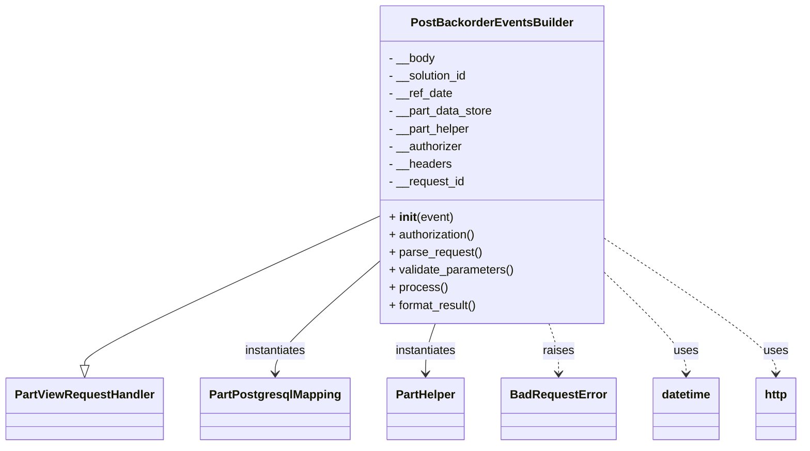

# Diagram: partview_core/partview_service/partview_service/api/part/backorder/backorder_events_builder/handlers/post_backorder_events_builder.py


> Auto-generated by Obscura crawlers

## Diagram 1



### SVG

<svg id="container" width="1064.671875" xmlns="http://www.w3.org/2000/svg" class="classDiagram" height="606" viewBox="0 0 1064.671875 606" role="graphics-document document" aria-roledescription="class"><style>#container{font-family:"trebuchet ms",verdana,arial,sans-serif;font-size:16px;fill:#333;}@keyframes edge-animation-frame{from{stroke-dashoffset:0;}}@keyframes dash{to{stroke-dashoffset:0;}}#container .edge-animation-slow{stroke-dasharray:9,5!important;stroke-dashoffset:900;animation:dash 50s linear infinite;stroke-linecap:round;}#container .edge-animation-fast{stroke-dasharray:9,5!important;stroke-dashoffset:900;animation:dash 20s linear infinite;stroke-linecap:round;}#container .error-icon{fill:#552222;}#container .error-text{fill:#552222;stroke:#552222;}#container .edge-thickness-normal{stroke-width:1px;}#container .edge-thickness-thick{stroke-width:3.5px;}#container .edge-pattern-solid{stroke-dasharray:0;}#container .edge-thickness-invisible{stroke-width:0;fill:none;}#container .edge-pattern-dashed{stroke-dasharray:3;}#container .edge-pattern-dotted{stroke-dasharray:2;}#container .marker{fill:#333333;stroke:#333333;}#container .marker.cross{stroke:#333333;}#container svg{font-family:"trebuchet ms",verdana,arial,sans-serif;font-size:16px;}#container p{margin:0;}#container g.classGroup text{fill:#9370DB;stroke:none;font-family:"trebuchet ms",verdana,arial,sans-serif;font-size:10px;}#container g.classGroup text .title{font-weight:bolder;}#container .nodeLabel,#container .edgeLabel{color:#131300;}#container .edgeLabel .label rect{fill:#ECECFF;}#container .label text{fill:#131300;}#container .labelBkg{background:#ECECFF;}#container .edgeLabel .label span{background:#ECECFF;}#container .classTitle{font-weight:bolder;}#container .node rect,#container .node circle,#container .node ellipse,#container .node polygon,#container .node path{fill:#ECECFF;stroke:#9370DB;stroke-width:1px;}#container .divider{stroke:#9370DB;stroke-width:1;}#container g.clickable{cursor:pointer;}#container g.classGroup rect{fill:#ECECFF;stroke:#9370DB;}#container g.classGroup line{stroke:#9370DB;stroke-width:1;}#container .classLabel .box{stroke:none;stroke-width:0;fill:#ECECFF;opacity:0.5;}#container .classLabel .label{fill:#9370DB;font-size:10px;}#container .relation{stroke:#333333;stroke-width:1;fill:none;}#container .dashed-line{stroke-dasharray:3;}#container .dotted-line{stroke-dasharray:1 2;}#container #compositionStart,#container .composition{fill:#333333!important;stroke:#333333!important;stroke-width:1;}#container #compositionEnd,#container .composition{fill:#333333!important;stroke:#333333!important;stroke-width:1;}#container #dependencyStart,#container .dependency{fill:#333333!important;stroke:#333333!important;stroke-width:1;}#container #dependencyStart,#container .dependency{fill:#333333!important;stroke:#333333!important;stroke-width:1;}#container #extensionStart,#container .extension{fill:transparent!important;stroke:#333333!important;stroke-width:1;}#container #extensionEnd,#container .extension{fill:transparent!important;stroke:#333333!important;stroke-width:1;}#container #aggregationStart,#container .aggregation{fill:transparent!important;stroke:#333333!important;stroke-width:1;}#container #aggregationEnd,#container .aggregation{fill:transparent!important;stroke:#333333!important;stroke-width:1;}#container #lollipopStart,#container .lollipop{fill:#ECECFF!important;stroke:#333333!important;stroke-width:1;}#container #lollipopEnd,#container .lollipop{fill:#ECECFF!important;stroke:#333333!important;stroke-width:1;}#container .edgeTerminals{font-size:11px;line-height:initial;}#container .classTitleText{text-anchor:middle;font-size:18px;fill:#333;}#container .label-icon{display:inline-block;height:1em;overflow:visible;vertical-align:-0.125em;}#container .node .label-icon path{fill:currentColor;stroke:revert;stroke-width:revert;}#container :root{--mermaid-font-family:"trebuchet ms",verdana,arial,sans-serif;}</style><g><defs><marker id="container_class-aggregationStart" class="marker aggregation class" refX="18" refY="7" markerWidth="190" markerHeight="240" orient="auto"><path d="M 18,7 L9,13 L1,7 L9,1 Z"></path></marker></defs><defs><marker id="container_class-aggregationEnd" class="marker aggregation class" refX="1" refY="7" markerWidth="20" markerHeight="28" orient="auto"><path d="M 18,7 L9,13 L1,7 L9,1 Z"></path></marker></defs><defs><marker id="container_class-extensionStart" class="marker extension class" refX="18" refY="7" markerWidth="190" markerHeight="240" orient="auto"><path d="M 1,7 L18,13 V 1 Z"></path></marker></defs><defs><marker id="container_class-extensionEnd" class="marker extension class" refX="1" refY="7" markerWidth="20" markerHeight="28" orient="auto"><path d="M 1,1 V 13 L18,7 Z"></path></marker></defs><defs><marker id="container_class-compositionStart" class="marker composition class" refX="18" refY="7" markerWidth="190" markerHeight="240" orient="auto"><path d="M 18,7 L9,13 L1,7 L9,1 Z"></path></marker></defs><defs><marker id="container_class-compositionEnd" class="marker composition class" refX="1" refY="7" markerWidth="20" markerHeight="28" orient="auto"><path d="M 18,7 L9,13 L1,7 L9,1 Z"></path></marker></defs><defs><marker id="container_class-dependencyStart" class="marker dependency class" refX="6" refY="7" markerWidth="190" markerHeight="240" orient="auto"><path d="M 5,7 L9,13 L1,7 L9,1 Z"></path></marker></defs><defs><marker id="container_class-dependencyEnd" class="marker dependency class" refX="13" refY="7" markerWidth="20" markerHeight="28" orient="auto"><path d="M 18,7 L9,13 L14,7 L9,1 Z"></path></marker></defs><defs><marker id="container_class-lollipopStart" class="marker lollipop class" refX="13" refY="7" markerWidth="190" markerHeight="240" orient="auto"><circle stroke="black" fill="transparent" cx="7" cy="7" r="6"></circle></marker></defs><defs><marker id="container_class-lollipopEnd" class="marker lollipop class" refX="1" refY="7" markerWidth="190" markerHeight="240" orient="auto"><circle stroke="black" fill="transparent" cx="7" cy="7" r="6"></circle></marker></defs><g class="root"><g class="clusters"></g><g class="edgePaths"><path d="M499.543,294.39L434.846,324.825C370.148,355.26,240.754,416.13,176.057,449.857C111.359,483.583,111.359,490.167,111.359,493.458L111.359,496.75" id="id_PostBackorderEventsBuilder_PartViewRequestHandler_1" class="edge-thickness-normal edge-pattern-solid relation" style=";;;" data-edge="true" data-et="edge" data-id="id_PostBackorderEventsBuilder_PartViewRequestHandler_1" data-points="W3sieCI6NDk5LjU0Mjk2ODc1LCJ5IjoyOTQuMzkwMzgwNjYyNTQ2fSx7IngiOjExMS4zNTkzNzUsInkiOjQ3N30seyJ4IjoxMTEuMzU5Mzc1LCJ5Ijo1MTR9XQ==" marker-end="url(#container_class-extensionEnd)"></path><path d="M499.543,355.912L476.65,376.093C453.758,396.274,407.973,436.637,385.08,461.985C362.188,487.333,362.188,497.667,362.188,502.833L362.188,508" id="id_PostBackorderEventsBuilder_PartPostgresqlMapping_2" class="edge-thickness-normal edge-pattern-solid relation" style=";;;" data-edge="true" data-et="edge" data-id="id_PostBackorderEventsBuilder_PartPostgresqlMapping_2" data-points="W3sieCI6NDk5LjU0Mjk2ODc1LCJ5IjozNTUuOTExNjYzNDIyNjY4MX0seyJ4IjozNjIuMTg3NSwieSI6NDc3fSx7IngiOjM2Mi4xODc1LCJ5Ijo1MTR9XQ==" marker-end="url(#container_class-dependencyEnd)"></path><path d="M574.102,440L571.959,446.167C569.815,452.333,565.529,464.667,563.385,476C561.242,487.333,561.242,497.667,561.242,502.833L561.242,508" id="id_PostBackorderEventsBuilder_PartHelper_3" class="edge-thickness-normal edge-pattern-solid relation" style=";;;" data-edge="true" data-et="edge" data-id="id_PostBackorderEventsBuilder_PartHelper_3" data-points="W3sieCI6NTc0LjEwMjA0MTEzMTQyMjksInkiOjQ0MH0seyJ4Ijo1NjEuMjQyMTg3NSwieSI6NDc3fSx7IngiOjU2MS4yNDIxODc1LCJ5Ijo1MTR9XQ==" marker-end="url(#container_class-dependencyEnd)"></path><path d="M724.25,440L726.393,446.167C728.536,452.333,732.823,464.667,734.966,476C737.109,487.333,737.109,497.667,737.109,502.833L737.109,508" id="id_PostBackorderEventsBuilder_BadRequestError_4" class="edge-thickness-normal edge-pattern-dashed relation" style=";;;" data-edge="true" data-et="edge" data-id="id_PostBackorderEventsBuilder_BadRequestError_4" data-points="W3sieCI6NzI0LjI0OTUyMTM2ODU3NzEsInkiOjQ0MH0seyJ4Ijo3MzcuMTA5Mzc1LCJ5Ijo0Nzd9LHsieCI6NzM3LjEwOTM3NSwieSI6NTE0fV0=" marker-end="url(#container_class-dependencyEnd)"></path><path d="M798.809,371.141L816.751,388.784C834.693,406.427,870.577,441.714,888.519,464.523C906.461,487.333,906.461,497.667,906.461,502.833L906.461,508" id="id_PostBackorderEventsBuilder_datetime_5" class="edge-thickness-normal edge-pattern-dashed relation" style=";;;" data-edge="true" data-et="edge" data-id="id_PostBackorderEventsBuilder_datetime_5" data-points="W3sieCI6Nzk4LjgwODU5Mzc1LCJ5IjozNzEuMTQwNjM2MTQ5NzAwMn0seyJ4Ijo5MDYuNDYwOTM3NSwieSI6NDc3fSx7IngiOjkwNi40NjA5Mzc1LCJ5Ijo1MTR9XQ==" marker-end="url(#container_class-dependencyEnd)"></path><path d="M798.809,323.643L837.191,349.203C875.573,374.762,952.337,425.881,990.719,456.607C1029.102,487.333,1029.102,497.667,1029.102,502.833L1029.102,508" id="id_PostBackorderEventsBuilder_http_6" class="edge-thickness-normal edge-pattern-dashed relation" style=";;;" data-edge="true" data-et="edge" data-id="id_PostBackorderEventsBuilder_http_6" data-points="W3sieCI6Nzk4LjgwODU5Mzc1LCJ5IjozMjMuNjQzNDEzMDg0MzgxMn0seyJ4IjoxMDI5LjEwMTU2MjUsInkiOjQ3N30seyJ4IjoxMDI5LjEwMTU2MjUsInkiOjUxNH1d" marker-end="url(#container_class-dependencyEnd)"></path></g><g class="edgeLabels"><g class="edgeLabel"><g class="label" data-id="id_PostBackorderEventsBuilder_PartViewRequestHandler_1" transform="translate(0, 0)"><foreignObject width="0" height="0"><div xmlns="http://www.w3.org/1999/xhtml" class="labelBkg" style="display: table-cell; white-space: nowrap; line-height: 1.5; max-width: 200px; text-align: center;"><span class="edgeLabel"></span></div></foreignObject></g></g><g class="edgeLabel" transform="translate(362.1875, 477)"><g class="label" data-id="id_PostBackorderEventsBuilder_PartPostgresqlMapping_2" transform="translate(-42.9140625, -12)"><foreignObject width="85.828125" height="24"><div xmlns="http://www.w3.org/1999/xhtml" class="labelBkg" style="display: table-cell; white-space: nowrap; line-height: 1.5; max-width: 200px; text-align: center;"><span class="edgeLabel"><p>instantiates</p></span></div></foreignObject></g></g><g class="edgeLabel" transform="translate(561.2421875, 477)"><g class="label" data-id="id_PostBackorderEventsBuilder_PartHelper_3" transform="translate(-42.9140625, -12)"><foreignObject width="85.828125" height="24"><div xmlns="http://www.w3.org/1999/xhtml" class="labelBkg" style="display: table-cell; white-space: nowrap; line-height: 1.5; max-width: 200px; text-align: center;"><span class="edgeLabel"><p>instantiates</p></span></div></foreignObject></g></g><g class="edgeLabel" transform="translate(737.109375, 477)"><g class="label" data-id="id_PostBackorderEventsBuilder_BadRequestError_4" transform="translate(-21.25, -12)"><foreignObject width="42.5" height="24"><div xmlns="http://www.w3.org/1999/xhtml" class="labelBkg" style="display: table-cell; white-space: nowrap; line-height: 1.5; max-width: 200px; text-align: center;"><span class="edgeLabel"><p>raises</p></span></div></foreignObject></g></g><g class="edgeLabel" transform="translate(906.4609375, 477)"><g class="label" data-id="id_PostBackorderEventsBuilder_datetime_5" transform="translate(-16.4921875, -12)"><foreignObject width="32.984375" height="24"><div xmlns="http://www.w3.org/1999/xhtml" class="labelBkg" style="display: table-cell; white-space: nowrap; line-height: 1.5; max-width: 200px; text-align: center;"><span class="edgeLabel"><p>uses</p></span></div></foreignObject></g></g><g class="edgeLabel" transform="translate(1029.1015625, 477)"><g class="label" data-id="id_PostBackorderEventsBuilder_http_6" transform="translate(-16.4921875, -12)"><foreignObject width="32.984375" height="24"><div xmlns="http://www.w3.org/1999/xhtml" class="labelBkg" style="display: table-cell; white-space: nowrap; line-height: 1.5; max-width: 200px; text-align: center;"><span class="edgeLabel"><p>uses</p></span></div></foreignObject></g></g></g><g class="nodes"><g class="node default" id="classId-PostBackorderEventsBuilder-0" transform="translate(649.17578125, 224)"><g class="basic label-container"><path d="M-149.6328125 -216 L149.6328125 -216 L149.6328125 216 L-149.6328125 216" stroke="none" stroke-width="0" fill="#ECECFF" style=""></path><path d="M-149.6328125 -216 C-69.8062890573715 -216, 10.020234385256998 -216, 149.6328125 -216 M-149.6328125 -216 C-41.41075303019541 -216, 66.81130643960918 -216, 149.6328125 -216 M149.6328125 -216 C149.6328125 -97.74575436793135, 149.6328125 20.50849126413729, 149.6328125 216 M149.6328125 -216 C149.6328125 -114.87267915542427, 149.6328125 -13.74535831084853, 149.6328125 216 M149.6328125 216 C69.42224454542065 216, -10.788323409158693 216, -149.6328125 216 M149.6328125 216 C83.15145586658358 216, 16.67009923316715 216, -149.6328125 216 M-149.6328125 216 C-149.6328125 58.5976767522819, -149.6328125 -98.8046464954362, -149.6328125 -216 M-149.6328125 216 C-149.6328125 57.8581784412207, -149.6328125 -100.2836431175586, -149.6328125 -216" stroke="#9370DB" stroke-width="1.3" fill="none" stroke-dasharray="0 0" style=""></path></g><g class="annotation-group text" transform="translate(0, -192)"></g><g class="label-group text" transform="translate(-104.3125, -192)"><g class="label" style="font-weight: bolder" transform="translate(0,-12)"><foreignObject width="208.625" height="24"><div xmlns="http://www.w3.org/1999/xhtml" style="display: table-cell; white-space: nowrap; line-height: 1.5; max-width: 256px; text-align: center;"><span class="nodeLabel markdown-node-label" style=""><p>PostBackorderEventsBuilder</p></span></div></foreignObject></g></g><g class="members-group text" transform="translate(-137.6328125, -144)"><g class="label" style="" transform="translate(0,-12)"><foreignObject width="63.46875" height="24"><div xmlns="http://www.w3.org/1999/xhtml" style="display: table-cell; white-space: nowrap; line-height: 1.5; max-width: 121px; text-align: center;"><span class="nodeLabel markdown-node-label" style=""><p>- __body</p></span></div></foreignObject></g><g class="label" style="" transform="translate(0,12)"><foreignObject width="109.40625" height="24"><div xmlns="http://www.w3.org/1999/xhtml" style="display: table-cell; white-space: nowrap; line-height: 1.5; max-width: 167px; text-align: center;"><span class="nodeLabel markdown-node-label" style=""><p>- __solution_id</p></span></div></foreignObject></g><g class="label" style="" transform="translate(0,36)"><foreignObject width="87" height="24"><div xmlns="http://www.w3.org/1999/xhtml" style="display: table-cell; white-space: nowrap; line-height: 1.5; max-width: 144px; text-align: center;"><span class="nodeLabel markdown-node-label" style=""><p>- __ref_date</p></span></div></foreignObject></g><g class="label" style="" transform="translate(0,60)"><foreignObject width="142.90625" height="24"><div xmlns="http://www.w3.org/1999/xhtml" style="display: table-cell; white-space: nowrap; line-height: 1.5; max-width: 200px; text-align: center;"><span class="nodeLabel markdown-node-label" style=""><p>- __part_data_store</p></span></div></foreignObject></g><g class="label" style="" transform="translate(0,84)"><foreignObject width="112.6875" height="24"><div xmlns="http://www.w3.org/1999/xhtml" style="display: table-cell; white-space: nowrap; line-height: 1.5; max-width: 171px; text-align: center;"><span class="nodeLabel markdown-node-label" style=""><p>- __part_helper</p></span></div></foreignObject></g><g class="label" style="" transform="translate(0,108)"><foreignObject width="101.828125" height="24"><div xmlns="http://www.w3.org/1999/xhtml" style="display: table-cell; white-space: nowrap; line-height: 1.5; max-width: 160px; text-align: center;"><span class="nodeLabel markdown-node-label" style=""><p>- __authorizer</p></span></div></foreignObject></g><g class="label" style="" transform="translate(0,132)"><foreignObject width="85.515625" height="24"><div xmlns="http://www.w3.org/1999/xhtml" style="display: table-cell; white-space: nowrap; line-height: 1.5; max-width: 143px; text-align: center;"><span class="nodeLabel markdown-node-label" style=""><p>- __headers</p></span></div></foreignObject></g><g class="label" style="" transform="translate(0,156)"><foreignObject width="104.84375" height="24"><div xmlns="http://www.w3.org/1999/xhtml" style="display: table-cell; white-space: nowrap; line-height: 1.5; max-width: 162px; text-align: center;"><span class="nodeLabel markdown-node-label" style=""><p>- __request_id</p></span></div></foreignObject></g></g><g class="methods-group text" transform="translate(-137.6328125, 72)"><g class="label" style="" transform="translate(0,-12)"><foreignObject width="87.390625" height="24"><div xmlns="http://www.w3.org/1999/xhtml" style="display: table-cell; white-space: nowrap; line-height: 1.5; max-width: 177px; text-align: center;"><span class="nodeLabel markdown-node-label" style=""><p>+ <strong>init</strong>(event)</p></span></div></foreignObject></g><g class="label" style="" transform="translate(0,12)"><foreignObject width="120.265625" height="24"><div xmlns="http://www.w3.org/1999/xhtml" style="display: table-cell; white-space: nowrap; line-height: 1.5; max-width: 178px; text-align: center;"><span class="nodeLabel markdown-node-label" style=""><p>+ authorization()</p></span></div></foreignObject></g><g class="label" style="" transform="translate(0,36)"><foreignObject width="126.046875" height="24"><div xmlns="http://www.w3.org/1999/xhtml" style="display: table-cell; white-space: nowrap; line-height: 1.5; max-width: 183px; text-align: center;"><span class="nodeLabel markdown-node-label" style=""><p>+ parse_request()</p></span></div></foreignObject></g><g class="label" style="" transform="translate(0,60)"><foreignObject width="170.953125" height="24"><div xmlns="http://www.w3.org/1999/xhtml" style="display: table-cell; white-space: nowrap; line-height: 1.5; max-width: 228px; text-align: center;"><span class="nodeLabel markdown-node-label" style=""><p>+ validate_parameters()</p></span></div></foreignObject></g><g class="label" style="" transform="translate(0,84)"><foreignObject width="77.96875" height="24"><div xmlns="http://www.w3.org/1999/xhtml" style="display: table-cell; white-space: nowrap; line-height: 1.5; max-width: 135px; text-align: center;"><span class="nodeLabel markdown-node-label" style=""><p>+ process()</p></span></div></foreignObject></g><g class="label" style="" transform="translate(0,108)"><foreignObject width="121.5" height="24"><div xmlns="http://www.w3.org/1999/xhtml" style="display: table-cell; white-space: nowrap; line-height: 1.5; max-width: 179px; text-align: center;"><span class="nodeLabel markdown-node-label" style=""><p>+ format_result()</p></span></div></foreignObject></g></g><g class="divider" style=""><path d="M-149.6328125 -168 C-76.2170837675254 -168, -2.80135503505079 -168, 149.6328125 -168 M-149.6328125 -168 C-34.914508388656856 -168, 79.80379572268629 -168, 149.6328125 -168" stroke="#9370DB" stroke-width="1.3" fill="none" stroke-dasharray="0 0" style=""></path></g><g class="divider" style=""><path d="M-149.6328125 48 C-61.512789863403725 48, 26.60723277319255 48, 149.6328125 48 M-149.6328125 48 C-45.08120065401208 48, 59.47041119197584 48, 149.6328125 48" stroke="#9370DB" stroke-width="1.3" fill="none" stroke-dasharray="0 0" style=""></path></g></g><g class="node default" id="classId-PartViewRequestHandler-1" transform="translate(111.359375, 556)"><g class="basic label-container"><path d="M-103.359375 -42 L103.359375 -42 L103.359375 42 L-103.359375 42" stroke="none" stroke-width="0" fill="#ECECFF" style=""></path><path d="M-103.359375 -42 C-42.23039962434491 -42, 18.898575751310176 -42, 103.359375 -42 M-103.359375 -42 C-28.22676934450668 -42, 46.90583631098664 -42, 103.359375 -42 M103.359375 -42 C103.359375 -17.2094600313346, 103.359375 7.581079937330799, 103.359375 42 M103.359375 -42 C103.359375 -18.061570986634965, 103.359375 5.876858026730069, 103.359375 42 M103.359375 42 C45.90892367999795 42, -11.541527640004105 42, -103.359375 42 M103.359375 42 C24.1474782439967 42, -55.0644185120066 42, -103.359375 42 M-103.359375 42 C-103.359375 21.234425664643766, -103.359375 0.46885132928753137, -103.359375 -42 M-103.359375 42 C-103.359375 22.005189320374356, -103.359375 2.010378640748712, -103.359375 -42" stroke="#9370DB" stroke-width="1.3" fill="none" stroke-dasharray="0 0" style=""></path></g><g class="annotation-group text" transform="translate(0, -18)"></g><g class="label-group text" transform="translate(-91.359375, -18)"><g class="label" style="font-weight: bolder" transform="translate(0,-12)"><foreignObject width="182.71875" height="24"><div xmlns="http://www.w3.org/1999/xhtml" style="display: table-cell; white-space: nowrap; line-height: 1.5; max-width: 231px; text-align: center;"><span class="nodeLabel markdown-node-label" style=""><p>PartViewRequestHandler</p></span></div></foreignObject></g></g><g class="members-group text" transform="translate(-91.359375, 30)"></g><g class="methods-group text" transform="translate(-91.359375, 60)"></g><g class="divider" style=""><path d="M-103.359375 6 C-33.95353949432966 6, 35.45229601134068 6, 103.359375 6 M-103.359375 6 C-20.94273403224132 6, 61.47390693551736 6, 103.359375 6" stroke="#9370DB" stroke-width="1.3" fill="none" stroke-dasharray="0 0" style=""></path></g><g class="divider" style=""><path d="M-103.359375 24 C-29.37942853215945 24, 44.6005179356811 24, 103.359375 24 M-103.359375 24 C-49.40284165112921 24, 4.553691697741584 24, 103.359375 24" stroke="#9370DB" stroke-width="1.3" fill="none" stroke-dasharray="0 0" style=""></path></g></g><g class="node default" id="classId-PartPostgresqlMapping-2" transform="translate(362.1875, 556)"><g class="basic label-container"><path d="M-97.46875 -42 L97.46875 -42 L97.46875 42 L-97.46875 42" stroke="none" stroke-width="0" fill="#ECECFF" style=""></path><path d="M-97.46875 -42 C-40.10674339647761 -42, 17.255263207044777 -42, 97.46875 -42 M-97.46875 -42 C-27.143279557707856 -42, 43.18219088458429 -42, 97.46875 -42 M97.46875 -42 C97.46875 -14.343954154450124, 97.46875 13.312091691099752, 97.46875 42 M97.46875 -42 C97.46875 -16.765066589477527, 97.46875 8.469866821044945, 97.46875 42 M97.46875 42 C56.116638621376744 42, 14.764527242753488 42, -97.46875 42 M97.46875 42 C55.2338294014304 42, 12.998908802860797 42, -97.46875 42 M-97.46875 42 C-97.46875 9.030961579900648, -97.46875 -23.938076840198704, -97.46875 -42 M-97.46875 42 C-97.46875 20.475953191261226, -97.46875 -1.048093617477548, -97.46875 -42" stroke="#9370DB" stroke-width="1.3" fill="none" stroke-dasharray="0 0" style=""></path></g><g class="annotation-group text" transform="translate(0, -18)"></g><g class="label-group text" transform="translate(-85.46875, -18)"><g class="label" style="font-weight: bolder" transform="translate(0,-12)"><foreignObject width="170.9375" height="24"><div xmlns="http://www.w3.org/1999/xhtml" style="display: table-cell; white-space: nowrap; line-height: 1.5; max-width: 218px; text-align: center;"><span class="nodeLabel markdown-node-label" style=""><p>PartPostgresqlMapping</p></span></div></foreignObject></g></g><g class="members-group text" transform="translate(-85.46875, 30)"></g><g class="methods-group text" transform="translate(-85.46875, 60)"></g><g class="divider" style=""><path d="M-97.46875 6 C-21.39302353327507 6, 54.68270293344986 6, 97.46875 6 M-97.46875 6 C-37.810050057180234 6, 21.84864988563953 6, 97.46875 6" stroke="#9370DB" stroke-width="1.3" fill="none" stroke-dasharray="0 0" style=""></path></g><g class="divider" style=""><path d="M-97.46875 24 C-49.80099295452864 24, -2.1332359090572766 24, 97.46875 24 M-97.46875 24 C-25.708000392719768 24, 46.052749214560464 24, 97.46875 24" stroke="#9370DB" stroke-width="1.3" fill="none" stroke-dasharray="0 0" style=""></path></g></g><g class="node default" id="classId-PartHelper-3" transform="translate(561.2421875, 556)"><g class="basic label-container"><path d="M-51.5859375 -42 L51.5859375 -42 L51.5859375 42 L-51.5859375 42" stroke="none" stroke-width="0" fill="#ECECFF" style=""></path><path d="M-51.5859375 -42 C-24.468633493181244 -42, 2.648670513637512 -42, 51.5859375 -42 M-51.5859375 -42 C-17.038561759112127 -42, 17.508813981775745 -42, 51.5859375 -42 M51.5859375 -42 C51.5859375 -21.50001098282122, 51.5859375 -1.0000219656424392, 51.5859375 42 M51.5859375 -42 C51.5859375 -10.017500244321166, 51.5859375 21.964999511357668, 51.5859375 42 M51.5859375 42 C27.470673451377255 42, 3.3554094027545105 42, -51.5859375 42 M51.5859375 42 C29.121367000006018 42, 6.656796500012035 42, -51.5859375 42 M-51.5859375 42 C-51.5859375 13.722072922482635, -51.5859375 -14.55585415503473, -51.5859375 -42 M-51.5859375 42 C-51.5859375 15.384764100644198, -51.5859375 -11.230471798711605, -51.5859375 -42" stroke="#9370DB" stroke-width="1.3" fill="none" stroke-dasharray="0 0" style=""></path></g><g class="annotation-group text" transform="translate(0, -18)"></g><g class="label-group text" transform="translate(-39.5859375, -18)"><g class="label" style="font-weight: bolder" transform="translate(0,-12)"><foreignObject width="79.171875" height="24"><div xmlns="http://www.w3.org/1999/xhtml" style="display: table-cell; white-space: nowrap; line-height: 1.5; max-width: 129px; text-align: center;"><span class="nodeLabel markdown-node-label" style=""><p>PartHelper</p></span></div></foreignObject></g></g><g class="members-group text" transform="translate(-39.5859375, 30)"></g><g class="methods-group text" transform="translate(-39.5859375, 60)"></g><g class="divider" style=""><path d="M-51.5859375 6 C-14.642793665497905 6, 22.30035016900419 6, 51.5859375 6 M-51.5859375 6 C-25.157350959880027 6, 1.2712355802399458 6, 51.5859375 6" stroke="#9370DB" stroke-width="1.3" fill="none" stroke-dasharray="0 0" style=""></path></g><g class="divider" style=""><path d="M-51.5859375 24 C-29.4962972419046 24, -7.406656983809199 24, 51.5859375 24 M-51.5859375 24 C-22.701980599424395 24, 6.181976301151209 24, 51.5859375 24" stroke="#9370DB" stroke-width="1.3" fill="none" stroke-dasharray="0 0" style=""></path></g></g><g class="node default" id="classId-BadRequestError-4" transform="translate(737.109375, 556)"><g class="basic label-container"><path d="M-74.28125 -42 L74.28125 -42 L74.28125 42 L-74.28125 42" stroke="none" stroke-width="0" fill="#ECECFF" style=""></path><path d="M-74.28125 -42 C-24.606531308537832 -42, 25.068187382924336 -42, 74.28125 -42 M-74.28125 -42 C-37.77595034029596 -42, -1.2706506805919133 -42, 74.28125 -42 M74.28125 -42 C74.28125 -21.063361476237006, 74.28125 -0.12672295247401166, 74.28125 42 M74.28125 -42 C74.28125 -21.586873685357794, 74.28125 -1.1737473707155885, 74.28125 42 M74.28125 42 C40.40947369946292 42, 6.537697398925843 42, -74.28125 42 M74.28125 42 C28.81167365397264 42, -16.65790269205472 42, -74.28125 42 M-74.28125 42 C-74.28125 21.82658721752196, -74.28125 1.6531744350439226, -74.28125 -42 M-74.28125 42 C-74.28125 11.03945438513135, -74.28125 -19.9210912297373, -74.28125 -42" stroke="#9370DB" stroke-width="1.3" fill="none" stroke-dasharray="0 0" style=""></path></g><g class="annotation-group text" transform="translate(0, -18)"></g><g class="label-group text" transform="translate(-62.28125, -18)"><g class="label" style="font-weight: bolder" transform="translate(0,-12)"><foreignObject width="124.5625" height="24"><div xmlns="http://www.w3.org/1999/xhtml" style="display: table-cell; white-space: nowrap; line-height: 1.5; max-width: 174px; text-align: center;"><span class="nodeLabel markdown-node-label" style=""><p>BadRequestError</p></span></div></foreignObject></g></g><g class="members-group text" transform="translate(-62.28125, 30)"></g><g class="methods-group text" transform="translate(-62.28125, 60)"></g><g class="divider" style=""><path d="M-74.28125 6 C-32.38993612555458 6, 9.501377748890846 6, 74.28125 6 M-74.28125 6 C-44.39636819241326 6, -14.511486384826519 6, 74.28125 6" stroke="#9370DB" stroke-width="1.3" fill="none" stroke-dasharray="0 0" style=""></path></g><g class="divider" style=""><path d="M-74.28125 24 C-24.197080172798614 24, 25.88708965440277 24, 74.28125 24 M-74.28125 24 C-19.53600331322776 24, 35.20924337354448 24, 74.28125 24" stroke="#9370DB" stroke-width="1.3" fill="none" stroke-dasharray="0 0" style=""></path></g></g><g class="node default" id="classId-datetime-5" transform="translate(906.4609375, 556)"><g class="basic label-container"><path d="M-45.0703125 -42 L45.0703125 -42 L45.0703125 42 L-45.0703125 42" stroke="none" stroke-width="0" fill="#ECECFF" style=""></path><path d="M-45.0703125 -42 C-13.709620980814126 -42, 17.651070538371748 -42, 45.0703125 -42 M-45.0703125 -42 C-16.311773831714493 -42, 12.446764836571013 -42, 45.0703125 -42 M45.0703125 -42 C45.0703125 -18.80623063288242, 45.0703125 4.387538734235157, 45.0703125 42 M45.0703125 -42 C45.0703125 -22.500857965955593, 45.0703125 -3.0017159319111855, 45.0703125 42 M45.0703125 42 C26.705005909144003 42, 8.339699318288005 42, -45.0703125 42 M45.0703125 42 C21.981876245345756 42, -1.1065600093084882 42, -45.0703125 42 M-45.0703125 42 C-45.0703125 12.174172092616534, -45.0703125 -17.651655814766933, -45.0703125 -42 M-45.0703125 42 C-45.0703125 18.87804742369315, -45.0703125 -4.243905152613699, -45.0703125 -42" stroke="#9370DB" stroke-width="1.3" fill="none" stroke-dasharray="0 0" style=""></path></g><g class="annotation-group text" transform="translate(0, -18)"></g><g class="label-group text" transform="translate(-33.0703125, -18)"><g class="label" style="font-weight: bolder" transform="translate(0,-12)"><foreignObject width="66.140625" height="24"><div xmlns="http://www.w3.org/1999/xhtml" style="display: table-cell; white-space: nowrap; line-height: 1.5; max-width: 115px; text-align: center;"><span class="nodeLabel markdown-node-label" style=""><p>datetime</p></span></div></foreignObject></g></g><g class="members-group text" transform="translate(-33.0703125, 30)"></g><g class="methods-group text" transform="translate(-33.0703125, 60)"></g><g class="divider" style=""><path d="M-45.0703125 6 C-13.342696271302454 6, 18.38491995739509 6, 45.0703125 6 M-45.0703125 6 C-22.55123118090047 6, -0.032149861800938595 6, 45.0703125 6" stroke="#9370DB" stroke-width="1.3" fill="none" stroke-dasharray="0 0" style=""></path></g><g class="divider" style=""><path d="M-45.0703125 24 C-16.277065366484273 24, 12.516181767031455 24, 45.0703125 24 M-45.0703125 24 C-17.010205819509874 24, 11.049900860980252 24, 45.0703125 24" stroke="#9370DB" stroke-width="1.3" fill="none" stroke-dasharray="0 0" style=""></path></g></g><g class="node default" id="classId-http-6" transform="translate(1029.1015625, 556)"><g class="basic label-container"><path d="M-27.5703125 -42 L27.5703125 -42 L27.5703125 42 L-27.5703125 42" stroke="none" stroke-width="0" fill="#ECECFF" style=""></path><path d="M-27.5703125 -42 C-11.864987045774287 -42, 3.8403384084514265 -42, 27.5703125 -42 M-27.5703125 -42 C-8.372147185605957 -42, 10.826018128788085 -42, 27.5703125 -42 M27.5703125 -42 C27.5703125 -19.29566371999268, 27.5703125 3.4086725600146366, 27.5703125 42 M27.5703125 -42 C27.5703125 -24.50361215412674, 27.5703125 -7.007224308253477, 27.5703125 42 M27.5703125 42 C13.30698725208286 42, -0.9563379958342786 42, -27.5703125 42 M27.5703125 42 C11.516917654406331 42, -4.536477191187338 42, -27.5703125 42 M-27.5703125 42 C-27.5703125 11.847381713043877, -27.5703125 -18.305236573912246, -27.5703125 -42 M-27.5703125 42 C-27.5703125 12.957635674060885, -27.5703125 -16.08472865187823, -27.5703125 -42" stroke="#9370DB" stroke-width="1.3" fill="none" stroke-dasharray="0 0" style=""></path></g><g class="annotation-group text" transform="translate(0, -18)"></g><g class="label-group text" transform="translate(-15.5703125, -18)"><g class="label" style="font-weight: bolder" transform="translate(0,-12)"><foreignObject width="31.140625" height="24"><div xmlns="http://www.w3.org/1999/xhtml" style="display: table-cell; white-space: nowrap; line-height: 1.5; max-width: 80px; text-align: center;"><span class="nodeLabel markdown-node-label" style=""><p>http</p></span></div></foreignObject></g></g><g class="members-group text" transform="translate(-15.5703125, 30)"></g><g class="methods-group text" transform="translate(-15.5703125, 60)"></g><g class="divider" style=""><path d="M-27.5703125 6 C-7.271336507849714 6, 13.027639484300572 6, 27.5703125 6 M-27.5703125 6 C-12.985832942964453 6, 1.598646614071093 6, 27.5703125 6" stroke="#9370DB" stroke-width="1.3" fill="none" stroke-dasharray="0 0" style=""></path></g><g class="divider" style=""><path d="M-27.5703125 24 C-8.517185049266665 24, 10.53594240146667 24, 27.5703125 24 M-27.5703125 24 C-15.054903224619235 24, -2.5394939492384694 24, 27.5703125 24" stroke="#9370DB" stroke-width="1.3" fill="none" stroke-dasharray="0 0" style=""></path></g></g></g></g></g></svg>

## Diagram 2

```mermaid
flowchart TD
    A[Incoming Event] --> B[PostBackorderEventsBuilder.__init__]
    B --> C[parse_request()]
    C --> D{body present?}
    D -- Yes --> E[BadRequestError: "Body object should be null."]
    D -- No --> F{authorizer & headers present?}
    F -- No --> G[BadRequestError: "Missing authorizer or headers"]
    F -- Yes --> H[validate_parameters() passes]
    H --> I[process() -> PartHelper.build_backorder_events()]
    I --> J[format_result() -> 200 OK]
    E --> K[request fails]
    G --> K
    J --> L[response returned]
```

> SVG rendering failed for this diagram.
