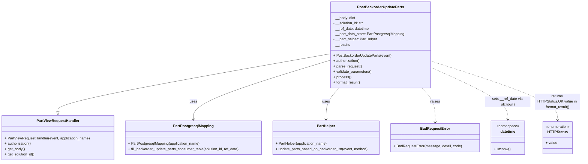

# Diagram: partview_core/partview_service/partview_service/api/part/backorder/backorder_update_parts/handlers/post_backorder_update_parts.py

> Auto-generated by Obscura crawlers

## Mermaid

### SVG

<svg id="container" width="2580.859375" xmlns="http://www.w3.org/2000/svg" class="classDiagram" height="720" viewBox="0 0 2580.859375 720" role="graphics-document document" aria-roledescription="class"><g><defs><marker id="container_class-aggregationStart" class="marker aggregation class" refX="18" refY="7" markerWidth="190" markerHeight="240" orient="auto"><path d="M 18,7 L9,13 L1,7 L9,1 Z"></path></marker></defs><defs><marker id="container_class-aggregationEnd" class="marker aggregation class" refX="1" refY="7" markerWidth="20" markerHeight="28" orient="auto"><path d="M 18,7 L9,13 L1,7 L9,1 Z"></path></marker></defs><defs><marker id="container_class-extensionStart" class="marker extension class" refX="18" refY="7" markerWidth="190" markerHeight="240" orient="auto"><path d="M 1,7 L18,13 V 1 Z"></path></marker></defs><defs><marker id="container_class-extensionEnd" class="marker extension class" refX="1" refY="7" markerWidth="20" markerHeight="28" orient="auto"><path d="M 1,1 V 13 L18,7 Z"></path></marker></defs><defs><marker id="container_class-compositionStart" class="marker composition class" refX="18" refY="7" markerWidth="190" markerHeight="240" orient="auto"><path d="M 18,7 L9,13 L1,7 L9,1 Z"></path></marker></defs><defs><marker id="container_class-compositionEnd" class="marker composition class" refX="1" refY="7" markerWidth="20" markerHeight="28" orient="auto"><path d="M 18,7 L9,13 L1,7 L9,1 Z"></path></marker></defs><defs><marker id="container_class-dependencyStart" class="marker dependency class" refX="6" refY="7" markerWidth="190" markerHeight="240" orient="auto"><path d="M 5,7 L9,13 L1,7 L9,1 Z"></path></marker></defs><defs><marker id="container_class-dependencyEnd" class="marker dependency class" refX="13" refY="7" markerWidth="20" markerHeight="28" orient="auto"><path d="M 18,7 L9,13 L14,7 L9,1 Z"></path></marker></defs><defs><marker id="container_class-lollipopStart" class="marker lollipop class" refX="13" refY="7" markerWidth="190" markerHeight="240" orient="auto"><circle stroke="black" fill="transparent" cx="7" cy="7" r="6"></circle></marker></defs><defs><marker id="container_class-lollipopEnd" class="marker lollipop class" refX="1" refY="7" markerWidth="190" markerHeight="240" orient="auto"><circle stroke="black" fill="transparent" cx="7" cy="7" r="6"></circle></marker></defs><g class="root"><g class="clusters"></g><g class="edgePaths"><path d="M1473.068,238.838L1270.315,274.532C1067.561,310.226,662.054,381.613,459.3,424.598C256.547,467.583,256.547,482.167,256.547,489.458L256.547,496.75" id="id_PostBackorderUpdateParts_PartViewRequestHandler_1" class="edge-thickness-normal edge-pattern-solid relation" style=";;;" data-edge="true" data-et="edge" data-id="id_PostBackorderUpdateParts_PartViewRequestHandler_1" data-points="W3sieCI6MTQ3My4wNjgzNTkzNzUsInkiOjIzOC44MzgzODczNjYzODk2NH0seyJ4IjoyNTYuNTQ2ODc1LCJ5Ijo0NTN9LHsieCI6MjU2LjU0Njg3NSwieSI6NTE0fV0=" marker-end="url(#container_class-extensionEnd)"></path><path d="M1473.068,266.915L1370.816,297.929C1268.564,328.944,1064.059,390.972,961.807,435.153C859.555,479.333,859.555,505.667,859.555,518.833L859.555,532" id="id_PostBackorderUpdateParts_PartPostgresqlMapping_2" class="edge-thickness-normal edge-pattern-solid relation" style=";;;" data-edge="true" data-et="edge" data-id="id_PostBackorderUpdateParts_PartPostgresqlMapping_2" data-points="W3sieCI6MTQ3My4wNjgzNTkzNzUsInkiOjI2Ni45MTUzMzgwNTUzNzY3fSx7IngiOjg1OS41NTQ2ODc1LCJ5Ijo0NTN9LHsieCI6ODU5LjU1NDY4NzUsInkiOjUzOH1d" marker-end="url(#container_class-dependencyEnd)"></path><path d="M1510.755,392L1501.069,402.167C1491.382,412.333,1472.01,432.667,1462.323,456C1452.637,479.333,1452.637,505.667,1452.637,518.833L1452.637,532" id="id_PostBackorderUpdateParts_PartHelper_3" class="edge-thickness-normal edge-pattern-solid relation" style=";;;" data-edge="true" data-et="edge" data-id="id_PostBackorderUpdateParts_PartHelper_3" data-points="W3sieCI6MTUxMC43NTUyMTA5MDY2MjA1LCJ5IjozOTJ9LHsieCI6MTQ1Mi42MzY3MTg3NSwieSI6NDUzfSx7IngiOjE0NTIuNjM2NzE4NzUsInkiOjUzOH1d" marker-end="url(#container_class-dependencyEnd)"></path><path d="M1876.616,392L1886.302,402.167C1895.989,412.333,1915.362,432.667,1925.048,458C1934.734,483.333,1934.734,513.667,1934.734,528.833L1934.734,544" id="id_PostBackorderUpdateParts_BadRequestError_4" class="edge-thickness-normal edge-pattern-dashed relation" style=";;;" data-edge="true" data-et="edge" data-id="id_PostBackorderUpdateParts_BadRequestError_4" data-points="W3sieCI6MTg3Ni42MTU4ODI4NDMzNzk1LCJ5IjozOTJ9LHsieCI6MTkzNC43MzQzNzUsInkiOjQ1M30seyJ4IjoxOTM0LjczNDM3NSwieSI6NTUwfV0=" marker-end="url(#container_class-dependencyEnd)"></path><path d="M1914.303,299.819L1970.729,325.349C2027.155,350.879,2140.007,401.94,2196.433,440.636C2252.859,479.333,2252.859,505.667,2252.859,518.833L2252.859,532" id="id_PostBackorderUpdateParts_datetime_5" class="edge-thickness-normal edge-pattern-dashed relation" style=";;;" data-edge="true" data-et="edge" data-id="id_PostBackorderUpdateParts_datetime_5" data-points="W3sieCI6MTkxNC4zMDI3MzQzNzUsInkiOjI5OS44MTg5NTcyMzY3MTU3M30seyJ4IjoyMjUyLjg1OTM3NSwieSI6NDUzfSx7IngiOjIyNTIuODU5Mzc1LCJ5Ijo1Mzh9XQ==" marker-end="url(#container_class-dependencyEnd)"></path><path d="M1914.303,271.635L2007.396,301.863C2100.488,332.09,2286.674,392.545,2379.767,436.439C2472.859,480.333,2472.859,507.667,2472.859,521.333L2472.859,535" id="id_PostBackorderUpdateParts_HTTPStatus_6" class="edge-thickness-normal edge-pattern-dashed relation" style=";;;" data-edge="true" data-et="edge" data-id="id_PostBackorderUpdateParts_HTTPStatus_6" data-points="W3sieCI6MTkxNC4zMDI3MzQzNzUsInkiOjI3MS42MzUwNDAxMTkxMTY1fSx7IngiOjI0NzIuODU5Mzc1LCJ5Ijo0NTN9LHsieCI6MjQ3Mi44NTkzNzUsInkiOjU0MX1d" marker-end="url(#container_class-dependencyEnd)"></path></g><g class="edgeLabels"><g class="edgeLabel"><g class="label" data-id="id_PostBackorderUpdateParts_PartViewRequestHandler_1" transform="translate(0, 0)"><foreignObject width="0" height="0">

</foreignObject></g></g><g class="edgeLabel" transform="translate(859.5546875, 453)"><g class="label" data-id="id_PostBackorderUpdateParts_PartPostgresqlMapping_2" transform="translate(-16.4921875, -12)"><foreignObject width="32.984375" height="24">

uses

</foreignObject></g></g><g class="edgeLabel" transform="translate(1452.63671875, 453)"><g class="label" data-id="id_PostBackorderUpdateParts_PartHelper_3" transform="translate(-16.4921875, -12)"><foreignObject width="32.984375" height="24">

uses

</foreignObject></g></g><g class="edgeLabel" transform="translate(1934.734375, 453)"><g class="label" data-id="id_PostBackorderUpdateParts_BadRequestError_4" transform="translate(-21.25, -12)"><foreignObject width="42.5" height="24">

raises

</foreignObject></g></g><g class="edgeLabel" transform="translate(2252.859375, 453)"><g class="label" data-id="id_PostBackorderUpdateParts_datetime_5" transform="translate(-100, -24)"><foreignObject width="200" height="48">

sets __ref_date via utcnow()

</foreignObject></g></g><g class="edgeLabel" transform="translate(2472.859375, 453)"><g class="label" data-id="id_PostBackorderUpdateParts_HTTPStatus_6" transform="translate(-100, -36)"><foreignObject width="200" height="72">

returns HTTPStatus.OK.value in format_result()

</foreignObject></g></g></g><g class="nodes"><g class="node default" id="classId-PostBackorderUpdateParts-0" transform="translate(1693.685546875, 200)"><g class="basic label-container"><path d="M-220.6171875 -192 L220.6171875 -192 L220.6171875 192 L-220.6171875 192" stroke="none" stroke-width="0" fill="#ECECFF" style=""></path><path d="M-220.6171875 -192 C-95.82117770587288 -192, 28.97483208825423 -192, 220.6171875 -192 M-220.6171875 -192 C-48.813071819403575 -192, 122.99104386119285 -192, 220.6171875 -192 M220.6171875 -192 C220.6171875 -94.90809374265157, 220.6171875 2.1838125146968537, 220.6171875 192 M220.6171875 -192 C220.6171875 -44.23487814602029, 220.6171875 103.53024370795941, 220.6171875 192 M220.6171875 192 C123.3266867436456 192, 26.03618598729119 192, -220.6171875 192 M220.6171875 192 C52.754365657355095 192, -115.10845618528981 192, -220.6171875 192 M-220.6171875 192 C-220.6171875 56.85712826697102, -220.6171875 -78.28574346605797, -220.6171875 -192 M-220.6171875 192 C-220.6171875 56.437443136979766, -220.6171875 -79.12511372604047, -220.6171875 -192" stroke="#9370DB" stroke-width="1.3" fill="none" stroke-dasharray="0 0" style=""></path></g><g class="annotation-group text" transform="translate(0, -168)"></g><g class="label-group text" transform="translate(-99.171875, -168)"><g class="label" style="font-weight: bolder" transform="translate(0,-12)"><foreignObject width="198.34375" height="24">

PostBackorderUpdateParts

</foreignObject></g></g><g class="members-group text" transform="translate(-208.6171875, -120)"><g class="label" style="" transform="translate(0,-12)"><foreignObject width="99.109375" height="24">

- __body: dict

</foreignObject></g><g class="label" style="" transform="translate(0,12)"><foreignObject width="136.90625" height="24">

- __solution_id: str

</foreignObject></g><g class="label" style="" transform="translate(0,36)"><foreignObject width="160.328125" height="24">

- __ref_date: datetime

</foreignObject></g><g class="label" style="" transform="translate(0,60)"><foreignObject width="318.0625" height="24">

- __part_data_store: PartPostgresqlMapping

</foreignObject></g><g class="label" style="" transform="translate(0,84)"><foreignObject width="198.6875" height="24">

- __part_helper: PartHelper

</foreignObject></g><g class="label" style="" transform="translate(0,108)"><foreignObject width="76.3125" height="24">

- __results

</foreignObject></g></g><g class="methods-group text" transform="translate(-208.6171875, 48)"><g class="label" style="" transform="translate(0,-12)"><foreignObject width="257.140625" height="24">

+ PostBackorderUpdateParts(event)

</foreignObject></g><g class="label" style="" transform="translate(0,12)"><foreignObject width="120.265625" height="24">

+ authorization()

</foreignObject></g><g class="label" style="" transform="translate(0,36)"><foreignObject width="126.046875" height="24">

+ parse_request()

</foreignObject></g><g class="label" style="" transform="translate(0,60)"><foreignObject width="170.953125" height="24">

+ validate_parameters()

</foreignObject></g><g class="label" style="" transform="translate(0,84)"><foreignObject width="77.96875" height="24">

+ process()

</foreignObject></g><g class="label" style="" transform="translate(0,108)"><foreignObject width="121.5" height="24">

+ format_result()

</foreignObject></g></g><g class="divider" style=""><path d="M-220.6171875 -144 C-85.32639603895234 -144, 49.96439542209532 -144, 220.6171875 -144 M-220.6171875 -144 C-107.34119607521333 -144, 5.934795349573335 -144, 220.6171875 -144" stroke="#9370DB" stroke-width="1.3" fill="none" stroke-dasharray="0 0" style=""></path></g><g class="divider" style=""><path d="M-220.6171875 24 C-97.10631568872917 24, 26.404556122541663 24, 220.6171875 24 M-220.6171875 24 C-101.23661039002444 24, 18.143966719951123 24, 220.6171875 24" stroke="#9370DB" stroke-width="1.3" fill="none" stroke-dasharray="0 0" style=""></path></g></g><g class="node default" id="classId-PartViewRequestHandler-1" transform="translate(256.546875, 613)"><g class="basic label-container"><path d="M-248.546875 -99 L248.546875 -99 L248.546875 99 L-248.546875 99" stroke="none" stroke-width="0" fill="#ECECFF" style=""></path><path d="M-248.546875 -99 C-125.87300521051927 -99, -3.199135421038534 -99, 248.546875 -99 M-248.546875 -99 C-112.3570247491445 -99, 23.832825501711 -99, 248.546875 -99 M248.546875 -99 C248.546875 -32.9331653150153, 248.546875 33.1336693699694, 248.546875 99 M248.546875 -99 C248.546875 -49.25972942817487, 248.546875 0.4805411436502567, 248.546875 99 M248.546875 99 C65.46243394498708 99, -117.62200711002583 99, -248.546875 99 M248.546875 99 C82.11336730803399 99, -84.32014038393203 99, -248.546875 99 M-248.546875 99 C-248.546875 43.64210487174387, -248.546875 -11.715790256512264, -248.546875 -99 M-248.546875 99 C-248.546875 52.249085951691384, -248.546875 5.498171903382769, -248.546875 -99" stroke="#9370DB" stroke-width="1.3" fill="none" stroke-dasharray="0 0" style=""></path></g><g class="annotation-group text" transform="translate(0, -75)"></g><g class="label-group text" transform="translate(-91.359375, -75)"><g class="label" style="font-weight: bolder" transform="translate(0,-12)"><foreignObject width="182.71875" height="24">

PartViewRequestHandler

</foreignObject></g></g><g class="members-group text" transform="translate(-236.546875, -27)"></g><g class="methods-group text" transform="translate(-236.546875, 3)"><g class="label" style="" transform="translate(0,-12)"><foreignObject width="381.734375" height="24">

+ PartViewRequestHandler(event, application_name)

</foreignObject></g><g class="label" style="" transform="translate(0,12)"><foreignObject width="120.265625" height="24">

+ authorization()

</foreignObject></g><g class="label" style="" transform="translate(0,36)"><foreignObject width="89.765625" height="24">

+ get_body()

</foreignObject></g><g class="label" style="" transform="translate(0,60)"><foreignObject width="135.703125" height="24">

+ get_solution_id()

</foreignObject></g></g><g class="divider" style=""><path d="M-248.546875 -51 C-124.12535994090871 -51, 0.29615511818258256 -51, 248.546875 -51 M-248.546875 -51 C-136.07938283849936 -51, -23.611890676998712 -51, 248.546875 -51" stroke="#9370DB" stroke-width="1.3" fill="none" stroke-dasharray="0 0" style=""></path></g><g class="divider" style=""><path d="M-248.546875 -27 C-140.0586699620421 -27, -31.570464924084206 -27, 248.546875 -27 M-248.546875 -27 C-110.28788062357035 -27, 27.97111375285931 -27, 248.546875 -27" stroke="#9370DB" stroke-width="1.3" fill="none" stroke-dasharray="0 0" style=""></path></g></g><g class="node default" id="classId-PartPostgresqlMapping-2" transform="translate(859.5546875, 613)"><g class="basic label-container"><path d="M-304.4609375 -75 L304.4609375 -75 L304.4609375 75 L-304.4609375 75" stroke="none" stroke-width="0" fill="#ECECFF" style=""></path><path d="M-304.4609375 -75 C-77.37750368655196 -75, 149.70593012689608 -75, 304.4609375 -75 M-304.4609375 -75 C-136.11937503178336 -75, 32.22218743643327 -75, 304.4609375 -75 M304.4609375 -75 C304.4609375 -34.4690815126209, 304.4609375 6.061836974758194, 304.4609375 75 M304.4609375 -75 C304.4609375 -24.64142409975757, 304.4609375 25.717151800484856, 304.4609375 75 M304.4609375 75 C74.25258464568321 75, -155.95576820863357 75, -304.4609375 75 M304.4609375 75 C82.62885756730492 75, -139.20322236539016 75, -304.4609375 75 M-304.4609375 75 C-304.4609375 16.918497424401416, -304.4609375 -41.16300515119717, -304.4609375 -75 M-304.4609375 75 C-304.4609375 43.03538550128458, -304.4609375 11.070771002569167, -304.4609375 -75" stroke="#9370DB" stroke-width="1.3" fill="none" stroke-dasharray="0 0" style=""></path></g><g class="annotation-group text" transform="translate(0, -51)"></g><g class="label-group text" transform="translate(-85.46875, -51)"><g class="label" style="font-weight: bolder" transform="translate(0,-12)"><foreignObject width="170.9375" height="24">

PartPostgresqlMapping

</foreignObject></g></g><g class="members-group text" transform="translate(-292.4609375, -3)"></g><g class="methods-group text" transform="translate(-292.4609375, 27)"><g class="label" style="" transform="translate(0,-12)"><foreignObject width="320.609375" height="24">

+ PartPostgresqlMapping(application_name)

</foreignObject></g><g class="label" style="" transform="translate(0,12)"><foreignObject width="499.453125" height="24">

+ fill_backorder_update_parts_consumer_table(solution_id, ref_date)

</foreignObject></g></g><g class="divider" style=""><path d="M-304.4609375 -27 C-127.12098346733708 -27, 50.21897056532583 -27, 304.4609375 -27 M-304.4609375 -27 C-157.3808002283828 -27, -10.30066295676562 -27, 304.4609375 -27" stroke="#9370DB" stroke-width="1.3" fill="none" stroke-dasharray="0 0" style=""></path></g><g class="divider" style=""><path d="M-304.4609375 -3 C-115.2386461509673 -3, 73.9836451980654 -3, 304.4609375 -3 M-304.4609375 -3 C-161.6987863946682 -3, -18.93663528933638 -3, 304.4609375 -3" stroke="#9370DB" stroke-width="1.3" fill="none" stroke-dasharray="0 0" style=""></path></g></g><g class="node default" id="classId-PartHelper-3" transform="translate(1452.63671875, 613)"><g class="basic label-container"><path d="M-238.62109375 -75 L238.62109375 -75 L238.62109375 75 L-238.62109375 75" stroke="none" stroke-width="0" fill="#ECECFF" style=""></path><path d="M-238.62109375 -75 C-67.18213723991579 -75, 104.25681927016842 -75, 238.62109375 -75 M-238.62109375 -75 C-65.5083221950344 -75, 107.60444935993121 -75, 238.62109375 -75 M238.62109375 -75 C238.62109375 -23.567768666995, 238.62109375 27.86446266601, 238.62109375 75 M238.62109375 -75 C238.62109375 -15.908130219200345, 238.62109375 43.18373956159931, 238.62109375 75 M238.62109375 75 C97.00437169003877 75, -44.61235036992247 75, -238.62109375 75 M238.62109375 75 C78.2027517036885 75, -82.21559034262299 75, -238.62109375 75 M-238.62109375 75 C-238.62109375 39.814108465624, -238.62109375 4.628216931248005, -238.62109375 -75 M-238.62109375 75 C-238.62109375 36.236284264296586, -238.62109375 -2.5274314714068282, -238.62109375 -75" stroke="#9370DB" stroke-width="1.3" fill="none" stroke-dasharray="0 0" style=""></path></g><g class="annotation-group text" transform="translate(0, -51)"></g><g class="label-group text" transform="translate(-39.5859375, -51)"><g class="label" style="font-weight: bolder" transform="translate(0,-12)"><foreignObject width="79.171875" height="24">

PartHelper

</foreignObject></g></g><g class="members-group text" transform="translate(-226.62109375, -3)"></g><g class="methods-group text" transform="translate(-226.62109375, 27)"><g class="label" style="" transform="translate(0,-12)"><foreignObject width="231.296875" height="24">

+ PartHelper(application_name)

</foreignObject></g><g class="label" style="" transform="translate(0,12)"><foreignObject width="413.65625" height="24">

+ update_parts_based_on_backorder_list(event, method)

</foreignObject></g></g><g class="divider" style=""><path d="M-238.62109375 -27 C-59.562630074671944 -27, 119.49583360065611 -27, 238.62109375 -27 M-238.62109375 -27 C-53.48251274191077 -27, 131.65606826617847 -27, 238.62109375 -27" stroke="#9370DB" stroke-width="1.3" fill="none" stroke-dasharray="0 0" style=""></path></g><g class="divider" style=""><path d="M-238.62109375 -3 C-139.37632889562659 -3, -40.13156404125317 -3, 238.62109375 -3 M-238.62109375 -3 C-87.76072858515883 -3, 63.09963657968234 -3, 238.62109375 -3" stroke="#9370DB" stroke-width="1.3" fill="none" stroke-dasharray="0 0" style=""></path></g></g><g class="node default" id="classId-BadRequestError-4" transform="translate(1934.734375, 613)"><g class="basic label-container"><path d="M-193.4765625 -63 L193.4765625 -63 L193.4765625 63 L-193.4765625 63" stroke="none" stroke-width="0" fill="#ECECFF" style=""></path><path d="M-193.4765625 -63 C-49.64788303323351 -63, 94.18079643353298 -63, 193.4765625 -63 M-193.4765625 -63 C-60.65746163237688 -63, 72.16163923524624 -63, 193.4765625 -63 M193.4765625 -63 C193.4765625 -25.413451108879364, 193.4765625 12.173097782241271, 193.4765625 63 M193.4765625 -63 C193.4765625 -34.065695672636096, 193.4765625 -5.131391345272192, 193.4765625 63 M193.4765625 63 C115.09185229529785 63, 36.70714209059571 63, -193.4765625 63 M193.4765625 63 C113.06288236022043 63, 32.649202220440856 63, -193.4765625 63 M-193.4765625 63 C-193.4765625 24.59731201801484, -193.4765625 -13.80537596397032, -193.4765625 -63 M-193.4765625 63 C-193.4765625 21.523763015090935, -193.4765625 -19.95247396981813, -193.4765625 -63" stroke="#9370DB" stroke-width="1.3" fill="none" stroke-dasharray="0 0" style=""></path></g><g class="annotation-group text" transform="translate(0, -39)"></g><g class="label-group text" transform="translate(-62.28125, -39)"><g class="label" style="font-weight: bolder" transform="translate(0,-12)"><foreignObject width="124.5625" height="24">

BadRequestError

</foreignObject></g></g><g class="members-group text" transform="translate(-181.4765625, 9)"></g><g class="methods-group text" transform="translate(-181.4765625, 39)"><g class="label" style="" transform="translate(0,-12)"><foreignObject width="300.671875" height="24">

+ BadRequestError(message, detail, code)

</foreignObject></g></g><g class="divider" style=""><path d="M-193.4765625 -15 C-99.23282015101168 -15, -4.98907780202336 -15, 193.4765625 -15 M-193.4765625 -15 C-91.83252675824268 -15, 9.811508983514642 -15, 193.4765625 -15" stroke="#9370DB" stroke-width="1.3" fill="none" stroke-dasharray="0 0" style=""></path></g><g class="divider" style=""><path d="M-193.4765625 9 C-95.70504974507703 9, 2.0664630098459327 9, 193.4765625 9 M-193.4765625 9 C-47.92147862706739 9, 97.63360524586523 9, 193.4765625 9" stroke="#9370DB" stroke-width="1.3" fill="none" stroke-dasharray="0 0" style=""></path></g></g><g class="node default" id="classId-HTTPStatus-5" transform="translate(2472.859375, 613)"><g class="basic label-container"><path d="M-67.5546875 -72 L67.5546875 -72 L67.5546875 72 L-67.5546875 72" stroke="none" stroke-width="0" fill="#ECECFF" style=""></path><path d="M-67.5546875 -72 C-15.450348184552269 -72, 36.65399113089546 -72, 67.5546875 -72 M-67.5546875 -72 C-36.28332759613823 -72, -5.011967692276457 -72, 67.5546875 -72 M67.5546875 -72 C67.5546875 -30.555165492611053, 67.5546875 10.889669014777894, 67.5546875 72 M67.5546875 -72 C67.5546875 -36.08538552656401, 67.5546875 -0.17077105312802132, 67.5546875 72 M67.5546875 72 C37.95401955597968 72, 8.353351611959354 72, -67.5546875 72 M67.5546875 72 C35.910836661375825 72, 4.266985822751643 72, -67.5546875 72 M-67.5546875 72 C-67.5546875 27.283974920655908, -67.5546875 -17.432050158688185, -67.5546875 -72 M-67.5546875 72 C-67.5546875 24.293939849919973, -67.5546875 -23.412120300160055, -67.5546875 -72" stroke="#9370DB" stroke-width="1.3" fill="none" stroke-dasharray="0 0" style=""></path></g><g class="annotation-group text" transform="translate(-55.5546875, -48)"><g class="label" style="" transform="translate(0,-12)"><foreignObject width="111.109375" height="24">

«enumeration»

</foreignObject></g></g><g class="label-group text" transform="translate(-42.1171875, -24)"><g class="label" style="font-weight: bolder" transform="translate(0,-12)"><foreignObject width="84.234375" height="24">

HTTPStatus

</foreignObject></g></g><g class="members-group text" transform="translate(-55.5546875, 24)"><g class="label" style="" transform="translate(0,-12)"><foreignObject width="51.109375" height="24">

+ value

</foreignObject></g></g><g class="methods-group text" transform="translate(-55.5546875, 72)"></g><g class="divider" style=""><path d="M-67.5546875 0 C-38.71013359336274 0, -9.865579686725482 0, 67.5546875 0 M-67.5546875 0 C-30.04872863207281 0, 7.457230235854382 0, 67.5546875 0" stroke="#9370DB" stroke-width="1.3" fill="none" stroke-dasharray="0 0" style=""></path></g><g class="divider" style=""><path d="M-67.5546875 48 C-16.530290243791413 48, 34.494107012417174 48, 67.5546875 48 M-67.5546875 48 C-25.012496608772935 48, 17.52969428245413 48, 67.5546875 48" stroke="#9370DB" stroke-width="1.3" fill="none" stroke-dasharray="0 0" style=""></path></g></g><g class="node default" id="classId-datetime-6" transform="translate(2252.859375, 613)"><g class="basic label-container"><path d="M-74.6484375 -75 L74.6484375 -75 L74.6484375 75 L-74.6484375 75" stroke="none" stroke-width="0" fill="#ECECFF" style=""></path><path d="M-74.6484375 -75 C-27.633445604230964 -75, 19.381546291538072 -75, 74.6484375 -75 M-74.6484375 -75 C-30.02576944034101 -75, 14.596898619317983 -75, 74.6484375 -75 M74.6484375 -75 C74.6484375 -41.81620587297206, 74.6484375 -8.632411745944125, 74.6484375 75 M74.6484375 -75 C74.6484375 -30.688778342660058, 74.6484375 13.622443314679884, 74.6484375 75 M74.6484375 75 C26.741629146573487 75, -21.165179206853026 75, -74.6484375 75 M74.6484375 75 C20.306410273107986 75, -34.03561695378403 75, -74.6484375 75 M-74.6484375 75 C-74.6484375 29.201025699122773, -74.6484375 -16.597948601754453, -74.6484375 -75 M-74.6484375 75 C-74.6484375 27.60584521404418, -74.6484375 -19.78830957191164, -74.6484375 -75" stroke="#9370DB" stroke-width="1.3" fill="none" stroke-dasharray="0 0" style=""></path></g><g class="annotation-group text" transform="translate(-50.015625, -51)"><g class="label" style="" transform="translate(0,-12)"><foreignObject width="100.03125" height="24">

«namespace»

</foreignObject></g></g><g class="label-group text" transform="translate(-33.0703125, -27)"><g class="label" style="font-weight: bolder" transform="translate(0,-12)"><foreignObject width="66.140625" height="24">

datetime

</foreignObject></g></g><g class="members-group text" transform="translate(-62.6484375, 21)"></g><g class="methods-group text" transform="translate(-62.6484375, 51)"><g class="label" style="" transform="translate(0,-12)"><foreignObject width="75.28125" height="24">

+ utcnow()

</foreignObject></g></g><g class="divider" style=""><path d="M-74.6484375 -3 C-43.64227937534484 -3, -12.636121250689676 -3, 74.6484375 -3 M-74.6484375 -3 C-44.248183747010174 -3, -13.847929994020348 -3, 74.6484375 -3" stroke="#9370DB" stroke-width="1.3" fill="none" stroke-dasharray="0 0" style=""></path></g><g class="divider" style=""><path d="M-74.6484375 21 C-37.655452371192006 21, -0.662467242384011 21, 74.6484375 21 M-74.6484375 21 C-31.037158167057804 21, 12.574121165884392 21, 74.6484375 21" stroke="#9370DB" stroke-width="1.3" fill="none" stroke-dasharray="0 0" style=""></path></g></g></g></g></g></svg>
