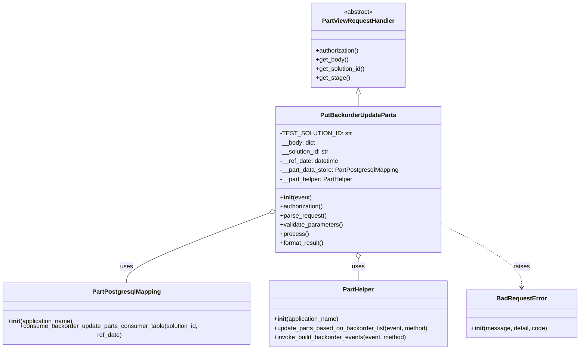
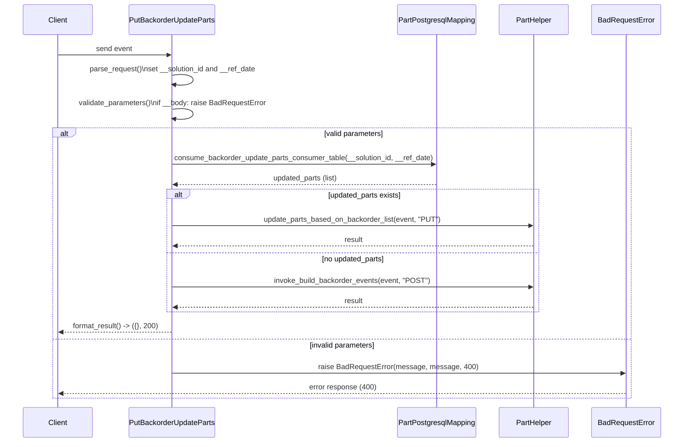

# Diagram: partview_core/partview_service/partview_service/api/part/backorder/backorder_update_parts/handlers/put_backorder_update_parts.py

> Auto-generated by Obscura crawlers

## Diagram 1

### SVG

<svg id="container" width="1524.3984375" xmlns="http://www.w3.org/2000/svg" class="classDiagram" height="920" viewBox="0 0 1524.3984375 920" role="graphics-document document" aria-roledescription="class"><g><defs><marker id="container_class-aggregationStart" class="marker aggregation class" refX="18" refY="7" markerWidth="190" markerHeight="240" orient="auto"><path d="M 18,7 L9,13 L1,7 L9,1 Z"></path></marker></defs><defs><marker id="container_class-aggregationEnd" class="marker aggregation class" refX="1" refY="7" markerWidth="20" markerHeight="28" orient="auto"><path d="M 18,7 L9,13 L1,7 L9,1 Z"></path></marker></defs><defs><marker id="container_class-extensionStart" class="marker extension class" refX="18" refY="7" markerWidth="190" markerHeight="240" orient="auto"><path d="M 1,7 L18,13 V 1 Z"></path></marker></defs><defs><marker id="container_class-extensionEnd" class="marker extension class" refX="1" refY="7" markerWidth="20" markerHeight="28" orient="auto"><path d="M 1,1 V 13 L18,7 Z"></path></marker></defs><defs><marker id="container_class-compositionStart" class="marker composition class" refX="18" refY="7" markerWidth="190" markerHeight="240" orient="auto"><path d="M 18,7 L9,13 L1,7 L9,1 Z"></path></marker></defs><defs><marker id="container_class-compositionEnd" class="marker composition class" refX="1" refY="7" markerWidth="20" markerHeight="28" orient="auto"><path d="M 18,7 L9,13 L1,7 L9,1 Z"></path></marker></defs><defs><marker id="container_class-dependencyStart" class="marker dependency class" refX="6" refY="7" markerWidth="190" markerHeight="240" orient="auto"><path d="M 5,7 L9,13 L1,7 L9,1 Z"></path></marker></defs><defs><marker id="container_class-dependencyEnd" class="marker dependency class" refX="13" refY="7" markerWidth="20" markerHeight="28" orient="auto"><path d="M 18,7 L9,13 L14,7 L9,1 Z"></path></marker></defs><defs><marker id="container_class-lollipopStart" class="marker lollipop class" refX="13" refY="7" markerWidth="190" markerHeight="240" orient="auto"><circle stroke="black" fill="transparent" cx="7" cy="7" r="6"></circle></marker></defs><defs><marker id="container_class-lollipopEnd" class="marker lollipop class" refX="1" refY="7" markerWidth="190" markerHeight="240" orient="auto"><circle stroke="black" fill="transparent" cx="7" cy="7" r="6"></circle></marker></defs><g class="root"><g class="clusters"></g><g class="edgePaths"><path d="M945.551,247.25L945.551,248.542C945.551,249.833,945.551,252.417,945.551,257.875C945.551,263.333,945.551,271.667,945.551,275.833L945.551,280" id="id_PartViewRequestHandler_PutBackorderUpdateParts_1" class="edge-thickness-normal edge-pattern-solid relation" style=";;;" data-edge="true" data-et="edge" data-id="id_PartViewRequestHandler_PutBackorderUpdateParts_1" data-points="W3sieCI6OTQ1LjU1MDc4MTI1LCJ5IjoyMzB9LHsieCI6OTQ1LjU1MDc4MTI1LCJ5IjoyNTV9LHsieCI6OTQ1LjU1MDc4MTI1LCJ5IjoyODB9XQ==" marker-start="url(#container_class-extensionStart)"></path><path d="M713.508,558.823L650.177,582.519C586.846,606.215,460.185,653.608,396.854,685.47C333.523,717.333,333.523,733.667,333.523,741.833L333.523,750" id="id_PutBackorderUpdateParts_PartPostgresqlMapping_2" class="edge-thickness-normal edge-pattern-solid relation" style=";;;" data-edge="true" data-et="edge" data-id="id_PutBackorderUpdateParts_PartPostgresqlMapping_2" data-points="W3sieCI6NzI5LjY2NDA2MjUsInkiOjU1Mi43Nzc1MzI0MDcwMjMzfSx7IngiOjMzMy41MjM0Mzc1LCJ5Ijo3MDF9LHsieCI6MzMzLjUyMzQzNzUsInkiOjc1MH1d" marker-start="url(#container_class-aggregationStart)"></path><path d="M945.551,681.25L945.551,684.542C945.551,687.833,945.551,694.417,945.551,703.875C945.551,713.333,945.551,725.667,945.551,731.833L945.551,738" id="id_PutBackorderUpdateParts_PartHelper_3" class="edge-thickness-normal edge-pattern-solid relation" style=";;;" data-edge="true" data-et="edge" data-id="id_PutBackorderUpdateParts_PartHelper_3" data-points="W3sieCI6OTQ1LjU1MDc4MTI1LCJ5Ijo2NjR9LHsieCI6OTQ1LjU1MDc4MTI1LCJ5Ijo3MDF9LHsieCI6OTQ1LjU1MDc4MTI1LCJ5Ijo3Mzh9XQ==" marker-start="url(#container_class-aggregationStart)"></path><path d="M1161.438,587.327L1196.902,606.273C1232.367,625.218,1303.297,663.109,1338.762,691.221C1374.227,719.333,1374.227,737.667,1374.227,746.833L1374.227,756" id="id_PutBackorderUpdateParts_BadRequestError_4" class="edge-thickness-normal edge-pattern-dashed relation" style=";;;" data-edge="true" data-et="edge" data-id="id_PutBackorderUpdateParts_BadRequestError_4" data-points="W3sieCI6MTE2MS40Mzc1LCJ5Ijo1ODcuMzI3Mzg5MDM0MTgwNH0seyJ4IjoxMzc0LjIyNjU2MjUsInkiOjcwMX0seyJ4IjoxMzc0LjIyNjU2MjUsInkiOjc2Mn1d" marker-end="url(#container_class-dependencyEnd)"></path></g><g class="edgeLabels"><g class="edgeLabel"><g class="label" data-id="id_PartViewRequestHandler_PutBackorderUpdateParts_1" transform="translate(0, 0)"><foreignObject width="0" height="0">

</foreignObject></g></g><g class="edgeLabel" transform="translate(333.5234375, 701)"><g class="label" data-id="id_PutBackorderUpdateParts_PartPostgresqlMapping_2" transform="translate(-16.4921875, -12)"><foreignObject width="32.984375" height="24">

uses

</foreignObject></g></g><g class="edgeLabel" transform="translate(945.55078125, 701)"><g class="label" data-id="id_PutBackorderUpdateParts_PartHelper_3" transform="translate(-16.4921875, -12)"><foreignObject width="32.984375" height="24">

uses

</foreignObject></g></g><g class="edgeLabel" transform="translate(1374.2265625, 701)"><g class="label" data-id="id_PutBackorderUpdateParts_BadRequestError_4" transform="translate(-21.25, -12)"><foreignObject width="42.5" height="24">

raises

</foreignObject></g></g></g><g class="nodes"><g class="node default" id="classId-PartViewRequestHandler-0" transform="translate(945.55078125, 119)"><g class="basic label-container"><path d="M-123.4140625 -111 L123.4140625 -111 L123.4140625 111 L-123.4140625 111" stroke="none" stroke-width="0" fill="#ECECFF" style=""></path><path d="M-123.4140625 -111 C-47.075256250569296 -111, 29.263549998861407 -111, 123.4140625 -111 M-123.4140625 -111 C-56.82312206455882 -111, 9.767818370882367 -111, 123.4140625 -111 M123.4140625 -111 C123.4140625 -51.34637566735277, 123.4140625 8.307248665294466, 123.4140625 111 M123.4140625 -111 C123.4140625 -61.56025818118672, 123.4140625 -12.120516362373436, 123.4140625 111 M123.4140625 111 C61.11578371389398 111, -1.1824950722120349 111, -123.4140625 111 M123.4140625 111 C69.01223307148581 111, 14.610403642971605 111, -123.4140625 111 M-123.4140625 111 C-123.4140625 35.48533043190032, -123.4140625 -40.029339136199354, -123.4140625 -111 M-123.4140625 111 C-123.4140625 64.30631108794552, -123.4140625 17.61262217589102, -123.4140625 -111" stroke="#9370DB" stroke-width="1.3" fill="none" stroke-dasharray="0 0" style=""></path></g><g class="annotation-group text" transform="translate(-38.609375, -87)"><g class="label" style="" transform="translate(0,-12)"><foreignObject width="77.21875" height="24">

«abstract»

</foreignObject></g></g><g class="label-group text" transform="translate(-91.359375, -63)"><g class="label" style="font-weight: bolder" transform="translate(0,-12)"><foreignObject width="182.71875" height="24">

PartViewRequestHandler

</foreignObject></g></g><g class="members-group text" transform="translate(-111.4140625, -15)"></g><g class="methods-group text" transform="translate(-111.4140625, 15)"><g class="label" style="" transform="translate(0,-12)"><foreignObject width="115.78125" height="24">

+authorization()

</foreignObject></g><g class="label" style="" transform="translate(0,12)"><foreignObject width="85.53125" height="24">

+get_body()

</foreignObject></g><g class="label" style="" transform="translate(0,36)"><foreignObject width="131.46875" height="24">

+get_solution_id()

</foreignObject></g><g class="label" style="" transform="translate(0,60)"><foreignObject width="87.703125" height="24">

+get_stage()

</foreignObject></g></g><g class="divider" style=""><path d="M-123.4140625 -39 C-61.05348445444745 -39, 1.307093591105101 -39, 123.4140625 -39 M-123.4140625 -39 C-55.10096608779918 -39, 13.212130324401642 -39, 123.4140625 -39" stroke="#9370DB" stroke-width="1.3" fill="none" stroke-dasharray="0 0" style=""></path></g><g class="divider" style=""><path d="M-123.4140625 -15 C-42.35123957220186 -15, 38.711583355596275 -15, 123.4140625 -15 M-123.4140625 -15 C-53.31442947024637 -15, 16.785203559507266 -15, 123.4140625 -15" stroke="#9370DB" stroke-width="1.3" fill="none" stroke-dasharray="0 0" style=""></path></g></g><g class="node default" id="classId-PutBackorderUpdateParts-1" transform="translate(945.55078125, 472)"><g class="basic label-container"><path d="M-215.88671875 -192 L215.88671875 -192 L215.88671875 192 L-215.88671875 192" stroke="none" stroke-width="0" fill="#ECECFF" style=""></path><path d="M-215.88671875 -192 C-129.47996431847469 -192, -43.07320988694937 -192, 215.88671875 -192 M-215.88671875 -192 C-111.5438502725359 -192, -7.200981795071812 -192, 215.88671875 -192 M215.88671875 -192 C215.88671875 -104.58617670829284, 215.88671875 -17.17235341658568, 215.88671875 192 M215.88671875 -192 C215.88671875 -43.867248656899335, 215.88671875 104.26550268620133, 215.88671875 192 M215.88671875 192 C103.97926091743223 192, -7.928196915135544 192, -215.88671875 192 M215.88671875 192 C110.33922923363009 192, 4.791739717260185 192, -215.88671875 192 M-215.88671875 192 C-215.88671875 76.50640234220623, -215.88671875 -38.98719531558754, -215.88671875 -192 M-215.88671875 192 C-215.88671875 38.419144639881154, -215.88671875 -115.16171072023769, -215.88671875 -192" stroke="#9370DB" stroke-width="1.3" fill="none" stroke-dasharray="0 0" style=""></path></g><g class="annotation-group text" transform="translate(0, -168)"></g><g class="label-group text" transform="translate(-95.2421875, -168)"><g class="label" style="font-weight: bolder" transform="translate(0,-12)"><foreignObject width="190.484375" height="24">

PutBackorderUpdateParts

</foreignObject></g></g><g class="members-group text" transform="translate(-203.88671875, -120)"><g class="label" style="" transform="translate(0,-12)"><foreignObject width="169.953125" height="24">

-TEST_SOLUTION_ID: str

</foreignObject></g><g class="label" style="" transform="translate(0,12)"><foreignObject width="93.59375" height="24">

-__body: dict

</foreignObject></g><g class="label" style="" transform="translate(0,36)"><foreignObject width="131.390625" height="24">

-__solution_id: str

</foreignObject></g><g class="label" style="" transform="translate(0,60)"><foreignObject width="154.8125" height="24">

-__ref_date: datetime

</foreignObject></g><g class="label" style="" transform="translate(0,84)"><foreignObject width="312.53125" height="24">

-__part_data_store: PartPostgresqlMapping

</foreignObject></g><g class="label" style="" transform="translate(0,108)"><foreignObject width="193.15625" height="24">

-__part_helper: PartHelper

</foreignObject></g></g><g class="methods-group text" transform="translate(-203.88671875, 48)"><g class="label" style="" transform="translate(0,-12)"><foreignObject width="83.140625" height="24">

+<strong>init</strong>(event)

</foreignObject></g><g class="label" style="" transform="translate(0,12)"><foreignObject width="115.78125" height="24">

+authorization()

</foreignObject></g><g class="label" style="" transform="translate(0,36)"><foreignObject width="121.796875" height="24">

+parse_request()

</foreignObject></g><g class="label" style="" transform="translate(0,60)"><foreignObject width="166.546875" height="24">

+validate_parameters()

</foreignObject></g><g class="label" style="" transform="translate(0,84)"><foreignObject width="73.734375" height="24">

+process()

</foreignObject></g><g class="label" style="" transform="translate(0,108)"><foreignObject width="117.015625" height="24">

+format_result()

</foreignObject></g></g><g class="divider" style=""><path d="M-215.88671875 -144 C-121.9543935776395 -144, -28.022068405278986 -144, 215.88671875 -144 M-215.88671875 -144 C-112.6764282626713 -144, -9.466137775342588 -144, 215.88671875 -144" stroke="#9370DB" stroke-width="1.3" fill="none" stroke-dasharray="0 0" style=""></path></g><g class="divider" style=""><path d="M-215.88671875 24 C-103.76622205385206 24, 8.354274642295877 24, 215.88671875 24 M-215.88671875 24 C-93.29146126913588 24, 29.30379621172824 24, 215.88671875 24" stroke="#9370DB" stroke-width="1.3" fill="none" stroke-dasharray="0 0" style=""></path></g></g><g class="node default" id="classId-PartPostgresqlMapping-2" transform="translate(333.5234375, 825)"><g class="basic label-container"><path d="M-325.5234375 -75 L325.5234375 -75 L325.5234375 75 L-325.5234375 75" stroke="none" stroke-width="0" fill="#ECECFF" style=""></path><path d="M-325.5234375 -75 C-129.99121057663376 -75, 65.54101634673248 -75, 325.5234375 -75 M-325.5234375 -75 C-191.4716443196055 -75, -57.419851139211005 -75, 325.5234375 -75 M325.5234375 -75 C325.5234375 -18.05394638882622, 325.5234375 38.89210722234756, 325.5234375 75 M325.5234375 -75 C325.5234375 -25.25172320208037, 325.5234375 24.49655359583926, 325.5234375 75 M325.5234375 75 C90.03442785937074 75, -145.45458178125853 75, -325.5234375 75 M325.5234375 75 C132.27293071190036 75, -60.977576076199284 75, -325.5234375 75 M-325.5234375 75 C-325.5234375 39.710094090131825, -325.5234375 4.420188180263651, -325.5234375 -75 M-325.5234375 75 C-325.5234375 25.59192083032947, -325.5234375 -23.816158339341058, -325.5234375 -75" stroke="#9370DB" stroke-width="1.3" fill="none" stroke-dasharray="0 0" style=""></path></g><g class="annotation-group text" transform="translate(0, -51)"></g><g class="label-group text" transform="translate(-85.46875, -51)"><g class="label" style="font-weight: bolder" transform="translate(0,-12)"><foreignObject width="170.9375" height="24">

PartPostgresqlMapping

</foreignObject></g></g><g class="members-group text" transform="translate(-313.5234375, -3)"></g><g class="methods-group text" transform="translate(-313.5234375, 27)"><g class="label" style="" transform="translate(0,-12)"><foreignObject width="173.734375" height="24">

+<strong>init</strong>(application_name)

</foreignObject></g><g class="label" style="" transform="translate(0,12)"><foreignObject width="541.578125" height="24">

+consume_backorder_update_parts_consumer_table(solution_id, ref_date)

</foreignObject></g></g><g class="divider" style=""><path d="M-325.5234375 -27 C-147.04310836725065 -27, 31.437220765498694 -27, 325.5234375 -27 M-325.5234375 -27 C-79.87634235275567 -27, 165.77075279448866 -27, 325.5234375 -27" stroke="#9370DB" stroke-width="1.3" fill="none" stroke-dasharray="0 0" style=""></path></g><g class="divider" style=""><path d="M-325.5234375 -3 C-168.26702750742152 -3, -11.010617514843034 -3, 325.5234375 -3 M-325.5234375 -3 C-126.02680706202634 -3, 73.46982337594733 -3, 325.5234375 -3" stroke="#9370DB" stroke-width="1.3" fill="none" stroke-dasharray="0 0" style=""></path></g></g><g class="node default" id="classId-PartHelper-3" transform="translate(945.55078125, 825)"><g class="basic label-container"><path d="M-236.50390625 -87 L236.50390625 -87 L236.50390625 87 L-236.50390625 87" stroke="none" stroke-width="0" fill="#ECECFF" style=""></path><path d="M-236.50390625 -87 C-81.48582794590448 -87, 73.53225035819105 -87, 236.50390625 -87 M-236.50390625 -87 C-102.3068405030356 -87, 31.890225243928796 -87, 236.50390625 -87 M236.50390625 -87 C236.50390625 -44.722154459382416, 236.50390625 -2.4443089187648326, 236.50390625 87 M236.50390625 -87 C236.50390625 -42.07889249915342, 236.50390625 2.8422150016931624, 236.50390625 87 M236.50390625 87 C79.02682881903485 87, -78.4502486119303 87, -236.50390625 87 M236.50390625 87 C69.82447396376935 87, -96.8549583224613 87, -236.50390625 87 M-236.50390625 87 C-236.50390625 18.565292937015442, -236.50390625 -49.869414125969115, -236.50390625 -87 M-236.50390625 87 C-236.50390625 30.02889559311371, -236.50390625 -26.94220881377258, -236.50390625 -87" stroke="#9370DB" stroke-width="1.3" fill="none" stroke-dasharray="0 0" style=""></path></g><g class="annotation-group text" transform="translate(0, -63)"></g><g class="label-group text" transform="translate(-39.5859375, -63)"><g class="label" style="font-weight: bolder" transform="translate(0,-12)"><foreignObject width="79.171875" height="24">

PartHelper

</foreignObject></g></g><g class="members-group text" transform="translate(-224.50390625, -15)"></g><g class="methods-group text" transform="translate(-224.50390625, 15)"><g class="label" style="" transform="translate(0,-12)"><foreignObject width="173.734375" height="24">

+<strong>init</strong>(application_name)

</foreignObject></g><g class="label" style="" transform="translate(0,12)"><foreignObject width="409.421875" height="24">

+update_parts_based_on_backorder_list(event, method)

</foreignObject></g><g class="label" style="" transform="translate(0,36)"><foreignObject width="352.625" height="24">

+invoke_build_backorder_events(event, method)

</foreignObject></g></g><g class="divider" style=""><path d="M-236.50390625 -39 C-123.14599936981226 -39, -9.788092489624518 -39, 236.50390625 -39 M-236.50390625 -39 C-88.05590557448733 -39, 60.39209510102535 -39, 236.50390625 -39" stroke="#9370DB" stroke-width="1.3" fill="none" stroke-dasharray="0 0" style=""></path></g><g class="divider" style=""><path d="M-236.50390625 -15 C-136.50723031578184 -15, -36.51055438156365 -15, 236.50390625 -15 M-236.50390625 -15 C-111.65563162664465 -15, 13.192642996710703 -15, 236.50390625 -15" stroke="#9370DB" stroke-width="1.3" fill="none" stroke-dasharray="0 0" style=""></path></g></g><g class="node default" id="classId-BadRequestError-4" transform="translate(1374.2265625, 825)"><g class="basic label-container"><path d="M-142.171875 -63 L142.171875 -63 L142.171875 63 L-142.171875 63" stroke="none" stroke-width="0" fill="#ECECFF" style=""></path><path d="M-142.171875 -63 C-46.95056343144786 -63, 48.27074813710428 -63, 142.171875 -63 M-142.171875 -63 C-84.37957008013564 -63, -26.587265160271286 -63, 142.171875 -63 M142.171875 -63 C142.171875 -33.42381783081672, 142.171875 -3.847635661633447, 142.171875 63 M142.171875 -63 C142.171875 -37.17493737822117, 142.171875 -11.349874756442354, 142.171875 63 M142.171875 63 C82.08495057333181 63, 21.99802614666362 63, -142.171875 63 M142.171875 63 C67.5009305984514 63, -7.170013803097191 63, -142.171875 63 M-142.171875 63 C-142.171875 33.218140443696846, -142.171875 3.4362808873936928, -142.171875 -63 M-142.171875 63 C-142.171875 35.23142875127925, -142.171875 7.462857502558506, -142.171875 -63" stroke="#9370DB" stroke-width="1.3" fill="none" stroke-dasharray="0 0" style=""></path></g><g class="annotation-group text" transform="translate(0, -39)"></g><g class="label-group text" transform="translate(-62.28125, -39)"><g class="label" style="font-weight: bolder" transform="translate(0,-12)"><foreignObject width="124.5625" height="24">

BadRequestError

</foreignObject></g></g><g class="members-group text" transform="translate(-130.171875, 9)"></g><g class="methods-group text" transform="translate(-130.171875, 39)"><g class="label" style="" transform="translate(0,-12)"><foreignObject width="198.0625" height="24">

+<strong>init</strong>(message, detail, code)

</foreignObject></g></g><g class="divider" style=""><path d="M-142.171875 -15 C-48.49423018299291 -15, 45.183414634014184 -15, 142.171875 -15 M-142.171875 -15 C-53.46811078111473 -15, 35.23565343777054 -15, 142.171875 -15" stroke="#9370DB" stroke-width="1.3" fill="none" stroke-dasharray="0 0" style=""></path></g><g class="divider" style=""><path d="M-142.171875 9 C-78.4358502663856 9, -14.6998255327712 9, 142.171875 9 M-142.171875 9 C-48.7818616351683 9, 44.608151729663405 9, 142.171875 9" stroke="#9370DB" stroke-width="1.3" fill="none" stroke-dasharray="0 0" style=""></path></g></g></g></g></g></svg>

## Diagram 2

### SVG

<svg id="container" width="1563" xmlns="http://www.w3.org/2000/svg" height="1007" viewBox="-50 -10 1563 1007" role="graphics-document document" aria-roledescription="sequence"><g><rect x="1313" y="921" fill="#eaeaea" stroke="#666" width="150" height="65" name="BadRequestError" rx="3" ry="3" class="actor actor-bottom"></rect><text x="1388" y="953.5" dominant-baseline="central" alignment-baseline="central" class="actor actor-box" style="text-anchor: middle; font-size: 16px; font-weight: 400;"><tspan x="1388" dy="0">BadRequestError</tspan></text></g><g><rect x="1113" y="921" fill="#eaeaea" stroke="#666" width="150" height="65" name="PartHelper" rx="3" ry="3" class="actor actor-bottom"></rect><text x="1188" y="953.5" dominant-baseline="central" alignment-baseline="central" class="actor actor-box" style="text-anchor: middle; font-size: 16px; font-weight: 400;"><tspan x="1188" dy="0">PartHelper</tspan></text></g><g><rect x="875" y="921" fill="#eaeaea" stroke="#666" width="188" height="65" name="PartPostgresqlMapping" rx="3" ry="3" class="actor actor-bottom"></rect><text x="969" y="953.5" dominant-baseline="central" alignment-baseline="central" class="actor actor-box" style="text-anchor: middle; font-size: 16px; font-weight: 400;"><tspan x="969" dy="0">PartPostgresqlMapping</tspan></text></g><g><rect x="228.5" y="921" fill="#eaeaea" stroke="#666" width="207" height="65" name="PutBackorderUpdateParts" rx="3" ry="3" class="actor actor-bottom"></rect><text x="332" y="953.5" dominant-baseline="central" alignment-baseline="central" class="actor actor-box" style="text-anchor: middle; font-size: 16px; font-weight: 400;"><tspan x="332" dy="0">PutBackorderUpdateParts</tspan></text></g><g><rect x="0" y="921" fill="#eaeaea" stroke="#666" width="150" height="65" name="Client" rx="3" ry="3" class="actor actor-bottom"></rect><text x="75" y="953.5" dominant-baseline="central" alignment-baseline="central" class="actor actor-box" style="text-anchor: middle; font-size: 16px; font-weight: 400;"><tspan x="75" dy="0">Client</tspan></text></g><g><line id="actor4" x1="1388" y1="65" x2="1388" y2="921" class="actor-line 200" stroke-width="0.5px" stroke="#999" name="BadRequestError"></line><g id="root-4"><rect x="1313" y="0" fill="#eaeaea" stroke="#666" width="150" height="65" name="BadRequestError" rx="3" ry="3" class="actor actor-top"></rect><text x="1388" y="32.5" dominant-baseline="central" alignment-baseline="central" class="actor actor-box" style="text-anchor: middle; font-size: 16px; font-weight: 400;"><tspan x="1388" dy="0">BadRequestError</tspan></text></g></g><g><line id="actor3" x1="1188" y1="65" x2="1188" y2="921" class="actor-line 200" stroke-width="0.5px" stroke="#999" name="PartHelper"></line><g id="root-3"><rect x="1113" y="0" fill="#eaeaea" stroke="#666" width="150" height="65" name="PartHelper" rx="3" ry="3" class="actor actor-top"></rect><text x="1188" y="32.5" dominant-baseline="central" alignment-baseline="central" class="actor actor-box" style="text-anchor: middle; font-size: 16px; font-weight: 400;"><tspan x="1188" dy="0">PartHelper</tspan></text></g></g><g><line id="actor2" x1="969" y1="65" x2="969" y2="921" class="actor-line 200" stroke-width="0.5px" stroke="#999" name="PartPostgresqlMapping"></line><g id="root-2"><rect x="875" y="0" fill="#eaeaea" stroke="#666" width="188" height="65" name="PartPostgresqlMapping" rx="3" ry="3" class="actor actor-top"></rect><text x="969" y="32.5" dominant-baseline="central" alignment-baseline="central" class="actor actor-box" style="text-anchor: middle; font-size: 16px; font-weight: 400;"><tspan x="969" dy="0">PartPostgresqlMapping</tspan></text></g></g><g><line id="actor1" x1="332" y1="65" x2="332" y2="921" class="actor-line 200" stroke-width="0.5px" stroke="#999" name="PutBackorderUpdateParts"></line><g id="root-1"><rect x="228.5" y="0" fill="#eaeaea" stroke="#666" width="207" height="65" name="PutBackorderUpdateParts" rx="3" ry="3" class="actor actor-top"></rect><text x="332" y="32.5" dominant-baseline="central" alignment-baseline="central" class="actor actor-box" style="text-anchor: middle; font-size: 16px; font-weight: 400;"><tspan x="332" dy="0">PutBackorderUpdateParts</tspan></text></g></g><g><line id="actor0" x1="75" y1="65" x2="75" y2="921" class="actor-line 200" stroke-width="0.5px" stroke="#999" name="Client"></line><g id="root-0"><rect x="0" y="0" fill="#eaeaea" stroke="#666" width="150" height="65" name="Client" rx="3" ry="3" class="actor actor-top"></rect><text x="75" y="32.5" dominant-baseline="central" alignment-baseline="central" class="actor actor-box" style="text-anchor: middle; font-size: 16px; font-weight: 400;"><tspan x="75" dy="0">Client</tspan></text></g></g><g></g><defs><symbol id="computer" width="24" height="24"><path transform="scale(.5)" d="M2 2v13h20v-13h-20zm18 11h-16v-9h16v9zm-10.228 6l.466-1h3.524l.467 1h-4.457zm14.228 3h-24l2-6h2.104l-1.33 4h18.45l-1.297-4h2.073l2 6zm-5-10h-14v-7h14v7z"></path></symbol></defs><defs><symbol id="database" fill-rule="evenodd" clip-rule="evenodd"><path transform="scale(.5)" d="M12.258.001l.256.004.255.005.253.008.251.01.249.012.247.015.246.016.242.019.241.02.239.023.236.024.233.027.231.028.229.031.225.032.223.034.22.036.217.038.214.04.211.041.208.043.205.045.201.046.198.048.194.05.191.051.187.053.183.054.18.056.175.057.172.059.168.06.163.061.16.063.155.064.15.066.074.033.073.033.071.034.07.034.069.035.068.035.067.035.066.035.064.036.064.036.062.036.06.036.06.037.058.037.058.037.055.038.055.038.053.038.052.038.051.039.05.039.048.039.047.039.045.04.044.04.043.04.041.04.04.041.039.041.037.041.036.041.034.041.033.042.032.042.03.042.029.042.027.042.026.043.024.043.023.043.021.043.02.043.018.044.017.043.015.044.013.044.012.044.011.045.009.044.007.045.006.045.004.045.002.045.001.045v17l-.001.045-.002.045-.004.045-.006.045-.007.045-.009.044-.011.045-.012.044-.013.044-.015.044-.017.043-.018.044-.02.043-.021.043-.023.043-.024.043-.026.043-.027.042-.029.042-.03.042-.032.042-.033.042-.034.041-.036.041-.037.041-.039.041-.04.041-.041.04-.043.04-.044.04-.045.04-.047.039-.048.039-.05.039-.051.039-.052.038-.053.038-.055.038-.055.038-.058.037-.058.037-.06.037-.06.036-.062.036-.064.036-.064.036-.066.035-.067.035-.068.035-.069.035-.07.034-.071.034-.073.033-.074.033-.15.066-.155.064-.16.063-.163.061-.168.06-.172.059-.175.057-.18.056-.183.054-.187.053-.191.051-.194.05-.198.048-.201.046-.205.045-.208.043-.211.041-.214.04-.217.038-.22.036-.223.034-.225.032-.229.031-.231.028-.233.027-.236.024-.239.023-.241.02-.242.019-.246.016-.247.015-.249.012-.251.01-.253.008-.255.005-.256.004-.258.001-.258-.001-.256-.004-.255-.005-.253-.008-.251-.01-.249-.012-.247-.015-.245-.016-.243-.019-.241-.02-.238-.023-.236-.024-.234-.027-.231-.028-.228-.031-.226-.032-.223-.034-.22-.036-.217-.038-.214-.04-.211-.041-.208-.043-.204-.045-.201-.046-.198-.048-.195-.05-.19-.051-.187-.053-.184-.054-.179-.056-.176-.057-.172-.059-.167-.06-.164-.061-.159-.063-.155-.064-.151-.066-.074-.033-.072-.033-.072-.034-.07-.034-.069-.035-.068-.035-.067-.035-.066-.035-.064-.036-.063-.036-.062-.036-.061-.036-.06-.037-.058-.037-.057-.037-.056-.038-.055-.038-.053-.038-.052-.038-.051-.039-.049-.039-.049-.039-.046-.039-.046-.04-.044-.04-.043-.04-.041-.04-.04-.041-.039-.041-.037-.041-.036-.041-.034-.041-.033-.042-.032-.042-.03-.042-.029-.042-.027-.042-.026-.043-.024-.043-.023-.043-.021-.043-.02-.043-.018-.044-.017-.043-.015-.044-.013-.044-.012-.044-.011-.045-.009-.044-.007-.045-.006-.045-.004-.045-.002-.045-.001-.045v-17l.001-.045.002-.045.004-.045.006-.045.007-.045.009-.044.011-.045.012-.044.013-.044.015-.044.017-.043.018-.044.02-.043.021-.043.023-.043.024-.043.026-.043.027-.042.029-.042.03-.042.032-.042.033-.042.034-.041.036-.041.037-.041.039-.041.04-.041.041-.04.043-.04.044-.04.046-.04.046-.039.049-.039.049-.039.051-.039.052-.038.053-.038.055-.038.056-.038.057-.037.058-.037.06-.037.061-.036.062-.036.063-.036.064-.036.066-.035.067-.035.068-.035.069-.035.07-.034.072-.034.072-.033.074-.033.151-.066.155-.064.159-.063.164-.061.167-.06.172-.059.176-.057.179-.056.184-.054.187-.053.19-.051.195-.05.198-.048.201-.046.204-.045.208-.043.211-.041.214-.04.217-.038.22-.036.223-.034.226-.032.228-.031.231-.028.234-.027.236-.024.238-.023.241-.02.243-.019.245-.016.247-.015.249-.012.251-.01.253-.008.255-.005.256-.004.258-.001.258.001zm-9.258 20.499v.01l.001.021.003.021.004.022.005.021.006.022.007.022.009.023.01.022.011.023.012.023.013.023.015.023.016.024.017.023.018.024.019.024.021.024.022.025.023.024.024.025.052.049.056.05.061.051.066.051.07.051.075.051.079.052.084.052.088.052.092.052.097.052.102.051.105.052.11.052.114.051.119.051.123.051.127.05.131.05.135.05.139.048.144.049.147.047.152.047.155.047.16.045.163.045.167.043.171.043.176.041.178.041.183.039.187.039.19.037.194.035.197.035.202.033.204.031.209.03.212.029.216.027.219.025.222.024.226.021.23.02.233.018.236.016.24.015.243.012.246.01.249.008.253.005.256.004.259.001.26-.001.257-.004.254-.005.25-.008.247-.011.244-.012.241-.014.237-.016.233-.018.231-.021.226-.021.224-.024.22-.026.216-.027.212-.028.21-.031.205-.031.202-.034.198-.034.194-.036.191-.037.187-.039.183-.04.179-.04.175-.042.172-.043.168-.044.163-.045.16-.046.155-.046.152-.047.148-.048.143-.049.139-.049.136-.05.131-.05.126-.05.123-.051.118-.052.114-.051.11-.052.106-.052.101-.052.096-.052.092-.052.088-.053.083-.051.079-.052.074-.052.07-.051.065-.051.06-.051.056-.05.051-.05.023-.024.023-.025.021-.024.02-.024.019-.024.018-.024.017-.024.015-.023.014-.024.013-.023.012-.023.01-.023.01-.022.008-.022.006-.022.006-.022.004-.022.004-.021.001-.021.001-.021v-4.127l-.077.055-.08.053-.083.054-.085.053-.087.052-.09.052-.093.051-.095.05-.097.05-.1.049-.102.049-.105.048-.106.047-.109.047-.111.046-.114.045-.115.045-.118.044-.12.043-.122.042-.124.042-.126.041-.128.04-.13.04-.132.038-.134.038-.135.037-.138.037-.139.035-.142.035-.143.034-.144.033-.147.032-.148.031-.15.03-.151.03-.153.029-.154.027-.156.027-.158.026-.159.025-.161.024-.162.023-.163.022-.165.021-.166.02-.167.019-.169.018-.169.017-.171.016-.173.015-.173.014-.175.013-.175.012-.177.011-.178.01-.179.008-.179.008-.181.006-.182.005-.182.004-.184.003-.184.002h-.37l-.184-.002-.184-.003-.182-.004-.182-.005-.181-.006-.179-.008-.179-.008-.178-.01-.176-.011-.176-.012-.175-.013-.173-.014-.172-.015-.171-.016-.17-.017-.169-.018-.167-.019-.166-.02-.165-.021-.163-.022-.162-.023-.161-.024-.159-.025-.157-.026-.156-.027-.155-.027-.153-.029-.151-.03-.15-.03-.148-.031-.146-.032-.145-.033-.143-.034-.141-.035-.14-.035-.137-.037-.136-.037-.134-.038-.132-.038-.13-.04-.128-.04-.126-.041-.124-.042-.122-.042-.12-.044-.117-.043-.116-.045-.113-.045-.112-.046-.109-.047-.106-.047-.105-.048-.102-.049-.1-.049-.097-.05-.095-.05-.093-.052-.09-.051-.087-.052-.085-.053-.083-.054-.08-.054-.077-.054v4.127zm0-5.654v.011l.001.021.003.021.004.021.005.022.006.022.007.022.009.022.01.022.011.023.012.023.013.023.015.024.016.023.017.024.018.024.019.024.021.024.022.024.023.025.024.024.052.05.056.05.061.05.066.051.07.051.075.052.079.051.084.052.088.052.092.052.097.052.102.052.105.052.11.051.114.051.119.052.123.05.127.051.131.05.135.049.139.049.144.048.147.048.152.047.155.046.16.045.163.045.167.044.171.042.176.042.178.04.183.04.187.038.19.037.194.036.197.034.202.033.204.032.209.03.212.028.216.027.219.025.222.024.226.022.23.02.233.018.236.016.24.014.243.012.246.01.249.008.253.006.256.003.259.001.26-.001.257-.003.254-.006.25-.008.247-.01.244-.012.241-.015.237-.016.233-.018.231-.02.226-.022.224-.024.22-.025.216-.027.212-.029.21-.03.205-.032.202-.033.198-.035.194-.036.191-.037.187-.039.183-.039.179-.041.175-.042.172-.043.168-.044.163-.045.16-.045.155-.047.152-.047.148-.048.143-.048.139-.05.136-.049.131-.05.126-.051.123-.051.118-.051.114-.052.11-.052.106-.052.101-.052.096-.052.092-.052.088-.052.083-.052.079-.052.074-.051.07-.052.065-.051.06-.05.056-.051.051-.049.023-.025.023-.024.021-.025.02-.024.019-.024.018-.024.017-.024.015-.023.014-.023.013-.024.012-.022.01-.023.01-.023.008-.022.006-.022.006-.022.004-.021.004-.022.001-.021.001-.021v-4.139l-.077.054-.08.054-.083.054-.085.052-.087.053-.09.051-.093.051-.095.051-.097.05-.1.049-.102.049-.105.048-.106.047-.109.047-.111.046-.114.045-.115.044-.118.044-.12.044-.122.042-.124.042-.126.041-.128.04-.13.039-.132.039-.134.038-.135.037-.138.036-.139.036-.142.035-.143.033-.144.033-.147.033-.148.031-.15.03-.151.03-.153.028-.154.028-.156.027-.158.026-.159.025-.161.024-.162.023-.163.022-.165.021-.166.02-.167.019-.169.018-.169.017-.171.016-.173.015-.173.014-.175.013-.175.012-.177.011-.178.009-.179.009-.179.007-.181.007-.182.005-.182.004-.184.003-.184.002h-.37l-.184-.002-.184-.003-.182-.004-.182-.005-.181-.007-.179-.007-.179-.009-.178-.009-.176-.011-.176-.012-.175-.013-.173-.014-.172-.015-.171-.016-.17-.017-.169-.018-.167-.019-.166-.02-.165-.021-.163-.022-.162-.023-.161-.024-.159-.025-.157-.026-.156-.027-.155-.028-.153-.028-.151-.03-.15-.03-.148-.031-.146-.033-.145-.033-.143-.033-.141-.035-.14-.036-.137-.036-.136-.037-.134-.038-.132-.039-.13-.039-.128-.04-.126-.041-.124-.042-.122-.043-.12-.043-.117-.044-.116-.044-.113-.046-.112-.046-.109-.046-.106-.047-.105-.048-.102-.049-.1-.049-.097-.05-.095-.051-.093-.051-.09-.051-.087-.053-.085-.052-.083-.054-.08-.054-.077-.054v4.139zm0-5.666v.011l.001.02.003.022.004.021.005.022.006.021.007.022.009.023.01.022.011.023.012.023.013.023.015.023.016.024.017.024.018.023.019.024.021.025.022.024.023.024.024.025.052.05.056.05.061.05.066.051.07.051.075.052.079.051.084.052.088.052.092.052.097.052.102.052.105.051.11.052.114.051.119.051.123.051.127.05.131.05.135.05.139.049.144.048.147.048.152.047.155.046.16.045.163.045.167.043.171.043.176.042.178.04.183.04.187.038.19.037.194.036.197.034.202.033.204.032.209.03.212.028.216.027.219.025.222.024.226.021.23.02.233.018.236.017.24.014.243.012.246.01.249.008.253.006.256.003.259.001.26-.001.257-.003.254-.006.25-.008.247-.01.244-.013.241-.014.237-.016.233-.018.231-.02.226-.022.224-.024.22-.025.216-.027.212-.029.21-.03.205-.032.202-.033.198-.035.194-.036.191-.037.187-.039.183-.039.179-.041.175-.042.172-.043.168-.044.163-.045.16-.045.155-.047.152-.047.148-.048.143-.049.139-.049.136-.049.131-.051.126-.05.123-.051.118-.052.114-.051.11-.052.106-.052.101-.052.096-.052.092-.052.088-.052.083-.052.079-.052.074-.052.07-.051.065-.051.06-.051.056-.05.051-.049.023-.025.023-.025.021-.024.02-.024.019-.024.018-.024.017-.024.015-.023.014-.024.013-.023.012-.023.01-.022.01-.023.008-.022.006-.022.006-.022.004-.022.004-.021.001-.021.001-.021v-4.153l-.077.054-.08.054-.083.053-.085.053-.087.053-.09.051-.093.051-.095.051-.097.05-.1.049-.102.048-.105.048-.106.048-.109.046-.111.046-.114.046-.115.044-.118.044-.12.043-.122.043-.124.042-.126.041-.128.04-.13.039-.132.039-.134.038-.135.037-.138.036-.139.036-.142.034-.143.034-.144.033-.147.032-.148.032-.15.03-.151.03-.153.028-.154.028-.156.027-.158.026-.159.024-.161.024-.162.023-.163.023-.165.021-.166.02-.167.019-.169.018-.169.017-.171.016-.173.015-.173.014-.175.013-.175.012-.177.01-.178.01-.179.009-.179.007-.181.006-.182.006-.182.004-.184.003-.184.001-.185.001-.185-.001-.184-.001-.184-.003-.182-.004-.182-.006-.181-.006-.179-.007-.179-.009-.178-.01-.176-.01-.176-.012-.175-.013-.173-.014-.172-.015-.171-.016-.17-.017-.169-.018-.167-.019-.166-.02-.165-.021-.163-.023-.162-.023-.161-.024-.159-.024-.157-.026-.156-.027-.155-.028-.153-.028-.151-.03-.15-.03-.148-.032-.146-.032-.145-.033-.143-.034-.141-.034-.14-.036-.137-.036-.136-.037-.134-.038-.132-.039-.13-.039-.128-.041-.126-.041-.124-.041-.122-.043-.12-.043-.117-.044-.116-.044-.113-.046-.112-.046-.109-.046-.106-.048-.105-.048-.102-.048-.1-.05-.097-.049-.095-.051-.093-.051-.09-.052-.087-.052-.085-.053-.083-.053-.08-.054-.077-.054v4.153zm8.74-8.179l-.257.004-.254.005-.25.008-.247.011-.244.012-.241.014-.237.016-.233.018-.231.021-.226.022-.224.023-.22.026-.216.027-.212.028-.21.031-.205.032-.202.033-.198.034-.194.036-.191.038-.187.038-.183.04-.179.041-.175.042-.172.043-.168.043-.163.045-.16.046-.155.046-.152.048-.148.048-.143.048-.139.049-.136.05-.131.05-.126.051-.123.051-.118.051-.114.052-.11.052-.106.052-.101.052-.096.052-.092.052-.088.052-.083.052-.079.052-.074.051-.07.052-.065.051-.06.05-.056.05-.051.05-.023.025-.023.024-.021.024-.02.025-.019.024-.018.024-.017.023-.015.024-.014.023-.013.023-.012.023-.01.023-.01.022-.008.022-.006.023-.006.021-.004.022-.004.021-.001.021-.001.021.001.021.001.021.004.021.004.022.006.021.006.023.008.022.01.022.01.023.012.023.013.023.014.023.015.024.017.023.018.024.019.024.02.025.021.024.023.024.023.025.051.05.056.05.06.05.065.051.07.052.074.051.079.052.083.052.088.052.092.052.096.052.101.052.106.052.11.052.114.052.118.051.123.051.126.051.131.05.136.05.139.049.143.048.148.048.152.048.155.046.16.046.163.045.168.043.172.043.175.042.179.041.183.04.187.038.191.038.194.036.198.034.202.033.205.032.21.031.212.028.216.027.22.026.224.023.226.022.231.021.233.018.237.016.241.014.244.012.247.011.25.008.254.005.257.004.26.001.26-.001.257-.004.254-.005.25-.008.247-.011.244-.012.241-.014.237-.016.233-.018.231-.021.226-.022.224-.023.22-.026.216-.027.212-.028.21-.031.205-.032.202-.033.198-.034.194-.036.191-.038.187-.038.183-.04.179-.041.175-.042.172-.043.168-.043.163-.045.16-.046.155-.046.152-.048.148-.048.143-.048.139-.049.136-.05.131-.05.126-.051.123-.051.118-.051.114-.052.11-.052.106-.052.101-.052.096-.052.092-.052.088-.052.083-.052.079-.052.074-.051.07-.052.065-.051.06-.05.056-.05.051-.05.023-.025.023-.024.021-.024.02-.025.019-.024.018-.024.017-.023.015-.024.014-.023.013-.023.012-.023.01-.023.01-.022.008-.022.006-.023.006-.021.004-.022.004-.021.001-.021.001-.021-.001-.021-.001-.021-.004-.021-.004-.022-.006-.021-.006-.023-.008-.022-.01-.022-.01-.023-.012-.023-.013-.023-.014-.023-.015-.024-.017-.023-.018-.024-.019-.024-.02-.025-.021-.024-.023-.024-.023-.025-.051-.05-.056-.05-.06-.05-.065-.051-.07-.052-.074-.051-.079-.052-.083-.052-.088-.052-.092-.052-.096-.052-.101-.052-.106-.052-.11-.052-.114-.052-.118-.051-.123-.051-.126-.051-.131-.05-.136-.05-.139-.049-.143-.048-.148-.048-.152-.048-.155-.046-.16-.046-.163-.045-.168-.043-.172-.043-.175-.042-.179-.041-.183-.04-.187-.038-.191-.038-.194-.036-.198-.034-.202-.033-.205-.032-.21-.031-.212-.028-.216-.027-.22-.026-.224-.023-.226-.022-.231-.021-.233-.018-.237-.016-.241-.014-.244-.012-.247-.011-.25-.008-.254-.005-.257-.004-.26-.001-.26.001z"></path></symbol></defs><defs><symbol id="clock" width="24" height="24"><path transform="scale(.5)" d="M12 2c5.514 0 10 4.486 10 10s-4.486 10-10 10-10-4.486-10-10 4.486-10 10-10zm0-2c-6.627 0-12 5.373-12 12s5.373 12 12 12 12-5.373 12-12-5.373-12-12-12zm5.848 12.459c.202.038.202.333.001.372-1.907.361-6.045 1.111-6.547 1.111-.719 0-1.301-.582-1.301-1.301 0-.512.77-5.447 1.125-7.445.034-.192.312-.181.343.014l.985 6.238 5.394 1.011z"></path></symbol></defs><defs><marker id="arrowhead" refX="7.9" refY="5" markerUnits="userSpaceOnUse" markerWidth="12" markerHeight="12" orient="auto-start-reverse"><path d="M -1 0 L 10 5 L 0 10 z"></path></marker></defs><defs><marker id="crosshead" markerWidth="15" markerHeight="8" orient="auto" refX="4" refY="4.5"><path fill="none" stroke="#000000" stroke-width="1pt" d="M 1,2 L 6,7 M 6,2 L 1,7" style="stroke-dasharray: 0, 0;"></path></marker></defs><defs><marker id="filled-head" refX="15.5" refY="7" markerWidth="20" markerHeight="28" orient="auto"><path d="M 18,7 L9,13 L14,7 L9,1 Z"></path></marker></defs><defs><marker id="sequencenumber" refX="15" refY="15" markerWidth="60" markerHeight="40" orient="auto"><circle cx="15" cy="15" r="6"></circle></marker></defs><g><line x1="321" y1="420" x2="1199" y2="420" class="loopLine"></line><line x1="1199" y1="420" x2="1199" y2="702" class="loopLine"></line><line x1="321" y1="702" x2="1199" y2="702" class="loopLine"></line><line x1="321" y1="420" x2="321" y2="702" class="loopLine"></line><line x1="321" y1="566" x2="1199" y2="566" class="loopLine" style="stroke-dasharray: 3, 3;"></line><polygon points="321,420 371,420 371,433 362.6,440 321,440" class="labelBox"></polygon><text x="346" y="433" text-anchor="middle" dominant-baseline="middle" alignment-baseline="middle" class="labelText" style="font-size: 16px; font-weight: 400;">alt</text><text x="785" y="438" text-anchor="middle" class="loopText" style="font-size: 16px; font-weight: 400;"><tspan x="785">[updated_parts exists]</tspan></text><text x="760" y="584" text-anchor="middle" class="loopText" style="font-size: 16px; font-weight: 400;">[no updated_parts]</text></g><g><line x1="64" y1="279" x2="1399" y2="279" class="loopLine"></line><line x1="1399" y1="279" x2="1399" y2="901" class="loopLine"></line><line x1="64" y1="901" x2="1399" y2="901" class="loopLine"></line><line x1="64" y1="279" x2="64" y2="901" class="loopLine"></line><line x1="64" y1="765" x2="1399" y2="765" class="loopLine" style="stroke-dasharray: 3, 3;"></line><polygon points="64,279 114,279 114,292 105.6,299 64,299" class="labelBox"></polygon><text x="89" y="292" text-anchor="middle" dominant-baseline="middle" alignment-baseline="middle" class="labelText" style="font-size: 16px; font-weight: 400;">alt</text><text x="756.5" y="297" text-anchor="middle" class="loopText" style="font-size: 16px; font-weight: 400;"><tspan x="756.5">[valid parameters]</tspan></text><text x="731.5" y="783" text-anchor="middle" class="loopText" style="font-size: 16px; font-weight: 400;">[invalid parameters]</text></g><text x="202" y="80" text-anchor="middle" dominant-baseline="middle" alignment-baseline="middle" class="messageText" dy="1em" style="font-size: 16px; font-weight: 400;">send event</text><line x1="76" y1="113" x2="328" y2="113" class="messageLine0" stroke-width="2" stroke="none" marker-end="url(#arrowhead)" style="fill: none;"></line><text x="333" y="128" text-anchor="middle" dominant-baseline="middle" alignment-baseline="middle" class="messageText" dy="1em" style="font-size: 16px; font-weight: 400;">parse_request()\nset __solution_id and __ref_date</text><path d="M 333,161 C 393,151 393,191 333,181" class="messageLine0" stroke-width="2" stroke="none" marker-end="url(#arrowhead)" style="fill: none;"></path><text x="333" y="206" text-anchor="middle" dominant-baseline="middle" alignment-baseline="middle" class="messageText" dy="1em" style="font-size: 16px; font-weight: 400;">validate_parameters()\nif __body: raise BadRequestError</text><path d="M 333,239 C 393,229 393,269 333,259" class="messageLine0" stroke-width="2" stroke="none" marker-end="url(#arrowhead)" style="fill: none;"></path><text x="649" y="329" text-anchor="middle" dominant-baseline="middle" alignment-baseline="middle" class="messageText" dy="1em" style="font-size: 16px; font-weight: 400;">consume_backorder_update_parts_consumer_table(__solution_id, __ref_date)</text><line x1="333" y1="362" x2="965" y2="362" class="messageLine0" stroke-width="2" stroke="none" marker-end="url(#arrowhead)" style="fill: none;"></line><text x="652" y="377" text-anchor="middle" dominant-baseline="middle" alignment-baseline="middle" class="messageText" dy="1em" style="font-size: 16px; font-weight: 400;">updated_parts (list)</text><line x1="968" y1="410" x2="336" y2="410" class="messageLine1" stroke-width="2" stroke="none" marker-end="url(#arrowhead)" style="stroke-dasharray: 3, 3; fill: none;"></line><text x="759" y="470" text-anchor="middle" dominant-baseline="middle" alignment-baseline="middle" class="messageText" dy="1em" style="font-size: 16px; font-weight: 400;">update_parts_based_on_backorder_list(event, "PUT")</text><line x1="333" y1="503" x2="1184" y2="503" class="messageLine0" stroke-width="2" stroke="none" marker-end="url(#arrowhead)" style="fill: none;"></line><text x="762" y="518" text-anchor="middle" dominant-baseline="middle" alignment-baseline="middle" class="messageText" dy="1em" style="font-size: 16px; font-weight: 400;">result</text><line x1="1187" y1="551" x2="336" y2="551" class="messageLine1" stroke-width="2" stroke="none" marker-end="url(#arrowhead)" style="stroke-dasharray: 3, 3; fill: none;"></line><text x="759" y="611" text-anchor="middle" dominant-baseline="middle" alignment-baseline="middle" class="messageText" dy="1em" style="font-size: 16px; font-weight: 400;">invoke_build_backorder_events(event, "POST")</text><line x1="333" y1="644" x2="1184" y2="644" class="messageLine0" stroke-width="2" stroke="none" marker-end="url(#arrowhead)" style="fill: none;"></line><text x="762" y="659" text-anchor="middle" dominant-baseline="middle" alignment-baseline="middle" class="messageText" dy="1em" style="font-size: 16px; font-weight: 400;">result</text><line x1="1187" y1="692" x2="336" y2="692" class="messageLine1" stroke-width="2" stroke="none" marker-end="url(#arrowhead)" style="stroke-dasharray: 3, 3; fill: none;"></line><text x="205" y="717" text-anchor="middle" dominant-baseline="middle" alignment-baseline="middle" class="messageText" dy="1em" style="font-size: 16px; font-weight: 400;">format_result() -&gt; ({}, 200)</text><line x1="331" y1="750" x2="79" y2="750" class="messageLine1" stroke-width="2" stroke="none" marker-end="url(#arrowhead)" style="stroke-dasharray: 3, 3; fill: none;"></line><text x="859" y="810" text-anchor="middle" dominant-baseline="middle" alignment-baseline="middle" class="messageText" dy="1em" style="font-size: 16px; font-weight: 400;">raise BadRequestError(message, message, 400)</text><line x1="333" y1="843" x2="1384" y2="843" class="messageLine0" stroke-width="2" stroke="none" marker-end="url(#arrowhead)" style="fill: none;"></line><text x="733" y="858" text-anchor="middle" dominant-baseline="middle" alignment-baseline="middle" class="messageText" dy="1em" style="font-size: 16px; font-weight: 400;">error response (400)</text><line x1="1387" y1="891" x2="79" y2="891" class="messageLine1" stroke-width="2" stroke="none" marker-end="url(#arrowhead)" style="stroke-dasharray: 3, 3; fill: none;"></line></svg>
