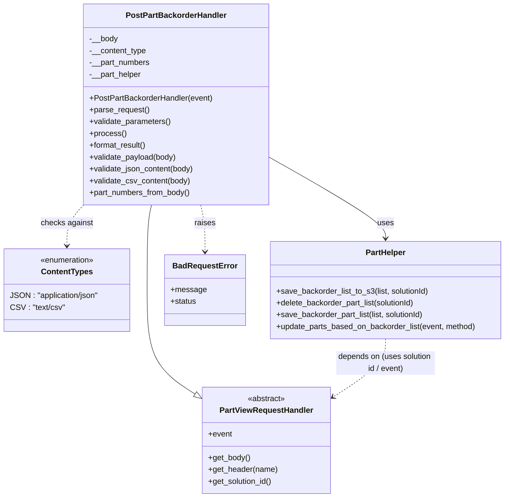

# Diagram: partview_core/partview_service/partview_service/api/part/backorder/handlers/post_part_backorder.py

> Auto-generated by Obscura crawlers

## Mermaid

### SVG

<svg id="container" width="1026.625" xmlns="http://www.w3.org/2000/svg" class="classDiagram" height="1010" viewBox="0 0 1026.625 1010" role="graphics-document document" aria-roledescription="class"><g><defs><marker id="container_class-aggregationStart" class="marker aggregation class" refX="18" refY="7" markerWidth="190" markerHeight="240" orient="auto"><path d="M 18,7 L9,13 L1,7 L9,1 Z"></path></marker></defs><defs><marker id="container_class-aggregationEnd" class="marker aggregation class" refX="1" refY="7" markerWidth="20" markerHeight="28" orient="auto"><path d="M 18,7 L9,13 L1,7 L9,1 Z"></path></marker></defs><defs><marker id="container_class-extensionStart" class="marker extension class" refX="18" refY="7" markerWidth="190" markerHeight="240" orient="auto"><path d="M 1,7 L18,13 V 1 Z"></path></marker></defs><defs><marker id="container_class-extensionEnd" class="marker extension class" refX="1" refY="7" markerWidth="20" markerHeight="28" orient="auto"><path d="M 1,1 V 13 L18,7 Z"></path></marker></defs><defs><marker id="container_class-compositionStart" class="marker composition class" refX="18" refY="7" markerWidth="190" markerHeight="240" orient="auto"><path d="M 18,7 L9,13 L1,7 L9,1 Z"></path></marker></defs><defs><marker id="container_class-compositionEnd" class="marker composition class" refX="1" refY="7" markerWidth="20" markerHeight="28" orient="auto"><path d="M 18,7 L9,13 L1,7 L9,1 Z"></path></marker></defs><defs><marker id="container_class-dependencyStart" class="marker dependency class" refX="6" refY="7" markerWidth="190" markerHeight="240" orient="auto"><path d="M 5,7 L9,13 L1,7 L9,1 Z"></path></marker></defs><defs><marker id="container_class-dependencyEnd" class="marker dependency class" refX="13" refY="7" markerWidth="20" markerHeight="28" orient="auto"><path d="M 18,7 L9,13 L14,7 L9,1 Z"></path></marker></defs><defs><marker id="container_class-lollipopStart" class="marker lollipop class" refX="13" refY="7" markerWidth="190" markerHeight="240" orient="auto"><circle stroke="black" fill="transparent" cx="7" cy="7" r="6"></circle></marker></defs><defs><marker id="container_class-lollipopEnd" class="marker lollipop class" refX="1" refY="7" markerWidth="190" markerHeight="240" orient="auto"><circle stroke="black" fill="transparent" cx="7" cy="7" r="6"></circle></marker></defs><g class="root"><g class="clusters"></g><g class="edgePaths"><path d="M312.66,416L311.21,422.167C309.761,428.333,306.861,440.667,305.411,469.5C303.961,498.333,303.961,543.667,303.961,591C303.961,638.333,303.961,687.667,320.053,722.901C336.145,758.135,368.329,779.269,384.421,789.837L400.513,800.404" id="id_PostPartBackorderHandler_PartViewRequestHandler_1" class="edge-thickness-normal edge-pattern-solid relation" style=";;;" data-edge="true" data-et="edge" data-id="id_PostPartBackorderHandler_PartViewRequestHandler_1" data-points="W3sieCI6MzEyLjY2MDM5OTM3NzU5MzM2LCJ5Ijo0MTZ9LHsieCI6MzAzLjk2MDkzNzUsInkiOjQ1M30seyJ4IjozMDMuOTYwOTM3NSwieSI6NTg5fSx7IngiOjMwMy45NjA5Mzc1LCJ5Ijo3Mzd9LHsieCI6NDE0LjkzMTY0MDYyNSwieSI6ODA5Ljg3MjY1NjQyMjMyMTh9XQ==" marker-end="url(#container_class-extensionEnd)"></path><path d="M546.98,318.553L586.171,340.961C625.361,363.369,703.741,408.184,742.931,435.759C782.121,463.333,782.121,473.667,782.121,478.833L782.121,484" id="id_PostPartBackorderHandler_PartHelper_2" class="edge-thickness-normal edge-pattern-solid relation" style=";;;" data-edge="true" data-et="edge" data-id="id_PostPartBackorderHandler_PartHelper_2" data-points="W3sieCI6NTQ2Ljk4MDQ2ODc1LCJ5IjozMTguNTUyOTg3NDA1MzU0OH0seyJ4Ijo3ODIuMTIxMDkzNzUsInkiOjQ1M30seyJ4Ijo3ODIuMTIxMDkzNzUsInkiOjQ5MH1d" marker-end="url(#container_class-dependencyEnd)"></path><path d="M408.59,416L410.04,422.167C411.489,428.333,414.389,440.667,415.839,456.5C417.289,472.333,417.289,491.667,417.289,501.333L417.289,511" id="id_PostPartBackorderHandler_BadRequestError_3" class="edge-thickness-normal edge-pattern-dashed relation" style=";;;" data-edge="true" data-et="edge" data-id="id_PostPartBackorderHandler_BadRequestError_3" data-points="W3sieCI6NDA4LjU4OTYwMDYyMjQwNjY0LCJ5Ijo0MTZ9LHsieCI6NDE3LjI4OTA2MjUsInkiOjQ1M30seyJ4Ijo0MTcuMjg5MDYyNSwieSI6NTE3fV0=" marker-end="url(#container_class-dependencyEnd)"></path><path d="M174.27,414.173L168.305,420.644C162.34,427.115,150.41,440.058,144.445,454.196C138.48,468.333,138.48,483.667,138.48,491.333L138.48,499" id="id_PostPartBackorderHandler_ContentTypes_4" class="edge-thickness-normal edge-pattern-dashed relation" style=";;;" data-edge="true" data-et="edge" data-id="id_PostPartBackorderHandler_ContentTypes_4" data-points="W3sieCI6MTc0LjI2OTUzMTI1LCJ5Ijo0MTQuMTczMTg3NTAxMDk5MDV9LHsieCI6MTM4LjQ4MDQ2ODc1LCJ5Ijo0NTN9LHsieCI6MTM4LjQ4MDQ2ODc1LCJ5Ijo1MDV9XQ==" marker-end="url(#container_class-dependencyEnd)"></path><path d="M782.121,688L782.121,696.167C782.121,704.333,782.121,720.667,764.462,740.43C746.803,760.193,711.484,783.386,693.825,794.983L676.166,806.579" id="id_PartHelper_PartViewRequestHandler_5" class="edge-thickness-normal edge-pattern-dashed relation" style=";;;" data-edge="true" data-et="edge" data-id="id_PartHelper_PartViewRequestHandler_5" data-points="W3sieCI6NzgyLjEyMTA5Mzc1LCJ5Ijo2ODh9LHsieCI6NzgyLjEyMTA5Mzc1LCJ5Ijo3Mzd9LHsieCI6NjcxLjE1MDM5MDYyNSwieSI6ODA5Ljg3MjY1NjQyMjMyMTh9XQ==" marker-end="url(#container_class-dependencyEnd)"></path></g><g class="edgeLabels"><g class="edgeLabel"><g class="label" data-id="id_PostPartBackorderHandler_PartViewRequestHandler_1" transform="translate(0, 0)"><foreignObject width="0" height="0">

</foreignObject></g></g><g class="edgeLabel" transform="translate(782.12109375, 453)"><g class="label" data-id="id_PostPartBackorderHandler_PartHelper_2" transform="translate(-16.4921875, -12)"><foreignObject width="32.984375" height="24">

uses

</foreignObject></g></g><g class="edgeLabel" transform="translate(417.2890625, 453)"><g class="label" data-id="id_PostPartBackorderHandler_BadRequestError_3" transform="translate(-21.25, -12)"><foreignObject width="42.5" height="24">

raises

</foreignObject></g></g><g class="edgeLabel" transform="translate(138.48046875, 453)"><g class="label" data-id="id_PostPartBackorderHandler_ContentTypes_4" transform="translate(-52.8125, -12)"><foreignObject width="105.625" height="24">

checks against

</foreignObject></g></g><g class="edgeLabel" transform="translate(782.12109375, 737)"><g class="label" data-id="id_PartHelper_PartViewRequestHandler_5" transform="translate(-100, -24)"><foreignObject width="200" height="48">

depends on (uses solution id / event)

</foreignObject></g></g></g><g class="nodes"><g class="node default" id="classId-ContentTypes-0" transform="translate(138.48046875, 589)"><g class="basic label-container"><path d="M-130.48046875 -84 L130.48046875 -84 L130.48046875 84 L-130.48046875 84" stroke="none" stroke-width="0" fill="#ECECFF" style=""></path><path d="M-130.48046875 -84 C-50.52088968372978 -84, 29.438689382540446 -84, 130.48046875 -84 M-130.48046875 -84 C-30.809688842031008 -84, 68.86109106593798 -84, 130.48046875 -84 M130.48046875 -84 C130.48046875 -31.656280697876326, 130.48046875 20.687438604247347, 130.48046875 84 M130.48046875 -84 C130.48046875 -49.846299313864876, 130.48046875 -15.692598627729751, 130.48046875 84 M130.48046875 84 C38.50427292663714 84, -53.471922896725715 84, -130.48046875 84 M130.48046875 84 C50.67428593724564 84, -29.131896875508716 84, -130.48046875 84 M-130.48046875 84 C-130.48046875 39.4914260676509, -130.48046875 -5.017147864698202, -130.48046875 -84 M-130.48046875 84 C-130.48046875 27.393833555026795, -130.48046875 -29.21233288994641, -130.48046875 -84" stroke="#9370DB" stroke-width="1.3" fill="none" stroke-dasharray="0 0" style=""></path></g><g class="annotation-group text" transform="translate(-55.5546875, -60)"><g class="label" style="" transform="translate(0,-12)"><foreignObject width="111.109375" height="24">

«enumeration»

</foreignObject></g></g><g class="label-group text" transform="translate(-49.9921875, -36)"><g class="label" style="font-weight: bolder" transform="translate(0,-12)"><foreignObject width="99.984375" height="24">

ContentTypes

</foreignObject></g></g><g class="members-group text" transform="translate(-118.48046875, 12)"><g class="label" style="" transform="translate(0,-12)"><foreignObject width="181.40625" height="24">

JSON : "application/json"

</foreignObject></g><g class="label" style="" transform="translate(0,12)"><foreignObject width="109.234375" height="24">

CSV : "text/csv"

</foreignObject></g></g><g class="methods-group text" transform="translate(-118.48046875, 84)"></g><g class="divider" style=""><path d="M-130.48046875 -12 C-54.56671463317825 -12, 21.3470394836435 -12, 130.48046875 -12 M-130.48046875 -12 C-68.8215946971537 -12, -7.1627206443073845 -12, 130.48046875 -12" stroke="#9370DB" stroke-width="1.3" fill="none" stroke-dasharray="0 0" style=""></path></g><g class="divider" style=""><path d="M-130.48046875 60 C-73.20162680491799 60, -15.922784859835986 60, 130.48046875 60 M-130.48046875 60 C-52.05449025929855 60, 26.371488231402907 60, 130.48046875 60" stroke="#9370DB" stroke-width="1.3" fill="none" stroke-dasharray="0 0" style=""></path></g></g><g class="node default" id="classId-PartViewRequestHandler-1" transform="translate(543.041015625, 894)"><g class="basic label-container"><path d="M-128.109375 -108 L128.109375 -108 L128.109375 108 L-128.109375 108" stroke="none" stroke-width="0" fill="#ECECFF" style=""></path><path d="M-128.109375 -108 C-72.07595857958817 -108, -16.04254215917635 -108, 128.109375 -108 M-128.109375 -108 C-67.94967435360707 -108, -7.789973707214116 -108, 128.109375 -108 M128.109375 -108 C128.109375 -49.13282353582778, 128.109375 9.734352928344435, 128.109375 108 M128.109375 -108 C128.109375 -38.111784136361464, 128.109375 31.77643172727707, 128.109375 108 M128.109375 108 C51.91723939724871 108, -24.274896205502586 108, -128.109375 108 M128.109375 108 C47.988077876474364 108, -32.13321924705127 108, -128.109375 108 M-128.109375 108 C-128.109375 31.714398472183234, -128.109375 -44.57120305563353, -128.109375 -108 M-128.109375 108 C-128.109375 60.045708722402324, -128.109375 12.091417444804648, -128.109375 -108" stroke="#9370DB" stroke-width="1.3" fill="none" stroke-dasharray="0 0" style=""></path></g><g class="annotation-group text" transform="translate(-38.609375, -84)"><g class="label" style="" transform="translate(0,-12)"><foreignObject width="77.21875" height="24">

«abstract»

</foreignObject></g></g><g class="label-group text" transform="translate(-91.359375, -60)"><g class="label" style="font-weight: bolder" transform="translate(0,-12)"><foreignObject width="182.71875" height="24">

PartViewRequestHandler

</foreignObject></g></g><g class="members-group text" transform="translate(-116.109375, -12)"><g class="label" style="" transform="translate(0,-12)"><foreignObject width="48.328125" height="24">

+event

</foreignObject></g></g><g class="methods-group text" transform="translate(-116.109375, 36)"><g class="label" style="" transform="translate(0,-12)"><foreignObject width="85.53125" height="24">

+get_body()

</foreignObject></g><g class="label" style="" transform="translate(0,12)"><foreignObject width="140.859375" height="24">

+get_header(name)

</foreignObject></g><g class="label" style="" transform="translate(0,36)"><foreignObject width="131.46875" height="24">

+get_solution_id()

</foreignObject></g></g><g class="divider" style=""><path d="M-128.109375 -36 C-30.40953296440175 -36, 67.2903090711965 -36, 128.109375 -36 M-128.109375 -36 C-37.165483174453016 -36, 53.77840865109397 -36, 128.109375 -36" stroke="#9370DB" stroke-width="1.3" fill="none" stroke-dasharray="0 0" style=""></path></g><g class="divider" style=""><path d="M-128.109375 12 C-33.69423954461604 12, 60.72089591076792 12, 128.109375 12 M-128.109375 12 C-36.24132628784979 12, 55.626722424300425 12, 128.109375 12" stroke="#9370DB" stroke-width="1.3" fill="none" stroke-dasharray="0 0" style=""></path></g></g><g class="node default" id="classId-PartHelper-2" transform="translate(782.12109375, 589)"><g class="basic label-container"><path d="M-236.50390625 -99 L236.50390625 -99 L236.50390625 99 L-236.50390625 99" stroke="none" stroke-width="0" fill="#ECECFF" style=""></path><path d="M-236.50390625 -99 C-84.8195902762073 -99, 66.86472569758541 -99, 236.50390625 -99 M-236.50390625 -99 C-77.98134811329402 -99, 80.54121002341196 -99, 236.50390625 -99 M236.50390625 -99 C236.50390625 -43.44295098871774, 236.50390625 12.11409802256452, 236.50390625 99 M236.50390625 -99 C236.50390625 -23.811181346005753, 236.50390625 51.37763730798849, 236.50390625 99 M236.50390625 99 C106.34600754026792 99, -23.81189116946416 99, -236.50390625 99 M236.50390625 99 C92.88269982397014 99, -50.738506602059715 99, -236.50390625 99 M-236.50390625 99 C-236.50390625 53.447504698970086, -236.50390625 7.895009397940171, -236.50390625 -99 M-236.50390625 99 C-236.50390625 22.979804014421845, -236.50390625 -53.04039197115631, -236.50390625 -99" stroke="#9370DB" stroke-width="1.3" fill="none" stroke-dasharray="0 0" style=""></path></g><g class="annotation-group text" transform="translate(0, -75)"></g><g class="label-group text" transform="translate(-39.5859375, -75)"><g class="label" style="font-weight: bolder" transform="translate(0,-12)"><foreignObject width="79.171875" height="24">

PartHelper

</foreignObject></g></g><g class="members-group text" transform="translate(-224.50390625, -27)"></g><g class="methods-group text" transform="translate(-224.50390625, 3)"><g class="label" style="" transform="translate(0,-12)"><foreignObject width="312.28125" height="24">

+save_backorder_list_to_s3(list, solutionId)

</foreignObject></g><g class="label" style="" transform="translate(0,12)"><foreignObject width="287.234375" height="24">

+delete_backorder_part_list(solutionId)

</foreignObject></g><g class="label" style="" transform="translate(0,36)"><foreignObject width="304.265625" height="24">

+save_backorder_part_list(list, solutionId)

</foreignObject></g><g class="label" style="" transform="translate(0,60)"><foreignObject width="409.421875" height="24">

+update_parts_based_on_backorder_list(event, method)

</foreignObject></g></g><g class="divider" style=""><path d="M-236.50390625 -51 C-94.55294203741428 -51, 47.398022175171434 -51, 236.50390625 -51 M-236.50390625 -51 C-95.65983408934446 -51, 45.184238071311086 -51, 236.50390625 -51" stroke="#9370DB" stroke-width="1.3" fill="none" stroke-dasharray="0 0" style=""></path></g><g class="divider" style=""><path d="M-236.50390625 -27 C-77.04635756975176 -27, 82.41119111049647 -27, 236.50390625 -27 M-236.50390625 -27 C-103.79547428603817 -27, 28.912957677923657 -27, 236.50390625 -27" stroke="#9370DB" stroke-width="1.3" fill="none" stroke-dasharray="0 0" style=""></path></g></g><g class="node default" id="classId-BadRequestError-3" transform="translate(417.2890625, 589)"><g class="basic label-container"><path d="M-78.328125 -72 L78.328125 -72 L78.328125 72 L-78.328125 72" stroke="none" stroke-width="0" fill="#ECECFF" style=""></path><path d="M-78.328125 -72 C-31.127225592655726 -72, 16.073673814688547 -72, 78.328125 -72 M-78.328125 -72 C-24.132226526044725 -72, 30.06367194791055 -72, 78.328125 -72 M78.328125 -72 C78.328125 -21.51442775474755, 78.328125 28.971144490504898, 78.328125 72 M78.328125 -72 C78.328125 -28.251919622027827, 78.328125 15.496160755944345, 78.328125 72 M78.328125 72 C35.13015579231116 72, -8.067813415377685 72, -78.328125 72 M78.328125 72 C25.910854571581886 72, -26.506415856836227 72, -78.328125 72 M-78.328125 72 C-78.328125 26.49141233931043, -78.328125 -19.017175321379142, -78.328125 -72 M-78.328125 72 C-78.328125 16.642379977484175, -78.328125 -38.71524004503165, -78.328125 -72" stroke="#9370DB" stroke-width="1.3" fill="none" stroke-dasharray="0 0" style=""></path></g><g class="annotation-group text" transform="translate(0, -48)"></g><g class="label-group text" transform="translate(-62.28125, -48)"><g class="label" style="font-weight: bolder" transform="translate(0,-12)"><foreignObject width="124.5625" height="24">

BadRequestError

</foreignObject></g></g><g class="members-group text" transform="translate(-66.328125, 0)"><g class="label" style="" transform="translate(0,-12)"><foreignObject width="70.375" height="24">

+message

</foreignObject></g><g class="label" style="" transform="translate(0,12)"><foreignObject width="52.390625" height="24">

+status

</foreignObject></g></g><g class="methods-group text" transform="translate(-66.328125, 72)"></g><g class="divider" style=""><path d="M-78.328125 -24 C-31.188674209092092 -24, 15.950776581815816 -24, 78.328125 -24 M-78.328125 -24 C-21.938523499942463 -24, 34.451078000115075 -24, 78.328125 -24" stroke="#9370DB" stroke-width="1.3" fill="none" stroke-dasharray="0 0" style=""></path></g><g class="divider" style=""><path d="M-78.328125 48 C-30.438633071587347 48, 17.450858856825306 48, 78.328125 48 M-78.328125 48 C-21.055966785354656 48, 36.21619142929069 48, 78.328125 48" stroke="#9370DB" stroke-width="1.3" fill="none" stroke-dasharray="0 0" style=""></path></g></g><g class="node default" id="classId-PostPartBackorderHandler-4" transform="translate(360.625, 212)"><g class="basic label-container"><path d="M-186.35546875 -204 L186.35546875 -204 L186.35546875 204 L-186.35546875 204" stroke="none" stroke-width="0" fill="#ECECFF" style=""></path><path d="M-186.35546875 -204 C-85.21730280074655 -204, 15.920863148506896 -204, 186.35546875 -204 M-186.35546875 -204 C-70.21586302445414 -204, 45.923742701091726 -204, 186.35546875 -204 M186.35546875 -204 C186.35546875 -65.97298421578097, 186.35546875 72.05403156843806, 186.35546875 204 M186.35546875 -204 C186.35546875 -101.07281690220158, 186.35546875 1.854366195596839, 186.35546875 204 M186.35546875 204 C77.09186772007286 204, -32.17173330985429 204, -186.35546875 204 M186.35546875 204 C103.51124218967963 204, 20.66701562935927 204, -186.35546875 204 M-186.35546875 204 C-186.35546875 79.22601140512681, -186.35546875 -45.547977189746376, -186.35546875 -204 M-186.35546875 204 C-186.35546875 63.267029916584505, -186.35546875 -77.46594016683099, -186.35546875 -204" stroke="#9370DB" stroke-width="1.3" fill="none" stroke-dasharray="0 0" style=""></path></g><g class="annotation-group text" transform="translate(0, -180)"></g><g class="label-group text" transform="translate(-97.8671875, -180)"><g class="label" style="font-weight: bolder" transform="translate(0,-12)"><foreignObject width="195.734375" height="24">

PostPartBackorderHandler

</foreignObject></g></g><g class="members-group text" transform="translate(-174.35546875, -132)"><g class="label" style="" transform="translate(0,-12)"><foreignObject width="57.9375" height="24">

-__body

</foreignObject></g><g class="label" style="" transform="translate(0,12)"><foreignObject width="116.578125" height="24">

-__content_type

</foreignObject></g><g class="label" style="" transform="translate(0,36)"><foreignObject width="124.015625" height="24">

-__part_numbers

</foreignObject></g><g class="label" style="" transform="translate(0,60)"><foreignObject width="107.15625" height="24">

-__part_helper

</foreignObject></g></g><g class="methods-group text" transform="translate(-174.35546875, -12)"><g class="label" style="" transform="translate(0,-12)"><foreignObject width="250.84375" height="24">

+PostPartBackorderHandler(event)

</foreignObject></g><g class="label" style="" transform="translate(0,12)"><foreignObject width="121.796875" height="24">

+parse_request()

</foreignObject></g><g class="label" style="" transform="translate(0,36)"><foreignObject width="166.546875" height="24">

+validate_parameters()

</foreignObject></g><g class="label" style="" transform="translate(0,60)"><foreignObject width="73.734375" height="24">

+process()

</foreignObject></g><g class="label" style="" transform="translate(0,84)"><foreignObject width="117.015625" height="24">

+format_result()

</foreignObject></g><g class="label" style="" transform="translate(0,108)"><foreignObject width="178.125" height="24">

+validate_payload(body)

</foreignObject></g><g class="label" style="" transform="translate(0,132)"><foreignObject width="215.078125" height="24">

+validate_json_content(body)

</foreignObject></g><g class="label" style="" transform="translate(0,156)"><foreignObject width="205.75" height="24">

+validate_csv_content(body)

</foreignObject></g><g class="label" style="" transform="translate(0,180)"><foreignObject width="207.109375" height="24">

+part_numbers_from_body()

</foreignObject></g></g><g class="divider" style=""><path d="M-186.35546875 -156 C-99.19684934058644 -156, -12.038229931172879 -156, 186.35546875 -156 M-186.35546875 -156 C-55.861441735137504 -156, 74.63258527972499 -156, 186.35546875 -156" stroke="#9370DB" stroke-width="1.3" fill="none" stroke-dasharray="0 0" style=""></path></g><g class="divider" style=""><path d="M-186.35546875 -36 C-43.67377886216016 -36, 99.00791102567968 -36, 186.35546875 -36 M-186.35546875 -36 C-69.63611374796963 -36, 47.08324125406074 -36, 186.35546875 -36" stroke="#9370DB" stroke-width="1.3" fill="none" stroke-dasharray="0 0" style=""></path></g></g></g></g></g></svg>
