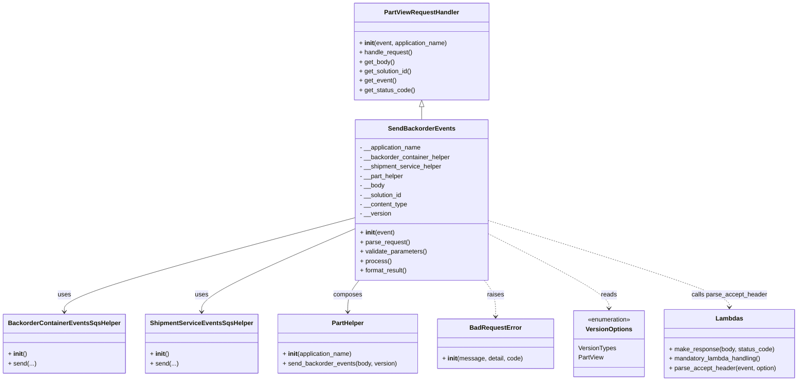

# Diagram: partview_core/partview_service/partview_service/api/part/backorder/send_backorder_events/send_backorder_events.py


> Auto-generated by Obscura crawlers

## Diagram 1



### SVG

<svg id="container" width="1979.6640625" xmlns="http://www.w3.org/2000/svg" class="classDiagram" height="968" viewBox="0 0 1979.6640625 968" role="graphics-document document" aria-roledescription="class"><style>#container{font-family:"trebuchet ms",verdana,arial,sans-serif;font-size:16px;fill:#333;}@keyframes edge-animation-frame{from{stroke-dashoffset:0;}}@keyframes dash{to{stroke-dashoffset:0;}}#container .edge-animation-slow{stroke-dasharray:9,5!important;stroke-dashoffset:900;animation:dash 50s linear infinite;stroke-linecap:round;}#container .edge-animation-fast{stroke-dasharray:9,5!important;stroke-dashoffset:900;animation:dash 20s linear infinite;stroke-linecap:round;}#container .error-icon{fill:#552222;}#container .error-text{fill:#552222;stroke:#552222;}#container .edge-thickness-normal{stroke-width:1px;}#container .edge-thickness-thick{stroke-width:3.5px;}#container .edge-pattern-solid{stroke-dasharray:0;}#container .edge-thickness-invisible{stroke-width:0;fill:none;}#container .edge-pattern-dashed{stroke-dasharray:3;}#container .edge-pattern-dotted{stroke-dasharray:2;}#container .marker{fill:#333333;stroke:#333333;}#container .marker.cross{stroke:#333333;}#container svg{font-family:"trebuchet ms",verdana,arial,sans-serif;font-size:16px;}#container p{margin:0;}#container g.classGroup text{fill:#9370DB;stroke:none;font-family:"trebuchet ms",verdana,arial,sans-serif;font-size:10px;}#container g.classGroup text .title{font-weight:bolder;}#container .nodeLabel,#container .edgeLabel{color:#131300;}#container .edgeLabel .label rect{fill:#ECECFF;}#container .label text{fill:#131300;}#container .labelBkg{background:#ECECFF;}#container .edgeLabel .label span{background:#ECECFF;}#container .classTitle{font-weight:bolder;}#container .node rect,#container .node circle,#container .node ellipse,#container .node polygon,#container .node path{fill:#ECECFF;stroke:#9370DB;stroke-width:1px;}#container .divider{stroke:#9370DB;stroke-width:1;}#container g.clickable{cursor:pointer;}#container g.classGroup rect{fill:#ECECFF;stroke:#9370DB;}#container g.classGroup line{stroke:#9370DB;stroke-width:1;}#container .classLabel .box{stroke:none;stroke-width:0;fill:#ECECFF;opacity:0.5;}#container .classLabel .label{fill:#9370DB;font-size:10px;}#container .relation{stroke:#333333;stroke-width:1;fill:none;}#container .dashed-line{stroke-dasharray:3;}#container .dotted-line{stroke-dasharray:1 2;}#container #compositionStart,#container .composition{fill:#333333!important;stroke:#333333!important;stroke-width:1;}#container #compositionEnd,#container .composition{fill:#333333!important;stroke:#333333!important;stroke-width:1;}#container #dependencyStart,#container .dependency{fill:#333333!important;stroke:#333333!important;stroke-width:1;}#container #dependencyStart,#container .dependency{fill:#333333!important;stroke:#333333!important;stroke-width:1;}#container #extensionStart,#container .extension{fill:transparent!important;stroke:#333333!important;stroke-width:1;}#container #extensionEnd,#container .extension{fill:transparent!important;stroke:#333333!important;stroke-width:1;}#container #aggregationStart,#container .aggregation{fill:transparent!important;stroke:#333333!important;stroke-width:1;}#container #aggregationEnd,#container .aggregation{fill:transparent!important;stroke:#333333!important;stroke-width:1;}#container #lollipopStart,#container .lollipop{fill:#ECECFF!important;stroke:#333333!important;stroke-width:1;}#container #lollipopEnd,#container .lollipop{fill:#ECECFF!important;stroke:#333333!important;stroke-width:1;}#container .edgeTerminals{font-size:11px;line-height:initial;}#container .classTitleText{text-anchor:middle;font-size:18px;fill:#333;}#container .label-icon{display:inline-block;height:1em;overflow:visible;vertical-align:-0.125em;}#container .node .label-icon path{fill:currentColor;stroke:revert;stroke-width:revert;}#container :root{--mermaid-font-family:"trebuchet ms",verdana,arial,sans-serif;}</style><g><defs><marker id="container_class-aggregationStart" class="marker aggregation class" refX="18" refY="7" markerWidth="190" markerHeight="240" orient="auto"><path d="M 18,7 L9,13 L1,7 L9,1 Z"></path></marker></defs><defs><marker id="container_class-aggregationEnd" class="marker aggregation class" refX="1" refY="7" markerWidth="20" markerHeight="28" orient="auto"><path d="M 18,7 L9,13 L1,7 L9,1 Z"></path></marker></defs><defs><marker id="container_class-extensionStart" class="marker extension class" refX="18" refY="7" markerWidth="190" markerHeight="240" orient="auto"><path d="M 1,7 L18,13 V 1 Z"></path></marker></defs><defs><marker id="container_class-extensionEnd" class="marker extension class" refX="1" refY="7" markerWidth="20" markerHeight="28" orient="auto"><path d="M 1,1 V 13 L18,7 Z"></path></marker></defs><defs><marker id="container_class-compositionStart" class="marker composition class" refX="18" refY="7" markerWidth="190" markerHeight="240" orient="auto"><path d="M 18,7 L9,13 L1,7 L9,1 Z"></path></marker></defs><defs><marker id="container_class-compositionEnd" class="marker composition class" refX="1" refY="7" markerWidth="20" markerHeight="28" orient="auto"><path d="M 18,7 L9,13 L1,7 L9,1 Z"></path></marker></defs><defs><marker id="container_class-dependencyStart" class="marker dependency class" refX="6" refY="7" markerWidth="190" markerHeight="240" orient="auto"><path d="M 5,7 L9,13 L1,7 L9,1 Z"></path></marker></defs><defs><marker id="container_class-dependencyEnd" class="marker dependency class" refX="13" refY="7" markerWidth="20" markerHeight="28" orient="auto"><path d="M 18,7 L9,13 L14,7 L9,1 Z"></path></marker></defs><defs><marker id="container_class-lollipopStart" class="marker lollipop class" refX="13" refY="7" markerWidth="190" markerHeight="240" orient="auto"><circle stroke="black" fill="transparent" cx="7" cy="7" r="6"></circle></marker></defs><defs><marker id="container_class-lollipopEnd" class="marker lollipop class" refX="1" refY="7" markerWidth="190" markerHeight="240" orient="auto"><circle stroke="black" fill="transparent" cx="7" cy="7" r="6"></circle></marker></defs><g class="root"><g class="clusters"></g><g class="edgePaths"><path d="M1035.982,271.25L1035.982,272.542C1035.982,273.833,1035.982,276.417,1035.982,281.875C1035.982,287.333,1035.982,295.667,1035.982,299.833L1035.982,304" id="id_PartViewRequestHandler_SendBackorderEvents_1" class="edge-thickness-normal edge-pattern-solid relation" style=";;;" data-edge="true" data-et="edge" data-id="id_PartViewRequestHandler_SendBackorderEvents_1" data-points="W3sieCI6MTAzNS45ODI0MjE4NzUsInkiOjI1NH0seyJ4IjoxMDM1Ljk4MjQyMTg3NSwieSI6Mjc5fSx7IngiOjEwMzUuOTgyNDIxODc1LCJ5IjozMDR9XQ==" marker-start="url(#container_class-extensionStart)"></path><path d="M868.693,553.761L749.738,586.301C630.783,618.841,392.872,683.92,273.916,723.627C154.961,763.333,154.961,777.667,154.961,784.833L154.961,792" id="id_SendBackorderEvents_BackorderContainerEventsSqsHelper_2" class="edge-thickness-normal edge-pattern-solid relation" style=";;;" data-edge="true" data-et="edge" data-id="id_SendBackorderEvents_BackorderContainerEventsSqsHelper_2" data-points="W3sieCI6ODY4LjY5MzM1OTM3NSwieSI6NTUzLjc2MTI3MjMxNTczNzl9LHsieCI6MTU0Ljk2MDkzNzUsInkiOjc0OX0seyJ4IjoxNTQuOTYwOTM3NSwieSI6Nzk4fV0=" marker-end="url(#container_class-dependencyEnd)"></path><path d="M868.693,581.507L805.162,609.422C741.632,637.338,614.57,693.169,551.039,728.251C487.508,763.333,487.508,777.667,487.508,784.833L487.508,792" id="id_SendBackorderEvents_ShipmentServiceEventsSqsHelper_3" class="edge-thickness-normal edge-pattern-solid relation" style=";;;" data-edge="true" data-et="edge" data-id="id_SendBackorderEvents_ShipmentServiceEventsSqsHelper_3" data-points="W3sieCI6ODY4LjY5MzM1OTM3NSwieSI6NTgxLjUwNjg5MjMzOTkwNTh9LHsieCI6NDg3LjUwNzgxMjUsInkiOjc0OX0seyJ4Ijo0ODcuNTA3ODEyNSwieSI6Nzk4fV0=" marker-end="url(#container_class-dependencyEnd)"></path><path d="M878.768,712L874.016,718.167C869.263,724.333,859.759,736.667,855.006,750C850.254,763.333,850.254,777.667,850.254,784.833L850.254,792" id="id_SendBackorderEvents_PartHelper_4" class="edge-thickness-normal edge-pattern-solid relation" style=";;;" data-edge="true" data-et="edge" data-id="id_SendBackorderEvents_PartHelper_4" data-points="W3sieCI6ODc4Ljc2ODI0MjY3Mzc1NTEsInkiOjcxMn0seyJ4Ijo4NTAuMjUzOTA2MjUsInkiOjc0OX0seyJ4Ijo4NTAuMjUzOTA2MjUsInkiOjc5OH1d" marker-end="url(#container_class-dependencyEnd)"></path><path d="M1193.197,712L1197.949,718.167C1202.701,724.333,1212.206,736.667,1216.959,752C1221.711,767.333,1221.711,785.667,1221.711,794.833L1221.711,804" id="id_SendBackorderEvents_BadRequestError_5" class="edge-thickness-normal edge-pattern-dashed relation" style=";;;" data-edge="true" data-et="edge" data-id="id_SendBackorderEvents_BadRequestError_5" data-points="W3sieCI6MTE5My4xOTY2MDEwNzYyNDQ5LCJ5Ijo3MTJ9LHsieCI6MTIyMS43MTA5Mzc1LCJ5Ijo3NDl9LHsieCI6MTIyMS43MTA5Mzc1LCJ5Ijo4MTB9XQ==" marker-end="url(#container_class-dependencyEnd)"></path><path d="M1203.271,594.219L1253.325,620.016C1303.378,645.813,1403.484,697.406,1453.537,728.87C1503.59,760.333,1503.59,771.667,1503.59,777.333L1503.59,783" id="id_SendBackorderEvents_VersionOptions_6" class="edge-thickness-normal edge-pattern-dashed relation" style=";;;" data-edge="true" data-et="edge" data-id="id_SendBackorderEvents_VersionOptions_6" data-points="W3sieCI6MTIwMy4yNzE0ODQzNzUsInkiOjU5NC4yMTkwNDIyNDg4MTQ4fSx7IngiOjE1MDMuNTg5ODQzNzUsInkiOjc0OX0seyJ4IjoxNTAzLjU4OTg0Mzc1LCJ5Ijo3ODl9XQ==" marker-end="url(#container_class-dependencyEnd)"></path><path d="M1203.271,560.33L1303.796,591.775C1404.32,623.22,1605.369,686.11,1705.894,722.722C1806.418,759.333,1806.418,769.667,1806.418,774.833L1806.418,780" id="id_SendBackorderEvents_Lambdas_7" class="edge-thickness-normal edge-pattern-dashed relation" style=";;;" data-edge="true" data-et="edge" data-id="id_SendBackorderEvents_Lambdas_7" data-points="W3sieCI6MTIwMy4yNzE0ODQzNzUsInkiOjU2MC4zMjk3MDM5MjY2MDR9LHsieCI6MTgwNi40MTc5Njg3NSwieSI6NzQ5fSx7IngiOjE4MDYuNDE3OTY4NzUsInkiOjc4Nn1d" marker-end="url(#container_class-dependencyEnd)"></path></g><g class="edgeLabels"><g class="edgeLabel"><g class="label" data-id="id_PartViewRequestHandler_SendBackorderEvents_1" transform="translate(0, 0)"><foreignObject width="0" height="0"><div xmlns="http://www.w3.org/1999/xhtml" class="labelBkg" style="display: table-cell; white-space: nowrap; line-height: 1.5; max-width: 200px; text-align: center;"><span class="edgeLabel"></span></div></foreignObject></g></g><g class="edgeLabel" transform="translate(154.9609375, 749)"><g class="label" data-id="id_SendBackorderEvents_BackorderContainerEventsSqsHelper_2" transform="translate(-16.4921875, -12)"><foreignObject width="32.984375" height="24"><div xmlns="http://www.w3.org/1999/xhtml" class="labelBkg" style="display: table-cell; white-space: nowrap; line-height: 1.5; max-width: 200px; text-align: center;"><span class="edgeLabel"><p>uses</p></span></div></foreignObject></g></g><g class="edgeLabel" transform="translate(487.5078125, 749)"><g class="label" data-id="id_SendBackorderEvents_ShipmentServiceEventsSqsHelper_3" transform="translate(-16.4921875, -12)"><foreignObject width="32.984375" height="24"><div xmlns="http://www.w3.org/1999/xhtml" class="labelBkg" style="display: table-cell; white-space: nowrap; line-height: 1.5; max-width: 200px; text-align: center;"><span class="edgeLabel"><p>uses</p></span></div></foreignObject></g></g><g class="edgeLabel" transform="translate(850.25390625, 749)"><g class="label" data-id="id_SendBackorderEvents_PartHelper_4" transform="translate(-36.453125, -12)"><foreignObject width="72.90625" height="24"><div xmlns="http://www.w3.org/1999/xhtml" class="labelBkg" style="display: table-cell; white-space: nowrap; line-height: 1.5; max-width: 200px; text-align: center;"><span class="edgeLabel"><p>composes</p></span></div></foreignObject></g></g><g class="edgeLabel" transform="translate(1221.7109375, 749)"><g class="label" data-id="id_SendBackorderEvents_BadRequestError_5" transform="translate(-21.25, -12)"><foreignObject width="42.5" height="24"><div xmlns="http://www.w3.org/1999/xhtml" class="labelBkg" style="display: table-cell; white-space: nowrap; line-height: 1.5; max-width: 200px; text-align: center;"><span class="edgeLabel"><p>raises</p></span></div></foreignObject></g></g><g class="edgeLabel" transform="translate(1503.58984375, 749)"><g class="label" data-id="id_SendBackorderEvents_VersionOptions_6" transform="translate(-20.0078125, -12)"><foreignObject width="40.015625" height="24"><div xmlns="http://www.w3.org/1999/xhtml" class="labelBkg" style="display: table-cell; white-space: nowrap; line-height: 1.5; max-width: 200px; text-align: center;"><span class="edgeLabel"><p>reads</p></span></div></foreignObject></g></g><g class="edgeLabel" transform="translate(1806.41796875, 749)"><g class="label" data-id="id_SendBackorderEvents_Lambdas_7" transform="translate(-95.8828125, -12)"><foreignObject width="191.765625" height="24"><div xmlns="http://www.w3.org/1999/xhtml" class="labelBkg" style="display: table-cell; white-space: nowrap; line-height: 1.5; max-width: 200px; text-align: center;"><span class="edgeLabel"><p>calls parse_accept_header</p></span></div></foreignObject></g></g></g><g class="nodes"><g class="node default" id="classId-SendBackorderEvents-0" transform="translate(1035.982421875, 508)"><g class="basic label-container"><path d="M-167.2890625 -204 L167.2890625 -204 L167.2890625 204 L-167.2890625 204" stroke="none" stroke-width="0" fill="#ECECFF" style=""></path><path d="M-167.2890625 -204 C-62.624176008797036 -204, 42.04071048240593 -204, 167.2890625 -204 M-167.2890625 -204 C-67.35275906750502 -204, 32.58354436498996 -204, 167.2890625 -204 M167.2890625 -204 C167.2890625 -58.481048816304394, 167.2890625 87.03790236739121, 167.2890625 204 M167.2890625 -204 C167.2890625 -89.04553223504139, 167.2890625 25.908935529917215, 167.2890625 204 M167.2890625 204 C47.97996635072249 204, -71.32912979855502 204, -167.2890625 204 M167.2890625 204 C75.39156704117039 204, -16.50592841765922 204, -167.2890625 204 M-167.2890625 204 C-167.2890625 83.72127479612462, -167.2890625 -36.557450407750764, -167.2890625 -204 M-167.2890625 204 C-167.2890625 116.68038634894762, -167.2890625 29.360772697895243, -167.2890625 -204" stroke="#9370DB" stroke-width="1.3" fill="none" stroke-dasharray="0 0" style=""></path></g><g class="annotation-group text" transform="translate(0, -180)"></g><g class="label-group text" transform="translate(-80.015625, -180)"><g class="label" style="font-weight: bolder" transform="translate(0,-12)"><foreignObject width="160.03125" height="24"><div xmlns="http://www.w3.org/1999/xhtml" style="display: table-cell; white-space: nowrap; line-height: 1.5; max-width: 207px; text-align: center;"><span class="nodeLabel markdown-node-label" style=""><p>SendBackorderEvents</p></span></div></foreignObject></g></g><g class="members-group text" transform="translate(-155.2890625, -132)"><g class="label" style="" transform="translate(0,-12)"><foreignObject width="157.796875" height="24"><div xmlns="http://www.w3.org/1999/xhtml" style="display: table-cell; white-space: nowrap; line-height: 1.5; max-width: 215px; text-align: center;"><span class="nodeLabel markdown-node-label" style=""><p>- __application_name</p></span></div></foreignObject></g><g class="label" style="" transform="translate(0,12)"><foreignObject width="230.5625" height="24"><div xmlns="http://www.w3.org/1999/xhtml" style="display: table-cell; white-space: nowrap; line-height: 1.5; max-width: 289px; text-align: center;"><span class="nodeLabel markdown-node-label" style=""><p>- __backorder_container_helper</p></span></div></foreignObject></g><g class="label" style="" transform="translate(0,36)"><foreignObject width="209.921875" height="24"><div xmlns="http://www.w3.org/1999/xhtml" style="display: table-cell; white-space: nowrap; line-height: 1.5; max-width: 268px; text-align: center;"><span class="nodeLabel markdown-node-label" style=""><p>- __shipment_service_helper</p></span></div></foreignObject></g><g class="label" style="" transform="translate(0,60)"><foreignObject width="112.6875" height="24"><div xmlns="http://www.w3.org/1999/xhtml" style="display: table-cell; white-space: nowrap; line-height: 1.5; max-width: 171px; text-align: center;"><span class="nodeLabel markdown-node-label" style=""><p>- __part_helper</p></span></div></foreignObject></g><g class="label" style="" transform="translate(0,84)"><foreignObject width="63.46875" height="24"><div xmlns="http://www.w3.org/1999/xhtml" style="display: table-cell; white-space: nowrap; line-height: 1.5; max-width: 121px; text-align: center;"><span class="nodeLabel markdown-node-label" style=""><p>- __body</p></span></div></foreignObject></g><g class="label" style="" transform="translate(0,108)"><foreignObject width="109.40625" height="24"><div xmlns="http://www.w3.org/1999/xhtml" style="display: table-cell; white-space: nowrap; line-height: 1.5; max-width: 167px; text-align: center;"><span class="nodeLabel markdown-node-label" style=""><p>- __solution_id</p></span></div></foreignObject></g><g class="label" style="" transform="translate(0,132)"><foreignObject width="122.109375" height="24"><div xmlns="http://www.w3.org/1999/xhtml" style="display: table-cell; white-space: nowrap; line-height: 1.5; max-width: 179px; text-align: center;"><span class="nodeLabel markdown-node-label" style=""><p>- __content_type</p></span></div></foreignObject></g><g class="label" style="" transform="translate(0,156)"><foreignObject width="79.859375" height="24"><div xmlns="http://www.w3.org/1999/xhtml" style="display: table-cell; white-space: nowrap; line-height: 1.5; max-width: 137px; text-align: center;"><span class="nodeLabel markdown-node-label" style=""><p>- __version</p></span></div></foreignObject></g></g><g class="methods-group text" transform="translate(-155.2890625, 84)"><g class="label" style="" transform="translate(0,-12)"><foreignObject width="87.390625" height="24"><div xmlns="http://www.w3.org/1999/xhtml" style="display: table-cell; white-space: nowrap; line-height: 1.5; max-width: 177px; text-align: center;"><span class="nodeLabel markdown-node-label" style=""><p>+ <strong>init</strong>(event)</p></span></div></foreignObject></g><g class="label" style="" transform="translate(0,12)"><foreignObject width="126.046875" height="24"><div xmlns="http://www.w3.org/1999/xhtml" style="display: table-cell; white-space: nowrap; line-height: 1.5; max-width: 183px; text-align: center;"><span class="nodeLabel markdown-node-label" style=""><p>+ parse_request()</p></span></div></foreignObject></g><g class="label" style="" transform="translate(0,36)"><foreignObject width="170.953125" height="24"><div xmlns="http://www.w3.org/1999/xhtml" style="display: table-cell; white-space: nowrap; line-height: 1.5; max-width: 228px; text-align: center;"><span class="nodeLabel markdown-node-label" style=""><p>+ validate_parameters()</p></span></div></foreignObject></g><g class="label" style="" transform="translate(0,60)"><foreignObject width="77.96875" height="24"><div xmlns="http://www.w3.org/1999/xhtml" style="display: table-cell; white-space: nowrap; line-height: 1.5; max-width: 135px; text-align: center;"><span class="nodeLabel markdown-node-label" style=""><p>+ process()</p></span></div></foreignObject></g><g class="label" style="" transform="translate(0,84)"><foreignObject width="121.5" height="24"><div xmlns="http://www.w3.org/1999/xhtml" style="display: table-cell; white-space: nowrap; line-height: 1.5; max-width: 179px; text-align: center;"><span class="nodeLabel markdown-node-label" style=""><p>+ format_result()</p></span></div></foreignObject></g></g><g class="divider" style=""><path d="M-167.2890625 -156 C-66.13335025400471 -156, 35.02236199199058 -156, 167.2890625 -156 M-167.2890625 -156 C-85.7207183249509 -156, -4.152374149901789 -156, 167.2890625 -156" stroke="#9370DB" stroke-width="1.3" fill="none" stroke-dasharray="0 0" style=""></path></g><g class="divider" style=""><path d="M-167.2890625 60 C-44.49026550061609 60, 78.30853149876782 60, 167.2890625 60 M-167.2890625 60 C-60.014998442211635 60, 47.25906561557673 60, 167.2890625 60" stroke="#9370DB" stroke-width="1.3" fill="none" stroke-dasharray="0 0" style=""></path></g></g><g class="node default" id="classId-PartViewRequestHandler-1" transform="translate(1035.982421875, 131)"><g class="basic label-container"><path d="M-170.9140625 -123 L170.9140625 -123 L170.9140625 123 L-170.9140625 123" stroke="none" stroke-width="0" fill="#ECECFF" style=""></path><path d="M-170.9140625 -123 C-37.60087117781538 -123, 95.71232014436924 -123, 170.9140625 -123 M-170.9140625 -123 C-77.37550251943317 -123, 16.16305746113366 -123, 170.9140625 -123 M170.9140625 -123 C170.9140625 -55.83891710890188, 170.9140625 11.322165782196237, 170.9140625 123 M170.9140625 -123 C170.9140625 -25.75686302345875, 170.9140625 71.4862739530825, 170.9140625 123 M170.9140625 123 C60.37862877085223 123, -50.15680495829554 123, -170.9140625 123 M170.9140625 123 C79.62439274068552 123, -11.665277018628956 123, -170.9140625 123 M-170.9140625 123 C-170.9140625 70.6696704489077, -170.9140625 18.33934089781539, -170.9140625 -123 M-170.9140625 123 C-170.9140625 46.996801527529456, -170.9140625 -29.006396944941088, -170.9140625 -123" stroke="#9370DB" stroke-width="1.3" fill="none" stroke-dasharray="0 0" style=""></path></g><g class="annotation-group text" transform="translate(0, -99)"></g><g class="label-group text" transform="translate(-91.359375, -99)"><g class="label" style="font-weight: bolder" transform="translate(0,-12)"><foreignObject width="182.71875" height="24"><div xmlns="http://www.w3.org/1999/xhtml" style="display: table-cell; white-space: nowrap; line-height: 1.5; max-width: 231px; text-align: center;"><span class="nodeLabel markdown-node-label" style=""><p>PartViewRequestHandler</p></span></div></foreignObject></g></g><g class="members-group text" transform="translate(-158.9140625, -51)"></g><g class="methods-group text" transform="translate(-158.9140625, -21)"><g class="label" style="" transform="translate(0,-12)"><foreignObject width="226.46875" height="24"><div xmlns="http://www.w3.org/1999/xhtml" style="display: table-cell; white-space: nowrap; line-height: 1.5; max-width: 317px; text-align: center;"><span class="nodeLabel markdown-node-label" style=""><p>+ <strong>init</strong>(event, application_name)</p></span></div></foreignObject></g><g class="label" style="" transform="translate(0,12)"><foreignObject width="136.21875" height="24"><div xmlns="http://www.w3.org/1999/xhtml" style="display: table-cell; white-space: nowrap; line-height: 1.5; max-width: 194px; text-align: center;"><span class="nodeLabel markdown-node-label" style=""><p>+ handle_request()</p></span></div></foreignObject></g><g class="label" style="" transform="translate(0,36)"><foreignObject width="89.765625" height="24"><div xmlns="http://www.w3.org/1999/xhtml" style="display: table-cell; white-space: nowrap; line-height: 1.5; max-width: 147px; text-align: center;"><span class="nodeLabel markdown-node-label" style=""><p>+ get_body()</p></span></div></foreignObject></g><g class="label" style="" transform="translate(0,60)"><foreignObject width="135.703125" height="24"><div xmlns="http://www.w3.org/1999/xhtml" style="display: table-cell; white-space: nowrap; line-height: 1.5; max-width: 193px; text-align: center;"><span class="nodeLabel markdown-node-label" style=""><p>+ get_solution_id()</p></span></div></foreignObject></g><g class="label" style="" transform="translate(0,84)"><foreignObject width="93.5" height="24"><div xmlns="http://www.w3.org/1999/xhtml" style="display: table-cell; white-space: nowrap; line-height: 1.5; max-width: 151px; text-align: center;"><span class="nodeLabel markdown-node-label" style=""><p>+ get_event()</p></span></div></foreignObject></g><g class="label" style="" transform="translate(0,108)"><foreignObject width="140.515625" height="24"><div xmlns="http://www.w3.org/1999/xhtml" style="display: table-cell; white-space: nowrap; line-height: 1.5; max-width: 198px; text-align: center;"><span class="nodeLabel markdown-node-label" style=""><p>+ get_status_code()</p></span></div></foreignObject></g></g><g class="divider" style=""><path d="M-170.9140625 -75 C-55.34600284447825 -75, 60.2220568110435 -75, 170.9140625 -75 M-170.9140625 -75 C-99.86580187780251 -75, -28.817541255605022 -75, 170.9140625 -75" stroke="#9370DB" stroke-width="1.3" fill="none" stroke-dasharray="0 0" style=""></path></g><g class="divider" style=""><path d="M-170.9140625 -51 C-46.733892681261864 -51, 77.44627713747627 -51, 170.9140625 -51 M-170.9140625 -51 C-53.44589234856943 -51, 64.02227780286114 -51, 170.9140625 -51" stroke="#9370DB" stroke-width="1.3" fill="none" stroke-dasharray="0 0" style=""></path></g></g><g class="node default" id="classId-BackorderContainerEventsSqsHelper-2" transform="translate(154.9609375, 873)"><g class="basic label-container"><path d="M-146.9609375 -75 L146.9609375 -75 L146.9609375 75 L-146.9609375 75" stroke="none" stroke-width="0" fill="#ECECFF" style=""></path><path d="M-146.9609375 -75 C-69.67928298007013 -75, 7.602371539859746 -75, 146.9609375 -75 M-146.9609375 -75 C-58.99489471621942 -75, 28.97114806756116 -75, 146.9609375 -75 M146.9609375 -75 C146.9609375 -20.605440434914648, 146.9609375 33.789119130170704, 146.9609375 75 M146.9609375 -75 C146.9609375 -18.72617434862933, 146.9609375 37.54765130274134, 146.9609375 75 M146.9609375 75 C32.63055319116734 75, -81.69983111766533 75, -146.9609375 75 M146.9609375 75 C67.50939158970685 75, -11.942154320586297 75, -146.9609375 75 M-146.9609375 75 C-146.9609375 22.03022013710339, -146.9609375 -30.939559725793217, -146.9609375 -75 M-146.9609375 75 C-146.9609375 35.16303873727299, -146.9609375 -4.673922525454017, -146.9609375 -75" stroke="#9370DB" stroke-width="1.3" fill="none" stroke-dasharray="0 0" style=""></path></g><g class="annotation-group text" transform="translate(0, -51)"></g><g class="label-group text" transform="translate(-134.9609375, -51)"><g class="label" style="font-weight: bolder" transform="translate(0,-12)"><foreignObject width="269.921875" height="24"><div xmlns="http://www.w3.org/1999/xhtml" style="display: table-cell; white-space: nowrap; line-height: 1.5; max-width: 317px; text-align: center;"><span class="nodeLabel markdown-node-label" style=""><p>BackorderContainerEventsSqsHelper</p></span></div></foreignObject></g></g><g class="members-group text" transform="translate(-134.9609375, -3)"></g><g class="methods-group text" transform="translate(-134.9609375, 27)"><g class="label" style="" transform="translate(0,-12)"><foreignObject width="47.046875" height="24"><div xmlns="http://www.w3.org/1999/xhtml" style="display: table-cell; white-space: nowrap; line-height: 1.5; max-width: 137px; text-align: center;"><span class="nodeLabel markdown-node-label" style=""><p>+ <strong>init</strong>()</p></span></div></foreignObject></g><g class="label" style="" transform="translate(0,12)"><foreignObject width="69.25" height="24"><div xmlns="http://www.w3.org/1999/xhtml" style="display: table-cell; white-space: nowrap; line-height: 1.5; max-width: 127px; text-align: center;"><span class="nodeLabel markdown-node-label" style=""><p>+ send(...)</p></span></div></foreignObject></g></g><g class="divider" style=""><path d="M-146.9609375 -27 C-71.45765441981666 -27, 4.045628660366674 -27, 146.9609375 -27 M-146.9609375 -27 C-39.211600565641774 -27, 68.53773636871645 -27, 146.9609375 -27" stroke="#9370DB" stroke-width="1.3" fill="none" stroke-dasharray="0 0" style=""></path></g><g class="divider" style=""><path d="M-146.9609375 -3 C-31.430439548230623 -3, 84.10005840353875 -3, 146.9609375 -3 M-146.9609375 -3 C-34.395971117356325 -3, 78.16899526528735 -3, 146.9609375 -3" stroke="#9370DB" stroke-width="1.3" fill="none" stroke-dasharray="0 0" style=""></path></g></g><g class="node default" id="classId-ShipmentServiceEventsSqsHelper-3" transform="translate(487.5078125, 873)"><g class="basic label-container"><path d="M-135.5859375 -75 L135.5859375 -75 L135.5859375 75 L-135.5859375 75" stroke="none" stroke-width="0" fill="#ECECFF" style=""></path><path d="M-135.5859375 -75 C-30.397248014176213 -75, 74.79144147164757 -75, 135.5859375 -75 M-135.5859375 -75 C-52.72819088837669 -75, 30.129555723246625 -75, 135.5859375 -75 M135.5859375 -75 C135.5859375 -36.854763510958186, 135.5859375 1.2904729780836277, 135.5859375 75 M135.5859375 -75 C135.5859375 -27.98115057370986, 135.5859375 19.037698852580277, 135.5859375 75 M135.5859375 75 C38.283372821234465 75, -59.01919185753107 75, -135.5859375 75 M135.5859375 75 C67.94792480702044 75, 0.30991211404088403 75, -135.5859375 75 M-135.5859375 75 C-135.5859375 39.57886495776964, -135.5859375 4.157729915539278, -135.5859375 -75 M-135.5859375 75 C-135.5859375 24.591814217156944, -135.5859375 -25.81637156568611, -135.5859375 -75" stroke="#9370DB" stroke-width="1.3" fill="none" stroke-dasharray="0 0" style=""></path></g><g class="annotation-group text" transform="translate(0, -51)"></g><g class="label-group text" transform="translate(-123.5859375, -51)"><g class="label" style="font-weight: bolder" transform="translate(0,-12)"><foreignObject width="247.171875" height="24"><div xmlns="http://www.w3.org/1999/xhtml" style="display: table-cell; white-space: nowrap; line-height: 1.5; max-width: 294px; text-align: center;"><span class="nodeLabel markdown-node-label" style=""><p>ShipmentServiceEventsSqsHelper</p></span></div></foreignObject></g></g><g class="members-group text" transform="translate(-123.5859375, -3)"></g><g class="methods-group text" transform="translate(-123.5859375, 27)"><g class="label" style="" transform="translate(0,-12)"><foreignObject width="47.046875" height="24"><div xmlns="http://www.w3.org/1999/xhtml" style="display: table-cell; white-space: nowrap; line-height: 1.5; max-width: 137px; text-align: center;"><span class="nodeLabel markdown-node-label" style=""><p>+ <strong>init</strong>()</p></span></div></foreignObject></g><g class="label" style="" transform="translate(0,12)"><foreignObject width="69.25" height="24"><div xmlns="http://www.w3.org/1999/xhtml" style="display: table-cell; white-space: nowrap; line-height: 1.5; max-width: 127px; text-align: center;"><span class="nodeLabel markdown-node-label" style=""><p>+ send(...)</p></span></div></foreignObject></g></g><g class="divider" style=""><path d="M-135.5859375 -27 C-45.867187966822655 -27, 43.85156156635469 -27, 135.5859375 -27 M-135.5859375 -27 C-50.290055457393294 -27, 35.00582658521341 -27, 135.5859375 -27" stroke="#9370DB" stroke-width="1.3" fill="none" stroke-dasharray="0 0" style=""></path></g><g class="divider" style=""><path d="M-135.5859375 -3 C-49.05853409918342 -3, 37.46886930163316 -3, 135.5859375 -3 M-135.5859375 -3 C-69.93321697205948 -3, -4.280496444118967 -3, 135.5859375 -3" stroke="#9370DB" stroke-width="1.3" fill="none" stroke-dasharray="0 0" style=""></path></g></g><g class="node default" id="classId-PartHelper-4" transform="translate(850.25390625, 873)"><g class="basic label-container"><path d="M-177.16015625 -75 L177.16015625 -75 L177.16015625 75 L-177.16015625 75" stroke="none" stroke-width="0" fill="#ECECFF" style=""></path><path d="M-177.16015625 -75 C-97.09653010912675 -75, -17.032903968253493 -75, 177.16015625 -75 M-177.16015625 -75 C-85.69256501930377 -75, 5.775026211392458 -75, 177.16015625 -75 M177.16015625 -75 C177.16015625 -38.23710626398509, 177.16015625 -1.474212527970181, 177.16015625 75 M177.16015625 -75 C177.16015625 -39.72785769316264, 177.16015625 -4.455715386325281, 177.16015625 75 M177.16015625 75 C85.27639006578458 75, -6.607376118430835 75, -177.16015625 75 M177.16015625 75 C80.0199180185126 75, -17.120320212974804 75, -177.16015625 75 M-177.16015625 75 C-177.16015625 24.88617715065957, -177.16015625 -25.22764569868086, -177.16015625 -75 M-177.16015625 75 C-177.16015625 40.505240455692224, -177.16015625 6.010480911384448, -177.16015625 -75" stroke="#9370DB" stroke-width="1.3" fill="none" stroke-dasharray="0 0" style=""></path></g><g class="annotation-group text" transform="translate(0, -51)"></g><g class="label-group text" transform="translate(-39.5859375, -51)"><g class="label" style="font-weight: bolder" transform="translate(0,-12)"><foreignObject width="79.171875" height="24"><div xmlns="http://www.w3.org/1999/xhtml" style="display: table-cell; white-space: nowrap; line-height: 1.5; max-width: 129px; text-align: center;"><span class="nodeLabel markdown-node-label" style=""><p>PartHelper</p></span></div></foreignObject></g></g><g class="members-group text" transform="translate(-165.16015625, -3)"></g><g class="methods-group text" transform="translate(-165.16015625, 27)"><g class="label" style="" transform="translate(0,-12)"><foreignObject width="177.984375" height="24"><div xmlns="http://www.w3.org/1999/xhtml" style="display: table-cell; white-space: nowrap; line-height: 1.5; max-width: 268px; text-align: center;"><span class="nodeLabel markdown-node-label" style=""><p>+ <strong>init</strong>(application_name)</p></span></div></foreignObject></g><g class="label" style="" transform="translate(0,12)"><foreignObject width="290.734375" height="24"><div xmlns="http://www.w3.org/1999/xhtml" style="display: table-cell; white-space: nowrap; line-height: 1.5; max-width: 348px; text-align: center;"><span class="nodeLabel markdown-node-label" style=""><p>+ send_backorder_events(body, version)</p></span></div></foreignObject></g></g><g class="divider" style=""><path d="M-177.16015625 -27 C-83.39540466176838 -27, 10.369346926463237 -27, 177.16015625 -27 M-177.16015625 -27 C-36.806713938881614 -27, 103.54672837223677 -27, 177.16015625 -27" stroke="#9370DB" stroke-width="1.3" fill="none" stroke-dasharray="0 0" style=""></path></g><g class="divider" style=""><path d="M-177.16015625 -3 C-44.79459062876157 -3, 87.57097499247686 -3, 177.16015625 -3 M-177.16015625 -3 C-97.40150897603887 -3, -17.642861702077738 -3, 177.16015625 -3" stroke="#9370DB" stroke-width="1.3" fill="none" stroke-dasharray="0 0" style=""></path></g></g><g class="node default" id="classId-BadRequestError-5" transform="translate(1221.7109375, 873)"><g class="basic label-container"><path d="M-144.296875 -63 L144.296875 -63 L144.296875 63 L-144.296875 63" stroke="none" stroke-width="0" fill="#ECECFF" style=""></path><path d="M-144.296875 -63 C-39.80943240979613 -63, 64.67801018040774 -63, 144.296875 -63 M-144.296875 -63 C-72.69206935958906 -63, -1.087263719178111 -63, 144.296875 -63 M144.296875 -63 C144.296875 -34.49380481702957, 144.296875 -5.98760963405914, 144.296875 63 M144.296875 -63 C144.296875 -12.723421151513548, 144.296875 37.5531576969729, 144.296875 63 M144.296875 63 C39.99273077024384 63, -64.31141345951232 63, -144.296875 63 M144.296875 63 C85.9235029604473 63, 27.55013092089459 63, -144.296875 63 M-144.296875 63 C-144.296875 28.951174020186805, -144.296875 -5.09765195962639, -144.296875 -63 M-144.296875 63 C-144.296875 19.61953920354646, -144.296875 -23.76092159290708, -144.296875 -63" stroke="#9370DB" stroke-width="1.3" fill="none" stroke-dasharray="0 0" style=""></path></g><g class="annotation-group text" transform="translate(0, -39)"></g><g class="label-group text" transform="translate(-62.28125, -39)"><g class="label" style="font-weight: bolder" transform="translate(0,-12)"><foreignObject width="124.5625" height="24"><div xmlns="http://www.w3.org/1999/xhtml" style="display: table-cell; white-space: nowrap; line-height: 1.5; max-width: 174px; text-align: center;"><span class="nodeLabel markdown-node-label" style=""><p>BadRequestError</p></span></div></foreignObject></g></g><g class="members-group text" transform="translate(-132.296875, 9)"></g><g class="methods-group text" transform="translate(-132.296875, 39)"><g class="label" style="" transform="translate(0,-12)"><foreignObject width="202.3125" height="24"><div xmlns="http://www.w3.org/1999/xhtml" style="display: table-cell; white-space: nowrap; line-height: 1.5; max-width: 292px; text-align: center;"><span class="nodeLabel markdown-node-label" style=""><p>+ <strong>init</strong>(message, detail, code)</p></span></div></foreignObject></g></g><g class="divider" style=""><path d="M-144.296875 -15 C-40.3974975524299 -15, 63.501879895140206 -15, 144.296875 -15 M-144.296875 -15 C-68.46718161000081 -15, 7.3625117799983855 -15, 144.296875 -15" stroke="#9370DB" stroke-width="1.3" fill="none" stroke-dasharray="0 0" style=""></path></g><g class="divider" style=""><path d="M-144.296875 9 C-65.96681985130805 9, 12.363235297383909 9, 144.296875 9 M-144.296875 9 C-62.09130084195719 9, 20.114273316085615 9, 144.296875 9" stroke="#9370DB" stroke-width="1.3" fill="none" stroke-dasharray="0 0" style=""></path></g></g><g class="node default" id="classId-VersionOptions-6" transform="translate(1503.58984375, 873)"><g class="basic label-container"><path d="M-87.58203125 -84 L87.58203125 -84 L87.58203125 84 L-87.58203125 84" stroke="none" stroke-width="0" fill="#ECECFF" style=""></path><path d="M-87.58203125 -84 C-29.061094583994787 -84, 29.459842082010425 -84, 87.58203125 -84 M-87.58203125 -84 C-26.766974552697476 -84, 34.04808214460505 -84, 87.58203125 -84 M87.58203125 -84 C87.58203125 -29.10539709276209, 87.58203125 25.78920581447582, 87.58203125 84 M87.58203125 -84 C87.58203125 -33.43752184399231, 87.58203125 17.124956312015385, 87.58203125 84 M87.58203125 84 C46.07650147071649 84, 4.570971691432973 84, -87.58203125 84 M87.58203125 84 C44.78068103054095 84, 1.9793308110818941 84, -87.58203125 84 M-87.58203125 84 C-87.58203125 36.53652216401674, -87.58203125 -10.926955671966525, -87.58203125 -84 M-87.58203125 84 C-87.58203125 32.73821718409781, -87.58203125 -18.523565631804374, -87.58203125 -84" stroke="#9370DB" stroke-width="1.3" fill="none" stroke-dasharray="0 0" style=""></path></g><g class="annotation-group text" transform="translate(-55.5546875, -60)"><g class="label" style="" transform="translate(0,-12)"><foreignObject width="111.109375" height="24"><div xmlns="http://www.w3.org/1999/xhtml" style="display: table-cell; white-space: nowrap; line-height: 1.5; max-width: 161px; text-align: center;"><span class="nodeLabel markdown-node-label" style=""><p>«enumeration»</p></span></div></foreignObject></g></g><g class="label-group text" transform="translate(-56.1015625, -36)"><g class="label" style="font-weight: bolder" transform="translate(0,-12)"><foreignObject width="112.203125" height="24"><div xmlns="http://www.w3.org/1999/xhtml" style="display: table-cell; white-space: nowrap; line-height: 1.5; max-width: 161px; text-align: center;"><span class="nodeLabel markdown-node-label" style=""><p>VersionOptions</p></span></div></foreignObject></g></g><g class="members-group text" transform="translate(-75.58203125, 12)"><g class="label" style="" transform="translate(0,-12)"><foreignObject width="95.0625" height="24"><div xmlns="http://www.w3.org/1999/xhtml" style="display: table-cell; white-space: nowrap; line-height: 1.5; max-width: 145px; text-align: center;"><span class="nodeLabel markdown-node-label" style=""><p>VersionTypes</p></span></div></foreignObject></g><g class="label" style="" transform="translate(0,12)"><foreignObject width="62.6875" height="24"><div xmlns="http://www.w3.org/1999/xhtml" style="display: table-cell; white-space: nowrap; line-height: 1.5; max-width: 113px; text-align: center;"><span class="nodeLabel markdown-node-label" style=""><p>PartView</p></span></div></foreignObject></g></g><g class="methods-group text" transform="translate(-75.58203125, 84)"></g><g class="divider" style=""><path d="M-87.58203125 -12 C-18.014012897629925 -12, 51.55400545474015 -12, 87.58203125 -12 M-87.58203125 -12 C-48.825938553767784 -12, -10.069845857535569 -12, 87.58203125 -12" stroke="#9370DB" stroke-width="1.3" fill="none" stroke-dasharray="0 0" style=""></path></g><g class="divider" style=""><path d="M-87.58203125 60 C-19.592487166142107 60, 48.39705691771579 60, 87.58203125 60 M-87.58203125 60 C-35.66358227214624 60, 16.254866705707514 60, 87.58203125 60" stroke="#9370DB" stroke-width="1.3" fill="none" stroke-dasharray="0 0" style=""></path></g></g><g class="node default" id="classId-Lambdas-7" transform="translate(1806.41796875, 873)"><g class="basic label-container"><path d="M-165.24609375 -87 L165.24609375 -87 L165.24609375 87 L-165.24609375 87" stroke="none" stroke-width="0" fill="#ECECFF" style=""></path><path d="M-165.24609375 -87 C-87.7443519742635 -87, -10.24261019852699 -87, 165.24609375 -87 M-165.24609375 -87 C-79.01856853040208 -87, 7.208956689195844 -87, 165.24609375 -87 M165.24609375 -87 C165.24609375 -41.161259257226774, 165.24609375 4.677481485546451, 165.24609375 87 M165.24609375 -87 C165.24609375 -48.12877195823938, 165.24609375 -9.257543916478767, 165.24609375 87 M165.24609375 87 C39.1605186593537 87, -86.9250564312926 87, -165.24609375 87 M165.24609375 87 C51.22397635179394 87, -62.79814104641213 87, -165.24609375 87 M-165.24609375 87 C-165.24609375 42.81933069200287, -165.24609375 -1.3613386159942564, -165.24609375 -87 M-165.24609375 87 C-165.24609375 32.23770617238454, -165.24609375 -22.524587655230917, -165.24609375 -87" stroke="#9370DB" stroke-width="1.3" fill="none" stroke-dasharray="0 0" style=""></path></g><g class="annotation-group text" transform="translate(0, -63)"></g><g class="label-group text" transform="translate(-32.9140625, -63)"><g class="label" style="font-weight: bolder" transform="translate(0,-12)"><foreignObject width="65.828125" height="24"><div xmlns="http://www.w3.org/1999/xhtml" style="display: table-cell; white-space: nowrap; line-height: 1.5; max-width: 115px; text-align: center;"><span class="nodeLabel markdown-node-label" style=""><p>Lambdas</p></span></div></foreignObject></g></g><g class="members-group text" transform="translate(-153.24609375, -15)"></g><g class="methods-group text" transform="translate(-153.24609375, 15)"><g class="label" style="" transform="translate(0,-12)"><foreignObject width="266.859375" height="24"><div xmlns="http://www.w3.org/1999/xhtml" style="display: table-cell; white-space: nowrap; line-height: 1.5; max-width: 324px; text-align: center;"><span class="nodeLabel markdown-node-label" style=""><p>+ make_response(body, status_code)</p></span></div></foreignObject></g><g class="label" style="" transform="translate(0,12)"><foreignObject width="236.3125" height="24"><div xmlns="http://www.w3.org/1999/xhtml" style="display: table-cell; white-space: nowrap; line-height: 1.5; max-width: 294px; text-align: center;"><span class="nodeLabel markdown-node-label" style=""><p>+ mandatory_lambda_handling()</p></span></div></foreignObject></g><g class="label" style="" transform="translate(0,36)"><foreignObject width="273.578125" height="24"><div xmlns="http://www.w3.org/1999/xhtml" style="display: table-cell; white-space: nowrap; line-height: 1.5; max-width: 331px; text-align: center;"><span class="nodeLabel markdown-node-label" style=""><p>+ parse_accept_header(event, option)</p></span></div></foreignObject></g></g><g class="divider" style=""><path d="M-165.24609375 -39 C-84.00218003941865 -39, -2.758266328837294 -39, 165.24609375 -39 M-165.24609375 -39 C-34.37547447523133 -39, 96.49514479953734 -39, 165.24609375 -39" stroke="#9370DB" stroke-width="1.3" fill="none" stroke-dasharray="0 0" style=""></path></g><g class="divider" style=""><path d="M-165.24609375 -15 C-70.78189344334645 -15, 23.682306863307105 -15, 165.24609375 -15 M-165.24609375 -15 C-89.03014885607593 -15, -12.81420396215185 -15, 165.24609375 -15" stroke="#9370DB" stroke-width="1.3" fill="none" stroke-dasharray="0 0" style=""></path></g></g></g></g></g></svg>

## Diagram 2

```mermaid
flowchart TD
    subgraph LambdaInvocation
        direction TB
        Event[Incoming event]
        Context[Lambda context]
        AuditRefs[audit_refs]
        Event --> HandlerCall[lambda_handler(event, context, audit_refs)]
    end
    HandlerCall --> Instantiate[Instantiate SendBackorderEvents(event)]
    Instantiate --> HandleRequest[handle_request()]
    HandleRequest --> ParseRequest[parse_request()]
    ParseRequest --> GetBody[get_body()]
    ParseRequest --> GetSolution[get_solution_id()]
    ParseRequest --> ParseAccept[parse_accept_header(event, VersionOptions.PartView)]
    ParseAccept --> VersionSet[set __content_type and __version]
    VersionSet --> Validate[validate_parameters()]
    Validate -->|valid| Process[process()]
    Validate -->|invalid| RaiseError[BadRequestError thrown]
    Process --> PartHelperCall[PartHelper.send_backorder_events(body, version)]
    PartHelperCall --> Format[format_result()]
    Format --> ReturnHandler[make_response({}, status_code=200)]
    RaiseError --> ExceptionFlow[mandatory_lambda_handling wraps and handles error] --> ReturnHandler
```

> SVG rendering failed for this diagram.
