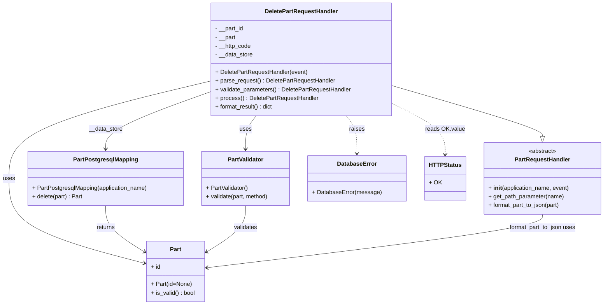

# Diagram: partview_core/partview_service/partview_service/api/part/handlers/DeletePartRequestHandler.py

> Auto-generated by Obscura crawlers

## Mermaid

### SVG

<svg id="container" width="1658.4921875" xmlns="http://www.w3.org/2000/svg" class="classDiagram" height="842" viewBox="0 0 1658.4921875 842" role="graphics-document document" aria-roledescription="class"><g><defs><marker id="container_class-aggregationStart" class="marker aggregation class" refX="18" refY="7" markerWidth="190" markerHeight="240" orient="auto"><path d="M 18,7 L9,13 L1,7 L9,1 Z"></path></marker></defs><defs><marker id="container_class-aggregationEnd" class="marker aggregation class" refX="1" refY="7" markerWidth="20" markerHeight="28" orient="auto"><path d="M 18,7 L9,13 L1,7 L9,1 Z"></path></marker></defs><defs><marker id="container_class-extensionStart" class="marker extension class" refX="18" refY="7" markerWidth="190" markerHeight="240" orient="auto"><path d="M 1,7 L18,13 V 1 Z"></path></marker></defs><defs><marker id="container_class-extensionEnd" class="marker extension class" refX="1" refY="7" markerWidth="20" markerHeight="28" orient="auto"><path d="M 1,1 V 13 L18,7 Z"></path></marker></defs><defs><marker id="container_class-compositionStart" class="marker composition class" refX="18" refY="7" markerWidth="190" markerHeight="240" orient="auto"><path d="M 18,7 L9,13 L1,7 L9,1 Z"></path></marker></defs><defs><marker id="container_class-compositionEnd" class="marker composition class" refX="1" refY="7" markerWidth="20" markerHeight="28" orient="auto"><path d="M 18,7 L9,13 L1,7 L9,1 Z"></path></marker></defs><defs><marker id="container_class-dependencyStart" class="marker dependency class" refX="6" refY="7" markerWidth="190" markerHeight="240" orient="auto"><path d="M 5,7 L9,13 L1,7 L9,1 Z"></path></marker></defs><defs><marker id="container_class-dependencyEnd" class="marker dependency class" refX="13" refY="7" markerWidth="20" markerHeight="28" orient="auto"><path d="M 18,7 L9,13 L14,7 L9,1 Z"></path></marker></defs><defs><marker id="container_class-lollipopStart" class="marker lollipop class" refX="13" refY="7" markerWidth="190" markerHeight="240" orient="auto"><circle stroke="black" fill="transparent" cx="7" cy="7" r="6"></circle></marker></defs><defs><marker id="container_class-lollipopEnd" class="marker lollipop class" refX="1" refY="7" markerWidth="190" markerHeight="240" orient="auto"><circle stroke="black" fill="transparent" cx="7" cy="7" r="6"></circle></marker></defs><g class="root"><g class="clusters"></g><g class="edgePaths"><path d="M1081.637,237.283L1149.414,257.236C1217.191,277.189,1352.746,317.094,1420.523,340.339C1488.301,363.583,1488.301,370.167,1488.301,373.458L1488.301,376.75" id="id_DeletePartRequestHandler_PartRequestHandler_1" class="edge-thickness-normal edge-pattern-solid relation" style=";;;" data-edge="true" data-et="edge" data-id="id_DeletePartRequestHandler_PartRequestHandler_1" data-points="W3sieCI6MTA4MS42MzY3MTg3NSwieSI6MjM3LjI4MzAzMTM0NjYzNjIyfSx7IngiOjE0ODguMzAwNzgxMjUsInkiOjM1N30seyJ4IjoxNDg4LjMwMDc4MTI1LCJ5IjozOTR9XQ==" marker-end="url(#container_class-extensionEnd)"></path><path d="M583.77,252.695L534.979,270.079C486.188,287.463,388.605,322.232,339.814,348.782C291.023,375.333,291.023,393.667,291.023,402.833L291.023,412" id="id_DeletePartRequestHandler_PartPostgresqlMapping_2" class="edge-thickness-normal edge-pattern-solid relation" style=";;;" data-edge="true" data-et="edge" data-id="id_DeletePartRequestHandler_PartPostgresqlMapping_2" data-points="W3sieCI6NTgzLjc2OTUzMTI1LCJ5IjoyNTIuNjk0ODIyMjM5ODV9LHsieCI6MjkxLjAyMzQzNzUsInkiOjM1N30seyJ4IjoyOTEuMDIzNDM3NSwieSI6NDE4fV0=" marker-end="url(#container_class-dependencyEnd)"></path><path d="M583.77,223.445L490.557,245.704C397.344,267.963,210.918,312.482,117.705,357.408C24.492,402.333,24.492,447.667,24.492,493C24.492,538.333,24.492,583.667,86.899,622.717C149.305,661.768,274.118,694.535,336.525,710.919L398.931,727.303" id="id_DeletePartRequestHandler_Part_3" class="edge-thickness-normal edge-pattern-solid relation" style=";;;" data-edge="true" data-et="edge" data-id="id_DeletePartRequestHandler_Part_3" data-points="W3sieCI6NTgzLjc2OTUzMTI1LCJ5IjoyMjMuNDQ1MTA0NDQ1NTgyOTN9LHsieCI6MjQuNDkyMTg3NSwieSI6MzU3fSx7IngiOjI0LjQ5MjE4NzUsInkiOjQ5M30seyJ4IjoyNC40OTIxODc1LCJ5Ijo2Mjl9LHsieCI6NDA0LjczNDM3NSwieSI6NzI4LjgyNjEwMjQzMzI3Nzd9XQ==" marker-end="url(#container_class-dependencyEnd)"></path><path d="M709.073,320L704.186,326.167C699.298,332.333,689.524,344.667,684.637,360C679.75,375.333,679.75,393.667,679.75,402.833L679.75,412" id="id_DeletePartRequestHandler_PartValidator_4" class="edge-thickness-normal edge-pattern-solid relation" style=";;;" data-edge="true" data-et="edge" data-id="id_DeletePartRequestHandler_PartValidator_4" data-points="W3sieCI6NzA5LjA3MjYxOTgxODY1MjgsInkiOjMyMH0seyJ4Ijo2NzkuNzUsInkiOjM1N30seyJ4Ijo2NzkuNzUsInkiOjQxOH1d" marker-end="url(#container_class-dependencyEnd)"></path><path d="M956.334,320L961.221,326.167C966.108,332.333,975.882,344.667,980.769,362C985.656,379.333,985.656,401.667,985.656,412.833L985.656,424" id="id_DeletePartRequestHandler_DatabaseError_5" class="edge-thickness-normal edge-pattern-dashed relation" style=";;;" data-edge="true" data-et="edge" data-id="id_DeletePartRequestHandler_DatabaseError_5" data-points="W3sieCI6OTU2LjMzMzYzMDE4MTM0NzIsInkiOjMyMH0seyJ4Ijo5ODUuNjU2MjUsInkiOjM1N30seyJ4Ijo5ODUuNjU2MjUsInkiOjQzMH1d" marker-end="url(#container_class-dependencyEnd)"></path><path d="M1081.637,287.415L1105.029,299.013C1128.422,310.61,1175.207,333.805,1198.6,357.069C1221.992,380.333,1221.992,403.667,1221.992,415.333L1221.992,427" id="id_DeletePartRequestHandler_HTTPStatus_6" class="edge-thickness-normal edge-pattern-dashed relation" style=";;;" data-edge="true" data-et="edge" data-id="id_DeletePartRequestHandler_HTTPStatus_6" data-points="W3sieCI6MTA4MS42MzY3MTg3NSwieSI6Mjg3LjQxNTE4OTk0OTYyNzc1fSx7IngiOjEyMjEuOTkyMTg3NSwieSI6MzU3fSx7IngiOjEyMjEuOTkyMTg3NSwieSI6NDMzfV0=" marker-end="url(#container_class-dependencyEnd)"></path><path d="M291.023,568L291.023,578.167C291.023,588.333,291.023,608.667,309.126,630.103C327.229,651.54,363.435,674.079,381.538,685.349L399.641,696.619" id="id_PartPostgresqlMapping_Part_7" class="edge-thickness-normal edge-pattern-solid relation" style=";;;" data-edge="true" data-et="edge" data-id="id_PartPostgresqlMapping_Part_7" data-points="W3sieCI6MjkxLjAyMzQzNzUsInkiOjU2OH0seyJ4IjoyOTEuMDIzNDM3NSwieSI6NjI5fSx7IngiOjQwNC43MzQzNzUsInkiOjY5OS43OTAyNDA1NjkxNjYxfV0=" marker-end="url(#container_class-dependencyEnd)"></path><path d="M679.75,568L679.75,578.167C679.75,588.333,679.75,608.667,661.647,630.103C643.544,651.54,607.338,674.079,589.236,685.349L571.133,696.619" id="id_PartValidator_Part_8" class="edge-thickness-normal edge-pattern-solid relation" style=";;;" data-edge="true" data-et="edge" data-id="id_PartValidator_Part_8" data-points="W3sieCI6Njc5Ljc1LCJ5Ijo1Njh9LHsieCI6Njc5Ljc1LCJ5Ijo2Mjl9LHsieCI6NTY2LjAzOTA2MjUsInkiOjY5OS43OTAyNDA1NjkxNjYxfV0=" marker-end="url(#container_class-dependencyEnd)"></path><path d="M1488.301,592L1488.301,598.167C1488.301,604.333,1488.301,616.667,1335.583,641.258C1182.866,665.85,877.431,702.7,724.713,721.126L571.996,739.551" id="id_PartRequestHandler_Part_9" class="edge-thickness-normal edge-pattern-solid relation" style=";;;" data-edge="true" data-et="edge" data-id="id_PartRequestHandler_Part_9" data-points="W3sieCI6MTQ4OC4zMDA3ODEyNSwieSI6NTkyfSx7IngiOjE0ODguMzAwNzgxMjUsInkiOjYyOX0seyJ4Ijo1NjYuMDM5MDYyNSwieSI6NzQwLjI2OTQyMTkxODkzOTN9XQ==" marker-end="url(#container_class-dependencyEnd)"></path></g><g class="edgeLabels"><g class="edgeLabel"><g class="label" data-id="id_DeletePartRequestHandler_PartRequestHandler_1" transform="translate(0, 0)"><foreignObject width="0" height="0">

</foreignObject></g></g><g class="edgeLabel" transform="translate(291.0234375, 357)"><g class="label" data-id="id_DeletePartRequestHandler_PartPostgresqlMapping_2" transform="translate(-46.9453125, -12)"><foreignObject width="93.890625" height="24">

__data_store

</foreignObject></g></g><g class="edgeLabel" transform="translate(24.4921875, 493)"><g class="label" data-id="id_DeletePartRequestHandler_Part_3" transform="translate(-16.4921875, -12)"><foreignObject width="32.984375" height="24">

uses

</foreignObject></g></g><g class="edgeLabel" transform="translate(679.75, 357)"><g class="label" data-id="id_DeletePartRequestHandler_PartValidator_4" transform="translate(-16.4921875, -12)"><foreignObject width="32.984375" height="24">

uses

</foreignObject></g></g><g class="edgeLabel" transform="translate(985.65625, 357)"><g class="label" data-id="id_DeletePartRequestHandler_DatabaseError_5" transform="translate(-21.25, -12)"><foreignObject width="42.5" height="24">

raises

</foreignObject></g></g><g class="edgeLabel" transform="translate(1221.9921875, 357)"><g class="label" data-id="id_DeletePartRequestHandler_HTTPStatus_6" transform="translate(-53.4140625, -12)"><foreignObject width="106.828125" height="24">

reads OK.value

</foreignObject></g></g><g class="edgeLabel" transform="translate(291.0234375, 629)"><g class="label" data-id="id_PartPostgresqlMapping_Part_7" transform="translate(-26.265625, -12)"><foreignObject width="52.53125" height="24">

returns

</foreignObject></g></g><g class="edgeLabel" transform="translate(679.75, 629)"><g class="label" data-id="id_PartValidator_Part_8" transform="translate(-32.6875, -12)"><foreignObject width="65.375" height="24">

validates

</foreignObject></g></g><g class="edgeLabel" transform="translate(1488.30078125, 629)"><g class="label" data-id="id_PartRequestHandler_Part_9" transform="translate(-93.2890625, -12)"><foreignObject width="186.578125" height="24">

format_part_to_json uses

</foreignObject></g></g></g><g class="nodes"><g class="node default" id="classId-DeletePartRequestHandler-0" transform="translate(832.703125, 164)"><g class="basic label-container"><path d="M-248.93359375 -156 L248.93359375 -156 L248.93359375 156 L-248.93359375 156" stroke="none" stroke-width="0" fill="#ECECFF" style=""></path><path d="M-248.93359375 -156 C-92.98365245463796 -156, 62.966288840724076 -156, 248.93359375 -156 M-248.93359375 -156 C-84.33622933703742 -156, 80.26113507592515 -156, 248.93359375 -156 M248.93359375 -156 C248.93359375 -34.43673932596275, 248.93359375 87.1265213480745, 248.93359375 156 M248.93359375 -156 C248.93359375 -67.9846671275193, 248.93359375 20.030665744961397, 248.93359375 156 M248.93359375 156 C90.40269170371565 156, -68.1282103425687 156, -248.93359375 156 M248.93359375 156 C140.22970345338405 156, 31.525813156768095 156, -248.93359375 156 M-248.93359375 156 C-248.93359375 52.51663577638094, -248.93359375 -50.966728447238125, -248.93359375 -156 M-248.93359375 156 C-248.93359375 43.66858033400804, -248.93359375 -68.66283933198392, -248.93359375 -156" stroke="#9370DB" stroke-width="1.3" fill="none" stroke-dasharray="0 0" style=""></path></g><g class="annotation-group text" transform="translate(0, -132)"></g><g class="label-group text" transform="translate(-97.8671875, -132)"><g class="label" style="font-weight: bolder" transform="translate(0,-12)"><foreignObject width="195.734375" height="24">

DeletePartRequestHandler

</foreignObject></g></g><g class="members-group text" transform="translate(-236.93359375, -84)"><g class="label" style="" transform="translate(0,-12)"><foreignObject width="79.578125" height="24">

- __part_id

</foreignObject></g><g class="label" style="" transform="translate(0,12)"><foreignObject width="57.171875" height="24">

- __part

</foreignObject></g><g class="label" style="" transform="translate(0,36)"><foreignObject width="100.25" height="24">

- __http_code

</foreignObject></g><g class="label" style="" transform="translate(0,60)"><foreignObject width="104.578125" height="24">

- __data_store

</foreignObject></g></g><g class="methods-group text" transform="translate(-236.93359375, 36)"><g class="label" style="" transform="translate(0,-12)"><foreignObject width="255.65625" height="24">

+ DeletePartRequestHandler(event)

</foreignObject></g><g class="label" style="" transform="translate(0,12)"><foreignObject width="331.078125" height="24">

+ parse_request() : DeletePartRequestHandler

</foreignObject></g><g class="label" style="" transform="translate(0,36)"><foreignObject width="376" height="24">

+ validate_parameters() : DeletePartRequestHandler

</foreignObject></g><g class="label" style="" transform="translate(0,60)"><foreignObject width="283.015625" height="24">

+ process() : DeletePartRequestHandler

</foreignObject></g><g class="label" style="" transform="translate(0,84)"><foreignObject width="161.3125" height="24">

+ format_result() : dict

</foreignObject></g></g><g class="divider" style=""><path d="M-248.93359375 -108 C-148.5512335620236 -108, -48.16887337404722 -108, 248.93359375 -108 M-248.93359375 -108 C-99.04961488093423 -108, 50.83436398813154 -108, 248.93359375 -108" stroke="#9370DB" stroke-width="1.3" fill="none" stroke-dasharray="0 0" style=""></path></g><g class="divider" style=""><path d="M-248.93359375 12 C-55.264304902160035 12, 138.40498394567993 12, 248.93359375 12 M-248.93359375 12 C-111.64972047732437 12, 25.63415279535127 12, 248.93359375 12" stroke="#9370DB" stroke-width="1.3" fill="none" stroke-dasharray="0 0" style=""></path></g></g><g class="node default" id="classId-PartRequestHandler-1" transform="translate(1488.30078125, 493)"><g class="basic label-container"><path d="M-162.19140625 -99 L162.19140625 -99 L162.19140625 99 L-162.19140625 99" stroke="none" stroke-width="0" fill="#ECECFF" style=""></path><path d="M-162.19140625 -99 C-95.63994558429218 -99, -29.088484918584356 -99, 162.19140625 -99 M-162.19140625 -99 C-84.41495002292214 -99, -6.638493795844283 -99, 162.19140625 -99 M162.19140625 -99 C162.19140625 -51.03970913066568, 162.19140625 -3.079418261331355, 162.19140625 99 M162.19140625 -99 C162.19140625 -47.80303190903981, 162.19140625 3.393936181920381, 162.19140625 99 M162.19140625 99 C32.786255858251025 99, -96.61889453349795 99, -162.19140625 99 M162.19140625 99 C43.700816371152015 99, -74.78977350769597 99, -162.19140625 99 M-162.19140625 99 C-162.19140625 22.096394254522068, -162.19140625 -54.807211490955865, -162.19140625 -99 M-162.19140625 99 C-162.19140625 50.79975373197745, -162.19140625 2.599507463954893, -162.19140625 -99" stroke="#9370DB" stroke-width="1.3" fill="none" stroke-dasharray="0 0" style=""></path></g><g class="annotation-group text" transform="translate(-38.609375, -75)"><g class="label" style="" transform="translate(0,-12)"><foreignObject width="77.21875" height="24">

«abstract»

</foreignObject></g></g><g class="label-group text" transform="translate(-74.1328125, -51)"><g class="label" style="font-weight: bolder" transform="translate(0,-12)"><foreignObject width="148.265625" height="24">

PartRequestHandler

</foreignObject></g></g><g class="members-group text" transform="translate(-150.19140625, -3)"></g><g class="methods-group text" transform="translate(-150.19140625, 27)"><g class="label" style="" transform="translate(0,-12)"><foreignObject width="226.25" height="24">

+ <strong>init</strong>(application_name, event)

</foreignObject></g><g class="label" style="" transform="translate(0,12)"><foreignObject width="210.75" height="24">

+ get_path_parameter(name)

</foreignObject></g><g class="label" style="" transform="translate(0,36)"><foreignObject width="201.953125" height="24">

+ format_part_to_json(part)

</foreignObject></g></g><g class="divider" style=""><path d="M-162.19140625 -27 C-48.33656235223677 -27, 65.51828154552646 -27, 162.19140625 -27 M-162.19140625 -27 C-41.47297821239677 -27, 79.24544982520646 -27, 162.19140625 -27" stroke="#9370DB" stroke-width="1.3" fill="none" stroke-dasharray="0 0" style=""></path></g><g class="divider" style=""><path d="M-162.19140625 -3 C-50.02642859736615 -3, 62.1385490552677 -3, 162.19140625 -3 M-162.19140625 -3 C-45.78855731180147 -3, 70.61429162639706 -3, 162.19140625 -3" stroke="#9370DB" stroke-width="1.3" fill="none" stroke-dasharray="0 0" style=""></path></g></g><g class="node default" id="classId-PartPostgresqlMapping-2" transform="translate(291.0234375, 493)"><g class="basic label-container"><path d="M-215.0390625 -75 L215.0390625 -75 L215.0390625 75 L-215.0390625 75" stroke="none" stroke-width="0" fill="#ECECFF" style=""></path><path d="M-215.0390625 -75 C-68.42809987644259 -75, 78.18286274711483 -75, 215.0390625 -75 M-215.0390625 -75 C-68.5434332424145 -75, 77.95219601517101 -75, 215.0390625 -75 M215.0390625 -75 C215.0390625 -24.15431347086851, 215.0390625 26.691373058262982, 215.0390625 75 M215.0390625 -75 C215.0390625 -21.826153493874436, 215.0390625 31.347693012251128, 215.0390625 75 M215.0390625 75 C117.7309199133213 75, 20.422777326642603 75, -215.0390625 75 M215.0390625 75 C56.649179811013624 75, -101.74070287797275 75, -215.0390625 75 M-215.0390625 75 C-215.0390625 43.90381425332332, -215.0390625 12.80762850664663, -215.0390625 -75 M-215.0390625 75 C-215.0390625 15.526520032946642, -215.0390625 -43.946959934106715, -215.0390625 -75" stroke="#9370DB" stroke-width="1.3" fill="none" stroke-dasharray="0 0" style=""></path></g><g class="annotation-group text" transform="translate(0, -51)"></g><g class="label-group text" transform="translate(-85.46875, -51)"><g class="label" style="font-weight: bolder" transform="translate(0,-12)"><foreignObject width="170.9375" height="24">

PartPostgresqlMapping

</foreignObject></g></g><g class="members-group text" transform="translate(-203.0390625, -3)"></g><g class="methods-group text" transform="translate(-203.0390625, 27)"><g class="label" style="" transform="translate(0,-12)"><foreignObject width="320.609375" height="24">

+ PartPostgresqlMapping(application_name)

</foreignObject></g><g class="label" style="" transform="translate(0,12)"><foreignObject width="139.859375" height="24">

+ delete(part) : Part

</foreignObject></g></g><g class="divider" style=""><path d="M-215.0390625 -27 C-51.52585255147201 -27, 111.98735739705597 -27, 215.0390625 -27 M-215.0390625 -27 C-63.32820860314004 -27, 88.38264529371992 -27, 215.0390625 -27" stroke="#9370DB" stroke-width="1.3" fill="none" stroke-dasharray="0 0" style=""></path></g><g class="divider" style=""><path d="M-215.0390625 -3 C-53.07807118353185 -3, 108.8829201329363 -3, 215.0390625 -3 M-215.0390625 -3 C-100.998340880927 -3, 13.042380738145994 -3, 215.0390625 -3" stroke="#9370DB" stroke-width="1.3" fill="none" stroke-dasharray="0 0" style=""></path></g></g><g class="node default" id="classId-Part-3" transform="translate(485.38671875, 750)"><g class="basic label-container"><path d="M-80.65234375 -84 L80.65234375 -84 L80.65234375 84 L-80.65234375 84" stroke="none" stroke-width="0" fill="#ECECFF" style=""></path><path d="M-80.65234375 -84 C-28.669530887191996 -84, 23.313281975616007 -84, 80.65234375 -84 M-80.65234375 -84 C-23.099312790094586 -84, 34.45371816981083 -84, 80.65234375 -84 M80.65234375 -84 C80.65234375 -32.09259580702054, 80.65234375 19.814808385958926, 80.65234375 84 M80.65234375 -84 C80.65234375 -33.354867128976515, 80.65234375 17.29026574204697, 80.65234375 84 M80.65234375 84 C20.34023476441409 84, -39.97187422117182 84, -80.65234375 84 M80.65234375 84 C32.21813712839396 84, -16.216069493212075 84, -80.65234375 84 M-80.65234375 84 C-80.65234375 41.872169109965625, -80.65234375 -0.25566178006874907, -80.65234375 -84 M-80.65234375 84 C-80.65234375 22.462638590674068, -80.65234375 -39.074722818651864, -80.65234375 -84" stroke="#9370DB" stroke-width="1.3" fill="none" stroke-dasharray="0 0" style=""></path></g><g class="annotation-group text" transform="translate(0, -60)"></g><g class="label-group text" transform="translate(-15.0703125, -60)"><g class="label" style="font-weight: bolder" transform="translate(0,-12)"><foreignObject width="30.140625" height="24">

Part

</foreignObject></g></g><g class="members-group text" transform="translate(-68.65234375, -12)"><g class="label" style="" transform="translate(0,-12)"><foreignObject width="26.3125" height="24">

+ id

</foreignObject></g></g><g class="methods-group text" transform="translate(-68.65234375, 36)"><g class="label" style="" transform="translate(0,-12)"><foreignObject width="112.125" height="24">

+ Part(id=None)

</foreignObject></g><g class="label" style="" transform="translate(0,12)"><foreignObject width="122.234375" height="24">

+ is_valid() : bool

</foreignObject></g></g><g class="divider" style=""><path d="M-80.65234375 -36 C-16.722358940860808 -36, 47.207625868278384 -36, 80.65234375 -36 M-80.65234375 -36 C-46.141046601640184 -36, -11.629749453280368 -36, 80.65234375 -36" stroke="#9370DB" stroke-width="1.3" fill="none" stroke-dasharray="0 0" style=""></path></g><g class="divider" style=""><path d="M-80.65234375 12 C-41.64135832626368 12, -2.6303729025273554 12, 80.65234375 12 M-80.65234375 12 C-18.58134567471999 12, 43.48965240056002 12, 80.65234375 12" stroke="#9370DB" stroke-width="1.3" fill="none" stroke-dasharray="0 0" style=""></path></g></g><g class="node default" id="classId-PartValidator-4" transform="translate(679.75, 493)"><g class="basic label-container"><path d="M-123.6875 -75 L123.6875 -75 L123.6875 75 L-123.6875 75" stroke="none" stroke-width="0" fill="#ECECFF" style=""></path><path d="M-123.6875 -75 C-53.79611127835658 -75, 16.095277443286847 -75, 123.6875 -75 M-123.6875 -75 C-61.88491401280385 -75, -0.08232802560769414 -75, 123.6875 -75 M123.6875 -75 C123.6875 -42.12550883286635, 123.6875 -9.251017665732704, 123.6875 75 M123.6875 -75 C123.6875 -30.145763257321846, 123.6875 14.708473485356308, 123.6875 75 M123.6875 75 C67.5465714577654 75, 11.405642915530805 75, -123.6875 75 M123.6875 75 C41.462450487267844 75, -40.76259902546431 75, -123.6875 75 M-123.6875 75 C-123.6875 28.98343772370677, -123.6875 -17.033124552586457, -123.6875 -75 M-123.6875 75 C-123.6875 35.97341751960224, -123.6875 -3.053164960795513, -123.6875 -75" stroke="#9370DB" stroke-width="1.3" fill="none" stroke-dasharray="0 0" style=""></path></g><g class="annotation-group text" transform="translate(0, -51)"></g><g class="label-group text" transform="translate(-48.25, -51)"><g class="label" style="font-weight: bolder" transform="translate(0,-12)"><foreignObject width="96.5" height="24">

PartValidator

</foreignObject></g></g><g class="members-group text" transform="translate(-111.6875, -3)"></g><g class="methods-group text" transform="translate(-111.6875, 27)"><g class="label" style="" transform="translate(0,-12)"><foreignObject width="117" height="24">

+ PartValidator()

</foreignObject></g><g class="label" style="" transform="translate(0,12)"><foreignObject width="175.125" height="24">

+ validate(part, method)

</foreignObject></g></g><g class="divider" style=""><path d="M-123.6875 -27 C-27.791390462442195 -27, 68.10471907511561 -27, 123.6875 -27 M-123.6875 -27 C-29.850439067341952 -27, 63.986621865316096 -27, 123.6875 -27" stroke="#9370DB" stroke-width="1.3" fill="none" stroke-dasharray="0 0" style=""></path></g><g class="divider" style=""><path d="M-123.6875 -3 C-43.032499935375625 -3, 37.62250012924875 -3, 123.6875 -3 M-123.6875 -3 C-70.142333094988 -3, -16.597166189975994 -3, 123.6875 -3" stroke="#9370DB" stroke-width="1.3" fill="none" stroke-dasharray="0 0" style=""></path></g></g><g class="node default" id="classId-DatabaseError-5" transform="translate(985.65625, 493)"><g class="basic label-container"><path d="M-132.21875 -63 L132.21875 -63 L132.21875 63 L-132.21875 63" stroke="none" stroke-width="0" fill="#ECECFF" style=""></path><path d="M-132.21875 -63 C-34.55121554189468 -63, 63.116318916210645 -63, 132.21875 -63 M-132.21875 -63 C-37.90540834143944 -63, 56.40793331712112 -63, 132.21875 -63 M132.21875 -63 C132.21875 -33.3478653477972, 132.21875 -3.6957306955944063, 132.21875 63 M132.21875 -63 C132.21875 -34.61612298047594, 132.21875 -6.232245960951886, 132.21875 63 M132.21875 63 C70.67049892343013 63, 9.122247846860276 63, -132.21875 63 M132.21875 63 C39.09205644278991 63, -54.03463711442018 63, -132.21875 63 M-132.21875 63 C-132.21875 14.960559168777223, -132.21875 -33.07888166244555, -132.21875 -63 M-132.21875 63 C-132.21875 18.03399835474631, -132.21875 -26.93200329050738, -132.21875 -63" stroke="#9370DB" stroke-width="1.3" fill="none" stroke-dasharray="0 0" style=""></path></g><g class="annotation-group text" transform="translate(0, -39)"></g><g class="label-group text" transform="translate(-52.359375, -39)"><g class="label" style="font-weight: bolder" transform="translate(0,-12)"><foreignObject width="104.71875" height="24">

DatabaseError

</foreignObject></g></g><g class="members-group text" transform="translate(-120.21875, 9)"></g><g class="methods-group text" transform="translate(-120.21875, 39)"><g class="label" style="" transform="translate(0,-12)"><foreignObject width="188.078125" height="24">

+ DatabaseError(message)

</foreignObject></g></g><g class="divider" style=""><path d="M-132.21875 -15 C-66.22731802822247 -15, -0.2358860564449401 -15, 132.21875 -15 M-132.21875 -15 C-54.14591624178021 -15, 23.926917516439573 -15, 132.21875 -15" stroke="#9370DB" stroke-width="1.3" fill="none" stroke-dasharray="0 0" style=""></path></g><g class="divider" style=""><path d="M-132.21875 9 C-60.85370024678626 9, 10.511349506427479 9, 132.21875 9 M-132.21875 9 C-42.76067861871742 9, 46.69739276256516 9, 132.21875 9" stroke="#9370DB" stroke-width="1.3" fill="none" stroke-dasharray="0 0" style=""></path></g></g><g class="node default" id="classId-HTTPStatus-6" transform="translate(1221.9921875, 493)"><g class="basic label-container"><path d="M-54.1171875 -60 L54.1171875 -60 L54.1171875 60 L-54.1171875 60" stroke="none" stroke-width="0" fill="#ECECFF" style=""></path><path d="M-54.1171875 -60 C-30.295865170932945 -60, -6.47454284186589 -60, 54.1171875 -60 M-54.1171875 -60 C-28.964643181534623 -60, -3.812098863069245 -60, 54.1171875 -60 M54.1171875 -60 C54.1171875 -24.536186070655013, 54.1171875 10.927627858689974, 54.1171875 60 M54.1171875 -60 C54.1171875 -14.10088599981227, 54.1171875 31.79822800037546, 54.1171875 60 M54.1171875 60 C21.449074666297264 60, -11.219038167405472 60, -54.1171875 60 M54.1171875 60 C31.875625671849576 60, 9.634063843699153 60, -54.1171875 60 M-54.1171875 60 C-54.1171875 22.30226778501857, -54.1171875 -15.395464429962857, -54.1171875 -60 M-54.1171875 60 C-54.1171875 15.91210185092524, -54.1171875 -28.17579629814952, -54.1171875 -60" stroke="#9370DB" stroke-width="1.3" fill="none" stroke-dasharray="0 0" style=""></path></g><g class="annotation-group text" transform="translate(0, -36)"></g><g class="label-group text" transform="translate(-42.1171875, -36)"><g class="label" style="font-weight: bolder" transform="translate(0,-12)"><foreignObject width="84.234375" height="24">

HTTPStatus

</foreignObject></g></g><g class="members-group text" transform="translate(-42.1171875, 12)"><g class="label" style="" transform="translate(0,-12)"><foreignObject width="32.734375" height="24">

+ OK

</foreignObject></g></g><g class="methods-group text" transform="translate(-42.1171875, 60)"></g><g class="divider" style=""><path d="M-54.1171875 -12 C-12.012038829092653 -12, 30.093109841814695 -12, 54.1171875 -12 M-54.1171875 -12 C-23.808117555500868 -12, 6.5009523889982646 -12, 54.1171875 -12" stroke="#9370DB" stroke-width="1.3" fill="none" stroke-dasharray="0 0" style=""></path></g><g class="divider" style=""><path d="M-54.1171875 36 C-19.537333631469203 36, 15.042520237061595 36, 54.1171875 36 M-54.1171875 36 C-11.455593420897252 36, 31.206000658205497 36, 54.1171875 36" stroke="#9370DB" stroke-width="1.3" fill="none" stroke-dasharray="0 0" style=""></path></g></g></g></g></g></svg>
