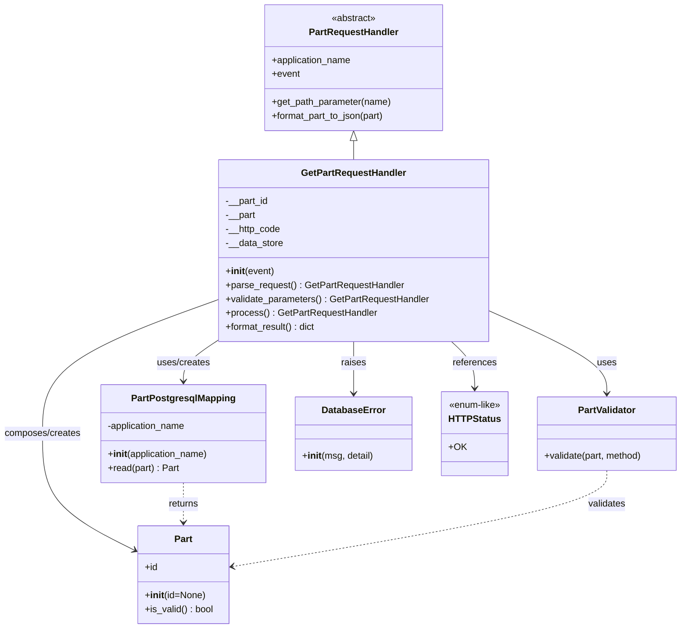

# Diagram: partview_core/partview_service/partview_service/api/part/handlers/GetPartRequestHandler.py

> Auto-generated by Obscura crawlers

## Mermaid

### SVG

<svg id="container" width="1173.703125" xmlns="http://www.w3.org/2000/svg" class="classDiagram" height="1078" viewBox="0 0 1173.703125 1078" role="graphics-document document" aria-roledescription="class"><g><defs><marker id="container_class-aggregationStart" class="marker aggregation class" refX="18" refY="7" markerWidth="190" markerHeight="240" orient="auto"><path d="M 18,7 L9,13 L1,7 L9,1 Z"></path></marker></defs><defs><marker id="container_class-aggregationEnd" class="marker aggregation class" refX="1" refY="7" markerWidth="20" markerHeight="28" orient="auto"><path d="M 18,7 L9,13 L1,7 L9,1 Z"></path></marker></defs><defs><marker id="container_class-extensionStart" class="marker extension class" refX="18" refY="7" markerWidth="190" markerHeight="240" orient="auto"><path d="M 1,7 L18,13 V 1 Z"></path></marker></defs><defs><marker id="container_class-extensionEnd" class="marker extension class" refX="1" refY="7" markerWidth="20" markerHeight="28" orient="auto"><path d="M 1,1 V 13 L18,7 Z"></path></marker></defs><defs><marker id="container_class-compositionStart" class="marker composition class" refX="18" refY="7" markerWidth="190" markerHeight="240" orient="auto"><path d="M 18,7 L9,13 L1,7 L9,1 Z"></path></marker></defs><defs><marker id="container_class-compositionEnd" class="marker composition class" refX="1" refY="7" markerWidth="20" markerHeight="28" orient="auto"><path d="M 18,7 L9,13 L1,7 L9,1 Z"></path></marker></defs><defs><marker id="container_class-dependencyStart" class="marker dependency class" refX="6" refY="7" markerWidth="190" markerHeight="240" orient="auto"><path d="M 5,7 L9,13 L1,7 L9,1 Z"></path></marker></defs><defs><marker id="container_class-dependencyEnd" class="marker dependency class" refX="13" refY="7" markerWidth="20" markerHeight="28" orient="auto"><path d="M 18,7 L9,13 L14,7 L9,1 Z"></path></marker></defs><defs><marker id="container_class-lollipopStart" class="marker lollipop class" refX="13" refY="7" markerWidth="190" markerHeight="240" orient="auto"><circle stroke="black" fill="transparent" cx="7" cy="7" r="6"></circle></marker></defs><defs><marker id="container_class-lollipopEnd" class="marker lollipop class" refX="1" refY="7" markerWidth="190" markerHeight="240" orient="auto"><circle stroke="black" fill="transparent" cx="7" cy="7" r="6"></circle></marker></defs><g class="root"><g class="clusters"></g><g class="edgePaths"><path d="M608.266,241.25L608.266,242.542C608.266,243.833,608.266,246.417,608.266,251.875C608.266,257.333,608.266,265.667,608.266,269.833L608.266,274" id="id_PartRequestHandler_GetPartRequestHandler_1" class="edge-thickness-normal edge-pattern-solid relation" style=";;;" data-edge="true" data-et="edge" data-id="id_PartRequestHandler_GetPartRequestHandler_1" data-points="W3sieCI6NjA4LjI2NTYyNSwieSI6MjI0fSx7IngiOjYwOC4yNjU2MjUsInkiOjI0OX0seyJ4Ijo2MDguMjY1NjI1LCJ5IjoyNzR9XQ==" marker-start="url(#container_class-extensionStart)"></path><path d="M378.078,582.721L367.96,589.434C357.841,596.147,337.604,609.574,327.486,621.453C317.367,633.333,317.367,643.667,317.367,648.833L317.367,654" id="id_GetPartRequestHandler_PartPostgresqlMapping_2" class="edge-thickness-normal edge-pattern-solid relation" style=";;;" data-edge="true" data-et="edge" data-id="id_GetPartRequestHandler_PartPostgresqlMapping_2" data-points="W3sieCI6Mzc4LjA3ODEyNSwieSI6NTgyLjcyMDYxMjMyNzExMTZ9LHsieCI6MzE3LjM2NzE4NzUsInkiOjYyM30seyJ4IjozMTcuMzY3MTg3NSwieSI6NjYwfV0=" marker-end="url(#container_class-dependencyEnd)"></path><path d="M838.453,531.908L872.746,547.09C907.039,562.272,975.625,592.636,1009.918,616.485C1044.211,640.333,1044.211,657.667,1044.211,666.333L1044.211,675" id="id_GetPartRequestHandler_PartValidator_3" class="edge-thickness-normal edge-pattern-solid relation" style=";;;" data-edge="true" data-et="edge" data-id="id_GetPartRequestHandler_PartValidator_3" data-points="W3sieCI6ODM4LjQ1MzEyNSwieSI6NTMxLjkwNzcwNzc0NzE3Mjl9LHsieCI6MTA0NC4yMTA5Mzc1LCJ5Ijo2MjN9LHsieCI6MTA0NC4yMTA5Mzc1LCJ5Ijo2ODF9XQ==" marker-end="url(#container_class-dependencyEnd)"></path><path d="M378.078,513.213L327.462,531.511C276.846,549.809,175.615,586.404,124.999,624.869C74.383,663.333,74.383,703.667,74.383,744C74.383,784.333,74.383,824.667,100.897,858.037C127.412,891.407,180.44,917.814,206.955,931.017L233.469,944.221" id="id_GetPartRequestHandler_Part_4" class="edge-thickness-normal edge-pattern-solid relation" style=";;;" data-edge="true" data-et="edge" data-id="id_GetPartRequestHandler_Part_4" data-points="W3sieCI6Mzc4LjA3ODEyNSwieSI6NTEzLjIxMzM2OTAzODczNDV9LHsieCI6NzQuMzgyODEyNSwieSI6NjIzfSx7IngiOjc0LjM4MjgxMjUsInkiOjc0NH0seyJ4Ijo3NC4zODI4MTI1LCJ5Ijo4NjV9LHsieCI6MjM4LjgzOTg0Mzc1LCJ5Ijo5NDYuODk1MzkyNTc5MjU1NH1d" marker-end="url(#container_class-dependencyEnd)"></path><path d="M608.266,586L608.266,592.167C608.266,598.333,608.266,610.667,608.266,625.5C608.266,640.333,608.266,657.667,608.266,666.333L608.266,675" id="id_GetPartRequestHandler_DatabaseError_5" class="edge-thickness-normal edge-pattern-solid relation" style=";;;" data-edge="true" data-et="edge" data-id="id_GetPartRequestHandler_DatabaseError_5" data-points="W3sieCI6NjA4LjI2NTYyNSwieSI6NTg2fSx7IngiOjYwOC4yNjU2MjUsInkiOjYyM30seyJ4Ijo2MDguMjY1NjI1LCJ5Ijo2ODF9XQ==" marker-end="url(#container_class-dependencyEnd)"></path><path d="M775.481,586L782.091,592.167C788.701,598.333,801.921,610.667,808.531,624C815.141,637.333,815.141,651.667,815.141,658.833L815.141,666" id="id_GetPartRequestHandler_HTTPStatus_6" class="edge-thickness-normal edge-pattern-solid relation" style=";;;" data-edge="true" data-et="edge" data-id="id_GetPartRequestHandler_HTTPStatus_6" data-points="W3sieCI6Nzc1LjQ4MDY1MDkwNjczNTcsInkiOjU4Nn0seyJ4Ijo4MTUuMTQwNjI1LCJ5Ijo2MjN9LHsieCI6ODE1LjE0MDYyNSwieSI6NjcyfV0=" marker-end="url(#container_class-dependencyEnd)"></path><path d="M317.367,828L317.367,834.167C317.367,840.333,317.367,852.667,317.367,864C317.367,875.333,317.367,885.667,317.367,890.833L317.367,896" id="id_PartPostgresqlMapping_Part_7" class="edge-thickness-normal edge-pattern-dashed relation" style=";;;" data-edge="true" data-et="edge" data-id="id_PartPostgresqlMapping_Part_7" data-points="W3sieCI6MzE3LjM2NzE4NzUsInkiOjgyOH0seyJ4IjozMTcuMzY3MTg3NSwieSI6ODY1fSx7IngiOjMxNy4zNjcxODc1LCJ5Ijo5MDJ9XQ==" marker-end="url(#container_class-dependencyEnd)"></path><path d="M1044.211,807L1044.211,816.667C1044.211,826.333,1044.211,845.667,937.145,873.157C830.078,900.647,615.946,936.295,508.879,954.118L401.813,971.942" id="id_PartValidator_Part_8" class="edge-thickness-normal edge-pattern-dashed relation" style=";;;" data-edge="true" data-et="edge" data-id="id_PartValidator_Part_8" data-points="W3sieCI6MTA0NC4yMTA5Mzc1LCJ5Ijo4MDd9LHsieCI6MTA0NC4yMTA5Mzc1LCJ5Ijo4NjV9LHsieCI6Mzk1Ljg5NDUzMTI1LCJ5Ijo5NzIuOTI3MzAyMzM0NTgwMn1d" marker-end="url(#container_class-dependencyEnd)"></path></g><g class="edgeLabels"><g class="edgeLabel"><g class="label" data-id="id_PartRequestHandler_GetPartRequestHandler_1" transform="translate(0, 0)"><foreignObject width="0" height="0">

</foreignObject></g></g><g class="edgeLabel" transform="translate(317.3671875, 623)"><g class="label" data-id="id_GetPartRequestHandler_PartPostgresqlMapping_2" transform="translate(-46.421875, -12)"><foreignObject width="92.84375" height="24">

uses/creates

</foreignObject></g></g><g class="edgeLabel" transform="translate(1044.2109375, 623)"><g class="label" data-id="id_GetPartRequestHandler_PartValidator_3" transform="translate(-16.4921875, -12)"><foreignObject width="32.984375" height="24">

uses

</foreignObject></g></g><g class="edgeLabel" transform="translate(74.3828125, 744)"><g class="label" data-id="id_GetPartRequestHandler_Part_4" transform="translate(-66.3828125, -12)"><foreignObject width="132.765625" height="24">

composes/creates

</foreignObject></g></g><g class="edgeLabel" transform="translate(608.265625, 623)"><g class="label" data-id="id_GetPartRequestHandler_DatabaseError_5" transform="translate(-21.25, -12)"><foreignObject width="42.5" height="24">

raises

</foreignObject></g></g><g class="edgeLabel" transform="translate(815.140625, 623)"><g class="label" data-id="id_GetPartRequestHandler_HTTPStatus_6" transform="translate(-37.828125, -12)"><foreignObject width="75.65625" height="24">

references

</foreignObject></g></g><g class="edgeLabel" transform="translate(317.3671875, 865)"><g class="label" data-id="id_PartPostgresqlMapping_Part_7" transform="translate(-26.265625, -12)"><foreignObject width="52.53125" height="24">

returns

</foreignObject></g></g><g class="edgeLabel" transform="translate(1044.2109375, 865)"><g class="label" data-id="id_PartValidator_Part_8" transform="translate(-32.6875, -12)"><foreignObject width="65.375" height="24">

validates

</foreignObject></g></g></g><g class="nodes"><g class="node default" id="classId-PartRequestHandler-0" transform="translate(608.265625, 116)"><g class="basic label-container"><path d="M-152.31640625 -108 L152.31640625 -108 L152.31640625 108 L-152.31640625 108" stroke="none" stroke-width="0" fill="#ECECFF" style=""></path><path d="M-152.31640625 -108 C-47.1913556009341 -108, 57.933695048131796 -108, 152.31640625 -108 M-152.31640625 -108 C-51.487091062054304 -108, 49.34222412589139 -108, 152.31640625 -108 M152.31640625 -108 C152.31640625 -25.49518316400686, 152.31640625 57.00963367198628, 152.31640625 108 M152.31640625 -108 C152.31640625 -40.957380230029216, 152.31640625 26.08523953994157, 152.31640625 108 M152.31640625 108 C88.80448783831159 108, 25.292569426623174 108, -152.31640625 108 M152.31640625 108 C72.96724800374011 108, -6.38191024251978 108, -152.31640625 108 M-152.31640625 108 C-152.31640625 52.77069825543541, -152.31640625 -2.4586034891291746, -152.31640625 -108 M-152.31640625 108 C-152.31640625 55.75293256264462, -152.31640625 3.505865125289233, -152.31640625 -108" stroke="#9370DB" stroke-width="1.3" fill="none" stroke-dasharray="0 0" style=""></path></g><g class="annotation-group text" transform="translate(-38.609375, -84)"><g class="label" style="" transform="translate(0,-12)"><foreignObject width="77.21875" height="24">

«abstract»

</foreignObject></g></g><g class="label-group text" transform="translate(-74.1328125, -60)"><g class="label" style="font-weight: bolder" transform="translate(0,-12)"><foreignObject width="148.265625" height="24">

PartRequestHandler

</foreignObject></g></g><g class="members-group text" transform="translate(-140.31640625, -12)"><g class="label" style="" transform="translate(0,-12)"><foreignObject width="138.703125" height="24">

+application_name

</foreignObject></g><g class="label" style="" transform="translate(0,12)"><foreignObject width="48.328125" height="24">

+event

</foreignObject></g></g><g class="methods-group text" transform="translate(-140.31640625, 60)"><g class="label" style="" transform="translate(0,-12)"><foreignObject width="206.5" height="24">

+get_path_parameter(name)

</foreignObject></g><g class="label" style="" transform="translate(0,12)"><foreignObject width="197.484375" height="24">

+format_part_to_json(part)

</foreignObject></g></g><g class="divider" style=""><path d="M-152.31640625 -36 C-46.6069541301345 -36, 59.102497989731006 -36, 152.31640625 -36 M-152.31640625 -36 C-36.786437200510235 -36, 78.74353184897953 -36, 152.31640625 -36" stroke="#9370DB" stroke-width="1.3" fill="none" stroke-dasharray="0 0" style=""></path></g><g class="divider" style=""><path d="M-152.31640625 36 C-85.03367048364363 36, -17.750934717287265 36, 152.31640625 36 M-152.31640625 36 C-66.63782937404679 36, 19.040747501906424 36, 152.31640625 36" stroke="#9370DB" stroke-width="1.3" fill="none" stroke-dasharray="0 0" style=""></path></g></g><g class="node default" id="classId-GetPartRequestHandler-1" transform="translate(608.265625, 430)"><g class="basic label-container"><path d="M-230.1875 -156 L230.1875 -156 L230.1875 156 L-230.1875 156" stroke="none" stroke-width="0" fill="#ECECFF" style=""></path><path d="M-230.1875 -156 C-61.73912610679386 -156, 106.70924778641228 -156, 230.1875 -156 M-230.1875 -156 C-122.86736619270981 -156, -15.547232385419619 -156, 230.1875 -156 M230.1875 -156 C230.1875 -90.66068404766838, 230.1875 -25.321368095336766, 230.1875 156 M230.1875 -156 C230.1875 -34.54379275959843, 230.1875 86.91241448080314, 230.1875 156 M230.1875 156 C63.14820117721496 156, -103.89109764557008 156, -230.1875 156 M230.1875 156 C65.78748064449553 156, -98.61253871100894 156, -230.1875 156 M-230.1875 156 C-230.1875 43.10883509404256, -230.1875 -69.78232981191488, -230.1875 -156 M-230.1875 156 C-230.1875 73.10266937386744, -230.1875 -9.794661252265115, -230.1875 -156" stroke="#9370DB" stroke-width="1.3" fill="none" stroke-dasharray="0 0" style=""></path></g><g class="annotation-group text" transform="translate(0, -132)"></g><g class="label-group text" transform="translate(-86.796875, -132)"><g class="label" style="font-weight: bolder" transform="translate(0,-12)"><foreignObject width="173.59375" height="24">

GetPartRequestHandler

</foreignObject></g></g><g class="members-group text" transform="translate(-218.1875, -84)"><g class="label" style="" transform="translate(0,-12)"><foreignObject width="74.0625" height="24">

-__part_id

</foreignObject></g><g class="label" style="" transform="translate(0,12)"><foreignObject width="51.65625" height="24">

-__part

</foreignObject></g><g class="label" style="" transform="translate(0,36)"><foreignObject width="94.734375" height="24">

-__http_code

</foreignObject></g><g class="label" style="" transform="translate(0,60)"><foreignObject width="99.0625" height="24">

-__data_store

</foreignObject></g></g><g class="methods-group text" transform="translate(-218.1875, 36)"><g class="label" style="" transform="translate(0,-12)"><foreignObject width="83.140625" height="24">

+<strong>init</strong>(event)

</foreignObject></g><g class="label" style="" transform="translate(0,12)"><foreignObject width="304.828125" height="24">

+parse_request() : GetPartRequestHandler

</foreignObject></g><g class="label" style="" transform="translate(0,36)"><foreignObject width="349.578125" height="24">

+validate_parameters() : GetPartRequestHandler

</foreignObject></g><g class="label" style="" transform="translate(0,60)"><foreignObject width="256.765625" height="24">

+process() : GetPartRequestHandler

</foreignObject></g><g class="label" style="" transform="translate(0,84)"><foreignObject width="156.84375" height="24">

+format_result() : dict

</foreignObject></g></g><g class="divider" style=""><path d="M-230.1875 -108 C-49.88689928188012 -108, 130.41370143623976 -108, 230.1875 -108 M-230.1875 -108 C-102.39685419248788 -108, 25.39379161502424 -108, 230.1875 -108" stroke="#9370DB" stroke-width="1.3" fill="none" stroke-dasharray="0 0" style=""></path></g><g class="divider" style=""><path d="M-230.1875 12 C-117.90211485170666 12, -5.616729703413313 12, 230.1875 12 M-230.1875 12 C-75.24297920390086 12, 79.70154159219828 12, 230.1875 12" stroke="#9370DB" stroke-width="1.3" fill="none" stroke-dasharray="0 0" style=""></path></g></g><g class="node default" id="classId-PartPostgresqlMapping-2" transform="translate(317.3671875, 744)"><g class="basic label-container"><path d="M-141.6015625 -84 L141.6015625 -84 L141.6015625 84 L-141.6015625 84" stroke="none" stroke-width="0" fill="#ECECFF" style=""></path><path d="M-141.6015625 -84 C-34.057142874976975 -84, 73.48727675004605 -84, 141.6015625 -84 M-141.6015625 -84 C-80.7358048369135 -84, -19.870047173827018 -84, 141.6015625 -84 M141.6015625 -84 C141.6015625 -46.529309446465014, 141.6015625 -9.058618892930028, 141.6015625 84 M141.6015625 -84 C141.6015625 -48.39111874793917, 141.6015625 -12.782237495878334, 141.6015625 84 M141.6015625 84 C28.3927339956479 84, -84.8160945087042 84, -141.6015625 84 M141.6015625 84 C74.72158348276736 84, 7.841604465534715 84, -141.6015625 84 M-141.6015625 84 C-141.6015625 24.260328722829385, -141.6015625 -35.47934255434123, -141.6015625 -84 M-141.6015625 84 C-141.6015625 33.73115479701999, -141.6015625 -16.53769040596002, -141.6015625 -84" stroke="#9370DB" stroke-width="1.3" fill="none" stroke-dasharray="0 0" style=""></path></g><g class="annotation-group text" transform="translate(0, -60)"></g><g class="label-group text" transform="translate(-85.46875, -60)"><g class="label" style="font-weight: bolder" transform="translate(0,-12)"><foreignObject width="170.9375" height="24">

PartPostgresqlMapping

</foreignObject></g></g><g class="members-group text" transform="translate(-129.6015625, -12)"><g class="label" style="" transform="translate(0,-12)"><foreignObject width="137.15625" height="24">

-application_name

</foreignObject></g></g><g class="methods-group text" transform="translate(-129.6015625, 36)"><g class="label" style="" transform="translate(0,-12)"><foreignObject width="173.734375" height="24">

+<strong>init</strong>(application_name)

</foreignObject></g><g class="label" style="" transform="translate(0,12)"><foreignObject width="122.28125" height="24">

+read(part) : Part

</foreignObject></g></g><g class="divider" style=""><path d="M-141.6015625 -36 C-48.71875491038402 -36, 44.16405267923196 -36, 141.6015625 -36 M-141.6015625 -36 C-70.72102339067578 -36, 0.15951571864843572 -36, 141.6015625 -36" stroke="#9370DB" stroke-width="1.3" fill="none" stroke-dasharray="0 0" style=""></path></g><g class="divider" style=""><path d="M-141.6015625 12 C-54.13613221040731 12, 33.32929807918538 12, 141.6015625 12 M-141.6015625 12 C-70.36427221532692 12, 0.8730180693461591 12, 141.6015625 12" stroke="#9370DB" stroke-width="1.3" fill="none" stroke-dasharray="0 0" style=""></path></g></g><g class="node default" id="classId-PartValidator-3" transform="translate(1044.2109375, 744)"><g class="basic label-container"><path d="M-121.4921875 -63 L121.4921875 -63 L121.4921875 63 L-121.4921875 63" stroke="none" stroke-width="0" fill="#ECECFF" style=""></path><path d="M-121.4921875 -63 C-46.27005692040866 -63, 28.952073659182673 -63, 121.4921875 -63 M-121.4921875 -63 C-32.719741058874874 -63, 56.05270538225025 -63, 121.4921875 -63 M121.4921875 -63 C121.4921875 -17.745304014310044, 121.4921875 27.509391971379912, 121.4921875 63 M121.4921875 -63 C121.4921875 -25.35859972424678, 121.4921875 12.28280055150644, 121.4921875 63 M121.4921875 63 C38.932820336602006 63, -43.62654682679599 63, -121.4921875 63 M121.4921875 63 C51.35655188180043 63, -18.779083736399144 63, -121.4921875 63 M-121.4921875 63 C-121.4921875 28.251299450171032, -121.4921875 -6.497401099657935, -121.4921875 -63 M-121.4921875 63 C-121.4921875 20.275738848431068, -121.4921875 -22.448522303137864, -121.4921875 -63" stroke="#9370DB" stroke-width="1.3" fill="none" stroke-dasharray="0 0" style=""></path></g><g class="annotation-group text" transform="translate(0, -39)"></g><g class="label-group text" transform="translate(-48.25, -39)"><g class="label" style="font-weight: bolder" transform="translate(0,-12)"><foreignObject width="96.5" height="24">

PartValidator

</foreignObject></g></g><g class="members-group text" transform="translate(-109.4921875, 9)"></g><g class="methods-group text" transform="translate(-109.4921875, 39)"><g class="label" style="" transform="translate(0,-12)"><foreignObject width="170.734375" height="24">

+validate(part, method)

</foreignObject></g></g><g class="divider" style=""><path d="M-121.4921875 -15 C-72.21539305432933 -15, -22.93859860865865 -15, 121.4921875 -15 M-121.4921875 -15 C-67.08113764325122 -15, -12.670087786502435 -15, 121.4921875 -15" stroke="#9370DB" stroke-width="1.3" fill="none" stroke-dasharray="0 0" style=""></path></g><g class="divider" style=""><path d="M-121.4921875 9 C-36.79398719304368 9, 47.90421311391265 9, 121.4921875 9 M-121.4921875 9 C-51.25538591763355 9, 18.981415664732907 9, 121.4921875 9" stroke="#9370DB" stroke-width="1.3" fill="none" stroke-dasharray="0 0" style=""></path></g></g><g class="node default" id="classId-Part-4" transform="translate(317.3671875, 986)"><g class="basic label-container"><path d="M-78.52734375 -84 L78.52734375 -84 L78.52734375 84 L-78.52734375 84" stroke="none" stroke-width="0" fill="#ECECFF" style=""></path><path d="M-78.52734375 -84 C-26.44257339141796 -84, 25.642196967164082 -84, 78.52734375 -84 M-78.52734375 -84 C-25.25095833380974 -84, 28.025427082380517 -84, 78.52734375 -84 M78.52734375 -84 C78.52734375 -33.20283520947738, 78.52734375 17.594329581045244, 78.52734375 84 M78.52734375 -84 C78.52734375 -20.25552927245468, 78.52734375 43.48894145509064, 78.52734375 84 M78.52734375 84 C37.50844405565112 84, -3.5104556386977634 84, -78.52734375 84 M78.52734375 84 C43.904405663448365 84, 9.28146757689673 84, -78.52734375 84 M-78.52734375 84 C-78.52734375 42.96573588791142, -78.52734375 1.9314717758228426, -78.52734375 -84 M-78.52734375 84 C-78.52734375 45.860907993165405, -78.52734375 7.72181598633081, -78.52734375 -84" stroke="#9370DB" stroke-width="1.3" fill="none" stroke-dasharray="0 0" style=""></path></g><g class="annotation-group text" transform="translate(0, -60)"></g><g class="label-group text" transform="translate(-15.0703125, -60)"><g class="label" style="font-weight: bolder" transform="translate(0,-12)"><foreignObject width="30.140625" height="24">

Part

</foreignObject></g></g><g class="members-group text" transform="translate(-66.52734375, -12)"><g class="label" style="" transform="translate(0,-12)"><foreignObject width="22.078125" height="24">

+id

</foreignObject></g></g><g class="methods-group text" transform="translate(-66.52734375, 36)"><g class="label" style="" transform="translate(0,-12)"><foreignObject width="103.25" height="24">

+<strong>init</strong>(id=None)

</foreignObject></g><g class="label" style="" transform="translate(0,12)"><foreignObject width="117.984375" height="24">

+is_valid() : bool

</foreignObject></g></g><g class="divider" style=""><path d="M-78.52734375 -36 C-30.840226652540757 -36, 16.846890444918486 -36, 78.52734375 -36 M-78.52734375 -36 C-41.321560171041796 -36, -4.115776592083591 -36, 78.52734375 -36" stroke="#9370DB" stroke-width="1.3" fill="none" stroke-dasharray="0 0" style=""></path></g><g class="divider" style=""><path d="M-78.52734375 12 C-35.291846611258414 12, 7.943650527483172 12, 78.52734375 12 M-78.52734375 12 C-31.88437139222755 12, 14.7586009655449 12, 78.52734375 12" stroke="#9370DB" stroke-width="1.3" fill="none" stroke-dasharray="0 0" style=""></path></g></g><g class="node default" id="classId-DatabaseError-5" transform="translate(608.265625, 744)"><g class="basic label-container"><path d="M-99.296875 -63 L99.296875 -63 L99.296875 63 L-99.296875 63" stroke="none" stroke-width="0" fill="#ECECFF" style=""></path><path d="M-99.296875 -63 C-34.406096279536115 -63, 30.48468244092777 -63, 99.296875 -63 M-99.296875 -63 C-41.38844181826611 -63, 16.51999136346778 -63, 99.296875 -63 M99.296875 -63 C99.296875 -27.344335335974677, 99.296875 8.311329328050647, 99.296875 63 M99.296875 -63 C99.296875 -15.009558873133336, 99.296875 32.98088225373333, 99.296875 63 M99.296875 63 C34.207335381547054 63, -30.882204236905892 63, -99.296875 63 M99.296875 63 C29.997965326261223 63, -39.300944347477554 63, -99.296875 63 M-99.296875 63 C-99.296875 31.64974066098215, -99.296875 0.29948132196430066, -99.296875 -63 M-99.296875 63 C-99.296875 23.303335219595546, -99.296875 -16.39332956080891, -99.296875 -63" stroke="#9370DB" stroke-width="1.3" fill="none" stroke-dasharray="0 0" style=""></path></g><g class="annotation-group text" transform="translate(0, -39)"></g><g class="label-group text" transform="translate(-52.359375, -39)"><g class="label" style="font-weight: bolder" transform="translate(0,-12)"><foreignObject width="104.71875" height="24">

DatabaseError

</foreignObject></g></g><g class="members-group text" transform="translate(-87.296875, 9)"></g><g class="methods-group text" transform="translate(-87.296875, 39)"><g class="label" style="" transform="translate(0,-12)"><foreignObject width="122.234375" height="24">

+<strong>init</strong>(msg, detail)

</foreignObject></g></g><g class="divider" style=""><path d="M-99.296875 -15 C-43.23006622364023 -15, 12.836742552719542 -15, 99.296875 -15 M-99.296875 -15 C-57.6191695771777 -15, -15.941464154355401 -15, 99.296875 -15" stroke="#9370DB" stroke-width="1.3" fill="none" stroke-dasharray="0 0" style=""></path></g><g class="divider" style=""><path d="M-99.296875 9 C-59.56519378771497 9, -19.833512575429936 9, 99.296875 9 M-99.296875 9 C-39.69188806033742 9, 19.91309887932516 9, 99.296875 9" stroke="#9370DB" stroke-width="1.3" fill="none" stroke-dasharray="0 0" style=""></path></g></g><g class="node default" id="classId-HTTPStatus-6" transform="translate(815.140625, 744)"><g class="basic label-container"><path d="M-57.578125 -72 L57.578125 -72 L57.578125 72 L-57.578125 72" stroke="none" stroke-width="0" fill="#ECECFF" style=""></path><path d="M-57.578125 -72 C-29.47076992979621 -72, -1.3634148595924174 -72, 57.578125 -72 M-57.578125 -72 C-31.26303063727964 -72, -4.947936274559282 -72, 57.578125 -72 M57.578125 -72 C57.578125 -38.46582421462379, 57.578125 -4.9316484292475735, 57.578125 72 M57.578125 -72 C57.578125 -19.435460833413366, 57.578125 33.12907833317327, 57.578125 72 M57.578125 72 C24.337170041506944 72, -8.903784916986112 72, -57.578125 72 M57.578125 72 C18.086208363999866 72, -21.40570827200027 72, -57.578125 72 M-57.578125 72 C-57.578125 33.44168409708019, -57.578125 -5.116631805839617, -57.578125 -72 M-57.578125 72 C-57.578125 21.58591951389848, -57.578125 -28.828160972203037, -57.578125 -72" stroke="#9370DB" stroke-width="1.3" fill="none" stroke-dasharray="0 0" style=""></path></g><g class="annotation-group text" transform="translate(-45.578125, -48)"><g class="label" style="" transform="translate(0,-12)"><foreignObject width="91.15625" height="24">

«enum-like»

</foreignObject></g></g><g class="label-group text" transform="translate(-42.1171875, -24)"><g class="label" style="font-weight: bolder" transform="translate(0,-12)"><foreignObject width="84.234375" height="24">

HTTPStatus

</foreignObject></g></g><g class="members-group text" transform="translate(-45.578125, 24)"><g class="label" style="" transform="translate(0,-12)"><foreignObject width="28.484375" height="24">

+OK

</foreignObject></g></g><g class="methods-group text" transform="translate(-45.578125, 72)"></g><g class="divider" style=""><path d="M-57.578125 0 C-25.096437904584917 0, 7.385249190830166 0, 57.578125 0 M-57.578125 0 C-34.538944218911 0, -11.499763437822004 0, 57.578125 0" stroke="#9370DB" stroke-width="1.3" fill="none" stroke-dasharray="0 0" style=""></path></g><g class="divider" style=""><path d="M-57.578125 48 C-32.048978781337084 48, -6.519832562674175 48, 57.578125 48 M-57.578125 48 C-28.362652738901232 48, 0.8528195221975352 48, 57.578125 48" stroke="#9370DB" stroke-width="1.3" fill="none" stroke-dasharray="0 0" style=""></path></g></g></g></g></g></svg>
