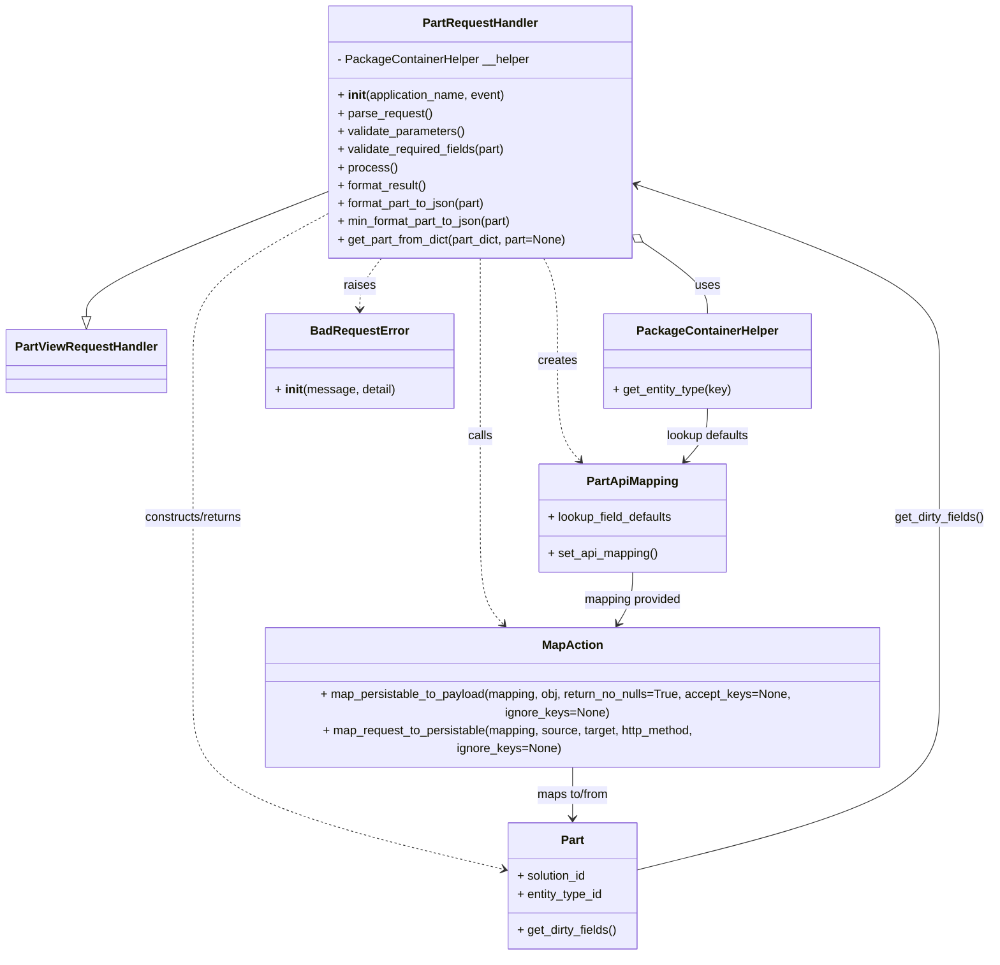
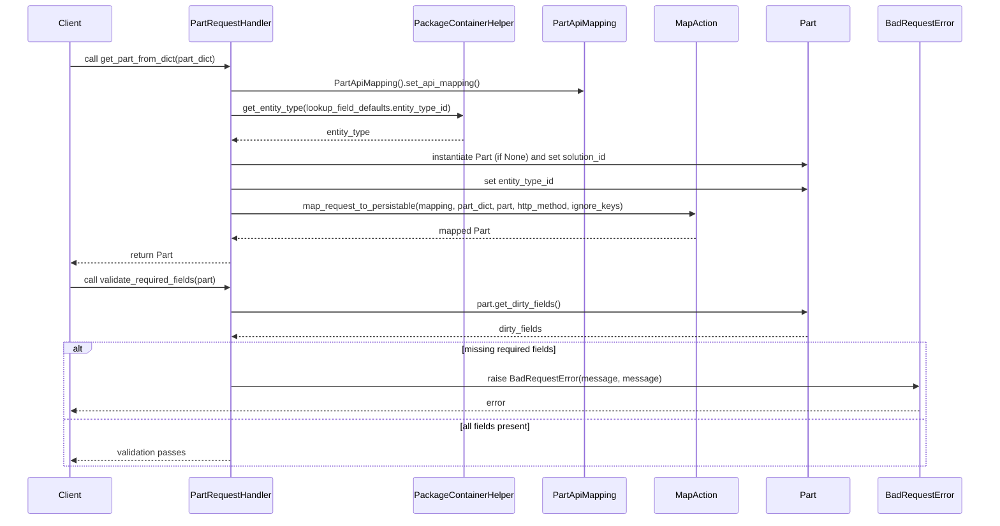

# Diagram: partview_core/partview_service/partview_service/api/part/handlers/PartRequestHandler.py

> Auto-generated by Obscura crawlers

## Diagram 1

### SVG

<svg id="container" width="1315.869140625" xmlns="http://www.w3.org/2000/svg" class="classDiagram" height="1236" viewBox="0 0 1315.869140625 1236" role="graphics-document document" aria-roledescription="class"><g><defs><marker id="container_class-aggregationStart" class="marker aggregation class" refX="18" refY="7" markerWidth="190" markerHeight="240" orient="auto"><path d="M 18,7 L9,13 L1,7 L9,1 Z"></path></marker></defs><defs><marker id="container_class-aggregationEnd" class="marker aggregation class" refX="1" refY="7" markerWidth="20" markerHeight="28" orient="auto"><path d="M 18,7 L9,13 L1,7 L9,1 Z"></path></marker></defs><defs><marker id="container_class-extensionStart" class="marker extension class" refX="18" refY="7" markerWidth="190" markerHeight="240" orient="auto"><path d="M 1,7 L18,13 V 1 Z"></path></marker></defs><defs><marker id="container_class-extensionEnd" class="marker extension class" refX="1" refY="7" markerWidth="20" markerHeight="28" orient="auto"><path d="M 1,1 V 13 L18,7 Z"></path></marker></defs><defs><marker id="container_class-compositionStart" class="marker composition class" refX="18" refY="7" markerWidth="190" markerHeight="240" orient="auto"><path d="M 18,7 L9,13 L1,7 L9,1 Z"></path></marker></defs><defs><marker id="container_class-compositionEnd" class="marker composition class" refX="1" refY="7" markerWidth="20" markerHeight="28" orient="auto"><path d="M 18,7 L9,13 L1,7 L9,1 Z"></path></marker></defs><defs><marker id="container_class-dependencyStart" class="marker dependency class" refX="6" refY="7" markerWidth="190" markerHeight="240" orient="auto"><path d="M 5,7 L9,13 L1,7 L9,1 Z"></path></marker></defs><defs><marker id="container_class-dependencyEnd" class="marker dependency class" refX="13" refY="7" markerWidth="20" markerHeight="28" orient="auto"><path d="M 18,7 L9,13 L14,7 L9,1 Z"></path></marker></defs><defs><marker id="container_class-lollipopStart" class="marker lollipop class" refX="13" refY="7" markerWidth="190" markerHeight="240" orient="auto"><circle stroke="black" fill="transparent" cx="7" cy="7" r="6"></circle></marker></defs><defs><marker id="container_class-lollipopEnd" class="marker lollipop class" refX="1" refY="7" markerWidth="190" markerHeight="240" orient="auto"><circle stroke="black" fill="transparent" cx="7" cy="7" r="6"></circle></marker></defs><g class="root"><g class="clusters"></g><g class="edgePaths"><path d="M429.119,256.3L376.159,277.084C323.199,297.867,217.279,339.433,164.319,367.008C111.359,394.583,111.359,408.167,111.359,414.958L111.359,421.75" id="id_PartRequestHandler_PartViewRequestHandler_1" class="edge-thickness-normal edge-pattern-solid relation" style=";;;" data-edge="true" data-et="edge" data-id="id_PartRequestHandler_PartViewRequestHandler_1" data-points="W3sieCI6NDI5LjExOTE0MDYyNSwieSI6MjU2LjMwMDI3MDMyMTgwNjM1fSx7IngiOjExMS4zNTkzNzUsInkiOjM4MX0seyJ4IjoxMTEuMzU5Mzc1LCJ5Ijo0Mzl9XQ==" marker-end="url(#container_class-extensionEnd)"></path><path d="M852.622,324.98L866.339,334.317C880.056,343.653,907.491,362.327,921.208,377.83C934.926,393.333,934.926,405.667,934.926,411.833L934.926,418" id="id_PartRequestHandler_PackageContainerHelper_2" class="edge-thickness-normal edge-pattern-solid relation" style=";;;" data-edge="true" data-et="edge" data-id="id_PartRequestHandler_PackageContainerHelper_2" data-points="W3sieCI6ODM4LjM2MTMyODEyNSwieSI6MzE1LjI3NDAyNzc2Nzg3MDQ1fSx7IngiOjkzNC45MjU3ODEyNSwieSI6MzgxfSx7IngiOjkzNC45MjU3ODEyNSwieSI6NDE4fV0=" marker-start="url(#container_class-aggregationStart)"></path><path d="M718.584,344L721.698,350.167C724.812,356.333,731.041,368.667,734.155,391.5C737.27,414.333,737.27,447.667,737.27,481C737.27,514.333,737.27,547.667,742.189,569.759C747.109,591.852,756.948,602.703,761.867,608.129L766.787,613.555" id="id_PartRequestHandler_PartApiMapping_3" class="edge-thickness-normal edge-pattern-dashed relation" style=";;;" data-edge="true" data-et="edge" data-id="id_PartRequestHandler_PartApiMapping_3" data-points="W3sieCI6NzE4LjU4Mzc1NTcxNjQ2MzQsInkiOjM0NH0seyJ4Ijo3MzcuMjY5NTMxMjUsInkiOjM4MX0seyJ4Ijo3MzcuMjY5NTMxMjUsInkiOjQ4MX0seyJ4Ijo3MzcuMjY5NTMxMjUsInkiOjU4MX0seyJ4Ijo3NzAuODE2NjkyOTQ3MjQ3NywieSI6NjE4fV0=" marker-end="url(#container_class-dependencyEnd)"></path><path d="M633.74,344L633.74,350.167C633.74,356.333,633.74,368.667,633.74,391.5C633.74,414.333,633.74,447.667,633.74,481C633.74,514.333,633.74,547.667,633.74,582.5C633.74,617.333,633.74,653.667,633.74,690C633.74,726.333,633.74,762.667,639.716,786.323C645.692,809.98,657.645,820.961,663.621,826.451L669.597,831.941" id="id_PartRequestHandler_MapAction_4" class="edge-thickness-normal edge-pattern-dashed relation" style=";;;" data-edge="true" data-et="edge" data-id="id_PartRequestHandler_MapAction_4" data-points="W3sieCI6NjMzLjc0MDIzNDM3NSwieSI6MzQ0fSx7IngiOjYzMy43NDAyMzQzNzUsInkiOjM4MX0seyJ4Ijo2MzMuNzQwMjM0Mzc1LCJ5Ijo0ODF9LHsieCI6NjMzLjc0MDIzNDM3NSwieSI6NTgxfSx7IngiOjYzMy43NDAyMzQzNzUsInkiOjY5MH0seyJ4Ijo2MzMuNzQwMjM0Mzc1LCJ5Ijo3OTl9LHsieCI6Njc0LjAxNTQxNTczNjYwNzEsInkiOjgzNn1d" marker-end="url(#container_class-dependencyEnd)"></path><path d="M429.119,285.232L399.219,301.193C369.319,317.154,309.519,349.077,279.619,381.705C249.719,414.333,249.719,447.667,249.719,481C249.719,514.333,249.719,547.667,249.719,582.5C249.719,617.333,249.719,653.667,249.719,690C249.719,726.333,249.719,762.667,249.719,799.5C249.719,836.333,249.719,873.667,249.719,911C249.719,948.333,249.719,985.667,318.64,1020.817C387.561,1055.966,525.403,1088.933,594.324,1105.416L663.245,1121.899" id="id_PartRequestHandler_Part_5" class="edge-thickness-normal edge-pattern-dashed relation" style=";;;" data-edge="true" data-et="edge" data-id="id_PartRequestHandler_Part_5" data-points="W3sieCI6NDI5LjExOTE0MDYyNSwieSI6Mjg1LjIzMTcxMjA5MjkzMX0seyJ4IjoyNDkuNzE4NzUsInkiOjM4MX0seyJ4IjoyNDkuNzE4NzUsInkiOjQ4MX0seyJ4IjoyNDkuNzE4NzUsInkiOjU4MX0seyJ4IjoyNDkuNzE4NzUsInkiOjY5MH0seyJ4IjoyNDkuNzE4NzUsInkiOjc5OX0seyJ4IjoyNDkuNzE4NzUsInkiOjkxMX0seyJ4IjoyNDkuNzE4NzUsInkiOjEwMjN9LHsieCI6NjY5LjA4MDA3ODEyNSwieSI6MTEyMy4yOTQ4MzIwNTIzMTY1fV0=" marker-end="url(#container_class-dependencyEnd)"></path><path d="M504.469,344L499.723,350.167C494.978,356.333,485.488,368.667,480.743,380C475.998,391.333,475.998,401.667,475.998,406.833L475.998,412" id="id_PartRequestHandler_BadRequestError_6" class="edge-thickness-normal edge-pattern-dashed relation" style=";;;" data-edge="true" data-et="edge" data-id="id_PartRequestHandler_BadRequestError_6" data-points="W3sieCI6NTA0LjQ2ODU4ODAzMzUzNjU1LCJ5IjozNDR9LHsieCI6NDc1Ljk5ODA0Njg3NSwieSI6MzgxfSx7IngiOjQ3NS45OTgwNDY4NzUsInkiOjQxOH1d" marker-end="url(#container_class-dependencyEnd)"></path><path d="M934.926,544L934.926,550.167C934.926,556.333,934.926,568.667,930.006,580.259C925.087,591.852,915.248,602.703,910.328,608.129L905.409,613.555" id="id_PackageContainerHelper_PartApiMapping_7" class="edge-thickness-normal edge-pattern-solid relation" style=";;;" data-edge="true" data-et="edge" data-id="id_PackageContainerHelper_PartApiMapping_7" data-points="W3sieCI6OTM0LjkyNTc4MTI1LCJ5Ijo1NDR9LHsieCI6OTM0LjkyNTc4MTI1LCJ5Ijo1ODF9LHsieCI6OTAxLjM3ODYxOTU1Mjc1MjMsInkiOjYxOH1d" marker-end="url(#container_class-dependencyEnd)"></path><path d="M836.098,762L836.098,768.167C836.098,774.333,836.098,786.667,832.252,798.188C828.406,809.709,820.714,820.418,816.869,825.772L813.023,831.127" id="id_PartApiMapping_MapAction_8" class="edge-thickness-normal edge-pattern-solid relation" style=";;;" data-edge="true" data-et="edge" data-id="id_PartApiMapping_MapAction_8" data-points="W3sieCI6ODM2LjA5NzY1NjI1LCJ5Ijo3NjJ9LHsieCI6ODM2LjA5NzY1NjI1LCJ5Ijo3OTl9LHsieCI6ODA5LjUyMjYxNzg4NTA0NDYsInkiOjgzNn1d" marker-end="url(#container_class-dependencyEnd)"></path><path d="M755.654,986L755.654,992.167C755.654,998.333,755.654,1010.667,755.654,1022C755.654,1033.333,755.654,1043.667,755.654,1048.833L755.654,1054" id="id_MapAction_Part_9" class="edge-thickness-normal edge-pattern-solid relation" style=";;;" data-edge="true" data-et="edge" data-id="id_MapAction_Part_9" data-points="W3sieCI6NzU1LjY1NDI5Njg3NSwieSI6OTg2fSx7IngiOjc1NS42NTQyOTY4NzUsInkiOjEwMjN9LHsieCI6NzU1LjY1NDI5Njg3NSwieSI6MTA2MH1d" marker-end="url(#container_class-dependencyEnd)"></path><path d="M842.229,1122.678L909.682,1106.065C977.135,1089.452,1112.041,1056.226,1179.494,1020.946C1246.947,985.667,1246.947,948.333,1246.947,911C1246.947,873.667,1246.947,836.333,1246.947,799.5C1246.947,762.667,1246.947,726.333,1246.947,690C1246.947,653.667,1246.947,617.333,1246.947,582.5C1246.947,547.667,1246.947,514.333,1246.947,481C1246.947,447.667,1246.947,414.333,1179.798,375.218C1112.649,336.103,978.35,291.206,911.201,268.757L844.052,246.309" id="id_Part_PartRequestHandler_10" class="edge-thickness-normal edge-pattern-solid relation" style=";;;" data-edge="true" data-et="edge" data-id="id_Part_PartRequestHandler_10" data-points="W3sieCI6ODQyLjIyODUxNTYyNSwieSI6MTEyMi42Nzc3MzE3NTA1NjI1fSx7IngiOjEyNDYuOTQ3MjY1NjI1LCJ5IjoxMDIzfSx7IngiOjEyNDYuOTQ3MjY1NjI1LCJ5Ijo5MTF9LHsieCI6MTI0Ni45NDcyNjU2MjUsInkiOjc5OX0seyJ4IjoxMjQ2Ljk0NzI2NTYyNSwieSI6NjkwfSx7IngiOjEyNDYuOTQ3MjY1NjI1LCJ5Ijo1ODF9LHsieCI6MTI0Ni45NDcyNjU2MjUsInkiOjQ4MX0seyJ4IjoxMjQ2Ljk0NzI2NTYyNSwieSI6MzgxfSx7IngiOjgzOC4zNjEzMjgxMjUsInkiOjI0NC40MDY0NjMyMDI1NTMxN31d" marker-end="url(#container_class-dependencyEnd)"></path></g><g class="edgeLabels"><g class="edgeLabel"><g class="label" data-id="id_PartRequestHandler_PartViewRequestHandler_1" transform="translate(0, 0)"><foreignObject width="0" height="0">

</foreignObject></g></g><g class="edgeLabel" transform="translate(934.92578125, 381)"><g class="label" data-id="id_PartRequestHandler_PackageContainerHelper_2" transform="translate(-16.4921875, -12)"><foreignObject width="32.984375" height="24">

uses

</foreignObject></g></g><g class="edgeLabel" transform="translate(737.26953125, 481)"><g class="label" data-id="id_PartRequestHandler_PartApiMapping_3" transform="translate(-26.171875, -12)"><foreignObject width="52.34375" height="24">

creates

</foreignObject></g></g><g class="edgeLabel" transform="translate(633.740234375, 581)"><g class="label" data-id="id_PartRequestHandler_MapAction_4" transform="translate(-16.4453125, -12)"><foreignObject width="32.890625" height="24">

calls

</foreignObject></g></g><g class="edgeLabel" transform="translate(249.71875, 690)"><g class="label" data-id="id_PartRequestHandler_Part_5" transform="translate(-68.03125, -12)"><foreignObject width="136.0625" height="24">

constructs/returns

</foreignObject></g></g><g class="edgeLabel" transform="translate(475.998046875, 381)"><g class="label" data-id="id_PartRequestHandler_BadRequestError_6" transform="translate(-21.25, -12)"><foreignObject width="42.5" height="24">

raises

</foreignObject></g></g><g class="edgeLabel" transform="translate(934.92578125, 581)"><g class="label" data-id="id_PackageContainerHelper_PartApiMapping_7" transform="translate(-56.84375, -12)"><foreignObject width="113.6875" height="24">

lookup defaults

</foreignObject></g></g><g class="edgeLabel" transform="translate(836.09765625, 799)"><g class="label" data-id="id_PartApiMapping_MapAction_8" transform="translate(-66.296875, -12)"><foreignObject width="132.59375" height="24">

mapping provided

</foreignObject></g></g><g class="edgeLabel" transform="translate(755.654296875, 1023)"><g class="label" data-id="id_MapAction_Part_9" transform="translate(-50.234375, -12)"><foreignObject width="100.46875" height="24">

maps to/from

</foreignObject></g></g><g class="edgeLabel" transform="translate(1246.947265625, 690)"><g class="label" data-id="id_Part_PartRequestHandler_10" transform="translate(-60.921875, -12)"><foreignObject width="121.84375" height="24">

get_dirty_fields()

</foreignObject></g></g></g><g class="nodes"><g class="node default" id="classId-PartRequestHandler-0" transform="translate(633.740234375, 176)"><g class="basic label-container"><path d="M-204.62109375 -168 L204.62109375 -168 L204.62109375 168 L-204.62109375 168" stroke="none" stroke-width="0" fill="#ECECFF" style=""></path><path d="M-204.62109375 -168 C-54.43814771224635 -168, 95.7447983255073 -168, 204.62109375 -168 M-204.62109375 -168 C-112.81091711334948 -168, -21.00074047669895 -168, 204.62109375 -168 M204.62109375 -168 C204.62109375 -64.46484569787495, 204.62109375 39.0703086042501, 204.62109375 168 M204.62109375 -168 C204.62109375 -47.10359616844744, 204.62109375 73.79280766310512, 204.62109375 168 M204.62109375 168 C56.26684351814896 168, -92.08740671370208 168, -204.62109375 168 M204.62109375 168 C65.99090311694977 168, -72.63928751610047 168, -204.62109375 168 M-204.62109375 168 C-204.62109375 84.3346850037215, -204.62109375 0.6693700074430069, -204.62109375 -168 M-204.62109375 168 C-204.62109375 38.473554475659796, -204.62109375 -91.05289104868041, -204.62109375 -168" stroke="#9370DB" stroke-width="1.3" fill="none" stroke-dasharray="0 0" style=""></path></g><g class="annotation-group text" transform="translate(0, -144)"></g><g class="label-group text" transform="translate(-74.1328125, -144)"><g class="label" style="font-weight: bolder" transform="translate(0,-12)"><foreignObject width="148.265625" height="24">

PartRequestHandler

</foreignObject></g></g><g class="members-group text" transform="translate(-192.62109375, -96)"><g class="label" style="" transform="translate(0,-12)"><foreignObject width="255.84375" height="24">

- PackageContainerHelper __helper

</foreignObject></g></g><g class="methods-group text" transform="translate(-192.62109375, -48)"><g class="label" style="" transform="translate(0,-12)"><foreignObject width="226.25" height="24">

+ <strong>init</strong>(application_name, event)

</foreignObject></g><g class="label" style="" transform="translate(0,12)"><foreignObject width="126.046875" height="24">

+ parse_request()

</foreignObject></g><g class="label" style="" transform="translate(0,36)"><foreignObject width="170.953125" height="24">

+ validate_parameters()

</foreignObject></g><g class="label" style="" transform="translate(0,60)"><foreignObject width="227.84375" height="24">

+ validate_required_fields(part)

</foreignObject></g><g class="label" style="" transform="translate(0,84)"><foreignObject width="77.96875" height="24">

+ process()

</foreignObject></g><g class="label" style="" transform="translate(0,108)"><foreignObject width="121.5" height="24">

+ format_result()

</foreignObject></g><g class="label" style="" transform="translate(0,132)"><foreignObject width="201.953125" height="24">

+ format_part_to_json(part)

</foreignObject></g><g class="label" style="" transform="translate(0,156)"><foreignObject width="237.5625" height="24">

+ min_format_part_to_json(part)

</foreignObject></g><g class="label" style="" transform="translate(0,180)"><foreignObject width="311.109375" height="24">

+ get_part_from_dict(part_dict, part=None)

</foreignObject></g></g><g class="divider" style=""><path d="M-204.62109375 -120 C-110.33922493375387 -120, -16.057356117507737 -120, 204.62109375 -120 M-204.62109375 -120 C-49.1633962004247 -120, 106.2943013491506 -120, 204.62109375 -120" stroke="#9370DB" stroke-width="1.3" fill="none" stroke-dasharray="0 0" style=""></path></g><g class="divider" style=""><path d="M-204.62109375 -72 C-62.74754047149443 -72, 79.12601280701114 -72, 204.62109375 -72 M-204.62109375 -72 C-75.77603096934607 -72, 53.069031811307866 -72, 204.62109375 -72" stroke="#9370DB" stroke-width="1.3" fill="none" stroke-dasharray="0 0" style=""></path></g></g><g class="node default" id="classId-PartViewRequestHandler-1" transform="translate(111.359375, 481)"><g class="basic label-container"><path d="M-103.359375 -42 L103.359375 -42 L103.359375 42 L-103.359375 42" stroke="none" stroke-width="0" fill="#ECECFF" style=""></path><path d="M-103.359375 -42 C-51.25300209733591 -42, 0.8533708053281828 -42, 103.359375 -42 M-103.359375 -42 C-30.86139432633115 -42, 41.6365863473377 -42, 103.359375 -42 M103.359375 -42 C103.359375 -9.85966495453156, 103.359375 22.28067009093688, 103.359375 42 M103.359375 -42 C103.359375 -11.948327151096738, 103.359375 18.103345697806525, 103.359375 42 M103.359375 42 C27.07602919846815 42, -49.2073166030637 42, -103.359375 42 M103.359375 42 C35.147267382874986 42, -33.06484023425003 42, -103.359375 42 M-103.359375 42 C-103.359375 18.912343801285658, -103.359375 -4.175312397428684, -103.359375 -42 M-103.359375 42 C-103.359375 24.59338828395217, -103.359375 7.186776567904339, -103.359375 -42" stroke="#9370DB" stroke-width="1.3" fill="none" stroke-dasharray="0 0" style=""></path></g><g class="annotation-group text" transform="translate(0, -18)"></g><g class="label-group text" transform="translate(-91.359375, -18)"><g class="label" style="font-weight: bolder" transform="translate(0,-12)"><foreignObject width="182.71875" height="24">

PartViewRequestHandler

</foreignObject></g></g><g class="members-group text" transform="translate(-91.359375, 30)"></g><g class="methods-group text" transform="translate(-91.359375, 60)"></g><g class="divider" style=""><path d="M-103.359375 6 C-22.259638789048424 6, 58.84009742190315 6, 103.359375 6 M-103.359375 6 C-24.903123039470557 6, 53.553128921058885 6, 103.359375 6" stroke="#9370DB" stroke-width="1.3" fill="none" stroke-dasharray="0 0" style=""></path></g><g class="divider" style=""><path d="M-103.359375 24 C-43.615870202819366 24, 16.12763459436127 24, 103.359375 24 M-103.359375 24 C-37.302151835762174 24, 28.75507132847565 24, 103.359375 24" stroke="#9370DB" stroke-width="1.3" fill="none" stroke-dasharray="0 0" style=""></path></g></g><g class="node default" id="classId-PackageContainerHelper-2" transform="translate(934.92578125, 481)"><g class="basic label-container"><path d="M-136.484375 -63 L136.484375 -63 L136.484375 63 L-136.484375 63" stroke="none" stroke-width="0" fill="#ECECFF" style=""></path><path d="M-136.484375 -63 C-34.93381578011355 -63, 66.6167434397729 -63, 136.484375 -63 M-136.484375 -63 C-55.52009108339517 -63, 25.444192833209655 -63, 136.484375 -63 M136.484375 -63 C136.484375 -17.303544254684773, 136.484375 28.392911490630453, 136.484375 63 M136.484375 -63 C136.484375 -22.04442013834558, 136.484375 18.91115972330884, 136.484375 63 M136.484375 63 C65.44599441348181 63, -5.592386173036374 63, -136.484375 63 M136.484375 63 C39.38131663298937 63, -57.721741734021265 63, -136.484375 63 M-136.484375 63 C-136.484375 32.78019186511554, -136.484375 2.560383730231081, -136.484375 -63 M-136.484375 63 C-136.484375 22.58431815876341, -136.484375 -17.83136368247318, -136.484375 -63" stroke="#9370DB" stroke-width="1.3" fill="none" stroke-dasharray="0 0" style=""></path></g><g class="annotation-group text" transform="translate(0, -39)"></g><g class="label-group text" transform="translate(-89.96875, -39)"><g class="label" style="font-weight: bolder" transform="translate(0,-12)"><foreignObject width="179.9375" height="24">

PackageContainerHelper

</foreignObject></g></g><g class="members-group text" transform="translate(-124.484375, 9)"></g><g class="methods-group text" transform="translate(-124.484375, 39)"><g class="label" style="" transform="translate(0,-12)"><foreignObject width="159" height="24">

+ get_entity_type(key)

</foreignObject></g></g><g class="divider" style=""><path d="M-136.484375 -15 C-48.988792386684736 -15, 38.50679022663053 -15, 136.484375 -15 M-136.484375 -15 C-34.20207341877666 -15, 68.08022816244667 -15, 136.484375 -15" stroke="#9370DB" stroke-width="1.3" fill="none" stroke-dasharray="0 0" style=""></path></g><g class="divider" style=""><path d="M-136.484375 9 C-44.16648100667146 9, 48.15141298665708 9, 136.484375 9 M-136.484375 9 C-56.7383170569323 9, 23.007740886135394 9, 136.484375 9" stroke="#9370DB" stroke-width="1.3" fill="none" stroke-dasharray="0 0" style=""></path></g></g><g class="node default" id="classId-PartApiMapping-3" transform="translate(836.09765625, 690)"><g class="basic label-container"><path d="M-125.88671875 -72 L125.88671875 -72 L125.88671875 72 L-125.88671875 72" stroke="none" stroke-width="0" fill="#ECECFF" style=""></path><path d="M-125.88671875 -72 C-27.61867028320188 -72, 70.64937818359624 -72, 125.88671875 -72 M-125.88671875 -72 C-47.21272874343029 -72, 31.46126126313942 -72, 125.88671875 -72 M125.88671875 -72 C125.88671875 -15.04688225696178, 125.88671875 41.90623548607644, 125.88671875 72 M125.88671875 -72 C125.88671875 -24.010719833619802, 125.88671875 23.978560332760395, 125.88671875 72 M125.88671875 72 C27.429901796915303 72, -71.0269151561694 72, -125.88671875 72 M125.88671875 72 C44.29014557524384 72, -37.30642759951232 72, -125.88671875 72 M-125.88671875 72 C-125.88671875 37.86006035179294, -125.88671875 3.720120703585877, -125.88671875 -72 M-125.88671875 72 C-125.88671875 42.56577550672581, -125.88671875 13.131551013451613, -125.88671875 -72" stroke="#9370DB" stroke-width="1.3" fill="none" stroke-dasharray="0 0" style=""></path></g><g class="annotation-group text" transform="translate(0, -48)"></g><g class="label-group text" transform="translate(-58.3203125, -48)"><g class="label" style="font-weight: bolder" transform="translate(0,-12)"><foreignObject width="116.640625" height="24">

PartApiMapping

</foreignObject></g></g><g class="members-group text" transform="translate(-113.88671875, 0)"><g class="label" style="" transform="translate(0,-12)"><foreignObject width="169.453125" height="24">

+ lookup_field_defaults

</foreignObject></g></g><g class="methods-group text" transform="translate(-113.88671875, 48)"><g class="label" style="" transform="translate(0,-12)"><foreignObject width="147.234375" height="24">

+ set_api_mapping()

</foreignObject></g></g><g class="divider" style=""><path d="M-125.88671875 -24 C-54.194342324378894 -24, 17.49803410124221 -24, 125.88671875 -24 M-125.88671875 -24 C-46.19621513037383 -24, 33.49428848925234 -24, 125.88671875 -24" stroke="#9370DB" stroke-width="1.3" fill="none" stroke-dasharray="0 0" style=""></path></g><g class="divider" style=""><path d="M-125.88671875 24 C-35.807630573227726 24, 54.27145760354455 24, 125.88671875 24 M-125.88671875 24 C-59.29610222782105 24, 7.294514294357896 24, 125.88671875 24" stroke="#9370DB" stroke-width="1.3" fill="none" stroke-dasharray="0 0" style=""></path></g></g><g class="node default" id="classId-MapAction-4" transform="translate(755.654296875, 911)"><g class="basic label-container"><path d="M-417.55859375 -75 L417.55859375 -75 L417.55859375 75 L-417.55859375 75" stroke="none" stroke-width="0" fill="#ECECFF" style=""></path><path d="M-417.55859375 -75 C-152.51066341246423 -75, 112.53726692507155 -75, 417.55859375 -75 M-417.55859375 -75 C-240.8659679064624 -75, -64.1733420629248 -75, 417.55859375 -75 M417.55859375 -75 C417.55859375 -41.8243453857483, 417.55859375 -8.648690771496604, 417.55859375 75 M417.55859375 -75 C417.55859375 -28.891020875829952, 417.55859375 17.217958248340096, 417.55859375 75 M417.55859375 75 C205.66820891914654 75, -6.222175911706927 75, -417.55859375 75 M417.55859375 75 C103.8226046991968 75, -209.9133843516064 75, -417.55859375 75 M-417.55859375 75 C-417.55859375 36.618873385168335, -417.55859375 -1.7622532296633295, -417.55859375 -75 M-417.55859375 75 C-417.55859375 21.92004639227099, -417.55859375 -31.15990721545802, -417.55859375 -75" stroke="#9370DB" stroke-width="1.3" fill="none" stroke-dasharray="0 0" style=""></path></g><g class="annotation-group text" transform="translate(0, -51)"></g><g class="label-group text" transform="translate(-38.6328125, -51)"><g class="label" style="font-weight: bolder" transform="translate(0,-12)"><foreignObject width="77.265625" height="24">

MapAction

</foreignObject></g></g><g class="members-group text" transform="translate(-405.55859375, -3)"></g><g class="methods-group text" transform="translate(-405.55859375, 27)"><g class="label" style="" transform="translate(0,-12)"><foreignObject width="772.484375" height="24">

+ map_persistable_to_payload(mapping, obj, return_no_nulls=True, accept_keys=None, ignore_keys=None)

</foreignObject></g><g class="label" style="" transform="translate(0,12)"><foreignObject width="643.265625" height="24">

+ map_request_to_persistable(mapping, source, target, http_method, ignore_keys=None)

</foreignObject></g></g><g class="divider" style=""><path d="M-417.55859375 -27 C-136.29497772529027 -27, 144.96863829941947 -27, 417.55859375 -27 M-417.55859375 -27 C-235.00640357889057 -27, -52.45421340778114 -27, 417.55859375 -27" stroke="#9370DB" stroke-width="1.3" fill="none" stroke-dasharray="0 0" style=""></path></g><g class="divider" style=""><path d="M-417.55859375 -3 C-207.7176320736408 -3, 2.1233296027183997 -3, 417.55859375 -3 M-417.55859375 -3 C-178.00624405805488 -3, 61.54610563389025 -3, 417.55859375 -3" stroke="#9370DB" stroke-width="1.3" fill="none" stroke-dasharray="0 0" style=""></path></g></g><g class="node default" id="classId-Part-5" transform="translate(755.654296875, 1144)"><g class="basic label-container"><path d="M-86.57421875 -84 L86.57421875 -84 L86.57421875 84 L-86.57421875 84" stroke="none" stroke-width="0" fill="#ECECFF" style=""></path><path d="M-86.57421875 -84 C-27.90155810521391 -84, 30.771102539572183 -84, 86.57421875 -84 M-86.57421875 -84 C-47.92618025894783 -84, -9.278141767895661 -84, 86.57421875 -84 M86.57421875 -84 C86.57421875 -29.96982835384012, 86.57421875 24.060343292319757, 86.57421875 84 M86.57421875 -84 C86.57421875 -48.63720154648915, 86.57421875 -13.274403092978304, 86.57421875 84 M86.57421875 84 C35.692198193280625 84, -15.18982236343875 84, -86.57421875 84 M86.57421875 84 C35.799568210331756 84, -14.975082329336487 84, -86.57421875 84 M-86.57421875 84 C-86.57421875 24.703722770066058, -86.57421875 -34.592554459867884, -86.57421875 -84 M-86.57421875 84 C-86.57421875 26.610339373930266, -86.57421875 -30.779321252139468, -86.57421875 -84" stroke="#9370DB" stroke-width="1.3" fill="none" stroke-dasharray="0 0" style=""></path></g><g class="annotation-group text" transform="translate(0, -60)"></g><g class="label-group text" transform="translate(-15.0703125, -60)"><g class="label" style="font-weight: bolder" transform="translate(0,-12)"><foreignObject width="30.140625" height="24">

Part

</foreignObject></g></g><g class="members-group text" transform="translate(-74.57421875, -12)"><g class="label" style="" transform="translate(0,-12)"><foreignObject width="94.453125" height="24">

+ solution_id

</foreignObject></g><g class="label" style="" transform="translate(0,12)"><foreignObject width="115.578125" height="24">

+ entity_type_id

</foreignObject></g></g><g class="methods-group text" transform="translate(-74.57421875, 60)"><g class="label" style="" transform="translate(0,-12)"><foreignObject width="134.078125" height="24">

+ get_dirty_fields()

</foreignObject></g></g><g class="divider" style=""><path d="M-86.57421875 -36 C-25.859739266190275 -36, 34.85474021761945 -36, 86.57421875 -36 M-86.57421875 -36 C-33.58648432058784 -36, 19.401250108824314 -36, 86.57421875 -36" stroke="#9370DB" stroke-width="1.3" fill="none" stroke-dasharray="0 0" style=""></path></g><g class="divider" style=""><path d="M-86.57421875 36 C-22.20914462139217 36, 42.15592950721566 36, 86.57421875 36 M-86.57421875 36 C-31.874987037054268 36, 22.824244675891464 36, 86.57421875 36" stroke="#9370DB" stroke-width="1.3" fill="none" stroke-dasharray="0 0" style=""></path></g></g><g class="node default" id="classId-BadRequestError-6" transform="translate(475.998046875, 481)"><g class="basic label-container"><path d="M-122.7421875 -63 L122.7421875 -63 L122.7421875 63 L-122.7421875 63" stroke="none" stroke-width="0" fill="#ECECFF" style=""></path><path d="M-122.7421875 -63 C-48.981532087318925 -63, 24.77912332536215 -63, 122.7421875 -63 M-122.7421875 -63 C-28.693242337907535 -63, 65.35570282418493 -63, 122.7421875 -63 M122.7421875 -63 C122.7421875 -16.036315115168883, 122.7421875 30.927369769662235, 122.7421875 63 M122.7421875 -63 C122.7421875 -22.774338392301793, 122.7421875 17.451323215396414, 122.7421875 63 M122.7421875 63 C35.97740685725918 63, -50.787373785481634 63, -122.7421875 63 M122.7421875 63 C47.55538260554016 63, -27.63142228891968 63, -122.7421875 63 M-122.7421875 63 C-122.7421875 36.527745439910994, -122.7421875 10.055490879821988, -122.7421875 -63 M-122.7421875 63 C-122.7421875 29.501223309488424, -122.7421875 -3.9975533810231525, -122.7421875 -63" stroke="#9370DB" stroke-width="1.3" fill="none" stroke-dasharray="0 0" style=""></path></g><g class="annotation-group text" transform="translate(0, -39)"></g><g class="label-group text" transform="translate(-62.28125, -39)"><g class="label" style="font-weight: bolder" transform="translate(0,-12)"><foreignObject width="124.5625" height="24">

BadRequestError

</foreignObject></g></g><g class="members-group text" transform="translate(-110.7421875, 9)"></g><g class="methods-group text" transform="translate(-110.7421875, 39)"><g class="label" style="" transform="translate(0,-12)"><foreignObject width="159.203125" height="24">

+ <strong>init</strong>(message, detail)

</foreignObject></g></g><g class="divider" style=""><path d="M-122.7421875 -15 C-33.715306555007174 -15, 55.31157438998565 -15, 122.7421875 -15 M-122.7421875 -15 C-40.19540821733082 -15, 42.351371065338355 -15, 122.7421875 -15" stroke="#9370DB" stroke-width="1.3" fill="none" stroke-dasharray="0 0" style=""></path></g><g class="divider" style=""><path d="M-122.7421875 9 C-64.2334820521061 9, -5.7247766042122095 9, 122.7421875 9 M-122.7421875 9 C-37.41303860622868 9, 47.91611028754264 9, 122.7421875 9" stroke="#9370DB" stroke-width="1.3" fill="none" stroke-dasharray="0 0" style=""></path></g></g></g></g></g></svg>

## Diagram 2

### SVG

<svg id="container" width="1845" xmlns="http://www.w3.org/2000/svg" height="991" viewBox="-50 -10 1845 991" role="graphics-document document" aria-roledescription="sequence"><g><rect x="1595" y="905" fill="#eaeaea" stroke="#666" width="150" height="65" name="Err" rx="3" ry="3" class="actor actor-bottom"></rect><text x="1670" y="937.5" dominant-baseline="central" alignment-baseline="central" class="actor actor-box" style="text-anchor: middle; font-size: 16px; font-weight: 400;"><tspan x="1670" dy="0">BadRequestError</tspan></text></g><g><rect x="1395" y="905" fill="#eaeaea" stroke="#666" width="150" height="65" name="PartEnt" rx="3" ry="3" class="actor actor-bottom"></rect><text x="1470" y="937.5" dominant-baseline="central" alignment-baseline="central" class="actor actor-box" style="text-anchor: middle; font-size: 16px; font-weight: 400;"><tspan x="1470" dy="0">Part</tspan></text></g><g><rect x="1195" y="905" fill="#eaeaea" stroke="#666" width="150" height="65" name="Map" rx="3" ry="3" class="actor actor-bottom"></rect><text x="1270" y="937.5" dominant-baseline="central" alignment-baseline="central" class="actor actor-box" style="text-anchor: middle; font-size: 16px; font-weight: 400;"><tspan x="1270" dy="0">MapAction</tspan></text></g><g><rect x="995" y="905" fill="#eaeaea" stroke="#666" width="150" height="65" name="PAM" rx="3" ry="3" class="actor actor-bottom"></rect><text x="1070" y="937.5" dominant-baseline="central" alignment-baseline="central" class="actor actor-box" style="text-anchor: middle; font-size: 16px; font-weight: 400;"><tspan x="1070" dy="0">PartApiMapping</tspan></text></g><g><rect x="747" y="905" fill="#eaeaea" stroke="#666" width="198" height="65" name="Helper" rx="3" ry="3" class="actor actor-bottom"></rect><text x="846" y="937.5" dominant-baseline="central" alignment-baseline="central" class="actor actor-box" style="text-anchor: middle; font-size: 16px; font-weight: 400;"><tspan x="846" dy="0">PackageContainerHelper</tspan></text></g><g><rect x="306.5" y="905" fill="#eaeaea" stroke="#666" width="167" height="65" name="PRH" rx="3" ry="3" class="actor actor-bottom"></rect><text x="390" y="937.5" dominant-baseline="central" alignment-baseline="central" class="actor actor-box" style="text-anchor: middle; font-size: 16px; font-weight: 400;"><tspan x="390" dy="0">PartRequestHandler</tspan></text></g><g><rect x="0" y="905" fill="#eaeaea" stroke="#666" width="150" height="65" name="Caller" rx="3" ry="3" class="actor actor-bottom"></rect><text x="75" y="937.5" dominant-baseline="central" alignment-baseline="central" class="actor actor-box" style="text-anchor: middle; font-size: 16px; font-weight: 400;"><tspan x="75" dy="0">Client</tspan></text></g><g><line id="actor6" x1="1670" y1="65" x2="1670" y2="905" class="actor-line 200" stroke-width="0.5px" stroke="#999" name="Err"></line><g id="root-6"><rect x="1595" y="0" fill="#eaeaea" stroke="#666" width="150" height="65" name="Err" rx="3" ry="3" class="actor actor-top"></rect><text x="1670" y="32.5" dominant-baseline="central" alignment-baseline="central" class="actor actor-box" style="text-anchor: middle; font-size: 16px; font-weight: 400;"><tspan x="1670" dy="0">BadRequestError</tspan></text></g></g><g><line id="actor5" x1="1470" y1="65" x2="1470" y2="905" class="actor-line 200" stroke-width="0.5px" stroke="#999" name="PartEnt"></line><g id="root-5"><rect x="1395" y="0" fill="#eaeaea" stroke="#666" width="150" height="65" name="PartEnt" rx="3" ry="3" class="actor actor-top"></rect><text x="1470" y="32.5" dominant-baseline="central" alignment-baseline="central" class="actor actor-box" style="text-anchor: middle; font-size: 16px; font-weight: 400;"><tspan x="1470" dy="0">Part</tspan></text></g></g><g><line id="actor4" x1="1270" y1="65" x2="1270" y2="905" class="actor-line 200" stroke-width="0.5px" stroke="#999" name="Map"></line><g id="root-4"><rect x="1195" y="0" fill="#eaeaea" stroke="#666" width="150" height="65" name="Map" rx="3" ry="3" class="actor actor-top"></rect><text x="1270" y="32.5" dominant-baseline="central" alignment-baseline="central" class="actor actor-box" style="text-anchor: middle; font-size: 16px; font-weight: 400;"><tspan x="1270" dy="0">MapAction</tspan></text></g></g><g><line id="actor3" x1="1070" y1="65" x2="1070" y2="905" class="actor-line 200" stroke-width="0.5px" stroke="#999" name="PAM"></line><g id="root-3"><rect x="995" y="0" fill="#eaeaea" stroke="#666" width="150" height="65" name="PAM" rx="3" ry="3" class="actor actor-top"></rect><text x="1070" y="32.5" dominant-baseline="central" alignment-baseline="central" class="actor actor-box" style="text-anchor: middle; font-size: 16px; font-weight: 400;"><tspan x="1070" dy="0">PartApiMapping</tspan></text></g></g><g><line id="actor2" x1="846" y1="65" x2="846" y2="905" class="actor-line 200" stroke-width="0.5px" stroke="#999" name="Helper"></line><g id="root-2"><rect x="747" y="0" fill="#eaeaea" stroke="#666" width="198" height="65" name="Helper" rx="3" ry="3" class="actor actor-top"></rect><text x="846" y="32.5" dominant-baseline="central" alignment-baseline="central" class="actor actor-box" style="text-anchor: middle; font-size: 16px; font-weight: 400;"><tspan x="846" dy="0">PackageContainerHelper</tspan></text></g></g><g><line id="actor1" x1="390" y1="65" x2="390" y2="905" class="actor-line 200" stroke-width="0.5px" stroke="#999" name="PRH"></line><g id="root-1"><rect x="306.5" y="0" fill="#eaeaea" stroke="#666" width="167" height="65" name="PRH" rx="3" ry="3" class="actor actor-top"></rect><text x="390" y="32.5" dominant-baseline="central" alignment-baseline="central" class="actor actor-box" style="text-anchor: middle; font-size: 16px; font-weight: 400;"><tspan x="390" dy="0">PartRequestHandler</tspan></text></g></g><g><line id="actor0" x1="75" y1="65" x2="75" y2="905" class="actor-line 200" stroke-width="0.5px" stroke="#999" name="Caller"></line><g id="root-0"><rect x="0" y="0" fill="#eaeaea" stroke="#666" width="150" height="65" name="Caller" rx="3" ry="3" class="actor actor-top"></rect><text x="75" y="32.5" dominant-baseline="central" alignment-baseline="central" class="actor actor-box" style="text-anchor: middle; font-size: 16px; font-weight: 400;"><tspan x="75" dy="0">Client</tspan></text></g></g><g></g><defs><symbol id="computer" width="24" height="24"><path transform="scale(.5)" d="M2 2v13h20v-13h-20zm18 11h-16v-9h16v9zm-10.228 6l.466-1h3.524l.467 1h-4.457zm14.228 3h-24l2-6h2.104l-1.33 4h18.45l-1.297-4h2.073l2 6zm-5-10h-14v-7h14v7z"></path></symbol></defs><defs><symbol id="database" fill-rule="evenodd" clip-rule="evenodd"><path transform="scale(.5)" d="M12.258.001l.256.004.255.005.253.008.251.01.249.012.247.015.246.016.242.019.241.02.239.023.236.024.233.027.231.028.229.031.225.032.223.034.22.036.217.038.214.04.211.041.208.043.205.045.201.046.198.048.194.05.191.051.187.053.183.054.18.056.175.057.172.059.168.06.163.061.16.063.155.064.15.066.074.033.073.033.071.034.07.034.069.035.068.035.067.035.066.035.064.036.064.036.062.036.06.036.06.037.058.037.058.037.055.038.055.038.053.038.052.038.051.039.05.039.048.039.047.039.045.04.044.04.043.04.041.04.04.041.039.041.037.041.036.041.034.041.033.042.032.042.03.042.029.042.027.042.026.043.024.043.023.043.021.043.02.043.018.044.017.043.015.044.013.044.012.044.011.045.009.044.007.045.006.045.004.045.002.045.001.045v17l-.001.045-.002.045-.004.045-.006.045-.007.045-.009.044-.011.045-.012.044-.013.044-.015.044-.017.043-.018.044-.02.043-.021.043-.023.043-.024.043-.026.043-.027.042-.029.042-.03.042-.032.042-.033.042-.034.041-.036.041-.037.041-.039.041-.04.041-.041.04-.043.04-.044.04-.045.04-.047.039-.048.039-.05.039-.051.039-.052.038-.053.038-.055.038-.055.038-.058.037-.058.037-.06.037-.06.036-.062.036-.064.036-.064.036-.066.035-.067.035-.068.035-.069.035-.07.034-.071.034-.073.033-.074.033-.15.066-.155.064-.16.063-.163.061-.168.06-.172.059-.175.057-.18.056-.183.054-.187.053-.191.051-.194.05-.198.048-.201.046-.205.045-.208.043-.211.041-.214.04-.217.038-.22.036-.223.034-.225.032-.229.031-.231.028-.233.027-.236.024-.239.023-.241.02-.242.019-.246.016-.247.015-.249.012-.251.01-.253.008-.255.005-.256.004-.258.001-.258-.001-.256-.004-.255-.005-.253-.008-.251-.01-.249-.012-.247-.015-.245-.016-.243-.019-.241-.02-.238-.023-.236-.024-.234-.027-.231-.028-.228-.031-.226-.032-.223-.034-.22-.036-.217-.038-.214-.04-.211-.041-.208-.043-.204-.045-.201-.046-.198-.048-.195-.05-.19-.051-.187-.053-.184-.054-.179-.056-.176-.057-.172-.059-.167-.06-.164-.061-.159-.063-.155-.064-.151-.066-.074-.033-.072-.033-.072-.034-.07-.034-.069-.035-.068-.035-.067-.035-.066-.035-.064-.036-.063-.036-.062-.036-.061-.036-.06-.037-.058-.037-.057-.037-.056-.038-.055-.038-.053-.038-.052-.038-.051-.039-.049-.039-.049-.039-.046-.039-.046-.04-.044-.04-.043-.04-.041-.04-.04-.041-.039-.041-.037-.041-.036-.041-.034-.041-.033-.042-.032-.042-.03-.042-.029-.042-.027-.042-.026-.043-.024-.043-.023-.043-.021-.043-.02-.043-.018-.044-.017-.043-.015-.044-.013-.044-.012-.044-.011-.045-.009-.044-.007-.045-.006-.045-.004-.045-.002-.045-.001-.045v-17l.001-.045.002-.045.004-.045.006-.045.007-.045.009-.044.011-.045.012-.044.013-.044.015-.044.017-.043.018-.044.02-.043.021-.043.023-.043.024-.043.026-.043.027-.042.029-.042.03-.042.032-.042.033-.042.034-.041.036-.041.037-.041.039-.041.04-.041.041-.04.043-.04.044-.04.046-.04.046-.039.049-.039.049-.039.051-.039.052-.038.053-.038.055-.038.056-.038.057-.037.058-.037.06-.037.061-.036.062-.036.063-.036.064-.036.066-.035.067-.035.068-.035.069-.035.07-.034.072-.034.072-.033.074-.033.151-.066.155-.064.159-.063.164-.061.167-.06.172-.059.176-.057.179-.056.184-.054.187-.053.19-.051.195-.05.198-.048.201-.046.204-.045.208-.043.211-.041.214-.04.217-.038.22-.036.223-.034.226-.032.228-.031.231-.028.234-.027.236-.024.238-.023.241-.02.243-.019.245-.016.247-.015.249-.012.251-.01.253-.008.255-.005.256-.004.258-.001.258.001zm-9.258 20.499v.01l.001.021.003.021.004.022.005.021.006.022.007.022.009.023.01.022.011.023.012.023.013.023.015.023.016.024.017.023.018.024.019.024.021.024.022.025.023.024.024.025.052.049.056.05.061.051.066.051.07.051.075.051.079.052.084.052.088.052.092.052.097.052.102.051.105.052.11.052.114.051.119.051.123.051.127.05.131.05.135.05.139.048.144.049.147.047.152.047.155.047.16.045.163.045.167.043.171.043.176.041.178.041.183.039.187.039.19.037.194.035.197.035.202.033.204.031.209.03.212.029.216.027.219.025.222.024.226.021.23.02.233.018.236.016.24.015.243.012.246.01.249.008.253.005.256.004.259.001.26-.001.257-.004.254-.005.25-.008.247-.011.244-.012.241-.014.237-.016.233-.018.231-.021.226-.021.224-.024.22-.026.216-.027.212-.028.21-.031.205-.031.202-.034.198-.034.194-.036.191-.037.187-.039.183-.04.179-.04.175-.042.172-.043.168-.044.163-.045.16-.046.155-.046.152-.047.148-.048.143-.049.139-.049.136-.05.131-.05.126-.05.123-.051.118-.052.114-.051.11-.052.106-.052.101-.052.096-.052.092-.052.088-.053.083-.051.079-.052.074-.052.07-.051.065-.051.06-.051.056-.05.051-.05.023-.024.023-.025.021-.024.02-.024.019-.024.018-.024.017-.024.015-.023.014-.024.013-.023.012-.023.01-.023.01-.022.008-.022.006-.022.006-.022.004-.022.004-.021.001-.021.001-.021v-4.127l-.077.055-.08.053-.083.054-.085.053-.087.052-.09.052-.093.051-.095.05-.097.05-.1.049-.102.049-.105.048-.106.047-.109.047-.111.046-.114.045-.115.045-.118.044-.12.043-.122.042-.124.042-.126.041-.128.04-.13.04-.132.038-.134.038-.135.037-.138.037-.139.035-.142.035-.143.034-.144.033-.147.032-.148.031-.15.03-.151.03-.153.029-.154.027-.156.027-.158.026-.159.025-.161.024-.162.023-.163.022-.165.021-.166.02-.167.019-.169.018-.169.017-.171.016-.173.015-.173.014-.175.013-.175.012-.177.011-.178.01-.179.008-.179.008-.181.006-.182.005-.182.004-.184.003-.184.002h-.37l-.184-.002-.184-.003-.182-.004-.182-.005-.181-.006-.179-.008-.179-.008-.178-.01-.176-.011-.176-.012-.175-.013-.173-.014-.172-.015-.171-.016-.17-.017-.169-.018-.167-.019-.166-.02-.165-.021-.163-.022-.162-.023-.161-.024-.159-.025-.157-.026-.156-.027-.155-.027-.153-.029-.151-.03-.15-.03-.148-.031-.146-.032-.145-.033-.143-.034-.141-.035-.14-.035-.137-.037-.136-.037-.134-.038-.132-.038-.13-.04-.128-.04-.126-.041-.124-.042-.122-.042-.12-.044-.117-.043-.116-.045-.113-.045-.112-.046-.109-.047-.106-.047-.105-.048-.102-.049-.1-.049-.097-.05-.095-.05-.093-.052-.09-.051-.087-.052-.085-.053-.083-.054-.08-.054-.077-.054v4.127zm0-5.654v.011l.001.021.003.021.004.021.005.022.006.022.007.022.009.022.01.022.011.023.012.023.013.023.015.024.016.023.017.024.018.024.019.024.021.024.022.024.023.025.024.024.052.05.056.05.061.05.066.051.07.051.075.052.079.051.084.052.088.052.092.052.097.052.102.052.105.052.11.051.114.051.119.052.123.05.127.051.131.05.135.049.139.049.144.048.147.048.152.047.155.046.16.045.163.045.167.044.171.042.176.042.178.04.183.04.187.038.19.037.194.036.197.034.202.033.204.032.209.03.212.028.216.027.219.025.222.024.226.022.23.02.233.018.236.016.24.014.243.012.246.01.249.008.253.006.256.003.259.001.26-.001.257-.003.254-.006.25-.008.247-.01.244-.012.241-.015.237-.016.233-.018.231-.02.226-.022.224-.024.22-.025.216-.027.212-.029.21-.03.205-.032.202-.033.198-.035.194-.036.191-.037.187-.039.183-.039.179-.041.175-.042.172-.043.168-.044.163-.045.16-.045.155-.047.152-.047.148-.048.143-.048.139-.05.136-.049.131-.05.126-.051.123-.051.118-.051.114-.052.11-.052.106-.052.101-.052.096-.052.092-.052.088-.052.083-.052.079-.052.074-.051.07-.052.065-.051.06-.05.056-.051.051-.049.023-.025.023-.024.021-.025.02-.024.019-.024.018-.024.017-.024.015-.023.014-.023.013-.024.012-.022.01-.023.01-.023.008-.022.006-.022.006-.022.004-.021.004-.022.001-.021.001-.021v-4.139l-.077.054-.08.054-.083.054-.085.052-.087.053-.09.051-.093.051-.095.051-.097.05-.1.049-.102.049-.105.048-.106.047-.109.047-.111.046-.114.045-.115.044-.118.044-.12.044-.122.042-.124.042-.126.041-.128.04-.13.039-.132.039-.134.038-.135.037-.138.036-.139.036-.142.035-.143.033-.144.033-.147.033-.148.031-.15.03-.151.03-.153.028-.154.028-.156.027-.158.026-.159.025-.161.024-.162.023-.163.022-.165.021-.166.02-.167.019-.169.018-.169.017-.171.016-.173.015-.173.014-.175.013-.175.012-.177.011-.178.009-.179.009-.179.007-.181.007-.182.005-.182.004-.184.003-.184.002h-.37l-.184-.002-.184-.003-.182-.004-.182-.005-.181-.007-.179-.007-.179-.009-.178-.009-.176-.011-.176-.012-.175-.013-.173-.014-.172-.015-.171-.016-.17-.017-.169-.018-.167-.019-.166-.02-.165-.021-.163-.022-.162-.023-.161-.024-.159-.025-.157-.026-.156-.027-.155-.028-.153-.028-.151-.03-.15-.03-.148-.031-.146-.033-.145-.033-.143-.033-.141-.035-.14-.036-.137-.036-.136-.037-.134-.038-.132-.039-.13-.039-.128-.04-.126-.041-.124-.042-.122-.043-.12-.043-.117-.044-.116-.044-.113-.046-.112-.046-.109-.046-.106-.047-.105-.048-.102-.049-.1-.049-.097-.05-.095-.051-.093-.051-.09-.051-.087-.053-.085-.052-.083-.054-.08-.054-.077-.054v4.139zm0-5.666v.011l.001.02.003.022.004.021.005.022.006.021.007.022.009.023.01.022.011.023.012.023.013.023.015.023.016.024.017.024.018.023.019.024.021.025.022.024.023.024.024.025.052.05.056.05.061.05.066.051.07.051.075.052.079.051.084.052.088.052.092.052.097.052.102.052.105.051.11.052.114.051.119.051.123.051.127.05.131.05.135.05.139.049.144.048.147.048.152.047.155.046.16.045.163.045.167.043.171.043.176.042.178.04.183.04.187.038.19.037.194.036.197.034.202.033.204.032.209.03.212.028.216.027.219.025.222.024.226.021.23.02.233.018.236.017.24.014.243.012.246.01.249.008.253.006.256.003.259.001.26-.001.257-.003.254-.006.25-.008.247-.01.244-.013.241-.014.237-.016.233-.018.231-.02.226-.022.224-.024.22-.025.216-.027.212-.029.21-.03.205-.032.202-.033.198-.035.194-.036.191-.037.187-.039.183-.039.179-.041.175-.042.172-.043.168-.044.163-.045.16-.045.155-.047.152-.047.148-.048.143-.049.139-.049.136-.049.131-.051.126-.05.123-.051.118-.052.114-.051.11-.052.106-.052.101-.052.096-.052.092-.052.088-.052.083-.052.079-.052.074-.052.07-.051.065-.051.06-.051.056-.05.051-.049.023-.025.023-.025.021-.024.02-.024.019-.024.018-.024.017-.024.015-.023.014-.024.013-.023.012-.023.01-.022.01-.023.008-.022.006-.022.006-.022.004-.022.004-.021.001-.021.001-.021v-4.153l-.077.054-.08.054-.083.053-.085.053-.087.053-.09.051-.093.051-.095.051-.097.05-.1.049-.102.048-.105.048-.106.048-.109.046-.111.046-.114.046-.115.044-.118.044-.12.043-.122.043-.124.042-.126.041-.128.04-.13.039-.132.039-.134.038-.135.037-.138.036-.139.036-.142.034-.143.034-.144.033-.147.032-.148.032-.15.03-.151.03-.153.028-.154.028-.156.027-.158.026-.159.024-.161.024-.162.023-.163.023-.165.021-.166.02-.167.019-.169.018-.169.017-.171.016-.173.015-.173.014-.175.013-.175.012-.177.01-.178.01-.179.009-.179.007-.181.006-.182.006-.182.004-.184.003-.184.001-.185.001-.185-.001-.184-.001-.184-.003-.182-.004-.182-.006-.181-.006-.179-.007-.179-.009-.178-.01-.176-.01-.176-.012-.175-.013-.173-.014-.172-.015-.171-.016-.17-.017-.169-.018-.167-.019-.166-.02-.165-.021-.163-.023-.162-.023-.161-.024-.159-.024-.157-.026-.156-.027-.155-.028-.153-.028-.151-.03-.15-.03-.148-.032-.146-.032-.145-.033-.143-.034-.141-.034-.14-.036-.137-.036-.136-.037-.134-.038-.132-.039-.13-.039-.128-.041-.126-.041-.124-.041-.122-.043-.12-.043-.117-.044-.116-.044-.113-.046-.112-.046-.109-.046-.106-.048-.105-.048-.102-.048-.1-.05-.097-.049-.095-.051-.093-.051-.09-.052-.087-.052-.085-.053-.083-.053-.08-.054-.077-.054v4.153zm8.74-8.179l-.257.004-.254.005-.25.008-.247.011-.244.012-.241.014-.237.016-.233.018-.231.021-.226.022-.224.023-.22.026-.216.027-.212.028-.21.031-.205.032-.202.033-.198.034-.194.036-.191.038-.187.038-.183.04-.179.041-.175.042-.172.043-.168.043-.163.045-.16.046-.155.046-.152.048-.148.048-.143.048-.139.049-.136.05-.131.05-.126.051-.123.051-.118.051-.114.052-.11.052-.106.052-.101.052-.096.052-.092.052-.088.052-.083.052-.079.052-.074.051-.07.052-.065.051-.06.05-.056.05-.051.05-.023.025-.023.024-.021.024-.02.025-.019.024-.018.024-.017.023-.015.024-.014.023-.013.023-.012.023-.01.023-.01.022-.008.022-.006.023-.006.021-.004.022-.004.021-.001.021-.001.021.001.021.001.021.004.021.004.022.006.021.006.023.008.022.01.022.01.023.012.023.013.023.014.023.015.024.017.023.018.024.019.024.02.025.021.024.023.024.023.025.051.05.056.05.06.05.065.051.07.052.074.051.079.052.083.052.088.052.092.052.096.052.101.052.106.052.11.052.114.052.118.051.123.051.126.051.131.05.136.05.139.049.143.048.148.048.152.048.155.046.16.046.163.045.168.043.172.043.175.042.179.041.183.04.187.038.191.038.194.036.198.034.202.033.205.032.21.031.212.028.216.027.22.026.224.023.226.022.231.021.233.018.237.016.241.014.244.012.247.011.25.008.254.005.257.004.26.001.26-.001.257-.004.254-.005.25-.008.247-.011.244-.012.241-.014.237-.016.233-.018.231-.021.226-.022.224-.023.22-.026.216-.027.212-.028.21-.031.205-.032.202-.033.198-.034.194-.036.191-.038.187-.038.183-.04.179-.041.175-.042.172-.043.168-.043.163-.045.16-.046.155-.046.152-.048.148-.048.143-.048.139-.049.136-.05.131-.05.126-.051.123-.051.118-.051.114-.052.11-.052.106-.052.101-.052.096-.052.092-.052.088-.052.083-.052.079-.052.074-.051.07-.052.065-.051.06-.05.056-.05.051-.05.023-.025.023-.024.021-.024.02-.025.019-.024.018-.024.017-.023.015-.024.014-.023.013-.023.012-.023.01-.023.01-.022.008-.022.006-.023.006-.021.004-.022.004-.021.001-.021.001-.021-.001-.021-.001-.021-.004-.021-.004-.022-.006-.021-.006-.023-.008-.022-.01-.022-.01-.023-.012-.023-.013-.023-.014-.023-.015-.024-.017-.023-.018-.024-.019-.024-.02-.025-.021-.024-.023-.024-.023-.025-.051-.05-.056-.05-.06-.05-.065-.051-.07-.052-.074-.051-.079-.052-.083-.052-.088-.052-.092-.052-.096-.052-.101-.052-.106-.052-.11-.052-.114-.052-.118-.051-.123-.051-.126-.051-.131-.05-.136-.05-.139-.049-.143-.048-.148-.048-.152-.048-.155-.046-.16-.046-.163-.045-.168-.043-.172-.043-.175-.042-.179-.041-.183-.04-.187-.038-.191-.038-.194-.036-.198-.034-.202-.033-.205-.032-.21-.031-.212-.028-.216-.027-.22-.026-.224-.023-.226-.022-.231-.021-.233-.018-.237-.016-.241-.014-.244-.012-.247-.011-.25-.008-.254-.005-.257-.004-.26-.001-.26.001z"></path></symbol></defs><defs><symbol id="clock" width="24" height="24"><path transform="scale(.5)" d="M12 2c5.514 0 10 4.486 10 10s-4.486 10-10 10-10-4.486-10-10 4.486-10 10-10zm0-2c-6.627 0-12 5.373-12 12s5.373 12 12 12 12-5.373 12-12-5.373-12-12-12zm5.848 12.459c.202.038.202.333.001.372-1.907.361-6.045 1.111-6.547 1.111-.719 0-1.301-.582-1.301-1.301 0-.512.77-5.447 1.125-7.445.034-.192.312-.181.343.014l.985 6.238 5.394 1.011z"></path></symbol></defs><defs><marker id="arrowhead" refX="7.9" refY="5" markerUnits="userSpaceOnUse" markerWidth="12" markerHeight="12" orient="auto-start-reverse"><path d="M -1 0 L 10 5 L 0 10 z"></path></marker></defs><defs><marker id="crosshead" markerWidth="15" markerHeight="8" orient="auto" refX="4" refY="4.5"><path fill="none" stroke="#000000" stroke-width="1pt" d="M 1,2 L 6,7 M 6,2 L 1,7" style="stroke-dasharray: 0, 0;"></path></marker></defs><defs><marker id="filled-head" refX="15.5" refY="7" markerWidth="20" markerHeight="28" orient="auto"><path d="M 18,7 L9,13 L14,7 L9,1 Z"></path></marker></defs><defs><marker id="sequencenumber" refX="15" refY="15" markerWidth="60" markerHeight="40" orient="auto"><circle cx="15" cy="15" r="6"></circle></marker></defs><g><line x1="64" y1="651" x2="1681" y2="651" class="loopLine"></line><line x1="1681" y1="651" x2="1681" y2="885" class="loopLine"></line><line x1="64" y1="885" x2="1681" y2="885" class="loopLine"></line><line x1="64" y1="651" x2="64" y2="885" class="loopLine"></line><line x1="64" y1="797" x2="1681" y2="797" class="loopLine" style="stroke-dasharray: 3, 3;"></line><polygon points="64,651 114,651 114,664 105.6,671 64,671" class="labelBox"></polygon><text x="89" y="664" text-anchor="middle" dominant-baseline="middle" alignment-baseline="middle" class="labelText" style="font-size: 16px; font-weight: 400;">alt</text><text x="897.5" y="669" text-anchor="middle" class="loopText" style="font-size: 16px; font-weight: 400;"><tspan x="897.5">[missing required fields]</tspan></text><text x="872.5" y="815" text-anchor="middle" class="loopText" style="font-size: 16px; font-weight: 400;">[all fields present]</text></g><text x="231" y="80" text-anchor="middle" dominant-baseline="middle" alignment-baseline="middle" class="messageText" dy="1em" style="font-size: 16px; font-weight: 400;">call get_part_from_dict(part_dict)</text><line x1="76" y1="113" x2="386" y2="113" class="messageLine0" stroke-width="2" stroke="none" marker-end="url(#arrowhead)" style="fill: none;"></line><text x="729" y="128" text-anchor="middle" dominant-baseline="middle" alignment-baseline="middle" class="messageText" dy="1em" style="font-size: 16px; font-weight: 400;">PartApiMapping().set_api_mapping()</text><line x1="391" y1="161" x2="1066" y2="161" class="messageLine0" stroke-width="2" stroke="none" marker-end="url(#arrowhead)" style="fill: none;"></line><text x="617" y="176" text-anchor="middle" dominant-baseline="middle" alignment-baseline="middle" class="messageText" dy="1em" style="font-size: 16px; font-weight: 400;">get_entity_type(lookup_field_defaults.entity_type_id)</text><line x1="391" y1="209" x2="842" y2="209" class="messageLine0" stroke-width="2" stroke="none" marker-end="url(#arrowhead)" style="fill: none;"></line><text x="620" y="224" text-anchor="middle" dominant-baseline="middle" alignment-baseline="middle" class="messageText" dy="1em" style="font-size: 16px; font-weight: 400;">entity_type</text><line x1="845" y1="257" x2="394" y2="257" class="messageLine1" stroke-width="2" stroke="none" marker-end="url(#arrowhead)" style="stroke-dasharray: 3, 3; fill: none;"></line><text x="929" y="272" text-anchor="middle" dominant-baseline="middle" alignment-baseline="middle" class="messageText" dy="1em" style="font-size: 16px; font-weight: 400;">instantiate Part (if None) and set solution_id</text><line x1="391" y1="305" x2="1466" y2="305" class="messageLine0" stroke-width="2" stroke="none" marker-end="url(#arrowhead)" style="fill: none;"></line><text x="929" y="320" text-anchor="middle" dominant-baseline="middle" alignment-baseline="middle" class="messageText" dy="1em" style="font-size: 16px; font-weight: 400;">set entity_type_id</text><line x1="391" y1="353" x2="1466" y2="353" class="messageLine0" stroke-width="2" stroke="none" marker-end="url(#arrowhead)" style="fill: none;"></line><text x="829" y="368" text-anchor="middle" dominant-baseline="middle" alignment-baseline="middle" class="messageText" dy="1em" style="font-size: 16px; font-weight: 400;">map_request_to_persistable(mapping, part_dict, part, http_method, ignore_keys)</text><line x1="391" y1="401" x2="1266" y2="401" class="messageLine0" stroke-width="2" stroke="none" marker-end="url(#arrowhead)" style="fill: none;"></line><text x="832" y="416" text-anchor="middle" dominant-baseline="middle" alignment-baseline="middle" class="messageText" dy="1em" style="font-size: 16px; font-weight: 400;">mapped Part</text><line x1="1269" y1="449" x2="394" y2="449" class="messageLine1" stroke-width="2" stroke="none" marker-end="url(#arrowhead)" style="stroke-dasharray: 3, 3; fill: none;"></line><text x="234" y="464" text-anchor="middle" dominant-baseline="middle" alignment-baseline="middle" class="messageText" dy="1em" style="font-size: 16px; font-weight: 400;">return Part</text><line x1="389" y1="497" x2="79" y2="497" class="messageLine1" stroke-width="2" stroke="none" marker-end="url(#arrowhead)" style="stroke-dasharray: 3, 3; fill: none;"></line><text x="231" y="512" text-anchor="middle" dominant-baseline="middle" alignment-baseline="middle" class="messageText" dy="1em" style="font-size: 16px; font-weight: 400;">call validate_required_fields(part)</text><line x1="76" y1="545" x2="386" y2="545" class="messageLine0" stroke-width="2" stroke="none" marker-end="url(#arrowhead)" style="fill: none;"></line><text x="929" y="560" text-anchor="middle" dominant-baseline="middle" alignment-baseline="middle" class="messageText" dy="1em" style="font-size: 16px; font-weight: 400;">part.get_dirty_fields()</text><line x1="391" y1="593" x2="1466" y2="593" class="messageLine0" stroke-width="2" stroke="none" marker-end="url(#arrowhead)" style="fill: none;"></line><text x="932" y="608" text-anchor="middle" dominant-baseline="middle" alignment-baseline="middle" class="messageText" dy="1em" style="font-size: 16px; font-weight: 400;">dirty_fields</text><line x1="1469" y1="641" x2="394" y2="641" class="messageLine1" stroke-width="2" stroke="none" marker-end="url(#arrowhead)" style="stroke-dasharray: 3, 3; fill: none;"></line><text x="1029" y="701" text-anchor="middle" dominant-baseline="middle" alignment-baseline="middle" class="messageText" dy="1em" style="font-size: 16px; font-weight: 400;">raise BadRequestError(message, message)</text><line x1="391" y1="734" x2="1666" y2="734" class="messageLine0" stroke-width="2" stroke="none" marker-end="url(#arrowhead)" style="fill: none;"></line><text x="874" y="749" text-anchor="middle" dominant-baseline="middle" alignment-baseline="middle" class="messageText" dy="1em" style="font-size: 16px; font-weight: 400;">error</text><line x1="1669" y1="782" x2="79" y2="782" class="messageLine1" stroke-width="2" stroke="none" marker-end="url(#arrowhead)" style="stroke-dasharray: 3, 3; fill: none;"></line><text x="234" y="842" text-anchor="middle" dominant-baseline="middle" alignment-baseline="middle" class="messageText" dy="1em" style="font-size: 16px; font-weight: 400;">validation passes</text><line x1="389" y1="875" x2="79" y2="875" class="messageLine1" stroke-width="2" stroke="none" marker-end="url(#arrowhead)" style="stroke-dasharray: 3, 3; fill: none;"></line></svg>
