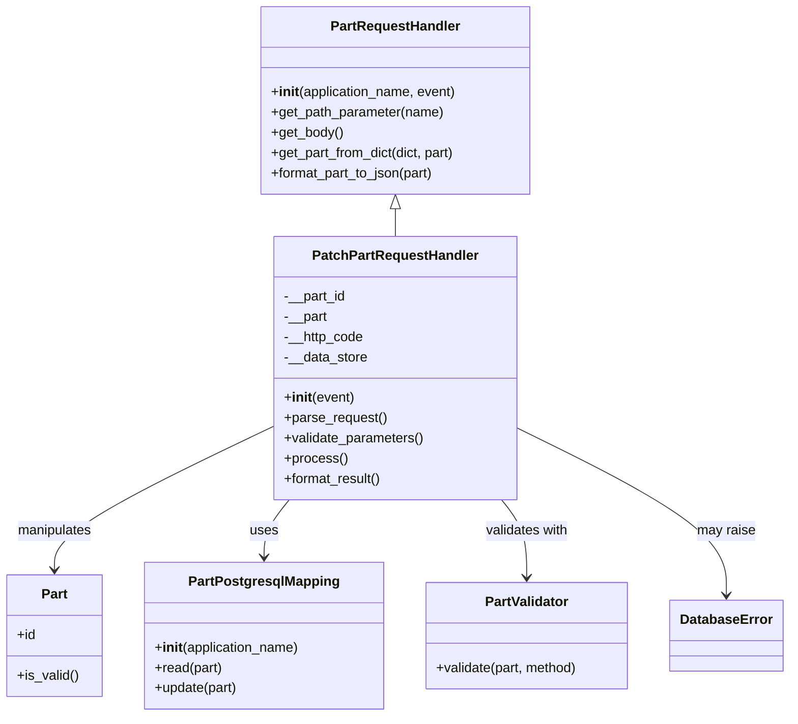

# Diagram: partview_core/partview_service/partview_service/api/part/handlers/PatchPartRequestHandler.py

> Auto-generated by Obscura crawlers

## Mermaid

### SVG

<svg id="container" width="932.7734375" xmlns="http://www.w3.org/2000/svg" class="classDiagram" height="848" viewBox="0 0 932.7734375 848" role="graphics-document document" aria-roledescription="class"><g><defs><marker id="container_class-aggregationStart" class="marker aggregation class" refX="18" refY="7" markerWidth="190" markerHeight="240" orient="auto"><path d="M 18,7 L9,13 L1,7 L9,1 Z"></path></marker></defs><defs><marker id="container_class-aggregationEnd" class="marker aggregation class" refX="1" refY="7" markerWidth="20" markerHeight="28" orient="auto"><path d="M 18,7 L9,13 L1,7 L9,1 Z"></path></marker></defs><defs><marker id="container_class-extensionStart" class="marker extension class" refX="18" refY="7" markerWidth="190" markerHeight="240" orient="auto"><path d="M 1,7 L18,13 V 1 Z"></path></marker></defs><defs><marker id="container_class-extensionEnd" class="marker extension class" refX="1" refY="7" markerWidth="20" markerHeight="28" orient="auto"><path d="M 1,1 V 13 L18,7 Z"></path></marker></defs><defs><marker id="container_class-compositionStart" class="marker composition class" refX="18" refY="7" markerWidth="190" markerHeight="240" orient="auto"><path d="M 18,7 L9,13 L1,7 L9,1 Z"></path></marker></defs><defs><marker id="container_class-compositionEnd" class="marker composition class" refX="1" refY="7" markerWidth="20" markerHeight="28" orient="auto"><path d="M 18,7 L9,13 L1,7 L9,1 Z"></path></marker></defs><defs><marker id="container_class-dependencyStart" class="marker dependency class" refX="6" refY="7" markerWidth="190" markerHeight="240" orient="auto"><path d="M 5,7 L9,13 L1,7 L9,1 Z"></path></marker></defs><defs><marker id="container_class-dependencyEnd" class="marker dependency class" refX="13" refY="7" markerWidth="20" markerHeight="28" orient="auto"><path d="M 18,7 L9,13 L14,7 L9,1 Z"></path></marker></defs><defs><marker id="container_class-lollipopStart" class="marker lollipop class" refX="13" refY="7" markerWidth="190" markerHeight="240" orient="auto"><circle stroke="black" fill="transparent" cx="7" cy="7" r="6"></circle></marker></defs><defs><marker id="container_class-lollipopEnd" class="marker lollipop class" refX="1" refY="7" markerWidth="190" markerHeight="240" orient="auto"><circle stroke="black" fill="transparent" cx="7" cy="7" r="6"></circle></marker></defs><g class="root"><g class="clusters"></g><g class="edgePaths"><path d="M468.016,247.25L468.016,248.542C468.016,249.833,468.016,252.417,468.016,257.875C468.016,263.333,468.016,271.667,468.016,275.833L468.016,280" id="id_PartRequestHandler_PatchPartRequestHandler_1" class="edge-thickness-normal edge-pattern-solid relation" style=";;;" data-edge="true" data-et="edge" data-id="id_PartRequestHandler_PatchPartRequestHandler_1" data-points="W3sieCI6NDY4LjAxNTYyNSwieSI6MjMwfSx7IngiOjQ2OC4wMTU2MjUsInkiOjI1NX0seyJ4Ijo0NjguMDE1NjI1LCJ5IjoyODB9XQ==" marker-start="url(#container_class-extensionStart)"></path><path d="M325.598,504.022L281.987,524.852C238.376,545.682,151.155,587.341,107.544,615.837C63.934,644.333,63.934,659.667,63.934,667.333L63.934,675" id="id_PatchPartRequestHandler_Part_2" class="edge-thickness-normal edge-pattern-solid relation" style=";;;" data-edge="true" data-et="edge" data-id="id_PatchPartRequestHandler_Part_2" data-points="W3sieCI6MzI1LjU5NzY1NjI1LCJ5Ijo1MDQuMDIyNDk1MDQ1Njc2NDZ9LHsieCI6NjMuOTMzNTkzNzUsInkiOjYyOX0seyJ4Ijo2My45MzM1OTM3NSwieSI6NjgxfV0=" marker-end="url(#container_class-dependencyEnd)"></path><path d="M341.48,592L336.478,598.167C331.476,604.333,321.473,616.667,316.471,628C311.469,639.333,311.469,649.667,311.469,654.833L311.469,660" id="id_PatchPartRequestHandler_PartPostgresqlMapping_3" class="edge-thickness-normal edge-pattern-solid relation" style=";;;" data-edge="true" data-et="edge" data-id="id_PatchPartRequestHandler_PartPostgresqlMapping_3" data-points="W3sieCI6MzQxLjQ4MDMyNzA3MjUzODg0LCJ5Ijo1OTJ9LHsieCI6MzExLjQ2ODc1LCJ5Ijo2Mjl9LHsieCI6MzExLjQ2ODc1LCJ5Ijo2NjZ9XQ==" marker-end="url(#container_class-dependencyEnd)"></path><path d="M594.551,592L599.553,598.167C604.555,604.333,614.559,616.667,619.561,632C624.563,647.333,624.563,665.667,624.563,674.833L624.563,684" id="id_PatchPartRequestHandler_PartValidator_4" class="edge-thickness-normal edge-pattern-solid relation" style=";;;" data-edge="true" data-et="edge" data-id="id_PatchPartRequestHandler_PartValidator_4" data-points="W3sieCI6NTk0LjU1MDkyMjkyNzQ2MTEsInkiOjU5Mn0seyJ4Ijo2MjQuNTYyNSwieSI6NjI5fSx7IngiOjYyNC41NjI1LCJ5Ijo2OTB9XQ==" marker-end="url(#container_class-dependencyEnd)"></path><path d="M610.434,506.048L652.097,526.54C693.76,547.032,777.087,588.016,818.751,621.175C860.414,654.333,860.414,679.667,860.414,692.333L860.414,705" id="id_PatchPartRequestHandler_DatabaseError_5" class="edge-thickness-normal edge-pattern-solid relation" style=";;;" data-edge="true" data-et="edge" data-id="id_PatchPartRequestHandler_DatabaseError_5" data-points="W3sieCI6NjEwLjQzMzU5Mzc1LCJ5Ijo1MDYuMDQ3ODUyNzQ4NTIxN30seyJ4Ijo4NjAuNDE0MDYyNSwieSI6NjI5fSx7IngiOjg2MC40MTQwNjI1LCJ5Ijo3MTF9XQ==" marker-end="url(#container_class-dependencyEnd)"></path></g><g class="edgeLabels"><g class="edgeLabel"><g class="label" data-id="id_PartRequestHandler_PatchPartRequestHandler_1" transform="translate(0, 0)"><foreignObject width="0" height="0">

</foreignObject></g></g><g class="edgeLabel" transform="translate(63.93359375, 629)"><g class="label" data-id="id_PatchPartRequestHandler_Part_2" transform="translate(-45.0859375, -12)"><foreignObject width="90.171875" height="24">

manipulates

</foreignObject></g></g><g class="edgeLabel" transform="translate(311.46875, 629)"><g class="label" data-id="id_PatchPartRequestHandler_PartPostgresqlMapping_3" transform="translate(-16.4921875, -12)"><foreignObject width="32.984375" height="24">

uses

</foreignObject></g></g><g class="edgeLabel" transform="translate(624.5625, 629)"><g class="label" data-id="id_PatchPartRequestHandler_PartValidator_4" transform="translate(-50.375, -12)"><foreignObject width="100.75" height="24">

validates with

</foreignObject></g></g><g class="edgeLabel" transform="translate(860.4140625, 629)"><g class="label" data-id="id_PatchPartRequestHandler_DatabaseError_5" transform="translate(-34.65625, -12)"><foreignObject width="69.3125" height="24">

may raise

</foreignObject></g></g></g><g class="nodes"><g class="node default" id="classId-Part-0" transform="translate(63.93359375, 753)"><g class="basic label-container"><path d="M-55.93359375 -72 L55.93359375 -72 L55.93359375 72 L-55.93359375 72" stroke="none" stroke-width="0" fill="#ECECFF" style=""></path><path d="M-55.93359375 -72 C-24.12029462698039 -72, 7.693004496039222 -72, 55.93359375 -72 M-55.93359375 -72 C-16.64943945770871 -72, 22.63471483458258 -72, 55.93359375 -72 M55.93359375 -72 C55.93359375 -21.1945205665073, 55.93359375 29.6109588669854, 55.93359375 72 M55.93359375 -72 C55.93359375 -33.08384006072142, 55.93359375 5.832319878557158, 55.93359375 72 M55.93359375 72 C15.755716958154515 72, -24.42215983369097 72, -55.93359375 72 M55.93359375 72 C29.643291677969348 72, 3.3529896059386957 72, -55.93359375 72 M-55.93359375 72 C-55.93359375 30.57175440574199, -55.93359375 -10.856491188516017, -55.93359375 -72 M-55.93359375 72 C-55.93359375 26.60156630598412, -55.93359375 -18.796867388031757, -55.93359375 -72" stroke="#9370DB" stroke-width="1.3" fill="none" stroke-dasharray="0 0" style=""></path></g><g class="annotation-group text" transform="translate(0, -48)"></g><g class="label-group text" transform="translate(-15.0703125, -48)"><g class="label" style="font-weight: bolder" transform="translate(0,-12)"><foreignObject width="30.140625" height="24">

Part

</foreignObject></g></g><g class="members-group text" transform="translate(-43.93359375, 0)"><g class="label" style="" transform="translate(0,-12)"><foreignObject width="22.078125" height="24">

+id

</foreignObject></g></g><g class="methods-group text" transform="translate(-43.93359375, 48)"><g class="label" style="" transform="translate(0,-12)"><foreignObject width="72.796875" height="24">

+is_valid()

</foreignObject></g></g><g class="divider" style=""><path d="M-55.93359375 -24 C-15.111353769110202 -24, 25.710886211779595 -24, 55.93359375 -24 M-55.93359375 -24 C-15.814561110406672 -24, 24.304471529186657 -24, 55.93359375 -24" stroke="#9370DB" stroke-width="1.3" fill="none" stroke-dasharray="0 0" style=""></path></g><g class="divider" style=""><path d="M-55.93359375 24 C-26.274394200301092 24, 3.3848053493978156 24, 55.93359375 24 M-55.93359375 24 C-17.35001952385332 24, 21.23355470229336 24, 55.93359375 24" stroke="#9370DB" stroke-width="1.3" fill="none" stroke-dasharray="0 0" style=""></path></g></g><g class="node default" id="classId-PartPostgresqlMapping-1" transform="translate(311.46875, 753)"><g class="basic label-container"><path d="M-141.6015625 -87 L141.6015625 -87 L141.6015625 87 L-141.6015625 87" stroke="none" stroke-width="0" fill="#ECECFF" style=""></path><path d="M-141.6015625 -87 C-30.1158668143526 -87, 81.3698288712948 -87, 141.6015625 -87 M-141.6015625 -87 C-82.96250783887274 -87, -24.323453177745492 -87, 141.6015625 -87 M141.6015625 -87 C141.6015625 -19.085359904749907, 141.6015625 48.829280190500185, 141.6015625 87 M141.6015625 -87 C141.6015625 -22.39629932636089, 141.6015625 42.20740134727822, 141.6015625 87 M141.6015625 87 C44.38253963297301 87, -52.836483234053986 87, -141.6015625 87 M141.6015625 87 C79.23346667622205 87, 16.8653708524441 87, -141.6015625 87 M-141.6015625 87 C-141.6015625 30.82957873985881, -141.6015625 -25.34084252028238, -141.6015625 -87 M-141.6015625 87 C-141.6015625 47.89507538162251, -141.6015625 8.790150763245023, -141.6015625 -87" stroke="#9370DB" stroke-width="1.3" fill="none" stroke-dasharray="0 0" style=""></path></g><g class="annotation-group text" transform="translate(0, -63)"></g><g class="label-group text" transform="translate(-85.46875, -63)"><g class="label" style="font-weight: bolder" transform="translate(0,-12)"><foreignObject width="170.9375" height="24">

PartPostgresqlMapping

</foreignObject></g></g><g class="members-group text" transform="translate(-129.6015625, -15)"></g><g class="methods-group text" transform="translate(-129.6015625, 15)"><g class="label" style="" transform="translate(0,-12)"><foreignObject width="173.734375" height="24">

+<strong>init</strong>(application_name)

</foreignObject></g><g class="label" style="" transform="translate(0,12)"><foreignObject width="80.890625" height="24">

+read(part)

</foreignObject></g><g class="label" style="" transform="translate(0,36)"><foreignObject width="99.703125" height="24">

+update(part)

</foreignObject></g></g><g class="divider" style=""><path d="M-141.6015625 -39 C-69.90082277350233 -39, 1.7999169529953463 -39, 141.6015625 -39 M-141.6015625 -39 C-51.51224181530468 -39, 38.57707886939065 -39, 141.6015625 -39" stroke="#9370DB" stroke-width="1.3" fill="none" stroke-dasharray="0 0" style=""></path></g><g class="divider" style=""><path d="M-141.6015625 -15 C-61.966106358711855 -15, 17.66934978257629 -15, 141.6015625 -15 M-141.6015625 -15 C-59.948406965984844 -15, 21.70474856803031 -15, 141.6015625 -15" stroke="#9370DB" stroke-width="1.3" fill="none" stroke-dasharray="0 0" style=""></path></g></g><g class="node default" id="classId-PartValidator-2" transform="translate(624.5625, 753)"><g class="basic label-container"><path d="M-121.4921875 -63 L121.4921875 -63 L121.4921875 63 L-121.4921875 63" stroke="none" stroke-width="0" fill="#ECECFF" style=""></path><path d="M-121.4921875 -63 C-52.34531347876373 -63, 16.801560542472544 -63, 121.4921875 -63 M-121.4921875 -63 C-43.26801929772324 -63, 34.956148904553515 -63, 121.4921875 -63 M121.4921875 -63 C121.4921875 -25.337961456871902, 121.4921875 12.324077086256196, 121.4921875 63 M121.4921875 -63 C121.4921875 -35.412874290119234, 121.4921875 -7.825748580238475, 121.4921875 63 M121.4921875 63 C25.42670464414421 63, -70.63877821171158 63, -121.4921875 63 M121.4921875 63 C60.69201726653668 63, -0.10815296692663878 63, -121.4921875 63 M-121.4921875 63 C-121.4921875 33.501033344451656, -121.4921875 4.002066688903312, -121.4921875 -63 M-121.4921875 63 C-121.4921875 36.17603640581978, -121.4921875 9.352072811639559, -121.4921875 -63" stroke="#9370DB" stroke-width="1.3" fill="none" stroke-dasharray="0 0" style=""></path></g><g class="annotation-group text" transform="translate(0, -39)"></g><g class="label-group text" transform="translate(-48.25, -39)"><g class="label" style="font-weight: bolder" transform="translate(0,-12)"><foreignObject width="96.5" height="24">

PartValidator

</foreignObject></g></g><g class="members-group text" transform="translate(-109.4921875, 9)"></g><g class="methods-group text" transform="translate(-109.4921875, 39)"><g class="label" style="" transform="translate(0,-12)"><foreignObject width="170.734375" height="24">

+validate(part, method)

</foreignObject></g></g><g class="divider" style=""><path d="M-121.4921875 -15 C-50.67857011002994 -15, 20.135047279940125 -15, 121.4921875 -15 M-121.4921875 -15 C-70.53100046063294 -15, -19.569813421265877 -15, 121.4921875 -15" stroke="#9370DB" stroke-width="1.3" fill="none" stroke-dasharray="0 0" style=""></path></g><g class="divider" style=""><path d="M-121.4921875 9 C-31.08880179746285 9, 59.3145839050743 9, 121.4921875 9 M-121.4921875 9 C-59.95184036846501 9, 1.5885067630699865 9, 121.4921875 9" stroke="#9370DB" stroke-width="1.3" fill="none" stroke-dasharray="0 0" style=""></path></g></g><g class="node default" id="classId-DatabaseError-3" transform="translate(860.4140625, 753)"><g class="basic label-container"><path d="M-64.359375 -42 L64.359375 -42 L64.359375 42 L-64.359375 42" stroke="none" stroke-width="0" fill="#ECECFF" style=""></path><path d="M-64.359375 -42 C-32.09649065733446 -42, 0.16639368533107302 -42, 64.359375 -42 M-64.359375 -42 C-37.2277919736481 -42, -10.096208947296205 -42, 64.359375 -42 M64.359375 -42 C64.359375 -16.01910023808789, 64.359375 9.961799523824219, 64.359375 42 M64.359375 -42 C64.359375 -22.32645109984187, 64.359375 -2.652902199683737, 64.359375 42 M64.359375 42 C34.975778997374256 42, 5.592182994748512 42, -64.359375 42 M64.359375 42 C13.212146640484015 42, -37.93508171903197 42, -64.359375 42 M-64.359375 42 C-64.359375 12.23915870326023, -64.359375 -17.52168259347954, -64.359375 -42 M-64.359375 42 C-64.359375 18.79656861164805, -64.359375 -4.406862776703903, -64.359375 -42" stroke="#9370DB" stroke-width="1.3" fill="none" stroke-dasharray="0 0" style=""></path></g><g class="annotation-group text" transform="translate(0, -18)"></g><g class="label-group text" transform="translate(-52.359375, -18)"><g class="label" style="font-weight: bolder" transform="translate(0,-12)"><foreignObject width="104.71875" height="24">

DatabaseError

</foreignObject></g></g><g class="members-group text" transform="translate(-52.359375, 30)"></g><g class="methods-group text" transform="translate(-52.359375, 60)"></g><g class="divider" style=""><path d="M-64.359375 6 C-16.908368839345023 6, 30.542637321309954 6, 64.359375 6 M-64.359375 6 C-19.662562052142157 6, 25.034250895715687 6, 64.359375 6" stroke="#9370DB" stroke-width="1.3" fill="none" stroke-dasharray="0 0" style=""></path></g><g class="divider" style=""><path d="M-64.359375 24 C-15.880845079469452 24, 32.597684841061096 24, 64.359375 24 M-64.359375 24 C-30.169743625074 24, 4.019887749852003 24, 64.359375 24" stroke="#9370DB" stroke-width="1.3" fill="none" stroke-dasharray="0 0" style=""></path></g></g><g class="node default" id="classId-PartRequestHandler-4" transform="translate(468.015625, 119)"><g class="basic label-container"><path d="M-160.31640625 -111 L160.31640625 -111 L160.31640625 111 L-160.31640625 111" stroke="none" stroke-width="0" fill="#ECECFF" style=""></path><path d="M-160.31640625 -111 C-73.68047822349895 -111, 12.955449803002097 -111, 160.31640625 -111 M-160.31640625 -111 C-52.15243150529909 -111, 56.01154323940182 -111, 160.31640625 -111 M160.31640625 -111 C160.31640625 -30.1737673765205, 160.31640625 50.652465246959, 160.31640625 111 M160.31640625 -111 C160.31640625 -61.4617669819918, 160.31640625 -11.923533963983601, 160.31640625 111 M160.31640625 111 C74.90122527759857 111, -10.51395569480286 111, -160.31640625 111 M160.31640625 111 C95.27583913917637 111, 30.23527202835274 111, -160.31640625 111 M-160.31640625 111 C-160.31640625 66.5627126714846, -160.31640625 22.125425342969223, -160.31640625 -111 M-160.31640625 111 C-160.31640625 58.7478492278883, -160.31640625 6.495698455776605, -160.31640625 -111" stroke="#9370DB" stroke-width="1.3" fill="none" stroke-dasharray="0 0" style=""></path></g><g class="annotation-group text" transform="translate(0, -87)"></g><g class="label-group text" transform="translate(-74.1328125, -87)"><g class="label" style="font-weight: bolder" transform="translate(0,-12)"><foreignObject width="148.265625" height="24">

PartRequestHandler

</foreignObject></g></g><g class="members-group text" transform="translate(-148.31640625, -39)"></g><g class="methods-group text" transform="translate(-148.31640625, -9)"><g class="label" style="" transform="translate(0,-12)"><foreignObject width="222" height="24">

+<strong>init</strong>(application_name, event)

</foreignObject></g><g class="label" style="" transform="translate(0,12)"><foreignObject width="206.5" height="24">

+get_path_parameter(name)

</foreignObject></g><g class="label" style="" transform="translate(0,36)"><foreignObject width="85.53125" height="24">

+get_body()

</foreignObject></g><g class="label" style="" transform="translate(0,60)"><foreignObject width="222.5" height="24">

+get_part_from_dict(dict, part)

</foreignObject></g><g class="label" style="" transform="translate(0,84)"><foreignObject width="197.484375" height="24">

+format_part_to_json(part)

</foreignObject></g></g><g class="divider" style=""><path d="M-160.31640625 -63 C-41.367935452970656 -63, 77.58053534405869 -63, 160.31640625 -63 M-160.31640625 -63 C-82.07152363052872 -63, -3.8266410110574327 -63, 160.31640625 -63" stroke="#9370DB" stroke-width="1.3" fill="none" stroke-dasharray="0 0" style=""></path></g><g class="divider" style=""><path d="M-160.31640625 -39 C-46.394087361519425 -39, 67.52823152696115 -39, 160.31640625 -39 M-160.31640625 -39 C-69.90495550716412 -39, 20.506495235671764 -39, 160.31640625 -39" stroke="#9370DB" stroke-width="1.3" fill="none" stroke-dasharray="0 0" style=""></path></g></g><g class="node default" id="classId-PatchPartRequestHandler-5" transform="translate(468.015625, 436)"><g class="basic label-container"><path d="M-142.41796875 -156 L142.41796875 -156 L142.41796875 156 L-142.41796875 156" stroke="none" stroke-width="0" fill="#ECECFF" style=""></path><path d="M-142.41796875 -156 C-62.71691690598617 -156, 16.984134938027665 -156, 142.41796875 -156 M-142.41796875 -156 C-79.20166832676075 -156, -15.985367903521507 -156, 142.41796875 -156 M142.41796875 -156 C142.41796875 -48.69213158432483, 142.41796875 58.61573683135035, 142.41796875 156 M142.41796875 -156 C142.41796875 -88.12446815844002, 142.41796875 -20.248936316880048, 142.41796875 156 M142.41796875 156 C54.45670569087876 156, -33.50455736824247 156, -142.41796875 156 M142.41796875 156 C52.190819988272835 156, -38.03632877345433 156, -142.41796875 156 M-142.41796875 156 C-142.41796875 79.55903111144801, -142.41796875 3.1180622228960146, -142.41796875 -156 M-142.41796875 156 C-142.41796875 38.63949435093227, -142.41796875 -78.72101129813547, -142.41796875 -156" stroke="#9370DB" stroke-width="1.3" fill="none" stroke-dasharray="0 0" style=""></path></g><g class="annotation-group text" transform="translate(0, -132)"></g><g class="label-group text" transform="translate(-94.2890625, -132)"><g class="label" style="font-weight: bolder" transform="translate(0,-12)"><foreignObject width="188.578125" height="24">

PatchPartRequestHandler

</foreignObject></g></g><g class="members-group text" transform="translate(-130.41796875, -84)"><g class="label" style="" transform="translate(0,-12)"><foreignObject width="74.0625" height="24">

-__part_id

</foreignObject></g><g class="label" style="" transform="translate(0,12)"><foreignObject width="51.65625" height="24">

-__part

</foreignObject></g><g class="label" style="" transform="translate(0,36)"><foreignObject width="94.734375" height="24">

-__http_code

</foreignObject></g><g class="label" style="" transform="translate(0,60)"><foreignObject width="99.0625" height="24">

-__data_store

</foreignObject></g></g><g class="methods-group text" transform="translate(-130.41796875, 36)"><g class="label" style="" transform="translate(0,-12)"><foreignObject width="83.140625" height="24">

+<strong>init</strong>(event)

</foreignObject></g><g class="label" style="" transform="translate(0,12)"><foreignObject width="121.796875" height="24">

+parse_request()

</foreignObject></g><g class="label" style="" transform="translate(0,36)"><foreignObject width="166.546875" height="24">

+validate_parameters()

</foreignObject></g><g class="label" style="" transform="translate(0,60)"><foreignObject width="73.734375" height="24">

+process()

</foreignObject></g><g class="label" style="" transform="translate(0,84)"><foreignObject width="117.015625" height="24">

+format_result()

</foreignObject></g></g><g class="divider" style=""><path d="M-142.41796875 -108 C-59.87992084353435 -108, 22.6581270629313 -108, 142.41796875 -108 M-142.41796875 -108 C-64.87981419147562 -108, 12.658340367048766 -108, 142.41796875 -108" stroke="#9370DB" stroke-width="1.3" fill="none" stroke-dasharray="0 0" style=""></path></g><g class="divider" style=""><path d="M-142.41796875 12 C-63.28036658787798 12, 15.857235574244044 12, 142.41796875 12 M-142.41796875 12 C-38.60037477961832 12, 65.21721919076336 12, 142.41796875 12" stroke="#9370DB" stroke-width="1.3" fill="none" stroke-dasharray="0 0" style=""></path></g></g></g></g></g></svg>
