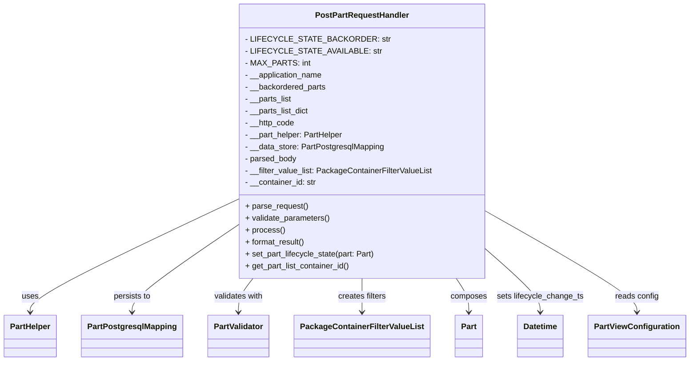
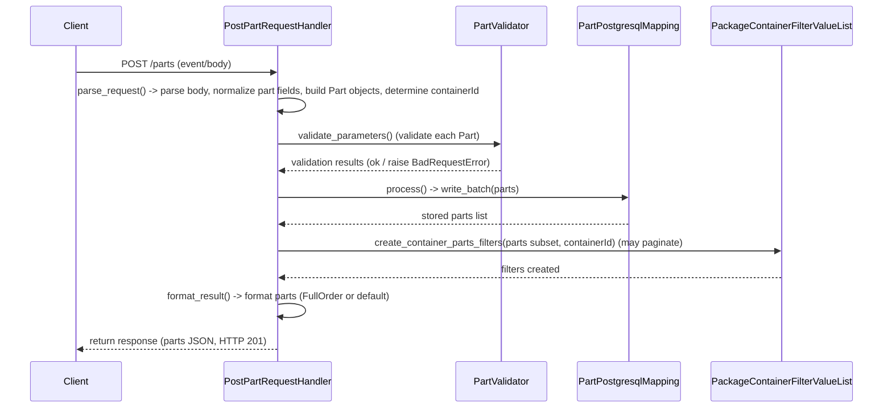

# Diagram: partview_core/partview_service/partview_service/api/part/handlers/PostPartRequestHandler.py

> Auto-generated by Obscura crawlers

## Diagram 1

### SVG

<svg id="container" width="1346.7890625" xmlns="http://www.w3.org/2000/svg" class="classDiagram" height="726" viewBox="0 0 1346.7890625 726" role="graphics-document document" aria-roledescription="class"><g><defs><marker id="container_class-aggregationStart" class="marker aggregation class" refX="18" refY="7" markerWidth="190" markerHeight="240" orient="auto"><path d="M 18,7 L9,13 L1,7 L9,1 Z"></path></marker></defs><defs><marker id="container_class-aggregationEnd" class="marker aggregation class" refX="1" refY="7" markerWidth="20" markerHeight="28" orient="auto"><path d="M 18,7 L9,13 L1,7 L9,1 Z"></path></marker></defs><defs><marker id="container_class-extensionStart" class="marker extension class" refX="18" refY="7" markerWidth="190" markerHeight="240" orient="auto"><path d="M 1,7 L18,13 V 1 Z"></path></marker></defs><defs><marker id="container_class-extensionEnd" class="marker extension class" refX="1" refY="7" markerWidth="20" markerHeight="28" orient="auto"><path d="M 1,1 V 13 L18,7 Z"></path></marker></defs><defs><marker id="container_class-compositionStart" class="marker composition class" refX="18" refY="7" markerWidth="190" markerHeight="240" orient="auto"><path d="M 18,7 L9,13 L1,7 L9,1 Z"></path></marker></defs><defs><marker id="container_class-compositionEnd" class="marker composition class" refX="1" refY="7" markerWidth="20" markerHeight="28" orient="auto"><path d="M 18,7 L9,13 L1,7 L9,1 Z"></path></marker></defs><defs><marker id="container_class-dependencyStart" class="marker dependency class" refX="6" refY="7" markerWidth="190" markerHeight="240" orient="auto"><path d="M 5,7 L9,13 L1,7 L9,1 Z"></path></marker></defs><defs><marker id="container_class-dependencyEnd" class="marker dependency class" refX="13" refY="7" markerWidth="20" markerHeight="28" orient="auto"><path d="M 18,7 L9,13 L14,7 L9,1 Z"></path></marker></defs><defs><marker id="container_class-lollipopStart" class="marker lollipop class" refX="13" refY="7" markerWidth="190" markerHeight="240" orient="auto"><circle stroke="black" fill="transparent" cx="7" cy="7" r="6"></circle></marker></defs><defs><marker id="container_class-lollipopEnd" class="marker lollipop class" refX="1" refY="7" markerWidth="190" markerHeight="240" orient="auto"><circle stroke="black" fill="transparent" cx="7" cy="7" r="6"></circle></marker></defs><g class="root"><g class="clusters"></g><g class="edgePaths"><path d="M461.102,402.627L394.182,435.022C327.263,467.418,193.424,532.209,126.505,569.771C59.586,607.333,59.586,617.667,59.586,622.833L59.586,628" id="id_PostPartRequestHandler_PartHelper_1" class="edge-thickness-normal edge-pattern-solid relation" style=";;;" data-edge="true" data-et="edge" data-id="id_PostPartRequestHandler_PartHelper_1" data-points="W3sieCI6NDYxLjEwMTU2MjUsInkiOjQwMi42MjY4NDg3MTkxODgwNX0seyJ4Ijo1OS41ODU5Mzc1LCJ5Ijo1OTd9LHsieCI6NTkuNTg1OTM3NSwieSI6NjM0fV0=" marker-end="url(#container_class-dependencyEnd)"></path><path d="M461.102,455.393L427.358,478.994C393.615,502.595,326.128,549.798,292.384,578.565C258.641,607.333,258.641,617.667,258.641,622.833L258.641,628" id="id_PostPartRequestHandler_PartPostgresqlMapping_2" class="edge-thickness-normal edge-pattern-solid relation" style=";;;" data-edge="true" data-et="edge" data-id="id_PostPartRequestHandler_PartPostgresqlMapping_2" data-points="W3sieCI6NDYxLjEwMTU2MjUsInkiOjQ1NS4zOTI5MjI2MDk1OTEzfSx7IngiOjI1OC42NDA2MjUsInkiOjU5N30seyJ4IjoyNTguNjQwNjI1LCJ5Ijo2MzR9XQ==" marker-end="url(#container_class-dependencyEnd)"></path><path d="M494.705,560L489.981,566.167C485.256,572.333,475.808,584.667,471.084,596C466.359,607.333,466.359,617.667,466.359,622.833L466.359,628" id="id_PostPartRequestHandler_PartValidator_3" class="edge-thickness-normal edge-pattern-solid relation" style=";;;" data-edge="true" data-et="edge" data-id="id_PostPartRequestHandler_PartValidator_3" data-points="W3sieCI6NDk0LjcwNTA0NjkyNDkyMDEsInkiOjU2MH0seyJ4Ijo0NjYuMzU5Mzc1LCJ5Ijo1OTd9LHsieCI6NDY2LjM1OTM3NSwieSI6NjM0fV0=" marker-end="url(#container_class-dependencyEnd)"></path><path d="M706.148,560L706.148,566.167C706.148,572.333,706.148,584.667,706.148,596C706.148,607.333,706.148,617.667,706.148,622.833L706.148,628" id="id_PostPartRequestHandler_PackageContainerFilterValueList_4" class="edge-thickness-normal edge-pattern-solid relation" style=";;;" data-edge="true" data-et="edge" data-id="id_PostPartRequestHandler_PackageContainerFilterValueList_4" data-points="W3sieCI6NzA2LjE0ODQzNzUsInkiOjU2MH0seyJ4Ijo3MDYuMTQ4NDM3NSwieSI6NTk3fSx7IngiOjcwNi4xNDg0Mzc1LCJ5Ijo2MzR9XQ==" marker-end="url(#container_class-dependencyEnd)"></path><path d="M888.334,560L892.405,566.167C896.475,572.333,904.617,584.667,908.687,596C912.758,607.333,912.758,617.667,912.758,622.833L912.758,628" id="id_PostPartRequestHandler_Part_5" class="edge-thickness-normal edge-pattern-solid relation" style=";;;" data-edge="true" data-et="edge" data-id="id_PostPartRequestHandler_Part_5" data-points="W3sieCI6ODg4LjMzNDM0MDA1NTkxMDUsInkiOjU2MH0seyJ4Ijo5MTIuNzU3ODEyNSwieSI6NTk3fSx7IngiOjkxMi43NTc4MTI1LCJ5Ijo2MzR9XQ==" marker-end="url(#container_class-dependencyEnd)"></path><path d="M951.195,503.186L968.676,518.822C986.156,534.457,1021.117,565.729,1038.598,586.531C1056.078,607.333,1056.078,617.667,1056.078,622.833L1056.078,628" id="id_PostPartRequestHandler_Datetime_6" class="edge-thickness-normal edge-pattern-solid relation" style=";;;" data-edge="true" data-et="edge" data-id="id_PostPartRequestHandler_Datetime_6" data-points="W3sieCI6OTUxLjE5NTMxMjUsInkiOjUwMy4xODU5NTI1MzUxMDc1fSx7IngiOjEwNTYuMDc4MTI1LCJ5Ijo1OTd9LHsieCI6MTA1Ni4wNzgxMjUsInkiOjYzNH1d" marker-end="url(#container_class-dependencyEnd)"></path><path d="M951.195,426.304L1000.185,454.753C1049.174,483.203,1147.154,540.101,1196.143,573.717C1245.133,607.333,1245.133,617.667,1245.133,622.833L1245.133,628" id="id_PostPartRequestHandler_PartViewConfiguration_7" class="edge-thickness-normal edge-pattern-solid relation" style=";;;" data-edge="true" data-et="edge" data-id="id_PostPartRequestHandler_PartViewConfiguration_7" data-points="W3sieCI6OTUxLjE5NTMxMjUsInkiOjQyNi4zMDQwNzMwNTQwNjU4NH0seyJ4IjoxMjQ1LjEzMjgxMjUsInkiOjU5N30seyJ4IjoxMjQ1LjEzMjgxMjUsInkiOjYzNH1d" marker-end="url(#container_class-dependencyEnd)"></path></g><g class="edgeLabels"><g class="edgeLabel" transform="translate(59.5859375, 597)"><g class="label" data-id="id_PostPartRequestHandler_PartHelper_1" transform="translate(-16.4921875, -12)"><foreignObject width="32.984375" height="24">

uses

</foreignObject></g></g><g class="edgeLabel" transform="translate(258.640625, 597)"><g class="label" data-id="id_PostPartRequestHandler_PartPostgresqlMapping_2" transform="translate(-37.9921875, -12)"><foreignObject width="75.984375" height="24">

persists to

</foreignObject></g></g><g class="edgeLabel" transform="translate(466.359375, 597)"><g class="label" data-id="id_PostPartRequestHandler_PartValidator_3" transform="translate(-50.375, -12)"><foreignObject width="100.75" height="24">

validates with

</foreignObject></g></g><g class="edgeLabel" transform="translate(706.1484375, 597)"><g class="label" data-id="id_PostPartRequestHandler_PackageContainerFilterValueList_4" transform="translate(-49.0703125, -12)"><foreignObject width="98.140625" height="24">

creates filters

</foreignObject></g></g><g class="edgeLabel" transform="translate(912.7578125, 597)"><g class="label" data-id="id_PostPartRequestHandler_Part_5" transform="translate(-36.453125, -12)"><foreignObject width="72.90625" height="24">

composes

</foreignObject></g></g><g class="edgeLabel" transform="translate(1056.078125, 597)"><g class="label" data-id="id_PostPartRequestHandler_Datetime_6" transform="translate(-86.8671875, -12)"><foreignObject width="173.734375" height="24">

sets lifecycle_change_ts

</foreignObject></g></g><g class="edgeLabel" transform="translate(1245.1328125, 597)"><g class="label" data-id="id_PostPartRequestHandler_PartViewConfiguration_7" transform="translate(-43.90625, -12)"><foreignObject width="87.8125" height="24">

reads config

</foreignObject></g></g></g><g class="nodes"><g class="node default" id="classId-PostPartRequestHandler-0" transform="translate(706.1484375, 284)"><g class="basic label-container"><path d="M-245.046875 -276 L245.046875 -276 L245.046875 276 L-245.046875 276" stroke="none" stroke-width="0" fill="#ECECFF" style=""></path><path d="M-245.046875 -276 C-77.13383335861579 -276, 90.77920828276842 -276, 245.046875 -276 M-245.046875 -276 C-127.2145366618149 -276, -9.382198323629808 -276, 245.046875 -276 M245.046875 -276 C245.046875 -95.103036321433, 245.046875 85.79392735713401, 245.046875 276 M245.046875 -276 C245.046875 -81.08503549213609, 245.046875 113.82992901572783, 245.046875 276 M245.046875 276 C91.60036520157581 276, -61.846144596848376 276, -245.046875 276 M245.046875 276 C65.64934902397559 276, -113.74817695204882 276, -245.046875 276 M-245.046875 276 C-245.046875 146.43030090325092, -245.046875 16.860601806501847, -245.046875 -276 M-245.046875 276 C-245.046875 66.81759101088605, -245.046875 -142.3648179782279, -245.046875 -276" stroke="#9370DB" stroke-width="1.3" fill="none" stroke-dasharray="0 0" style=""></path></g><g class="annotation-group text" transform="translate(0, -252)"></g><g class="label-group text" transform="translate(-90.3125, -252)"><g class="label" style="font-weight: bolder" transform="translate(0,-12)"><foreignObject width="180.625" height="24">

PostPartRequestHandler

</foreignObject></g></g><g class="members-group text" transform="translate(-233.046875, -204)"><g class="label" style="" transform="translate(0,-12)"><foreignObject width="253.0625" height="24">

- LIFECYCLE_STATE_BACKORDER: str

</foreignObject></g><g class="label" style="" transform="translate(0,12)"><foreignObject width="241.84375" height="24">

- LIFECYCLE_STATE_AVAILABLE: str

</foreignObject></g><g class="label" style="" transform="translate(0,36)"><foreignObject width="120.546875" height="24">

- MAX_PARTS: int

</foreignObject></g><g class="label" style="" transform="translate(0,60)"><foreignObject width="157.796875" height="24">

- __application_name

</foreignObject></g><g class="label" style="" transform="translate(0,84)"><foreignObject width="164.03125" height="24">

- __backordered_parts

</foreignObject></g><g class="label" style="" transform="translate(0,108)"><foreignObject width="94.9375" height="24">

- __parts_list

</foreignObject></g><g class="label" style="" transform="translate(0,132)"><foreignObject width="130.4375" height="24">

- __parts_list_dict

</foreignObject></g><g class="label" style="" transform="translate(0,156)"><foreignObject width="100.25" height="24">

- __http_code

</foreignObject></g><g class="label" style="" transform="translate(0,180)"><foreignObject width="198.6875" height="24">

- __part_helper: PartHelper

</foreignObject></g><g class="label" style="" transform="translate(0,204)"><foreignObject width="279.734375" height="24">

- __data_store: PartPostgresqlMapping

</foreignObject></g><g class="label" style="" transform="translate(0,228)"><foreignObject width="105.046875" height="24">

- parsed_body

</foreignObject></g><g class="label" style="" transform="translate(0,252)"><foreignObject width="375.78125" height="24">

- __filter_value_list: PackageContainerFilterValueList

</foreignObject></g><g class="label" style="" transform="translate(0,276)"><foreignObject width="144.6875" height="24">

- __container_id: str

</foreignObject></g></g><g class="methods-group text" transform="translate(-233.046875, 132)"><g class="label" style="" transform="translate(0,-12)"><foreignObject width="126.046875" height="24">

+ parse_request()

</foreignObject></g><g class="label" style="" transform="translate(0,12)"><foreignObject width="170.953125" height="24">

+ validate_parameters()

</foreignObject></g><g class="label" style="" transform="translate(0,36)"><foreignObject width="77.96875" height="24">

+ process()

</foreignObject></g><g class="label" style="" transform="translate(0,60)"><foreignObject width="121.5" height="24">

+ format_result()

</foreignObject></g><g class="label" style="" transform="translate(0,84)"><foreignObject width="261.90625" height="24">

+ set_part_lifecycle_state(part: Part)

</foreignObject></g><g class="label" style="" transform="translate(0,108)"><foreignObject width="212.40625" height="24">

+ get_part_list_container_id()

</foreignObject></g></g><g class="divider" style=""><path d="M-245.046875 -228 C-145.32058038266604 -228, -45.594285765332046 -228, 245.046875 -228 M-245.046875 -228 C-142.24659702242067 -228, -39.446319044841346 -228, 245.046875 -228" stroke="#9370DB" stroke-width="1.3" fill="none" stroke-dasharray="0 0" style=""></path></g><g class="divider" style=""><path d="M-245.046875 108 C-115.34363192454376 108, 14.359611150912485 108, 245.046875 108 M-245.046875 108 C-118.45956708145435 108, 8.127740837091295 108, 245.046875 108" stroke="#9370DB" stroke-width="1.3" fill="none" stroke-dasharray="0 0" style=""></path></g></g><g class="node default" id="classId-PartHelper-1" transform="translate(59.5859375, 676)"><g class="basic label-container"><path d="M-51.5859375 -42 L51.5859375 -42 L51.5859375 42 L-51.5859375 42" stroke="none" stroke-width="0" fill="#ECECFF" style=""></path><path d="M-51.5859375 -42 C-14.170171943557342 -42, 23.245593612885315 -42, 51.5859375 -42 M-51.5859375 -42 C-23.106311789381913 -42, 5.373313921236175 -42, 51.5859375 -42 M51.5859375 -42 C51.5859375 -24.265630134637295, 51.5859375 -6.53126026927459, 51.5859375 42 M51.5859375 -42 C51.5859375 -24.978889438469587, 51.5859375 -7.957778876939173, 51.5859375 42 M51.5859375 42 C20.9173907680836 42, -9.751155963832801 42, -51.5859375 42 M51.5859375 42 C20.022897304400598 42, -11.540142891198805 42, -51.5859375 42 M-51.5859375 42 C-51.5859375 13.721246100775197, -51.5859375 -14.557507798449606, -51.5859375 -42 M-51.5859375 42 C-51.5859375 17.11436877226029, -51.5859375 -7.771262455479423, -51.5859375 -42" stroke="#9370DB" stroke-width="1.3" fill="none" stroke-dasharray="0 0" style=""></path></g><g class="annotation-group text" transform="translate(0, -18)"></g><g class="label-group text" transform="translate(-39.5859375, -18)"><g class="label" style="font-weight: bolder" transform="translate(0,-12)"><foreignObject width="79.171875" height="24">

PartHelper

</foreignObject></g></g><g class="members-group text" transform="translate(-39.5859375, 30)"></g><g class="methods-group text" transform="translate(-39.5859375, 60)"></g><g class="divider" style=""><path d="M-51.5859375 6 C-14.303520737043925 6, 22.97889602591215 6, 51.5859375 6 M-51.5859375 6 C-27.105113536510782 6, -2.6242895730215636 6, 51.5859375 6" stroke="#9370DB" stroke-width="1.3" fill="none" stroke-dasharray="0 0" style=""></path></g><g class="divider" style=""><path d="M-51.5859375 24 C-11.40142353534634 24, 28.78309042930732 24, 51.5859375 24 M-51.5859375 24 C-26.100433726755327 24, -0.6149299535106536 24, 51.5859375 24" stroke="#9370DB" stroke-width="1.3" fill="none" stroke-dasharray="0 0" style=""></path></g></g><g class="node default" id="classId-PartPostgresqlMapping-2" transform="translate(258.640625, 676)"><g class="basic label-container"><path d="M-97.46875 -42 L97.46875 -42 L97.46875 42 L-97.46875 42" stroke="none" stroke-width="0" fill="#ECECFF" style=""></path><path d="M-97.46875 -42 C-55.144715446116784 -42, -12.820680892233568 -42, 97.46875 -42 M-97.46875 -42 C-45.323175917887795 -42, 6.82239816422441 -42, 97.46875 -42 M97.46875 -42 C97.46875 -14.899789023346454, 97.46875 12.200421953307092, 97.46875 42 M97.46875 -42 C97.46875 -12.000774845028822, 97.46875 17.998450309942356, 97.46875 42 M97.46875 42 C25.83658926237166 42, -45.79557147525668 42, -97.46875 42 M97.46875 42 C40.94948894465167 42, -15.569772110696661 42, -97.46875 42 M-97.46875 42 C-97.46875 10.948576933213658, -97.46875 -20.102846133572683, -97.46875 -42 M-97.46875 42 C-97.46875 14.527852512532156, -97.46875 -12.944294974935687, -97.46875 -42" stroke="#9370DB" stroke-width="1.3" fill="none" stroke-dasharray="0 0" style=""></path></g><g class="annotation-group text" transform="translate(0, -18)"></g><g class="label-group text" transform="translate(-85.46875, -18)"><g class="label" style="font-weight: bolder" transform="translate(0,-12)"><foreignObject width="170.9375" height="24">

PartPostgresqlMapping

</foreignObject></g></g><g class="members-group text" transform="translate(-85.46875, 30)"></g><g class="methods-group text" transform="translate(-85.46875, 60)"></g><g class="divider" style=""><path d="M-97.46875 6 C-40.57825455286061 6, 16.312240894278787 6, 97.46875 6 M-97.46875 6 C-42.11337827765733 6, 13.241993444685335 6, 97.46875 6" stroke="#9370DB" stroke-width="1.3" fill="none" stroke-dasharray="0 0" style=""></path></g><g class="divider" style=""><path d="M-97.46875 24 C-44.3806014791907 24, 8.707547041618596 24, 97.46875 24 M-97.46875 24 C-32.54382666215871 24, 32.381096675682585 24, 97.46875 24" stroke="#9370DB" stroke-width="1.3" fill="none" stroke-dasharray="0 0" style=""></path></g></g><g class="node default" id="classId-PartValidator-3" transform="translate(466.359375, 676)"><g class="basic label-container"><path d="M-60.25 -42 L60.25 -42 L60.25 42 L-60.25 42" stroke="none" stroke-width="0" fill="#ECECFF" style=""></path><path d="M-60.25 -42 C-30.846707123337072 -42, -1.4434142466741449 -42, 60.25 -42 M-60.25 -42 C-24.563356245401316 -42, 11.123287509197368 -42, 60.25 -42 M60.25 -42 C60.25 -11.517164661027579, 60.25 18.965670677944843, 60.25 42 M60.25 -42 C60.25 -21.859522196264496, 60.25 -1.7190443925289927, 60.25 42 M60.25 42 C13.156486031154188 42, -33.937027937691624 42, -60.25 42 M60.25 42 C12.738918116021814 42, -34.77216376795637 42, -60.25 42 M-60.25 42 C-60.25 21.370838176706993, -60.25 0.7416763534139861, -60.25 -42 M-60.25 42 C-60.25 23.474651887381775, -60.25 4.94930377476355, -60.25 -42" stroke="#9370DB" stroke-width="1.3" fill="none" stroke-dasharray="0 0" style=""></path></g><g class="annotation-group text" transform="translate(0, -18)"></g><g class="label-group text" transform="translate(-48.25, -18)"><g class="label" style="font-weight: bolder" transform="translate(0,-12)"><foreignObject width="96.5" height="24">

PartValidator

</foreignObject></g></g><g class="members-group text" transform="translate(-48.25, 30)"></g><g class="methods-group text" transform="translate(-48.25, 60)"></g><g class="divider" style=""><path d="M-60.25 6 C-19.604346107699733 6, 21.041307784600534 6, 60.25 6 M-60.25 6 C-35.26316308107049 6, -10.276326162140975 6, 60.25 6" stroke="#9370DB" stroke-width="1.3" fill="none" stroke-dasharray="0 0" style=""></path></g><g class="divider" style=""><path d="M-60.25 24 C-21.495162008788903 24, 17.259675982422195 24, 60.25 24 M-60.25 24 C-17.40145992642119 24, 25.44708014715762 24, 60.25 24" stroke="#9370DB" stroke-width="1.3" fill="none" stroke-dasharray="0 0" style=""></path></g></g><g class="node default" id="classId-PackageContainerFilterValueList-4" transform="translate(706.1484375, 676)"><g class="basic label-container"><path d="M-129.5390625 -42 L129.5390625 -42 L129.5390625 42 L-129.5390625 42" stroke="none" stroke-width="0" fill="#ECECFF" style=""></path><path d="M-129.5390625 -42 C-44.28775699772196 -42, 40.96354850455609 -42, 129.5390625 -42 M-129.5390625 -42 C-46.28340986517419 -42, 36.972242769651615 -42, 129.5390625 -42 M129.5390625 -42 C129.5390625 -9.737530967666636, 129.5390625 22.524938064666728, 129.5390625 42 M129.5390625 -42 C129.5390625 -14.833470989845726, 129.5390625 12.333058020308549, 129.5390625 42 M129.5390625 42 C41.00040239185422 42, -47.538257716291554 42, -129.5390625 42 M129.5390625 42 C36.29303125774237 42, -56.95299998451526 42, -129.5390625 42 M-129.5390625 42 C-129.5390625 25.073436895480352, -129.5390625 8.146873790960704, -129.5390625 -42 M-129.5390625 42 C-129.5390625 8.48680488812667, -129.5390625 -25.02639022374666, -129.5390625 -42" stroke="#9370DB" stroke-width="1.3" fill="none" stroke-dasharray="0 0" style=""></path></g><g class="annotation-group text" transform="translate(0, -18)"></g><g class="label-group text" transform="translate(-117.5390625, -18)"><g class="label" style="font-weight: bolder" transform="translate(0,-12)"><foreignObject width="235.078125" height="24">

PackageContainerFilterValueList

</foreignObject></g></g><g class="members-group text" transform="translate(-117.5390625, 30)"></g><g class="methods-group text" transform="translate(-117.5390625, 60)"></g><g class="divider" style=""><path d="M-129.5390625 6 C-39.02365298298568 6, 51.49175653402864 6, 129.5390625 6 M-129.5390625 6 C-76.57454344160276 6, -23.610024383205513 6, 129.5390625 6" stroke="#9370DB" stroke-width="1.3" fill="none" stroke-dasharray="0 0" style=""></path></g><g class="divider" style=""><path d="M-129.5390625 24 C-36.85938744811713 24, 55.820287603765735 24, 129.5390625 24 M-129.5390625 24 C-76.3865231689874 24, -23.233983837974804 24, 129.5390625 24" stroke="#9370DB" stroke-width="1.3" fill="none" stroke-dasharray="0 0" style=""></path></g></g><g class="node default" id="classId-Part-5" transform="translate(912.7578125, 676)"><g class="basic label-container"><path d="M-27.0703125 -42 L27.0703125 -42 L27.0703125 42 L-27.0703125 42" stroke="none" stroke-width="0" fill="#ECECFF" style=""></path><path d="M-27.0703125 -42 C-15.19068253457137 -42, -3.3110525691427384 -42, 27.0703125 -42 M-27.0703125 -42 C-10.445604722435217 -42, 6.179103055129566 -42, 27.0703125 -42 M27.0703125 -42 C27.0703125 -9.088939394018176, 27.0703125 23.822121211963648, 27.0703125 42 M27.0703125 -42 C27.0703125 -22.357324971429378, 27.0703125 -2.714649942858756, 27.0703125 42 M27.0703125 42 C14.771604694819084 42, 2.472896889638168 42, -27.0703125 42 M27.0703125 42 C8.270389970336137 42, -10.529532559327727 42, -27.0703125 42 M-27.0703125 42 C-27.0703125 21.793666371937505, -27.0703125 1.5873327438750096, -27.0703125 -42 M-27.0703125 42 C-27.0703125 9.732990150939514, -27.0703125 -22.53401969812097, -27.0703125 -42" stroke="#9370DB" stroke-width="1.3" fill="none" stroke-dasharray="0 0" style=""></path></g><g class="annotation-group text" transform="translate(0, -18)"></g><g class="label-group text" transform="translate(-15.0703125, -18)"><g class="label" style="font-weight: bolder" transform="translate(0,-12)"><foreignObject width="30.140625" height="24">

Part

</foreignObject></g></g><g class="members-group text" transform="translate(-15.0703125, 30)"></g><g class="methods-group text" transform="translate(-15.0703125, 60)"></g><g class="divider" style=""><path d="M-27.0703125 6 C-6.610852067887418 6, 13.848608364225164 6, 27.0703125 6 M-27.0703125 6 C-12.783086131085867 6, 1.504140237828267 6, 27.0703125 6" stroke="#9370DB" stroke-width="1.3" fill="none" stroke-dasharray="0 0" style=""></path></g><g class="divider" style=""><path d="M-27.0703125 24 C-12.014784377366484 24, 3.040743745267033 24, 27.0703125 24 M-27.0703125 24 C-14.414195963784607 24, -1.7580794275692142 24, 27.0703125 24" stroke="#9370DB" stroke-width="1.3" fill="none" stroke-dasharray="0 0" style=""></path></g></g><g class="node default" id="classId-Datetime-6" transform="translate(1056.078125, 676)"><g class="basic label-container"><path d="M-45.3984375 -42 L45.3984375 -42 L45.3984375 42 L-45.3984375 42" stroke="none" stroke-width="0" fill="#ECECFF" style=""></path><path d="M-45.3984375 -42 C-14.215798691927144 -42, 16.96684011614571 -42, 45.3984375 -42 M-45.3984375 -42 C-16.35811830637335 -42, 12.682200887253302 -42, 45.3984375 -42 M45.3984375 -42 C45.3984375 -16.83410932482953, 45.3984375 8.33178135034094, 45.3984375 42 M45.3984375 -42 C45.3984375 -20.04220678179577, 45.3984375 1.9155864364084607, 45.3984375 42 M45.3984375 42 C23.199164219030383 42, 0.9998909380607657 42, -45.3984375 42 M45.3984375 42 C16.030614834329405 42, -13.337207831341189 42, -45.3984375 42 M-45.3984375 42 C-45.3984375 20.600254167778093, -45.3984375 -0.7994916644438135, -45.3984375 -42 M-45.3984375 42 C-45.3984375 10.718036710498861, -45.3984375 -20.563926579002278, -45.3984375 -42" stroke="#9370DB" stroke-width="1.3" fill="none" stroke-dasharray="0 0" style=""></path></g><g class="annotation-group text" transform="translate(0, -18)"></g><g class="label-group text" transform="translate(-33.3984375, -18)"><g class="label" style="font-weight: bolder" transform="translate(0,-12)"><foreignObject width="66.796875" height="24">

Datetime

</foreignObject></g></g><g class="members-group text" transform="translate(-33.3984375, 30)"></g><g class="methods-group text" transform="translate(-33.3984375, 60)"></g><g class="divider" style=""><path d="M-45.3984375 6 C-18.904721414996263 6, 7.588994670007473 6, 45.3984375 6 M-45.3984375 6 C-9.914876481322999 6, 25.568684537354002 6, 45.3984375 6" stroke="#9370DB" stroke-width="1.3" fill="none" stroke-dasharray="0 0" style=""></path></g><g class="divider" style=""><path d="M-45.3984375 24 C-25.180769311471128 24, -4.9631011229422555 24, 45.3984375 24 M-45.3984375 24 C-18.422583136038554 24, 8.553271227922892 24, 45.3984375 24" stroke="#9370DB" stroke-width="1.3" fill="none" stroke-dasharray="0 0" style=""></path></g></g><g class="node default" id="classId-PartViewConfiguration-7" transform="translate(1245.1328125, 676)"><g class="basic label-container"><path d="M-93.65625 -42 L93.65625 -42 L93.65625 42 L-93.65625 42" stroke="none" stroke-width="0" fill="#ECECFF" style=""></path><path d="M-93.65625 -42 C-42.58605484878179 -42, 8.484140302436415 -42, 93.65625 -42 M-93.65625 -42 C-23.92428585505708 -42, 45.80767828988584 -42, 93.65625 -42 M93.65625 -42 C93.65625 -14.504701806572129, 93.65625 12.990596386855742, 93.65625 42 M93.65625 -42 C93.65625 -18.70225579176911, 93.65625 4.595488416461777, 93.65625 42 M93.65625 42 C54.538972419932584 42, 15.421694839865168 42, -93.65625 42 M93.65625 42 C43.67944365320704 42, -6.297362693585924 42, -93.65625 42 M-93.65625 42 C-93.65625 16.873759257112457, -93.65625 -8.252481485775085, -93.65625 -42 M-93.65625 42 C-93.65625 24.77086266249924, -93.65625 7.541725324998481, -93.65625 -42" stroke="#9370DB" stroke-width="1.3" fill="none" stroke-dasharray="0 0" style=""></path></g><g class="annotation-group text" transform="translate(0, -18)"></g><g class="label-group text" transform="translate(-81.65625, -18)"><g class="label" style="font-weight: bolder" transform="translate(0,-12)"><foreignObject width="163.3125" height="24">

PartViewConfiguration

</foreignObject></g></g><g class="members-group text" transform="translate(-81.65625, 30)"></g><g class="methods-group text" transform="translate(-81.65625, 60)"></g><g class="divider" style=""><path d="M-93.65625 6 C-23.17357176337326 6, 47.30910647325348 6, 93.65625 6 M-93.65625 6 C-47.130571745353606 6, -0.6048934907072123 6, 93.65625 6" stroke="#9370DB" stroke-width="1.3" fill="none" stroke-dasharray="0 0" style=""></path></g><g class="divider" style=""><path d="M-93.65625 24 C-32.4981200820684 24, 28.660009835863207 24, 93.65625 24 M-93.65625 24 C-45.26442002941833 24, 3.127409941163336 24, 93.65625 24" stroke="#9370DB" stroke-width="1.3" fill="none" stroke-dasharray="0 0" style=""></path></g></g></g></g></g></svg>

## Diagram 2

### SVG

<svg id="container" width="1546" xmlns="http://www.w3.org/2000/svg" height="711" viewBox="-50 -10 1546 711" role="graphics-document document" aria-roledescription="sequence"><g><rect x="1195" y="625" fill="#eaeaea" stroke="#666" width="251" height="65" name="FilterList" rx="3" ry="3" class="actor actor-bottom"></rect><text x="1320.5" y="657.5" dominant-baseline="central" alignment-baseline="central" class="actor actor-box" style="text-anchor: middle; font-size: 16px; font-weight: 400;"><tspan x="1320.5" dy="0">PackageContainerFilterValueList</tspan></text></g><g><rect x="957" y="625" fill="#eaeaea" stroke="#666" width="188" height="65" name="Store" rx="3" ry="3" class="actor actor-bottom"></rect><text x="1051" y="657.5" dominant-baseline="central" alignment-baseline="central" class="actor actor-box" style="text-anchor: middle; font-size: 16px; font-weight: 400;"><tspan x="1051" dy="0">PartPostgresqlMapping</tspan></text></g><g><rect x="757" y="625" fill="#eaeaea" stroke="#666" width="150" height="65" name="Validator" rx="3" ry="3" class="actor actor-bottom"></rect><text x="832" y="657.5" dominant-baseline="central" alignment-baseline="central" class="actor actor-box" style="text-anchor: middle; font-size: 16px; font-weight: 400;"><tspan x="832" dy="0">PartValidator</tspan></text></g><g><rect x="326" y="625" fill="#eaeaea" stroke="#666" width="198" height="65" name="Handler" rx="3" ry="3" class="actor actor-bottom"></rect><text x="425" y="657.5" dominant-baseline="central" alignment-baseline="central" class="actor actor-box" style="text-anchor: middle; font-size: 16px; font-weight: 400;"><tspan x="425" dy="0">PostPartRequestHandler</tspan></text></g><g><rect x="0" y="625" fill="#eaeaea" stroke="#666" width="150" height="65" name="Client" rx="3" ry="3" class="actor actor-bottom"></rect><text x="75" y="657.5" dominant-baseline="central" alignment-baseline="central" class="actor actor-box" style="text-anchor: middle; font-size: 16px; font-weight: 400;"><tspan x="75" dy="0">Client</tspan></text></g><g><line id="actor4" x1="1320.5" y1="65" x2="1320.5" y2="625" class="actor-line 200" stroke-width="0.5px" stroke="#999" name="FilterList"></line><g id="root-4"><rect x="1195" y="0" fill="#eaeaea" stroke="#666" width="251" height="65" name="FilterList" rx="3" ry="3" class="actor actor-top"></rect><text x="1320.5" y="32.5" dominant-baseline="central" alignment-baseline="central" class="actor actor-box" style="text-anchor: middle; font-size: 16px; font-weight: 400;"><tspan x="1320.5" dy="0">PackageContainerFilterValueList</tspan></text></g></g><g><line id="actor3" x1="1051" y1="65" x2="1051" y2="625" class="actor-line 200" stroke-width="0.5px" stroke="#999" name="Store"></line><g id="root-3"><rect x="957" y="0" fill="#eaeaea" stroke="#666" width="188" height="65" name="Store" rx="3" ry="3" class="actor actor-top"></rect><text x="1051" y="32.5" dominant-baseline="central" alignment-baseline="central" class="actor actor-box" style="text-anchor: middle; font-size: 16px; font-weight: 400;"><tspan x="1051" dy="0">PartPostgresqlMapping</tspan></text></g></g><g><line id="actor2" x1="832" y1="65" x2="832" y2="625" class="actor-line 200" stroke-width="0.5px" stroke="#999" name="Validator"></line><g id="root-2"><rect x="757" y="0" fill="#eaeaea" stroke="#666" width="150" height="65" name="Validator" rx="3" ry="3" class="actor actor-top"></rect><text x="832" y="32.5" dominant-baseline="central" alignment-baseline="central" class="actor actor-box" style="text-anchor: middle; font-size: 16px; font-weight: 400;"><tspan x="832" dy="0">PartValidator</tspan></text></g></g><g><line id="actor1" x1="425" y1="65" x2="425" y2="625" class="actor-line 200" stroke-width="0.5px" stroke="#999" name="Handler"></line><g id="root-1"><rect x="326" y="0" fill="#eaeaea" stroke="#666" width="198" height="65" name="Handler" rx="3" ry="3" class="actor actor-top"></rect><text x="425" y="32.5" dominant-baseline="central" alignment-baseline="central" class="actor actor-box" style="text-anchor: middle; font-size: 16px; font-weight: 400;"><tspan x="425" dy="0">PostPartRequestHandler</tspan></text></g></g><g><line id="actor0" x1="75" y1="65" x2="75" y2="625" class="actor-line 200" stroke-width="0.5px" stroke="#999" name="Client"></line><g id="root-0"><rect x="0" y="0" fill="#eaeaea" stroke="#666" width="150" height="65" name="Client" rx="3" ry="3" class="actor actor-top"></rect><text x="75" y="32.5" dominant-baseline="central" alignment-baseline="central" class="actor actor-box" style="text-anchor: middle; font-size: 16px; font-weight: 400;"><tspan x="75" dy="0">Client</tspan></text></g></g><g></g><defs><symbol id="computer" width="24" height="24"><path transform="scale(.5)" d="M2 2v13h20v-13h-20zm18 11h-16v-9h16v9zm-10.228 6l.466-1h3.524l.467 1h-4.457zm14.228 3h-24l2-6h2.104l-1.33 4h18.45l-1.297-4h2.073l2 6zm-5-10h-14v-7h14v7z"></path></symbol></defs><defs><symbol id="database" fill-rule="evenodd" clip-rule="evenodd"><path transform="scale(.5)" d="M12.258.001l.256.004.255.005.253.008.251.01.249.012.247.015.246.016.242.019.241.02.239.023.236.024.233.027.231.028.229.031.225.032.223.034.22.036.217.038.214.04.211.041.208.043.205.045.201.046.198.048.194.05.191.051.187.053.183.054.18.056.175.057.172.059.168.06.163.061.16.063.155.064.15.066.074.033.073.033.071.034.07.034.069.035.068.035.067.035.066.035.064.036.064.036.062.036.06.036.06.037.058.037.058.037.055.038.055.038.053.038.052.038.051.039.05.039.048.039.047.039.045.04.044.04.043.04.041.04.04.041.039.041.037.041.036.041.034.041.033.042.032.042.03.042.029.042.027.042.026.043.024.043.023.043.021.043.02.043.018.044.017.043.015.044.013.044.012.044.011.045.009.044.007.045.006.045.004.045.002.045.001.045v17l-.001.045-.002.045-.004.045-.006.045-.007.045-.009.044-.011.045-.012.044-.013.044-.015.044-.017.043-.018.044-.02.043-.021.043-.023.043-.024.043-.026.043-.027.042-.029.042-.03.042-.032.042-.033.042-.034.041-.036.041-.037.041-.039.041-.04.041-.041.04-.043.04-.044.04-.045.04-.047.039-.048.039-.05.039-.051.039-.052.038-.053.038-.055.038-.055.038-.058.037-.058.037-.06.037-.06.036-.062.036-.064.036-.064.036-.066.035-.067.035-.068.035-.069.035-.07.034-.071.034-.073.033-.074.033-.15.066-.155.064-.16.063-.163.061-.168.06-.172.059-.175.057-.18.056-.183.054-.187.053-.191.051-.194.05-.198.048-.201.046-.205.045-.208.043-.211.041-.214.04-.217.038-.22.036-.223.034-.225.032-.229.031-.231.028-.233.027-.236.024-.239.023-.241.02-.242.019-.246.016-.247.015-.249.012-.251.01-.253.008-.255.005-.256.004-.258.001-.258-.001-.256-.004-.255-.005-.253-.008-.251-.01-.249-.012-.247-.015-.245-.016-.243-.019-.241-.02-.238-.023-.236-.024-.234-.027-.231-.028-.228-.031-.226-.032-.223-.034-.22-.036-.217-.038-.214-.04-.211-.041-.208-.043-.204-.045-.201-.046-.198-.048-.195-.05-.19-.051-.187-.053-.184-.054-.179-.056-.176-.057-.172-.059-.167-.06-.164-.061-.159-.063-.155-.064-.151-.066-.074-.033-.072-.033-.072-.034-.07-.034-.069-.035-.068-.035-.067-.035-.066-.035-.064-.036-.063-.036-.062-.036-.061-.036-.06-.037-.058-.037-.057-.037-.056-.038-.055-.038-.053-.038-.052-.038-.051-.039-.049-.039-.049-.039-.046-.039-.046-.04-.044-.04-.043-.04-.041-.04-.04-.041-.039-.041-.037-.041-.036-.041-.034-.041-.033-.042-.032-.042-.03-.042-.029-.042-.027-.042-.026-.043-.024-.043-.023-.043-.021-.043-.02-.043-.018-.044-.017-.043-.015-.044-.013-.044-.012-.044-.011-.045-.009-.044-.007-.045-.006-.045-.004-.045-.002-.045-.001-.045v-17l.001-.045.002-.045.004-.045.006-.045.007-.045.009-.044.011-.045.012-.044.013-.044.015-.044.017-.043.018-.044.02-.043.021-.043.023-.043.024-.043.026-.043.027-.042.029-.042.03-.042.032-.042.033-.042.034-.041.036-.041.037-.041.039-.041.04-.041.041-.04.043-.04.044-.04.046-.04.046-.039.049-.039.049-.039.051-.039.052-.038.053-.038.055-.038.056-.038.057-.037.058-.037.06-.037.061-.036.062-.036.063-.036.064-.036.066-.035.067-.035.068-.035.069-.035.07-.034.072-.034.072-.033.074-.033.151-.066.155-.064.159-.063.164-.061.167-.06.172-.059.176-.057.179-.056.184-.054.187-.053.19-.051.195-.05.198-.048.201-.046.204-.045.208-.043.211-.041.214-.04.217-.038.22-.036.223-.034.226-.032.228-.031.231-.028.234-.027.236-.024.238-.023.241-.02.243-.019.245-.016.247-.015.249-.012.251-.01.253-.008.255-.005.256-.004.258-.001.258.001zm-9.258 20.499v.01l.001.021.003.021.004.022.005.021.006.022.007.022.009.023.01.022.011.023.012.023.013.023.015.023.016.024.017.023.018.024.019.024.021.024.022.025.023.024.024.025.052.049.056.05.061.051.066.051.07.051.075.051.079.052.084.052.088.052.092.052.097.052.102.051.105.052.11.052.114.051.119.051.123.051.127.05.131.05.135.05.139.048.144.049.147.047.152.047.155.047.16.045.163.045.167.043.171.043.176.041.178.041.183.039.187.039.19.037.194.035.197.035.202.033.204.031.209.03.212.029.216.027.219.025.222.024.226.021.23.02.233.018.236.016.24.015.243.012.246.01.249.008.253.005.256.004.259.001.26-.001.257-.004.254-.005.25-.008.247-.011.244-.012.241-.014.237-.016.233-.018.231-.021.226-.021.224-.024.22-.026.216-.027.212-.028.21-.031.205-.031.202-.034.198-.034.194-.036.191-.037.187-.039.183-.04.179-.04.175-.042.172-.043.168-.044.163-.045.16-.046.155-.046.152-.047.148-.048.143-.049.139-.049.136-.05.131-.05.126-.05.123-.051.118-.052.114-.051.11-.052.106-.052.101-.052.096-.052.092-.052.088-.053.083-.051.079-.052.074-.052.07-.051.065-.051.06-.051.056-.05.051-.05.023-.024.023-.025.021-.024.02-.024.019-.024.018-.024.017-.024.015-.023.014-.024.013-.023.012-.023.01-.023.01-.022.008-.022.006-.022.006-.022.004-.022.004-.021.001-.021.001-.021v-4.127l-.077.055-.08.053-.083.054-.085.053-.087.052-.09.052-.093.051-.095.05-.097.05-.1.049-.102.049-.105.048-.106.047-.109.047-.111.046-.114.045-.115.045-.118.044-.12.043-.122.042-.124.042-.126.041-.128.04-.13.04-.132.038-.134.038-.135.037-.138.037-.139.035-.142.035-.143.034-.144.033-.147.032-.148.031-.15.03-.151.03-.153.029-.154.027-.156.027-.158.026-.159.025-.161.024-.162.023-.163.022-.165.021-.166.02-.167.019-.169.018-.169.017-.171.016-.173.015-.173.014-.175.013-.175.012-.177.011-.178.01-.179.008-.179.008-.181.006-.182.005-.182.004-.184.003-.184.002h-.37l-.184-.002-.184-.003-.182-.004-.182-.005-.181-.006-.179-.008-.179-.008-.178-.01-.176-.011-.176-.012-.175-.013-.173-.014-.172-.015-.171-.016-.17-.017-.169-.018-.167-.019-.166-.02-.165-.021-.163-.022-.162-.023-.161-.024-.159-.025-.157-.026-.156-.027-.155-.027-.153-.029-.151-.03-.15-.03-.148-.031-.146-.032-.145-.033-.143-.034-.141-.035-.14-.035-.137-.037-.136-.037-.134-.038-.132-.038-.13-.04-.128-.04-.126-.041-.124-.042-.122-.042-.12-.044-.117-.043-.116-.045-.113-.045-.112-.046-.109-.047-.106-.047-.105-.048-.102-.049-.1-.049-.097-.05-.095-.05-.093-.052-.09-.051-.087-.052-.085-.053-.083-.054-.08-.054-.077-.054v4.127zm0-5.654v.011l.001.021.003.021.004.021.005.022.006.022.007.022.009.022.01.022.011.023.012.023.013.023.015.024.016.023.017.024.018.024.019.024.021.024.022.024.023.025.024.024.052.05.056.05.061.05.066.051.07.051.075.052.079.051.084.052.088.052.092.052.097.052.102.052.105.052.11.051.114.051.119.052.123.05.127.051.131.05.135.049.139.049.144.048.147.048.152.047.155.046.16.045.163.045.167.044.171.042.176.042.178.04.183.04.187.038.19.037.194.036.197.034.202.033.204.032.209.03.212.028.216.027.219.025.222.024.226.022.23.02.233.018.236.016.24.014.243.012.246.01.249.008.253.006.256.003.259.001.26-.001.257-.003.254-.006.25-.008.247-.01.244-.012.241-.015.237-.016.233-.018.231-.02.226-.022.224-.024.22-.025.216-.027.212-.029.21-.03.205-.032.202-.033.198-.035.194-.036.191-.037.187-.039.183-.039.179-.041.175-.042.172-.043.168-.044.163-.045.16-.045.155-.047.152-.047.148-.048.143-.048.139-.05.136-.049.131-.05.126-.051.123-.051.118-.051.114-.052.11-.052.106-.052.101-.052.096-.052.092-.052.088-.052.083-.052.079-.052.074-.051.07-.052.065-.051.06-.05.056-.051.051-.049.023-.025.023-.024.021-.025.02-.024.019-.024.018-.024.017-.024.015-.023.014-.023.013-.024.012-.022.01-.023.01-.023.008-.022.006-.022.006-.022.004-.021.004-.022.001-.021.001-.021v-4.139l-.077.054-.08.054-.083.054-.085.052-.087.053-.09.051-.093.051-.095.051-.097.05-.1.049-.102.049-.105.048-.106.047-.109.047-.111.046-.114.045-.115.044-.118.044-.12.044-.122.042-.124.042-.126.041-.128.04-.13.039-.132.039-.134.038-.135.037-.138.036-.139.036-.142.035-.143.033-.144.033-.147.033-.148.031-.15.03-.151.03-.153.028-.154.028-.156.027-.158.026-.159.025-.161.024-.162.023-.163.022-.165.021-.166.02-.167.019-.169.018-.169.017-.171.016-.173.015-.173.014-.175.013-.175.012-.177.011-.178.009-.179.009-.179.007-.181.007-.182.005-.182.004-.184.003-.184.002h-.37l-.184-.002-.184-.003-.182-.004-.182-.005-.181-.007-.179-.007-.179-.009-.178-.009-.176-.011-.176-.012-.175-.013-.173-.014-.172-.015-.171-.016-.17-.017-.169-.018-.167-.019-.166-.02-.165-.021-.163-.022-.162-.023-.161-.024-.159-.025-.157-.026-.156-.027-.155-.028-.153-.028-.151-.03-.15-.03-.148-.031-.146-.033-.145-.033-.143-.033-.141-.035-.14-.036-.137-.036-.136-.037-.134-.038-.132-.039-.13-.039-.128-.04-.126-.041-.124-.042-.122-.043-.12-.043-.117-.044-.116-.044-.113-.046-.112-.046-.109-.046-.106-.047-.105-.048-.102-.049-.1-.049-.097-.05-.095-.051-.093-.051-.09-.051-.087-.053-.085-.052-.083-.054-.08-.054-.077-.054v4.139zm0-5.666v.011l.001.02.003.022.004.021.005.022.006.021.007.022.009.023.01.022.011.023.012.023.013.023.015.023.016.024.017.024.018.023.019.024.021.025.022.024.023.024.024.025.052.05.056.05.061.05.066.051.07.051.075.052.079.051.084.052.088.052.092.052.097.052.102.052.105.051.11.052.114.051.119.051.123.051.127.05.131.05.135.05.139.049.144.048.147.048.152.047.155.046.16.045.163.045.167.043.171.043.176.042.178.04.183.04.187.038.19.037.194.036.197.034.202.033.204.032.209.03.212.028.216.027.219.025.222.024.226.021.23.02.233.018.236.017.24.014.243.012.246.01.249.008.253.006.256.003.259.001.26-.001.257-.003.254-.006.25-.008.247-.01.244-.013.241-.014.237-.016.233-.018.231-.02.226-.022.224-.024.22-.025.216-.027.212-.029.21-.03.205-.032.202-.033.198-.035.194-.036.191-.037.187-.039.183-.039.179-.041.175-.042.172-.043.168-.044.163-.045.16-.045.155-.047.152-.047.148-.048.143-.049.139-.049.136-.049.131-.051.126-.05.123-.051.118-.052.114-.051.11-.052.106-.052.101-.052.096-.052.092-.052.088-.052.083-.052.079-.052.074-.052.07-.051.065-.051.06-.051.056-.05.051-.049.023-.025.023-.025.021-.024.02-.024.019-.024.018-.024.017-.024.015-.023.014-.024.013-.023.012-.023.01-.022.01-.023.008-.022.006-.022.006-.022.004-.022.004-.021.001-.021.001-.021v-4.153l-.077.054-.08.054-.083.053-.085.053-.087.053-.09.051-.093.051-.095.051-.097.05-.1.049-.102.048-.105.048-.106.048-.109.046-.111.046-.114.046-.115.044-.118.044-.12.043-.122.043-.124.042-.126.041-.128.04-.13.039-.132.039-.134.038-.135.037-.138.036-.139.036-.142.034-.143.034-.144.033-.147.032-.148.032-.15.03-.151.03-.153.028-.154.028-.156.027-.158.026-.159.024-.161.024-.162.023-.163.023-.165.021-.166.02-.167.019-.169.018-.169.017-.171.016-.173.015-.173.014-.175.013-.175.012-.177.01-.178.01-.179.009-.179.007-.181.006-.182.006-.182.004-.184.003-.184.001-.185.001-.185-.001-.184-.001-.184-.003-.182-.004-.182-.006-.181-.006-.179-.007-.179-.009-.178-.01-.176-.01-.176-.012-.175-.013-.173-.014-.172-.015-.171-.016-.17-.017-.169-.018-.167-.019-.166-.02-.165-.021-.163-.023-.162-.023-.161-.024-.159-.024-.157-.026-.156-.027-.155-.028-.153-.028-.151-.03-.15-.03-.148-.032-.146-.032-.145-.033-.143-.034-.141-.034-.14-.036-.137-.036-.136-.037-.134-.038-.132-.039-.13-.039-.128-.041-.126-.041-.124-.041-.122-.043-.12-.043-.117-.044-.116-.044-.113-.046-.112-.046-.109-.046-.106-.048-.105-.048-.102-.048-.1-.05-.097-.049-.095-.051-.093-.051-.09-.052-.087-.052-.085-.053-.083-.053-.08-.054-.077-.054v4.153zm8.74-8.179l-.257.004-.254.005-.25.008-.247.011-.244.012-.241.014-.237.016-.233.018-.231.021-.226.022-.224.023-.22.026-.216.027-.212.028-.21.031-.205.032-.202.033-.198.034-.194.036-.191.038-.187.038-.183.04-.179.041-.175.042-.172.043-.168.043-.163.045-.16.046-.155.046-.152.048-.148.048-.143.048-.139.049-.136.05-.131.05-.126.051-.123.051-.118.051-.114.052-.11.052-.106.052-.101.052-.096.052-.092.052-.088.052-.083.052-.079.052-.074.051-.07.052-.065.051-.06.05-.056.05-.051.05-.023.025-.023.024-.021.024-.02.025-.019.024-.018.024-.017.023-.015.024-.014.023-.013.023-.012.023-.01.023-.01.022-.008.022-.006.023-.006.021-.004.022-.004.021-.001.021-.001.021.001.021.001.021.004.021.004.022.006.021.006.023.008.022.01.022.01.023.012.023.013.023.014.023.015.024.017.023.018.024.019.024.02.025.021.024.023.024.023.025.051.05.056.05.06.05.065.051.07.052.074.051.079.052.083.052.088.052.092.052.096.052.101.052.106.052.11.052.114.052.118.051.123.051.126.051.131.05.136.05.139.049.143.048.148.048.152.048.155.046.16.046.163.045.168.043.172.043.175.042.179.041.183.04.187.038.191.038.194.036.198.034.202.033.205.032.21.031.212.028.216.027.22.026.224.023.226.022.231.021.233.018.237.016.241.014.244.012.247.011.25.008.254.005.257.004.26.001.26-.001.257-.004.254-.005.25-.008.247-.011.244-.012.241-.014.237-.016.233-.018.231-.021.226-.022.224-.023.22-.026.216-.027.212-.028.21-.031.205-.032.202-.033.198-.034.194-.036.191-.038.187-.038.183-.04.179-.041.175-.042.172-.043.168-.043.163-.045.16-.046.155-.046.152-.048.148-.048.143-.048.139-.049.136-.05.131-.05.126-.051.123-.051.118-.051.114-.052.11-.052.106-.052.101-.052.096-.052.092-.052.088-.052.083-.052.079-.052.074-.051.07-.052.065-.051.06-.05.056-.05.051-.05.023-.025.023-.024.021-.024.02-.025.019-.024.018-.024.017-.023.015-.024.014-.023.013-.023.012-.023.01-.023.01-.022.008-.022.006-.023.006-.021.004-.022.004-.021.001-.021.001-.021-.001-.021-.001-.021-.004-.021-.004-.022-.006-.021-.006-.023-.008-.022-.01-.022-.01-.023-.012-.023-.013-.023-.014-.023-.015-.024-.017-.023-.018-.024-.019-.024-.02-.025-.021-.024-.023-.024-.023-.025-.051-.05-.056-.05-.06-.05-.065-.051-.07-.052-.074-.051-.079-.052-.083-.052-.088-.052-.092-.052-.096-.052-.101-.052-.106-.052-.11-.052-.114-.052-.118-.051-.123-.051-.126-.051-.131-.05-.136-.05-.139-.049-.143-.048-.148-.048-.152-.048-.155-.046-.16-.046-.163-.045-.168-.043-.172-.043-.175-.042-.179-.041-.183-.04-.187-.038-.191-.038-.194-.036-.198-.034-.202-.033-.205-.032-.21-.031-.212-.028-.216-.027-.22-.026-.224-.023-.226-.022-.231-.021-.233-.018-.237-.016-.241-.014-.244-.012-.247-.011-.25-.008-.254-.005-.257-.004-.26-.001-.26.001z"></path></symbol></defs><defs><symbol id="clock" width="24" height="24"><path transform="scale(.5)" d="M12 2c5.514 0 10 4.486 10 10s-4.486 10-10 10-10-4.486-10-10 4.486-10 10-10zm0-2c-6.627 0-12 5.373-12 12s5.373 12 12 12 12-5.373 12-12-5.373-12-12-12zm5.848 12.459c.202.038.202.333.001.372-1.907.361-6.045 1.111-6.547 1.111-.719 0-1.301-.582-1.301-1.301 0-.512.77-5.447 1.125-7.445.034-.192.312-.181.343.014l.985 6.238 5.394 1.011z"></path></symbol></defs><defs><marker id="arrowhead" refX="7.9" refY="5" markerUnits="userSpaceOnUse" markerWidth="12" markerHeight="12" orient="auto-start-reverse"><path d="M -1 0 L 10 5 L 0 10 z"></path></marker></defs><defs><marker id="crosshead" markerWidth="15" markerHeight="8" orient="auto" refX="4" refY="4.5"><path fill="none" stroke="#000000" stroke-width="1pt" d="M 1,2 L 6,7 M 6,2 L 1,7" style="stroke-dasharray: 0, 0;"></path></marker></defs><defs><marker id="filled-head" refX="15.5" refY="7" markerWidth="20" markerHeight="28" orient="auto"><path d="M 18,7 L9,13 L14,7 L9,1 Z"></path></marker></defs><defs><marker id="sequencenumber" refX="15" refY="15" markerWidth="60" markerHeight="40" orient="auto"><circle cx="15" cy="15" r="6"></circle></marker></defs><text x="249" y="80" text-anchor="middle" dominant-baseline="middle" alignment-baseline="middle" class="messageText" dy="1em" style="font-size: 16px; font-weight: 400;">POST /parts (event/body)</text><line x1="76" y1="113" x2="421" y2="113" class="messageLine0" stroke-width="2" stroke="none" marker-end="url(#arrowhead)" style="fill: none;"></line><text x="426" y="128" text-anchor="middle" dominant-baseline="middle" alignment-baseline="middle" class="messageText" dy="1em" style="font-size: 16px; font-weight: 400;">parse_request() -&gt; parse body, normalize part fields, build Part objects, determine containerId</text><path d="M 426,161 C 486,151 486,191 426,181" class="messageLine0" stroke-width="2" stroke="none" marker-end="url(#arrowhead)" style="fill: none;"></path><text x="627" y="206" text-anchor="middle" dominant-baseline="middle" alignment-baseline="middle" class="messageText" dy="1em" style="font-size: 16px; font-weight: 400;">validate_parameters() (validate each Part)</text><line x1="426" y1="239" x2="828" y2="239" class="messageLine0" stroke-width="2" stroke="none" marker-end="url(#arrowhead)" style="fill: none;"></line><text x="630" y="254" text-anchor="middle" dominant-baseline="middle" alignment-baseline="middle" class="messageText" dy="1em" style="font-size: 16px; font-weight: 400;">validation results (ok / raise BadRequestError)</text><line x1="831" y1="287" x2="429" y2="287" class="messageLine1" stroke-width="2" stroke="none" marker-end="url(#arrowhead)" style="stroke-dasharray: 3, 3; fill: none;"></line><text x="737" y="302" text-anchor="middle" dominant-baseline="middle" alignment-baseline="middle" class="messageText" dy="1em" style="font-size: 16px; font-weight: 400;">process() -&gt; write_batch(parts)</text><line x1="426" y1="335" x2="1047" y2="335" class="messageLine0" stroke-width="2" stroke="none" marker-end="url(#arrowhead)" style="fill: none;"></line><text x="740" y="350" text-anchor="middle" dominant-baseline="middle" alignment-baseline="middle" class="messageText" dy="1em" style="font-size: 16px; font-weight: 400;">stored parts list</text><line x1="1050" y1="383" x2="429" y2="383" class="messageLine1" stroke-width="2" stroke="none" marker-end="url(#arrowhead)" style="stroke-dasharray: 3, 3; fill: none;"></line><text x="871" y="398" text-anchor="middle" dominant-baseline="middle" alignment-baseline="middle" class="messageText" dy="1em" style="font-size: 16px; font-weight: 400;">create_container_parts_filters(parts subset, containerId) (may paginate)</text><line x1="426" y1="431" x2="1316.5" y2="431" class="messageLine0" stroke-width="2" stroke="none" marker-end="url(#arrowhead)" style="fill: none;"></line><text x="874" y="446" text-anchor="middle" dominant-baseline="middle" alignment-baseline="middle" class="messageText" dy="1em" style="font-size: 16px; font-weight: 400;">filters created</text><line x1="1319.5" y1="479" x2="429" y2="479" class="messageLine1" stroke-width="2" stroke="none" marker-end="url(#arrowhead)" style="stroke-dasharray: 3, 3; fill: none;"></line><text x="426" y="494" text-anchor="middle" dominant-baseline="middle" alignment-baseline="middle" class="messageText" dy="1em" style="font-size: 16px; font-weight: 400;">format_result() -&gt; format parts (FullOrder or default)</text><path d="M 426,527 C 486,517 486,557 426,547" class="messageLine0" stroke-width="2" stroke="none" marker-end="url(#arrowhead)" style="fill: none;"></path><text x="252" y="572" text-anchor="middle" dominant-baseline="middle" alignment-baseline="middle" class="messageText" dy="1em" style="font-size: 16px; font-weight: 400;">return response (parts JSON, HTTP 201)</text><line x1="424" y1="605" x2="79" y2="605" class="messageLine1" stroke-width="2" stroke="none" marker-end="url(#arrowhead)" style="stroke-dasharray: 3, 3; fill: none;"></line></svg>
