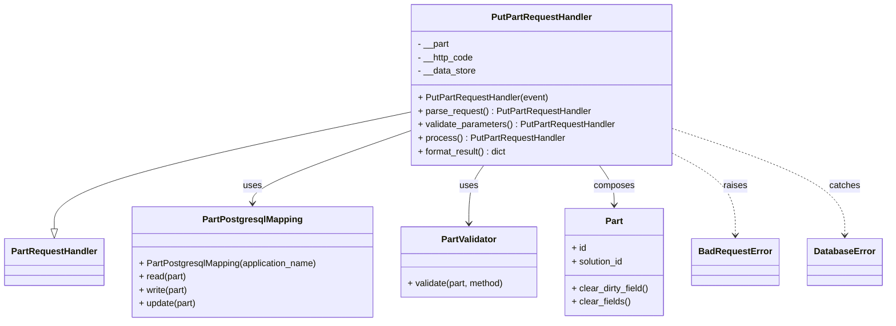
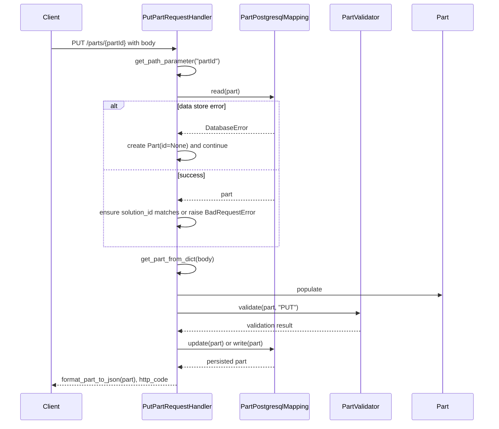

# Diagram: partview_core/partview_service/partview_service/api/part/handlers/PutPartRequestHandler.py

> Auto-generated by Obscura crawlers

## Diagram 1

### SVG

<svg id="container" width="1570.5234375" xmlns="http://www.w3.org/2000/svg" class="classDiagram" height="576" viewBox="0 0 1570.5234375 576" role="graphics-document document" aria-roledescription="class"><g><defs><marker id="container_class-aggregationStart" class="marker aggregation class" refX="18" refY="7" markerWidth="190" markerHeight="240" orient="auto"><path d="M 18,7 L9,13 L1,7 L9,1 Z"></path></marker></defs><defs><marker id="container_class-aggregationEnd" class="marker aggregation class" refX="1" refY="7" markerWidth="20" markerHeight="28" orient="auto"><path d="M 18,7 L9,13 L1,7 L9,1 Z"></path></marker></defs><defs><marker id="container_class-extensionStart" class="marker extension class" refX="18" refY="7" markerWidth="190" markerHeight="240" orient="auto"><path d="M 1,7 L18,13 V 1 Z"></path></marker></defs><defs><marker id="container_class-extensionEnd" class="marker extension class" refX="1" refY="7" markerWidth="20" markerHeight="28" orient="auto"><path d="M 1,1 V 13 L18,7 Z"></path></marker></defs><defs><marker id="container_class-compositionStart" class="marker composition class" refX="18" refY="7" markerWidth="190" markerHeight="240" orient="auto"><path d="M 18,7 L9,13 L1,7 L9,1 Z"></path></marker></defs><defs><marker id="container_class-compositionEnd" class="marker composition class" refX="1" refY="7" markerWidth="20" markerHeight="28" orient="auto"><path d="M 18,7 L9,13 L1,7 L9,1 Z"></path></marker></defs><defs><marker id="container_class-dependencyStart" class="marker dependency class" refX="6" refY="7" markerWidth="190" markerHeight="240" orient="auto"><path d="M 5,7 L9,13 L1,7 L9,1 Z"></path></marker></defs><defs><marker id="container_class-dependencyEnd" class="marker dependency class" refX="13" refY="7" markerWidth="20" markerHeight="28" orient="auto"><path d="M 18,7 L9,13 L14,7 L9,1 Z"></path></marker></defs><defs><marker id="container_class-lollipopStart" class="marker lollipop class" refX="13" refY="7" markerWidth="190" markerHeight="240" orient="auto"><circle stroke="black" fill="transparent" cx="7" cy="7" r="6"></circle></marker></defs><defs><marker id="container_class-lollipopEnd" class="marker lollipop class" refX="1" refY="7" markerWidth="190" markerHeight="240" orient="auto"><circle stroke="black" fill="transparent" cx="7" cy="7" r="6"></circle></marker></defs><g class="root"><g class="clusters"></g><g class="edgePaths"><path d="M733.389,200.177L626.846,222.314C520.303,244.451,307.218,288.726,200.675,323.654C94.133,358.583,94.133,384.167,94.133,396.958L94.133,409.75" id="id_PutPartRequestHandler_PartRequestHandler_1" class="edge-thickness-normal edge-pattern-solid relation" style=";;;" data-edge="true" data-et="edge" data-id="id_PutPartRequestHandler_PartRequestHandler_1" data-points="W3sieCI6NzMzLjM4ODY3MTg3NSwieSI6MjAwLjE3Njg0NjA3MDE5OTQyfSx7IngiOjk0LjEzMjgxMjUsInkiOjMzM30seyJ4Ijo5NC4xMzI4MTI1LCJ5Ijo0Mjd9XQ==" marker-end="url(#container_class-extensionEnd)"></path><path d="M733.389,232.715L685.375,249.429C637.361,266.143,541.333,299.572,493.319,321.453C445.305,343.333,445.305,353.667,445.305,358.833L445.305,364" id="id_PutPartRequestHandler_PartPostgresqlMapping_2" class="edge-thickness-normal edge-pattern-solid relation" style=";;;" data-edge="true" data-et="edge" data-id="id_PutPartRequestHandler_PartPostgresqlMapping_2" data-points="W3sieCI6NzMzLjM4ODY3MTg3NSwieSI6MjMyLjcxNTE5NjM2Mzg0MTI0fSx7IngiOjQ0NS4zMDQ2ODc1LCJ5IjozMzN9LHsieCI6NDQ1LjMwNDY4NzUsInkiOjM3MH1d" marker-end="url(#container_class-dependencyEnd)"></path><path d="M860.856,296L856.385,302.167C851.915,308.333,842.973,320.667,838.502,338C834.031,355.333,834.031,377.667,834.031,388.833L834.031,400" id="id_PutPartRequestHandler_PartValidator_3" class="edge-thickness-normal edge-pattern-solid relation" style=";;;" data-edge="true" data-et="edge" data-id="id_PutPartRequestHandler_PartValidator_3" data-points="W3sieCI6ODYwLjg1NjE3MDE0ODQ4MDcsInkiOjI5Nn0seyJ4Ijo4MzQuMDMxMjUsInkiOjMzM30seyJ4Ijo4MzQuMDMxMjUsInkiOjQwNn1d" marker-end="url(#container_class-dependencyEnd)"></path><path d="M1069.656,296L1074.126,302.167C1078.597,308.333,1087.539,320.667,1092.01,332.5C1096.48,344.333,1096.48,355.667,1096.48,361.333L1096.48,367" id="id_PutPartRequestHandler_Part_4" class="edge-thickness-normal edge-pattern-solid relation" style=";;;" data-edge="true" data-et="edge" data-id="id_PutPartRequestHandler_Part_4" data-points="W3sieCI6MTA2OS42NTU1NDg2MDE1MTkzLCJ5IjoyOTZ9LHsieCI6MTA5Ni40ODA0Njg3NSwieSI6MzMzfSx7IngiOjEwOTYuNDgwNDY4NzUsInkiOjM3M31d" marker-end="url(#container_class-dependencyEnd)"></path><path d="M1197.123,273.905L1215.856,283.754C1234.59,293.603,1272.057,313.302,1290.79,337.818C1309.523,362.333,1309.523,391.667,1309.523,406.333L1309.523,421" id="id_PutPartRequestHandler_BadRequestError_5" class="edge-thickness-normal edge-pattern-dashed relation" style=";;;" data-edge="true" data-et="edge" data-id="id_PutPartRequestHandler_BadRequestError_5" data-points="W3sieCI6MTE5Ny4xMjMwNDY4NzUsInkiOjI3My45MDUwNjMzOTg4NTk3fSx7IngiOjEzMDkuNTIzNDM3NSwieSI6MzMzfSx7IngiOjEzMDkuNTIzNDM3NSwieSI6NDI3fV0=" marker-end="url(#container_class-dependencyEnd)"></path><path d="M1197.123,230.753L1247.297,247.794C1297.47,264.835,1397.817,298.918,1447.991,330.625C1498.164,362.333,1498.164,391.667,1498.164,406.333L1498.164,421" id="id_PutPartRequestHandler_DatabaseError_6" class="edge-thickness-normal edge-pattern-dashed relation" style=";;;" data-edge="true" data-et="edge" data-id="id_PutPartRequestHandler_DatabaseError_6" data-points="W3sieCI6MTE5Ny4xMjMwNDY4NzUsInkiOjIzMC43NTI3MDIwNDM5ODc3fSx7IngiOjE0OTguMTY0MDYyNSwieSI6MzMzfSx7IngiOjE0OTguMTY0MDYyNSwieSI6NDI3fV0=" marker-end="url(#container_class-dependencyEnd)"></path></g><g class="edgeLabels"><g class="edgeLabel"><g class="label" data-id="id_PutPartRequestHandler_PartRequestHandler_1" transform="translate(0, 0)"><foreignObject width="0" height="0">

</foreignObject></g></g><g class="edgeLabel" transform="translate(445.3046875, 333)"><g class="label" data-id="id_PutPartRequestHandler_PartPostgresqlMapping_2" transform="translate(-16.4921875, -12)"><foreignObject width="32.984375" height="24">

uses

</foreignObject></g></g><g class="edgeLabel" transform="translate(834.03125, 333)"><g class="label" data-id="id_PutPartRequestHandler_PartValidator_3" transform="translate(-16.4921875, -12)"><foreignObject width="32.984375" height="24">

uses

</foreignObject></g></g><g class="edgeLabel" transform="translate(1096.48046875, 333)"><g class="label" data-id="id_PutPartRequestHandler_Part_4" transform="translate(-36.453125, -12)"><foreignObject width="72.90625" height="24">

composes

</foreignObject></g></g><g class="edgeLabel" transform="translate(1309.5234375, 333)"><g class="label" data-id="id_PutPartRequestHandler_BadRequestError_5" transform="translate(-21.25, -12)"><foreignObject width="42.5" height="24">

raises

</foreignObject></g></g><g class="edgeLabel" transform="translate(1498.1640625, 333)"><g class="label" data-id="id_PutPartRequestHandler_DatabaseError_6" transform="translate(-27.4765625, -12)"><foreignObject width="54.953125" height="24">

catches

</foreignObject></g></g></g><g class="nodes"><g class="node default" id="classId-PutPartRequestHandler-0" transform="translate(965.255859375, 152)"><g class="basic label-container"><path d="M-231.8671875 -144 L231.8671875 -144 L231.8671875 144 L-231.8671875 144" stroke="none" stroke-width="0" fill="#ECECFF" style=""></path><path d="M-231.8671875 -144 C-126.42537040747402 -144, -20.98355331494804 -144, 231.8671875 -144 M-231.8671875 -144 C-76.42384005756443 -144, 79.01950738487113 -144, 231.8671875 -144 M231.8671875 -144 C231.8671875 -43.26829322122374, 231.8671875 57.463413557552514, 231.8671875 144 M231.8671875 -144 C231.8671875 -43.812418040397105, 231.8671875 56.37516391920579, 231.8671875 144 M231.8671875 144 C104.98862314977713 144, -21.889941200445747 144, -231.8671875 144 M231.8671875 144 C124.86109458990505 144, 17.8550016798101 144, -231.8671875 144 M-231.8671875 144 C-231.8671875 51.01150180078591, -231.8671875 -41.976996398428184, -231.8671875 -144 M-231.8671875 144 C-231.8671875 42.10299445237386, -231.8671875 -59.79401109525227, -231.8671875 -144" stroke="#9370DB" stroke-width="1.3" fill="none" stroke-dasharray="0 0" style=""></path></g><g class="annotation-group text" transform="translate(0, -120)"></g><g class="label-group text" transform="translate(-86.390625, -120)"><g class="label" style="font-weight: bolder" transform="translate(0,-12)"><foreignObject width="172.78125" height="24">

PutPartRequestHandler

</foreignObject></g></g><g class="members-group text" transform="translate(-219.8671875, -72)"><g class="label" style="" transform="translate(0,-12)"><foreignObject width="57.171875" height="24">

- __part

</foreignObject></g><g class="label" style="" transform="translate(0,12)"><foreignObject width="100.25" height="24">

- __http_code

</foreignObject></g><g class="label" style="" transform="translate(0,36)"><foreignObject width="104.578125" height="24">

- __data_store

</foreignObject></g></g><g class="methods-group text" transform="translate(-219.8671875, 24)"><g class="label" style="" transform="translate(0,-12)"><foreignObject width="233" height="24">

+ PutPartRequestHandler(event)

</foreignObject></g><g class="label" style="" transform="translate(0,12)"><foreignObject width="308.421875" height="24">

+ parse_request() : PutPartRequestHandler

</foreignObject></g><g class="label" style="" transform="translate(0,36)"><foreignObject width="353.34375" height="24">

+ validate_parameters() : PutPartRequestHandler

</foreignObject></g><g class="label" style="" transform="translate(0,60)"><foreignObject width="260.359375" height="24">

+ process() : PutPartRequestHandler

</foreignObject></g><g class="label" style="" transform="translate(0,84)"><foreignObject width="161.3125" height="24">

+ format_result() : dict

</foreignObject></g></g><g class="divider" style=""><path d="M-231.8671875 -96 C-92.71714358907764 -96, 46.43290032184473 -96, 231.8671875 -96 M-231.8671875 -96 C-50.77613867550417 -96, 130.31491014899166 -96, 231.8671875 -96" stroke="#9370DB" stroke-width="1.3" fill="none" stroke-dasharray="0 0" style=""></path></g><g class="divider" style=""><path d="M-231.8671875 0 C-47.96089921807649 0, 135.94538906384702 0, 231.8671875 0 M-231.8671875 0 C-111.8650893604389 0, 8.137008779122198 0, 231.8671875 0" stroke="#9370DB" stroke-width="1.3" fill="none" stroke-dasharray="0 0" style=""></path></g></g><g class="node default" id="classId-PartRequestHandler-1" transform="translate(94.1328125, 469)"><g class="basic label-container"><path d="M-86.1328125 -42 L86.1328125 -42 L86.1328125 42 L-86.1328125 42" stroke="none" stroke-width="0" fill="#ECECFF" style=""></path><path d="M-86.1328125 -42 C-40.72753280626599 -42, 4.677746887468018 -42, 86.1328125 -42 M-86.1328125 -42 C-31.00893955810831 -42, 24.11493338378338 -42, 86.1328125 -42 M86.1328125 -42 C86.1328125 -15.341964623272553, 86.1328125 11.316070753454895, 86.1328125 42 M86.1328125 -42 C86.1328125 -10.427782667782704, 86.1328125 21.14443466443459, 86.1328125 42 M86.1328125 42 C20.328074169647252 42, -45.476664160705496 42, -86.1328125 42 M86.1328125 42 C51.126253344760656 42, 16.11969418952131 42, -86.1328125 42 M-86.1328125 42 C-86.1328125 11.623174224301604, -86.1328125 -18.753651551396793, -86.1328125 -42 M-86.1328125 42 C-86.1328125 24.63797459351963, -86.1328125 7.275949187039259, -86.1328125 -42" stroke="#9370DB" stroke-width="1.3" fill="none" stroke-dasharray="0 0" style=""></path></g><g class="annotation-group text" transform="translate(0, -18)"></g><g class="label-group text" transform="translate(-74.1328125, -18)"><g class="label" style="font-weight: bolder" transform="translate(0,-12)"><foreignObject width="148.265625" height="24">

PartRequestHandler

</foreignObject></g></g><g class="members-group text" transform="translate(-74.1328125, 30)"></g><g class="methods-group text" transform="translate(-74.1328125, 60)"></g><g class="divider" style=""><path d="M-86.1328125 6 C-48.84265064923489 6, -11.552488798469781 6, 86.1328125 6 M-86.1328125 6 C-30.394683230708395 6, 25.34344603858321 6, 86.1328125 6" stroke="#9370DB" stroke-width="1.3" fill="none" stroke-dasharray="0 0" style=""></path></g><g class="divider" style=""><path d="M-86.1328125 24 C-26.21221628773825 24, 33.7083799245235 24, 86.1328125 24 M-86.1328125 24 C-51.278544415759995 24, -16.42427633151999 24, 86.1328125 24" stroke="#9370DB" stroke-width="1.3" fill="none" stroke-dasharray="0 0" style=""></path></g></g><g class="node default" id="classId-PartPostgresqlMapping-2" transform="translate(445.3046875, 469)"><g class="basic label-container"><path d="M-215.0390625 -99 L215.0390625 -99 L215.0390625 99 L-215.0390625 99" stroke="none" stroke-width="0" fill="#ECECFF" style=""></path><path d="M-215.0390625 -99 C-45.44511458665403 -99, 124.14883332669194 -99, 215.0390625 -99 M-215.0390625 -99 C-52.14065341095653 -99, 110.75775567808694 -99, 215.0390625 -99 M215.0390625 -99 C215.0390625 -40.872893546415916, 215.0390625 17.254212907168167, 215.0390625 99 M215.0390625 -99 C215.0390625 -23.250119121010627, 215.0390625 52.499761757978746, 215.0390625 99 M215.0390625 99 C127.79391439504799 99, 40.54876629009598 99, -215.0390625 99 M215.0390625 99 C125.00692872469573 99, 34.97479494939145 99, -215.0390625 99 M-215.0390625 99 C-215.0390625 47.74388319744938, -215.0390625 -3.512233605101244, -215.0390625 -99 M-215.0390625 99 C-215.0390625 48.3075506045828, -215.0390625 -2.3848987908343986, -215.0390625 -99" stroke="#9370DB" stroke-width="1.3" fill="none" stroke-dasharray="0 0" style=""></path></g><g class="annotation-group text" transform="translate(0, -75)"></g><g class="label-group text" transform="translate(-85.46875, -75)"><g class="label" style="font-weight: bolder" transform="translate(0,-12)"><foreignObject width="170.9375" height="24">

PartPostgresqlMapping

</foreignObject></g></g><g class="members-group text" transform="translate(-203.0390625, -27)"></g><g class="methods-group text" transform="translate(-203.0390625, 3)"><g class="label" style="" transform="translate(0,-12)"><foreignObject width="320.609375" height="24">

+ PartPostgresqlMapping(application_name)

</foreignObject></g><g class="label" style="" transform="translate(0,12)"><foreignObject width="85.125" height="24">

+ read(part)

</foreignObject></g><g class="label" style="" transform="translate(0,36)"><foreignObject width="89.015625" height="24">

+ write(part)

</foreignObject></g><g class="label" style="" transform="translate(0,60)"><foreignObject width="103.9375" height="24">

+ update(part)

</foreignObject></g></g><g class="divider" style=""><path d="M-215.0390625 -51 C-51.16874296026444 -51, 112.70157657947112 -51, 215.0390625 -51 M-215.0390625 -51 C-49.55526415862866 -51, 115.92853418274268 -51, 215.0390625 -51" stroke="#9370DB" stroke-width="1.3" fill="none" stroke-dasharray="0 0" style=""></path></g><g class="divider" style=""><path d="M-215.0390625 -27 C-74.36823540721349 -27, 66.30259168557302 -27, 215.0390625 -27 M-215.0390625 -27 C-67.0011200157839 -27, 81.0368224684322 -27, 215.0390625 -27" stroke="#9370DB" stroke-width="1.3" fill="none" stroke-dasharray="0 0" style=""></path></g></g><g class="node default" id="classId-PartValidator-3" transform="translate(834.03125, 469)"><g class="basic label-container"><path d="M-123.6875 -63 L123.6875 -63 L123.6875 63 L-123.6875 63" stroke="none" stroke-width="0" fill="#ECECFF" style=""></path><path d="M-123.6875 -63 C-31.310607024868773 -63, 61.066285950262454 -63, 123.6875 -63 M-123.6875 -63 C-40.22993995626649 -63, 43.22762008746702 -63, 123.6875 -63 M123.6875 -63 C123.6875 -15.980735323382298, 123.6875 31.038529353235404, 123.6875 63 M123.6875 -63 C123.6875 -31.589285319577584, 123.6875 -0.17857063915516846, 123.6875 63 M123.6875 63 C49.86864901328737 63, -23.950201973425266 63, -123.6875 63 M123.6875 63 C40.76776555545774 63, -42.151968889084515 63, -123.6875 63 M-123.6875 63 C-123.6875 35.46414050335122, -123.6875 7.928281006702434, -123.6875 -63 M-123.6875 63 C-123.6875 28.108073826450934, -123.6875 -6.783852347098133, -123.6875 -63" stroke="#9370DB" stroke-width="1.3" fill="none" stroke-dasharray="0 0" style=""></path></g><g class="annotation-group text" transform="translate(0, -39)"></g><g class="label-group text" transform="translate(-48.25, -39)"><g class="label" style="font-weight: bolder" transform="translate(0,-12)"><foreignObject width="96.5" height="24">

PartValidator

</foreignObject></g></g><g class="members-group text" transform="translate(-111.6875, 9)"></g><g class="methods-group text" transform="translate(-111.6875, 39)"><g class="label" style="" transform="translate(0,-12)"><foreignObject width="175.125" height="24">

+ validate(part, method)

</foreignObject></g></g><g class="divider" style=""><path d="M-123.6875 -15 C-59.15921286632319 -15, 5.369074267353625 -15, 123.6875 -15 M-123.6875 -15 C-69.41081735053054 -15, -15.134134701061072 -15, 123.6875 -15" stroke="#9370DB" stroke-width="1.3" fill="none" stroke-dasharray="0 0" style=""></path></g><g class="divider" style=""><path d="M-123.6875 9 C-66.25470930976212 9, -8.821918619524226 9, 123.6875 9 M-123.6875 9 C-56.4614997962299 9, 10.764500407540197 9, 123.6875 9" stroke="#9370DB" stroke-width="1.3" fill="none" stroke-dasharray="0 0" style=""></path></g></g><g class="node default" id="classId-Part-4" transform="translate(1096.48046875, 469)"><g class="basic label-container"><path d="M-88.76171875 -96 L88.76171875 -96 L88.76171875 96 L-88.76171875 96" stroke="none" stroke-width="0" fill="#ECECFF" style=""></path><path d="M-88.76171875 -96 C-30.703736718370074 -96, 27.354245313259852 -96, 88.76171875 -96 M-88.76171875 -96 C-36.223468364391024 -96, 16.31478202121795 -96, 88.76171875 -96 M88.76171875 -96 C88.76171875 -26.51445100609139, 88.76171875 42.97109798781722, 88.76171875 96 M88.76171875 -96 C88.76171875 -24.442204191955412, 88.76171875 47.115591616089176, 88.76171875 96 M88.76171875 96 C21.796371377463572 96, -45.168975995072856 96, -88.76171875 96 M88.76171875 96 C43.128027438404146 96, -2.5056638731917076 96, -88.76171875 96 M-88.76171875 96 C-88.76171875 38.38764587519417, -88.76171875 -19.224708249611666, -88.76171875 -96 M-88.76171875 96 C-88.76171875 24.54980753552931, -88.76171875 -46.90038492894138, -88.76171875 -96" stroke="#9370DB" stroke-width="1.3" fill="none" stroke-dasharray="0 0" style=""></path></g><g class="annotation-group text" transform="translate(0, -72)"></g><g class="label-group text" transform="translate(-15.0703125, -72)"><g class="label" style="font-weight: bolder" transform="translate(0,-12)"><foreignObject width="30.140625" height="24">

Part

</foreignObject></g></g><g class="members-group text" transform="translate(-76.76171875, -24)"><g class="label" style="" transform="translate(0,-12)"><foreignObject width="26.3125" height="24">

+ id

</foreignObject></g><g class="label" style="" transform="translate(0,12)"><foreignObject width="94.453125" height="24">

+ solution_id

</foreignObject></g></g><g class="methods-group text" transform="translate(-76.76171875, 48)"><g class="label" style="" transform="translate(0,-12)"><foreignObject width="138.453125" height="24">

+ clear_dirty_field()

</foreignObject></g><g class="label" style="" transform="translate(0,12)"><foreignObject width="104.578125" height="24">

+ clear_fields()

</foreignObject></g></g><g class="divider" style=""><path d="M-88.76171875 -48 C-51.694430778814066 -48, -14.627142807628132 -48, 88.76171875 -48 M-88.76171875 -48 C-23.626930737387312 -48, 41.507857275225376 -48, 88.76171875 -48" stroke="#9370DB" stroke-width="1.3" fill="none" stroke-dasharray="0 0" style=""></path></g><g class="divider" style=""><path d="M-88.76171875 24 C-50.6598750703921 24, -12.558031390784194 24, 88.76171875 24 M-88.76171875 24 C-25.990772524320704 24, 36.78017370135859 24, 88.76171875 24" stroke="#9370DB" stroke-width="1.3" fill="none" stroke-dasharray="0 0" style=""></path></g></g><g class="node default" id="classId-BadRequestError-5" transform="translate(1309.5234375, 469)"><g class="basic label-container"><path d="M-74.28125 -42 L74.28125 -42 L74.28125 42 L-74.28125 42" stroke="none" stroke-width="0" fill="#ECECFF" style=""></path><path d="M-74.28125 -42 C-27.720298947859966 -42, 18.840652104280068 -42, 74.28125 -42 M-74.28125 -42 C-39.240005699698145 -42, -4.19876139939629 -42, 74.28125 -42 M74.28125 -42 C74.28125 -15.054415888843664, 74.28125 11.891168222312672, 74.28125 42 M74.28125 -42 C74.28125 -19.959932135080678, 74.28125 2.080135729838645, 74.28125 42 M74.28125 42 C28.24830282443662 42, -17.784644351126758 42, -74.28125 42 M74.28125 42 C32.718170011091665 42, -8.84490997781667 42, -74.28125 42 M-74.28125 42 C-74.28125 9.40524302517742, -74.28125 -23.18951394964516, -74.28125 -42 M-74.28125 42 C-74.28125 21.641079211819203, -74.28125 1.282158423638407, -74.28125 -42" stroke="#9370DB" stroke-width="1.3" fill="none" stroke-dasharray="0 0" style=""></path></g><g class="annotation-group text" transform="translate(0, -18)"></g><g class="label-group text" transform="translate(-62.28125, -18)"><g class="label" style="font-weight: bolder" transform="translate(0,-12)"><foreignObject width="124.5625" height="24">

BadRequestError

</foreignObject></g></g><g class="members-group text" transform="translate(-62.28125, 30)"></g><g class="methods-group text" transform="translate(-62.28125, 60)"></g><g class="divider" style=""><path d="M-74.28125 6 C-27.1539757067807 6, 19.973298586438602 6, 74.28125 6 M-74.28125 6 C-29.198195810456248 6, 15.884858379087504 6, 74.28125 6" stroke="#9370DB" stroke-width="1.3" fill="none" stroke-dasharray="0 0" style=""></path></g><g class="divider" style=""><path d="M-74.28125 24 C-41.9882421067196 24, -9.695234213439207 24, 74.28125 24 M-74.28125 24 C-43.194413462284686 24, -12.107576924569372 24, 74.28125 24" stroke="#9370DB" stroke-width="1.3" fill="none" stroke-dasharray="0 0" style=""></path></g></g><g class="node default" id="classId-DatabaseError-6" transform="translate(1498.1640625, 469)"><g class="basic label-container"><path d="M-64.359375 -42 L64.359375 -42 L64.359375 42 L-64.359375 42" stroke="none" stroke-width="0" fill="#ECECFF" style=""></path><path d="M-64.359375 -42 C-29.993996547400315 -42, 4.371381905199371 -42, 64.359375 -42 M-64.359375 -42 C-13.333806372418294 -42, 37.69176225516341 -42, 64.359375 -42 M64.359375 -42 C64.359375 -19.34491396378497, 64.359375 3.3101720724300634, 64.359375 42 M64.359375 -42 C64.359375 -15.09165143492206, 64.359375 11.81669713015588, 64.359375 42 M64.359375 42 C29.24355220050984 42, -5.872270598980322 42, -64.359375 42 M64.359375 42 C20.348224099267824 42, -23.66292680146435 42, -64.359375 42 M-64.359375 42 C-64.359375 19.67960293463752, -64.359375 -2.640794130724963, -64.359375 -42 M-64.359375 42 C-64.359375 16.404322802684487, -64.359375 -9.191354394631027, -64.359375 -42" stroke="#9370DB" stroke-width="1.3" fill="none" stroke-dasharray="0 0" style=""></path></g><g class="annotation-group text" transform="translate(0, -18)"></g><g class="label-group text" transform="translate(-52.359375, -18)"><g class="label" style="font-weight: bolder" transform="translate(0,-12)"><foreignObject width="104.71875" height="24">

DatabaseError

</foreignObject></g></g><g class="members-group text" transform="translate(-52.359375, 30)"></g><g class="methods-group text" transform="translate(-52.359375, 60)"></g><g class="divider" style=""><path d="M-64.359375 6 C-31.93762382308877 6, 0.4841273538224584 6, 64.359375 6 M-64.359375 6 C-30.226868293548172 6, 3.905638412903656 6, 64.359375 6" stroke="#9370DB" stroke-width="1.3" fill="none" stroke-dasharray="0 0" style=""></path></g><g class="divider" style=""><path d="M-64.359375 24 C-12.93781891189873 24, 38.48373717620254 24, 64.359375 24 M-64.359375 24 C-17.997772722063353 24, 28.363829555873295 24, 64.359375 24" stroke="#9370DB" stroke-width="1.3" fill="none" stroke-dasharray="0 0" style=""></path></g></g></g></g></g></svg>

## Diagram 2

### SVG

<svg id="container" width="1273" xmlns="http://www.w3.org/2000/svg" height="1093" viewBox="-50 -10 1273 1093" role="graphics-document document" aria-roledescription="sequence"><g><rect x="1023" y="1007" fill="#eaeaea" stroke="#666" width="150" height="65" name="PartModel" rx="3" ry="3" class="actor actor-bottom"></rect><text x="1098" y="1039.5" dominant-baseline="central" alignment-baseline="central" class="actor actor-box" style="text-anchor: middle; font-size: 16px; font-weight: 400;"><tspan x="1098" dy="0">Part</tspan></text></g><g><rect x="823" y="1007" fill="#eaeaea" stroke="#666" width="150" height="65" name="Validator" rx="3" ry="3" class="actor actor-bottom"></rect><text x="898" y="1039.5" dominant-baseline="central" alignment-baseline="central" class="actor actor-box" style="text-anchor: middle; font-size: 16px; font-weight: 400;"><tspan x="898" dy="0">PartValidator</tspan></text></g><g><rect x="585" y="1007" fill="#eaeaea" stroke="#666" width="188" height="65" name="DataStore" rx="3" ry="3" class="actor actor-bottom"></rect><text x="679" y="1039.5" dominant-baseline="central" alignment-baseline="central" class="actor actor-box" style="text-anchor: middle; font-size: 16px; font-weight: 400;"><tspan x="679" dy="0">PartPostgresqlMapping</tspan></text></g><g><rect x="320.5" y="1007" fill="#eaeaea" stroke="#666" width="191" height="65" name="Handler" rx="3" ry="3" class="actor actor-bottom"></rect><text x="416" y="1039.5" dominant-baseline="central" alignment-baseline="central" class="actor actor-box" style="text-anchor: middle; font-size: 16px; font-weight: 400;"><tspan x="416" dy="0">PutPartRequestHandler</tspan></text></g><g><rect x="0" y="1007" fill="#eaeaea" stroke="#666" width="150" height="65" name="Client" rx="3" ry="3" class="actor actor-bottom"></rect><text x="75" y="1039.5" dominant-baseline="central" alignment-baseline="central" class="actor actor-box" style="text-anchor: middle; font-size: 16px; font-weight: 400;"><tspan x="75" dy="0">Client</tspan></text></g><g><line id="actor4" x1="1098" y1="65" x2="1098" y2="1007" class="actor-line 200" stroke-width="0.5px" stroke="#999" name="PartModel"></line><g id="root-4"><rect x="1023" y="0" fill="#eaeaea" stroke="#666" width="150" height="65" name="PartModel" rx="3" ry="3" class="actor actor-top"></rect><text x="1098" y="32.5" dominant-baseline="central" alignment-baseline="central" class="actor actor-box" style="text-anchor: middle; font-size: 16px; font-weight: 400;"><tspan x="1098" dy="0">Part</tspan></text></g></g><g><line id="actor3" x1="898" y1="65" x2="898" y2="1007" class="actor-line 200" stroke-width="0.5px" stroke="#999" name="Validator"></line><g id="root-3"><rect x="823" y="0" fill="#eaeaea" stroke="#666" width="150" height="65" name="Validator" rx="3" ry="3" class="actor actor-top"></rect><text x="898" y="32.5" dominant-baseline="central" alignment-baseline="central" class="actor actor-box" style="text-anchor: middle; font-size: 16px; font-weight: 400;"><tspan x="898" dy="0">PartValidator</tspan></text></g></g><g><line id="actor2" x1="679" y1="65" x2="679" y2="1007" class="actor-line 200" stroke-width="0.5px" stroke="#999" name="DataStore"></line><g id="root-2"><rect x="585" y="0" fill="#eaeaea" stroke="#666" width="188" height="65" name="DataStore" rx="3" ry="3" class="actor actor-top"></rect><text x="679" y="32.5" dominant-baseline="central" alignment-baseline="central" class="actor actor-box" style="text-anchor: middle; font-size: 16px; font-weight: 400;"><tspan x="679" dy="0">PartPostgresqlMapping</tspan></text></g></g><g><line id="actor1" x1="416" y1="65" x2="416" y2="1007" class="actor-line 200" stroke-width="0.5px" stroke="#999" name="Handler"></line><g id="root-1"><rect x="320.5" y="0" fill="#eaeaea" stroke="#666" width="191" height="65" name="Handler" rx="3" ry="3" class="actor actor-top"></rect><text x="416" y="32.5" dominant-baseline="central" alignment-baseline="central" class="actor actor-box" style="text-anchor: middle; font-size: 16px; font-weight: 400;"><tspan x="416" dy="0">PutPartRequestHandler</tspan></text></g></g><g><line id="actor0" x1="75" y1="65" x2="75" y2="1007" class="actor-line 200" stroke-width="0.5px" stroke="#999" name="Client"></line><g id="root-0"><rect x="0" y="0" fill="#eaeaea" stroke="#666" width="150" height="65" name="Client" rx="3" ry="3" class="actor actor-top"></rect><text x="75" y="32.5" dominant-baseline="central" alignment-baseline="central" class="actor actor-box" style="text-anchor: middle; font-size: 16px; font-weight: 400;"><tspan x="75" dy="0">Client</tspan></text></g></g><g></g><defs><symbol id="computer" width="24" height="24"><path transform="scale(.5)" d="M2 2v13h20v-13h-20zm18 11h-16v-9h16v9zm-10.228 6l.466-1h3.524l.467 1h-4.457zm14.228 3h-24l2-6h2.104l-1.33 4h18.45l-1.297-4h2.073l2 6zm-5-10h-14v-7h14v7z"></path></symbol></defs><defs><symbol id="database" fill-rule="evenodd" clip-rule="evenodd"><path transform="scale(.5)" d="M12.258.001l.256.004.255.005.253.008.251.01.249.012.247.015.246.016.242.019.241.02.239.023.236.024.233.027.231.028.229.031.225.032.223.034.22.036.217.038.214.04.211.041.208.043.205.045.201.046.198.048.194.05.191.051.187.053.183.054.18.056.175.057.172.059.168.06.163.061.16.063.155.064.15.066.074.033.073.033.071.034.07.034.069.035.068.035.067.035.066.035.064.036.064.036.062.036.06.036.06.037.058.037.058.037.055.038.055.038.053.038.052.038.051.039.05.039.048.039.047.039.045.04.044.04.043.04.041.04.04.041.039.041.037.041.036.041.034.041.033.042.032.042.03.042.029.042.027.042.026.043.024.043.023.043.021.043.02.043.018.044.017.043.015.044.013.044.012.044.011.045.009.044.007.045.006.045.004.045.002.045.001.045v17l-.001.045-.002.045-.004.045-.006.045-.007.045-.009.044-.011.045-.012.044-.013.044-.015.044-.017.043-.018.044-.02.043-.021.043-.023.043-.024.043-.026.043-.027.042-.029.042-.03.042-.032.042-.033.042-.034.041-.036.041-.037.041-.039.041-.04.041-.041.04-.043.04-.044.04-.045.04-.047.039-.048.039-.05.039-.051.039-.052.038-.053.038-.055.038-.055.038-.058.037-.058.037-.06.037-.06.036-.062.036-.064.036-.064.036-.066.035-.067.035-.068.035-.069.035-.07.034-.071.034-.073.033-.074.033-.15.066-.155.064-.16.063-.163.061-.168.06-.172.059-.175.057-.18.056-.183.054-.187.053-.191.051-.194.05-.198.048-.201.046-.205.045-.208.043-.211.041-.214.04-.217.038-.22.036-.223.034-.225.032-.229.031-.231.028-.233.027-.236.024-.239.023-.241.02-.242.019-.246.016-.247.015-.249.012-.251.01-.253.008-.255.005-.256.004-.258.001-.258-.001-.256-.004-.255-.005-.253-.008-.251-.01-.249-.012-.247-.015-.245-.016-.243-.019-.241-.02-.238-.023-.236-.024-.234-.027-.231-.028-.228-.031-.226-.032-.223-.034-.22-.036-.217-.038-.214-.04-.211-.041-.208-.043-.204-.045-.201-.046-.198-.048-.195-.05-.19-.051-.187-.053-.184-.054-.179-.056-.176-.057-.172-.059-.167-.06-.164-.061-.159-.063-.155-.064-.151-.066-.074-.033-.072-.033-.072-.034-.07-.034-.069-.035-.068-.035-.067-.035-.066-.035-.064-.036-.063-.036-.062-.036-.061-.036-.06-.037-.058-.037-.057-.037-.056-.038-.055-.038-.053-.038-.052-.038-.051-.039-.049-.039-.049-.039-.046-.039-.046-.04-.044-.04-.043-.04-.041-.04-.04-.041-.039-.041-.037-.041-.036-.041-.034-.041-.033-.042-.032-.042-.03-.042-.029-.042-.027-.042-.026-.043-.024-.043-.023-.043-.021-.043-.02-.043-.018-.044-.017-.043-.015-.044-.013-.044-.012-.044-.011-.045-.009-.044-.007-.045-.006-.045-.004-.045-.002-.045-.001-.045v-17l.001-.045.002-.045.004-.045.006-.045.007-.045.009-.044.011-.045.012-.044.013-.044.015-.044.017-.043.018-.044.02-.043.021-.043.023-.043.024-.043.026-.043.027-.042.029-.042.03-.042.032-.042.033-.042.034-.041.036-.041.037-.041.039-.041.04-.041.041-.04.043-.04.044-.04.046-.04.046-.039.049-.039.049-.039.051-.039.052-.038.053-.038.055-.038.056-.038.057-.037.058-.037.06-.037.061-.036.062-.036.063-.036.064-.036.066-.035.067-.035.068-.035.069-.035.07-.034.072-.034.072-.033.074-.033.151-.066.155-.064.159-.063.164-.061.167-.06.172-.059.176-.057.179-.056.184-.054.187-.053.19-.051.195-.05.198-.048.201-.046.204-.045.208-.043.211-.041.214-.04.217-.038.22-.036.223-.034.226-.032.228-.031.231-.028.234-.027.236-.024.238-.023.241-.02.243-.019.245-.016.247-.015.249-.012.251-.01.253-.008.255-.005.256-.004.258-.001.258.001zm-9.258 20.499v.01l.001.021.003.021.004.022.005.021.006.022.007.022.009.023.01.022.011.023.012.023.013.023.015.023.016.024.017.023.018.024.019.024.021.024.022.025.023.024.024.025.052.049.056.05.061.051.066.051.07.051.075.051.079.052.084.052.088.052.092.052.097.052.102.051.105.052.11.052.114.051.119.051.123.051.127.05.131.05.135.05.139.048.144.049.147.047.152.047.155.047.16.045.163.045.167.043.171.043.176.041.178.041.183.039.187.039.19.037.194.035.197.035.202.033.204.031.209.03.212.029.216.027.219.025.222.024.226.021.23.02.233.018.236.016.24.015.243.012.246.01.249.008.253.005.256.004.259.001.26-.001.257-.004.254-.005.25-.008.247-.011.244-.012.241-.014.237-.016.233-.018.231-.021.226-.021.224-.024.22-.026.216-.027.212-.028.21-.031.205-.031.202-.034.198-.034.194-.036.191-.037.187-.039.183-.04.179-.04.175-.042.172-.043.168-.044.163-.045.16-.046.155-.046.152-.047.148-.048.143-.049.139-.049.136-.05.131-.05.126-.05.123-.051.118-.052.114-.051.11-.052.106-.052.101-.052.096-.052.092-.052.088-.053.083-.051.079-.052.074-.052.07-.051.065-.051.06-.051.056-.05.051-.05.023-.024.023-.025.021-.024.02-.024.019-.024.018-.024.017-.024.015-.023.014-.024.013-.023.012-.023.01-.023.01-.022.008-.022.006-.022.006-.022.004-.022.004-.021.001-.021.001-.021v-4.127l-.077.055-.08.053-.083.054-.085.053-.087.052-.09.052-.093.051-.095.05-.097.05-.1.049-.102.049-.105.048-.106.047-.109.047-.111.046-.114.045-.115.045-.118.044-.12.043-.122.042-.124.042-.126.041-.128.04-.13.04-.132.038-.134.038-.135.037-.138.037-.139.035-.142.035-.143.034-.144.033-.147.032-.148.031-.15.03-.151.03-.153.029-.154.027-.156.027-.158.026-.159.025-.161.024-.162.023-.163.022-.165.021-.166.02-.167.019-.169.018-.169.017-.171.016-.173.015-.173.014-.175.013-.175.012-.177.011-.178.01-.179.008-.179.008-.181.006-.182.005-.182.004-.184.003-.184.002h-.37l-.184-.002-.184-.003-.182-.004-.182-.005-.181-.006-.179-.008-.179-.008-.178-.01-.176-.011-.176-.012-.175-.013-.173-.014-.172-.015-.171-.016-.17-.017-.169-.018-.167-.019-.166-.02-.165-.021-.163-.022-.162-.023-.161-.024-.159-.025-.157-.026-.156-.027-.155-.027-.153-.029-.151-.03-.15-.03-.148-.031-.146-.032-.145-.033-.143-.034-.141-.035-.14-.035-.137-.037-.136-.037-.134-.038-.132-.038-.13-.04-.128-.04-.126-.041-.124-.042-.122-.042-.12-.044-.117-.043-.116-.045-.113-.045-.112-.046-.109-.047-.106-.047-.105-.048-.102-.049-.1-.049-.097-.05-.095-.05-.093-.052-.09-.051-.087-.052-.085-.053-.083-.054-.08-.054-.077-.054v4.127zm0-5.654v.011l.001.021.003.021.004.021.005.022.006.022.007.022.009.022.01.022.011.023.012.023.013.023.015.024.016.023.017.024.018.024.019.024.021.024.022.024.023.025.024.024.052.05.056.05.061.05.066.051.07.051.075.052.079.051.084.052.088.052.092.052.097.052.102.052.105.052.11.051.114.051.119.052.123.05.127.051.131.05.135.049.139.049.144.048.147.048.152.047.155.046.16.045.163.045.167.044.171.042.176.042.178.04.183.04.187.038.19.037.194.036.197.034.202.033.204.032.209.03.212.028.216.027.219.025.222.024.226.022.23.02.233.018.236.016.24.014.243.012.246.01.249.008.253.006.256.003.259.001.26-.001.257-.003.254-.006.25-.008.247-.01.244-.012.241-.015.237-.016.233-.018.231-.02.226-.022.224-.024.22-.025.216-.027.212-.029.21-.03.205-.032.202-.033.198-.035.194-.036.191-.037.187-.039.183-.039.179-.041.175-.042.172-.043.168-.044.163-.045.16-.045.155-.047.152-.047.148-.048.143-.048.139-.05.136-.049.131-.05.126-.051.123-.051.118-.051.114-.052.11-.052.106-.052.101-.052.096-.052.092-.052.088-.052.083-.052.079-.052.074-.051.07-.052.065-.051.06-.05.056-.051.051-.049.023-.025.023-.024.021-.025.02-.024.019-.024.018-.024.017-.024.015-.023.014-.023.013-.024.012-.022.01-.023.01-.023.008-.022.006-.022.006-.022.004-.021.004-.022.001-.021.001-.021v-4.139l-.077.054-.08.054-.083.054-.085.052-.087.053-.09.051-.093.051-.095.051-.097.05-.1.049-.102.049-.105.048-.106.047-.109.047-.111.046-.114.045-.115.044-.118.044-.12.044-.122.042-.124.042-.126.041-.128.04-.13.039-.132.039-.134.038-.135.037-.138.036-.139.036-.142.035-.143.033-.144.033-.147.033-.148.031-.15.03-.151.03-.153.028-.154.028-.156.027-.158.026-.159.025-.161.024-.162.023-.163.022-.165.021-.166.02-.167.019-.169.018-.169.017-.171.016-.173.015-.173.014-.175.013-.175.012-.177.011-.178.009-.179.009-.179.007-.181.007-.182.005-.182.004-.184.003-.184.002h-.37l-.184-.002-.184-.003-.182-.004-.182-.005-.181-.007-.179-.007-.179-.009-.178-.009-.176-.011-.176-.012-.175-.013-.173-.014-.172-.015-.171-.016-.17-.017-.169-.018-.167-.019-.166-.02-.165-.021-.163-.022-.162-.023-.161-.024-.159-.025-.157-.026-.156-.027-.155-.028-.153-.028-.151-.03-.15-.03-.148-.031-.146-.033-.145-.033-.143-.033-.141-.035-.14-.036-.137-.036-.136-.037-.134-.038-.132-.039-.13-.039-.128-.04-.126-.041-.124-.042-.122-.043-.12-.043-.117-.044-.116-.044-.113-.046-.112-.046-.109-.046-.106-.047-.105-.048-.102-.049-.1-.049-.097-.05-.095-.051-.093-.051-.09-.051-.087-.053-.085-.052-.083-.054-.08-.054-.077-.054v4.139zm0-5.666v.011l.001.02.003.022.004.021.005.022.006.021.007.022.009.023.01.022.011.023.012.023.013.023.015.023.016.024.017.024.018.023.019.024.021.025.022.024.023.024.024.025.052.05.056.05.061.05.066.051.07.051.075.052.079.051.084.052.088.052.092.052.097.052.102.052.105.051.11.052.114.051.119.051.123.051.127.05.131.05.135.05.139.049.144.048.147.048.152.047.155.046.16.045.163.045.167.043.171.043.176.042.178.04.183.04.187.038.19.037.194.036.197.034.202.033.204.032.209.03.212.028.216.027.219.025.222.024.226.021.23.02.233.018.236.017.24.014.243.012.246.01.249.008.253.006.256.003.259.001.26-.001.257-.003.254-.006.25-.008.247-.01.244-.013.241-.014.237-.016.233-.018.231-.02.226-.022.224-.024.22-.025.216-.027.212-.029.21-.03.205-.032.202-.033.198-.035.194-.036.191-.037.187-.039.183-.039.179-.041.175-.042.172-.043.168-.044.163-.045.16-.045.155-.047.152-.047.148-.048.143-.049.139-.049.136-.049.131-.051.126-.05.123-.051.118-.052.114-.051.11-.052.106-.052.101-.052.096-.052.092-.052.088-.052.083-.052.079-.052.074-.052.07-.051.065-.051.06-.051.056-.05.051-.049.023-.025.023-.025.021-.024.02-.024.019-.024.018-.024.017-.024.015-.023.014-.024.013-.023.012-.023.01-.022.01-.023.008-.022.006-.022.006-.022.004-.022.004-.021.001-.021.001-.021v-4.153l-.077.054-.08.054-.083.053-.085.053-.087.053-.09.051-.093.051-.095.051-.097.05-.1.049-.102.048-.105.048-.106.048-.109.046-.111.046-.114.046-.115.044-.118.044-.12.043-.122.043-.124.042-.126.041-.128.04-.13.039-.132.039-.134.038-.135.037-.138.036-.139.036-.142.034-.143.034-.144.033-.147.032-.148.032-.15.03-.151.03-.153.028-.154.028-.156.027-.158.026-.159.024-.161.024-.162.023-.163.023-.165.021-.166.02-.167.019-.169.018-.169.017-.171.016-.173.015-.173.014-.175.013-.175.012-.177.01-.178.01-.179.009-.179.007-.181.006-.182.006-.182.004-.184.003-.184.001-.185.001-.185-.001-.184-.001-.184-.003-.182-.004-.182-.006-.181-.006-.179-.007-.179-.009-.178-.01-.176-.01-.176-.012-.175-.013-.173-.014-.172-.015-.171-.016-.17-.017-.169-.018-.167-.019-.166-.02-.165-.021-.163-.023-.162-.023-.161-.024-.159-.024-.157-.026-.156-.027-.155-.028-.153-.028-.151-.03-.15-.03-.148-.032-.146-.032-.145-.033-.143-.034-.141-.034-.14-.036-.137-.036-.136-.037-.134-.038-.132-.039-.13-.039-.128-.041-.126-.041-.124-.041-.122-.043-.12-.043-.117-.044-.116-.044-.113-.046-.112-.046-.109-.046-.106-.048-.105-.048-.102-.048-.1-.05-.097-.049-.095-.051-.093-.051-.09-.052-.087-.052-.085-.053-.083-.053-.08-.054-.077-.054v4.153zm8.74-8.179l-.257.004-.254.005-.25.008-.247.011-.244.012-.241.014-.237.016-.233.018-.231.021-.226.022-.224.023-.22.026-.216.027-.212.028-.21.031-.205.032-.202.033-.198.034-.194.036-.191.038-.187.038-.183.04-.179.041-.175.042-.172.043-.168.043-.163.045-.16.046-.155.046-.152.048-.148.048-.143.048-.139.049-.136.05-.131.05-.126.051-.123.051-.118.051-.114.052-.11.052-.106.052-.101.052-.096.052-.092.052-.088.052-.083.052-.079.052-.074.051-.07.052-.065.051-.06.05-.056.05-.051.05-.023.025-.023.024-.021.024-.02.025-.019.024-.018.024-.017.023-.015.024-.014.023-.013.023-.012.023-.01.023-.01.022-.008.022-.006.023-.006.021-.004.022-.004.021-.001.021-.001.021.001.021.001.021.004.021.004.022.006.021.006.023.008.022.01.022.01.023.012.023.013.023.014.023.015.024.017.023.018.024.019.024.02.025.021.024.023.024.023.025.051.05.056.05.06.05.065.051.07.052.074.051.079.052.083.052.088.052.092.052.096.052.101.052.106.052.11.052.114.052.118.051.123.051.126.051.131.05.136.05.139.049.143.048.148.048.152.048.155.046.16.046.163.045.168.043.172.043.175.042.179.041.183.04.187.038.191.038.194.036.198.034.202.033.205.032.21.031.212.028.216.027.22.026.224.023.226.022.231.021.233.018.237.016.241.014.244.012.247.011.25.008.254.005.257.004.26.001.26-.001.257-.004.254-.005.25-.008.247-.011.244-.012.241-.014.237-.016.233-.018.231-.021.226-.022.224-.023.22-.026.216-.027.212-.028.21-.031.205-.032.202-.033.198-.034.194-.036.191-.038.187-.038.183-.04.179-.041.175-.042.172-.043.168-.043.163-.045.16-.046.155-.046.152-.048.148-.048.143-.048.139-.049.136-.05.131-.05.126-.051.123-.051.118-.051.114-.052.11-.052.106-.052.101-.052.096-.052.092-.052.088-.052.083-.052.079-.052.074-.051.07-.052.065-.051.06-.05.056-.05.051-.05.023-.025.023-.024.021-.024.02-.025.019-.024.018-.024.017-.023.015-.024.014-.023.013-.023.012-.023.01-.023.01-.022.008-.022.006-.023.006-.021.004-.022.004-.021.001-.021.001-.021-.001-.021-.001-.021-.004-.021-.004-.022-.006-.021-.006-.023-.008-.022-.01-.022-.01-.023-.012-.023-.013-.023-.014-.023-.015-.024-.017-.023-.018-.024-.019-.024-.02-.025-.021-.024-.023-.024-.023-.025-.051-.05-.056-.05-.06-.05-.065-.051-.07-.052-.074-.051-.079-.052-.083-.052-.088-.052-.092-.052-.096-.052-.101-.052-.106-.052-.11-.052-.114-.052-.118-.051-.123-.051-.126-.051-.131-.05-.136-.05-.139-.049-.143-.048-.148-.048-.152-.048-.155-.046-.16-.046-.163-.045-.168-.043-.172-.043-.175-.042-.179-.041-.183-.04-.187-.038-.191-.038-.194-.036-.198-.034-.202-.033-.205-.032-.21-.031-.212-.028-.216-.027-.22-.026-.224-.023-.226-.022-.231-.021-.233-.018-.237-.016-.241-.014-.244-.012-.247-.011-.25-.008-.254-.005-.257-.004-.26-.001-.26.001z"></path></symbol></defs><defs><symbol id="clock" width="24" height="24"><path transform="scale(.5)" d="M12 2c5.514 0 10 4.486 10 10s-4.486 10-10 10-10-4.486-10-10 4.486-10 10-10zm0-2c-6.627 0-12 5.373-12 12s5.373 12 12 12 12-5.373 12-12-5.373-12-12-12zm5.848 12.459c.202.038.202.333.001.372-1.907.361-6.045 1.111-6.547 1.111-.719 0-1.301-.582-1.301-1.301 0-.512.77-5.447 1.125-7.445.034-.192.312-.181.343.014l.985 6.238 5.394 1.011z"></path></symbol></defs><defs><marker id="arrowhead" refX="7.9" refY="5" markerUnits="userSpaceOnUse" markerWidth="12" markerHeight="12" orient="auto-start-reverse"><path d="M -1 0 L 10 5 L 0 10 z"></path></marker></defs><defs><marker id="crosshead" markerWidth="15" markerHeight="8" orient="auto" refX="4" refY="4.5"><path fill="none" stroke="#000000" stroke-width="1pt" d="M 1,2 L 6,7 M 6,2 L 1,7" style="stroke-dasharray: 0, 0;"></path></marker></defs><defs><marker id="filled-head" refX="15.5" refY="7" markerWidth="20" markerHeight="28" orient="auto"><path d="M 18,7 L9,13 L14,7 L9,1 Z"></path></marker></defs><defs><marker id="sequencenumber" refX="15" refY="15" markerWidth="60" markerHeight="40" orient="auto"><circle cx="15" cy="15" r="6"></circle></marker></defs><g><line x1="213" y1="249" x2="690" y2="249" class="loopLine"></line><line x1="690" y1="249" x2="690" y2="621" class="loopLine"></line><line x1="213" y1="621" x2="690" y2="621" class="loopLine"></line><line x1="213" y1="249" x2="213" y2="621" class="loopLine"></line><line x1="213" y1="425" x2="690" y2="425" class="loopLine" style="stroke-dasharray: 3, 3;"></line><polygon points="213,249 263,249 263,262 254.6,269 213,269" class="labelBox"></polygon><text x="238" y="262" text-anchor="middle" dominant-baseline="middle" alignment-baseline="middle" class="labelText" style="font-size: 16px; font-weight: 400;">alt</text><text x="476.5" y="267" text-anchor="middle" class="loopText" style="font-size: 16px; font-weight: 400;"><tspan x="476.5">[data store error]</tspan></text><text x="451.5" y="443" text-anchor="middle" class="loopText" style="font-size: 16px; font-weight: 400;">[success]</text></g><text x="244" y="80" text-anchor="middle" dominant-baseline="middle" alignment-baseline="middle" class="messageText" dy="1em" style="font-size: 16px; font-weight: 400;">PUT /parts/{partId} with body</text><line x1="76" y1="113" x2="412" y2="113" class="messageLine0" stroke-width="2" stroke="none" marker-end="url(#arrowhead)" style="fill: none;"></line><text x="417" y="128" text-anchor="middle" dominant-baseline="middle" alignment-baseline="middle" class="messageText" dy="1em" style="font-size: 16px; font-weight: 400;">get_path_parameter("partId")</text><path d="M 417,161 C 477,151 477,191 417,181" class="messageLine0" stroke-width="2" stroke="none" marker-end="url(#arrowhead)" style="fill: none;"></path><text x="546" y="206" text-anchor="middle" dominant-baseline="middle" alignment-baseline="middle" class="messageText" dy="1em" style="font-size: 16px; font-weight: 400;">read(part)</text><line x1="417" y1="239" x2="675" y2="239" class="messageLine0" stroke-width="2" stroke="none" marker-end="url(#arrowhead)" style="fill: none;"></line><text x="549" y="299" text-anchor="middle" dominant-baseline="middle" alignment-baseline="middle" class="messageText" dy="1em" style="font-size: 16px; font-weight: 400;">DatabaseError</text><line x1="678" y1="332" x2="420" y2="332" class="messageLine1" stroke-width="2" stroke="none" marker-end="url(#arrowhead)" style="stroke-dasharray: 3, 3; fill: none;"></line><text x="417" y="347" text-anchor="middle" dominant-baseline="middle" alignment-baseline="middle" class="messageText" dy="1em" style="font-size: 16px; font-weight: 400;">create Part(id=None) and continue</text><path d="M 417,380 C 477,370 477,410 417,400" class="messageLine0" stroke-width="2" stroke="none" marker-end="url(#arrowhead)" style="fill: none;"></path><text x="549" y="470" text-anchor="middle" dominant-baseline="middle" alignment-baseline="middle" class="messageText" dy="1em" style="font-size: 16px; font-weight: 400;">part</text><line x1="678" y1="503" x2="420" y2="503" class="messageLine1" stroke-width="2" stroke="none" marker-end="url(#arrowhead)" style="stroke-dasharray: 3, 3; fill: none;"></line><text x="417" y="518" text-anchor="middle" dominant-baseline="middle" alignment-baseline="middle" class="messageText" dy="1em" style="font-size: 16px; font-weight: 400;">ensure solution_id matches or raise BadRequestError</text><path d="M 417,551 C 477,541 477,581 417,571" class="messageLine0" stroke-width="2" stroke="none" marker-end="url(#arrowhead)" style="fill: none;"></path><text x="417" y="636" text-anchor="middle" dominant-baseline="middle" alignment-baseline="middle" class="messageText" dy="1em" style="font-size: 16px; font-weight: 400;">get_part_from_dict(body)</text><path d="M 417,669 C 477,659 477,699 417,689" class="messageLine0" stroke-width="2" stroke="none" marker-end="url(#arrowhead)" style="fill: none;"></path><text x="756" y="714" text-anchor="middle" dominant-baseline="middle" alignment-baseline="middle" class="messageText" dy="1em" style="font-size: 16px; font-weight: 400;">populate</text><line x1="417" y1="747" x2="1094" y2="747" class="messageLine0" stroke-width="2" stroke="none" marker-end="url(#arrowhead)" style="fill: none;"></line><text x="656" y="762" text-anchor="middle" dominant-baseline="middle" alignment-baseline="middle" class="messageText" dy="1em" style="font-size: 16px; font-weight: 400;">validate(part, "PUT")</text><line x1="417" y1="795" x2="894" y2="795" class="messageLine0" stroke-width="2" stroke="none" marker-end="url(#arrowhead)" style="fill: none;"></line><text x="659" y="810" text-anchor="middle" dominant-baseline="middle" alignment-baseline="middle" class="messageText" dy="1em" style="font-size: 16px; font-weight: 400;">validation result</text><line x1="897" y1="843" x2="420" y2="843" class="messageLine1" stroke-width="2" stroke="none" marker-end="url(#arrowhead)" style="stroke-dasharray: 3, 3; fill: none;"></line><text x="546" y="858" text-anchor="middle" dominant-baseline="middle" alignment-baseline="middle" class="messageText" dy="1em" style="font-size: 16px; font-weight: 400;">update(part) or write(part)</text><line x1="417" y1="891" x2="675" y2="891" class="messageLine0" stroke-width="2" stroke="none" marker-end="url(#arrowhead)" style="fill: none;"></line><text x="549" y="906" text-anchor="middle" dominant-baseline="middle" alignment-baseline="middle" class="messageText" dy="1em" style="font-size: 16px; font-weight: 400;">persisted part</text><line x1="678" y1="939" x2="420" y2="939" class="messageLine1" stroke-width="2" stroke="none" marker-end="url(#arrowhead)" style="stroke-dasharray: 3, 3; fill: none;"></line><text x="247" y="954" text-anchor="middle" dominant-baseline="middle" alignment-baseline="middle" class="messageText" dy="1em" style="font-size: 16px; font-weight: 400;">format_part_to_json(part), http_code</text><line x1="415" y1="987" x2="79" y2="987" class="messageLine1" stroke-width="2" stroke="none" marker-end="url(#arrowhead)" style="stroke-dasharray: 3, 3; fill: none;"></line></svg>
