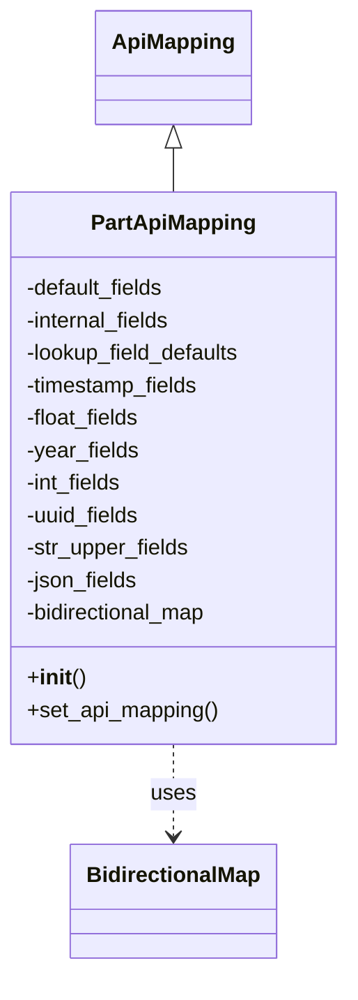

# Diagram: partview_core/partview_service/partview_service/api/part/handlers/mapping/PartApiMapping.py


> Auto-generated by Obscura crawlers

## Diagram 1



### SVG

<svg id="container" width="261.9921875" xmlns="http://www.w3.org/2000/svg" class="classDiagram" height="716" viewBox="0 0 261.9921875 716" role="graphics-document document" aria-roledescription="class"><style>#container{font-family:"trebuchet ms",verdana,arial,sans-serif;font-size:16px;fill:#333;}@keyframes edge-animation-frame{from{stroke-dashoffset:0;}}@keyframes dash{to{stroke-dashoffset:0;}}#container .edge-animation-slow{stroke-dasharray:9,5!important;stroke-dashoffset:900;animation:dash 50s linear infinite;stroke-linecap:round;}#container .edge-animation-fast{stroke-dasharray:9,5!important;stroke-dashoffset:900;animation:dash 20s linear infinite;stroke-linecap:round;}#container .error-icon{fill:#552222;}#container .error-text{fill:#552222;stroke:#552222;}#container .edge-thickness-normal{stroke-width:1px;}#container .edge-thickness-thick{stroke-width:3.5px;}#container .edge-pattern-solid{stroke-dasharray:0;}#container .edge-thickness-invisible{stroke-width:0;fill:none;}#container .edge-pattern-dashed{stroke-dasharray:3;}#container .edge-pattern-dotted{stroke-dasharray:2;}#container .marker{fill:#333333;stroke:#333333;}#container .marker.cross{stroke:#333333;}#container svg{font-family:"trebuchet ms",verdana,arial,sans-serif;font-size:16px;}#container p{margin:0;}#container g.classGroup text{fill:#9370DB;stroke:none;font-family:"trebuchet ms",verdana,arial,sans-serif;font-size:10px;}#container g.classGroup text .title{font-weight:bolder;}#container .nodeLabel,#container .edgeLabel{color:#131300;}#container .edgeLabel .label rect{fill:#ECECFF;}#container .label text{fill:#131300;}#container .labelBkg{background:#ECECFF;}#container .edgeLabel .label span{background:#ECECFF;}#container .classTitle{font-weight:bolder;}#container .node rect,#container .node circle,#container .node ellipse,#container .node polygon,#container .node path{fill:#ECECFF;stroke:#9370DB;stroke-width:1px;}#container .divider{stroke:#9370DB;stroke-width:1;}#container g.clickable{cursor:pointer;}#container g.classGroup rect{fill:#ECECFF;stroke:#9370DB;}#container g.classGroup line{stroke:#9370DB;stroke-width:1;}#container .classLabel .box{stroke:none;stroke-width:0;fill:#ECECFF;opacity:0.5;}#container .classLabel .label{fill:#9370DB;font-size:10px;}#container .relation{stroke:#333333;stroke-width:1;fill:none;}#container .dashed-line{stroke-dasharray:3;}#container .dotted-line{stroke-dasharray:1 2;}#container #compositionStart,#container .composition{fill:#333333!important;stroke:#333333!important;stroke-width:1;}#container #compositionEnd,#container .composition{fill:#333333!important;stroke:#333333!important;stroke-width:1;}#container #dependencyStart,#container .dependency{fill:#333333!important;stroke:#333333!important;stroke-width:1;}#container #dependencyStart,#container .dependency{fill:#333333!important;stroke:#333333!important;stroke-width:1;}#container #extensionStart,#container .extension{fill:transparent!important;stroke:#333333!important;stroke-width:1;}#container #extensionEnd,#container .extension{fill:transparent!important;stroke:#333333!important;stroke-width:1;}#container #aggregationStart,#container .aggregation{fill:transparent!important;stroke:#333333!important;stroke-width:1;}#container #aggregationEnd,#container .aggregation{fill:transparent!important;stroke:#333333!important;stroke-width:1;}#container #lollipopStart,#container .lollipop{fill:#ECECFF!important;stroke:#333333!important;stroke-width:1;}#container #lollipopEnd,#container .lollipop{fill:#ECECFF!important;stroke:#333333!important;stroke-width:1;}#container .edgeTerminals{font-size:11px;line-height:initial;}#container .classTitleText{text-anchor:middle;font-size:18px;fill:#333;}#container .label-icon{display:inline-block;height:1em;overflow:visible;vertical-align:-0.125em;}#container .node .label-icon path{fill:currentColor;stroke:revert;stroke-width:revert;}#container :root{--mermaid-font-family:"trebuchet ms",verdana,arial,sans-serif;}</style><g><defs><marker id="container_class-aggregationStart" class="marker aggregation class" refX="18" refY="7" markerWidth="190" markerHeight="240" orient="auto"><path d="M 18,7 L9,13 L1,7 L9,1 Z"></path></marker></defs><defs><marker id="container_class-aggregationEnd" class="marker aggregation class" refX="1" refY="7" markerWidth="20" markerHeight="28" orient="auto"><path d="M 18,7 L9,13 L1,7 L9,1 Z"></path></marker></defs><defs><marker id="container_class-extensionStart" class="marker extension class" refX="18" refY="7" markerWidth="190" markerHeight="240" orient="auto"><path d="M 1,7 L18,13 V 1 Z"></path></marker></defs><defs><marker id="container_class-extensionEnd" class="marker extension class" refX="1" refY="7" markerWidth="20" markerHeight="28" orient="auto"><path d="M 1,1 V 13 L18,7 Z"></path></marker></defs><defs><marker id="container_class-compositionStart" class="marker composition class" refX="18" refY="7" markerWidth="190" markerHeight="240" orient="auto"><path d="M 18,7 L9,13 L1,7 L9,1 Z"></path></marker></defs><defs><marker id="container_class-compositionEnd" class="marker composition class" refX="1" refY="7" markerWidth="20" markerHeight="28" orient="auto"><path d="M 18,7 L9,13 L1,7 L9,1 Z"></path></marker></defs><defs><marker id="container_class-dependencyStart" class="marker dependency class" refX="6" refY="7" markerWidth="190" markerHeight="240" orient="auto"><path d="M 5,7 L9,13 L1,7 L9,1 Z"></path></marker></defs><defs><marker id="container_class-dependencyEnd" class="marker dependency class" refX="13" refY="7" markerWidth="20" markerHeight="28" orient="auto"><path d="M 18,7 L9,13 L14,7 L9,1 Z"></path></marker></defs><defs><marker id="container_class-lollipopStart" class="marker lollipop class" refX="13" refY="7" markerWidth="190" markerHeight="240" orient="auto"><circle stroke="black" fill="transparent" cx="7" cy="7" r="6"></circle></marker></defs><defs><marker id="container_class-lollipopEnd" class="marker lollipop class" refX="1" refY="7" markerWidth="190" markerHeight="240" orient="auto"><circle stroke="black" fill="transparent" cx="7" cy="7" r="6"></circle></marker></defs><g class="root"><g class="clusters"></g><g class="edgePaths"><path d="M130.996,109.25L130.996,110.542C130.996,111.833,130.996,114.417,130.996,119.875C130.996,125.333,130.996,133.667,130.996,137.833L130.996,142" id="id_ApiMapping_PartApiMapping_1" class="edge-thickness-normal edge-pattern-solid relation" style=";;;" data-edge="true" data-et="edge" data-id="id_ApiMapping_PartApiMapping_1" data-points="W3sieCI6MTMwLjk5NjA5Mzc1LCJ5Ijo5Mn0seyJ4IjoxMzAuOTk2MDkzNzUsInkiOjExN30seyJ4IjoxMzAuOTk2MDkzNzUsInkiOjE0Mn1d" marker-start="url(#container_class-extensionStart)"></path><path d="M130.996,550L130.996,556.167C130.996,562.333,130.996,574.667,130.996,586C130.996,597.333,130.996,607.667,130.996,612.833L130.996,618" id="id_PartApiMapping_BidirectionalMap_2" class="edge-thickness-normal edge-pattern-dashed relation" style=";;;" data-edge="true" data-et="edge" data-id="id_PartApiMapping_BidirectionalMap_2" data-points="W3sieCI6MTMwLjk5NjA5Mzc1LCJ5Ijo1NTB9LHsieCI6MTMwLjk5NjA5Mzc1LCJ5Ijo1ODd9LHsieCI6MTMwLjk5NjA5Mzc1LCJ5Ijo2MjR9XQ==" marker-end="url(#container_class-dependencyEnd)"></path></g><g class="edgeLabels"><g class="edgeLabel"><g class="label" data-id="id_ApiMapping_PartApiMapping_1" transform="translate(0, 0)"><foreignObject width="0" height="0"><div xmlns="http://www.w3.org/1999/xhtml" class="labelBkg" style="display: table-cell; white-space: nowrap; line-height: 1.5; max-width: 200px; text-align: center;"><span class="edgeLabel"></span></div></foreignObject></g></g><g class="edgeLabel" transform="translate(130.99609375, 587)"><g class="label" data-id="id_PartApiMapping_BidirectionalMap_2" transform="translate(-16.4921875, -12)"><foreignObject width="32.984375" height="24"><div xmlns="http://www.w3.org/1999/xhtml" class="labelBkg" style="display: table-cell; white-space: nowrap; line-height: 1.5; max-width: 200px; text-align: center;"><span class="edgeLabel"><p>uses</p></span></div></foreignObject></g></g></g><g class="nodes"><g class="node default" id="classId-ApiMapping-0" transform="translate(130.99609375, 50)"><g class="basic label-container"><path d="M-55.2578125 -42 L55.2578125 -42 L55.2578125 42 L-55.2578125 42" stroke="none" stroke-width="0" fill="#ECECFF" style=""></path><path d="M-55.2578125 -42 C-18.413804480697273 -42, 18.430203538605454 -42, 55.2578125 -42 M-55.2578125 -42 C-18.689884347830883 -42, 17.878043804338233 -42, 55.2578125 -42 M55.2578125 -42 C55.2578125 -14.624313393036061, 55.2578125 12.751373213927877, 55.2578125 42 M55.2578125 -42 C55.2578125 -11.631228057082772, 55.2578125 18.737543885834455, 55.2578125 42 M55.2578125 42 C20.102884802877576 42, -15.052042894244849 42, -55.2578125 42 M55.2578125 42 C24.18350155856032 42, -6.890809382879361 42, -55.2578125 42 M-55.2578125 42 C-55.2578125 23.400598524471715, -55.2578125 4.801197048943429, -55.2578125 -42 M-55.2578125 42 C-55.2578125 23.62925222093935, -55.2578125 5.258504441878699, -55.2578125 -42" stroke="#9370DB" stroke-width="1.3" fill="none" stroke-dasharray="0 0" style=""></path></g><g class="annotation-group text" transform="translate(0, -18)"></g><g class="label-group text" transform="translate(-43.2578125, -18)"><g class="label" style="font-weight: bolder" transform="translate(0,-12)"><foreignObject width="86.515625" height="24"><div xmlns="http://www.w3.org/1999/xhtml" style="display: table-cell; white-space: nowrap; line-height: 1.5; max-width: 136px; text-align: center;"><span class="nodeLabel markdown-node-label" style=""><p>ApiMapping</p></span></div></foreignObject></g></g><g class="members-group text" transform="translate(-43.2578125, 30)"></g><g class="methods-group text" transform="translate(-43.2578125, 60)"></g><g class="divider" style=""><path d="M-55.2578125 6 C-13.798912967016264 6, 27.659986565967472 6, 55.2578125 6 M-55.2578125 6 C-22.275806351332847 6, 10.706199797334307 6, 55.2578125 6" stroke="#9370DB" stroke-width="1.3" fill="none" stroke-dasharray="0 0" style=""></path></g><g class="divider" style=""><path d="M-55.2578125 24 C-24.013825830669962 24, 7.230160838660076 24, 55.2578125 24 M-55.2578125 24 C-26.22465958978013 24, 2.8084933204397373 24, 55.2578125 24" stroke="#9370DB" stroke-width="1.3" fill="none" stroke-dasharray="0 0" style=""></path></g></g><g class="node default" id="classId-BidirectionalMap-1" transform="translate(130.99609375, 666)"><g class="basic label-container"><path d="M-74.2265625 -42 L74.2265625 -42 L74.2265625 42 L-74.2265625 42" stroke="none" stroke-width="0" fill="#ECECFF" style=""></path><path d="M-74.2265625 -42 C-39.858207351210716 -42, -5.489852202421432 -42, 74.2265625 -42 M-74.2265625 -42 C-41.31834679585377 -42, -8.410131091707541 -42, 74.2265625 -42 M74.2265625 -42 C74.2265625 -11.663148523919475, 74.2265625 18.67370295216105, 74.2265625 42 M74.2265625 -42 C74.2265625 -23.466739020109568, 74.2265625 -4.933478040219136, 74.2265625 42 M74.2265625 42 C19.66470138637503 42, -34.89715972724994 42, -74.2265625 42 M74.2265625 42 C25.570923871590388 42, -23.084714756819224 42, -74.2265625 42 M-74.2265625 42 C-74.2265625 18.987887257788405, -74.2265625 -4.024225484423191, -74.2265625 -42 M-74.2265625 42 C-74.2265625 19.267576044706843, -74.2265625 -3.4648479105863146, -74.2265625 -42" stroke="#9370DB" stroke-width="1.3" fill="none" stroke-dasharray="0 0" style=""></path></g><g class="annotation-group text" transform="translate(0, -18)"></g><g class="label-group text" transform="translate(-62.2265625, -18)"><g class="label" style="font-weight: bolder" transform="translate(0,-12)"><foreignObject width="124.453125" height="24"><div xmlns="http://www.w3.org/1999/xhtml" style="display: table-cell; white-space: nowrap; line-height: 1.5; max-width: 173px; text-align: center;"><span class="nodeLabel markdown-node-label" style=""><p>BidirectionalMap</p></span></div></foreignObject></g></g><g class="members-group text" transform="translate(-62.2265625, 30)"></g><g class="methods-group text" transform="translate(-62.2265625, 60)"></g><g class="divider" style=""><path d="M-74.2265625 6 C-42.08144152117332 6, -9.936320542346635 6, 74.2265625 6 M-74.2265625 6 C-25.040166123502807 6, 24.146230252994386 6, 74.2265625 6" stroke="#9370DB" stroke-width="1.3" fill="none" stroke-dasharray="0 0" style=""></path></g><g class="divider" style=""><path d="M-74.2265625 24 C-20.137558839149378 24, 33.951444821701244 24, 74.2265625 24 M-74.2265625 24 C-37.39888384455983 24, -0.5712051891196666 24, 74.2265625 24" stroke="#9370DB" stroke-width="1.3" fill="none" stroke-dasharray="0 0" style=""></path></g></g><g class="node default" id="classId-PartApiMapping-2" transform="translate(130.99609375, 346)"><g class="basic label-container"><path d="M-122.99609375 -204 L122.99609375 -204 L122.99609375 204 L-122.99609375 204" stroke="none" stroke-width="0" fill="#ECECFF" style=""></path><path d="M-122.99609375 -204 C-27.96504667198866 -204, 67.06600040602268 -204, 122.99609375 -204 M-122.99609375 -204 C-68.12888137026162 -204, -13.261668990523248 -204, 122.99609375 -204 M122.99609375 -204 C122.99609375 -43.71518996687746, 122.99609375 116.56962006624508, 122.99609375 204 M122.99609375 -204 C122.99609375 -54.29076662071711, 122.99609375 95.41846675856578, 122.99609375 204 M122.99609375 204 C36.52212300081516 204, -49.95184774836969 204, -122.99609375 204 M122.99609375 204 C69.45887696161134 204, 15.921660173222662 204, -122.99609375 204 M-122.99609375 204 C-122.99609375 95.48741981222575, -122.99609375 -13.025160375548495, -122.99609375 -204 M-122.99609375 204 C-122.99609375 84.3402002669113, -122.99609375 -35.31959946617741, -122.99609375 -204" stroke="#9370DB" stroke-width="1.3" fill="none" stroke-dasharray="0 0" style=""></path></g><g class="annotation-group text" transform="translate(0, -180)"></g><g class="label-group text" transform="translate(-58.3203125, -180)"><g class="label" style="font-weight: bolder" transform="translate(0,-12)"><foreignObject width="116.640625" height="24"><div xmlns="http://www.w3.org/1999/xhtml" style="display: table-cell; white-space: nowrap; line-height: 1.5; max-width: 165px; text-align: center;"><span class="nodeLabel markdown-node-label" style=""><p>PartApiMapping</p></span></div></foreignObject></g></g><g class="members-group text" transform="translate(-110.99609375, -132)"><g class="label" style="" transform="translate(0,-12)"><foreignObject width="105.796875" height="24"><div xmlns="http://www.w3.org/1999/xhtml" style="display: table-cell; white-space: nowrap; line-height: 1.5; max-width: 163px; text-align: center;"><span class="nodeLabel markdown-node-label" style=""><p>-default_fields</p></span></div></foreignObject></g><g class="label" style="" transform="translate(0,12)"><foreignObject width="110.953125" height="24"><div xmlns="http://www.w3.org/1999/xhtml" style="display: table-cell; white-space: nowrap; line-height: 1.5; max-width: 168px; text-align: center;"><span class="nodeLabel markdown-node-label" style=""><p>-internal_fields</p></span></div></foreignObject></g><g class="label" style="" transform="translate(0,36)"><foreignObject width="163.671875" height="24"><div xmlns="http://www.w3.org/1999/xhtml" style="display: table-cell; white-space: nowrap; line-height: 1.5; max-width: 221px; text-align: center;"><span class="nodeLabel markdown-node-label" style=""><p>-lookup_field_defaults</p></span></div></foreignObject></g><g class="label" style="" transform="translate(0,60)"><foreignObject width="131.40625" height="24"><div xmlns="http://www.w3.org/1999/xhtml" style="display: table-cell; white-space: nowrap; line-height: 1.5; max-width: 189px; text-align: center;"><span class="nodeLabel markdown-node-label" style=""><p>-timestamp_fields</p></span></div></foreignObject></g><g class="label" style="" transform="translate(0,84)"><foreignObject width="86.84375" height="24"><div xmlns="http://www.w3.org/1999/xhtml" style="display: table-cell; white-space: nowrap; line-height: 1.5; max-width: 144px; text-align: center;"><span class="nodeLabel markdown-node-label" style=""><p>-float_fields</p></span></div></foreignObject></g><g class="label" style="" transform="translate(0,108)"><foreignObject width="83.828125" height="24"><div xmlns="http://www.w3.org/1999/xhtml" style="display: table-cell; white-space: nowrap; line-height: 1.5; max-width: 141px; text-align: center;"><span class="nodeLabel markdown-node-label" style=""><p>-year_fields</p></span></div></foreignObject></g><g class="label" style="" transform="translate(0,132)"><foreignObject width="73.6875" height="24"><div xmlns="http://www.w3.org/1999/xhtml" style="display: table-cell; white-space: nowrap; line-height: 1.5; max-width: 131px; text-align: center;"><span class="nodeLabel markdown-node-label" style=""><p>-int_fields</p></span></div></foreignObject></g><g class="label" style="" transform="translate(0,156)"><foreignObject width="86.734375" height="24"><div xmlns="http://www.w3.org/1999/xhtml" style="display: table-cell; white-space: nowrap; line-height: 1.5; max-width: 144px; text-align: center;"><span class="nodeLabel markdown-node-label" style=""><p>-uuid_fields</p></span></div></foreignObject></g><g class="label" style="" transform="translate(0,180)"><foreignObject width="122.109375" height="24"><div xmlns="http://www.w3.org/1999/xhtml" style="display: table-cell; white-space: nowrap; line-height: 1.5; max-width: 179px; text-align: center;"><span class="nodeLabel markdown-node-label" style=""><p>-str_upper_fields</p></span></div></foreignObject></g><g class="label" style="" transform="translate(0,204)"><foreignObject width="84.53125" height="24"><div xmlns="http://www.w3.org/1999/xhtml" style="display: table-cell; white-space: nowrap; line-height: 1.5; max-width: 142px; text-align: center;"><span class="nodeLabel markdown-node-label" style=""><p>-json_fields</p></span></div></foreignObject></g><g class="label" style="" transform="translate(0,228)"><foreignObject width="139.09375" height="24"><div xmlns="http://www.w3.org/1999/xhtml" style="display: table-cell; white-space: nowrap; line-height: 1.5; max-width: 196px; text-align: center;"><span class="nodeLabel markdown-node-label" style=""><p>-bidirectional_map</p></span></div></foreignObject></g></g><g class="methods-group text" transform="translate(-110.99609375, 156)"><g class="label" style="" transform="translate(0,-12)"><foreignObject width="42.796875" height="24"><div xmlns="http://www.w3.org/1999/xhtml" style="display: table-cell; white-space: nowrap; line-height: 1.5; max-width: 132px; text-align: center;"><span class="nodeLabel markdown-node-label" style=""><p>+<strong>init</strong>()</p></span></div></foreignObject></g><g class="label" style="" transform="translate(0,12)"><foreignObject width="143" height="24"><div xmlns="http://www.w3.org/1999/xhtml" style="display: table-cell; white-space: nowrap; line-height: 1.5; max-width: 200px; text-align: center;"><span class="nodeLabel markdown-node-label" style=""><p>+set_api_mapping()</p></span></div></foreignObject></g></g><g class="divider" style=""><path d="M-122.99609375 -156 C-66.06332084393927 -156, -9.130547937878532 -156, 122.99609375 -156 M-122.99609375 -156 C-48.003783521193 -156, 26.988526707614 -156, 122.99609375 -156" stroke="#9370DB" stroke-width="1.3" fill="none" stroke-dasharray="0 0" style=""></path></g><g class="divider" style=""><path d="M-122.99609375 132 C-48.84304228036655 132, 25.310009189266907 132, 122.99609375 132 M-122.99609375 132 C-31.397632254214088 132, 60.200829241571824 132, 122.99609375 132" stroke="#9370DB" stroke-width="1.3" fill="none" stroke-dasharray="0 0" style=""></path></g></g></g></g></g></svg>

## Diagram 2

```mermaid
flowchart LR
    A[set_api_mapping()] --> B[set_api_name("Part")]
    B --> C[set_default_fields({...})]
    C --> D[set_internal_fields(["solution_id","actor_id"])]
    D --> E[set_lookup_field_defaults({"entity_type_id":"Part"})]
    E --> F[set_timestamp_fields(["shipped_date"])]
    F --> G[set_float_fields([...])]
    G --> H[set_year_fields(["introduced_year"])]
    H --> I[set_int_fields([...])]
    I --> J[set_uuid_fields(["entity_type_id"])]
    J --> K[set_str_upper_fields([...])]
    K --> L[set_json_fields(["custom_fields"])]
    L --> M[set_bidirectional_map(BidirectionalMap().map_from_dict({...}))]
    M --> N[return self]
```

> SVG rendering failed for this diagram.
