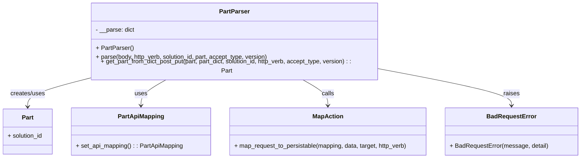

# Diagram: partview_core/partview_service/partview_service/api/part/handlers/parse/PartParser.py

> Auto-generated by Obscura crawlers

## Mermaid

### SVG

<svg id="container" width="1533.6640625" xmlns="http://www.w3.org/2000/svg" class="classDiagram" height="408" viewBox="0 0 1533.6640625 408" role="graphics-document document" aria-roledescription="class"><g><defs><marker id="container_class-aggregationStart" class="marker aggregation class" refX="18" refY="7" markerWidth="190" markerHeight="240" orient="auto"><path d="M 18,7 L9,13 L1,7 L9,1 Z"></path></marker></defs><defs><marker id="container_class-aggregationEnd" class="marker aggregation class" refX="1" refY="7" markerWidth="20" markerHeight="28" orient="auto"><path d="M 18,7 L9,13 L1,7 L9,1 Z"></path></marker></defs><defs><marker id="container_class-extensionStart" class="marker extension class" refX="18" refY="7" markerWidth="190" markerHeight="240" orient="auto"><path d="M 1,7 L18,13 V 1 Z"></path></marker></defs><defs><marker id="container_class-extensionEnd" class="marker extension class" refX="1" refY="7" markerWidth="20" markerHeight="28" orient="auto"><path d="M 1,1 V 13 L18,7 Z"></path></marker></defs><defs><marker id="container_class-compositionStart" class="marker composition class" refX="18" refY="7" markerWidth="190" markerHeight="240" orient="auto"><path d="M 18,7 L9,13 L1,7 L9,1 Z"></path></marker></defs><defs><marker id="container_class-compositionEnd" class="marker composition class" refX="1" refY="7" markerWidth="20" markerHeight="28" orient="auto"><path d="M 18,7 L9,13 L1,7 L9,1 Z"></path></marker></defs><defs><marker id="container_class-dependencyStart" class="marker dependency class" refX="6" refY="7" markerWidth="190" markerHeight="240" orient="auto"><path d="M 5,7 L9,13 L1,7 L9,1 Z"></path></marker></defs><defs><marker id="container_class-dependencyEnd" class="marker dependency class" refX="13" refY="7" markerWidth="20" markerHeight="28" orient="auto"><path d="M 18,7 L9,13 L14,7 L9,1 Z"></path></marker></defs><defs><marker id="container_class-lollipopStart" class="marker lollipop class" refX="13" refY="7" markerWidth="190" markerHeight="240" orient="auto"><circle stroke="black" fill="transparent" cx="7" cy="7" r="6"></circle></marker></defs><defs><marker id="container_class-lollipopEnd" class="marker lollipop class" refX="1" refY="7" markerWidth="190" markerHeight="240" orient="auto"><circle stroke="black" fill="transparent" cx="7" cy="7" r="6"></circle></marker></defs><g class="root"><g class="clusters"></g><g class="edgePaths"><path d="M234.016,198.252L207.473,204.71C180.931,211.168,127.846,224.084,101.304,236.209C74.762,248.333,74.762,259.667,74.762,265.333L74.762,271" id="id_PartParser_Part_1" class="edge-thickness-normal edge-pattern-solid relation" style=";;;" data-edge="true" data-et="edge" data-id="id_PartParser_Part_1" data-points="W3sieCI6MjM0LjAxNTYyNSwieSI6MTk4LjI1MjAxMzQwNjAzMjcyfSx7IngiOjc0Ljc2MTcxODc1LCJ5IjoyMzd9LHsieCI6NzQuNzYxNzE4NzUsInkiOjI3N31d" marker-end="url(#container_class-dependencyEnd)"></path><path d="M442.69,200L431.211,206.167C419.732,212.333,396.774,224.667,385.295,236C373.816,247.333,373.816,257.667,373.816,262.833L373.816,268" id="id_PartParser_PartApiMapping_2" class="edge-thickness-normal edge-pattern-solid relation" style=";;;" data-edge="true" data-et="edge" data-id="id_PartParser_PartApiMapping_2" data-points="W3sieCI6NDQyLjY5MDQzNzAzMDA3NTIsInkiOjIwMH0seyJ4IjozNzMuODE2NDA2MjUsInkiOjIzN30seyJ4IjozNzMuODE2NDA2MjUsInkiOjI3NH1d" marker-end="url(#container_class-dependencyEnd)"></path><path d="M800.091,200L811.57,206.167C823.049,212.333,846.007,224.667,857.486,236C868.965,247.333,868.965,257.667,868.965,262.833L868.965,268" id="id_PartParser_MapAction_3" class="edge-thickness-normal edge-pattern-solid relation" style=";;;" data-edge="true" data-et="edge" data-id="id_PartParser_MapAction_3" data-points="W3sieCI6ODAwLjA5MDgxMjk2OTkyNDksInkiOjIwMH0seyJ4Ijo4NjguOTY0ODQzNzUsInkiOjIzN30seyJ4Ijo4NjguOTY0ODQzNzUsInkiOjI3NH1d" marker-end="url(#container_class-dependencyEnd)"></path><path d="M1008.766,174.35L1066.262,184.792C1123.758,195.233,1238.75,216.117,1296.246,231.725C1353.742,247.333,1353.742,257.667,1353.742,262.833L1353.742,268" id="id_PartParser_BadRequestError_4" class="edge-thickness-normal edge-pattern-solid relation" style=";;;" data-edge="true" data-et="edge" data-id="id_PartParser_BadRequestError_4" data-points="W3sieCI6MTAwOC43NjU2MjUsInkiOjE3NC4zNDk5MjE1OTI0NzI4N30seyJ4IjoxMzUzLjc0MjE4NzUsInkiOjIzN30seyJ4IjoxMzUzLjc0MjE4NzUsInkiOjI3NH1d" marker-end="url(#container_class-dependencyEnd)"></path></g><g class="edgeLabels"><g class="edgeLabel" transform="translate(74.76171875, 237)"><g class="label" data-id="id_PartParser_Part_1" transform="translate(-46.578125, -12)"><foreignObject width="93.15625" height="24">

creates/uses

</foreignObject></g></g><g class="edgeLabel" transform="translate(373.81640625, 237)"><g class="label" data-id="id_PartParser_PartApiMapping_2" transform="translate(-16.4921875, -12)"><foreignObject width="32.984375" height="24">

uses

</foreignObject></g></g><g class="edgeLabel" transform="translate(868.96484375, 237)"><g class="label" data-id="id_PartParser_MapAction_3" transform="translate(-16.4453125, -12)"><foreignObject width="32.890625" height="24">

calls

</foreignObject></g></g><g class="edgeLabel" transform="translate(1353.7421875, 237)"><g class="label" data-id="id_PartParser_BadRequestError_4" transform="translate(-21.25, -12)"><foreignObject width="42.5" height="24">

raises

</foreignObject></g></g></g><g class="nodes"><g class="node default" id="classId-PartParser-0" transform="translate(621.390625, 104)"><g class="basic label-container"><path d="M-387.375 -96 L387.375 -96 L387.375 96 L-387.375 96" stroke="none" stroke-width="0" fill="#ECECFF" style=""></path><path d="M-387.375 -96 C-194.81715818007004 -96, -2.259316360140076 -96, 387.375 -96 M-387.375 -96 C-226.6880258934709 -96, -66.00105178694179 -96, 387.375 -96 M387.375 -96 C387.375 -53.30128009890623, 387.375 -10.602560197812466, 387.375 96 M387.375 -96 C387.375 -24.58341106295775, 387.375 46.8331778740845, 387.375 96 M387.375 96 C152.95121201425627 96, -81.47257597148746 96, -387.375 96 M387.375 96 C190.5766497293788 96, -6.221700541242399 96, -387.375 96 M-387.375 96 C-387.375 40.58097807257323, -387.375 -14.838043854853538, -387.375 -96 M-387.375 96 C-387.375 41.73382428169839, -387.375 -12.532351436603221, -387.375 -96" stroke="#9370DB" stroke-width="1.3" fill="none" stroke-dasharray="0 0" style=""></path></g><g class="annotation-group text" transform="translate(0, -72)"></g><g class="label-group text" transform="translate(-38.4375, -72)"><g class="label" style="font-weight: bolder" transform="translate(0,-12)"><foreignObject width="76.875" height="24">

PartParser

</foreignObject></g></g><g class="members-group text" transform="translate(-375.375, -24)"><g class="label" style="" transform="translate(0,-12)"><foreignObject width="102.9375" height="24">

- __parse: dict

</foreignObject></g></g><g class="methods-group text" transform="translate(-375.375, 24)"><g class="label" style="" transform="translate(0,-12)"><foreignObject width="97.09375" height="24">

+ PartParser()

</foreignObject></g><g class="label" style="" transform="translate(0,12)"><foreignObject width="461.265625" height="24">

+ parse(body, http_verb, solution_id, part, accept_type, version)

</foreignObject></g><g class="label" style="" transform="translate(0,36)"><foreignObject width="712.3125" height="24">

+ get_part_from_dict_post_put(part, part_dict, solution_id, http_verb, accept_type, version) : : Part

</foreignObject></g></g><g class="divider" style=""><path d="M-387.375 -48 C-112.71696845317632 -48, 161.94106309364736 -48, 387.375 -48 M-387.375 -48 C-199.60552766065865 -48, -11.836055321317303 -48, 387.375 -48" stroke="#9370DB" stroke-width="1.3" fill="none" stroke-dasharray="0 0" style=""></path></g><g class="divider" style=""><path d="M-387.375 0 C-222.71208831902933 0, -58.04917663805867 0, 387.375 0 M-387.375 0 C-203.3551761192576 0, -19.335352238515213 0, 387.375 0" stroke="#9370DB" stroke-width="1.3" fill="none" stroke-dasharray="0 0" style=""></path></g></g><g class="node default" id="classId-Part-1" transform="translate(74.76171875, 337)"><g class="basic label-container"><path d="M-66.76171875 -60 L66.76171875 -60 L66.76171875 60 L-66.76171875 60" stroke="none" stroke-width="0" fill="#ECECFF" style=""></path><path d="M-66.76171875 -60 C-31.200852296489586 -60, 4.360014157020828 -60, 66.76171875 -60 M-66.76171875 -60 C-39.09589749464084 -60, -11.430076239281668 -60, 66.76171875 -60 M66.76171875 -60 C66.76171875 -21.524573434794135, 66.76171875 16.95085313041173, 66.76171875 60 M66.76171875 -60 C66.76171875 -26.51381911045263, 66.76171875 6.97236177909474, 66.76171875 60 M66.76171875 60 C24.95873729091366 60, -16.84424416817268 60, -66.76171875 60 M66.76171875 60 C33.511585295345476 60, 0.2614518406909525 60, -66.76171875 60 M-66.76171875 60 C-66.76171875 25.618985375070935, -66.76171875 -8.76202924985813, -66.76171875 -60 M-66.76171875 60 C-66.76171875 34.66975389116925, -66.76171875 9.339507782338508, -66.76171875 -60" stroke="#9370DB" stroke-width="1.3" fill="none" stroke-dasharray="0 0" style=""></path></g><g class="annotation-group text" transform="translate(0, -36)"></g><g class="label-group text" transform="translate(-15.0703125, -36)"><g class="label" style="font-weight: bolder" transform="translate(0,-12)"><foreignObject width="30.140625" height="24">

Part

</foreignObject></g></g><g class="members-group text" transform="translate(-54.76171875, 12)"><g class="label" style="" transform="translate(0,-12)"><foreignObject width="94.453125" height="24">

+ solution_id

</foreignObject></g></g><g class="methods-group text" transform="translate(-54.76171875, 60)"></g><g class="divider" style=""><path d="M-66.76171875 -12 C-24.096700855809495 -12, 18.56831703838101 -12, 66.76171875 -12 M-66.76171875 -12 C-35.45585900153542 -12, -4.149999253070845 -12, 66.76171875 -12" stroke="#9370DB" stroke-width="1.3" fill="none" stroke-dasharray="0 0" style=""></path></g><g class="divider" style=""><path d="M-66.76171875 36 C-29.76438210468065 36, 7.232954540638701 36, 66.76171875 36 M-66.76171875 36 C-17.96937783352159 36, 30.822963082956818 36, 66.76171875 36" stroke="#9370DB" stroke-width="1.3" fill="none" stroke-dasharray="0 0" style=""></path></g></g><g class="node default" id="classId-PartApiMapping-2" transform="translate(373.81640625, 337)"><g class="basic label-container"><path d="M-182.29296875 -63 L182.29296875 -63 L182.29296875 63 L-182.29296875 63" stroke="none" stroke-width="0" fill="#ECECFF" style=""></path><path d="M-182.29296875 -63 C-87.127120226744 -63, 8.038728296512005 -63, 182.29296875 -63 M-182.29296875 -63 C-107.7867935352785 -63, -33.28061832055701 -63, 182.29296875 -63 M182.29296875 -63 C182.29296875 -13.084962932692726, 182.29296875 36.83007413461455, 182.29296875 63 M182.29296875 -63 C182.29296875 -22.883220854926094, 182.29296875 17.233558290147812, 182.29296875 63 M182.29296875 63 C92.93410542467943 63, 3.57524209935886 63, -182.29296875 63 M182.29296875 63 C96.42496681415548 63, 10.556964878310964 63, -182.29296875 63 M-182.29296875 63 C-182.29296875 26.720417717920647, -182.29296875 -9.559164564158706, -182.29296875 -63 M-182.29296875 63 C-182.29296875 24.01222000371712, -182.29296875 -14.975559992565763, -182.29296875 -63" stroke="#9370DB" stroke-width="1.3" fill="none" stroke-dasharray="0 0" style=""></path></g><g class="annotation-group text" transform="translate(0, -39)"></g><g class="label-group text" transform="translate(-58.3203125, -39)"><g class="label" style="font-weight: bolder" transform="translate(0,-12)"><foreignObject width="116.640625" height="24">

PartApiMapping

</foreignObject></g></g><g class="members-group text" transform="translate(-170.29296875, 9)"></g><g class="methods-group text" transform="translate(-170.29296875, 39)"><g class="label" style="" transform="translate(0,-12)"><foreignObject width="282.265625" height="24">

+ set_api_mapping() : : PartApiMapping

</foreignObject></g></g><g class="divider" style=""><path d="M-182.29296875 -15 C-49.40751382288548 -15, 83.47794110422905 -15, 182.29296875 -15 M-182.29296875 -15 C-52.32245811785117 -15, 77.64805251429766 -15, 182.29296875 -15" stroke="#9370DB" stroke-width="1.3" fill="none" stroke-dasharray="0 0" style=""></path></g><g class="divider" style=""><path d="M-182.29296875 9 C-42.07588914294192 9, 98.14119046411616 9, 182.29296875 9 M-182.29296875 9 C-75.00702624995981 9, 32.278916250080385 9, 182.29296875 9" stroke="#9370DB" stroke-width="1.3" fill="none" stroke-dasharray="0 0" style=""></path></g></g><g class="node default" id="classId-MapAction-3" transform="translate(868.96484375, 337)"><g class="basic label-container"><path d="M-262.85546875 -63 L262.85546875 -63 L262.85546875 63 L-262.85546875 63" stroke="none" stroke-width="0" fill="#ECECFF" style=""></path><path d="M-262.85546875 -63 C-94.85668833553063 -63, 73.14209207893873 -63, 262.85546875 -63 M-262.85546875 -63 C-71.97293970729021 -63, 118.90958933541958 -63, 262.85546875 -63 M262.85546875 -63 C262.85546875 -25.731841431847393, 262.85546875 11.536317136305215, 262.85546875 63 M262.85546875 -63 C262.85546875 -36.486210154980014, 262.85546875 -9.972420309960029, 262.85546875 63 M262.85546875 63 C154.87722967587752 63, 46.89899060175503 63, -262.85546875 63 M262.85546875 63 C62.79660694840928 63, -137.26225485318145 63, -262.85546875 63 M-262.85546875 63 C-262.85546875 19.581302031534825, -262.85546875 -23.83739593693035, -262.85546875 -63 M-262.85546875 63 C-262.85546875 15.704358688153121, -262.85546875 -31.591282623693758, -262.85546875 -63" stroke="#9370DB" stroke-width="1.3" fill="none" stroke-dasharray="0 0" style=""></path></g><g class="annotation-group text" transform="translate(0, -39)"></g><g class="label-group text" transform="translate(-38.6328125, -39)"><g class="label" style="font-weight: bolder" transform="translate(0,-12)"><foreignObject width="77.265625" height="24">

MapAction

</foreignObject></g></g><g class="members-group text" transform="translate(-250.85546875, 9)"></g><g class="methods-group text" transform="translate(-250.85546875, 39)"><g class="label" style="" transform="translate(0,-12)"><foreignObject width="463.078125" height="24">

+ map_request_to_persistable(mapping, data, target, http_verb)

</foreignObject></g></g><g class="divider" style=""><path d="M-262.85546875 -15 C-123.50246870099798 -15, 15.85053134800404 -15, 262.85546875 -15 M-262.85546875 -15 C-101.34950040437772 -15, 60.15646794124456 -15, 262.85546875 -15" stroke="#9370DB" stroke-width="1.3" fill="none" stroke-dasharray="0 0" style=""></path></g><g class="divider" style=""><path d="M-262.85546875 9 C-136.7645148179531 9, -10.673560885906227 9, 262.85546875 9 M-262.85546875 9 C-107.94111533424294 9, 46.973238081514125 9, 262.85546875 9" stroke="#9370DB" stroke-width="1.3" fill="none" stroke-dasharray="0 0" style=""></path></g></g><g class="node default" id="classId-BadRequestError-4" transform="translate(1353.7421875, 337)"><g class="basic label-container"><path d="M-171.921875 -63 L171.921875 -63 L171.921875 63 L-171.921875 63" stroke="none" stroke-width="0" fill="#ECECFF" style=""></path><path d="M-171.921875 -63 C-102.91325621885554 -63, -33.904637437711074 -63, 171.921875 -63 M-171.921875 -63 C-97.31107535658522 -63, -22.70027571317044 -63, 171.921875 -63 M171.921875 -63 C171.921875 -18.349574087011312, 171.921875 26.300851825977375, 171.921875 63 M171.921875 -63 C171.921875 -29.35720200987609, 171.921875 4.28559598024782, 171.921875 63 M171.921875 63 C89.6763300300711 63, 7.430785060142199 63, -171.921875 63 M171.921875 63 C52.51742224012831 63, -66.88703051974338 63, -171.921875 63 M-171.921875 63 C-171.921875 25.521168202116847, -171.921875 -11.957663595766306, -171.921875 -63 M-171.921875 63 C-171.921875 18.651613871302764, -171.921875 -25.69677225739447, -171.921875 -63" stroke="#9370DB" stroke-width="1.3" fill="none" stroke-dasharray="0 0" style=""></path></g><g class="annotation-group text" transform="translate(0, -39)"></g><g class="label-group text" transform="translate(-62.28125, -39)"><g class="label" style="font-weight: bolder" transform="translate(0,-12)"><foreignObject width="124.5625" height="24">

BadRequestError

</foreignObject></g></g><g class="members-group text" transform="translate(-159.921875, 9)"></g><g class="methods-group text" transform="translate(-159.921875, 39)"><g class="label" style="" transform="translate(0,-12)"><foreignObject width="257.5625" height="24">

+ BadRequestError(message, detail)

</foreignObject></g></g><g class="divider" style=""><path d="M-171.921875 -15 C-44.68106105176108 -15, 82.55975289647785 -15, 171.921875 -15 M-171.921875 -15 C-90.22597545541485 -15, -8.530075910829709 -15, 171.921875 -15" stroke="#9370DB" stroke-width="1.3" fill="none" stroke-dasharray="0 0" style=""></path></g><g class="divider" style=""><path d="M-171.921875 9 C-55.20335369285395 9, 61.515167614292096 9, 171.921875 9 M-171.921875 9 C-47.20079433341823 9, 77.52028633316354 9, 171.921875 9" stroke="#9370DB" stroke-width="1.3" fill="none" stroke-dasharray="0 0" style=""></path></g></g></g></g></g></svg>
