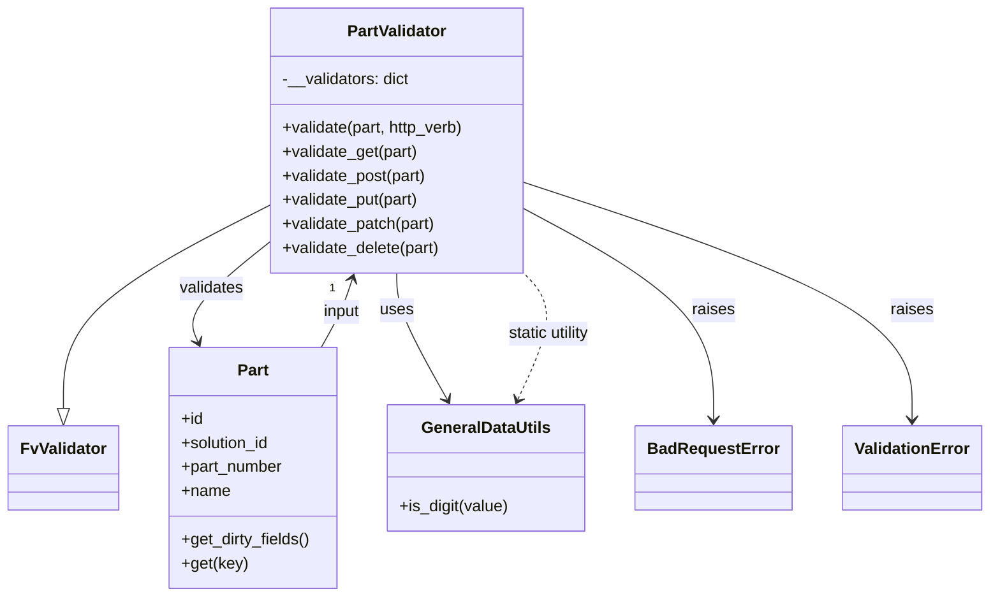

# Diagram: partview_core/partview_service/partview_service/api/part/handlers/validate/PartValidator.py


> Auto-generated by Obscura crawlers

## Diagram 1



### SVG

<svg id="container" width="969.125" xmlns="http://www.w3.org/2000/svg" class="classDiagram" height="594" viewBox="0 0 969.125 594" role="graphics-document document" aria-roledescription="class"><style>#container{font-family:"trebuchet ms",verdana,arial,sans-serif;font-size:16px;fill:#333;}@keyframes edge-animation-frame{from{stroke-dashoffset:0;}}@keyframes dash{to{stroke-dashoffset:0;}}#container .edge-animation-slow{stroke-dasharray:9,5!important;stroke-dashoffset:900;animation:dash 50s linear infinite;stroke-linecap:round;}#container .edge-animation-fast{stroke-dasharray:9,5!important;stroke-dashoffset:900;animation:dash 20s linear infinite;stroke-linecap:round;}#container .error-icon{fill:#552222;}#container .error-text{fill:#552222;stroke:#552222;}#container .edge-thickness-normal{stroke-width:1px;}#container .edge-thickness-thick{stroke-width:3.5px;}#container .edge-pattern-solid{stroke-dasharray:0;}#container .edge-thickness-invisible{stroke-width:0;fill:none;}#container .edge-pattern-dashed{stroke-dasharray:3;}#container .edge-pattern-dotted{stroke-dasharray:2;}#container .marker{fill:#333333;stroke:#333333;}#container .marker.cross{stroke:#333333;}#container svg{font-family:"trebuchet ms",verdana,arial,sans-serif;font-size:16px;}#container p{margin:0;}#container g.classGroup text{fill:#9370DB;stroke:none;font-family:"trebuchet ms",verdana,arial,sans-serif;font-size:10px;}#container g.classGroup text .title{font-weight:bolder;}#container .nodeLabel,#container .edgeLabel{color:#131300;}#container .edgeLabel .label rect{fill:#ECECFF;}#container .label text{fill:#131300;}#container .labelBkg{background:#ECECFF;}#container .edgeLabel .label span{background:#ECECFF;}#container .classTitle{font-weight:bolder;}#container .node rect,#container .node circle,#container .node ellipse,#container .node polygon,#container .node path{fill:#ECECFF;stroke:#9370DB;stroke-width:1px;}#container .divider{stroke:#9370DB;stroke-width:1;}#container g.clickable{cursor:pointer;}#container g.classGroup rect{fill:#ECECFF;stroke:#9370DB;}#container g.classGroup line{stroke:#9370DB;stroke-width:1;}#container .classLabel .box{stroke:none;stroke-width:0;fill:#ECECFF;opacity:0.5;}#container .classLabel .label{fill:#9370DB;font-size:10px;}#container .relation{stroke:#333333;stroke-width:1;fill:none;}#container .dashed-line{stroke-dasharray:3;}#container .dotted-line{stroke-dasharray:1 2;}#container #compositionStart,#container .composition{fill:#333333!important;stroke:#333333!important;stroke-width:1;}#container #compositionEnd,#container .composition{fill:#333333!important;stroke:#333333!important;stroke-width:1;}#container #dependencyStart,#container .dependency{fill:#333333!important;stroke:#333333!important;stroke-width:1;}#container #dependencyStart,#container .dependency{fill:#333333!important;stroke:#333333!important;stroke-width:1;}#container #extensionStart,#container .extension{fill:transparent!important;stroke:#333333!important;stroke-width:1;}#container #extensionEnd,#container .extension{fill:transparent!important;stroke:#333333!important;stroke-width:1;}#container #aggregationStart,#container .aggregation{fill:transparent!important;stroke:#333333!important;stroke-width:1;}#container #aggregationEnd,#container .aggregation{fill:transparent!important;stroke:#333333!important;stroke-width:1;}#container #lollipopStart,#container .lollipop{fill:#ECECFF!important;stroke:#333333!important;stroke-width:1;}#container #lollipopEnd,#container .lollipop{fill:#ECECFF!important;stroke:#333333!important;stroke-width:1;}#container .edgeTerminals{font-size:11px;line-height:initial;}#container .classTitleText{text-anchor:middle;font-size:18px;fill:#333;}#container .label-icon{display:inline-block;height:1em;overflow:visible;vertical-align:-0.125em;}#container .node .label-icon path{fill:currentColor;stroke:revert;stroke-width:revert;}#container :root{--mermaid-font-family:"trebuchet ms",verdana,arial,sans-serif;}</style><g><defs><marker id="container_class-aggregationStart" class="marker aggregation class" refX="18" refY="7" markerWidth="190" markerHeight="240" orient="auto"><path d="M 18,7 L9,13 L1,7 L9,1 Z"></path></marker></defs><defs><marker id="container_class-aggregationEnd" class="marker aggregation class" refX="1" refY="7" markerWidth="20" markerHeight="28" orient="auto"><path d="M 18,7 L9,13 L1,7 L9,1 Z"></path></marker></defs><defs><marker id="container_class-extensionStart" class="marker extension class" refX="18" refY="7" markerWidth="190" markerHeight="240" orient="auto"><path d="M 1,7 L18,13 V 1 Z"></path></marker></defs><defs><marker id="container_class-extensionEnd" class="marker extension class" refX="1" refY="7" markerWidth="20" markerHeight="28" orient="auto"><path d="M 1,1 V 13 L18,7 Z"></path></marker></defs><defs><marker id="container_class-compositionStart" class="marker composition class" refX="18" refY="7" markerWidth="190" markerHeight="240" orient="auto"><path d="M 18,7 L9,13 L1,7 L9,1 Z"></path></marker></defs><defs><marker id="container_class-compositionEnd" class="marker composition class" refX="1" refY="7" markerWidth="20" markerHeight="28" orient="auto"><path d="M 18,7 L9,13 L1,7 L9,1 Z"></path></marker></defs><defs><marker id="container_class-dependencyStart" class="marker dependency class" refX="6" refY="7" markerWidth="190" markerHeight="240" orient="auto"><path d="M 5,7 L9,13 L1,7 L9,1 Z"></path></marker></defs><defs><marker id="container_class-dependencyEnd" class="marker dependency class" refX="13" refY="7" markerWidth="20" markerHeight="28" orient="auto"><path d="M 18,7 L9,13 L14,7 L9,1 Z"></path></marker></defs><defs><marker id="container_class-lollipopStart" class="marker lollipop class" refX="13" refY="7" markerWidth="190" markerHeight="240" orient="auto"><circle stroke="black" fill="transparent" cx="7" cy="7" r="6"></circle></marker></defs><defs><marker id="container_class-lollipopEnd" class="marker lollipop class" refX="1" refY="7" markerWidth="190" markerHeight="240" orient="auto"><circle stroke="black" fill="transparent" cx="7" cy="7" r="6"></circle></marker></defs><g class="root"><g class="clusters"></g><g class="edgePaths"><path d="M263.906,205.454L230.073,222.711C196.24,239.969,128.573,274.485,94.74,308.034C60.906,341.583,60.906,374.167,60.906,390.458L60.906,406.75" id="id_PartValidator_FvValidator_1" class="edge-thickness-normal edge-pattern-solid relation" style=";;;" data-edge="true" data-et="edge" data-id="id_PartValidator_FvValidator_1" data-points="W3sieCI6MjYzLjkwNjI1LCJ5IjoyMDUuNDUzNjc3Mjg1NDgxODZ9LHsieCI6NjAuOTA2MjUsInkiOjMwOX0seyJ4Ijo2MC45MDYyNSwieSI6NDI0fV0=" marker-end="url(#container_class-extensionEnd)"></path><path d="M263.906,242.633L250.076,253.694C236.247,264.755,208.587,286.878,197.008,303.186C185.429,319.495,189.93,329.99,192.181,335.238L194.431,340.486" id="id_PartValidator_Part_2" class="edge-thickness-normal edge-pattern-solid relation" style=";;;" data-edge="true" data-et="edge" data-id="id_PartValidator_Part_2" data-points="W3sieCI6MjYzLjkwNjI1LCJ5IjoyNDIuNjMyNTI3NjE0NzM0MDJ9LHsieCI6MTgwLjkyNzczNDM3NSwieSI6MzA5fSx7IngiOjE5Ni43OTYyNTI5ODU2Njg4LCJ5IjozNDZ9XQ==" marker-end="url(#container_class-dependencyEnd)"></path><path d="M392.227,272L392.227,278.167C392.227,284.333,392.227,296.667,400.541,317.628C408.855,338.59,425.484,368.18,433.799,382.974L442.113,397.769" id="id_PartValidator_GeneralDataUtils_3" class="edge-thickness-normal edge-pattern-solid relation" style=";;;" data-edge="true" data-et="edge" data-id="id_PartValidator_GeneralDataUtils_3" data-points="W3sieCI6MzkyLjIyNjU2MjUsInkiOjI3Mn0seyJ4IjozOTIuMjI2NTYyNSwieSI6MzA5fSx7IngiOjQ0NS4wNTI0NDgyNDg0MDc2NCwieSI6NDAzfV0=" marker-end="url(#container_class-dependencyEnd)"></path><path d="M520.547,209.897L550.87,226.414C581.193,242.931,641.839,275.966,672.161,310.65C702.484,345.333,702.484,381.667,702.484,399.833L702.484,418" id="id_PartValidator_BadRequestError_4" class="edge-thickness-normal edge-pattern-solid relation" style=";;;" data-edge="true" data-et="edge" data-id="id_PartValidator_BadRequestError_4" data-points="W3sieCI6NTIwLjU0Njg3NSwieSI6MjA5Ljg5NzEzNjk1NzY3MTN9LHsieCI6NzAyLjQ4NDM3NSwieSI6MzA5fSx7IngiOjcwMi40ODQzNzUsInkiOjQyNH1d" marker-end="url(#container_class-dependencyEnd)"></path><path d="M520.547,183.224L582.78,204.186C645.013,225.149,769.479,267.075,831.712,306.204C893.945,345.333,893.945,381.667,893.945,399.833L893.945,418" id="id_PartValidator_ValidationError_5" class="edge-thickness-normal edge-pattern-solid relation" style=";;;" data-edge="true" data-et="edge" data-id="id_PartValidator_ValidationError_5" data-points="W3sieCI6NTIwLjU0Njg3NSwieSI6MTgzLjIyMzY4NDIxMDUyNjN9LHsieCI6ODkzLjk0NTMxMjUsInkiOjMwOX0seyJ4Ijo4OTMuOTQ1MzEyNSwieSI6NDI0fV0=" marker-end="url(#container_class-dependencyEnd)"></path><path d="M315.699,346L319.165,339.833C322.63,333.667,329.561,321.333,334.747,309.95C339.933,298.566,343.374,288.132,345.095,282.915L346.815,277.698" id="id_Part_PartValidator_6" class="edge-thickness-normal edge-pattern-solid relation" style=";;;" data-edge="true" data-et="edge" data-id="id_Part_PartValidator_6" data-points="W3sieCI6MzE1LjY5OTAxOTcwNTQxNCwieSI6MzQ2fSx7IngiOjMzNi40OTIxODc1LCJ5IjozMDl9LHsieCI6MzQ4LjY5NDM4Nzk0Mzc4NywieSI6MjcyfV0=" marker-end="url(#container_class-dependencyEnd)"></path><path d="M510.469,397.504L516.932,382.754C523.395,368.003,536.322,338.501,537.055,317.584C537.789,296.667,526.33,284.333,520.6,278.167L514.871,272" id="id_GeneralDataUtils_PartValidator_7" class="edge-thickness-normal edge-pattern-dashed relation" style=";;;" data-edge="true" data-et="edge" data-id="id_GeneralDataUtils_PartValidator_7" data-points="W3sieCI6NTA4LjA2MTA2OTM2NzAzODIsInkiOjQwM30seyJ4Ijo1NDkuMjQ4MDQ2ODc1LCJ5IjozMDl9LHsieCI6NTE0Ljg3MDU2MjEzMDE3NzUsInkiOjI3Mn1d" marker-start="url(#container_class-dependencyStart)"></path></g><g class="edgeLabels"><g class="edgeLabel"><g class="label" data-id="id_PartValidator_FvValidator_1" transform="translate(0, 0)"><foreignObject width="0" height="0"><div xmlns="http://www.w3.org/1999/xhtml" class="labelBkg" style="display: table-cell; white-space: nowrap; line-height: 1.5; max-width: 200px; text-align: center;"><span class="edgeLabel"></span></div></foreignObject></g></g><g class="edgeLabel" transform="translate(206.69697, 288.38938)"><g class="label" data-id="id_PartValidator_Part_2" transform="translate(-32.6875, -12)"><foreignObject width="65.375" height="24"><div xmlns="http://www.w3.org/1999/xhtml" class="labelBkg" style="display: table-cell; white-space: nowrap; line-height: 1.5; max-width: 200px; text-align: center;"><span class="edgeLabel"><p>validates</p></span></div></foreignObject></g></g><g class="edgeLabel" transform="translate(392.2265625, 309)"><g class="label" data-id="id_PartValidator_GeneralDataUtils_3" transform="translate(-16.4921875, -12)"><foreignObject width="32.984375" height="24"><div xmlns="http://www.w3.org/1999/xhtml" class="labelBkg" style="display: table-cell; white-space: nowrap; line-height: 1.5; max-width: 200px; text-align: center;"><span class="edgeLabel"><p>uses</p></span></div></foreignObject></g></g><g class="edgeLabel" transform="translate(702.484375, 309)"><g class="label" data-id="id_PartValidator_BadRequestError_4" transform="translate(-21.25, -12)"><foreignObject width="42.5" height="24"><div xmlns="http://www.w3.org/1999/xhtml" class="labelBkg" style="display: table-cell; white-space: nowrap; line-height: 1.5; max-width: 200px; text-align: center;"><span class="edgeLabel"><p>raises</p></span></div></foreignObject></g></g><g class="edgeLabel" transform="translate(893.9453125, 309)"><g class="label" data-id="id_PartValidator_ValidationError_5" transform="translate(-21.25, -12)"><foreignObject width="42.5" height="24"><div xmlns="http://www.w3.org/1999/xhtml" class="labelBkg" style="display: table-cell; white-space: nowrap; line-height: 1.5; max-width: 200px; text-align: center;"><span class="edgeLabel"><p>raises</p></span></div></foreignObject></g></g><g class="edgeLabel" transform="translate(335.63919, 310.51785)"><g class="label" data-id="id_Part_PartValidator_6" transform="translate(-19.2421875, -12)"><foreignObject width="38.484375" height="24"><div xmlns="http://www.w3.org/1999/xhtml" class="labelBkg" style="display: table-cell; white-space: nowrap; line-height: 1.5; max-width: 200px; text-align: center;"><span class="edgeLabel"><p>input</p></span></div></foreignObject></g></g><g class="edgeLabel" transform="translate(538.78915, 332.87008)"><g class="label" data-id="id_GeneralDataUtils_PartValidator_7" transform="translate(-43.1953125, -12)"><foreignObject width="86.390625" height="24"><div xmlns="http://www.w3.org/1999/xhtml" class="labelBkg" style="display: table-cell; white-space: nowrap; line-height: 1.5; max-width: 200px; text-align: center;"><span class="edgeLabel"><p>static utility</p></span></div></foreignObject></g></g><g class="edgeTerminals" transform="translate(323.9681202171533, 278.92159319920074)"><g class="inner" transform="translate(0, 0)"></g><foreignObject style="width: 9px; height: 12px;"><div xmlns="http://www.w3.org/1999/xhtml" style="display: inline-block; padding-right: 1px; white-space: nowrap;"><span class="edgeLabel">1</span></div></foreignObject></g></g><g class="nodes"><g class="node default" id="classId-PartValidator-0" transform="translate(392.2265625, 140)"><g class="basic label-container"><path d="M-128.3203125 -132 L128.3203125 -132 L128.3203125 132 L-128.3203125 132" stroke="none" stroke-width="0" fill="#ECECFF" style=""></path><path d="M-128.3203125 -132 C-37.86599738532274 -132, 52.588317729354515 -132, 128.3203125 -132 M-128.3203125 -132 C-34.41288802439705 -132, 59.4945364512059 -132, 128.3203125 -132 M128.3203125 -132 C128.3203125 -40.66909491250992, 128.3203125 50.66181017498016, 128.3203125 132 M128.3203125 -132 C128.3203125 -50.73369675633063, 128.3203125 30.53260648733874, 128.3203125 132 M128.3203125 132 C60.40259010888832 132, -7.515132282223362 132, -128.3203125 132 M128.3203125 132 C67.51215784282346 132, 6.704003185646897 132, -128.3203125 132 M-128.3203125 132 C-128.3203125 51.25920696262678, -128.3203125 -29.481586074746446, -128.3203125 -132 M-128.3203125 132 C-128.3203125 47.86138789466976, -128.3203125 -36.27722421066048, -128.3203125 -132" stroke="#9370DB" stroke-width="1.3" fill="none" stroke-dasharray="0 0" style=""></path></g><g class="annotation-group text" transform="translate(0, -108)"></g><g class="label-group text" transform="translate(-48.25, -108)"><g class="label" style="font-weight: bolder" transform="translate(0,-12)"><foreignObject width="96.5" height="24"><div xmlns="http://www.w3.org/1999/xhtml" style="display: table-cell; white-space: nowrap; line-height: 1.5; max-width: 145px; text-align: center;"><span class="nodeLabel markdown-node-label" style=""><p>PartValidator</p></span></div></foreignObject></g></g><g class="members-group text" transform="translate(-116.3203125, -60)"><g class="label" style="" transform="translate(0,-12)"><foreignObject width="128.6875" height="24"><div xmlns="http://www.w3.org/1999/xhtml" style="display: table-cell; white-space: nowrap; line-height: 1.5; max-width: 186px; text-align: center;"><span class="nodeLabel markdown-node-label" style=""><p>-__validators: dict</p></span></div></foreignObject></g></g><g class="methods-group text" transform="translate(-116.3203125, -12)"><g class="label" style="" transform="translate(0,-12)"><foreignObject width="184.390625" height="24"><div xmlns="http://www.w3.org/1999/xhtml" style="display: table-cell; white-space: nowrap; line-height: 1.5; max-width: 242px; text-align: center;"><span class="nodeLabel markdown-node-label" style=""><p>+validate(part, http_verb)</p></span></div></foreignObject></g><g class="label" style="" transform="translate(0,12)"><foreignObject width="136.796875" height="24"><div xmlns="http://www.w3.org/1999/xhtml" style="display: table-cell; white-space: nowrap; line-height: 1.5; max-width: 194px; text-align: center;"><span class="nodeLabel markdown-node-label" style=""><p>+validate_get(part)</p></span></div></foreignObject></g><g class="label" style="" transform="translate(0,36)"><foreignObject width="146.1875" height="24"><div xmlns="http://www.w3.org/1999/xhtml" style="display: table-cell; white-space: nowrap; line-height: 1.5; max-width: 204px; text-align: center;"><span class="nodeLabel markdown-node-label" style=""><p>+validate_post(part)</p></span></div></foreignObject></g><g class="label" style="" transform="translate(0,60)"><foreignObject width="138.6875" height="24"><div xmlns="http://www.w3.org/1999/xhtml" style="display: table-cell; white-space: nowrap; line-height: 1.5; max-width: 196px; text-align: center;"><span class="nodeLabel markdown-node-label" style=""><p>+validate_put(part)</p></span></div></foreignObject></g><g class="label" style="" transform="translate(0,84)"><foreignObject width="154.703125" height="24"><div xmlns="http://www.w3.org/1999/xhtml" style="display: table-cell; white-space: nowrap; line-height: 1.5; max-width: 212px; text-align: center;"><span class="nodeLabel markdown-node-label" style=""><p>+validate_patch(part)</p></span></div></foreignObject></g><g class="label" style="" transform="translate(0,108)"><foreignObject width="159.640625" height="24"><div xmlns="http://www.w3.org/1999/xhtml" style="display: table-cell; white-space: nowrap; line-height: 1.5; max-width: 217px; text-align: center;"><span class="nodeLabel markdown-node-label" style=""><p>+validate_delete(part)</p></span></div></foreignObject></g></g><g class="divider" style=""><path d="M-128.3203125 -84 C-76.7151374323525 -84, -25.109962364705012 -84, 128.3203125 -84 M-128.3203125 -84 C-27.47183402289643 -84, 73.37664445420714 -84, 128.3203125 -84" stroke="#9370DB" stroke-width="1.3" fill="none" stroke-dasharray="0 0" style=""></path></g><g class="divider" style=""><path d="M-128.3203125 -36 C-50.16744991003465 -36, 27.985412679930704 -36, 128.3203125 -36 M-128.3203125 -36 C-75.848351240087 -36, -23.376389980173983 -36, 128.3203125 -36" stroke="#9370DB" stroke-width="1.3" fill="none" stroke-dasharray="0 0" style=""></path></g></g><g class="node default" id="classId-FvValidator-1" transform="translate(60.90625, 466)"><g class="basic label-container"><path d="M-52.90625 -42 L52.90625 -42 L52.90625 42 L-52.90625 42" stroke="none" stroke-width="0" fill="#ECECFF" style=""></path><path d="M-52.90625 -42 C-26.469760522061023 -42, -0.03327104412204562 -42, 52.90625 -42 M-52.90625 -42 C-16.651866913404945 -42, 19.60251617319011 -42, 52.90625 -42 M52.90625 -42 C52.90625 -9.300670286472446, 52.90625 23.398659427055108, 52.90625 42 M52.90625 -42 C52.90625 -9.381011774680466, 52.90625 23.237976450639067, 52.90625 42 M52.90625 42 C26.236145062719594 42, -0.43395987456081286 42, -52.90625 42 M52.90625 42 C13.724269699892972 42, -25.457710600214057 42, -52.90625 42 M-52.90625 42 C-52.90625 10.19711214245904, -52.90625 -21.60577571508192, -52.90625 -42 M-52.90625 42 C-52.90625 12.827684937893526, -52.90625 -16.344630124212948, -52.90625 -42" stroke="#9370DB" stroke-width="1.3" fill="none" stroke-dasharray="0 0" style=""></path></g><g class="annotation-group text" transform="translate(0, -18)"></g><g class="label-group text" transform="translate(-40.90625, -18)"><g class="label" style="font-weight: bolder" transform="translate(0,-12)"><foreignObject width="81.8125" height="24"><div xmlns="http://www.w3.org/1999/xhtml" style="display: table-cell; white-space: nowrap; line-height: 1.5; max-width: 131px; text-align: center;"><span class="nodeLabel markdown-node-label" style=""><p>FvValidator</p></span></div></foreignObject></g></g><g class="members-group text" transform="translate(-40.90625, 30)"></g><g class="methods-group text" transform="translate(-40.90625, 60)"></g><g class="divider" style=""><path d="M-52.90625 6 C-26.53779723496545 6, -0.16934446993089836 6, 52.90625 6 M-52.90625 6 C-21.29718925573639 6, 10.311871488527217 6, 52.90625 6" stroke="#9370DB" stroke-width="1.3" fill="none" stroke-dasharray="0 0" style=""></path></g><g class="divider" style=""><path d="M-52.90625 24 C-23.133578308351915 24, 6.639093383296171 24, 52.90625 24 M-52.90625 24 C-12.7105166388194 24, 27.4852167223612 24, 52.90625 24" stroke="#9370DB" stroke-width="1.3" fill="none" stroke-dasharray="0 0" style=""></path></g></g><g class="node default" id="classId-Part-2" transform="translate(248.26171875, 466)"><g class="basic label-container"><path d="M-84.44921875 -120 L84.44921875 -120 L84.44921875 120 L-84.44921875 120" stroke="none" stroke-width="0" fill="#ECECFF" style=""></path><path d="M-84.44921875 -120 C-21.907750308591922 -120, 40.633718132816156 -120, 84.44921875 -120 M-84.44921875 -120 C-47.15329160015008 -120, -9.857364450300153 -120, 84.44921875 -120 M84.44921875 -120 C84.44921875 -55.77832048257568, 84.44921875 8.44335903484864, 84.44921875 120 M84.44921875 -120 C84.44921875 -36.857134366112575, 84.44921875 46.28573126777485, 84.44921875 120 M84.44921875 120 C33.55954137748631 120, -17.330135995027376 120, -84.44921875 120 M84.44921875 120 C47.817869749841286 120, 11.186520749682572 120, -84.44921875 120 M-84.44921875 120 C-84.44921875 66.2571701968325, -84.44921875 12.514340393665009, -84.44921875 -120 M-84.44921875 120 C-84.44921875 28.00519397273743, -84.44921875 -63.98961205452514, -84.44921875 -120" stroke="#9370DB" stroke-width="1.3" fill="none" stroke-dasharray="0 0" style=""></path></g><g class="annotation-group text" transform="translate(0, -96)"></g><g class="label-group text" transform="translate(-15.0703125, -96)"><g class="label" style="font-weight: bolder" transform="translate(0,-12)"><foreignObject width="30.140625" height="24"><div xmlns="http://www.w3.org/1999/xhtml" style="display: table-cell; white-space: nowrap; line-height: 1.5; max-width: 79px; text-align: center;"><span class="nodeLabel markdown-node-label" style=""><p>Part</p></span></div></foreignObject></g></g><g class="members-group text" transform="translate(-72.44921875, -48)"><g class="label" style="" transform="translate(0,-12)"><foreignObject width="22.078125" height="24"><div xmlns="http://www.w3.org/1999/xhtml" style="display: table-cell; white-space: nowrap; line-height: 1.5; max-width: 79px; text-align: center;"><span class="nodeLabel markdown-node-label" style=""><p>+id</p></span></div></foreignObject></g><g class="label" style="" transform="translate(0,12)"><foreignObject width="90.21875" height="24"><div xmlns="http://www.w3.org/1999/xhtml" style="display: table-cell; white-space: nowrap; line-height: 1.5; max-width: 148px; text-align: center;"><span class="nodeLabel markdown-node-label" style=""><p>+solution_id</p></span></div></foreignObject></g><g class="label" style="" transform="translate(0,36)"><foreignObject width="103.109375" height="24"><div xmlns="http://www.w3.org/1999/xhtml" style="display: table-cell; white-space: nowrap; line-height: 1.5; max-width: 161px; text-align: center;"><span class="nodeLabel markdown-node-label" style=""><p>+part_number</p></span></div></foreignObject></g><g class="label" style="" transform="translate(0,60)"><foreignObject width="48.5" height="24"><div xmlns="http://www.w3.org/1999/xhtml" style="display: table-cell; white-space: nowrap; line-height: 1.5; max-width: 106px; text-align: center;"><span class="nodeLabel markdown-node-label" style=""><p>+name</p></span></div></foreignObject></g></g><g class="methods-group text" transform="translate(-72.44921875, 72)"><g class="label" style="" transform="translate(0,-12)"><foreignObject width="129.828125" height="24"><div xmlns="http://www.w3.org/1999/xhtml" style="display: table-cell; white-space: nowrap; line-height: 1.5; max-width: 187px; text-align: center;"><span class="nodeLabel markdown-node-label" style=""><p>+get_dirty_fields()</p></span></div></foreignObject></g><g class="label" style="" transform="translate(0,12)"><foreignObject width="65.5" height="24"><div xmlns="http://www.w3.org/1999/xhtml" style="display: table-cell; white-space: nowrap; line-height: 1.5; max-width: 123px; text-align: center;"><span class="nodeLabel markdown-node-label" style=""><p>+get(key)</p></span></div></foreignObject></g></g><g class="divider" style=""><path d="M-84.44921875 -72 C-50.42494659996672 -72, -16.400674449933433 -72, 84.44921875 -72 M-84.44921875 -72 C-23.556230078724155 -72, 37.33675859255169 -72, 84.44921875 -72" stroke="#9370DB" stroke-width="1.3" fill="none" stroke-dasharray="0 0" style=""></path></g><g class="divider" style=""><path d="M-84.44921875 48 C-23.94389958158584 48, 36.56141958682832 48, 84.44921875 48 M-84.44921875 48 C-26.95000553460227 48, 30.549207680795462 48, 84.44921875 48" stroke="#9370DB" stroke-width="1.3" fill="none" stroke-dasharray="0 0" style=""></path></g></g><g class="node default" id="classId-GeneralDataUtils-3" transform="translate(480.45703125, 466)"><g class="basic label-container"><path d="M-97.74609375 -63 L97.74609375 -63 L97.74609375 63 L-97.74609375 63" stroke="none" stroke-width="0" fill="#ECECFF" style=""></path><path d="M-97.74609375 -63 C-26.964848546187383 -63, 43.81639665762523 -63, 97.74609375 -63 M-97.74609375 -63 C-45.57393122600008 -63, 6.598231297999845 -63, 97.74609375 -63 M97.74609375 -63 C97.74609375 -36.07061274507795, 97.74609375 -9.141225490155897, 97.74609375 63 M97.74609375 -63 C97.74609375 -37.62247009026798, 97.74609375 -12.244940180535956, 97.74609375 63 M97.74609375 63 C49.494032340029875 63, 1.2419709300597503 63, -97.74609375 63 M97.74609375 63 C28.35740602105618 63, -41.03128170788764 63, -97.74609375 63 M-97.74609375 63 C-97.74609375 20.31864824147268, -97.74609375 -22.36270351705464, -97.74609375 -63 M-97.74609375 63 C-97.74609375 23.98479155068535, -97.74609375 -15.030416898629298, -97.74609375 -63" stroke="#9370DB" stroke-width="1.3" fill="none" stroke-dasharray="0 0" style=""></path></g><g class="annotation-group text" transform="translate(0, -39)"></g><g class="label-group text" transform="translate(-61.8984375, -39)"><g class="label" style="font-weight: bolder" transform="translate(0,-12)"><foreignObject width="123.796875" height="24"><div xmlns="http://www.w3.org/1999/xhtml" style="display: table-cell; white-space: nowrap; line-height: 1.5; max-width: 172px; text-align: center;"><span class="nodeLabel markdown-node-label" style=""><p>GeneralDataUtils</p></span></div></foreignObject></g></g><g class="members-group text" transform="translate(-85.74609375, 9)"></g><g class="methods-group text" transform="translate(-85.74609375, 39)"><g class="label" style="" transform="translate(0,-12)"><foreignObject width="109.59375" height="24"><div xmlns="http://www.w3.org/1999/xhtml" style="display: table-cell; white-space: nowrap; line-height: 1.5; max-width: 167px; text-align: center;"><span class="nodeLabel markdown-node-label" style=""><p>+is_digit(value)</p></span></div></foreignObject></g></g><g class="divider" style=""><path d="M-97.74609375 -15 C-45.19711270461235 -15, 7.351868340775297 -15, 97.74609375 -15 M-97.74609375 -15 C-34.505532905930394 -15, 28.73502793813921 -15, 97.74609375 -15" stroke="#9370DB" stroke-width="1.3" fill="none" stroke-dasharray="0 0" style=""></path></g><g class="divider" style=""><path d="M-97.74609375 9 C-52.89486297625799 9, -8.04363220251598 9, 97.74609375 9 M-97.74609375 9 C-44.56122162358988 9, 8.62365050282024 9, 97.74609375 9" stroke="#9370DB" stroke-width="1.3" fill="none" stroke-dasharray="0 0" style=""></path></g></g><g class="node default" id="classId-BadRequestError-4" transform="translate(702.484375, 466)"><g class="basic label-container"><path d="M-74.28125 -42 L74.28125 -42 L74.28125 42 L-74.28125 42" stroke="none" stroke-width="0" fill="#ECECFF" style=""></path><path d="M-74.28125 -42 C-25.881147233493273 -42, 22.518955533013454 -42, 74.28125 -42 M-74.28125 -42 C-21.73376454481882 -42, 30.813720910362363 -42, 74.28125 -42 M74.28125 -42 C74.28125 -14.292256547358196, 74.28125 13.415486905283608, 74.28125 42 M74.28125 -42 C74.28125 -16.091470513065623, 74.28125 9.817058973868754, 74.28125 42 M74.28125 42 C40.28187719899571 42, 6.282504397991417 42, -74.28125 42 M74.28125 42 C24.654752056779067 42, -24.971745886441866 42, -74.28125 42 M-74.28125 42 C-74.28125 21.384051708406595, -74.28125 0.7681034168131902, -74.28125 -42 M-74.28125 42 C-74.28125 16.948319449152958, -74.28125 -8.103361101694084, -74.28125 -42" stroke="#9370DB" stroke-width="1.3" fill="none" stroke-dasharray="0 0" style=""></path></g><g class="annotation-group text" transform="translate(0, -18)"></g><g class="label-group text" transform="translate(-62.28125, -18)"><g class="label" style="font-weight: bolder" transform="translate(0,-12)"><foreignObject width="124.5625" height="24"><div xmlns="http://www.w3.org/1999/xhtml" style="display: table-cell; white-space: nowrap; line-height: 1.5; max-width: 174px; text-align: center;"><span class="nodeLabel markdown-node-label" style=""><p>BadRequestError</p></span></div></foreignObject></g></g><g class="members-group text" transform="translate(-62.28125, 30)"></g><g class="methods-group text" transform="translate(-62.28125, 60)"></g><g class="divider" style=""><path d="M-74.28125 6 C-39.05020092255508 6, -3.819151845110156 6, 74.28125 6 M-74.28125 6 C-28.005914530018586 6, 18.269420939962828 6, 74.28125 6" stroke="#9370DB" stroke-width="1.3" fill="none" stroke-dasharray="0 0" style=""></path></g><g class="divider" style=""><path d="M-74.28125 24 C-36.35779251001476 24, 1.565664979970478 24, 74.28125 24 M-74.28125 24 C-36.11877582733715 24, 2.0436983453256943 24, 74.28125 24" stroke="#9370DB" stroke-width="1.3" fill="none" stroke-dasharray="0 0" style=""></path></g></g><g class="node default" id="classId-ValidationError-5" transform="translate(893.9453125, 466)"><g class="basic label-container"><path d="M-67.1796875 -42 L67.1796875 -42 L67.1796875 42 L-67.1796875 42" stroke="none" stroke-width="0" fill="#ECECFF" style=""></path><path d="M-67.1796875 -42 C-29.12482097005985 -42, 8.930045559880298 -42, 67.1796875 -42 M-67.1796875 -42 C-17.937512653061106 -42, 31.30466219387779 -42, 67.1796875 -42 M67.1796875 -42 C67.1796875 -8.456259736527933, 67.1796875 25.087480526944134, 67.1796875 42 M67.1796875 -42 C67.1796875 -18.743994172447135, 67.1796875 4.512011655105731, 67.1796875 42 M67.1796875 42 C25.111550713441076 42, -16.956586073117847 42, -67.1796875 42 M67.1796875 42 C13.51102857391406 42, -40.15763035217188 42, -67.1796875 42 M-67.1796875 42 C-67.1796875 10.917017364600596, -67.1796875 -20.165965270798807, -67.1796875 -42 M-67.1796875 42 C-67.1796875 10.096528151014546, -67.1796875 -21.806943697970908, -67.1796875 -42" stroke="#9370DB" stroke-width="1.3" fill="none" stroke-dasharray="0 0" style=""></path></g><g class="annotation-group text" transform="translate(0, -18)"></g><g class="label-group text" transform="translate(-55.1796875, -18)"><g class="label" style="font-weight: bolder" transform="translate(0,-12)"><foreignObject width="110.359375" height="24"><div xmlns="http://www.w3.org/1999/xhtml" style="display: table-cell; white-space: nowrap; line-height: 1.5; max-width: 160px; text-align: center;"><span class="nodeLabel markdown-node-label" style=""><p>ValidationError</p></span></div></foreignObject></g></g><g class="members-group text" transform="translate(-55.1796875, 30)"></g><g class="methods-group text" transform="translate(-55.1796875, 60)"></g><g class="divider" style=""><path d="M-67.1796875 6 C-35.38650016094412 6, -3.593312821888233 6, 67.1796875 6 M-67.1796875 6 C-24.86986564521637 6, 17.439956209567256 6, 67.1796875 6" stroke="#9370DB" stroke-width="1.3" fill="none" stroke-dasharray="0 0" style=""></path></g><g class="divider" style=""><path d="M-67.1796875 24 C-18.826477310749475 24, 29.52673287850105 24, 67.1796875 24 M-67.1796875 24 C-33.877328644883036 24, -0.5749697897660724 24, 67.1796875 24" stroke="#9370DB" stroke-width="1.3" fill="none" stroke-dasharray="0 0" style=""></path></g></g></g></g></g></svg>

## Diagram 2

```mermaid
flowchart TD
    A[validate(part, http_verb)] --> B{http_verb.upper() in __validators}
    B -->|yes| C[call specific validator]
    B -->|no| D[raise BadRequestError: "No validation implemented"]
    C --> E{validator outcomes}
    E -->|valid| F[return success]
    E -->|invalid| G[raise ValidationError]
    subgraph Validators
        C1[validate_get] --> C1a{part.id is None?}
        C1a -->|yes| G1[raise ValidationError: "Cannot get an object with no id"]
        C1a -->|no| C1b[UUID(part.id, v4) parse]
        C1b -->|ValueError| G1b[raise ValidationError: "Invalid id"]
        C2[validate_post] --> C2a{part.id not None?}
        C2a -->|yes| G2[raise ValidationError: "Cannot set uuid when creating an object"]
        C2 --> C2b[check required dirty fields: solution_id, part_number, name]
        C2b --> C2c{any quantity digit?}
        C2c -->|no| G2b[raise ValidationError: "Missing required fields"]
        C3[validate_put] --> C3a[check solution_id, part_number, name present]
        C3a -->|missing| G3[raise ValidationError: "Missing required fields"]
        C4[validate_patch] --> C4a{isinstance(part.id, str)?}
        C4a -->|no| G4[raise ValidationError: "Part id must be a string"]
        C4 --> C4b[check solution_id and part_number presence]
        C4b -->|missing| G4b[raise ValidationError: "Missing required fields"]
        C5[validate_delete] --> C5a{part.id is None?}
        C5a -->|yes| G5[raise ValidationError: "Cannot delete an object with no id"]
        C5 --> C5b[UUID(part.id, v4) parse]
        C5b -->|ValueError| G5b[raise ValidationError: "Invalid id"]
    end
    C --> Validators
    G -->|propagates| H[caller receives ValidationError]
```

> SVG rendering failed for this diagram.
