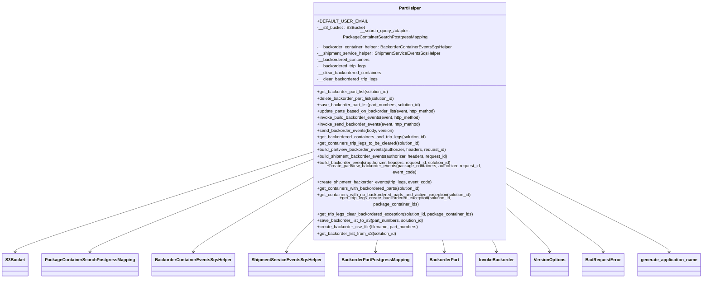

# Diagram: partview_core/partview_service/partview_service/api/part/helpers/PartHelper.py


> Auto-generated by Obscura crawlers

## Diagram 1



### SVG

<svg id="container" width="2513.984375" xmlns="http://www.w3.org/2000/svg" class="classDiagram" height="966" viewBox="0 0 2513.984375 966" role="graphics-document document" aria-roledescription="class"><style>#container{font-family:"trebuchet ms",verdana,arial,sans-serif;font-size:16px;fill:#333;}@keyframes edge-animation-frame{from{stroke-dashoffset:0;}}@keyframes dash{to{stroke-dashoffset:0;}}#container .edge-animation-slow{stroke-dasharray:9,5!important;stroke-dashoffset:900;animation:dash 50s linear infinite;stroke-linecap:round;}#container .edge-animation-fast{stroke-dasharray:9,5!important;stroke-dashoffset:900;animation:dash 20s linear infinite;stroke-linecap:round;}#container .error-icon{fill:#552222;}#container .error-text{fill:#552222;stroke:#552222;}#container .edge-thickness-normal{stroke-width:1px;}#container .edge-thickness-thick{stroke-width:3.5px;}#container .edge-pattern-solid{stroke-dasharray:0;}#container .edge-thickness-invisible{stroke-width:0;fill:none;}#container .edge-pattern-dashed{stroke-dasharray:3;}#container .edge-pattern-dotted{stroke-dasharray:2;}#container .marker{fill:#333333;stroke:#333333;}#container .marker.cross{stroke:#333333;}#container svg{font-family:"trebuchet ms",verdana,arial,sans-serif;font-size:16px;}#container p{margin:0;}#container g.classGroup text{fill:#9370DB;stroke:none;font-family:"trebuchet ms",verdana,arial,sans-serif;font-size:10px;}#container g.classGroup text .title{font-weight:bolder;}#container .nodeLabel,#container .edgeLabel{color:#131300;}#container .edgeLabel .label rect{fill:#ECECFF;}#container .label text{fill:#131300;}#container .labelBkg{background:#ECECFF;}#container .edgeLabel .label span{background:#ECECFF;}#container .classTitle{font-weight:bolder;}#container .node rect,#container .node circle,#container .node ellipse,#container .node polygon,#container .node path{fill:#ECECFF;stroke:#9370DB;stroke-width:1px;}#container .divider{stroke:#9370DB;stroke-width:1;}#container g.clickable{cursor:pointer;}#container g.classGroup rect{fill:#ECECFF;stroke:#9370DB;}#container g.classGroup line{stroke:#9370DB;stroke-width:1;}#container .classLabel .box{stroke:none;stroke-width:0;fill:#ECECFF;opacity:0.5;}#container .classLabel .label{fill:#9370DB;font-size:10px;}#container .relation{stroke:#333333;stroke-width:1;fill:none;}#container .dashed-line{stroke-dasharray:3;}#container .dotted-line{stroke-dasharray:1 2;}#container #compositionStart,#container .composition{fill:#333333!important;stroke:#333333!important;stroke-width:1;}#container #compositionEnd,#container .composition{fill:#333333!important;stroke:#333333!important;stroke-width:1;}#container #dependencyStart,#container .dependency{fill:#333333!important;stroke:#333333!important;stroke-width:1;}#container #dependencyStart,#container .dependency{fill:#333333!important;stroke:#333333!important;stroke-width:1;}#container #extensionStart,#container .extension{fill:transparent!important;stroke:#333333!important;stroke-width:1;}#container #extensionEnd,#container .extension{fill:transparent!important;stroke:#333333!important;stroke-width:1;}#container #aggregationStart,#container .aggregation{fill:transparent!important;stroke:#333333!important;stroke-width:1;}#container #aggregationEnd,#container .aggregation{fill:transparent!important;stroke:#333333!important;stroke-width:1;}#container #lollipopStart,#container .lollipop{fill:#ECECFF!important;stroke:#333333!important;stroke-width:1;}#container #lollipopEnd,#container .lollipop{fill:#ECECFF!important;stroke:#333333!important;stroke-width:1;}#container .edgeTerminals{font-size:11px;line-height:initial;}#container .classTitleText{text-anchor:middle;font-size:18px;fill:#333;}#container .label-icon{display:inline-block;height:1em;overflow:visible;vertical-align:-0.125em;}#container .node .label-icon path{fill:currentColor;stroke:revert;stroke-width:revert;}#container :root{--mermaid-font-family:"trebuchet ms",verdana,arial,sans-serif;}</style><g><defs><marker id="container_class-aggregationStart" class="marker aggregation class" refX="18" refY="7" markerWidth="190" markerHeight="240" orient="auto"><path d="M 18,7 L9,13 L1,7 L9,1 Z"></path></marker></defs><defs><marker id="container_class-aggregationEnd" class="marker aggregation class" refX="1" refY="7" markerWidth="20" markerHeight="28" orient="auto"><path d="M 18,7 L9,13 L1,7 L9,1 Z"></path></marker></defs><defs><marker id="container_class-extensionStart" class="marker extension class" refX="18" refY="7" markerWidth="190" markerHeight="240" orient="auto"><path d="M 1,7 L18,13 V 1 Z"></path></marker></defs><defs><marker id="container_class-extensionEnd" class="marker extension class" refX="1" refY="7" markerWidth="20" markerHeight="28" orient="auto"><path d="M 1,1 V 13 L18,7 Z"></path></marker></defs><defs><marker id="container_class-compositionStart" class="marker composition class" refX="18" refY="7" markerWidth="190" markerHeight="240" orient="auto"><path d="M 18,7 L9,13 L1,7 L9,1 Z"></path></marker></defs><defs><marker id="container_class-compositionEnd" class="marker composition class" refX="1" refY="7" markerWidth="20" markerHeight="28" orient="auto"><path d="M 18,7 L9,13 L1,7 L9,1 Z"></path></marker></defs><defs><marker id="container_class-dependencyStart" class="marker dependency class" refX="6" refY="7" markerWidth="190" markerHeight="240" orient="auto"><path d="M 5,7 L9,13 L1,7 L9,1 Z"></path></marker></defs><defs><marker id="container_class-dependencyEnd" class="marker dependency class" refX="13" refY="7" markerWidth="20" markerHeight="28" orient="auto"><path d="M 18,7 L9,13 L14,7 L9,1 Z"></path></marker></defs><defs><marker id="container_class-lollipopStart" class="marker lollipop class" refX="13" refY="7" markerWidth="190" markerHeight="240" orient="auto"><circle stroke="black" fill="transparent" cx="7" cy="7" r="6"></circle></marker></defs><defs><marker id="container_class-lollipopEnd" class="marker lollipop class" refX="1" refY="7" markerWidth="190" markerHeight="240" orient="auto"><circle stroke="black" fill="transparent" cx="7" cy="7" r="6"></circle></marker></defs><g class="root"><g class="clusters"></g><g class="edgePaths"><path d="M1090.48,529.34L917.717,582.617C744.953,635.893,399.426,742.447,226.662,798.89C53.898,855.333,53.898,861.667,53.898,864.833L53.898,868" id="id_PartHelper_S3Bucket_1" class="edge-thickness-normal edge-pattern-solid relation" style=";;;" data-edge="true" data-et="edge" data-id="id_PartHelper_S3Bucket_1" data-points="W3sieCI6MTA5MC40ODA0Njg3NSwieSI6NTI5LjM0MDA1NzQyMDQyMX0seyJ4Ijo1My44OTg0Mzc1LCJ5Ijo4NDl9LHsieCI6NTMuODk4NDM3NSwieSI6ODc0fV0=" marker-end="url(#container_class-dependencyEnd)"></path><path d="M1090.48,555.719L961.899,604.599C833.318,653.479,576.155,751.24,447.574,803.286C318.992,855.333,318.992,861.667,318.992,864.833L318.992,868" id="id_PartHelper_PackageContainerSearchPostgressMapping_2" class="edge-thickness-normal edge-pattern-solid relation" style=";;;" data-edge="true" data-et="edge" data-id="id_PartHelper_PackageContainerSearchPostgressMapping_2" data-points="W3sieCI6MTA5MC40ODA0Njg3NSwieSI6NTU1LjcxODU2NzE2NjIyNjV9LHsieCI6MzE4Ljk5MjE4NzUsInkiOjg0OX0seyJ4IjozMTguOTkyMTg3NSwieSI6ODc0fV0=" marker-end="url(#container_class-dependencyEnd)"></path><path d="M1090.48,621.912L1022.925,659.76C955.37,697.608,820.259,773.304,752.704,814.319C685.148,855.333,685.148,861.667,685.148,864.833L685.148,868" id="id_PartHelper_BackorderContainerEventsSqsHelper_3" class="edge-thickness-normal edge-pattern-solid relation" style=";;;" data-edge="true" data-et="edge" data-id="id_PartHelper_BackorderContainerEventsSqsHelper_3" data-points="W3sieCI6MTA5MC40ODA0Njg3NSwieSI6NjIxLjkxMjEyMjA2OTgwOX0seyJ4Ijo2ODUuMTQ4NDM3NSwieSI6ODQ5fSx7IngiOjY4NS4xNDg0Mzc1LCJ5Ijo4NzR9XQ==" marker-end="url(#container_class-dependencyEnd)"></path><path d="M1090.48,777.425L1078.35,789.354C1066.219,801.283,1041.957,825.142,1029.826,840.237C1017.695,855.333,1017.695,861.667,1017.695,864.833L1017.695,868" id="id_PartHelper_ShipmentServiceEventsSqsHelper_4" class="edge-thickness-normal edge-pattern-solid relation" style=";;;" data-edge="true" data-et="edge" data-id="id_PartHelper_ShipmentServiceEventsSqsHelper_4" data-points="W3sieCI6MTA5MC40ODA0Njg3NSwieSI6Nzc3LjQyNDg5NDg3NDExNTF9LHsieCI6MTAxNy42OTUzMTI1LCJ5Ijo4NDl9LHsieCI6MTAxNy42OTUzMTI1LCJ5Ijo4NzR9XQ==" marker-end="url(#container_class-dependencyEnd)"></path><path d="M1342.014,824L1340.83,828.167C1339.645,832.333,1337.276,840.667,1336.091,848C1334.906,855.333,1334.906,861.667,1334.906,864.833L1334.906,868" id="id_PartHelper_BackorderPartPostgressMapping_5" class="edge-thickness-normal edge-pattern-solid relation" style=";;;" data-edge="true" data-et="edge" data-id="id_PartHelper_BackorderPartPostgressMapping_5" data-points="W3sieCI6MTM0Mi4wMTQxODE1ODE5ODYxLCJ5Ijo4MjR9LHsieCI6MTMzNC45MDYyNSwieSI6ODQ5fSx7IngiOjEzMzQuOTA2MjUsInkiOjg3NH1d" marker-end="url(#container_class-dependencyEnd)"></path><path d="M1574.017,824L1575.202,828.167C1576.386,832.333,1578.756,840.667,1579.94,848C1581.125,855.333,1581.125,861.667,1581.125,864.833L1581.125,868" id="id_PartHelper_BackorderPart_6" class="edge-thickness-normal edge-pattern-solid relation" style=";;;" data-edge="true" data-et="edge" data-id="id_PartHelper_BackorderPart_6" data-points="W3sieCI6MTU3NC4wMTcwNjg0MTgwMTM5LCJ5Ijo4MjR9LHsieCI6MTU4MS4xMjUsInkiOjg0OX0seyJ4IjoxNTgxLjEyNSwieSI6ODc0fV0=" marker-end="url(#container_class-dependencyEnd)"></path><path d="M1751.612,824L1754.61,828.167C1757.608,832.333,1763.605,840.667,1766.603,848C1769.602,855.333,1769.602,861.667,1769.602,864.833L1769.602,868" id="id_PartHelper_InvokeBackorder_7" class="edge-thickness-normal edge-pattern-solid relation" style=";;;" data-edge="true" data-et="edge" data-id="id_PartHelper_InvokeBackorder_7" data-points="W3sieCI6MTc1MS42MTE2MTIyOTc5MjE1LCJ5Ijo4MjR9LHsieCI6MTc2OS42MDE1NjI1LCJ5Ijo4NDl9LHsieCI6MTc2OS42MDE1NjI1LCJ5Ijo4NzR9XQ==" marker-end="url(#container_class-dependencyEnd)"></path><path d="M1825.551,732.029L1848.223,751.524C1870.896,771.019,1916.241,810.01,1938.913,832.671C1961.586,855.333,1961.586,861.667,1961.586,864.833L1961.586,868" id="id_PartHelper_VersionOptions_8" class="edge-thickness-normal edge-pattern-solid relation" style=";;;" data-edge="true" data-et="edge" data-id="id_PartHelper_VersionOptions_8" data-points="W3sieCI6MTgyNS41NTA3ODEyNSwieSI6NzMyLjAyODgwMjE0NzE2Nzl9LHsieCI6MTk2MS41ODU5Mzc1LCJ5Ijo4NDl9LHsieCI6MTk2MS41ODU5Mzc1LCJ5Ijo4NzR9XQ==" marker-end="url(#container_class-dependencyEnd)"></path><path d="M1825.551,644.669L1880.287,678.724C1935.023,712.779,2044.496,780.89,2099.232,818.111C2153.969,855.333,2153.969,861.667,2153.969,864.833L2153.969,868" id="id_PartHelper_BadRequestError_9" class="edge-thickness-normal edge-pattern-solid relation" style=";;;" data-edge="true" data-et="edge" data-id="id_PartHelper_BadRequestError_9" data-points="W3sieCI6MTgyNS41NTA3ODEyNSwieSI6NjQ0LjY2ODczNzc5MjE0NjV9LHsieCI6MjE1My45Njg3NSwieSI6ODQ5fSx7IngiOjIxNTMuOTY4NzUsInkiOjg3NH1d" marker-end="url(#container_class-dependencyEnd)"></path><path d="M1825.551,586.37L1919.979,630.142C2014.406,673.913,2203.262,761.457,2297.689,808.395C2392.117,855.333,2392.117,861.667,2392.117,864.833L2392.117,868" id="id_PartHelper_generate_application_name_10" class="edge-thickness-normal edge-pattern-solid relation" style=";;;" data-edge="true" data-et="edge" data-id="id_PartHelper_generate_application_name_10" data-points="W3sieCI6MTgyNS41NTA3ODEyNSwieSI6NTg2LjM2OTgyODEyNjk2MDJ9LHsieCI6MjM5Mi4xMTcxODc1LCJ5Ijo4NDl9LHsieCI6MjM5Mi4xMTcxODc1LCJ5Ijo4NzR9XQ==" marker-end="url(#container_class-dependencyEnd)"></path></g><g class="edgeLabels"><g class="edgeLabel"><g class="label" data-id="id_PartHelper_S3Bucket_1" transform="translate(0, 0)"><foreignObject width="0" height="0"><div xmlns="http://www.w3.org/1999/xhtml" class="labelBkg" style="display: table-cell; white-space: nowrap; line-height: 1.5; max-width: 200px; text-align: center;"><span class="edgeLabel"></span></div></foreignObject></g></g><g class="edgeLabel"><g class="label" data-id="id_PartHelper_PackageContainerSearchPostgressMapping_2" transform="translate(0, 0)"><foreignObject width="0" height="0"><div xmlns="http://www.w3.org/1999/xhtml" class="labelBkg" style="display: table-cell; white-space: nowrap; line-height: 1.5; max-width: 200px; text-align: center;"><span class="edgeLabel"></span></div></foreignObject></g></g><g class="edgeLabel"><g class="label" data-id="id_PartHelper_BackorderContainerEventsSqsHelper_3" transform="translate(0, 0)"><foreignObject width="0" height="0"><div xmlns="http://www.w3.org/1999/xhtml" class="labelBkg" style="display: table-cell; white-space: nowrap; line-height: 1.5; max-width: 200px; text-align: center;"><span class="edgeLabel"></span></div></foreignObject></g></g><g class="edgeLabel"><g class="label" data-id="id_PartHelper_ShipmentServiceEventsSqsHelper_4" transform="translate(0, 0)"><foreignObject width="0" height="0"><div xmlns="http://www.w3.org/1999/xhtml" class="labelBkg" style="display: table-cell; white-space: nowrap; line-height: 1.5; max-width: 200px; text-align: center;"><span class="edgeLabel"></span></div></foreignObject></g></g><g class="edgeLabel"><g class="label" data-id="id_PartHelper_BackorderPartPostgressMapping_5" transform="translate(0, 0)"><foreignObject width="0" height="0"><div xmlns="http://www.w3.org/1999/xhtml" class="labelBkg" style="display: table-cell; white-space: nowrap; line-height: 1.5; max-width: 200px; text-align: center;"><span class="edgeLabel"></span></div></foreignObject></g></g><g class="edgeLabel"><g class="label" data-id="id_PartHelper_BackorderPart_6" transform="translate(0, 0)"><foreignObject width="0" height="0"><div xmlns="http://www.w3.org/1999/xhtml" class="labelBkg" style="display: table-cell; white-space: nowrap; line-height: 1.5; max-width: 200px; text-align: center;"><span class="edgeLabel"></span></div></foreignObject></g></g><g class="edgeLabel"><g class="label" data-id="id_PartHelper_InvokeBackorder_7" transform="translate(0, 0)"><foreignObject width="0" height="0"><div xmlns="http://www.w3.org/1999/xhtml" class="labelBkg" style="display: table-cell; white-space: nowrap; line-height: 1.5; max-width: 200px; text-align: center;"><span class="edgeLabel"></span></div></foreignObject></g></g><g class="edgeLabel"><g class="label" data-id="id_PartHelper_VersionOptions_8" transform="translate(0, 0)"><foreignObject width="0" height="0"><div xmlns="http://www.w3.org/1999/xhtml" class="labelBkg" style="display: table-cell; white-space: nowrap; line-height: 1.5; max-width: 200px; text-align: center;"><span class="edgeLabel"></span></div></foreignObject></g></g><g class="edgeLabel"><g class="label" data-id="id_PartHelper_BadRequestError_9" transform="translate(0, 0)"><foreignObject width="0" height="0"><div xmlns="http://www.w3.org/1999/xhtml" class="labelBkg" style="display: table-cell; white-space: nowrap; line-height: 1.5; max-width: 200px; text-align: center;"><span class="edgeLabel"></span></div></foreignObject></g></g><g class="edgeLabel"><g class="label" data-id="id_PartHelper_generate_application_name_10" transform="translate(0, 0)"><foreignObject width="0" height="0"><div xmlns="http://www.w3.org/1999/xhtml" class="labelBkg" style="display: table-cell; white-space: nowrap; line-height: 1.5; max-width: 200px; text-align: center;"><span class="edgeLabel"></span></div></foreignObject></g></g></g><g class="nodes"><g class="node default" id="classId-PartHelper-0" transform="translate(1458.015625, 416)"><g class="basic label-container"><path d="M-367.53515625 -408 L367.53515625 -408 L367.53515625 408 L-367.53515625 408" stroke="none" stroke-width="0" fill="#ECECFF" style=""></path><path d="M-367.53515625 -408 C-129.44562785834495 -408, 108.6439005333101 -408, 367.53515625 -408 M-367.53515625 -408 C-164.88687398482134 -408, 37.76140828035733 -408, 367.53515625 -408 M367.53515625 -408 C367.53515625 -203.9329826365585, 367.53515625 0.13403472688298734, 367.53515625 408 M367.53515625 -408 C367.53515625 -136.96388610055453, 367.53515625 134.07222779889094, 367.53515625 408 M367.53515625 408 C145.7346825821879 408, -76.0657910856242 408, -367.53515625 408 M367.53515625 408 C90.48209002123747 408, -186.57097620752506 408, -367.53515625 408 M-367.53515625 408 C-367.53515625 205.95896205436898, -367.53515625 3.9179241087379637, -367.53515625 -408 M-367.53515625 408 C-367.53515625 128.94117465335233, -367.53515625 -150.11765069329533, -367.53515625 -408" stroke="#9370DB" stroke-width="1.3" fill="none" stroke-dasharray="0 0" style=""></path></g><g class="annotation-group text" transform="translate(0, -384)"></g><g class="label-group text" transform="translate(-39.5859375, -384)"><g class="label" style="font-weight: bolder" transform="translate(0,-12)"><foreignObject width="79.171875" height="24"><div xmlns="http://www.w3.org/1999/xhtml" style="display: table-cell; white-space: nowrap; line-height: 1.5; max-width: 129px; text-align: center;"><span class="nodeLabel markdown-node-label" style=""><p>PartHelper</p></span></div></foreignObject></g></g><g class="members-group text" transform="translate(-355.53515625, -336)"><g class="label" style="" transform="translate(0,-12)"><foreignObject width="164.09375" height="24"><div xmlns="http://www.w3.org/1999/xhtml" style="display: table-cell; white-space: nowrap; line-height: 1.5; max-width: 221px; text-align: center;"><span class="nodeLabel markdown-node-label" style=""><p>+DEFAULT_USER_EMAIL</p></span></div></foreignObject></g><g class="label" style="" transform="translate(0,12)"><foreignObject width="172.375" height="24"><div xmlns="http://www.w3.org/1999/xhtml" style="display: table-cell; white-space: nowrap; line-height: 1.5; max-width: 230px; text-align: center;"><span class="nodeLabel markdown-node-label" style=""><p>-__s3_bucket : S3Bucket</p></span></div></foreignObject></g><g class="label" style="" transform="translate(0,36)"><foreignObject width="503.828125" height="24"><div xmlns="http://www.w3.org/1999/xhtml" style="display: table-cell; white-space: nowrap; line-height: 1.5; max-width: 562px; text-align: center;"><span class="nodeLabel markdown-node-label" style=""><p>-__search_query_adapter : PackageContainerSearchPostgressMapping</p></span></div></foreignObject></g><g class="label" style="" transform="translate(0,60)"><foreignObject width="503.359375" height="24"><div xmlns="http://www.w3.org/1999/xhtml" style="display: table-cell; white-space: nowrap; line-height: 1.5; max-width: 562px; text-align: center;"><span class="nodeLabel markdown-node-label" style=""><p>-__backorder_container_helper : BackorderContainerEventsSqsHelper</p></span></div></foreignObject></g><g class="label" style="" transform="translate(0,84)"><foreignObject width="460.3125" height="24"><div xmlns="http://www.w3.org/1999/xhtml" style="display: table-cell; white-space: nowrap; line-height: 1.5; max-width: 518px; text-align: center;"><span class="nodeLabel markdown-node-label" style=""><p>-__shipment_service_helper : ShipmentServiceEventsSqsHelper</p></span></div></foreignObject></g><g class="label" style="" transform="translate(0,108)"><foreignObject width="197.140625" height="24"><div xmlns="http://www.w3.org/1999/xhtml" style="display: table-cell; white-space: nowrap; line-height: 1.5; max-width: 255px; text-align: center;"><span class="nodeLabel markdown-node-label" style=""><p>-__backordered_containers</p></span></div></foreignObject></g><g class="label" style="" transform="translate(0,132)"><foreignObject width="183.53125" height="24"><div xmlns="http://www.w3.org/1999/xhtml" style="display: table-cell; white-space: nowrap; line-height: 1.5; max-width: 241px; text-align: center;"><span class="nodeLabel markdown-node-label" style=""><p>-__backordered_trip_legs</p></span></div></foreignObject></g><g class="label" style="" transform="translate(0,156)"><foreignObject width="239.5625" height="24"><div xmlns="http://www.w3.org/1999/xhtml" style="display: table-cell; white-space: nowrap; line-height: 1.5; max-width: 297px; text-align: center;"><span class="nodeLabel markdown-node-label" style=""><p>-__clear_backordered_containers</p></span></div></foreignObject></g><g class="label" style="" transform="translate(0,180)"><foreignObject width="225.9375" height="24"><div xmlns="http://www.w3.org/1999/xhtml" style="display: table-cell; white-space: nowrap; line-height: 1.5; max-width: 283px; text-align: center;"><span class="nodeLabel markdown-node-label" style=""><p>-__clear_backordered_trip_legs</p></span></div></foreignObject></g></g><g class="methods-group text" transform="translate(-355.53515625, -96)"><g class="label" style="" transform="translate(0,-12)"><foreignObject width="272.359375" height="24"><div xmlns="http://www.w3.org/1999/xhtml" style="display: table-cell; white-space: nowrap; line-height: 1.5; max-width: 330px; text-align: center;"><span class="nodeLabel markdown-node-label" style=""><p>+get_backorder_part_list(solution_id)</p></span></div></foreignObject></g><g class="label" style="" transform="translate(0,12)"><foreignObject width="295.359375" height="24"><div xmlns="http://www.w3.org/1999/xhtml" style="display: table-cell; white-space: nowrap; line-height: 1.5; max-width: 353px; text-align: center;"><span class="nodeLabel markdown-node-label" style=""><p>+delete_backorder_part_list(solution_id)</p></span></div></foreignObject></g><g class="label" style="" transform="translate(0,36)"><foreignObject width="392.21875" height="24"><div xmlns="http://www.w3.org/1999/xhtml" style="display: table-cell; white-space: nowrap; line-height: 1.5; max-width: 450px; text-align: center;"><span class="nodeLabel markdown-node-label" style=""><p>+save_backorder_part_list(part_numbers, solution_id)</p></span></div></foreignObject></g><g class="label" style="" transform="translate(0,60)"><foreignObject width="447.84375" height="24"><div xmlns="http://www.w3.org/1999/xhtml" style="display: table-cell; white-space: nowrap; line-height: 1.5; max-width: 505px; text-align: center;"><span class="nodeLabel markdown-node-label" style=""><p>+update_parts_based_on_backorder_list(event, http_method)</p></span></div></foreignObject></g><g class="label" style="" transform="translate(0,84)"><foreignObject width="391.0625" height="24"><div xmlns="http://www.w3.org/1999/xhtml" style="display: table-cell; white-space: nowrap; line-height: 1.5; max-width: 448px; text-align: center;"><span class="nodeLabel markdown-node-label" style=""><p>+invoke_build_backorder_events(event, http_method)</p></span></div></foreignObject></g><g class="label" style="" transform="translate(0,108)"><foreignObject width="388.703125" height="24"><div xmlns="http://www.w3.org/1999/xhtml" style="display: table-cell; white-space: nowrap; line-height: 1.5; max-width: 446px; text-align: center;"><span class="nodeLabel markdown-node-label" style=""><p>+invoke_send_backorder_events(event, http_method)</p></span></div></foreignObject></g><g class="label" style="" transform="translate(0,132)"><foreignObject width="286.484375" height="24"><div xmlns="http://www.w3.org/1999/xhtml" style="display: table-cell; white-space: nowrap; line-height: 1.5; max-width: 344px; text-align: center;"><span class="nodeLabel markdown-node-label" style=""><p>+send_backorder_events(body, version)</p></span></div></foreignObject></g><g class="label" style="" transform="translate(0,156)"><foreignObject width="413.09375" height="24"><div xmlns="http://www.w3.org/1999/xhtml" style="display: table-cell; white-space: nowrap; line-height: 1.5; max-width: 470px; text-align: center;"><span class="nodeLabel markdown-node-label" style=""><p>+get_backordered_containers_and_trip_legs(solution_id)</p></span></div></foreignObject></g><g class="label" style="" transform="translate(0,180)"><foreignObject width="388.046875" height="24"><div xmlns="http://www.w3.org/1999/xhtml" style="display: table-cell; white-space: nowrap; line-height: 1.5; max-width: 445px; text-align: center;"><span class="nodeLabel markdown-node-label" style=""><p>+get_containers_trip_legs_to_be_cleared(solution_id)</p></span></div></foreignObject></g><g class="label" style="" transform="translate(0,204)"><foreignObject width="488.3125" height="24"><div xmlns="http://www.w3.org/1999/xhtml" style="display: table-cell; white-space: nowrap; line-height: 1.5; max-width: 546px; text-align: center;"><span class="nodeLabel markdown-node-label" style=""><p>+build_partview_backorder_events(authorizer, headers, request_id)</p></span></div></foreignObject></g><g class="label" style="" transform="translate(0,228)"><foreignObject width="494.578125" height="24"><div xmlns="http://www.w3.org/1999/xhtml" style="display: table-cell; white-space: nowrap; line-height: 1.5; max-width: 552px; text-align: center;"><span class="nodeLabel markdown-node-label" style=""><p>+build_shipment_backorder_events(authorizer, headers, request_id)</p></span></div></foreignObject></g><g class="label" style="" transform="translate(0,252)"><foreignObject width="508.125" height="24"><div xmlns="http://www.w3.org/1999/xhtml" style="display: table-cell; white-space: nowrap; line-height: 1.5; max-width: 565px; text-align: center;"><span class="nodeLabel markdown-node-label" style=""><p>+build_backorder_events(authorizer, headers, request_id, solution_id)</p></span></div></foreignObject></g><g class="label" style="" transform="translate(0,276)"><foreignObject width="671.484375" height="24"><div xmlns="http://www.w3.org/1999/xhtml" style="display: table-cell; white-space: nowrap; line-height: 1.5; max-width: 729px; text-align: center;"><span class="nodeLabel markdown-node-label" style=""><p>+create_partview_backorder_events(package_containers, authorizer, request_id, event_code)</p></span></div></foreignObject></g><g class="label" style="" transform="translate(0,300)"><foreignObject width="429.953125" height="24"><div xmlns="http://www.w3.org/1999/xhtml" style="display: table-cell; white-space: nowrap; line-height: 1.5; max-width: 487px; text-align: center;"><span class="nodeLabel markdown-node-label" style=""><p>+create_shipment_backorder_events(trip_legs, event_code)</p></span></div></foreignObject></g><g class="label" style="" transform="translate(0,324)"><foreignObject width="391.5625" height="24"><div xmlns="http://www.w3.org/1999/xhtml" style="display: table-cell; white-space: nowrap; line-height: 1.5; max-width: 449px; text-align: center;"><span class="nodeLabel markdown-node-label" style=""><p>+get_containers_with_backordered_parts(solution_id)</p></span></div></foreignObject></g><g class="label" style="" transform="translate(0,348)"><foreignObject width="583.203125" height="24"><div xmlns="http://www.w3.org/1999/xhtml" style="display: table-cell; white-space: nowrap; line-height: 1.5; max-width: 641px; text-align: center;"><span class="nodeLabel markdown-node-label" style=""><p>+get_containers_with_no_backordered_parts_and_active_exception(solution_id)</p></span></div></foreignObject></g><g class="label" style="" transform="translate(0,372)"><foreignObject width="596.84375" height="24"><div xmlns="http://www.w3.org/1999/xhtml" style="display: table-cell; white-space: nowrap; line-height: 1.5; max-width: 654px; text-align: center;"><span class="nodeLabel markdown-node-label" style=""><p>+get_trip_legs_create_backordered_exception(solution_id, package_container_ids)</p></span></div></foreignObject></g><g class="label" style="" transform="translate(0,396)"><foreignObject width="586.71875" height="24"><div xmlns="http://www.w3.org/1999/xhtml" style="display: table-cell; white-space: nowrap; line-height: 1.5; max-width: 644px; text-align: center;"><span class="nodeLabel markdown-node-label" style=""><p>+get_trip_legs_clear_backordered_exception(solution_id, package_container_ids)</p></span></div></foreignObject></g><g class="label" style="" transform="translate(0,420)"><foreignObject width="400.234375" height="24"><div xmlns="http://www.w3.org/1999/xhtml" style="display: table-cell; white-space: nowrap; line-height: 1.5; max-width: 458px; text-align: center;"><span class="nodeLabel markdown-node-label" style=""><p>+save_backorder_list_to_s3(part_numbers, solution_id)</p></span></div></foreignObject></g><g class="label" style="" transform="translate(0,444)"><foreignObject width="377.265625" height="24"><div xmlns="http://www.w3.org/1999/xhtml" style="display: table-cell; white-space: nowrap; line-height: 1.5; max-width: 435px; text-align: center;"><span class="nodeLabel markdown-node-label" style=""><p>+create_backorder_csv_file(filename, part_numbers)</p></span></div></foreignObject></g><g class="label" style="" transform="translate(0,468)"><foreignObject width="299.921875" height="24"><div xmlns="http://www.w3.org/1999/xhtml" style="display: table-cell; white-space: nowrap; line-height: 1.5; max-width: 357px; text-align: center;"><span class="nodeLabel markdown-node-label" style=""><p>+get_backorder_list_from_s3(solution_id)</p></span></div></foreignObject></g></g><g class="divider" style=""><path d="M-367.53515625 -360 C-124.97909836829513 -360, 117.57695951340975 -360, 367.53515625 -360 M-367.53515625 -360 C-201.00786781928377 -360, -34.48057938856755 -360, 367.53515625 -360" stroke="#9370DB" stroke-width="1.3" fill="none" stroke-dasharray="0 0" style=""></path></g><g class="divider" style=""><path d="M-367.53515625 -120 C-95.66656465958926 -120, 176.2020269308215 -120, 367.53515625 -120 M-367.53515625 -120 C-164.58671455541221 -120, 38.36172713917557 -120, 367.53515625 -120" stroke="#9370DB" stroke-width="1.3" fill="none" stroke-dasharray="0 0" style=""></path></g></g><g class="node default" id="classId-S3Bucket-1" transform="translate(53.8984375, 916)"><g class="basic label-container"><path d="M-45.8984375 -42 L45.8984375 -42 L45.8984375 42 L-45.8984375 42" stroke="none" stroke-width="0" fill="#ECECFF" style=""></path><path d="M-45.8984375 -42 C-20.26242544768329 -42, 5.373586604633417 -42, 45.8984375 -42 M-45.8984375 -42 C-25.224479149777917 -42, -4.550520799555834 -42, 45.8984375 -42 M45.8984375 -42 C45.8984375 -19.845401113162485, 45.8984375 2.309197773675031, 45.8984375 42 M45.8984375 -42 C45.8984375 -24.607230190195377, 45.8984375 -7.214460380390754, 45.8984375 42 M45.8984375 42 C22.11723110973366 42, -1.6639752805326822 42, -45.8984375 42 M45.8984375 42 C18.645846113544494 42, -8.606745272911013 42, -45.8984375 42 M-45.8984375 42 C-45.8984375 23.74624226612385, -45.8984375 5.492484532247701, -45.8984375 -42 M-45.8984375 42 C-45.8984375 11.728948248865223, -45.8984375 -18.542103502269555, -45.8984375 -42" stroke="#9370DB" stroke-width="1.3" fill="none" stroke-dasharray="0 0" style=""></path></g><g class="annotation-group text" transform="translate(0, -18)"></g><g class="label-group text" transform="translate(-33.8984375, -18)"><g class="label" style="font-weight: bolder" transform="translate(0,-12)"><foreignObject width="67.796875" height="24"><div xmlns="http://www.w3.org/1999/xhtml" style="display: table-cell; white-space: nowrap; line-height: 1.5; max-width: 116px; text-align: center;"><span class="nodeLabel markdown-node-label" style=""><p>S3Bucket</p></span></div></foreignObject></g></g><g class="members-group text" transform="translate(-33.8984375, 30)"></g><g class="methods-group text" transform="translate(-33.8984375, 60)"></g><g class="divider" style=""><path d="M-45.8984375 6 C-10.11530033604894 6, 25.66783682790212 6, 45.8984375 6 M-45.8984375 6 C-24.438306825797877 6, -2.978176151595754 6, 45.8984375 6" stroke="#9370DB" stroke-width="1.3" fill="none" stroke-dasharray="0 0" style=""></path></g><g class="divider" style=""><path d="M-45.8984375 24 C-20.856571764774575 24, 4.18529397045085 24, 45.8984375 24 M-45.8984375 24 C-26.140141725941422 24, -6.381845951882845 24, 45.8984375 24" stroke="#9370DB" stroke-width="1.3" fill="none" stroke-dasharray="0 0" style=""></path></g></g><g class="node default" id="classId-PackageContainerSearchPostgressMapping-2" transform="translate(318.9921875, 916)"><g class="basic label-container"><path d="M-169.1953125 -42 L169.1953125 -42 L169.1953125 42 L-169.1953125 42" stroke="none" stroke-width="0" fill="#ECECFF" style=""></path><path d="M-169.1953125 -42 C-50.47384331819261 -42, 68.24762586361479 -42, 169.1953125 -42 M-169.1953125 -42 C-34.25807056753402 -42, 100.67917136493196 -42, 169.1953125 -42 M169.1953125 -42 C169.1953125 -22.31360995609481, 169.1953125 -2.6272199121896165, 169.1953125 42 M169.1953125 -42 C169.1953125 -12.378390203161441, 169.1953125 17.243219593677118, 169.1953125 42 M169.1953125 42 C95.95209509852073 42, 22.70887769704146 42, -169.1953125 42 M169.1953125 42 C98.53985851484194 42, 27.884404529683877 42, -169.1953125 42 M-169.1953125 42 C-169.1953125 11.025284415388295, -169.1953125 -19.94943116922341, -169.1953125 -42 M-169.1953125 42 C-169.1953125 21.793292755170647, -169.1953125 1.586585510341294, -169.1953125 -42" stroke="#9370DB" stroke-width="1.3" fill="none" stroke-dasharray="0 0" style=""></path></g><g class="annotation-group text" transform="translate(0, -18)"></g><g class="label-group text" transform="translate(-157.1953125, -18)"><g class="label" style="font-weight: bolder" transform="translate(0,-12)"><foreignObject width="314.390625" height="24"><div xmlns="http://www.w3.org/1999/xhtml" style="display: table-cell; white-space: nowrap; line-height: 1.5; max-width: 359px; text-align: center;"><span class="nodeLabel markdown-node-label" style=""><p>PackageContainerSearchPostgressMapping</p></span></div></foreignObject></g></g><g class="members-group text" transform="translate(-157.1953125, 30)"></g><g class="methods-group text" transform="translate(-157.1953125, 60)"></g><g class="divider" style=""><path d="M-169.1953125 6 C-95.26165583157922 6, -21.327999163158438 6, 169.1953125 6 M-169.1953125 6 C-63.24615494466943 6, 42.703002610661144 6, 169.1953125 6" stroke="#9370DB" stroke-width="1.3" fill="none" stroke-dasharray="0 0" style=""></path></g><g class="divider" style=""><path d="M-169.1953125 24 C-56.1027088792641 24, 56.9898947414718 24, 169.1953125 24 M-169.1953125 24 C-99.99921921429998 24, -30.803125928599968 24, 169.1953125 24" stroke="#9370DB" stroke-width="1.3" fill="none" stroke-dasharray="0 0" style=""></path></g></g><g class="node default" id="classId-BackorderContainerEventsSqsHelper-3" transform="translate(685.1484375, 916)"><g class="basic label-container"><path d="M-146.9609375 -42 L146.9609375 -42 L146.9609375 42 L-146.9609375 42" stroke="none" stroke-width="0" fill="#ECECFF" style=""></path><path d="M-146.9609375 -42 C-67.59391320619656 -42, 11.773111087606878 -42, 146.9609375 -42 M-146.9609375 -42 C-35.686607313000806 -42, 75.58772287399839 -42, 146.9609375 -42 M146.9609375 -42 C146.9609375 -24.17244009189154, 146.9609375 -6.344880183783083, 146.9609375 42 M146.9609375 -42 C146.9609375 -21.799026646620586, 146.9609375 -1.598053293241172, 146.9609375 42 M146.9609375 42 C53.27704802030196 42, -40.40684145939608 42, -146.9609375 42 M146.9609375 42 C68.06132999603467 42, -10.838277507930655 42, -146.9609375 42 M-146.9609375 42 C-146.9609375 23.347497120055202, -146.9609375 4.694994240110404, -146.9609375 -42 M-146.9609375 42 C-146.9609375 9.456853442686068, -146.9609375 -23.086293114627864, -146.9609375 -42" stroke="#9370DB" stroke-width="1.3" fill="none" stroke-dasharray="0 0" style=""></path></g><g class="annotation-group text" transform="translate(0, -18)"></g><g class="label-group text" transform="translate(-134.9609375, -18)"><g class="label" style="font-weight: bolder" transform="translate(0,-12)"><foreignObject width="269.921875" height="24"><div xmlns="http://www.w3.org/1999/xhtml" style="display: table-cell; white-space: nowrap; line-height: 1.5; max-width: 317px; text-align: center;"><span class="nodeLabel markdown-node-label" style=""><p>BackorderContainerEventsSqsHelper</p></span></div></foreignObject></g></g><g class="members-group text" transform="translate(-134.9609375, 30)"></g><g class="methods-group text" transform="translate(-134.9609375, 60)"></g><g class="divider" style=""><path d="M-146.9609375 6 C-55.9775177394458 6, 35.0059020211084 6, 146.9609375 6 M-146.9609375 6 C-60.896372715672626 6, 25.168192068654747 6, 146.9609375 6" stroke="#9370DB" stroke-width="1.3" fill="none" stroke-dasharray="0 0" style=""></path></g><g class="divider" style=""><path d="M-146.9609375 24 C-47.24202411387979 24, 52.47688927224041 24, 146.9609375 24 M-146.9609375 24 C-47.83673324869953 24, 51.28747100260094 24, 146.9609375 24" stroke="#9370DB" stroke-width="1.3" fill="none" stroke-dasharray="0 0" style=""></path></g></g><g class="node default" id="classId-ShipmentServiceEventsSqsHelper-4" transform="translate(1017.6953125, 916)"><g class="basic label-container"><path d="M-135.5859375 -42 L135.5859375 -42 L135.5859375 42 L-135.5859375 42" stroke="none" stroke-width="0" fill="#ECECFF" style=""></path><path d="M-135.5859375 -42 C-55.66500061411796 -42, 24.255936271764085 -42, 135.5859375 -42 M-135.5859375 -42 C-31.11117385884772 -42, 73.36358978230456 -42, 135.5859375 -42 M135.5859375 -42 C135.5859375 -19.042134163209944, 135.5859375 3.9157316735801118, 135.5859375 42 M135.5859375 -42 C135.5859375 -13.264301779590802, 135.5859375 15.471396440818395, 135.5859375 42 M135.5859375 42 C37.891427226012226 42, -59.80308304797555 42, -135.5859375 42 M135.5859375 42 C49.378905742889955 42, -36.82812601422009 42, -135.5859375 42 M-135.5859375 42 C-135.5859375 20.942500174652135, -135.5859375 -0.11499965069572937, -135.5859375 -42 M-135.5859375 42 C-135.5859375 8.908910560197818, -135.5859375 -24.182178879604365, -135.5859375 -42" stroke="#9370DB" stroke-width="1.3" fill="none" stroke-dasharray="0 0" style=""></path></g><g class="annotation-group text" transform="translate(0, -18)"></g><g class="label-group text" transform="translate(-123.5859375, -18)"><g class="label" style="font-weight: bolder" transform="translate(0,-12)"><foreignObject width="247.171875" height="24"><div xmlns="http://www.w3.org/1999/xhtml" style="display: table-cell; white-space: nowrap; line-height: 1.5; max-width: 294px; text-align: center;"><span class="nodeLabel markdown-node-label" style=""><p>ShipmentServiceEventsSqsHelper</p></span></div></foreignObject></g></g><g class="members-group text" transform="translate(-123.5859375, 30)"></g><g class="methods-group text" transform="translate(-123.5859375, 60)"></g><g class="divider" style=""><path d="M-135.5859375 6 C-64.76148486472981 6, 6.062967770540382 6, 135.5859375 6 M-135.5859375 6 C-39.697018327524944 6, 56.19190084495011 6, 135.5859375 6" stroke="#9370DB" stroke-width="1.3" fill="none" stroke-dasharray="0 0" style=""></path></g><g class="divider" style=""><path d="M-135.5859375 24 C-63.50485170160458 24, 8.576234096790841 24, 135.5859375 24 M-135.5859375 24 C-62.046425876204 24, 11.493085747592005 24, 135.5859375 24" stroke="#9370DB" stroke-width="1.3" fill="none" stroke-dasharray="0 0" style=""></path></g></g><g class="node default" id="classId-BackorderPartPostgressMapping-5" transform="translate(1334.90625, 916)"><g class="basic label-container"><path d="M-131.625 -42 L131.625 -42 L131.625 42 L-131.625 42" stroke="none" stroke-width="0" fill="#ECECFF" style=""></path><path d="M-131.625 -42 C-63.59370616564543 -42, 4.437587668709142 -42, 131.625 -42 M-131.625 -42 C-42.29210267070799 -42, 47.04079465858402 -42, 131.625 -42 M131.625 -42 C131.625 -15.04768809876428, 131.625 11.904623802471441, 131.625 42 M131.625 -42 C131.625 -11.981306926120961, 131.625 18.037386147758077, 131.625 42 M131.625 42 C46.72925010369019 42, -38.16649979261962 42, -131.625 42 M131.625 42 C35.58823944483862 42, -60.44852111032276 42, -131.625 42 M-131.625 42 C-131.625 24.668310618700005, -131.625 7.33662123740001, -131.625 -42 M-131.625 42 C-131.625 10.89781989776003, -131.625 -20.20436020447994, -131.625 -42" stroke="#9370DB" stroke-width="1.3" fill="none" stroke-dasharray="0 0" style=""></path></g><g class="annotation-group text" transform="translate(0, -18)"></g><g class="label-group text" transform="translate(-119.625, -18)"><g class="label" style="font-weight: bolder" transform="translate(0,-12)"><foreignObject width="239.25" height="24"><div xmlns="http://www.w3.org/1999/xhtml" style="display: table-cell; white-space: nowrap; line-height: 1.5; max-width: 284px; text-align: center;"><span class="nodeLabel markdown-node-label" style=""><p>BackorderPartPostgressMapping</p></span></div></foreignObject></g></g><g class="members-group text" transform="translate(-119.625, 30)"></g><g class="methods-group text" transform="translate(-119.625, 60)"></g><g class="divider" style=""><path d="M-131.625 6 C-51.31521283251017 6, 28.99457433497966 6, 131.625 6 M-131.625 6 C-54.73310655979827 6, 22.158786880403454 6, 131.625 6" stroke="#9370DB" stroke-width="1.3" fill="none" stroke-dasharray="0 0" style=""></path></g><g class="divider" style=""><path d="M-131.625 24 C-67.96359579668766 24, -4.302191593375298 24, 131.625 24 M-131.625 24 C-64.84813956311464 24, 1.9287208737707147 24, 131.625 24" stroke="#9370DB" stroke-width="1.3" fill="none" stroke-dasharray="0 0" style=""></path></g></g><g class="node default" id="classId-BackorderPart-6" transform="translate(1581.125, 916)"><g class="basic label-container"><path d="M-64.59375 -42 L64.59375 -42 L64.59375 42 L-64.59375 42" stroke="none" stroke-width="0" fill="#ECECFF" style=""></path><path d="M-64.59375 -42 C-37.000113851066 -42, -9.406477702131994 -42, 64.59375 -42 M-64.59375 -42 C-29.736299142562977 -42, 5.1211517148740455 -42, 64.59375 -42 M64.59375 -42 C64.59375 -18.76855842494216, 64.59375 4.46288315011568, 64.59375 42 M64.59375 -42 C64.59375 -17.099555599165736, 64.59375 7.800888801668528, 64.59375 42 M64.59375 42 C19.859346616054246 42, -24.875056767891508 42, -64.59375 42 M64.59375 42 C25.795034620922983 42, -13.003680758154033 42, -64.59375 42 M-64.59375 42 C-64.59375 12.133149629866644, -64.59375 -17.733700740266713, -64.59375 -42 M-64.59375 42 C-64.59375 12.605427491041603, -64.59375 -16.789145017916795, -64.59375 -42" stroke="#9370DB" stroke-width="1.3" fill="none" stroke-dasharray="0 0" style=""></path></g><g class="annotation-group text" transform="translate(0, -18)"></g><g class="label-group text" transform="translate(-52.59375, -18)"><g class="label" style="font-weight: bolder" transform="translate(0,-12)"><foreignObject width="105.1875" height="24"><div xmlns="http://www.w3.org/1999/xhtml" style="display: table-cell; white-space: nowrap; line-height: 1.5; max-width: 153px; text-align: center;"><span class="nodeLabel markdown-node-label" style=""><p>BackorderPart</p></span></div></foreignObject></g></g><g class="members-group text" transform="translate(-52.59375, 30)"></g><g class="methods-group text" transform="translate(-52.59375, 60)"></g><g class="divider" style=""><path d="M-64.59375 6 C-20.764229382538232 6, 23.065291234923535 6, 64.59375 6 M-64.59375 6 C-24.147105822086267 6, 16.299538355827465 6, 64.59375 6" stroke="#9370DB" stroke-width="1.3" fill="none" stroke-dasharray="0 0" style=""></path></g><g class="divider" style=""><path d="M-64.59375 24 C-29.15443472057516 24, 6.284880558849679 24, 64.59375 24 M-64.59375 24 C-28.38695396899692 24, 7.81984206200616 24, 64.59375 24" stroke="#9370DB" stroke-width="1.3" fill="none" stroke-dasharray="0 0" style=""></path></g></g><g class="node default" id="classId-InvokeBackorder-7" transform="translate(1769.6015625, 916)"><g class="basic label-container"><path d="M-73.8828125 -42 L73.8828125 -42 L73.8828125 42 L-73.8828125 42" stroke="none" stroke-width="0" fill="#ECECFF" style=""></path><path d="M-73.8828125 -42 C-25.975306770866894 -42, 21.932198958266213 -42, 73.8828125 -42 M-73.8828125 -42 C-42.23715084721552 -42, -10.591489194431027 -42, 73.8828125 -42 M73.8828125 -42 C73.8828125 -22.52899050439851, 73.8828125 -3.0579810087970216, 73.8828125 42 M73.8828125 -42 C73.8828125 -19.038548855559895, 73.8828125 3.922902288880209, 73.8828125 42 M73.8828125 42 C38.60514488163671 42, 3.3274772632734226 42, -73.8828125 42 M73.8828125 42 C35.89333435157088 42, -2.096143796858243 42, -73.8828125 42 M-73.8828125 42 C-73.8828125 21.685174098784074, -73.8828125 1.3703481975681484, -73.8828125 -42 M-73.8828125 42 C-73.8828125 18.438682164467888, -73.8828125 -5.122635671064224, -73.8828125 -42" stroke="#9370DB" stroke-width="1.3" fill="none" stroke-dasharray="0 0" style=""></path></g><g class="annotation-group text" transform="translate(0, -18)"></g><g class="label-group text" transform="translate(-61.8828125, -18)"><g class="label" style="font-weight: bolder" transform="translate(0,-12)"><foreignObject width="123.765625" height="24"><div xmlns="http://www.w3.org/1999/xhtml" style="display: table-cell; white-space: nowrap; line-height: 1.5; max-width: 172px; text-align: center;"><span class="nodeLabel markdown-node-label" style=""><p>InvokeBackorder</p></span></div></foreignObject></g></g><g class="members-group text" transform="translate(-61.8828125, 30)"></g><g class="methods-group text" transform="translate(-61.8828125, 60)"></g><g class="divider" style=""><path d="M-73.8828125 6 C-19.90193487152169 6, 34.07894275695662 6, 73.8828125 6 M-73.8828125 6 C-35.779335731014214 6, 2.3241410379715717 6, 73.8828125 6" stroke="#9370DB" stroke-width="1.3" fill="none" stroke-dasharray="0 0" style=""></path></g><g class="divider" style=""><path d="M-73.8828125 24 C-25.304848680139138 24, 23.273115139721725 24, 73.8828125 24 M-73.8828125 24 C-35.2264215567981 24, 3.4299693864037977 24, 73.8828125 24" stroke="#9370DB" stroke-width="1.3" fill="none" stroke-dasharray="0 0" style=""></path></g></g><g class="node default" id="classId-VersionOptions-8" transform="translate(1961.5859375, 916)"><g class="basic label-container"><path d="M-68.1015625 -42 L68.1015625 -42 L68.1015625 42 L-68.1015625 42" stroke="none" stroke-width="0" fill="#ECECFF" style=""></path><path d="M-68.1015625 -42 C-33.20560255983779 -42, 1.6903573803244143 -42, 68.1015625 -42 M-68.1015625 -42 C-19.018989151430333 -42, 30.063584197139335 -42, 68.1015625 -42 M68.1015625 -42 C68.1015625 -13.9981113408322, 68.1015625 14.003777318335601, 68.1015625 42 M68.1015625 -42 C68.1015625 -13.297996362665078, 68.1015625 15.404007274669844, 68.1015625 42 M68.1015625 42 C33.12662297860957 42, -1.8483165427808643 42, -68.1015625 42 M68.1015625 42 C32.46990349716787 42, -3.16175550566426 42, -68.1015625 42 M-68.1015625 42 C-68.1015625 19.344849944883283, -68.1015625 -3.3103001102334346, -68.1015625 -42 M-68.1015625 42 C-68.1015625 14.380513463483041, -68.1015625 -13.238973073033918, -68.1015625 -42" stroke="#9370DB" stroke-width="1.3" fill="none" stroke-dasharray="0 0" style=""></path></g><g class="annotation-group text" transform="translate(0, -18)"></g><g class="label-group text" transform="translate(-56.1015625, -18)"><g class="label" style="font-weight: bolder" transform="translate(0,-12)"><foreignObject width="112.203125" height="24"><div xmlns="http://www.w3.org/1999/xhtml" style="display: table-cell; white-space: nowrap; line-height: 1.5; max-width: 161px; text-align: center;"><span class="nodeLabel markdown-node-label" style=""><p>VersionOptions</p></span></div></foreignObject></g></g><g class="members-group text" transform="translate(-56.1015625, 30)"></g><g class="methods-group text" transform="translate(-56.1015625, 60)"></g><g class="divider" style=""><path d="M-68.1015625 6 C-29.984611592143104 6, 8.132339315713793 6, 68.1015625 6 M-68.1015625 6 C-39.18564785434829 6, -10.269733208696572 6, 68.1015625 6" stroke="#9370DB" stroke-width="1.3" fill="none" stroke-dasharray="0 0" style=""></path></g><g class="divider" style=""><path d="M-68.1015625 24 C-38.15388177279189 24, -8.206201045583775 24, 68.1015625 24 M-68.1015625 24 C-20.37743089361154 24, 27.346700712776922 24, 68.1015625 24" stroke="#9370DB" stroke-width="1.3" fill="none" stroke-dasharray="0 0" style=""></path></g></g><g class="node default" id="classId-BadRequestError-9" transform="translate(2153.96875, 916)"><g class="basic label-container"><path d="M-74.28125 -42 L74.28125 -42 L74.28125 42 L-74.28125 42" stroke="none" stroke-width="0" fill="#ECECFF" style=""></path><path d="M-74.28125 -42 C-28.78359296875861 -42, 16.714064062482777 -42, 74.28125 -42 M-74.28125 -42 C-31.019185193132813 -42, 12.242879613734374 -42, 74.28125 -42 M74.28125 -42 C74.28125 -22.507092380236802, 74.28125 -3.0141847604736043, 74.28125 42 M74.28125 -42 C74.28125 -12.16376509861879, 74.28125 17.67246980276242, 74.28125 42 M74.28125 42 C44.16960666204051 42, 14.057963324081008 42, -74.28125 42 M74.28125 42 C32.66057549803128 42, -8.960099003937444 42, -74.28125 42 M-74.28125 42 C-74.28125 23.643243958155573, -74.28125 5.286487916311145, -74.28125 -42 M-74.28125 42 C-74.28125 17.726601901996418, -74.28125 -6.546796196007165, -74.28125 -42" stroke="#9370DB" stroke-width="1.3" fill="none" stroke-dasharray="0 0" style=""></path></g><g class="annotation-group text" transform="translate(0, -18)"></g><g class="label-group text" transform="translate(-62.28125, -18)"><g class="label" style="font-weight: bolder" transform="translate(0,-12)"><foreignObject width="124.5625" height="24"><div xmlns="http://www.w3.org/1999/xhtml" style="display: table-cell; white-space: nowrap; line-height: 1.5; max-width: 174px; text-align: center;"><span class="nodeLabel markdown-node-label" style=""><p>BadRequestError</p></span></div></foreignObject></g></g><g class="members-group text" transform="translate(-62.28125, 30)"></g><g class="methods-group text" transform="translate(-62.28125, 60)"></g><g class="divider" style=""><path d="M-74.28125 6 C-26.88088311277574 6, 20.519483774448517 6, 74.28125 6 M-74.28125 6 C-16.761483529703263 6, 40.758282940593475 6, 74.28125 6" stroke="#9370DB" stroke-width="1.3" fill="none" stroke-dasharray="0 0" style=""></path></g><g class="divider" style=""><path d="M-74.28125 24 C-28.03086055395503 24, 18.21952889208994 24, 74.28125 24 M-74.28125 24 C-33.08933435828903 24, 8.10258128342194 24, 74.28125 24" stroke="#9370DB" stroke-width="1.3" fill="none" stroke-dasharray="0 0" style=""></path></g></g><g class="node default" id="classId-generate_application_name-10" transform="translate(2392.1171875, 916)"><g class="basic label-container"><path d="M-113.8671875 -42 L113.8671875 -42 L113.8671875 42 L-113.8671875 42" stroke="none" stroke-width="0" fill="#ECECFF" style=""></path><path d="M-113.8671875 -42 C-47.350968127074765 -42, 19.16525124585047 -42, 113.8671875 -42 M-113.8671875 -42 C-62.61227744407779 -42, -11.35736738815558 -42, 113.8671875 -42 M113.8671875 -42 C113.8671875 -8.66645439829663, 113.8671875 24.66709120340674, 113.8671875 42 M113.8671875 -42 C113.8671875 -11.87605258424178, 113.8671875 18.24789483151644, 113.8671875 42 M113.8671875 42 C65.9266855019566 42, 17.98618350391321 42, -113.8671875 42 M113.8671875 42 C27.592763363060726 42, -58.68166077387855 42, -113.8671875 42 M-113.8671875 42 C-113.8671875 14.997833614809863, -113.8671875 -12.004332770380273, -113.8671875 -42 M-113.8671875 42 C-113.8671875 11.794233201127543, -113.8671875 -18.411533597744913, -113.8671875 -42" stroke="#9370DB" stroke-width="1.3" fill="none" stroke-dasharray="0 0" style=""></path></g><g class="annotation-group text" transform="translate(0, -18)"></g><g class="label-group text" transform="translate(-101.8671875, -18)"><g class="label" style="font-weight: bolder" transform="translate(0,-12)"><foreignObject width="203.734375" height="24"><div xmlns="http://www.w3.org/1999/xhtml" style="display: table-cell; white-space: nowrap; line-height: 1.5; max-width: 252px; text-align: center;"><span class="nodeLabel markdown-node-label" style=""><p>generate_application_name</p></span></div></foreignObject></g></g><g class="members-group text" transform="translate(-101.8671875, 30)"></g><g class="methods-group text" transform="translate(-101.8671875, 60)"></g><g class="divider" style=""><path d="M-113.8671875 6 C-37.31531543865093 6, 39.236556622698146 6, 113.8671875 6 M-113.8671875 6 C-45.456057166361106 6, 22.95507316727779 6, 113.8671875 6" stroke="#9370DB" stroke-width="1.3" fill="none" stroke-dasharray="0 0" style=""></path></g><g class="divider" style=""><path d="M-113.8671875 24 C-54.553177327766214 24, 4.760832844467572 24, 113.8671875 24 M-113.8671875 24 C-55.71400756745918 24, 2.439172365081646 24, 113.8671875 24" stroke="#9370DB" stroke-width="1.3" fill="none" stroke-dasharray="0 0" style=""></path></g></g></g></g></g></svg>

## Diagram 2

```mermaid
flowchart TD
    A[build_backorder_events(authorizer, headers, request_id, solution_id)] --> B[get_backordered_containers_and_trip_legs(solution_id)]
    B --> C{Found backordered containers?}
    C -->|yes| D[get_trip_legs_create_backordered_exception(solution_id, container_ids)]
    C -->|no| E[skip create backordered trip legs]
    A --> F[get_containers_trip_legs_to_be_cleared(solution_id)]
    F --> G{Found containers to clear?}
    G -->|yes| H[get_trip_legs_clear_backordered_exception(solution_id, container_ids)]
    G -->|no| I[skip clear trip legs]
    D --> J[create_partview_backorder_events(containers, authorizer, request_id, "BR")]
    H --> K[create_partview_backorder_events(containers, authorizer, request_id, "BC")]
    J --> L{messages exist?}
    K --> M{messages exist?}
    L -->|yes| N[__backorder_container_helper.invoke_service_orchestrator(messages, authorizer, headers, request_id, PARTVIEW_BO)]
    M -->|yes| O[__backorder_container_helper.invoke_service_orchestrator(messages, authorizer, headers, request_id, PARTVIEW_BO)]
    D --> P[create_shipment_backorder_events(trip_legs, "back_order")]
    H --> Q[create_shipment_backorder_events(trip_legs, "clear_back_order")]
    P --> R{shipment messages exist?}
    Q --> S{shipment clear messages exist?}
    R -->|yes| T[__backorder_container_helper.invoke_service_orchestrator(messages, authorizer, headers, request_id, SHIPMENT_BO)]
    S -->|yes| U[__backorder_container_helper.invoke_service_orchestrator(messages, authorizer, headers, request_id, SHIPMENT_BO)]
    N --> V[END]
    O --> V
    T --> V
    U --> V
```

> SVG rendering failed for this diagram.
