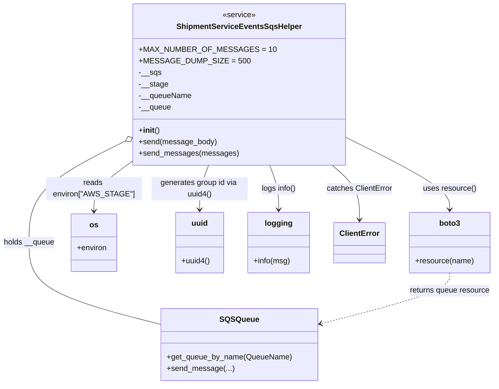

# Diagram: partview_core/partview_service/partview_service/api/part/helpers/ShipmentServiceEventsSqsHelper.py

> Auto-generated by Obscura crawlers

## Mermaid

### SVG

<svg id="container" width="1022.87109375" xmlns="http://www.w3.org/2000/svg" class="classDiagram" height="800" viewBox="0 0 1022.87109375 800" role="graphics-document document" aria-roledescription="class"><g><defs><marker id="container_class-aggregationStart" class="marker aggregation class" refX="18" refY="7" markerWidth="190" markerHeight="240" orient="auto"><path d="M 18,7 L9,13 L1,7 L9,1 Z"></path></marker></defs><defs><marker id="container_class-aggregationEnd" class="marker aggregation class" refX="1" refY="7" markerWidth="20" markerHeight="28" orient="auto"><path d="M 18,7 L9,13 L1,7 L9,1 Z"></path></marker></defs><defs><marker id="container_class-extensionStart" class="marker extension class" refX="18" refY="7" markerWidth="190" markerHeight="240" orient="auto"><path d="M 1,7 L18,13 V 1 Z"></path></marker></defs><defs><marker id="container_class-extensionEnd" class="marker extension class" refX="1" refY="7" markerWidth="20" markerHeight="28" orient="auto"><path d="M 1,1 V 13 L18,7 Z"></path></marker></defs><defs><marker id="container_class-compositionStart" class="marker composition class" refX="18" refY="7" markerWidth="190" markerHeight="240" orient="auto"><path d="M 18,7 L9,13 L1,7 L9,1 Z"></path></marker></defs><defs><marker id="container_class-compositionEnd" class="marker composition class" refX="1" refY="7" markerWidth="20" markerHeight="28" orient="auto"><path d="M 18,7 L9,13 L1,7 L9,1 Z"></path></marker></defs><defs><marker id="container_class-dependencyStart" class="marker dependency class" refX="6" refY="7" markerWidth="190" markerHeight="240" orient="auto"><path d="M 5,7 L9,13 L1,7 L9,1 Z"></path></marker></defs><defs><marker id="container_class-dependencyEnd" class="marker dependency class" refX="13" refY="7" markerWidth="20" markerHeight="28" orient="auto"><path d="M 18,7 L9,13 L14,7 L9,1 Z"></path></marker></defs><defs><marker id="container_class-lollipopStart" class="marker lollipop class" refX="13" refY="7" markerWidth="190" markerHeight="240" orient="auto"><circle stroke="black" fill="transparent" cx="7" cy="7" r="6"></circle></marker></defs><defs><marker id="container_class-lollipopEnd" class="marker lollipop class" refX="1" refY="7" markerWidth="190" markerHeight="240" orient="auto"><circle stroke="black" fill="transparent" cx="7" cy="7" r="6"></circle></marker></defs><g class="root"><g class="clusters"></g><g class="edgePaths"><path d="M696.861,275.563L735.785,295.136C774.708,314.709,852.555,353.854,891.479,380.594C930.402,407.333,930.402,421.667,930.402,428.833L930.402,436" id="id_ShipmentServiceEventsSqsHelper_boto3_1" class="edge-thickness-normal edge-pattern-solid relation" style=";;;" data-edge="true" data-et="edge" data-id="id_ShipmentServiceEventsSqsHelper_boto3_1" data-points="W3sieCI6Njk2Ljg2MTMyODEyNSwieSI6Mjc1LjU2MzA1MzU4Mjk4NTk2fSx7IngiOjkzMC40MDIzNDM3NSwieSI6MzkzfSx7IngiOjkzMC40MDIzNDM3NSwieSI6NDQyfV0=" marker-end="url(#container_class-dependencyEnd)"></path><path d="M300.869,318.364L283.569,330.803C266.268,343.242,231.667,368.121,214.367,388.227C197.066,408.333,197.066,423.667,197.066,431.333L197.066,439" id="id_ShipmentServiceEventsSqsHelper_os_2" class="edge-thickness-normal edge-pattern-solid relation" style=";;;" data-edge="true" data-et="edge" data-id="id_ShipmentServiceEventsSqsHelper_os_2" data-points="W3sieCI6MzAwLjg2OTE0MDYyNSwieSI6MzE4LjM2MzU0OTI5MTAzNDl9LHsieCI6MTk3LjA2NjQwNjI1LCJ5IjozOTN9LHsieCI6MTk3LjA2NjQwNjI1LCJ5Ijo0NDV9XQ==" marker-end="url(#container_class-dependencyEnd)"></path><path d="M435.537,344L432.459,352.167C429.38,360.333,423.223,376.667,420.145,392C417.066,407.333,417.066,421.667,417.066,428.833L417.066,436" id="id_ShipmentServiceEventsSqsHelper_uuid_3" class="edge-thickness-normal edge-pattern-solid relation" style=";;;" data-edge="true" data-et="edge" data-id="id_ShipmentServiceEventsSqsHelper_uuid_3" data-points="W3sieCI6NDM1LjUzNzEwOTM3NSwieSI6MzQ0fSx7IngiOjQxNy4wNjY0MDYyNSwieSI6MzkzfSx7IngiOjQxNy4wNjY0MDYyNSwieSI6NDQyfV0=" marker-end="url(#container_class-dependencyEnd)"></path><path d="M562.193,344L565.272,352.167C568.35,360.333,574.507,376.667,577.586,392C580.664,407.333,580.664,421.667,580.664,428.833L580.664,436" id="id_ShipmentServiceEventsSqsHelper_logging_4" class="edge-thickness-normal edge-pattern-solid relation" style=";;;" data-edge="true" data-et="edge" data-id="id_ShipmentServiceEventsSqsHelper_logging_4" data-points="W3sieCI6NTYyLjE5MzM1OTM3NSwieSI6MzQ0fSx7IngiOjU4MC42NjQwNjI1LCJ5IjozOTN9LHsieCI6NTgwLjY2NDA2MjUsInkiOjQ0Mn1d" marker-end="url(#container_class-dependencyEnd)"></path><path d="M690.062,344L699.357,352.167C708.651,360.333,727.24,376.667,736.534,395.5C745.828,414.333,745.828,435.667,745.828,446.333L745.828,457" id="id_ShipmentServiceEventsSqsHelper_ClientError_5" class="edge-thickness-normal edge-pattern-solid relation" style=";;;" data-edge="true" data-et="edge" data-id="id_ShipmentServiceEventsSqsHelper_ClientError_5" data-points="W3sieCI6NjkwLjA2MjMxMDk4NzkwMzIsInkiOjM0NH0seyJ4Ijo3NDUuODI4MTI1LCJ5IjozOTN9LHsieCI6NzQ1LjgyODEyNSwieSI6NDYzfV0=" marker-end="url(#container_class-dependencyEnd)"></path><path d="M285.414,281.832L248.046,300.36C210.677,318.888,135.94,355.944,98.572,393.139C61.203,430.333,61.203,467.667,61.203,503C61.203,538.333,61.203,571.667,107.004,600.137C152.805,628.607,244.408,652.213,290.209,664.017L336.01,675.82" id="id_ShipmentServiceEventsSqsHelper_SQSQueue_6" class="edge-thickness-normal edge-pattern-solid relation" style=";;;" data-edge="true" data-et="edge" data-id="id_ShipmentServiceEventsSqsHelper_SQSQueue_6" data-points="W3sieCI6MzAwLjg2OTE0MDYyNSwieSI6Mjc0LjE2OTY4NzEyNDg2fSx7IngiOjYxLjIwMzEyNSwieSI6MzkzfSx7IngiOjYxLjIwMzEyNSwieSI6NTA1fSx7IngiOjYxLjIwMzEyNSwieSI6NjA1fSx7IngiOjMzNi4wMDk3NjU2MjUsInkiOjY3NS44MTk5OTg2NTE3NzYyfV0=" marker-start="url(#container_class-aggregationStart)"></path><path d="M930.402,568L930.402,574.167C930.402,580.333,930.402,592.667,885.57,610.387C840.737,628.108,751.071,651.215,706.239,662.769L661.406,674.323" id="id_boto3_SQSQueue_7" class="edge-thickness-normal edge-pattern-dashed relation" style=";;;" data-edge="true" data-et="edge" data-id="id_boto3_SQSQueue_7" data-points="W3sieCI6OTMwLjQwMjM0Mzc1LCJ5Ijo1Njh9LHsieCI6OTMwLjQwMjM0Mzc1LCJ5Ijo2MDV9LHsieCI6NjU1LjU5NTcwMzEyNSwieSI6Njc1LjgxOTk5ODY1MTc3NjJ9XQ==" marker-end="url(#container_class-dependencyEnd)"></path></g><g class="edgeLabels"><g class="edgeLabel" transform="translate(930.40234375, 393)"><g class="label" data-id="id_ShipmentServiceEventsSqsHelper_boto3_1" transform="translate(-54.9375, -12)"><foreignObject width="109.875" height="24">

uses resource()

</foreignObject></g></g><g class="edgeLabel" transform="translate(197.06640625, 393)"><g class="label" data-id="id_ShipmentServiceEventsSqsHelper_os_2" transform="translate(-100, -24)"><foreignObject width="200" height="48">

reads environ["AWS_STAGE"]

</foreignObject></g></g><g class="edgeLabel" transform="translate(417.06640625, 393)"><g class="label" data-id="id_ShipmentServiceEventsSqsHelper_uuid_3" transform="translate(-100, -24)"><foreignObject width="200" height="48">

generates group id via uuid4()

</foreignObject></g></g><g class="edgeLabel" transform="translate(580.6640625, 393)"><g class="label" data-id="id_ShipmentServiceEventsSqsHelper_logging_4" transform="translate(-36.34375, -12)"><foreignObject width="72.6875" height="24">

logs info()

</foreignObject></g></g><g class="edgeLabel" transform="translate(745.828125, 393)"><g class="label" data-id="id_ShipmentServiceEventsSqsHelper_ClientError_5" transform="translate(-68.4296875, -12)"><foreignObject width="136.859375" height="24">

catches ClientError

</foreignObject></g></g><g class="edgeLabel" transform="translate(61.203125, 505)"><g class="label" data-id="id_ShipmentServiceEventsSqsHelper_SQSQueue_6" transform="translate(-53.203125, -12)"><foreignObject width="106.40625" height="24">

holds __queue

</foreignObject></g></g><g class="edgeLabel" transform="translate(930.40234375, 605)"><g class="label" data-id="id_boto3_SQSQueue_7" transform="translate(-84.46875, -12)"><foreignObject width="168.9375" height="24">

returns queue resource

</foreignObject></g></g></g><g class="nodes"><g class="node default" id="classId-ShipmentServiceEventsSqsHelper-0" transform="translate(498.865234375, 176)"><g class="basic label-container"><path d="M-197.99609375 -168 L197.99609375 -168 L197.99609375 168 L-197.99609375 168" stroke="none" stroke-width="0" fill="#ECECFF" style=""></path><path d="M-197.99609375 -168 C-113.65036337816089 -168, -29.30463300632178 -168, 197.99609375 -168 M-197.99609375 -168 C-80.42074399763493 -168, 37.15460575473014 -168, 197.99609375 -168 M197.99609375 -168 C197.99609375 -92.12631806699477, 197.99609375 -16.25263613398954, 197.99609375 168 M197.99609375 -168 C197.99609375 -76.08152241556665, 197.99609375 15.836955168866695, 197.99609375 168 M197.99609375 168 C81.83998728440503 168, -34.31611918118995 168, -197.99609375 168 M197.99609375 168 C73.2154426664144 168, -51.56520841717119 168, -197.99609375 168 M-197.99609375 168 C-197.99609375 91.73004888908675, -197.99609375 15.460097778173491, -197.99609375 -168 M-197.99609375 168 C-197.99609375 86.28836701560287, -197.99609375 4.576734031205746, -197.99609375 -168" stroke="#9370DB" stroke-width="1.3" fill="none" stroke-dasharray="0 0" style=""></path></g><g class="annotation-group text" transform="translate(-34.375, -144)"><g class="label" style="" transform="translate(0,-12)"><foreignObject width="68.75" height="24">

«service»

</foreignObject></g></g><g class="label-group text" transform="translate(-123.5859375, -120)"><g class="label" style="font-weight: bolder" transform="translate(0,-12)"><foreignObject width="247.171875" height="24">

ShipmentServiceEventsSqsHelper

</foreignObject></g></g><g class="members-group text" transform="translate(-185.99609375, -72)"><g class="label" style="" transform="translate(0,-12)"><foreignObject width="248.40625" height="24">

+MAX_NUMBER_OF_MESSAGES = 10

</foreignObject></g><g class="label" style="" transform="translate(0,12)"><foreignObject width="203.734375" height="24">

+MESSAGE_DUMP_SIZE = 500

</foreignObject></g><g class="label" style="" transform="translate(0,36)"><foreignObject width="46.171875" height="24">

-__sqs

</foreignObject></g><g class="label" style="" transform="translate(0,60)"><foreignObject width="60.125" height="24">

-__stage

</foreignObject></g><g class="label" style="" transform="translate(0,84)"><foreignObject width="109.03125" height="24">

-__queueName

</foreignObject></g><g class="label" style="" transform="translate(0,108)"><foreignObject width="66.96875" height="24">

-__queue

</foreignObject></g></g><g class="methods-group text" transform="translate(-185.99609375, 96)"><g class="label" style="" transform="translate(0,-12)"><foreignObject width="42.796875" height="24">

+<strong>init</strong>()

</foreignObject></g><g class="label" style="" transform="translate(0,12)"><foreignObject width="160.171875" height="24">

+send(message_body)

</foreignObject></g><g class="label" style="" transform="translate(0,36)"><foreignObject width="201.53125" height="24">

+send_messages(messages)

</foreignObject></g></g><g class="divider" style=""><path d="M-197.99609375 -96 C-94.13316561471595 -96, 9.729762520568102 -96, 197.99609375 -96 M-197.99609375 -96 C-81.91640704957817 -96, 34.16327965084366 -96, 197.99609375 -96" stroke="#9370DB" stroke-width="1.3" fill="none" stroke-dasharray="0 0" style=""></path></g><g class="divider" style=""><path d="M-197.99609375 72 C-78.6018078269829 72, 40.79247809603419 72, 197.99609375 72 M-197.99609375 72 C-78.53280047747647 72, 40.93049279504706 72, 197.99609375 72" stroke="#9370DB" stroke-width="1.3" fill="none" stroke-dasharray="0 0" style=""></path></g></g><g class="node default" id="classId-boto3-1" transform="translate(930.40234375, 505)"><g class="basic label-container"><path d="M-83.11328125 -63 L83.11328125 -63 L83.11328125 63 L-83.11328125 63" stroke="none" stroke-width="0" fill="#ECECFF" style=""></path><path d="M-83.11328125 -63 C-36.084608915833854 -63, 10.944063418332291 -63, 83.11328125 -63 M-83.11328125 -63 C-16.823483803678158 -63, 49.466313642643684 -63, 83.11328125 -63 M83.11328125 -63 C83.11328125 -14.254927001619123, 83.11328125 34.490145996761754, 83.11328125 63 M83.11328125 -63 C83.11328125 -25.981626750040235, 83.11328125 11.03674649991953, 83.11328125 63 M83.11328125 63 C43.832957740122396 63, 4.5526342302447915 63, -83.11328125 63 M83.11328125 63 C17.96882730595189 63, -47.17562663809622 63, -83.11328125 63 M-83.11328125 63 C-83.11328125 34.5909617705874, -83.11328125 6.181923541174804, -83.11328125 -63 M-83.11328125 63 C-83.11328125 31.956089748249994, -83.11328125 0.9121794964999879, -83.11328125 -63" stroke="#9370DB" stroke-width="1.3" fill="none" stroke-dasharray="0 0" style=""></path></g><g class="annotation-group text" transform="translate(0, -39)"></g><g class="label-group text" transform="translate(-21.0703125, -39)"><g class="label" style="font-weight: bolder" transform="translate(0,-12)"><foreignObject width="42.140625" height="24">

boto3

</foreignObject></g></g><g class="members-group text" transform="translate(-71.11328125, 9)"></g><g class="methods-group text" transform="translate(-71.11328125, 39)"><g class="label" style="" transform="translate(0,-12)"><foreignObject width="121.15625" height="24">

+resource(name)

</foreignObject></g></g><g class="divider" style=""><path d="M-83.11328125 -15 C-34.51022332540386 -15, 14.092834599192287 -15, 83.11328125 -15 M-83.11328125 -15 C-21.15818828577251 -15, 40.79690467845498 -15, 83.11328125 -15" stroke="#9370DB" stroke-width="1.3" fill="none" stroke-dasharray="0 0" style=""></path></g><g class="divider" style=""><path d="M-83.11328125 9 C-25.986103878544178 9, 31.141073492911644 9, 83.11328125 9 M-83.11328125 9 C-22.620169270037557 9, 37.872942709924885 9, 83.11328125 9" stroke="#9370DB" stroke-width="1.3" fill="none" stroke-dasharray="0 0" style=""></path></g></g><g class="node default" id="classId-os-2" transform="translate(197.06640625, 505)"><g class="basic label-container"><path d="M-47.66015625 -60 L47.66015625 -60 L47.66015625 60 L-47.66015625 60" stroke="none" stroke-width="0" fill="#ECECFF" style=""></path><path d="M-47.66015625 -60 C-16.143039338089878 -60, 15.374077573820244 -60, 47.66015625 -60 M-47.66015625 -60 C-18.991948668665795 -60, 9.676258912668409 -60, 47.66015625 -60 M47.66015625 -60 C47.66015625 -27.86498544771608, 47.66015625 4.27002910456784, 47.66015625 60 M47.66015625 -60 C47.66015625 -33.593945494461906, 47.66015625 -7.187890988923819, 47.66015625 60 M47.66015625 60 C26.93586854877548 60, 6.211580847550962 60, -47.66015625 60 M47.66015625 60 C23.715987745542563 60, -0.2281807589148741 60, -47.66015625 60 M-47.66015625 60 C-47.66015625 13.183882392072725, -47.66015625 -33.63223521585455, -47.66015625 -60 M-47.66015625 60 C-47.66015625 17.754611692519127, -47.66015625 -24.490776614961746, -47.66015625 -60" stroke="#9370DB" stroke-width="1.3" fill="none" stroke-dasharray="0 0" style=""></path></g><g class="annotation-group text" transform="translate(0, -36)"></g><g class="label-group text" transform="translate(-8.5390625, -36)"><g class="label" style="font-weight: bolder" transform="translate(0,-12)"><foreignObject width="17.078125" height="24">

os

</foreignObject></g></g><g class="members-group text" transform="translate(-35.66015625, 12)"><g class="label" style="" transform="translate(0,-12)"><foreignObject width="62.78125" height="24">

+environ

</foreignObject></g></g><g class="methods-group text" transform="translate(-35.66015625, 60)"></g><g class="divider" style=""><path d="M-47.66015625 -12 C-18.552904991438133 -12, 10.554346267123734 -12, 47.66015625 -12 M-47.66015625 -12 C-17.129779099773977 -12, 13.400598050452047 -12, 47.66015625 -12" stroke="#9370DB" stroke-width="1.3" fill="none" stroke-dasharray="0 0" style=""></path></g><g class="divider" style=""><path d="M-47.66015625 36 C-24.428482700262006 36, -1.196809150524011 36, 47.66015625 36 M-47.66015625 36 C-19.145042792987883 36, 9.370070664024233 36, 47.66015625 36" stroke="#9370DB" stroke-width="1.3" fill="none" stroke-dasharray="0 0" style=""></path></g></g><g class="node default" id="classId-uuid-3" transform="translate(417.06640625, 505)"><g class="basic label-container"><path d="M-49.89453125 -63 L49.89453125 -63 L49.89453125 63 L-49.89453125 63" stroke="none" stroke-width="0" fill="#ECECFF" style=""></path><path d="M-49.89453125 -63 C-28.387787653270458 -63, -6.881044056540915 -63, 49.89453125 -63 M-49.89453125 -63 C-26.038298721891127 -63, -2.182066193782255 -63, 49.89453125 -63 M49.89453125 -63 C49.89453125 -23.473759560761017, 49.89453125 16.052480878477965, 49.89453125 63 M49.89453125 -63 C49.89453125 -37.598150724687926, 49.89453125 -12.196301449375852, 49.89453125 63 M49.89453125 63 C19.251144556313065 63, -11.39224213737387 63, -49.89453125 63 M49.89453125 63 C22.091013349758573 63, -5.712504550482855 63, -49.89453125 63 M-49.89453125 63 C-49.89453125 34.036902129087686, -49.89453125 5.073804258175372, -49.89453125 -63 M-49.89453125 63 C-49.89453125 14.533999037167568, -49.89453125 -33.93200192566486, -49.89453125 -63" stroke="#9370DB" stroke-width="1.3" fill="none" stroke-dasharray="0 0" style=""></path></g><g class="annotation-group text" transform="translate(0, -39)"></g><g class="label-group text" transform="translate(-16.2109375, -39)"><g class="label" style="font-weight: bolder" transform="translate(0,-12)"><foreignObject width="32.421875" height="24">

uuid

</foreignObject></g></g><g class="members-group text" transform="translate(-37.89453125, 9)"></g><g class="methods-group text" transform="translate(-37.89453125, 39)"><g class="label" style="" transform="translate(0,-12)"><foreignObject width="59.578125" height="24">

+uuid4()

</foreignObject></g></g><g class="divider" style=""><path d="M-49.89453125 -15 C-14.900897717655639 -15, 20.092735814688723 -15, 49.89453125 -15 M-49.89453125 -15 C-25.676272231593032 -15, -1.4580132131860637 -15, 49.89453125 -15" stroke="#9370DB" stroke-width="1.3" fill="none" stroke-dasharray="0 0" style=""></path></g><g class="divider" style=""><path d="M-49.89453125 9 C-21.591566723085506 9, 6.711397803828987 9, 49.89453125 9 M-49.89453125 9 C-23.440418566221364 9, 3.0136941175572716 9, 49.89453125 9" stroke="#9370DB" stroke-width="1.3" fill="none" stroke-dasharray="0 0" style=""></path></g></g><g class="node default" id="classId-logging-4" transform="translate(580.6640625, 505)"><g class="basic label-container"><path d="M-63.703125 -63 L63.703125 -63 L63.703125 63 L-63.703125 63" stroke="none" stroke-width="0" fill="#ECECFF" style=""></path><path d="M-63.703125 -63 C-24.46167930049421 -63, 14.779766399011578 -63, 63.703125 -63 M-63.703125 -63 C-30.234225752297334 -63, 3.2346734954053318 -63, 63.703125 -63 M63.703125 -63 C63.703125 -15.617557787017738, 63.703125 31.764884425964524, 63.703125 63 M63.703125 -63 C63.703125 -19.487532406420023, 63.703125 24.024935187159954, 63.703125 63 M63.703125 63 C29.169678752666577 63, -5.363767494666845 63, -63.703125 63 M63.703125 63 C30.249934376817833 63, -3.203256246364333 63, -63.703125 63 M-63.703125 63 C-63.703125 24.592698001880727, -63.703125 -13.814603996238546, -63.703125 -63 M-63.703125 63 C-63.703125 15.81575539624, -63.703125 -31.36848920752, -63.703125 -63" stroke="#9370DB" stroke-width="1.3" fill="none" stroke-dasharray="0 0" style=""></path></g><g class="annotation-group text" transform="translate(0, -39)"></g><g class="label-group text" transform="translate(-27.109375, -39)"><g class="label" style="font-weight: bolder" transform="translate(0,-12)"><foreignObject width="54.21875" height="24">

logging

</foreignObject></g></g><g class="members-group text" transform="translate(-51.703125, 9)"></g><g class="methods-group text" transform="translate(-51.703125, 39)"><g class="label" style="" transform="translate(0,-12)"><foreignObject width="76.296875" height="24">

+info(msg)

</foreignObject></g></g><g class="divider" style=""><path d="M-63.703125 -15 C-20.28557812138733 -15, 23.131968757225337 -15, 63.703125 -15 M-63.703125 -15 C-23.16509752158683 -15, 17.37292995682634 -15, 63.703125 -15" stroke="#9370DB" stroke-width="1.3" fill="none" stroke-dasharray="0 0" style=""></path></g><g class="divider" style=""><path d="M-63.703125 9 C-25.76100148032429 9, 12.181122039351422 9, 63.703125 9 M-63.703125 9 C-12.827319337086621 9, 38.04848632582676 9, 63.703125 9" stroke="#9370DB" stroke-width="1.3" fill="none" stroke-dasharray="0 0" style=""></path></g></g><g class="node default" id="classId-ClientError-5" transform="translate(745.828125, 505)"><g class="basic label-container"><path d="M-51.4609375 -42 L51.4609375 -42 L51.4609375 42 L-51.4609375 42" stroke="none" stroke-width="0" fill="#ECECFF" style=""></path><path d="M-51.4609375 -42 C-22.177033155875733 -42, 7.106871188248533 -42, 51.4609375 -42 M-51.4609375 -42 C-16.366222571087732 -42, 18.728492357824535 -42, 51.4609375 -42 M51.4609375 -42 C51.4609375 -21.12821425278051, 51.4609375 -0.2564285055610185, 51.4609375 42 M51.4609375 -42 C51.4609375 -22.14256731642731, 51.4609375 -2.2851346328546214, 51.4609375 42 M51.4609375 42 C28.01908182393081 42, 4.577226147861623 42, -51.4609375 42 M51.4609375 42 C15.295991708988836 42, -20.868954082022327 42, -51.4609375 42 M-51.4609375 42 C-51.4609375 10.36309735926097, -51.4609375 -21.27380528147806, -51.4609375 -42 M-51.4609375 42 C-51.4609375 11.264488452583926, -51.4609375 -19.471023094832148, -51.4609375 -42" stroke="#9370DB" stroke-width="1.3" fill="none" stroke-dasharray="0 0" style=""></path></g><g class="annotation-group text" transform="translate(0, -18)"></g><g class="label-group text" transform="translate(-39.4609375, -18)"><g class="label" style="font-weight: bolder" transform="translate(0,-12)"><foreignObject width="78.921875" height="24">

ClientError

</foreignObject></g></g><g class="members-group text" transform="translate(-39.4609375, 30)"></g><g class="methods-group text" transform="translate(-39.4609375, 60)"></g><g class="divider" style=""><path d="M-51.4609375 6 C-14.268797049773411 6, 22.923343400453177 6, 51.4609375 6 M-51.4609375 6 C-16.522938233616614 6, 18.415061032766772 6, 51.4609375 6" stroke="#9370DB" stroke-width="1.3" fill="none" stroke-dasharray="0 0" style=""></path></g><g class="divider" style=""><path d="M-51.4609375 24 C-21.270213934034224 24, 8.920509631931552 24, 51.4609375 24 M-51.4609375 24 C-17.232267856433552 24, 16.996401787132896 24, 51.4609375 24" stroke="#9370DB" stroke-width="1.3" fill="none" stroke-dasharray="0 0" style=""></path></g></g><g class="node default" id="classId-SQSQueue-6" transform="translate(495.802734375, 717)"><g class="basic label-container"><path d="M-159.79296875 -75 L159.79296875 -75 L159.79296875 75 L-159.79296875 75" stroke="none" stroke-width="0" fill="#ECECFF" style=""></path><path d="M-159.79296875 -75 C-59.35030838117919 -75, 41.09235198764162 -75, 159.79296875 -75 M-159.79296875 -75 C-77.33420721932303 -75, 5.124554311353933 -75, 159.79296875 -75 M159.79296875 -75 C159.79296875 -23.106511108542513, 159.79296875 28.786977782914974, 159.79296875 75 M159.79296875 -75 C159.79296875 -41.24002546797257, 159.79296875 -7.480050935945144, 159.79296875 75 M159.79296875 75 C42.77081370872388 75, -74.25134133255224 75, -159.79296875 75 M159.79296875 75 C56.381173079178865 75, -47.03062259164227 75, -159.79296875 75 M-159.79296875 75 C-159.79296875 34.059240356512205, -159.79296875 -6.881519286975589, -159.79296875 -75 M-159.79296875 75 C-159.79296875 29.58762731154198, -159.79296875 -15.824745376916042, -159.79296875 -75" stroke="#9370DB" stroke-width="1.3" fill="none" stroke-dasharray="0 0" style=""></path></g><g class="annotation-group text" transform="translate(0, -51)"></g><g class="label-group text" transform="translate(-38.1796875, -51)"><g class="label" style="font-weight: bolder" transform="translate(0,-12)"><foreignObject width="76.359375" height="24">

SQSQueue

</foreignObject></g></g><g class="members-group text" transform="translate(-147.79296875, -3)"></g><g class="methods-group text" transform="translate(-147.79296875, 27)"><g class="label" style="" transform="translate(0,-12)"><foreignObject width="257.40625" height="24">

+get_queue_by_name(QueueName)

</foreignObject></g><g class="label" style="" transform="translate(0,12)"><foreignObject width="135.71875" height="24">

+send_message(...)

</foreignObject></g></g><g class="divider" style=""><path d="M-159.79296875 -27 C-32.63369659498589 -27, 94.52557556002822 -27, 159.79296875 -27 M-159.79296875 -27 C-36.070225673155875 -27, 87.65251740368825 -27, 159.79296875 -27" stroke="#9370DB" stroke-width="1.3" fill="none" stroke-dasharray="0 0" style=""></path></g><g class="divider" style=""><path d="M-159.79296875 -3 C-54.03338780927916 -3, 51.726193131441676 -3, 159.79296875 -3 M-159.79296875 -3 C-56.05229485158243 -3, 47.68837904683514 -3, 159.79296875 -3" stroke="#9370DB" stroke-width="1.3" fill="none" stroke-dasharray="0 0" style=""></path></g></g></g></g></g></svg>
