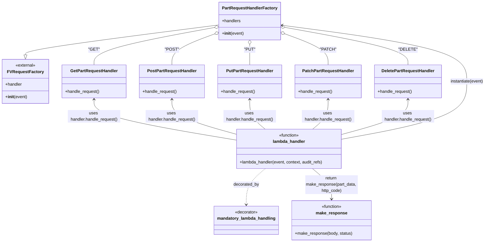

# Diagram: partview_core/partview_service/partview_service/api/part/part.py

> Auto-generated by Obscura crawlers

## Mermaid

### SVG

<svg id="container" width="1837.7421875" xmlns="http://www.w3.org/2000/svg" class="classDiagram" height="922" viewBox="0 0 1837.7421875 922" role="graphics-document document" aria-roledescription="class"><g><defs><marker id="container_class-aggregationStart" class="marker aggregation class" refX="18" refY="7" markerWidth="190" markerHeight="240" orient="auto"><path d="M 18,7 L9,13 L1,7 L9,1 Z"></path></marker></defs><defs><marker id="container_class-aggregationEnd" class="marker aggregation class" refX="1" refY="7" markerWidth="20" markerHeight="28" orient="auto"><path d="M 18,7 L9,13 L1,7 L9,1 Z"></path></marker></defs><defs><marker id="container_class-extensionStart" class="marker extension class" refX="18" refY="7" markerWidth="190" markerHeight="240" orient="auto"><path d="M 1,7 L18,13 V 1 Z"></path></marker></defs><defs><marker id="container_class-extensionEnd" class="marker extension class" refX="1" refY="7" markerWidth="20" markerHeight="28" orient="auto"><path d="M 1,1 V 13 L18,7 Z"></path></marker></defs><defs><marker id="container_class-compositionStart" class="marker composition class" refX="18" refY="7" markerWidth="190" markerHeight="240" orient="auto"><path d="M 18,7 L9,13 L1,7 L9,1 Z"></path></marker></defs><defs><marker id="container_class-compositionEnd" class="marker composition class" refX="1" refY="7" markerWidth="20" markerHeight="28" orient="auto"><path d="M 18,7 L9,13 L1,7 L9,1 Z"></path></marker></defs><defs><marker id="container_class-dependencyStart" class="marker dependency class" refX="6" refY="7" markerWidth="190" markerHeight="240" orient="auto"><path d="M 5,7 L9,13 L1,7 L9,1 Z"></path></marker></defs><defs><marker id="container_class-dependencyEnd" class="marker dependency class" refX="13" refY="7" markerWidth="20" markerHeight="28" orient="auto"><path d="M 18,7 L9,13 L14,7 L9,1 Z"></path></marker></defs><defs><marker id="container_class-lollipopStart" class="marker lollipop class" refX="13" refY="7" markerWidth="190" markerHeight="240" orient="auto"><circle stroke="black" fill="transparent" cx="7" cy="7" r="6"></circle></marker></defs><defs><marker id="container_class-lollipopEnd" class="marker lollipop class" refX="1" refY="7" markerWidth="190" markerHeight="240" orient="auto"><circle stroke="black" fill="transparent" cx="7" cy="7" r="6"></circle></marker></defs><g class="root"><g class="clusters"></g><g class="edgePaths"><path d="M827.672,94.519L705.408,110.266C583.145,126.013,338.617,157.506,216.354,176.545C94.09,195.583,94.09,202.167,94.09,205.458L94.09,208.75" id="id_PartRequestHandlerFactory_FVRequestFactory_1" class="edge-thickness-normal edge-pattern-solid relation" style=";;;" data-edge="true" data-et="edge" data-id="id_PartRequestHandlerFactory_FVRequestFactory_1" data-points="W3sieCI6ODI3LjY3MTg3NSwieSI6OTQuNTE5NDQ3NzkwNzQ3NTl9LHsieCI6OTQuMDg5ODQzNzUsInkiOjE4OX0seyJ4Ijo5NC4wODk4NDM3NSwieSI6MjI2fV0=" marker-end="url(#container_class-extensionEnd)"></path><path d="M810.71,104.008L734.185,118.173C657.661,132.339,504.612,160.669,428.087,184.501C351.563,208.333,351.563,227.667,351.563,237.333L351.563,247" id="id_PartRequestHandlerFactory_GetPartRequestHandler_2" class="edge-thickness-normal edge-pattern-solid relation" style=";;;" data-edge="true" data-et="edge" data-id="id_PartRequestHandlerFactory_GetPartRequestHandler_2" data-points="W3sieCI6ODI3LjY3MTg3NSwieSI6MTAwLjg2ODA5NDI1MjUwNzU2fSx7IngiOjM1MS41NjI1LCJ5IjoxODl9LHsieCI6MzUxLjU2MjUsInkiOjI0N31d" marker-start="url(#container_class-aggregationStart)"></path><path d="M811.496,127.741L783.927,137.951C756.359,148.161,701.222,168.58,673.654,188.457C646.086,208.333,646.086,227.667,646.086,237.333L646.086,247" id="id_PartRequestHandlerFactory_PostPartRequestHandler_3" class="edge-thickness-normal edge-pattern-solid relation" style=";;;" data-edge="true" data-et="edge" data-id="id_PartRequestHandlerFactory_PostPartRequestHandler_3" data-points="W3sieCI6ODI3LjY3MTg3NSwieSI6MTIxLjc1MDU5MDYwODY1ODcxfSx7IngiOjY0Ni4wODU5Mzc1LCJ5IjoxODl9LHsieCI6NjQ2LjA4NTkzNzUsInkiOjI0N31d" marker-start="url(#container_class-aggregationStart)"></path><path d="M940.406,169.25L940.406,172.542C940.406,175.833,940.406,182.417,940.406,195.375C940.406,208.333,940.406,227.667,940.406,237.333L940.406,247" id="id_PartRequestHandlerFactory_PutPartRequestHandler_4" class="edge-thickness-normal edge-pattern-solid relation" style=";;;" data-edge="true" data-et="edge" data-id="id_PartRequestHandlerFactory_PutPartRequestHandler_4" data-points="W3sieCI6OTQwLjQwNjI1LCJ5IjoxNTJ9LHsieCI6OTQwLjQwNjI1LCJ5IjoxODl9LHsieCI6OTQwLjQwNjI1LCJ5IjoyNDd9XQ==" marker-start="url(#container_class-aggregationStart)"></path><path d="M1069.33,127.426L1097.227,137.688C1125.125,147.951,1180.92,168.475,1208.817,188.404C1236.715,208.333,1236.715,227.667,1236.715,237.333L1236.715,247" id="id_PartRequestHandlerFactory_PatchPartRequestHandler_5" class="edge-thickness-normal edge-pattern-solid relation" style=";;;" data-edge="true" data-et="edge" data-id="id_PartRequestHandlerFactory_PatchPartRequestHandler_5" data-points="W3sieCI6MTA1My4xNDA2MjUsInkiOjEyMS40NzA0MzcwMTc5OTQ4N30seyJ4IjoxMjM2LjcxNDg0Mzc1LCJ5IjoxODl9LHsieCI6MTIzNi43MTQ4NDM3NSwieSI6MjQ3fV0=" marker-start="url(#container_class-aggregationStart)"></path><path d="M1070.111,103.628L1148.22,117.857C1226.328,132.085,1382.545,160.543,1460.653,184.438C1538.762,208.333,1538.762,227.667,1538.762,237.333L1538.762,247" id="id_PartRequestHandlerFactory_DeletePartRequestHandler_6" class="edge-thickness-normal edge-pattern-solid relation" style=";;;" data-edge="true" data-et="edge" data-id="id_PartRequestHandlerFactory_DeletePartRequestHandler_6" data-points="W3sieCI6MTA1My4xNDA2MjUsInkiOjEwMC41MzYzNjU5NTA5NDYyOH0seyJ4IjoxNTM4Ljc2MTcxODc1LCJ5IjoxODl9LHsieCI6MTUzOC43NjE3MTg3NSwieSI6MjQ3fV0=" marker-start="url(#container_class-aggregationStart)"></path><path d="M1000.284,642L988.318,652.167C976.352,662.333,952.419,682.667,940.453,705.5C928.486,728.333,928.486,753.667,928.486,766.333L928.486,779" id="id_lambda_handler_mandatory_lambda_handling_7" class="edge-thickness-normal edge-pattern-dashed relation" style=";;;" data-edge="true" data-et="edge" data-id="id_lambda_handler_mandatory_lambda_handling_7" data-points="W3sieCI6MTAwMC4yODQzMjMyOTk2MzIzLCJ5Ijo2NDJ9LHsieCI6OTI4LjQ4NjMyODEyNSwieSI6NzAzfSx7IngiOjkyOC40ODYzMjgxMjUsInkiOjc4NX1d" marker-end="url(#container_class-dependencyEnd)"></path><path d="M1291.393,529.83L1370.362,515.358C1449.332,500.887,1607.271,471.943,1686.241,435.305C1765.211,398.667,1765.211,354.333,1765.211,312C1765.211,269.667,1765.211,229.333,1647.524,193.614C1529.837,157.895,1294.463,126.789,1176.776,111.237L1059.089,95.684" id="id_lambda_handler_PartRequestHandlerFactory_8" class="edge-thickness-normal edge-pattern-solid relation" style=";;;" data-edge="true" data-et="edge" data-id="id_lambda_handler_PartRequestHandlerFactory_8" data-points="W3sieCI6MTI5MS4zOTI1NzgxMjUsInkiOjUyOS44Mjk4ODY0MTc3NTc1fSx7IngiOjE3NjUuMjEwOTM3NSwieSI6NDQzfSx7IngiOjE3NjUuMjEwOTM3NSwieSI6MzEwfSx7IngiOjE3NjUuMjEwOTM3NSwieSI6MTg5fSx7IngiOjEwNTMuMTQwNjI1LCJ5Ijo5NC44OTgxMjkyOTE5NzI1NH1d" marker-end="url(#container_class-dependencyEnd)"></path><path d="M1176.837,642L1188.803,652.167C1200.769,662.333,1224.702,682.667,1236.668,702C1248.635,721.333,1248.635,739.667,1248.635,748.833L1248.635,758" id="id_lambda_handler_make_response_9" class="edge-thickness-normal edge-pattern-solid relation" style=";;;" data-edge="true" data-et="edge" data-id="id_lambda_handler_make_response_9" data-points="W3sieCI6MTE3Ni44MzY3NzA0NTAzNjc2LCJ5Ijo2NDJ9LHsieCI6MTI0OC42MzQ3NjU2MjUsInkiOjcwM30seyJ4IjoxMjQ4LjYzNDc2NTYyNSwieSI6NzY0fV0=" marker-end="url(#container_class-dependencyEnd)"></path><path d="M351.563,379L351.563,389.667C351.563,400.333,351.563,421.667,440.59,447.312C529.618,472.958,707.673,502.916,796.701,517.895L885.729,532.873" id="id_GetPartRequestHandler_lambda_handler_10" class="edge-thickness-normal edge-pattern-solid relation" style=";;;" data-edge="true" data-et="edge" data-id="id_GetPartRequestHandler_lambda_handler_10" data-points="W3sieCI6MzUxLjU2MjUsInkiOjM3M30seyJ4IjozNTEuNTYyNSwieSI6NDQzfSx7IngiOjg4NS43Mjg1MTU2MjUsInkiOjUzMi44NzM0ODkxMDY3Mjc4fV0=" marker-start="url(#container_class-dependencyStart)"></path><path d="M646.086,379L646.086,389.667C646.086,400.333,646.086,421.667,686.026,443.526C725.967,465.386,805.848,487.772,845.788,498.965L885.729,510.158" id="id_PostPartRequestHandler_lambda_handler_11" class="edge-thickness-normal edge-pattern-solid relation" style=";;;" data-edge="true" data-et="edge" data-id="id_PostPartRequestHandler_lambda_handler_11" data-points="W3sieCI6NjQ2LjA4NTkzNzUsInkiOjM3M30seyJ4Ijo2NDYuMDg1OTM3NSwieSI6NDQzfSx7IngiOjg4NS43Mjg1MTU2MjUsInkiOjUxMC4xNTc5MzE5MDgxNjkyfV0=" marker-start="url(#container_class-dependencyStart)"></path><path d="M940.406,379L940.406,389.667C940.406,400.333,940.406,421.667,950.164,440.5C959.921,459.333,979.436,475.667,989.194,483.833L998.951,492" id="id_PutPartRequestHandler_lambda_handler_12" class="edge-thickness-normal edge-pattern-solid relation" style=";;;" data-edge="true" data-et="edge" data-id="id_PutPartRequestHandler_lambda_handler_12" data-points="W3sieCI6OTQwLjQwNjI1LCJ5IjozNzN9LHsieCI6OTQwLjQwNjI1LCJ5Ijo0NDN9LHsieCI6OTk4Ljk1MTA5MzExOTk1OTYsInkiOjQ5Mn1d" marker-start="url(#container_class-dependencyStart)"></path><path d="M1236.715,379L1236.715,389.667C1236.715,400.333,1236.715,421.667,1226.957,440.5C1217.2,459.333,1197.685,475.667,1187.927,483.833L1178.17,492" id="id_PatchPartRequestHandler_lambda_handler_13" class="edge-thickness-normal edge-pattern-solid relation" style=";;;" data-edge="true" data-et="edge" data-id="id_PatchPartRequestHandler_lambda_handler_13" data-points="W3sieCI6MTIzNi43MTQ4NDM3NSwieSI6MzczfSx7IngiOjEyMzYuNzE0ODQzNzUsInkiOjQ0M30seyJ4IjoxMTc4LjE3MDAwMDYzMDA0MDIsInkiOjQ5Mn1d" marker-start="url(#container_class-dependencyStart)"></path><path d="M1538.762,379L1538.762,389.667C1538.762,400.333,1538.762,421.667,1497.534,443.689C1456.305,465.711,1373.849,488.422,1332.621,499.778L1291.393,511.133" id="id_DeletePartRequestHandler_lambda_handler_14" class="edge-thickness-normal edge-pattern-solid relation" style=";;;" data-edge="true" data-et="edge" data-id="id_DeletePartRequestHandler_lambda_handler_14" data-points="W3sieCI6MTUzOC43NjE3MTg3NSwieSI6MzczfSx7IngiOjE1MzguNzYxNzE4NzUsInkiOjQ0M30seyJ4IjoxMjkxLjM5MjU3ODEyNSwieSI6NTExLjEzMzQ4MTk5MzcyNjh9XQ==" marker-start="url(#container_class-dependencyStart)"></path></g><g class="edgeLabels"><g class="edgeLabel"><g class="label" data-id="id_PartRequestHandlerFactory_FVRequestFactory_1" transform="translate(0, 0)"><foreignObject width="0" height="0">

</foreignObject></g></g><g class="edgeLabel" transform="translate(351.5625, 189)"><g class="label" data-id="id_PartRequestHandlerFactory_GetPartRequestHandler_2" transform="translate(-19.9296875, -12)"><foreignObject width="39.859375" height="24">

"GET"

</foreignObject></g></g><g class="edgeLabel" transform="translate(646.0859375, 189)"><g class="label" data-id="id_PartRequestHandlerFactory_PostPartRequestHandler_3" transform="translate(-24.96875, -12)"><foreignObject width="49.9375" height="24">

"POST"

</foreignObject></g></g><g class="edgeLabel" transform="translate(940.40625, 189)"><g class="label" data-id="id_PartRequestHandlerFactory_PutPartRequestHandler_4" transform="translate(-20.546875, -12)"><foreignObject width="41.09375" height="24">

"PUT"

</foreignObject></g></g><g class="edgeLabel" transform="translate(1236.71484375, 189)"><g class="label" data-id="id_PartRequestHandlerFactory_PatchPartRequestHandler_5" transform="translate(-28.515625, -12)"><foreignObject width="57.03125" height="24">

"PATCH"

</foreignObject></g></g><g class="edgeLabel" transform="translate(1538.76171875, 189)"><g class="label" data-id="id_PartRequestHandlerFactory_DeletePartRequestHandler_6" transform="translate(-32.5, -12)"><foreignObject width="65" height="24">

"DELETE"

</foreignObject></g></g><g class="edgeLabel" transform="translate(928.486328125, 703)"><g class="label" data-id="id_lambda_handler_mandatory_lambda_handling_7" transform="translate(-49.375, -12)"><foreignObject width="98.75" height="24">

decorated_by

</foreignObject></g></g><g class="edgeLabel" transform="translate(1765.2109375, 310)"><g class="label" data-id="id_lambda_handler_PartRequestHandlerFactory_8" transform="translate(-64.53125, -12)"><foreignObject width="129.0625" height="24">

instantiate(event)

</foreignObject></g></g><g class="edgeLabel" transform="translate(1248.634765625, 703)"><g class="label" data-id="id_lambda_handler_make_response_9" transform="translate(-100, -36)"><foreignObject width="200" height="72">

return make_response(part_data, http_code)

</foreignObject></g></g><g class="edgeLabel" transform="translate(351.5625, 443)"><g class="label" data-id="id_GetPartRequestHandler_lambda_handler_10" transform="translate(-100, -24)"><foreignObject width="200" height="48">

uses handler.handle_request()

</foreignObject></g></g><g class="edgeLabel" transform="translate(646.0859375, 443)"><g class="label" data-id="id_PostPartRequestHandler_lambda_handler_11" transform="translate(-100, -24)"><foreignObject width="200" height="48">

uses handler.handle_request()

</foreignObject></g></g><g class="edgeLabel" transform="translate(940.40625, 443)"><g class="label" data-id="id_PutPartRequestHandler_lambda_handler_12" transform="translate(-100, -24)"><foreignObject width="200" height="48">

uses handler.handle_request()

</foreignObject></g></g><g class="edgeLabel" transform="translate(1236.71484375, 443)"><g class="label" data-id="id_PatchPartRequestHandler_lambda_handler_13" transform="translate(-100, -24)"><foreignObject width="200" height="48">

uses handler.handle_request()

</foreignObject></g></g><g class="edgeLabel" transform="translate(1538.76171875, 443)"><g class="label" data-id="id_DeletePartRequestHandler_lambda_handler_14" transform="translate(-100, -24)"><foreignObject width="200" height="48">

uses handler.handle_request()

</foreignObject></g></g></g><g class="nodes"><g class="node default" id="classId-FVRequestFactory-0" transform="translate(94.08984375, 310)"><g class="basic label-container"><path d="M-86.08984375 -84 L86.08984375 -84 L86.08984375 84 L-86.08984375 84" stroke="none" stroke-width="0" fill="#ECECFF" style=""></path><path d="M-86.08984375 -84 C-30.1789005743888 -84, 25.732042601222403 -84, 86.08984375 -84 M-86.08984375 -84 C-27.007136428067064 -84, 32.07557089386587 -84, 86.08984375 -84 M86.08984375 -84 C86.08984375 -27.036048902819218, 86.08984375 29.927902194361565, 86.08984375 84 M86.08984375 -84 C86.08984375 -35.44374036309698, 86.08984375 13.112519273806043, 86.08984375 84 M86.08984375 84 C22.385328455702563 84, -41.319186838594874 84, -86.08984375 84 M86.08984375 84 C49.87663240984958 84, 13.663421069699154 84, -86.08984375 84 M-86.08984375 84 C-86.08984375 32.71585422100408, -86.08984375 -18.56829155799184, -86.08984375 -84 M-86.08984375 84 C-86.08984375 44.613253557648065, -86.08984375 5.22650711529613, -86.08984375 -84" stroke="#9370DB" stroke-width="1.3" fill="none" stroke-dasharray="0 0" style=""></path></g><g class="annotation-group text" transform="translate(-38.65625, -60)"><g class="label" style="" transform="translate(0,-12)"><foreignObject width="77.3125" height="24">

«external»

</foreignObject></g></g><g class="label-group text" transform="translate(-65.0390625, -36)"><g class="label" style="font-weight: bolder" transform="translate(0,-12)"><foreignObject width="130.078125" height="24">

FVRequestFactory

</foreignObject></g></g><g class="members-group text" transform="translate(-74.08984375, 12)"><g class="label" style="" transform="translate(0,-12)"><foreignObject width="64.515625" height="24">

+handler

</foreignObject></g></g><g class="methods-group text" transform="translate(-74.08984375, 60)"><g class="label" style="" transform="translate(0,-12)"><foreignObject width="83.140625" height="24">

+<strong>init</strong>(event)

</foreignObject></g></g><g class="divider" style=""><path d="M-86.08984375 -12 C-21.77949074691665 -12, 42.5308622561667 -12, 86.08984375 -12 M-86.08984375 -12 C-50.248292238624735 -12, -14.40674072724947 -12, 86.08984375 -12" stroke="#9370DB" stroke-width="1.3" fill="none" stroke-dasharray="0 0" style=""></path></g><g class="divider" style=""><path d="M-86.08984375 36 C-42.828061192764316 36, 0.4337213644713671 36, 86.08984375 36 M-86.08984375 36 C-22.36421741687385 36, 41.3614089162523 36, 86.08984375 36" stroke="#9370DB" stroke-width="1.3" fill="none" stroke-dasharray="0 0" style=""></path></g></g><g class="node default" id="classId-PartRequestHandlerFactory-1" transform="translate(940.40625, 80)"><g class="basic label-container"><path d="M-112.734375 -72 L112.734375 -72 L112.734375 72 L-112.734375 72" stroke="none" stroke-width="0" fill="#ECECFF" style=""></path><path d="M-112.734375 -72 C-22.598113120606527 -72, 67.53814875878695 -72, 112.734375 -72 M-112.734375 -72 C-44.681301542265444 -72, 23.37177191546911 -72, 112.734375 -72 M112.734375 -72 C112.734375 -31.25252889323179, 112.734375 9.494942213536419, 112.734375 72 M112.734375 -72 C112.734375 -33.24741202239153, 112.734375 5.5051759552169415, 112.734375 72 M112.734375 72 C31.141314591113357 72, -50.451745817773286 72, -112.734375 72 M112.734375 72 C52.29741752499416 72, -8.139539950011681 72, -112.734375 72 M-112.734375 72 C-112.734375 20.611432407913682, -112.734375 -30.777135184172636, -112.734375 -72 M-112.734375 72 C-112.734375 30.185063496597415, -112.734375 -11.62987300680517, -112.734375 -72" stroke="#9370DB" stroke-width="1.3" fill="none" stroke-dasharray="0 0" style=""></path></g><g class="annotation-group text" transform="translate(0, -48)"></g><g class="label-group text" transform="translate(-100.734375, -48)"><g class="label" style="font-weight: bolder" transform="translate(0,-12)"><foreignObject width="201.46875" height="24">

PartRequestHandlerFactory

</foreignObject></g></g><g class="members-group text" transform="translate(-100.734375, 0)"><g class="label" style="" transform="translate(0,-12)"><foreignObject width="71.75" height="24">

+handlers

</foreignObject></g></g><g class="methods-group text" transform="translate(-100.734375, 48)"><g class="label" style="" transform="translate(0,-12)"><foreignObject width="83.140625" height="24">

+<strong>init</strong>(event)

</foreignObject></g></g><g class="divider" style=""><path d="M-112.734375 -24 C-65.70564530087407 -24, -18.67691560174812 -24, 112.734375 -24 M-112.734375 -24 C-66.86041672852878 -24, -20.986458457057537 -24, 112.734375 -24" stroke="#9370DB" stroke-width="1.3" fill="none" stroke-dasharray="0 0" style=""></path></g><g class="divider" style=""><path d="M-112.734375 24 C-29.78377011581226 24, 53.16683476837548 24, 112.734375 24 M-112.734375 24 C-40.64234270072764 24, 31.449689598544722 24, 112.734375 24" stroke="#9370DB" stroke-width="1.3" fill="none" stroke-dasharray="0 0" style=""></path></g></g><g class="node default" id="classId-GetPartRequestHandler-2" transform="translate(351.5625, 310)"><g class="basic label-container"><path d="M-121.3828125 -63 L121.3828125 -63 L121.3828125 63 L-121.3828125 63" stroke="none" stroke-width="0" fill="#ECECFF" style=""></path><path d="M-121.3828125 -63 C-34.93023528406138 -63, 51.522341931877236 -63, 121.3828125 -63 M-121.3828125 -63 C-64.2146167552417 -63, -7.0464210104833995 -63, 121.3828125 -63 M121.3828125 -63 C121.3828125 -36.40509068934259, 121.3828125 -9.810181378685186, 121.3828125 63 M121.3828125 -63 C121.3828125 -37.35737283383288, 121.3828125 -11.714745667665774, 121.3828125 63 M121.3828125 63 C35.27073605723575 63, -50.8413403855285 63, -121.3828125 63 M121.3828125 63 C55.968724843285926 63, -9.445362813428147 63, -121.3828125 63 M-121.3828125 63 C-121.3828125 19.143186539518204, -121.3828125 -24.71362692096359, -121.3828125 -63 M-121.3828125 63 C-121.3828125 30.68048773607444, -121.3828125 -1.6390245278511202, -121.3828125 -63" stroke="#9370DB" stroke-width="1.3" fill="none" stroke-dasharray="0 0" style=""></path></g><g class="annotation-group text" transform="translate(0, -39)"></g><g class="label-group text" transform="translate(-86.796875, -39)"><g class="label" style="font-weight: bolder" transform="translate(0,-12)"><foreignObject width="173.59375" height="24">

GetPartRequestHandler

</foreignObject></g></g><g class="members-group text" transform="translate(-109.3828125, 9)"></g><g class="methods-group text" transform="translate(-109.3828125, 39)"><g class="label" style="" transform="translate(0,-12)"><foreignObject width="131.96875" height="24">

+handle_request()

</foreignObject></g></g><g class="divider" style=""><path d="M-121.3828125 -15 C-44.87334951011782 -15, 31.63611347976436 -15, 121.3828125 -15 M-121.3828125 -15 C-49.01123610937414 -15, 23.360340281251723 -15, 121.3828125 -15" stroke="#9370DB" stroke-width="1.3" fill="none" stroke-dasharray="0 0" style=""></path></g><g class="divider" style=""><path d="M-121.3828125 9 C-33.71844589556403 9, 53.94592070887194 9, 121.3828125 9 M-121.3828125 9 C-70.7822688001847 9, -20.18172510036939 9, 121.3828125 9" stroke="#9370DB" stroke-width="1.3" fill="none" stroke-dasharray="0 0" style=""></path></g></g><g class="node default" id="classId-PostPartRequestHandler-3" transform="translate(646.0859375, 310)"><g class="basic label-container"><path d="M-123.140625 -63 L123.140625 -63 L123.140625 63 L-123.140625 63" stroke="none" stroke-width="0" fill="#ECECFF" style=""></path><path d="M-123.140625 -63 C-65.97324589716382 -63, -8.805866794327628 -63, 123.140625 -63 M-123.140625 -63 C-40.71015365774505 -63, 41.720317684509894 -63, 123.140625 -63 M123.140625 -63 C123.140625 -35.99939889068487, 123.140625 -8.998797781369753, 123.140625 63 M123.140625 -63 C123.140625 -16.71817546888135, 123.140625 29.563649062237303, 123.140625 63 M123.140625 63 C31.827774746126437 63, -59.485075507747126 63, -123.140625 63 M123.140625 63 C31.53892793619869 63, -60.06276912760262 63, -123.140625 63 M-123.140625 63 C-123.140625 29.79682488613313, -123.140625 -3.406350227733739, -123.140625 -63 M-123.140625 63 C-123.140625 28.778829207825964, -123.140625 -5.442341584348071, -123.140625 -63" stroke="#9370DB" stroke-width="1.3" fill="none" stroke-dasharray="0 0" style=""></path></g><g class="annotation-group text" transform="translate(0, -39)"></g><g class="label-group text" transform="translate(-90.3125, -39)"><g class="label" style="font-weight: bolder" transform="translate(0,-12)"><foreignObject width="180.625" height="24">

PostPartRequestHandler

</foreignObject></g></g><g class="members-group text" transform="translate(-111.140625, 9)"></g><g class="methods-group text" transform="translate(-111.140625, 39)"><g class="label" style="" transform="translate(0,-12)"><foreignObject width="131.96875" height="24">

+handle_request()

</foreignObject></g></g><g class="divider" style=""><path d="M-123.140625 -15 C-68.20215255326397 -15, -13.263680106527957 -15, 123.140625 -15 M-123.140625 -15 C-65.0467681971452 -15, -6.952911394290396 -15, 123.140625 -15" stroke="#9370DB" stroke-width="1.3" fill="none" stroke-dasharray="0 0" style=""></path></g><g class="divider" style=""><path d="M-123.140625 9 C-39.966364939645004 9, 43.20789512070999 9, 123.140625 9 M-123.140625 9 C-51.820140325961034 9, 19.50034434807793 9, 123.140625 9" stroke="#9370DB" stroke-width="1.3" fill="none" stroke-dasharray="0 0" style=""></path></g></g><g class="node default" id="classId-PutPartRequestHandler-4" transform="translate(940.40625, 310)"><g class="basic label-container"><path d="M-121.1796875 -63 L121.1796875 -63 L121.1796875 63 L-121.1796875 63" stroke="none" stroke-width="0" fill="#ECECFF" style=""></path><path d="M-121.1796875 -63 C-44.379748153981595 -63, 32.42019119203681 -63, 121.1796875 -63 M-121.1796875 -63 C-70.38935960279184 -63, -19.599031705583684 -63, 121.1796875 -63 M121.1796875 -63 C121.1796875 -31.160195884115435, 121.1796875 0.6796082317691301, 121.1796875 63 M121.1796875 -63 C121.1796875 -33.0615055603353, 121.1796875 -3.123011120670597, 121.1796875 63 M121.1796875 63 C57.86470645514192 63, -5.450274589716159 63, -121.1796875 63 M121.1796875 63 C34.280597919437454 63, -52.61849166112509 63, -121.1796875 63 M-121.1796875 63 C-121.1796875 32.764516637075374, -121.1796875 2.5290332741507413, -121.1796875 -63 M-121.1796875 63 C-121.1796875 31.67304871980108, -121.1796875 0.3460974396021612, -121.1796875 -63" stroke="#9370DB" stroke-width="1.3" fill="none" stroke-dasharray="0 0" style=""></path></g><g class="annotation-group text" transform="translate(0, -39)"></g><g class="label-group text" transform="translate(-86.390625, -39)"><g class="label" style="font-weight: bolder" transform="translate(0,-12)"><foreignObject width="172.78125" height="24">

PutPartRequestHandler

</foreignObject></g></g><g class="members-group text" transform="translate(-109.1796875, 9)"></g><g class="methods-group text" transform="translate(-109.1796875, 39)"><g class="label" style="" transform="translate(0,-12)"><foreignObject width="131.96875" height="24">

+handle_request()

</foreignObject></g></g><g class="divider" style=""><path d="M-121.1796875 -15 C-72.12560796834903 -15, -23.07152843669806 -15, 121.1796875 -15 M-121.1796875 -15 C-36.399743944632476 -15, 48.38019961073505 -15, 121.1796875 -15" stroke="#9370DB" stroke-width="1.3" fill="none" stroke-dasharray="0 0" style=""></path></g><g class="divider" style=""><path d="M-121.1796875 9 C-45.62627573014038 9, 29.927136039719244 9, 121.1796875 9 M-121.1796875 9 C-66.47099659565596 9, -11.762305691311923 9, 121.1796875 9" stroke="#9370DB" stroke-width="1.3" fill="none" stroke-dasharray="0 0" style=""></path></g></g><g class="node default" id="classId-PatchPartRequestHandler-5" transform="translate(1236.71484375, 310)"><g class="basic label-container"><path d="M-125.12890625 -63 L125.12890625 -63 L125.12890625 63 L-125.12890625 63" stroke="none" stroke-width="0" fill="#ECECFF" style=""></path><path d="M-125.12890625 -63 C-62.43974500720963 -63, 0.249416235580739 -63, 125.12890625 -63 M-125.12890625 -63 C-64.67202141712356 -63, -4.215136584247119 -63, 125.12890625 -63 M125.12890625 -63 C125.12890625 -16.495209727929222, 125.12890625 30.009580544141556, 125.12890625 63 M125.12890625 -63 C125.12890625 -34.4838013177707, 125.12890625 -5.967602635541397, 125.12890625 63 M125.12890625 63 C26.572316274176202 63, -71.9842737016476 63, -125.12890625 63 M125.12890625 63 C26.882259903730798 63, -71.3643864425384 63, -125.12890625 63 M-125.12890625 63 C-125.12890625 16.479706939016147, -125.12890625 -30.040586121967706, -125.12890625 -63 M-125.12890625 63 C-125.12890625 25.60659779611278, -125.12890625 -11.78680440777444, -125.12890625 -63" stroke="#9370DB" stroke-width="1.3" fill="none" stroke-dasharray="0 0" style=""></path></g><g class="annotation-group text" transform="translate(0, -39)"></g><g class="label-group text" transform="translate(-94.2890625, -39)"><g class="label" style="font-weight: bolder" transform="translate(0,-12)"><foreignObject width="188.578125" height="24">

PatchPartRequestHandler

</foreignObject></g></g><g class="members-group text" transform="translate(-113.12890625, 9)"></g><g class="methods-group text" transform="translate(-113.12890625, 39)"><g class="label" style="" transform="translate(0,-12)"><foreignObject width="131.96875" height="24">

+handle_request()

</foreignObject></g></g><g class="divider" style=""><path d="M-125.12890625 -15 C-55.346853361242964 -15, 14.435199527514072 -15, 125.12890625 -15 M-125.12890625 -15 C-32.543195356079224 -15, 60.04251553784155 -15, 125.12890625 -15" stroke="#9370DB" stroke-width="1.3" fill="none" stroke-dasharray="0 0" style=""></path></g><g class="divider" style=""><path d="M-125.12890625 9 C-43.65247218469537 9, 37.82396188060926 9, 125.12890625 9 M-125.12890625 9 C-34.32426211074703 9, 56.48038202850594 9, 125.12890625 9" stroke="#9370DB" stroke-width="1.3" fill="none" stroke-dasharray="0 0" style=""></path></g></g><g class="node default" id="classId-DeletePartRequestHandler-6" transform="translate(1538.76171875, 310)"><g class="basic label-container"><path d="M-126.91796875 -63 L126.91796875 -63 L126.91796875 63 L-126.91796875 63" stroke="none" stroke-width="0" fill="#ECECFF" style=""></path><path d="M-126.91796875 -63 C-71.54134793356926 -63, -16.16472711713851 -63, 126.91796875 -63 M-126.91796875 -63 C-62.88451694486683 -63, 1.148934860266337 -63, 126.91796875 -63 M126.91796875 -63 C126.91796875 -33.70244203740103, 126.91796875 -4.404884074802048, 126.91796875 63 M126.91796875 -63 C126.91796875 -18.72072311718115, 126.91796875 25.558553765637697, 126.91796875 63 M126.91796875 63 C54.65327569927379 63, -17.611417351452417 63, -126.91796875 63 M126.91796875 63 C41.899988821407746 63, -43.11799110718451 63, -126.91796875 63 M-126.91796875 63 C-126.91796875 27.51739651899026, -126.91796875 -7.965206962019479, -126.91796875 -63 M-126.91796875 63 C-126.91796875 32.72800141540806, -126.91796875 2.456002830816118, -126.91796875 -63" stroke="#9370DB" stroke-width="1.3" fill="none" stroke-dasharray="0 0" style=""></path></g><g class="annotation-group text" transform="translate(0, -39)"></g><g class="label-group text" transform="translate(-97.8671875, -39)"><g class="label" style="font-weight: bolder" transform="translate(0,-12)"><foreignObject width="195.734375" height="24">

DeletePartRequestHandler

</foreignObject></g></g><g class="members-group text" transform="translate(-114.91796875, 9)"></g><g class="methods-group text" transform="translate(-114.91796875, 39)"><g class="label" style="" transform="translate(0,-12)"><foreignObject width="131.96875" height="24">

+handle_request()

</foreignObject></g></g><g class="divider" style=""><path d="M-126.91796875 -15 C-40.412893036302904 -15, 46.09218267739419 -15, 126.91796875 -15 M-126.91796875 -15 C-25.404357682771177 -15, 76.10925338445765 -15, 126.91796875 -15" stroke="#9370DB" stroke-width="1.3" fill="none" stroke-dasharray="0 0" style=""></path></g><g class="divider" style=""><path d="M-126.91796875 9 C-30.860664514879915 9, 65.19663972024017 9, 126.91796875 9 M-126.91796875 9 C-60.62770336507042 9, 5.662562019859166 9, 126.91796875 9" stroke="#9370DB" stroke-width="1.3" fill="none" stroke-dasharray="0 0" style=""></path></g></g><g class="node default" id="classId-mandatory_lambda_handling-7" transform="translate(928.486328125, 839)"><g class="basic label-container"><path d="M-119.4296875 -54 L119.4296875 -54 L119.4296875 54 L-119.4296875 54" stroke="none" stroke-width="0" fill="#ECECFF" style=""></path><path d="M-119.4296875 -54 C-70.34437487777947 -54, -21.25906225555893 -54, 119.4296875 -54 M-119.4296875 -54 C-54.30792317148615 -54, 10.813841157027696 -54, 119.4296875 -54 M119.4296875 -54 C119.4296875 -12.247861415719711, 119.4296875 29.504277168560577, 119.4296875 54 M119.4296875 -54 C119.4296875 -21.38164073381371, 119.4296875 11.236718532372578, 119.4296875 54 M119.4296875 54 C31.309127349384056 54, -56.81143280123189 54, -119.4296875 54 M119.4296875 54 C63.563206797069235 54, 7.696726094138469 54, -119.4296875 54 M-119.4296875 54 C-119.4296875 22.10923053410348, -119.4296875 -9.781538931793037, -119.4296875 -54 M-119.4296875 54 C-119.4296875 21.296069273328555, -119.4296875 -11.407861453342889, -119.4296875 -54" stroke="#9370DB" stroke-width="1.3" fill="none" stroke-dasharray="0 0" style=""></path></g><g class="annotation-group text" transform="translate(-44.0625, -30)"><g class="label" style="" transform="translate(0,-12)"><foreignObject width="88.125" height="24">

«decorator»

</foreignObject></g></g><g class="label-group text" transform="translate(-107.4296875, -6)"><g class="label" style="font-weight: bolder" transform="translate(0,-12)"><foreignObject width="214.859375" height="24">

mandatory_lambda_handling

</foreignObject></g></g><g class="members-group text" transform="translate(-107.4296875, 42)"></g><g class="methods-group text" transform="translate(-107.4296875, 72)"></g><g class="divider" style=""><path d="M-119.4296875 18 C-50.19027277413339 18, 19.04914195173322 18, 119.4296875 18 M-119.4296875 18 C-57.90920734990545 18, 3.6112728001890986 18, 119.4296875 18" stroke="#9370DB" stroke-width="1.3" fill="none" stroke-dasharray="0 0" style=""></path></g><g class="divider" style=""><path d="M-119.4296875 36 C-52.81501594237183 36, 13.799655615256341 36, 119.4296875 36 M-119.4296875 36 C-46.786381557055336 36, 25.85692438588933 36, 119.4296875 36" stroke="#9370DB" stroke-width="1.3" fill="none" stroke-dasharray="0 0" style=""></path></g></g><g class="node default" id="classId-make_response-8" transform="translate(1248.634765625, 839)"><g class="basic label-container"><path d="M-150.71875 -75 L150.71875 -75 L150.71875 75 L-150.71875 75" stroke="none" stroke-width="0" fill="#ECECFF" style=""></path><path d="M-150.71875 -75 C-77.69540525757621 -75, -4.672060515152424 -75, 150.71875 -75 M-150.71875 -75 C-65.75978612915965 -75, 19.1991777416807 -75, 150.71875 -75 M150.71875 -75 C150.71875 -20.19748239613766, 150.71875 34.60503520772468, 150.71875 75 M150.71875 -75 C150.71875 -27.432844806166834, 150.71875 20.134310387666332, 150.71875 75 M150.71875 75 C63.668164725169504 75, -23.382420549660992 75, -150.71875 75 M150.71875 75 C32.091497799654334 75, -86.53575440069133 75, -150.71875 75 M-150.71875 75 C-150.71875 15.321616419397024, -150.71875 -44.35676716120595, -150.71875 -75 M-150.71875 75 C-150.71875 24.314625377808568, -150.71875 -26.370749244382864, -150.71875 -75" stroke="#9370DB" stroke-width="1.3" fill="none" stroke-dasharray="0 0" style=""></path></g><g class="annotation-group text" transform="translate(-39.484375, -51)"><g class="label" style="" transform="translate(0,-12)"><foreignObject width="78.96875" height="24">

«function»

</foreignObject></g></g><g class="label-group text" transform="translate(-57.46875, -27)"><g class="label" style="font-weight: bolder" transform="translate(0,-12)"><foreignObject width="114.9375" height="24">

make_response

</foreignObject></g></g><g class="members-group text" transform="translate(-138.71875, 21)"></g><g class="methods-group text" transform="translate(-138.71875, 51)"><g class="label" style="" transform="translate(0,-12)"><foreignObject width="219.96875" height="24">

+make_response(body, status)

</foreignObject></g></g><g class="divider" style=""><path d="M-150.71875 -3 C-49.98799512710846 -3, 50.742759745783076 -3, 150.71875 -3 M-150.71875 -3 C-50.390674222642986 -3, 49.93740155471403 -3, 150.71875 -3" stroke="#9370DB" stroke-width="1.3" fill="none" stroke-dasharray="0 0" style=""></path></g><g class="divider" style=""><path d="M-150.71875 21 C-42.40472381001503 21, 65.90930237996994 21, 150.71875 21 M-150.71875 21 C-83.7366210138334 21, -16.7544920276668 21, 150.71875 21" stroke="#9370DB" stroke-width="1.3" fill="none" stroke-dasharray="0 0" style=""></path></g></g><g class="node default" id="classId-lambda_handler-9" transform="translate(1088.560546875, 567)"><g class="basic label-container"><path d="M-202.83203125 -75 L202.83203125 -75 L202.83203125 75 L-202.83203125 75" stroke="none" stroke-width="0" fill="#ECECFF" style=""></path><path d="M-202.83203125 -75 C-106.91383717570442 -75, -10.995643101408831 -75, 202.83203125 -75 M-202.83203125 -75 C-106.24626898318112 -75, -9.66050671636225 -75, 202.83203125 -75 M202.83203125 -75 C202.83203125 -25.76076621542832, 202.83203125 23.478467569143362, 202.83203125 75 M202.83203125 -75 C202.83203125 -39.61676020622332, 202.83203125 -4.233520412446637, 202.83203125 75 M202.83203125 75 C60.819857615904596 75, -81.19231601819081 75, -202.83203125 75 M202.83203125 75 C119.3894415208609 75, 35.9468517917218 75, -202.83203125 75 M-202.83203125 75 C-202.83203125 35.091919326598806, -202.83203125 -4.816161346802389, -202.83203125 -75 M-202.83203125 75 C-202.83203125 20.438607844919957, -202.83203125 -34.122784310160085, -202.83203125 -75" stroke="#9370DB" stroke-width="1.3" fill="none" stroke-dasharray="0 0" style=""></path></g><g class="annotation-group text" transform="translate(-39.484375, -51)"><g class="label" style="" transform="translate(0,-12)"><foreignObject width="78.96875" height="24">

«function»

</foreignObject></g></g><g class="label-group text" transform="translate(-59.9765625, -27)"><g class="label" style="font-weight: bolder" transform="translate(0,-12)"><foreignObject width="119.953125" height="24">

lambda_handler

</foreignObject></g></g><g class="members-group text" transform="translate(-190.83203125, 21)"></g><g class="methods-group text" transform="translate(-190.83203125, 51)"><g class="label" style="" transform="translate(0,-12)"><foreignObject width="321.6875" height="24">

+lambda_handler(event, context, audit_refs)

</foreignObject></g></g><g class="divider" style=""><path d="M-202.83203125 -3 C-88.94338869371127 -3, 24.94525386257746 -3, 202.83203125 -3 M-202.83203125 -3 C-87.42695769339137 -3, 27.978115863217255 -3, 202.83203125 -3" stroke="#9370DB" stroke-width="1.3" fill="none" stroke-dasharray="0 0" style=""></path></g><g class="divider" style=""><path d="M-202.83203125 21 C-91.86591359951788 21, 19.100204050964237 21, 202.83203125 21 M-202.83203125 21 C-106.90681865850522 21, -10.981606067010432 21, 202.83203125 21" stroke="#9370DB" stroke-width="1.3" fill="none" stroke-dasharray="0 0" style=""></path></g></g></g></g></g></svg>
