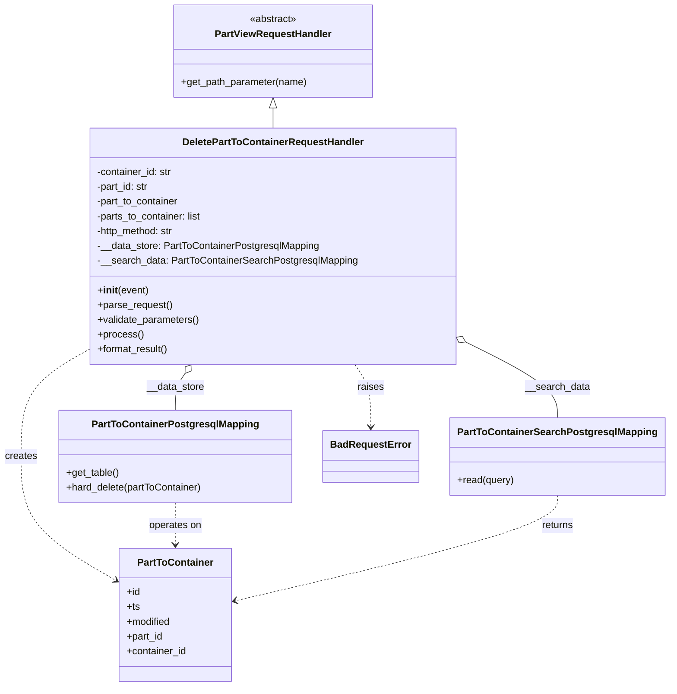

# Diagram: partview_core/partview_service/partview_service/api/part_to_container/handlers/delete_part_to_container.py


> Auto-generated by Obscura crawlers

## Diagram 1



### SVG

<svg id="container" width="1061.0234375" xmlns="http://www.w3.org/2000/svg" class="classDiagram" height="1114" viewBox="0 0 1061.0234375 1114" role="graphics-document document" aria-roledescription="class"><style>#container{font-family:"trebuchet ms",verdana,arial,sans-serif;font-size:16px;fill:#333;}@keyframes edge-animation-frame{from{stroke-dashoffset:0;}}@keyframes dash{to{stroke-dashoffset:0;}}#container .edge-animation-slow{stroke-dasharray:9,5!important;stroke-dashoffset:900;animation:dash 50s linear infinite;stroke-linecap:round;}#container .edge-animation-fast{stroke-dasharray:9,5!important;stroke-dashoffset:900;animation:dash 20s linear infinite;stroke-linecap:round;}#container .error-icon{fill:#552222;}#container .error-text{fill:#552222;stroke:#552222;}#container .edge-thickness-normal{stroke-width:1px;}#container .edge-thickness-thick{stroke-width:3.5px;}#container .edge-pattern-solid{stroke-dasharray:0;}#container .edge-thickness-invisible{stroke-width:0;fill:none;}#container .edge-pattern-dashed{stroke-dasharray:3;}#container .edge-pattern-dotted{stroke-dasharray:2;}#container .marker{fill:#333333;stroke:#333333;}#container .marker.cross{stroke:#333333;}#container svg{font-family:"trebuchet ms",verdana,arial,sans-serif;font-size:16px;}#container p{margin:0;}#container g.classGroup text{fill:#9370DB;stroke:none;font-family:"trebuchet ms",verdana,arial,sans-serif;font-size:10px;}#container g.classGroup text .title{font-weight:bolder;}#container .nodeLabel,#container .edgeLabel{color:#131300;}#container .edgeLabel .label rect{fill:#ECECFF;}#container .label text{fill:#131300;}#container .labelBkg{background:#ECECFF;}#container .edgeLabel .label span{background:#ECECFF;}#container .classTitle{font-weight:bolder;}#container .node rect,#container .node circle,#container .node ellipse,#container .node polygon,#container .node path{fill:#ECECFF;stroke:#9370DB;stroke-width:1px;}#container .divider{stroke:#9370DB;stroke-width:1;}#container g.clickable{cursor:pointer;}#container g.classGroup rect{fill:#ECECFF;stroke:#9370DB;}#container g.classGroup line{stroke:#9370DB;stroke-width:1;}#container .classLabel .box{stroke:none;stroke-width:0;fill:#ECECFF;opacity:0.5;}#container .classLabel .label{fill:#9370DB;font-size:10px;}#container .relation{stroke:#333333;stroke-width:1;fill:none;}#container .dashed-line{stroke-dasharray:3;}#container .dotted-line{stroke-dasharray:1 2;}#container #compositionStart,#container .composition{fill:#333333!important;stroke:#333333!important;stroke-width:1;}#container #compositionEnd,#container .composition{fill:#333333!important;stroke:#333333!important;stroke-width:1;}#container #dependencyStart,#container .dependency{fill:#333333!important;stroke:#333333!important;stroke-width:1;}#container #dependencyStart,#container .dependency{fill:#333333!important;stroke:#333333!important;stroke-width:1;}#container #extensionStart,#container .extension{fill:transparent!important;stroke:#333333!important;stroke-width:1;}#container #extensionEnd,#container .extension{fill:transparent!important;stroke:#333333!important;stroke-width:1;}#container #aggregationStart,#container .aggregation{fill:transparent!important;stroke:#333333!important;stroke-width:1;}#container #aggregationEnd,#container .aggregation{fill:transparent!important;stroke:#333333!important;stroke-width:1;}#container #lollipopStart,#container .lollipop{fill:#ECECFF!important;stroke:#333333!important;stroke-width:1;}#container #lollipopEnd,#container .lollipop{fill:#ECECFF!important;stroke:#333333!important;stroke-width:1;}#container .edgeTerminals{font-size:11px;line-height:initial;}#container .classTitleText{text-anchor:middle;font-size:18px;fill:#333;}#container .label-icon{display:inline-block;height:1em;overflow:visible;vertical-align:-0.125em;}#container .node .label-icon path{fill:currentColor;stroke:revert;stroke-width:revert;}#container :root{--mermaid-font-family:"trebuchet ms",verdana,arial,sans-serif;}</style><g><defs><marker id="container_class-aggregationStart" class="marker aggregation class" refX="18" refY="7" markerWidth="190" markerHeight="240" orient="auto"><path d="M 18,7 L9,13 L1,7 L9,1 Z"></path></marker></defs><defs><marker id="container_class-aggregationEnd" class="marker aggregation class" refX="1" refY="7" markerWidth="20" markerHeight="28" orient="auto"><path d="M 18,7 L9,13 L1,7 L9,1 Z"></path></marker></defs><defs><marker id="container_class-extensionStart" class="marker extension class" refX="18" refY="7" markerWidth="190" markerHeight="240" orient="auto"><path d="M 1,7 L18,13 V 1 Z"></path></marker></defs><defs><marker id="container_class-extensionEnd" class="marker extension class" refX="1" refY="7" markerWidth="20" markerHeight="28" orient="auto"><path d="M 1,1 V 13 L18,7 Z"></path></marker></defs><defs><marker id="container_class-compositionStart" class="marker composition class" refX="18" refY="7" markerWidth="190" markerHeight="240" orient="auto"><path d="M 18,7 L9,13 L1,7 L9,1 Z"></path></marker></defs><defs><marker id="container_class-compositionEnd" class="marker composition class" refX="1" refY="7" markerWidth="20" markerHeight="28" orient="auto"><path d="M 18,7 L9,13 L1,7 L9,1 Z"></path></marker></defs><defs><marker id="container_class-dependencyStart" class="marker dependency class" refX="6" refY="7" markerWidth="190" markerHeight="240" orient="auto"><path d="M 5,7 L9,13 L1,7 L9,1 Z"></path></marker></defs><defs><marker id="container_class-dependencyEnd" class="marker dependency class" refX="13" refY="7" markerWidth="20" markerHeight="28" orient="auto"><path d="M 18,7 L9,13 L14,7 L9,1 Z"></path></marker></defs><defs><marker id="container_class-lollipopStart" class="marker lollipop class" refX="13" refY="7" markerWidth="190" markerHeight="240" orient="auto"><circle stroke="black" fill="transparent" cx="7" cy="7" r="6"></circle></marker></defs><defs><marker id="container_class-lollipopEnd" class="marker lollipop class" refX="1" refY="7" markerWidth="190" markerHeight="240" orient="auto"><circle stroke="black" fill="transparent" cx="7" cy="7" r="6"></circle></marker></defs><g class="root"><g class="clusters"></g><g class="edgePaths"><path d="M439.818,175.25L439.818,176.542C439.818,177.833,439.818,180.417,439.818,185.875C439.818,191.333,439.818,199.667,439.818,203.833L439.818,208" id="id_PartViewRequestHandler_DeletePartToContainerRequestHandler_1" class="edge-thickness-normal edge-pattern-solid relation" style=";;;" data-edge="true" data-et="edge" data-id="id_PartViewRequestHandler_DeletePartToContainerRequestHandler_1" data-points="W3sieCI6NDM5LjgxODM1OTM3NSwieSI6MTU4fSx7IngiOjQzOS44MTgzNTkzNzUsInkiOjE4M30seyJ4Ijo0MzkuODE4MzU5Mzc1LCJ5IjoyMDh9XQ==" marker-start="url(#container_class-extensionStart)"></path><path d="M299.09,606.249L296.503,610.041C293.915,613.833,288.741,621.416,286.154,631.375C283.566,641.333,283.566,653.667,283.566,659.833L283.566,666" id="id_DeletePartToContainerRequestHandler_PartToContainerPostgresqlMapping_2" class="edge-thickness-normal edge-pattern-solid relation" style=";;;" data-edge="true" data-et="edge" data-id="id_DeletePartToContainerRequestHandler_PartToContainerPostgresqlMapping_2" data-points="W3sieCI6MzA4LjgxMjM1NTAwODE4Nzc1LCJ5Ijo1OTJ9LHsieCI6MjgzLjU2NjQwNjI1LCJ5Ijo2Mjl9LHsieCI6MjgzLjU2NjQwNjI1LCJ5Ijo2NjZ9XQ==" marker-start="url(#container_class-aggregationStart)"></path><path d="M748.611,558.242L771.624,570.035C794.637,581.828,840.662,605.414,863.675,625.374C886.688,645.333,886.688,661.667,886.688,669.833L886.688,678" id="id_DeletePartToContainerRequestHandler_PartToContainerSearchPostgresqlMapping_3" class="edge-thickness-normal edge-pattern-solid relation" style=";;;" data-edge="true" data-et="edge" data-id="id_DeletePartToContainerRequestHandler_PartToContainerSearchPostgresqlMapping_3" data-points="W3sieCI6NzMzLjI1OTc2NTYyNSwieSI6NTUwLjM3NTMwMjEyMzcxNjd9LHsieCI6ODg2LjY4NzUsInkiOjYyOX0seyJ4Ijo4ODYuNjg3NSwieSI6Njc4fV0=" marker-start="url(#container_class-aggregationStart)"></path><path d="M146.377,565.657L127.676,576.214C108.975,586.771,71.574,607.886,52.873,637.109C34.172,666.333,34.172,703.667,34.172,741C34.172,778.333,34.172,815.667,59.746,849.202C85.319,882.737,136.466,912.475,162.04,927.344L187.614,942.212" id="id_DeletePartToContainerRequestHandler_PartToContainer_4" class="edge-thickness-normal edge-pattern-dashed relation" style=";;;" data-edge="true" data-et="edge" data-id="id_DeletePartToContainerRequestHandler_PartToContainer_4" data-points="W3sieCI6MTQ2LjM3Njk1MzEyNSwieSI6NTY1LjY1Njc1OTMyMDMzNjV9LHsieCI6MzQuMTcxODc1LCJ5Ijo2Mjl9LHsieCI6MzQuMTcxODc1LCJ5Ijo3NDF9LHsieCI6MzQuMTcxODc1LCJ5Ijo4NTN9LHsieCI6MTkyLjgwMDc4MTI1LCJ5Ijo5NDUuMjI4MTMwNjI4ODY2OH1d" marker-end="url(#container_class-dependencyEnd)"></path><path d="M570.824,592L575.032,598.167C579.24,604.333,587.655,616.667,591.863,633.5C596.07,650.333,596.07,671.667,596.07,682.333L596.07,693" id="id_DeletePartToContainerRequestHandler_BadRequestError_5" class="edge-thickness-normal edge-pattern-dashed relation" style=";;;" data-edge="true" data-et="edge" data-id="id_DeletePartToContainerRequestHandler_BadRequestError_5" data-points="W3sieCI6NTcwLjgyNDM2Mzc0MTgxMjIsInkiOjU5Mn0seyJ4Ijo1OTYuMDcwMzEyNSwieSI6NjI5fSx7IngiOjU5Ni4wNzAzMTI1LCJ5Ijo2OTl9XQ==" marker-end="url(#container_class-dependencyEnd)"></path><path d="M283.566,816L283.566,822.167C283.566,828.333,283.566,840.667,283.566,852C283.566,863.333,283.566,873.667,283.566,878.833L283.566,884" id="id_PartToContainerPostgresqlMapping_PartToContainer_6" class="edge-thickness-normal edge-pattern-dashed relation" style=";;;" data-edge="true" data-et="edge" data-id="id_PartToContainerPostgresqlMapping_PartToContainer_6" data-points="W3sieCI6MjgzLjU2NjQwNjI1LCJ5Ijo4MTZ9LHsieCI6MjgzLjU2NjQwNjI1LCJ5Ijo4NTN9LHsieCI6MjgzLjU2NjQwNjI1LCJ5Ijo4OTB9XQ==" marker-end="url(#container_class-dependencyEnd)"></path><path d="M886.688,804L886.688,812.167C886.688,820.333,886.688,836.667,802.267,865.129C717.847,893.592,549.006,934.184,464.586,954.48L380.166,974.776" id="id_PartToContainerSearchPostgresqlMapping_PartToContainer_7" class="edge-thickness-normal edge-pattern-dashed relation" style=";;;" data-edge="true" data-et="edge" data-id="id_PartToContainerSearchPostgresqlMapping_PartToContainer_7" data-points="W3sieCI6ODg2LjY4NzUsInkiOjgwNH0seyJ4Ijo4ODYuNjg3NSwieSI6ODUzfSx7IngiOjM3NC4zMzIwMzEyNSwieSI6OTc2LjE3ODQ4NTYxMTk1MzR9XQ==" marker-end="url(#container_class-dependencyEnd)"></path></g><g class="edgeLabels"><g class="edgeLabel"><g class="label" data-id="id_PartViewRequestHandler_DeletePartToContainerRequestHandler_1" transform="translate(0, 0)"><foreignObject width="0" height="0"><div xmlns="http://www.w3.org/1999/xhtml" class="labelBkg" style="display: table-cell; white-space: nowrap; line-height: 1.5; max-width: 200px; text-align: center;"><span class="edgeLabel"></span></div></foreignObject></g></g><g class="edgeLabel" transform="translate(283.56640625, 629)"><g class="label" data-id="id_DeletePartToContainerRequestHandler_PartToContainerPostgresqlMapping_2" transform="translate(-46.9453125, -12)"><foreignObject width="93.890625" height="24"><div xmlns="http://www.w3.org/1999/xhtml" class="labelBkg" style="display: table-cell; white-space: nowrap; line-height: 1.5; max-width: 200px; text-align: center;"><span class="edgeLabel"><p>__data_store</p></span></div></foreignObject></g></g><g class="edgeLabel" transform="translate(886.6875, 629)"><g class="label" data-id="id_DeletePartToContainerRequestHandler_PartToContainerSearchPostgresqlMapping_3" transform="translate(-52.2890625, -12)"><foreignObject width="104.578125" height="24"><div xmlns="http://www.w3.org/1999/xhtml" class="labelBkg" style="display: table-cell; white-space: nowrap; line-height: 1.5; max-width: 200px; text-align: center;"><span class="edgeLabel"><p>__search_data</p></span></div></foreignObject></g></g><g class="edgeLabel" transform="translate(34.171875, 741)"><g class="label" data-id="id_DeletePartToContainerRequestHandler_PartToContainer_4" transform="translate(-26.171875, -12)"><foreignObject width="52.34375" height="24"><div xmlns="http://www.w3.org/1999/xhtml" class="labelBkg" style="display: table-cell; white-space: nowrap; line-height: 1.5; max-width: 200px; text-align: center;"><span class="edgeLabel"><p>creates</p></span></div></foreignObject></g></g><g class="edgeLabel" transform="translate(596.0703125, 629)"><g class="label" data-id="id_DeletePartToContainerRequestHandler_BadRequestError_5" transform="translate(-21.25, -12)"><foreignObject width="42.5" height="24"><div xmlns="http://www.w3.org/1999/xhtml" class="labelBkg" style="display: table-cell; white-space: nowrap; line-height: 1.5; max-width: 200px; text-align: center;"><span class="edgeLabel"><p>raises</p></span></div></foreignObject></g></g><g class="edgeLabel" transform="translate(283.56640625, 853)"><g class="label" data-id="id_PartToContainerPostgresqlMapping_PartToContainer_6" transform="translate(-43.2890625, -12)"><foreignObject width="86.578125" height="24"><div xmlns="http://www.w3.org/1999/xhtml" class="labelBkg" style="display: table-cell; white-space: nowrap; line-height: 1.5; max-width: 200px; text-align: center;"><span class="edgeLabel"><p>operates on</p></span></div></foreignObject></g></g><g class="edgeLabel" transform="translate(886.6875, 853)"><g class="label" data-id="id_PartToContainerSearchPostgresqlMapping_PartToContainer_7" transform="translate(-26.265625, -12)"><foreignObject width="52.53125" height="24"><div xmlns="http://www.w3.org/1999/xhtml" class="labelBkg" style="display: table-cell; white-space: nowrap; line-height: 1.5; max-width: 200px; text-align: center;"><span class="edgeLabel"><p>returns</p></span></div></foreignObject></g></g></g><g class="nodes"><g class="node default" id="classId-PartViewRequestHandler-0" transform="translate(439.818359375, 83)"><g class="basic label-container"><path d="M-160.9296875 -75 L160.9296875 -75 L160.9296875 75 L-160.9296875 75" stroke="none" stroke-width="0" fill="#ECECFF" style=""></path><path d="M-160.9296875 -75 C-73.9096274958096 -75, 13.110432508380796 -75, 160.9296875 -75 M-160.9296875 -75 C-84.00401000102126 -75, -7.078332502042514 -75, 160.9296875 -75 M160.9296875 -75 C160.9296875 -41.89974255869474, 160.9296875 -8.79948511738948, 160.9296875 75 M160.9296875 -75 C160.9296875 -25.858286138533288, 160.9296875 23.283427722933425, 160.9296875 75 M160.9296875 75 C48.845796752908825 75, -63.23809399418235 75, -160.9296875 75 M160.9296875 75 C93.63666234934287 75, 26.34363719868574 75, -160.9296875 75 M-160.9296875 75 C-160.9296875 41.91862939252993, -160.9296875 8.83725878505986, -160.9296875 -75 M-160.9296875 75 C-160.9296875 22.396471313554123, -160.9296875 -30.207057372891754, -160.9296875 -75" stroke="#9370DB" stroke-width="1.3" fill="none" stroke-dasharray="0 0" style=""></path></g><g class="annotation-group text" transform="translate(-38.609375, -51)"><g class="label" style="" transform="translate(0,-12)"><foreignObject width="77.21875" height="24"><div xmlns="http://www.w3.org/1999/xhtml" style="display: table-cell; white-space: nowrap; line-height: 1.5; max-width: 127px; text-align: center;"><span class="nodeLabel markdown-node-label" style=""><p>«abstract»</p></span></div></foreignObject></g></g><g class="label-group text" transform="translate(-91.359375, -27)"><g class="label" style="font-weight: bolder" transform="translate(0,-12)"><foreignObject width="182.71875" height="24"><div xmlns="http://www.w3.org/1999/xhtml" style="display: table-cell; white-space: nowrap; line-height: 1.5; max-width: 231px; text-align: center;"><span class="nodeLabel markdown-node-label" style=""><p>PartViewRequestHandler</p></span></div></foreignObject></g></g><g class="members-group text" transform="translate(-148.9296875, 21)"></g><g class="methods-group text" transform="translate(-148.9296875, 51)"><g class="label" style="" transform="translate(0,-12)"><foreignObject width="206.5" height="24"><div xmlns="http://www.w3.org/1999/xhtml" style="display: table-cell; white-space: nowrap; line-height: 1.5; max-width: 264px; text-align: center;"><span class="nodeLabel markdown-node-label" style=""><p>+get_path_parameter(name)</p></span></div></foreignObject></g></g><g class="divider" style=""><path d="M-160.9296875 -3 C-71.56400951419779 -3, 17.801668471604415 -3, 160.9296875 -3 M-160.9296875 -3 C-79.48740653008758 -3, 1.9548744398248346 -3, 160.9296875 -3" stroke="#9370DB" stroke-width="1.3" fill="none" stroke-dasharray="0 0" style=""></path></g><g class="divider" style=""><path d="M-160.9296875 21 C-45.47359474947493 21, 69.98249800105015 21, 160.9296875 21 M-160.9296875 21 C-76.47186627787801 21, 7.985954944243986 21, 160.9296875 21" stroke="#9370DB" stroke-width="1.3" fill="none" stroke-dasharray="0 0" style=""></path></g></g><g class="node default" id="classId-DeletePartToContainerRequestHandler-1" transform="translate(439.818359375, 400)"><g class="basic label-container"><path d="M-293.44140625 -192 L293.44140625 -192 L293.44140625 192 L-293.44140625 192" stroke="none" stroke-width="0" fill="#ECECFF" style=""></path><path d="M-293.44140625 -192 C-112.52047994994356 -192, 68.40044635011287 -192, 293.44140625 -192 M-293.44140625 -192 C-146.99887851325397 -192, -0.5563507765079407 -192, 293.44140625 -192 M293.44140625 -192 C293.44140625 -83.73101181805636, 293.44140625 24.53797636388728, 293.44140625 192 M293.44140625 -192 C293.44140625 -40.890560746297865, 293.44140625 110.21887850740427, 293.44140625 192 M293.44140625 192 C173.95834883630613 192, 54.47529142261223 192, -293.44140625 192 M293.44140625 192 C66.93898927253653 192, -159.56342770492694 192, -293.44140625 192 M-293.44140625 192 C-293.44140625 56.08824759110652, -293.44140625 -79.82350481778695, -293.44140625 -192 M-293.44140625 192 C-293.44140625 57.5082075422568, -293.44140625 -76.9835849154864, -293.44140625 -192" stroke="#9370DB" stroke-width="1.3" fill="none" stroke-dasharray="0 0" style=""></path></g><g class="annotation-group text" transform="translate(0, -168)"></g><g class="label-group text" transform="translate(-142.0234375, -168)"><g class="label" style="font-weight: bolder" transform="translate(0,-12)"><foreignObject width="284.046875" height="24"><div xmlns="http://www.w3.org/1999/xhtml" style="display: table-cell; white-space: nowrap; line-height: 1.5; max-width: 331px; text-align: center;"><span class="nodeLabel markdown-node-label" style=""><p>DeletePartToContainerRequestHandler</p></span></div></foreignObject></g></g><g class="members-group text" transform="translate(-281.44140625, -120)"><g class="label" style="" transform="translate(0,-12)"><foreignObject width="124.28125" height="24"><div xmlns="http://www.w3.org/1999/xhtml" style="display: table-cell; white-space: nowrap; line-height: 1.5; max-width: 182px; text-align: center;"><span class="nodeLabel markdown-node-label" style=""><p>-container_id: str</p></span></div></foreignObject></g><g class="label" style="" transform="translate(0,12)"><foreignObject width="86.359375" height="24"><div xmlns="http://www.w3.org/1999/xhtml" style="display: table-cell; white-space: nowrap; line-height: 1.5; max-width: 145px; text-align: center;"><span class="nodeLabel markdown-node-label" style=""><p>-part_id: str</p></span></div></foreignObject></g><g class="label" style="" transform="translate(0,36)"><foreignObject width="136.21875" height="24"><div xmlns="http://www.w3.org/1999/xhtml" style="display: table-cell; white-space: nowrap; line-height: 1.5; max-width: 194px; text-align: center;"><span class="nodeLabel markdown-node-label" style=""><p>-part_to_container</p></span></div></foreignObject></g><g class="label" style="" transform="translate(0,60)"><foreignObject width="174.0625" height="24"><div xmlns="http://www.w3.org/1999/xhtml" style="display: table-cell; white-space: nowrap; line-height: 1.5; max-width: 232px; text-align: center;"><span class="nodeLabel markdown-node-label" style=""><p>-parts_to_container: list</p></span></div></foreignObject></g><g class="label" style="" transform="translate(0,84)"><foreignObject width="128.890625" height="24"><div xmlns="http://www.w3.org/1999/xhtml" style="display: table-cell; white-space: nowrap; line-height: 1.5; max-width: 187px; text-align: center;"><span class="nodeLabel markdown-node-label" style=""><p>-http_method: str</p></span></div></foreignObject></g><g class="label" style="" transform="translate(0,108)"><foreignObject width="361.46875" height="24"><div xmlns="http://www.w3.org/1999/xhtml" style="display: table-cell; white-space: nowrap; line-height: 1.5; max-width: 419px; text-align: center;"><span class="nodeLabel markdown-node-label" style=""><p>-__data_store: PartToContainerPostgresqlMapping</p></span></div></foreignObject></g><g class="label" style="" transform="translate(0,132)"><foreignObject width="420.859375" height="24"><div xmlns="http://www.w3.org/1999/xhtml" style="display: table-cell; white-space: nowrap; line-height: 1.5; max-width: 479px; text-align: center;"><span class="nodeLabel markdown-node-label" style=""><p>-__search_data: PartToContainerSearchPostgresqlMapping</p></span></div></foreignObject></g></g><g class="methods-group text" transform="translate(-281.44140625, 72)"><g class="label" style="" transform="translate(0,-12)"><foreignObject width="83.140625" height="24"><div xmlns="http://www.w3.org/1999/xhtml" style="display: table-cell; white-space: nowrap; line-height: 1.5; max-width: 172px; text-align: center;"><span class="nodeLabel markdown-node-label" style=""><p>+<strong>init</strong>(event)</p></span></div></foreignObject></g><g class="label" style="" transform="translate(0,12)"><foreignObject width="121.796875" height="24"><div xmlns="http://www.w3.org/1999/xhtml" style="display: table-cell; white-space: nowrap; line-height: 1.5; max-width: 179px; text-align: center;"><span class="nodeLabel markdown-node-label" style=""><p>+parse_request()</p></span></div></foreignObject></g><g class="label" style="" transform="translate(0,36)"><foreignObject width="166.546875" height="24"><div xmlns="http://www.w3.org/1999/xhtml" style="display: table-cell; white-space: nowrap; line-height: 1.5; max-width: 224px; text-align: center;"><span class="nodeLabel markdown-node-label" style=""><p>+validate_parameters()</p></span></div></foreignObject></g><g class="label" style="" transform="translate(0,60)"><foreignObject width="73.734375" height="24"><div xmlns="http://www.w3.org/1999/xhtml" style="display: table-cell; white-space: nowrap; line-height: 1.5; max-width: 131px; text-align: center;"><span class="nodeLabel markdown-node-label" style=""><p>+process()</p></span></div></foreignObject></g><g class="label" style="" transform="translate(0,84)"><foreignObject width="117.015625" height="24"><div xmlns="http://www.w3.org/1999/xhtml" style="display: table-cell; white-space: nowrap; line-height: 1.5; max-width: 174px; text-align: center;"><span class="nodeLabel markdown-node-label" style=""><p>+format_result()</p></span></div></foreignObject></g></g><g class="divider" style=""><path d="M-293.44140625 -144 C-91.80368062758012 -144, 109.83404499483976 -144, 293.44140625 -144 M-293.44140625 -144 C-165.42849784908745 -144, -37.4155894481749 -144, 293.44140625 -144" stroke="#9370DB" stroke-width="1.3" fill="none" stroke-dasharray="0 0" style=""></path></g><g class="divider" style=""><path d="M-293.44140625 48 C-150.5203880132151 48, -7.599369776430194 48, 293.44140625 48 M-293.44140625 48 C-81.29237635950864 48, 130.85665353098273 48, 293.44140625 48" stroke="#9370DB" stroke-width="1.3" fill="none" stroke-dasharray="0 0" style=""></path></g></g><g class="node default" id="classId-PartToContainerPostgresqlMapping-2" transform="translate(283.56640625, 741)"><g class="basic label-container"><path d="M-188.22265625 -75 L188.22265625 -75 L188.22265625 75 L-188.22265625 75" stroke="none" stroke-width="0" fill="#ECECFF" style=""></path><path d="M-188.22265625 -75 C-41.51716572004915 -75, 105.1883248099017 -75, 188.22265625 -75 M-188.22265625 -75 C-74.85506777255937 -75, 38.51252070488127 -75, 188.22265625 -75 M188.22265625 -75 C188.22265625 -41.110650279609075, 188.22265625 -7.22130055921815, 188.22265625 75 M188.22265625 -75 C188.22265625 -23.002889808485136, 188.22265625 28.994220383029727, 188.22265625 75 M188.22265625 75 C101.29950493199864 75, 14.376353613997281 75, -188.22265625 75 M188.22265625 75 C93.74126437113686 75, -0.740127507726271 75, -188.22265625 75 M-188.22265625 75 C-188.22265625 26.267905919962708, -188.22265625 -22.464188160074585, -188.22265625 -75 M-188.22265625 75 C-188.22265625 37.8313094291074, -188.22265625 0.6626188582147989, -188.22265625 -75" stroke="#9370DB" stroke-width="1.3" fill="none" stroke-dasharray="0 0" style=""></path></g><g class="annotation-group text" transform="translate(0, -51)"></g><g class="label-group text" transform="translate(-129.6171875, -51)"><g class="label" style="font-weight: bolder" transform="translate(0,-12)"><foreignObject width="259.234375" height="24"><div xmlns="http://www.w3.org/1999/xhtml" style="display: table-cell; white-space: nowrap; line-height: 1.5; max-width: 305px; text-align: center;"><span class="nodeLabel markdown-node-label" style=""><p>PartToContainerPostgresqlMapping</p></span></div></foreignObject></g></g><g class="members-group text" transform="translate(-176.22265625, -3)"></g><g class="methods-group text" transform="translate(-176.22265625, 27)"><g class="label" style="" transform="translate(0,-12)"><foreignObject width="86.125" height="24"><div xmlns="http://www.w3.org/1999/xhtml" style="display: table-cell; white-space: nowrap; line-height: 1.5; max-width: 143px; text-align: center;"><span class="nodeLabel markdown-node-label" style=""><p>+get_table()</p></span></div></foreignObject></g><g class="label" style="" transform="translate(0,12)"><foreignObject width="222.828125" height="24"><div xmlns="http://www.w3.org/1999/xhtml" style="display: table-cell; white-space: nowrap; line-height: 1.5; max-width: 280px; text-align: center;"><span class="nodeLabel markdown-node-label" style=""><p>+hard_delete(partToContainer)</p></span></div></foreignObject></g></g><g class="divider" style=""><path d="M-188.22265625 -27 C-71.94710720815455 -27, 44.3284418336909 -27, 188.22265625 -27 M-188.22265625 -27 C-108.91256121981186 -27, -29.602466189623726 -27, 188.22265625 -27" stroke="#9370DB" stroke-width="1.3" fill="none" stroke-dasharray="0 0" style=""></path></g><g class="divider" style=""><path d="M-188.22265625 -3 C-53.18309065396326 -3, 81.85647494207348 -3, 188.22265625 -3 M-188.22265625 -3 C-89.66578074657235 -3, 8.891094756855296 -3, 188.22265625 -3" stroke="#9370DB" stroke-width="1.3" fill="none" stroke-dasharray="0 0" style=""></path></g></g><g class="node default" id="classId-PartToContainerSearchPostgresqlMapping-3" transform="translate(886.6875, 741)"><g class="basic label-container"><path d="M-166.3359375 -63 L166.3359375 -63 L166.3359375 63 L-166.3359375 63" stroke="none" stroke-width="0" fill="#ECECFF" style=""></path><path d="M-166.3359375 -63 C-56.28558695226549 -63, 53.76476359546902 -63, 166.3359375 -63 M-166.3359375 -63 C-65.39502736037315 -63, 35.5458827792537 -63, 166.3359375 -63 M166.3359375 -63 C166.3359375 -23.505170486748597, 166.3359375 15.989659026502807, 166.3359375 63 M166.3359375 -63 C166.3359375 -20.254360744461508, 166.3359375 22.491278511076985, 166.3359375 63 M166.3359375 63 C49.20824184440879 63, -67.91945381118242 63, -166.3359375 63 M166.3359375 63 C61.78007045858192 63, -42.775796582836165 63, -166.3359375 63 M-166.3359375 63 C-166.3359375 20.181270403207044, -166.3359375 -22.63745919358591, -166.3359375 -63 M-166.3359375 63 C-166.3359375 33.122519905523475, -166.3359375 3.2450398110469436, -166.3359375 -63" stroke="#9370DB" stroke-width="1.3" fill="none" stroke-dasharray="0 0" style=""></path></g><g class="annotation-group text" transform="translate(0, -39)"></g><g class="label-group text" transform="translate(-154.3359375, -39)"><g class="label" style="font-weight: bolder" transform="translate(0,-12)"><foreignObject width="308.671875" height="24"><div xmlns="http://www.w3.org/1999/xhtml" style="display: table-cell; white-space: nowrap; line-height: 1.5; max-width: 354px; text-align: center;"><span class="nodeLabel markdown-node-label" style=""><p>PartToContainerSearchPostgresqlMapping</p></span></div></foreignObject></g></g><g class="members-group text" transform="translate(-154.3359375, 9)"></g><g class="methods-group text" transform="translate(-154.3359375, 39)"><g class="label" style="" transform="translate(0,-12)"><foreignObject width="92.53125" height="24"><div xmlns="http://www.w3.org/1999/xhtml" style="display: table-cell; white-space: nowrap; line-height: 1.5; max-width: 150px; text-align: center;"><span class="nodeLabel markdown-node-label" style=""><p>+read(query)</p></span></div></foreignObject></g></g><g class="divider" style=""><path d="M-166.3359375 -15 C-63.38614729351727 -15, 39.56364291296546 -15, 166.3359375 -15 M-166.3359375 -15 C-77.29127326427182 -15, 11.753390971456355 -15, 166.3359375 -15" stroke="#9370DB" stroke-width="1.3" fill="none" stroke-dasharray="0 0" style=""></path></g><g class="divider" style=""><path d="M-166.3359375 9 C-82.12375799045435 9, 2.0884215190912983 9, 166.3359375 9 M-166.3359375 9 C-47.85272508355594 9, 70.63048733288812 9, 166.3359375 9" stroke="#9370DB" stroke-width="1.3" fill="none" stroke-dasharray="0 0" style=""></path></g></g><g class="node default" id="classId-PartToContainer-4" transform="translate(283.56640625, 998)"><g class="basic label-container"><path d="M-90.765625 -108 L90.765625 -108 L90.765625 108 L-90.765625 108" stroke="none" stroke-width="0" fill="#ECECFF" style=""></path><path d="M-90.765625 -108 C-42.944004951742464 -108, 4.877615096515072 -108, 90.765625 -108 M-90.765625 -108 C-31.514983402561022 -108, 27.735658194877956 -108, 90.765625 -108 M90.765625 -108 C90.765625 -60.378487969451825, 90.765625 -12.75697593890365, 90.765625 108 M90.765625 -108 C90.765625 -38.30790447683856, 90.765625 31.384191046322883, 90.765625 108 M90.765625 108 C46.34285437564973 108, 1.9200837512994582 108, -90.765625 108 M90.765625 108 C51.92749719549157 108, 13.089369390983137 108, -90.765625 108 M-90.765625 108 C-90.765625 46.991336771953904, -90.765625 -14.017326456092192, -90.765625 -108 M-90.765625 108 C-90.765625 40.623744140548425, -90.765625 -26.75251171890315, -90.765625 -108" stroke="#9370DB" stroke-width="1.3" fill="none" stroke-dasharray="0 0" style=""></path></g><g class="annotation-group text" transform="translate(0, -84)"></g><g class="label-group text" transform="translate(-59.21875, -84)"><g class="label" style="font-weight: bolder" transform="translate(0,-12)"><foreignObject width="118.4375" height="24"><div xmlns="http://www.w3.org/1999/xhtml" style="display: table-cell; white-space: nowrap; line-height: 1.5; max-width: 167px; text-align: center;"><span class="nodeLabel markdown-node-label" style=""><p>PartToContainer</p></span></div></foreignObject></g></g><g class="members-group text" transform="translate(-78.765625, -36)"><g class="label" style="" transform="translate(0,-12)"><foreignObject width="22.078125" height="24"><div xmlns="http://www.w3.org/1999/xhtml" style="display: table-cell; white-space: nowrap; line-height: 1.5; max-width: 79px; text-align: center;"><span class="nodeLabel markdown-node-label" style=""><p>+id</p></span></div></foreignObject></g><g class="label" style="" transform="translate(0,12)"><foreignObject width="21.15625" height="24"><div xmlns="http://www.w3.org/1999/xhtml" style="display: table-cell; white-space: nowrap; line-height: 1.5; max-width: 79px; text-align: center;"><span class="nodeLabel markdown-node-label" style=""><p>+ts</p></span></div></foreignObject></g><g class="label" style="" transform="translate(0,36)"><foreignObject width="72.609375" height="24"><div xmlns="http://www.w3.org/1999/xhtml" style="display: table-cell; white-space: nowrap; line-height: 1.5; max-width: 130px; text-align: center;"><span class="nodeLabel markdown-node-label" style=""><p>+modified</p></span></div></foreignObject></g><g class="label" style="" transform="translate(0,60)"><foreignObject width="60.390625" height="24"><div xmlns="http://www.w3.org/1999/xhtml" style="display: table-cell; white-space: nowrap; line-height: 1.5; max-width: 118px; text-align: center;"><span class="nodeLabel markdown-node-label" style=""><p>+part_id</p></span></div></foreignObject></g><g class="label" style="" transform="translate(0,84)"><foreignObject width="98.3125" height="24"><div xmlns="http://www.w3.org/1999/xhtml" style="display: table-cell; white-space: nowrap; line-height: 1.5; max-width: 156px; text-align: center;"><span class="nodeLabel markdown-node-label" style=""><p>+container_id</p></span></div></foreignObject></g></g><g class="methods-group text" transform="translate(-78.765625, 108)"></g><g class="divider" style=""><path d="M-90.765625 -60 C-49.58582523415376 -60, -8.406025468307519 -60, 90.765625 -60 M-90.765625 -60 C-27.93177479634023 -60, 34.90207540731954 -60, 90.765625 -60" stroke="#9370DB" stroke-width="1.3" fill="none" stroke-dasharray="0 0" style=""></path></g><g class="divider" style=""><path d="M-90.765625 84 C-30.043092432888763 84, 30.679440134222475 84, 90.765625 84 M-90.765625 84 C-29.695250852468035 84, 31.37512329506393 84, 90.765625 84" stroke="#9370DB" stroke-width="1.3" fill="none" stroke-dasharray="0 0" style=""></path></g></g><g class="node default" id="classId-BadRequestError-5" transform="translate(596.0703125, 741)"><g class="basic label-container"><path d="M-74.28125 -42 L74.28125 -42 L74.28125 42 L-74.28125 42" stroke="none" stroke-width="0" fill="#ECECFF" style=""></path><path d="M-74.28125 -42 C-17.00468329048762 -42, 40.27188341902476 -42, 74.28125 -42 M-74.28125 -42 C-27.826769205013576 -42, 18.627711589972847 -42, 74.28125 -42 M74.28125 -42 C74.28125 -16.248595601736778, 74.28125 9.502808796526445, 74.28125 42 M74.28125 -42 C74.28125 -21.806020786531082, 74.28125 -1.6120415730621644, 74.28125 42 M74.28125 42 C15.345204740037552 42, -43.590840519924896 42, -74.28125 42 M74.28125 42 C22.385831456550257 42, -29.509587086899487 42, -74.28125 42 M-74.28125 42 C-74.28125 22.331903268600218, -74.28125 2.6638065372004363, -74.28125 -42 M-74.28125 42 C-74.28125 9.954019833094456, -74.28125 -22.091960333811087, -74.28125 -42" stroke="#9370DB" stroke-width="1.3" fill="none" stroke-dasharray="0 0" style=""></path></g><g class="annotation-group text" transform="translate(0, -18)"></g><g class="label-group text" transform="translate(-62.28125, -18)"><g class="label" style="font-weight: bolder" transform="translate(0,-12)"><foreignObject width="124.5625" height="24"><div xmlns="http://www.w3.org/1999/xhtml" style="display: table-cell; white-space: nowrap; line-height: 1.5; max-width: 174px; text-align: center;"><span class="nodeLabel markdown-node-label" style=""><p>BadRequestError</p></span></div></foreignObject></g></g><g class="members-group text" transform="translate(-62.28125, 30)"></g><g class="methods-group text" transform="translate(-62.28125, 60)"></g><g class="divider" style=""><path d="M-74.28125 6 C-33.971383825193335 6, 6.338482349613329 6, 74.28125 6 M-74.28125 6 C-33.35886904509342 6, 7.563511909813158 6, 74.28125 6" stroke="#9370DB" stroke-width="1.3" fill="none" stroke-dasharray="0 0" style=""></path></g><g class="divider" style=""><path d="M-74.28125 24 C-24.446864159305917 24, 25.387521681388165 24, 74.28125 24 M-74.28125 24 C-18.522761226985004 24, 37.23572754602999 24, 74.28125 24" stroke="#9370DB" stroke-width="1.3" fill="none" stroke-dasharray="0 0" style=""></path></g></g></g></g></g></svg>

## Diagram 2

```mermaid
flowchart TD
    Start([Start parse_request]) --> Parse[Parse request: get_path_parameter("partId")]
    Parse --> Validate{validate_parameters}
    Validate -->|invalid container_id| Raise1[BadRequestError: "Container id must be a string"]
    Validate -->|DELETE and invalid part_id| Raise2[BadRequestError: "Part id must be a string"]
    Validate -->|valid| BuildQuery[Build SQL query selecting id from table where container_id and part_id]
    BuildQuery --> Read[__search_data.read(query)]
    Read --> ForEach{For each PartToContainer result}
    ForEach --> CreatePTC[Instantiate PartToContainer(id=found.id)]
    CreatePTC --> HardDelete[__data_store.hard_delete(part_to_container)]
    HardDelete --> Append[Append deleted.id to parts_to_container]
    Append --> ForEach
    ForEach --> Return[Return self]
    Raise1 --> EndError([Error])
    Raise2 --> EndError
```

> SVG rendering failed for this diagram.
