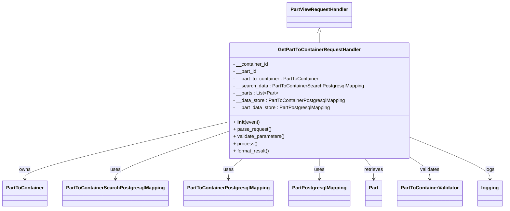

# Diagram: partview_core/partview_service/partview_service/api/part_to_container/handlers/get_part_to_containter.py


> Auto-generated by Obscura crawlers

## Diagram 1



### SVG

<svg id="container" width="1610.453125" xmlns="http://www.w3.org/2000/svg" class="classDiagram" height="692" viewBox="0 0 1610.453125 692" role="graphics-document document" aria-roledescription="class"><style>#container{font-family:"trebuchet ms",verdana,arial,sans-serif;font-size:16px;fill:#333;}@keyframes edge-animation-frame{from{stroke-dashoffset:0;}}@keyframes dash{to{stroke-dashoffset:0;}}#container .edge-animation-slow{stroke-dasharray:9,5!important;stroke-dashoffset:900;animation:dash 50s linear infinite;stroke-linecap:round;}#container .edge-animation-fast{stroke-dasharray:9,5!important;stroke-dashoffset:900;animation:dash 20s linear infinite;stroke-linecap:round;}#container .error-icon{fill:#552222;}#container .error-text{fill:#552222;stroke:#552222;}#container .edge-thickness-normal{stroke-width:1px;}#container .edge-thickness-thick{stroke-width:3.5px;}#container .edge-pattern-solid{stroke-dasharray:0;}#container .edge-thickness-invisible{stroke-width:0;fill:none;}#container .edge-pattern-dashed{stroke-dasharray:3;}#container .edge-pattern-dotted{stroke-dasharray:2;}#container .marker{fill:#333333;stroke:#333333;}#container .marker.cross{stroke:#333333;}#container svg{font-family:"trebuchet ms",verdana,arial,sans-serif;font-size:16px;}#container p{margin:0;}#container g.classGroup text{fill:#9370DB;stroke:none;font-family:"trebuchet ms",verdana,arial,sans-serif;font-size:10px;}#container g.classGroup text .title{font-weight:bolder;}#container .nodeLabel,#container .edgeLabel{color:#131300;}#container .edgeLabel .label rect{fill:#ECECFF;}#container .label text{fill:#131300;}#container .labelBkg{background:#ECECFF;}#container .edgeLabel .label span{background:#ECECFF;}#container .classTitle{font-weight:bolder;}#container .node rect,#container .node circle,#container .node ellipse,#container .node polygon,#container .node path{fill:#ECECFF;stroke:#9370DB;stroke-width:1px;}#container .divider{stroke:#9370DB;stroke-width:1;}#container g.clickable{cursor:pointer;}#container g.classGroup rect{fill:#ECECFF;stroke:#9370DB;}#container g.classGroup line{stroke:#9370DB;stroke-width:1;}#container .classLabel .box{stroke:none;stroke-width:0;fill:#ECECFF;opacity:0.5;}#container .classLabel .label{fill:#9370DB;font-size:10px;}#container .relation{stroke:#333333;stroke-width:1;fill:none;}#container .dashed-line{stroke-dasharray:3;}#container .dotted-line{stroke-dasharray:1 2;}#container #compositionStart,#container .composition{fill:#333333!important;stroke:#333333!important;stroke-width:1;}#container #compositionEnd,#container .composition{fill:#333333!important;stroke:#333333!important;stroke-width:1;}#container #dependencyStart,#container .dependency{fill:#333333!important;stroke:#333333!important;stroke-width:1;}#container #dependencyStart,#container .dependency{fill:#333333!important;stroke:#333333!important;stroke-width:1;}#container #extensionStart,#container .extension{fill:transparent!important;stroke:#333333!important;stroke-width:1;}#container #extensionEnd,#container .extension{fill:transparent!important;stroke:#333333!important;stroke-width:1;}#container #aggregationStart,#container .aggregation{fill:transparent!important;stroke:#333333!important;stroke-width:1;}#container #aggregationEnd,#container .aggregation{fill:transparent!important;stroke:#333333!important;stroke-width:1;}#container #lollipopStart,#container .lollipop{fill:#ECECFF!important;stroke:#333333!important;stroke-width:1;}#container #lollipopEnd,#container .lollipop{fill:#ECECFF!important;stroke:#333333!important;stroke-width:1;}#container .edgeTerminals{font-size:11px;line-height:initial;}#container .classTitleText{text-anchor:middle;font-size:18px;fill:#333;}#container .label-icon{display:inline-block;height:1em;overflow:visible;vertical-align:-0.125em;}#container .node .label-icon path{fill:currentColor;stroke:revert;stroke-width:revert;}#container :root{--mermaid-font-family:"trebuchet ms",verdana,arial,sans-serif;}</style><g><defs><marker id="container_class-aggregationStart" class="marker aggregation class" refX="18" refY="7" markerWidth="190" markerHeight="240" orient="auto"><path d="M 18,7 L9,13 L1,7 L9,1 Z"></path></marker></defs><defs><marker id="container_class-aggregationEnd" class="marker aggregation class" refX="1" refY="7" markerWidth="20" markerHeight="28" orient="auto"><path d="M 18,7 L9,13 L1,7 L9,1 Z"></path></marker></defs><defs><marker id="container_class-extensionStart" class="marker extension class" refX="18" refY="7" markerWidth="190" markerHeight="240" orient="auto"><path d="M 1,7 L18,13 V 1 Z"></path></marker></defs><defs><marker id="container_class-extensionEnd" class="marker extension class" refX="1" refY="7" markerWidth="20" markerHeight="28" orient="auto"><path d="M 1,1 V 13 L18,7 Z"></path></marker></defs><defs><marker id="container_class-compositionStart" class="marker composition class" refX="18" refY="7" markerWidth="190" markerHeight="240" orient="auto"><path d="M 18,7 L9,13 L1,7 L9,1 Z"></path></marker></defs><defs><marker id="container_class-compositionEnd" class="marker composition class" refX="1" refY="7" markerWidth="20" markerHeight="28" orient="auto"><path d="M 18,7 L9,13 L1,7 L9,1 Z"></path></marker></defs><defs><marker id="container_class-dependencyStart" class="marker dependency class" refX="6" refY="7" markerWidth="190" markerHeight="240" orient="auto"><path d="M 5,7 L9,13 L1,7 L9,1 Z"></path></marker></defs><defs><marker id="container_class-dependencyEnd" class="marker dependency class" refX="13" refY="7" markerWidth="20" markerHeight="28" orient="auto"><path d="M 18,7 L9,13 L14,7 L9,1 Z"></path></marker></defs><defs><marker id="container_class-lollipopStart" class="marker lollipop class" refX="13" refY="7" markerWidth="190" markerHeight="240" orient="auto"><circle stroke="black" fill="transparent" cx="7" cy="7" r="6"></circle></marker></defs><defs><marker id="container_class-lollipopEnd" class="marker lollipop class" refX="1" refY="7" markerWidth="190" markerHeight="240" orient="auto"><circle stroke="black" fill="transparent" cx="7" cy="7" r="6"></circle></marker></defs><g class="root"><g class="clusters"></g><g class="edgePaths"><path d="M1013.813,109.25L1013.813,110.542C1013.813,111.833,1013.813,114.417,1013.813,119.875C1013.813,125.333,1013.813,133.667,1013.813,137.833L1013.813,142" id="id_PartViewRequestHandler_GetPartToContainerRequestHandler_1" class="edge-thickness-normal edge-pattern-solid relation" style=";;;" data-edge="true" data-et="edge" data-id="id_PartViewRequestHandler_GetPartToContainerRequestHandler_1" data-points="W3sieCI6MTAxMy44MTI1LCJ5Ijo5Mn0seyJ4IjoxMDEzLjgxMjUsInkiOjExN30seyJ4IjoxMDEzLjgxMjUsInkiOjE0Mn1d" marker-start="url(#container_class-extensionStart)"></path><path d="M721.035,405.738L614.066,431.948C507.096,458.159,293.158,510.579,186.188,541.956C79.219,573.333,79.219,583.667,79.219,588.833L79.219,594" id="id_GetPartToContainerRequestHandler_PartToContainer_2" class="edge-thickness-normal edge-pattern-solid relation" style=";;;" data-edge="true" data-et="edge" data-id="id_GetPartToContainerRequestHandler_PartToContainer_2" data-points="W3sieCI6NzIxLjAzNTE1NjI1LCJ5Ijo0MDUuNzM4MTM0MDQ4ODg0OX0seyJ4Ijo3OS4yMTg3NSwieSI6NTYzfSx7IngiOjc5LjIxODc1LCJ5Ijo2MDB9XQ==" marker-end="url(#container_class-dependencyEnd)"></path><path d="M721.035,437.62L661.992,458.516C602.948,479.413,484.861,521.207,425.817,547.27C366.773,573.333,366.773,583.667,366.773,588.833L366.773,594" id="id_GetPartToContainerRequestHandler_PartToContainerSearchPostgresqlMapping_3" class="edge-thickness-normal edge-pattern-solid relation" style=";;;" data-edge="true" data-et="edge" data-id="id_GetPartToContainerRequestHandler_PartToContainerSearchPostgresqlMapping_3" data-points="W3sieCI6NzIxLjAzNTE1NjI1LCJ5Ijo0MzcuNjE5NzI4MDg4Mjg2OH0seyJ4IjozNjYuNzczNDM3NSwieSI6NTYzfSx7IngiOjM2Ni43NzM0Mzc1LCJ5Ijo2MDB9XQ==" marker-end="url(#container_class-dependencyEnd)"></path><path d="M771.435,526L763.65,532.167C755.865,538.333,740.296,550.667,732.511,562C724.727,573.333,724.727,583.667,724.727,588.833L724.727,594" id="id_GetPartToContainerRequestHandler_PartToContainerPostgresqlMapping_4" class="edge-thickness-normal edge-pattern-solid relation" style=";;;" data-edge="true" data-et="edge" data-id="id_GetPartToContainerRequestHandler_PartToContainerPostgresqlMapping_4" data-points="W3sieCI6NzcxLjQzNDc3MDc0MjM1ODEsInkiOjUyNn0seyJ4Ijo3MjQuNzI2NTYyNSwieSI6NTYzfSx7IngiOjcyNC43MjY1NjI1LCJ5Ijo2MDB9XQ==" marker-end="url(#container_class-dependencyEnd)"></path><path d="M1013.813,526L1013.813,532.167C1013.813,538.333,1013.813,550.667,1013.813,562C1013.813,573.333,1013.813,583.667,1013.813,588.833L1013.813,594" id="id_GetPartToContainerRequestHandler_PartPostgresqlMapping_5" class="edge-thickness-normal edge-pattern-solid relation" style=";;;" data-edge="true" data-et="edge" data-id="id_GetPartToContainerRequestHandler_PartPostgresqlMapping_5" data-points="W3sieCI6MTAxMy44MTI1LCJ5Ijo1MjZ9LHsieCI6MTAxMy44MTI1LCJ5Ijo1NjN9LHsieCI6MTAxMy44MTI1LCJ5Ijo2MDB9XQ==" marker-end="url(#container_class-dependencyEnd)"></path><path d="M1160.151,526L1164.851,532.167C1169.551,538.333,1178.951,550.667,1183.651,562C1188.352,573.333,1188.352,583.667,1188.352,588.833L1188.352,594" id="id_GetPartToContainerRequestHandler_Part_6" class="edge-thickness-normal edge-pattern-solid relation" style=";;;" data-edge="true" data-et="edge" data-id="id_GetPartToContainerRequestHandler_Part_6" data-points="W3sieCI6MTE2MC4xNTA5Mjc5NDc1OTgzLCJ5Ijo1MjZ9LHsieCI6MTE4OC4zNTE1NjI1LCJ5Ijo1NjN9LHsieCI6MTE4OC4zNTE1NjI1LCJ5Ijo2MDB9XQ==" marker-end="url(#container_class-dependencyEnd)"></path><path d="M1306.59,522.323L1317.13,529.103C1327.669,535.882,1348.749,549.441,1359.288,561.387C1369.828,573.333,1369.828,583.667,1369.828,588.833L1369.828,594" id="id_GetPartToContainerRequestHandler_PartToContainerValidator_7" class="edge-thickness-normal edge-pattern-solid relation" style=";;;" data-edge="true" data-et="edge" data-id="id_GetPartToContainerRequestHandler_PartToContainerValidator_7" data-points="W3sieCI6MTMwNi41ODk4NDM3NSwieSI6NTIyLjMyMzIyODAwMDg3Nzd9LHsieCI6MTM2OS44MjgxMjUsInkiOjU2M30seyJ4IjoxMzY5LjgyODEyNSwieSI6NjAwfV0=" marker-end="url(#container_class-dependencyEnd)"></path><path d="M1306.59,456.006L1349.382,473.838C1392.174,491.671,1477.759,527.335,1520.551,550.334C1563.344,573.333,1563.344,583.667,1563.344,588.833L1563.344,594" id="id_GetPartToContainerRequestHandler_logging_8" class="edge-thickness-normal edge-pattern-solid relation" style=";;;" data-edge="true" data-et="edge" data-id="id_GetPartToContainerRequestHandler_logging_8" data-points="W3sieCI6MTMwNi41ODk4NDM3NSwieSI6NDU2LjAwNTgyMTcyMzA1OTR9LHsieCI6MTU2My4zNDM3NSwieSI6NTYzfSx7IngiOjE1NjMuMzQzNzUsInkiOjYwMH1d" marker-end="url(#container_class-dependencyEnd)"></path></g><g class="edgeLabels"><g class="edgeLabel"><g class="label" data-id="id_PartViewRequestHandler_GetPartToContainerRequestHandler_1" transform="translate(0, 0)"><foreignObject width="0" height="0"><div xmlns="http://www.w3.org/1999/xhtml" class="labelBkg" style="display: table-cell; white-space: nowrap; line-height: 1.5; max-width: 200px; text-align: center;"><span class="edgeLabel"></span></div></foreignObject></g></g><g class="edgeLabel" transform="translate(79.21875, 563)"><g class="label" data-id="id_GetPartToContainerRequestHandler_PartToContainer_2" transform="translate(-18.8359375, -12)"><foreignObject width="37.671875" height="24"><div xmlns="http://www.w3.org/1999/xhtml" class="labelBkg" style="display: table-cell; white-space: nowrap; line-height: 1.5; max-width: 200px; text-align: center;"><span class="edgeLabel"><p>owns</p></span></div></foreignObject></g></g><g class="edgeLabel" transform="translate(366.7734375, 563)"><g class="label" data-id="id_GetPartToContainerRequestHandler_PartToContainerSearchPostgresqlMapping_3" transform="translate(-16.4921875, -12)"><foreignObject width="32.984375" height="24"><div xmlns="http://www.w3.org/1999/xhtml" class="labelBkg" style="display: table-cell; white-space: nowrap; line-height: 1.5; max-width: 200px; text-align: center;"><span class="edgeLabel"><p>uses</p></span></div></foreignObject></g></g><g class="edgeLabel" transform="translate(724.7265625, 563)"><g class="label" data-id="id_GetPartToContainerRequestHandler_PartToContainerPostgresqlMapping_4" transform="translate(-16.4921875, -12)"><foreignObject width="32.984375" height="24"><div xmlns="http://www.w3.org/1999/xhtml" class="labelBkg" style="display: table-cell; white-space: nowrap; line-height: 1.5; max-width: 200px; text-align: center;"><span class="edgeLabel"><p>uses</p></span></div></foreignObject></g></g><g class="edgeLabel" transform="translate(1013.8125, 563)"><g class="label" data-id="id_GetPartToContainerRequestHandler_PartPostgresqlMapping_5" transform="translate(-16.4921875, -12)"><foreignObject width="32.984375" height="24"><div xmlns="http://www.w3.org/1999/xhtml" class="labelBkg" style="display: table-cell; white-space: nowrap; line-height: 1.5; max-width: 200px; text-align: center;"><span class="edgeLabel"><p>uses</p></span></div></foreignObject></g></g><g class="edgeLabel" transform="translate(1188.3515625, 563)"><g class="label" data-id="id_GetPartToContainerRequestHandler_Part_6" transform="translate(-31.7734375, -12)"><foreignObject width="63.546875" height="24"><div xmlns="http://www.w3.org/1999/xhtml" class="labelBkg" style="display: table-cell; white-space: nowrap; line-height: 1.5; max-width: 200px; text-align: center;"><span class="edgeLabel"><p>retrieves</p></span></div></foreignObject></g></g><g class="edgeLabel" transform="translate(1369.828125, 563)"><g class="label" data-id="id_GetPartToContainerRequestHandler_PartToContainerValidator_7" transform="translate(-32.6875, -12)"><foreignObject width="65.375" height="24"><div xmlns="http://www.w3.org/1999/xhtml" class="labelBkg" style="display: table-cell; white-space: nowrap; line-height: 1.5; max-width: 200px; text-align: center;"><span class="edgeLabel"><p>validates</p></span></div></foreignObject></g></g><g class="edgeLabel" transform="translate(1563.34375, 563)"><g class="label" data-id="id_GetPartToContainerRequestHandler_logging_8" transform="translate(-14.8203125, -12)"><foreignObject width="29.640625" height="24"><div xmlns="http://www.w3.org/1999/xhtml" class="labelBkg" style="display: table-cell; white-space: nowrap; line-height: 1.5; max-width: 200px; text-align: center;"><span class="edgeLabel"><p>logs</p></span></div></foreignObject></g></g></g><g class="nodes"><g class="node default" id="classId-GetPartToContainerRequestHandler-0" transform="translate(1013.8125, 334)"><g class="basic label-container"><path d="M-292.77734375 -192 L292.77734375 -192 L292.77734375 192 L-292.77734375 192" stroke="none" stroke-width="0" fill="#ECECFF" style=""></path><path d="M-292.77734375 -192 C-92.87780075809664 -192, 107.02174223380672 -192, 292.77734375 -192 M-292.77734375 -192 C-98.0464753661571 -192, 96.6843930176858 -192, 292.77734375 -192 M292.77734375 -192 C292.77734375 -114.9612508535191, 292.77734375 -37.92250170703821, 292.77734375 192 M292.77734375 -192 C292.77734375 -47.68777423316425, 292.77734375 96.6244515336715, 292.77734375 192 M292.77734375 192 C169.09784301886992 192, 45.41834228773982 192, -292.77734375 192 M292.77734375 192 C111.56612653986033 192, -69.64509067027933 192, -292.77734375 192 M-292.77734375 192 C-292.77734375 86.52005979263376, -292.77734375 -18.95988041473248, -292.77734375 -192 M-292.77734375 192 C-292.77734375 39.006102742946666, -292.77734375 -113.98779451410667, -292.77734375 -192" stroke="#9370DB" stroke-width="1.3" fill="none" stroke-dasharray="0 0" style=""></path></g><g class="annotation-group text" transform="translate(0, -168)"></g><g class="label-group text" transform="translate(-130.9453125, -168)"><g class="label" style="font-weight: bolder" transform="translate(0,-12)"><foreignObject width="261.890625" height="24"><div xmlns="http://www.w3.org/1999/xhtml" style="display: table-cell; white-space: nowrap; line-height: 1.5; max-width: 309px; text-align: center;"><span class="nodeLabel markdown-node-label" style=""><p>GetPartToContainerRequestHandler</p></span></div></foreignObject></g></g><g class="members-group text" transform="translate(-280.77734375, -120)"><g class="label" style="" transform="translate(0,-12)"><foreignObject width="117.171875" height="24"><div xmlns="http://www.w3.org/1999/xhtml" style="display: table-cell; white-space: nowrap; line-height: 1.5; max-width: 175px; text-align: center;"><span class="nodeLabel markdown-node-label" style=""><p>- __container_id</p></span></div></foreignObject></g><g class="label" style="" transform="translate(0,12)"><foreignObject width="79.578125" height="24"><div xmlns="http://www.w3.org/1999/xhtml" style="display: table-cell; white-space: nowrap; line-height: 1.5; max-width: 137px; text-align: center;"><span class="nodeLabel markdown-node-label" style=""><p>- __part_id</p></span></div></foreignObject></g><g class="label" style="" transform="translate(0,36)"><foreignObject width="285.578125" height="24"><div xmlns="http://www.w3.org/1999/xhtml" style="display: table-cell; white-space: nowrap; line-height: 1.5; max-width: 344px; text-align: center;"><span class="nodeLabel markdown-node-label" style=""><p>- __part_to_container : PartToContainer</p></span></div></foreignObject></g><g class="label" style="" transform="translate(0,60)"><foreignObject width="430.609375" height="24"><div xmlns="http://www.w3.org/1999/xhtml" style="display: table-cell; white-space: nowrap; line-height: 1.5; max-width: 489px; text-align: center;"><span class="nodeLabel markdown-node-label" style=""><p>- __search_data : PartToContainerSearchPostgresqlMapping</p></span></div></foreignObject></g><g class="label" style="" transform="translate(0,84)"><foreignObject width="147.765625" height="24"><div xmlns="http://www.w3.org/1999/xhtml" style="display: table-cell; white-space: nowrap; line-height: 1.5; max-width: 245px; text-align: center;"><span class="nodeLabel markdown-node-label" style=""><p>- __parts : List&lt;Part&gt;</p></span></div></foreignObject></g><g class="label" style="" transform="translate(0,108)"><foreignObject width="371.21875" height="24"><div xmlns="http://www.w3.org/1999/xhtml" style="display: table-cell; white-space: nowrap; line-height: 1.5; max-width: 429px; text-align: center;"><span class="nodeLabel markdown-node-label" style=""><p>- __data_store : PartToContainerPostgresqlMapping</p></span></div></foreignObject></g><g class="label" style="" transform="translate(0,132)"><foreignObject width="322.296875" height="24"><div xmlns="http://www.w3.org/1999/xhtml" style="display: table-cell; white-space: nowrap; line-height: 1.5; max-width: 380px; text-align: center;"><span class="nodeLabel markdown-node-label" style=""><p>- __part_data_store : PartPostgresqlMapping</p></span></div></foreignObject></g></g><g class="methods-group text" transform="translate(-280.77734375, 72)"><g class="label" style="" transform="translate(0,-12)"><foreignObject width="87.390625" height="24"><div xmlns="http://www.w3.org/1999/xhtml" style="display: table-cell; white-space: nowrap; line-height: 1.5; max-width: 177px; text-align: center;"><span class="nodeLabel markdown-node-label" style=""><p>+ <strong>init</strong>(event)</p></span></div></foreignObject></g><g class="label" style="" transform="translate(0,12)"><foreignObject width="126.046875" height="24"><div xmlns="http://www.w3.org/1999/xhtml" style="display: table-cell; white-space: nowrap; line-height: 1.5; max-width: 183px; text-align: center;"><span class="nodeLabel markdown-node-label" style=""><p>+ parse_request()</p></span></div></foreignObject></g><g class="label" style="" transform="translate(0,36)"><foreignObject width="170.953125" height="24"><div xmlns="http://www.w3.org/1999/xhtml" style="display: table-cell; white-space: nowrap; line-height: 1.5; max-width: 228px; text-align: center;"><span class="nodeLabel markdown-node-label" style=""><p>+ validate_parameters()</p></span></div></foreignObject></g><g class="label" style="" transform="translate(0,60)"><foreignObject width="77.96875" height="24"><div xmlns="http://www.w3.org/1999/xhtml" style="display: table-cell; white-space: nowrap; line-height: 1.5; max-width: 135px; text-align: center;"><span class="nodeLabel markdown-node-label" style=""><p>+ process()</p></span></div></foreignObject></g><g class="label" style="" transform="translate(0,84)"><foreignObject width="121.5" height="24"><div xmlns="http://www.w3.org/1999/xhtml" style="display: table-cell; white-space: nowrap; line-height: 1.5; max-width: 179px; text-align: center;"><span class="nodeLabel markdown-node-label" style=""><p>+ format_result()</p></span></div></foreignObject></g></g><g class="divider" style=""><path d="M-292.77734375 -144 C-114.70278634443338 -144, 63.371771061133245 -144, 292.77734375 -144 M-292.77734375 -144 C-117.50471056227929 -144, 57.76792262544143 -144, 292.77734375 -144" stroke="#9370DB" stroke-width="1.3" fill="none" stroke-dasharray="0 0" style=""></path></g><g class="divider" style=""><path d="M-292.77734375 48 C-113.24995924858626 48, 66.27742525282747 48, 292.77734375 48 M-292.77734375 48 C-66.90808311105863 48, 158.96117752788274 48, 292.77734375 48" stroke="#9370DB" stroke-width="1.3" fill="none" stroke-dasharray="0 0" style=""></path></g></g><g class="node default" id="classId-PartViewRequestHandler-1" transform="translate(1013.8125, 50)"><g class="basic label-container"><path d="M-103.359375 -42 L103.359375 -42 L103.359375 42 L-103.359375 42" stroke="none" stroke-width="0" fill="#ECECFF" style=""></path><path d="M-103.359375 -42 C-21.665352877701494 -42, 60.02866924459701 -42, 103.359375 -42 M-103.359375 -42 C-26.20752067149509 -42, 50.94433365700982 -42, 103.359375 -42 M103.359375 -42 C103.359375 -9.984486158589988, 103.359375 22.031027682820024, 103.359375 42 M103.359375 -42 C103.359375 -10.085940670189508, 103.359375 21.828118659620984, 103.359375 42 M103.359375 42 C30.799949355906804 42, -41.75947628818639 42, -103.359375 42 M103.359375 42 C43.948753673753544 42, -15.461867652492913 42, -103.359375 42 M-103.359375 42 C-103.359375 15.204931292343577, -103.359375 -11.590137415312846, -103.359375 -42 M-103.359375 42 C-103.359375 20.878088510565995, -103.359375 -0.2438229788680104, -103.359375 -42" stroke="#9370DB" stroke-width="1.3" fill="none" stroke-dasharray="0 0" style=""></path></g><g class="annotation-group text" transform="translate(0, -18)"></g><g class="label-group text" transform="translate(-91.359375, -18)"><g class="label" style="font-weight: bolder" transform="translate(0,-12)"><foreignObject width="182.71875" height="24"><div xmlns="http://www.w3.org/1999/xhtml" style="display: table-cell; white-space: nowrap; line-height: 1.5; max-width: 231px; text-align: center;"><span class="nodeLabel markdown-node-label" style=""><p>PartViewRequestHandler</p></span></div></foreignObject></g></g><g class="members-group text" transform="translate(-91.359375, 30)"></g><g class="methods-group text" transform="translate(-91.359375, 60)"></g><g class="divider" style=""><path d="M-103.359375 6 C-54.39957015706948 6, -5.439765314138967 6, 103.359375 6 M-103.359375 6 C-50.17109982215858 6, 3.017175355682838 6, 103.359375 6" stroke="#9370DB" stroke-width="1.3" fill="none" stroke-dasharray="0 0" style=""></path></g><g class="divider" style=""><path d="M-103.359375 24 C-28.549308678086035 24, 46.26075764382793 24, 103.359375 24 M-103.359375 24 C-30.353621768270372 24, 42.652131463459256 24, 103.359375 24" stroke="#9370DB" stroke-width="1.3" fill="none" stroke-dasharray="0 0" style=""></path></g></g><g class="node default" id="classId-Part-2" transform="translate(1188.3515625, 642)"><g class="basic label-container"><path d="M-27.0703125 -42 L27.0703125 -42 L27.0703125 42 L-27.0703125 42" stroke="none" stroke-width="0" fill="#ECECFF" style=""></path><path d="M-27.0703125 -42 C-5.665403222894284 -42, 15.739506054211432 -42, 27.0703125 -42 M-27.0703125 -42 C-13.77675451662521 -42, -0.4831965332504211 -42, 27.0703125 -42 M27.0703125 -42 C27.0703125 -20.27626893832108, 27.0703125 1.4474621233578375, 27.0703125 42 M27.0703125 -42 C27.0703125 -10.522185322846344, 27.0703125 20.955629354307312, 27.0703125 42 M27.0703125 42 C8.584772546057469 42, -9.900767407885063 42, -27.0703125 42 M27.0703125 42 C14.199852588995912 42, 1.329392677991823 42, -27.0703125 42 M-27.0703125 42 C-27.0703125 8.689951609968986, -27.0703125 -24.620096780062028, -27.0703125 -42 M-27.0703125 42 C-27.0703125 11.389890743913277, -27.0703125 -19.220218512173446, -27.0703125 -42" stroke="#9370DB" stroke-width="1.3" fill="none" stroke-dasharray="0 0" style=""></path></g><g class="annotation-group text" transform="translate(0, -18)"></g><g class="label-group text" transform="translate(-15.0703125, -18)"><g class="label" style="font-weight: bolder" transform="translate(0,-12)"><foreignObject width="30.140625" height="24"><div xmlns="http://www.w3.org/1999/xhtml" style="display: table-cell; white-space: nowrap; line-height: 1.5; max-width: 79px; text-align: center;"><span class="nodeLabel markdown-node-label" style=""><p>Part</p></span></div></foreignObject></g></g><g class="members-group text" transform="translate(-15.0703125, 30)"></g><g class="methods-group text" transform="translate(-15.0703125, 60)"></g><g class="divider" style=""><path d="M-27.0703125 6 C-11.764103084374279 6, 3.5421063312514427 6, 27.0703125 6 M-27.0703125 6 C-10.732968655439482 6, 5.604375189121036 6, 27.0703125 6" stroke="#9370DB" stroke-width="1.3" fill="none" stroke-dasharray="0 0" style=""></path></g><g class="divider" style=""><path d="M-27.0703125 24 C-12.471815977759082 24, 2.126680544481836 24, 27.0703125 24 M-27.0703125 24 C-9.868706508447076 24, 7.332899483105848 24, 27.0703125 24" stroke="#9370DB" stroke-width="1.3" fill="none" stroke-dasharray="0 0" style=""></path></g></g><g class="node default" id="classId-PartToContainer-3" transform="translate(79.21875, 642)"><g class="basic label-container"><path d="M-71.21875 -42 L71.21875 -42 L71.21875 42 L-71.21875 42" stroke="none" stroke-width="0" fill="#ECECFF" style=""></path><path d="M-71.21875 -42 C-22.02667425925629 -42, 27.16540148148742 -42, 71.21875 -42 M-71.21875 -42 C-14.585518040530843 -42, 42.047713918938314 -42, 71.21875 -42 M71.21875 -42 C71.21875 -18.984383888636707, 71.21875 4.031232222726587, 71.21875 42 M71.21875 -42 C71.21875 -11.897050995356722, 71.21875 18.205898009286557, 71.21875 42 M71.21875 42 C33.544624035613225 42, -4.12950192877355 42, -71.21875 42 M71.21875 42 C41.4648561671609 42, 11.710962334321813 42, -71.21875 42 M-71.21875 42 C-71.21875 14.641454184504383, -71.21875 -12.717091630991234, -71.21875 -42 M-71.21875 42 C-71.21875 23.113955892008555, -71.21875 4.22791178401711, -71.21875 -42" stroke="#9370DB" stroke-width="1.3" fill="none" stroke-dasharray="0 0" style=""></path></g><g class="annotation-group text" transform="translate(0, -18)"></g><g class="label-group text" transform="translate(-59.21875, -18)"><g class="label" style="font-weight: bolder" transform="translate(0,-12)"><foreignObject width="118.4375" height="24"><div xmlns="http://www.w3.org/1999/xhtml" style="display: table-cell; white-space: nowrap; line-height: 1.5; max-width: 167px; text-align: center;"><span class="nodeLabel markdown-node-label" style=""><p>PartToContainer</p></span></div></foreignObject></g></g><g class="members-group text" transform="translate(-59.21875, 30)"></g><g class="methods-group text" transform="translate(-59.21875, 60)"></g><g class="divider" style=""><path d="M-71.21875 6 C-31.85900711424614 6, 7.5007357715077205 6, 71.21875 6 M-71.21875 6 C-24.295887174389982 6, 22.626975651220036 6, 71.21875 6" stroke="#9370DB" stroke-width="1.3" fill="none" stroke-dasharray="0 0" style=""></path></g><g class="divider" style=""><path d="M-71.21875 24 C-15.414952809178622 24, 40.388844381642755 24, 71.21875 24 M-71.21875 24 C-41.47904990631424 24, -11.739349812628475 24, 71.21875 24" stroke="#9370DB" stroke-width="1.3" fill="none" stroke-dasharray="0 0" style=""></path></g></g><g class="node default" id="classId-PartToContainerSearchPostgresqlMapping-4" transform="translate(366.7734375, 642)"><g class="basic label-container"><path d="M-166.3359375 -42 L166.3359375 -42 L166.3359375 42 L-166.3359375 42" stroke="none" stroke-width="0" fill="#ECECFF" style=""></path><path d="M-166.3359375 -42 C-83.82198987957186 -42, -1.3080422591437184 -42, 166.3359375 -42 M-166.3359375 -42 C-59.190626789554415 -42, 47.95468392089117 -42, 166.3359375 -42 M166.3359375 -42 C166.3359375 -10.361667891859629, 166.3359375 21.276664216280743, 166.3359375 42 M166.3359375 -42 C166.3359375 -13.931981950566431, 166.3359375 14.136036098867137, 166.3359375 42 M166.3359375 42 C78.3702370326669 42, -9.595463434666186 42, -166.3359375 42 M166.3359375 42 C77.68064214671995 42, -10.974653206560106 42, -166.3359375 42 M-166.3359375 42 C-166.3359375 17.9943873767871, -166.3359375 -6.011225246425802, -166.3359375 -42 M-166.3359375 42 C-166.3359375 14.881485509228813, -166.3359375 -12.237028981542373, -166.3359375 -42" stroke="#9370DB" stroke-width="1.3" fill="none" stroke-dasharray="0 0" style=""></path></g><g class="annotation-group text" transform="translate(0, -18)"></g><g class="label-group text" transform="translate(-154.3359375, -18)"><g class="label" style="font-weight: bolder" transform="translate(0,-12)"><foreignObject width="308.671875" height="24"><div xmlns="http://www.w3.org/1999/xhtml" style="display: table-cell; white-space: nowrap; line-height: 1.5; max-width: 354px; text-align: center;"><span class="nodeLabel markdown-node-label" style=""><p>PartToContainerSearchPostgresqlMapping</p></span></div></foreignObject></g></g><g class="members-group text" transform="translate(-154.3359375, 30)"></g><g class="methods-group text" transform="translate(-154.3359375, 60)"></g><g class="divider" style=""><path d="M-166.3359375 6 C-85.36804474518588 6, -4.400151990371768 6, 166.3359375 6 M-166.3359375 6 C-49.69915919487579 6, 66.93761911024842 6, 166.3359375 6" stroke="#9370DB" stroke-width="1.3" fill="none" stroke-dasharray="0 0" style=""></path></g><g class="divider" style=""><path d="M-166.3359375 24 C-82.66824090197564 24, 0.9994556960487273 24, 166.3359375 24 M-166.3359375 24 C-91.0143318207456 24, -15.692726141491192 24, 166.3359375 24" stroke="#9370DB" stroke-width="1.3" fill="none" stroke-dasharray="0 0" style=""></path></g></g><g class="node default" id="classId-PartToContainerPostgresqlMapping-5" transform="translate(724.7265625, 642)"><g class="basic label-container"><path d="M-141.6171875 -42 L141.6171875 -42 L141.6171875 42 L-141.6171875 42" stroke="none" stroke-width="0" fill="#ECECFF" style=""></path><path d="M-141.6171875 -42 C-74.44080571628744 -42, -7.264423932574886 -42, 141.6171875 -42 M-141.6171875 -42 C-29.644079333508486 -42, 82.32902883298303 -42, 141.6171875 -42 M141.6171875 -42 C141.6171875 -25.002693724945086, 141.6171875 -8.005387449890172, 141.6171875 42 M141.6171875 -42 C141.6171875 -13.400759682320572, 141.6171875 15.198480635358855, 141.6171875 42 M141.6171875 42 C47.10583390018513 42, -47.405519699629735 42, -141.6171875 42 M141.6171875 42 C80.34601414342032 42, 19.07484078684064 42, -141.6171875 42 M-141.6171875 42 C-141.6171875 11.289830440962394, -141.6171875 -19.420339118075212, -141.6171875 -42 M-141.6171875 42 C-141.6171875 24.67653440047928, -141.6171875 7.35306880095856, -141.6171875 -42" stroke="#9370DB" stroke-width="1.3" fill="none" stroke-dasharray="0 0" style=""></path></g><g class="annotation-group text" transform="translate(0, -18)"></g><g class="label-group text" transform="translate(-129.6171875, -18)"><g class="label" style="font-weight: bolder" transform="translate(0,-12)"><foreignObject width="259.234375" height="24"><div xmlns="http://www.w3.org/1999/xhtml" style="display: table-cell; white-space: nowrap; line-height: 1.5; max-width: 305px; text-align: center;"><span class="nodeLabel markdown-node-label" style=""><p>PartToContainerPostgresqlMapping</p></span></div></foreignObject></g></g><g class="members-group text" transform="translate(-129.6171875, 30)"></g><g class="methods-group text" transform="translate(-129.6171875, 60)"></g><g class="divider" style=""><path d="M-141.6171875 6 C-43.995518610831155 6, 53.62615027833769 6, 141.6171875 6 M-141.6171875 6 C-55.24144698416045 6, 31.134293531679106 6, 141.6171875 6" stroke="#9370DB" stroke-width="1.3" fill="none" stroke-dasharray="0 0" style=""></path></g><g class="divider" style=""><path d="M-141.6171875 24 C-31.265616243524022 24, 79.08595501295196 24, 141.6171875 24 M-141.6171875 24 C-51.088966669606975 24, 39.43925416078605 24, 141.6171875 24" stroke="#9370DB" stroke-width="1.3" fill="none" stroke-dasharray="0 0" style=""></path></g></g><g class="node default" id="classId-PartPostgresqlMapping-6" transform="translate(1013.8125, 642)"><g class="basic label-container"><path d="M-97.46875 -42 L97.46875 -42 L97.46875 42 L-97.46875 42" stroke="none" stroke-width="0" fill="#ECECFF" style=""></path><path d="M-97.46875 -42 C-31.544791089223565 -42, 34.37916782155287 -42, 97.46875 -42 M-97.46875 -42 C-22.291103844806187 -42, 52.886542310387625 -42, 97.46875 -42 M97.46875 -42 C97.46875 -20.63340009374637, 97.46875 0.7331998125072587, 97.46875 42 M97.46875 -42 C97.46875 -16.875486973528098, 97.46875 8.249026052943805, 97.46875 42 M97.46875 42 C43.682529496659704 42, -10.103691006680592 42, -97.46875 42 M97.46875 42 C42.22610641466233 42, -13.016537170675335 42, -97.46875 42 M-97.46875 42 C-97.46875 23.432119801719526, -97.46875 4.864239603439053, -97.46875 -42 M-97.46875 42 C-97.46875 14.91037624174471, -97.46875 -12.179247516510578, -97.46875 -42" stroke="#9370DB" stroke-width="1.3" fill="none" stroke-dasharray="0 0" style=""></path></g><g class="annotation-group text" transform="translate(0, -18)"></g><g class="label-group text" transform="translate(-85.46875, -18)"><g class="label" style="font-weight: bolder" transform="translate(0,-12)"><foreignObject width="170.9375" height="24"><div xmlns="http://www.w3.org/1999/xhtml" style="display: table-cell; white-space: nowrap; line-height: 1.5; max-width: 218px; text-align: center;"><span class="nodeLabel markdown-node-label" style=""><p>PartPostgresqlMapping</p></span></div></foreignObject></g></g><g class="members-group text" transform="translate(-85.46875, 30)"></g><g class="methods-group text" transform="translate(-85.46875, 60)"></g><g class="divider" style=""><path d="M-97.46875 6 C-28.418050195699493 6, 40.632649608601014 6, 97.46875 6 M-97.46875 6 C-38.56518233102376 6, 20.338385337952474 6, 97.46875 6" stroke="#9370DB" stroke-width="1.3" fill="none" stroke-dasharray="0 0" style=""></path></g><g class="divider" style=""><path d="M-97.46875 24 C-31.750368183044586 24, 33.96801363391083 24, 97.46875 24 M-97.46875 24 C-23.378965324935166 24, 50.71081935012967 24, 97.46875 24" stroke="#9370DB" stroke-width="1.3" fill="none" stroke-dasharray="0 0" style=""></path></g></g><g class="node default" id="classId-PartToContainerValidator-7" transform="translate(1369.828125, 642)"><g class="basic label-container"><path d="M-104.40625 -42 L104.40625 -42 L104.40625 42 L-104.40625 42" stroke="none" stroke-width="0" fill="#ECECFF" style=""></path><path d="M-104.40625 -42 C-47.64218071009517 -42, 9.121888579809664 -42, 104.40625 -42 M-104.40625 -42 C-41.11934705508736 -42, 22.16755588982528 -42, 104.40625 -42 M104.40625 -42 C104.40625 -16.097016418231814, 104.40625 9.805967163536373, 104.40625 42 M104.40625 -42 C104.40625 -15.20780995990447, 104.40625 11.58438008019106, 104.40625 42 M104.40625 42 C40.248656816738915 42, -23.90893636652217 42, -104.40625 42 M104.40625 42 C24.094499011730733 42, -56.217251976538535 42, -104.40625 42 M-104.40625 42 C-104.40625 16.67630689540849, -104.40625 -8.647386209183018, -104.40625 -42 M-104.40625 42 C-104.40625 20.0670240710685, -104.40625 -1.8659518578630028, -104.40625 -42" stroke="#9370DB" stroke-width="1.3" fill="none" stroke-dasharray="0 0" style=""></path></g><g class="annotation-group text" transform="translate(0, -18)"></g><g class="label-group text" transform="translate(-92.40625, -18)"><g class="label" style="font-weight: bolder" transform="translate(0,-12)"><foreignObject width="184.8125" height="24"><div xmlns="http://www.w3.org/1999/xhtml" style="display: table-cell; white-space: nowrap; line-height: 1.5; max-width: 232px; text-align: center;"><span class="nodeLabel markdown-node-label" style=""><p>PartToContainerValidator</p></span></div></foreignObject></g></g><g class="members-group text" transform="translate(-92.40625, 30)"></g><g class="methods-group text" transform="translate(-92.40625, 60)"></g><g class="divider" style=""><path d="M-104.40625 6 C-23.24193524790931 6, 57.92237950418138 6, 104.40625 6 M-104.40625 6 C-46.47252445534763 6, 11.461201089304737 6, 104.40625 6" stroke="#9370DB" stroke-width="1.3" fill="none" stroke-dasharray="0 0" style=""></path></g><g class="divider" style=""><path d="M-104.40625 24 C-52.55963321511974 24, -0.7130164302394775 24, 104.40625 24 M-104.40625 24 C-21.162708207006943 24, 62.08083358598611 24, 104.40625 24" stroke="#9370DB" stroke-width="1.3" fill="none" stroke-dasharray="0 0" style=""></path></g></g><g class="node default" id="classId-logging-8" transform="translate(1563.34375, 642)"><g class="basic label-container"><path d="M-39.109375 -42 L39.109375 -42 L39.109375 42 L-39.109375 42" stroke="none" stroke-width="0" fill="#ECECFF" style=""></path><path d="M-39.109375 -42 C-15.021510474732388 -42, 9.066354050535224 -42, 39.109375 -42 M-39.109375 -42 C-16.606646769622074 -42, 5.896081460755852 -42, 39.109375 -42 M39.109375 -42 C39.109375 -11.18580138035496, 39.109375 19.62839723929008, 39.109375 42 M39.109375 -42 C39.109375 -23.42516105521902, 39.109375 -4.850322110438043, 39.109375 42 M39.109375 42 C22.091528419143298 42, 5.073681838286596 42, -39.109375 42 M39.109375 42 C19.13095709299592 42, -0.8474608140081585 42, -39.109375 42 M-39.109375 42 C-39.109375 9.694160962546, -39.109375 -22.611678074908, -39.109375 -42 M-39.109375 42 C-39.109375 22.570728931154022, -39.109375 3.1414578623080445, -39.109375 -42" stroke="#9370DB" stroke-width="1.3" fill="none" stroke-dasharray="0 0" style=""></path></g><g class="annotation-group text" transform="translate(0, -18)"></g><g class="label-group text" transform="translate(-27.109375, -18)"><g class="label" style="font-weight: bolder" transform="translate(0,-12)"><foreignObject width="54.21875" height="24"><div xmlns="http://www.w3.org/1999/xhtml" style="display: table-cell; white-space: nowrap; line-height: 1.5; max-width: 103px; text-align: center;"><span class="nodeLabel markdown-node-label" style=""><p>logging</p></span></div></foreignObject></g></g><g class="members-group text" transform="translate(-27.109375, 30)"></g><g class="methods-group text" transform="translate(-27.109375, 60)"></g><g class="divider" style=""><path d="M-39.109375 6 C-23.35413361803498 6, -7.598892236069961 6, 39.109375 6 M-39.109375 6 C-17.51195765947926 6, 4.085459681041478 6, 39.109375 6" stroke="#9370DB" stroke-width="1.3" fill="none" stroke-dasharray="0 0" style=""></path></g><g class="divider" style=""><path d="M-39.109375 24 C-23.093000345911467 24, -7.076625691822933 24, 39.109375 24 M-39.109375 24 C-10.032386939063453 24, 19.044601121873093 24, 39.109375 24" stroke="#9370DB" stroke-width="1.3" fill="none" stroke-dasharray="0 0" style=""></path></g></g></g></g></g></svg>

## Diagram 2

```mermaid
flowchart LR
    A[Incoming Event] --> B[GetPartToContainerRequestHandler::__init__]
    B --> C[parse_request()]
    C --> D{path params}
    D -->|containerId, partId| E[populate PartToContainer]
    E --> F[validate_parameters()]
    F --> G[PartToContainerValidator]
    F --> H{valid?}
    H -->|yes| I[process()]
    H -->|no| Z[Return validation error]
    I --> J[execute SQL via PartToContainerSearchPostgresqlMapping]
    J --> K[for each part_id -> PartPostgresqlMapping.read(Part)]
    K --> L[collect Part instances]
    L --> M[format_result()]
    M --> N[return (formatted_parts, HTTP 200)]
```

> SVG rendering failed for this diagram.
