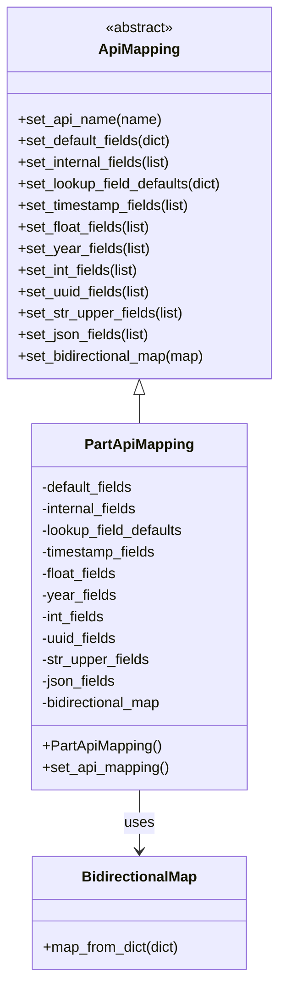

# Diagram: partview_core/partview_service/partview_service/api/part_to_container/handlers/mapping/PartApiMapping.py


> Auto-generated by Obscura crawlers

## Diagram 1



### SVG

<svg id="container" width="316.4609375" xmlns="http://www.w3.org/2000/svg" class="classDiagram" height="1088" viewBox="0 0 316.4609375 1088" role="graphics-document document" aria-roledescription="class"><style>#container{font-family:"trebuchet ms",verdana,arial,sans-serif;font-size:16px;fill:#333;}@keyframes edge-animation-frame{from{stroke-dashoffset:0;}}@keyframes dash{to{stroke-dashoffset:0;}}#container .edge-animation-slow{stroke-dasharray:9,5!important;stroke-dashoffset:900;animation:dash 50s linear infinite;stroke-linecap:round;}#container .edge-animation-fast{stroke-dasharray:9,5!important;stroke-dashoffset:900;animation:dash 20s linear infinite;stroke-linecap:round;}#container .error-icon{fill:#552222;}#container .error-text{fill:#552222;stroke:#552222;}#container .edge-thickness-normal{stroke-width:1px;}#container .edge-thickness-thick{stroke-width:3.5px;}#container .edge-pattern-solid{stroke-dasharray:0;}#container .edge-thickness-invisible{stroke-width:0;fill:none;}#container .edge-pattern-dashed{stroke-dasharray:3;}#container .edge-pattern-dotted{stroke-dasharray:2;}#container .marker{fill:#333333;stroke:#333333;}#container .marker.cross{stroke:#333333;}#container svg{font-family:"trebuchet ms",verdana,arial,sans-serif;font-size:16px;}#container p{margin:0;}#container g.classGroup text{fill:#9370DB;stroke:none;font-family:"trebuchet ms",verdana,arial,sans-serif;font-size:10px;}#container g.classGroup text .title{font-weight:bolder;}#container .nodeLabel,#container .edgeLabel{color:#131300;}#container .edgeLabel .label rect{fill:#ECECFF;}#container .label text{fill:#131300;}#container .labelBkg{background:#ECECFF;}#container .edgeLabel .label span{background:#ECECFF;}#container .classTitle{font-weight:bolder;}#container .node rect,#container .node circle,#container .node ellipse,#container .node polygon,#container .node path{fill:#ECECFF;stroke:#9370DB;stroke-width:1px;}#container .divider{stroke:#9370DB;stroke-width:1;}#container g.clickable{cursor:pointer;}#container g.classGroup rect{fill:#ECECFF;stroke:#9370DB;}#container g.classGroup line{stroke:#9370DB;stroke-width:1;}#container .classLabel .box{stroke:none;stroke-width:0;fill:#ECECFF;opacity:0.5;}#container .classLabel .label{fill:#9370DB;font-size:10px;}#container .relation{stroke:#333333;stroke-width:1;fill:none;}#container .dashed-line{stroke-dasharray:3;}#container .dotted-line{stroke-dasharray:1 2;}#container #compositionStart,#container .composition{fill:#333333!important;stroke:#333333!important;stroke-width:1;}#container #compositionEnd,#container .composition{fill:#333333!important;stroke:#333333!important;stroke-width:1;}#container #dependencyStart,#container .dependency{fill:#333333!important;stroke:#333333!important;stroke-width:1;}#container #dependencyStart,#container .dependency{fill:#333333!important;stroke:#333333!important;stroke-width:1;}#container #extensionStart,#container .extension{fill:transparent!important;stroke:#333333!important;stroke-width:1;}#container #extensionEnd,#container .extension{fill:transparent!important;stroke:#333333!important;stroke-width:1;}#container #aggregationStart,#container .aggregation{fill:transparent!important;stroke:#333333!important;stroke-width:1;}#container #aggregationEnd,#container .aggregation{fill:transparent!important;stroke:#333333!important;stroke-width:1;}#container #lollipopStart,#container .lollipop{fill:#ECECFF!important;stroke:#333333!important;stroke-width:1;}#container #lollipopEnd,#container .lollipop{fill:#ECECFF!important;stroke:#333333!important;stroke-width:1;}#container .edgeTerminals{font-size:11px;line-height:initial;}#container .classTitleText{text-anchor:middle;font-size:18px;fill:#333;}#container .label-icon{display:inline-block;height:1em;overflow:visible;vertical-align:-0.125em;}#container .node .label-icon path{fill:currentColor;stroke:revert;stroke-width:revert;}#container :root{--mermaid-font-family:"trebuchet ms",verdana,arial,sans-serif;}</style><g><defs><marker id="container_class-aggregationStart" class="marker aggregation class" refX="18" refY="7" markerWidth="190" markerHeight="240" orient="auto"><path d="M 18,7 L9,13 L1,7 L9,1 Z"></path></marker></defs><defs><marker id="container_class-aggregationEnd" class="marker aggregation class" refX="1" refY="7" markerWidth="20" markerHeight="28" orient="auto"><path d="M 18,7 L9,13 L1,7 L9,1 Z"></path></marker></defs><defs><marker id="container_class-extensionStart" class="marker extension class" refX="18" refY="7" markerWidth="190" markerHeight="240" orient="auto"><path d="M 1,7 L18,13 V 1 Z"></path></marker></defs><defs><marker id="container_class-extensionEnd" class="marker extension class" refX="1" refY="7" markerWidth="20" markerHeight="28" orient="auto"><path d="M 1,1 V 13 L18,7 Z"></path></marker></defs><defs><marker id="container_class-compositionStart" class="marker composition class" refX="18" refY="7" markerWidth="190" markerHeight="240" orient="auto"><path d="M 18,7 L9,13 L1,7 L9,1 Z"></path></marker></defs><defs><marker id="container_class-compositionEnd" class="marker composition class" refX="1" refY="7" markerWidth="20" markerHeight="28" orient="auto"><path d="M 18,7 L9,13 L1,7 L9,1 Z"></path></marker></defs><defs><marker id="container_class-dependencyStart" class="marker dependency class" refX="6" refY="7" markerWidth="190" markerHeight="240" orient="auto"><path d="M 5,7 L9,13 L1,7 L9,1 Z"></path></marker></defs><defs><marker id="container_class-dependencyEnd" class="marker dependency class" refX="13" refY="7" markerWidth="20" markerHeight="28" orient="auto"><path d="M 18,7 L9,13 L14,7 L9,1 Z"></path></marker></defs><defs><marker id="container_class-lollipopStart" class="marker lollipop class" refX="13" refY="7" markerWidth="190" markerHeight="240" orient="auto"><circle stroke="black" fill="transparent" cx="7" cy="7" r="6"></circle></marker></defs><defs><marker id="container_class-lollipopEnd" class="marker lollipop class" refX="1" refY="7" markerWidth="190" markerHeight="240" orient="auto"><circle stroke="black" fill="transparent" cx="7" cy="7" r="6"></circle></marker></defs><g class="root"><g class="clusters"></g><g class="edgePaths"><path d="M158.23,439.25L158.23,440.542C158.23,441.833,158.23,444.417,158.23,449.875C158.23,455.333,158.23,463.667,158.23,467.833L158.23,472" id="id_ApiMapping_PartApiMapping_1" class="edge-thickness-normal edge-pattern-solid relation" style=";;;" data-edge="true" data-et="edge" data-id="id_ApiMapping_PartApiMapping_1" data-points="W3sieCI6MTU4LjIzMDQ2ODc1LCJ5Ijo0MjJ9LHsieCI6MTU4LjIzMDQ2ODc1LCJ5Ijo0NDd9LHsieCI6MTU4LjIzMDQ2ODc1LCJ5Ijo0NzJ9XQ==" marker-start="url(#container_class-extensionStart)"></path><path d="M158.23,880L158.23,886.167C158.23,892.333,158.23,904.667,158.23,916C158.23,927.333,158.23,937.667,158.23,942.833L158.23,948" id="id_PartApiMapping_BidirectionalMap_2" class="edge-thickness-normal edge-pattern-solid relation" style=";;;" data-edge="true" data-et="edge" data-id="id_PartApiMapping_BidirectionalMap_2" data-points="W3sieCI6MTU4LjIzMDQ2ODc1LCJ5Ijo4ODB9LHsieCI6MTU4LjIzMDQ2ODc1LCJ5Ijo5MTd9LHsieCI6MTU4LjIzMDQ2ODc1LCJ5Ijo5NTR9XQ==" marker-end="url(#container_class-dependencyEnd)"></path></g><g class="edgeLabels"><g class="edgeLabel"><g class="label" data-id="id_ApiMapping_PartApiMapping_1" transform="translate(0, 0)"><foreignObject width="0" height="0"><div xmlns="http://www.w3.org/1999/xhtml" class="labelBkg" style="display: table-cell; white-space: nowrap; line-height: 1.5; max-width: 200px; text-align: center;"><span class="edgeLabel"></span></div></foreignObject></g></g><g class="edgeLabel" transform="translate(158.23046875, 917)"><g class="label" data-id="id_PartApiMapping_BidirectionalMap_2" transform="translate(-16.4921875, -12)"><foreignObject width="32.984375" height="24"><div xmlns="http://www.w3.org/1999/xhtml" class="labelBkg" style="display: table-cell; white-space: nowrap; line-height: 1.5; max-width: 200px; text-align: center;"><span class="edgeLabel"><p>uses</p></span></div></foreignObject></g></g></g><g class="nodes"><g class="node default" id="classId-ApiMapping-0" transform="translate(158.23046875, 215)"><g class="basic label-container"><path d="M-150.23046875 -207 L150.23046875 -207 L150.23046875 207 L-150.23046875 207" stroke="none" stroke-width="0" fill="#ECECFF" style=""></path><path d="M-150.23046875 -207 C-34.937863204598656 -207, 80.35474234080269 -207, 150.23046875 -207 M-150.23046875 -207 C-34.353005221143306 -207, 81.52445830771339 -207, 150.23046875 -207 M150.23046875 -207 C150.23046875 -63.79539990644025, 150.23046875 79.4092001871195, 150.23046875 207 M150.23046875 -207 C150.23046875 -99.49303650410972, 150.23046875 8.01392699178055, 150.23046875 207 M150.23046875 207 C89.16635122622695 207, 28.1022337024539 207, -150.23046875 207 M150.23046875 207 C39.9384204880313 207, -70.3536277739374 207, -150.23046875 207 M-150.23046875 207 C-150.23046875 43.93158999191991, -150.23046875 -119.13682001616019, -150.23046875 -207 M-150.23046875 207 C-150.23046875 117.58258057195107, -150.23046875 28.16516114390214, -150.23046875 -207" stroke="#9370DB" stroke-width="1.3" fill="none" stroke-dasharray="0 0" style=""></path></g><g class="annotation-group text" transform="translate(-38.609375, -183)"><g class="label" style="" transform="translate(0,-12)"><foreignObject width="77.21875" height="24"><div xmlns="http://www.w3.org/1999/xhtml" style="display: table-cell; white-space: nowrap; line-height: 1.5; max-width: 127px; text-align: center;"><span class="nodeLabel markdown-node-label" style=""><p>«abstract»</p></span></div></foreignObject></g></g><g class="label-group text" transform="translate(-43.2578125, -159)"><g class="label" style="font-weight: bolder" transform="translate(0,-12)"><foreignObject width="86.515625" height="24"><div xmlns="http://www.w3.org/1999/xhtml" style="display: table-cell; white-space: nowrap; line-height: 1.5; max-width: 136px; text-align: center;"><span class="nodeLabel markdown-node-label" style=""><p>ApiMapping</p></span></div></foreignObject></g></g><g class="members-group text" transform="translate(-138.23046875, -111)"></g><g class="methods-group text" transform="translate(-138.23046875, -81)"><g class="label" style="" transform="translate(0,-12)"><foreignObject width="160.390625" height="24"><div xmlns="http://www.w3.org/1999/xhtml" style="display: table-cell; white-space: nowrap; line-height: 1.5; max-width: 218px; text-align: center;"><span class="nodeLabel markdown-node-label" style=""><p>+set_api_name(name)</p></span></div></foreignObject></g><g class="label" style="" transform="translate(0,12)"><foreignObject width="175.171875" height="24"><div xmlns="http://www.w3.org/1999/xhtml" style="display: table-cell; white-space: nowrap; line-height: 1.5; max-width: 233px; text-align: center;"><span class="nodeLabel markdown-node-label" style=""><p>+set_default_fields(dict)</p></span></div></foreignObject></g><g class="label" style="" transform="translate(0,36)"><foreignObject width="175.59375" height="24"><div xmlns="http://www.w3.org/1999/xhtml" style="display: table-cell; white-space: nowrap; line-height: 1.5; max-width: 233px; text-align: center;"><span class="nodeLabel markdown-node-label" style=""><p>+set_internal_fields(list)</p></span></div></foreignObject></g><g class="label" style="" transform="translate(0,60)"><foreignObject width="233.203125" height="24"><div xmlns="http://www.w3.org/1999/xhtml" style="display: table-cell; white-space: nowrap; line-height: 1.5; max-width: 291px; text-align: center;"><span class="nodeLabel markdown-node-label" style=""><p>+set_lookup_field_defaults(dict)</p></span></div></foreignObject></g><g class="label" style="" transform="translate(0,84)"><foreignObject width="195.796875" height="24"><div xmlns="http://www.w3.org/1999/xhtml" style="display: table-cell; white-space: nowrap; line-height: 1.5; max-width: 253px; text-align: center;"><span class="nodeLabel markdown-node-label" style=""><p>+set_timestamp_fields(list)</p></span></div></foreignObject></g><g class="label" style="" transform="translate(0,108)"><foreignObject width="151.40625" height="24"><div xmlns="http://www.w3.org/1999/xhtml" style="display: table-cell; white-space: nowrap; line-height: 1.5; max-width: 209px; text-align: center;"><span class="nodeLabel markdown-node-label" style=""><p>+set_float_fields(list)</p></span></div></foreignObject></g><g class="label" style="" transform="translate(0,132)"><foreignObject width="148.46875" height="24"><div xmlns="http://www.w3.org/1999/xhtml" style="display: table-cell; white-space: nowrap; line-height: 1.5; max-width: 206px; text-align: center;"><span class="nodeLabel markdown-node-label" style=""><p>+set_year_fields(list)</p></span></div></foreignObject></g><g class="label" style="" transform="translate(0,156)"><foreignObject width="138.328125" height="24"><div xmlns="http://www.w3.org/1999/xhtml" style="display: table-cell; white-space: nowrap; line-height: 1.5; max-width: 196px; text-align: center;"><span class="nodeLabel markdown-node-label" style=""><p>+set_int_fields(list)</p></span></div></foreignObject></g><g class="label" style="" transform="translate(0,180)"><foreignObject width="151.046875" height="24"><div xmlns="http://www.w3.org/1999/xhtml" style="display: table-cell; white-space: nowrap; line-height: 1.5; max-width: 208px; text-align: center;"><span class="nodeLabel markdown-node-label" style=""><p>+set_uuid_fields(list)</p></span></div></foreignObject></g><g class="label" style="" transform="translate(0,204)"><foreignObject width="186.75" height="24"><div xmlns="http://www.w3.org/1999/xhtml" style="display: table-cell; white-space: nowrap; line-height: 1.5; max-width: 244px; text-align: center;"><span class="nodeLabel markdown-node-label" style=""><p>+set_str_upper_fields(list)</p></span></div></foreignObject></g><g class="label" style="" transform="translate(0,228)"><foreignObject width="149.90625" height="24"><div xmlns="http://www.w3.org/1999/xhtml" style="display: table-cell; white-space: nowrap; line-height: 1.5; max-width: 207px; text-align: center;"><span class="nodeLabel markdown-node-label" style=""><p>+set_json_fields(list)</p></span></div></foreignObject></g><g class="label" style="" transform="translate(0,252)"><foreignObject width="213.203125" height="24"><div xmlns="http://www.w3.org/1999/xhtml" style="display: table-cell; white-space: nowrap; line-height: 1.5; max-width: 271px; text-align: center;"><span class="nodeLabel markdown-node-label" style=""><p>+set_bidirectional_map(map)</p></span></div></foreignObject></g></g><g class="divider" style=""><path d="M-150.23046875 -135 C-62.41737516544097 -135, 25.395718419118054 -135, 150.23046875 -135 M-150.23046875 -135 C-78.85148384899396 -135, -7.47249894798793 -135, 150.23046875 -135" stroke="#9370DB" stroke-width="1.3" fill="none" stroke-dasharray="0 0" style=""></path></g><g class="divider" style=""><path d="M-150.23046875 -111 C-56.180696409960376 -111, 37.86907593007925 -111, 150.23046875 -111 M-150.23046875 -111 C-33.36619761433077 -111, 83.49807352133845 -111, 150.23046875 -111" stroke="#9370DB" stroke-width="1.3" fill="none" stroke-dasharray="0 0" style=""></path></g></g><g class="node default" id="classId-PartApiMapping-1" transform="translate(158.23046875, 676)"><g class="basic label-container"><path d="M-122.99609375 -204 L122.99609375 -204 L122.99609375 204 L-122.99609375 204" stroke="none" stroke-width="0" fill="#ECECFF" style=""></path><path d="M-122.99609375 -204 C-50.6918925526555 -204, 21.612308644688994 -204, 122.99609375 -204 M-122.99609375 -204 C-63.69538056106031 -204, -4.394667372120622 -204, 122.99609375 -204 M122.99609375 -204 C122.99609375 -111.58988629821266, 122.99609375 -19.179772596425323, 122.99609375 204 M122.99609375 -204 C122.99609375 -64.26999782218667, 122.99609375 75.46000435562667, 122.99609375 204 M122.99609375 204 C66.12057410458713 204, 9.24505445917427 204, -122.99609375 204 M122.99609375 204 C47.17328206004005 204, -28.649529629919897 204, -122.99609375 204 M-122.99609375 204 C-122.99609375 73.43136097892807, -122.99609375 -57.13727804214386, -122.99609375 -204 M-122.99609375 204 C-122.99609375 87.12658287620918, -122.99609375 -29.74683424758163, -122.99609375 -204" stroke="#9370DB" stroke-width="1.3" fill="none" stroke-dasharray="0 0" style=""></path></g><g class="annotation-group text" transform="translate(0, -180)"></g><g class="label-group text" transform="translate(-58.3203125, -180)"><g class="label" style="font-weight: bolder" transform="translate(0,-12)"><foreignObject width="116.640625" height="24"><div xmlns="http://www.w3.org/1999/xhtml" style="display: table-cell; white-space: nowrap; line-height: 1.5; max-width: 165px; text-align: center;"><span class="nodeLabel markdown-node-label" style=""><p>PartApiMapping</p></span></div></foreignObject></g></g><g class="members-group text" transform="translate(-110.99609375, -132)"><g class="label" style="" transform="translate(0,-12)"><foreignObject width="105.796875" height="24"><div xmlns="http://www.w3.org/1999/xhtml" style="display: table-cell; white-space: nowrap; line-height: 1.5; max-width: 163px; text-align: center;"><span class="nodeLabel markdown-node-label" style=""><p>-default_fields</p></span></div></foreignObject></g><g class="label" style="" transform="translate(0,12)"><foreignObject width="110.953125" height="24"><div xmlns="http://www.w3.org/1999/xhtml" style="display: table-cell; white-space: nowrap; line-height: 1.5; max-width: 168px; text-align: center;"><span class="nodeLabel markdown-node-label" style=""><p>-internal_fields</p></span></div></foreignObject></g><g class="label" style="" transform="translate(0,36)"><foreignObject width="163.671875" height="24"><div xmlns="http://www.w3.org/1999/xhtml" style="display: table-cell; white-space: nowrap; line-height: 1.5; max-width: 221px; text-align: center;"><span class="nodeLabel markdown-node-label" style=""><p>-lookup_field_defaults</p></span></div></foreignObject></g><g class="label" style="" transform="translate(0,60)"><foreignObject width="131.40625" height="24"><div xmlns="http://www.w3.org/1999/xhtml" style="display: table-cell; white-space: nowrap; line-height: 1.5; max-width: 189px; text-align: center;"><span class="nodeLabel markdown-node-label" style=""><p>-timestamp_fields</p></span></div></foreignObject></g><g class="label" style="" transform="translate(0,84)"><foreignObject width="86.84375" height="24"><div xmlns="http://www.w3.org/1999/xhtml" style="display: table-cell; white-space: nowrap; line-height: 1.5; max-width: 144px; text-align: center;"><span class="nodeLabel markdown-node-label" style=""><p>-float_fields</p></span></div></foreignObject></g><g class="label" style="" transform="translate(0,108)"><foreignObject width="83.828125" height="24"><div xmlns="http://www.w3.org/1999/xhtml" style="display: table-cell; white-space: nowrap; line-height: 1.5; max-width: 141px; text-align: center;"><span class="nodeLabel markdown-node-label" style=""><p>-year_fields</p></span></div></foreignObject></g><g class="label" style="" transform="translate(0,132)"><foreignObject width="73.6875" height="24"><div xmlns="http://www.w3.org/1999/xhtml" style="display: table-cell; white-space: nowrap; line-height: 1.5; max-width: 131px; text-align: center;"><span class="nodeLabel markdown-node-label" style=""><p>-int_fields</p></span></div></foreignObject></g><g class="label" style="" transform="translate(0,156)"><foreignObject width="86.734375" height="24"><div xmlns="http://www.w3.org/1999/xhtml" style="display: table-cell; white-space: nowrap; line-height: 1.5; max-width: 144px; text-align: center;"><span class="nodeLabel markdown-node-label" style=""><p>-uuid_fields</p></span></div></foreignObject></g><g class="label" style="" transform="translate(0,180)"><foreignObject width="122.109375" height="24"><div xmlns="http://www.w3.org/1999/xhtml" style="display: table-cell; white-space: nowrap; line-height: 1.5; max-width: 179px; text-align: center;"><span class="nodeLabel markdown-node-label" style=""><p>-str_upper_fields</p></span></div></foreignObject></g><g class="label" style="" transform="translate(0,204)"><foreignObject width="84.53125" height="24"><div xmlns="http://www.w3.org/1999/xhtml" style="display: table-cell; white-space: nowrap; line-height: 1.5; max-width: 142px; text-align: center;"><span class="nodeLabel markdown-node-label" style=""><p>-json_fields</p></span></div></foreignObject></g><g class="label" style="" transform="translate(0,228)"><foreignObject width="139.09375" height="24"><div xmlns="http://www.w3.org/1999/xhtml" style="display: table-cell; white-space: nowrap; line-height: 1.5; max-width: 196px; text-align: center;"><span class="nodeLabel markdown-node-label" style=""><p>-bidirectional_map</p></span></div></foreignObject></g></g><g class="methods-group text" transform="translate(-110.99609375, 156)"><g class="label" style="" transform="translate(0,-12)"><foreignObject width="132.984375" height="24"><div xmlns="http://www.w3.org/1999/xhtml" style="display: table-cell; white-space: nowrap; line-height: 1.5; max-width: 190px; text-align: center;"><span class="nodeLabel markdown-node-label" style=""><p>+PartApiMapping()</p></span></div></foreignObject></g><g class="label" style="" transform="translate(0,12)"><foreignObject width="143" height="24"><div xmlns="http://www.w3.org/1999/xhtml" style="display: table-cell; white-space: nowrap; line-height: 1.5; max-width: 200px; text-align: center;"><span class="nodeLabel markdown-node-label" style=""><p>+set_api_mapping()</p></span></div></foreignObject></g></g><g class="divider" style=""><path d="M-122.99609375 -156 C-44.40711916276804 -156, 34.18185542446392 -156, 122.99609375 -156 M-122.99609375 -156 C-29.002211276188888 -156, 64.99167119762222 -156, 122.99609375 -156" stroke="#9370DB" stroke-width="1.3" fill="none" stroke-dasharray="0 0" style=""></path></g><g class="divider" style=""><path d="M-122.99609375 132 C-28.100743111942123 132, 66.79460752611575 132, 122.99609375 132 M-122.99609375 132 C-62.74834113719307 132, -2.5005885243861457 132, 122.99609375 132" stroke="#9370DB" stroke-width="1.3" fill="none" stroke-dasharray="0 0" style=""></path></g></g><g class="node default" id="classId-BidirectionalMap-2" transform="translate(158.23046875, 1017)"><g class="basic label-container"><path d="M-120.65234375 -63 L120.65234375 -63 L120.65234375 63 L-120.65234375 63" stroke="none" stroke-width="0" fill="#ECECFF" style=""></path><path d="M-120.65234375 -63 C-34.96598029099003 -63, 50.720383168019936 -63, 120.65234375 -63 M-120.65234375 -63 C-26.910566880231983 -63, 66.83120998953603 -63, 120.65234375 -63 M120.65234375 -63 C120.65234375 -33.26916331293596, 120.65234375 -3.5383266258719246, 120.65234375 63 M120.65234375 -63 C120.65234375 -31.773918562719476, 120.65234375 -0.5478371254389529, 120.65234375 63 M120.65234375 63 C29.693869714892855 63, -61.26460432021429 63, -120.65234375 63 M120.65234375 63 C63.631838560252774 63, 6.611333370505548 63, -120.65234375 63 M-120.65234375 63 C-120.65234375 23.968749811241132, -120.65234375 -15.062500377517736, -120.65234375 -63 M-120.65234375 63 C-120.65234375 29.471492862684997, -120.65234375 -4.057014274630006, -120.65234375 -63" stroke="#9370DB" stroke-width="1.3" fill="none" stroke-dasharray="0 0" style=""></path></g><g class="annotation-group text" transform="translate(0, -39)"></g><g class="label-group text" transform="translate(-62.2265625, -39)"><g class="label" style="font-weight: bolder" transform="translate(0,-12)"><foreignObject width="124.453125" height="24"><div xmlns="http://www.w3.org/1999/xhtml" style="display: table-cell; white-space: nowrap; line-height: 1.5; max-width: 173px; text-align: center;"><span class="nodeLabel markdown-node-label" style=""><p>BidirectionalMap</p></span></div></foreignObject></g></g><g class="members-group text" transform="translate(-108.65234375, 9)"></g><g class="methods-group text" transform="translate(-108.65234375, 39)"><g class="label" style="" transform="translate(0,-12)"><foreignObject width="155.078125" height="24"><div xmlns="http://www.w3.org/1999/xhtml" style="display: table-cell; white-space: nowrap; line-height: 1.5; max-width: 212px; text-align: center;"><span class="nodeLabel markdown-node-label" style=""><p>+map_from_dict(dict)</p></span></div></foreignObject></g></g><g class="divider" style=""><path d="M-120.65234375 -15 C-45.8905737447778 -15, 28.871196260444407 -15, 120.65234375 -15 M-120.65234375 -15 C-45.79408411575167 -15, 29.064175518496654 -15, 120.65234375 -15" stroke="#9370DB" stroke-width="1.3" fill="none" stroke-dasharray="0 0" style=""></path></g><g class="divider" style=""><path d="M-120.65234375 9 C-42.579510231406076 9, 35.49332328718785 9, 120.65234375 9 M-120.65234375 9 C-60.949962035201516 9, -1.2475803204030314 9, 120.65234375 9" stroke="#9370DB" stroke-width="1.3" fill="none" stroke-dasharray="0 0" style=""></path></g></g></g></g></g></svg>

## Diagram 2

```mermaid
flowchart LR
    Start["start: PartApiMapping.set_api_mapping()"]
    A[set_api_name(\"Part\")] 
    B[set_default_fields({...})]
    C[set_internal_fields([\"solution_id\",\"actor_id\"])]
    D[set_lookup_field_defaults({\"entity_type_id\":\"Part\"})]
    E[set_timestamp_fields([\"shipped_date\"])]
    F[set_float_fields([...])]
    G[set_year_fields([\"introduced_year\"])]
    H[set_int_fields([...])]
    I[set_uuid_fields([\"entity_type_id\"])]
    J[set_str_upper_fields([\"status\",\"lifecycle_state\"])]
    K[set_json_fields([\"custom_fields\"])]
    L[create BidirectionalMap and map_from_dict({...})]
    M[set_bidirectional_map(map)]
    End["return self"]
    Start --> A --> B --> C --> D --> E --> F --> G --> H --> I --> J --> K --> L --> M --> End
```

> SVG rendering failed for this diagram.
