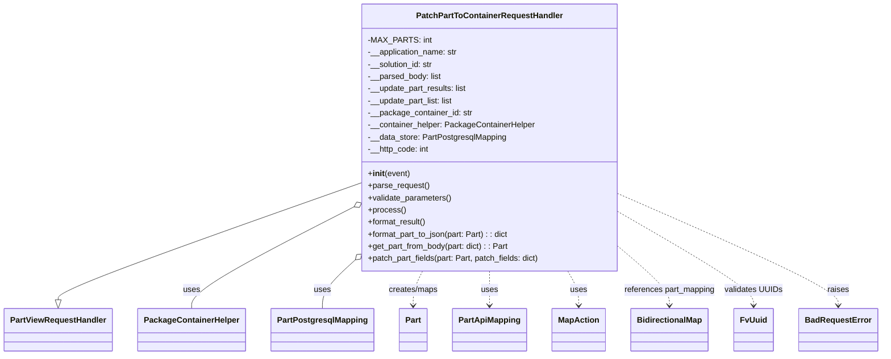

# Diagram: partview_core/partview_service/partview_service/api/part_to_container/handlers/patch_part_to_container.py


> Auto-generated by Obscura crawlers

## Diagram 1



### SVG

<svg id="container" width="1694.5546875" xmlns="http://www.w3.org/2000/svg" class="classDiagram" height="702" viewBox="0 0 1694.5546875 702" role="graphics-document document" aria-roledescription="class"><style>#container{font-family:"trebuchet ms",verdana,arial,sans-serif;font-size:16px;fill:#333;}@keyframes edge-animation-frame{from{stroke-dashoffset:0;}}@keyframes dash{to{stroke-dashoffset:0;}}#container .edge-animation-slow{stroke-dasharray:9,5!important;stroke-dashoffset:900;animation:dash 50s linear infinite;stroke-linecap:round;}#container .edge-animation-fast{stroke-dasharray:9,5!important;stroke-dashoffset:900;animation:dash 20s linear infinite;stroke-linecap:round;}#container .error-icon{fill:#552222;}#container .error-text{fill:#552222;stroke:#552222;}#container .edge-thickness-normal{stroke-width:1px;}#container .edge-thickness-thick{stroke-width:3.5px;}#container .edge-pattern-solid{stroke-dasharray:0;}#container .edge-thickness-invisible{stroke-width:0;fill:none;}#container .edge-pattern-dashed{stroke-dasharray:3;}#container .edge-pattern-dotted{stroke-dasharray:2;}#container .marker{fill:#333333;stroke:#333333;}#container .marker.cross{stroke:#333333;}#container svg{font-family:"trebuchet ms",verdana,arial,sans-serif;font-size:16px;}#container p{margin:0;}#container g.classGroup text{fill:#9370DB;stroke:none;font-family:"trebuchet ms",verdana,arial,sans-serif;font-size:10px;}#container g.classGroup text .title{font-weight:bolder;}#container .nodeLabel,#container .edgeLabel{color:#131300;}#container .edgeLabel .label rect{fill:#ECECFF;}#container .label text{fill:#131300;}#container .labelBkg{background:#ECECFF;}#container .edgeLabel .label span{background:#ECECFF;}#container .classTitle{font-weight:bolder;}#container .node rect,#container .node circle,#container .node ellipse,#container .node polygon,#container .node path{fill:#ECECFF;stroke:#9370DB;stroke-width:1px;}#container .divider{stroke:#9370DB;stroke-width:1;}#container g.clickable{cursor:pointer;}#container g.classGroup rect{fill:#ECECFF;stroke:#9370DB;}#container g.classGroup line{stroke:#9370DB;stroke-width:1;}#container .classLabel .box{stroke:none;stroke-width:0;fill:#ECECFF;opacity:0.5;}#container .classLabel .label{fill:#9370DB;font-size:10px;}#container .relation{stroke:#333333;stroke-width:1;fill:none;}#container .dashed-line{stroke-dasharray:3;}#container .dotted-line{stroke-dasharray:1 2;}#container #compositionStart,#container .composition{fill:#333333!important;stroke:#333333!important;stroke-width:1;}#container #compositionEnd,#container .composition{fill:#333333!important;stroke:#333333!important;stroke-width:1;}#container #dependencyStart,#container .dependency{fill:#333333!important;stroke:#333333!important;stroke-width:1;}#container #dependencyStart,#container .dependency{fill:#333333!important;stroke:#333333!important;stroke-width:1;}#container #extensionStart,#container .extension{fill:transparent!important;stroke:#333333!important;stroke-width:1;}#container #extensionEnd,#container .extension{fill:transparent!important;stroke:#333333!important;stroke-width:1;}#container #aggregationStart,#container .aggregation{fill:transparent!important;stroke:#333333!important;stroke-width:1;}#container #aggregationEnd,#container .aggregation{fill:transparent!important;stroke:#333333!important;stroke-width:1;}#container #lollipopStart,#container .lollipop{fill:#ECECFF!important;stroke:#333333!important;stroke-width:1;}#container #lollipopEnd,#container .lollipop{fill:#ECECFF!important;stroke:#333333!important;stroke-width:1;}#container .edgeTerminals{font-size:11px;line-height:initial;}#container .classTitleText{text-anchor:middle;font-size:18px;fill:#333;}#container .label-icon{display:inline-block;height:1em;overflow:visible;vertical-align:-0.125em;}#container .node .label-icon path{fill:currentColor;stroke:revert;stroke-width:revert;}#container :root{--mermaid-font-family:"trebuchet ms",verdana,arial,sans-serif;}</style><g><defs><marker id="container_class-aggregationStart" class="marker aggregation class" refX="18" refY="7" markerWidth="190" markerHeight="240" orient="auto"><path d="M 18,7 L9,13 L1,7 L9,1 Z"></path></marker></defs><defs><marker id="container_class-aggregationEnd" class="marker aggregation class" refX="1" refY="7" markerWidth="20" markerHeight="28" orient="auto"><path d="M 18,7 L9,13 L1,7 L9,1 Z"></path></marker></defs><defs><marker id="container_class-extensionStart" class="marker extension class" refX="18" refY="7" markerWidth="190" markerHeight="240" orient="auto"><path d="M 1,7 L18,13 V 1 Z"></path></marker></defs><defs><marker id="container_class-extensionEnd" class="marker extension class" refX="1" refY="7" markerWidth="20" markerHeight="28" orient="auto"><path d="M 1,1 V 13 L18,7 Z"></path></marker></defs><defs><marker id="container_class-compositionStart" class="marker composition class" refX="18" refY="7" markerWidth="190" markerHeight="240" orient="auto"><path d="M 18,7 L9,13 L1,7 L9,1 Z"></path></marker></defs><defs><marker id="container_class-compositionEnd" class="marker composition class" refX="1" refY="7" markerWidth="20" markerHeight="28" orient="auto"><path d="M 18,7 L9,13 L1,7 L9,1 Z"></path></marker></defs><defs><marker id="container_class-dependencyStart" class="marker dependency class" refX="6" refY="7" markerWidth="190" markerHeight="240" orient="auto"><path d="M 5,7 L9,13 L1,7 L9,1 Z"></path></marker></defs><defs><marker id="container_class-dependencyEnd" class="marker dependency class" refX="13" refY="7" markerWidth="20" markerHeight="28" orient="auto"><path d="M 18,7 L9,13 L14,7 L9,1 Z"></path></marker></defs><defs><marker id="container_class-lollipopStart" class="marker lollipop class" refX="13" refY="7" markerWidth="190" markerHeight="240" orient="auto"><circle stroke="black" fill="transparent" cx="7" cy="7" r="6"></circle></marker></defs><defs><marker id="container_class-lollipopEnd" class="marker lollipop class" refX="1" refY="7" markerWidth="190" markerHeight="240" orient="auto"><circle stroke="black" fill="transparent" cx="7" cy="7" r="6"></circle></marker></defs><g class="root"><g class="clusters"></g><g class="edgePaths"><path d="M684.848,364.193L589.266,398.994C493.685,433.795,302.522,503.398,206.941,541.49C111.359,579.583,111.359,586.167,111.359,589.458L111.359,592.75" id="id_PatchPartToContainerRequestHandler_PartViewRequestHandler_1" class="edge-thickness-normal edge-pattern-solid relation" style=";;;" data-edge="true" data-et="edge" data-id="id_PatchPartToContainerRequestHandler_PartViewRequestHandler_1" data-points="W3sieCI6Njg0Ljg0NzY1NjI1LCJ5IjozNjQuMTkyNzUyNTgyMjg4M30seyJ4IjoxMTEuMzU5Mzc1LCJ5Ijo1NzN9LHsieCI6MTExLjM1OTM3NSwieSI6NjEwfV0=" marker-end="url(#container_class-extensionEnd)"></path><path d="M669.586,413.431L619.103,440.026C568.62,466.621,467.654,519.81,417.171,552.572C366.688,585.333,366.688,597.667,366.688,603.833L366.688,610" id="id_PatchPartToContainerRequestHandler_PackageContainerHelper_2" class="edge-thickness-normal edge-pattern-solid relation" style=";;;" data-edge="true" data-et="edge" data-id="id_PatchPartToContainerRequestHandler_PackageContainerHelper_2" data-points="W3sieCI6Njg0Ljg0NzY1NjI1LCJ5Ijo0MDUuMzkxMTMyODM2NTM1Mn0seyJ4IjozNjYuNjg3NSwieSI6NTczfSx7IngiOjM2Ni42ODc1LCJ5Ijo2MTB9XQ==" marker-start="url(#container_class-aggregationStart)"></path><path d="M672.247,520.526L662.894,529.272C653.54,538.018,634.832,555.509,625.479,570.421C616.125,585.333,616.125,597.667,616.125,603.833L616.125,610" id="id_PatchPartToContainerRequestHandler_PartPostgresqlMapping_3" class="edge-thickness-normal edge-pattern-solid relation" style=";;;" data-edge="true" data-et="edge" data-id="id_PatchPartToContainerRequestHandler_PartPostgresqlMapping_3" data-points="W3sieCI6Njg0Ljg0NzY1NjI1LCJ5Ijo1MDguNzQ1MjI1MzI1Nzk0Mn0seyJ4Ijo2MTYuMTI1LCJ5Ijo1NzN9LHsieCI6NjE2LjEyNSwieSI6NjEwfV0=" marker-start="url(#container_class-aggregationStart)"></path><path d="M808.782,536L805.762,542.167C802.743,548.333,796.703,560.667,793.684,572C790.664,583.333,790.664,593.667,790.664,598.833L790.664,604" id="id_PatchPartToContainerRequestHandler_Part_4" class="edge-thickness-normal edge-pattern-dashed relation" style=";;;" data-edge="true" data-et="edge" data-id="id_PatchPartToContainerRequestHandler_Part_4" data-points="W3sieCI6ODA4Ljc4MTg0Njk2ODQzODYsInkiOjUzNn0seyJ4Ijo3OTAuNjY0MDYyNSwieSI6NTczfSx7IngiOjc5MC42NjQwNjI1LCJ5Ijo2MTB9XQ==" marker-end="url(#container_class-dependencyEnd)"></path><path d="M938.055,536L938.055,542.167C938.055,548.333,938.055,560.667,938.055,572C938.055,583.333,938.055,593.667,938.055,598.833L938.055,604" id="id_PatchPartToContainerRequestHandler_PartApiMapping_5" class="edge-thickness-normal edge-pattern-dashed relation" style=";;;" data-edge="true" data-et="edge" data-id="id_PatchPartToContainerRequestHandler_PartApiMapping_5" data-points="W3sieCI6OTM4LjA1NDY4NzUsInkiOjUzNn0seyJ4Ijo5MzguMDU0Njg3NSwieSI6NTczfSx7IngiOjkzOC4wNTQ2ODc1LCJ5Ijo2MTB9XQ==" marker-end="url(#container_class-dependencyEnd)"></path><path d="M1087.994,536L1091.496,542.167C1094.998,548.333,1102.003,560.667,1105.505,572C1109.008,583.333,1109.008,593.667,1109.008,598.833L1109.008,604" id="id_PatchPartToContainerRequestHandler_MapAction_6" class="edge-thickness-normal edge-pattern-dashed relation" style=";;;" data-edge="true" data-et="edge" data-id="id_PatchPartToContainerRequestHandler_MapAction_6" data-points="W3sieCI6MTA4Ny45OTM2NDA5ODgzNzIxLCJ5Ijo1MzZ9LHsieCI6MTEwOS4wMDc4MTI1LCJ5Ijo1NzN9LHsieCI6MTEwOS4wMDc4MTI1LCJ5Ijo2MTB9XQ==" marker-end="url(#container_class-dependencyEnd)"></path><path d="M1191.262,492.395L1206.696,505.829C1222.13,519.263,1252.999,546.132,1268.433,564.732C1283.867,583.333,1283.867,593.667,1283.867,598.833L1283.867,604" id="id_PatchPartToContainerRequestHandler_BidirectionalMap_7" class="edge-thickness-normal edge-pattern-dashed relation" style=";;;" data-edge="true" data-et="edge" data-id="id_PatchPartToContainerRequestHandler_BidirectionalMap_7" data-points="W3sieCI6MTE5MS4yNjE3MTg3NSwieSI6NDkyLjM5NDkxNDYwMzI4OTM1fSx7IngiOjEyODMuODY3MTg3NSwieSI6NTczfSx7IngiOjEyODMuODY3MTg3NSwieSI6NjEwfV0=" marker-end="url(#container_class-dependencyEnd)"></path><path d="M1191.262,420.459L1234.623,445.883C1277.984,471.306,1364.707,522.153,1408.068,552.743C1451.43,583.333,1451.43,593.667,1451.43,598.833L1451.43,604" id="id_PatchPartToContainerRequestHandler_FvUuid_8" class="edge-thickness-normal edge-pattern-dashed relation" style=";;;" data-edge="true" data-et="edge" data-id="id_PatchPartToContainerRequestHandler_FvUuid_8" data-points="W3sieCI6MTE5MS4yNjE3MTg3NSwieSI6NDIwLjQ1OTM0NTMyNTA1NDc2fSx7IngiOjE0NTEuNDI5Njg3NSwieSI6NTczfSx7IngiOjE0NTEuNDI5Njg3NSwieSI6NjEwfV0=" marker-end="url(#container_class-dependencyEnd)"></path><path d="M1191.262,385.042L1261.43,416.369C1331.599,447.695,1471.936,510.347,1542.105,546.84C1612.273,583.333,1612.273,593.667,1612.273,598.833L1612.273,604" id="id_PatchPartToContainerRequestHandler_BadRequestError_9" class="edge-thickness-normal edge-pattern-dashed relation" style=";;;" data-edge="true" data-et="edge" data-id="id_PatchPartToContainerRequestHandler_BadRequestError_9" data-points="W3sieCI6MTE5MS4yNjE3MTg3NSwieSI6Mzg1LjA0MjQxNTk5MDczfSx7IngiOjE2MTIuMjczNDM3NSwieSI6NTczfSx7IngiOjE2MTIuMjczNDM3NSwieSI6NjEwfV0=" marker-end="url(#container_class-dependencyEnd)"></path></g><g class="edgeLabels"><g class="edgeLabel"><g class="label" data-id="id_PatchPartToContainerRequestHandler_PartViewRequestHandler_1" transform="translate(0, 0)"><foreignObject width="0" height="0"><div xmlns="http://www.w3.org/1999/xhtml" class="labelBkg" style="display: table-cell; white-space: nowrap; line-height: 1.5; max-width: 200px; text-align: center;"><span class="edgeLabel"></span></div></foreignObject></g></g><g class="edgeLabel" transform="translate(366.6875, 573)"><g class="label" data-id="id_PatchPartToContainerRequestHandler_PackageContainerHelper_2" transform="translate(-16.4921875, -12)"><foreignObject width="32.984375" height="24"><div xmlns="http://www.w3.org/1999/xhtml" class="labelBkg" style="display: table-cell; white-space: nowrap; line-height: 1.5; max-width: 200px; text-align: center;"><span class="edgeLabel"><p>uses</p></span></div></foreignObject></g></g><g class="edgeLabel" transform="translate(616.125, 573)"><g class="label" data-id="id_PatchPartToContainerRequestHandler_PartPostgresqlMapping_3" transform="translate(-16.4921875, -12)"><foreignObject width="32.984375" height="24"><div xmlns="http://www.w3.org/1999/xhtml" class="labelBkg" style="display: table-cell; white-space: nowrap; line-height: 1.5; max-width: 200px; text-align: center;"><span class="edgeLabel"><p>uses</p></span></div></foreignObject></g></g><g class="edgeLabel" transform="translate(790.6640625, 573)"><g class="label" data-id="id_PatchPartToContainerRequestHandler_Part_4" transform="translate(-49.7890625, -12)"><foreignObject width="99.578125" height="24"><div xmlns="http://www.w3.org/1999/xhtml" class="labelBkg" style="display: table-cell; white-space: nowrap; line-height: 1.5; max-width: 200px; text-align: center;"><span class="edgeLabel"><p>creates/maps</p></span></div></foreignObject></g></g><g class="edgeLabel" transform="translate(938.0546875, 573)"><g class="label" data-id="id_PatchPartToContainerRequestHandler_PartApiMapping_5" transform="translate(-16.4921875, -12)"><foreignObject width="32.984375" height="24"><div xmlns="http://www.w3.org/1999/xhtml" class="labelBkg" style="display: table-cell; white-space: nowrap; line-height: 1.5; max-width: 200px; text-align: center;"><span class="edgeLabel"><p>uses</p></span></div></foreignObject></g></g><g class="edgeLabel" transform="translate(1109.0078125, 573)"><g class="label" data-id="id_PatchPartToContainerRequestHandler_MapAction_6" transform="translate(-16.4921875, -12)"><foreignObject width="32.984375" height="24"><div xmlns="http://www.w3.org/1999/xhtml" class="labelBkg" style="display: table-cell; white-space: nowrap; line-height: 1.5; max-width: 200px; text-align: center;"><span class="edgeLabel"><p>uses</p></span></div></foreignObject></g></g><g class="edgeLabel" transform="translate(1283.8671875, 573)"><g class="label" data-id="id_PatchPartToContainerRequestHandler_BidirectionalMap_7" transform="translate(-90.921875, -12)"><foreignObject width="181.84375" height="24"><div xmlns="http://www.w3.org/1999/xhtml" class="labelBkg" style="display: table-cell; white-space: nowrap; line-height: 1.5; max-width: 200px; text-align: center;"><span class="edgeLabel"><p>references part_mapping</p></span></div></foreignObject></g></g><g class="edgeLabel" transform="translate(1451.4296875, 573)"><g class="label" data-id="id_PatchPartToContainerRequestHandler_FvUuid_8" transform="translate(-56.640625, -12)"><foreignObject width="113.28125" height="24"><div xmlns="http://www.w3.org/1999/xhtml" class="labelBkg" style="display: table-cell; white-space: nowrap; line-height: 1.5; max-width: 200px; text-align: center;"><span class="edgeLabel"><p>validates UUIDs</p></span></div></foreignObject></g></g><g class="edgeLabel" transform="translate(1612.2734375, 573)"><g class="label" data-id="id_PatchPartToContainerRequestHandler_BadRequestError_9" transform="translate(-21.25, -12)"><foreignObject width="42.5" height="24"><div xmlns="http://www.w3.org/1999/xhtml" class="labelBkg" style="display: table-cell; white-space: nowrap; line-height: 1.5; max-width: 200px; text-align: center;"><span class="edgeLabel"><p>raises</p></span></div></foreignObject></g></g></g><g class="nodes"><g class="node default" id="classId-PatchPartToContainerRequestHandler-0" transform="translate(938.0546875, 272)"><g class="basic label-container"><path d="M-253.20703125 -264 L253.20703125 -264 L253.20703125 264 L-253.20703125 264" stroke="none" stroke-width="0" fill="#ECECFF" style=""></path><path d="M-253.20703125 -264 C-129.4099600066658 -264, -5.612888763331625 -264, 253.20703125 -264 M-253.20703125 -264 C-60.853454681781415 -264, 131.50012188643717 -264, 253.20703125 -264 M253.20703125 -264 C253.20703125 -60.433605364902064, 253.20703125 143.13278927019587, 253.20703125 264 M253.20703125 -264 C253.20703125 -67.2305336000814, 253.20703125 129.5389327998372, 253.20703125 264 M253.20703125 264 C62.742735378717896 264, -127.72156049256421 264, -253.20703125 264 M253.20703125 264 C67.37696648565105 264, -118.4530982786979 264, -253.20703125 264 M-253.20703125 264 C-253.20703125 119.2252094492525, -253.20703125 -25.549581101494994, -253.20703125 -264 M-253.20703125 264 C-253.20703125 114.13633639557798, -253.20703125 -35.72732720884403, -253.20703125 -264" stroke="#9370DB" stroke-width="1.3" fill="none" stroke-dasharray="0 0" style=""></path></g><g class="annotation-group text" transform="translate(0, -240)"></g><g class="label-group text" transform="translate(-138.4453125, -240)"><g class="label" style="font-weight: bolder" transform="translate(0,-12)"><foreignObject width="276.890625" height="24"><div xmlns="http://www.w3.org/1999/xhtml" style="display: table-cell; white-space: nowrap; line-height: 1.5; max-width: 324px; text-align: center;"><span class="nodeLabel markdown-node-label" style=""><p>PatchPartToContainerRequestHandler</p></span></div></foreignObject></g></g><g class="members-group text" transform="translate(-241.20703125, -192)"><g class="label" style="" transform="translate(0,-12)"><foreignObject width="116.3125" height="24"><div xmlns="http://www.w3.org/1999/xhtml" style="display: table-cell; white-space: nowrap; line-height: 1.5; max-width: 174px; text-align: center;"><span class="nodeLabel markdown-node-label" style=""><p>-MAX_PARTS: int</p></span></div></foreignObject></g><g class="label" style="" transform="translate(0,12)"><foreignObject width="179.78125" height="24"><div xmlns="http://www.w3.org/1999/xhtml" style="display: table-cell; white-space: nowrap; line-height: 1.5; max-width: 238px; text-align: center;"><span class="nodeLabel markdown-node-label" style=""><p>-__application_name: str</p></span></div></foreignObject></g><g class="label" style="" transform="translate(0,36)"><foreignObject width="131.390625" height="24"><div xmlns="http://www.w3.org/1999/xhtml" style="display: table-cell; white-space: nowrap; line-height: 1.5; max-width: 190px; text-align: center;"><span class="nodeLabel markdown-node-label" style=""><p>-__solution_id: str</p></span></div></foreignObject></g><g class="label" style="" transform="translate(0,60)"><foreignObject width="146.59375" height="24"><div xmlns="http://www.w3.org/1999/xhtml" style="display: table-cell; white-space: nowrap; line-height: 1.5; max-width: 204px; text-align: center;"><span class="nodeLabel markdown-node-label" style=""><p>-__parsed_body: list</p></span></div></foreignObject></g><g class="label" style="" transform="translate(0,84)"><foreignObject width="198.671875" height="24"><div xmlns="http://www.w3.org/1999/xhtml" style="display: table-cell; white-space: nowrap; line-height: 1.5; max-width: 256px; text-align: center;"><span class="nodeLabel markdown-node-label" style=""><p>-__update_part_results: list</p></span></div></foreignObject></g><g class="label" style="" transform="translate(0,108)"><foreignObject width="171.875" height="24"><div xmlns="http://www.w3.org/1999/xhtml" style="display: table-cell; white-space: nowrap; line-height: 1.5; max-width: 229px; text-align: center;"><span class="nodeLabel markdown-node-label" style=""><p>-__update_part_list: list</p></span></div></foreignObject></g><g class="label" style="" transform="translate(0,132)"><foreignObject width="206.140625" height="24"><div xmlns="http://www.w3.org/1999/xhtml" style="display: table-cell; white-space: nowrap; line-height: 1.5; max-width: 264px; text-align: center;"><span class="nodeLabel markdown-node-label" style=""><p>-__package_container_id: str</p></span></div></foreignObject></g><g class="label" style="" transform="translate(0,156)"><foreignObject width="330.25" height="24"><div xmlns="http://www.w3.org/1999/xhtml" style="display: table-cell; white-space: nowrap; line-height: 1.5; max-width: 388px; text-align: center;"><span class="nodeLabel markdown-node-label" style=""><p>-__container_helper: PackageContainerHelper</p></span></div></foreignObject></g><g class="label" style="" transform="translate(0,180)"><foreignObject width="274.21875" height="24"><div xmlns="http://www.w3.org/1999/xhtml" style="display: table-cell; white-space: nowrap; line-height: 1.5; max-width: 332px; text-align: center;"><span class="nodeLabel markdown-node-label" style=""><p>-__data_store: PartPostgresqlMapping</p></span></div></foreignObject></g><g class="label" style="" transform="translate(0,204)"><foreignObject width="122.46875" height="24"><div xmlns="http://www.w3.org/1999/xhtml" style="display: table-cell; white-space: nowrap; line-height: 1.5; max-width: 180px; text-align: center;"><span class="nodeLabel markdown-node-label" style=""><p>-__http_code: int</p></span></div></foreignObject></g></g><g class="methods-group text" transform="translate(-241.20703125, 72)"><g class="label" style="" transform="translate(0,-12)"><foreignObject width="83.140625" height="24"><div xmlns="http://www.w3.org/1999/xhtml" style="display: table-cell; white-space: nowrap; line-height: 1.5; max-width: 172px; text-align: center;"><span class="nodeLabel markdown-node-label" style=""><p>+<strong>init</strong>(event)</p></span></div></foreignObject></g><g class="label" style="" transform="translate(0,12)"><foreignObject width="121.796875" height="24"><div xmlns="http://www.w3.org/1999/xhtml" style="display: table-cell; white-space: nowrap; line-height: 1.5; max-width: 179px; text-align: center;"><span class="nodeLabel markdown-node-label" style=""><p>+parse_request()</p></span></div></foreignObject></g><g class="label" style="" transform="translate(0,36)"><foreignObject width="166.546875" height="24"><div xmlns="http://www.w3.org/1999/xhtml" style="display: table-cell; white-space: nowrap; line-height: 1.5; max-width: 224px; text-align: center;"><span class="nodeLabel markdown-node-label" style=""><p>+validate_parameters()</p></span></div></foreignObject></g><g class="label" style="" transform="translate(0,60)"><foreignObject width="73.734375" height="24"><div xmlns="http://www.w3.org/1999/xhtml" style="display: table-cell; white-space: nowrap; line-height: 1.5; max-width: 131px; text-align: center;"><span class="nodeLabel markdown-node-label" style=""><p>+process()</p></span></div></foreignObject></g><g class="label" style="" transform="translate(0,84)"><foreignObject width="117.015625" height="24"><div xmlns="http://www.w3.org/1999/xhtml" style="display: table-cell; white-space: nowrap; line-height: 1.5; max-width: 174px; text-align: center;"><span class="nodeLabel markdown-node-label" style=""><p>+format_result()</p></span></div></foreignObject></g><g class="label" style="" transform="translate(0,108)"><foreignObject width="282.59375" height="24"><div xmlns="http://www.w3.org/1999/xhtml" style="display: table-cell; white-space: nowrap; line-height: 1.5; max-width: 340px; text-align: center;"><span class="nodeLabel markdown-node-label" style=""><p>+format_part_to_json(part: Part) : : dict</p></span></div></foreignObject></g><g class="label" style="" transform="translate(0,132)"><foreignObject width="281.078125" height="24"><div xmlns="http://www.w3.org/1999/xhtml" style="display: table-cell; white-space: nowrap; line-height: 1.5; max-width: 339px; text-align: center;"><span class="nodeLabel markdown-node-label" style=""><p>+get_part_from_body(part: dict) : : Part</p></span></div></foreignObject></g><g class="label" style="" transform="translate(0,156)"><foreignObject width="343.96875" height="24"><div xmlns="http://www.w3.org/1999/xhtml" style="display: table-cell; white-space: nowrap; line-height: 1.5; max-width: 401px; text-align: center;"><span class="nodeLabel markdown-node-label" style=""><p>+patch_part_fields(part: Part, patch_fields: dict)</p></span></div></foreignObject></g></g><g class="divider" style=""><path d="M-253.20703125 -216 C-137.37933252008906 -216, -21.55163379017816 -216, 253.20703125 -216 M-253.20703125 -216 C-82.84758155299218 -216, 87.51186814401564 -216, 253.20703125 -216" stroke="#9370DB" stroke-width="1.3" fill="none" stroke-dasharray="0 0" style=""></path></g><g class="divider" style=""><path d="M-253.20703125 48 C-53.06322359075918 48, 147.08058406848164 48, 253.20703125 48 M-253.20703125 48 C-123.94695839012127 48, 5.3131144697574655 48, 253.20703125 48" stroke="#9370DB" stroke-width="1.3" fill="none" stroke-dasharray="0 0" style=""></path></g></g><g class="node default" id="classId-PartViewRequestHandler-1" transform="translate(111.359375, 652)"><g class="basic label-container"><path d="M-103.359375 -42 L103.359375 -42 L103.359375 42 L-103.359375 42" stroke="none" stroke-width="0" fill="#ECECFF" style=""></path><path d="M-103.359375 -42 C-43.9105595333188 -42, 15.538255933362393 -42, 103.359375 -42 M-103.359375 -42 C-44.50399397781247 -42, 14.351387044375059 -42, 103.359375 -42 M103.359375 -42 C103.359375 -12.26985291045344, 103.359375 17.46029417909312, 103.359375 42 M103.359375 -42 C103.359375 -15.146757183545255, 103.359375 11.70648563290949, 103.359375 42 M103.359375 42 C27.0758798897392 42, -49.2076152205216 42, -103.359375 42 M103.359375 42 C23.75205080832737 42, -55.85527338334526 42, -103.359375 42 M-103.359375 42 C-103.359375 19.911011460730165, -103.359375 -2.1779770785396693, -103.359375 -42 M-103.359375 42 C-103.359375 21.40287812031219, -103.359375 0.8057562406243832, -103.359375 -42" stroke="#9370DB" stroke-width="1.3" fill="none" stroke-dasharray="0 0" style=""></path></g><g class="annotation-group text" transform="translate(0, -18)"></g><g class="label-group text" transform="translate(-91.359375, -18)"><g class="label" style="font-weight: bolder" transform="translate(0,-12)"><foreignObject width="182.71875" height="24"><div xmlns="http://www.w3.org/1999/xhtml" style="display: table-cell; white-space: nowrap; line-height: 1.5; max-width: 231px; text-align: center;"><span class="nodeLabel markdown-node-label" style=""><p>PartViewRequestHandler</p></span></div></foreignObject></g></g><g class="members-group text" transform="translate(-91.359375, 30)"></g><g class="methods-group text" transform="translate(-91.359375, 60)"></g><g class="divider" style=""><path d="M-103.359375 6 C-33.20488360451141 6, 36.94960779097718 6, 103.359375 6 M-103.359375 6 C-35.64353845594893 6, 32.072298088102144 6, 103.359375 6" stroke="#9370DB" stroke-width="1.3" fill="none" stroke-dasharray="0 0" style=""></path></g><g class="divider" style=""><path d="M-103.359375 24 C-55.72783395237865 24, -8.096292904757306 24, 103.359375 24 M-103.359375 24 C-50.94466808145638 24, 1.4700388370872446 24, 103.359375 24" stroke="#9370DB" stroke-width="1.3" fill="none" stroke-dasharray="0 0" style=""></path></g></g><g class="node default" id="classId-PackageContainerHelper-2" transform="translate(366.6875, 652)"><g class="basic label-container"><path d="M-101.96875 -42 L101.96875 -42 L101.96875 42 L-101.96875 42" stroke="none" stroke-width="0" fill="#ECECFF" style=""></path><path d="M-101.96875 -42 C-35.84921611764453 -42, 30.27031776471094 -42, 101.96875 -42 M-101.96875 -42 C-41.25459486927504 -42, 19.459560261449923 -42, 101.96875 -42 M101.96875 -42 C101.96875 -14.71946571874431, 101.96875 12.56106856251138, 101.96875 42 M101.96875 -42 C101.96875 -18.86199336691634, 101.96875 4.276013266167318, 101.96875 42 M101.96875 42 C21.805614974591563 42, -58.35752005081687 42, -101.96875 42 M101.96875 42 C56.72952030806325 42, 11.4902906161265 42, -101.96875 42 M-101.96875 42 C-101.96875 23.48552169183715, -101.96875 4.971043383674299, -101.96875 -42 M-101.96875 42 C-101.96875 19.619828614901774, -101.96875 -2.760342770196452, -101.96875 -42" stroke="#9370DB" stroke-width="1.3" fill="none" stroke-dasharray="0 0" style=""></path></g><g class="annotation-group text" transform="translate(0, -18)"></g><g class="label-group text" transform="translate(-89.96875, -18)"><g class="label" style="font-weight: bolder" transform="translate(0,-12)"><foreignObject width="179.9375" height="24"><div xmlns="http://www.w3.org/1999/xhtml" style="display: table-cell; white-space: nowrap; line-height: 1.5; max-width: 228px; text-align: center;"><span class="nodeLabel markdown-node-label" style=""><p>PackageContainerHelper</p></span></div></foreignObject></g></g><g class="members-group text" transform="translate(-89.96875, 30)"></g><g class="methods-group text" transform="translate(-89.96875, 60)"></g><g class="divider" style=""><path d="M-101.96875 6 C-60.89455148055399 6, -19.820352961107986 6, 101.96875 6 M-101.96875 6 C-36.440689256235046 6, 29.087371487529907 6, 101.96875 6" stroke="#9370DB" stroke-width="1.3" fill="none" stroke-dasharray="0 0" style=""></path></g><g class="divider" style=""><path d="M-101.96875 24 C-44.840104055207 24, 12.288541889586 24, 101.96875 24 M-101.96875 24 C-33.75379020317003 24, 34.461169593659946 24, 101.96875 24" stroke="#9370DB" stroke-width="1.3" fill="none" stroke-dasharray="0 0" style=""></path></g></g><g class="node default" id="classId-PartPostgresqlMapping-3" transform="translate(616.125, 652)"><g class="basic label-container"><path d="M-97.46875 -42 L97.46875 -42 L97.46875 42 L-97.46875 42" stroke="none" stroke-width="0" fill="#ECECFF" style=""></path><path d="M-97.46875 -42 C-53.30794016823608 -42, -9.14713033647216 -42, 97.46875 -42 M-97.46875 -42 C-45.56610615164353 -42, 6.336537696712938 -42, 97.46875 -42 M97.46875 -42 C97.46875 -17.140289514789295, 97.46875 7.71942097042141, 97.46875 42 M97.46875 -42 C97.46875 -16.197749863589404, 97.46875 9.604500272821191, 97.46875 42 M97.46875 42 C33.03528338875017 42, -31.398183222499654 42, -97.46875 42 M97.46875 42 C39.179974141622985 42, -19.10880171675403 42, -97.46875 42 M-97.46875 42 C-97.46875 13.286539652257389, -97.46875 -15.426920695485222, -97.46875 -42 M-97.46875 42 C-97.46875 13.518731168603697, -97.46875 -14.962537662792606, -97.46875 -42" stroke="#9370DB" stroke-width="1.3" fill="none" stroke-dasharray="0 0" style=""></path></g><g class="annotation-group text" transform="translate(0, -18)"></g><g class="label-group text" transform="translate(-85.46875, -18)"><g class="label" style="font-weight: bolder" transform="translate(0,-12)"><foreignObject width="170.9375" height="24"><div xmlns="http://www.w3.org/1999/xhtml" style="display: table-cell; white-space: nowrap; line-height: 1.5; max-width: 218px; text-align: center;"><span class="nodeLabel markdown-node-label" style=""><p>PartPostgresqlMapping</p></span></div></foreignObject></g></g><g class="members-group text" transform="translate(-85.46875, 30)"></g><g class="methods-group text" transform="translate(-85.46875, 60)"></g><g class="divider" style=""><path d="M-97.46875 6 C-30.20607443008909 6, 37.05660113982182 6, 97.46875 6 M-97.46875 6 C-35.69546837749027 6, 26.077813245019456 6, 97.46875 6" stroke="#9370DB" stroke-width="1.3" fill="none" stroke-dasharray="0 0" style=""></path></g><g class="divider" style=""><path d="M-97.46875 24 C-23.992539753338207 24, 49.48367049332359 24, 97.46875 24 M-97.46875 24 C-26.488997671222137 24, 44.490754657555726 24, 97.46875 24" stroke="#9370DB" stroke-width="1.3" fill="none" stroke-dasharray="0 0" style=""></path></g></g><g class="node default" id="classId-Part-4" transform="translate(790.6640625, 652)"><g class="basic label-container"><path d="M-27.0703125 -42 L27.0703125 -42 L27.0703125 42 L-27.0703125 42" stroke="none" stroke-width="0" fill="#ECECFF" style=""></path><path d="M-27.0703125 -42 C-8.208164182102365 -42, 10.65398413579527 -42, 27.0703125 -42 M-27.0703125 -42 C-13.4115303455433 -42, 0.2472518089134006 -42, 27.0703125 -42 M27.0703125 -42 C27.0703125 -12.757740288939761, 27.0703125 16.484519422120478, 27.0703125 42 M27.0703125 -42 C27.0703125 -19.527812125518626, 27.0703125 2.9443757489627487, 27.0703125 42 M27.0703125 42 C10.098921811724015 42, -6.87246887655197 42, -27.0703125 42 M27.0703125 42 C7.869975321103411 42, -11.330361857793179 42, -27.0703125 42 M-27.0703125 42 C-27.0703125 15.928879772487662, -27.0703125 -10.142240455024677, -27.0703125 -42 M-27.0703125 42 C-27.0703125 25.002254531907266, -27.0703125 8.004509063814531, -27.0703125 -42" stroke="#9370DB" stroke-width="1.3" fill="none" stroke-dasharray="0 0" style=""></path></g><g class="annotation-group text" transform="translate(0, -18)"></g><g class="label-group text" transform="translate(-15.0703125, -18)"><g class="label" style="font-weight: bolder" transform="translate(0,-12)"><foreignObject width="30.140625" height="24"><div xmlns="http://www.w3.org/1999/xhtml" style="display: table-cell; white-space: nowrap; line-height: 1.5; max-width: 79px; text-align: center;"><span class="nodeLabel markdown-node-label" style=""><p>Part</p></span></div></foreignObject></g></g><g class="members-group text" transform="translate(-15.0703125, 30)"></g><g class="methods-group text" transform="translate(-15.0703125, 60)"></g><g class="divider" style=""><path d="M-27.0703125 6 C-8.476947003102612 6, 10.116418493794775 6, 27.0703125 6 M-27.0703125 6 C-14.739352702468432 6, -2.408392904936864 6, 27.0703125 6" stroke="#9370DB" stroke-width="1.3" fill="none" stroke-dasharray="0 0" style=""></path></g><g class="divider" style=""><path d="M-27.0703125 24 C-13.862185263419551 24, -0.6540580268391025 24, 27.0703125 24 M-27.0703125 24 C-10.429550986784445 24, 6.21121052643111 24, 27.0703125 24" stroke="#9370DB" stroke-width="1.3" fill="none" stroke-dasharray="0 0" style=""></path></g></g><g class="node default" id="classId-PartApiMapping-5" transform="translate(938.0546875, 652)"><g class="basic label-container"><path d="M-70.3203125 -42 L70.3203125 -42 L70.3203125 42 L-70.3203125 42" stroke="none" stroke-width="0" fill="#ECECFF" style=""></path><path d="M-70.3203125 -42 C-25.364427968567107 -42, 19.591456562865787 -42, 70.3203125 -42 M-70.3203125 -42 C-41.8952795803752 -42, -13.470246660750412 -42, 70.3203125 -42 M70.3203125 -42 C70.3203125 -20.004666860662276, 70.3203125 1.990666278675448, 70.3203125 42 M70.3203125 -42 C70.3203125 -9.722537762880606, 70.3203125 22.55492447423879, 70.3203125 42 M70.3203125 42 C21.562207434296027 42, -27.195897631407945 42, -70.3203125 42 M70.3203125 42 C19.52427264524338 42, -31.271767209513243 42, -70.3203125 42 M-70.3203125 42 C-70.3203125 17.350691232128533, -70.3203125 -7.298617535742935, -70.3203125 -42 M-70.3203125 42 C-70.3203125 17.78900400822055, -70.3203125 -6.421991983558897, -70.3203125 -42" stroke="#9370DB" stroke-width="1.3" fill="none" stroke-dasharray="0 0" style=""></path></g><g class="annotation-group text" transform="translate(0, -18)"></g><g class="label-group text" transform="translate(-58.3203125, -18)"><g class="label" style="font-weight: bolder" transform="translate(0,-12)"><foreignObject width="116.640625" height="24"><div xmlns="http://www.w3.org/1999/xhtml" style="display: table-cell; white-space: nowrap; line-height: 1.5; max-width: 165px; text-align: center;"><span class="nodeLabel markdown-node-label" style=""><p>PartApiMapping</p></span></div></foreignObject></g></g><g class="members-group text" transform="translate(-58.3203125, 30)"></g><g class="methods-group text" transform="translate(-58.3203125, 60)"></g><g class="divider" style=""><path d="M-70.3203125 6 C-20.050889478637387 6, 30.218533542725226 6, 70.3203125 6 M-70.3203125 6 C-34.292125523900566 6, 1.736061452198868 6, 70.3203125 6" stroke="#9370DB" stroke-width="1.3" fill="none" stroke-dasharray="0 0" style=""></path></g><g class="divider" style=""><path d="M-70.3203125 24 C-21.31094503022699 24, 27.69842243954602 24, 70.3203125 24 M-70.3203125 24 C-23.186455702233147 24, 23.947401095533706 24, 70.3203125 24" stroke="#9370DB" stroke-width="1.3" fill="none" stroke-dasharray="0 0" style=""></path></g></g><g class="node default" id="classId-MapAction-6" transform="translate(1109.0078125, 652)"><g class="basic label-container"><path d="M-50.6328125 -42 L50.6328125 -42 L50.6328125 42 L-50.6328125 42" stroke="none" stroke-width="0" fill="#ECECFF" style=""></path><path d="M-50.6328125 -42 C-12.504758173850007 -42, 25.623296152299986 -42, 50.6328125 -42 M-50.6328125 -42 C-21.594643702413055 -42, 7.443525095173889 -42, 50.6328125 -42 M50.6328125 -42 C50.6328125 -23.007194354782985, 50.6328125 -4.014388709565971, 50.6328125 42 M50.6328125 -42 C50.6328125 -17.827396378334985, 50.6328125 6.34520724333003, 50.6328125 42 M50.6328125 42 C19.96710768852772 42, -10.698597122944562 42, -50.6328125 42 M50.6328125 42 C15.286588048749941 42, -20.059636402500118 42, -50.6328125 42 M-50.6328125 42 C-50.6328125 20.941418554576494, -50.6328125 -0.11716289084701259, -50.6328125 -42 M-50.6328125 42 C-50.6328125 18.880738193557132, -50.6328125 -4.238523612885736, -50.6328125 -42" stroke="#9370DB" stroke-width="1.3" fill="none" stroke-dasharray="0 0" style=""></path></g><g class="annotation-group text" transform="translate(0, -18)"></g><g class="label-group text" transform="translate(-38.6328125, -18)"><g class="label" style="font-weight: bolder" transform="translate(0,-12)"><foreignObject width="77.265625" height="24"><div xmlns="http://www.w3.org/1999/xhtml" style="display: table-cell; white-space: nowrap; line-height: 1.5; max-width: 126px; text-align: center;"><span class="nodeLabel markdown-node-label" style=""><p>MapAction</p></span></div></foreignObject></g></g><g class="members-group text" transform="translate(-38.6328125, 30)"></g><g class="methods-group text" transform="translate(-38.6328125, 60)"></g><g class="divider" style=""><path d="M-50.6328125 6 C-17.741359791743236 6, 15.150092916513529 6, 50.6328125 6 M-50.6328125 6 C-15.393986487011553 6, 19.844839525976894 6, 50.6328125 6" stroke="#9370DB" stroke-width="1.3" fill="none" stroke-dasharray="0 0" style=""></path></g><g class="divider" style=""><path d="M-50.6328125 24 C-24.08587468998877 24, 2.461063120022459 24, 50.6328125 24 M-50.6328125 24 C-30.320023552323008 24, -10.007234604646015 24, 50.6328125 24" stroke="#9370DB" stroke-width="1.3" fill="none" stroke-dasharray="0 0" style=""></path></g></g><g class="node default" id="classId-BidirectionalMap-7" transform="translate(1283.8671875, 652)"><g class="basic label-container"><path d="M-74.2265625 -42 L74.2265625 -42 L74.2265625 42 L-74.2265625 42" stroke="none" stroke-width="0" fill="#ECECFF" style=""></path><path d="M-74.2265625 -42 C-44.38040845951835 -42, -14.534254419036706 -42, 74.2265625 -42 M-74.2265625 -42 C-35.31470106800254 -42, 3.5971603639949166 -42, 74.2265625 -42 M74.2265625 -42 C74.2265625 -21.0635565822335, 74.2265625 -0.12711316446699783, 74.2265625 42 M74.2265625 -42 C74.2265625 -16.310633885069066, 74.2265625 9.378732229861868, 74.2265625 42 M74.2265625 42 C43.582972230435146 42, 12.939381960870293 42, -74.2265625 42 M74.2265625 42 C43.574687092215996 42, 12.922811684431984 42, -74.2265625 42 M-74.2265625 42 C-74.2265625 10.666374304724982, -74.2265625 -20.667251390550035, -74.2265625 -42 M-74.2265625 42 C-74.2265625 20.148513767420777, -74.2265625 -1.702972465158446, -74.2265625 -42" stroke="#9370DB" stroke-width="1.3" fill="none" stroke-dasharray="0 0" style=""></path></g><g class="annotation-group text" transform="translate(0, -18)"></g><g class="label-group text" transform="translate(-62.2265625, -18)"><g class="label" style="font-weight: bolder" transform="translate(0,-12)"><foreignObject width="124.453125" height="24"><div xmlns="http://www.w3.org/1999/xhtml" style="display: table-cell; white-space: nowrap; line-height: 1.5; max-width: 173px; text-align: center;"><span class="nodeLabel markdown-node-label" style=""><p>BidirectionalMap</p></span></div></foreignObject></g></g><g class="members-group text" transform="translate(-62.2265625, 30)"></g><g class="methods-group text" transform="translate(-62.2265625, 60)"></g><g class="divider" style=""><path d="M-74.2265625 6 C-42.739190747740736 6, -11.251818995481464 6, 74.2265625 6 M-74.2265625 6 C-43.2469755101385 6, -12.267388520277002 6, 74.2265625 6" stroke="#9370DB" stroke-width="1.3" fill="none" stroke-dasharray="0 0" style=""></path></g><g class="divider" style=""><path d="M-74.2265625 24 C-40.167191011622954 24, -6.107819523245908 24, 74.2265625 24 M-74.2265625 24 C-28.966183262860568 24, 16.294195974278864 24, 74.2265625 24" stroke="#9370DB" stroke-width="1.3" fill="none" stroke-dasharray="0 0" style=""></path></g></g><g class="node default" id="classId-FvUuid-8" transform="translate(1451.4296875, 652)"><g class="basic label-container"><path d="M-36.5625 -42 L36.5625 -42 L36.5625 42 L-36.5625 42" stroke="none" stroke-width="0" fill="#ECECFF" style=""></path><path d="M-36.5625 -42 C-8.174277526296201 -42, 20.213944947407597 -42, 36.5625 -42 M-36.5625 -42 C-11.189537957736697 -42, 14.183424084526607 -42, 36.5625 -42 M36.5625 -42 C36.5625 -8.497800992931161, 36.5625 25.004398014137678, 36.5625 42 M36.5625 -42 C36.5625 -13.758744651606957, 36.5625 14.482510696786086, 36.5625 42 M36.5625 42 C16.90167924622772 42, -2.7591415075445624 42, -36.5625 42 M36.5625 42 C17.79840035786705 42, -0.9656992842659022 42, -36.5625 42 M-36.5625 42 C-36.5625 18.979277341388375, -36.5625 -4.04144531722325, -36.5625 -42 M-36.5625 42 C-36.5625 9.642702587619524, -36.5625 -22.71459482476095, -36.5625 -42" stroke="#9370DB" stroke-width="1.3" fill="none" stroke-dasharray="0 0" style=""></path></g><g class="annotation-group text" transform="translate(0, -18)"></g><g class="label-group text" transform="translate(-24.5625, -18)"><g class="label" style="font-weight: bolder" transform="translate(0,-12)"><foreignObject width="49.125" height="24"><div xmlns="http://www.w3.org/1999/xhtml" style="display: table-cell; white-space: nowrap; line-height: 1.5; max-width: 99px; text-align: center;"><span class="nodeLabel markdown-node-label" style=""><p>FvUuid</p></span></div></foreignObject></g></g><g class="members-group text" transform="translate(-24.5625, 30)"></g><g class="methods-group text" transform="translate(-24.5625, 60)"></g><g class="divider" style=""><path d="M-36.5625 6 C-17.002986153144363 6, 2.556527693711274 6, 36.5625 6 M-36.5625 6 C-19.475530643652696 6, -2.388561287305393 6, 36.5625 6" stroke="#9370DB" stroke-width="1.3" fill="none" stroke-dasharray="0 0" style=""></path></g><g class="divider" style=""><path d="M-36.5625 24 C-20.973394001012835 24, -5.384288002025674 24, 36.5625 24 M-36.5625 24 C-9.590539739835368 24, 17.381420520329264 24, 36.5625 24" stroke="#9370DB" stroke-width="1.3" fill="none" stroke-dasharray="0 0" style=""></path></g></g><g class="node default" id="classId-BadRequestError-9" transform="translate(1612.2734375, 652)"><g class="basic label-container"><path d="M-74.28125 -42 L74.28125 -42 L74.28125 42 L-74.28125 42" stroke="none" stroke-width="0" fill="#ECECFF" style=""></path><path d="M-74.28125 -42 C-23.49653552460122 -42, 27.28817895079756 -42, 74.28125 -42 M-74.28125 -42 C-35.3552407534257 -42, 3.5707684931486057 -42, 74.28125 -42 M74.28125 -42 C74.28125 -18.047373491546587, 74.28125 5.905253016906826, 74.28125 42 M74.28125 -42 C74.28125 -18.073749875517407, 74.28125 5.852500248965185, 74.28125 42 M74.28125 42 C26.364911251050074 42, -21.55142749789985 42, -74.28125 42 M74.28125 42 C17.69438377626426 42, -38.89248244747148 42, -74.28125 42 M-74.28125 42 C-74.28125 12.344179200064207, -74.28125 -17.311641599871585, -74.28125 -42 M-74.28125 42 C-74.28125 24.30214148137337, -74.28125 6.604282962746737, -74.28125 -42" stroke="#9370DB" stroke-width="1.3" fill="none" stroke-dasharray="0 0" style=""></path></g><g class="annotation-group text" transform="translate(0, -18)"></g><g class="label-group text" transform="translate(-62.28125, -18)"><g class="label" style="font-weight: bolder" transform="translate(0,-12)"><foreignObject width="124.5625" height="24"><div xmlns="http://www.w3.org/1999/xhtml" style="display: table-cell; white-space: nowrap; line-height: 1.5; max-width: 174px; text-align: center;"><span class="nodeLabel markdown-node-label" style=""><p>BadRequestError</p></span></div></foreignObject></g></g><g class="members-group text" transform="translate(-62.28125, 30)"></g><g class="methods-group text" transform="translate(-62.28125, 60)"></g><g class="divider" style=""><path d="M-74.28125 6 C-30.567595620019063 6, 13.146058759961875 6, 74.28125 6 M-74.28125 6 C-35.12444991820869 6, 4.03235016358262 6, 74.28125 6" stroke="#9370DB" stroke-width="1.3" fill="none" stroke-dasharray="0 0" style=""></path></g><g class="divider" style=""><path d="M-74.28125 24 C-15.881119405768473 24, 42.519011188463054 24, 74.28125 24 M-74.28125 24 C-16.129622049106658 24, 42.022005901786684 24, 74.28125 24" stroke="#9370DB" stroke-width="1.3" fill="none" stroke-dasharray="0 0" style=""></path></g></g></g></g></g></svg>

## Diagram 2

```mermaid
flowchart TD
    Start([Start])
    A[parse_request]
    B{request body valid?}
    C[set __solution_id and __parsed_body]
    D{path param type == "app"}
    E[get_container_by_external_id -> __package_container_id]
    F[validate_parameters]
    G{parts found in datastore?}
    H[build Part objects and patch fields]
    I[append to __update_part_list]
    J[process -> update_batch]
    K[format_result -> return results, http_code]
    End([End])

    Start --> A --> B
    B -- no --> Error[raise BadRequestError] --> End
    B -- yes --> C --> D
    D -- true --> E --> F
    D -- false --> ValidateUUID{FvUuid.is_valid_uuid?}
    ValidateUUID -- true --> SetContainer[set __package_container_id] --> F
    ValidateUUID -- false --> ErrorUUID[raise BadRequestError] --> End
    F --> G
    G -- yes --> H --> I
    G -- no --> I[skip updates]
    I --> J --> K --> End
```

> SVG rendering failed for this diagram.
