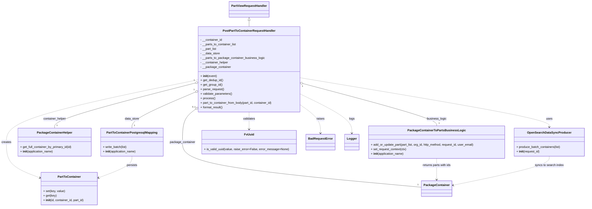

# Diagram: partview_core/partview_service/partview_service/api/part_to_container/handlers/post_part_to_container.py

> Auto-generated by Obscura crawlers

## Mermaid

### SVG

<svg id="container" width="3103.625" xmlns="http://www.w3.org/2000/svg" class="classDiagram" height="1102" viewBox="0 0 3103.625 1102" role="graphics-document document" aria-roledescription="class"><g><defs><marker id="container_class-aggregationStart" class="marker aggregation class" refX="18" refY="7" markerWidth="190" markerHeight="240" orient="auto"><path d="M 18,7 L9,13 L1,7 L9,1 Z"></path></marker></defs><defs><marker id="container_class-aggregationEnd" class="marker aggregation class" refX="1" refY="7" markerWidth="20" markerHeight="28" orient="auto"><path d="M 18,7 L9,13 L1,7 L9,1 Z"></path></marker></defs><defs><marker id="container_class-extensionStart" class="marker extension class" refX="18" refY="7" markerWidth="190" markerHeight="240" orient="auto"><path d="M 1,7 L18,13 V 1 Z"></path></marker></defs><defs><marker id="container_class-extensionEnd" class="marker extension class" refX="1" refY="7" markerWidth="20" markerHeight="28" orient="auto"><path d="M 1,1 V 13 L18,7 Z"></path></marker></defs><defs><marker id="container_class-compositionStart" class="marker composition class" refX="18" refY="7" markerWidth="190" markerHeight="240" orient="auto"><path d="M 18,7 L9,13 L1,7 L9,1 Z"></path></marker></defs><defs><marker id="container_class-compositionEnd" class="marker composition class" refX="1" refY="7" markerWidth="20" markerHeight="28" orient="auto"><path d="M 18,7 L9,13 L1,7 L9,1 Z"></path></marker></defs><defs><marker id="container_class-dependencyStart" class="marker dependency class" refX="6" refY="7" markerWidth="190" markerHeight="240" orient="auto"><path d="M 5,7 L9,13 L1,7 L9,1 Z"></path></marker></defs><defs><marker id="container_class-dependencyEnd" class="marker dependency class" refX="13" refY="7" markerWidth="20" markerHeight="28" orient="auto"><path d="M 18,7 L9,13 L14,7 L9,1 Z"></path></marker></defs><defs><marker id="container_class-lollipopStart" class="marker lollipop class" refX="13" refY="7" markerWidth="190" markerHeight="240" orient="auto"><circle stroke="black" fill="transparent" cx="7" cy="7" r="6"></circle></marker></defs><defs><marker id="container_class-lollipopEnd" class="marker lollipop class" refX="1" refY="7" markerWidth="190" markerHeight="240" orient="auto"><circle stroke="black" fill="transparent" cx="7" cy="7" r="6"></circle></marker></defs><g class="root"><g class="clusters"></g><g class="edgePaths"><path d="M1324.055,109.25L1324.055,110.542C1324.055,111.833,1324.055,114.417,1324.055,119.875C1324.055,125.333,1324.055,133.667,1324.055,137.833L1324.055,142" id="id_PartViewRequestHandler_PostPartToContainerRequestHandler_1" class="edge-thickness-normal edge-pattern-solid relation" style=";;;" data-edge="true" data-et="edge" data-id="id_PartViewRequestHandler_PostPartToContainerRequestHandler_1" data-points="W3sieCI6MTMyNC4wNTQ2ODc1LCJ5Ijo5Mn0seyJ4IjoxMzI0LjA1NDY4NzUsInkiOjExN30seyJ4IjoxMzI0LjA1NDY4NzUsInkiOjE0Mn1d" marker-start="url(#container_class-extensionStart)"></path><path d="M1034.663,493.753L979.613,517.294C924.563,540.836,814.463,587.918,759.413,619.626C704.363,651.333,704.363,667.667,704.363,675.833L704.363,684" id="id_PostPartToContainerRequestHandler_PartToContainerPostgresqlMapping_2" class="edge-thickness-normal edge-pattern-solid relation" style=";;;" data-edge="true" data-et="edge" data-id="id_PostPartToContainerRequestHandler_PartToContainerPostgresqlMapping_2" data-points="W3sieCI6MTA1MC41MjM0Mzc1LCJ5Ijo0ODYuOTcwNzcwNDgxNzc5Nn0seyJ4Ijo3MDQuMzYzMjgxMjUsInkiOjYzNX0seyJ4Ijo3MDQuMzYzMjgxMjUsInkiOjY4NH1d" marker-start="url(#container_class-aggregationStart)"></path><path d="M1033.815,444.521L910.172,476.268C786.528,508.014,539.241,571.507,415.597,611.42C291.953,651.333,291.953,667.667,291.953,675.833L291.953,684" id="id_PostPartToContainerRequestHandler_PackageContainerHelper_3" class="edge-thickness-normal edge-pattern-solid relation" style=";;;" data-edge="true" data-et="edge" data-id="id_PostPartToContainerRequestHandler_PackageContainerHelper_3" data-points="W3sieCI6MTA1MC41MjM0Mzc1LCJ5Ijo0NDAuMjMxMjQ4NDM4Nzg5Mn0seyJ4IjoyOTEuOTUzMTI1LCJ5Ijo2MzV9LHsieCI6MjkxLjk1MzEyNSwieSI6Njg0fV0=" marker-start="url(#container_class-aggregationStart)"></path><path d="M1614.243,448.098L1729.988,479.249C1845.732,510.399,2077.222,572.699,2192.966,610.016C2308.711,647.333,2308.711,659.667,2308.711,665.833L2308.711,672" id="id_PostPartToContainerRequestHandler_PackageContainerToPartsBusinessLogic_4" class="edge-thickness-normal edge-pattern-solid relation" style=";;;" data-edge="true" data-et="edge" data-id="id_PostPartToContainerRequestHandler_PackageContainerToPartsBusinessLogic_4" data-points="W3sieCI6MTU5Ny41ODU5Mzc1LCJ5Ijo0NDMuNjE1MzE2MjU4ODQ2N30seyJ4IjoyMzA4LjcxMDkzNzUsInkiOjYzNX0seyJ4IjoyMzA4LjcxMDkzNzUsInkiOjY3Mn1d" marker-start="url(#container_class-aggregationStart)"></path><path d="M1036.757,586.93L1026.146,594.941C1015.536,602.953,994.315,618.977,983.704,647.655C973.094,676.333,973.094,717.667,973.094,759C973.094,800.333,973.094,841.667,1182.788,881.802C1392.482,921.936,1811.87,960.873,2021.564,980.341L2231.258,999.809" id="id_PostPartToContainerRequestHandler_PackageContainer_5" class="edge-thickness-normal edge-pattern-solid relation" style=";;;" data-edge="true" data-et="edge" data-id="id_PostPartToContainerRequestHandler_PackageContainer_5" data-points="W3sieCI6MTA1MC41MjM0Mzc1LCJ5Ijo1NzYuNTM1MTgyNDIzMjU3NX0seyJ4Ijo5NzMuMDkzNzUsInkiOjYzNX0seyJ4Ijo5NzMuMDkzNzUsInkiOjc1OX0seyJ4Ijo5NzMuMDkzNzUsInkiOjg4M30seyJ4IjoyMjMxLjI1NzgxMjUsInkiOjk5OS44MDkxNzY0NjkyMTE5fV0=" marker-start="url(#container_class-aggregationStart)"></path><path d="M1597.586,415.724L1816.214,452.27C2034.842,488.816,2472.099,561.908,2690.727,605.621C2909.355,649.333,2909.355,663.667,2909.355,670.833L2909.355,678" id="id_PostPartToContainerRequestHandler_OpenSearchDataSyncProducer_6" class="edge-thickness-normal edge-pattern-dashed relation" style=";;;" data-edge="true" data-et="edge" data-id="id_PostPartToContainerRequestHandler_OpenSearchDataSyncProducer_6" data-points="W3sieCI6MTU5Ny41ODU5Mzc1LCJ5Ijo0MTUuNzIzNjc3MjM5ODc3MX0seyJ4IjoyOTA5LjM1NTQ2ODc1LCJ5Ijo2MzV9LHsieCI6MjkwOS4zNTU0Njg3NSwieSI6Njg0fV0=" marker-end="url(#container_class-dependencyEnd)"></path><path d="M1324.055,598L1324.055,604.167C1324.055,610.333,1324.055,622.667,1324.055,638C1324.055,653.333,1324.055,671.667,1324.055,680.833L1324.055,690" id="id_PostPartToContainerRequestHandler_FvUuid_7" class="edge-thickness-normal edge-pattern-dashed relation" style=";;;" data-edge="true" data-et="edge" data-id="id_PostPartToContainerRequestHandler_FvUuid_7" data-points="W3sieCI6MTMyNC4wNTQ2ODc1LCJ5Ijo1OTh9LHsieCI6MTMyNC4wNTQ2ODc1LCJ5Ijo2MzV9LHsieCI6MTMyNC4wNTQ2ODc1LCJ5Ijo2OTZ9XQ==" marker-end="url(#container_class-dependencyEnd)"></path><path d="M1597.586,564.691L1614.049,576.409C1630.513,588.127,1663.44,611.564,1679.904,635.948C1696.367,660.333,1696.367,685.667,1696.367,698.333L1696.367,711" id="id_PostPartToContainerRequestHandler_BadRequestError_8" class="edge-thickness-normal edge-pattern-dashed relation" style=";;;" data-edge="true" data-et="edge" data-id="id_PostPartToContainerRequestHandler_BadRequestError_8" data-points="W3sieCI6MTU5Ny41ODU5Mzc1LCJ5Ijo1NjQuNjkwNzAwMDE2Nzg3fSx7IngiOjE2OTYuMzY3MTg3NSwieSI6NjM1fSx7IngiOjE2OTYuMzY3MTg3NSwieSI6NzE3fV0=" marker-end="url(#container_class-dependencyEnd)"></path><path d="M1597.586,505.884L1640.904,527.404C1684.221,548.923,1770.857,591.961,1814.174,626.147C1857.492,660.333,1857.492,685.667,1857.492,698.333L1857.492,711" id="id_PostPartToContainerRequestHandler_Logger_9" class="edge-thickness-normal edge-pattern-dashed relation" style=";;;" data-edge="true" data-et="edge" data-id="id_PostPartToContainerRequestHandler_Logger_9" data-points="W3sieCI6MTU5Ny41ODU5Mzc1LCJ5Ijo1MDUuODg0Mjk5OTQxNDE3N30seyJ4IjoxODU3LjQ5MjE4NzUsInkiOjYzNX0seyJ4IjoxODU3LjQ5MjE4NzUsInkiOjcxN31d" marker-end="url(#container_class-dependencyEnd)"></path><path d="M1050.523,426.196L881.132,460.996C711.74,495.797,372.956,565.399,203.564,620.866C34.172,676.333,34.172,717.667,34.172,759C34.172,800.333,34.172,841.667,63.814,873.302C93.456,904.938,152.739,926.875,182.381,937.844L212.023,948.813" id="id_PostPartToContainerRequestHandler_PartToContainer_10" class="edge-thickness-normal edge-pattern-dashed relation" style=";;;" data-edge="true" data-et="edge" data-id="id_PostPartToContainerRequestHandler_PartToContainer_10" data-points="W3sieCI6MTA1MC41MjM0Mzc1LCJ5Ijo0MjYuMTk1NjMzMDgxOTc4MTR9LHsieCI6MzQuMTcxODc1LCJ5Ijo2MzV9LHsieCI6MzQuMTcxODc1LCJ5Ijo3NTl9LHsieCI6MzQuMTcxODc1LCJ5Ijo4ODN9LHsieCI6MjE3LjY1MDM5MDYyNSwieSI6OTUwLjg5NTAzOTMxMzYyODl9XQ==" marker-end="url(#container_class-dependencyEnd)"></path><path d="M704.363,834L704.363,842.167C704.363,850.333,704.363,866.667,674.721,885.802C645.079,904.938,585.796,926.875,556.154,937.844L526.512,948.813" id="id_PartToContainerPostgresqlMapping_PartToContainer_11" class="edge-thickness-normal edge-pattern-dashed relation" style=";;;" data-edge="true" data-et="edge" data-id="id_PartToContainerPostgresqlMapping_PartToContainer_11" data-points="W3sieCI6NzA0LjM2MzI4MTI1LCJ5Ijo4MzR9LHsieCI6NzA0LjM2MzI4MTI1LCJ5Ijo4ODN9LHsieCI6NTIwLjg4NDc2NTYyNSwieSI6OTUwLjg5NTAzOTMxMzYyODl9XQ==" marker-end="url(#container_class-dependencyEnd)"></path><path d="M2308.711,846L2308.711,852.167C2308.711,858.333,2308.711,870.667,2308.711,889.5C2308.711,908.333,2308.711,933.667,2308.711,946.333L2308.711,959" id="id_PackageContainerToPartsBusinessLogic_PackageContainer_12" class="edge-thickness-normal edge-pattern-dashed relation" style=";;;" data-edge="true" data-et="edge" data-id="id_PackageContainerToPartsBusinessLogic_PackageContainer_12" data-points="W3sieCI6MjMwOC43MTA5Mzc1LCJ5Ijo4NDZ9LHsieCI6MjMwOC43MTA5Mzc1LCJ5Ijo4ODN9LHsieCI6MjMwOC43MTA5Mzc1LCJ5Ijo5NjV9XQ==" marker-end="url(#container_class-dependencyEnd)"></path><path d="M2909.355,834L2909.355,842.167C2909.355,850.333,2909.355,866.667,2823.136,892.633C2736.917,918.599,2564.479,954.198,2478.259,971.998L2392.04,989.797" id="id_OpenSearchDataSyncProducer_PackageContainer_13" class="edge-thickness-normal edge-pattern-dashed relation" style=";;;" data-edge="true" data-et="edge" data-id="id_OpenSearchDataSyncProducer_PackageContainer_13" data-points="W3sieCI6MjkwOS4zNTU0Njg3NSwieSI6ODM0fSx7IngiOjI5MDkuMzU1NDY4NzUsInkiOjg4M30seyJ4IjoyMzg2LjE2NDA2MjUsInkiOjk5MS4wMTAxOTczNzkxMTc1fV0=" marker-end="url(#container_class-dependencyEnd)"></path></g><g class="edgeLabels"><g class="edgeLabel"><g class="label" data-id="id_PartViewRequestHandler_PostPartToContainerRequestHandler_1" transform="translate(0, 0)"><foreignObject width="0" height="0">

</foreignObject></g></g><g class="edgeLabel" transform="translate(704.36328125, 635)"><g class="label" data-id="id_PostPartToContainerRequestHandler_PartToContainerPostgresqlMapping_2" transform="translate(-38.8671875, -12)"><foreignObject width="77.734375" height="24">

data_store

</foreignObject></g></g><g class="edgeLabel" transform="translate(291.953125, 635)"><g class="label" data-id="id_PostPartToContainerRequestHandler_PackageContainerHelper_3" transform="translate(-61.71875, -12)"><foreignObject width="123.4375" height="24">

container_helper

</foreignObject></g></g><g class="edgeLabel" transform="translate(2308.7109375, 635)"><g class="label" data-id="id_PostPartToContainerRequestHandler_PackageContainerToPartsBusinessLogic_4" transform="translate(-52.9765625, -12)"><foreignObject width="105.953125" height="24">

business_logic

</foreignObject></g></g><g class="edgeLabel" transform="translate(973.09375, 759)"><g class="label" data-id="id_PostPartToContainerRequestHandler_PackageContainer_5" transform="translate(-67.9296875, -12)"><foreignObject width="135.859375" height="24">

package_container

</foreignObject></g></g><g class="edgeLabel" transform="translate(2909.35546875, 635)"><g class="label" data-id="id_PostPartToContainerRequestHandler_OpenSearchDataSyncProducer_6" transform="translate(-16.4921875, -12)"><foreignObject width="32.984375" height="24">

uses

</foreignObject></g></g><g class="edgeLabel" transform="translate(1324.0546875, 635)"><g class="label" data-id="id_PostPartToContainerRequestHandler_FvUuid_7" transform="translate(-32.6875, -12)"><foreignObject width="65.375" height="24">

validates

</foreignObject></g></g><g class="edgeLabel" transform="translate(1696.3671875, 635)"><g class="label" data-id="id_PostPartToContainerRequestHandler_BadRequestError_8" transform="translate(-21.25, -12)"><foreignObject width="42.5" height="24">

raises

</foreignObject></g></g><g class="edgeLabel" transform="translate(1857.4921875, 635)"><g class="label" data-id="id_PostPartToContainerRequestHandler_Logger_9" transform="translate(-14.8203125, -12)"><foreignObject width="29.640625" height="24">

logs

</foreignObject></g></g><g class="edgeLabel" transform="translate(34.171875, 759)"><g class="label" data-id="id_PostPartToContainerRequestHandler_PartToContainer_10" transform="translate(-26.171875, -12)"><foreignObject width="52.34375" height="24">

creates

</foreignObject></g></g><g class="edgeLabel" transform="translate(704.36328125, 883)"><g class="label" data-id="id_PartToContainerPostgresqlMapping_PartToContainer_11" transform="translate(-28.4375, -12)"><foreignObject width="56.875" height="24">

persists

</foreignObject></g></g><g class="edgeLabel" transform="translate(2308.7109375, 883)"><g class="label" data-id="id_PackageContainerToPartsBusinessLogic_PackageContainer_12" transform="translate(-77.7109375, -12)"><foreignObject width="155.421875" height="24">

returns parts with ids

</foreignObject></g></g><g class="edgeLabel" transform="translate(2909.35546875, 883)"><g class="label" data-id="id_OpenSearchDataSyncProducer_PackageContainer_13" transform="translate(-77.2109375, -12)"><foreignObject width="154.421875" height="24">

syncs to search index

</foreignObject></g></g><g class="edgeTerminals" transform="translate(1028.53508816021, 480.05972969203725)"><g class="inner" transform="translate(0, 0)"><foreignObject style="width: 9px; height: 12px;">
1
</foreignObject></g></g><g class="edgeTerminals" transform="translate(1029.8428707879125, 430.0546018489266)"><g class="inner" transform="translate(0, 0)"><foreignObject style="width: 9px; height: 12px;">
1
</foreignObject></g></g><g class="edgeTerminals" transform="translate(1610.5864081675866, 462.6478623471438)"><g class="inner" transform="translate(0, 0)"><foreignObject style="width: 9px; height: 12px;">
1
</foreignObject></g></g><g class="edgeTerminals" transform="translate(1027.518704441522, 575.1096351632029)"><g class="inner" transform="translate(0, 0)"><foreignObject style="width: 36px; height: 12px;">
0..1
</foreignObject></g></g><g class="edgeTerminals" transform="translate(714.363280625, 661.4999994642857)"><g class="inner" transform="translate(0, 0)"></g><foreignObject style="width: 9px; height: 12px;">
1
</foreignObject></g><g class="edgeTerminals" transform="translate(301.9531274999998, 661.5000021428572)"><g class="inner" transform="translate(0, 0)"></g><foreignObject style="width: 9px; height: 12px;">
1
</foreignObject></g><g class="edgeTerminals" transform="translate(2318.71093875, 649.5000010714285)"><g class="inner" transform="translate(0, 0)"></g><foreignObject style="width: 9px; height: 12px;">
1
</foreignObject></g><g class="edgeTerminals" transform="translate(2210.2193959943997, 978.2556490047887)"><g class="inner" transform="translate(0, 0)"></g><foreignObject style="width: 9px; height: 12px;">
1
</foreignObject></g></g><g class="nodes"><g class="node default" id="classId-PostPartToContainerRequestHandler-0" transform="translate(1324.0546875, 370)"><g class="basic label-container"><path d="M-273.53125 -228 L273.53125 -228 L273.53125 228 L-273.53125 228" stroke="none" stroke-width="0" fill="#ECECFF" style=""></path><path d="M-273.53125 -228 C-135.24103797903769 -228, 3.04917404192463 -228, 273.53125 -228 M-273.53125 -228 C-153.10429172000204 -228, -32.67733344000408 -228, 273.53125 -228 M273.53125 -228 C273.53125 -123.87291971181872, 273.53125 -19.74583942363745, 273.53125 228 M273.53125 -228 C273.53125 -105.99264665356749, 273.53125 16.01470669286502, 273.53125 228 M273.53125 228 C64.49425942978587 228, -144.54273114042826 228, -273.53125 228 M273.53125 228 C67.6591573965035 228, -138.212935206993 228, -273.53125 228 M-273.53125 228 C-273.53125 83.30023946948512, -273.53125 -61.39952106102976, -273.53125 -228 M-273.53125 228 C-273.53125 81.21087983252386, -273.53125 -65.57824033495228, -273.53125 -228" stroke="#9370DB" stroke-width="1.3" fill="none" stroke-dasharray="0 0" style=""></path></g><g class="annotation-group text" transform="translate(0, -204)"></g><g class="label-group text" transform="translate(-134.46875, -204)"><g class="label" style="font-weight: bolder" transform="translate(0,-12)"><foreignObject width="268.9375" height="24">

PostPartToContainerRequestHandler

</foreignObject></g></g><g class="members-group text" transform="translate(-261.53125, -156)"><g class="label" style="" transform="translate(0,-12)"><foreignObject width="117.171875" height="24">

- __container_id

</foreignObject></g><g class="label" style="" transform="translate(0,12)"><foreignObject width="193.421875" height="24">

- __parts_to_container_list

</foreignObject></g><g class="label" style="" transform="translate(0,36)"><foreignObject width="87.78125" height="24">

- __part_list

</foreignObject></g><g class="label" style="" transform="translate(0,60)"><foreignObject width="104.578125" height="24">

- __data_store

</foreignObject></g><g class="label" style="" transform="translate(0,84)"><foreignObject width="344.0625" height="24">

- __parts_to_package_container_business_logic

</foreignObject></g><g class="label" style="" transform="translate(0,108)"><foreignObject width="150.28125" height="24">

- __container_helper

</foreignObject></g><g class="label" style="" transform="translate(0,132)"><foreignObject width="163.03125" height="24">

- __package_container

</foreignObject></g></g><g class="methods-group text" transform="translate(-261.53125, 36)"><g class="label" style="" transform="translate(0,-12)"><foreignObject width="87.390625" height="24">

+ <strong>init</strong>(event)

</foreignObject></g><g class="label" style="" transform="translate(0,12)"><foreignObject width="121.90625" height="24">

+ get_dedup_id()

</foreignObject></g><g class="label" style="" transform="translate(0,36)"><foreignObject width="117.875" height="24">

+ get_group_id()

</foreignObject></g><g class="label" style="" transform="translate(0,60)"><foreignObject width="126.046875" height="24">

+ parse_request()

</foreignObject></g><g class="label" style="" transform="translate(0,84)"><foreignObject width="170.953125" height="24">

+ validate_parameters()

</foreignObject></g><g class="label" style="" transform="translate(0,108)"><foreignObject width="77.96875" height="24">

+ process()

</foreignObject></g><g class="label" style="" transform="translate(0,132)"><foreignObject width="388.59375" height="24">

+ part_to_container_from_body(part_id, container_id)

</foreignObject></g><g class="label" style="" transform="translate(0,156)"><foreignObject width="121.5" height="24">

+ format_result()

</foreignObject></g></g><g class="divider" style=""><path d="M-273.53125 -180 C-158.69431597021662 -180, -43.85738194043324 -180, 273.53125 -180 M-273.53125 -180 C-67.7889475366014 -180, 137.9533549267972 -180, 273.53125 -180" stroke="#9370DB" stroke-width="1.3" fill="none" stroke-dasharray="0 0" style=""></path></g><g class="divider" style=""><path d="M-273.53125 12 C-67.20857410353321 12, 139.11410179293358 12, 273.53125 12 M-273.53125 12 C-104.53044761790005 12, 64.4703547641999 12, 273.53125 12" stroke="#9370DB" stroke-width="1.3" fill="none" stroke-dasharray="0 0" style=""></path></g></g><g class="node default" id="classId-PartViewRequestHandler-1" transform="translate(1324.0546875, 50)"><g class="basic label-container"><path d="M-103.359375 -42 L103.359375 -42 L103.359375 42 L-103.359375 42" stroke="none" stroke-width="0" fill="#ECECFF" style=""></path><path d="M-103.359375 -42 C-59.1018017888999 -42, -14.844228577799797 -42, 103.359375 -42 M-103.359375 -42 C-32.995018194467846 -42, 37.36933861106431 -42, 103.359375 -42 M103.359375 -42 C103.359375 -9.562482234913048, 103.359375 22.875035530173903, 103.359375 42 M103.359375 -42 C103.359375 -12.218737515879948, 103.359375 17.562524968240105, 103.359375 42 M103.359375 42 C37.382784698974405 42, -28.59380560205119 42, -103.359375 42 M103.359375 42 C53.148763162634765 42, 2.93815132526953 42, -103.359375 42 M-103.359375 42 C-103.359375 16.36048563894436, -103.359375 -9.279028722111278, -103.359375 -42 M-103.359375 42 C-103.359375 11.119837692929504, -103.359375 -19.76032461414099, -103.359375 -42" stroke="#9370DB" stroke-width="1.3" fill="none" stroke-dasharray="0 0" style=""></path></g><g class="annotation-group text" transform="translate(0, -18)"></g><g class="label-group text" transform="translate(-91.359375, -18)"><g class="label" style="font-weight: bolder" transform="translate(0,-12)"><foreignObject width="182.71875" height="24">

PartViewRequestHandler

</foreignObject></g></g><g class="members-group text" transform="translate(-91.359375, 30)"></g><g class="methods-group text" transform="translate(-91.359375, 60)"></g><g class="divider" style=""><path d="M-103.359375 6 C-35.739397967635 6, 31.88057906473 6, 103.359375 6 M-103.359375 6 C-58.10317787880105 6, -12.846980757602097 6, 103.359375 6" stroke="#9370DB" stroke-width="1.3" fill="none" stroke-dasharray="0 0" style=""></path></g><g class="divider" style=""><path d="M-103.359375 24 C-34.724669714679436 24, 33.91003557064113 24, 103.359375 24 M-103.359375 24 C-45.4309938437915 24, 12.497387312417004 24, 103.359375 24" stroke="#9370DB" stroke-width="1.3" fill="none" stroke-dasharray="0 0" style=""></path></g></g><g class="node default" id="classId-PartToContainerPostgresqlMapping-2" transform="translate(704.36328125, 759)"><g class="basic label-container"><path d="M-165.80078125 -75 L165.80078125 -75 L165.80078125 75 L-165.80078125 75" stroke="none" stroke-width="0" fill="#ECECFF" style=""></path><path d="M-165.80078125 -75 C-70.53592277186453 -75, 24.72893570627093 -75, 165.80078125 -75 M-165.80078125 -75 C-80.90966186479902 -75, 3.9814575204019604 -75, 165.80078125 -75 M165.80078125 -75 C165.80078125 -23.052770616402768, 165.80078125 28.894458767194465, 165.80078125 75 M165.80078125 -75 C165.80078125 -29.21393571824607, 165.80078125 16.57212856350786, 165.80078125 75 M165.80078125 75 C73.37619694743907 75, -19.04838735512186 75, -165.80078125 75 M165.80078125 75 C48.11267692494479 75, -69.57542740011041 75, -165.80078125 75 M-165.80078125 75 C-165.80078125 20.983060168825844, -165.80078125 -33.03387966234831, -165.80078125 -75 M-165.80078125 75 C-165.80078125 35.803081218590236, -165.80078125 -3.3938375628195274, -165.80078125 -75" stroke="#9370DB" stroke-width="1.3" fill="none" stroke-dasharray="0 0" style=""></path></g><g class="annotation-group text" transform="translate(0, -51)"></g><g class="label-group text" transform="translate(-129.6171875, -51)"><g class="label" style="font-weight: bolder" transform="translate(0,-12)"><foreignObject width="259.234375" height="24">

PartToContainerPostgresqlMapping

</foreignObject></g></g><g class="members-group text" transform="translate(-153.80078125, -3)"></g><g class="methods-group text" transform="translate(-153.80078125, 27)"><g class="label" style="" transform="translate(0,-12)"><foreignObject width="130.078125" height="24">

+ write_batch(list)

</foreignObject></g><g class="label" style="" transform="translate(0,12)"><foreignObject width="177.984375" height="24">

+ <strong>init</strong>(application_name)

</foreignObject></g></g><g class="divider" style=""><path d="M-165.80078125 -27 C-34.25898547981507 -27, 97.28281029036987 -27, 165.80078125 -27 M-165.80078125 -27 C-69.31410305015373 -27, 27.172575149692534 -27, 165.80078125 -27" stroke="#9370DB" stroke-width="1.3" fill="none" stroke-dasharray="0 0" style=""></path></g><g class="divider" style=""><path d="M-165.80078125 -3 C-76.29375491238719 -3, 13.213271425225628 -3, 165.80078125 -3 M-165.80078125 -3 C-81.6859680328241 -3, 2.428845184351786 -3, 165.80078125 -3" stroke="#9370DB" stroke-width="1.3" fill="none" stroke-dasharray="0 0" style=""></path></g></g><g class="node default" id="classId-PackageContainerHelper-3" transform="translate(291.953125, 759)"><g class="basic label-container"><path d="M-196.609375 -75 L196.609375 -75 L196.609375 75 L-196.609375 75" stroke="none" stroke-width="0" fill="#ECECFF" style=""></path><path d="M-196.609375 -75 C-61.91506660927354 -75, 72.77924178145292 -75, 196.609375 -75 M-196.609375 -75 C-78.37004313528139 -75, 39.869288729437216 -75, 196.609375 -75 M196.609375 -75 C196.609375 -26.228237591763744, 196.609375 22.543524816472512, 196.609375 75 M196.609375 -75 C196.609375 -41.038220663103736, 196.609375 -7.076441326207473, 196.609375 75 M196.609375 75 C60.15347142795727 75, -76.30243214408546 75, -196.609375 75 M196.609375 75 C75.79836259617491 75, -45.01264980765018 75, -196.609375 75 M-196.609375 75 C-196.609375 20.475629058953103, -196.609375 -34.04874188209379, -196.609375 -75 M-196.609375 75 C-196.609375 37.47784989986505, -196.609375 -0.04430020026990178, -196.609375 -75" stroke="#9370DB" stroke-width="1.3" fill="none" stroke-dasharray="0 0" style=""></path></g><g class="annotation-group text" transform="translate(0, -51)"></g><g class="label-group text" transform="translate(-89.96875, -51)"><g class="label" style="font-weight: bolder" transform="translate(0,-12)"><foreignObject width="179.9375" height="24">

PackageContainerHelper

</foreignObject></g></g><g class="members-group text" transform="translate(-184.609375, -3)"></g><g class="methods-group text" transform="translate(-184.609375, 27)"><g class="label" style="" transform="translate(0,-12)"><foreignObject width="279.25" height="24">

+ get_full_container_by_primary_id(id)

</foreignObject></g><g class="label" style="" transform="translate(0,12)"><foreignObject width="177.984375" height="24">

+ <strong>init</strong>(application_name)

</foreignObject></g></g><g class="divider" style=""><path d="M-196.609375 -27 C-42.66395049551065 -27, 111.2814740089787 -27, 196.609375 -27 M-196.609375 -27 C-66.01566044618488 -27, 64.57805410763024 -27, 196.609375 -27" stroke="#9370DB" stroke-width="1.3" fill="none" stroke-dasharray="0 0" style=""></path></g><g class="divider" style=""><path d="M-196.609375 -3 C-73.2580234549933 -3, 50.09332809001339 -3, 196.609375 -3 M-196.609375 -3 C-94.42657820295166 -3, 7.75621859409668 -3, 196.609375 -3" stroke="#9370DB" stroke-width="1.3" fill="none" stroke-dasharray="0 0" style=""></path></g></g><g class="node default" id="classId-PackageContainerToPartsBusinessLogic-4" transform="translate(2308.7109375, 759)"><g class="basic label-container"><path d="M-364.375 -87 L364.375 -87 L364.375 87 L-364.375 87" stroke="none" stroke-width="0" fill="#ECECFF" style=""></path><path d="M-364.375 -87 C-156.36820840702555 -87, 51.6385831859489 -87, 364.375 -87 M-364.375 -87 C-91.36396237855865 -87, 181.6470752428827 -87, 364.375 -87 M364.375 -87 C364.375 -26.13709535147982, 364.375 34.72580929704036, 364.375 87 M364.375 -87 C364.375 -32.03842013080436, 364.375 22.923159738391277, 364.375 87 M364.375 87 C125.06812789584609 87, -114.23874420830782 87, -364.375 87 M364.375 87 C101.67754591584719 87, -161.01990816830562 87, -364.375 87 M-364.375 87 C-364.375 18.856867969149206, -364.375 -49.28626406170159, -364.375 -87 M-364.375 87 C-364.375 38.75801798563605, -364.375 -9.483964028727897, -364.375 -87" stroke="#9370DB" stroke-width="1.3" fill="none" stroke-dasharray="0 0" style=""></path></g><g class="annotation-group text" transform="translate(0, -63)"></g><g class="label-group text" transform="translate(-144.34375, -63)"><g class="label" style="font-weight: bolder" transform="translate(0,-12)"><foreignObject width="288.6875" height="24">

PackageContainerToPartsBusinessLogic

</foreignObject></g></g><g class="members-group text" transform="translate(-352.375, -15)"></g><g class="methods-group text" transform="translate(-352.375, 15)"><g class="label" style="" transform="translate(0,-12)"><foreignObject width="560.40625" height="24">

+ add_or_update_part(part_list, org_id, http_method, request_id, user_email)

</foreignObject></g><g class="label" style="" transform="translate(0,12)"><foreignObject width="191.03125" height="24">

+ set_request_context(ctx)

</foreignObject></g><g class="label" style="" transform="translate(0,36)"><foreignObject width="177.984375" height="24">

+ <strong>init</strong>(application_name)

</foreignObject></g></g><g class="divider" style=""><path d="M-364.375 -39 C-188.2726701693462 -39, -12.170340338692426 -39, 364.375 -39 M-364.375 -39 C-163.70784706997674 -39, 36.95930586004653 -39, 364.375 -39" stroke="#9370DB" stroke-width="1.3" fill="none" stroke-dasharray="0 0" style=""></path></g><g class="divider" style=""><path d="M-364.375 -15 C-174.25096886430964 -15, 15.873062271380718 -15, 364.375 -15 M-364.375 -15 C-113.67515277630949 -15, 137.02469444738102 -15, 364.375 -15" stroke="#9370DB" stroke-width="1.3" fill="none" stroke-dasharray="0 0" style=""></path></g></g><g class="node default" id="classId-PartToContainer-5" transform="translate(369.267578125, 1007)"><g class="basic label-container"><path d="M-151.6171875 -87 L151.6171875 -87 L151.6171875 87 L-151.6171875 87" stroke="none" stroke-width="0" fill="#ECECFF" style=""></path><path d="M-151.6171875 -87 C-57.08862891943309 -87, 37.43992966113382 -87, 151.6171875 -87 M-151.6171875 -87 C-43.404965480226494 -87, 64.80725653954701 -87, 151.6171875 -87 M151.6171875 -87 C151.6171875 -48.11865597731813, 151.6171875 -9.237311954636255, 151.6171875 87 M151.6171875 -87 C151.6171875 -18.809505583868102, 151.6171875 49.380988832263796, 151.6171875 87 M151.6171875 87 C72.22334277692049 87, -7.170501946159021 87, -151.6171875 87 M151.6171875 87 C48.372986186276194 87, -54.87121512744761 87, -151.6171875 87 M-151.6171875 87 C-151.6171875 51.271458951964405, -151.6171875 15.54291790392881, -151.6171875 -87 M-151.6171875 87 C-151.6171875 34.95989061332253, -151.6171875 -17.080218773354943, -151.6171875 -87" stroke="#9370DB" stroke-width="1.3" fill="none" stroke-dasharray="0 0" style=""></path></g><g class="annotation-group text" transform="translate(0, -63)"></g><g class="label-group text" transform="translate(-59.21875, -63)"><g class="label" style="font-weight: bolder" transform="translate(0,-12)"><foreignObject width="118.4375" height="24">

PartToContainer

</foreignObject></g></g><g class="members-group text" transform="translate(-139.6171875, -15)"></g><g class="methods-group text" transform="translate(-139.6171875, 15)"><g class="label" style="" transform="translate(0,-12)"><foreignObject width="115.46875" height="24">

+ set(key, value)

</foreignObject></g><g class="label" style="" transform="translate(0,12)"><foreignObject width="69.734375" height="24">

+ get(key)

</foreignObject></g><g class="label" style="" transform="translate(0,36)"><foreignObject width="220.015625" height="24">

+ <strong>init</strong>(id, container_id, part_id)

</foreignObject></g></g><g class="divider" style=""><path d="M-151.6171875 -39 C-89.20693006530556 -39, -26.7966726306111 -39, 151.6171875 -39 M-151.6171875 -39 C-69.42858710286299 -39, 12.760013294274017 -39, 151.6171875 -39" stroke="#9370DB" stroke-width="1.3" fill="none" stroke-dasharray="0 0" style=""></path></g><g class="divider" style=""><path d="M-151.6171875 -15 C-47.932077404359106 -15, 55.75303269128179 -15, 151.6171875 -15 M-151.6171875 -15 C-73.35777799752292 -15, 4.901631504954167 -15, 151.6171875 -15" stroke="#9370DB" stroke-width="1.3" fill="none" stroke-dasharray="0 0" style=""></path></g></g><g class="node default" id="classId-PackageContainer-6" transform="translate(2308.7109375, 1007)"><g class="basic label-container"><path d="M-77.453125 -42 L77.453125 -42 L77.453125 42 L-77.453125 42" stroke="none" stroke-width="0" fill="#ECECFF" style=""></path><path d="M-77.453125 -42 C-34.27289532518889 -42, 8.907334349622218 -42, 77.453125 -42 M-77.453125 -42 C-33.86400996380026 -42, 9.725105072399487 -42, 77.453125 -42 M77.453125 -42 C77.453125 -15.583775508133165, 77.453125 10.83244898373367, 77.453125 42 M77.453125 -42 C77.453125 -16.052207125911362, 77.453125 9.895585748177275, 77.453125 42 M77.453125 42 C32.705386699319014 42, -12.042351601361972 42, -77.453125 42 M77.453125 42 C21.7849251489396 42, -33.8832747021208 42, -77.453125 42 M-77.453125 42 C-77.453125 22.4434024048771, -77.453125 2.886804809754203, -77.453125 -42 M-77.453125 42 C-77.453125 14.84750877344269, -77.453125 -12.304982453114619, -77.453125 -42" stroke="#9370DB" stroke-width="1.3" fill="none" stroke-dasharray="0 0" style=""></path></g><g class="annotation-group text" transform="translate(0, -18)"></g><g class="label-group text" transform="translate(-65.453125, -18)"><g class="label" style="font-weight: bolder" transform="translate(0,-12)"><foreignObject width="130.90625" height="24">

PackageContainer

</foreignObject></g></g><g class="members-group text" transform="translate(-65.453125, 30)"></g><g class="methods-group text" transform="translate(-65.453125, 60)"></g><g class="divider" style=""><path d="M-77.453125 6 C-38.30458581013829 6, 0.8439533797234162 6, 77.453125 6 M-77.453125 6 C-23.24274179835971 6, 30.96764140328058 6, 77.453125 6" stroke="#9370DB" stroke-width="1.3" fill="none" stroke-dasharray="0 0" style=""></path></g><g class="divider" style=""><path d="M-77.453125 24 C-30.597307164157556 24, 16.25851067168489 24, 77.453125 24 M-77.453125 24 C-24.65313980650292 24, 28.14684538699416 24, 77.453125 24" stroke="#9370DB" stroke-width="1.3" fill="none" stroke-dasharray="0 0" style=""></path></g></g><g class="node default" id="classId-OpenSearchDataSyncProducer-7" transform="translate(2909.35546875, 759)"><g class="basic label-container"><path d="M-186.26953125 -75 L186.26953125 -75 L186.26953125 75 L-186.26953125 75" stroke="none" stroke-width="0" fill="#ECECFF" style=""></path><path d="M-186.26953125 -75 C-42.07022456338399 -75, 102.12908212323202 -75, 186.26953125 -75 M-186.26953125 -75 C-110.39063977984777 -75, -34.51174830969555 -75, 186.26953125 -75 M186.26953125 -75 C186.26953125 -18.958386274318556, 186.26953125 37.08322745136289, 186.26953125 75 M186.26953125 -75 C186.26953125 -33.30205392448616, 186.26953125 8.395892151027681, 186.26953125 75 M186.26953125 75 C83.28319532930767 75, -19.703140591384653 75, -186.26953125 75 M186.26953125 75 C43.49666188604746 75, -99.27620747790507 75, -186.26953125 75 M-186.26953125 75 C-186.26953125 26.414725154154134, -186.26953125 -22.170549691691733, -186.26953125 -75 M-186.26953125 75 C-186.26953125 32.92605548306992, -186.26953125 -9.147889033860153, -186.26953125 -75" stroke="#9370DB" stroke-width="1.3" fill="none" stroke-dasharray="0 0" style=""></path></g><g class="annotation-group text" transform="translate(0, -51)"></g><g class="label-group text" transform="translate(-110.9765625, -51)"><g class="label" style="font-weight: bolder" transform="translate(0,-12)"><foreignObject width="221.953125" height="24">

OpenSearchDataSyncProducer

</foreignObject></g></g><g class="members-group text" transform="translate(-174.26953125, -3)"></g><g class="methods-group text" transform="translate(-174.26953125, 27)"><g class="label" style="" transform="translate(0,-12)"><foreignObject width="237.5625" height="24">

+ produce_batch_containers(list)

</foreignObject></g><g class="label" style="" transform="translate(0,12)"><foreignObject width="124.71875" height="24">

+ <strong>init</strong>(request_id)

</foreignObject></g></g><g class="divider" style=""><path d="M-186.26953125 -27 C-84.50265259746854 -27, 17.26422605506292 -27, 186.26953125 -27 M-186.26953125 -27 C-84.90739988310197 -27, 16.454731483796053 -27, 186.26953125 -27" stroke="#9370DB" stroke-width="1.3" fill="none" stroke-dasharray="0 0" style=""></path></g><g class="divider" style=""><path d="M-186.26953125 -3 C-50.63311244612137 -3, 85.00330635775725 -3, 186.26953125 -3 M-186.26953125 -3 C-64.92163300519434 -3, 56.426265239611325 -3, 186.26953125 -3" stroke="#9370DB" stroke-width="1.3" fill="none" stroke-dasharray="0 0" style=""></path></g></g><g class="node default" id="classId-FvUuid-8" transform="translate(1324.0546875, 759)"><g class="basic label-container"><path d="M-248.03125 -63 L248.03125 -63 L248.03125 63 L-248.03125 63" stroke="none" stroke-width="0" fill="#ECECFF" style=""></path><path d="M-248.03125 -63 C-89.687788051079 -63, 68.65567389784201 -63, 248.03125 -63 M-248.03125 -63 C-95.35022560972209 -63, 57.330798780555824 -63, 248.03125 -63 M248.03125 -63 C248.03125 -23.360792683589345, 248.03125 16.27841463282131, 248.03125 63 M248.03125 -63 C248.03125 -14.99215588466452, 248.03125 33.01568823067096, 248.03125 63 M248.03125 63 C131.7934723428687 63, 15.555694685737393 63, -248.03125 63 M248.03125 63 C87.54918257022052 63, -72.93288485955895 63, -248.03125 63 M-248.03125 63 C-248.03125 12.886370855148833, -248.03125 -37.227258289702334, -248.03125 -63 M-248.03125 63 C-248.03125 34.532981366308405, -248.03125 6.0659627326168035, -248.03125 -63" stroke="#9370DB" stroke-width="1.3" fill="none" stroke-dasharray="0 0" style=""></path></g><g class="annotation-group text" transform="translate(0, -39)"></g><g class="label-group text" transform="translate(-24.5625, -39)"><g class="label" style="font-weight: bolder" transform="translate(0,-12)"><foreignObject width="49.125" height="24">

FvUuid

</foreignObject></g></g><g class="members-group text" transform="translate(-236.03125, 9)"></g><g class="methods-group text" transform="translate(-236.03125, 39)"><g class="label" style="" transform="translate(0,-12)"><foreignObject width="447.5" height="24">

+ is_valid_uuid(value, raise_error=False, error_message=None)

</foreignObject></g></g><g class="divider" style=""><path d="M-248.03125 -15 C-112.07889314324342 -15, 23.87346371351316 -15, 248.03125 -15 M-248.03125 -15 C-102.64180518912033 -15, 42.74763962175933 -15, 248.03125 -15" stroke="#9370DB" stroke-width="1.3" fill="none" stroke-dasharray="0 0" style=""></path></g><g class="divider" style=""><path d="M-248.03125 9 C-119.7849644014257 9, 8.461321197148607 9, 248.03125 9 M-248.03125 9 C-140.66922275051655 9, -33.307195501033135 9, 248.03125 9" stroke="#9370DB" stroke-width="1.3" fill="none" stroke-dasharray="0 0" style=""></path></g></g><g class="node default" id="classId-BadRequestError-9" transform="translate(1696.3671875, 759)"><g class="basic label-container"><path d="M-74.28125 -42 L74.28125 -42 L74.28125 42 L-74.28125 42" stroke="none" stroke-width="0" fill="#ECECFF" style=""></path><path d="M-74.28125 -42 C-42.47986892553432 -42, -10.678487851068631 -42, 74.28125 -42 M-74.28125 -42 C-21.997762730565043 -42, 30.285724538869914 -42, 74.28125 -42 M74.28125 -42 C74.28125 -24.899659485773842, 74.28125 -7.7993189715476845, 74.28125 42 M74.28125 -42 C74.28125 -16.69312185815738, 74.28125 8.613756283685241, 74.28125 42 M74.28125 42 C31.228484046943045 42, -11.82428190611391 42, -74.28125 42 M74.28125 42 C31.033199677894096 42, -12.214850644211808 42, -74.28125 42 M-74.28125 42 C-74.28125 19.461060155899567, -74.28125 -3.0778796882008663, -74.28125 -42 M-74.28125 42 C-74.28125 18.988022815619967, -74.28125 -4.023954368760066, -74.28125 -42" stroke="#9370DB" stroke-width="1.3" fill="none" stroke-dasharray="0 0" style=""></path></g><g class="annotation-group text" transform="translate(0, -18)"></g><g class="label-group text" transform="translate(-62.28125, -18)"><g class="label" style="font-weight: bolder" transform="translate(0,-12)"><foreignObject width="124.5625" height="24">

BadRequestError

</foreignObject></g></g><g class="members-group text" transform="translate(-62.28125, 30)"></g><g class="methods-group text" transform="translate(-62.28125, 60)"></g><g class="divider" style=""><path d="M-74.28125 6 C-19.638560176043185 6, 35.00412964791363 6, 74.28125 6 M-74.28125 6 C-35.186129065190116 6, 3.9089918696197685 6, 74.28125 6" stroke="#9370DB" stroke-width="1.3" fill="none" stroke-dasharray="0 0" style=""></path></g><g class="divider" style=""><path d="M-74.28125 24 C-21.50561444826323 24, 31.27002110347354 24, 74.28125 24 M-74.28125 24 C-44.296952380432714 24, -14.312654760865428 24, 74.28125 24" stroke="#9370DB" stroke-width="1.3" fill="none" stroke-dasharray="0 0" style=""></path></g></g><g class="node default" id="classId-Logger-10" transform="translate(1857.4921875, 759)"><g class="basic label-container"><path d="M-36.84375 -42 L36.84375 -42 L36.84375 42 L-36.84375 42" stroke="none" stroke-width="0" fill="#ECECFF" style=""></path><path d="M-36.84375 -42 C-19.00464825270873 -42, -1.1655465054174599 -42, 36.84375 -42 M-36.84375 -42 C-11.541639369824676 -42, 13.760471260350648 -42, 36.84375 -42 M36.84375 -42 C36.84375 -14.909890622988485, 36.84375 12.18021875402303, 36.84375 42 M36.84375 -42 C36.84375 -20.997375027467577, 36.84375 0.005249945064846884, 36.84375 42 M36.84375 42 C19.723601264334814 42, 2.603452528669628 42, -36.84375 42 M36.84375 42 C16.88507037032279 42, -3.07360925935442 42, -36.84375 42 M-36.84375 42 C-36.84375 15.584996185244606, -36.84375 -10.830007629510789, -36.84375 -42 M-36.84375 42 C-36.84375 9.168019549871296, -36.84375 -23.663960900257408, -36.84375 -42" stroke="#9370DB" stroke-width="1.3" fill="none" stroke-dasharray="0 0" style=""></path></g><g class="annotation-group text" transform="translate(0, -18)"></g><g class="label-group text" transform="translate(-24.84375, -18)"><g class="label" style="font-weight: bolder" transform="translate(0,-12)"><foreignObject width="49.6875" height="24">

Logger

</foreignObject></g></g><g class="members-group text" transform="translate(-24.84375, 30)"></g><g class="methods-group text" transform="translate(-24.84375, 60)"></g><g class="divider" style=""><path d="M-36.84375 6 C-18.81227789439903 6, -0.7808057887980624 6, 36.84375 6 M-36.84375 6 C-15.14026166507865 6, 6.563226669842699 6, 36.84375 6" stroke="#9370DB" stroke-width="1.3" fill="none" stroke-dasharray="0 0" style=""></path></g><g class="divider" style=""><path d="M-36.84375 24 C-13.716384430461645 24, 9.41098113907671 24, 36.84375 24 M-36.84375 24 C-13.528681284649302 24, 9.786387430701396 24, 36.84375 24" stroke="#9370DB" stroke-width="1.3" fill="none" stroke-dasharray="0 0" style=""></path></g></g></g></g></g></svg>
