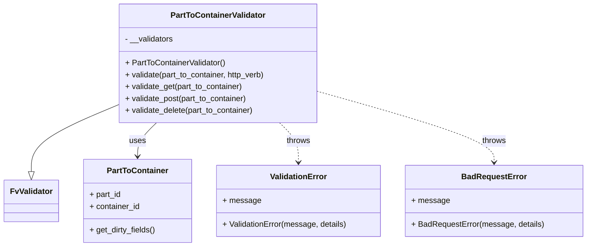

# Diagram: partview_core/partview_service/partview_service/api/part_to_container/handlers/validate/PartToContainerValidator.py

> Auto-generated by Obscura crawlers

## Mermaid

### SVG

<svg id="container" width="1170.8984375" xmlns="http://www.w3.org/2000/svg" class="classDiagram" height="498" viewBox="0 0 1170.8984375 498" role="graphics-document document" aria-roledescription="class"><g><defs><marker id="container_class-aggregationStart" class="marker aggregation class" refX="18" refY="7" markerWidth="190" markerHeight="240" orient="auto"><path d="M 18,7 L9,13 L1,7 L9,1 Z"></path></marker></defs><defs><marker id="container_class-aggregationEnd" class="marker aggregation class" refX="1" refY="7" markerWidth="20" markerHeight="28" orient="auto"><path d="M 18,7 L9,13 L1,7 L9,1 Z"></path></marker></defs><defs><marker id="container_class-extensionStart" class="marker extension class" refX="18" refY="7" markerWidth="190" markerHeight="240" orient="auto"><path d="M 1,7 L18,13 V 1 Z"></path></marker></defs><defs><marker id="container_class-extensionEnd" class="marker extension class" refX="1" refY="7" markerWidth="20" markerHeight="28" orient="auto"><path d="M 1,1 V 13 L18,7 Z"></path></marker></defs><defs><marker id="container_class-compositionStart" class="marker composition class" refX="18" refY="7" markerWidth="190" markerHeight="240" orient="auto"><path d="M 18,7 L9,13 L1,7 L9,1 Z"></path></marker></defs><defs><marker id="container_class-compositionEnd" class="marker composition class" refX="1" refY="7" markerWidth="20" markerHeight="28" orient="auto"><path d="M 18,7 L9,13 L1,7 L9,1 Z"></path></marker></defs><defs><marker id="container_class-dependencyStart" class="marker dependency class" refX="6" refY="7" markerWidth="190" markerHeight="240" orient="auto"><path d="M 5,7 L9,13 L1,7 L9,1 Z"></path></marker></defs><defs><marker id="container_class-dependencyEnd" class="marker dependency class" refX="13" refY="7" markerWidth="20" markerHeight="28" orient="auto"><path d="M 18,7 L9,13 L14,7 L9,1 Z"></path></marker></defs><defs><marker id="container_class-lollipopStart" class="marker lollipop class" refX="13" refY="7" markerWidth="190" markerHeight="240" orient="auto"><circle stroke="black" fill="transparent" cx="7" cy="7" r="6"></circle></marker></defs><defs><marker id="container_class-lollipopEnd" class="marker lollipop class" refX="1" refY="7" markerWidth="190" markerHeight="240" orient="auto"><circle stroke="black" fill="transparent" cx="7" cy="7" r="6"></circle></marker></defs><g class="root"><g class="clusters"></g><g class="edgePaths"><path d="M232.6,212.829L203.984,224.857C175.368,236.886,118.137,260.943,89.522,283.263C60.906,305.583,60.906,326.167,60.906,336.458L60.906,346.75" id="id_PartToContainerValidator_FvValidator_1" class="edge-thickness-normal edge-pattern-solid relation" style=";;;" data-edge="true" data-et="edge" data-id="id_PartToContainerValidator_FvValidator_1" data-points="W3sieCI6MjMyLjU5OTYwOTM3NSwieSI6MjEyLjgyODY1MjI1ODI2MzU2fSx7IngiOjYwLjkwNjI1LCJ5IjoyODV9LHsieCI6NjAuOTA2MjUsInkiOjM2NH1d" marker-end="url(#container_class-extensionEnd)"></path><path d="M310.626,248L304.265,254.167C297.904,260.333,285.183,272.667,278.822,284C272.461,295.333,272.461,305.667,272.461,310.833L272.461,316" id="id_PartToContainerValidator_PartToContainer_2" class="edge-thickness-normal edge-pattern-solid relation" style=";;;" data-edge="true" data-et="edge" data-id="id_PartToContainerValidator_PartToContainer_2" data-points="W3sieCI6MzEwLjYyNTkzMzAyMTQ5Njg1LCJ5IjoyNDh9LHsieCI6MjcyLjQ2MDkzNzUsInkiOjI4NX0seyJ4IjoyNzIuNDYwOTM3NSwieSI6MzIyfV0=" marker-end="url(#container_class-dependencyEnd)"></path><path d="M558.183,248L564.543,254.167C570.904,260.333,583.626,272.667,589.987,286C596.348,299.333,596.348,313.667,596.348,320.833L596.348,328" id="id_PartToContainerValidator_ValidationError_3" class="edge-thickness-normal edge-pattern-dashed relation" style=";;;" data-edge="true" data-et="edge" data-id="id_PartToContainerValidator_ValidationError_3" data-points="W3sieCI6NTU4LjE4MjY2MDcyODUwMzIsInkiOjI0OH0seyJ4Ijo1OTYuMzQ3NjU2MjUsInkiOjI4NX0seyJ4Ijo1OTYuMzQ3NjU2MjUsInkiOjMzNH1d" marker-end="url(#container_class-dependencyEnd)"></path><path d="M636.209,185.31L694.715,201.925C753.22,218.54,870.231,251.77,928.737,275.552C987.242,299.333,987.242,313.667,987.242,320.833L987.242,328" id="id_PartToContainerValidator_BadRequestError_4" class="edge-thickness-normal edge-pattern-dashed relation" style=";;;" data-edge="true" data-et="edge" data-id="id_PartToContainerValidator_BadRequestError_4" data-points="W3sieCI6NjM2LjIwODk4NDM3NSwieSI6MTg1LjMxMDM1NTMwNDQ4MzZ9LHsieCI6OTg3LjI0MjE4NzUsInkiOjI4NX0seyJ4Ijo5ODcuMjQyMTg3NSwieSI6MzM0fV0=" marker-end="url(#container_class-dependencyEnd)"></path></g><g class="edgeLabels"><g class="edgeLabel"><g class="label" data-id="id_PartToContainerValidator_FvValidator_1" transform="translate(0, 0)"><foreignObject width="0" height="0">

</foreignObject></g></g><g class="edgeLabel" transform="translate(272.4609375, 285)"><g class="label" data-id="id_PartToContainerValidator_PartToContainer_2" transform="translate(-16.4921875, -12)"><foreignObject width="32.984375" height="24">

uses

</foreignObject></g></g><g class="edgeLabel" transform="translate(596.34765625, 285)"><g class="label" data-id="id_PartToContainerValidator_ValidationError_3" transform="translate(-24.5703125, -12)"><foreignObject width="49.140625" height="24">

throws

</foreignObject></g></g><g class="edgeLabel" transform="translate(987.2421875, 285)"><g class="label" data-id="id_PartToContainerValidator_BadRequestError_4" transform="translate(-24.5703125, -12)"><foreignObject width="49.140625" height="24">

throws

</foreignObject></g></g></g><g class="nodes"><g class="node default" id="classId-FvValidator-0" transform="translate(60.90625, 406)"><g class="basic label-container"><path d="M-52.90625 -42 L52.90625 -42 L52.90625 42 L-52.90625 42" stroke="none" stroke-width="0" fill="#ECECFF" style=""></path><path d="M-52.90625 -42 C-12.291152493551657 -42, 28.323945012896687 -42, 52.90625 -42 M-52.90625 -42 C-27.801956607014016 -42, -2.697663214028033 -42, 52.90625 -42 M52.90625 -42 C52.90625 -11.125250033537494, 52.90625 19.749499932925012, 52.90625 42 M52.90625 -42 C52.90625 -8.714438173348363, 52.90625 24.571123653303275, 52.90625 42 M52.90625 42 C26.10347711924928 42, -0.699295761501439 42, -52.90625 42 M52.90625 42 C21.26002768889202 42, -10.38619462221596 42, -52.90625 42 M-52.90625 42 C-52.90625 12.457721975538703, -52.90625 -17.084556048922593, -52.90625 -42 M-52.90625 42 C-52.90625 8.400687538387679, -52.90625 -25.198624923224642, -52.90625 -42" stroke="#9370DB" stroke-width="1.3" fill="none" stroke-dasharray="0 0" style=""></path></g><g class="annotation-group text" transform="translate(0, -18)"></g><g class="label-group text" transform="translate(-40.90625, -18)"><g class="label" style="font-weight: bolder" transform="translate(0,-12)"><foreignObject width="81.8125" height="24">

FvValidator

</foreignObject></g></g><g class="members-group text" transform="translate(-40.90625, 30)"></g><g class="methods-group text" transform="translate(-40.90625, 60)"></g><g class="divider" style=""><path d="M-52.90625 6 C-21.502226893198387 6, 9.901796213603227 6, 52.90625 6 M-52.90625 6 C-19.758040424426362 6, 13.390169151147276 6, 52.90625 6" stroke="#9370DB" stroke-width="1.3" fill="none" stroke-dasharray="0 0" style=""></path></g><g class="divider" style=""><path d="M-52.90625 24 C-13.810776703288177 24, 25.284696593423647 24, 52.90625 24 M-52.90625 24 C-30.824497596873695 24, -8.742745193747389 24, 52.90625 24" stroke="#9370DB" stroke-width="1.3" fill="none" stroke-dasharray="0 0" style=""></path></g></g><g class="node default" id="classId-PartToContainerValidator-1" transform="translate(434.404296875, 128)"><g class="basic label-container"><path d="M-201.8046875 -120 L201.8046875 -120 L201.8046875 120 L-201.8046875 120" stroke="none" stroke-width="0" fill="#ECECFF" style=""></path><path d="M-201.8046875 -120 C-109.26292519822084 -120, -16.721162896441683 -120, 201.8046875 -120 M-201.8046875 -120 C-100.76467291795116 -120, 0.2753416640976809 -120, 201.8046875 -120 M201.8046875 -120 C201.8046875 -40.857457202787444, 201.8046875 38.28508559442511, 201.8046875 120 M201.8046875 -120 C201.8046875 -33.8495428556087, 201.8046875 52.30091428878259, 201.8046875 120 M201.8046875 120 C54.62427784225184 120, -92.55613181549631 120, -201.8046875 120 M201.8046875 120 C112.7924077389639 120, 23.780127977927805 120, -201.8046875 120 M-201.8046875 120 C-201.8046875 29.061051477248014, -201.8046875 -61.87789704550397, -201.8046875 -120 M-201.8046875 120 C-201.8046875 47.06964828495214, -201.8046875 -25.860703430095725, -201.8046875 -120" stroke="#9370DB" stroke-width="1.3" fill="none" stroke-dasharray="0 0" style=""></path></g><g class="annotation-group text" transform="translate(0, -96)"></g><g class="label-group text" transform="translate(-92.40625, -96)"><g class="label" style="font-weight: bolder" transform="translate(0,-12)"><foreignObject width="184.8125" height="24">

PartToContainerValidator

</foreignObject></g></g><g class="members-group text" transform="translate(-189.8046875, -48)"><g class="label" style="" transform="translate(0,-12)"><foreignObject width="98.609375" height="24">

- __validators

</foreignObject></g></g><g class="methods-group text" transform="translate(-189.8046875, 0)"><g class="label" style="" transform="translate(0,-12)"><foreignObject width="204.25" height="24">

+ PartToContainerValidator()

</foreignObject></g><g class="label" style="" transform="translate(0,12)"><foreignObject width="287.203125" height="24">

+ validate(part_to_container, http_verb)

</foreignObject></g><g class="label" style="" transform="translate(0,36)"><foreignObject width="240.953125" height="24">

+ validate_get(part_to_container)

</foreignObject></g><g class="label" style="" transform="translate(0,60)"><foreignObject width="250.34375" height="24">

+ validate_post(part_to_container)

</foreignObject></g><g class="label" style="" transform="translate(0,84)"><foreignObject width="263.796875" height="24">

+ validate_delete(part_to_container)

</foreignObject></g></g><g class="divider" style=""><path d="M-201.8046875 -72 C-107.02144777270578 -72, -12.238208045411568 -72, 201.8046875 -72 M-201.8046875 -72 C-81.71537400961103 -72, 38.37393948077795 -72, 201.8046875 -72" stroke="#9370DB" stroke-width="1.3" fill="none" stroke-dasharray="0 0" style=""></path></g><g class="divider" style=""><path d="M-201.8046875 -24 C-45.42340263251458 -24, 110.95788223497084 -24, 201.8046875 -24 M-201.8046875 -24 C-81.84334359500417 -24, 38.11800030999166 -24, 201.8046875 -24" stroke="#9370DB" stroke-width="1.3" fill="none" stroke-dasharray="0 0" style=""></path></g></g><g class="node default" id="classId-PartToContainer-2" transform="translate(272.4609375, 406)"><g class="basic label-container"><path d="M-108.6484375 -84 L108.6484375 -84 L108.6484375 84 L-108.6484375 84" stroke="none" stroke-width="0" fill="#ECECFF" style=""></path><path d="M-108.6484375 -84 C-53.650369073485265 -84, 1.3476993530294692 -84, 108.6484375 -84 M-108.6484375 -84 C-34.199117848288225 -84, 40.25020180342355 -84, 108.6484375 -84 M108.6484375 -84 C108.6484375 -31.60641047268834, 108.6484375 20.787179054623323, 108.6484375 84 M108.6484375 -84 C108.6484375 -45.136884914397456, 108.6484375 -6.2737698287949115, 108.6484375 84 M108.6484375 84 C56.80206138371661 84, 4.955685267433225 84, -108.6484375 84 M108.6484375 84 C36.228659187729505 84, -36.19111912454099 84, -108.6484375 84 M-108.6484375 84 C-108.6484375 27.550813151709022, -108.6484375 -28.898373696581956, -108.6484375 -84 M-108.6484375 84 C-108.6484375 24.604448865023947, -108.6484375 -34.791102269952106, -108.6484375 -84" stroke="#9370DB" stroke-width="1.3" fill="none" stroke-dasharray="0 0" style=""></path></g><g class="annotation-group text" transform="translate(0, -60)"></g><g class="label-group text" transform="translate(-59.21875, -60)"><g class="label" style="font-weight: bolder" transform="translate(0,-12)"><foreignObject width="118.4375" height="24">

PartToContainer

</foreignObject></g></g><g class="members-group text" transform="translate(-96.6484375, -12)"><g class="label" style="" transform="translate(0,-12)"><foreignObject width="64.625" height="24">

+ part_id

</foreignObject></g><g class="label" style="" transform="translate(0,12)"><foreignObject width="102.546875" height="24">

+ container_id

</foreignObject></g></g><g class="methods-group text" transform="translate(-96.6484375, 60)"><g class="label" style="" transform="translate(0,-12)"><foreignObject width="134.078125" height="24">

+ get_dirty_fields()

</foreignObject></g></g><g class="divider" style=""><path d="M-108.6484375 -36 C-56.38047414546857 -36, -4.112510790937137 -36, 108.6484375 -36 M-108.6484375 -36 C-51.281484877563344 -36, 6.085467744873313 -36, 108.6484375 -36" stroke="#9370DB" stroke-width="1.3" fill="none" stroke-dasharray="0 0" style=""></path></g><g class="divider" style=""><path d="M-108.6484375 36 C-52.61188623043502 36, 3.4246650391299625 36, 108.6484375 36 M-108.6484375 36 C-50.327758941611734 36, 7.992919616776533 36, 108.6484375 36" stroke="#9370DB" stroke-width="1.3" fill="none" stroke-dasharray="0 0" style=""></path></g></g><g class="node default" id="classId-ValidationError-3" transform="translate(596.34765625, 406)"><g class="basic label-container"><path d="M-165.23828125 -72 L165.23828125 -72 L165.23828125 72 L-165.23828125 72" stroke="none" stroke-width="0" fill="#ECECFF" style=""></path><path d="M-165.23828125 -72 C-66.38451271172268 -72, 32.469255826554644 -72, 165.23828125 -72 M-165.23828125 -72 C-48.36414747341101 -72, 68.50998630317798 -72, 165.23828125 -72 M165.23828125 -72 C165.23828125 -19.312364672295658, 165.23828125 33.375270655408684, 165.23828125 72 M165.23828125 -72 C165.23828125 -37.47510485043058, 165.23828125 -2.9502097008611656, 165.23828125 72 M165.23828125 72 C88.65469839728067 72, 12.071115544561337 72, -165.23828125 72 M165.23828125 72 C33.1895973383528 72, -98.8590865732944 72, -165.23828125 72 M-165.23828125 72 C-165.23828125 39.359659497751416, -165.23828125 6.719318995502832, -165.23828125 -72 M-165.23828125 72 C-165.23828125 17.34570484377636, -165.23828125 -37.30859031244728, -165.23828125 -72" stroke="#9370DB" stroke-width="1.3" fill="none" stroke-dasharray="0 0" style=""></path></g><g class="annotation-group text" transform="translate(0, -48)"></g><g class="label-group text" transform="translate(-55.1796875, -48)"><g class="label" style="font-weight: bolder" transform="translate(0,-12)"><foreignObject width="110.359375" height="24">

ValidationError

</foreignObject></g></g><g class="members-group text" transform="translate(-153.23828125, 0)"><g class="label" style="" transform="translate(0,-12)"><foreignObject width="74.609375" height="24">

+ message

</foreignObject></g></g><g class="methods-group text" transform="translate(-153.23828125, 48)"><g class="label" style="" transform="translate(0,-12)"><foreignObject width="251.296875" height="24">

+ ValidationError(message, details)

</foreignObject></g></g><g class="divider" style=""><path d="M-165.23828125 -24 C-33.22105887740864 -24, 98.79616349518273 -24, 165.23828125 -24 M-165.23828125 -24 C-41.353242972084615 -24, 82.53179530583077 -24, 165.23828125 -24" stroke="#9370DB" stroke-width="1.3" fill="none" stroke-dasharray="0 0" style=""></path></g><g class="divider" style=""><path d="M-165.23828125 24 C-95.86945868170002 24, -26.50063611340005 24, 165.23828125 24 M-165.23828125 24 C-87.81638836689363 24, -10.394495483787267 24, 165.23828125 24" stroke="#9370DB" stroke-width="1.3" fill="none" stroke-dasharray="0 0" style=""></path></g></g><g class="node default" id="classId-BadRequestError-4" transform="translate(987.2421875, 406)"><g class="basic label-container"><path d="M-175.65625 -72 L175.65625 -72 L175.65625 72 L-175.65625 72" stroke="none" stroke-width="0" fill="#ECECFF" style=""></path><path d="M-175.65625 -72 C-67.35898635867213 -72, 40.93827728265575 -72, 175.65625 -72 M-175.65625 -72 C-63.4175370475954 -72, 48.821175904809195 -72, 175.65625 -72 M175.65625 -72 C175.65625 -39.83497075447061, 175.65625 -7.669941508941221, 175.65625 72 M175.65625 -72 C175.65625 -15.091191973273148, 175.65625 41.817616053453705, 175.65625 72 M175.65625 72 C69.11713573767814 72, -37.42197852464372 72, -175.65625 72 M175.65625 72 C91.48639568870651 72, 7.316541377413017 72, -175.65625 72 M-175.65625 72 C-175.65625 38.181332944061275, -175.65625 4.3626658881225495, -175.65625 -72 M-175.65625 72 C-175.65625 30.504022896667458, -175.65625 -10.991954206665085, -175.65625 -72" stroke="#9370DB" stroke-width="1.3" fill="none" stroke-dasharray="0 0" style=""></path></g><g class="annotation-group text" transform="translate(0, -48)"></g><g class="label-group text" transform="translate(-62.28125, -48)"><g class="label" style="font-weight: bolder" transform="translate(0,-12)"><foreignObject width="124.5625" height="24">

BadRequestError

</foreignObject></g></g><g class="members-group text" transform="translate(-163.65625, 0)"><g class="label" style="" transform="translate(0,-12)"><foreignObject width="74.609375" height="24">

+ message

</foreignObject></g></g><g class="methods-group text" transform="translate(-163.65625, 48)"><g class="label" style="" transform="translate(0,-12)"><foreignObject width="265.03125" height="24">

+ BadRequestError(message, details)

</foreignObject></g></g><g class="divider" style=""><path d="M-175.65625 -24 C-46.93833082718703 -24, 81.77958834562594 -24, 175.65625 -24 M-175.65625 -24 C-63.59320091473538 -24, 48.46984817052925 -24, 175.65625 -24" stroke="#9370DB" stroke-width="1.3" fill="none" stroke-dasharray="0 0" style=""></path></g><g class="divider" style=""><path d="M-175.65625 24 C-45.92112971120855 24, 83.8139905775829 24, 175.65625 24 M-175.65625 24 C-68.52150428575061 24, 38.61324142849878 24, 175.65625 24" stroke="#9370DB" stroke-width="1.3" fill="none" stroke-dasharray="0 0" style=""></path></g></g></g></g></g></svg>
