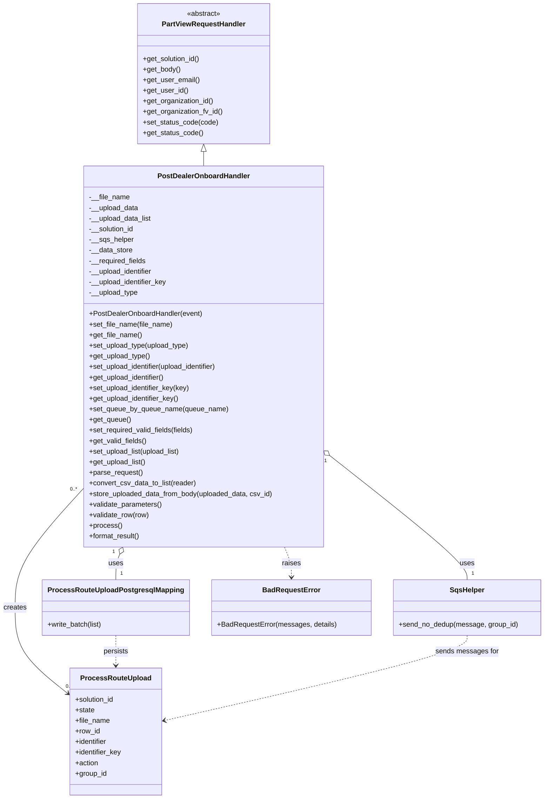

# Diagram: partview_core/partview_service/partview_service/api/partview_dealer_onboard_upload/handler/PostDealerOnboardHandler.py


> Auto-generated by Obscura crawlers

## Diagram 1



### SVG

<svg id="container" width="1205.1875" xmlns="http://www.w3.org/2000/svg" class="classDiagram" height="1810" viewBox="0 0 1205.1875 1810" role="graphics-document document" aria-roledescription="class"><style>#container{font-family:"trebuchet ms",verdana,arial,sans-serif;font-size:16px;fill:#333;}@keyframes edge-animation-frame{from{stroke-dashoffset:0;}}@keyframes dash{to{stroke-dashoffset:0;}}#container .edge-animation-slow{stroke-dasharray:9,5!important;stroke-dashoffset:900;animation:dash 50s linear infinite;stroke-linecap:round;}#container .edge-animation-fast{stroke-dasharray:9,5!important;stroke-dashoffset:900;animation:dash 20s linear infinite;stroke-linecap:round;}#container .error-icon{fill:#552222;}#container .error-text{fill:#552222;stroke:#552222;}#container .edge-thickness-normal{stroke-width:1px;}#container .edge-thickness-thick{stroke-width:3.5px;}#container .edge-pattern-solid{stroke-dasharray:0;}#container .edge-thickness-invisible{stroke-width:0;fill:none;}#container .edge-pattern-dashed{stroke-dasharray:3;}#container .edge-pattern-dotted{stroke-dasharray:2;}#container .marker{fill:#333333;stroke:#333333;}#container .marker.cross{stroke:#333333;}#container svg{font-family:"trebuchet ms",verdana,arial,sans-serif;font-size:16px;}#container p{margin:0;}#container g.classGroup text{fill:#9370DB;stroke:none;font-family:"trebuchet ms",verdana,arial,sans-serif;font-size:10px;}#container g.classGroup text .title{font-weight:bolder;}#container .nodeLabel,#container .edgeLabel{color:#131300;}#container .edgeLabel .label rect{fill:#ECECFF;}#container .label text{fill:#131300;}#container .labelBkg{background:#ECECFF;}#container .edgeLabel .label span{background:#ECECFF;}#container .classTitle{font-weight:bolder;}#container .node rect,#container .node circle,#container .node ellipse,#container .node polygon,#container .node path{fill:#ECECFF;stroke:#9370DB;stroke-width:1px;}#container .divider{stroke:#9370DB;stroke-width:1;}#container g.clickable{cursor:pointer;}#container g.classGroup rect{fill:#ECECFF;stroke:#9370DB;}#container g.classGroup line{stroke:#9370DB;stroke-width:1;}#container .classLabel .box{stroke:none;stroke-width:0;fill:#ECECFF;opacity:0.5;}#container .classLabel .label{fill:#9370DB;font-size:10px;}#container .relation{stroke:#333333;stroke-width:1;fill:none;}#container .dashed-line{stroke-dasharray:3;}#container .dotted-line{stroke-dasharray:1 2;}#container #compositionStart,#container .composition{fill:#333333!important;stroke:#333333!important;stroke-width:1;}#container #compositionEnd,#container .composition{fill:#333333!important;stroke:#333333!important;stroke-width:1;}#container #dependencyStart,#container .dependency{fill:#333333!important;stroke:#333333!important;stroke-width:1;}#container #dependencyStart,#container .dependency{fill:#333333!important;stroke:#333333!important;stroke-width:1;}#container #extensionStart,#container .extension{fill:transparent!important;stroke:#333333!important;stroke-width:1;}#container #extensionEnd,#container .extension{fill:transparent!important;stroke:#333333!important;stroke-width:1;}#container #aggregationStart,#container .aggregation{fill:transparent!important;stroke:#333333!important;stroke-width:1;}#container #aggregationEnd,#container .aggregation{fill:transparent!important;stroke:#333333!important;stroke-width:1;}#container #lollipopStart,#container .lollipop{fill:#ECECFF!important;stroke:#333333!important;stroke-width:1;}#container #lollipopEnd,#container .lollipop{fill:#ECECFF!important;stroke:#333333!important;stroke-width:1;}#container .edgeTerminals{font-size:11px;line-height:initial;}#container .classTitleText{text-anchor:middle;font-size:18px;fill:#333;}#container .label-icon{display:inline-block;height:1em;overflow:visible;vertical-align:-0.125em;}#container .node .label-icon path{fill:currentColor;stroke:revert;stroke-width:revert;}#container :root{--mermaid-font-family:"trebuchet ms",verdana,arial,sans-serif;}</style><g><defs><marker id="container_class-aggregationStart" class="marker aggregation class" refX="18" refY="7" markerWidth="190" markerHeight="240" orient="auto"><path d="M 18,7 L9,13 L1,7 L9,1 Z"></path></marker></defs><defs><marker id="container_class-aggregationEnd" class="marker aggregation class" refX="1" refY="7" markerWidth="20" markerHeight="28" orient="auto"><path d="M 18,7 L9,13 L1,7 L9,1 Z"></path></marker></defs><defs><marker id="container_class-extensionStart" class="marker extension class" refX="18" refY="7" markerWidth="190" markerHeight="240" orient="auto"><path d="M 1,7 L18,13 V 1 Z"></path></marker></defs><defs><marker id="container_class-extensionEnd" class="marker extension class" refX="1" refY="7" markerWidth="20" markerHeight="28" orient="auto"><path d="M 1,1 V 13 L18,7 Z"></path></marker></defs><defs><marker id="container_class-compositionStart" class="marker composition class" refX="18" refY="7" markerWidth="190" markerHeight="240" orient="auto"><path d="M 18,7 L9,13 L1,7 L9,1 Z"></path></marker></defs><defs><marker id="container_class-compositionEnd" class="marker composition class" refX="1" refY="7" markerWidth="20" markerHeight="28" orient="auto"><path d="M 18,7 L9,13 L1,7 L9,1 Z"></path></marker></defs><defs><marker id="container_class-dependencyStart" class="marker dependency class" refX="6" refY="7" markerWidth="190" markerHeight="240" orient="auto"><path d="M 5,7 L9,13 L1,7 L9,1 Z"></path></marker></defs><defs><marker id="container_class-dependencyEnd" class="marker dependency class" refX="13" refY="7" markerWidth="20" markerHeight="28" orient="auto"><path d="M 18,7 L9,13 L14,7 L9,1 Z"></path></marker></defs><defs><marker id="container_class-lollipopStart" class="marker lollipop class" refX="13" refY="7" markerWidth="190" markerHeight="240" orient="auto"><circle stroke="black" fill="transparent" cx="7" cy="7" r="6"></circle></marker></defs><defs><marker id="container_class-lollipopEnd" class="marker lollipop class" refX="1" refY="7" markerWidth="190" markerHeight="240" orient="auto"><circle stroke="black" fill="transparent" cx="7" cy="7" r="6"></circle></marker></defs><g class="root"><g class="clusters"></g><g class="edgePaths"><path d="M445.961,343.25L445.961,344.542C445.961,345.833,445.961,348.417,445.961,353.875C445.961,359.333,445.961,367.667,445.961,371.833L445.961,376" id="id_PartViewRequestHandler_PostDealerOnboardHandler_1" class="edge-thickness-normal edge-pattern-solid relation" style=";;;" data-edge="true" data-et="edge" data-id="id_PartViewRequestHandler_PostDealerOnboardHandler_1" data-points="W3sieCI6NDQ1Ljk2MDkzNzUsInkiOjMyNn0seyJ4Ijo0NDUuOTYwOTM3NSwieSI6MzUxfSx7IngiOjQ0NS45NjA5Mzc1LCJ5IjozNzZ9XQ==" marker-start="url(#container_class-extensionStart)"></path><path d="M261.949,1255.956L260.508,1259.464C259.068,1262.971,256.186,1269.985,254.745,1279.659C253.305,1289.333,253.305,1301.667,253.305,1307.833L253.305,1314" id="id_PostDealerOnboardHandler_ProcessRouteUploadPostgresqlMapping_2" class="edge-thickness-normal edge-pattern-solid relation" style=";;;" data-edge="true" data-et="edge" data-id="id_PostDealerOnboardHandler_ProcessRouteUploadPostgresqlMapping_2" data-points="W3sieCI6MjY4LjUwMzU4MTQyMzI0MDksInkiOjEyNDB9LHsieCI6MjUzLjMwNDY4NzUsInkiOjEyNzd9LHsieCI6MjUzLjMwNDY4NzUsInkiOjEzMTR9XQ==" marker-start="url(#container_class-aggregationStart)"></path><path d="M732.73,1037.663L782.538,1077.553C832.346,1117.442,931.962,1197.221,981.77,1243.277C1031.578,1289.333,1031.578,1301.667,1031.578,1307.833L1031.578,1314" id="id_PostDealerOnboardHandler_SqsHelper_3" class="edge-thickness-normal edge-pattern-solid relation" style=";;;" data-edge="true" data-et="edge" data-id="id_PostDealerOnboardHandler_SqsHelper_3" data-points="W3sieCI6NzE5LjI2NTYyNSwieSI6MTAyNi44ODAwMTQ0MDc4NzY0fSx7IngiOjEwMzEuNTc4MTI1LCJ5IjoxMjc3fSx7IngiOjEwMzEuNTc4MTI1LCJ5IjoxMzE0fV0=" marker-start="url(#container_class-aggregationStart)"></path><path d="M172.656,1119.276L149.576,1145.563C126.495,1171.85,80.333,1224.425,57.253,1267.379C34.172,1310.333,34.172,1343.667,34.172,1377C34.172,1410.333,34.172,1443.667,52.778,1475.702C71.385,1507.737,108.598,1538.475,127.205,1553.844L145.811,1569.212" id="id_PostDealerOnboardHandler_ProcessRouteUpload_4" class="edge-thickness-normal edge-pattern-solid relation" style=";;;" data-edge="true" data-et="edge" data-id="id_PostDealerOnboardHandler_ProcessRouteUpload_4" data-points="W3sieCI6MTcyLjY1NjI1LCJ5IjoxMTE5LjI3NTYyNjU1MzM0fSx7IngiOjM0LjE3MTg3NSwieSI6MTI3N30seyJ4IjozNC4xNzE4NzUsInkiOjEzNzd9LHsieCI6MzQuMTcxODc1LCJ5IjoxNDc3fSx7IngiOjE1MC40Mzc1LCJ5IjoxNTczLjAzMzQ0MTQ3NzQxNDV9XQ==" marker-end="url(#container_class-dependencyEnd)"></path><path d="M623.418,1240L625.951,1246.167C628.485,1252.333,633.551,1264.667,636.084,1276C638.617,1287.333,638.617,1297.667,638.617,1302.833L638.617,1308" id="id_PostDealerOnboardHandler_BadRequestError_5" class="edge-thickness-normal edge-pattern-dashed relation" style=";;;" data-edge="true" data-et="edge" data-id="id_PostDealerOnboardHandler_BadRequestError_5" data-points="W3sieCI6NjIzLjQxODI5MzU3Njc1OTEsInkiOjEyNDB9LHsieCI6NjM4LjYxNzE4NzUsInkiOjEyNzd9LHsieCI6NjM4LjYxNzE4NzUsInkiOjEzMTR9XQ==" marker-end="url(#container_class-dependencyEnd)"></path><path d="M253.305,1440L253.305,1446.167C253.305,1452.333,253.305,1464.667,253.305,1476C253.305,1487.333,253.305,1497.667,253.305,1502.833L253.305,1508" id="id_ProcessRouteUploadPostgresqlMapping_ProcessRouteUpload_6" class="edge-thickness-normal edge-pattern-dashed relation" style=";;;" data-edge="true" data-et="edge" data-id="id_ProcessRouteUploadPostgresqlMapping_ProcessRouteUpload_6" data-points="W3sieCI6MjUzLjMwNDY4NzUsInkiOjE0NDB9LHsieCI6MjUzLjMwNDY4NzUsInkiOjE0Nzd9LHsieCI6MjUzLjMwNDY4NzUsInkiOjE1MTR9XQ==" marker-end="url(#container_class-dependencyEnd)"></path><path d="M1031.578,1440L1031.578,1446.167C1031.578,1452.333,1031.578,1464.667,919.984,1496.786C808.391,1528.906,585.203,1580.812,473.61,1606.765L362.016,1632.717" id="id_SqsHelper_ProcessRouteUpload_7" class="edge-thickness-normal edge-pattern-dashed relation" style=";;;" data-edge="true" data-et="edge" data-id="id_SqsHelper_ProcessRouteUpload_7" data-points="W3sieCI6MTAzMS41NzgxMjUsInkiOjE0NDB9LHsieCI6MTAzMS41NzgxMjUsInkiOjE0Nzd9LHsieCI6MzU2LjE3MTg3NSwieSI6MTYzNC4wNzY1ODE3NzY1Njg3fV0=" marker-end="url(#container_class-dependencyEnd)"></path></g><g class="edgeLabels"><g class="edgeLabel"><g class="label" data-id="id_PartViewRequestHandler_PostDealerOnboardHandler_1" transform="translate(0, 0)"><foreignObject width="0" height="0"><div xmlns="http://www.w3.org/1999/xhtml" class="labelBkg" style="display: table-cell; white-space: nowrap; line-height: 1.5; max-width: 200px; text-align: center;"><span class="edgeLabel"></span></div></foreignObject></g></g><g class="edgeLabel" transform="translate(253.3046875, 1277)"><g class="label" data-id="id_PostDealerOnboardHandler_ProcessRouteUploadPostgresqlMapping_2" transform="translate(-16.4921875, -12)"><foreignObject width="32.984375" height="24"><div xmlns="http://www.w3.org/1999/xhtml" class="labelBkg" style="display: table-cell; white-space: nowrap; line-height: 1.5; max-width: 200px; text-align: center;"><span class="edgeLabel"><p>uses</p></span></div></foreignObject></g></g><g class="edgeLabel" transform="translate(1031.578125, 1277)"><g class="label" data-id="id_PostDealerOnboardHandler_SqsHelper_3" transform="translate(-16.4921875, -12)"><foreignObject width="32.984375" height="24"><div xmlns="http://www.w3.org/1999/xhtml" class="labelBkg" style="display: table-cell; white-space: nowrap; line-height: 1.5; max-width: 200px; text-align: center;"><span class="edgeLabel"><p>uses</p></span></div></foreignObject></g></g><g class="edgeLabel" transform="translate(34.171875, 1377)"><g class="label" data-id="id_PostDealerOnboardHandler_ProcessRouteUpload_4" transform="translate(-26.171875, -12)"><foreignObject width="52.34375" height="24"><div xmlns="http://www.w3.org/1999/xhtml" class="labelBkg" style="display: table-cell; white-space: nowrap; line-height: 1.5; max-width: 200px; text-align: center;"><span class="edgeLabel"><p>creates</p></span></div></foreignObject></g></g><g class="edgeLabel" transform="translate(638.6171875, 1277)"><g class="label" data-id="id_PostDealerOnboardHandler_BadRequestError_5" transform="translate(-21.25, -12)"><foreignObject width="42.5" height="24"><div xmlns="http://www.w3.org/1999/xhtml" class="labelBkg" style="display: table-cell; white-space: nowrap; line-height: 1.5; max-width: 200px; text-align: center;"><span class="edgeLabel"><p>raises</p></span></div></foreignObject></g></g><g class="edgeLabel" transform="translate(253.3046875, 1477)"><g class="label" data-id="id_ProcessRouteUploadPostgresqlMapping_ProcessRouteUpload_6" transform="translate(-28.4375, -12)"><foreignObject width="56.875" height="24"><div xmlns="http://www.w3.org/1999/xhtml" class="labelBkg" style="display: table-cell; white-space: nowrap; line-height: 1.5; max-width: 200px; text-align: center;"><span class="edgeLabel"><p>persists</p></span></div></foreignObject></g></g><g class="edgeLabel" transform="translate(1031.578125, 1477)"><g class="label" data-id="id_SqsHelper_ProcessRouteUpload_7" transform="translate(-70.8359375, -12)"><foreignObject width="141.671875" height="24"><div xmlns="http://www.w3.org/1999/xhtml" class="labelBkg" style="display: table-cell; white-space: nowrap; line-height: 1.5; max-width: 200px; text-align: center;"><span class="edgeLabel"><p>sends messages for</p></span></div></foreignObject></g></g><g class="edgeTerminals" transform="translate(247.97910743882994, 1250.4878983775575)"><g class="inner" transform="translate(0, 0)"><foreignObject style="width: 9px; height: 12px;"><div xmlns="http://www.w3.org/1999/xhtml" style="display: inline-block; padding-right: 1px; white-space: nowrap;"><span class="edgeLabel">1</span></div></foreignObject></g></g><g class="edgeTerminals" transform="translate(723.5484712431623, 1049.5274702440645)"><g class="inner" transform="translate(0, 0)"><foreignObject style="width: 9px; height: 12px;"><div xmlns="http://www.w3.org/1999/xhtml" style="display: inline-block; padding-right: 1px; white-space: nowrap;"><span class="edgeLabel">1</span></div></foreignObject></g></g><g class="edgeTerminals" transform="translate(149.83818889168668, 1122.529244489055)"><g class="inner" transform="translate(0, 0)"><foreignObject style="width: 36px; height: 12px;"><div xmlns="http://www.w3.org/1999/xhtml" style="display: inline-block; padding-right: 1px; white-space: nowrap;"><span class="edgeLabel">0..*</span></div></foreignObject></g></g><g class="edgeTerminals" transform="translate(263.30468874999997, 1291.5000010714286)"><g class="inner" transform="translate(0, 0)"></g><foreignObject style="width: 9px; height: 12px;"><div xmlns="http://www.w3.org/1999/xhtml" style="display: inline-block; padding-right: 1px; white-space: nowrap;"><span class="edgeLabel">1</span></div></foreignObject></g><g class="edgeTerminals" transform="translate(1041.5781274999997, 1291.5000021428573)"><g class="inner" transform="translate(0, 0)"></g><foreignObject style="width: 9px; height: 12px;"><div xmlns="http://www.w3.org/1999/xhtml" style="display: inline-block; padding-right: 1px; white-space: nowrap;"><span class="edgeLabel">1</span></div></foreignObject></g><g class="edgeTerminals" transform="translate(141.4974863679926, 1545.323833570996)"><g class="inner" transform="translate(0, 0)"></g><foreignObject style="width: 36px; height: 12px;"><div xmlns="http://www.w3.org/1999/xhtml" style="display: inline-block; padding-right: 1px; white-space: nowrap;"><span class="edgeLabel">0..*</span></div></foreignObject></g></g><g class="nodes"><g class="node default" id="classId-PartViewRequestHandler-0" transform="translate(445.9609375, 167)"><g class="basic label-container"><path d="M-148.890625 -159 L148.890625 -159 L148.890625 159 L-148.890625 159" stroke="none" stroke-width="0" fill="#ECECFF" style=""></path><path d="M-148.890625 -159 C-73.56312435552057 -159, 1.7643762889588572 -159, 148.890625 -159 M-148.890625 -159 C-79.25240367045873 -159, -9.614182340917466 -159, 148.890625 -159 M148.890625 -159 C148.890625 -61.758136147177694, 148.890625 35.48372770564461, 148.890625 159 M148.890625 -159 C148.890625 -61.36132343992442, 148.890625 36.27735312015116, 148.890625 159 M148.890625 159 C42.7957484370685 159, -63.29912812586301 159, -148.890625 159 M148.890625 159 C52.79564936134547 159, -43.29932627730906 159, -148.890625 159 M-148.890625 159 C-148.890625 36.24946627687292, -148.890625 -86.50106744625415, -148.890625 -159 M-148.890625 159 C-148.890625 55.93958533932958, -148.890625 -47.120829321340835, -148.890625 -159" stroke="#9370DB" stroke-width="1.3" fill="none" stroke-dasharray="0 0" style=""></path></g><g class="annotation-group text" transform="translate(-38.609375, -135)"><g class="label" style="" transform="translate(0,-12)"><foreignObject width="77.21875" height="24"><div xmlns="http://www.w3.org/1999/xhtml" style="display: table-cell; white-space: nowrap; line-height: 1.5; max-width: 127px; text-align: center;"><span class="nodeLabel markdown-node-label" style=""><p>«abstract»</p></span></div></foreignObject></g></g><g class="label-group text" transform="translate(-91.359375, -111)"><g class="label" style="font-weight: bolder" transform="translate(0,-12)"><foreignObject width="182.71875" height="24"><div xmlns="http://www.w3.org/1999/xhtml" style="display: table-cell; white-space: nowrap; line-height: 1.5; max-width: 231px; text-align: center;"><span class="nodeLabel markdown-node-label" style=""><p>PartViewRequestHandler</p></span></div></foreignObject></g></g><g class="members-group text" transform="translate(-136.890625, -63)"></g><g class="methods-group text" transform="translate(-136.890625, -33)"><g class="label" style="" transform="translate(0,-12)"><foreignObject width="131.46875" height="24"><div xmlns="http://www.w3.org/1999/xhtml" style="display: table-cell; white-space: nowrap; line-height: 1.5; max-width: 189px; text-align: center;"><span class="nodeLabel markdown-node-label" style=""><p>+get_solution_id()</p></span></div></foreignObject></g><g class="label" style="" transform="translate(0,12)"><foreignObject width="85.53125" height="24"><div xmlns="http://www.w3.org/1999/xhtml" style="display: table-cell; white-space: nowrap; line-height: 1.5; max-width: 143px; text-align: center;"><span class="nodeLabel markdown-node-label" style=""><p>+get_body()</p></span></div></foreignObject></g><g class="label" style="" transform="translate(0,36)"><foreignObject width="127.65625" height="24"><div xmlns="http://www.w3.org/1999/xhtml" style="display: table-cell; white-space: nowrap; line-height: 1.5; max-width: 185px; text-align: center;"><span class="nodeLabel markdown-node-label" style=""><p>+get_user_email()</p></span></div></foreignObject></g><g class="label" style="" transform="translate(0,60)"><foreignObject width="101.71875" height="24"><div xmlns="http://www.w3.org/1999/xhtml" style="display: table-cell; white-space: nowrap; line-height: 1.5; max-width: 159px; text-align: center;"><span class="nodeLabel markdown-node-label" style=""><p>+get_user_id()</p></span></div></foreignObject></g><g class="label" style="" transform="translate(0,84)"><foreignObject width="161.671875" height="24"><div xmlns="http://www.w3.org/1999/xhtml" style="display: table-cell; white-space: nowrap; line-height: 1.5; max-width: 219px; text-align: center;"><span class="nodeLabel markdown-node-label" style=""><p>+get_organization_id()</p></span></div></foreignObject></g><g class="label" style="" transform="translate(0,108)"><foreignObject width="182.421875" height="24"><div xmlns="http://www.w3.org/1999/xhtml" style="display: table-cell; white-space: nowrap; line-height: 1.5; max-width: 240px; text-align: center;"><span class="nodeLabel markdown-node-label" style=""><p>+get_organization_fv_id()</p></span></div></foreignObject></g><g class="label" style="" transform="translate(0,132)"><foreignObject width="170.640625" height="24"><div xmlns="http://www.w3.org/1999/xhtml" style="display: table-cell; white-space: nowrap; line-height: 1.5; max-width: 228px; text-align: center;"><span class="nodeLabel markdown-node-label" style=""><p>+set_status_code(code)</p></span></div></foreignObject></g><g class="label" style="" transform="translate(0,156)"><foreignObject width="136.28125" height="24"><div xmlns="http://www.w3.org/1999/xhtml" style="display: table-cell; white-space: nowrap; line-height: 1.5; max-width: 194px; text-align: center;"><span class="nodeLabel markdown-node-label" style=""><p>+get_status_code()</p></span></div></foreignObject></g></g><g class="divider" style=""><path d="M-148.890625 -87 C-54.609922573343226 -87, 39.67077985331355 -87, 148.890625 -87 M-148.890625 -87 C-84.4537867695716 -87, -20.016948539143186 -87, 148.890625 -87" stroke="#9370DB" stroke-width="1.3" fill="none" stroke-dasharray="0 0" style=""></path></g><g class="divider" style=""><path d="M-148.890625 -63 C-86.52946238636481 -63, -24.168299772729625 -63, 148.890625 -63 M-148.890625 -63 C-61.17367207126861 -63, 26.543280857462776 -63, 148.890625 -63" stroke="#9370DB" stroke-width="1.3" fill="none" stroke-dasharray="0 0" style=""></path></g></g><g class="node default" id="classId-PostDealerOnboardHandler-1" transform="translate(445.9609375, 808)"><g class="basic label-container"><path d="M-273.3046875 -432 L273.3046875 -432 L273.3046875 432 L-273.3046875 432" stroke="none" stroke-width="0" fill="#ECECFF" style=""></path><path d="M-273.3046875 -432 C-151.56223865859556 -432, -29.819789817191122 -432, 273.3046875 -432 M-273.3046875 -432 C-105.06448300192244 -432, 63.17572149615512 -432, 273.3046875 -432 M273.3046875 -432 C273.3046875 -177.99133161867334, 273.3046875 76.01733676265331, 273.3046875 432 M273.3046875 -432 C273.3046875 -169.0366214203052, 273.3046875 93.92675715938958, 273.3046875 432 M273.3046875 432 C105.47673133979254 432, -62.35122482041493 432, -273.3046875 432 M273.3046875 432 C75.210341731668 432, -122.88400403666401 432, -273.3046875 432 M-273.3046875 432 C-273.3046875 145.15326633882773, -273.3046875 -141.69346732234453, -273.3046875 -432 M-273.3046875 432 C-273.3046875 87.91833138389461, -273.3046875 -256.1633372322108, -273.3046875 -432" stroke="#9370DB" stroke-width="1.3" fill="none" stroke-dasharray="0 0" style=""></path></g><g class="annotation-group text" transform="translate(0, -408)"></g><g class="label-group text" transform="translate(-100.75, -408)"><g class="label" style="font-weight: bolder" transform="translate(0,-12)"><foreignObject width="201.5" height="24"><div xmlns="http://www.w3.org/1999/xhtml" style="display: table-cell; white-space: nowrap; line-height: 1.5; max-width: 250px; text-align: center;"><span class="nodeLabel markdown-node-label" style=""><p>PostDealerOnboardHandler</p></span></div></foreignObject></g></g><g class="members-group text" transform="translate(-261.3046875, -360)"><g class="label" style="" transform="translate(0,-12)"><foreignObject width="92.375" height="24"><div xmlns="http://www.w3.org/1999/xhtml" style="display: table-cell; white-space: nowrap; line-height: 1.5; max-width: 150px; text-align: center;"><span class="nodeLabel markdown-node-label" style=""><p>-__file_name</p></span></div></foreignObject></g><g class="label" style="" transform="translate(0,12)"><foreignObject width="112.859375" height="24"><div xmlns="http://www.w3.org/1999/xhtml" style="display: table-cell; white-space: nowrap; line-height: 1.5; max-width: 170px; text-align: center;"><span class="nodeLabel markdown-node-label" style=""><p>-__upload_data</p></span></div></foreignObject></g><g class="label" style="" transform="translate(0,36)"><foreignObject width="143.46875" height="24"><div xmlns="http://www.w3.org/1999/xhtml" style="display: table-cell; white-space: nowrap; line-height: 1.5; max-width: 201px; text-align: center;"><span class="nodeLabel markdown-node-label" style=""><p>-__upload_data_list</p></span></div></foreignObject></g><g class="label" style="" transform="translate(0,60)"><foreignObject width="103.875" height="24"><div xmlns="http://www.w3.org/1999/xhtml" style="display: table-cell; white-space: nowrap; line-height: 1.5; max-width: 161px; text-align: center;"><span class="nodeLabel markdown-node-label" style=""><p>-__solution_id</p></span></div></foreignObject></g><g class="label" style="" transform="translate(0,84)"><foreignObject width="101.359375" height="24"><div xmlns="http://www.w3.org/1999/xhtml" style="display: table-cell; white-space: nowrap; line-height: 1.5; max-width: 160px; text-align: center;"><span class="nodeLabel markdown-node-label" style=""><p>-__sqs_helper</p></span></div></foreignObject></g><g class="label" style="" transform="translate(0,108)"><foreignObject width="99.0625" height="24"><div xmlns="http://www.w3.org/1999/xhtml" style="display: table-cell; white-space: nowrap; line-height: 1.5; max-width: 156px; text-align: center;"><span class="nodeLabel markdown-node-label" style=""><p>-__data_store</p></span></div></foreignObject></g><g class="label" style="" transform="translate(0,132)"><foreignObject width="131.015625" height="24"><div xmlns="http://www.w3.org/1999/xhtml" style="display: table-cell; white-space: nowrap; line-height: 1.5; max-width: 188px; text-align: center;"><span class="nodeLabel markdown-node-label" style=""><p>-__required_fields</p></span></div></foreignObject></g><g class="label" style="" transform="translate(0,156)"><foreignObject width="147.09375" height="24"><div xmlns="http://www.w3.org/1999/xhtml" style="display: table-cell; white-space: nowrap; line-height: 1.5; max-width: 205px; text-align: center;"><span class="nodeLabel markdown-node-label" style=""><p>-__upload_identifier</p></span></div></foreignObject></g><g class="label" style="" transform="translate(0,180)"><foreignObject width="178.71875" height="24"><div xmlns="http://www.w3.org/1999/xhtml" style="display: table-cell; white-space: nowrap; line-height: 1.5; max-width: 236px; text-align: center;"><span class="nodeLabel markdown-node-label" style=""><p>-__upload_identifier_key</p></span></div></foreignObject></g><g class="label" style="" transform="translate(0,204)"><foreignObject width="112.015625" height="24"><div xmlns="http://www.w3.org/1999/xhtml" style="display: table-cell; white-space: nowrap; line-height: 1.5; max-width: 169px; text-align: center;"><span class="nodeLabel markdown-node-label" style=""><p>-__upload_type</p></span></div></foreignObject></g></g><g class="methods-group text" transform="translate(-261.3046875, -96)"><g class="label" style="" transform="translate(0,-12)"><foreignObject width="258.15625" height="24"><div xmlns="http://www.w3.org/1999/xhtml" style="display: table-cell; white-space: nowrap; line-height: 1.5; max-width: 316px; text-align: center;"><span class="nodeLabel markdown-node-label" style=""><p>+PostDealerOnboardHandler(event)</p></span></div></foreignObject></g><g class="label" style="" transform="translate(0,12)"><foreignObject width="190.40625" height="24"><div xmlns="http://www.w3.org/1999/xhtml" style="display: table-cell; white-space: nowrap; line-height: 1.5; max-width: 248px; text-align: center;"><span class="nodeLabel markdown-node-label" style=""><p>+set_file_name(file_name)</p></span></div></foreignObject></g><g class="label" style="" transform="translate(0,36)"><foreignObject width="119.953125" height="24"><div xmlns="http://www.w3.org/1999/xhtml" style="display: table-cell; white-space: nowrap; line-height: 1.5; max-width: 177px; text-align: center;"><span class="nodeLabel markdown-node-label" style=""><p>+get_file_name()</p></span></div></foreignObject></g><g class="label" style="" transform="translate(0,60)"><foreignObject width="229.671875" height="24"><div xmlns="http://www.w3.org/1999/xhtml" style="display: table-cell; white-space: nowrap; line-height: 1.5; max-width: 287px; text-align: center;"><span class="nodeLabel markdown-node-label" style=""><p>+set_upload_type(upload_type)</p></span></div></foreignObject></g><g class="label" style="" transform="translate(0,84)"><foreignObject width="139.59375" height="24"><div xmlns="http://www.w3.org/1999/xhtml" style="display: table-cell; white-space: nowrap; line-height: 1.5; max-width: 197px; text-align: center;"><span class="nodeLabel markdown-node-label" style=""><p>+get_upload_type()</p></span></div></foreignObject></g><g class="label" style="" transform="translate(0,108)"><foreignObject width="299.84375" height="24"><div xmlns="http://www.w3.org/1999/xhtml" style="display: table-cell; white-space: nowrap; line-height: 1.5; max-width: 357px; text-align: center;"><span class="nodeLabel markdown-node-label" style=""><p>+set_upload_identifier(upload_identifier)</p></span></div></foreignObject></g><g class="label" style="" transform="translate(0,132)"><foreignObject width="174.6875" height="24"><div xmlns="http://www.w3.org/1999/xhtml" style="display: table-cell; white-space: nowrap; line-height: 1.5; max-width: 232px; text-align: center;"><span class="nodeLabel markdown-node-label" style=""><p>+get_upload_identifier()</p></span></div></foreignObject></g><g class="label" style="" transform="translate(0,156)"><foreignObject width="230.28125" height="24"><div xmlns="http://www.w3.org/1999/xhtml" style="display: table-cell; white-space: nowrap; line-height: 1.5; max-width: 288px; text-align: center;"><span class="nodeLabel markdown-node-label" style=""><p>+set_upload_identifier_key(key)</p></span></div></foreignObject></g><g class="label" style="" transform="translate(0,180)"><foreignObject width="206.296875" height="24"><div xmlns="http://www.w3.org/1999/xhtml" style="display: table-cell; white-space: nowrap; line-height: 1.5; max-width: 264px; text-align: center;"><span class="nodeLabel markdown-node-label" style=""><p>+get_upload_identifier_key()</p></span></div></foreignObject></g><g class="label" style="" transform="translate(0,204)"><foreignObject width="315.078125" height="24"><div xmlns="http://www.w3.org/1999/xhtml" style="display: table-cell; white-space: nowrap; line-height: 1.5; max-width: 372px; text-align: center;"><span class="nodeLabel markdown-node-label" style=""><p>+set_queue_by_queue_name(queue_name)</p></span></div></foreignObject></g><g class="label" style="" transform="translate(0,228)"><foreignObject width="94.546875" height="24"><div xmlns="http://www.w3.org/1999/xhtml" style="display: table-cell; white-space: nowrap; line-height: 1.5; max-width: 152px; text-align: center;"><span class="nodeLabel markdown-node-label" style=""><p>+get_queue()</p></span></div></foreignObject></g><g class="label" style="" transform="translate(0,252)"><foreignObject width="240.34375" height="24"><div xmlns="http://www.w3.org/1999/xhtml" style="display: table-cell; white-space: nowrap; line-height: 1.5; max-width: 298px; text-align: center;"><span class="nodeLabel markdown-node-label" style=""><p>+set_required_valid_fields(fields)</p></span></div></foreignObject></g><g class="label" style="" transform="translate(0,276)"><foreignObject width="131.25" height="24"><div xmlns="http://www.w3.org/1999/xhtml" style="display: table-cell; white-space: nowrap; line-height: 1.5; max-width: 189px; text-align: center;"><span class="nodeLabel markdown-node-label" style=""><p>+get_valid_fields()</p></span></div></foreignObject></g><g class="label" style="" transform="translate(0,300)"><foreignObject width="211.296875" height="24"><div xmlns="http://www.w3.org/1999/xhtml" style="display: table-cell; white-space: nowrap; line-height: 1.5; max-width: 269px; text-align: center;"><span class="nodeLabel markdown-node-label" style=""><p>+set_upload_list(upload_list)</p></span></div></foreignObject></g><g class="label" style="" transform="translate(0,324)"><foreignObject width="130.40625" height="24"><div xmlns="http://www.w3.org/1999/xhtml" style="display: table-cell; white-space: nowrap; line-height: 1.5; max-width: 188px; text-align: center;"><span class="nodeLabel markdown-node-label" style=""><p>+get_upload_list()</p></span></div></foreignObject></g><g class="label" style="" transform="translate(0,348)"><foreignObject width="121.796875" height="24"><div xmlns="http://www.w3.org/1999/xhtml" style="display: table-cell; white-space: nowrap; line-height: 1.5; max-width: 179px; text-align: center;"><span class="nodeLabel markdown-node-label" style=""><p>+parse_request()</p></span></div></foreignObject></g><g class="label" style="" transform="translate(0,372)"><foreignObject width="244.25" height="24"><div xmlns="http://www.w3.org/1999/xhtml" style="display: table-cell; white-space: nowrap; line-height: 1.5; max-width: 302px; text-align: center;"><span class="nodeLabel markdown-node-label" style=""><p>+convert_csv_data_to_list(reader)</p></span></div></foreignObject></g><g class="label" style="" transform="translate(0,396)"><foreignObject width="421.859375" height="24"><div xmlns="http://www.w3.org/1999/xhtml" style="display: table-cell; white-space: nowrap; line-height: 1.5; max-width: 479px; text-align: center;"><span class="nodeLabel markdown-node-label" style=""><p>+store_uploaded_data_from_body(uploaded_data, csv_id)</p></span></div></foreignObject></g><g class="label" style="" transform="translate(0,420)"><foreignObject width="166.546875" height="24"><div xmlns="http://www.w3.org/1999/xhtml" style="display: table-cell; white-space: nowrap; line-height: 1.5; max-width: 224px; text-align: center;"><span class="nodeLabel markdown-node-label" style=""><p>+validate_parameters()</p></span></div></foreignObject></g><g class="label" style="" transform="translate(0,444)"><foreignObject width="137.109375" height="24"><div xmlns="http://www.w3.org/1999/xhtml" style="display: table-cell; white-space: nowrap; line-height: 1.5; max-width: 194px; text-align: center;"><span class="nodeLabel markdown-node-label" style=""><p>+validate_row(row)</p></span></div></foreignObject></g><g class="label" style="" transform="translate(0,468)"><foreignObject width="73.734375" height="24"><div xmlns="http://www.w3.org/1999/xhtml" style="display: table-cell; white-space: nowrap; line-height: 1.5; max-width: 131px; text-align: center;"><span class="nodeLabel markdown-node-label" style=""><p>+process()</p></span></div></foreignObject></g><g class="label" style="" transform="translate(0,492)"><foreignObject width="117.015625" height="24"><div xmlns="http://www.w3.org/1999/xhtml" style="display: table-cell; white-space: nowrap; line-height: 1.5; max-width: 174px; text-align: center;"><span class="nodeLabel markdown-node-label" style=""><p>+format_result()</p></span></div></foreignObject></g></g><g class="divider" style=""><path d="M-273.3046875 -384 C-131.90650691798956 -384, 9.49167366402088 -384, 273.3046875 -384 M-273.3046875 -384 C-134.98586274533366 -384, 3.3329620093326753 -384, 273.3046875 -384" stroke="#9370DB" stroke-width="1.3" fill="none" stroke-dasharray="0 0" style=""></path></g><g class="divider" style=""><path d="M-273.3046875 -120 C-100.15510236920483 -120, 72.99448276159035 -120, 273.3046875 -120 M-273.3046875 -120 C-68.7334349297858 -120, 135.8378176404284 -120, 273.3046875 -120" stroke="#9370DB" stroke-width="1.3" fill="none" stroke-dasharray="0 0" style=""></path></g></g><g class="node default" id="classId-ProcessRouteUpload-2" transform="translate(253.3046875, 1658)"><g class="basic label-container"><path d="M-102.8671875 -144 L102.8671875 -144 L102.8671875 144 L-102.8671875 144" stroke="none" stroke-width="0" fill="#ECECFF" style=""></path><path d="M-102.8671875 -144 C-55.705750983441455 -144, -8.54431446688291 -144, 102.8671875 -144 M-102.8671875 -144 C-41.704940389979726 -144, 19.45730672004055 -144, 102.8671875 -144 M102.8671875 -144 C102.8671875 -66.85324324492903, 102.8671875 10.293513510141935, 102.8671875 144 M102.8671875 -144 C102.8671875 -69.94040152727669, 102.8671875 4.1191969454466175, 102.8671875 144 M102.8671875 144 C58.546388933372924 144, 14.225590366745848 144, -102.8671875 144 M102.8671875 144 C60.612096221294635 144, 18.35700494258927 144, -102.8671875 144 M-102.8671875 144 C-102.8671875 47.17755030696652, -102.8671875 -49.64489938606695, -102.8671875 -144 M-102.8671875 144 C-102.8671875 31.615818563866767, -102.8671875 -80.76836287226647, -102.8671875 -144" stroke="#9370DB" stroke-width="1.3" fill="none" stroke-dasharray="0 0" style=""></path></g><g class="annotation-group text" transform="translate(0, -120)"></g><g class="label-group text" transform="translate(-75.5625, -120)"><g class="label" style="font-weight: bolder" transform="translate(0,-12)"><foreignObject width="151.125" height="24"><div xmlns="http://www.w3.org/1999/xhtml" style="display: table-cell; white-space: nowrap; line-height: 1.5; max-width: 199px; text-align: center;"><span class="nodeLabel markdown-node-label" style=""><p>ProcessRouteUpload</p></span></div></foreignObject></g></g><g class="members-group text" transform="translate(-90.8671875, -72)"><g class="label" style="" transform="translate(0,-12)"><foreignObject width="90.21875" height="24"><div xmlns="http://www.w3.org/1999/xhtml" style="display: table-cell; white-space: nowrap; line-height: 1.5; max-width: 148px; text-align: center;"><span class="nodeLabel markdown-node-label" style=""><p>+solution_id</p></span></div></foreignObject></g><g class="label" style="" transform="translate(0,12)"><foreignObject width="44.09375" height="24"><div xmlns="http://www.w3.org/1999/xhtml" style="display: table-cell; white-space: nowrap; line-height: 1.5; max-width: 101px; text-align: center;"><span class="nodeLabel markdown-node-label" style=""><p>+state</p></span></div></foreignObject></g><g class="label" style="" transform="translate(0,36)"><foreignObject width="78.796875" height="24"><div xmlns="http://www.w3.org/1999/xhtml" style="display: table-cell; white-space: nowrap; line-height: 1.5; max-width: 136px; text-align: center;"><span class="nodeLabel markdown-node-label" style=""><p>+file_name</p></span></div></foreignObject></g><g class="label" style="" transform="translate(0,60)"><foreignObject width="56.578125" height="24"><div xmlns="http://www.w3.org/1999/xhtml" style="display: table-cell; white-space: nowrap; line-height: 1.5; max-width: 114px; text-align: center;"><span class="nodeLabel markdown-node-label" style=""><p>+row_id</p></span></div></foreignObject></g><g class="label" style="" transform="translate(0,84)"><foreignObject width="74.546875" height="24"><div xmlns="http://www.w3.org/1999/xhtml" style="display: table-cell; white-space: nowrap; line-height: 1.5; max-width: 133px; text-align: center;"><span class="nodeLabel markdown-node-label" style=""><p>+identifier</p></span></div></foreignObject></g><g class="label" style="" transform="translate(0,108)"><foreignObject width="106.171875" height="24"><div xmlns="http://www.w3.org/1999/xhtml" style="display: table-cell; white-space: nowrap; line-height: 1.5; max-width: 164px; text-align: center;"><span class="nodeLabel markdown-node-label" style=""><p>+identifier_key</p></span></div></foreignObject></g><g class="label" style="" transform="translate(0,132)"><foreignObject width="53.109375" height="24"><div xmlns="http://www.w3.org/1999/xhtml" style="display: table-cell; white-space: nowrap; line-height: 1.5; max-width: 110px; text-align: center;"><span class="nodeLabel markdown-node-label" style=""><p>+action</p></span></div></foreignObject></g><g class="label" style="" transform="translate(0,156)"><foreignObject width="72.25" height="24"><div xmlns="http://www.w3.org/1999/xhtml" style="display: table-cell; white-space: nowrap; line-height: 1.5; max-width: 130px; text-align: center;"><span class="nodeLabel markdown-node-label" style=""><p>+group_id</p></span></div></foreignObject></g></g><g class="methods-group text" transform="translate(-90.8671875, 144)"></g><g class="divider" style=""><path d="M-102.8671875 -96 C-35.052863931896496 -96, 32.76145963620701 -96, 102.8671875 -96 M-102.8671875 -96 C-45.94223077460624 -96, 10.982725950787525 -96, 102.8671875 -96" stroke="#9370DB" stroke-width="1.3" fill="none" stroke-dasharray="0 0" style=""></path></g><g class="divider" style=""><path d="M-102.8671875 120 C-55.05223547955896 120, -7.2372834591179185 120, 102.8671875 120 M-102.8671875 120 C-38.741539235755795 120, 25.38410902848841 120, 102.8671875 120" stroke="#9370DB" stroke-width="1.3" fill="none" stroke-dasharray="0 0" style=""></path></g></g><g class="node default" id="classId-ProcessRouteUploadPostgresqlMapping-3" transform="translate(253.3046875, 1377)"><g class="basic label-container"><path d="M-157.9609375 -63 L157.9609375 -63 L157.9609375 63 L-157.9609375 63" stroke="none" stroke-width="0" fill="#ECECFF" style=""></path><path d="M-157.9609375 -63 C-83.44647416182892 -63, -8.932010823657833 -63, 157.9609375 -63 M-157.9609375 -63 C-33.04769449249129 -63, 91.86554851501742 -63, 157.9609375 -63 M157.9609375 -63 C157.9609375 -30.45276974803135, 157.9609375 2.0944605039372988, 157.9609375 63 M157.9609375 -63 C157.9609375 -27.54910784719148, 157.9609375 7.901784305617042, 157.9609375 63 M157.9609375 63 C87.70638960618192 63, 17.45184171236383 63, -157.9609375 63 M157.9609375 63 C46.07266840578585 63, -65.8156006884283 63, -157.9609375 63 M-157.9609375 63 C-157.9609375 13.717594410858354, -157.9609375 -35.56481117828329, -157.9609375 -63 M-157.9609375 63 C-157.9609375 13.544398393984707, -157.9609375 -35.911203212030586, -157.9609375 -63" stroke="#9370DB" stroke-width="1.3" fill="none" stroke-dasharray="0 0" style=""></path></g><g class="annotation-group text" transform="translate(0, -39)"></g><g class="label-group text" transform="translate(-145.9609375, -39)"><g class="label" style="font-weight: bolder" transform="translate(0,-12)"><foreignObject width="291.921875" height="24"><div xmlns="http://www.w3.org/1999/xhtml" style="display: table-cell; white-space: nowrap; line-height: 1.5; max-width: 338px; text-align: center;"><span class="nodeLabel markdown-node-label" style=""><p>ProcessRouteUploadPostgresqlMapping</p></span></div></foreignObject></g></g><g class="members-group text" transform="translate(-145.9609375, 9)"></g><g class="methods-group text" transform="translate(-145.9609375, 39)"><g class="label" style="" transform="translate(0,-12)"><foreignObject width="125.828125" height="24"><div xmlns="http://www.w3.org/1999/xhtml" style="display: table-cell; white-space: nowrap; line-height: 1.5; max-width: 183px; text-align: center;"><span class="nodeLabel markdown-node-label" style=""><p>+write_batch(list)</p></span></div></foreignObject></g></g><g class="divider" style=""><path d="M-157.9609375 -15 C-64.69189798930303 -15, 28.57714152139394 -15, 157.9609375 -15 M-157.9609375 -15 C-49.808077030323076 -15, 58.34478343935385 -15, 157.9609375 -15" stroke="#9370DB" stroke-width="1.3" fill="none" stroke-dasharray="0 0" style=""></path></g><g class="divider" style=""><path d="M-157.9609375 9 C-72.0137748069037 9, 13.933387886192605 9, 157.9609375 9 M-157.9609375 9 C-72.46214704550076 9, 13.036643408998486 9, 157.9609375 9" stroke="#9370DB" stroke-width="1.3" fill="none" stroke-dasharray="0 0" style=""></path></g></g><g class="node default" id="classId-SqsHelper-4" transform="translate(1031.578125, 1377)"><g class="basic label-container"><path d="M-165.609375 -63 L165.609375 -63 L165.609375 63 L-165.609375 63" stroke="none" stroke-width="0" fill="#ECECFF" style=""></path><path d="M-165.609375 -63 C-89.55586181173683 -63, -13.502348623473665 -63, 165.609375 -63 M-165.609375 -63 C-42.09566244560652 -63, 81.41805010878696 -63, 165.609375 -63 M165.609375 -63 C165.609375 -14.372989584318354, 165.609375 34.25402083136329, 165.609375 63 M165.609375 -63 C165.609375 -21.319440425829384, 165.609375 20.36111914834123, 165.609375 63 M165.609375 63 C96.57864432383984 63, 27.547913647679678 63, -165.609375 63 M165.609375 63 C82.06319072699836 63, -1.4829935460032857 63, -165.609375 63 M-165.609375 63 C-165.609375 29.854440191322695, -165.609375 -3.2911196173546102, -165.609375 -63 M-165.609375 63 C-165.609375 27.321543115250826, -165.609375 -8.356913769498348, -165.609375 -63" stroke="#9370DB" stroke-width="1.3" fill="none" stroke-dasharray="0 0" style=""></path></g><g class="annotation-group text" transform="translate(0, -39)"></g><g class="label-group text" transform="translate(-37.765625, -39)"><g class="label" style="font-weight: bolder" transform="translate(0,-12)"><foreignObject width="75.53125" height="24"><div xmlns="http://www.w3.org/1999/xhtml" style="display: table-cell; white-space: nowrap; line-height: 1.5; max-width: 125px; text-align: center;"><span class="nodeLabel markdown-node-label" style=""><p>SqsHelper</p></span></div></foreignObject></g></g><g class="members-group text" transform="translate(-153.609375, 9)"></g><g class="methods-group text" transform="translate(-153.609375, 39)"><g class="label" style="" transform="translate(0,-12)"><foreignObject width="269.453125" height="24"><div xmlns="http://www.w3.org/1999/xhtml" style="display: table-cell; white-space: nowrap; line-height: 1.5; max-width: 327px; text-align: center;"><span class="nodeLabel markdown-node-label" style=""><p>+send_no_dedup(message, group_id)</p></span></div></foreignObject></g></g><g class="divider" style=""><path d="M-165.609375 -15 C-62.16155718472335 -15, 41.2862606305533 -15, 165.609375 -15 M-165.609375 -15 C-37.47132822337059 -15, 90.66671855325882 -15, 165.609375 -15" stroke="#9370DB" stroke-width="1.3" fill="none" stroke-dasharray="0 0" style=""></path></g><g class="divider" style=""><path d="M-165.609375 9 C-66.08581710644475 9, 33.4377407871105 9, 165.609375 9 M-165.609375 9 C-58.362782250169474 9, 48.88381049966105 9, 165.609375 9" stroke="#9370DB" stroke-width="1.3" fill="none" stroke-dasharray="0 0" style=""></path></g></g><g class="node default" id="classId-BadRequestError-5" transform="translate(638.6171875, 1377)"><g class="basic label-container"><path d="M-177.3515625 -63 L177.3515625 -63 L177.3515625 63 L-177.3515625 63" stroke="none" stroke-width="0" fill="#ECECFF" style=""></path><path d="M-177.3515625 -63 C-96.2443364338446 -63, -15.13711036768919 -63, 177.3515625 -63 M-177.3515625 -63 C-100.36430976337299 -63, -23.377057026745973 -63, 177.3515625 -63 M177.3515625 -63 C177.3515625 -37.41896342731016, 177.3515625 -11.83792685462032, 177.3515625 63 M177.3515625 -63 C177.3515625 -21.91330580106682, 177.3515625 19.17338839786636, 177.3515625 63 M177.3515625 63 C91.79590091999793 63, 6.240239339995867 63, -177.3515625 63 M177.3515625 63 C48.54666871069446 63, -80.25822507861108 63, -177.3515625 63 M-177.3515625 63 C-177.3515625 25.218501066098398, -177.3515625 -12.562997867803205, -177.3515625 -63 M-177.3515625 63 C-177.3515625 37.45457536775931, -177.3515625 11.909150735518622, -177.3515625 -63" stroke="#9370DB" stroke-width="1.3" fill="none" stroke-dasharray="0 0" style=""></path></g><g class="annotation-group text" transform="translate(0, -39)"></g><g class="label-group text" transform="translate(-62.28125, -39)"><g class="label" style="font-weight: bolder" transform="translate(0,-12)"><foreignObject width="124.5625" height="24"><div xmlns="http://www.w3.org/1999/xhtml" style="display: table-cell; white-space: nowrap; line-height: 1.5; max-width: 174px; text-align: center;"><span class="nodeLabel markdown-node-label" style=""><p>BadRequestError</p></span></div></foreignObject></g></g><g class="members-group text" transform="translate(-165.3515625, 9)"></g><g class="methods-group text" transform="translate(-165.3515625, 39)"><g class="label" style="" transform="translate(0,-12)"><foreignObject width="268.421875" height="24"><div xmlns="http://www.w3.org/1999/xhtml" style="display: table-cell; white-space: nowrap; line-height: 1.5; max-width: 326px; text-align: center;"><span class="nodeLabel markdown-node-label" style=""><p>+BadRequestError(messages, details)</p></span></div></foreignObject></g></g><g class="divider" style=""><path d="M-177.3515625 -15 C-50.618151748281164 -15, 76.11525900343767 -15, 177.3515625 -15 M-177.3515625 -15 C-89.51270540636641 -15, -1.6738483127328152 -15, 177.3515625 -15" stroke="#9370DB" stroke-width="1.3" fill="none" stroke-dasharray="0 0" style=""></path></g><g class="divider" style=""><path d="M-177.3515625 9 C-99.03053541584217 9, -20.709508331684333 9, 177.3515625 9 M-177.3515625 9 C-47.63410022017092 9, 82.08336205965816 9, 177.3515625 9" stroke="#9370DB" stroke-width="1.3" fill="none" stroke-dasharray="0 0" style=""></path></g></g></g></g></g></svg>

## Diagram 2

```mermaid
flowchart TD
    A[parse_request] --> B{body with data & fileName?}
    B -- yes --> C[set_file_name & convert CSV to list]
    C --> D[convert_csv_data_to_list(reader)]
    D --> E[set_upload_list(upload_list)]
    B -- no --> E
    E --> F[process]
    F --> G[store_uploaded_data_from_body(upload_list, csv_id)]
    G --> H[write_batch to ProcessRouteUploadPostgresqlMapping]
    H --> I[__send_csv_batch_request(csv_id, items, total_count)]
    I --> J[SqsHelper.send_no_dedup(message, group_id)]
    J --> K[format_result]
    K --> L[return payload, status_code]
    F --> M[validate_parameters] 
    M --> |errors| N[raise BadRequestError]
    M --> |no errors| G
```

> SVG rendering failed for this diagram.
