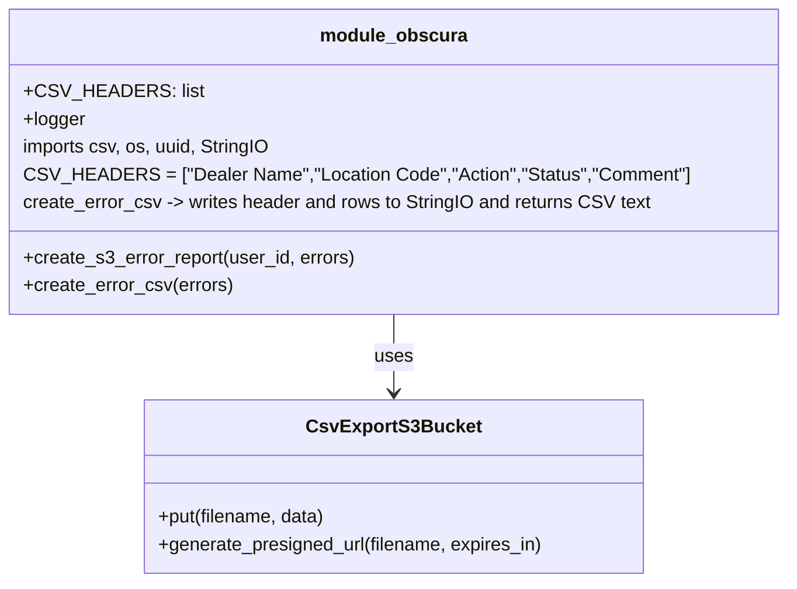

# Diagram: partview_core/partview_service/partview_service/api/partview_dealer_onboard_upload/manage_s3.py


> Auto-generated by Obscura crawlers

## Diagram 1

```mermaid
flowchart TD
    Start([Start]) --> CreateReport[create_s3_error_report(user_id, errors)]
    CreateReport --> BuildCSV[create_error_csv(errors)]
    BuildCSV --> LogCSV["logger.info(\"CSV DATA ...\")"]
    CreateReport --> S3Prepare["s3_uuid = uuid.uuid1()\\ns3_key, s3_filename"]
    S3Prepare --> InstantiateBucket[CsvExportS3Bucket()]
    InstantiateBucket --> Put["bucket.put(s3_filename, csv_data)"]
    Put --> Presign["bucket.generate_presigned_url(s3_filename, expires_in=3600)"]
    Presign --> LogURL["logger.info(\"PRESIGNED URL ...\")"]
    LogURL --> Return["return presigned_url"]
    Return --> End([End])
```

> SVG rendering failed for this diagram.

## Diagram 2



### SVG

<svg id="container" width="648.40625" xmlns="http://www.w3.org/2000/svg" class="classDiagram" height="504" viewBox="0 0 648.40625 504" role="graphics-document document" aria-roledescription="class"><style>#container{font-family:"trebuchet ms",verdana,arial,sans-serif;font-size:16px;fill:#333;}@keyframes edge-animation-frame{from{stroke-dashoffset:0;}}@keyframes dash{to{stroke-dashoffset:0;}}#container .edge-animation-slow{stroke-dasharray:9,5!important;stroke-dashoffset:900;animation:dash 50s linear infinite;stroke-linecap:round;}#container .edge-animation-fast{stroke-dasharray:9,5!important;stroke-dashoffset:900;animation:dash 20s linear infinite;stroke-linecap:round;}#container .error-icon{fill:#552222;}#container .error-text{fill:#552222;stroke:#552222;}#container .edge-thickness-normal{stroke-width:1px;}#container .edge-thickness-thick{stroke-width:3.5px;}#container .edge-pattern-solid{stroke-dasharray:0;}#container .edge-thickness-invisible{stroke-width:0;fill:none;}#container .edge-pattern-dashed{stroke-dasharray:3;}#container .edge-pattern-dotted{stroke-dasharray:2;}#container .marker{fill:#333333;stroke:#333333;}#container .marker.cross{stroke:#333333;}#container svg{font-family:"trebuchet ms",verdana,arial,sans-serif;font-size:16px;}#container p{margin:0;}#container g.classGroup text{fill:#9370DB;stroke:none;font-family:"trebuchet ms",verdana,arial,sans-serif;font-size:10px;}#container g.classGroup text .title{font-weight:bolder;}#container .nodeLabel,#container .edgeLabel{color:#131300;}#container .edgeLabel .label rect{fill:#ECECFF;}#container .label text{fill:#131300;}#container .labelBkg{background:#ECECFF;}#container .edgeLabel .label span{background:#ECECFF;}#container .classTitle{font-weight:bolder;}#container .node rect,#container .node circle,#container .node ellipse,#container .node polygon,#container .node path{fill:#ECECFF;stroke:#9370DB;stroke-width:1px;}#container .divider{stroke:#9370DB;stroke-width:1;}#container g.clickable{cursor:pointer;}#container g.classGroup rect{fill:#ECECFF;stroke:#9370DB;}#container g.classGroup line{stroke:#9370DB;stroke-width:1;}#container .classLabel .box{stroke:none;stroke-width:0;fill:#ECECFF;opacity:0.5;}#container .classLabel .label{fill:#9370DB;font-size:10px;}#container .relation{stroke:#333333;stroke-width:1;fill:none;}#container .dashed-line{stroke-dasharray:3;}#container .dotted-line{stroke-dasharray:1 2;}#container #compositionStart,#container .composition{fill:#333333!important;stroke:#333333!important;stroke-width:1;}#container #compositionEnd,#container .composition{fill:#333333!important;stroke:#333333!important;stroke-width:1;}#container #dependencyStart,#container .dependency{fill:#333333!important;stroke:#333333!important;stroke-width:1;}#container #dependencyStart,#container .dependency{fill:#333333!important;stroke:#333333!important;stroke-width:1;}#container #extensionStart,#container .extension{fill:transparent!important;stroke:#333333!important;stroke-width:1;}#container #extensionEnd,#container .extension{fill:transparent!important;stroke:#333333!important;stroke-width:1;}#container #aggregationStart,#container .aggregation{fill:transparent!important;stroke:#333333!important;stroke-width:1;}#container #aggregationEnd,#container .aggregation{fill:transparent!important;stroke:#333333!important;stroke-width:1;}#container #lollipopStart,#container .lollipop{fill:#ECECFF!important;stroke:#333333!important;stroke-width:1;}#container #lollipopEnd,#container .lollipop{fill:#ECECFF!important;stroke:#333333!important;stroke-width:1;}#container .edgeTerminals{font-size:11px;line-height:initial;}#container .classTitleText{text-anchor:middle;font-size:18px;fill:#333;}#container .label-icon{display:inline-block;height:1em;overflow:visible;vertical-align:-0.125em;}#container .node .label-icon path{fill:currentColor;stroke:revert;stroke-width:revert;}#container :root{--mermaid-font-family:"trebuchet ms",verdana,arial,sans-serif;}</style><g><defs><marker id="container_class-aggregationStart" class="marker aggregation class" refX="18" refY="7" markerWidth="190" markerHeight="240" orient="auto"><path d="M 18,7 L9,13 L1,7 L9,1 Z"></path></marker></defs><defs><marker id="container_class-aggregationEnd" class="marker aggregation class" refX="1" refY="7" markerWidth="20" markerHeight="28" orient="auto"><path d="M 18,7 L9,13 L1,7 L9,1 Z"></path></marker></defs><defs><marker id="container_class-extensionStart" class="marker extension class" refX="18" refY="7" markerWidth="190" markerHeight="240" orient="auto"><path d="M 1,7 L18,13 V 1 Z"></path></marker></defs><defs><marker id="container_class-extensionEnd" class="marker extension class" refX="1" refY="7" markerWidth="20" markerHeight="28" orient="auto"><path d="M 1,1 V 13 L18,7 Z"></path></marker></defs><defs><marker id="container_class-compositionStart" class="marker composition class" refX="18" refY="7" markerWidth="190" markerHeight="240" orient="auto"><path d="M 18,7 L9,13 L1,7 L9,1 Z"></path></marker></defs><defs><marker id="container_class-compositionEnd" class="marker composition class" refX="1" refY="7" markerWidth="20" markerHeight="28" orient="auto"><path d="M 18,7 L9,13 L1,7 L9,1 Z"></path></marker></defs><defs><marker id="container_class-dependencyStart" class="marker dependency class" refX="6" refY="7" markerWidth="190" markerHeight="240" orient="auto"><path d="M 5,7 L9,13 L1,7 L9,1 Z"></path></marker></defs><defs><marker id="container_class-dependencyEnd" class="marker dependency class" refX="13" refY="7" markerWidth="20" markerHeight="28" orient="auto"><path d="M 18,7 L9,13 L14,7 L9,1 Z"></path></marker></defs><defs><marker id="container_class-lollipopStart" class="marker lollipop class" refX="13" refY="7" markerWidth="190" markerHeight="240" orient="auto"><circle stroke="black" fill="transparent" cx="7" cy="7" r="6"></circle></marker></defs><defs><marker id="container_class-lollipopEnd" class="marker lollipop class" refX="1" refY="7" markerWidth="190" markerHeight="240" orient="auto"><circle stroke="black" fill="transparent" cx="7" cy="7" r="6"></circle></marker></defs><g class="root"><g class="clusters"></g><g class="edgePaths"><path d="M324.203,272L324.203,278.167C324.203,284.333,324.203,296.667,324.203,308C324.203,319.333,324.203,329.667,324.203,334.833L324.203,340" id="id_module_obscura_CsvExportS3Bucket_1" class="edge-thickness-normal edge-pattern-solid relation" style=";;;" data-edge="true" data-et="edge" data-id="id_module_obscura_CsvExportS3Bucket_1" data-points="W3sieCI6MzI0LjIwMzEyNSwieSI6MjcyfSx7IngiOjMyNC4yMDMxMjUsInkiOjMwOX0seyJ4IjozMjQuMjAzMTI1LCJ5IjozNDZ9XQ==" marker-end="url(#container_class-dependencyEnd)"></path></g><g class="edgeLabels"><g class="edgeLabel" transform="translate(324.203125, 309)"><g class="label" data-id="id_module_obscura_CsvExportS3Bucket_1" transform="translate(-16.4921875, -12)"><foreignObject width="32.984375" height="24"><div xmlns="http://www.w3.org/1999/xhtml" class="labelBkg" style="display: table-cell; white-space: nowrap; line-height: 1.5; max-width: 200px; text-align: center;"><span class="edgeLabel"><p>uses</p></span></div></foreignObject></g></g></g><g class="nodes"><g class="node default" id="classId-module_obscura-0" transform="translate(324.203125, 140)"><g class="basic label-container"><path d="M-316.203125 -132 L316.203125 -132 L316.203125 132 L-316.203125 132" stroke="none" stroke-width="0" fill="#ECECFF" style=""></path><path d="M-316.203125 -132 C-161.7222029123714 -132, -7.241280824742773 -132, 316.203125 -132 M-316.203125 -132 C-108.65679886231129 -132, 98.88952727537742 -132, 316.203125 -132 M316.203125 -132 C316.203125 -65.8338111886846, 316.203125 0.3323776226307871, 316.203125 132 M316.203125 -132 C316.203125 -69.00230002138633, 316.203125 -6.004600042772665, 316.203125 132 M316.203125 132 C110.43285009251437 132, -95.33742481497126 132, -316.203125 132 M316.203125 132 C175.51565878440056 132, 34.828192568801114 132, -316.203125 132 M-316.203125 132 C-316.203125 65.41416972559455, -316.203125 -1.1716605488109053, -316.203125 -132 M-316.203125 132 C-316.203125 32.103765409844115, -316.203125 -67.79246918031177, -316.203125 -132" stroke="#9370DB" stroke-width="1.3" fill="none" stroke-dasharray="0 0" style=""></path></g><g class="annotation-group text" transform="translate(0, -108)"></g><g class="label-group text" transform="translate(-60.359375, -108)"><g class="label" style="font-weight: bolder" transform="translate(0,-12)"><foreignObject width="120.71875" height="24"><div xmlns="http://www.w3.org/1999/xhtml" style="display: table-cell; white-space: nowrap; line-height: 1.5; max-width: 170px; text-align: center;"><span class="nodeLabel markdown-node-label" style=""><p>module_obscura</p></span></div></foreignObject></g></g><g class="members-group text" transform="translate(-304.203125, -60)"><g class="label" style="" transform="translate(0,-12)"><foreignObject width="137.890625" height="24"><div xmlns="http://www.w3.org/1999/xhtml" style="display: table-cell; white-space: nowrap; line-height: 1.5; max-width: 195px; text-align: center;"><span class="nodeLabel markdown-node-label" style=""><p>+CSV_HEADERS: list</p></span></div></foreignObject></g><g class="label" style="" transform="translate(0,12)"><foreignObject width="53.21875" height="24"><div xmlns="http://www.w3.org/1999/xhtml" style="display: table-cell; white-space: nowrap; line-height: 1.5; max-width: 111px; text-align: center;"><span class="nodeLabel markdown-node-label" style=""><p>+logger</p></span></div></foreignObject></g><g class="label" style="" transform="translate(0,36)"><foreignObject width="215.25" height="24"><div xmlns="http://www.w3.org/1999/xhtml" style="display: table-cell; white-space: nowrap; line-height: 1.5; max-width: 265px; text-align: center;"><span class="nodeLabel markdown-node-label" style=""><p>imports csv, os, uuid, StringIO</p></span></div></foreignObject></g><g class="label" style="" transform="translate(0,60)"><foreignObject width="548.046875" height="24"><div xmlns="http://www.w3.org/1999/xhtml" style="display: table-cell; white-space: nowrap; line-height: 1.5; max-width: 598px; text-align: center;"><span class="nodeLabel markdown-node-label" style=""><p>CSV_HEADERS = ["Dealer Name","Location Code","Action","Status","Comment"]</p></span></div></foreignObject></g><g class="label" style="" transform="translate(0,84)"><foreignObject width="543.28125" height="24"><div xmlns="http://www.w3.org/1999/xhtml" style="display: table-cell; white-space: nowrap; line-height: 1.5; max-width: 615px; text-align: center;"><span class="nodeLabel markdown-node-label" style=""><p>create_error_csv -&gt; writes header and rows to StringIO and returns CSV text</p></span></div></foreignObject></g></g><g class="methods-group text" transform="translate(-304.203125, 84)"><g class="label" style="" transform="translate(0,-12)"><foreignObject width="286.953125" height="24"><div xmlns="http://www.w3.org/1999/xhtml" style="display: table-cell; white-space: nowrap; line-height: 1.5; max-width: 344px; text-align: center;"><span class="nodeLabel markdown-node-label" style=""><p>+create_s3_error_report(user_id, errors)</p></span></div></foreignObject></g><g class="label" style="" transform="translate(0,12)"><foreignObject width="179.796875" height="24"><div xmlns="http://www.w3.org/1999/xhtml" style="display: table-cell; white-space: nowrap; line-height: 1.5; max-width: 237px; text-align: center;"><span class="nodeLabel markdown-node-label" style=""><p>+create_error_csv(errors)</p></span></div></foreignObject></g></g><g class="divider" style=""><path d="M-316.203125 -84 C-133.22394817189362 -84, 49.75522865621275 -84, 316.203125 -84 M-316.203125 -84 C-157.78387524336404 -84, 0.6353745132719268 -84, 316.203125 -84" stroke="#9370DB" stroke-width="1.3" fill="none" stroke-dasharray="0 0" style=""></path></g><g class="divider" style=""><path d="M-316.203125 60 C-68.37237609678846 60, 179.45837280642309 60, 316.203125 60 M-316.203125 60 C-167.16640103054362 60, -18.12967706108725 60, 316.203125 60" stroke="#9370DB" stroke-width="1.3" fill="none" stroke-dasharray="0 0" style=""></path></g></g><g class="node default" id="classId-CsvExportS3Bucket-1" transform="translate(324.203125, 421)"><g class="basic label-container"><path d="M-214.6328125 -75 L214.6328125 -75 L214.6328125 75 L-214.6328125 75" stroke="none" stroke-width="0" fill="#ECECFF" style=""></path><path d="M-214.6328125 -75 C-46.45913539182908 -75, 121.71454171634184 -75, 214.6328125 -75 M-214.6328125 -75 C-79.690387109857 -75, 55.252038280286 -75, 214.6328125 -75 M214.6328125 -75 C214.6328125 -23.105558139484764, 214.6328125 28.788883721030473, 214.6328125 75 M214.6328125 -75 C214.6328125 -42.10819495204562, 214.6328125 -9.216389904091244, 214.6328125 75 M214.6328125 75 C105.59622984165377 75, -3.4403528166924673 75, -214.6328125 75 M214.6328125 75 C79.38737807142257 75, -55.85805635715485 75, -214.6328125 75 M-214.6328125 75 C-214.6328125 27.625307719044002, -214.6328125 -19.749384561911995, -214.6328125 -75 M-214.6328125 75 C-214.6328125 16.234465647467047, -214.6328125 -42.531068705065906, -214.6328125 -75" stroke="#9370DB" stroke-width="1.3" fill="none" stroke-dasharray="0 0" style=""></path></g><g class="annotation-group text" transform="translate(0, -51)"></g><g class="label-group text" transform="translate(-70.296875, -51)"><g class="label" style="font-weight: bolder" transform="translate(0,-12)"><foreignObject width="140.59375" height="24"><div xmlns="http://www.w3.org/1999/xhtml" style="display: table-cell; white-space: nowrap; line-height: 1.5; max-width: 187px; text-align: center;"><span class="nodeLabel markdown-node-label" style=""><p>CsvExportS3Bucket</p></span></div></foreignObject></g></g><g class="members-group text" transform="translate(-202.6328125, -3)"></g><g class="methods-group text" transform="translate(-202.6328125, 27)"><g class="label" style="" transform="translate(0,-12)"><foreignObject width="146.546875" height="24"><div xmlns="http://www.w3.org/1999/xhtml" style="display: table-cell; white-space: nowrap; line-height: 1.5; max-width: 204px; text-align: center;"><span class="nodeLabel markdown-node-label" style=""><p>+put(filename, data)</p></span></div></foreignObject></g><g class="label" style="" transform="translate(0,12)"><foreignObject width="334.96875" height="24"><div xmlns="http://www.w3.org/1999/xhtml" style="display: table-cell; white-space: nowrap; line-height: 1.5; max-width: 392px; text-align: center;"><span class="nodeLabel markdown-node-label" style=""><p>+generate_presigned_url(filename, expires_in)</p></span></div></foreignObject></g></g><g class="divider" style=""><path d="M-214.6328125 -27 C-111.76824827131857 -27, -8.903684042637138 -27, 214.6328125 -27 M-214.6328125 -27 C-79.56499893806105 -27, 55.502814623877896 -27, 214.6328125 -27" stroke="#9370DB" stroke-width="1.3" fill="none" stroke-dasharray="0 0" style=""></path></g><g class="divider" style=""><path d="M-214.6328125 -3 C-76.2373968851175 -3, 62.15801872976499 -3, 214.6328125 -3 M-214.6328125 -3 C-48.71615149306513 -3, 117.20050951386975 -3, 214.6328125 -3" stroke="#9370DB" stroke-width="1.3" fill="none" stroke-dasharray="0 0" style=""></path></g></g></g></g></g></svg>
