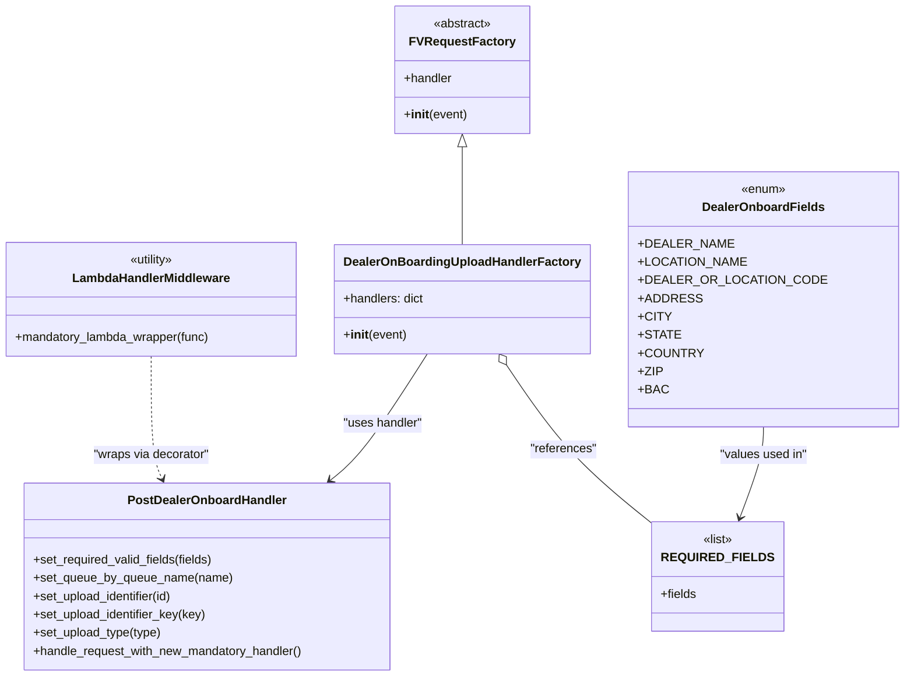

# Diagram: partview_core/partview_service/partview_service/api/partview_dealer_onboard_upload/partview_dealer_onboard_upload_handler.py


> Auto-generated by Obscura crawlers

## Diagram 1



### SVG

<svg id="container" width="1138.078125" xmlns="http://www.w3.org/2000/svg" class="classDiagram" height="890" viewBox="0 0 1138.078125 890" role="graphics-document document" aria-roledescription="class"><style>#container{font-family:"trebuchet ms",verdana,arial,sans-serif;font-size:16px;fill:#333;}@keyframes edge-animation-frame{from{stroke-dashoffset:0;}}@keyframes dash{to{stroke-dashoffset:0;}}#container .edge-animation-slow{stroke-dasharray:9,5!important;stroke-dashoffset:900;animation:dash 50s linear infinite;stroke-linecap:round;}#container .edge-animation-fast{stroke-dasharray:9,5!important;stroke-dashoffset:900;animation:dash 20s linear infinite;stroke-linecap:round;}#container .error-icon{fill:#552222;}#container .error-text{fill:#552222;stroke:#552222;}#container .edge-thickness-normal{stroke-width:1px;}#container .edge-thickness-thick{stroke-width:3.5px;}#container .edge-pattern-solid{stroke-dasharray:0;}#container .edge-thickness-invisible{stroke-width:0;fill:none;}#container .edge-pattern-dashed{stroke-dasharray:3;}#container .edge-pattern-dotted{stroke-dasharray:2;}#container .marker{fill:#333333;stroke:#333333;}#container .marker.cross{stroke:#333333;}#container svg{font-family:"trebuchet ms",verdana,arial,sans-serif;font-size:16px;}#container p{margin:0;}#container g.classGroup text{fill:#9370DB;stroke:none;font-family:"trebuchet ms",verdana,arial,sans-serif;font-size:10px;}#container g.classGroup text .title{font-weight:bolder;}#container .nodeLabel,#container .edgeLabel{color:#131300;}#container .edgeLabel .label rect{fill:#ECECFF;}#container .label text{fill:#131300;}#container .labelBkg{background:#ECECFF;}#container .edgeLabel .label span{background:#ECECFF;}#container .classTitle{font-weight:bolder;}#container .node rect,#container .node circle,#container .node ellipse,#container .node polygon,#container .node path{fill:#ECECFF;stroke:#9370DB;stroke-width:1px;}#container .divider{stroke:#9370DB;stroke-width:1;}#container g.clickable{cursor:pointer;}#container g.classGroup rect{fill:#ECECFF;stroke:#9370DB;}#container g.classGroup line{stroke:#9370DB;stroke-width:1;}#container .classLabel .box{stroke:none;stroke-width:0;fill:#ECECFF;opacity:0.5;}#container .classLabel .label{fill:#9370DB;font-size:10px;}#container .relation{stroke:#333333;stroke-width:1;fill:none;}#container .dashed-line{stroke-dasharray:3;}#container .dotted-line{stroke-dasharray:1 2;}#container #compositionStart,#container .composition{fill:#333333!important;stroke:#333333!important;stroke-width:1;}#container #compositionEnd,#container .composition{fill:#333333!important;stroke:#333333!important;stroke-width:1;}#container #dependencyStart,#container .dependency{fill:#333333!important;stroke:#333333!important;stroke-width:1;}#container #dependencyStart,#container .dependency{fill:#333333!important;stroke:#333333!important;stroke-width:1;}#container #extensionStart,#container .extension{fill:transparent!important;stroke:#333333!important;stroke-width:1;}#container #extensionEnd,#container .extension{fill:transparent!important;stroke:#333333!important;stroke-width:1;}#container #aggregationStart,#container .aggregation{fill:transparent!important;stroke:#333333!important;stroke-width:1;}#container #aggregationEnd,#container .aggregation{fill:transparent!important;stroke:#333333!important;stroke-width:1;}#container #lollipopStart,#container .lollipop{fill:#ECECFF!important;stroke:#333333!important;stroke-width:1;}#container #lollipopEnd,#container .lollipop{fill:#ECECFF!important;stroke:#333333!important;stroke-width:1;}#container .edgeTerminals{font-size:11px;line-height:initial;}#container .classTitleText{text-anchor:middle;font-size:18px;fill:#333;}#container .label-icon{display:inline-block;height:1em;overflow:visible;vertical-align:-0.125em;}#container .node .label-icon path{fill:currentColor;stroke:revert;stroke-width:revert;}#container :root{--mermaid-font-family:"trebuchet ms",verdana,arial,sans-serif;}</style><g><defs><marker id="container_class-aggregationStart" class="marker aggregation class" refX="18" refY="7" markerWidth="190" markerHeight="240" orient="auto"><path d="M 18,7 L9,13 L1,7 L9,1 Z"></path></marker></defs><defs><marker id="container_class-aggregationEnd" class="marker aggregation class" refX="1" refY="7" markerWidth="20" markerHeight="28" orient="auto"><path d="M 18,7 L9,13 L1,7 L9,1 Z"></path></marker></defs><defs><marker id="container_class-extensionStart" class="marker extension class" refX="18" refY="7" markerWidth="190" markerHeight="240" orient="auto"><path d="M 1,7 L18,13 V 1 Z"></path></marker></defs><defs><marker id="container_class-extensionEnd" class="marker extension class" refX="1" refY="7" markerWidth="20" markerHeight="28" orient="auto"><path d="M 1,1 V 13 L18,7 Z"></path></marker></defs><defs><marker id="container_class-compositionStart" class="marker composition class" refX="18" refY="7" markerWidth="190" markerHeight="240" orient="auto"><path d="M 18,7 L9,13 L1,7 L9,1 Z"></path></marker></defs><defs><marker id="container_class-compositionEnd" class="marker composition class" refX="1" refY="7" markerWidth="20" markerHeight="28" orient="auto"><path d="M 18,7 L9,13 L1,7 L9,1 Z"></path></marker></defs><defs><marker id="container_class-dependencyStart" class="marker dependency class" refX="6" refY="7" markerWidth="190" markerHeight="240" orient="auto"><path d="M 5,7 L9,13 L1,7 L9,1 Z"></path></marker></defs><defs><marker id="container_class-dependencyEnd" class="marker dependency class" refX="13" refY="7" markerWidth="20" markerHeight="28" orient="auto"><path d="M 18,7 L9,13 L14,7 L9,1 Z"></path></marker></defs><defs><marker id="container_class-lollipopStart" class="marker lollipop class" refX="13" refY="7" markerWidth="190" markerHeight="240" orient="auto"><circle stroke="black" fill="transparent" cx="7" cy="7" r="6"></circle></marker></defs><defs><marker id="container_class-lollipopEnd" class="marker lollipop class" refX="1" refY="7" markerWidth="190" markerHeight="240" orient="auto"><circle stroke="black" fill="transparent" cx="7" cy="7" r="6"></circle></marker></defs><g class="root"><g class="clusters"></g><g class="edgePaths"><path d="M602.688,193.25L602.688,194.542C602.688,195.833,602.688,198.417,602.688,219.875C602.688,241.333,602.688,281.667,602.688,301.833L602.688,322" id="id_FVRequestFactory_DealerOnBoardingUploadHandlerFactory_1" class="edge-thickness-normal edge-pattern-solid relation" style=";;;" data-edge="true" data-et="edge" data-id="id_FVRequestFactory_DealerOnBoardingUploadHandlerFactory_1" data-points="W3sieCI6NjAyLjY4NzUsInkiOjE3Nn0seyJ4Ijo2MDIuNjg3NSwieSI6MjAxfSx7IngiOjYwMi42ODc1LCJ5IjozMjJ9XQ==" marker-start="url(#container_class-extensionStart)"></path><path d="M558.496,466L544.89,488.167C531.285,510.333,504.074,554.667,483.491,582.378C462.909,610.089,448.954,621.178,441.976,626.723L434.999,632.267" id="id_DealerOnBoardingUploadHandlerFactory_PostDealerOnboardHandler_2" class="edge-thickness-normal edge-pattern-solid relation" style=";;;" data-edge="true" data-et="edge" data-id="id_DealerOnBoardingUploadHandlerFactory_PostDealerOnboardHandler_2" data-points="W3sieCI6NTU4LjQ5NTU3OTI2ODI5MjcsInkiOjQ2Nn0seyJ4Ijo0NzYuODYzMjgxMjUsInkiOjU5OX0seyJ4Ijo0MzAuMzAxNjM1NzQyMTg3NSwieSI6NjM2fV0=" marker-end="url(#container_class-dependencyEnd)"></path><path d="M199.992,469L199.992,490.667C199.992,512.333,199.992,555.667,202.476,582.596C204.96,609.525,209.928,620.049,212.412,625.312L214.896,630.574" id="id_LambdaHandlerMiddleware_PostDealerOnboardHandler_3" class="edge-thickness-normal edge-pattern-dashed relation" style=";;;" data-edge="true" data-et="edge" data-id="id_LambdaHandlerMiddleware_PostDealerOnboardHandler_3" data-points="W3sieCI6MTk5Ljk5MjE4NzUsInkiOjQ2OX0seyJ4IjoxOTkuOTkyMTg3NSwieSI6NTk5fSx7IngiOjIxNy40NTY5ODI0MjE4NzUsInkiOjYzNn1d" marker-end="url(#container_class-dependencyEnd)"></path><path d="M971.734,562L971.734,568.167C971.734,574.333,971.734,586.667,966.486,606.566C961.238,626.465,950.741,653.93,945.493,667.663L940.245,681.395" id="id_DealerOnboardFields_REQUIRED_FIELDS_4" class="edge-thickness-normal edge-pattern-solid relation" style=";;;" data-edge="true" data-et="edge" data-id="id_DealerOnboardFields_REQUIRED_FIELDS_4" data-points="W3sieCI6OTcxLjczNDM3NSwieSI6NTYyfSx7IngiOjk3MS43MzQzNzUsInkiOjU5OX0seyJ4Ijo5MzguMTAyNzM0Mzc1LCJ5Ijo2ODd9XQ==" marker-end="url(#container_class-dependencyEnd)"></path><path d="M654.914,480.78L666.772,500.483C678.63,520.187,702.346,559.593,732.186,594.889C762.026,630.184,797.99,661.368,815.971,676.96L833.953,692.552" id="id_DealerOnBoardingUploadHandlerFactory_REQUIRED_FIELDS_5" class="edge-thickness-normal edge-pattern-solid relation" style=";;;" data-edge="true" data-et="edge" data-id="id_DealerOnBoardingUploadHandlerFactory_REQUIRED_FIELDS_5" data-points="W3sieCI6NjQ2LjAxOTIwNzMxNzA3MzIsInkiOjQ2Nn0seyJ4Ijo3MjYuMDYyNSwieSI6NTk5fSx7IngiOjgzMy45NTMxMjUsInkiOjY5Mi41NTE4MDE1MTU3Mjg4fV0=" marker-start="url(#container_class-aggregationStart)"></path></g><g class="edgeLabels"><g class="edgeLabel"><g class="label" data-id="id_FVRequestFactory_DealerOnBoardingUploadHandlerFactory_1" transform="translate(0, 0)"><foreignObject width="0" height="0"><div xmlns="http://www.w3.org/1999/xhtml" class="labelBkg" style="display: table-cell; white-space: nowrap; line-height: 1.5; max-width: 200px; text-align: center;"><span class="edgeLabel"></span></div></foreignObject></g></g><g class="edgeLabel" transform="translate(502.12429, 557.84333)"><g class="label" data-id="id_DealerOnBoardingUploadHandlerFactory_PostDealerOnboardHandler_2" transform="translate(-53.2890625, -12)"><foreignObject width="106.578125" height="24"><div xmlns="http://www.w3.org/1999/xhtml" class="labelBkg" style="display: table-cell; white-space: nowrap; line-height: 1.5; max-width: 200px; text-align: center;"><span class="edgeLabel"><p>"uses handler"</p></span></div></foreignObject></g></g><g class="edgeLabel" transform="translate(199.9921875, 599)"><g class="label" data-id="id_LambdaHandlerMiddleware_PostDealerOnboardHandler_3" transform="translate(-77.7578125, -12)"><foreignObject width="155.515625" height="24"><div xmlns="http://www.w3.org/1999/xhtml" class="labelBkg" style="display: table-cell; white-space: nowrap; line-height: 1.5; max-width: 200px; text-align: center;"><span class="edgeLabel"><p>"wraps via decorator"</p></span></div></foreignObject></g></g><g class="edgeLabel" transform="translate(971.734375, 599)"><g class="label" data-id="id_DealerOnboardFields_REQUIRED_FIELDS_4" transform="translate(-58.203125, -12)"><foreignObject width="116.40625" height="24"><div xmlns="http://www.w3.org/1999/xhtml" class="labelBkg" style="display: table-cell; white-space: nowrap; line-height: 1.5; max-width: 200px; text-align: center;"><span class="edgeLabel"><p>"values used in"</p></span></div></foreignObject></g></g><g class="edgeLabel" transform="translate(722.85854, 593.6763)"><g class="label" data-id="id_DealerOnBoardingUploadHandlerFactory_REQUIRED_FIELDS_5" transform="translate(-44.09375, -12)"><foreignObject width="88.1875" height="24"><div xmlns="http://www.w3.org/1999/xhtml" class="labelBkg" style="display: table-cell; white-space: nowrap; line-height: 1.5; max-width: 200px; text-align: center;"><span class="edgeLabel"><p>"references"</p></span></div></foreignObject></g></g></g><g class="nodes"><g class="node default" id="classId-FVRequestFactory-0" transform="translate(602.6875, 92)"><g class="basic label-container"><path d="M-86.08984375 -84 L86.08984375 -84 L86.08984375 84 L-86.08984375 84" stroke="none" stroke-width="0" fill="#ECECFF" style=""></path><path d="M-86.08984375 -84 C-40.60064741610534 -84, 4.888548917789322 -84, 86.08984375 -84 M-86.08984375 -84 C-51.1284927404461 -84, -16.167141730892197 -84, 86.08984375 -84 M86.08984375 -84 C86.08984375 -24.341340469253865, 86.08984375 35.31731906149227, 86.08984375 84 M86.08984375 -84 C86.08984375 -24.771256741676126, 86.08984375 34.45748651664775, 86.08984375 84 M86.08984375 84 C27.241598611419803 84, -31.606646527160393 84, -86.08984375 84 M86.08984375 84 C29.23949147836531 84, -27.61086079326938 84, -86.08984375 84 M-86.08984375 84 C-86.08984375 31.806091379096365, -86.08984375 -20.38781724180727, -86.08984375 -84 M-86.08984375 84 C-86.08984375 43.38034379657349, -86.08984375 2.760687593146983, -86.08984375 -84" stroke="#9370DB" stroke-width="1.3" fill="none" stroke-dasharray="0 0" style=""></path></g><g class="annotation-group text" transform="translate(-38.609375, -60)"><g class="label" style="" transform="translate(0,-12)"><foreignObject width="77.21875" height="24"><div xmlns="http://www.w3.org/1999/xhtml" style="display: table-cell; white-space: nowrap; line-height: 1.5; max-width: 127px; text-align: center;"><span class="nodeLabel markdown-node-label" style=""><p>«abstract»</p></span></div></foreignObject></g></g><g class="label-group text" transform="translate(-65.0390625, -36)"><g class="label" style="font-weight: bolder" transform="translate(0,-12)"><foreignObject width="130.078125" height="24"><div xmlns="http://www.w3.org/1999/xhtml" style="display: table-cell; white-space: nowrap; line-height: 1.5; max-width: 178px; text-align: center;"><span class="nodeLabel markdown-node-label" style=""><p>FVRequestFactory</p></span></div></foreignObject></g></g><g class="members-group text" transform="translate(-74.08984375, 12)"><g class="label" style="" transform="translate(0,-12)"><foreignObject width="64.515625" height="24"><div xmlns="http://www.w3.org/1999/xhtml" style="display: table-cell; white-space: nowrap; line-height: 1.5; max-width: 123px; text-align: center;"><span class="nodeLabel markdown-node-label" style=""><p>+handler</p></span></div></foreignObject></g></g><g class="methods-group text" transform="translate(-74.08984375, 60)"><g class="label" style="" transform="translate(0,-12)"><foreignObject width="83.140625" height="24"><div xmlns="http://www.w3.org/1999/xhtml" style="display: table-cell; white-space: nowrap; line-height: 1.5; max-width: 172px; text-align: center;"><span class="nodeLabel markdown-node-label" style=""><p>+<strong>init</strong>(event)</p></span></div></foreignObject></g></g><g class="divider" style=""><path d="M-86.08984375 -12 C-51.60129233982448 -12, -17.112740929648965 -12, 86.08984375 -12 M-86.08984375 -12 C-24.365580750894672 -12, 37.358682248210656 -12, 86.08984375 -12" stroke="#9370DB" stroke-width="1.3" fill="none" stroke-dasharray="0 0" style=""></path></g><g class="divider" style=""><path d="M-86.08984375 36 C-23.632041746153725 36, 38.82576025769255 36, 86.08984375 36 M-86.08984375 36 C-33.64491310695048 36, 18.800017536099034 36, 86.08984375 36" stroke="#9370DB" stroke-width="1.3" fill="none" stroke-dasharray="0 0" style=""></path></g></g><g class="node default" id="classId-DealerOnBoardingUploadHandlerFactory-1" transform="translate(602.6875, 394)"><g class="basic label-container"><path d="M-160.703125 -72 L160.703125 -72 L160.703125 72 L-160.703125 72" stroke="none" stroke-width="0" fill="#ECECFF" style=""></path><path d="M-160.703125 -72 C-78.70029212935896 -72, 3.302540741282087 -72, 160.703125 -72 M-160.703125 -72 C-59.331712058724534 -72, 42.03970088255093 -72, 160.703125 -72 M160.703125 -72 C160.703125 -38.56724776513507, 160.703125 -5.134495530270144, 160.703125 72 M160.703125 -72 C160.703125 -35.32692380204243, 160.703125 1.3461523959151407, 160.703125 72 M160.703125 72 C63.67398616020877 72, -33.35515267958246 72, -160.703125 72 M160.703125 72 C71.91178346735987 72, -16.879558065280264 72, -160.703125 72 M-160.703125 72 C-160.703125 39.59604007582406, -160.703125 7.192080151648113, -160.703125 -72 M-160.703125 72 C-160.703125 32.782879698169715, -160.703125 -6.4342406036605695, -160.703125 -72" stroke="#9370DB" stroke-width="1.3" fill="none" stroke-dasharray="0 0" style=""></path></g><g class="annotation-group text" transform="translate(0, -48)"></g><g class="label-group text" transform="translate(-148.703125, -48)"><g class="label" style="font-weight: bolder" transform="translate(0,-12)"><foreignObject width="297.40625" height="24"><div xmlns="http://www.w3.org/1999/xhtml" style="display: table-cell; white-space: nowrap; line-height: 1.5; max-width: 345px; text-align: center;"><span class="nodeLabel markdown-node-label" style=""><p>DealerOnBoardingUploadHandlerFactory</p></span></div></foreignObject></g></g><g class="members-group text" transform="translate(-148.703125, 0)"><g class="label" style="" transform="translate(0,-12)"><foreignObject width="107.34375" height="24"><div xmlns="http://www.w3.org/1999/xhtml" style="display: table-cell; white-space: nowrap; line-height: 1.5; max-width: 165px; text-align: center;"><span class="nodeLabel markdown-node-label" style=""><p>+handlers: dict</p></span></div></foreignObject></g></g><g class="methods-group text" transform="translate(-148.703125, 48)"><g class="label" style="" transform="translate(0,-12)"><foreignObject width="83.140625" height="24"><div xmlns="http://www.w3.org/1999/xhtml" style="display: table-cell; white-space: nowrap; line-height: 1.5; max-width: 172px; text-align: center;"><span class="nodeLabel markdown-node-label" style=""><p>+<strong>init</strong>(event)</p></span></div></foreignObject></g></g><g class="divider" style=""><path d="M-160.703125 -24 C-65.00395694372082 -24, 30.695211112558354 -24, 160.703125 -24 M-160.703125 -24 C-76.08118324794074 -24, 8.540758504118514 -24, 160.703125 -24" stroke="#9370DB" stroke-width="1.3" fill="none" stroke-dasharray="0 0" style=""></path></g><g class="divider" style=""><path d="M-160.703125 24 C-33.66916403882243 24, 93.36479692235514 24, 160.703125 24 M-160.703125 24 C-91.65948025167926 24, -22.61583550335851 24, 160.703125 24" stroke="#9370DB" stroke-width="1.3" fill="none" stroke-dasharray="0 0" style=""></path></g></g><g class="node default" id="classId-PostDealerOnboardHandler-2" transform="translate(275.515625, 759)"><g class="basic label-container"><path d="M-242.5546875 -123 L242.5546875 -123 L242.5546875 123 L-242.5546875 123" stroke="none" stroke-width="0" fill="#ECECFF" style=""></path><path d="M-242.5546875 -123 C-75.10853934664422 -123, 92.33760880671156 -123, 242.5546875 -123 M-242.5546875 -123 C-110.30736416749977 -123, 21.93995916500046 -123, 242.5546875 -123 M242.5546875 -123 C242.5546875 -61.34849930092392, 242.5546875 0.303001398152162, 242.5546875 123 M242.5546875 -123 C242.5546875 -69.26781735805726, 242.5546875 -15.535634716114515, 242.5546875 123 M242.5546875 123 C144.9391085937312 123, 47.32352968746241 123, -242.5546875 123 M242.5546875 123 C144.97471547022806 123, 47.394743440456125 123, -242.5546875 123 M-242.5546875 123 C-242.5546875 68.98272215187527, -242.5546875 14.96544430375053, -242.5546875 -123 M-242.5546875 123 C-242.5546875 56.097390859981004, -242.5546875 -10.805218280037991, -242.5546875 -123" stroke="#9370DB" stroke-width="1.3" fill="none" stroke-dasharray="0 0" style=""></path></g><g class="annotation-group text" transform="translate(0, -99)"></g><g class="label-group text" transform="translate(-100.75, -99)"><g class="label" style="font-weight: bolder" transform="translate(0,-12)"><foreignObject width="201.5" height="24"><div xmlns="http://www.w3.org/1999/xhtml" style="display: table-cell; white-space: nowrap; line-height: 1.5; max-width: 250px; text-align: center;"><span class="nodeLabel markdown-node-label" style=""><p>PostDealerOnboardHandler</p></span></div></foreignObject></g></g><g class="members-group text" transform="translate(-230.5546875, -51)"></g><g class="methods-group text" transform="translate(-230.5546875, -21)"><g class="label" style="" transform="translate(0,-12)"><foreignObject width="240.34375" height="24"><div xmlns="http://www.w3.org/1999/xhtml" style="display: table-cell; white-space: nowrap; line-height: 1.5; max-width: 298px; text-align: center;"><span class="nodeLabel markdown-node-label" style=""><p>+set_required_valid_fields(fields)</p></span></div></foreignObject></g><g class="label" style="" transform="translate(0,12)"><foreignObject width="261.453125" height="24"><div xmlns="http://www.w3.org/1999/xhtml" style="display: table-cell; white-space: nowrap; line-height: 1.5; max-width: 319px; text-align: center;"><span class="nodeLabel markdown-node-label" style=""><p>+set_queue_by_queue_name(name)</p></span></div></foreignObject></g><g class="label" style="" transform="translate(0,36)"><foreignObject width="188.171875" height="24"><div xmlns="http://www.w3.org/1999/xhtml" style="display: table-cell; white-space: nowrap; line-height: 1.5; max-width: 246px; text-align: center;"><span class="nodeLabel markdown-node-label" style=""><p>+set_upload_identifier(id)</p></span></div></foreignObject></g><g class="label" style="" transform="translate(0,60)"><foreignObject width="230.28125" height="24"><div xmlns="http://www.w3.org/1999/xhtml" style="display: table-cell; white-space: nowrap; line-height: 1.5; max-width: 288px; text-align: center;"><span class="nodeLabel markdown-node-label" style=""><p>+set_upload_identifier_key(key)</p></span></div></foreignObject></g><g class="label" style="" transform="translate(0,84)"><foreignObject width="170.796875" height="24"><div xmlns="http://www.w3.org/1999/xhtml" style="display: table-cell; white-space: nowrap; line-height: 1.5; max-width: 228px; text-align: center;"><span class="nodeLabel markdown-node-label" style=""><p>+set_upload_type(type)</p></span></div></foreignObject></g><g class="label" style="" transform="translate(0,108)"><foreignObject width="360.359375" height="24"><div xmlns="http://www.w3.org/1999/xhtml" style="display: table-cell; white-space: nowrap; line-height: 1.5; max-width: 418px; text-align: center;"><span class="nodeLabel markdown-node-label" style=""><p>+handle_request_with_new_mandatory_handler()</p></span></div></foreignObject></g></g><g class="divider" style=""><path d="M-242.5546875 -75 C-121.30421511489827 -75, -0.05374272979653938 -75, 242.5546875 -75 M-242.5546875 -75 C-90.97186269222615 -75, 60.61096211554769 -75, 242.5546875 -75" stroke="#9370DB" stroke-width="1.3" fill="none" stroke-dasharray="0 0" style=""></path></g><g class="divider" style=""><path d="M-242.5546875 -51 C-118.86492594396135 -51, 4.824835612077294 -51, 242.5546875 -51 M-242.5546875 -51 C-121.28311008588697 -51, -0.011532671773949232 -51, 242.5546875 -51" stroke="#9370DB" stroke-width="1.3" fill="none" stroke-dasharray="0 0" style=""></path></g></g><g class="node default" id="classId-LambdaHandlerMiddleware-3" transform="translate(199.9921875, 394)"><g class="basic label-container"><path d="M-191.9921875 -75 L191.9921875 -75 L191.9921875 75 L-191.9921875 75" stroke="none" stroke-width="0" fill="#ECECFF" style=""></path><path d="M-191.9921875 -75 C-44.43390666673429 -75, 103.12437416653142 -75, 191.9921875 -75 M-191.9921875 -75 C-72.60870980760869 -75, 46.77476788478262 -75, 191.9921875 -75 M191.9921875 -75 C191.9921875 -24.40679887876373, 191.9921875 26.18640224247254, 191.9921875 75 M191.9921875 -75 C191.9921875 -18.828565715713438, 191.9921875 37.342868568573124, 191.9921875 75 M191.9921875 75 C71.42529941182761 75, -49.14158867634478 75, -191.9921875 75 M191.9921875 75 C96.17246116709065 75, 0.35273483418129103 75, -191.9921875 75 M-191.9921875 75 C-191.9921875 43.01551831351587, -191.9921875 11.031036627031746, -191.9921875 -75 M-191.9921875 75 C-191.9921875 34.812643769993585, -191.9921875 -5.37471246001283, -191.9921875 -75" stroke="#9370DB" stroke-width="1.3" fill="none" stroke-dasharray="0 0" style=""></path></g><g class="annotation-group text" transform="translate(-30.3125, -51)"><g class="label" style="" transform="translate(0,-12)"><foreignObject width="60.625" height="24"><div xmlns="http://www.w3.org/1999/xhtml" style="display: table-cell; white-space: nowrap; line-height: 1.5; max-width: 111px; text-align: center;"><span class="nodeLabel markdown-node-label" style=""><p>«utility»</p></span></div></foreignObject></g></g><g class="label-group text" transform="translate(-100.765625, -27)"><g class="label" style="font-weight: bolder" transform="translate(0,-12)"><foreignObject width="201.53125" height="24"><div xmlns="http://www.w3.org/1999/xhtml" style="display: table-cell; white-space: nowrap; line-height: 1.5; max-width: 250px; text-align: center;"><span class="nodeLabel markdown-node-label" style=""><p>LambdaHandlerMiddleware</p></span></div></foreignObject></g></g><g class="members-group text" transform="translate(-179.9921875, 21)"></g><g class="methods-group text" transform="translate(-179.9921875, 51)"><g class="label" style="" transform="translate(0,-12)"><foreignObject width="259.21875" height="24"><div xmlns="http://www.w3.org/1999/xhtml" style="display: table-cell; white-space: nowrap; line-height: 1.5; max-width: 317px; text-align: center;"><span class="nodeLabel markdown-node-label" style=""><p>+mandatory_lambda_wrapper(func)</p></span></div></foreignObject></g></g><g class="divider" style=""><path d="M-191.9921875 -3 C-70.04220874462106 -3, 51.90777001075787 -3, 191.9921875 -3 M-191.9921875 -3 C-91.71587401606926 -3, 8.560439467861471 -3, 191.9921875 -3" stroke="#9370DB" stroke-width="1.3" fill="none" stroke-dasharray="0 0" style=""></path></g><g class="divider" style=""><path d="M-191.9921875 21 C-70.83834785536573 21, 50.31549178926855 21, 191.9921875 21 M-191.9921875 21 C-55.57323838483512 21, 80.84571073032976 21, 191.9921875 21" stroke="#9370DB" stroke-width="1.3" fill="none" stroke-dasharray="0 0" style=""></path></g></g><g class="node default" id="classId-DealerOnboardFields-4" transform="translate(971.734375, 394)"><g class="basic label-container"><path d="M-158.34375 -168 L158.34375 -168 L158.34375 168 L-158.34375 168" stroke="none" stroke-width="0" fill="#ECECFF" style=""></path><path d="M-158.34375 -168 C-76.75638772745666 -168, 4.83097454508669 -168, 158.34375 -168 M-158.34375 -168 C-62.38201289509931 -168, 33.579724209801384 -168, 158.34375 -168 M158.34375 -168 C158.34375 -49.77858160656139, 158.34375 68.44283678687722, 158.34375 168 M158.34375 -168 C158.34375 -68.40941858201083, 158.34375 31.18116283597834, 158.34375 168 M158.34375 168 C84.25987072848886 168, 10.175991456977727 168, -158.34375 168 M158.34375 168 C35.47425388755566 168, -87.39524222488868 168, -158.34375 168 M-158.34375 168 C-158.34375 54.759568434954645, -158.34375 -58.48086313009071, -158.34375 -168 M-158.34375 168 C-158.34375 34.83501110161336, -158.34375 -98.32997779677328, -158.34375 -168" stroke="#9370DB" stroke-width="1.3" fill="none" stroke-dasharray="0 0" style=""></path></g><g class="annotation-group text" transform="translate(-29.53125, -144)"><g class="label" style="" transform="translate(0,-12)"><foreignObject width="59.0625" height="24"><div xmlns="http://www.w3.org/1999/xhtml" style="display: table-cell; white-space: nowrap; line-height: 1.5; max-width: 109px; text-align: center;"><span class="nodeLabel markdown-node-label" style=""><p>«enum»</p></span></div></foreignObject></g></g><g class="label-group text" transform="translate(-76.8125, -120)"><g class="label" style="font-weight: bolder" transform="translate(0,-12)"><foreignObject width="153.625" height="24"><div xmlns="http://www.w3.org/1999/xhtml" style="display: table-cell; white-space: nowrap; line-height: 1.5; max-width: 202px; text-align: center;"><span class="nodeLabel markdown-node-label" style=""><p>DealerOnboardFields</p></span></div></foreignObject></g></g><g class="members-group text" transform="translate(-146.34375, -72)"><g class="label" style="" transform="translate(0,-12)"><foreignObject width="111.65625" height="24"><div xmlns="http://www.w3.org/1999/xhtml" style="display: table-cell; white-space: nowrap; line-height: 1.5; max-width: 169px; text-align: center;"><span class="nodeLabel markdown-node-label" style=""><p>+DEALER_NAME</p></span></div></foreignObject></g><g class="label" style="" transform="translate(0,12)"><foreignObject width="128.0625" height="24"><div xmlns="http://www.w3.org/1999/xhtml" style="display: table-cell; white-space: nowrap; line-height: 1.5; max-width: 185px; text-align: center;"><span class="nodeLabel markdown-node-label" style=""><p>+LOCATION_NAME</p></span></div></foreignObject></g><g class="label" style="" transform="translate(0,36)"><foreignObject width="215.875" height="24"><div xmlns="http://www.w3.org/1999/xhtml" style="display: table-cell; white-space: nowrap; line-height: 1.5; max-width: 273px; text-align: center;"><span class="nodeLabel markdown-node-label" style=""><p>+DEALER_OR_LOCATION_CODE</p></span></div></foreignObject></g><g class="label" style="" transform="translate(0,60)"><foreignObject width="72.9375" height="24"><div xmlns="http://www.w3.org/1999/xhtml" style="display: table-cell; white-space: nowrap; line-height: 1.5; max-width: 131px; text-align: center;"><span class="nodeLabel markdown-node-label" style=""><p>+ADDRESS</p></span></div></foreignObject></g><g class="label" style="" transform="translate(0,84)"><foreignObject width="38.75" height="24"><div xmlns="http://www.w3.org/1999/xhtml" style="display: table-cell; white-space: nowrap; line-height: 1.5; max-width: 96px; text-align: center;"><span class="nodeLabel markdown-node-label" style=""><p>+CITY</p></span></div></foreignObject></g><g class="label" style="" transform="translate(0,108)"><foreignObject width="48.390625" height="24"><div xmlns="http://www.w3.org/1999/xhtml" style="display: table-cell; white-space: nowrap; line-height: 1.5; max-width: 106px; text-align: center;"><span class="nodeLabel markdown-node-label" style=""><p>+STATE</p></span></div></foreignObject></g><g class="label" style="" transform="translate(0,132)"><foreignObject width="75.5625" height="24"><div xmlns="http://www.w3.org/1999/xhtml" style="display: table-cell; white-space: nowrap; line-height: 1.5; max-width: 133px; text-align: center;"><span class="nodeLabel markdown-node-label" style=""><p>+COUNTRY</p></span></div></foreignObject></g><g class="label" style="" transform="translate(0,156)"><foreignObject width="29.875" height="24"><div xmlns="http://www.w3.org/1999/xhtml" style="display: table-cell; white-space: nowrap; line-height: 1.5; max-width: 87px; text-align: center;"><span class="nodeLabel markdown-node-label" style=""><p>+ZIP</p></span></div></foreignObject></g><g class="label" style="" transform="translate(0,180)"><foreignObject width="35.609375" height="24"><div xmlns="http://www.w3.org/1999/xhtml" style="display: table-cell; white-space: nowrap; line-height: 1.5; max-width: 93px; text-align: center;"><span class="nodeLabel markdown-node-label" style=""><p>+BAC</p></span></div></foreignObject></g></g><g class="methods-group text" transform="translate(-146.34375, 168)"></g><g class="divider" style=""><path d="M-158.34375 -96 C-66.81172038862378 -96, 24.720309222752434 -96, 158.34375 -96 M-158.34375 -96 C-74.57990488240902 -96, 9.18394023518195 -96, 158.34375 -96" stroke="#9370DB" stroke-width="1.3" fill="none" stroke-dasharray="0 0" style=""></path></g><g class="divider" style=""><path d="M-158.34375 144 C-90.23902672456597 144, -22.13430344913195 144, 158.34375 144 M-158.34375 144 C-94.68985782457179 144, -31.035965649143563 144, 158.34375 144" stroke="#9370DB" stroke-width="1.3" fill="none" stroke-dasharray="0 0" style=""></path></g></g><g class="node default" id="classId-REQUIRED_FIELDS-5" transform="translate(910.5859375, 759)"><g class="basic label-container"><path d="M-76.6328125 -72 L76.6328125 -72 L76.6328125 72 L-76.6328125 72" stroke="none" stroke-width="0" fill="#ECECFF" style=""></path><path d="M-76.6328125 -72 C-30.217519336469977 -72, 16.197773827060047 -72, 76.6328125 -72 M-76.6328125 -72 C-17.04582433099828 -72, 42.54116383800344 -72, 76.6328125 -72 M76.6328125 -72 C76.6328125 -34.9897033034015, 76.6328125 2.0205933931970037, 76.6328125 72 M76.6328125 -72 C76.6328125 -21.64615896957916, 76.6328125 28.707682060841677, 76.6328125 72 M76.6328125 72 C22.07178398183281 72, -32.48924453633438 72, -76.6328125 72 M76.6328125 72 C16.85031761226479 72, -42.93217727547042 72, -76.6328125 72 M-76.6328125 72 C-76.6328125 14.644776234680457, -76.6328125 -42.71044753063909, -76.6328125 -72 M-76.6328125 72 C-76.6328125 27.932976813583714, -76.6328125 -16.13404637283257, -76.6328125 -72" stroke="#9370DB" stroke-width="1.3" fill="none" stroke-dasharray="0 0" style=""></path></g><g class="annotation-group text" transform="translate(-20.359375, -48)"><g class="label" style="" transform="translate(0,-12)"><foreignObject width="40.71875" height="24"><div xmlns="http://www.w3.org/1999/xhtml" style="display: table-cell; white-space: nowrap; line-height: 1.5; max-width: 91px; text-align: center;"><span class="nodeLabel markdown-node-label" style=""><p>«list»</p></span></div></foreignObject></g></g><g class="label-group text" transform="translate(-64.6328125, -24)"><g class="label" style="font-weight: bolder" transform="translate(0,-12)"><foreignObject width="129.265625" height="24"><div xmlns="http://www.w3.org/1999/xhtml" style="display: table-cell; white-space: nowrap; line-height: 1.5; max-width: 179px; text-align: center;"><span class="nodeLabel markdown-node-label" style=""><p>REQUIRED_FIELDS</p></span></div></foreignObject></g></g><g class="members-group text" transform="translate(-64.6328125, 24)"><g class="label" style="" transform="translate(0,-12)"><foreignObject width="47.3125" height="24"><div xmlns="http://www.w3.org/1999/xhtml" style="display: table-cell; white-space: nowrap; line-height: 1.5; max-width: 105px; text-align: center;"><span class="nodeLabel markdown-node-label" style=""><p>+fields</p></span></div></foreignObject></g></g><g class="methods-group text" transform="translate(-64.6328125, 72)"></g><g class="divider" style=""><path d="M-76.6328125 0 C-36.52965464255015 0, 3.573503214899702 0, 76.6328125 0 M-76.6328125 0 C-39.99458905460982 0, -3.356365609219637 0, 76.6328125 0" stroke="#9370DB" stroke-width="1.3" fill="none" stroke-dasharray="0 0" style=""></path></g><g class="divider" style=""><path d="M-76.6328125 48 C-37.85467984832878 48, 0.9234528033424425 48, 76.6328125 48 M-76.6328125 48 C-17.083951536566204 48, 42.46490942686759 48, 76.6328125 48" stroke="#9370DB" stroke-width="1.3" fill="none" stroke-dasharray="0 0" style=""></path></g></g></g></g></g></svg>

## Diagram 2

```mermaid
graph LR
  Event[event] --> Factory[DealerOnBoardingUploadHandlerFactory]
  Factory --> Handler[request_handler : PostDealerOnboardHandler]
  Handler --> S1[set_required_valid_fields(REQUIRED_FIELDS)]
  S1 --> S2[set_queue_by_queue_name("PV-dealer-onboard.fifo")]
  S2 --> S3[set_upload_identifier(DealerOnboardFields.BAC)]
  S3 --> S4[set_upload_identifier_key(DealerOnboardFields.BAC)]
  S4 --> S5[set_upload_type("part_view_dealer_onboard")]
  S5 --> Handle[handle_request_with_new_mandatory_handler()]
  Handle --> Return[return response]
  Event -.-> LambdaWrapper[LambdaHandlerMiddleware.mandatory_lambda_wrapper] --> Factory
```

> SVG rendering failed for this diagram.
