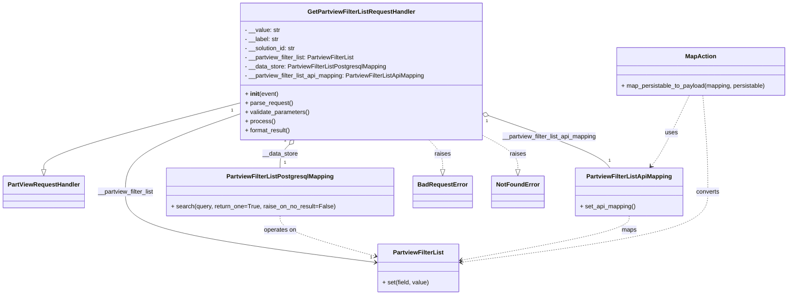

# Diagram: partview_core/partview_service/partview_service/api/partview_filter_list/handlers/get_partview_filter_list.py


> Auto-generated by Obscura crawlers

## Diagram 1



### SVG

<svg id="container" width="2048.591796875" xmlns="http://www.w3.org/2000/svg" class="classDiagram" height="776" viewBox="0 0 2048.591796875 776" role="graphics-document document" aria-roledescription="class"><style>#container{font-family:"trebuchet ms",verdana,arial,sans-serif;font-size:16px;fill:#333;}@keyframes edge-animation-frame{from{stroke-dashoffset:0;}}@keyframes dash{to{stroke-dashoffset:0;}}#container .edge-animation-slow{stroke-dasharray:9,5!important;stroke-dashoffset:900;animation:dash 50s linear infinite;stroke-linecap:round;}#container .edge-animation-fast{stroke-dasharray:9,5!important;stroke-dashoffset:900;animation:dash 20s linear infinite;stroke-linecap:round;}#container .error-icon{fill:#552222;}#container .error-text{fill:#552222;stroke:#552222;}#container .edge-thickness-normal{stroke-width:1px;}#container .edge-thickness-thick{stroke-width:3.5px;}#container .edge-pattern-solid{stroke-dasharray:0;}#container .edge-thickness-invisible{stroke-width:0;fill:none;}#container .edge-pattern-dashed{stroke-dasharray:3;}#container .edge-pattern-dotted{stroke-dasharray:2;}#container .marker{fill:#333333;stroke:#333333;}#container .marker.cross{stroke:#333333;}#container svg{font-family:"trebuchet ms",verdana,arial,sans-serif;font-size:16px;}#container p{margin:0;}#container g.classGroup text{fill:#9370DB;stroke:none;font-family:"trebuchet ms",verdana,arial,sans-serif;font-size:10px;}#container g.classGroup text .title{font-weight:bolder;}#container .nodeLabel,#container .edgeLabel{color:#131300;}#container .edgeLabel .label rect{fill:#ECECFF;}#container .label text{fill:#131300;}#container .labelBkg{background:#ECECFF;}#container .edgeLabel .label span{background:#ECECFF;}#container .classTitle{font-weight:bolder;}#container .node rect,#container .node circle,#container .node ellipse,#container .node polygon,#container .node path{fill:#ECECFF;stroke:#9370DB;stroke-width:1px;}#container .divider{stroke:#9370DB;stroke-width:1;}#container g.clickable{cursor:pointer;}#container g.classGroup rect{fill:#ECECFF;stroke:#9370DB;}#container g.classGroup line{stroke:#9370DB;stroke-width:1;}#container .classLabel .box{stroke:none;stroke-width:0;fill:#ECECFF;opacity:0.5;}#container .classLabel .label{fill:#9370DB;font-size:10px;}#container .relation{stroke:#333333;stroke-width:1;fill:none;}#container .dashed-line{stroke-dasharray:3;}#container .dotted-line{stroke-dasharray:1 2;}#container #compositionStart,#container .composition{fill:#333333!important;stroke:#333333!important;stroke-width:1;}#container #compositionEnd,#container .composition{fill:#333333!important;stroke:#333333!important;stroke-width:1;}#container #dependencyStart,#container .dependency{fill:#333333!important;stroke:#333333!important;stroke-width:1;}#container #dependencyStart,#container .dependency{fill:#333333!important;stroke:#333333!important;stroke-width:1;}#container #extensionStart,#container .extension{fill:transparent!important;stroke:#333333!important;stroke-width:1;}#container #extensionEnd,#container .extension{fill:transparent!important;stroke:#333333!important;stroke-width:1;}#container #aggregationStart,#container .aggregation{fill:transparent!important;stroke:#333333!important;stroke-width:1;}#container #aggregationEnd,#container .aggregation{fill:transparent!important;stroke:#333333!important;stroke-width:1;}#container #lollipopStart,#container .lollipop{fill:#ECECFF!important;stroke:#333333!important;stroke-width:1;}#container #lollipopEnd,#container .lollipop{fill:#ECECFF!important;stroke:#333333!important;stroke-width:1;}#container .edgeTerminals{font-size:11px;line-height:initial;}#container .classTitleText{text-anchor:middle;font-size:18px;fill:#333;}#container .label-icon{display:inline-block;height:1em;overflow:visible;vertical-align:-0.125em;}#container .node .label-icon path{fill:currentColor;stroke:revert;stroke-width:revert;}#container :root{--mermaid-font-family:"trebuchet ms",verdana,arial,sans-serif;}</style><g><defs><marker id="container_class-aggregationStart" class="marker aggregation class" refX="18" refY="7" markerWidth="190" markerHeight="240" orient="auto"><path d="M 18,7 L9,13 L1,7 L9,1 Z"></path></marker></defs><defs><marker id="container_class-aggregationEnd" class="marker aggregation class" refX="1" refY="7" markerWidth="20" markerHeight="28" orient="auto"><path d="M 18,7 L9,13 L1,7 L9,1 Z"></path></marker></defs><defs><marker id="container_class-extensionStart" class="marker extension class" refX="18" refY="7" markerWidth="190" markerHeight="240" orient="auto"><path d="M 1,7 L18,13 V 1 Z"></path></marker></defs><defs><marker id="container_class-extensionEnd" class="marker extension class" refX="1" refY="7" markerWidth="20" markerHeight="28" orient="auto"><path d="M 1,1 V 13 L18,7 Z"></path></marker></defs><defs><marker id="container_class-compositionStart" class="marker composition class" refX="18" refY="7" markerWidth="190" markerHeight="240" orient="auto"><path d="M 18,7 L9,13 L1,7 L9,1 Z"></path></marker></defs><defs><marker id="container_class-compositionEnd" class="marker composition class" refX="1" refY="7" markerWidth="20" markerHeight="28" orient="auto"><path d="M 18,7 L9,13 L1,7 L9,1 Z"></path></marker></defs><defs><marker id="container_class-dependencyStart" class="marker dependency class" refX="6" refY="7" markerWidth="190" markerHeight="240" orient="auto"><path d="M 5,7 L9,13 L1,7 L9,1 Z"></path></marker></defs><defs><marker id="container_class-dependencyEnd" class="marker dependency class" refX="13" refY="7" markerWidth="20" markerHeight="28" orient="auto"><path d="M 18,7 L9,13 L14,7 L9,1 Z"></path></marker></defs><defs><marker id="container_class-lollipopStart" class="marker lollipop class" refX="13" refY="7" markerWidth="190" markerHeight="240" orient="auto"><circle stroke="black" fill="transparent" cx="7" cy="7" r="6"></circle></marker></defs><defs><marker id="container_class-lollipopEnd" class="marker lollipop class" refX="1" refY="7" markerWidth="190" markerHeight="240" orient="auto"><circle stroke="black" fill="transparent" cx="7" cy="7" r="6"></circle></marker></defs><g class="root"><g class="clusters"></g><g class="edgePaths"><path d="M617.848,272.117L533.433,294.264C449.018,316.412,280.189,360.706,195.774,389.645C111.359,418.583,111.359,432.167,111.359,438.958L111.359,445.75" id="id_GetPartviewFilterListRequestHandler_PartViewRequestHandler_1" class="edge-thickness-normal edge-pattern-solid relation" style=";;;" data-edge="true" data-et="edge" data-id="id_GetPartviewFilterListRequestHandler_PartViewRequestHandler_1" data-points="W3sieCI6NjE3Ljg0NzY1NjI1LCJ5IjoyNzIuMTE3MzYxNDY4NjAwNX0seyJ4IjoxMTEuMzU5Mzc1LCJ5Ijo0MDV9LHsieCI6MTExLjM1OTM3NSwieSI6NDYzfV0=" marker-end="url(#container_class-extensionEnd)"></path><path d="M752.93,380.418L748.979,384.515C745.029,388.612,737.128,396.806,733.177,407.07C729.227,417.333,729.227,429.667,729.227,435.833L729.227,442" id="id_GetPartviewFilterListRequestHandler_PartviewFilterListPostgresqlMapping_2" class="edge-thickness-normal edge-pattern-solid relation" style=";;;" data-edge="true" data-et="edge" data-id="id_GetPartviewFilterListRequestHandler_PartviewFilterListPostgresqlMapping_2" data-points="W3sieCI6NzY0LjkwMzEzNTgwMDY5MTIsInkiOjM2OH0seyJ4Ijo3MjkuMjI2NTYyNSwieSI6NDA1fSx7IngiOjcyOS4yMjY1NjI1LCJ5Ijo0NDJ9XQ==" marker-start="url(#container_class-aggregationStart)"></path><path d="M1275.335,307.778L1320.907,323.982C1366.479,340.185,1457.623,372.593,1508.221,394.963C1558.818,417.333,1568.869,429.667,1573.894,435.833L1578.92,442" id="id_GetPartviewFilterListRequestHandler_PartviewFilterListApiMapping_3" class="edge-thickness-normal edge-pattern-solid relation" style=";;;" data-edge="true" data-et="edge" data-id="id_GetPartviewFilterListRequestHandler_PartviewFilterListApiMapping_3" data-points="W3sieCI6MTI1OS4wODIwMzEyNSwieSI6MzAxLjk5OTA0NjMyMzcwNTl9LHsieCI6MTU0OC43Njc1NzgxMjUsInkiOjQwNX0seyJ4IjoxNTc4LjkxOTY4NzUsInkiOjQ0Mn1d" marker-start="url(#container_class-aggregationStart)"></path><path d="M617.848,301.388L569.019,318.657C520.19,335.926,422.533,370.463,373.704,404.398C324.875,438.333,324.875,471.667,324.875,505C324.875,538.333,324.875,571.667,433.072,602.552C541.27,633.438,757.664,661.876,865.862,676.095L974.059,690.315" id="id_GetPartviewFilterListRequestHandler_PartviewFilterList_4" class="edge-thickness-normal edge-pattern-solid relation" style=";;;" data-edge="true" data-et="edge" data-id="id_GetPartviewFilterListRequestHandler_PartviewFilterList_4" data-points="W3sieCI6NjE3Ljg0NzY1NjI1LCJ5IjozMDEuMzg4MzMzMjU5MDYwNzR9LHsieCI6MzI0Ljg3NSwieSI6NDA1fSx7IngiOjMyNC44NzUsInkiOjUwNX0seyJ4IjozMjQuODc1LCJ5Ijo2MDV9LHsieCI6OTgwLjAwNzgxMjUsInkiOjY5MS4wOTYzNjY0OTI0NjkxfV0=" marker-end="url(#container_class-dependencyEnd)"></path><path d="M729.227,568L729.227,574.167C729.227,580.333,729.227,592.667,770.061,610.285C810.895,627.903,892.563,650.807,933.397,662.258L974.231,673.71" id="id_PartviewFilterListPostgresqlMapping_PartviewFilterList_5" class="edge-thickness-normal edge-pattern-dashed relation" style=";;;" data-edge="true" data-et="edge" data-id="id_PartviewFilterListPostgresqlMapping_PartviewFilterList_5" data-points="W3sieCI6NzI5LjIyNjU2MjUsInkiOjU2OH0seyJ4Ijo3MjkuMjI2NTYyNSwieSI6NjA1fSx7IngiOjk4MC4wMDc4MTI1LCJ5Ijo2NzUuMzI5OTU5MjQ4MDYxfV0=" marker-end="url(#container_class-dependencyEnd)"></path><path d="M1630.26,568L1630.26,574.167C1630.26,580.333,1630.26,592.667,1558.134,612.081C1486.007,631.495,1341.755,657.99,1269.629,671.237L1197.503,684.484" id="id_PartviewFilterListApiMapping_PartviewFilterList_6" class="edge-thickness-normal edge-pattern-dashed relation" style=";;;" data-edge="true" data-et="edge" data-id="id_PartviewFilterListApiMapping_PartviewFilterList_6" data-points="W3sieCI6MTYzMC4yNTk3NjU2MjUsInkiOjU2OH0seyJ4IjoxNjMwLjI1OTc2NTYyNSwieSI6NjA1fSx7IngiOjExOTEuNjAxNTYyNSwieSI6Njg1LjU2ODMwMDQ0Mzc0OTN9XQ==" marker-end="url(#container_class-dependencyEnd)"></path><path d="M1787.406,251L1775.272,276.667C1763.138,302.333,1738.87,353.667,1722.179,384.736C1705.489,415.805,1696.376,426.609,1691.82,432.011L1687.263,437.414" id="id_MapAction_PartviewFilterListApiMapping_7" class="edge-thickness-normal edge-pattern-dashed relation" style=";;;" data-edge="true" data-et="edge" data-id="id_MapAction_PartviewFilterListApiMapping_7" data-points="W3sieCI6MTc4Ny40MDU4NzE5NzU4MDYzLCJ5IjoyNTF9LHsieCI6MTcxNC42MDE1NjI1LCJ5Ijo0MDV9LHsieCI6MTY4My4zOTUwOTc2NTYyNSwieSI6NDQyfV0=" marker-end="url(#container_class-dependencyEnd)"></path><path d="M1822.487,251L1824.645,276.667C1826.803,302.333,1831.119,353.667,1833.277,396C1835.436,438.333,1835.436,471.667,1835.436,505C1835.436,538.333,1835.436,571.667,1729.121,602.516C1622.807,633.364,1410.178,661.729,1303.863,675.911L1197.549,690.093" id="id_MapAction_PartviewFilterList_8" class="edge-thickness-normal edge-pattern-dashed relation" style=";;;" data-edge="true" data-et="edge" data-id="id_MapAction_PartviewFilterList_8" data-points="W3sieCI6MTgyMi40ODY3MDYxNDkxOTM3LCJ5IjoyNTF9LHsieCI6MTgzNS40MzU1NDY4NzUsInkiOjQwNX0seyJ4IjoxODM1LjQzNTU0Njg3NSwieSI6NTA1fSx7IngiOjE4MzUuNDM1NTQ2ODc1LCJ5Ijo2MDV9LHsieCI6MTE5MS42MDE1NjI1LCJ5Ijo2OTAuODg2ODAzNjYxMTc2OX1d" marker-end="url(#container_class-dependencyEnd)"></path><path d="M1112.027,368L1117.973,374.167C1123.919,380.333,1135.811,392.667,1141.757,405.625C1147.703,418.583,1147.703,432.167,1147.703,438.958L1147.703,445.75" id="id_GetPartviewFilterListRequestHandler_BadRequestError_9" class="edge-thickness-normal edge-pattern-dashed relation" style=";;;" data-edge="true" data-et="edge" data-id="id_GetPartviewFilterListRequestHandler_BadRequestError_9" data-points="W3sieCI6MTExMi4wMjY1NTE2OTkzMDg4LCJ5IjozNjh9LHsieCI6MTE0Ny43MDMxMjUsInkiOjQwNX0seyJ4IjoxMTQ3LjcwMzEyNSwieSI6NDYzfV0=" marker-end="url(#container_class-extensionEnd)"></path><path d="M1259.082,362.349L1272.154,369.457C1285.227,376.566,1311.371,390.783,1324.443,404.683C1337.516,418.583,1337.516,432.167,1337.516,438.958L1337.516,445.75" id="id_GetPartviewFilterListRequestHandler_NotFoundError_10" class="edge-thickness-normal edge-pattern-dashed relation" style=";;;" data-edge="true" data-et="edge" data-id="id_GetPartviewFilterListRequestHandler_NotFoundError_10" data-points="W3sieCI6MTI1OS4wODIwMzEyNSwieSI6MzYyLjM0ODU2MTUyNzg0NDM3fSx7IngiOjEzMzcuNTE1NjI1LCJ5Ijo0MDV9LHsieCI6MTMzNy41MTU2MjUsInkiOjQ2M31d" marker-end="url(#container_class-extensionEnd)"></path></g><g class="edgeLabels"><g class="edgeLabel"><g class="label" data-id="id_GetPartviewFilterListRequestHandler_PartViewRequestHandler_1" transform="translate(0, 0)"><foreignObject width="0" height="0"><div xmlns="http://www.w3.org/1999/xhtml" class="labelBkg" style="display: table-cell; white-space: nowrap; line-height: 1.5; max-width: 200px; text-align: center;"><span class="edgeLabel"></span></div></foreignObject></g></g><g class="edgeLabel" transform="translate(729.2265625, 405)"><g class="label" data-id="id_GetPartviewFilterListRequestHandler_PartviewFilterListPostgresqlMapping_2" transform="translate(-46.9453125, -12)"><foreignObject width="93.890625" height="24"><div xmlns="http://www.w3.org/1999/xhtml" class="labelBkg" style="display: table-cell; white-space: nowrap; line-height: 1.5; max-width: 200px; text-align: center;"><span class="edgeLabel"><p>__data_store</p></span></div></foreignObject></g></g><g class="edgeLabel" transform="translate(1426.4107, 361.49464)"><g class="label" data-id="id_GetPartviewFilterListRequestHandler_PartviewFilterListApiMapping_3" transform="translate(-126.4921875, -12)"><foreignObject width="252.984375" height="24"><div xmlns="http://www.w3.org/1999/xhtml" class="labelBkg" style="display: table; white-space: break-spaces; line-height: 1.5; max-width: 200px; text-align: center; width: 200px;"><span class="edgeLabel"><p>__partview_filter_list_api_mapping</p></span></div></foreignObject></g></g><g class="edgeLabel" transform="translate(324.875, 505)"><g class="label" data-id="id_GetPartviewFilterListRequestHandler_PartviewFilterList_4" transform="translate(-75.15625, -12)"><foreignObject width="150.3125" height="24"><div xmlns="http://www.w3.org/1999/xhtml" class="labelBkg" style="display: table-cell; white-space: nowrap; line-height: 1.5; max-width: 200px; text-align: center;"><span class="edgeLabel"><p>__partview_filter_list</p></span></div></foreignObject></g></g><g class="edgeLabel" transform="translate(729.2265625, 605)"><g class="label" data-id="id_PartviewFilterListPostgresqlMapping_PartviewFilterList_5" transform="translate(-43.2890625, -12)"><foreignObject width="86.578125" height="24"><div xmlns="http://www.w3.org/1999/xhtml" class="labelBkg" style="display: table-cell; white-space: nowrap; line-height: 1.5; max-width: 200px; text-align: center;"><span class="edgeLabel"><p>operates on</p></span></div></foreignObject></g></g><g class="edgeLabel" transform="translate(1630.259765625, 605)"><g class="label" data-id="id_PartviewFilterListApiMapping_PartviewFilterList_6" transform="translate(-19.703125, -12)"><foreignObject width="39.40625" height="24"><div xmlns="http://www.w3.org/1999/xhtml" class="labelBkg" style="display: table-cell; white-space: nowrap; line-height: 1.5; max-width: 200px; text-align: center;"><span class="edgeLabel"><p>maps</p></span></div></foreignObject></g></g><g class="edgeLabel" transform="translate(1740.66, 349.87964)"><g class="label" data-id="id_MapAction_PartviewFilterListApiMapping_7" transform="translate(-16.4921875, -12)"><foreignObject width="32.984375" height="24"><div xmlns="http://www.w3.org/1999/xhtml" class="labelBkg" style="display: table-cell; white-space: nowrap; line-height: 1.5; max-width: 200px; text-align: center;"><span class="edgeLabel"><p>uses</p></span></div></foreignObject></g></g><g class="edgeLabel" transform="translate(1835.435546875, 505)"><g class="label" data-id="id_MapAction_PartviewFilterList_8" transform="translate(-30.9453125, -12)"><foreignObject width="61.890625" height="24"><div xmlns="http://www.w3.org/1999/xhtml" class="labelBkg" style="display: table-cell; white-space: nowrap; line-height: 1.5; max-width: 200px; text-align: center;"><span class="edgeLabel"><p>converts</p></span></div></foreignObject></g></g><g class="edgeLabel" transform="translate(1147.703125, 405)"><g class="label" data-id="id_GetPartviewFilterListRequestHandler_BadRequestError_9" transform="translate(-21.25, -12)"><foreignObject width="42.5" height="24"><div xmlns="http://www.w3.org/1999/xhtml" class="labelBkg" style="display: table-cell; white-space: nowrap; line-height: 1.5; max-width: 200px; text-align: center;"><span class="edgeLabel"><p>raises</p></span></div></foreignObject></g></g><g class="edgeLabel" transform="translate(1337.515625, 405)"><g class="label" data-id="id_GetPartviewFilterListRequestHandler_NotFoundError_10" transform="translate(-21.25, -12)"><foreignObject width="42.5" height="24"><div xmlns="http://www.w3.org/1999/xhtml" class="labelBkg" style="display: table-cell; white-space: nowrap; line-height: 1.5; max-width: 200px; text-align: center;"><span class="edgeLabel"><p>raises</p></span></div></foreignObject></g></g><g class="edgeTerminals" transform="translate(741.9581612615704, 370.1858844797104)"><g class="inner" transform="translate(0, 0)"><foreignObject style="width: 9px; height: 12px;"><div xmlns="http://www.w3.org/1999/xhtml" style="display: inline-block; padding-right: 1px; white-space: nowrap;"><span class="edgeLabel">1</span></div></foreignObject></g></g><g class="edgeTerminals" transform="translate(1270.5455452192223, 321.9949934879473)"><g class="inner" transform="translate(0, 0)"><foreignObject style="width: 9px; height: 12px;"><div xmlns="http://www.w3.org/1999/xhtml" style="display: inline-block; padding-right: 1px; white-space: nowrap;"><span class="edgeLabel">1</span></div></foreignObject></g></g><g class="edgeTerminals" transform="translate(596.3477384986294, 293.08149879200926)"><g class="inner" transform="translate(0, 0)"><foreignObject style="width: 9px; height: 12px;"><div xmlns="http://www.w3.org/1999/xhtml" style="display: inline-block; padding-right: 1px; white-space: nowrap;"><span class="edgeLabel">1</span></div></foreignObject></g></g><g class="edgeTerminals" transform="translate(739.22656125, 419.4999989285714)"><g class="inner" transform="translate(0, 0)"></g><foreignObject style="width: 9px; height: 12px;"><div xmlns="http://www.w3.org/1999/xhtml" style="display: inline-block; padding-right: 1px; white-space: nowrap;"><span class="edgeLabel">1</span></div></foreignObject></g><g class="edgeTerminals" transform="translate(1574.4924538578389, 413.9582575443185)"><g class="inner" transform="translate(0, 0)"></g><foreignObject style="width: 9px; height: 12px;"><div xmlns="http://www.w3.org/1999/xhtml" style="display: inline-block; padding-right: 1px; white-space: nowrap;"><span class="edgeLabel">1</span></div></foreignObject></g><g class="edgeTerminals" transform="translate(959.611469671844, 668.9440298878161)"><g class="inner" transform="translate(0, 0)"></g><foreignObject style="width: 9px; height: 12px;"><div xmlns="http://www.w3.org/1999/xhtml" style="display: inline-block; padding-right: 1px; white-space: nowrap;"><span class="edgeLabel">1</span></div></foreignObject></g></g><g class="nodes"><g class="node default" id="classId-GetPartviewFilterListRequestHandler-0" transform="translate(938.46484375, 188)"><g class="basic label-container"><path d="M-320.6171875 -180 L320.6171875 -180 L320.6171875 180 L-320.6171875 180" stroke="none" stroke-width="0" fill="#ECECFF" style=""></path><path d="M-320.6171875 -180 C-144.45493478539424 -180, 31.707317929211513 -180, 320.6171875 -180 M-320.6171875 -180 C-179.5446464739509 -180, -38.47210544790181 -180, 320.6171875 -180 M320.6171875 -180 C320.6171875 -94.30976254665012, 320.6171875 -8.61952509330024, 320.6171875 180 M320.6171875 -180 C320.6171875 -44.68719756490509, 320.6171875 90.62560487018982, 320.6171875 180 M320.6171875 180 C74.08351499901195 180, -172.4501575019761 180, -320.6171875 180 M320.6171875 180 C168.64253172778623 180, 16.66787595557247 180, -320.6171875 180 M-320.6171875 180 C-320.6171875 54.64497055514664, -320.6171875 -70.71005888970672, -320.6171875 -180 M-320.6171875 180 C-320.6171875 38.46758150142941, -320.6171875 -103.06483699714119, -320.6171875 -180" stroke="#9370DB" stroke-width="1.3" fill="none" stroke-dasharray="0 0" style=""></path></g><g class="annotation-group text" transform="translate(0, -156)"></g><g class="label-group text" transform="translate(-135.703125, -156)"><g class="label" style="font-weight: bolder" transform="translate(0,-12)"><foreignObject width="271.40625" height="24"><div xmlns="http://www.w3.org/1999/xhtml" style="display: table-cell; white-space: nowrap; line-height: 1.5; max-width: 317px; text-align: center;"><span class="nodeLabel markdown-node-label" style=""><p>GetPartviewFilterListRequestHandler</p></span></div></foreignObject></g></g><g class="members-group text" transform="translate(-308.6171875, -108)"><g class="label" style="" transform="translate(0,-12)"><foreignObject width="93.078125" height="24"><div xmlns="http://www.w3.org/1999/xhtml" style="display: table-cell; white-space: nowrap; line-height: 1.5; max-width: 151px; text-align: center;"><span class="nodeLabel markdown-node-label" style=""><p>- __value: str</p></span></div></foreignObject></g><g class="label" style="" transform="translate(0,12)"><foreignObject width="90.90625" height="24"><div xmlns="http://www.w3.org/1999/xhtml" style="display: table-cell; white-space: nowrap; line-height: 1.5; max-width: 149px; text-align: center;"><span class="nodeLabel markdown-node-label" style=""><p>- __label: str</p></span></div></foreignObject></g><g class="label" style="" transform="translate(0,36)"><foreignObject width="136.90625" height="24"><div xmlns="http://www.w3.org/1999/xhtml" style="display: table-cell; white-space: nowrap; line-height: 1.5; max-width: 195px; text-align: center;"><span class="nodeLabel markdown-node-label" style=""><p>- __solution_id: str</p></span></div></foreignObject></g><g class="label" style="" transform="translate(0,60)"><foreignObject width="293.375" height="24"><div xmlns="http://www.w3.org/1999/xhtml" style="display: table-cell; white-space: nowrap; line-height: 1.5; max-width: 351px; text-align: center;"><span class="nodeLabel markdown-node-label" style=""><p>- __partview_filter_list: PartviewFilterList</p></span></div></foreignObject></g><g class="label" style="" transform="translate(0,84)"><foreignObject width="374.890625" height="24"><div xmlns="http://www.w3.org/1999/xhtml" style="display: table-cell; white-space: nowrap; line-height: 1.5; max-width: 433px; text-align: center;"><span class="nodeLabel markdown-node-label" style=""><p>- __data_store: PartviewFilterListPostgresqlMapping</p></span></div></foreignObject></g><g class="label" style="" transform="translate(0,108)"><foreignObject width="481.53125" height="24"><div xmlns="http://www.w3.org/1999/xhtml" style="display: table-cell; white-space: nowrap; line-height: 1.5; max-width: 540px; text-align: center;"><span class="nodeLabel markdown-node-label" style=""><p>- __partview_filter_list_api_mapping: PartviewFilterListApiMapping</p></span></div></foreignObject></g></g><g class="methods-group text" transform="translate(-308.6171875, 60)"><g class="label" style="" transform="translate(0,-12)"><foreignObject width="87.390625" height="24"><div xmlns="http://www.w3.org/1999/xhtml" style="display: table-cell; white-space: nowrap; line-height: 1.5; max-width: 177px; text-align: center;"><span class="nodeLabel markdown-node-label" style=""><p>+ <strong>init</strong>(event)</p></span></div></foreignObject></g><g class="label" style="" transform="translate(0,12)"><foreignObject width="126.046875" height="24"><div xmlns="http://www.w3.org/1999/xhtml" style="display: table-cell; white-space: nowrap; line-height: 1.5; max-width: 183px; text-align: center;"><span class="nodeLabel markdown-node-label" style=""><p>+ parse_request()</p></span></div></foreignObject></g><g class="label" style="" transform="translate(0,36)"><foreignObject width="170.953125" height="24"><div xmlns="http://www.w3.org/1999/xhtml" style="display: table-cell; white-space: nowrap; line-height: 1.5; max-width: 228px; text-align: center;"><span class="nodeLabel markdown-node-label" style=""><p>+ validate_parameters()</p></span></div></foreignObject></g><g class="label" style="" transform="translate(0,60)"><foreignObject width="77.96875" height="24"><div xmlns="http://www.w3.org/1999/xhtml" style="display: table-cell; white-space: nowrap; line-height: 1.5; max-width: 135px; text-align: center;"><span class="nodeLabel markdown-node-label" style=""><p>+ process()</p></span></div></foreignObject></g><g class="label" style="" transform="translate(0,84)"><foreignObject width="121.5" height="24"><div xmlns="http://www.w3.org/1999/xhtml" style="display: table-cell; white-space: nowrap; line-height: 1.5; max-width: 179px; text-align: center;"><span class="nodeLabel markdown-node-label" style=""><p>+ format_result()</p></span></div></foreignObject></g></g><g class="divider" style=""><path d="M-320.6171875 -132 C-159.20799958169022 -132, 2.201188336619566 -132, 320.6171875 -132 M-320.6171875 -132 C-112.90786721696463 -132, 94.80145306607074 -132, 320.6171875 -132" stroke="#9370DB" stroke-width="1.3" fill="none" stroke-dasharray="0 0" style=""></path></g><g class="divider" style=""><path d="M-320.6171875 36 C-85.82576225195635 36, 148.9656629960873 36, 320.6171875 36 M-320.6171875 36 C-163.20905330044047 36, -5.800919100880947 36, 320.6171875 36" stroke="#9370DB" stroke-width="1.3" fill="none" stroke-dasharray="0 0" style=""></path></g></g><g class="node default" id="classId-PartViewRequestHandler-1" transform="translate(111.359375, 505)"><g class="basic label-container"><path d="M-103.359375 -42 L103.359375 -42 L103.359375 42 L-103.359375 42" stroke="none" stroke-width="0" fill="#ECECFF" style=""></path><path d="M-103.359375 -42 C-29.28797821820619 -42, 44.78341856358762 -42, 103.359375 -42 M-103.359375 -42 C-38.93377801543927 -42, 25.491818969121454 -42, 103.359375 -42 M103.359375 -42 C103.359375 -20.20463264166162, 103.359375 1.5907347166767565, 103.359375 42 M103.359375 -42 C103.359375 -12.28692352920535, 103.359375 17.4261529415893, 103.359375 42 M103.359375 42 C27.223560659324974 42, -48.91225368135005 42, -103.359375 42 M103.359375 42 C28.92058007451287 42, -45.51821485097426 42, -103.359375 42 M-103.359375 42 C-103.359375 22.845469465064255, -103.359375 3.6909389301285103, -103.359375 -42 M-103.359375 42 C-103.359375 9.432737066681483, -103.359375 -23.134525866637034, -103.359375 -42" stroke="#9370DB" stroke-width="1.3" fill="none" stroke-dasharray="0 0" style=""></path></g><g class="annotation-group text" transform="translate(0, -18)"></g><g class="label-group text" transform="translate(-91.359375, -18)"><g class="label" style="font-weight: bolder" transform="translate(0,-12)"><foreignObject width="182.71875" height="24"><div xmlns="http://www.w3.org/1999/xhtml" style="display: table-cell; white-space: nowrap; line-height: 1.5; max-width: 231px; text-align: center;"><span class="nodeLabel markdown-node-label" style=""><p>PartViewRequestHandler</p></span></div></foreignObject></g></g><g class="members-group text" transform="translate(-91.359375, 30)"></g><g class="methods-group text" transform="translate(-91.359375, 60)"></g><g class="divider" style=""><path d="M-103.359375 6 C-47.991303799673695 6, 7.376767400652611 6, 103.359375 6 M-103.359375 6 C-58.41962928178107 6, -13.47988356356214 6, 103.359375 6" stroke="#9370DB" stroke-width="1.3" fill="none" stroke-dasharray="0 0" style=""></path></g><g class="divider" style=""><path d="M-103.359375 24 C-55.01145284189488 24, -6.663530683789759 24, 103.359375 24 M-103.359375 24 C-28.86373696903985 24, 45.6319010619203 24, 103.359375 24" stroke="#9370DB" stroke-width="1.3" fill="none" stroke-dasharray="0 0" style=""></path></g></g><g class="node default" id="classId-PartviewFilterList-2" transform="translate(1085.8046875, 705)"><g class="basic label-container"><path d="M-105.796875 -63 L105.796875 -63 L105.796875 63 L-105.796875 63" stroke="none" stroke-width="0" fill="#ECECFF" style=""></path><path d="M-105.796875 -63 C-23.152883804227912 -63, 59.491107391544176 -63, 105.796875 -63 M-105.796875 -63 C-48.20674090540116 -63, 9.383393189197676 -63, 105.796875 -63 M105.796875 -63 C105.796875 -18.02522761798727, 105.796875 26.94954476402546, 105.796875 63 M105.796875 -63 C105.796875 -17.405138072504563, 105.796875 28.189723854990874, 105.796875 63 M105.796875 63 C40.02520723171959 63, -25.746460536560818 63, -105.796875 63 M105.796875 63 C55.325322476635236 63, 4.853769953270472 63, -105.796875 63 M-105.796875 63 C-105.796875 13.048217362130607, -105.796875 -36.903565275738785, -105.796875 -63 M-105.796875 63 C-105.796875 20.841316463589465, -105.796875 -21.31736707282107, -105.796875 -63" stroke="#9370DB" stroke-width="1.3" fill="none" stroke-dasharray="0 0" style=""></path></g><g class="annotation-group text" transform="translate(0, -39)"></g><g class="label-group text" transform="translate(-63.96875, -39)"><g class="label" style="font-weight: bolder" transform="translate(0,-12)"><foreignObject width="127.9375" height="24"><div xmlns="http://www.w3.org/1999/xhtml" style="display: table-cell; white-space: nowrap; line-height: 1.5; max-width: 174px; text-align: center;"><span class="nodeLabel markdown-node-label" style=""><p>PartviewFilterList</p></span></div></foreignObject></g></g><g class="members-group text" transform="translate(-93.796875, 9)"></g><g class="methods-group text" transform="translate(-93.796875, 39)"><g class="label" style="" transform="translate(0,-12)"><foreignObject width="123.625" height="24"><div xmlns="http://www.w3.org/1999/xhtml" style="display: table-cell; white-space: nowrap; line-height: 1.5; max-width: 181px; text-align: center;"><span class="nodeLabel markdown-node-label" style=""><p>+ set(field, value)</p></span></div></foreignObject></g></g><g class="divider" style=""><path d="M-105.796875 -15 C-45.17458713123907 -15, 15.447700737521856 -15, 105.796875 -15 M-105.796875 -15 C-47.157832718014646 -15, 11.481209563970708 -15, 105.796875 -15" stroke="#9370DB" stroke-width="1.3" fill="none" stroke-dasharray="0 0" style=""></path></g><g class="divider" style=""><path d="M-105.796875 9 C-60.27497403333593 9, -14.75307306667186 9, 105.796875 9 M-105.796875 9 C-24.976171120274486 9, 55.84453275945103 9, 105.796875 9" stroke="#9370DB" stroke-width="1.3" fill="none" stroke-dasharray="0 0" style=""></path></g></g><g class="node default" id="classId-PartviewFilterListPostgresqlMapping-3" transform="translate(729.2265625, 505)"><g class="basic label-container"><path d="M-294.1953125 -63 L294.1953125 -63 L294.1953125 63 L-294.1953125 63" stroke="none" stroke-width="0" fill="#ECECFF" style=""></path><path d="M-294.1953125 -63 C-99.94890482074487 -63, 94.29750285851026 -63, 294.1953125 -63 M-294.1953125 -63 C-80.18230255628592 -63, 133.83070738742816 -63, 294.1953125 -63 M294.1953125 -63 C294.1953125 -13.961332353221323, 294.1953125 35.077335293557354, 294.1953125 63 M294.1953125 -63 C294.1953125 -21.484072935971618, 294.1953125 20.031854128056764, 294.1953125 63 M294.1953125 63 C77.8832291121719 63, -138.4288542756562 63, -294.1953125 63 M294.1953125 63 C94.90164578376289 63, -104.39202093247422 63, -294.1953125 63 M-294.1953125 63 C-294.1953125 35.290840002825036, -294.1953125 7.581680005650078, -294.1953125 -63 M-294.1953125 63 C-294.1953125 32.270640610398004, -294.1953125 1.5412812207960016, -294.1953125 -63" stroke="#9370DB" stroke-width="1.3" fill="none" stroke-dasharray="0 0" style=""></path></g><g class="annotation-group text" transform="translate(0, -39)"></g><g class="label-group text" transform="translate(-134.375, -39)"><g class="label" style="font-weight: bolder" transform="translate(0,-12)"><foreignObject width="268.75" height="24"><div xmlns="http://www.w3.org/1999/xhtml" style="display: table-cell; white-space: nowrap; line-height: 1.5; max-width: 313px; text-align: center;"><span class="nodeLabel markdown-node-label" style=""><p>PartviewFilterListPostgresqlMapping</p></span></div></foreignObject></g></g><g class="members-group text" transform="translate(-282.1953125, 9)"></g><g class="methods-group text" transform="translate(-282.1953125, 39)"><g class="label" style="" transform="translate(0,-12)"><foreignObject width="430.015625" height="24"><div xmlns="http://www.w3.org/1999/xhtml" style="display: table-cell; white-space: nowrap; line-height: 1.5; max-width: 487px; text-align: center;"><span class="nodeLabel markdown-node-label" style=""><p>+ search(query, return_one=True, raise_on_no_result=False)</p></span></div></foreignObject></g></g><g class="divider" style=""><path d="M-294.1953125 -15 C-121.2718261434793 -15, 51.651660213041396 -15, 294.1953125 -15 M-294.1953125 -15 C-134.3684649910099 -15, 25.458382517980226 -15, 294.1953125 -15" stroke="#9370DB" stroke-width="1.3" fill="none" stroke-dasharray="0 0" style=""></path></g><g class="divider" style=""><path d="M-294.1953125 9 C-114.46212867328117 9, 65.27105515343766 9, 294.1953125 9 M-294.1953125 9 C-143.6796699820481 9, 6.835972535903807 9, 294.1953125 9" stroke="#9370DB" stroke-width="1.3" fill="none" stroke-dasharray="0 0" style=""></path></g></g><g class="node default" id="classId-PartviewFilterListApiMapping-4" transform="translate(1630.259765625, 505)"><g class="basic label-container"><path d="M-139.23046875 -63 L139.23046875 -63 L139.23046875 63 L-139.23046875 63" stroke="none" stroke-width="0" fill="#ECECFF" style=""></path><path d="M-139.23046875 -63 C-74.05790003739612 -63, -8.885331324792247 -63, 139.23046875 -63 M-139.23046875 -63 C-78.64580051874549 -63, -18.061132287490977 -63, 139.23046875 -63 M139.23046875 -63 C139.23046875 -27.92093540961804, 139.23046875 7.158129180763922, 139.23046875 63 M139.23046875 -63 C139.23046875 -16.484470041594847, 139.23046875 30.031059916810307, 139.23046875 63 M139.23046875 63 C37.98216883014722 63, -63.26613108970557 63, -139.23046875 63 M139.23046875 63 C71.01063810784566 63, 2.79080746569133 63, -139.23046875 63 M-139.23046875 63 C-139.23046875 27.715564892978257, -139.23046875 -7.568870214043486, -139.23046875 -63 M-139.23046875 63 C-139.23046875 16.07386809446816, -139.23046875 -30.85226381106368, -139.23046875 -63" stroke="#9370DB" stroke-width="1.3" fill="none" stroke-dasharray="0 0" style=""></path></g><g class="annotation-group text" transform="translate(0, -39)"></g><g class="label-group text" transform="translate(-107.2265625, -39)"><g class="label" style="font-weight: bolder" transform="translate(0,-12)"><foreignObject width="214.453125" height="24"><div xmlns="http://www.w3.org/1999/xhtml" style="display: table-cell; white-space: nowrap; line-height: 1.5; max-width: 260px; text-align: center;"><span class="nodeLabel markdown-node-label" style=""><p>PartviewFilterListApiMapping</p></span></div></foreignObject></g></g><g class="members-group text" transform="translate(-127.23046875, 9)"></g><g class="methods-group text" transform="translate(-127.23046875, 39)"><g class="label" style="" transform="translate(0,-12)"><foreignObject width="147.234375" height="24"><div xmlns="http://www.w3.org/1999/xhtml" style="display: table-cell; white-space: nowrap; line-height: 1.5; max-width: 205px; text-align: center;"><span class="nodeLabel markdown-node-label" style=""><p>+ set_api_mapping()</p></span></div></foreignObject></g></g><g class="divider" style=""><path d="M-139.23046875 -15 C-38.514886285707846 -15, 62.20069617858431 -15, 139.23046875 -15 M-139.23046875 -15 C-57.09802885082658 -15, 25.03441104834684 -15, 139.23046875 -15" stroke="#9370DB" stroke-width="1.3" fill="none" stroke-dasharray="0 0" style=""></path></g><g class="divider" style=""><path d="M-139.23046875 9 C-67.8271925269786 9, 3.5760836960427866 9, 139.23046875 9 M-139.23046875 9 C-79.31436854164843 9, -19.398268333296855 9, 139.23046875 9" stroke="#9370DB" stroke-width="1.3" fill="none" stroke-dasharray="0 0" style=""></path></g></g><g class="node default" id="classId-MapAction-5" transform="translate(1817.189453125, 188)"><g class="basic label-container"><path d="M-223.40234375 -63 L223.40234375 -63 L223.40234375 63 L-223.40234375 63" stroke="none" stroke-width="0" fill="#ECECFF" style=""></path><path d="M-223.40234375 -63 C-63.428070478155774 -63, 96.54620279368845 -63, 223.40234375 -63 M-223.40234375 -63 C-85.96241035277967 -63, 51.47752304444066 -63, 223.40234375 -63 M223.40234375 -63 C223.40234375 -30.365943548731686, 223.40234375 2.268112902536629, 223.40234375 63 M223.40234375 -63 C223.40234375 -24.31226748146245, 223.40234375 14.375465037075102, 223.40234375 63 M223.40234375 63 C118.33893451367048 63, 13.27552527734096 63, -223.40234375 63 M223.40234375 63 C52.48283403518636 63, -118.43667567962729 63, -223.40234375 63 M-223.40234375 63 C-223.40234375 31.474591522534805, -223.40234375 -0.05081695493039007, -223.40234375 -63 M-223.40234375 63 C-223.40234375 36.42224778485206, -223.40234375 9.844495569704115, -223.40234375 -63" stroke="#9370DB" stroke-width="1.3" fill="none" stroke-dasharray="0 0" style=""></path></g><g class="annotation-group text" transform="translate(0, -39)"></g><g class="label-group text" transform="translate(-38.6328125, -39)"><g class="label" style="font-weight: bolder" transform="translate(0,-12)"><foreignObject width="77.265625" height="24"><div xmlns="http://www.w3.org/1999/xhtml" style="display: table-cell; white-space: nowrap; line-height: 1.5; max-width: 126px; text-align: center;"><span class="nodeLabel markdown-node-label" style=""><p>MapAction</p></span></div></foreignObject></g></g><g class="members-group text" transform="translate(-211.40234375, 9)"></g><g class="methods-group text" transform="translate(-211.40234375, 39)"><g class="label" style="" transform="translate(0,-12)"><foreignObject width="384.171875" height="24"><div xmlns="http://www.w3.org/1999/xhtml" style="display: table-cell; white-space: nowrap; line-height: 1.5; max-width: 442px; text-align: center;"><span class="nodeLabel markdown-node-label" style=""><p>+ map_persistable_to_payload(mapping, persistable)</p></span></div></foreignObject></g></g><g class="divider" style=""><path d="M-223.40234375 -15 C-129.60552517814455 -15, -35.808706606289064 -15, 223.40234375 -15 M-223.40234375 -15 C-130.80005696759514 -15, -38.19777018519031 -15, 223.40234375 -15" stroke="#9370DB" stroke-width="1.3" fill="none" stroke-dasharray="0 0" style=""></path></g><g class="divider" style=""><path d="M-223.40234375 9 C-58.916181114839816 9, 105.56998152032037 9, 223.40234375 9 M-223.40234375 9 C-62.55464594794117 9, 98.29305185411766 9, 223.40234375 9" stroke="#9370DB" stroke-width="1.3" fill="none" stroke-dasharray="0 0" style=""></path></g></g><g class="node default" id="classId-BadRequestError-6" transform="translate(1147.703125, 505)"><g class="basic label-container"><path d="M-74.28125 -42 L74.28125 -42 L74.28125 42 L-74.28125 42" stroke="none" stroke-width="0" fill="#ECECFF" style=""></path><path d="M-74.28125 -42 C-43.599646837750555 -42, -12.918043675501117 -42, 74.28125 -42 M-74.28125 -42 C-35.721674748752626 -42, 2.8379005024947475 -42, 74.28125 -42 M74.28125 -42 C74.28125 -17.057859653299698, 74.28125 7.884280693400605, 74.28125 42 M74.28125 -42 C74.28125 -21.389520217808883, 74.28125 -0.779040435617766, 74.28125 42 M74.28125 42 C15.567844755827672 42, -43.14556048834466 42, -74.28125 42 M74.28125 42 C17.757768724189745 42, -38.76571255162051 42, -74.28125 42 M-74.28125 42 C-74.28125 11.30904717482063, -74.28125 -19.38190565035874, -74.28125 -42 M-74.28125 42 C-74.28125 20.977237317327344, -74.28125 -0.04552536534531271, -74.28125 -42" stroke="#9370DB" stroke-width="1.3" fill="none" stroke-dasharray="0 0" style=""></path></g><g class="annotation-group text" transform="translate(0, -18)"></g><g class="label-group text" transform="translate(-62.28125, -18)"><g class="label" style="font-weight: bolder" transform="translate(0,-12)"><foreignObject width="124.5625" height="24"><div xmlns="http://www.w3.org/1999/xhtml" style="display: table-cell; white-space: nowrap; line-height: 1.5; max-width: 174px; text-align: center;"><span class="nodeLabel markdown-node-label" style=""><p>BadRequestError</p></span></div></foreignObject></g></g><g class="members-group text" transform="translate(-62.28125, 30)"></g><g class="methods-group text" transform="translate(-62.28125, 60)"></g><g class="divider" style=""><path d="M-74.28125 6 C-21.911061651508554 6, 30.459126696982892 6, 74.28125 6 M-74.28125 6 C-17.111165051082224 6, 40.05891989783555 6, 74.28125 6" stroke="#9370DB" stroke-width="1.3" fill="none" stroke-dasharray="0 0" style=""></path></g><g class="divider" style=""><path d="M-74.28125 24 C-27.061093855576537 24, 20.159062288846926 24, 74.28125 24 M-74.28125 24 C-41.90274314299967 24, -9.524236285999336 24, 74.28125 24" stroke="#9370DB" stroke-width="1.3" fill="none" stroke-dasharray="0 0" style=""></path></g></g><g class="node default" id="classId-NotFoundError-7" transform="translate(1337.515625, 505)"><g class="basic label-container"><path d="M-65.53125 -42 L65.53125 -42 L65.53125 42 L-65.53125 42" stroke="none" stroke-width="0" fill="#ECECFF" style=""></path><path d="M-65.53125 -42 C-13.751770425969795 -42, 38.02770914806041 -42, 65.53125 -42 M-65.53125 -42 C-35.140235116778456 -42, -4.749220233556919 -42, 65.53125 -42 M65.53125 -42 C65.53125 -11.231884282173976, 65.53125 19.53623143565205, 65.53125 42 M65.53125 -42 C65.53125 -9.871241670378922, 65.53125 22.257516659242157, 65.53125 42 M65.53125 42 C16.957927021687922 42, -31.615395956624155 42, -65.53125 42 M65.53125 42 C16.703854202073565 42, -32.12354159585287 42, -65.53125 42 M-65.53125 42 C-65.53125 20.298926337453324, -65.53125 -1.4021473250933525, -65.53125 -42 M-65.53125 42 C-65.53125 19.42006364763595, -65.53125 -3.1598727047281017, -65.53125 -42" stroke="#9370DB" stroke-width="1.3" fill="none" stroke-dasharray="0 0" style=""></path></g><g class="annotation-group text" transform="translate(0, -18)"></g><g class="label-group text" transform="translate(-53.53125, -18)"><g class="label" style="font-weight: bolder" transform="translate(0,-12)"><foreignObject width="107.0625" height="24"><div xmlns="http://www.w3.org/1999/xhtml" style="display: table-cell; white-space: nowrap; line-height: 1.5; max-width: 158px; text-align: center;"><span class="nodeLabel markdown-node-label" style=""><p>NotFoundError</p></span></div></foreignObject></g></g><g class="members-group text" transform="translate(-53.53125, 30)"></g><g class="methods-group text" transform="translate(-53.53125, 60)"></g><g class="divider" style=""><path d="M-65.53125 6 C-19.912846454660937 6, 25.705557090678127 6, 65.53125 6 M-65.53125 6 C-28.93824654582327 6, 7.654756908353463 6, 65.53125 6" stroke="#9370DB" stroke-width="1.3" fill="none" stroke-dasharray="0 0" style=""></path></g><g class="divider" style=""><path d="M-65.53125 24 C-31.147778678783588 24, 3.2356926424328236 24, 65.53125 24 M-65.53125 24 C-17.348615237149268 24, 30.834019525701464 24, 65.53125 24" stroke="#9370DB" stroke-width="1.3" fill="none" stroke-dasharray="0 0" style=""></path></g></g></g></g></g></svg>

## Diagram 2

```mermaid
flowchart TD
    A[Start: request event] --> B[parse_request()]
    B --> C{are value and label strings?}
    C -- no --> D[raise BadRequestError("value/label must be string")]
    C -- yes --> E[process(): data_store.search(...)]
    E --> F{search returned record?}
    F -- no --> G[raise NotFoundError("Record not found.")]
    F -- yes --> H[payload = MapAction.map_persistable_to_payload(...)]
    H --> I[return payload, HTTP 200]
    E --> J[exception during search]
    J --> K[log info and continue]
    K --> F
```

> SVG rendering failed for this diagram.
