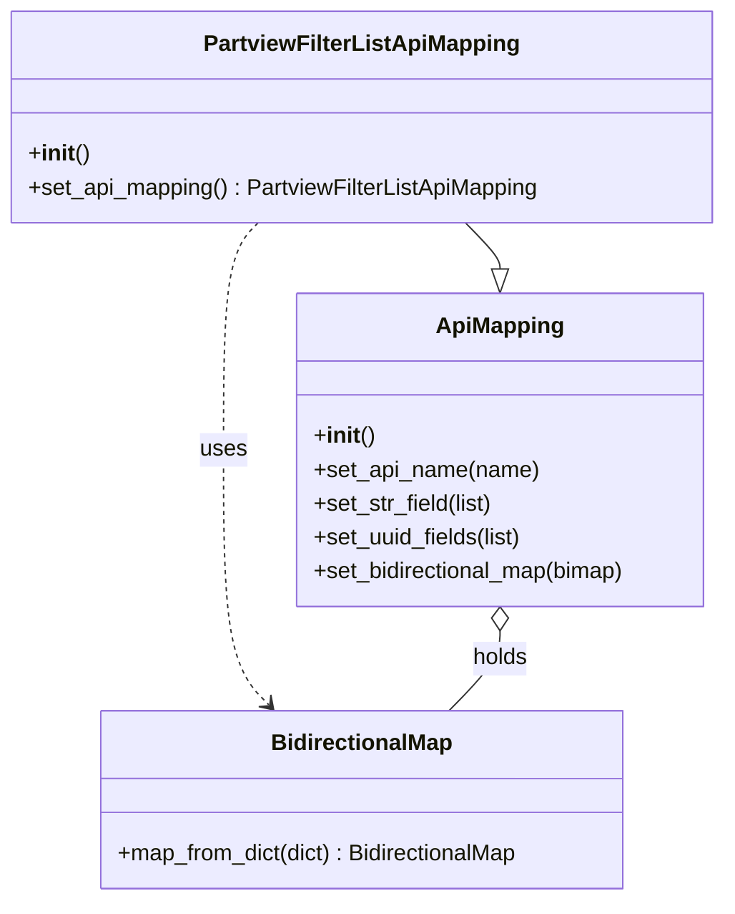

# Diagram: partview_core/partview_service/partview_service/api/partview_filter_list/handlers/mapping/PartviewFilterListApiMapping.py

> Auto-generated by Obscura crawlers

## Mermaid

### SVG

<svg id="container" width="512.3203125" xmlns="http://www.w3.org/2000/svg" class="classDiagram" height="638" viewBox="0 0 512.3203125 638" role="graphics-document document" aria-roledescription="class"><g><defs><marker id="container_class-aggregationStart" class="marker aggregation class" refX="18" refY="7" markerWidth="190" markerHeight="240" orient="auto"><path d="M 18,7 L9,13 L1,7 L9,1 Z"></path></marker></defs><defs><marker id="container_class-aggregationEnd" class="marker aggregation class" refX="1" refY="7" markerWidth="20" markerHeight="28" orient="auto"><path d="M 18,7 L9,13 L1,7 L9,1 Z"></path></marker></defs><defs><marker id="container_class-extensionStart" class="marker extension class" refX="18" refY="7" markerWidth="190" markerHeight="240" orient="auto"><path d="M 1,7 L18,13 V 1 Z"></path></marker></defs><defs><marker id="container_class-extensionEnd" class="marker extension class" refX="1" refY="7" markerWidth="20" markerHeight="28" orient="auto"><path d="M 1,1 V 13 L18,7 Z"></path></marker></defs><defs><marker id="container_class-compositionStart" class="marker composition class" refX="18" refY="7" markerWidth="190" markerHeight="240" orient="auto"><path d="M 18,7 L9,13 L1,7 L9,1 Z"></path></marker></defs><defs><marker id="container_class-compositionEnd" class="marker composition class" refX="1" refY="7" markerWidth="20" markerHeight="28" orient="auto"><path d="M 18,7 L9,13 L1,7 L9,1 Z"></path></marker></defs><defs><marker id="container_class-dependencyStart" class="marker dependency class" refX="6" refY="7" markerWidth="190" markerHeight="240" orient="auto"><path d="M 5,7 L9,13 L1,7 L9,1 Z"></path></marker></defs><defs><marker id="container_class-dependencyEnd" class="marker dependency class" refX="13" refY="7" markerWidth="20" markerHeight="28" orient="auto"><path d="M 18,7 L9,13 L14,7 L9,1 Z"></path></marker></defs><defs><marker id="container_class-lollipopStart" class="marker lollipop class" refX="13" refY="7" markerWidth="190" markerHeight="240" orient="auto"><circle stroke="black" fill="transparent" cx="7" cy="7" r="6"></circle></marker></defs><defs><marker id="container_class-lollipopEnd" class="marker lollipop class" refX="1" refY="7" markerWidth="190" markerHeight="240" orient="auto"><circle stroke="black" fill="transparent" cx="7" cy="7" r="6"></circle></marker></defs><g class="root"><g class="clusters"></g><g class="edgePaths"><path d="M330.684,158L334.824,162.167C338.965,166.333,347.245,174.667,351.385,180.125C355.525,185.583,355.525,188.167,355.525,189.458L355.525,190.75" id="id_PartviewFilterListApiMapping_ApiMapping_1" class="edge-thickness-normal edge-pattern-solid relation" style=";;;" data-edge="true" data-et="edge" data-id="id_PartviewFilterListApiMapping_ApiMapping_1" data-points="W3sieCI6MzMwLjY4NDA4MjAzMTI1LCJ5IjoxNTh9LHsieCI6MzU1LjUyNTM5MDYyNSwieSI6MTgzfSx7IngiOjM1NS41MjUzOTA2MjUsInkiOjIwOH1d" marker-end="url(#container_class-extensionEnd)"></path><path d="M181.636,158L177.496,162.167C173.356,166.333,165.075,174.667,160.935,201.5C156.795,228.333,156.795,273.667,156.795,321C156.795,368.333,156.795,417.667,162.218,447.791C167.64,477.915,178.486,488.829,183.908,494.287L189.331,499.744" id="id_PartviewFilterListApiMapping_BidirectionalMap_2" class="edge-thickness-normal edge-pattern-dashed relation" style=";;;" data-edge="true" data-et="edge" data-id="id_PartviewFilterListApiMapping_BidirectionalMap_2" data-points="W3sieCI6MTgxLjYzNjIzMDQ2ODc1LCJ5IjoxNTh9LHsieCI6MTU2Ljc5NDkyMTg3NSwieSI6MTgzfSx7IngiOjE1Ni43OTQ5MjE4NzUsInkiOjMxOX0seyJ4IjoxNTYuNzk0OTIxODc1LCJ5Ijo0Njd9LHsieCI6MTkzLjU2MDA1ODU5Mzc1LCJ5Ijo1MDR9XQ==" marker-end="url(#container_class-dependencyEnd)"></path><path d="M355.525,447.25L355.525,450.542C355.525,453.833,355.525,460.417,349.398,469.875C343.27,479.333,331.015,491.667,324.888,497.833L318.76,504" id="id_ApiMapping_BidirectionalMap_3" class="edge-thickness-normal edge-pattern-solid relation" style=";;;" data-edge="true" data-et="edge" data-id="id_ApiMapping_BidirectionalMap_3" data-points="W3sieCI6MzU1LjUyNTM5MDYyNSwieSI6NDMwfSx7IngiOjM1NS41MjUzOTA2MjUsInkiOjQ2N30seyJ4IjozMTguNzYwMjUzOTA2MjUsInkiOjUwNH1d" marker-start="url(#container_class-aggregationStart)"></path></g><g class="edgeLabels"><g class="edgeLabel"><g class="label" data-id="id_PartviewFilterListApiMapping_ApiMapping_1" transform="translate(0, 0)"><foreignObject width="0" height="0">

</foreignObject></g></g><g class="edgeLabel" transform="translate(156.794921875, 319)"><g class="label" data-id="id_PartviewFilterListApiMapping_BidirectionalMap_2" transform="translate(-16.4921875, -12)"><foreignObject width="32.984375" height="24">

uses

</foreignObject></g></g><g class="edgeLabel" transform="translate(355.525390625, 467)"><g class="label" data-id="id_ApiMapping_BidirectionalMap_3" transform="translate(-20.1875, -12)"><foreignObject width="40.375" height="24">

holds

</foreignObject></g></g></g><g class="nodes"><g class="node default" id="classId-ApiMapping-0" transform="translate(355.525390625, 319)"><g class="basic label-container"><path d="M-147.23828125 -111 L147.23828125 -111 L147.23828125 111 L-147.23828125 111" stroke="none" stroke-width="0" fill="#ECECFF" style=""></path><path d="M-147.23828125 -111 C-82.72338162027059 -111, -18.208481990541173 -111, 147.23828125 -111 M-147.23828125 -111 C-73.9169332730968 -111, -0.5955852961936046 -111, 147.23828125 -111 M147.23828125 -111 C147.23828125 -24.61827704424796, 147.23828125 61.76344591150408, 147.23828125 111 M147.23828125 -111 C147.23828125 -56.47611044779137, 147.23828125 -1.952220895582741, 147.23828125 111 M147.23828125 111 C65.65517026924591 111, -15.927940711508171 111, -147.23828125 111 M147.23828125 111 C54.724093052025964 111, -37.79009514594807 111, -147.23828125 111 M-147.23828125 111 C-147.23828125 23.723277463741056, -147.23828125 -63.55344507251789, -147.23828125 -111 M-147.23828125 111 C-147.23828125 48.71625918294708, -147.23828125 -13.567481634105846, -147.23828125 -111" stroke="#9370DB" stroke-width="1.3" fill="none" stroke-dasharray="0 0" style=""></path></g><g class="annotation-group text" transform="translate(0, -87)"></g><g class="label-group text" transform="translate(-43.2578125, -87)"><g class="label" style="font-weight: bolder" transform="translate(0,-12)"><foreignObject width="86.515625" height="24">

ApiMapping

</foreignObject></g></g><g class="members-group text" transform="translate(-135.23828125, -39)"></g><g class="methods-group text" transform="translate(-135.23828125, -9)"><g class="label" style="" transform="translate(0,-12)"><foreignObject width="42.796875" height="24">

+<strong>init</strong>()

</foreignObject></g><g class="label" style="" transform="translate(0,12)"><foreignObject width="160.390625" height="24">

+set_api_name(name)

</foreignObject></g><g class="label" style="" transform="translate(0,36)"><foreignObject width="129.34375" height="24">

+set_str_field(list)

</foreignObject></g><g class="label" style="" transform="translate(0,60)"><foreignObject width="151.046875" height="24">

+set_uuid_fields(list)

</foreignObject></g><g class="label" style="" transform="translate(0,84)"><foreignObject width="227.21875" height="24">

+set_bidirectional_map(bimap)

</foreignObject></g></g><g class="divider" style=""><path d="M-147.23828125 -63 C-30.558168708778496 -63, 86.12194383244301 -63, 147.23828125 -63 M-147.23828125 -63 C-29.882766120123847 -63, 87.4727490097523 -63, 147.23828125 -63" stroke="#9370DB" stroke-width="1.3" fill="none" stroke-dasharray="0 0" style=""></path></g><g class="divider" style=""><path d="M-147.23828125 -39 C-88.25082456496287 -39, -29.263367879925724 -39, 147.23828125 -39 M-147.23828125 -39 C-35.95240609970472 -39, 75.33346905059057 -39, 147.23828125 -39" stroke="#9370DB" stroke-width="1.3" fill="none" stroke-dasharray="0 0" style=""></path></g></g><g class="node default" id="classId-BidirectionalMap-1" transform="translate(256.16015625, 567)"><g class="basic label-container"><path d="M-188.45703125 -63 L188.45703125 -63 L188.45703125 63 L-188.45703125 63" stroke="none" stroke-width="0" fill="#ECECFF" style=""></path><path d="M-188.45703125 -63 C-90.4479583582985 -63, 7.561114533403014 -63, 188.45703125 -63 M-188.45703125 -63 C-80.4566765962661 -63, 27.543678057467787 -63, 188.45703125 -63 M188.45703125 -63 C188.45703125 -19.339990238828065, 188.45703125 24.32001952234387, 188.45703125 63 M188.45703125 -63 C188.45703125 -13.049364686945054, 188.45703125 36.90127062610989, 188.45703125 63 M188.45703125 63 C54.97362428737037 63, -78.50978267525926 63, -188.45703125 63 M188.45703125 63 C66.90921259788793 63, -54.63860605422414 63, -188.45703125 63 M-188.45703125 63 C-188.45703125 24.62759273449, -188.45703125 -13.744814531019998, -188.45703125 -63 M-188.45703125 63 C-188.45703125 34.63851769266053, -188.45703125 6.277035385321049, -188.45703125 -63" stroke="#9370DB" stroke-width="1.3" fill="none" stroke-dasharray="0 0" style=""></path></g><g class="annotation-group text" transform="translate(0, -39)"></g><g class="label-group text" transform="translate(-62.2265625, -39)"><g class="label" style="font-weight: bolder" transform="translate(0,-12)"><foreignObject width="124.453125" height="24">

BidirectionalMap

</foreignObject></g></g><g class="members-group text" transform="translate(-176.45703125, 9)"></g><g class="methods-group text" transform="translate(-176.45703125, 39)"><g class="label" style="" transform="translate(0,-12)"><foreignObject width="290.6875" height="24">

+map_from_dict(dict) : BidirectionalMap

</foreignObject></g></g><g class="divider" style=""><path d="M-188.45703125 -15 C-57.17819481360266 -15, 74.10064162279468 -15, 188.45703125 -15 M-188.45703125 -15 C-67.39797136028818 -15, 53.66108852942364 -15, 188.45703125 -15" stroke="#9370DB" stroke-width="1.3" fill="none" stroke-dasharray="0 0" style=""></path></g><g class="divider" style=""><path d="M-188.45703125 9 C-76.38641340466677 9, 35.68420444066646 9, 188.45703125 9 M-188.45703125 9 C-42.66424965781749 9, 103.12853193436501 9, 188.45703125 9" stroke="#9370DB" stroke-width="1.3" fill="none" stroke-dasharray="0 0" style=""></path></g></g><g class="node default" id="classId-PartviewFilterListApiMapping-2" transform="translate(256.16015625, 83)"><g class="basic label-container"><path d="M-248.16015625 -75 L248.16015625 -75 L248.16015625 75 L-248.16015625 75" stroke="none" stroke-width="0" fill="#ECECFF" style=""></path><path d="M-248.16015625 -75 C-122.86922197038133 -75, 2.4217123092373356 -75, 248.16015625 -75 M-248.16015625 -75 C-60.78728195647082 -75, 126.58559233705836 -75, 248.16015625 -75 M248.16015625 -75 C248.16015625 -17.272133827974315, 248.16015625 40.45573234405137, 248.16015625 75 M248.16015625 -75 C248.16015625 -37.906126727276906, 248.16015625 -0.8122534545538116, 248.16015625 75 M248.16015625 75 C87.46037585319243 75, -73.23940454361514 75, -248.16015625 75 M248.16015625 75 C120.04116830028823 75, -8.077819649423532 75, -248.16015625 75 M-248.16015625 75 C-248.16015625 40.01990490022147, -248.16015625 5.039809800442939, -248.16015625 -75 M-248.16015625 75 C-248.16015625 18.39936124306965, -248.16015625 -38.2012775138607, -248.16015625 -75" stroke="#9370DB" stroke-width="1.3" fill="none" stroke-dasharray="0 0" style=""></path></g><g class="annotation-group text" transform="translate(0, -51)"></g><g class="label-group text" transform="translate(-107.2265625, -51)"><g class="label" style="font-weight: bolder" transform="translate(0,-12)"><foreignObject width="214.453125" height="24">

PartviewFilterListApiMapping

</foreignObject></g></g><g class="members-group text" transform="translate(-236.16015625, -3)"></g><g class="methods-group text" transform="translate(-236.16015625, 27)"><g class="label" style="" transform="translate(0,-12)"><foreignObject width="42.796875" height="24">

+<strong>init</strong>()

</foreignObject></g><g class="label" style="" transform="translate(0,12)"><foreignObject width="365.09375" height="24">

+set_api_mapping() : PartviewFilterListApiMapping

</foreignObject></g></g><g class="divider" style=""><path d="M-248.16015625 -27 C-67.65955573346409 -27, 112.84104478307182 -27, 248.16015625 -27 M-248.16015625 -27 C-77.82030048280245 -27, 92.5195552843951 -27, 248.16015625 -27" stroke="#9370DB" stroke-width="1.3" fill="none" stroke-dasharray="0 0" style=""></path></g><g class="divider" style=""><path d="M-248.16015625 -3 C-60.753127094611074 -3, 126.65390206077785 -3, 248.16015625 -3 M-248.16015625 -3 C-129.88470954809804 -3, -11.609262846196117 -3, 248.16015625 -3" stroke="#9370DB" stroke-width="1.3" fill="none" stroke-dasharray="0 0" style=""></path></g></g></g></g></g></svg>
