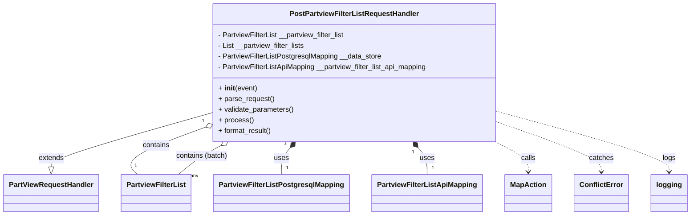

# Diagram: partview_core/partview_service/partview_service/api/partview_filter_list/handlers/post_partview_filter_list.py


> Auto-generated by Obscura crawlers

## Diagram 1



### SVG

<svg id="container" width="1501.625" xmlns="http://www.w3.org/2000/svg" class="classDiagram" height="486" viewBox="0 0 1501.625 486" role="graphics-document document" aria-roledescription="class"><style>#container{font-family:"trebuchet ms",verdana,arial,sans-serif;font-size:16px;fill:#333;}@keyframes edge-animation-frame{from{stroke-dashoffset:0;}}@keyframes dash{to{stroke-dashoffset:0;}}#container .edge-animation-slow{stroke-dasharray:9,5!important;stroke-dashoffset:900;animation:dash 50s linear infinite;stroke-linecap:round;}#container .edge-animation-fast{stroke-dasharray:9,5!important;stroke-dashoffset:900;animation:dash 20s linear infinite;stroke-linecap:round;}#container .error-icon{fill:#552222;}#container .error-text{fill:#552222;stroke:#552222;}#container .edge-thickness-normal{stroke-width:1px;}#container .edge-thickness-thick{stroke-width:3.5px;}#container .edge-pattern-solid{stroke-dasharray:0;}#container .edge-thickness-invisible{stroke-width:0;fill:none;}#container .edge-pattern-dashed{stroke-dasharray:3;}#container .edge-pattern-dotted{stroke-dasharray:2;}#container .marker{fill:#333333;stroke:#333333;}#container .marker.cross{stroke:#333333;}#container svg{font-family:"trebuchet ms",verdana,arial,sans-serif;font-size:16px;}#container p{margin:0;}#container g.classGroup text{fill:#9370DB;stroke:none;font-family:"trebuchet ms",verdana,arial,sans-serif;font-size:10px;}#container g.classGroup text .title{font-weight:bolder;}#container .nodeLabel,#container .edgeLabel{color:#131300;}#container .edgeLabel .label rect{fill:#ECECFF;}#container .label text{fill:#131300;}#container .labelBkg{background:#ECECFF;}#container .edgeLabel .label span{background:#ECECFF;}#container .classTitle{font-weight:bolder;}#container .node rect,#container .node circle,#container .node ellipse,#container .node polygon,#container .node path{fill:#ECECFF;stroke:#9370DB;stroke-width:1px;}#container .divider{stroke:#9370DB;stroke-width:1;}#container g.clickable{cursor:pointer;}#container g.classGroup rect{fill:#ECECFF;stroke:#9370DB;}#container g.classGroup line{stroke:#9370DB;stroke-width:1;}#container .classLabel .box{stroke:none;stroke-width:0;fill:#ECECFF;opacity:0.5;}#container .classLabel .label{fill:#9370DB;font-size:10px;}#container .relation{stroke:#333333;stroke-width:1;fill:none;}#container .dashed-line{stroke-dasharray:3;}#container .dotted-line{stroke-dasharray:1 2;}#container #compositionStart,#container .composition{fill:#333333!important;stroke:#333333!important;stroke-width:1;}#container #compositionEnd,#container .composition{fill:#333333!important;stroke:#333333!important;stroke-width:1;}#container #dependencyStart,#container .dependency{fill:#333333!important;stroke:#333333!important;stroke-width:1;}#container #dependencyStart,#container .dependency{fill:#333333!important;stroke:#333333!important;stroke-width:1;}#container #extensionStart,#container .extension{fill:transparent!important;stroke:#333333!important;stroke-width:1;}#container #extensionEnd,#container .extension{fill:transparent!important;stroke:#333333!important;stroke-width:1;}#container #aggregationStart,#container .aggregation{fill:transparent!important;stroke:#333333!important;stroke-width:1;}#container #aggregationEnd,#container .aggregation{fill:transparent!important;stroke:#333333!important;stroke-width:1;}#container #lollipopStart,#container .lollipop{fill:#ECECFF!important;stroke:#333333!important;stroke-width:1;}#container #lollipopEnd,#container .lollipop{fill:#ECECFF!important;stroke:#333333!important;stroke-width:1;}#container .edgeTerminals{font-size:11px;line-height:initial;}#container .classTitleText{text-anchor:middle;font-size:18px;fill:#333;}#container .label-icon{display:inline-block;height:1em;overflow:visible;vertical-align:-0.125em;}#container .node .label-icon path{fill:currentColor;stroke:revert;stroke-width:revert;}#container :root{--mermaid-font-family:"trebuchet ms",verdana,arial,sans-serif;}</style><g><defs><marker id="container_class-aggregationStart" class="marker aggregation class" refX="18" refY="7" markerWidth="190" markerHeight="240" orient="auto"><path d="M 18,7 L9,13 L1,7 L9,1 Z"></path></marker></defs><defs><marker id="container_class-aggregationEnd" class="marker aggregation class" refX="1" refY="7" markerWidth="20" markerHeight="28" orient="auto"><path d="M 18,7 L9,13 L1,7 L9,1 Z"></path></marker></defs><defs><marker id="container_class-extensionStart" class="marker extension class" refX="18" refY="7" markerWidth="190" markerHeight="240" orient="auto"><path d="M 1,7 L18,13 V 1 Z"></path></marker></defs><defs><marker id="container_class-extensionEnd" class="marker extension class" refX="1" refY="7" markerWidth="20" markerHeight="28" orient="auto"><path d="M 1,1 V 13 L18,7 Z"></path></marker></defs><defs><marker id="container_class-compositionStart" class="marker composition class" refX="18" refY="7" markerWidth="190" markerHeight="240" orient="auto"><path d="M 18,7 L9,13 L1,7 L9,1 Z"></path></marker></defs><defs><marker id="container_class-compositionEnd" class="marker composition class" refX="1" refY="7" markerWidth="20" markerHeight="28" orient="auto"><path d="M 18,7 L9,13 L1,7 L9,1 Z"></path></marker></defs><defs><marker id="container_class-dependencyStart" class="marker dependency class" refX="6" refY="7" markerWidth="190" markerHeight="240" orient="auto"><path d="M 5,7 L9,13 L1,7 L9,1 Z"></path></marker></defs><defs><marker id="container_class-dependencyEnd" class="marker dependency class" refX="13" refY="7" markerWidth="20" markerHeight="28" orient="auto"><path d="M 18,7 L9,13 L14,7 L9,1 Z"></path></marker></defs><defs><marker id="container_class-lollipopStart" class="marker lollipop class" refX="13" refY="7" markerWidth="190" markerHeight="240" orient="auto"><circle stroke="black" fill="transparent" cx="7" cy="7" r="6"></circle></marker></defs><defs><marker id="container_class-lollipopEnd" class="marker lollipop class" refX="1" refY="7" markerWidth="190" markerHeight="240" orient="auto"><circle stroke="black" fill="transparent" cx="7" cy="7" r="6"></circle></marker></defs><g class="root"><g class="clusters"></g><g class="edgePaths"><path d="M450.379,257.783L393.876,274.319C337.372,290.855,224.366,323.928,167.863,343.756C111.359,363.583,111.359,370.167,111.359,373.458L111.359,376.75" id="id_PostPartviewFilterListRequestHandler_PartViewRequestHandler_1" class="edge-thickness-normal edge-pattern-solid relation" style=";;;" data-edge="true" data-et="edge" data-id="id_PostPartviewFilterListRequestHandler_PartViewRequestHandler_1" data-points="W3sieCI6NDUwLjM3ODkwNjI1LCJ5IjoyNTcuNzgzMTk1NjE2NzYyOX0seyJ4IjoxMTEuMzU5Mzc1LCJ5IjozNTd9LHsieCI6MTExLjM1OTM3NSwieSI6Mzk0fV0=" marker-end="url(#container_class-extensionEnd)"></path><path d="M434.265,292.601L406.175,303.334C378.084,314.067,321.903,335.534,299.665,352.433C277.426,369.333,289.129,381.667,294.981,387.833L300.833,394" id="id_PostPartviewFilterListRequestHandler_PartviewFilterList_2" class="edge-thickness-normal edge-pattern-solid relation" style=";;;" data-edge="true" data-et="edge" data-id="id_PostPartviewFilterListRequestHandler_PartviewFilterList_2" data-points="W3sieCI6NDUwLjM3ODkwNjI1LCJ5IjoyODYuNDQzNjg0ODQ1NDg1Mn0seyJ4IjoyNjUuNzIyNjU2MjUsInkiOjM1N30seyJ4IjozMDAuODMyNzcyOTQzMDM4LCJ5IjozOTR9XQ==" marker-start="url(#container_class-aggregationStart)"></path><path d="M479.809,328.488L471.401,333.24C462.994,337.992,446.178,347.496,430.849,358.415C415.519,369.333,401.675,381.667,394.754,387.833L387.832,394" id="id_PostPartviewFilterListRequestHandler_PartviewFilterList_3" class="edge-thickness-normal edge-pattern-solid relation" style=";;;" data-edge="true" data-et="edge" data-id="id_PostPartviewFilterListRequestHandler_PartviewFilterList_3" data-points="W3sieCI6NDk0LjgyNjIwMjIzNDQ1NTkzLCJ5IjozMjB9LHsieCI6NDI5LjM2MzI4MTI1LCJ5IjozNTd9LHsieCI6Mzg3LjgzMTU4NjIzNDE3NzIsInkiOjM5NH1d" marker-start="url(#container_class-aggregationStart)"></path><path d="M632.364,333.354L629.142,337.295C625.92,341.236,619.476,349.118,616.253,359.226C613.031,369.333,613.031,381.667,613.031,387.833L613.031,394" id="id_PostPartviewFilterListRequestHandler_PartviewFilterListPostgresqlMapping_4" class="edge-thickness-normal edge-pattern-solid relation" style=";;;" data-edge="true" data-et="edge" data-id="id_PostPartviewFilterListRequestHandler_PartviewFilterListPostgresqlMapping_4" data-points="W3sieCI6NjQzLjI4MzIxMzI0NDgxODYsInkiOjMyMH0seyJ4Ijo2MTMuMDMxMjUsInkiOjM1N30seyJ4Ijo2MTMuMDMxMjUsInkiOjM5NH1d" marker-start="url(#container_class-compositionStart)"></path><path d="M909.3,333.354L912.522,337.295C915.744,341.236,922.188,349.118,925.411,359.226C928.633,369.333,928.633,381.667,928.633,387.833L928.633,394" id="id_PostPartviewFilterListRequestHandler_PartviewFilterListApiMapping_5" class="edge-thickness-normal edge-pattern-solid relation" style=";;;" data-edge="true" data-et="edge" data-id="id_PostPartviewFilterListRequestHandler_PartviewFilterListApiMapping_5" data-points="W3sieCI6ODk4LjM4MDg0OTI1NTE4MTQsInkiOjMyMH0seyJ4Ijo5MjguNjMyODEyNSwieSI6MzU3fSx7IngiOjkyOC42MzI4MTI1LCJ5IjozOTR9XQ==" marker-start="url(#container_class-compositionStart)"></path><path d="M1076.091,320L1088.158,326.167C1100.225,332.333,1124.358,344.667,1136.425,356C1148.492,367.333,1148.492,377.667,1148.492,382.833L1148.492,388" id="id_PostPartviewFilterListRequestHandler_MapAction_6" class="edge-thickness-normal edge-pattern-dashed relation" style=";;;" data-edge="true" data-et="edge" data-id="id_PostPartviewFilterListRequestHandler_MapAction_6" data-points="W3sieCI6MTA3Ni4wOTEwMTc2NDg5NjM4LCJ5IjozMjB9LHsieCI6MTE0OC40OTIxODc1LCJ5IjozNTd9LHsieCI6MTE0OC40OTIxODc1LCJ5IjozOTR9XQ==" marker-end="url(#container_class-dependencyEnd)"></path><path d="M1091.285,279.294L1127.282,292.245C1163.279,305.196,1235.272,331.098,1271.269,349.216C1307.266,367.333,1307.266,377.667,1307.266,382.833L1307.266,388" id="id_PostPartviewFilterListRequestHandler_ConflictError_7" class="edge-thickness-normal edge-pattern-dashed relation" style=";;;" data-edge="true" data-et="edge" data-id="id_PostPartviewFilterListRequestHandler_ConflictError_7" data-points="W3sieCI6MTA5MS4yODUxNTYyNSwieSI6Mjc5LjI5Mzc3MzI1NjUzMzY1fSx7IngiOjEzMDcuMjY1NjI1LCJ5IjozNTd9LHsieCI6MTMwNy4yNjU2MjUsInkiOjM5NH1d" marker-end="url(#container_class-dependencyEnd)"></path><path d="M1091.285,254.462L1151.824,271.552C1212.362,288.641,1333.439,322.821,1393.977,345.077C1454.516,367.333,1454.516,377.667,1454.516,382.833L1454.516,388" id="id_PostPartviewFilterListRequestHandler_logging_8" class="edge-thickness-normal edge-pattern-dashed relation" style=";;;" data-edge="true" data-et="edge" data-id="id_PostPartviewFilterListRequestHandler_logging_8" data-points="W3sieCI6MTA5MS4yODUxNTYyNSwieSI6MjU0LjQ2MjA5OTI2Njk1MzV9LHsieCI6MTQ1NC41MTU2MjUsInkiOjM1N30seyJ4IjoxNDU0LjUxNTYyNSwieSI6Mzk0fV0=" marker-end="url(#container_class-dependencyEnd)"></path></g><g class="edgeLabels"><g class="edgeLabel" transform="translate(111.359375, 357)"><g class="label" data-id="id_PostPartviewFilterListRequestHandler_PartViewRequestHandler_1" transform="translate(-28.5078125, -12)"><foreignObject width="57.015625" height="24"><div xmlns="http://www.w3.org/1999/xhtml" class="labelBkg" style="display: table-cell; white-space: nowrap; line-height: 1.5; max-width: 200px; text-align: center;"><span class="edgeLabel"><p>extends</p></span></div></foreignObject></g></g><g class="edgeLabel" transform="translate(334.22712, 330.82476)"><g class="label" data-id="id_PostPartviewFilterListRequestHandler_PartviewFilterList_2" transform="translate(-30.890625, -12)"><foreignObject width="61.78125" height="24"><div xmlns="http://www.w3.org/1999/xhtml" class="labelBkg" style="display: table-cell; white-space: nowrap; line-height: 1.5; max-width: 200px; text-align: center;"><span class="edgeLabel"><p>contains</p></span></div></foreignObject></g></g><g class="edgeLabel" transform="translate(437.8831, 352.18455)"><g class="label" data-id="id_PostPartviewFilterListRequestHandler_PartviewFilterList_3" transform="translate(-58.5, -12)"><foreignObject width="117" height="24"><div xmlns="http://www.w3.org/1999/xhtml" class="labelBkg" style="display: table-cell; white-space: nowrap; line-height: 1.5; max-width: 200px; text-align: center;"><span class="edgeLabel"><p>contains (batch)</p></span></div></foreignObject></g></g><g class="edgeLabel" transform="translate(613.03125, 357)"><g class="label" data-id="id_PostPartviewFilterListRequestHandler_PartviewFilterListPostgresqlMapping_4" transform="translate(-16.4921875, -12)"><foreignObject width="32.984375" height="24"><div xmlns="http://www.w3.org/1999/xhtml" class="labelBkg" style="display: table-cell; white-space: nowrap; line-height: 1.5; max-width: 200px; text-align: center;"><span class="edgeLabel"><p>uses</p></span></div></foreignObject></g></g><g class="edgeLabel" transform="translate(928.6328125, 357)"><g class="label" data-id="id_PostPartviewFilterListRequestHandler_PartviewFilterListApiMapping_5" transform="translate(-16.4921875, -12)"><foreignObject width="32.984375" height="24"><div xmlns="http://www.w3.org/1999/xhtml" class="labelBkg" style="display: table-cell; white-space: nowrap; line-height: 1.5; max-width: 200px; text-align: center;"><span class="edgeLabel"><p>uses</p></span></div></foreignObject></g></g><g class="edgeLabel" transform="translate(1148.4921875, 357)"><g class="label" data-id="id_PostPartviewFilterListRequestHandler_MapAction_6" transform="translate(-16.4453125, -12)"><foreignObject width="32.890625" height="24"><div xmlns="http://www.w3.org/1999/xhtml" class="labelBkg" style="display: table-cell; white-space: nowrap; line-height: 1.5; max-width: 200px; text-align: center;"><span class="edgeLabel"><p>calls</p></span></div></foreignObject></g></g><g class="edgeLabel" transform="translate(1307.265625, 357)"><g class="label" data-id="id_PostPartviewFilterListRequestHandler_ConflictError_7" transform="translate(-27.4765625, -12)"><foreignObject width="54.953125" height="24"><div xmlns="http://www.w3.org/1999/xhtml" class="labelBkg" style="display: table-cell; white-space: nowrap; line-height: 1.5; max-width: 200px; text-align: center;"><span class="edgeLabel"><p>catches</p></span></div></foreignObject></g></g><g class="edgeLabel" transform="translate(1454.515625, 357)"><g class="label" data-id="id_PostPartviewFilterListRequestHandler_logging_8" transform="translate(-14.8203125, -12)"><foreignObject width="29.640625" height="24"><div xmlns="http://www.w3.org/1999/xhtml" class="labelBkg" style="display: table-cell; white-space: nowrap; line-height: 1.5; max-width: 200px; text-align: center;"><span class="edgeLabel"><p>logs</p></span></div></foreignObject></g></g><g class="edgeTerminals" transform="translate(428.67768008013593, 278.6779362955774)"><g class="inner" transform="translate(0, 0)"><foreignObject style="width: 9px; height: 12px;"><div xmlns="http://www.w3.org/1999/xhtml" style="display: inline-block; padding-right: 1px; white-space: nowrap;"><span class="edgeLabel">1</span></div></foreignObject></g></g><g class="edgeTerminals" transform="translate(472.2105343252905, 315.55235625662704)"><g class="inner" transform="translate(0, 0)"><foreignObject style="width: 9px; height: 12px;"><div xmlns="http://www.w3.org/1999/xhtml" style="display: inline-block; padding-right: 1px; white-space: nowrap;"><span class="edgeLabel">1</span></div></foreignObject></g></g><g class="edgeTerminals" transform="translate(620.5935533454159, 324.05331800554285)"><g class="inner" transform="translate(0, 0)"><foreignObject style="width: 9px; height: 12px;"><div xmlns="http://www.w3.org/1999/xhtml" style="display: inline-block; padding-right: 1px; white-space: nowrap;"><span class="edgeLabel">1</span></div></foreignObject></g></g><g class="edgeTerminals" transform="translate(897.8454008255626, 343.04264135230767)"><g class="inner" transform="translate(0, 0)"><foreignObject style="width: 9px; height: 12px;"><div xmlns="http://www.w3.org/1999/xhtml" style="display: inline-block; padding-right: 1px; white-space: nowrap;"><span class="edgeLabel">1</span></div></foreignObject></g></g><g class="edgeTerminals" transform="translate(294.6676974636366, 365.98060418934284)"><g class="inner" transform="translate(0, 0)"></g><foreignObject style="width: 9px; height: 12px;"><div xmlns="http://www.w3.org/1999/xhtml" style="display: inline-block; padding-right: 1px; white-space: nowrap;"><span class="edgeLabel">1</span></div></foreignObject></g><g class="edgeTerminals" transform="translate(405.87622845999095, 388.5590920863089)"><g class="inner" transform="translate(0, 0)"></g><foreignObject style="width: 36px; height: 12px;"><div xmlns="http://www.w3.org/1999/xhtml" style="display: inline-block; padding-right: 1px; white-space: nowrap;"><span class="edgeLabel">many</span></div></foreignObject></g><g class="edgeTerminals" transform="translate(623.03125, 371.5)"><g class="inner" transform="translate(0, 0)"></g><foreignObject style="width: 9px; height: 12px;"><div xmlns="http://www.w3.org/1999/xhtml" style="display: inline-block; padding-right: 1px; white-space: nowrap;"><span class="edgeLabel">1</span></div></foreignObject></g><g class="edgeTerminals" transform="translate(938.63281125, 371.4999989285714)"><g class="inner" transform="translate(0, 0)"></g><foreignObject style="width: 9px; height: 12px;"><div xmlns="http://www.w3.org/1999/xhtml" style="display: inline-block; padding-right: 1px; white-space: nowrap;"><span class="edgeLabel">1</span></div></foreignObject></g></g><g class="nodes"><g class="node default" id="classId-PostPartviewFilterListRequestHandler-0" transform="translate(770.83203125, 164)"><g class="basic label-container"><path d="M-320.453125 -156 L320.453125 -156 L320.453125 156 L-320.453125 156" stroke="none" stroke-width="0" fill="#ECECFF" style=""></path><path d="M-320.453125 -156 C-153.43197632570633 -156, 13.58917234858734 -156, 320.453125 -156 M-320.453125 -156 C-117.21837830700375 -156, 86.01636838599251 -156, 320.453125 -156 M320.453125 -156 C320.453125 -86.06311534917846, 320.453125 -16.12623069835692, 320.453125 156 M320.453125 -156 C320.453125 -63.41866449818893, 320.453125 29.162671003622137, 320.453125 156 M320.453125 156 C158.31584623606224 156, -3.8214325278755155 156, -320.453125 156 M320.453125 156 C182.80683462598108 156, 45.160544251962165 156, -320.453125 156 M-320.453125 156 C-320.453125 41.3948827287216, -320.453125 -73.2102345425568, -320.453125 -156 M-320.453125 156 C-320.453125 57.946528364888806, -320.453125 -40.10694327022239, -320.453125 -156" stroke="#9370DB" stroke-width="1.3" fill="none" stroke-dasharray="0 0" style=""></path></g><g class="annotation-group text" transform="translate(0, -132)"></g><g class="label-group text" transform="translate(-139.21875, -132)"><g class="label" style="font-weight: bolder" transform="translate(0,-12)"><foreignObject width="278.4375" height="24"><div xmlns="http://www.w3.org/1999/xhtml" style="display: table-cell; white-space: nowrap; line-height: 1.5; max-width: 323px; text-align: center;"><span class="nodeLabel markdown-node-label" style=""><p>PostPartviewFilterListRequestHandler</p></span></div></foreignObject></g></g><g class="members-group text" transform="translate(-308.453125, -84)"><g class="label" style="" transform="translate(0,-12)"><foreignObject width="289.46875" height="24"><div xmlns="http://www.w3.org/1999/xhtml" style="display: table-cell; white-space: nowrap; line-height: 1.5; max-width: 347px; text-align: center;"><span class="nodeLabel markdown-node-label" style=""><p>- PartviewFilterList __partview_filter_list</p></span></div></foreignObject></g><g class="label" style="" transform="translate(0,12)"><foreignObject width="198.4375" height="24"><div xmlns="http://www.w3.org/1999/xhtml" style="display: table-cell; white-space: nowrap; line-height: 1.5; max-width: 256px; text-align: center;"><span class="nodeLabel markdown-node-label" style=""><p>- List __partview_filter_lists</p></span></div></foreignObject></g><g class="label" style="" transform="translate(0,36)"><foreignObject width="371.046875" height="24"><div xmlns="http://www.w3.org/1999/xhtml" style="display: table-cell; white-space: nowrap; line-height: 1.5; max-width: 428px; text-align: center;"><span class="nodeLabel markdown-node-label" style=""><p>- PartviewFilterListPostgresqlMapping __data_store</p></span></div></foreignObject></g><g class="label" style="" transform="translate(0,60)"><foreignObject width="477.6875" height="24"><div xmlns="http://www.w3.org/1999/xhtml" style="display: table-cell; white-space: nowrap; line-height: 1.5; max-width: 536px; text-align: center;"><span class="nodeLabel markdown-node-label" style=""><p>- PartviewFilterListApiMapping __partview_filter_list_api_mapping</p></span></div></foreignObject></g></g><g class="methods-group text" transform="translate(-308.453125, 36)"><g class="label" style="" transform="translate(0,-12)"><foreignObject width="87.390625" height="24"><div xmlns="http://www.w3.org/1999/xhtml" style="display: table-cell; white-space: nowrap; line-height: 1.5; max-width: 177px; text-align: center;"><span class="nodeLabel markdown-node-label" style=""><p>+ <strong>init</strong>(event)</p></span></div></foreignObject></g><g class="label" style="" transform="translate(0,12)"><foreignObject width="126.046875" height="24"><div xmlns="http://www.w3.org/1999/xhtml" style="display: table-cell; white-space: nowrap; line-height: 1.5; max-width: 183px; text-align: center;"><span class="nodeLabel markdown-node-label" style=""><p>+ parse_request()</p></span></div></foreignObject></g><g class="label" style="" transform="translate(0,36)"><foreignObject width="170.953125" height="24"><div xmlns="http://www.w3.org/1999/xhtml" style="display: table-cell; white-space: nowrap; line-height: 1.5; max-width: 228px; text-align: center;"><span class="nodeLabel markdown-node-label" style=""><p>+ validate_parameters()</p></span></div></foreignObject></g><g class="label" style="" transform="translate(0,60)"><foreignObject width="77.96875" height="24"><div xmlns="http://www.w3.org/1999/xhtml" style="display: table-cell; white-space: nowrap; line-height: 1.5; max-width: 135px; text-align: center;"><span class="nodeLabel markdown-node-label" style=""><p>+ process()</p></span></div></foreignObject></g><g class="label" style="" transform="translate(0,84)"><foreignObject width="121.5" height="24"><div xmlns="http://www.w3.org/1999/xhtml" style="display: table-cell; white-space: nowrap; line-height: 1.5; max-width: 179px; text-align: center;"><span class="nodeLabel markdown-node-label" style=""><p>+ format_result()</p></span></div></foreignObject></g></g><g class="divider" style=""><path d="M-320.453125 -108 C-134.07114872409934 -108, 52.31082755180131 -108, 320.453125 -108 M-320.453125 -108 C-96.25519313505981 -108, 127.94273872988038 -108, 320.453125 -108" stroke="#9370DB" stroke-width="1.3" fill="none" stroke-dasharray="0 0" style=""></path></g><g class="divider" style=""><path d="M-320.453125 12 C-189.39150260464538 12, -58.329880209290764 12, 320.453125 12 M-320.453125 12 C-66.25605241624947 12, 187.94102016750105 12, 320.453125 12" stroke="#9370DB" stroke-width="1.3" fill="none" stroke-dasharray="0 0" style=""></path></g></g><g class="node default" id="classId-PartViewRequestHandler-1" transform="translate(111.359375, 436)"><g class="basic label-container"><path d="M-103.359375 -42 L103.359375 -42 L103.359375 42 L-103.359375 42" stroke="none" stroke-width="0" fill="#ECECFF" style=""></path><path d="M-103.359375 -42 C-53.88560615581449 -42, -4.411837311628986 -42, 103.359375 -42 M-103.359375 -42 C-43.74134558922989 -42, 15.876683821540226 -42, 103.359375 -42 M103.359375 -42 C103.359375 -21.24515203463857, 103.359375 -0.490304069277137, 103.359375 42 M103.359375 -42 C103.359375 -11.060315386639122, 103.359375 19.879369226721757, 103.359375 42 M103.359375 42 C52.31347412110635 42, 1.2675732422127055 42, -103.359375 42 M103.359375 42 C42.977094870552634 42, -17.405185258894733 42, -103.359375 42 M-103.359375 42 C-103.359375 15.305475295918413, -103.359375 -11.389049408163174, -103.359375 -42 M-103.359375 42 C-103.359375 23.189992435287106, -103.359375 4.379984870574212, -103.359375 -42" stroke="#9370DB" stroke-width="1.3" fill="none" stroke-dasharray="0 0" style=""></path></g><g class="annotation-group text" transform="translate(0, -18)"></g><g class="label-group text" transform="translate(-91.359375, -18)"><g class="label" style="font-weight: bolder" transform="translate(0,-12)"><foreignObject width="182.71875" height="24"><div xmlns="http://www.w3.org/1999/xhtml" style="display: table-cell; white-space: nowrap; line-height: 1.5; max-width: 231px; text-align: center;"><span class="nodeLabel markdown-node-label" style=""><p>PartViewRequestHandler</p></span></div></foreignObject></g></g><g class="members-group text" transform="translate(-91.359375, 30)"></g><g class="methods-group text" transform="translate(-91.359375, 60)"></g><g class="divider" style=""><path d="M-103.359375 6 C-60.12842918842162 6, -16.89748337684324 6, 103.359375 6 M-103.359375 6 C-35.13850934613454 6, 33.08235630773092 6, 103.359375 6" stroke="#9370DB" stroke-width="1.3" fill="none" stroke-dasharray="0 0" style=""></path></g><g class="divider" style=""><path d="M-103.359375 24 C-39.499552843382254 24, 24.36026931323549 24, 103.359375 24 M-103.359375 24 C-40.20880262815755 24, 22.9417697436849 24, 103.359375 24" stroke="#9370DB" stroke-width="1.3" fill="none" stroke-dasharray="0 0" style=""></path></g></g><g class="node default" id="classId-PartviewFilterList-2" transform="translate(340.6875, 436)"><g class="basic label-container"><path d="M-75.96875 -42 L75.96875 -42 L75.96875 42 L-75.96875 42" stroke="none" stroke-width="0" fill="#ECECFF" style=""></path><path d="M-75.96875 -42 C-20.790697797487965 -42, 34.38735440502407 -42, 75.96875 -42 M-75.96875 -42 C-30.64997901824581 -42, 14.668791963508383 -42, 75.96875 -42 M75.96875 -42 C75.96875 -20.419922986994994, 75.96875 1.1601540260100123, 75.96875 42 M75.96875 -42 C75.96875 -24.779609374784524, 75.96875 -7.559218749569048, 75.96875 42 M75.96875 42 C16.069491157077735 42, -43.82976768584453 42, -75.96875 42 M75.96875 42 C42.83551129436927 42, 9.702272588738538 42, -75.96875 42 M-75.96875 42 C-75.96875 22.394456244969277, -75.96875 2.7889124899385536, -75.96875 -42 M-75.96875 42 C-75.96875 21.870125228627153, -75.96875 1.7402504572543052, -75.96875 -42" stroke="#9370DB" stroke-width="1.3" fill="none" stroke-dasharray="0 0" style=""></path></g><g class="annotation-group text" transform="translate(0, -18)"></g><g class="label-group text" transform="translate(-63.96875, -18)"><g class="label" style="font-weight: bolder" transform="translate(0,-12)"><foreignObject width="127.9375" height="24"><div xmlns="http://www.w3.org/1999/xhtml" style="display: table-cell; white-space: nowrap; line-height: 1.5; max-width: 174px; text-align: center;"><span class="nodeLabel markdown-node-label" style=""><p>PartviewFilterList</p></span></div></foreignObject></g></g><g class="members-group text" transform="translate(-63.96875, 30)"></g><g class="methods-group text" transform="translate(-63.96875, 60)"></g><g class="divider" style=""><path d="M-75.96875 6 C-21.08005597956872 6, 33.80863804086256 6, 75.96875 6 M-75.96875 6 C-29.60853745533553 6, 16.75167508932894 6, 75.96875 6" stroke="#9370DB" stroke-width="1.3" fill="none" stroke-dasharray="0 0" style=""></path></g><g class="divider" style=""><path d="M-75.96875 24 C-30.52793567146228 24, 14.912878657075439 24, 75.96875 24 M-75.96875 24 C-36.4433531137917 24, 3.082043772416597 24, 75.96875 24" stroke="#9370DB" stroke-width="1.3" fill="none" stroke-dasharray="0 0" style=""></path></g></g><g class="node default" id="classId-PartviewFilterListPostgresqlMapping-3" transform="translate(613.03125, 436)"><g class="basic label-container"><path d="M-146.375 -42 L146.375 -42 L146.375 42 L-146.375 42" stroke="none" stroke-width="0" fill="#ECECFF" style=""></path><path d="M-146.375 -42 C-60.45252238036417 -42, 25.469955239271656 -42, 146.375 -42 M-146.375 -42 C-56.833986134775486 -42, 32.70702773044903 -42, 146.375 -42 M146.375 -42 C146.375 -12.503034428404007, 146.375 16.993931143191986, 146.375 42 M146.375 -42 C146.375 -12.009566038395668, 146.375 17.980867923208663, 146.375 42 M146.375 42 C79.61347975678237 42, 12.851959513564736 42, -146.375 42 M146.375 42 C35.163216853722375 42, -76.04856629255525 42, -146.375 42 M-146.375 42 C-146.375 19.65992856759195, -146.375 -2.680142864816098, -146.375 -42 M-146.375 42 C-146.375 19.932962961287675, -146.375 -2.13407407742465, -146.375 -42" stroke="#9370DB" stroke-width="1.3" fill="none" stroke-dasharray="0 0" style=""></path></g><g class="annotation-group text" transform="translate(0, -18)"></g><g class="label-group text" transform="translate(-134.375, -18)"><g class="label" style="font-weight: bolder" transform="translate(0,-12)"><foreignObject width="268.75" height="24"><div xmlns="http://www.w3.org/1999/xhtml" style="display: table-cell; white-space: nowrap; line-height: 1.5; max-width: 313px; text-align: center;"><span class="nodeLabel markdown-node-label" style=""><p>PartviewFilterListPostgresqlMapping</p></span></div></foreignObject></g></g><g class="members-group text" transform="translate(-134.375, 30)"></g><g class="methods-group text" transform="translate(-134.375, 60)"></g><g class="divider" style=""><path d="M-146.375 6 C-44.03358894700658 6, 58.307822105986844 6, 146.375 6 M-146.375 6 C-51.48336569188966 6, 43.40826861622068 6, 146.375 6" stroke="#9370DB" stroke-width="1.3" fill="none" stroke-dasharray="0 0" style=""></path></g><g class="divider" style=""><path d="M-146.375 24 C-43.30452511158914 24, 59.765949776821714 24, 146.375 24 M-146.375 24 C-50.71032693125025 24, 44.9543461374995 24, 146.375 24" stroke="#9370DB" stroke-width="1.3" fill="none" stroke-dasharray="0 0" style=""></path></g></g><g class="node default" id="classId-PartviewFilterListApiMapping-4" transform="translate(928.6328125, 436)"><g class="basic label-container"><path d="M-119.2265625 -42 L119.2265625 -42 L119.2265625 42 L-119.2265625 42" stroke="none" stroke-width="0" fill="#ECECFF" style=""></path><path d="M-119.2265625 -42 C-27.88565827562722 -42, 63.45524594874556 -42, 119.2265625 -42 M-119.2265625 -42 C-70.06075786741052 -42, -20.89495323482103 -42, 119.2265625 -42 M119.2265625 -42 C119.2265625 -20.733568284975796, 119.2265625 0.5328634300484083, 119.2265625 42 M119.2265625 -42 C119.2265625 -20.458898147543756, 119.2265625 1.0822037049124873, 119.2265625 42 M119.2265625 42 C51.99953440787871 42, -15.227493684242575 42, -119.2265625 42 M119.2265625 42 C33.93597123458949 42, -51.354620030821025 42, -119.2265625 42 M-119.2265625 42 C-119.2265625 9.917782686734597, -119.2265625 -22.164434626530806, -119.2265625 -42 M-119.2265625 42 C-119.2265625 24.787286351412234, -119.2265625 7.574572702824469, -119.2265625 -42" stroke="#9370DB" stroke-width="1.3" fill="none" stroke-dasharray="0 0" style=""></path></g><g class="annotation-group text" transform="translate(0, -18)"></g><g class="label-group text" transform="translate(-107.2265625, -18)"><g class="label" style="font-weight: bolder" transform="translate(0,-12)"><foreignObject width="214.453125" height="24"><div xmlns="http://www.w3.org/1999/xhtml" style="display: table-cell; white-space: nowrap; line-height: 1.5; max-width: 260px; text-align: center;"><span class="nodeLabel markdown-node-label" style=""><p>PartviewFilterListApiMapping</p></span></div></foreignObject></g></g><g class="members-group text" transform="translate(-107.2265625, 30)"></g><g class="methods-group text" transform="translate(-107.2265625, 60)"></g><g class="divider" style=""><path d="M-119.2265625 6 C-27.934455666800503 6, 63.357651166398995 6, 119.2265625 6 M-119.2265625 6 C-37.85214810788561 6, 43.52226628422878 6, 119.2265625 6" stroke="#9370DB" stroke-width="1.3" fill="none" stroke-dasharray="0 0" style=""></path></g><g class="divider" style=""><path d="M-119.2265625 24 C-52.43996675091496 24, 14.346628998170075 24, 119.2265625 24 M-119.2265625 24 C-36.958250553952524 24, 45.31006139209495 24, 119.2265625 24" stroke="#9370DB" stroke-width="1.3" fill="none" stroke-dasharray="0 0" style=""></path></g></g><g class="node default" id="classId-MapAction-5" transform="translate(1148.4921875, 436)"><g class="basic label-container"><path d="M-50.6328125 -42 L50.6328125 -42 L50.6328125 42 L-50.6328125 42" stroke="none" stroke-width="0" fill="#ECECFF" style=""></path><path d="M-50.6328125 -42 C-17.503654155158124 -42, 15.625504189683753 -42, 50.6328125 -42 M-50.6328125 -42 C-22.98588461477215 -42, 4.6610432704557 -42, 50.6328125 -42 M50.6328125 -42 C50.6328125 -9.746658057752278, 50.6328125 22.506683884495445, 50.6328125 42 M50.6328125 -42 C50.6328125 -19.39531150840835, 50.6328125 3.2093769831832972, 50.6328125 42 M50.6328125 42 C29.550262880785283 42, 8.467713261570566 42, -50.6328125 42 M50.6328125 42 C29.98693346305117 42, 9.341054426102339 42, -50.6328125 42 M-50.6328125 42 C-50.6328125 20.374305542802418, -50.6328125 -1.2513889143951644, -50.6328125 -42 M-50.6328125 42 C-50.6328125 20.112414397519625, -50.6328125 -1.775171204960749, -50.6328125 -42" stroke="#9370DB" stroke-width="1.3" fill="none" stroke-dasharray="0 0" style=""></path></g><g class="annotation-group text" transform="translate(0, -18)"></g><g class="label-group text" transform="translate(-38.6328125, -18)"><g class="label" style="font-weight: bolder" transform="translate(0,-12)"><foreignObject width="77.265625" height="24"><div xmlns="http://www.w3.org/1999/xhtml" style="display: table-cell; white-space: nowrap; line-height: 1.5; max-width: 126px; text-align: center;"><span class="nodeLabel markdown-node-label" style=""><p>MapAction</p></span></div></foreignObject></g></g><g class="members-group text" transform="translate(-38.6328125, 30)"></g><g class="methods-group text" transform="translate(-38.6328125, 60)"></g><g class="divider" style=""><path d="M-50.6328125 6 C-11.418445431081302 6, 27.795921637837395 6, 50.6328125 6 M-50.6328125 6 C-18.730952958767585 6, 13.17090658246483 6, 50.6328125 6" stroke="#9370DB" stroke-width="1.3" fill="none" stroke-dasharray="0 0" style=""></path></g><g class="divider" style=""><path d="M-50.6328125 24 C-23.34015353223891 24, 3.952505435522177 24, 50.6328125 24 M-50.6328125 24 C-28.674476726845626 24, -6.7161409536912515 24, 50.6328125 24" stroke="#9370DB" stroke-width="1.3" fill="none" stroke-dasharray="0 0" style=""></path></g></g><g class="node default" id="classId-ConflictError-6" transform="translate(1307.265625, 436)"><g class="basic label-container"><path d="M-58.140625 -42 L58.140625 -42 L58.140625 42 L-58.140625 42" stroke="none" stroke-width="0" fill="#ECECFF" style=""></path><path d="M-58.140625 -42 C-13.831508393302933 -42, 30.477608213394134 -42, 58.140625 -42 M-58.140625 -42 C-31.755861382634944 -42, -5.371097765269887 -42, 58.140625 -42 M58.140625 -42 C58.140625 -15.852517545234562, 58.140625 10.294964909530876, 58.140625 42 M58.140625 -42 C58.140625 -17.354489793791984, 58.140625 7.291020412416032, 58.140625 42 M58.140625 42 C30.57006284821436 42, 2.9995006964287185 42, -58.140625 42 M58.140625 42 C27.738530904478765 42, -2.6635631910424706 42, -58.140625 42 M-58.140625 42 C-58.140625 23.355074082379577, -58.140625 4.710148164759154, -58.140625 -42 M-58.140625 42 C-58.140625 12.201767152135883, -58.140625 -17.596465695728234, -58.140625 -42" stroke="#9370DB" stroke-width="1.3" fill="none" stroke-dasharray="0 0" style=""></path></g><g class="annotation-group text" transform="translate(0, -18)"></g><g class="label-group text" transform="translate(-46.140625, -18)"><g class="label" style="font-weight: bolder" transform="translate(0,-12)"><foreignObject width="92.28125" height="24"><div xmlns="http://www.w3.org/1999/xhtml" style="display: table-cell; white-space: nowrap; line-height: 1.5; max-width: 141px; text-align: center;"><span class="nodeLabel markdown-node-label" style=""><p>ConflictError</p></span></div></foreignObject></g></g><g class="members-group text" transform="translate(-46.140625, 30)"></g><g class="methods-group text" transform="translate(-46.140625, 60)"></g><g class="divider" style=""><path d="M-58.140625 6 C-25.054952829887085 6, 8.03071934022583 6, 58.140625 6 M-58.140625 6 C-12.372793919678827 6, 33.395037160642346 6, 58.140625 6" stroke="#9370DB" stroke-width="1.3" fill="none" stroke-dasharray="0 0" style=""></path></g><g class="divider" style=""><path d="M-58.140625 24 C-15.741418652378918 24, 26.657787695242163 24, 58.140625 24 M-58.140625 24 C-25.466090970306674 24, 7.208443059386653 24, 58.140625 24" stroke="#9370DB" stroke-width="1.3" fill="none" stroke-dasharray="0 0" style=""></path></g></g><g class="node default" id="classId-logging-7" transform="translate(1454.515625, 436)"><g class="basic label-container"><path d="M-39.109375 -42 L39.109375 -42 L39.109375 42 L-39.109375 42" stroke="none" stroke-width="0" fill="#ECECFF" style=""></path><path d="M-39.109375 -42 C-14.935877519031372 -42, 9.237619961937256 -42, 39.109375 -42 M-39.109375 -42 C-7.959301952412822 -42, 23.190771095174355 -42, 39.109375 -42 M39.109375 -42 C39.109375 -11.481306543435498, 39.109375 19.037386913129005, 39.109375 42 M39.109375 -42 C39.109375 -17.260352068090217, 39.109375 7.479295863819566, 39.109375 42 M39.109375 42 C10.571822301765554 42, -17.965730396468892 42, -39.109375 42 M39.109375 42 C14.289753095316637 42, -10.529868809366725 42, -39.109375 42 M-39.109375 42 C-39.109375 20.656270373423066, -39.109375 -0.6874592531538681, -39.109375 -42 M-39.109375 42 C-39.109375 9.345351687865495, -39.109375 -23.30929662426901, -39.109375 -42" stroke="#9370DB" stroke-width="1.3" fill="none" stroke-dasharray="0 0" style=""></path></g><g class="annotation-group text" transform="translate(0, -18)"></g><g class="label-group text" transform="translate(-27.109375, -18)"><g class="label" style="font-weight: bolder" transform="translate(0,-12)"><foreignObject width="54.21875" height="24"><div xmlns="http://www.w3.org/1999/xhtml" style="display: table-cell; white-space: nowrap; line-height: 1.5; max-width: 103px; text-align: center;"><span class="nodeLabel markdown-node-label" style=""><p>logging</p></span></div></foreignObject></g></g><g class="members-group text" transform="translate(-27.109375, 30)"></g><g class="methods-group text" transform="translate(-27.109375, 60)"></g><g class="divider" style=""><path d="M-39.109375 6 C-11.127461201415315 6, 16.85445259716937 6, 39.109375 6 M-39.109375 6 C-18.744775554123844 6, 1.6198238917523113 6, 39.109375 6" stroke="#9370DB" stroke-width="1.3" fill="none" stroke-dasharray="0 0" style=""></path></g><g class="divider" style=""><path d="M-39.109375 24 C-16.894290023512315 24, 5.320794952975369 24, 39.109375 24 M-39.109375 24 C-15.643004600929814 24, 7.823365798140372 24, 39.109375 24" stroke="#9370DB" stroke-width="1.3" fill="none" stroke-dasharray="0 0" style=""></path></g></g></g></g></g></svg>

## Diagram 2

```mermaid
flowchart TD
    A[Start: handle request] --> B{Body type?}
    B --> |dict| C[Map single payload to PartviewFilterList]
    B --> |list| D[Map each payload to PartviewFilterList instances]
    C --> E[Validate parameters]
    D --> E
    E --> F[Process write]
    F --> G{Write outcome}
    G --> |success (dict)| H[__data_store.write -> set __partview_filter_list]
    G --> |conflict (dict)| I[log ConflictError, keep state]
    G --> |success (list)| J[__data_store.write_batch -> persist list]
    G --> |conflict (list)| K[log ConflictError silently]
    H --> L[Format result: map persistable to payload -> return payload, 200]
    J --> M[Format result: map each persistable to payload -> return list, 200]
    I --> N[Format result: return {}, 409]
    K --> M
    L --> Z[End]
    M --> Z
    N --> Z
```

> SVG rendering failed for this diagram.
