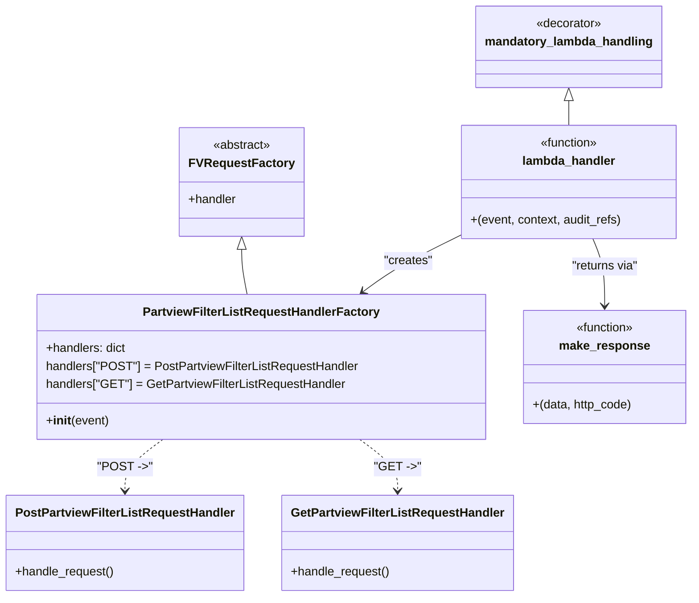

# Diagram: partview_core/partview_service/partview_service/api/partview_filter_list/partview_filter_list.py

> Auto-generated by Obscura crawlers

## Mermaid

### SVG

<svg id="container" width="898.86328125" xmlns="http://www.w3.org/2000/svg" class="classDiagram" height="790" viewBox="0 0 898.86328125 790" role="graphics-document document" aria-roledescription="class"><g><defs><marker id="container_class-aggregationStart" class="marker aggregation class" refX="18" refY="7" markerWidth="190" markerHeight="240" orient="auto"><path d="M 18,7 L9,13 L1,7 L9,1 Z"></path></marker></defs><defs><marker id="container_class-aggregationEnd" class="marker aggregation class" refX="1" refY="7" markerWidth="20" markerHeight="28" orient="auto"><path d="M 18,7 L9,13 L1,7 L9,1 Z"></path></marker></defs><defs><marker id="container_class-extensionStart" class="marker extension class" refX="18" refY="7" markerWidth="190" markerHeight="240" orient="auto"><path d="M 1,7 L18,13 V 1 Z"></path></marker></defs><defs><marker id="container_class-extensionEnd" class="marker extension class" refX="1" refY="7" markerWidth="20" markerHeight="28" orient="auto"><path d="M 1,1 V 13 L18,7 Z"></path></marker></defs><defs><marker id="container_class-compositionStart" class="marker composition class" refX="18" refY="7" markerWidth="190" markerHeight="240" orient="auto"><path d="M 18,7 L9,13 L1,7 L9,1 Z"></path></marker></defs><defs><marker id="container_class-compositionEnd" class="marker composition class" refX="1" refY="7" markerWidth="20" markerHeight="28" orient="auto"><path d="M 18,7 L9,13 L1,7 L9,1 Z"></path></marker></defs><defs><marker id="container_class-dependencyStart" class="marker dependency class" refX="6" refY="7" markerWidth="190" markerHeight="240" orient="auto"><path d="M 5,7 L9,13 L1,7 L9,1 Z"></path></marker></defs><defs><marker id="container_class-dependencyEnd" class="marker dependency class" refX="13" refY="7" markerWidth="20" markerHeight="28" orient="auto"><path d="M 18,7 L9,13 L14,7 L9,1 Z"></path></marker></defs><defs><marker id="container_class-lollipopStart" class="marker lollipop class" refX="13" refY="7" markerWidth="190" markerHeight="240" orient="auto"><circle stroke="black" fill="transparent" cx="7" cy="7" r="6"></circle></marker></defs><defs><marker id="container_class-lollipopEnd" class="marker lollipop class" refX="1" refY="7" markerWidth="190" markerHeight="240" orient="auto"><circle stroke="black" fill="transparent" cx="7" cy="7" r="6"></circle></marker></defs><g class="root"><g class="clusters"></g><g class="edgePaths"><path d="M307.5,330.25L307.5,334.042C307.5,337.833,307.5,345.417,308.714,355.375C309.928,365.333,312.355,377.667,313.569,383.833L314.783,390" id="id_FVRequestFactory_PartviewFilterListRequestHandlerFactory_1" class="edge-thickness-normal edge-pattern-solid relation" style=";;;" data-edge="true" data-et="edge" data-id="id_FVRequestFactory_PartviewFilterListRequestHandlerFactory_1" data-points="W3sieCI6MzA3LjUsInkiOjMxM30seyJ4IjozMDcuNSwieSI6MzUzfSx7IngiOjMxNC43ODMwNzA5NTg2NDY2LCJ5IjozOTB9XQ==" marker-start="url(#container_class-extensionStart)"></path><path d="M207.753,582L199.664,588.167C191.575,594.333,175.397,606.667,167.308,618C159.219,629.333,159.219,639.667,159.219,644.833L159.219,650" id="id_PartviewFilterListRequestHandlerFactory_PostPartviewFilterListRequestHandler_2" class="edge-thickness-normal edge-pattern-dashed relation" style=";;;" data-edge="true" data-et="edge" data-id="id_PartviewFilterListRequestHandlerFactory_PostPartviewFilterListRequestHandler_2" data-points="W3sieCI6MjA3Ljc1Mjk5NTc3MDY3NjcsInkiOjU4Mn0seyJ4IjoxNTkuMjE4NzUsInkiOjYxOX0seyJ4IjoxNTkuMjE4NzUsInkiOjY1Nn1d" marker-end="url(#container_class-dependencyEnd)"></path><path d="M459.606,582L467.695,588.167C475.784,594.333,491.963,606.667,500.052,618C508.141,629.333,508.141,639.667,508.141,644.833L508.141,650" id="id_PartviewFilterListRequestHandlerFactory_GetPartviewFilterListRequestHandler_3" class="edge-thickness-normal edge-pattern-dashed relation" style=";;;" data-edge="true" data-et="edge" data-id="id_PartviewFilterListRequestHandlerFactory_GetPartviewFilterListRequestHandler_3" data-points="W3sieCI6NDU5LjYwNjM3OTIyOTMyMzMsInkiOjU4Mn0seyJ4Ijo1MDguMTQwNjI1LCJ5Ijo2MTl9LHsieCI6NTA4LjE0MDYyNSwieSI6NjU2fV0=" marker-end="url(#container_class-dependencyEnd)"></path><path d="M592.242,312.129L578.547,318.941C564.851,325.753,537.46,339.376,516.384,351.753C495.308,364.129,480.549,375.258,473.169,380.823L465.789,386.388" id="id_lambda_handler_PartviewFilterListRequestHandlerFactory_4" class="edge-thickness-normal edge-pattern-solid relation" style=";;;" data-edge="true" data-et="edge" data-id="id_lambda_handler_PartviewFilterListRequestHandlerFactory_4" data-points="W3sieCI6NTkyLjI0MjE4NzUsInkiOjMxMi4xMjkzOTg0OTk1MDEzfSx7IngiOjUxMC4wNjgzNTkzNzUsInkiOjM1M30seyJ4Ijo0NjAuOTk3ODI2NTk3NzQ0NCwieSI6MzkwfV0=" marker-end="url(#container_class-dependencyEnd)"></path><path d="M767.93,316L770.617,322.167C773.304,328.333,778.677,340.667,781.364,355.5C784.051,370.333,784.051,387.667,784.051,396.333L784.051,405" id="id_lambda_handler_make_response_5" class="edge-thickness-normal edge-pattern-solid relation" style=";;;" data-edge="true" data-et="edge" data-id="id_lambda_handler_make_response_5" data-points="W3sieCI6NzY3LjkzMDM4NTA0NDY0MjksInkiOjMxNn0seyJ4Ijo3ODQuMDUwNzgxMjUsInkiOjM1M30seyJ4Ijo3ODQuMDUwNzgxMjUsInkiOjQxMX1d" marker-end="url(#container_class-dependencyEnd)"></path><path d="M735.254,133.25L735.254,134.542C735.254,135.833,735.254,138.417,735.254,143.875C735.254,149.333,735.254,157.667,735.254,161.833L735.254,166" id="id_mandatory_lambda_handling_lambda_handler_6" class="edge-thickness-normal edge-pattern-solid relation" style=";;;" data-edge="true" data-et="edge" data-id="id_mandatory_lambda_handling_lambda_handler_6" data-points="W3sieCI6NzM1LjI1MzkwNjI1LCJ5IjoxMTZ9LHsieCI6NzM1LjI1MzkwNjI1LCJ5IjoxNDF9LHsieCI6NzM1LjI1MzkwNjI1LCJ5IjoxNjZ9XQ==" marker-start="url(#container_class-extensionStart)"></path></g><g class="edgeLabels"><g class="edgeLabel"><g class="label" data-id="id_FVRequestFactory_PartviewFilterListRequestHandlerFactory_1" transform="translate(0, 0)"><foreignObject width="0" height="0">

</foreignObject></g></g><g class="edgeLabel" transform="translate(159.21875, 619)"><g class="label" data-id="id_PartviewFilterListRequestHandlerFactory_PostPartviewFilterListRequestHandler_2" transform="translate(-34.234375, -12)"><foreignObject width="68.46875" height="24">

"POST -&gt;"

</foreignObject></g></g><g class="edgeLabel" transform="translate(508.140625, 619)"><g class="label" data-id="id_PartviewFilterListRequestHandlerFactory_GetPartviewFilterListRequestHandler_3" transform="translate(-29.1953125, -12)"><foreignObject width="58.390625" height="24">

"GET -&gt;"

</foreignObject></g></g><g class="edgeLabel" transform="translate(523.64212, 346.24885)"><g class="label" data-id="id_lambda_handler_PartviewFilterListRequestHandlerFactory_4" transform="translate(-32.359375, -12)"><foreignObject width="64.71875" height="24">

"creates"

</foreignObject></g></g><g class="edgeLabel" transform="translate(784.05078125, 353)"><g class="label" data-id="id_lambda_handler_make_response_5" transform="translate(-45.234375, -12)"><foreignObject width="90.46875" height="24">

"returns via"

</foreignObject></g></g><g class="edgeLabel"><g class="label" data-id="id_mandatory_lambda_handling_lambda_handler_6" transform="translate(0, 0)"><foreignObject width="0" height="0">

</foreignObject></g></g></g><g class="nodes"><g class="node default" id="classId-FVRequestFactory-0" transform="translate(307.5, 241)"><g class="basic label-container"><path d="M-77.0390625 -72 L77.0390625 -72 L77.0390625 72 L-77.0390625 72" stroke="none" stroke-width="0" fill="#ECECFF" style=""></path><path d="M-77.0390625 -72 C-21.72452158289456 -72, 33.59001933421088 -72, 77.0390625 -72 M-77.0390625 -72 C-45.9065971163524 -72, -14.774131732704802 -72, 77.0390625 -72 M77.0390625 -72 C77.0390625 -41.074976999809095, 77.0390625 -10.149953999618191, 77.0390625 72 M77.0390625 -72 C77.0390625 -24.550206730382143, 77.0390625 22.899586539235713, 77.0390625 72 M77.0390625 72 C28.491301842340107 72, -20.056458815319786 72, -77.0390625 72 M77.0390625 72 C18.14959312904584 72, -40.73987624190832 72, -77.0390625 72 M-77.0390625 72 C-77.0390625 33.973101022075575, -77.0390625 -4.05379795584885, -77.0390625 -72 M-77.0390625 72 C-77.0390625 38.63341187359946, -77.0390625 5.266823747198913, -77.0390625 -72" stroke="#9370DB" stroke-width="1.3" fill="none" stroke-dasharray="0 0" style=""></path></g><g class="annotation-group text" transform="translate(-38.609375, -48)"><g class="label" style="" transform="translate(0,-12)"><foreignObject width="77.21875" height="24">

«abstract»

</foreignObject></g></g><g class="label-group text" transform="translate(-65.0390625, -24)"><g class="label" style="font-weight: bolder" transform="translate(0,-12)"><foreignObject width="130.078125" height="24">

FVRequestFactory

</foreignObject></g></g><g class="members-group text" transform="translate(-65.0390625, 24)"><g class="label" style="" transform="translate(0,-12)"><foreignObject width="64.515625" height="24">

+handler

</foreignObject></g></g><g class="methods-group text" transform="translate(-65.0390625, 72)"></g><g class="divider" style=""><path d="M-77.0390625 0 C-32.74576378478717 0, 11.547534930425655 0, 77.0390625 0 M-77.0390625 0 C-24.371428122161454 0, 28.29620625567709 0, 77.0390625 0" stroke="#9370DB" stroke-width="1.3" fill="none" stroke-dasharray="0 0" style=""></path></g><g class="divider" style=""><path d="M-77.0390625 48 C-40.946274280537665 48, -4.85348606107533 48, 77.0390625 48 M-77.0390625 48 C-45.34124032224075 48, -13.643418144481494 48, 77.0390625 48" stroke="#9370DB" stroke-width="1.3" fill="none" stroke-dasharray="0 0" style=""></path></g></g><g class="node default" id="classId-PartviewFilterListRequestHandlerFactory-1" transform="translate(333.6796875, 486)"><g class="basic label-container"><path d="M-293.55859375 -96 L293.55859375 -96 L293.55859375 96 L-293.55859375 96" stroke="none" stroke-width="0" fill="#ECECFF" style=""></path><path d="M-293.55859375 -96 C-88.76554840697511 -96, 116.02749693604977 -96, 293.55859375 -96 M-293.55859375 -96 C-99.77038723636181 -96, 94.01781927727637 -96, 293.55859375 -96 M293.55859375 -96 C293.55859375 -30.45273180971975, 293.55859375 35.0945363805605, 293.55859375 96 M293.55859375 -96 C293.55859375 -37.00236934871997, 293.55859375 21.995261302560067, 293.55859375 96 M293.55859375 96 C121.23454741724828 96, -51.08949891550344 96, -293.55859375 96 M293.55859375 96 C168.26307964780807 96, 42.96756554561614 96, -293.55859375 96 M-293.55859375 96 C-293.55859375 57.47183654651153, -293.55859375 18.943673093023065, -293.55859375 -96 M-293.55859375 96 C-293.55859375 41.2460221674151, -293.55859375 -13.507955665169803, -293.55859375 -96" stroke="#9370DB" stroke-width="1.3" fill="none" stroke-dasharray="0 0" style=""></path></g><g class="annotation-group text" transform="translate(0, -72)"></g><g class="label-group text" transform="translate(-149.6328125, -72)"><g class="label" style="font-weight: bolder" transform="translate(0,-12)"><foreignObject width="299.265625" height="24">

PartviewFilterListRequestHandlerFactory

</foreignObject></g></g><g class="members-group text" transform="translate(-281.55859375, -24)"><g class="label" style="" transform="translate(0,-12)"><foreignObject width="107.34375" height="24">

+handlers: dict

</foreignObject></g><g class="label" style="" transform="translate(0,12)"><foreignObject width="413.484375" height="24">

handlers["POST"] = PostPartviewFilterListRequestHandler

</foreignObject></g><g class="label" style="" transform="translate(0,36)"><foreignObject width="396.578125" height="24">

handlers["GET"] = GetPartviewFilterListRequestHandler

</foreignObject></g></g><g class="methods-group text" transform="translate(-281.55859375, 72)"><g class="label" style="" transform="translate(0,-12)"><foreignObject width="83.140625" height="24">

+<strong>init</strong>(event)

</foreignObject></g></g><g class="divider" style=""><path d="M-293.55859375 -48 C-109.58417536769718 -48, 74.39024301460563 -48, 293.55859375 -48 M-293.55859375 -48 C-114.41132445137319 -48, 64.73594484725362 -48, 293.55859375 -48" stroke="#9370DB" stroke-width="1.3" fill="none" stroke-dasharray="0 0" style=""></path></g><g class="divider" style=""><path d="M-293.55859375 48 C-96.1684661817367 48, 101.22166138652659 48, 293.55859375 48 M-293.55859375 48 C-108.92506549882117 48, 75.70846275235766 48, 293.55859375 48" stroke="#9370DB" stroke-width="1.3" fill="none" stroke-dasharray="0 0" style=""></path></g></g><g class="node default" id="classId-PostPartviewFilterListRequestHandler-2" transform="translate(159.21875, 719)"><g class="basic label-container"><path d="M-151.21875 -63 L151.21875 -63 L151.21875 63 L-151.21875 63" stroke="none" stroke-width="0" fill="#ECECFF" style=""></path><path d="M-151.21875 -63 C-69.09363766855871 -63, 13.031474662882573 -63, 151.21875 -63 M-151.21875 -63 C-43.4669862096426 -63, 64.2847775807148 -63, 151.21875 -63 M151.21875 -63 C151.21875 -30.71623663969946, 151.21875 1.5675267206010801, 151.21875 63 M151.21875 -63 C151.21875 -33.74292011419905, 151.21875 -4.485840228398104, 151.21875 63 M151.21875 63 C38.56687925717712 63, -74.08499148564576 63, -151.21875 63 M151.21875 63 C60.52120305671437 63, -30.17634388657126 63, -151.21875 63 M-151.21875 63 C-151.21875 18.43907378940996, -151.21875 -26.12185242118008, -151.21875 -63 M-151.21875 63 C-151.21875 36.46340453439184, -151.21875 9.926809068783683, -151.21875 -63" stroke="#9370DB" stroke-width="1.3" fill="none" stroke-dasharray="0 0" style=""></path></g><g class="annotation-group text" transform="translate(0, -39)"></g><g class="label-group text" transform="translate(-139.21875, -39)"><g class="label" style="font-weight: bolder" transform="translate(0,-12)"><foreignObject width="278.4375" height="24">

PostPartviewFilterListRequestHandler

</foreignObject></g></g><g class="members-group text" transform="translate(-139.21875, 9)"></g><g class="methods-group text" transform="translate(-139.21875, 39)"><g class="label" style="" transform="translate(0,-12)"><foreignObject width="131.96875" height="24">

+handle_request()

</foreignObject></g></g><g class="divider" style=""><path d="M-151.21875 -15 C-44.868093293555404 -15, 61.48256341288919 -15, 151.21875 -15 M-151.21875 -15 C-63.263685674302295 -15, 24.69137865139541 -15, 151.21875 -15" stroke="#9370DB" stroke-width="1.3" fill="none" stroke-dasharray="0 0" style=""></path></g><g class="divider" style=""><path d="M-151.21875 9 C-89.15851765290877 9, -27.09828530581754 9, 151.21875 9 M-151.21875 9 C-45.00074822929729 9, 61.21725354140543 9, 151.21875 9" stroke="#9370DB" stroke-width="1.3" fill="none" stroke-dasharray="0 0" style=""></path></g></g><g class="node default" id="classId-GetPartviewFilterListRequestHandler-3" transform="translate(508.140625, 719)"><g class="basic label-container"><path d="M-147.703125 -63 L147.703125 -63 L147.703125 63 L-147.703125 63" stroke="none" stroke-width="0" fill="#ECECFF" style=""></path><path d="M-147.703125 -63 C-41.44134460989669 -63, 64.82043578020662 -63, 147.703125 -63 M-147.703125 -63 C-63.640774806267274 -63, 20.421575387465452 -63, 147.703125 -63 M147.703125 -63 C147.703125 -25.2067137933481, 147.703125 12.586572413303799, 147.703125 63 M147.703125 -63 C147.703125 -29.236374112107555, 147.703125 4.52725177578489, 147.703125 63 M147.703125 63 C87.26910622123872 63, 26.83508744247743 63, -147.703125 63 M147.703125 63 C86.46563491759817 63, 25.228144835196332 63, -147.703125 63 M-147.703125 63 C-147.703125 20.207959663178315, -147.703125 -22.58408067364337, -147.703125 -63 M-147.703125 63 C-147.703125 17.52717482326736, -147.703125 -27.945650353465282, -147.703125 -63" stroke="#9370DB" stroke-width="1.3" fill="none" stroke-dasharray="0 0" style=""></path></g><g class="annotation-group text" transform="translate(0, -39)"></g><g class="label-group text" transform="translate(-135.703125, -39)"><g class="label" style="font-weight: bolder" transform="translate(0,-12)"><foreignObject width="271.40625" height="24">

GetPartviewFilterListRequestHandler

</foreignObject></g></g><g class="members-group text" transform="translate(-135.703125, 9)"></g><g class="methods-group text" transform="translate(-135.703125, 39)"><g class="label" style="" transform="translate(0,-12)"><foreignObject width="131.96875" height="24">

+handle_request()

</foreignObject></g></g><g class="divider" style=""><path d="M-147.703125 -15 C-31.962552113669616 -15, 83.77802077266077 -15, 147.703125 -15 M-147.703125 -15 C-66.96418229476917 -15, 13.774760410461653 -15, 147.703125 -15" stroke="#9370DB" stroke-width="1.3" fill="none" stroke-dasharray="0 0" style=""></path></g><g class="divider" style=""><path d="M-147.703125 9 C-60.56512759538229 9, 26.572869809235414 9, 147.703125 9 M-147.703125 9 C-35.52306749757972 9, 76.65699000484057 9, 147.703125 9" stroke="#9370DB" stroke-width="1.3" fill="none" stroke-dasharray="0 0" style=""></path></g></g><g class="node default" id="classId-lambda_handler-4" transform="translate(735.25390625, 241)"><g class="basic label-container"><path d="M-143.01171875 -75 L143.01171875 -75 L143.01171875 75 L-143.01171875 75" stroke="none" stroke-width="0" fill="#ECECFF" style=""></path><path d="M-143.01171875 -75 C-48.06568364295404 -75, 46.880351464091916 -75, 143.01171875 -75 M-143.01171875 -75 C-60.46767035139207 -75, 22.076378047215854 -75, 143.01171875 -75 M143.01171875 -75 C143.01171875 -29.62877059675516, 143.01171875 15.74245880648968, 143.01171875 75 M143.01171875 -75 C143.01171875 -42.755986267736375, 143.01171875 -10.51197253547275, 143.01171875 75 M143.01171875 75 C40.38437171339167 75, -62.242975323216655 75, -143.01171875 75 M143.01171875 75 C49.82089498966339 75, -43.369928770673226 75, -143.01171875 75 M-143.01171875 75 C-143.01171875 32.0632298909296, -143.01171875 -10.873540218140803, -143.01171875 -75 M-143.01171875 75 C-143.01171875 31.73319082490898, -143.01171875 -11.533618350182039, -143.01171875 -75" stroke="#9370DB" stroke-width="1.3" fill="none" stroke-dasharray="0 0" style=""></path></g><g class="annotation-group text" transform="translate(-39.484375, -51)"><g class="label" style="" transform="translate(0,-12)"><foreignObject width="78.96875" height="24">

«function»

</foreignObject></g></g><g class="label-group text" transform="translate(-59.9765625, -27)"><g class="label" style="font-weight: bolder" transform="translate(0,-12)"><foreignObject width="119.953125" height="24">

lambda_handler

</foreignObject></g></g><g class="members-group text" transform="translate(-131.01171875, 21)"></g><g class="methods-group text" transform="translate(-131.01171875, 51)"><g class="label" style="" transform="translate(0,-12)"><foreignObject width="202.046875" height="24">

+(event, context, audit_refs)

</foreignObject></g></g><g class="divider" style=""><path d="M-143.01171875 -3 C-79.13270432659431 -3, -15.25368990318863 -3, 143.01171875 -3 M-143.01171875 -3 C-66.15183768602454 -3, 10.70804337795093 -3, 143.01171875 -3" stroke="#9370DB" stroke-width="1.3" fill="none" stroke-dasharray="0 0" style=""></path></g><g class="divider" style=""><path d="M-143.01171875 21 C-42.55961128060501 21, 57.89249618878998 21, 143.01171875 21 M-143.01171875 21 C-59.641708103733706 21, 23.72830254253259 21, 143.01171875 21" stroke="#9370DB" stroke-width="1.3" fill="none" stroke-dasharray="0 0" style=""></path></g></g><g class="node default" id="classId-mandatory_lambda_handling-5" transform="translate(735.25390625, 62)"><g class="basic label-container"><path d="M-119.4296875 -54 L119.4296875 -54 L119.4296875 54 L-119.4296875 54" stroke="none" stroke-width="0" fill="#ECECFF" style=""></path><path d="M-119.4296875 -54 C-46.32776062083403 -54, 26.774166258331945 -54, 119.4296875 -54 M-119.4296875 -54 C-38.54362841805941 -54, 42.342430663881174 -54, 119.4296875 -54 M119.4296875 -54 C119.4296875 -14.611076106706086, 119.4296875 24.777847786587827, 119.4296875 54 M119.4296875 -54 C119.4296875 -18.849134747250723, 119.4296875 16.301730505498554, 119.4296875 54 M119.4296875 54 C43.97808399717307 54, -31.473519505653854 54, -119.4296875 54 M119.4296875 54 C26.3365628932104 54, -66.7565617135792 54, -119.4296875 54 M-119.4296875 54 C-119.4296875 30.76748650690305, -119.4296875 7.534973013806102, -119.4296875 -54 M-119.4296875 54 C-119.4296875 14.588600796316896, -119.4296875 -24.822798407366207, -119.4296875 -54" stroke="#9370DB" stroke-width="1.3" fill="none" stroke-dasharray="0 0" style=""></path></g><g class="annotation-group text" transform="translate(-44.0625, -30)"><g class="label" style="" transform="translate(0,-12)"><foreignObject width="88.125" height="24">

«decorator»

</foreignObject></g></g><g class="label-group text" transform="translate(-107.4296875, -6)"><g class="label" style="font-weight: bolder" transform="translate(0,-12)"><foreignObject width="214.859375" height="24">

mandatory_lambda_handling

</foreignObject></g></g><g class="members-group text" transform="translate(-107.4296875, 42)"></g><g class="methods-group text" transform="translate(-107.4296875, 72)"></g><g class="divider" style=""><path d="M-119.4296875 18 C-60.005503064476514 18, -0.5813186289530279 18, 119.4296875 18 M-119.4296875 18 C-33.39139997252019 18, 52.64688755495962 18, 119.4296875 18" stroke="#9370DB" stroke-width="1.3" fill="none" stroke-dasharray="0 0" style=""></path></g><g class="divider" style=""><path d="M-119.4296875 36 C-67.29676598271507 36, -15.163844465430145 36, 119.4296875 36 M-119.4296875 36 C-43.912815633288005 36, 31.60405623342399 36, 119.4296875 36" stroke="#9370DB" stroke-width="1.3" fill="none" stroke-dasharray="0 0" style=""></path></g></g><g class="node default" id="classId-make_response-6" transform="translate(784.05078125, 486)"><g class="basic label-container"><path d="M-106.8125 -75 L106.8125 -75 L106.8125 75 L-106.8125 75" stroke="none" stroke-width="0" fill="#ECECFF" style=""></path><path d="M-106.8125 -75 C-22.656438343318513 -75, 61.499623313362974 -75, 106.8125 -75 M-106.8125 -75 C-63.043748064124856 -75, -19.27499612824971 -75, 106.8125 -75 M106.8125 -75 C106.8125 -26.886927669438826, 106.8125 21.226144661122348, 106.8125 75 M106.8125 -75 C106.8125 -30.35945816733092, 106.8125 14.281083665338159, 106.8125 75 M106.8125 75 C52.73323821505087 75, -1.3460235698982643 75, -106.8125 75 M106.8125 75 C43.7301654683693 75, -19.3521690632614 75, -106.8125 75 M-106.8125 75 C-106.8125 16.147128180307753, -106.8125 -42.705743639384494, -106.8125 -75 M-106.8125 75 C-106.8125 32.55032330747327, -106.8125 -9.899353385053459, -106.8125 -75" stroke="#9370DB" stroke-width="1.3" fill="none" stroke-dasharray="0 0" style=""></path></g><g class="annotation-group text" transform="translate(-39.484375, -51)"><g class="label" style="" transform="translate(0,-12)"><foreignObject width="78.96875" height="24">

«function»

</foreignObject></g></g><g class="label-group text" transform="translate(-57.46875, -27)"><g class="label" style="font-weight: bolder" transform="translate(0,-12)"><foreignObject width="114.9375" height="24">

make_response

</foreignObject></g></g><g class="members-group text" transform="translate(-94.8125, 21)"></g><g class="methods-group text" transform="translate(-94.8125, 51)"><g class="label" style="" transform="translate(0,-12)"><foreignObject width="132.15625" height="24">

+(data, http_code)

</foreignObject></g></g><g class="divider" style=""><path d="M-106.8125 -3 C-62.246333407855346 -3, -17.68016681571069 -3, 106.8125 -3 M-106.8125 -3 C-58.19019855885085 -3, -9.567897117701705 -3, 106.8125 -3" stroke="#9370DB" stroke-width="1.3" fill="none" stroke-dasharray="0 0" style=""></path></g><g class="divider" style=""><path d="M-106.8125 21 C-52.20842539764576 21, 2.3956492047084765 21, 106.8125 21 M-106.8125 21 C-51.71457297949775 21, 3.3833540410044947 21, 106.8125 21" stroke="#9370DB" stroke-width="1.3" fill="none" stroke-dasharray="0 0" style=""></path></g></g></g></g></g></svg>
