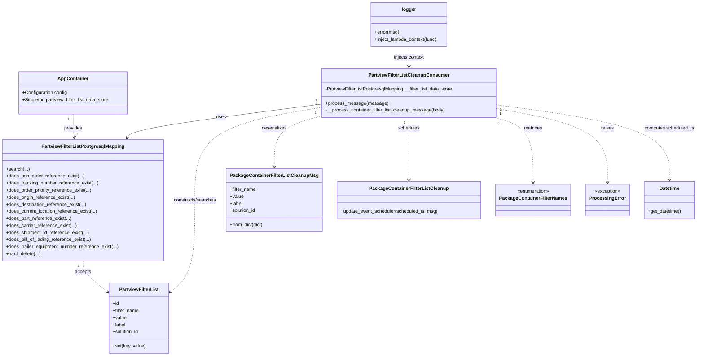

# Diagram: partview_core/partview_service/partview_service/api/partview_filter_list/partview_filter_list_cleanup_consumer.py


> Auto-generated by Obscura crawlers

## Diagram 1



### SVG

<svg id="container" width="2319.1484375" xmlns="http://www.w3.org/2000/svg" class="classDiagram" height="1210" viewBox="0 0 2319.1484375 1210" role="graphics-document document" aria-roledescription="class"><style>#container{font-family:"trebuchet ms",verdana,arial,sans-serif;font-size:16px;fill:#333;}@keyframes edge-animation-frame{from{stroke-dashoffset:0;}}@keyframes dash{to{stroke-dashoffset:0;}}#container .edge-animation-slow{stroke-dasharray:9,5!important;stroke-dashoffset:900;animation:dash 50s linear infinite;stroke-linecap:round;}#container .edge-animation-fast{stroke-dasharray:9,5!important;stroke-dashoffset:900;animation:dash 20s linear infinite;stroke-linecap:round;}#container .error-icon{fill:#552222;}#container .error-text{fill:#552222;stroke:#552222;}#container .edge-thickness-normal{stroke-width:1px;}#container .edge-thickness-thick{stroke-width:3.5px;}#container .edge-pattern-solid{stroke-dasharray:0;}#container .edge-thickness-invisible{stroke-width:0;fill:none;}#container .edge-pattern-dashed{stroke-dasharray:3;}#container .edge-pattern-dotted{stroke-dasharray:2;}#container .marker{fill:#333333;stroke:#333333;}#container .marker.cross{stroke:#333333;}#container svg{font-family:"trebuchet ms",verdana,arial,sans-serif;font-size:16px;}#container p{margin:0;}#container g.classGroup text{fill:#9370DB;stroke:none;font-family:"trebuchet ms",verdana,arial,sans-serif;font-size:10px;}#container g.classGroup text .title{font-weight:bolder;}#container .nodeLabel,#container .edgeLabel{color:#131300;}#container .edgeLabel .label rect{fill:#ECECFF;}#container .label text{fill:#131300;}#container .labelBkg{background:#ECECFF;}#container .edgeLabel .label span{background:#ECECFF;}#container .classTitle{font-weight:bolder;}#container .node rect,#container .node circle,#container .node ellipse,#container .node polygon,#container .node path{fill:#ECECFF;stroke:#9370DB;stroke-width:1px;}#container .divider{stroke:#9370DB;stroke-width:1;}#container g.clickable{cursor:pointer;}#container g.classGroup rect{fill:#ECECFF;stroke:#9370DB;}#container g.classGroup line{stroke:#9370DB;stroke-width:1;}#container .classLabel .box{stroke:none;stroke-width:0;fill:#ECECFF;opacity:0.5;}#container .classLabel .label{fill:#9370DB;font-size:10px;}#container .relation{stroke:#333333;stroke-width:1;fill:none;}#container .dashed-line{stroke-dasharray:3;}#container .dotted-line{stroke-dasharray:1 2;}#container #compositionStart,#container .composition{fill:#333333!important;stroke:#333333!important;stroke-width:1;}#container #compositionEnd,#container .composition{fill:#333333!important;stroke:#333333!important;stroke-width:1;}#container #dependencyStart,#container .dependency{fill:#333333!important;stroke:#333333!important;stroke-width:1;}#container #dependencyStart,#container .dependency{fill:#333333!important;stroke:#333333!important;stroke-width:1;}#container #extensionStart,#container .extension{fill:transparent!important;stroke:#333333!important;stroke-width:1;}#container #extensionEnd,#container .extension{fill:transparent!important;stroke:#333333!important;stroke-width:1;}#container #aggregationStart,#container .aggregation{fill:transparent!important;stroke:#333333!important;stroke-width:1;}#container #aggregationEnd,#container .aggregation{fill:transparent!important;stroke:#333333!important;stroke-width:1;}#container #lollipopStart,#container .lollipop{fill:#ECECFF!important;stroke:#333333!important;stroke-width:1;}#container #lollipopEnd,#container .lollipop{fill:#ECECFF!important;stroke:#333333!important;stroke-width:1;}#container .edgeTerminals{font-size:11px;line-height:initial;}#container .classTitleText{text-anchor:middle;font-size:18px;fill:#333;}#container .label-icon{display:inline-block;height:1em;overflow:visible;vertical-align:-0.125em;}#container .node .label-icon path{fill:currentColor;stroke:revert;stroke-width:revert;}#container :root{--mermaid-font-family:"trebuchet ms",verdana,arial,sans-serif;}</style><g><defs><marker id="container_class-aggregationStart" class="marker aggregation class" refX="18" refY="7" markerWidth="190" markerHeight="240" orient="auto"><path d="M 18,7 L9,13 L1,7 L9,1 Z"></path></marker></defs><defs><marker id="container_class-aggregationEnd" class="marker aggregation class" refX="1" refY="7" markerWidth="20" markerHeight="28" orient="auto"><path d="M 18,7 L9,13 L1,7 L9,1 Z"></path></marker></defs><defs><marker id="container_class-extensionStart" class="marker extension class" refX="18" refY="7" markerWidth="190" markerHeight="240" orient="auto"><path d="M 1,7 L18,13 V 1 Z"></path></marker></defs><defs><marker id="container_class-extensionEnd" class="marker extension class" refX="1" refY="7" markerWidth="20" markerHeight="28" orient="auto"><path d="M 1,1 V 13 L18,7 Z"></path></marker></defs><defs><marker id="container_class-compositionStart" class="marker composition class" refX="18" refY="7" markerWidth="190" markerHeight="240" orient="auto"><path d="M 18,7 L9,13 L1,7 L9,1 Z"></path></marker></defs><defs><marker id="container_class-compositionEnd" class="marker composition class" refX="1" refY="7" markerWidth="20" markerHeight="28" orient="auto"><path d="M 18,7 L9,13 L1,7 L9,1 Z"></path></marker></defs><defs><marker id="container_class-dependencyStart" class="marker dependency class" refX="6" refY="7" markerWidth="190" markerHeight="240" orient="auto"><path d="M 5,7 L9,13 L1,7 L9,1 Z"></path></marker></defs><defs><marker id="container_class-dependencyEnd" class="marker dependency class" refX="13" refY="7" markerWidth="20" markerHeight="28" orient="auto"><path d="M 18,7 L9,13 L14,7 L9,1 Z"></path></marker></defs><defs><marker id="container_class-lollipopStart" class="marker lollipop class" refX="13" refY="7" markerWidth="190" markerHeight="240" orient="auto"><circle stroke="black" fill="transparent" cx="7" cy="7" r="6"></circle></marker></defs><defs><marker id="container_class-lollipopEnd" class="marker lollipop class" refX="1" refY="7" markerWidth="190" markerHeight="240" orient="auto"><circle stroke="black" fill="transparent" cx="7" cy="7" r="6"></circle></marker></defs><g class="root"><g class="clusters"></g><g class="edgePaths"><path d="M245.691,388L245.691,396.167C245.691,404.333,245.691,420.667,246.411,434.01C247.13,447.352,248.568,457.705,249.287,462.881L250.007,468.057" id="id_AppContainer_PartviewFilterListPostgresqlMapping_1" class="edge-thickness-normal edge-pattern-solid relation" style=";;;" data-edge="true" data-et="edge" data-id="id_AppContainer_PartviewFilterListPostgresqlMapping_1" data-points="W3sieCI6MjQ1LjY5MTQwNjI1LCJ5IjozODh9LHsieCI6MjQ1LjY5MTQwNjI1LCJ5Ijo0Mzd9LHsieCI6MjUwLjgzMjMzNTQyNTIwNDkyLCJ5Ijo0NzR9XQ==" marker-end="url(#container_class-dependencyEnd)"></path><path d="M1070.887,355.147L967.645,368.789C864.404,382.432,657.921,409.716,550.912,428.707C443.903,447.698,436.369,458.396,432.601,463.745L428.834,469.094" id="id_PartviewFilterListCleanupConsumer_PartviewFilterListPostgresqlMapping_2" class="edge-thickness-normal edge-pattern-solid relation" style=";;;" data-edge="true" data-et="edge" data-id="id_PartviewFilterListCleanupConsumer_PartviewFilterListPostgresqlMapping_2" data-points="W3sieCI6MTA3MC44ODY3MTg3NSwieSI6MzU1LjE0NzM2MjQ0ODkxNjl9LHsieCI6NDUxLjQzNzUsInkiOjQzN30seyJ4Ijo0MjUuMzc5MjI2NDM0NDI2MjQsInkiOjQ3NH1d" marker-end="url(#container_class-dependencyEnd)"></path><path d="M1070.887,366.677L1002.368,378.398C933.849,390.118,796.811,413.559,728.292,465.946C659.773,518.333,659.773,599.667,659.773,681C659.773,762.333,659.773,843.667,645.462,896.154C631.15,948.641,602.527,972.281,588.215,984.102L573.903,995.922" id="id_PartviewFilterListCleanupConsumer_PartviewFilterList_3" class="edge-thickness-normal edge-pattern-dashed relation" style=";;;" data-edge="true" data-et="edge" data-id="id_PartviewFilterListCleanupConsumer_PartviewFilterList_3" data-points="W3sieCI6MTA3MC44ODY3MTg3NSwieSI6MzY2LjY3NzAzNTQ3NDQ2NTQ3fSx7IngiOjY1OS43NzM0Mzc1LCJ5Ijo0Mzd9LHsieCI6NjU5Ljc3MzQzNzUsInkiOjY4MX0seyJ4Ijo2NTkuNzczNDM3NSwieSI6OTI1fSx7IngiOjU2OS4yNzczNDM3NSwieSI6OTk5Ljc0MzAwODAzNDg1Mn1d" marker-end="url(#container_class-dependencyEnd)"></path><path d="M1070.887,396.547L1046.088,403.289C1021.289,410.031,971.691,423.516,946.893,451.924C922.094,480.333,922.094,523.667,922.094,545.333L922.094,567" id="id_PartviewFilterListCleanupConsumer_PackageContainerFilterListCleanupMsg_4" class="edge-thickness-normal edge-pattern-dashed relation" style=";;;" data-edge="true" data-et="edge" data-id="id_PartviewFilterListCleanupConsumer_PackageContainerFilterListCleanupMsg_4" data-points="W3sieCI6MTA3MC44ODY3MTg3NSwieSI6Mzk2LjU0NjY1ODU5MTgxNjN9LHsieCI6OTIyLjA5Mzc1LCJ5Ijo0Mzd9LHsieCI6OTIyLjA5Mzc1LCJ5Ijo1NzN9XQ==" marker-end="url(#container_class-dependencyEnd)"></path><path d="M1367.148,400L1367.148,406.167C1367.148,412.333,1367.148,424.667,1367.148,460C1367.148,495.333,1367.148,553.667,1367.148,582.833L1367.148,612" id="id_PartviewFilterListCleanupConsumer_PackageContainerFilterListCleanup_5" class="edge-thickness-normal edge-pattern-dashed relation" style=";;;" data-edge="true" data-et="edge" data-id="id_PartviewFilterListCleanupConsumer_PackageContainerFilterListCleanup_5" data-points="W3sieCI6MTM2Ny4xNDg0Mzc1LCJ5Ijo0MDB9LHsieCI6MTM2Ny4xNDg0Mzc1LCJ5Ijo0Mzd9LHsieCI6MTM2Ny4xNDg0Mzc1LCJ5Ijo2MTh9XQ==" marker-end="url(#container_class-dependencyEnd)"></path><path d="M1653.42,400L1674.436,406.167C1695.452,412.333,1737.484,424.667,1758.5,461.5C1779.516,498.333,1779.516,559.667,1779.516,590.333L1779.516,621" id="id_PartviewFilterListCleanupConsumer_PackageContainerFilterNames_6" class="edge-thickness-normal edge-pattern-dashed relation" style=";;;" data-edge="true" data-et="edge" data-id="id_PartviewFilterListCleanupConsumer_PackageContainerFilterNames_6" data-points="W3sieCI6MTY1My40MTk4NzM0NTA0MTMyLCJ5Ijo0MDB9LHsieCI6MTc3OS41MTU2MjUsInkiOjQzN30seyJ4IjoxNzc5LjUxNTYyNSwieSI6NjI3fV0=" marker-end="url(#container_class-dependencyEnd)"></path><path d="M1663.41,370.903L1722.854,381.92C1782.297,392.936,1901.184,414.968,1960.627,456.651C2020.07,498.333,2020.07,559.667,2020.07,590.333L2020.07,621" id="id_PartviewFilterListCleanupConsumer_ProcessingError_7" class="edge-thickness-normal edge-pattern-dashed relation" style=";;;" data-edge="true" data-et="edge" data-id="id_PartviewFilterListCleanupConsumer_ProcessingError_7" data-points="W3sieCI6MTY2My40MTAxNTYyNSwieSI6MzcwLjkwMzQ1NjgxNjcxMzM0fSx7IngiOjIwMjAuMDcwMzEyNSwieSI6NDM3fSx7IngiOjIwMjAuMDcwMzEyNSwieSI6NjI3fV0=" marker-end="url(#container_class-dependencyEnd)"></path><path d="M1663.41,357.77L1757.069,370.975C1850.728,384.18,2038.046,410.59,2131.704,452.962C2225.363,495.333,2225.363,553.667,2225.363,582.833L2225.363,612" id="id_PartviewFilterListCleanupConsumer_Datetime_8" class="edge-thickness-normal edge-pattern-dashed relation" style=";;;" data-edge="true" data-et="edge" data-id="id_PartviewFilterListCleanupConsumer_Datetime_8" data-points="W3sieCI6MTY2My40MTAxNTYyNSwieSI6MzU3Ljc3MDAzOTU1MzM5NzA1fSx7IngiOjIyMjUuMzYzMjgxMjUsInkiOjQzN30seyJ4IjoyMjI1LjM2MzI4MTI1LCJ5Ijo2MTh9XQ==" marker-end="url(#container_class-dependencyEnd)"></path><path d="M279.594,888L279.594,894.167C279.594,900.333,279.594,912.667,293.905,930.654C308.217,948.641,336.84,972.281,351.152,984.102L365.464,995.922" id="id_PartviewFilterListPostgresqlMapping_PartviewFilterList_9" class="edge-thickness-normal edge-pattern-dashed relation" style=";;;" data-edge="true" data-et="edge" data-id="id_PartviewFilterListPostgresqlMapping_PartviewFilterList_9" data-points="W3sieCI6Mjc5LjU5Mzc1LCJ5Ijo4ODh9LHsieCI6Mjc5LjU5Mzc1LCJ5Ijo5MjV9LHsieCI6MzcwLjA4OTg0Mzc1LCJ5Ijo5OTkuNzQzMDA4MDM0ODUyfV0=" marker-end="url(#container_class-dependencyEnd)"></path><path d="M1367.148,158L1367.148,164.167C1367.148,170.333,1367.148,182.667,1367.148,194C1367.148,205.333,1367.148,215.667,1367.148,220.833L1367.148,226" id="id_logger_PartviewFilterListCleanupConsumer_10" class="edge-thickness-normal edge-pattern-dashed relation" style=";;;" data-edge="true" data-et="edge" data-id="id_logger_PartviewFilterListCleanupConsumer_10" data-points="W3sieCI6MTM2Ny4xNDg0Mzc1LCJ5IjoxNTh9LHsieCI6MTM2Ny4xNDg0Mzc1LCJ5IjoxOTV9LHsieCI6MTM2Ny4xNDg0Mzc1LCJ5IjoyMzJ9XQ==" marker-end="url(#container_class-dependencyEnd)"></path></g><g class="edgeLabels"><g class="edgeLabel" transform="translate(245.69140625, 437)"><g class="label" data-id="id_AppContainer_PartviewFilterListPostgresqlMapping_1" transform="translate(-31.3125, -12)"><foreignObject width="62.625" height="24"><div xmlns="http://www.w3.org/1999/xhtml" class="labelBkg" style="display: table-cell; white-space: nowrap; line-height: 1.5; max-width: 200px; text-align: center;"><span class="edgeLabel"><p>provides</p></span></div></foreignObject></g></g><g class="edgeLabel" transform="translate(738.7295, 399.03788)"><g class="label" data-id="id_PartviewFilterListCleanupConsumer_PartviewFilterListPostgresqlMapping_2" transform="translate(-16.4921875, -12)"><foreignObject width="32.984375" height="24"><div xmlns="http://www.w3.org/1999/xhtml" class="labelBkg" style="display: table-cell; white-space: nowrap; line-height: 1.5; max-width: 200px; text-align: center;"><span class="edgeLabel"><p>uses</p></span></div></foreignObject></g></g><g class="edgeLabel" transform="translate(659.7734375, 681)"><g class="label" data-id="id_PartviewFilterListCleanupConsumer_PartviewFilterList_3" transform="translate(-73.5859375, -12)"><foreignObject width="147.171875" height="24"><div xmlns="http://www.w3.org/1999/xhtml" class="labelBkg" style="display: table-cell; white-space: nowrap; line-height: 1.5; max-width: 200px; text-align: center;"><span class="edgeLabel"><p>constructs/searches</p></span></div></foreignObject></g></g><g class="edgeLabel" transform="translate(922.09375, 437)"><g class="label" data-id="id_PartviewFilterListCleanupConsumer_PackageContainerFilterListCleanupMsg_4" transform="translate(-42.9921875, -12)"><foreignObject width="85.984375" height="24"><div xmlns="http://www.w3.org/1999/xhtml" class="labelBkg" style="display: table-cell; white-space: nowrap; line-height: 1.5; max-width: 200px; text-align: center;"><span class="edgeLabel"><p>deserializes</p></span></div></foreignObject></g></g><g class="edgeLabel" transform="translate(1367.1484375, 437)"><g class="label" data-id="id_PartviewFilterListCleanupConsumer_PackageContainerFilterListCleanup_5" transform="translate(-36.453125, -12)"><foreignObject width="72.90625" height="24"><div xmlns="http://www.w3.org/1999/xhtml" class="labelBkg" style="display: table-cell; white-space: nowrap; line-height: 1.5; max-width: 200px; text-align: center;"><span class="edgeLabel"><p>schedules</p></span></div></foreignObject></g></g><g class="edgeLabel" transform="translate(1779.515625, 437)"><g class="label" data-id="id_PartviewFilterListCleanupConsumer_PackageContainerFilterNames_6" transform="translate(-30.5859375, -12)"><foreignObject width="61.171875" height="24"><div xmlns="http://www.w3.org/1999/xhtml" class="labelBkg" style="display: table-cell; white-space: nowrap; line-height: 1.5; max-width: 200px; text-align: center;"><span class="edgeLabel"><p>matches</p></span></div></foreignObject></g></g><g class="edgeLabel" transform="translate(2020.0703125, 437)"><g class="label" data-id="id_PartviewFilterListCleanupConsumer_ProcessingError_7" transform="translate(-21.25, -12)"><foreignObject width="42.5" height="24"><div xmlns="http://www.w3.org/1999/xhtml" class="labelBkg" style="display: table-cell; white-space: nowrap; line-height: 1.5; max-width: 200px; text-align: center;"><span class="edgeLabel"><p>raises</p></span></div></foreignObject></g></g><g class="edgeLabel" transform="translate(2225.36328125, 437)"><g class="label" data-id="id_PartviewFilterListCleanupConsumer_Datetime_8" transform="translate(-85.7109375, -12)"><foreignObject width="171.421875" height="24"><div xmlns="http://www.w3.org/1999/xhtml" class="labelBkg" style="display: table-cell; white-space: nowrap; line-height: 1.5; max-width: 200px; text-align: center;"><span class="edgeLabel"><p>computes scheduled_ts</p></span></div></foreignObject></g></g><g class="edgeLabel" transform="translate(279.59375, 925)"><g class="label" data-id="id_PartviewFilterListPostgresqlMapping_PartviewFilterList_9" transform="translate(-27.421875, -12)"><foreignObject width="54.84375" height="24"><div xmlns="http://www.w3.org/1999/xhtml" class="labelBkg" style="display: table-cell; white-space: nowrap; line-height: 1.5; max-width: 200px; text-align: center;"><span class="edgeLabel"><p>accepts</p></span></div></foreignObject></g></g><g class="edgeLabel" transform="translate(1367.1484375, 195)"><g class="label" data-id="id_logger_PartviewFilterListCleanupConsumer_10" transform="translate(-52.9609375, -12)"><foreignObject width="105.921875" height="24"><div xmlns="http://www.w3.org/1999/xhtml" class="labelBkg" style="display: table-cell; white-space: nowrap; line-height: 1.5; max-width: 200px; text-align: center;"><span class="edgeLabel"><p>injects context</p></span></div></foreignObject></g></g><g class="edgeTerminals" transform="translate(230.6914081250001, 405.50000160714285)"><g class="inner" transform="translate(0, 0)"><foreignObject style="width: 9px; height: 12px;"><div xmlns="http://www.w3.org/1999/xhtml" style="display: inline-block; padding-right: 1px; white-space: nowrap;"><span class="edgeLabel">1</span></div></foreignObject></g></g><g class="edgeTerminals" transform="translate(1051.5725383693336, 342.56910885210414)"><g class="inner" transform="translate(0, 0)"><foreignObject style="width: 9px; height: 12px;"><div xmlns="http://www.w3.org/1999/xhtml" style="display: inline-block; padding-right: 1px; white-space: nowrap;"><span class="edgeLabel">1</span></div></foreignObject></g></g><g class="edgeTerminals" transform="translate(1051.1081671544932, 354.8423902016765)"><g class="inner" transform="translate(0, 0)"><foreignObject style="width: 9px; height: 12px;"><div xmlns="http://www.w3.org/1999/xhtml" style="display: inline-block; padding-right: 1px; white-space: nowrap;"><span class="edgeLabel">1</span></div></foreignObject></g></g><g class="edgeTerminals" transform="translate(1050.0644078042399, 386.66326652841616)"><g class="inner" transform="translate(0, 0)"><foreignObject style="width: 9px; height: 12px;"><div xmlns="http://www.w3.org/1999/xhtml" style="display: inline-block; padding-right: 1px; white-space: nowrap;"><span class="edgeLabel">1</span></div></foreignObject></g></g><g class="edgeTerminals" transform="translate(1352.14843875, 417.5000010714285)"><g class="inner" transform="translate(0, 0)"><foreignObject style="width: 9px; height: 12px;"><div xmlns="http://www.w3.org/1999/xhtml" style="display: inline-block; padding-right: 1px; white-space: nowrap;"><span class="edgeLabel">1</span></div></foreignObject></g></g><g class="edgeTerminals" transform="translate(1665.9885446247138, 419.3204169483028)"><g class="inner" transform="translate(0, 0)"><foreignObject style="width: 9px; height: 12px;"><div xmlns="http://www.w3.org/1999/xhtml" style="display: inline-block; padding-right: 1px; white-space: nowrap;"><span class="edgeLabel">1</span></div></foreignObject></g></g><g class="edgeTerminals" transform="translate(1677.88390167591, 388.84114547321605)"><g class="inner" transform="translate(0, 0)"><foreignObject style="width: 9px; height: 12px;"><div xmlns="http://www.w3.org/1999/xhtml" style="display: inline-block; padding-right: 1px; white-space: nowrap;"><span class="edgeLabel">1</span></div></foreignObject></g></g><g class="edgeTerminals" transform="translate(1678.6446315703608, 375.06630449188026)"><g class="inner" transform="translate(0, 0)"><foreignObject style="width: 9px; height: 12px;"><div xmlns="http://www.w3.org/1999/xhtml" style="display: inline-block; padding-right: 1px; white-space: nowrap;"><span class="edgeLabel">1</span></div></foreignObject></g></g><g class="edgeTerminals" transform="translate(264.59375, 905.5)"><g class="inner" transform="translate(0, 0)"><foreignObject style="width: 9px; height: 12px;"><div xmlns="http://www.w3.org/1999/xhtml" style="display: inline-block; padding-right: 1px; white-space: nowrap;"><span class="edgeLabel">1</span></div></foreignObject></g></g><g class="edgeTerminals" transform="translate(258.2812253384427, 449.60218699276453)"><g class="inner" transform="translate(0, 0)"></g><foreignObject style="width: 9px; height: 12px;"><div xmlns="http://www.w3.org/1999/xhtml" style="display: inline-block; padding-right: 1px; white-space: nowrap;"><span class="edgeLabel">1</span></div></foreignObject></g><g class="edgeTerminals" transform="translate(442.7196351602707, 463.3293640333013)"><g class="inner" transform="translate(0, 0)"></g><foreignObject style="width: 9px; height: 12px;"><div xmlns="http://www.w3.org/1999/xhtml" style="display: inline-block; padding-right: 1px; white-space: nowrap;"><span class="edgeLabel">1</span></div></foreignObject></g></g><g class="nodes"><g class="node default" id="classId-AppContainer-0" transform="translate(245.69140625, 316)"><g class="basic label-container"><path d="M-186.765625 -72 L186.765625 -72 L186.765625 72 L-186.765625 72" stroke="none" stroke-width="0" fill="#ECECFF" style=""></path><path d="M-186.765625 -72 C-101.94606363630432 -72, -17.126502272608633 -72, 186.765625 -72 M-186.765625 -72 C-101.90123876079 -72, -17.036852521579988 -72, 186.765625 -72 M186.765625 -72 C186.765625 -38.66686648871447, 186.765625 -5.333732977428937, 186.765625 72 M186.765625 -72 C186.765625 -40.35434053191849, 186.765625 -8.708681063836977, 186.765625 72 M186.765625 72 C85.48050053117285 72, -15.804623937654299 72, -186.765625 72 M186.765625 72 C54.90689098198379 72, -76.95184303603241 72, -186.765625 72 M-186.765625 72 C-186.765625 40.33827564696747, -186.765625 8.676551293934935, -186.765625 -72 M-186.765625 72 C-186.765625 27.25227093112707, -186.765625 -17.495458137745857, -186.765625 -72" stroke="#9370DB" stroke-width="1.3" fill="none" stroke-dasharray="0 0" style=""></path></g><g class="annotation-group text" transform="translate(0, -48)"></g><g class="label-group text" transform="translate(-49.875, -48)"><g class="label" style="font-weight: bolder" transform="translate(0,-12)"><foreignObject width="99.75" height="24"><div xmlns="http://www.w3.org/1999/xhtml" style="display: table-cell; white-space: nowrap; line-height: 1.5; max-width: 150px; text-align: center;"><span class="nodeLabel markdown-node-label" style=""><p>AppContainer</p></span></div></foreignObject></g></g><g class="members-group text" transform="translate(-174.765625, 0)"><g class="label" style="" transform="translate(0,-12)"><foreignObject width="153.15625" height="24"><div xmlns="http://www.w3.org/1999/xhtml" style="display: table-cell; white-space: nowrap; line-height: 1.5; max-width: 211px; text-align: center;"><span class="nodeLabel markdown-node-label" style=""><p>+Configuration config</p></span></div></foreignObject></g><g class="label" style="" transform="translate(0,12)"><foreignObject width="299.65625" height="24"><div xmlns="http://www.w3.org/1999/xhtml" style="display: table-cell; white-space: nowrap; line-height: 1.5; max-width: 357px; text-align: center;"><span class="nodeLabel markdown-node-label" style=""><p>+Singleton partview_filter_list_data_store</p></span></div></foreignObject></g></g><g class="methods-group text" transform="translate(-174.765625, 72)"></g><g class="divider" style=""><path d="M-186.765625 -24 C-45.75435386526394 -24, 95.25691726947213 -24, 186.765625 -24 M-186.765625 -24 C-90.15172071601931 -24, 6.462183567961375 -24, 186.765625 -24" stroke="#9370DB" stroke-width="1.3" fill="none" stroke-dasharray="0 0" style=""></path></g><g class="divider" style=""><path d="M-186.765625 48 C-81.04270174052179 48, 24.680221518956415 48, 186.765625 48 M-186.765625 48 C-94.84313942726199 48, -2.9206538545239766 48, 186.765625 48" stroke="#9370DB" stroke-width="1.3" fill="none" stroke-dasharray="0 0" style=""></path></g></g><g class="node default" id="classId-PartviewFilterListCleanupConsumer-1" transform="translate(1367.1484375, 316)"><g class="basic label-container"><path d="M-296.26171875 -84 L296.26171875 -84 L296.26171875 84 L-296.26171875 84" stroke="none" stroke-width="0" fill="#ECECFF" style=""></path><path d="M-296.26171875 -84 C-165.7411636589102 -84, -35.22060856782042 -84, 296.26171875 -84 M-296.26171875 -84 C-107.4471997852306 -84, 81.36731917953881 -84, 296.26171875 -84 M296.26171875 -84 C296.26171875 -34.007139318493905, 296.26171875 15.985721363012189, 296.26171875 84 M296.26171875 -84 C296.26171875 -18.269013845199765, 296.26171875 47.46197230960047, 296.26171875 84 M296.26171875 84 C142.87440624334064 84, -10.512906263318712 84, -296.26171875 84 M296.26171875 84 C102.08852347868455 84, -92.0846717926309 84, -296.26171875 84 M-296.26171875 84 C-296.26171875 26.835244817803208, -296.26171875 -30.329510364393585, -296.26171875 -84 M-296.26171875 84 C-296.26171875 23.741150130427485, -296.26171875 -36.51769973914503, -296.26171875 -84" stroke="#9370DB" stroke-width="1.3" fill="none" stroke-dasharray="0 0" style=""></path></g><g class="annotation-group text" transform="translate(0, -60)"></g><g class="label-group text" transform="translate(-130.0703125, -60)"><g class="label" style="font-weight: bolder" transform="translate(0,-12)"><foreignObject width="260.140625" height="24"><div xmlns="http://www.w3.org/1999/xhtml" style="display: table-cell; white-space: nowrap; line-height: 1.5; max-width: 307px; text-align: center;"><span class="nodeLabel markdown-node-label" style=""><p>PartviewFilterListCleanupConsumer</p></span></div></foreignObject></g></g><g class="members-group text" transform="translate(-284.26171875, -12)"><g class="label" style="" transform="translate(0,-12)"><foreignObject width="438.453125" height="24"><div xmlns="http://www.w3.org/1999/xhtml" style="display: table-cell; white-space: nowrap; line-height: 1.5; max-width: 496px; text-align: center;"><span class="nodeLabel markdown-node-label" style=""><p>-PartviewFilterListPostgresqlMapping __filter_list_data_store</p></span></div></foreignObject></g></g><g class="methods-group text" transform="translate(-284.26171875, 36)"><g class="label" style="" transform="translate(0,-12)"><foreignObject width="206.5" height="24"><div xmlns="http://www.w3.org/1999/xhtml" style="display: table-cell; white-space: nowrap; line-height: 1.5; max-width: 264px; text-align: center;"><span class="nodeLabel markdown-node-label" style=""><p>+process_message(message)</p></span></div></foreignObject></g><g class="label" style="" transform="translate(0,12)"><foreignObject width="407.03125" height="24"><div xmlns="http://www.w3.org/1999/xhtml" style="display: table-cell; white-space: nowrap; line-height: 1.5; max-width: 464px; text-align: center;"><span class="nodeLabel markdown-node-label" style=""><p>-__process_container_filter_list_cleanup_message(body)</p></span></div></foreignObject></g></g><g class="divider" style=""><path d="M-296.26171875 -36 C-132.72243985346034 -36, 30.816839043079312 -36, 296.26171875 -36 M-296.26171875 -36 C-175.0290316224448 -36, -53.79634449488961 -36, 296.26171875 -36" stroke="#9370DB" stroke-width="1.3" fill="none" stroke-dasharray="0 0" style=""></path></g><g class="divider" style=""><path d="M-296.26171875 12 C-112.53194541335833 12, 71.19782792328334 12, 296.26171875 12 M-296.26171875 12 C-78.30730977152652 12, 139.64709920694696 12, 296.26171875 12" stroke="#9370DB" stroke-width="1.3" fill="none" stroke-dasharray="0 0" style=""></path></g></g><g class="node default" id="classId-PartviewFilterListPostgresqlMapping-2" transform="translate(279.59375, 681)"><g class="basic label-container"><path d="M-271.59375 -207 L271.59375 -207 L271.59375 207 L-271.59375 207" stroke="none" stroke-width="0" fill="#ECECFF" style=""></path><path d="M-271.59375 -207 C-81.30331717474769 -207, 108.98711565050462 -207, 271.59375 -207 M-271.59375 -207 C-136.93140545709537 -207, -2.2690609141907316 -207, 271.59375 -207 M271.59375 -207 C271.59375 -50.445799075446956, 271.59375 106.10840184910609, 271.59375 207 M271.59375 -207 C271.59375 -64.54964863755617, 271.59375 77.90070272488765, 271.59375 207 M271.59375 207 C148.69374585955785 207, 25.793741719115673 207, -271.59375 207 M271.59375 207 C61.513689295371364 207, -148.56637140925727 207, -271.59375 207 M-271.59375 207 C-271.59375 44.9984863168911, -271.59375 -117.0030273662178, -271.59375 -207 M-271.59375 207 C-271.59375 83.25429596266393, -271.59375 -40.49140807467214, -271.59375 -207" stroke="#9370DB" stroke-width="1.3" fill="none" stroke-dasharray="0 0" style=""></path></g><g class="annotation-group text" transform="translate(0, -183)"></g><g class="label-group text" transform="translate(-134.375, -183)"><g class="label" style="font-weight: bolder" transform="translate(0,-12)"><foreignObject width="268.75" height="24"><div xmlns="http://www.w3.org/1999/xhtml" style="display: table-cell; white-space: nowrap; line-height: 1.5; max-width: 313px; text-align: center;"><span class="nodeLabel markdown-node-label" style=""><p>PartviewFilterListPostgresqlMapping</p></span></div></foreignObject></g></g><g class="members-group text" transform="translate(-259.59375, -135)"></g><g class="methods-group text" transform="translate(-259.59375, -105)"><g class="label" style="" transform="translate(0,-12)"><foreignObject width="77.34375" height="24"><div xmlns="http://www.w3.org/1999/xhtml" style="display: table-cell; white-space: nowrap; line-height: 1.5; max-width: 135px; text-align: center;"><span class="nodeLabel markdown-node-label" style=""><p>+search(...)</p></span></div></foreignObject></g><g class="label" style="" transform="translate(0,12)"><foreignObject width="262.546875" height="24"><div xmlns="http://www.w3.org/1999/xhtml" style="display: table-cell; white-space: nowrap; line-height: 1.5; max-width: 320px; text-align: center;"><span class="nodeLabel markdown-node-label" style=""><p>+does_asn_order_reference_exist(...)</p></span></div></foreignObject></g><g class="label" style="" transform="translate(0,36)"><foreignObject width="312.984375" height="24"><div xmlns="http://www.w3.org/1999/xhtml" style="display: table-cell; white-space: nowrap; line-height: 1.5; max-width: 370px; text-align: center;"><span class="nodeLabel markdown-node-label" style=""><p>+does_tracking_number_reference_exist(...)</p></span></div></foreignObject></g><g class="label" style="" transform="translate(0,60)"><foreignObject width="290.796875" height="24"><div xmlns="http://www.w3.org/1999/xhtml" style="display: table-cell; white-space: nowrap; line-height: 1.5; max-width: 348px; text-align: center;"><span class="nodeLabel markdown-node-label" style=""><p>+does_order_priority_reference_exist(...)</p></span></div></foreignObject></g><g class="label" style="" transform="translate(0,84)"><foreignObject width="233.171875" height="24"><div xmlns="http://www.w3.org/1999/xhtml" style="display: table-cell; white-space: nowrap; line-height: 1.5; max-width: 291px; text-align: center;"><span class="nodeLabel markdown-node-label" style=""><p>+does_origin_reference_exist(...)</p></span></div></foreignObject></g><g class="label" style="" transform="translate(0,108)"><foreignObject width="274.078125" height="24"><div xmlns="http://www.w3.org/1999/xhtml" style="display: table-cell; white-space: nowrap; line-height: 1.5; max-width: 331px; text-align: center;"><span class="nodeLabel markdown-node-label" style=""><p>+does_destination_reference_exist(...)</p></span></div></foreignObject></g><g class="label" style="" transform="translate(0,132)"><foreignObject width="310.796875" height="24"><div xmlns="http://www.w3.org/1999/xhtml" style="display: table-cell; white-space: nowrap; line-height: 1.5; max-width: 368px; text-align: center;"><span class="nodeLabel markdown-node-label" style=""><p>+does_current_location_reference_exist(...)</p></span></div></foreignObject></g><g class="label" style="" transform="translate(0,156)"><foreignObject width="221.25" height="24"><div xmlns="http://www.w3.org/1999/xhtml" style="display: table-cell; white-space: nowrap; line-height: 1.5; max-width: 279px; text-align: center;"><span class="nodeLabel markdown-node-label" style=""><p>+does_part_reference_exist(...)</p></span></div></foreignObject></g><g class="label" style="" transform="translate(0,180)"><foreignObject width="237.609375" height="24"><div xmlns="http://www.w3.org/1999/xhtml" style="display: table-cell; white-space: nowrap; line-height: 1.5; max-width: 295px; text-align: center;"><span class="nodeLabel markdown-node-label" style=""><p>+does_carrier_reference_exist(...)</p></span></div></foreignObject></g><g class="label" style="" transform="translate(0,204)"><foreignObject width="282.109375" height="24"><div xmlns="http://www.w3.org/1999/xhtml" style="display: table-cell; white-space: nowrap; line-height: 1.5; max-width: 339px; text-align: center;"><span class="nodeLabel markdown-node-label" style=""><p>+does_shipment_id_reference_exist(...)</p></span></div></foreignObject></g><g class="label" style="" transform="translate(0,228)"><foreignObject width="290.1875" height="24"><div xmlns="http://www.w3.org/1999/xhtml" style="display: table-cell; white-space: nowrap; line-height: 1.5; max-width: 348px; text-align: center;"><span class="nodeLabel markdown-node-label" style=""><p>+does_bill_of_lading_reference_exist(...)</p></span></div></foreignObject></g><g class="label" style="" transform="translate(0,252)"><foreignObject width="384.8125" height="24"><div xmlns="http://www.w3.org/1999/xhtml" style="display: table-cell; white-space: nowrap; line-height: 1.5; max-width: 442px; text-align: center;"><span class="nodeLabel markdown-node-label" style=""><p>+does_trailer_equipment_number_reference_exist(...)</p></span></div></foreignObject></g><g class="label" style="" transform="translate(0,276)"><foreignObject width="117.09375" height="24"><div xmlns="http://www.w3.org/1999/xhtml" style="display: table-cell; white-space: nowrap; line-height: 1.5; max-width: 174px; text-align: center;"><span class="nodeLabel markdown-node-label" style=""><p>+hard_delete(...)</p></span></div></foreignObject></g></g><g class="divider" style=""><path d="M-271.59375 -159 C-73.9854587039425 -159, 123.622832592115 -159, 271.59375 -159 M-271.59375 -159 C-162.6147267445677 -159, -53.63570348913535 -159, 271.59375 -159" stroke="#9370DB" stroke-width="1.3" fill="none" stroke-dasharray="0 0" style=""></path></g><g class="divider" style=""><path d="M-271.59375 -135 C-124.67730094689392 -135, 22.239148106212156 -135, 271.59375 -135 M-271.59375 -135 C-123.58909901639046 -135, 24.415551967219074 -135, 271.59375 -135" stroke="#9370DB" stroke-width="1.3" fill="none" stroke-dasharray="0 0" style=""></path></g></g><g class="node default" id="classId-PartviewFilterList-3" transform="translate(469.68359375, 1082)"><g class="basic label-container"><path d="M-99.59375 -120 L99.59375 -120 L99.59375 120 L-99.59375 120" stroke="none" stroke-width="0" fill="#ECECFF" style=""></path><path d="M-99.59375 -120 C-49.59037267965474 -120, 0.41300464069051657 -120, 99.59375 -120 M-99.59375 -120 C-44.169421206739045 -120, 11.25490758652191 -120, 99.59375 -120 M99.59375 -120 C99.59375 -66.34633931505758, 99.59375 -12.69267863011514, 99.59375 120 M99.59375 -120 C99.59375 -60.45306247464459, 99.59375 -0.906124949289179, 99.59375 120 M99.59375 120 C49.940150955783395 120, 0.2865519115667894 120, -99.59375 120 M99.59375 120 C21.230874848180406 120, -57.13200030363919 120, -99.59375 120 M-99.59375 120 C-99.59375 62.9235090840172, -99.59375 5.847018168034396, -99.59375 -120 M-99.59375 120 C-99.59375 71.68807484150278, -99.59375 23.37614968300555, -99.59375 -120" stroke="#9370DB" stroke-width="1.3" fill="none" stroke-dasharray="0 0" style=""></path></g><g class="annotation-group text" transform="translate(0, -96)"></g><g class="label-group text" transform="translate(-63.96875, -96)"><g class="label" style="font-weight: bolder" transform="translate(0,-12)"><foreignObject width="127.9375" height="24"><div xmlns="http://www.w3.org/1999/xhtml" style="display: table-cell; white-space: nowrap; line-height: 1.5; max-width: 174px; text-align: center;"><span class="nodeLabel markdown-node-label" style=""><p>PartviewFilterList</p></span></div></foreignObject></g></g><g class="members-group text" transform="translate(-87.59375, -48)"><g class="label" style="" transform="translate(0,-12)"><foreignObject width="22.078125" height="24"><div xmlns="http://www.w3.org/1999/xhtml" style="display: table-cell; white-space: nowrap; line-height: 1.5; max-width: 79px; text-align: center;"><span class="nodeLabel markdown-node-label" style=""><p>+id</p></span></div></foreignObject></g><g class="label" style="" transform="translate(0,12)"><foreignObject width="89.625" height="24"><div xmlns="http://www.w3.org/1999/xhtml" style="display: table-cell; white-space: nowrap; line-height: 1.5; max-width: 147px; text-align: center;"><span class="nodeLabel markdown-node-label" style=""><p>+filter_name</p></span></div></foreignObject></g><g class="label" style="" transform="translate(0,36)"><foreignObject width="46.71875" height="24"><div xmlns="http://www.w3.org/1999/xhtml" style="display: table-cell; white-space: nowrap; line-height: 1.5; max-width: 104px; text-align: center;"><span class="nodeLabel markdown-node-label" style=""><p>+value</p></span></div></foreignObject></g><g class="label" style="" transform="translate(0,60)"><foreignObject width="44.21875" height="24"><div xmlns="http://www.w3.org/1999/xhtml" style="display: table-cell; white-space: nowrap; line-height: 1.5; max-width: 102px; text-align: center;"><span class="nodeLabel markdown-node-label" style=""><p>+label</p></span></div></foreignObject></g><g class="label" style="" transform="translate(0,84)"><foreignObject width="90.21875" height="24"><div xmlns="http://www.w3.org/1999/xhtml" style="display: table-cell; white-space: nowrap; line-height: 1.5; max-width: 148px; text-align: center;"><span class="nodeLabel markdown-node-label" style=""><p>+solution_id</p></span></div></foreignObject></g></g><g class="methods-group text" transform="translate(-87.59375, 96)"><g class="label" style="" transform="translate(0,-12)"><foreignObject width="111.21875" height="24"><div xmlns="http://www.w3.org/1999/xhtml" style="display: table-cell; white-space: nowrap; line-height: 1.5; max-width: 169px; text-align: center;"><span class="nodeLabel markdown-node-label" style=""><p>+set(key, value)</p></span></div></foreignObject></g></g><g class="divider" style=""><path d="M-99.59375 -72 C-44.97334811230202 -72, 9.64705377539596 -72, 99.59375 -72 M-99.59375 -72 C-46.05769980134797 -72, 7.478350397304055 -72, 99.59375 -72" stroke="#9370DB" stroke-width="1.3" fill="none" stroke-dasharray="0 0" style=""></path></g><g class="divider" style=""><path d="M-99.59375 72 C-47.672847950265336 72, 4.2480540994693285 72, 99.59375 72 M-99.59375 72 C-38.13026170327838 72, 23.333226593443243 72, 99.59375 72" stroke="#9370DB" stroke-width="1.3" fill="none" stroke-dasharray="0 0" style=""></path></g></g><g class="node default" id="classId-PackageContainerFilterListCleanupMsg-4" transform="translate(922.09375, 681)"><g class="basic label-container"><path d="M-153.734375 -108 L153.734375 -108 L153.734375 108 L-153.734375 108" stroke="none" stroke-width="0" fill="#ECECFF" style=""></path><path d="M-153.734375 -108 C-42.405329663759375 -108, 68.92371567248125 -108, 153.734375 -108 M-153.734375 -108 C-47.99890374942811 -108, 57.73656750114378 -108, 153.734375 -108 M153.734375 -108 C153.734375 -43.75477034295349, 153.734375 20.490459314093016, 153.734375 108 M153.734375 -108 C153.734375 -23.881958465240245, 153.734375 60.23608306951951, 153.734375 108 M153.734375 108 C44.62835991882835 108, -64.4776551623433 108, -153.734375 108 M153.734375 108 C87.59532467223096 108, 21.456274344461917 108, -153.734375 108 M-153.734375 108 C-153.734375 48.247329667788044, -153.734375 -11.505340664423912, -153.734375 -108 M-153.734375 108 C-153.734375 59.06913442005464, -153.734375 10.138268840109276, -153.734375 -108" stroke="#9370DB" stroke-width="1.3" fill="none" stroke-dasharray="0 0" style=""></path></g><g class="annotation-group text" transform="translate(0, -84)"></g><g class="label-group text" transform="translate(-141.734375, -84)"><g class="label" style="font-weight: bolder" transform="translate(0,-12)"><foreignObject width="283.46875" height="24"><div xmlns="http://www.w3.org/1999/xhtml" style="display: table-cell; white-space: nowrap; line-height: 1.5; max-width: 329px; text-align: center;"><span class="nodeLabel markdown-node-label" style=""><p>PackageContainerFilterListCleanupMsg</p></span></div></foreignObject></g></g><g class="members-group text" transform="translate(-141.734375, -36)"><g class="label" style="" transform="translate(0,-12)"><foreignObject width="89.625" height="24"><div xmlns="http://www.w3.org/1999/xhtml" style="display: table-cell; white-space: nowrap; line-height: 1.5; max-width: 147px; text-align: center;"><span class="nodeLabel markdown-node-label" style=""><p>+filter_name</p></span></div></foreignObject></g><g class="label" style="" transform="translate(0,12)"><foreignObject width="46.71875" height="24"><div xmlns="http://www.w3.org/1999/xhtml" style="display: table-cell; white-space: nowrap; line-height: 1.5; max-width: 104px; text-align: center;"><span class="nodeLabel markdown-node-label" style=""><p>+value</p></span></div></foreignObject></g><g class="label" style="" transform="translate(0,36)"><foreignObject width="44.21875" height="24"><div xmlns="http://www.w3.org/1999/xhtml" style="display: table-cell; white-space: nowrap; line-height: 1.5; max-width: 102px; text-align: center;"><span class="nodeLabel markdown-node-label" style=""><p>+label</p></span></div></foreignObject></g><g class="label" style="" transform="translate(0,60)"><foreignObject width="90.21875" height="24"><div xmlns="http://www.w3.org/1999/xhtml" style="display: table-cell; white-space: nowrap; line-height: 1.5; max-width: 148px; text-align: center;"><span class="nodeLabel markdown-node-label" style=""><p>+solution_id</p></span></div></foreignObject></g></g><g class="methods-group text" transform="translate(-141.734375, 84)"><g class="label" style="" transform="translate(0,-12)"><foreignObject width="115.234375" height="24"><div xmlns="http://www.w3.org/1999/xhtml" style="display: table-cell; white-space: nowrap; line-height: 1.5; max-width: 173px; text-align: center;"><span class="nodeLabel markdown-node-label" style=""><p>+from_dict(dict)</p></span></div></foreignObject></g></g><g class="divider" style=""><path d="M-153.734375 -60 C-89.6791605079801 -60, -25.6239460159602 -60, 153.734375 -60 M-153.734375 -60 C-61.61497411778562 -60, 30.504426764428757 -60, 153.734375 -60" stroke="#9370DB" stroke-width="1.3" fill="none" stroke-dasharray="0 0" style=""></path></g><g class="divider" style=""><path d="M-153.734375 60 C-77.4088402808429 60, -1.0833055616857905 60, 153.734375 60 M-153.734375 60 C-34.117698405636034 60, 85.49897818872793 60, 153.734375 60" stroke="#9370DB" stroke-width="1.3" fill="none" stroke-dasharray="0 0" style=""></path></g></g><g class="node default" id="classId-PackageContainerFilterListCleanup-5" transform="translate(1367.1484375, 681)"><g class="basic label-container"><path d="M-241.3203125 -63 L241.3203125 -63 L241.3203125 63 L-241.3203125 63" stroke="none" stroke-width="0" fill="#ECECFF" style=""></path><path d="M-241.3203125 -63 C-51.03098924135912 -63, 139.25833401728175 -63, 241.3203125 -63 M-241.3203125 -63 C-103.10155943870856 -63, 35.117193622582874 -63, 241.3203125 -63 M241.3203125 -63 C241.3203125 -14.06895888261596, 241.3203125 34.86208223476808, 241.3203125 63 M241.3203125 -63 C241.3203125 -21.345364245862633, 241.3203125 20.309271508274733, 241.3203125 63 M241.3203125 63 C98.06606868053876 63, -45.188175138922475 63, -241.3203125 63 M241.3203125 63 C116.437364226533 63, -8.445584046933988 63, -241.3203125 63 M-241.3203125 63 C-241.3203125 36.32843450508953, -241.3203125 9.656869010179065, -241.3203125 -63 M-241.3203125 63 C-241.3203125 23.651146646591066, -241.3203125 -15.697706706817868, -241.3203125 -63" stroke="#9370DB" stroke-width="1.3" fill="none" stroke-dasharray="0 0" style=""></path></g><g class="annotation-group text" transform="translate(0, -39)"></g><g class="label-group text" transform="translate(-127.171875, -39)"><g class="label" style="font-weight: bolder" transform="translate(0,-12)"><foreignObject width="254.34375" height="24"><div xmlns="http://www.w3.org/1999/xhtml" style="display: table-cell; white-space: nowrap; line-height: 1.5; max-width: 300px; text-align: center;"><span class="nodeLabel markdown-node-label" style=""><p>PackageContainerFilterListCleanup</p></span></div></foreignObject></g></g><g class="members-group text" transform="translate(-229.3203125, 9)"></g><g class="methods-group text" transform="translate(-229.3203125, 39)"><g class="label" style="" transform="translate(0,-12)"><foreignObject width="331.46875" height="24"><div xmlns="http://www.w3.org/1999/xhtml" style="display: table-cell; white-space: nowrap; line-height: 1.5; max-width: 389px; text-align: center;"><span class="nodeLabel markdown-node-label" style=""><p>+update_event_scheduler(scheduled_ts, msg)</p></span></div></foreignObject></g></g><g class="divider" style=""><path d="M-241.3203125 -15 C-123.75889463115621 -15, -6.197476762312419 -15, 241.3203125 -15 M-241.3203125 -15 C-55.92248458492466 -15, 129.47534333015068 -15, 241.3203125 -15" stroke="#9370DB" stroke-width="1.3" fill="none" stroke-dasharray="0 0" style=""></path></g><g class="divider" style=""><path d="M-241.3203125 9 C-108.4298179132085 9, 24.46067667358301 9, 241.3203125 9 M-241.3203125 9 C-83.03664724517196 9, 75.24701800965607 9, 241.3203125 9" stroke="#9370DB" stroke-width="1.3" fill="none" stroke-dasharray="0 0" style=""></path></g></g><g class="node default" id="classId-PackageContainerFilterNames-6" transform="translate(1779.515625, 681)"><g class="basic label-container"><path d="M-121.046875 -54 L121.046875 -54 L121.046875 54 L-121.046875 54" stroke="none" stroke-width="0" fill="#ECECFF" style=""></path><path d="M-121.046875 -54 C-25.7782728802368 -54, 69.4903292395264 -54, 121.046875 -54 M-121.046875 -54 C-54.87014321494297 -54, 11.306588570114059 -54, 121.046875 -54 M121.046875 -54 C121.046875 -31.658344399810026, 121.046875 -9.316688799620053, 121.046875 54 M121.046875 -54 C121.046875 -30.87811878813954, 121.046875 -7.7562375762790765, 121.046875 54 M121.046875 54 C49.434515309373154 54, -22.177844381253692 54, -121.046875 54 M121.046875 54 C34.0685923860741 54, -52.9096902278518 54, -121.046875 54 M-121.046875 54 C-121.046875 18.559403830274924, -121.046875 -16.881192339450152, -121.046875 -54 M-121.046875 54 C-121.046875 15.503460446879437, -121.046875 -22.993079106241126, -121.046875 -54" stroke="#9370DB" stroke-width="1.3" fill="none" stroke-dasharray="0 0" style=""></path></g><g class="annotation-group text" transform="translate(-55.5546875, -30)"><g class="label" style="" transform="translate(0,-12)"><foreignObject width="111.109375" height="24"><div xmlns="http://www.w3.org/1999/xhtml" style="display: table-cell; white-space: nowrap; line-height: 1.5; max-width: 161px; text-align: center;"><span class="nodeLabel markdown-node-label" style=""><p>«enumeration»</p></span></div></foreignObject></g></g><g class="label-group text" transform="translate(-109.046875, -6)"><g class="label" style="font-weight: bolder" transform="translate(0,-12)"><foreignObject width="218.09375" height="24"><div xmlns="http://www.w3.org/1999/xhtml" style="display: table-cell; white-space: nowrap; line-height: 1.5; max-width: 265px; text-align: center;"><span class="nodeLabel markdown-node-label" style=""><p>PackageContainerFilterNames</p></span></div></foreignObject></g></g><g class="members-group text" transform="translate(-109.046875, 42)"></g><g class="methods-group text" transform="translate(-109.046875, 72)"></g><g class="divider" style=""><path d="M-121.046875 18 C-44.16818645452064 18, 32.71050209095873 18, 121.046875 18 M-121.046875 18 C-52.33096253945716 18, 16.384949921085678 18, 121.046875 18" stroke="#9370DB" stroke-width="1.3" fill="none" stroke-dasharray="0 0" style=""></path></g><g class="divider" style=""><path d="M-121.046875 36 C-46.40361059437802 36, 28.239653811243954 36, 121.046875 36 M-121.046875 36 C-67.94911720584743 36, -14.851359411694858 36, 121.046875 36" stroke="#9370DB" stroke-width="1.3" fill="none" stroke-dasharray="0 0" style=""></path></g></g><g class="node default" id="classId-Datetime-7" transform="translate(2225.36328125, 681)"><g class="basic label-container"><path d="M-85.78515625 -63 L85.78515625 -63 L85.78515625 63 L-85.78515625 63" stroke="none" stroke-width="0" fill="#ECECFF" style=""></path><path d="M-85.78515625 -63 C-37.0631415643516 -63, 11.658873121296807 -63, 85.78515625 -63 M-85.78515625 -63 C-29.899488859102043 -63, 25.986178531795915 -63, 85.78515625 -63 M85.78515625 -63 C85.78515625 -27.255695402937206, 85.78515625 8.488609194125587, 85.78515625 63 M85.78515625 -63 C85.78515625 -29.72602574155826, 85.78515625 3.54794851688348, 85.78515625 63 M85.78515625 63 C46.43901289604318 63, 7.092869542086362 63, -85.78515625 63 M85.78515625 63 C39.355160874117445 63, -7.07483450176511 63, -85.78515625 63 M-85.78515625 63 C-85.78515625 34.995108113760566, -85.78515625 6.990216227521138, -85.78515625 -63 M-85.78515625 63 C-85.78515625 21.817148174908738, -85.78515625 -19.365703650182525, -85.78515625 -63" stroke="#9370DB" stroke-width="1.3" fill="none" stroke-dasharray="0 0" style=""></path></g><g class="annotation-group text" transform="translate(0, -39)"></g><g class="label-group text" transform="translate(-33.3984375, -39)"><g class="label" style="font-weight: bolder" transform="translate(0,-12)"><foreignObject width="66.796875" height="24"><div xmlns="http://www.w3.org/1999/xhtml" style="display: table-cell; white-space: nowrap; line-height: 1.5; max-width: 116px; text-align: center;"><span class="nodeLabel markdown-node-label" style=""><p>Datetime</p></span></div></foreignObject></g></g><g class="members-group text" transform="translate(-73.78515625, 9)"></g><g class="methods-group text" transform="translate(-73.78515625, 39)"><g class="label" style="" transform="translate(0,-12)"><foreignObject width="114.171875" height="24"><div xmlns="http://www.w3.org/1999/xhtml" style="display: table-cell; white-space: nowrap; line-height: 1.5; max-width: 172px; text-align: center;"><span class="nodeLabel markdown-node-label" style=""><p>+get_datetime()</p></span></div></foreignObject></g></g><g class="divider" style=""><path d="M-85.78515625 -15 C-45.58588853928346 -15, -5.386620828566919 -15, 85.78515625 -15 M-85.78515625 -15 C-29.303808515472213 -15, 27.177539219055575 -15, 85.78515625 -15" stroke="#9370DB" stroke-width="1.3" fill="none" stroke-dasharray="0 0" style=""></path></g><g class="divider" style=""><path d="M-85.78515625 9 C-25.541974844523956 9, 34.70120656095209 9, 85.78515625 9 M-85.78515625 9 C-40.7061520898331 9, 4.372852070333806 9, 85.78515625 9" stroke="#9370DB" stroke-width="1.3" fill="none" stroke-dasharray="0 0" style=""></path></g></g><g class="node default" id="classId-ProcessingError-8" transform="translate(2020.0703125, 681)"><g class="basic label-container"><path d="M-69.5078125 -54 L69.5078125 -54 L69.5078125 54 L-69.5078125 54" stroke="none" stroke-width="0" fill="#ECECFF" style=""></path><path d="M-69.5078125 -54 C-21.138700483998328 -54, 27.230411532003345 -54, 69.5078125 -54 M-69.5078125 -54 C-35.62927547499224 -54, -1.7507384499844818 -54, 69.5078125 -54 M69.5078125 -54 C69.5078125 -24.759061779921787, 69.5078125 4.481876440156427, 69.5078125 54 M69.5078125 -54 C69.5078125 -22.399363263327672, 69.5078125 9.201273473344656, 69.5078125 54 M69.5078125 54 C34.1582217019012 54, -1.1913690961976044 54, -69.5078125 54 M69.5078125 54 C24.515174420070828 54, -20.477463659858344 54, -69.5078125 54 M-69.5078125 54 C-69.5078125 19.928523022510696, -69.5078125 -14.142953954978609, -69.5078125 -54 M-69.5078125 54 C-69.5078125 19.188706369785834, -69.5078125 -15.622587260428332, -69.5078125 -54" stroke="#9370DB" stroke-width="1.3" fill="none" stroke-dasharray="0 0" style=""></path></g><g class="annotation-group text" transform="translate(-44.3515625, -30)"><g class="label" style="" transform="translate(0,-12)"><foreignObject width="88.703125" height="24"><div xmlns="http://www.w3.org/1999/xhtml" style="display: table-cell; white-space: nowrap; line-height: 1.5; max-width: 139px; text-align: center;"><span class="nodeLabel markdown-node-label" style=""><p>«exception»</p></span></div></foreignObject></g></g><g class="label-group text" transform="translate(-57.5078125, -6)"><g class="label" style="font-weight: bolder" transform="translate(0,-12)"><foreignObject width="115.015625" height="24"><div xmlns="http://www.w3.org/1999/xhtml" style="display: table-cell; white-space: nowrap; line-height: 1.5; max-width: 164px; text-align: center;"><span class="nodeLabel markdown-node-label" style=""><p>ProcessingError</p></span></div></foreignObject></g></g><g class="members-group text" transform="translate(-57.5078125, 42)"></g><g class="methods-group text" transform="translate(-57.5078125, 72)"></g><g class="divider" style=""><path d="M-69.5078125 18 C-37.13280133521828 18, -4.757790170436564 18, 69.5078125 18 M-69.5078125 18 C-30.470733683161086 18, 8.566345133677828 18, 69.5078125 18" stroke="#9370DB" stroke-width="1.3" fill="none" stroke-dasharray="0 0" style=""></path></g><g class="divider" style=""><path d="M-69.5078125 36 C-39.813792159505674 36, -10.119771819011348 36, 69.5078125 36 M-69.5078125 36 C-24.87775991219509 36, 19.752292675609823 36, 69.5078125 36" stroke="#9370DB" stroke-width="1.3" fill="none" stroke-dasharray="0 0" style=""></path></g></g><g class="node default" id="classId-logger-9" transform="translate(1367.1484375, 83)"><g class="basic label-container"><path d="M-131.24609375 -75 L131.24609375 -75 L131.24609375 75 L-131.24609375 75" stroke="none" stroke-width="0" fill="#ECECFF" style=""></path><path d="M-131.24609375 -75 C-78.6479584225308 -75, -26.049823095061612 -75, 131.24609375 -75 M-131.24609375 -75 C-68.04656765786089 -75, -4.847041565721796 -75, 131.24609375 -75 M131.24609375 -75 C131.24609375 -20.094255133724573, 131.24609375 34.811489732550854, 131.24609375 75 M131.24609375 -75 C131.24609375 -36.72579318095855, 131.24609375 1.5484136380829057, 131.24609375 75 M131.24609375 75 C51.36082637687407 75, -28.524440996251855 75, -131.24609375 75 M131.24609375 75 C59.87154435313873 75, -11.503005043722538 75, -131.24609375 75 M-131.24609375 75 C-131.24609375 38.525536001818764, -131.24609375 2.051072003637529, -131.24609375 -75 M-131.24609375 75 C-131.24609375 40.002784439477864, -131.24609375 5.005568878955728, -131.24609375 -75" stroke="#9370DB" stroke-width="1.3" fill="none" stroke-dasharray="0 0" style=""></path></g><g class="annotation-group text" transform="translate(0, -51)"></g><g class="label-group text" transform="translate(-23.2734375, -51)"><g class="label" style="font-weight: bolder" transform="translate(0,-12)"><foreignObject width="46.546875" height="24"><div xmlns="http://www.w3.org/1999/xhtml" style="display: table-cell; white-space: nowrap; line-height: 1.5; max-width: 96px; text-align: center;"><span class="nodeLabel markdown-node-label" style=""><p>logger</p></span></div></foreignObject></g></g><g class="members-group text" transform="translate(-119.24609375, -3)"></g><g class="methods-group text" transform="translate(-119.24609375, 27)"><g class="label" style="" transform="translate(0,-12)"><foreignObject width="83.96875" height="24"><div xmlns="http://www.w3.org/1999/xhtml" style="display: table-cell; white-space: nowrap; line-height: 1.5; max-width: 141px; text-align: center;"><span class="nodeLabel markdown-node-label" style=""><p>+error(msg)</p></span></div></foreignObject></g><g class="label" style="" transform="translate(0,12)"><foreignObject width="215.21875" height="24"><div xmlns="http://www.w3.org/1999/xhtml" style="display: table-cell; white-space: nowrap; line-height: 1.5; max-width: 273px; text-align: center;"><span class="nodeLabel markdown-node-label" style=""><p>+inject_lambda_context(func)</p></span></div></foreignObject></g></g><g class="divider" style=""><path d="M-131.24609375 -27 C-38.01108213446588 -27, 55.22392948106824 -27, 131.24609375 -27 M-131.24609375 -27 C-72.66069715333933 -27, -14.07530055667867 -27, 131.24609375 -27" stroke="#9370DB" stroke-width="1.3" fill="none" stroke-dasharray="0 0" style=""></path></g><g class="divider" style=""><path d="M-131.24609375 -3 C-64.06027120944312 -3, 3.125551331113769 -3, 131.24609375 -3 M-131.24609375 -3 C-66.0699568652852 -3, -0.893819980570413 -3, 131.24609375 -3" stroke="#9370DB" stroke-width="1.3" fill="none" stroke-dasharray="0 0" style=""></path></g></g></g></g></g></svg>

## Diagram 2

```mermaid
flowchart TD
    A([Lambda event]) --> B[Instantiate AppContainer]
    B --> C[Create PartviewFilterListCleanupConsumer using data store]
    C --> D{For each record in Records}
    D --> E[Extract body from record]
    E --> F{Body present?}
    F -- No --> G[Log error + raise ProcessingError]
    F -- Yes --> H[Parse JSON body]
    H --> I{Contains "triggerFilterCleanupFailure"?}
    I -- Yes --> J[Log error + raise ProcessingError]
    I -- No --> K[Call __process_container_filter_list_cleanup_message]
    K --> L[Deserialize to PackageContainerFilterListCleanupMsg]
    L --> M[Search PartviewFilterList in data store]
    M --> N{Found and has id?}
    N -- No --> O[Return (nothing to clean up)]
    N -- Yes --> P[Match filter_name cases]
    P --> Q[Call corresponding does_*_reference_exist(...) on data store]
    Q --> R{Reference exists?}
    R -- False --> S[Call hard_delete(partview_filter_list)]
    R -- True --> T[Compute scheduled_ts and call update_event_scheduler]
    S --> U[Done for record]
    T --> U
    G --> U
    J --> U
    U --> V[Collect failures and return batchItemFailures]
```

> SVG rendering failed for this diagram.
