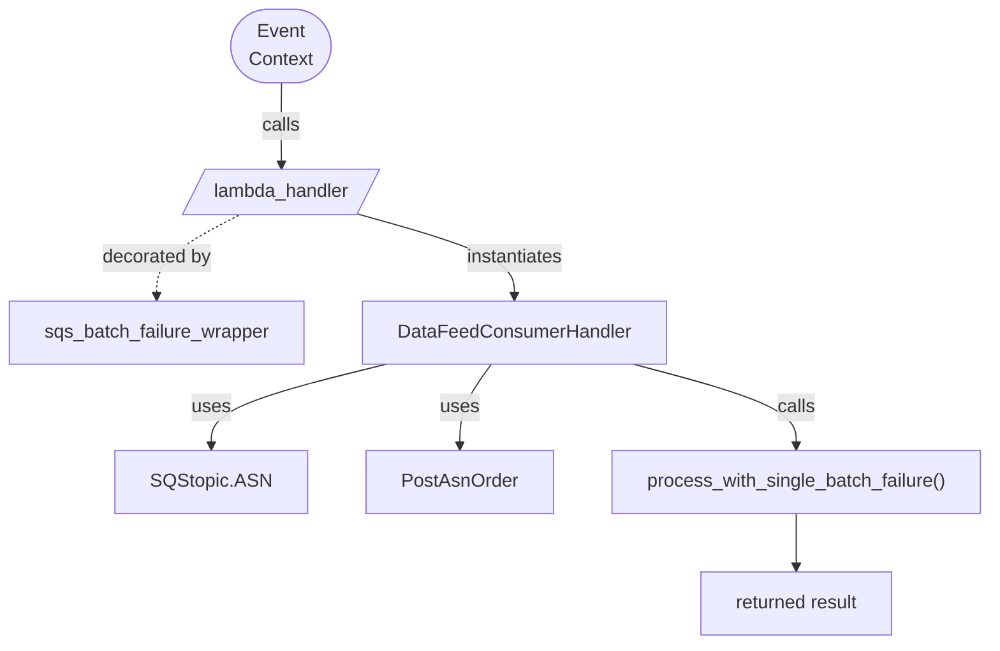

# Diagram: partview_core/partview_service/partview_service/api/public/DataFeedConsumer.py

> Auto-generated by Obscura crawlers

## Mermaid

### SVG

<svg id="container" width="849.546875" xmlns="http://www.w3.org/2000/svg" class="flowchart" height="528" viewBox="0 0 849.546875 528" role="graphics-document document" aria-roledescription="flowchart-v2"><g><marker id="container_flowchart-v2-pointEnd" class="marker flowchart-v2" viewBox="0 0 10 10" refX="5" refY="5" markerUnits="userSpaceOnUse" markerWidth="8" markerHeight="8" orient="auto"><path d="M 0 0 L 10 5 L 0 10 z" class="arrowMarkerPath" style="stroke-width: 1; stroke-dasharray: 1, 0;"></path></marker><marker id="container_flowchart-v2-pointStart" class="marker flowchart-v2" viewBox="0 0 10 10" refX="4.5" refY="5" markerUnits="userSpaceOnUse" markerWidth="8" markerHeight="8" orient="auto"><path d="M 0 5 L 10 10 L 10 0 z" class="arrowMarkerPath" style="stroke-width: 1; stroke-dasharray: 1, 0;"></path></marker><marker id="container_flowchart-v2-circleEnd" class="marker flowchart-v2" viewBox="0 0 10 10" refX="11" refY="5" markerUnits="userSpaceOnUse" markerWidth="11" markerHeight="11" orient="auto"><circle cx="5" cy="5" r="5" class="arrowMarkerPath" style="stroke-width: 1; stroke-dasharray: 1, 0;"></circle></marker><marker id="container_flowchart-v2-circleStart" class="marker flowchart-v2" viewBox="0 0 10 10" refX="-1" refY="5" markerUnits="userSpaceOnUse" markerWidth="11" markerHeight="11" orient="auto"><circle cx="5" cy="5" r="5" class="arrowMarkerPath" style="stroke-width: 1; stroke-dasharray: 1, 0;"></circle></marker><marker id="container_flowchart-v2-crossEnd" class="marker cross flowchart-v2" viewBox="0 0 11 11" refX="12" refY="5.2" markerUnits="userSpaceOnUse" markerWidth="11" markerHeight="11" orient="auto"><path d="M 1,1 l 9,9 M 10,1 l -9,9" class="arrowMarkerPath" style="stroke-width: 2; stroke-dasharray: 1, 0;"></path></marker><marker id="container_flowchart-v2-crossStart" class="marker cross flowchart-v2" viewBox="0 0 11 11" refX="-1" refY="5.2" markerUnits="userSpaceOnUse" markerWidth="11" markerHeight="11" orient="auto"><path d="M 1,1 l 9,9 M 10,1 l -9,9" class="arrowMarkerPath" style="stroke-width: 2; stroke-dasharray: 1, 0;"></path></marker><g class="root"><g class="clusters"></g><g class="edgePaths"><path d="M240.215,47.5L240.132,53.583C240.048,59.667,239.882,71.833,239.873,83.5C239.864,95.167,240.013,106.334,240.087,111.917L240.162,117.5" id="L_EventContext_Lambda_0" class="edge-thickness-normal edge-pattern-solid edge-thickness-normal edge-pattern-solid flowchart-link" style=";" data-edge="true" data-et="edge" data-id="L_EventContext_Lambda_0" data-points="W3sieCI6MjQwLjIxNDg0Mzc1LCJ5Ijo0Ny41fSx7IngiOjIzOS43MTQ4NDM3NSwieSI6ODR9LHsieCI6MjQwLjIxNDg0Mzc1LCJ5IjoxMjEuNX1d" marker-end="url(#container_flowchart-v2-pointEnd)"></path><path d="M204.271,160.5L192.821,166.583C181.371,172.667,158.471,184.833,147.02,196.417C135.57,208,135.57,219,135.57,224.5L135.57,230" id="L_Lambda_Wrapper_0" class="edge-thickness-normal edge-pattern-dotted edge-thickness-normal edge-pattern-solid flowchart-link" style=";" data-edge="true" data-et="edge" data-id="L_Lambda_Wrapper_0" data-points="W3sieCI6MjA0LjI3MTE1NTk3MzQ1MTMzLCJ5IjoxNjAuNX0seyJ4IjoxMzUuNTcwMzEyNSwieSI6MTk3fSx7IngiOjEzNS41NzAzMTI1LCJ5IjoyMzR9XQ==" marker-end="url(#container_flowchart-v2-pointEnd)"></path><path d="M307.86,159.866L330.266,166.055C352.672,172.244,397.485,184.622,419.891,196.311C442.297,208,442.297,219,442.297,224.5L442.297,230" id="L_Lambda_Handler_0" class="edge-thickness-normal edge-pattern-solid edge-thickness-normal edge-pattern-solid flowchart-link" style=";" data-edge="true" data-et="edge" data-id="L_Lambda_Handler_0" data-points="W3sieCI6MzA3Ljg1OTg4ODY4OTc1NTk2LCJ5IjoxNTkuODY2MTYwMTIwNDg4MDV9LHsieCI6NDQyLjI5Njg3NSwieSI6MTk3fSx7IngiOjQ0Mi4yOTY4NzUsInkiOjIzNH1d" marker-end="url(#container_flowchart-v2-pointEnd)"></path><path d="M333.661,288L308.849,294.167C284.037,300.333,234.413,312.667,209.601,324.333C184.789,336,184.789,347,184.789,352.5L184.789,358" id="L_Handler_Topic_0" class="edge-thickness-normal edge-pattern-solid edge-thickness-normal edge-pattern-solid flowchart-link" style=";" data-edge="true" data-et="edge" data-id="L_Handler_Topic_0" data-points="W3sieCI6MzMzLjY2MDc2NjYwMTU2MjUsInkiOjI4OH0seyJ4IjoxODQuNzg5MDYyNSwieSI6MzI1fSx7IngiOjE4NC43ODkwNjI1LCJ5IjozNjJ9XQ==" marker-end="url(#container_flowchart-v2-pointEnd)"></path><path d="M421.533,288L416.79,294.167C412.048,300.333,402.563,312.667,397.821,324.333C393.078,336,393.078,347,393.078,352.5L393.078,358" id="L_Handler_Order_0" class="edge-thickness-normal edge-pattern-solid edge-thickness-normal edge-pattern-solid flowchart-link" style=";" data-edge="true" data-et="edge" data-id="L_Handler_Order_0" data-points="W3sieCI6NDIxLjUzMjcxNDg0Mzc1LCJ5IjoyODh9LHsieCI6MzkzLjA3ODEyNSwieSI6MzI1fSx7IngiOjM5My4wNzgxMjUsInkiOjM2Mn1d" marker-end="url(#container_flowchart-v2-pointEnd)"></path><path d="M543.412,288L566.506,294.167C589.6,300.333,635.788,312.667,658.882,324.333C681.977,336,681.977,347,681.977,352.5L681.977,358" id="L_Handler_Process_0" class="edge-thickness-normal edge-pattern-solid edge-thickness-normal edge-pattern-solid flowchart-link" style=";" data-edge="true" data-et="edge" data-id="L_Handler_Process_0" data-points="W3sieCI6NTQzLjQxMTc0MzE2NDA2MjUsInkiOjI4OH0seyJ4Ijo2ODEuOTc2NTYyNSwieSI6MzI1fSx7IngiOjY4MS45NzY1NjI1LCJ5IjozNjJ9XQ==" marker-end="url(#container_flowchart-v2-pointEnd)"></path><path d="M681.977,416L681.977,420.167C681.977,424.333,681.977,432.667,681.977,440.333C681.977,448,681.977,455,681.977,458.5L681.977,462" id="L_Process_Result_0" class="edge-thickness-normal edge-pattern-solid edge-thickness-normal edge-pattern-solid flowchart-link" style=";" data-edge="true" data-et="edge" data-id="L_Process_Result_0" data-points="W3sieCI6NjgxLjk3NjU2MjUsInkiOjQxNn0seyJ4Ijo2ODEuOTc2NTYyNSwieSI6NDQxfSx7IngiOjY4MS45NzY1NjI1LCJ5Ijo0NjZ9XQ==" marker-end="url(#container_flowchart-v2-pointEnd)"></path></g><g class="edgeLabels"><g class="edgeLabel" transform="translate(239.71484375, 84)"><g class="label" data-id="L_EventContext_Lambda_0" transform="translate(-16.4453125, -12)"><foreignObject width="32.890625" height="24">

calls

</foreignObject></g></g><g class="edgeLabel" transform="translate(135.5703125, 197)"><g class="label" data-id="L_Lambda_Wrapper_0" transform="translate(-47.328125, -12)"><foreignObject width="94.65625" height="24">

decorated by

</foreignObject></g></g><g class="edgeLabel" transform="translate(442.296875, 197)"><g class="label" data-id="L_Lambda_Handler_0" transform="translate(-42.9140625, -12)"><foreignObject width="85.828125" height="24">

instantiates

</foreignObject></g></g><g class="edgeLabel" transform="translate(184.7890625, 325)"><g class="label" data-id="L_Handler_Topic_0" transform="translate(-16.4921875, -12)"><foreignObject width="32.984375" height="24">

uses

</foreignObject></g></g><g class="edgeLabel" transform="translate(393.078125, 325)"><g class="label" data-id="L_Handler_Order_0" transform="translate(-16.4921875, -12)"><foreignObject width="32.984375" height="24">

uses

</foreignObject></g></g><g class="edgeLabel" transform="translate(681.9765625, 325)"><g class="label" data-id="L_Handler_Process_0" transform="translate(-16.4453125, -12)"><foreignObject width="32.890625" height="24">

calls

</foreignObject></g></g><g class="edgeLabel"><g class="label" data-id="L_Process_Result_0" transform="translate(0, 0)"><foreignObject width="0" height="0">

</foreignObject></g></g></g><g class="nodes"><g class="node default" id="flowchart-EventContext-0" transform="translate(239.71484375, 27.5)"><g class="basic label-container outer-path"><path d="M-48.8671875 -19.5 C-14.962105418519734 -19.5, 18.942976662960533 -19.5, 48.8671875 -19.5 C48.8671875 -19.5, 48.8671875 -19.5, 48.8671875 -19.5 C49.17964494716929 -19.489980097830806, 49.49210239433857 -19.479960195661615, 50.1165567896239 -19.45993515863156 C50.39257695755181 -19.433307824994372, 50.668597125479714 -19.406680491357186, 51.360792152847864 -19.3399052695533 C51.837403511806286 -19.262850441213192, 52.31401487076471 -19.18579561287309, 52.59478075967676 -19.140403561325776 C53.0721699095377 -19.031442603125353, 53.549559059398646 -18.922481644924932, 53.81345188623539 -18.862249829261074 C54.18947435137749 -18.750648335389098, 54.56549681651959 -18.639046841517118, 55.011797751460605 -18.50658706670804 C55.30969286172511 -18.39695891241849, 55.60758797198961 -18.28733075812894, 56.1848940951478 -18.074876768247425 C56.42686095483343 -17.967765217156465, 56.66882781451906 -17.860653666065502, 57.32792041279238 -17.568892924097174 C57.618308500825535 -17.417397644572723, 57.908696588858696 -17.265902365048273, 58.43617976407678 -16.990714730406097 C58.80103894530468 -16.769534950595197, 59.16589812653258 -16.548355170784298, 59.5051180736057 -16.342718045390892 C59.85514589790323 -16.098553787621235, 60.20517372220076 -15.854389529851577, 60.53034284457871 -15.627565626425154 C60.89865839827571 -15.33384377364031, 61.2669739519727 -15.040121920855466, 61.507641208501866 -14.848196188198123 C61.728755064158705 -14.647386434842616, 61.94986891981554 -14.446576681487107, 62.43299723676799 -14.007812326905688 C62.723253447078484 -13.708098959282047, 63.01350965738898 -13.408385591658405, 63.30260844296865 -13.10986736009568 C63.62392709195806 -12.732428191443635, 63.94524574094748 -12.354989022791589, 64.11290140812658 -12.158051136245305 C64.39568241626864 -11.77915034721475, 64.67846342441071 -11.400249558184196, 64.86054646464063 -11.156274872382312 C65.10908908694717 -10.774446661480498, 65.35763170925368 -10.392618450578682, 65.54247137860425 -10.108655082055241 C65.74066698840338 -9.756738707375149, 65.93886259820249 -9.404822332695057, 66.1558739742735 -9.019496659696287 C66.34287171348815 -8.631191853106417, 66.5298694527028 -8.242887046516547, 66.69823364880834 -7.893275190886684 C66.80538255650673 -7.628615317288457, 66.91253146420512 -7.363955443690228, 67.16732172997033 -6.734618561215508 C67.30540903361545 -6.318721603860407, 67.44349633726058 -5.902824646505305, 67.56121063421489 -5.548287939305138 C67.6534989226905 -5.196352697350393, 67.7457872111661 -4.844417455395647, 67.87828178754556 -4.339158212148133 C67.96085060775034 -3.915184771322854, 68.04341942795514 -3.4912113304975754, 68.11723227658177 -3.1121979531509023 C68.16211280177993 -2.764113462376222, 68.20699332697806 -2.416028971601541, 68.27708020250937 -1.872449005199798 C68.29797255454899 -1.5470337581796911, 68.3188649065886 -1.2216185111595843, 68.35716871591342 -0.6250057626472757 C68.35716871591342 -0.14348384834515238, 68.35716871591342 0.33803806595697095, 68.35716871591342 0.625005762647271 C68.33681304592234 0.9420617535592654, 68.31645737593128 1.2591177444712596, 68.27708020250937 1.8724490051997846 C68.21465226835258 2.3566277347298685, 68.1522243341958 2.8408064642599524, 68.11723227658177 3.1121979531508885 C68.06680761351102 3.371117940762888, 68.01638295044027 3.6300379283748874, 67.87828178754556 4.339158212148129 C67.78282418242891 4.7031794320456815, 67.68736657731226 5.067200651943235, 67.56121063421489 5.548287939305125 C67.42658176463947 5.95376864426891, 67.29195289506404 6.359249349232695, 67.16732172997033 6.734618561215495 C67.02702044981807 7.0811654357322915, 66.88671916966581 7.427712310249088, 66.69823364880834 7.893275190886679 C66.5206231777499 8.262087134294816, 66.34301270669147 8.630899077702955, 66.1558739742735 9.019496659696284 C65.97281891756141 9.3445294492231, 65.78976386084932 9.669562238749917, 65.54247137860425 10.108655082055236 C65.29719527156298 10.485465048327459, 65.0519191645217 10.86227501459968, 64.86054646464065 11.156274872382301 C64.5866681357084 11.523246882322466, 64.31278980677615 11.890218892262633, 64.11290140812659 12.158051136245302 C63.89686823960294 12.411815988628703, 63.680835071079294 12.665580841012103, 63.30260844296866 13.10986736009567 C63.0512853231487 13.369379115321664, 62.799962203328725 13.628890870547657, 62.43299723676799 14.007812326905684 C62.168787431597494 14.247760681353155, 61.904577626427006 14.487709035800625, 61.50764120850189 14.848196188198111 C61.16451189057072 15.121832688193583, 60.82138257263956 15.395469188189056, 60.53034284457871 15.627565626425152 C60.205672132767496 15.854041860216066, 59.88100142095628 16.08051809400698, 59.50511807360571 16.34271804539089 C59.24243652648791 16.50195714294182, 58.9797549793701 16.661196240492746, 58.43617976407678 16.990714730406093 C58.13795331021848 17.14629928036081, 57.83972685636017 17.301883830315532, 57.32792041279239 17.56889292409717 C56.968392979018184 17.728045054026616, 56.60886554524398 17.88719718395606, 56.184894095147804 18.07487676824742 C55.89771092150393 18.180562830840525, 55.61052774786005 18.286248893433626, 55.01179775146062 18.506587066708033 C54.585833298559336 18.633011080396095, 54.15986884565805 18.759435094084157, 53.81345188623541 18.86224982926107 C53.442255656809294 18.94697294634581, 53.07105942738317 19.03169606343055, 52.594780759676766 19.140403561325773 C52.34089306735953 19.181450154491163, 52.087005375042295 19.222496747656553, 51.36079215284788 19.3399052695533 C51.05844068556791 19.369072751970958, 50.75608921828793 19.398240234388616, 50.1165567896239 19.45993515863156 C49.65005738806369 19.474894886453594, 49.18355798650349 19.48985461427563, 48.86718750000001 19.5 C48.86718750000001 19.5, 48.8671875 19.5, 48.8671875 19.5 C12.187732169685212 19.5, -24.491723160629576 19.5, -48.86718749999999 19.5 C-49.23413741537481 19.48823263043861, -49.60108733074963 19.476465260877223, -50.11655678962389 19.45993515863156 C-50.59010074083891 19.41425294317777, -51.063644692053934 19.368570727723984, -51.36079215284787 19.3399052695533 C-51.819549556367214 19.26573693026909, -52.278306959886564 19.19156859098488, -52.59478075967676 19.140403561325773 C-52.91945399030957 19.066299015124667, -53.24412722094238 18.992194468923557, -53.813451886235384 18.862249829261074 C-54.078234776593284 18.783663657276605, -54.343017666951184 18.705077485292136, -55.01179775146059 18.506587066708043 C-55.45915064663323 18.34195706599968, -55.906503541805876 18.17732706529132, -56.1848940951478 18.074876768247425 C-56.498672231081336 17.93597649536734, -56.812450367014875 17.797076222487252, -57.32792041279238 17.568892924097174 C-57.706473074407754 17.371402243006987, -58.08502573602313 17.1739115619168, -58.43617976407678 16.990714730406097 C-58.81376372565848 16.761821113965613, -59.19134768724018 16.532927497525133, -59.505118073605686 16.3427180453909 C-59.74844189941002 16.17298587782845, -59.99176572521435 16.003253710266, -60.53034284457871 15.627565626425156 C-60.78690753098758 15.422962116487124, -61.04347221739645 15.218358606549092, -61.507641208501866 14.848196188198125 C-61.704342021466644 14.669557714281833, -61.90104283443142 14.490919240365542, -62.432997236767974 14.007812326905697 C-62.70754771473597 13.72431641739029, -62.98209819270398 13.440820507874882, -63.302608442968655 13.109867360095677 C-63.58670015342045 12.776157071722723, -63.870791863872256 12.44244678334977, -64.11290140812658 12.158051136245307 C-64.29561200660694 11.913235579559553, -64.47832260508733 11.6684200228738, -64.86054646464063 11.156274872382316 C-65.04374554251467 10.874831892927315, -65.22694462038872 10.593388913472316, -65.54247137860425 10.108655082055249 C-65.73801741110684 9.761443300163952, -65.93356344360942 9.414231518272658, -66.1558739742735 9.019496659696289 C-66.36538792672964 8.584436454540679, -66.57490187918577 8.149376249385071, -66.69823364880834 7.893275190886686 C-66.8828493132856 7.437270930326805, -67.06746497776285 6.9812666697669234, -67.16732172997033 6.73461856121551 C-67.2993235278299 6.337050177692836, -67.43132532568946 5.939481794170161, -67.56121063421489 5.5482879393051325 C-67.66824281051088 5.140127863049901, -67.77527498680685 4.73196778679467, -67.87828178754556 4.339158212148136 C-67.96640097515683 3.886684807761146, -68.0545201627681 3.4342114033741566, -68.11723227658177 3.112197953150904 C-68.17408764594967 2.6712389356961306, -68.23094301531756 2.230279918241357, -68.27708020250937 1.872449005199809 C-68.29544693575217 1.5863723095828723, -68.31381366899498 1.3002956139659356, -68.35716871591342 0.6250057626472781 C-68.35716871591342 0.23816947762389545, -68.35716871591342 -0.14866680739948723, -68.35716871591342 -0.6250057626472687 C-68.3386315205899 -0.9137375427657343, -68.3200943252664 -1.2024693228841998, -68.27708020250937 -1.8724490051997822 C-68.24073413082589 -2.154341959833207, -68.2043880591424 -2.436234914466633, -68.11723227658177 -3.112197953150895 C-68.02442339290864 -3.5887519556479393, -67.9316145092355 -4.065305958144983, -67.87828178754556 -4.339158212148126 C-67.75535880096437 -4.807916835141593, -67.63243581438319 -5.27667545813506, -67.56121063421489 -5.548287939305123 C-67.41553905603168 -5.987027523178869, -67.26986747784848 -6.425767107052615, -67.16732172997033 -6.734618561215485 C-67.04386404544483 -7.039561428885412, -66.92040636091933 -7.344504296555338, -66.69823364880834 -7.893275190886676 C-66.49453204793687 -8.316265923612326, -66.2908304470654 -8.739256656337977, -66.1558739742735 -9.019496659696282 C-65.97289601740188 -9.344392550649138, -65.78991806053027 -9.669288441601992, -65.54247137860425 -10.108655082055243 C-65.35784331178704 -10.392293372264216, -65.17321524496982 -10.675931662473191, -64.86054646464063 -11.156274872382308 C-64.58672777793795 -11.52316696716837, -64.31290909123527 -11.890059061954434, -64.11290140812659 -12.158051136245302 C-63.83844145941498 -12.480447409215458, -63.563981510703364 -12.802843682185616, -63.30260844296866 -13.10986736009567 C-62.967747449560584 -13.455638828388361, -62.632886456152505 -13.801410296681052, -62.432997236767996 -14.007812326905677 C-62.15537169864548 -14.25994449505933, -61.87774616052297 -14.512076663212982, -61.50764120850189 -14.848196188198107 C-61.173751639797025 -15.114464234065661, -60.839862071092156 -15.380732279933216, -60.53034284457872 -15.627565626425149 C-60.302880273686796 -15.78623366918336, -60.07541770279488 -15.94490171194157, -59.505118073605715 -16.342718045390885 C-59.100866779913346 -16.587777555271494, -58.69661548622098 -16.8328370651521, -58.43617976407679 -16.99071473040609 C-58.0224592498076 -17.20655245769969, -57.60873873553842 -17.422390184993287, -57.32792041279239 -17.56889292409717 C-57.08132658143733 -17.678052698291946, -56.834732750082274 -17.787212472486722, -56.184894095147804 -18.07487676824742 C-55.7749923940911 -18.225724383326078, -55.36509069303439 -18.37657199840473, -55.01179775146062 -18.506587066708033 C-54.76106413234307 -18.581003488734495, -54.510330513225526 -18.655419910760962, -53.81345188623541 -18.862249829261067 C-53.37314166843393 -18.96274776318156, -52.932831450632456 -19.063245697102055, -52.594780759676766 -19.140403561325773 C-52.14363722478039 -19.213340949377454, -51.69249368988401 -19.286278337429135, -51.36079215284788 -19.3399052695533 C-51.094599594284574 -19.36558454553451, -50.82840703572128 -19.39126382151572, -50.1165567896239 -19.45993515863156 C-49.864112963647656 -19.468030540778518, -49.61166913767142 -19.476125922925476, -48.86718750000001 -19.5 C-48.86718750000001 -19.5, -48.8671875 -19.5, -48.8671875 -19.5" stroke="none" stroke-width="0" fill="#ECECFF" style=""></path><path d="M-48.8671875 -19.5 C-28.470514627461625 -19.5, -8.07384175492325 -19.5, 48.8671875 -19.5 M-48.8671875 -19.5 C-23.882288737058207 -19.5, 1.1026100258835854 -19.5, 48.8671875 -19.5 M48.8671875 -19.5 C48.8671875 -19.5, 48.8671875 -19.5, 48.8671875 -19.5 M48.8671875 -19.5 C48.8671875 -19.5, 48.8671875 -19.5, 48.8671875 -19.5 M48.8671875 -19.5 C49.22132295196876 -19.488643565338204, 49.575458403937525 -19.477287130676405, 50.1165567896239 -19.45993515863156 M48.8671875 -19.5 C49.12870724893409 -19.491613570668996, 49.39022699786818 -19.48322714133799, 50.1165567896239 -19.45993515863156 M50.1165567896239 -19.45993515863156 C50.48400151034046 -19.424488208340964, 50.851446231057025 -19.389041258050366, 51.360792152847864 -19.3399052695533 M50.1165567896239 -19.45993515863156 C50.53824425696103 -19.419255475810925, 50.95993172429815 -19.37857579299029, 51.360792152847864 -19.3399052695533 M51.360792152847864 -19.3399052695533 C51.82874242178331 -19.264250699080353, 52.29669269071876 -19.188596128607404, 52.59478075967676 -19.140403561325776 M51.360792152847864 -19.3399052695533 C51.63761464261931 -19.295150756197522, 51.91443713239075 -19.25039624284175, 52.59478075967676 -19.140403561325776 M52.59478075967676 -19.140403561325776 C52.846547524579236 -19.082939440168467, 53.098314289481706 -19.025475319011157, 53.81345188623539 -18.862249829261074 M52.59478075967676 -19.140403561325776 C53.0538008486959 -19.03563522139317, 53.51282093771504 -18.930866881460567, 53.81345188623539 -18.862249829261074 M53.81345188623539 -18.862249829261074 C54.20763642923192 -18.745257926016595, 54.601820972228445 -18.628266022772117, 55.011797751460605 -18.50658706670804 M53.81345188623539 -18.862249829261074 C54.16291420550022 -18.75853124726842, 54.51237652476505 -18.654812665275767, 55.011797751460605 -18.50658706670804 M55.011797751460605 -18.50658706670804 C55.36700514350912 -18.375867462933048, 55.72221253555764 -18.245147859158056, 56.1848940951478 -18.074876768247425 M55.011797751460605 -18.50658706670804 C55.28757144288727 -18.405099799038968, 55.56334513431393 -18.303612531369897, 56.1848940951478 -18.074876768247425 M56.1848940951478 -18.074876768247425 C56.42125554500371 -17.970246565809507, 56.65761699485962 -17.86561636337159, 57.32792041279238 -17.568892924097174 M56.1848940951478 -18.074876768247425 C56.53940926135952 -17.917943420484253, 56.89392442757125 -17.76101007272108, 57.32792041279238 -17.568892924097174 M57.32792041279238 -17.568892924097174 C57.687009514236706 -17.381556369881217, 58.04609861568103 -17.19421981566526, 58.43617976407678 -16.990714730406097 M57.32792041279238 -17.568892924097174 C57.68780993057574 -17.381138793189834, 58.0476994483591 -17.193384662282494, 58.43617976407678 -16.990714730406097 M58.43617976407678 -16.990714730406097 C58.794489785410796 -16.77350508981001, 59.15279980674481 -16.55629544921392, 59.5051180736057 -16.342718045390892 M58.43617976407678 -16.990714730406097 C58.73958987101593 -16.806785740543884, 59.04299997795507 -16.622856750681674, 59.5051180736057 -16.342718045390892 M59.5051180736057 -16.342718045390892 C59.75049009800694 -16.171557143152327, 59.99586212240818 -16.000396240913762, 60.53034284457871 -15.627565626425154 M59.5051180736057 -16.342718045390892 C59.80723131572999 -16.13197692595645, 60.10934455785429 -15.921235806522008, 60.53034284457871 -15.627565626425154 M60.53034284457871 -15.627565626425154 C60.838049005257815 -15.382178151688397, 61.14575516593691 -15.136790676951641, 61.507641208501866 -14.848196188198123 M60.53034284457871 -15.627565626425154 C60.92105273127885 -15.315984889008535, 61.311762617978985 -15.004404151591913, 61.507641208501866 -14.848196188198123 M61.507641208501866 -14.848196188198123 C61.708857448369436 -14.665456923040361, 61.91007368823701 -14.482717657882601, 62.43299723676799 -14.007812326905688 M61.507641208501866 -14.848196188198123 C61.755332619324015 -14.623249402445058, 62.00302403014616 -14.398302616691993, 62.43299723676799 -14.007812326905688 M62.43299723676799 -14.007812326905688 C62.69111006269483 -13.741289642679106, 62.94922288862167 -13.474766958452525, 63.30260844296865 -13.10986736009568 M62.43299723676799 -14.007812326905688 C62.78072879028577 -13.648750948607088, 63.12846034380355 -13.289689570308488, 63.30260844296865 -13.10986736009568 M63.30260844296865 -13.10986736009568 C63.52310153363787 -12.850863629383326, 63.74359462430709 -12.591859898670972, 64.11290140812658 -12.158051136245305 M63.30260844296865 -13.10986736009568 C63.58398411644652 -12.779347483299183, 63.8653597899244 -12.448827606502684, 64.11290140812658 -12.158051136245305 M64.11290140812658 -12.158051136245305 C64.38182870316976 -11.797713060668018, 64.65075599821296 -11.437374985090731, 64.86054646464063 -11.156274872382312 M64.11290140812658 -12.158051136245305 C64.3044161461309 -11.901438834671062, 64.49593088413523 -11.644826533096818, 64.86054646464063 -11.156274872382312 M64.86054646464063 -11.156274872382312 C65.05956105034619 -10.850535025839614, 65.25857563605173 -10.544795179296917, 65.54247137860425 -10.108655082055241 M64.86054646464063 -11.156274872382312 C65.03398943114478 -10.889819899874205, 65.2074323976489 -10.623364927366097, 65.54247137860425 -10.108655082055241 M65.54247137860425 -10.108655082055241 C65.71404264214773 -9.80401293015945, 65.8856139056912 -9.49937077826366, 66.1558739742735 -9.019496659696287 M65.54247137860425 -10.108655082055241 C65.75182251956811 -9.736930932172125, 65.96117366053198 -9.36520678228901, 66.1558739742735 -9.019496659696287 M66.1558739742735 -9.019496659696287 C66.27918908530175 -8.76343019312543, 66.40250419633 -8.507363726554573, 66.69823364880834 -7.893275190886684 M66.1558739742735 -9.019496659696287 C66.31268327964385 -8.693878781913128, 66.46949258501418 -8.36826090412997, 66.69823364880834 -7.893275190886684 M66.69823364880834 -7.893275190886684 C66.8769824590715 -7.451762173663528, 67.05573126933467 -7.010249156440372, 67.16732172997033 -6.734618561215508 M66.69823364880834 -7.893275190886684 C66.80233470528599 -7.636143568729888, 66.90643576176363 -7.379011946573091, 67.16732172997033 -6.734618561215508 M67.16732172997033 -6.734618561215508 C67.25201531528195 -6.4795349763472, 67.33670890059356 -6.224451391478891, 67.56121063421489 -5.548287939305138 M67.16732172997033 -6.734618561215508 C67.25410068447466 -6.473254176597207, 67.34087963897899 -6.211889791978905, 67.56121063421489 -5.548287939305138 M67.56121063421489 -5.548287939305138 C67.63792184070368 -5.255754862116145, 67.71463304719248 -4.963221784927153, 67.87828178754556 -4.339158212148133 M67.56121063421489 -5.548287939305138 C67.63766518289987 -5.256733609558323, 67.71411973158483 -4.965179279811508, 67.87828178754556 -4.339158212148133 M67.87828178754556 -4.339158212148133 C67.93048870962116 -4.071086701226818, 67.98269563169676 -3.803015190305503, 68.11723227658177 -3.1121979531509023 M67.87828178754556 -4.339158212148133 C67.9316595977842 -4.0650744379768735, 67.98503740802285 -3.790990663805613, 68.11723227658177 -3.1121979531509023 M68.11723227658177 -3.1121979531509023 C68.15271019407683 -2.8370382309664683, 68.18818811157189 -2.5618785087820344, 68.27708020250937 -1.872449005199798 M68.11723227658177 -3.1121979531509023 C68.17739192703054 -2.6456115841369146, 68.23755157747932 -2.179025215122927, 68.27708020250937 -1.872449005199798 M68.27708020250937 -1.872449005199798 C68.3024491787347 -1.4773067230211097, 68.32781815496004 -1.0821644408424214, 68.35716871591342 -0.6250057626472757 M68.27708020250937 -1.872449005199798 C68.30136943255812 -1.4941246412768072, 68.32565866260688 -1.1158002773538165, 68.35716871591342 -0.6250057626472757 M68.35716871591342 -0.6250057626472757 C68.35716871591342 -0.35390374204528774, 68.35716871591342 -0.08280172144329978, 68.35716871591342 0.625005762647271 M68.35716871591342 -0.6250057626472757 C68.35716871591342 -0.1667002993708645, 68.35716871591342 0.2916051639055467, 68.35716871591342 0.625005762647271 M68.35716871591342 0.625005762647271 C68.32850224569242 1.0715091754975572, 68.29983577547142 1.5180125883478435, 68.27708020250937 1.8724490051997846 M68.35716871591342 0.625005762647271 C68.32983673976621 1.0507233531141844, 68.30250476361898 1.476440943581098, 68.27708020250937 1.8724490051997846 M68.27708020250937 1.8724490051997846 C68.23590219799537 2.191817476693619, 68.19472419348138 2.511185948187453, 68.11723227658177 3.1121979531508885 M68.27708020250937 1.8724490051997846 C68.23017208028158 2.2362591381420507, 68.18326395805379 2.6000692710843167, 68.11723227658177 3.1121979531508885 M68.11723227658177 3.1121979531508885 C68.02818995529213 3.569411453871898, 67.93914763400251 4.026624954592907, 67.87828178754556 4.339158212148129 M68.11723227658177 3.1121979531508885 C68.035554615144 3.5315954820540743, 67.9538769537062 3.9509930109572604, 67.87828178754556 4.339158212148129 M67.87828178754556 4.339158212148129 C67.79226641959094 4.6671720894553905, 67.70625105163631 4.9951859667626515, 67.56121063421489 5.548287939305125 M67.87828178754556 4.339158212148129 C67.77807825976768 4.721277692048855, 67.67787473198979 5.103397171949581, 67.56121063421489 5.548287939305125 M67.56121063421489 5.548287939305125 C67.43386607550329 5.931829460544392, 67.3065215167917 6.31537098178366, 67.16732172997033 6.734618561215495 M67.56121063421489 5.548287939305125 C67.44121644185218 5.909691328223373, 67.32122224948948 6.271094717141622, 67.16732172997033 6.734618561215495 M67.16732172997033 6.734618561215495 C67.01438115827897 7.112384730197938, 66.86144058658762 7.490150899180381, 66.69823364880834 7.893275190886679 M67.16732172997033 6.734618561215495 C67.049811552203 7.024870972205541, 66.93230137443565 7.315123383195587, 66.69823364880834 7.893275190886679 M66.69823364880834 7.893275190886679 C66.53520714687522 8.231803210359137, 66.3721806449421 8.570331229831595, 66.1558739742735 9.019496659696284 M66.69823364880834 7.893275190886679 C66.56929741004339 8.16101404947566, 66.44036117127844 8.428752908064643, 66.1558739742735 9.019496659696284 M66.1558739742735 9.019496659696284 C65.95143720003935 9.382494853817201, 65.7470004258052 9.74549304793812, 65.54247137860425 10.108655082055236 M66.1558739742735 9.019496659696284 C65.92391497557391 9.43136335028302, 65.69195597687433 9.843230040869756, 65.54247137860425 10.108655082055236 M65.54247137860425 10.108655082055236 C65.33771144746193 10.423221322030082, 65.13295151631961 10.73778756200493, 64.86054646464065 11.156274872382301 M65.54247137860425 10.108655082055236 C65.30718404914592 10.470119603597729, 65.07189671968757 10.831584125140221, 64.86054646464065 11.156274872382301 M64.86054646464065 11.156274872382301 C64.6681483378942 11.414070834392618, 64.47575021114774 11.671866796402934, 64.11290140812659 12.158051136245302 M64.86054646464065 11.156274872382301 C64.62354794304044 11.473831300317094, 64.38654942144024 11.79138772825189, 64.11290140812659 12.158051136245302 M64.11290140812659 12.158051136245302 C63.93046049564558 12.372356613227497, 63.74801958316458 12.586662090209694, 63.30260844296866 13.10986736009567 M64.11290140812659 12.158051136245302 C63.94562124632491 12.354547932808403, 63.77834108452324 12.551044729371505, 63.30260844296866 13.10986736009567 M63.30260844296866 13.10986736009567 C63.06240974523655 13.35789223618391, 62.822211047504446 13.605917112272149, 62.43299723676799 14.007812326905684 M63.30260844296866 13.10986736009567 C63.068472411516076 13.351632035496145, 62.83433638006349 13.593396710896622, 62.43299723676799 14.007812326905684 M62.43299723676799 14.007812326905684 C62.16008089932796 14.255667723598132, 61.88716456188792 14.503523120290579, 61.50764120850189 14.848196188198111 M62.43299723676799 14.007812326905684 C62.08585804518729 14.323074955899582, 61.73871885360658 14.638337584893481, 61.50764120850189 14.848196188198111 M61.50764120850189 14.848196188198111 C61.22550691574289 15.073190778764566, 60.9433726229839 15.29818536933102, 60.53034284457871 15.627565626425152 M61.50764120850189 14.848196188198111 C61.16180577676985 15.123990741937066, 60.81597034503782 15.399785295676022, 60.53034284457871 15.627565626425152 M60.53034284457871 15.627565626425152 C60.256480701483156 15.818600002147514, 59.98261855838759 16.009634377869876, 59.50511807360571 16.34271804539089 M60.53034284457871 15.627565626425152 C60.28547585500443 15.798374238231037, 60.040608865430144 15.969182850036924, 59.50511807360571 16.34271804539089 M59.50511807360571 16.34271804539089 C59.26634839962651 16.48746162492343, 59.02757872564731 16.632205204455975, 58.43617976407678 16.990714730406093 M59.50511807360571 16.34271804539089 C59.1344017589877 16.567448453883205, 58.76368544436969 16.792178862375522, 58.43617976407678 16.990714730406093 M58.43617976407678 16.990714730406093 C58.093104897424745 17.169696668588525, 57.750030030772706 17.348678606770953, 57.32792041279239 17.56889292409717 M58.43617976407678 16.990714730406093 C58.07152012705931 17.180957429462467, 57.706860490041834 17.371200128518836, 57.32792041279239 17.56889292409717 M57.32792041279239 17.56889292409717 C56.993699451436996 17.716842629376643, 56.6594784900816 17.864792334656112, 56.184894095147804 18.07487676824742 M57.32792041279239 17.56889292409717 C57.07662236721309 17.68013511438346, 56.82532432163379 17.791377304669755, 56.184894095147804 18.07487676824742 M56.184894095147804 18.07487676824742 C55.83278838186173 18.20445492556623, 55.48068266857566 18.334033082885036, 55.01179775146062 18.506587066708033 M56.184894095147804 18.07487676824742 C55.71990097548634 18.24599853463212, 55.254907855824875 18.417120301016816, 55.01179775146062 18.506587066708033 M55.01179775146062 18.506587066708033 C54.639224643736505 18.6171648094044, 54.26665153601238 18.72774255210077, 53.81345188623541 18.86224982926107 M55.01179775146062 18.506587066708033 C54.69863215266906 18.599532972589596, 54.3854665538775 18.69247887847116, 53.81345188623541 18.86224982926107 M53.81345188623541 18.86224982926107 C53.38350181893106 18.960383126436895, 52.9535517516267 19.05851642361272, 52.594780759676766 19.140403561325773 M53.81345188623541 18.86224982926107 C53.49435895905607 18.935080707613807, 53.17526603187673 19.007911585966543, 52.594780759676766 19.140403561325773 M52.594780759676766 19.140403561325773 C52.303976633080424 19.187418517294187, 52.01317250648408 19.234433473262598, 51.36079215284788 19.3399052695533 M52.594780759676766 19.140403561325773 C52.11915781701741 19.21729859018393, 51.64353487435805 19.294193619042087, 51.36079215284788 19.3399052695533 M51.36079215284788 19.3399052695533 C50.91806959248861 19.382614182499378, 50.47534703212933 19.42532309544546, 50.1165567896239 19.45993515863156 M51.36079215284788 19.3399052695533 C50.95249521193122 19.379293184394616, 50.544198271014565 19.41868109923593, 50.1165567896239 19.45993515863156 M50.1165567896239 19.45993515863156 C49.79918445363508 19.470112671718944, 49.48181211764626 19.48029018480633, 48.86718750000001 19.5 M50.1165567896239 19.45993515863156 C49.64210533995914 19.475149893158584, 49.16765389029437 19.490364627685608, 48.86718750000001 19.5 M48.86718750000001 19.5 C48.86718750000001 19.5, 48.8671875 19.5, 48.8671875 19.5 M48.86718750000001 19.5 C48.86718750000001 19.5, 48.8671875 19.5, 48.8671875 19.5 M48.8671875 19.5 C15.305696014387458 19.5, -18.255795471225085 19.5, -48.86718749999999 19.5 M48.8671875 19.5 C19.806863290597704 19.5, -9.253460918804592 19.5, -48.86718749999999 19.5 M-48.86718749999999 19.5 C-49.19694200278547 19.489425414923872, -49.52669650557095 19.478850829847744, -50.11655678962389 19.45993515863156 M-48.86718749999999 19.5 C-49.352193105013285 19.484446814253364, -49.83719871002657 19.46889362850673, -50.11655678962389 19.45993515863156 M-50.11655678962389 19.45993515863156 C-50.61413337571282 19.411934543794956, -51.111709961801736 19.363933928958357, -51.36079215284787 19.3399052695533 M-50.11655678962389 19.45993515863156 C-50.53747423974058 19.4193297584461, -50.95839168985727 19.37872435826064, -51.36079215284787 19.3399052695533 M-51.36079215284787 19.3399052695533 C-51.61399212170598 19.298969862183405, -51.86719209056409 19.25803445481351, -52.59478075967676 19.140403561325773 M-51.36079215284787 19.3399052695533 C-51.7952567019513 19.269664410577153, -52.229721251054734 19.19942355160101, -52.59478075967676 19.140403561325773 M-52.59478075967676 19.140403561325773 C-53.05376343953849 19.035643759789227, -53.51274611940023 18.930883958252686, -53.813451886235384 18.862249829261074 M-52.59478075967676 19.140403561325773 C-52.89929853690671 19.070899365837242, -53.20381631413667 19.00139517034871, -53.813451886235384 18.862249829261074 M-53.813451886235384 18.862249829261074 C-54.068771430402506 18.78647232875191, -54.32409097456963 18.710694828242744, -55.01179775146059 18.506587066708043 M-53.813451886235384 18.862249829261074 C-54.208527601877336 18.744993430653295, -54.60360331751928 18.627737032045516, -55.01179775146059 18.506587066708043 M-55.01179775146059 18.506587066708043 C-55.46695278667562 18.33908580634189, -55.92210782189065 18.171584545975733, -56.1848940951478 18.074876768247425 M-55.01179775146059 18.506587066708043 C-55.2828901059671 18.406822574299394, -55.5539824604736 18.307058081890748, -56.1848940951478 18.074876768247425 M-56.1848940951478 18.074876768247425 C-56.49402625600695 17.938033130714818, -56.8031584168661 17.80118949318221, -57.32792041279238 17.568892924097174 M-56.1848940951478 18.074876768247425 C-56.59249437055224 17.89444421735845, -57.000094645956686 17.714011666469478, -57.32792041279238 17.568892924097174 M-57.32792041279238 17.568892924097174 C-57.567695147914826 17.44380259836684, -57.80746988303728 17.318712272636507, -58.43617976407678 16.990714730406097 M-57.32792041279238 17.568892924097174 C-57.60159933554794 17.42611480539532, -57.87527825830349 17.28333668669346, -58.43617976407678 16.990714730406097 M-58.43617976407678 16.990714730406097 C-58.75177809715513 16.799397166232332, -59.06737643023347 16.60807960205857, -59.505118073605686 16.3427180453909 M-58.43617976407678 16.990714730406097 C-58.83437743448462 16.74932496253561, -59.232575104892454 16.507935194665123, -59.505118073605686 16.3427180453909 M-59.505118073605686 16.3427180453909 C-59.85768316027165 16.09678390322934, -60.21024824693762 15.850849761067781, -60.53034284457871 15.627565626425156 M-59.505118073605686 16.3427180453909 C-59.71799840261185 16.194221943317118, -59.93087873161801 16.045725841243335, -60.53034284457871 15.627565626425156 M-60.53034284457871 15.627565626425156 C-60.76115458763148 15.44349940349901, -60.99196633068425 15.259433180572865, -61.507641208501866 14.848196188198125 M-60.53034284457871 15.627565626425156 C-60.73170881176186 15.466981626170027, -60.933074778945006 15.306397625914899, -61.507641208501866 14.848196188198125 M-61.507641208501866 14.848196188198125 C-61.84063977099802 14.545775704398274, -62.17363833349417 14.243355220598424, -62.432997236767974 14.007812326905697 M-61.507641208501866 14.848196188198125 C-61.84184111267099 14.54468467767664, -62.17604101684012 14.241173167155155, -62.432997236767974 14.007812326905697 M-62.432997236767974 14.007812326905697 C-62.64807437814283 13.785727520274456, -62.863151519517686 13.563642713643214, -63.302608442968655 13.109867360095677 M-62.432997236767974 14.007812326905697 C-62.71400126031583 13.71765260173314, -62.99500528386369 13.427492876560585, -63.302608442968655 13.109867360095677 M-63.302608442968655 13.109867360095677 C-63.56481485177188 12.801864792348088, -63.827021260575094 12.493862224600498, -64.11290140812658 12.158051136245307 M-63.302608442968655 13.109867360095677 C-63.59303479367892 12.768716042823891, -63.88346114438918 12.427564725552106, -64.11290140812658 12.158051136245307 M-64.11290140812658 12.158051136245307 C-64.37190540711835 11.811009373346048, -64.63090940611012 11.463967610446788, -64.86054646464063 11.156274872382316 M-64.11290140812658 12.158051136245307 C-64.33242571852465 11.863908559387985, -64.55195002892273 11.569765982530662, -64.86054646464063 11.156274872382316 M-64.86054646464063 11.156274872382316 C-65.1119269292294 10.77008697366762, -65.36330739381818 10.383899074952925, -65.54247137860425 10.108655082055249 M-64.86054646464063 11.156274872382316 C-65.10425448764087 10.781873904286646, -65.34796251064111 10.40747293619098, -65.54247137860425 10.108655082055249 M-65.54247137860425 10.108655082055249 C-65.74483750178467 9.749333538556371, -65.94720362496511 9.390011995057494, -66.1558739742735 9.019496659696289 M-65.54247137860425 10.108655082055249 C-65.72676307378948 9.78142651569613, -65.91105476897472 9.454197949337013, -66.1558739742735 9.019496659696289 M-66.1558739742735 9.019496659696289 C-66.26651839049602 8.78974116199898, -66.37716280671853 8.559985664301673, -66.69823364880834 7.893275190886686 M-66.1558739742735 9.019496659696289 C-66.26829638200383 8.786049124590095, -66.38071878973415 8.552601589483901, -66.69823364880834 7.893275190886686 M-66.69823364880834 7.893275190886686 C-66.80849984562471 7.620915552898371, -66.91876604244108 7.348555914910055, -67.16732172997033 6.73461856121551 M-66.69823364880834 7.893275190886686 C-66.8249764819024 7.580217942738391, -66.95171931499645 7.267160694590095, -67.16732172997033 6.73461856121551 M-67.16732172997033 6.73461856121551 C-67.25695912468869 6.464645010103153, -67.34659651940704 6.194671458990797, -67.56121063421489 5.5482879393051325 M-67.16732172997033 6.73461856121551 C-67.30530002295016 6.319049926615783, -67.44327831592999 5.903481292016055, -67.56121063421489 5.5482879393051325 M-67.56121063421489 5.5482879393051325 C-67.68054358142581 5.093219692363398, -67.79987652863673 4.638151445421664, -67.87828178754556 4.339158212148136 M-67.56121063421489 5.5482879393051325 C-67.67443667873542 5.1165079590702165, -67.78766272325596 4.6847279788353005, -67.87828178754556 4.339158212148136 M-67.87828178754556 4.339158212148136 C-67.96249145169693 3.906759384449641, -68.04670111584831 3.4743605567511464, -68.11723227658177 3.112197953150904 M-67.87828178754556 4.339158212148136 C-67.953388722899 3.953499972964569, -68.02849565825247 3.567841733781002, -68.11723227658177 3.112197953150904 M-68.11723227658177 3.112197953150904 C-68.15096995389445 2.8505351901717777, -68.18470763120712 2.5888724271926513, -68.27708020250937 1.872449005199809 M-68.11723227658177 3.112197953150904 C-68.14953768098518 2.861643616021815, -68.18184308538856 2.6110892788927256, -68.27708020250937 1.872449005199809 M-68.27708020250937 1.872449005199809 C-68.29601906641605 1.5774609126775148, -68.31495793032272 1.2824728201552202, -68.35716871591342 0.6250057626472781 M-68.27708020250937 1.872449005199809 C-68.29688779883628 1.5639297040041298, -68.3166953951632 1.2554104028084505, -68.35716871591342 0.6250057626472781 M-68.35716871591342 0.6250057626472781 C-68.35716871591342 0.14073185043467518, -68.35716871591342 -0.3435420617779278, -68.35716871591342 -0.6250057626472687 M-68.35716871591342 0.6250057626472781 C-68.35716871591342 0.21959082335206914, -68.35716871591342 -0.18582411594313986, -68.35716871591342 -0.6250057626472687 M-68.35716871591342 -0.6250057626472687 C-68.3313735238591 -1.0267867003974158, -68.3055783318048 -1.428567638147563, -68.27708020250937 -1.8724490051997822 M-68.35716871591342 -0.6250057626472687 C-68.33354549052717 -0.9929565663624385, -68.30992226514091 -1.3609073700776082, -68.27708020250937 -1.8724490051997822 M-68.27708020250937 -1.8724490051997822 C-68.23800863988023 -2.175480329398608, -68.1989370772511 -2.478511653597433, -68.11723227658177 -3.112197953150895 M-68.27708020250937 -1.8724490051997822 C-68.23912748932355 -2.16680275405802, -68.20117477613775 -2.461156502916258, -68.11723227658177 -3.112197953150895 M-68.11723227658177 -3.112197953150895 C-68.02594303448426 -3.5809489173334863, -67.93465379238674 -4.049699881516077, -67.87828178754556 -4.339158212148126 M-68.11723227658177 -3.112197953150895 C-68.04822225323646 -3.4665498377554975, -67.97921222989115 -3.8209017223600994, -67.87828178754556 -4.339158212148126 M-67.87828178754556 -4.339158212148126 C-67.78146413637454 -4.708365877098673, -67.68464648520353 -5.077573542049221, -67.56121063421489 -5.548287939305123 M-67.87828178754556 -4.339158212148126 C-67.75907488498531 -4.793745796208768, -67.63986798242505 -5.24833338026941, -67.56121063421489 -5.548287939305123 M-67.56121063421489 -5.548287939305123 C-67.40750184184932 -6.01123433173996, -67.25379304948376 -6.474180724174797, -67.16732172997033 -6.734618561215485 M-67.56121063421489 -5.548287939305123 C-67.44854103976913 -5.887630806313726, -67.33587144532336 -6.226973673322329, -67.16732172997033 -6.734618561215485 M-67.16732172997033 -6.734618561215485 C-67.06965183017276 -6.975865102034528, -66.9719819303752 -7.21711164285357, -66.69823364880834 -7.893275190886676 M-67.16732172997033 -6.734618561215485 C-67.06292670008429 -6.992476303374595, -66.95853167019825 -7.2503340455337035, -66.69823364880834 -7.893275190886676 M-66.69823364880834 -7.893275190886676 C-66.58262162708701 -8.13334602769202, -66.46700960536566 -8.373416864497367, -66.1558739742735 -9.019496659696282 M-66.69823364880834 -7.893275190886676 C-66.49746705638792 -8.310171315764602, -66.2967004639675 -8.727067440642529, -66.1558739742735 -9.019496659696282 M-66.1558739742735 -9.019496659696282 C-65.9188903297486 -9.440285117746411, -65.68190668522371 -9.86107357579654, -65.54247137860425 -10.108655082055243 M-66.1558739742735 -9.019496659696282 C-65.94674784364486 -9.390821280944456, -65.73762171301621 -9.762145902192628, -65.54247137860425 -10.108655082055243 M-65.54247137860425 -10.108655082055243 C-65.31319990969433 -10.460877626310609, -65.08392844078442 -10.813100170565976, -64.86054646464063 -11.156274872382308 M-65.54247137860425 -10.108655082055243 C-65.27376809821158 -10.5214554776721, -65.00506481781889 -10.934255873288958, -64.86054646464063 -11.156274872382308 M-64.86054646464063 -11.156274872382308 C-64.69322920427064 -11.380464758362109, -64.52591194390064 -11.604654644341911, -64.11290140812659 -12.158051136245302 M-64.86054646464063 -11.156274872382308 C-64.6874401489989 -11.388221565032458, -64.51433383335716 -11.620168257682607, -64.11290140812659 -12.158051136245302 M-64.11290140812659 -12.158051136245302 C-63.79488681657007 -12.531609171030471, -63.47687222501355 -12.905167205815639, -63.30260844296866 -13.10986736009567 M-64.11290140812659 -12.158051136245302 C-63.81517605870557 -12.507776272727536, -63.51745070928454 -12.857501409209773, -63.30260844296866 -13.10986736009567 M-63.30260844296866 -13.10986736009567 C-63.04141781847208 -13.379568124037473, -62.78022719397549 -13.649268887979273, -62.432997236767996 -14.007812326905677 M-63.30260844296866 -13.10986736009567 C-63.074050128189356 -13.345872585091923, -62.84549181341006 -13.581877810088178, -62.432997236767996 -14.007812326905677 M-62.432997236767996 -14.007812326905677 C-62.16746000133186 -14.248966218398524, -61.901922765895726 -14.490120109891372, -61.50764120850189 -14.848196188198107 M-62.432997236767996 -14.007812326905677 C-62.165126549091745 -14.251085397983235, -61.89725586141549 -14.494358469060792, -61.50764120850189 -14.848196188198107 M-61.50764120850189 -14.848196188198107 C-61.286866663770454 -15.024258012564056, -61.06609211903901 -15.200319836930005, -60.53034284457872 -15.627565626425149 M-61.50764120850189 -14.848196188198107 C-61.25405392004134 -15.05042530250424, -61.00046663158079 -15.252654416810373, -60.53034284457872 -15.627565626425149 M-60.53034284457872 -15.627565626425149 C-60.19545842132603 -15.861166503173191, -59.86057399807334 -16.094767379921233, -59.505118073605715 -16.342718045390885 M-60.53034284457872 -15.627565626425149 C-60.20326357539457 -15.855721965574649, -59.87618430621043 -16.08387830472415, -59.505118073605715 -16.342718045390885 M-59.505118073605715 -16.342718045390885 C-59.11922892647892 -16.576646314115493, -58.733339779352114 -16.8105745828401, -58.43617976407679 -16.99071473040609 M-59.505118073605715 -16.342718045390885 C-59.24204583956409 -16.502193979650965, -58.97897360552247 -16.661669913911044, -58.43617976407679 -16.99071473040609 M-58.43617976407679 -16.99071473040609 C-58.19158811374126 -17.118318037717707, -57.94699646340573 -17.245921345029323, -57.32792041279239 -17.56889292409717 M-58.43617976407679 -16.99071473040609 C-58.06409519983382 -17.18483100924011, -57.69201063559085 -17.37894728807413, -57.32792041279239 -17.56889292409717 M-57.32792041279239 -17.56889292409717 C-56.96920501967906 -17.727685587714376, -56.61048962656574 -17.88647825133158, -56.184894095147804 -18.07487676824742 M-57.32792041279239 -17.56889292409717 C-56.95183827484662 -17.735373330485515, -56.57575613690085 -17.90185373687386, -56.184894095147804 -18.07487676824742 M-56.184894095147804 -18.07487676824742 C-55.874496257057345 -18.189106041950872, -55.564098418966886 -18.303335315654323, -55.01179775146062 -18.506587066708033 M-56.184894095147804 -18.07487676824742 C-55.754937057577614 -18.23310493255254, -55.324980020007416 -18.391333096857657, -55.01179775146062 -18.506587066708033 M-55.01179775146062 -18.506587066708033 C-54.7681694639073 -18.57889466362288, -54.52454117635398 -18.65120226053773, -53.81345188623541 -18.862249829261067 M-55.01179775146062 -18.506587066708033 C-54.57926793474293 -18.634959645914503, -54.14673811802525 -18.763332225120976, -53.81345188623541 -18.862249829261067 M-53.81345188623541 -18.862249829261067 C-53.44478898583675 -18.94639473052681, -53.0761260854381 -19.030539631792546, -52.594780759676766 -19.140403561325773 M-53.81345188623541 -18.862249829261067 C-53.37359991744285 -18.96264317083563, -52.93374794865029 -19.063036512410193, -52.594780759676766 -19.140403561325773 M-52.594780759676766 -19.140403561325773 C-52.330750311024055 -19.183089956677232, -52.06671986237134 -19.225776352028696, -51.36079215284788 -19.3399052695533 M-52.594780759676766 -19.140403561325773 C-52.16904165884231 -19.20923375749265, -51.743302558007855 -19.27806395365953, -51.36079215284788 -19.3399052695533 M-51.36079215284788 -19.3399052695533 C-51.09813624147375 -19.36524336943361, -50.83548033009963 -19.390581469313922, -50.1165567896239 -19.45993515863156 M-51.36079215284788 -19.3399052695533 C-51.07196869399613 -19.367767721267697, -50.78314523514438 -19.395630172982095, -50.1165567896239 -19.45993515863156 M-50.1165567896239 -19.45993515863156 C-49.80469802430823 -19.46993586223897, -49.49283925899256 -19.47993656584638, -48.86718750000001 -19.5 M-50.1165567896239 -19.45993515863156 C-49.68849461870457 -19.47366227928047, -49.26043244778524 -19.487389399929384, -48.86718750000001 -19.5 M-48.86718750000001 -19.5 C-48.86718750000001 -19.5, -48.8671875 -19.5, -48.8671875 -19.5 M-48.86718750000001 -19.5 C-48.86718750000001 -19.5, -48.8671875 -19.5, -48.8671875 -19.5" stroke="#9370DB" stroke-width="1.3" fill="none" stroke-dasharray="0 0" style=""></path></g><g class="label" style="" transform="translate(-55.9921875, -12)"><rect></rect><foreignObject width="111.984375" height="24">

Event\nContext

</foreignObject></g></g><g class="node default" id="flowchart-Lambda-1" transform="translate(239.71484375, 140.5)"><polygon points="-19.5,0 134.65625,0 154.15625,-39 0,-39" class="label-container" transform="translate(-67.328125,19.5)"></polygon><g class="label" style="" transform="translate(-59.828125, -12)"><rect></rect><foreignObject width="119.65625" height="24">

lambda_handler

</foreignObject></g></g><g class="node default" id="flowchart-Wrapper-3" transform="translate(135.5703125, 261)"><rect class="basic label-container" style="" x="-127.5703125" y="-27" width="255.140625" height="54"></rect><g class="label" style="" transform="translate(-97.5703125, -12)"><rect></rect><foreignObject width="195.140625" height="24">

sqs_batch_failure_wrapper

</foreignObject></g></g><g class="node default" id="flowchart-Handler-5" transform="translate(442.296875, 261)"><rect class="basic label-container" style="" x="-129.15625" y="-27" width="258.3125" height="54"></rect><g class="label" style="" transform="translate(-99.15625, -12)"><rect></rect><foreignObject width="198.3125" height="24">

DataFeedConsumerHandler

</foreignObject></g></g><g class="node default" id="flowchart-Topic-7" transform="translate(184.7890625, 389)"><rect class="basic label-container" style="" x="-78.9609375" y="-27" width="157.921875" height="54"></rect><g class="label" style="" transform="translate(-48.9609375, -12)"><rect></rect><foreignObject width="97.921875" height="24">

SQStopic.ASN

</foreignObject></g></g><g class="node default" id="flowchart-Order-9" transform="translate(393.078125, 389)"><rect class="basic label-container" style="" x="-79.328125" y="-27" width="158.65625" height="54"></rect><g class="label" style="" transform="translate(-49.328125, -12)"><rect></rect><foreignObject width="98.65625" height="24">

PostAsnOrder

</foreignObject></g></g><g class="node default" id="flowchart-Process-11" transform="translate(681.9765625, 389)"><rect class="basic label-container" style="" x="-159.5703125" y="-27" width="319.140625" height="54"></rect><g class="label" style="" transform="translate(-129.5703125, -12)"><rect></rect><foreignObject width="259.140625" height="24">

process_with_single_batch_failure()

</foreignObject></g></g><g class="node default" id="flowchart-Result-13" transform="translate(681.9765625, 493)"><rect class="basic label-container" style="" x="-84.625" y="-27" width="169.25" height="54"></rect><g class="label" style="" transform="translate(-54.625, -12)"><rect></rect><foreignObject width="109.25" height="24">

returned result

</foreignObject></g></g></g></g></g></svg>
