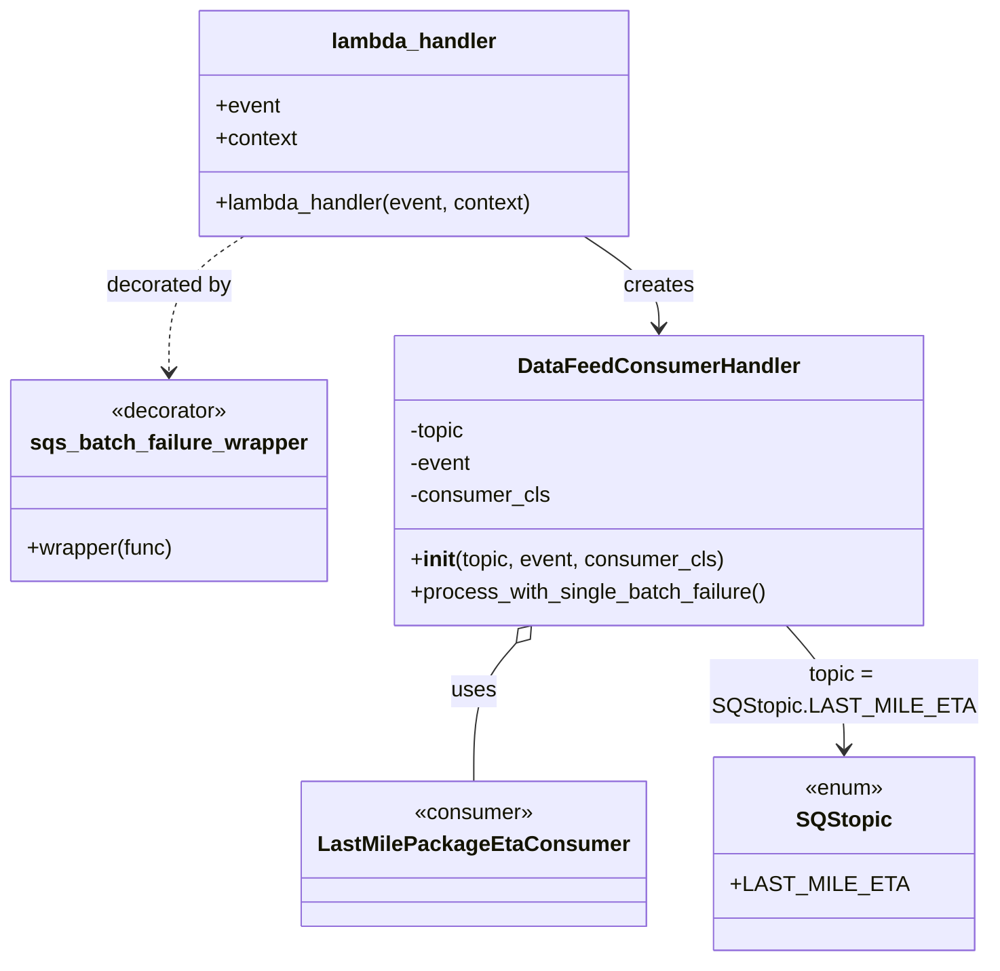
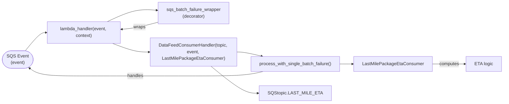

# Diagram: partview_core/partview_service/partview_service/api/public/LastMileEtaProcessor.py

> Auto-generated by Obscura crawlers

## Diagram 1

### SVG

<svg id="container" width="722.78125" xmlns="http://www.w3.org/2000/svg" class="classDiagram" height="716" viewBox="0 0 722.78125 716" role="graphics-document document" aria-roledescription="class"><g><defs><marker id="container_class-aggregationStart" class="marker aggregation class" refX="18" refY="7" markerWidth="190" markerHeight="240" orient="auto"><path d="M 18,7 L9,13 L1,7 L9,1 Z"></path></marker></defs><defs><marker id="container_class-aggregationEnd" class="marker aggregation class" refX="1" refY="7" markerWidth="20" markerHeight="28" orient="auto"><path d="M 18,7 L9,13 L1,7 L9,1 Z"></path></marker></defs><defs><marker id="container_class-extensionStart" class="marker extension class" refX="18" refY="7" markerWidth="190" markerHeight="240" orient="auto"><path d="M 1,7 L18,13 V 1 Z"></path></marker></defs><defs><marker id="container_class-extensionEnd" class="marker extension class" refX="1" refY="7" markerWidth="20" markerHeight="28" orient="auto"><path d="M 1,1 V 13 L18,7 Z"></path></marker></defs><defs><marker id="container_class-compositionStart" class="marker composition class" refX="18" refY="7" markerWidth="190" markerHeight="240" orient="auto"><path d="M 18,7 L9,13 L1,7 L9,1 Z"></path></marker></defs><defs><marker id="container_class-compositionEnd" class="marker composition class" refX="1" refY="7" markerWidth="20" markerHeight="28" orient="auto"><path d="M 18,7 L9,13 L1,7 L9,1 Z"></path></marker></defs><defs><marker id="container_class-dependencyStart" class="marker dependency class" refX="6" refY="7" markerWidth="190" markerHeight="240" orient="auto"><path d="M 5,7 L9,13 L1,7 L9,1 Z"></path></marker></defs><defs><marker id="container_class-dependencyEnd" class="marker dependency class" refX="13" refY="7" markerWidth="20" markerHeight="28" orient="auto"><path d="M 18,7 L9,13 L14,7 L9,1 Z"></path></marker></defs><defs><marker id="container_class-lollipopStart" class="marker lollipop class" refX="13" refY="7" markerWidth="190" markerHeight="240" orient="auto"><circle stroke="black" fill="transparent" cx="7" cy="7" r="6"></circle></marker></defs><defs><marker id="container_class-lollipopEnd" class="marker lollipop class" refX="1" refY="7" markerWidth="190" markerHeight="240" orient="auto"><circle stroke="black" fill="transparent" cx="7" cy="7" r="6"></circle></marker></defs><g class="root"><g class="clusters"></g><g class="edgePaths"><path d="M179.669,176L170.449,182.167C161.23,188.333,142.791,200.667,133.571,217.5C124.352,234.333,124.352,255.667,124.352,266.333L124.352,277" id="id_lambda_handler_sqs_batch_failure_wrapper_1" class="edge-thickness-normal edge-pattern-dashed relation" style=";;;" data-edge="true" data-et="edge" data-id="id_lambda_handler_sqs_batch_failure_wrapper_1" data-points="W3sieCI6MTc5LjY2ODgwODEwOTUwNDE0LCJ5IjoxNzZ9LHsieCI6MTI0LjM1MTU2MjUsInkiOjIxM30seyJ4IjoxMjQuMzUxNTYyNSwieSI6MjgzfV0=" marker-end="url(#container_class-dependencyEnd)"></path><path d="M430.839,176L440.059,182.167C449.278,188.333,467.717,200.667,476.937,212C486.156,223.333,486.156,233.667,486.156,238.833L486.156,244" id="id_lambda_handler_DataFeedConsumerHandler_2" class="edge-thickness-normal edge-pattern-solid relation" style=";;;" data-edge="true" data-et="edge" data-id="id_lambda_handler_DataFeedConsumerHandler_2" data-points="W3sieCI6NDMwLjgzOTAwNDM5MDQ5NTg2LCJ5IjoxNzZ9LHsieCI6NDg2LjE1NjI1LCJ5IjoyMTN9LHsieCI6NDg2LjE1NjI1LCJ5IjoyNTB9XQ==" marker-end="url(#container_class-dependencyEnd)"></path><path d="M386.743,479.344L381.875,485.286C377.006,491.229,367.269,503.115,362.4,520.224C357.531,537.333,357.531,559.667,357.531,570.833L357.531,582" id="id_DataFeedConsumerHandler_LastMilePackageEtaConsumer_3" class="edge-thickness-normal edge-pattern-solid relation" style=";;;" data-edge="true" data-et="edge" data-id="id_DataFeedConsumerHandler_LastMilePackageEtaConsumer_3" data-points="W3sieCI6Mzk3LjY3NTM1ODI4MDI1NDgsInkiOjQ2Nn0seyJ4IjozNTcuNTMxMjUsInkiOjUxNX0seyJ4IjozNTcuNTMxMjUsInkiOjU4Mn1d" marker-start="url(#container_class-aggregationStart)"></path><path d="M574.637,466L581.328,474.167C588.019,482.333,601.4,498.667,608.091,514C614.781,529.333,614.781,543.667,614.781,550.833L614.781,558" id="id_DataFeedConsumerHandler_SQStopic_4" class="edge-thickness-normal edge-pattern-solid relation" style=";;;" data-edge="true" data-et="edge" data-id="id_DataFeedConsumerHandler_SQStopic_4" data-points="W3sieCI6NTc0LjYzNzE0MTcxOTc0NTIsInkiOjQ2Nn0seyJ4Ijo2MTQuNzgxMjUsInkiOjUxNX0seyJ4Ijo2MTQuNzgxMjUsInkiOjU2NH1d" marker-end="url(#container_class-dependencyEnd)"></path></g><g class="edgeLabels"><g class="edgeLabel" transform="translate(124.3515625, 213)"><g class="label" data-id="id_lambda_handler_sqs_batch_failure_wrapper_1" transform="translate(-47.328125, -12)"><foreignObject width="94.65625" height="24">

decorated by

</foreignObject></g></g><g class="edgeLabel" transform="translate(486.15625, 213)"><g class="label" data-id="id_lambda_handler_DataFeedConsumerHandler_2" transform="translate(-26.171875, -12)"><foreignObject width="52.34375" height="24">

creates

</foreignObject></g></g><g class="edgeLabel" transform="translate(357.53125, 515)"><g class="label" data-id="id_DataFeedConsumerHandler_LastMilePackageEtaConsumer_3" transform="translate(-16.4921875, -12)"><foreignObject width="32.984375" height="24">

uses

</foreignObject></g></g><g class="edgeLabel" transform="translate(614.78125, 515)"><g class="label" data-id="id_DataFeedConsumerHandler_SQStopic_4" transform="translate(-100, -24)"><foreignObject width="200" height="48">

topic = SQStopic.LAST_MILE_ETA

</foreignObject></g></g></g><g class="nodes"><g class="node default" id="classId-lambda_handler-0" transform="translate(305.25390625, 92)"><g class="basic label-container"><path d="M-162.08203125 -84 L162.08203125 -84 L162.08203125 84 L-162.08203125 84" stroke="none" stroke-width="0" fill="#ECECFF" style=""></path><path d="M-162.08203125 -84 C-65.58755814139977 -84, 30.906914967200464 -84, 162.08203125 -84 M-162.08203125 -84 C-52.30134217319397 -84, 57.479346903612054 -84, 162.08203125 -84 M162.08203125 -84 C162.08203125 -37.48347980557303, 162.08203125 9.033040388853934, 162.08203125 84 M162.08203125 -84 C162.08203125 -36.78982956703764, 162.08203125 10.420340865924715, 162.08203125 84 M162.08203125 84 C95.41419262815475 84, 28.746354006309502 84, -162.08203125 84 M162.08203125 84 C60.94007671342243 84, -40.201877823155144 84, -162.08203125 84 M-162.08203125 84 C-162.08203125 40.4336227941088, -162.08203125 -3.1327544117824004, -162.08203125 -84 M-162.08203125 84 C-162.08203125 16.851901808880328, -162.08203125 -50.296196382239344, -162.08203125 -84" stroke="#9370DB" stroke-width="1.3" fill="none" stroke-dasharray="0 0" style=""></path></g><g class="annotation-group text" transform="translate(0, -60)"></g><g class="label-group text" transform="translate(-59.9765625, -60)"><g class="label" style="font-weight: bolder" transform="translate(0,-12)"><foreignObject width="119.953125" height="24">

lambda_handler

</foreignObject></g></g><g class="members-group text" transform="translate(-150.08203125, -12)"><g class="label" style="" transform="translate(0,-12)"><foreignObject width="48.328125" height="24">

+event

</foreignObject></g><g class="label" style="" transform="translate(0,12)"><foreignObject width="61.6875" height="24">

+context

</foreignObject></g></g><g class="methods-group text" transform="translate(-150.08203125, 60)"><g class="label" style="" transform="translate(0,-12)"><foreignObject width="240.1875" height="24">

+lambda_handler(event, context)

</foreignObject></g></g><g class="divider" style=""><path d="M-162.08203125 -36 C-81.54237867824581 -36, -1.0027261064916217 -36, 162.08203125 -36 M-162.08203125 -36 C-65.83772744937482 -36, 30.40657635125035 -36, 162.08203125 -36" stroke="#9370DB" stroke-width="1.3" fill="none" stroke-dasharray="0 0" style=""></path></g><g class="divider" style=""><path d="M-162.08203125 36 C-33.249231205332904 36, 95.58356883933419 36, 162.08203125 36 M-162.08203125 36 C-38.08644121779672 36, 85.90914881440656 36, 162.08203125 36" stroke="#9370DB" stroke-width="1.3" fill="none" stroke-dasharray="0 0" style=""></path></g></g><g class="node default" id="classId-sqs_batch_failure_wrapper-1" transform="translate(124.3515625, 358)"><g class="basic label-container"><path d="M-116.3515625 -75 L116.3515625 -75 L116.3515625 75 L-116.3515625 75" stroke="none" stroke-width="0" fill="#ECECFF" style=""></path><path d="M-116.3515625 -75 C-24.57333701591766 -75, 67.20488846816468 -75, 116.3515625 -75 M-116.3515625 -75 C-56.639229106325814 -75, 3.0731042873483716 -75, 116.3515625 -75 M116.3515625 -75 C116.3515625 -33.391506780486935, 116.3515625 8.21698643902613, 116.3515625 75 M116.3515625 -75 C116.3515625 -35.64847633821921, 116.3515625 3.7030473235615773, 116.3515625 75 M116.3515625 75 C45.51981006398444 75, -25.311942372031126 75, -116.3515625 75 M116.3515625 75 C59.202980895579984 75, 2.0543992911599673 75, -116.3515625 75 M-116.3515625 75 C-116.3515625 18.636306739365935, -116.3515625 -37.72738652126813, -116.3515625 -75 M-116.3515625 75 C-116.3515625 18.935965056628888, -116.3515625 -37.128069886742225, -116.3515625 -75" stroke="#9370DB" stroke-width="1.3" fill="none" stroke-dasharray="0 0" style=""></path></g><g class="annotation-group text" transform="translate(-44.0625, -51)"><g class="label" style="" transform="translate(0,-12)"><foreignObject width="88.125" height="24">

«decorator»

</foreignObject></g></g><g class="label-group text" transform="translate(-98.953125, -27)"><g class="label" style="font-weight: bolder" transform="translate(0,-12)"><foreignObject width="197.90625" height="24">

sqs_batch_failure_wrapper

</foreignObject></g></g><g class="members-group text" transform="translate(-104.3515625, 21)"></g><g class="methods-group text" transform="translate(-104.3515625, 51)"><g class="label" style="" transform="translate(0,-12)"><foreignObject width="109.75" height="24">

+wrapper(func)

</foreignObject></g></g><g class="divider" style=""><path d="M-116.3515625 -3 C-56.0971345950987 -3, 4.157293309802597 -3, 116.3515625 -3 M-116.3515625 -3 C-28.439633195986843 -3, 59.47229610802631 -3, 116.3515625 -3" stroke="#9370DB" stroke-width="1.3" fill="none" stroke-dasharray="0 0" style=""></path></g><g class="divider" style=""><path d="M-116.3515625 21 C-33.927655457136424 21, 48.49625158572715 21, 116.3515625 21 M-116.3515625 21 C-48.75477458560407 21, 18.842013328791865 21, 116.3515625 21" stroke="#9370DB" stroke-width="1.3" fill="none" stroke-dasharray="0 0" style=""></path></g></g><g class="node default" id="classId-DataFeedConsumerHandler-2" transform="translate(486.15625, 358)"><g class="basic label-container"><path d="M-195.453125 -108 L195.453125 -108 L195.453125 108 L-195.453125 108" stroke="none" stroke-width="0" fill="#ECECFF" style=""></path><path d="M-195.453125 -108 C-108.46180233333936 -108, -21.470479666678727 -108, 195.453125 -108 M-195.453125 -108 C-50.36319047252525 -108, 94.7267440549495 -108, 195.453125 -108 M195.453125 -108 C195.453125 -28.370558048065874, 195.453125 51.25888390386825, 195.453125 108 M195.453125 -108 C195.453125 -34.946376545691535, 195.453125 38.10724690861693, 195.453125 108 M195.453125 108 C53.119848389016425 108, -89.21342822196715 108, -195.453125 108 M195.453125 108 C50.03951287003994 108, -95.37409925992011 108, -195.453125 108 M-195.453125 108 C-195.453125 55.29716698857797, -195.453125 2.594333977155941, -195.453125 -108 M-195.453125 108 C-195.453125 44.835246419419434, -195.453125 -18.329507161161132, -195.453125 -108" stroke="#9370DB" stroke-width="1.3" fill="none" stroke-dasharray="0 0" style=""></path></g><g class="annotation-group text" transform="translate(0, -84)"></g><g class="label-group text" transform="translate(-99.78125, -84)"><g class="label" style="font-weight: bolder" transform="translate(0,-12)"><foreignObject width="199.5625" height="24">

DataFeedConsumerHandler

</foreignObject></g></g><g class="members-group text" transform="translate(-183.453125, -36)"><g class="label" style="" transform="translate(0,-12)"><foreignObject width="42.921875" height="24">

-topic

</foreignObject></g><g class="label" style="" transform="translate(0,12)"><foreignObject width="46.796875" height="24">

-event

</foreignObject></g><g class="label" style="" transform="translate(0,36)"><foreignObject width="104.421875" height="24">

-consumer_cls

</foreignObject></g></g><g class="methods-group text" transform="translate(-183.453125, 60)"><g class="label" style="" transform="translate(0,-12)"><foreignObject width="234.03125" height="24">

+<strong>init</strong>(topic, event, consumer_cls)

</foreignObject></g><g class="label" style="" transform="translate(0,12)"><foreignObject width="267.125" height="24">

+process_with_single_batch_failure()

</foreignObject></g></g><g class="divider" style=""><path d="M-195.453125 -60 C-100.79273789948981 -60, -6.1323507989796155 -60, 195.453125 -60 M-195.453125 -60 C-87.43189391981915 -60, 20.58933716036171 -60, 195.453125 -60" stroke="#9370DB" stroke-width="1.3" fill="none" stroke-dasharray="0 0" style=""></path></g><g class="divider" style=""><path d="M-195.453125 36 C-58.170241929367364 36, 79.11264114126527 36, 195.453125 36 M-195.453125 36 C-94.14526553741129 36, 7.162593925177418 36, 195.453125 36" stroke="#9370DB" stroke-width="1.3" fill="none" stroke-dasharray="0 0" style=""></path></g></g><g class="node default" id="classId-LastMilePackageEtaConsumer-3" transform="translate(357.53125, 636)"><g class="basic label-container"><path d="M-120.421875 -54 L120.421875 -54 L120.421875 54 L-120.421875 54" stroke="none" stroke-width="0" fill="#ECECFF" style=""></path><path d="M-120.421875 -54 C-27.76150949350557 -54, 64.89885601298886 -54, 120.421875 -54 M-120.421875 -54 C-29.21493989850029 -54, 61.99199520299942 -54, 120.421875 -54 M120.421875 -54 C120.421875 -14.455464130168522, 120.421875 25.089071739662955, 120.421875 54 M120.421875 -54 C120.421875 -10.896387225936834, 120.421875 32.20722554812633, 120.421875 54 M120.421875 54 C45.07944389394207 54, -30.26298721211586 54, -120.421875 54 M120.421875 54 C39.390566512529304 54, -41.64074197494139 54, -120.421875 54 M-120.421875 54 C-120.421875 16.339532622206384, -120.421875 -21.32093475558723, -120.421875 -54 M-120.421875 54 C-120.421875 24.25260434440598, -120.421875 -5.494791311188038, -120.421875 -54" stroke="#9370DB" stroke-width="1.3" fill="none" stroke-dasharray="0 0" style=""></path></g><g class="annotation-group text" transform="translate(-44.609375, -30)"><g class="label" style="" transform="translate(0,-12)"><foreignObject width="89.21875" height="24">

«consumer»

</foreignObject></g></g><g class="label-group text" transform="translate(-108.421875, -6)"><g class="label" style="font-weight: bolder" transform="translate(0,-12)"><foreignObject width="216.84375" height="24">

LastMilePackageEtaConsumer

</foreignObject></g></g><g class="members-group text" transform="translate(-108.421875, 42)"></g><g class="methods-group text" transform="translate(-108.421875, 72)"></g><g class="divider" style=""><path d="M-120.421875 18 C-68.62727981611121 18, -16.83268463222244 18, 120.421875 18 M-120.421875 18 C-64.47598455837556 18, -8.53009411675113 18, 120.421875 18" stroke="#9370DB" stroke-width="1.3" fill="none" stroke-dasharray="0 0" style=""></path></g><g class="divider" style=""><path d="M-120.421875 36 C-48.017869159259575 36, 24.38613668148085 36, 120.421875 36 M-120.421875 36 C-71.43328271704203 36, -22.444690434084052 36, 120.421875 36" stroke="#9370DB" stroke-width="1.3" fill="none" stroke-dasharray="0 0" style=""></path></g></g><g class="node default" id="classId-SQStopic-4" transform="translate(614.78125, 636)"><g class="basic label-container"><path d="M-86.828125 -72 L86.828125 -72 L86.828125 72 L-86.828125 72" stroke="none" stroke-width="0" fill="#ECECFF" style=""></path><path d="M-86.828125 -72 C-41.722973467826186 -72, 3.3821780643476274 -72, 86.828125 -72 M-86.828125 -72 C-22.967814253137448 -72, 40.892496493725105 -72, 86.828125 -72 M86.828125 -72 C86.828125 -17.371375692634736, 86.828125 37.25724861473053, 86.828125 72 M86.828125 -72 C86.828125 -31.86816548635764, 86.828125 8.26366902728472, 86.828125 72 M86.828125 72 C35.033821684758884 72, -16.760481630482232 72, -86.828125 72 M86.828125 72 C20.837779328915985 72, -45.15256634216803 72, -86.828125 72 M-86.828125 72 C-86.828125 32.46877427003102, -86.828125 -7.062451459937961, -86.828125 -72 M-86.828125 72 C-86.828125 25.677470793189464, -86.828125 -20.645058413621072, -86.828125 -72" stroke="#9370DB" stroke-width="1.3" fill="none" stroke-dasharray="0 0" style=""></path></g><g class="annotation-group text" transform="translate(-29.53125, -48)"><g class="label" style="" transform="translate(0,-12)"><foreignObject width="59.0625" height="24">

«enum»

</foreignObject></g></g><g class="label-group text" transform="translate(-33.15625, -24)"><g class="label" style="font-weight: bolder" transform="translate(0,-12)"><foreignObject width="66.3125" height="24">

SQStopic

</foreignObject></g></g><g class="members-group text" transform="translate(-74.828125, 24)"><g class="label" style="" transform="translate(0,-12)"><foreignObject width="116.5" height="24">

+LAST_MILE_ETA

</foreignObject></g></g><g class="methods-group text" transform="translate(-74.828125, 72)"></g><g class="divider" style=""><path d="M-86.828125 0 C-18.18638495106663 0, 50.45535509786674 0, 86.828125 0 M-86.828125 0 C-24.272095977700573 0, 38.283933044598854 0, 86.828125 0" stroke="#9370DB" stroke-width="1.3" fill="none" stroke-dasharray="0 0" style=""></path></g><g class="divider" style=""><path d="M-86.828125 48 C-27.69694516246085 48, 31.4342346750783 48, 86.828125 48 M-86.828125 48 C-43.48241219669031 48, -0.1366993933806242 48, 86.828125 48" stroke="#9370DB" stroke-width="1.3" fill="none" stroke-dasharray="0 0" style=""></path></g></g></g></g></g></svg>

## Diagram 2

### SVG

<svg id="container" width="1889.08935546875" xmlns="http://www.w3.org/2000/svg" class="flowchart" height="346" viewBox="0 0 1889.08935546875 346" role="graphics-document document" aria-roledescription="flowchart-v2"><g><marker id="container_flowchart-v2-pointEnd" class="marker flowchart-v2" viewBox="0 0 10 10" refX="5" refY="5" markerUnits="userSpaceOnUse" markerWidth="8" markerHeight="8" orient="auto"><path d="M 0 0 L 10 5 L 0 10 z" class="arrowMarkerPath" style="stroke-width: 1; stroke-dasharray: 1, 0;"></path></marker><marker id="container_flowchart-v2-pointStart" class="marker flowchart-v2" viewBox="0 0 10 10" refX="4.5" refY="5" markerUnits="userSpaceOnUse" markerWidth="8" markerHeight="8" orient="auto"><path d="M 0 5 L 10 10 L 10 0 z" class="arrowMarkerPath" style="stroke-width: 1; stroke-dasharray: 1, 0;"></path></marker><marker id="container_flowchart-v2-circleEnd" class="marker flowchart-v2" viewBox="0 0 10 10" refX="11" refY="5" markerUnits="userSpaceOnUse" markerWidth="11" markerHeight="11" orient="auto"><circle cx="5" cy="5" r="5" class="arrowMarkerPath" style="stroke-width: 1; stroke-dasharray: 1, 0;"></circle></marker><marker id="container_flowchart-v2-circleStart" class="marker flowchart-v2" viewBox="0 0 10 10" refX="-1" refY="5" markerUnits="userSpaceOnUse" markerWidth="11" markerHeight="11" orient="auto"><circle cx="5" cy="5" r="5" class="arrowMarkerPath" style="stroke-width: 1; stroke-dasharray: 1, 0;"></circle></marker><marker id="container_flowchart-v2-crossEnd" class="marker cross flowchart-v2" viewBox="0 0 11 11" refX="12" refY="5.2" markerUnits="userSpaceOnUse" markerWidth="11" markerHeight="11" orient="auto"><path d="M 1,1 l 9,9 M 10,1 l -9,9" class="arrowMarkerPath" style="stroke-width: 2; stroke-dasharray: 1, 0;"></path></marker><marker id="container_flowchart-v2-crossStart" class="marker cross flowchart-v2" viewBox="0 0 11 11" refX="-1" refY="5.2" markerUnits="userSpaceOnUse" markerWidth="11" markerHeight="11" orient="auto"><path d="M 1,1 l 9,9 M 10,1 l -9,9" class="arrowMarkerPath" style="stroke-width: 2; stroke-dasharray: 1, 0;"></path></marker><g class="root"><g class="clusters"></g><g class="edgePaths"><path d="M114.128,171L128.132,159C142.136,147,170.144,123,187.648,111C205.152,99,212.152,99,215.652,99L219.152,99" id="L_Event_Lambda_0" class="edge-thickness-normal edge-pattern-solid edge-thickness-normal edge-pattern-solid flowchart-link" style=";" data-edge="true" data-et="edge" data-id="L_Event_Lambda_0" data-points="W3sieCI6MTE0LjEyNzkwMjk4NDYxOTE0LCJ5IjoxNzF9LHsieCI6MTk4LjE1MTg0MDIwOTk2MDk0LCJ5Ijo5OX0seyJ4IjoyMjMuMTUxODQwMjA5OTYwOTQsInkiOjk5fV0=" marker-end="url(#container_flowchart-v2-pointEnd)"></path><path d="M442.81,60L458.519,53.167C474.229,46.333,505.647,32.667,529.677,26.411C553.707,20.156,570.348,21.312,578.669,21.89L586.99,22.469" id="L_Lambda_Decorator_0" class="edge-thickness-normal edge-pattern-solid edge-thickness-normal edge-pattern-solid flowchart-link" style=";" data-edge="true" data-et="edge" data-id="L_Lambda_Decorator_0" data-points="W3sieCI6NDQyLjgwOTk0NTY3ODcxMDk2LCJ5Ijo2MH0seyJ4Ijo1MzcuMDY1OTAyNzA5OTYwOSwieSI6MTl9LHsieCI6NTkwLjk3OTk2NTIwOTk2MDksInkiOjIyLjc0NTgzNTczNjMzNjgwNH1d" marker-end="url(#container_flowchart-v2-pointEnd)"></path><path d="M465.224,138L477.198,142.167C489.172,146.333,513.119,154.667,537.117,158.833C561.115,163,585.165,163,597.19,163L609.214,163" id="L_Lambda_Instantiate_0" class="edge-thickness-normal edge-pattern-solid edge-thickness-normal edge-pattern-solid flowchart-link" style=";" data-edge="true" data-et="edge" data-id="L_Lambda_Instantiate_0" data-points="W3sieCI6NDY1LjIyNDQ3MjA0NTg5ODQ0LCJ5IjoxMzh9LHsieCI6NTM3LjA2NTkwMjcwOTk2MDksInkiOjE2M30seyJ4Ijo2MTMuMjE0MzQwMjA5OTYwOSwieSI6MTYzfV0=" marker-end="url(#container_flowchart-v2-pointEnd)"></path><path d="M921.496,163L929.368,163C937.24,163,952.985,163,971.655,165.515C990.324,168.031,1011.918,173.062,1022.715,175.577L1033.512,178.092" id="L_Instantiate_HandlerProcess_0" class="edge-thickness-normal edge-pattern-solid edge-thickness-normal edge-pattern-solid flowchart-link" style=";" data-edge="true" data-et="edge" data-id="L_Instantiate_HandlerProcess_0" data-points="W3sieCI6OTIxLjQ5NTU5MDIwOTk2MDksInkiOjE2M30seyJ4Ijo5NjguNzI5OTY1MjA5OTYwOSwieSI6MTYzfSx7IngiOjEwMzcuNDA3MjkwNzkxMzU2MiwieSI6MTc5fV0=" marker-end="url(#container_flowchart-v2-pointEnd)"></path><path d="M1312.871,206L1317.037,206C1321.204,206,1329.537,206,1337.204,206C1344.871,206,1351.871,206,1355.371,206L1358.871,206" id="L_HandlerProcess_Consumer_0" class="edge-thickness-normal edge-pattern-solid edge-thickness-normal edge-pattern-solid flowchart-link" style=";" data-edge="true" data-et="edge" data-id="L_HandlerProcess_Consumer_0" data-points="W3sieCI6MTMxMi44NzA1OTAyMDk5NjEsInkiOjIwNn0seyJ4IjoxMzM3Ljg3MDU5MDIwOTk2MSwieSI6MjA2fSx7IngiOjEzNjIuODcwNTkwMjA5OTYxLCJ5IjoyMDZ9XQ==" marker-end="url(#container_flowchart-v2-pointEnd)"></path><path d="M836.748,214L858.745,230.167C880.742,246.333,924.736,278.667,957.031,294.833C989.326,311,1009.923,311,1020.221,311L1030.519,311" id="L_Instantiate_Topic_0" class="edge-thickness-normal edge-pattern-solid edge-thickness-normal edge-pattern-solid flowchart-link" style=";" data-edge="true" data-et="edge" data-id="L_Instantiate_Topic_0" data-points="W3sieCI6ODM2Ljc0NzcwMTY5NjQ0NzQsInkiOjIxNH0seyJ4Ijo5NjguNzI5OTY1MjA5OTYwOSwieSI6MzExfSx7IngiOjEwMzQuNTE5MDI3NzA5OTYxLCJ5IjozMTF9XQ==" marker-end="url(#container_flowchart-v2-pointEnd)"></path><path d="M637.817,62L621.025,65.5C604.234,69,570.65,76,545.536,80.224C520.423,84.448,503.78,85.896,495.458,86.62L487.137,87.344" id="L_Decorator_Lambda_0" class="edge-thickness-normal edge-pattern-solid edge-thickness-normal edge-pattern-solid flowchart-link" style=";" data-edge="true" data-et="edge" data-id="L_Decorator_Lambda_0" data-points="W3sieCI6NjM3LjgxNzM2NzU1MzcxMDksInkiOjYyfSx7IngiOjUzNy4wNjU5MDI3MDk5NjA5LCJ5Ijo4M30seyJ4Ijo0ODMuMTUxODQwMjA5OTYwOTQsInkiOjg3LjY5MDM2OTk5Mjc3ODU2fV0=" marker-end="url(#container_flowchart-v2-pointEnd)"></path><path d="M1037.407,233L1025.961,235.667C1014.515,238.333,991.622,243.667,946.614,246.333C901.605,249,834.48,249,762.536,249C690.592,249,613.829,249,544.795,249C475.761,249,414.457,249,357.971,249C301.485,249,249.819,249,212.65,242.819C175.482,236.638,152.812,224.277,141.477,218.096L130.142,211.915" id="L_HandlerProcess_Event_0" class="edge-thickness-normal edge-pattern-solid edge-thickness-normal edge-pattern-solid flowchart-link" style=";" data-edge="true" data-et="edge" data-id="L_HandlerProcess_Event_0" data-points="W3sieCI6MTAzNy40MDcyOTA3OTEzNTYyLCJ5IjoyMzN9LHsieCI6OTY4LjcyOTk2NTIwOTk2MDksInkiOjI0OX0seyJ4Ijo3NjcuMzU0OTY1MjA5OTYwOSwieSI6MjQ5fSx7IngiOjUzNy4wNjU5MDI3MDk5NjA5LCJ5IjoyNDl9LHsieCI6MzUzLjE1MTg0MDIwOTk2MDk0LCJ5IjoyNDl9LHsieCI6MTk4LjE1MTg0MDIwOTk2MDk0LCJ5IjoyNDl9LHsieCI6MTI2LjYzMDY3MzM2MDAxNjM5LCJ5IjoyMTB9XQ==" marker-end="url(#container_flowchart-v2-pointEnd)"></path><path d="M1636.277,206L1646.355,206C1656.433,206,1676.589,206,1696.079,206C1715.569,206,1734.391,206,1743.803,206L1753.214,206" id="L_Consumer_ETA_0" class="edge-thickness-normal edge-pattern-solid edge-thickness-normal edge-pattern-solid flowchart-link" style=";" data-edge="true" data-et="edge" data-id="L_Consumer_ETA_0" data-points="W3sieCI6MTYzNi4yNzY4NDAyMDk5NjEsInkiOjIwNn0seyJ4IjoxNjk2Ljc0NTU5MDIwOTk2MSwieSI6MjA2fSx7IngiOjE3NTcuMjE0MzQwMjA5OTYxLCJ5IjoyMDZ9XQ==" marker-end="url(#container_flowchart-v2-pointEnd)"></path></g><g class="edgeLabels"><g class="edgeLabel"><g class="label" data-id="L_Event_Lambda_0" transform="translate(0, 0)"><foreignObject width="0" height="0">

</foreignObject></g></g><g class="edgeLabel"><g class="label" data-id="L_Lambda_Decorator_0" transform="translate(0, 0)"><foreignObject width="0" height="0">

</foreignObject></g></g><g class="edgeLabel"><g class="label" data-id="L_Lambda_Instantiate_0" transform="translate(0, 0)"><foreignObject width="0" height="0">

</foreignObject></g></g><g class="edgeLabel"><g class="label" data-id="L_Instantiate_HandlerProcess_0" transform="translate(0, 0)"><foreignObject width="0" height="0">

</foreignObject></g></g><g class="edgeLabel"><g class="label" data-id="L_HandlerProcess_Consumer_0" transform="translate(0, 0)"><foreignObject width="0" height="0">

</foreignObject></g></g><g class="edgeLabel"><g class="label" data-id="L_Instantiate_Topic_0" transform="translate(0, 0)"><foreignObject width="0" height="0">

</foreignObject></g></g><g class="edgeLabel" transform="translate(560.95208, 78.02132)"><g class="label" data-id="L_Decorator_Lambda_0" transform="translate(-21.390625, -12)"><foreignObject width="42.78125" height="24">

wraps

</foreignObject></g></g><g class="edgeLabel" transform="translate(537.0659027099609, 249)"><g class="label" data-id="L_HandlerProcess_Event_0" transform="translate(-28.9140625, -12)"><foreignObject width="57.828125" height="24">

handles

</foreignObject></g></g><g class="edgeLabel" transform="translate(1696.745590209961, 206)"><g class="label" data-id="L_Consumer_ETA_0" transform="translate(-35.46875, -12)"><foreignObject width="70.9375" height="24">

computes

</foreignObject></g></g></g><g class="nodes"><g class="node default" id="flowchart-Event-0" transform="translate(90.57592010498047, 190)"><g class="basic label-container outer-path"><path d="M-63.0859375 -19.5 C-35.77612002831329 -19.5, -8.466302556626566 -19.5, 63.0859375 -19.5 C63.0859375 -19.5, 63.0859375 -19.5, 63.0859375 -19.5 C63.3723790818362 -19.490814375995228, 63.6588206636724 -19.48162875199046, 64.3353067896239 -19.45993515863156 C64.65773402352407 -19.42883099115269, 64.98016125742424 -19.397726823673825, 65.57954215284786 -19.3399052695533 C65.92939868801372 -19.283343178125634, 66.27925522317958 -19.226781086697972, 66.81353075967675 -19.140403561325776 C67.0714337900433 -19.081538877619167, 67.32933682040985 -19.022674193912554, 68.03220188623538 -18.862249829261074 C68.35503173686445 -18.766435624162835, 68.67786158749351 -18.670621419064595, 69.2305477514606 -18.50658706670804 C69.50521683862506 -18.40550630361831, 69.77988592578951 -18.304425540528584, 70.4036440951478 -18.074876768247425 C70.67129181611293 -17.95639706166371, 70.93893953707806 -17.837917355080002, 71.54667041279238 -17.568892924097174 C71.77156974305748 -17.451563087552767, 71.99646907332259 -17.33423325100836, 72.65492976407678 -16.990714730406097 C72.90539716352768 -16.838879920949143, 73.15586456297858 -16.68704511149219, 73.7238680736057 -16.342718045390892 C73.9435234301182 -16.189495977414897, 74.16317878663072 -16.036273909438897, 74.74909284457871 -15.627565626425154 C75.02147941877769 -15.41034458201263, 75.29386599297665 -15.193123537600108, 75.72639120850187 -14.848196188198123 C75.92317660384174 -14.669480898806695, 76.11996199918161 -14.490765609415266, 76.65174723676799 -14.007812326905688 C76.97481833890528 -13.674214889318158, 77.29788944104257 -13.340617451730628, 77.52135844296865 -13.10986736009568 C77.795294186257 -12.788086848643816, 78.06922992954536 -12.466306337191952, 78.33165140812658 -12.158051136245305 C78.53120447692642 -11.89066820371207, 78.73075754572628 -11.623285271178833, 79.07929646464063 -11.156274872382312 C79.25796571507244 -10.88179092430757, 79.43663496550424 -10.607306976232826, 79.76122137860425 -10.108655082055241 C79.8874518018282 -9.884520183404705, 80.01368222505215 -9.66038528475417, 80.3746239742735 -9.019496659696287 C80.53719376997272 -8.681917000490465, 80.69976356567194 -8.34433734128464, 80.91698364880834 -7.893275190886684 C81.0509358522618 -7.562410658566965, 81.18488805571526 -7.231546126247246, 81.38607172997033 -6.734618561215508 C81.54085828218794 -6.268426127824008, 81.69564483440556 -5.802233694432508, 81.77996063421489 -5.548287939305138 C81.87808855986019 -5.174083629907573, 81.9762164855055 -4.7998793205100085, 82.09703178754556 -4.339158212148133 C82.16313219849502 -3.999746572249435, 82.2292326094445 -3.660334932350737, 82.33598227658177 -3.1121979531509023 C82.39200482650865 -2.6776981188218025, 82.44802737643553 -2.243198284492703, 82.49583020250937 -1.872449005199798 C82.51940990483168 -1.5051761083367787, 82.54298960715397 -1.1379032114737597, 82.57591871591342 -0.6250057626472757 C82.57591871591342 -0.21444554076459166, 82.57591871591342 0.19611468111809238, 82.57591871591342 0.625005762647271 C82.5557224983722 0.939578152945117, 82.53552628083098 1.2541505432429632, 82.49583020250937 1.8724490051997846 C82.44407668958229 2.2738390315750974, 82.39232317665521 2.6752290579504105, 82.33598227658177 3.1121979531508885 C82.24401657750552 3.584422380950074, 82.15205087842926 4.05664680874926, 82.09703178754556 4.339158212148129 C82.00572875276553 4.687336254749958, 81.91442571798551 5.035514297351788, 81.77996063421489 5.548287939305125 C81.69153985382165 5.814597241911352, 81.60311907342843 6.080906544517578, 81.38607172997033 6.734618561215495 C81.26911477565673 7.023504499578943, 81.15215782134315 7.3123904379423905, 80.91698364880834 7.893275190886679 C80.74939913027201 8.241268029361654, 80.58181461173567 8.589260867836629, 80.3746239742735 9.019496659696284 C80.1813078834751 9.362748954285712, 79.98799179267671 9.70600124887514, 79.76122137860425 10.108655082055236 C79.56527459138736 10.4096819663001, 79.36932780417048 10.710708850544966, 79.07929646464065 11.156274872382301 C78.8691590342096 11.437839885246156, 78.65902160377857 11.71940489811001, 78.33165140812659 12.158051136245302 C78.15411665458053 12.366593559774149, 77.97658190103448 12.575135983302996, 77.52135844296866 13.10986736009567 C77.34262322786398 13.294426144125325, 77.16388801275929 13.478984928154977, 76.65174723676799 14.007812326905684 C76.3048696455881 14.322837377337132, 75.95799205440821 14.63786242776858, 75.7263912085019 14.848196188198111 C75.42862836284505 15.085654133807342, 75.1308655171882 15.323112079416573, 74.74909284457871 15.627565626425152 C74.3999556957017 15.871108587578165, 74.05081854682471 16.114651548731178, 73.7238680736057 16.34271804539089 C73.30661416859434 16.595659814664895, 72.88936026358297 16.848601583938905, 72.65492976407678 16.990714730406093 C72.22755169629733 17.213677594617916, 71.80017362851788 17.436640458829736, 71.54667041279238 17.56889292409717 C71.30285798025422 17.676821455542974, 71.05904554771604 17.784749986988782, 70.4036440951478 18.07487676824742 C69.93801270998772 18.246233422235672, 69.47238132482764 18.417590076223924, 69.23054775146062 18.506587066708033 C68.93898548305725 18.593121217528576, 68.64742321465387 18.67965536834912, 68.03220188623541 18.86224982926107 C67.61611675882887 18.957218544382407, 67.20003163142233 19.052187259503743, 66.81353075967677 19.140403561325773 C66.48957130099811 19.192778814261814, 66.16561184231944 19.24515406719786, 65.57954215284788 19.3399052695533 C65.19149550003023 19.377339663456237, 64.80344884721256 19.41477405735918, 64.3353067896239 19.45993515863156 C64.00596605617721 19.470496474930346, 63.67662532273053 19.48105779122913, 63.08593750000001 19.5 C63.08593750000001 19.5, 63.0859375 19.5, 63.0859375 19.5 C23.27813079494154 19.5, -16.52967591011692 19.5, -63.08593749999999 19.5 C-63.501657228966465 19.48666867744141, -63.917376957932944 19.47333735488282, -64.3353067896239 19.45993515863156 C-64.60120161198734 19.434284604903468, -64.86709643435078 19.408634051175376, -65.57954215284786 19.3399052695533 C-66.03356557377025 19.266502283862785, -66.48758899469262 19.193099298172267, -66.81353075967675 19.140403561325773 C-67.21542483583836 19.048673861045827, -67.61731891199999 18.956944160765882, -68.03220188623538 18.862249829261074 C-68.47668377890214 18.730329936650648, -68.92116567156889 18.59841004404022, -69.23054775146059 18.506587066708043 C-69.6716791363861 18.344246639281636, -70.11281052131162 18.181906211855228, -70.4036440951478 18.074876768247425 C-70.75465305770415 17.919495512834654, -71.1056620202605 17.764114257421884, -71.54667041279238 17.568892924097174 C-71.81243849436014 17.430241886175853, -72.07820657592791 17.291590848254533, -72.65492976407678 16.990714730406097 C-72.9460606062863 16.814229502983956, -73.2371914484958 16.637744275561815, -73.72386807360569 16.3427180453909 C-74.12476391533629 16.063070460700917, -74.52565975706689 15.783422876010935, -74.74909284457871 15.627565626425156 C-75.00835375603516 15.420811948761237, -75.26761466749161 15.214058271097318, -75.72639120850187 14.848196188198125 C-76.0138507556863 14.587133033208055, -76.30131030287075 14.326069878217982, -76.65174723676797 14.007812326905697 C-76.95866661303 13.690892872365728, -77.26558598929203 13.37397341782576, -77.52135844296865 13.109867360095677 C-77.72840022057787 12.866664307105005, -77.93544199818709 12.623461254114332, -78.33165140812658 12.158051136245307 C-78.56748381534896 11.842057195341582, -78.80331622257137 11.526063254437855, -79.07929646464063 11.156274872382316 C-79.28267550586445 10.84383005014316, -79.48605454708826 10.531385227904003, -79.76122137860425 10.108655082055249 C-79.88797493965434 9.883591299220951, -80.01472850070444 9.658527516386654, -80.3746239742735 9.019496659696289 C-80.53748873831637 8.681304492413576, -80.70035350235923 8.34311232513086, -80.91698364880834 7.893275190886686 C-81.06865253478927 7.518650110195377, -81.22032142077019 7.144025029504069, -81.38607172997033 6.73461856121551 C-81.50540567823072 6.375203722337833, -81.62473962649109 6.015788883460157, -81.77996063421489 5.5482879393051325 C-81.87597903622883 5.182128157787309, -81.97199743824277 4.815968376269486, -82.09703178754556 4.339158212148136 C-82.15121278799361 4.060950226005848, -82.20539378844168 3.782742239863559, -82.33598227658177 3.112197953150904 C-82.38609751189175 2.7235140844592953, -82.43621274720174 2.334830215767686, -82.49583020250937 1.872449005199809 C-82.51984310141515 1.4984287218792245, -82.54385600032091 1.1244084385586397, -82.57591871591342 0.6250057626472781 C-82.57591871591342 0.23797049476631266, -82.57591871591342 -0.14906477311465283, -82.57591871591342 -0.6250057626472687 C-82.55712026228626 -0.91780685172891, -82.5383218086591 -1.2106079408105512, -82.49583020250937 -1.8724490051997822 C-82.44657461444288 -2.254465619627439, -82.3973190263764 -2.6364822340550953, -82.33598227658177 -3.112197953150895 C-82.28039428597103 -3.3976305364110964, -82.22480629536028 -3.6830631196712975, -82.09703178754556 -4.339158212148126 C-81.9858140938449 -4.763279480282156, -81.87459640014421 -5.187400748416185, -81.77996063421489 -5.548287939305123 C-81.66157826392906 -5.9048367769368015, -81.54319589364323 -6.261385614568479, -81.38607172997033 -6.734618561215485 C-81.27651562973172 -7.005224246927951, -81.16695952949311 -7.275829932640417, -80.91698364880834 -7.893275190886676 C-80.73156543229287 -8.278300084795344, -80.5461472157774 -8.663324978704013, -80.3746239742735 -9.019496659696282 C-80.23219915463471 -9.272386349041819, -80.08977433499592 -9.525276038387357, -79.76122137860425 -10.108655082055243 C-79.51245277285192 -10.490830464214874, -79.26368416709958 -10.873005846374504, -79.07929646464063 -11.156274872382308 C-78.80811689159641 -11.51963079529423, -78.5369373185522 -11.882986718206151, -78.33165140812659 -12.158051136245302 C-78.15978813794658 -12.359931512695857, -77.98792486776655 -12.561811889146412, -77.52135844296866 -13.10986736009567 C-77.24728672475517 -13.392868910857638, -76.97321500654168 -13.675870461619606, -76.65174723676799 -14.007812326905677 C-76.29677416280128 -14.33018948060937, -75.9418010888346 -14.652566634313064, -75.7263912085019 -14.848196188198107 C-75.39530290044183 -15.112230303246102, -75.06421459238177 -15.376264418294099, -74.74909284457871 -15.627565626425149 C-74.43594000517247 -15.84600749102702, -74.12278716576621 -16.06444935562889, -73.72386807360571 -16.342718045390885 C-73.31836117951707 -16.588538707610436, -72.91285428542844 -16.83435936982999, -72.65492976407678 -16.99071473040609 C-72.42170293638915 -17.112389017021812, -72.18847610870154 -17.234063303637534, -71.5466704127924 -17.56889292409717 C-71.27204977916976 -17.690459332270255, -70.99742914554713 -17.812025740443335, -70.40364409514781 -18.07487676824742 C-69.9794211076875 -18.230994749107126, -69.55519812022717 -18.38711272996683, -69.23054775146062 -18.506587066708033 C-68.82738614202769 -18.626243316149253, -68.42422453259476 -18.745899565590474, -68.03220188623541 -18.862249829261067 C-67.65040751084305 -18.949391904003235, -67.2686131354507 -19.036533978745403, -66.81353075967677 -19.140403561325773 C-66.50363063540603 -19.190505810106508, -66.19373051113529 -19.240608058887243, -65.57954215284788 -19.3399052695533 C-65.11875980732805 -19.38435638825375, -64.6579774618082 -19.4288075069542, -64.3353067896239 -19.45993515863156 C-63.89333784383512 -19.47410824248264, -63.45136889804633 -19.48828132633372, -63.08593750000001 -19.5 C-63.08593750000001 -19.5, -63.0859375 -19.5, -63.0859375 -19.5" stroke="none" stroke-width="0" fill="#ECECFF" style=""></path><path d="M-63.0859375 -19.5 C-30.745350774976288 -19.5, 1.5952359500474245 -19.5, 63.0859375 -19.5 M-63.0859375 -19.5 C-24.26428095371147 -19.5, 14.55737559257706 -19.5, 63.0859375 -19.5 M63.0859375 -19.5 C63.0859375 -19.5, 63.0859375 -19.5, 63.0859375 -19.5 M63.0859375 -19.5 C63.0859375 -19.5, 63.0859375 -19.5, 63.0859375 -19.5 M63.0859375 -19.5 C63.47952114339741 -19.487378538620334, 63.87310478679482 -19.474757077240668, 64.3353067896239 -19.45993515863156 M63.0859375 -19.5 C63.410266384267324 -19.489599403949423, 63.734595268534655 -19.479198807898847, 64.3353067896239 -19.45993515863156 M64.3353067896239 -19.45993515863156 C64.6325745663186 -19.43125809373063, 64.9298423430133 -19.402581028829697, 65.57954215284786 -19.3399052695533 M64.3353067896239 -19.45993515863156 C64.6929751697312 -19.425431320161767, 65.05064354983851 -19.39092748169198, 65.57954215284786 -19.3399052695533 M65.57954215284786 -19.3399052695533 C65.8413824269006 -19.297572964646104, 66.10322270095332 -19.255240659738913, 66.81353075967675 -19.140403561325776 M65.57954215284786 -19.3399052695533 C65.87870206819545 -19.291539414459695, 66.17786198354304 -19.24317355936609, 66.81353075967675 -19.140403561325776 M66.81353075967675 -19.140403561325776 C67.11135989881411 -19.072426003834437, 67.40918903795146 -19.004448446343098, 68.03220188623538 -18.862249829261074 M66.81353075967675 -19.140403561325776 C67.08443570004081 -19.078571276507628, 67.35534064040486 -19.01673899168948, 68.03220188623538 -18.862249829261074 M68.03220188623538 -18.862249829261074 C68.3915029301155 -18.755611165447124, 68.75080397399562 -18.64897250163317, 69.2305477514606 -18.50658706670804 M68.03220188623538 -18.862249829261074 C68.46487936394233 -18.73383342504808, 68.89755684164929 -18.605417020835084, 69.2305477514606 -18.50658706670804 M69.2305477514606 -18.50658706670804 C69.67562905488784 -18.34279303276035, 70.12071035831507 -18.178998998812663, 70.4036440951478 -18.074876768247425 M69.2305477514606 -18.50658706670804 C69.63963901081229 -18.356037701668473, 70.04873027016397 -18.205488336628907, 70.4036440951478 -18.074876768247425 M70.4036440951478 -18.074876768247425 C70.7910318760766 -17.903391689080472, 71.17841965700539 -17.731906609913523, 71.54667041279238 -17.568892924097174 M70.4036440951478 -18.074876768247425 C70.66910966364024 -17.95736303583212, 70.93457523213267 -17.839849303416816, 71.54667041279238 -17.568892924097174 M71.54667041279238 -17.568892924097174 C71.9329157948108 -17.36738895570014, 72.31916117682923 -17.165884987303105, 72.65492976407678 -16.990714730406097 M71.54667041279238 -17.568892924097174 C71.98922439796458 -17.338012793502195, 72.43177838313679 -17.107132662907212, 72.65492976407678 -16.990714730406097 M72.65492976407678 -16.990714730406097 C72.98140113504117 -16.792805866768756, 73.30787250600555 -16.59489700313141, 73.7238680736057 -16.342718045390892 M72.65492976407678 -16.990714730406097 C72.97158951924922 -16.798753725921284, 73.28824927442167 -16.60679272143647, 73.7238680736057 -16.342718045390892 M73.7238680736057 -16.342718045390892 C74.0522620151743 -16.11364464769724, 74.38065595674293 -15.884571250003587, 74.74909284457871 -15.627565626425154 M73.7238680736057 -16.342718045390892 C74.07469304812804 -16.097997730132487, 74.42551802265038 -15.853277414874078, 74.74909284457871 -15.627565626425154 M74.74909284457871 -15.627565626425154 C75.10843922858825 -15.340996447786427, 75.4677856125978 -15.054427269147702, 75.72639120850187 -14.848196188198123 M74.74909284457871 -15.627565626425154 C75.04513390777998 -15.39148075650568, 75.34117497098127 -15.155395886586208, 75.72639120850187 -14.848196188198123 M75.72639120850187 -14.848196188198123 C76.09322748792785 -14.515045185179533, 76.46006376735383 -14.181894182160942, 76.65174723676799 -14.007812326905688 M75.72639120850187 -14.848196188198123 C76.03617631901437 -14.566857547295536, 76.3459614295269 -14.285518906392946, 76.65174723676799 -14.007812326905688 M76.65174723676799 -14.007812326905688 C76.92466222432324 -13.726005195517704, 77.19757721187848 -13.44419806412972, 77.52135844296865 -13.10986736009568 M76.65174723676799 -14.007812326905688 C76.82767807953996 -13.82614928755281, 77.00360892231194 -13.644486248199929, 77.52135844296865 -13.10986736009568 M77.52135844296865 -13.10986736009568 C77.74892289657697 -12.842557204103107, 77.9764873501853 -12.575247048110532, 78.33165140812658 -12.158051136245305 M77.52135844296865 -13.10986736009568 C77.73218050289614 -12.862223772389802, 77.94300256282364 -12.614580184683923, 78.33165140812658 -12.158051136245305 M78.33165140812658 -12.158051136245305 C78.51705234665648 -11.909630768988198, 78.7024532851864 -11.661210401731088, 79.07929646464063 -11.156274872382312 M78.33165140812658 -12.158051136245305 C78.52713797574847 -11.896116944824636, 78.72262454337039 -11.634182753403966, 79.07929646464063 -11.156274872382312 M79.07929646464063 -11.156274872382312 C79.35089265117827 -10.739030196072736, 79.62248883771589 -10.32178551976316, 79.76122137860425 -10.108655082055241 M79.07929646464063 -11.156274872382312 C79.29791846788348 -10.820412767173503, 79.51654047112633 -10.484550661964695, 79.76122137860425 -10.108655082055241 M79.76122137860425 -10.108655082055241 C79.90503820578762 -9.853293742358249, 80.04885503297099 -9.597932402661257, 80.3746239742735 -9.019496659696287 M79.76122137860425 -10.108655082055241 C79.88881886523896 -9.882092823888733, 80.01641635187366 -9.655530565722225, 80.3746239742735 -9.019496659696287 M80.3746239742735 -9.019496659696287 C80.5270713399392 -8.7029364430404, 80.67951870560488 -8.386376226384511, 80.91698364880834 -7.893275190886684 M80.3746239742735 -9.019496659696287 C80.58386272491101 -8.585007917005436, 80.79310147554853 -8.150519174314585, 80.91698364880834 -7.893275190886684 M80.91698364880834 -7.893275190886684 C81.03055846791074 -7.6127431918840225, 81.14413328701313 -7.332211192881362, 81.38607172997033 -6.734618561215508 M80.91698364880834 -7.893275190886684 C81.10343672415529 -7.43273248995474, 81.28988979950225 -6.972189789022794, 81.38607172997033 -6.734618561215508 M81.38607172997033 -6.734618561215508 C81.4701532867431 -6.481378308792715, 81.55423484351586 -6.228138056369922, 81.77996063421489 -5.548287939305138 M81.38607172997033 -6.734618561215508 C81.53519076618021 -6.285495783043229, 81.6843098023901 -5.836373004870952, 81.77996063421489 -5.548287939305138 M81.77996063421489 -5.548287939305138 C81.85554800008063 -5.260040553487471, 81.93113536594637 -4.971793167669804, 82.09703178754556 -4.339158212148133 M81.77996063421489 -5.548287939305138 C81.87891439067752 -5.170934379083762, 81.97786814714016 -4.7935808188623845, 82.09703178754556 -4.339158212148133 M82.09703178754556 -4.339158212148133 C82.17938328826197 -3.9163006609651654, 82.2617347889784 -3.4934431097821976, 82.33598227658177 -3.1121979531509023 M82.09703178754556 -4.339158212148133 C82.15926813983292 -4.019587696810292, 82.22150449212026 -3.7000171814724503, 82.33598227658177 -3.1121979531509023 M82.33598227658177 -3.1121979531509023 C82.37534280382269 -2.8069254764856524, 82.41470333106359 -2.5016529998204025, 82.49583020250937 -1.872449005199798 M82.33598227658177 -3.1121979531509023 C82.38678427985259 -2.718187647772704, 82.43758628312341 -2.3241773423945054, 82.49583020250937 -1.872449005199798 M82.49583020250937 -1.872449005199798 C82.51449233795397 -1.5817711818454818, 82.53315447339858 -1.2910933584911657, 82.57591871591342 -0.6250057626472757 M82.49583020250937 -1.872449005199798 C82.52178999301856 -1.4681043136533822, 82.54774978352775 -1.0637596221069667, 82.57591871591342 -0.6250057626472757 M82.57591871591342 -0.6250057626472757 C82.57591871591342 -0.23192883169726136, 82.57591871591342 0.16114809925275297, 82.57591871591342 0.625005762647271 M82.57591871591342 -0.6250057626472757 C82.57591871591342 -0.2334465244612305, 82.57591871591342 0.15811271372481472, 82.57591871591342 0.625005762647271 M82.57591871591342 0.625005762647271 C82.55931249030262 0.8836611308395396, 82.54270626469182 1.142316499031808, 82.49583020250937 1.8724490051997846 M82.57591871591342 0.625005762647271 C82.55879793646164 0.8916757222531322, 82.54167715700986 1.1583456818589934, 82.49583020250937 1.8724490051997846 M82.49583020250937 1.8724490051997846 C82.45762341940569 2.168773270169192, 82.41941663630202 2.4650975351385997, 82.33598227658177 3.1121979531508885 M82.49583020250937 1.8724490051997846 C82.43499479116171 2.3442764423014553, 82.37415937981405 2.816103879403126, 82.33598227658177 3.1121979531508885 M82.33598227658177 3.1121979531508885 C82.2683321602028 3.4595670028997745, 82.20068204382382 3.806936052648661, 82.09703178754556 4.339158212148129 M82.33598227658177 3.1121979531508885 C82.27626139050984 3.418852081116515, 82.21654050443792 3.725506209082141, 82.09703178754556 4.339158212148129 M82.09703178754556 4.339158212148129 C82.03341893334738 4.581741595191191, 81.96980607914921 4.824324978234252, 81.77996063421489 5.548287939305125 M82.09703178754556 4.339158212148129 C81.97087753858776 4.820239039021583, 81.84472328962997 5.301319865895039, 81.77996063421489 5.548287939305125 M81.77996063421489 5.548287939305125 C81.66823267562106 5.884794749157029, 81.55650471702722 6.221301559008932, 81.38607172997033 6.734618561215495 M81.77996063421489 5.548287939305125 C81.65535496541062 5.92358036052634, 81.53074929660637 6.298872781747554, 81.38607172997033 6.734618561215495 M81.38607172997033 6.734618561215495 C81.2603952761384 7.045041831969296, 81.13471882230647 7.355465102723096, 80.91698364880834 7.893275190886679 M81.38607172997033 6.734618561215495 C81.25614023059549 7.055551876725972, 81.12620873122067 7.376485192236449, 80.91698364880834 7.893275190886679 M80.91698364880834 7.893275190886679 C80.77001110869173 8.198466815147416, 80.62303856857511 8.503658439408154, 80.3746239742735 9.019496659696284 M80.91698364880834 7.893275190886679 C80.75829934160375 8.222786550097284, 80.59961503439915 8.55229790930789, 80.3746239742735 9.019496659696284 M80.3746239742735 9.019496659696284 C80.25110666263355 9.238814153997092, 80.12758935099359 9.4581316482979, 79.76122137860425 10.108655082055236 M80.3746239742735 9.019496659696284 C80.18795868149782 9.35093978893007, 80.00129338872212 9.682382918163857, 79.76122137860425 10.108655082055236 M79.76122137860425 10.108655082055236 C79.50925472188219 10.495743529301311, 79.25728806516011 10.882831976547386, 79.07929646464065 11.156274872382301 M79.76122137860425 10.108655082055236 C79.52142811660666 10.477041925990333, 79.28163485460905 10.84542876992543, 79.07929646464065 11.156274872382301 M79.07929646464065 11.156274872382301 C78.8423525410494 11.473758143959087, 78.60540861745812 11.79124141553587, 78.33165140812659 12.158051136245302 M79.07929646464065 11.156274872382301 C78.83635555650456 11.481793556912619, 78.59341464836848 11.807312241442938, 78.33165140812659 12.158051136245302 M78.33165140812659 12.158051136245302 C78.05511069943823 12.482891588282742, 77.77856999074987 12.807732040320182, 77.52135844296866 13.10986736009567 M78.33165140812659 12.158051136245302 C78.08676864194477 12.445704367626593, 77.84188587576297 12.733357599007885, 77.52135844296866 13.10986736009567 M77.52135844296866 13.10986736009567 C77.26393053648516 13.375682808764061, 77.00650263000168 13.641498257432453, 76.65174723676799 14.007812326905684 M77.52135844296866 13.10986736009567 C77.20089364552756 13.440773574102787, 76.88042884808647 13.771679788109903, 76.65174723676799 14.007812326905684 M76.65174723676799 14.007812326905684 C76.37269989947464 14.261235735447551, 76.09365256218128 14.51465914398942, 75.7263912085019 14.848196188198111 M76.65174723676799 14.007812326905684 C76.28688996235147 14.339166049936287, 75.92203268793496 14.67051977296689, 75.7263912085019 14.848196188198111 M75.7263912085019 14.848196188198111 C75.48470354630918 15.040935667218, 75.24301588411646 15.233675146237886, 74.74909284457871 15.627565626425152 M75.7263912085019 14.848196188198111 C75.37322794799275 15.129834490385102, 75.02006468748358 15.411472792572093, 74.74909284457871 15.627565626425152 M74.74909284457871 15.627565626425152 C74.36258240891641 15.897178574576085, 73.97607197325411 16.166791522727017, 73.7238680736057 16.34271804539089 M74.74909284457871 15.627565626425152 C74.34511121074421 15.909365726105031, 73.9411295769097 16.19116582578491, 73.7238680736057 16.34271804539089 M73.7238680736057 16.34271804539089 C73.45170162813635 16.507706944061983, 73.17953518266698 16.672695842733074, 72.65492976407678 16.990714730406093 M73.7238680736057 16.34271804539089 C73.47583812254598 16.49307525930907, 73.22780817148627 16.64343247322725, 72.65492976407678 16.990714730406093 M72.65492976407678 16.990714730406093 C72.35652166780638 17.146394043090854, 72.05811357153597 17.302073355775615, 71.54667041279238 17.56889292409717 M72.65492976407678 16.990714730406093 C72.35374609389416 17.147842058223016, 72.05256242371155 17.30496938603994, 71.54667041279238 17.56889292409717 M71.54667041279238 17.56889292409717 C71.21556885677813 17.715461761165987, 70.88446730076389 17.862030598234803, 70.4036440951478 18.07487676824742 M71.54667041279238 17.56889292409717 C71.27990493694784 17.686982086936865, 71.01313946110332 17.805071249776557, 70.4036440951478 18.07487676824742 M70.4036440951478 18.07487676824742 C69.9746649500499 18.232745059083197, 69.545685804952 18.39061334991897, 69.23054775146062 18.506587066708033 M70.4036440951478 18.07487676824742 C70.09809543577472 18.18732149935756, 69.79254677640165 18.299766230467696, 69.23054775146062 18.506587066708033 M69.23054775146062 18.506587066708033 C68.86395964940955 18.615388491136574, 68.4973715473585 18.724189915565116, 68.03220188623541 18.86224982926107 M69.23054775146062 18.506587066708033 C68.8484278128735 18.619998258692203, 68.46630787428639 18.733409450676373, 68.03220188623541 18.86224982926107 M68.03220188623541 18.86224982926107 C67.7635901634207 18.923558702138223, 67.49497844060599 18.98486757501538, 66.81353075967677 19.140403561325773 M68.03220188623541 18.86224982926107 C67.69898932894594 18.938303421047248, 67.36577677165646 19.014357012833425, 66.81353075967677 19.140403561325773 M66.81353075967677 19.140403561325773 C66.51349013728468 19.188911802304347, 66.2134495148926 19.23742004328292, 65.57954215284788 19.3399052695533 M66.81353075967677 19.140403561325773 C66.44864553935804 19.19939537401976, 66.08376031903933 19.258387186713744, 65.57954215284788 19.3399052695533 M65.57954215284788 19.3399052695533 C65.15364169255784 19.380991374737235, 64.7277412322678 19.42207747992117, 64.3353067896239 19.45993515863156 M65.57954215284788 19.3399052695533 C65.2723649278484 19.369538287014336, 64.96518770284894 19.39917130447537, 64.3353067896239 19.45993515863156 M64.3353067896239 19.45993515863156 C64.07080671392252 19.46841716124114, 63.80630663822113 19.476899163850714, 63.08593750000001 19.5 M64.3353067896239 19.45993515863156 C63.96445888852942 19.47182752900801, 63.593610987434936 19.48371989938446, 63.08593750000001 19.5 M63.08593750000001 19.5 C63.08593750000001 19.5, 63.0859375 19.5, 63.0859375 19.5 M63.08593750000001 19.5 C63.08593750000001 19.5, 63.08593750000001 19.5, 63.0859375 19.5 M63.0859375 19.5 C34.30938366506493 19.5, 5.532829830129849 19.5, -63.08593749999999 19.5 M63.0859375 19.5 C27.694386169785417 19.5, -7.697165160429165 19.5, -63.08593749999999 19.5 M-63.08593749999999 19.5 C-63.50419636130255 19.486587252409514, -63.9224552226051 19.473174504819028, -64.3353067896239 19.45993515863156 M-63.08593749999999 19.5 C-63.4715166763421 19.487635226299048, -63.85709585268421 19.475270452598092, -64.3353067896239 19.45993515863156 M-64.3353067896239 19.45993515863156 C-64.66053732689359 19.4285605598481, -64.98576786416328 19.39718596106464, -65.57954215284786 19.3399052695533 M-64.3353067896239 19.45993515863156 C-64.69850247931102 19.424898107254165, -65.06169816899812 19.389861055876775, -65.57954215284786 19.3399052695533 M-65.57954215284786 19.3399052695533 C-66.03310339237392 19.26657700576667, -66.48666463189996 19.193248741980046, -66.81353075967675 19.140403561325773 M-65.57954215284786 19.3399052695533 C-65.88286754865469 19.290865971882827, -66.18619294446151 19.241826674212355, -66.81353075967675 19.140403561325773 M-66.81353075967675 19.140403561325773 C-67.12552875480269 19.06919205491547, -67.43752674992862 18.997980548505165, -68.03220188623538 18.862249829261074 M-66.81353075967675 19.140403561325773 C-67.2726472832505 19.035613210835372, -67.73176380682426 18.93082286034497, -68.03220188623538 18.862249829261074 M-68.03220188623538 18.862249829261074 C-68.41214775056216 18.749483891105427, -68.79209361488894 18.63671795294978, -69.23054775146059 18.506587066708043 M-68.03220188623538 18.862249829261074 C-68.48638887745386 18.727449514343597, -68.94057586867235 18.59264919942612, -69.23054775146059 18.506587066708043 M-69.23054775146059 18.506587066708043 C-69.54450744637464 18.39104699676807, -69.85846714128868 18.275506926828097, -70.4036440951478 18.074876768247425 M-69.23054775146059 18.506587066708043 C-69.6575426422281 18.3494489998081, -70.08453753299561 18.192310932908153, -70.4036440951478 18.074876768247425 M-70.4036440951478 18.074876768247425 C-70.67921609462913 17.952889218629963, -70.95478809411044 17.830901669012505, -71.54667041279238 17.568892924097174 M-70.4036440951478 18.074876768247425 C-70.69981406972141 17.943771106073832, -70.99598404429501 17.81266544390024, -71.54667041279238 17.568892924097174 M-71.54667041279238 17.568892924097174 C-71.82619017442073 17.42306764349662, -72.10570993604908 17.27724236289606, -72.65492976407678 16.990714730406097 M-71.54667041279238 17.568892924097174 C-71.94518111294933 17.36099014708358, -72.34369181310628 17.15308737006999, -72.65492976407678 16.990714730406097 M-72.65492976407678 16.990714730406097 C-73.06703123059768 16.740896399624102, -73.47913269711856 16.491078068842107, -73.72386807360569 16.3427180453909 M-72.65492976407678 16.990714730406097 C-72.87591518876012 16.85675206730856, -73.09690061344344 16.72278940421102, -73.72386807360569 16.3427180453909 M-73.72386807360569 16.3427180453909 C-73.99392350939286 16.15433906389716, -74.26397894518004 15.965960082403425, -74.74909284457871 15.627565626425156 M-73.72386807360569 16.3427180453909 C-74.10027064908418 16.080155902941986, -74.47667322456266 15.817593760493068, -74.74909284457871 15.627565626425156 M-74.74909284457871 15.627565626425156 C-75.0830725682079 15.36122568440458, -75.41705229183708 15.094885742384003, -75.72639120850187 14.848196188198125 M-74.74909284457871 15.627565626425156 C-74.97485584749987 15.44752563940136, -75.20061885042101 15.26748565237756, -75.72639120850187 14.848196188198125 M-75.72639120850187 14.848196188198125 C-75.94797700327202 14.646957832226738, -76.16956279804215 14.44571947625535, -76.65174723676797 14.007812326905697 M-75.72639120850187 14.848196188198125 C-75.95836562090315 14.6375231645619, -76.19034003330442 14.426850140925675, -76.65174723676797 14.007812326905697 M-76.65174723676797 14.007812326905697 C-76.97860464448686 13.670305217943694, -77.30546205220575 13.33279810898169, -77.52135844296865 13.109867360095677 M-76.65174723676797 14.007812326905697 C-76.96735066611262 13.681925874583916, -77.28295409545726 13.356039422262134, -77.52135844296865 13.109867360095677 M-77.52135844296865 13.109867360095677 C-77.82909106900851 12.748387107066785, -78.13682369504836 12.386906854037894, -78.33165140812658 12.158051136245307 M-77.52135844296865 13.109867360095677 C-77.77718162889957 12.809362889149556, -78.0330048148305 12.508858418203435, -78.33165140812658 12.158051136245307 M-78.33165140812658 12.158051136245307 C-78.60721200673804 11.788825038192925, -78.8827726053495 11.419598940140544, -79.07929646464063 11.156274872382316 M-78.33165140812658 12.158051136245307 C-78.60537049235793 11.791292499696844, -78.87908957658931 11.424533863148381, -79.07929646464063 11.156274872382316 M-79.07929646464063 11.156274872382316 C-79.2676603927654 10.86689729598571, -79.45602432089018 10.577519719589105, -79.76122137860425 10.108655082055249 M-79.07929646464063 11.156274872382316 C-79.31830093181915 10.789099829110384, -79.55730539899768 10.421924785838451, -79.76122137860425 10.108655082055249 M-79.76122137860425 10.108655082055249 C-79.9885386730428 9.70503020740752, -80.21585596748135 9.30140533275979, -80.3746239742735 9.019496659696289 M-79.76122137860425 10.108655082055249 C-79.93901052573008 9.792972448229994, -80.11679967285592 9.47728981440474, -80.3746239742735 9.019496659696289 M-80.3746239742735 9.019496659696289 C-80.58834247000087 8.57570563047517, -80.80206096572823 8.13191460125405, -80.91698364880834 7.893275190886686 M-80.3746239742735 9.019496659696289 C-80.5305492997174 8.695714385144527, -80.6864746251613 8.371932110592766, -80.91698364880834 7.893275190886686 M-80.91698364880834 7.893275190886686 C-81.07449863344793 7.504210133481841, -81.23201361808752 7.115145076076997, -81.38607172997033 6.73461856121551 M-80.91698364880834 7.893275190886686 C-81.01800083812026 7.643760780251748, -81.11901802743219 7.394246369616809, -81.38607172997033 6.73461856121551 M-81.38607172997033 6.73461856121551 C-81.50215694102178 6.384988401195157, -81.61824215207324 6.035358241174804, -81.77996063421489 5.5482879393051325 M-81.38607172997033 6.73461856121551 C-81.48345332692574 6.441320706836219, -81.58083492388116 6.148022852456927, -81.77996063421489 5.5482879393051325 M-81.77996063421489 5.5482879393051325 C-81.85190040039835 5.273950431955712, -81.9238401665818 4.999612924606292, -82.09703178754556 4.339158212148136 M-81.77996063421489 5.5482879393051325 C-81.87025373008728 5.203961231468367, -81.9605468259597 4.859634523631602, -82.09703178754556 4.339158212148136 M-82.09703178754556 4.339158212148136 C-82.18581887576745 3.883255279286425, -82.27460596398936 3.427352346424715, -82.33598227658177 3.112197953150904 M-82.09703178754556 4.339158212148136 C-82.17533547524839 3.9370853252843654, -82.25363916295122 3.5350124384205954, -82.33598227658177 3.112197953150904 M-82.33598227658177 3.112197953150904 C-82.37827791345956 2.7841613457450602, -82.42057355033734 2.4561247383392164, -82.49583020250937 1.872449005199809 M-82.33598227658177 3.112197953150904 C-82.3718105874415 2.834320649223051, -82.40763889830124 2.556443345295198, -82.49583020250937 1.872449005199809 M-82.49583020250937 1.872449005199809 C-82.52535233969138 1.4126178887498395, -82.55487447687338 0.9527867722998702, -82.57591871591342 0.6250057626472781 M-82.49583020250937 1.872449005199809 C-82.5219792284312 1.4651568193532545, -82.54812825435306 1.0578646335067, -82.57591871591342 0.6250057626472781 M-82.57591871591342 0.6250057626472781 C-82.57591871591342 0.2305441600894142, -82.57591871591342 -0.16391744246844975, -82.57591871591342 -0.6250057626472687 M-82.57591871591342 0.6250057626472781 C-82.57591871591342 0.17223117603827964, -82.57591871591342 -0.28054341057071885, -82.57591871591342 -0.6250057626472687 M-82.57591871591342 -0.6250057626472687 C-82.55858417783445 -0.8950051854144538, -82.54124963975549 -1.165004608181639, -82.49583020250937 -1.8724490051997822 M-82.57591871591342 -0.6250057626472687 C-82.5469479390041 -1.0762489978001961, -82.51797716209477 -1.5274922329531235, -82.49583020250937 -1.8724490051997822 M-82.49583020250937 -1.8724490051997822 C-82.4545044019922 -2.192963753308642, -82.41317860147501 -2.5134785014175023, -82.33598227658177 -3.112197953150895 M-82.49583020250937 -1.8724490051997822 C-82.43720451042654 -2.3271382960418427, -82.37857881834371 -2.7818275868839035, -82.33598227658177 -3.112197953150895 M-82.33598227658177 -3.112197953150895 C-82.27597112844576 -3.420342515468706, -82.21595998030973 -3.728487077786517, -82.09703178754556 -4.339158212148126 M-82.33598227658177 -3.112197953150895 C-82.28050673814408 -3.397053118269249, -82.2250311997064 -3.6819082833876036, -82.09703178754556 -4.339158212148126 M-82.09703178754556 -4.339158212148126 C-81.97688402618127 -4.797333698599331, -81.85673626481699 -5.255509185050536, -81.77996063421489 -5.548287939305123 M-82.09703178754556 -4.339158212148126 C-82.01670214101846 -4.645489969445028, -81.93637249449134 -4.95182172674193, -81.77996063421489 -5.548287939305123 M-81.77996063421489 -5.548287939305123 C-81.6528108471366 -5.931242839417498, -81.52566106005833 -6.314197739529875, -81.38607172997033 -6.734618561215485 M-81.77996063421489 -5.548287939305123 C-81.67013835777317 -5.8790551381440785, -81.56031608133145 -6.209822336983034, -81.38607172997033 -6.734618561215485 M-81.38607172997033 -6.734618561215485 C-81.25968525011768 -7.046795609967885, -81.13329877026503 -7.358972658720284, -80.91698364880834 -7.893275190886676 M-81.38607172997033 -6.734618561215485 C-81.22454495727996 -7.133592812668391, -81.0630181845896 -7.532567064121299, -80.91698364880834 -7.893275190886676 M-80.91698364880834 -7.893275190886676 C-80.76232210289417 -8.214433200204406, -80.60766055698001 -8.535591209522137, -80.3746239742735 -9.019496659696282 M-80.91698364880834 -7.893275190886676 C-80.72798925006039 -8.285726103719128, -80.53899485131244 -8.678177016551581, -80.3746239742735 -9.019496659696282 M-80.3746239742735 -9.019496659696282 C-80.20748195923649 -9.316274232358799, -80.04033994419947 -9.613051805021318, -79.76122137860425 -10.108655082055243 M-80.3746239742735 -9.019496659696282 C-80.1999262684415 -9.329690126461958, -80.0252285626095 -9.639883593227635, -79.76122137860425 -10.108655082055243 M-79.76122137860425 -10.108655082055243 C-79.53626894536434 -10.45424242769801, -79.31131651212444 -10.799829773340774, -79.07929646464063 -11.156274872382308 M-79.76122137860425 -10.108655082055243 C-79.60373035164514 -10.350603591726633, -79.44623932468605 -10.592552101398025, -79.07929646464063 -11.156274872382308 M-79.07929646464063 -11.156274872382308 C-78.84965235204731 -11.463977062248324, -78.62000823945398 -11.771679252114339, -78.33165140812659 -12.158051136245302 M-79.07929646464063 -11.156274872382308 C-78.86669883162821 -11.441136332576152, -78.65410119861579 -11.725997792769997, -78.33165140812659 -12.158051136245302 M-78.33165140812659 -12.158051136245302 C-78.0730660733571 -12.461800184387926, -77.8144807385876 -12.765549232530548, -77.52135844296866 -13.10986736009567 M-78.33165140812659 -12.158051136245302 C-78.06686393589008 -12.469085567968294, -77.80207646365358 -12.780119999691287, -77.52135844296866 -13.10986736009567 M-77.52135844296866 -13.10986736009567 C-77.17446639091253 -13.468061884210769, -76.82757433885638 -13.826256408325866, -76.65174723676799 -14.007812326905677 M-77.52135844296866 -13.10986736009567 C-77.20425112427661 -13.437306701640264, -76.88714380558456 -13.764746043184855, -76.65174723676799 -14.007812326905677 M-76.65174723676799 -14.007812326905677 C-76.29033369090364 -14.336038546781268, -75.9289201450393 -14.664264766656856, -75.7263912085019 -14.848196188198107 M-76.65174723676799 -14.007812326905677 C-76.35253047254581 -14.279553075330508, -76.05331370832364 -14.55129382375534, -75.7263912085019 -14.848196188198107 M-75.7263912085019 -14.848196188198107 C-75.49311397909729 -15.03422857088049, -75.2598367496927 -15.220260953562875, -74.74909284457871 -15.627565626425149 M-75.7263912085019 -14.848196188198107 C-75.50130010612695 -15.027700352416336, -75.27620900375199 -15.207204516634562, -74.74909284457871 -15.627565626425149 M-74.74909284457871 -15.627565626425149 C-74.52515189865805 -15.783777136052095, -74.3012109527374 -15.939988645679039, -73.72386807360571 -16.342718045390885 M-74.74909284457871 -15.627565626425149 C-74.42926445534623 -15.85066406560591, -74.10943606611373 -16.07376250478667, -73.72386807360571 -16.342718045390885 M-73.72386807360571 -16.342718045390885 C-73.40567649843315 -16.535607648161744, -73.08748492326059 -16.7284972509326, -72.65492976407678 -16.99071473040609 M-73.72386807360571 -16.342718045390885 C-73.35869268081963 -16.564089514506623, -72.99351728803353 -16.78546098362236, -72.65492976407678 -16.99071473040609 M-72.65492976407678 -16.99071473040609 C-72.3338789233182 -17.158206748386966, -72.01282808255962 -17.325698766367843, -71.5466704127924 -17.56889292409717 M-72.65492976407678 -16.99071473040609 C-72.26949965078903 -17.191793373628542, -71.88406953750129 -17.39287201685099, -71.5466704127924 -17.56889292409717 M-71.5466704127924 -17.56889292409717 C-71.2906335076568 -17.682232866935756, -71.03459660252123 -17.795572809774338, -70.40364409514781 -18.07487676824742 M-71.5466704127924 -17.56889292409717 C-71.1295549846656 -17.75353755083935, -70.71243955653881 -17.93818217758153, -70.40364409514781 -18.07487676824742 M-70.40364409514781 -18.07487676824742 C-69.99771125642457 -18.2242638052996, -69.59177841770133 -18.373650842351775, -69.23054775146062 -18.506587066708033 M-70.40364409514781 -18.07487676824742 C-70.07672256697217 -18.195186912645536, -69.74980103879652 -18.31549705704365, -69.23054775146062 -18.506587066708033 M-69.23054775146062 -18.506587066708033 C-68.90992505547788 -18.601746199892833, -68.58930235949516 -18.696905333077634, -68.03220188623541 -18.862249829261067 M-69.23054775146062 -18.506587066708033 C-68.78016670046479 -18.640257798545214, -68.32978564946896 -18.7739285303824, -68.03220188623541 -18.862249829261067 M-68.03220188623541 -18.862249829261067 C-67.73765258921819 -18.929478784191456, -67.44310329220095 -18.99670773912185, -66.81353075967677 -19.140403561325773 M-68.03220188623541 -18.862249829261067 C-67.75660390791228 -18.92515326936844, -67.48100592958914 -18.988056709475813, -66.81353075967677 -19.140403561325773 M-66.81353075967677 -19.140403561325773 C-66.33416607529675 -19.217903525967685, -65.85480139091673 -19.295403490609598, -65.57954215284788 -19.3399052695533 M-66.81353075967677 -19.140403561325773 C-66.46087096013287 -19.19741886279844, -66.10821116058897 -19.254434164271107, -65.57954215284788 -19.3399052695533 M-65.57954215284788 -19.3399052695533 C-65.12184045503534 -19.384059201874447, -64.6641387572228 -19.428213134195595, -64.3353067896239 -19.45993515863156 M-65.57954215284788 -19.3399052695533 C-65.09995026034179 -19.386170922629724, -64.6203583678357 -19.432436575706145, -64.3353067896239 -19.45993515863156 M-64.3353067896239 -19.45993515863156 C-64.05961366743384 -19.468776100456086, -63.783920545243774 -19.477617042280613, -63.08593750000001 -19.5 M-64.3353067896239 -19.45993515863156 C-63.90418791356785 -19.47376030186469, -63.473069037511806 -19.48758544509782, -63.08593750000001 -19.5 M-63.08593750000001 -19.5 C-63.08593750000001 -19.5, -63.08593750000001 -19.5, -63.0859375 -19.5 M-63.08593750000001 -19.5 C-63.08593750000001 -19.5, -63.0859375 -19.5, -63.0859375 -19.5" stroke="#9370DB" stroke-width="1.3" fill="none" stroke-dasharray="0 0" style=""></path></g><g class="label" style="" transform="translate(-70.2109375, -12)"><rect></rect><foreignObject width="140.421875" height="24">

SQS Event\n(event)

</foreignObject></g></g><g class="node default" id="flowchart-Lambda-1" transform="translate(353.15184020996094, 99)"><rect class="basic label-container" style="" x="-130" y="-39" width="260" height="78"></rect><g class="label" style="" transform="translate(-100, -24)"><rect></rect><foreignObject width="200" height="48">

lambda_handler(event, context)

</foreignObject></g></g><g class="node default" id="flowchart-Decorator-3" transform="translate(767.3549652099609, 35)"><rect class="basic label-container" style="" x="-176.375" y="-27" width="352.75" height="54"></rect><g class="label" style="" transform="translate(-146.375, -12)"><rect></rect><foreignObject width="292.75" height="24">

sqs_batch_failure_wrapper\n(decorator)

</foreignObject></g></g><g class="node default" id="flowchart-Instantiate-5" transform="translate(767.3549652099609, 163)"><rect class="basic label-container" style="" x="-154.140625" y="-51" width="308.28125" height="102"></rect><g class="label" style="" transform="translate(-124.140625, -36)"><rect></rect><foreignObject width="248.28125" height="72">

DataFeedConsumerHandler(topic, event, LastMilePackageEtaConsumer)

</foreignObject></g></g><g class="node default" id="flowchart-HandlerProcess-7" transform="translate(1153.300277709961, 206)"><rect class="basic label-container" style="" x="-159.5703125" y="-27" width="319.140625" height="54"></rect><g class="label" style="" transform="translate(-129.5703125, -12)"><rect></rect><foreignObject width="259.140625" height="24">

process_with_single_batch_failure()

</foreignObject></g></g><g class="node default" id="flowchart-Consumer-9" transform="translate(1499.573715209961, 206)"><rect class="basic label-container" style="" x="-136.703125" y="-27" width="273.40625" height="54"></rect><g class="label" style="" transform="translate(-106.703125, -12)"><rect></rect><foreignObject width="213.40625" height="24">

LastMilePackageEtaConsumer

</foreignObject></g></g><g class="node default" id="flowchart-Topic-11" transform="translate(1153.300277709961, 311)"><rect class="basic label-container" style="" x="-118.78125" y="-27" width="237.5625" height="54"></rect><g class="label" style="" transform="translate(-88.78125, -12)"><rect></rect><foreignObject width="177.5625" height="24">

SQStopic.LAST_MILE_ETA

</foreignObject></g></g><g class="node default" id="flowchart-ETA-17" transform="translate(1819.151840209961, 206)"><rect class="basic label-container" style="" x="-61.9375" y="-27" width="123.875" height="54"></rect><g class="label" style="" transform="translate(-31.9375, -12)"><rect></rect><foreignObject width="63.875" height="24">

ETA logic

</foreignObject></g></g></g></g></g></svg>
