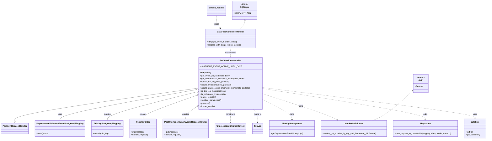

# Diagram: partview_core/partview_service/partview_service/api/public/PartviewEventHandler.py


> Auto-generated by Obscura crawlers

## Diagram 1



### SVG

<svg id="container" width="3739.5703125" xmlns="http://www.w3.org/2000/svg" class="classDiagram" height="1090" viewBox="0 0 3739.5703125 1090" role="graphics-document document" aria-roledescription="class"><style>#container{font-family:"trebuchet ms",verdana,arial,sans-serif;font-size:16px;fill:#333;}@keyframes edge-animation-frame{from{stroke-dashoffset:0;}}@keyframes dash{to{stroke-dashoffset:0;}}#container .edge-animation-slow{stroke-dasharray:9,5!important;stroke-dashoffset:900;animation:dash 50s linear infinite;stroke-linecap:round;}#container .edge-animation-fast{stroke-dasharray:9,5!important;stroke-dashoffset:900;animation:dash 20s linear infinite;stroke-linecap:round;}#container .error-icon{fill:#552222;}#container .error-text{fill:#552222;stroke:#552222;}#container .edge-thickness-normal{stroke-width:1px;}#container .edge-thickness-thick{stroke-width:3.5px;}#container .edge-pattern-solid{stroke-dasharray:0;}#container .edge-thickness-invisible{stroke-width:0;fill:none;}#container .edge-pattern-dashed{stroke-dasharray:3;}#container .edge-pattern-dotted{stroke-dasharray:2;}#container .marker{fill:#333333;stroke:#333333;}#container .marker.cross{stroke:#333333;}#container svg{font-family:"trebuchet ms",verdana,arial,sans-serif;font-size:16px;}#container p{margin:0;}#container g.classGroup text{fill:#9370DB;stroke:none;font-family:"trebuchet ms",verdana,arial,sans-serif;font-size:10px;}#container g.classGroup text .title{font-weight:bolder;}#container .nodeLabel,#container .edgeLabel{color:#131300;}#container .edgeLabel .label rect{fill:#ECECFF;}#container .label text{fill:#131300;}#container .labelBkg{background:#ECECFF;}#container .edgeLabel .label span{background:#ECECFF;}#container .classTitle{font-weight:bolder;}#container .node rect,#container .node circle,#container .node ellipse,#container .node polygon,#container .node path{fill:#ECECFF;stroke:#9370DB;stroke-width:1px;}#container .divider{stroke:#9370DB;stroke-width:1;}#container g.clickable{cursor:pointer;}#container g.classGroup rect{fill:#ECECFF;stroke:#9370DB;}#container g.classGroup line{stroke:#9370DB;stroke-width:1;}#container .classLabel .box{stroke:none;stroke-width:0;fill:#ECECFF;opacity:0.5;}#container .classLabel .label{fill:#9370DB;font-size:10px;}#container .relation{stroke:#333333;stroke-width:1;fill:none;}#container .dashed-line{stroke-dasharray:3;}#container .dotted-line{stroke-dasharray:1 2;}#container #compositionStart,#container .composition{fill:#333333!important;stroke:#333333!important;stroke-width:1;}#container #compositionEnd,#container .composition{fill:#333333!important;stroke:#333333!important;stroke-width:1;}#container #dependencyStart,#container .dependency{fill:#333333!important;stroke:#333333!important;stroke-width:1;}#container #dependencyStart,#container .dependency{fill:#333333!important;stroke:#333333!important;stroke-width:1;}#container #extensionStart,#container .extension{fill:transparent!important;stroke:#333333!important;stroke-width:1;}#container #extensionEnd,#container .extension{fill:transparent!important;stroke:#333333!important;stroke-width:1;}#container #aggregationStart,#container .aggregation{fill:transparent!important;stroke:#333333!important;stroke-width:1;}#container #aggregationEnd,#container .aggregation{fill:transparent!important;stroke:#333333!important;stroke-width:1;}#container #lollipopStart,#container .lollipop{fill:#ECECFF!important;stroke:#333333!important;stroke-width:1;}#container #lollipopEnd,#container .lollipop{fill:#ECECFF!important;stroke:#333333!important;stroke-width:1;}#container .edgeTerminals{font-size:11px;line-height:initial;}#container .classTitleText{text-anchor:middle;font-size:18px;fill:#333;}#container .label-icon{display:inline-block;height:1em;overflow:visible;vertical-align:-0.125em;}#container .node .label-icon path{fill:currentColor;stroke:revert;stroke-width:revert;}#container :root{--mermaid-font-family:"trebuchet ms",verdana,arial,sans-serif;}</style><g><defs><marker id="container_class-aggregationStart" class="marker aggregation class" refX="18" refY="7" markerWidth="190" markerHeight="240" orient="auto"><path d="M 18,7 L9,13 L1,7 L9,1 Z"></path></marker></defs><defs><marker id="container_class-aggregationEnd" class="marker aggregation class" refX="1" refY="7" markerWidth="20" markerHeight="28" orient="auto"><path d="M 18,7 L9,13 L1,7 L9,1 Z"></path></marker></defs><defs><marker id="container_class-extensionStart" class="marker extension class" refX="18" refY="7" markerWidth="190" markerHeight="240" orient="auto"><path d="M 1,7 L18,13 V 1 Z"></path></marker></defs><defs><marker id="container_class-extensionEnd" class="marker extension class" refX="1" refY="7" markerWidth="20" markerHeight="28" orient="auto"><path d="M 1,1 V 13 L18,7 Z"></path></marker></defs><defs><marker id="container_class-compositionStart" class="marker composition class" refX="18" refY="7" markerWidth="190" markerHeight="240" orient="auto"><path d="M 18,7 L9,13 L1,7 L9,1 Z"></path></marker></defs><defs><marker id="container_class-compositionEnd" class="marker composition class" refX="1" refY="7" markerWidth="20" markerHeight="28" orient="auto"><path d="M 18,7 L9,13 L1,7 L9,1 Z"></path></marker></defs><defs><marker id="container_class-dependencyStart" class="marker dependency class" refX="6" refY="7" markerWidth="190" markerHeight="240" orient="auto"><path d="M 5,7 L9,13 L1,7 L9,1 Z"></path></marker></defs><defs><marker id="container_class-dependencyEnd" class="marker dependency class" refX="13" refY="7" markerWidth="20" markerHeight="28" orient="auto"><path d="M 18,7 L9,13 L14,7 L9,1 Z"></path></marker></defs><defs><marker id="container_class-lollipopStart" class="marker lollipop class" refX="13" refY="7" markerWidth="190" markerHeight="240" orient="auto"><circle stroke="black" fill="transparent" cx="7" cy="7" r="6"></circle></marker></defs><defs><marker id="container_class-lollipopEnd" class="marker lollipop class" refX="1" refY="7" markerWidth="190" markerHeight="240" orient="auto"><circle stroke="black" fill="transparent" cx="7" cy="7" r="6"></circle></marker></defs><g class="root"><g class="clusters"></g><g class="edgePaths"><path d="M1489.41,690.792L1259.735,724.827C1030.06,758.862,570.71,826.931,341.035,869.757C111.359,912.583,111.359,930.167,111.359,938.958L111.359,947.75" id="id_PartViewEventHandler_PartViewRequestHandler_1" class="edge-thickness-normal edge-pattern-solid relation" style=";;;" data-edge="true" data-et="edge" data-id="id_PartViewEventHandler_PartViewRequestHandler_1" data-points="W3sieCI6MTQ4OS40MTAxNTYyNSwieSI6NjkwLjc5MjM1MDk5OTg5OTF9LHsieCI6MTExLjM1OTM3NSwieSI6ODk1fSx7IngiOjExMS4zNTkzNzUsInkiOjk2NX1d" marker-end="url(#container_class-extensionEnd)"></path><path d="M1472.454,703.628L1301.987,735.523C1131.519,767.419,790.584,831.209,620.116,871.271C449.648,911.333,449.648,927.667,449.648,935.833L449.648,944" id="id_PartViewEventHandler_UnprocessedShipmentEventPostgresqlMapping_2" class="edge-thickness-normal edge-pattern-solid relation" style=";;;" data-edge="true" data-et="edge" data-id="id_PartViewEventHandler_UnprocessedShipmentEventPostgresqlMapping_2" data-points="W3sieCI6MTQ4OS40MTAxNTYyNSwieSI6NzAwLjQ1NTM5MjEyNzEzMDV9LHsieCI6NDQ5LjY0ODQzNzUsInkiOjg5NX0seyJ4Ijo0NDkuNjQ4NDM3NSwieSI6OTQ0fV0=" marker-start="url(#container_class-aggregationStart)"></path><path d="M1472.71,722.539L1361.581,751.282C1250.452,780.026,1028.195,837.513,917.066,874.423C805.938,911.333,805.938,927.667,805.938,935.833L805.938,944" id="id_PartViewEventHandler_TripLegPostgresqlMapping_3" class="edge-thickness-normal edge-pattern-solid relation" style=";;;" data-edge="true" data-et="edge" data-id="id_PartViewEventHandler_TripLegPostgresqlMapping_3" data-points="W3sieCI6MTQ4OS40MTAxNTYyNSwieSI6NzE4LjIxOTE3OTk3NzM2MTR9LHsieCI6ODA1LjkzNzUsInkiOjg5NX0seyJ4Ijo4MDUuOTM3NSwieSI6OTQ0fV0=" marker-start="url(#container_class-aggregationStart)"></path><path d="M1473.215,750.978L1407.751,774.982C1342.288,798.985,1211.361,846.993,1145.897,877.163C1080.434,907.333,1080.434,919.667,1080.434,925.833L1080.434,932" id="id_PartViewEventHandler_PostAsnOrder_4" class="edge-thickness-normal edge-pattern-solid relation" style=";;;" data-edge="true" data-et="edge" data-id="id_PartViewEventHandler_PostAsnOrder_4" data-points="W3sieCI6MTQ4OS40MTAxNTYyNSwieSI6NzQ1LjAzOTQxNTQyNTAyOTJ9LHsieCI6MTA4MC40MzM1OTM3NSwieSI6ODk1fSx7IngiOjEwODAuNDMzNTkzNzUsInkiOjkzMn1d" marker-start="url(#container_class-aggregationStart)"></path><path d="M1475.417,843.063L1463.409,851.719C1451.4,860.375,1427.384,877.688,1415.375,892.511C1403.367,907.333,1403.367,919.667,1403.367,925.833L1403.367,932" id="id_PartViewEventHandler_PostTripToContainerEventsRequestHandler_5" class="edge-thickness-normal edge-pattern-solid relation" style=";;;" data-edge="true" data-et="edge" data-id="id_PartViewEventHandler_PostTripToContainerEventsRequestHandler_5" data-points="W3sieCI6MTQ4OS40MTAxNTYyNSwieSI6ODMyLjk3NjAzNjM2MDIzNzV9LHsieCI6MTQwMy4zNjcxODc1LCJ5Ijo4OTV9LHsieCI6MTQwMy4zNjcxODc1LCJ5Ijo5MzJ9XQ==" marker-start="url(#container_class-aggregationStart)"></path><path d="M1737.695,858L1737.695,864.167C1737.695,870.333,1737.695,882.667,1737.695,899.5C1737.695,916.333,1737.695,937.667,1737.695,948.333L1737.695,959" id="id_PartViewEventHandler_UnprocessedShipmentEvent_6" class="edge-thickness-normal edge-pattern-dashed relation" style=";;;" data-edge="true" data-et="edge" data-id="id_PartViewEventHandler_UnprocessedShipmentEvent_6" data-points="W3sieCI6MTczNy42OTUzMTI1LCJ5Ijo4NTh9LHsieCI6MTczNy42OTUzMTI1LCJ5Ijo4OTV9LHsieCI6MTczNy42OTUzMTI1LCJ5Ijo5NjV9XQ==" marker-end="url(#container_class-dependencyEnd)"></path><path d="M1910.025,858L1915.235,864.167C1920.444,870.333,1930.863,882.667,1936.072,899.5C1941.281,916.333,1941.281,937.667,1941.281,948.333L1941.281,959" id="id_PartViewEventHandler_TripLeg_7" class="edge-thickness-normal edge-pattern-dashed relation" style=";;;" data-edge="true" data-et="edge" data-id="id_PartViewEventHandler_TripLeg_7" data-points="W3sieCI6MTkxMC4wMjUzMTc2ODY3MjIsInkiOjg1OH0seyJ4IjoxOTQxLjI4MTI1LCJ5Ijo4OTV9LHsieCI6MTk0MS4yODEyNSwieSI6OTY1fV0=" marker-end="url(#container_class-dependencyEnd)"></path><path d="M1985.98,781.493L2022.822,800.411C2059.663,819.329,2133.345,857.164,2170.186,883.249C2207.027,909.333,2207.027,923.667,2207.027,930.833L2207.027,938" id="id_PartViewEventHandler_IdentityManagement_8" class="edge-thickness-normal edge-pattern-dashed relation" style=";;;" data-edge="true" data-et="edge" data-id="id_PartViewEventHandler_IdentityManagement_8" data-points="W3sieCI6MTk4NS45ODA0Njg3NSwieSI6NzgxLjQ5MzM3MDczMTM0MTl9LHsieCI6MjIwNy4wMjczNDM3NSwieSI6ODk1fSx7IngiOjIyMDcuMDI3MzQzNzUsInkiOjk0NH1d" marker-end="url(#container_class-dependencyEnd)"></path><path d="M1985.98,735.085L2067.591,761.738C2149.202,788.39,2312.423,841.695,2408.876,876.053C2505.33,910.412,2535.015,925.824,2549.857,933.529L2564.7,941.235" id="id_PartViewEventHandler_InvokeGetSolution_9" class="edge-thickness-normal edge-pattern-dashed relation" style=";;;" data-edge="true" data-et="edge" data-id="id_PartViewEventHandler_InvokeGetSolution_9" data-points="W3sieCI6MTk4NS45ODA0Njg3NSwieSI6NzM1LjA4NTE0OTQwNTgxNzR9LHsieCI6MjQ3NS42NDQ1MzEyNSwieSI6ODk1fSx7IngiOjI1NzAuMDI0OTAyMzQzNzUsInkiOjk0NH1d" marker-end="url(#container_class-dependencyEnd)"></path><path d="M1985.98,693.449L2197.402,727.041C2408.824,760.633,2831.668,827.816,3043.09,868.575C3254.512,909.333,3254.512,923.667,3254.512,930.833L3254.512,938" id="id_PartViewEventHandler_MapAction_10" class="edge-thickness-normal edge-pattern-dashed relation" style=";;;" data-edge="true" data-et="edge" data-id="id_PartViewEventHandler_MapAction_10" data-points="W3sieCI6MTk4NS45ODA0Njg3NSwieSI6NjkzLjQ0ODg4OTQwMzk0OH0seyJ4IjozMjU0LjUxMTcxODc1LCJ5Ijo4OTV9LHsieCI6MzI1NC41MTE3MTg3NSwieSI6OTQ0fV0=" marker-end="url(#container_class-dependencyEnd)"></path><path d="M1985.98,685.359L2262.615,720.3C2539.249,755.24,3092.517,825.12,3369.151,865.227C3645.785,905.333,3645.785,915.667,3645.785,920.833L3645.785,926" id="id_PartViewEventHandler_Datetime_11" class="edge-thickness-normal edge-pattern-dashed relation" style=";;;" data-edge="true" data-et="edge" data-id="id_PartViewEventHandler_Datetime_11" data-points="W3sieCI6MTk4NS45ODA0Njg3NSwieSI6Njg1LjM1OTQ4OTA5OTY2fSx7IngiOjM2NDUuNzg1MTU2MjUsInkiOjg5NX0seyJ4IjozNjQ1Ljc4NTE1NjI1LCJ5Ijo5MzJ9XQ==" marker-end="url(#container_class-dependencyEnd)"></path><path d="M1737.695,376L1737.695,382.167C1737.695,388.333,1737.695,400.667,1737.695,412C1737.695,423.333,1737.695,433.667,1737.695,438.833L1737.695,444" id="id_DataFeedConsumerHandler_PartViewEventHandler_12" class="edge-thickness-normal edge-pattern-dashed relation" style=";;;" data-edge="true" data-et="edge" data-id="id_DataFeedConsumerHandler_PartViewEventHandler_12" data-points="W3sieCI6MTczNy42OTUzMTI1LCJ5IjozNzZ9LHsieCI6MTczNy42OTUzMTI1LCJ5Ijo0MTN9LHsieCI6MTczNy42OTUzMTI1LCJ5Ijo0NTB9XQ==" marker-end="url(#container_class-dependencyEnd)"></path><path d="M1633.16,122L1633.16,133.167C1633.16,144.333,1633.16,166.667,1638.233,183.269C1643.307,199.871,1653.453,210.742,1658.527,216.178L1663.6,221.614" id="id_lambda_handler_DataFeedConsumerHandler_13" class="edge-thickness-normal edge-pattern-dashed relation" style=";;;" data-edge="true" data-et="edge" data-id="id_lambda_handler_DataFeedConsumerHandler_13" data-points="W3sieCI6MTYzMy4xNjAxNTYyNSwieSI6MTIyfSx7IngiOjE2MzMuMTYwMTU2MjUsInkiOjE4OX0seyJ4IjoxNjY3LjY5NDA5MTc5Njg3NSwieSI6MjI2fV0=" marker-end="url(#container_class-dependencyEnd)"></path><path d="M3155.843,710.943L3122.322,741.619C3088.802,772.295,3021.76,833.648,2969.037,872.49C2916.314,911.333,2877.909,927.667,2858.707,935.833L2839.504,944" id="id_Auth_InvokeGetSolution_14" class="edge-thickness-normal edge-pattern-dashed relation" style=";;;" data-edge="true" data-et="edge" data-id="id_Auth_InvokeGetSolution_14" data-points="W3sieCI6MzE2MC4yNjk1MzEyNSwieSI6NzA2Ljg5MjIzNzg2Mjg1MzZ9LHsieCI6Mjk1NC43MTg3NSwieSI6ODk1fSx7IngiOjI4MzkuNTA0MTUwMzkwNjI1LCJ5Ijo5NDR9XQ==" marker-start="url(#container_class-dependencyStart)"></path><path d="M1842.23,158L1842.23,163.167C1842.23,168.333,1842.23,178.667,1836.475,190C1830.719,201.333,1819.208,213.667,1813.452,219.833L1807.697,226" id="id_SQStopic_DataFeedConsumerHandler_15" class="edge-thickness-normal edge-pattern-dashed relation" style=";;;" data-edge="true" data-et="edge" data-id="id_SQStopic_DataFeedConsumerHandler_15" data-points="W3sieCI6MTg0Mi4yMzA0Njg3NSwieSI6MTUyfSx7IngiOjE4NDIuMjMwNDY4NzUsInkiOjE4OX0seyJ4IjoxODA3LjY5NjUzMzIwMzEyNSwieSI6MjI2fV0=" marker-start="url(#container_class-dependencyStart)"></path></g><g class="edgeLabels"><g class="edgeLabel"><g class="label" data-id="id_PartViewEventHandler_PartViewRequestHandler_1" transform="translate(0, 0)"><foreignObject width="0" height="0"><div xmlns="http://www.w3.org/1999/xhtml" class="labelBkg" style="display: table-cell; white-space: nowrap; line-height: 1.5; max-width: 200px; text-align: center;"><span class="edgeLabel"></span></div></foreignObject></g></g><g class="edgeLabel" transform="translate(449.6484375, 895)"><g class="label" data-id="id_PartViewEventHandler_UnprocessedShipmentEventPostgresqlMapping_2" transform="translate(-16.4921875, -12)"><foreignObject width="32.984375" height="24"><div xmlns="http://www.w3.org/1999/xhtml" class="labelBkg" style="display: table-cell; white-space: nowrap; line-height: 1.5; max-width: 200px; text-align: center;"><span class="edgeLabel"><p>uses</p></span></div></foreignObject></g></g><g class="edgeLabel" transform="translate(805.9375, 895)"><g class="label" data-id="id_PartViewEventHandler_TripLegPostgresqlMapping_3" transform="translate(-27.2421875, -12)"><foreignObject width="54.484375" height="24"><div xmlns="http://www.w3.org/1999/xhtml" class="labelBkg" style="display: table-cell; white-space: nowrap; line-height: 1.5; max-width: 200px; text-align: center;"><span class="edgeLabel"><p>queries</p></span></div></foreignObject></g></g><g class="edgeLabel" transform="translate(1080.43359375, 895)"><g class="label" data-id="id_PartViewEventHandler_PostAsnOrder_4" transform="translate(-26.171875, -12)"><foreignObject width="52.34375" height="24"><div xmlns="http://www.w3.org/1999/xhtml" class="labelBkg" style="display: table-cell; white-space: nowrap; line-height: 1.5; max-width: 200px; text-align: center;"><span class="edgeLabel"><p>creates</p></span></div></foreignObject></g></g><g class="edgeLabel" transform="translate(1403.3671875, 895)"><g class="label" data-id="id_PartViewEventHandler_PostTripToContainerEventsRequestHandler_5" transform="translate(-26.171875, -12)"><foreignObject width="52.34375" height="24"><div xmlns="http://www.w3.org/1999/xhtml" class="labelBkg" style="display: table-cell; white-space: nowrap; line-height: 1.5; max-width: 200px; text-align: center;"><span class="edgeLabel"><p>creates</p></span></div></foreignObject></g></g><g class="edgeLabel" transform="translate(1737.6953125, 895)"><g class="label" data-id="id_PartViewEventHandler_UnprocessedShipmentEvent_6" transform="translate(-37.84375, -12)"><foreignObject width="75.6875" height="24"><div xmlns="http://www.w3.org/1999/xhtml" class="labelBkg" style="display: table-cell; white-space: nowrap; line-height: 1.5; max-width: 200px; text-align: center;"><span class="edgeLabel"><p>constructs</p></span></div></foreignObject></g></g><g class="edgeLabel" transform="translate(1941.28125, 895)"><g class="label" data-id="id_PartViewEventHandler_TripLeg_7" transform="translate(-29.2578125, -12)"><foreignObject width="58.515625" height="24"><div xmlns="http://www.w3.org/1999/xhtml" class="labelBkg" style="display: table-cell; white-space: nowrap; line-height: 1.5; max-width: 200px; text-align: center;"><span class="edgeLabel"><p>maps to</p></span></div></foreignObject></g></g><g class="edgeLabel" transform="translate(2207.02734375, 895)"><g class="label" data-id="id_PartViewEventHandler_IdentityManagement_8" transform="translate(-16.4453125, -12)"><foreignObject width="32.890625" height="24"><div xmlns="http://www.w3.org/1999/xhtml" class="labelBkg" style="display: table-cell; white-space: nowrap; line-height: 1.5; max-width: 200px; text-align: center;"><span class="edgeLabel"><p>calls</p></span></div></foreignObject></g></g><g class="edgeLabel" transform="translate(2281.35647, 831.54926)"><g class="label" data-id="id_PartViewEventHandler_InvokeGetSolution_9" transform="translate(-16.4453125, -12)"><foreignObject width="32.890625" height="24"><div xmlns="http://www.w3.org/1999/xhtml" class="labelBkg" style="display: table-cell; white-space: nowrap; line-height: 1.5; max-width: 200px; text-align: center;"><span class="edgeLabel"><p>calls</p></span></div></foreignObject></g></g><g class="edgeLabel" transform="translate(3254.51171875, 895)"><g class="label" data-id="id_PartViewEventHandler_MapAction_10" transform="translate(-16.4453125, -12)"><foreignObject width="32.890625" height="24"><div xmlns="http://www.w3.org/1999/xhtml" class="labelBkg" style="display: table-cell; white-space: nowrap; line-height: 1.5; max-width: 200px; text-align: center;"><span class="edgeLabel"><p>calls</p></span></div></foreignObject></g></g><g class="edgeLabel" transform="translate(3645.78515625, 895)"><g class="label" data-id="id_PartViewEventHandler_Datetime_11" transform="translate(-16.4921875, -12)"><foreignObject width="32.984375" height="24"><div xmlns="http://www.w3.org/1999/xhtml" class="labelBkg" style="display: table-cell; white-space: nowrap; line-height: 1.5; max-width: 200px; text-align: center;"><span class="edgeLabel"><p>uses</p></span></div></foreignObject></g></g><g class="edgeLabel" transform="translate(1737.6953125, 413)"><g class="label" data-id="id_DataFeedConsumerHandler_PartViewEventHandler_12" transform="translate(-42.9140625, -12)"><foreignObject width="85.828125" height="24"><div xmlns="http://www.w3.org/1999/xhtml" class="labelBkg" style="display: table-cell; white-space: nowrap; line-height: 1.5; max-width: 200px; text-align: center;"><span class="edgeLabel"><p>instantiates</p></span></div></foreignObject></g></g><g class="edgeLabel" transform="translate(1633.16015625, 189)"><g class="label" data-id="id_lambda_handler_DataFeedConsumerHandler_13" transform="translate(-21.390625, -12)"><foreignObject width="42.78125" height="24"><div xmlns="http://www.w3.org/1999/xhtml" class="labelBkg" style="display: table-cell; white-space: nowrap; line-height: 1.5; max-width: 200px; text-align: center;"><span class="edgeLabel"><p>wraps</p></span></div></foreignObject></g></g><g class="edgeLabel"><g class="label" data-id="id_Auth_InvokeGetSolution_14" transform="translate(0, 0)"><foreignObject width="0" height="0"><div xmlns="http://www.w3.org/1999/xhtml" class="labelBkg" style="display: table-cell; white-space: nowrap; line-height: 1.5; max-width: 200px; text-align: center;"><span class="edgeLabel"></span></div></foreignObject></g></g><g class="edgeLabel"><g class="label" data-id="id_SQStopic_DataFeedConsumerHandler_15" transform="translate(0, 0)"><foreignObject width="0" height="0"><div xmlns="http://www.w3.org/1999/xhtml" class="labelBkg" style="display: table-cell; white-space: nowrap; line-height: 1.5; max-width: 200px; text-align: center;"><span class="edgeLabel"></span></div></foreignObject></g></g></g><g class="nodes"><g class="node default" id="classId-PartViewEventHandler-0" transform="translate(1737.6953125, 654)"><g class="basic label-container"><path d="M-248.28515625 -204 L248.28515625 -204 L248.28515625 204 L-248.28515625 204" stroke="none" stroke-width="0" fill="#ECECFF" style=""></path><path d="M-248.28515625 -204 C-118.62437345917692 -204, 11.036409331646155 -204, 248.28515625 -204 M-248.28515625 -204 C-68.59823342783022 -204, 111.08868939433955 -204, 248.28515625 -204 M248.28515625 -204 C248.28515625 -88.90890984728685, 248.28515625 26.1821803054263, 248.28515625 204 M248.28515625 -204 C248.28515625 -48.656378311815416, 248.28515625 106.68724337636917, 248.28515625 204 M248.28515625 204 C147.72004829393592 204, 47.154940337871864 204, -248.28515625 204 M248.28515625 204 C52.996018722589184 204, -142.29311880482163 204, -248.28515625 204 M-248.28515625 204 C-248.28515625 53.652939246336956, -248.28515625 -96.69412150732609, -248.28515625 -204 M-248.28515625 204 C-248.28515625 60.494712354240846, -248.28515625 -83.01057529151831, -248.28515625 -204" stroke="#9370DB" stroke-width="1.3" fill="none" stroke-dasharray="0 0" style=""></path></g><g class="annotation-group text" transform="translate(0, -180)"></g><g class="label-group text" transform="translate(-81.5859375, -180)"><g class="label" style="font-weight: bolder" transform="translate(0,-12)"><foreignObject width="163.171875" height="24"><div xmlns="http://www.w3.org/1999/xhtml" style="display: table-cell; white-space: nowrap; line-height: 1.5; max-width: 211px; text-align: center;"><span class="nodeLabel markdown-node-label" style=""><p>PartViewEventHandler</p></span></div></foreignObject></g></g><g class="members-group text" transform="translate(-236.28515625, -132)"><g class="label" style="" transform="translate(0,-12)"><foreignObject width="283.578125" height="24"><div xmlns="http://www.w3.org/1999/xhtml" style="display: table-cell; white-space: nowrap; line-height: 1.5; max-width: 341px; text-align: center;"><span class="nodeLabel markdown-node-label" style=""><p>+SHIPMENT_EVENT_ACTIVE_UNTIL_DAYS</p></span></div></foreignObject></g></g><g class="methods-group text" transform="translate(-236.28515625, -84)"><g class="label" style="" transform="translate(0,-12)"><foreignObject width="83.140625" height="24"><div xmlns="http://www.w3.org/1999/xhtml" style="display: table-cell; white-space: nowrap; line-height: 1.5; max-width: 172px; text-align: center;"><span class="nodeLabel markdown-node-label" style=""><p>+<strong>init</strong>(event)</p></span></div></foreignObject></g><g class="label" style="" transform="translate(0,12)"><foreignObject width="236.484375" height="24"><div xmlns="http://www.w3.org/1999/xhtml" style="display: table-cell; white-space: nowrap; line-height: 1.5; max-width: 294px; text-align: center;"><span class="nodeLabel markdown-node-label" style=""><p>+get_event_payload(meta, body)</p></span></div></foreignObject></g><g class="label" style="" transform="translate(0,36)"><foreignObject width="347.546875" height="24"><div xmlns="http://www.w3.org/1999/xhtml" style="display: table-cell; white-space: nowrap; line-height: 1.5; max-width: 405px; text-align: center;"><span class="nodeLabel markdown-node-label" style=""><p>+get_unprocessed_shipment_event(meta, body)</p></span></div></foreignObject></g><g class="label" style="" transform="translate(0,60)"><foreignObject width="231.40625" height="24"><div xmlns="http://www.w3.org/1999/xhtml" style="display: table-cell; white-space: nowrap; line-height: 1.5; max-width: 289px; text-align: center;"><span class="nodeLabel markdown-node-label" style=""><p>+upsert_trip_leg(meta, payload)</p></span></div></foreignObject></g><g class="label" style="" transform="translate(0,84)"><foreignObject width="245.84375" height="24"><div xmlns="http://www.w3.org/1999/xhtml" style="display: table-cell; white-space: nowrap; line-height: 1.5; max-width: 303px; text-align: center;"><span class="nodeLabel markdown-node-label" style=""><p>+create_milestone(meta, payload)</p></span></div></foreignObject></g><g class="label" style="" transform="translate(0,108)"><foreignObject width="390.984375" height="24"><div xmlns="http://www.w3.org/1999/xhtml" style="display: table-cell; white-space: nowrap; line-height: 1.5; max-width: 448px; text-align: center;"><span class="nodeLabel markdown-node-label" style=""><p>+create_unprocessed_shipment_event(meta, payload)</p></span></div></foreignObject></g><g class="label" style="" transform="translate(0,132)"><foreignObject width="201.046875" height="24"><div xmlns="http://www.w3.org/1999/xhtml" style="display: table-cell; white-space: nowrap; line-height: 1.5; max-width: 258px; text-align: center;"><span class="nodeLabel markdown-node-label" style=""><p>+is_trip_leg_message(meta)</p></span></div></foreignObject></g><g class="label" style="" transform="translate(0,156)"><foreignObject width="199.6875" height="24"><div xmlns="http://www.w3.org/1999/xhtml" style="display: table-cell; white-space: nowrap; line-height: 1.5; max-width: 257px; text-align: center;"><span class="nodeLabel markdown-node-label" style=""><p>+is_milestone_create(meta)</p></span></div></foreignObject></g><g class="label" style="" transform="translate(0,180)"><foreignObject width="121.796875" height="24"><div xmlns="http://www.w3.org/1999/xhtml" style="display: table-cell; white-space: nowrap; line-height: 1.5; max-width: 179px; text-align: center;"><span class="nodeLabel markdown-node-label" style=""><p>+parse_request()</p></span></div></foreignObject></g><g class="label" style="" transform="translate(0,204)"><foreignObject width="166.546875" height="24"><div xmlns="http://www.w3.org/1999/xhtml" style="display: table-cell; white-space: nowrap; line-height: 1.5; max-width: 224px; text-align: center;"><span class="nodeLabel markdown-node-label" style=""><p>+validate_parameters()</p></span></div></foreignObject></g><g class="label" style="" transform="translate(0,228)"><foreignObject width="73.734375" height="24"><div xmlns="http://www.w3.org/1999/xhtml" style="display: table-cell; white-space: nowrap; line-height: 1.5; max-width: 131px; text-align: center;"><span class="nodeLabel markdown-node-label" style=""><p>+process()</p></span></div></foreignObject></g><g class="label" style="" transform="translate(0,252)"><foreignObject width="117.015625" height="24"><div xmlns="http://www.w3.org/1999/xhtml" style="display: table-cell; white-space: nowrap; line-height: 1.5; max-width: 174px; text-align: center;"><span class="nodeLabel markdown-node-label" style=""><p>+format_result()</p></span></div></foreignObject></g></g><g class="divider" style=""><path d="M-248.28515625 -156 C-80.17101939670289 -156, 87.94311745659422 -156, 248.28515625 -156 M-248.28515625 -156 C-69.14222275642555 -156, 110.00071073714889 -156, 248.28515625 -156" stroke="#9370DB" stroke-width="1.3" fill="none" stroke-dasharray="0 0" style=""></path></g><g class="divider" style=""><path d="M-248.28515625 -108 C-77.67970715549828 -108, 92.92574193900344 -108, 248.28515625 -108 M-248.28515625 -108 C-98.6823279799923 -108, 50.92050029001541 -108, 248.28515625 -108" stroke="#9370DB" stroke-width="1.3" fill="none" stroke-dasharray="0 0" style=""></path></g></g><g class="node default" id="classId-PartViewRequestHandler-1" transform="translate(111.359375, 1007)"><g class="basic label-container"><path d="M-103.359375 -42 L103.359375 -42 L103.359375 42 L-103.359375 42" stroke="none" stroke-width="0" fill="#ECECFF" style=""></path><path d="M-103.359375 -42 C-31.260560439395434 -42, 40.83825412120913 -42, 103.359375 -42 M-103.359375 -42 C-33.78339537991067 -42, 35.792584240178655 -42, 103.359375 -42 M103.359375 -42 C103.359375 -19.56035866488479, 103.359375 2.879282670230417, 103.359375 42 M103.359375 -42 C103.359375 -22.80210005160734, 103.359375 -3.60420010321468, 103.359375 42 M103.359375 42 C27.286298437144595 42, -48.78677812571081 42, -103.359375 42 M103.359375 42 C38.900799191764435 42, -25.55777661647113 42, -103.359375 42 M-103.359375 42 C-103.359375 15.729773716975345, -103.359375 -10.54045256604931, -103.359375 -42 M-103.359375 42 C-103.359375 16.43522815320508, -103.359375 -9.129543693589838, -103.359375 -42" stroke="#9370DB" stroke-width="1.3" fill="none" stroke-dasharray="0 0" style=""></path></g><g class="annotation-group text" transform="translate(0, -18)"></g><g class="label-group text" transform="translate(-91.359375, -18)"><g class="label" style="font-weight: bolder" transform="translate(0,-12)"><foreignObject width="182.71875" height="24"><div xmlns="http://www.w3.org/1999/xhtml" style="display: table-cell; white-space: nowrap; line-height: 1.5; max-width: 231px; text-align: center;"><span class="nodeLabel markdown-node-label" style=""><p>PartViewRequestHandler</p></span></div></foreignObject></g></g><g class="members-group text" transform="translate(-91.359375, 30)"></g><g class="methods-group text" transform="translate(-91.359375, 60)"></g><g class="divider" style=""><path d="M-103.359375 6 C-48.12273528435052 6, 7.1139044312989625 6, 103.359375 6 M-103.359375 6 C-38.36744570045511 6, 26.624483599089785 6, 103.359375 6" stroke="#9370DB" stroke-width="1.3" fill="none" stroke-dasharray="0 0" style=""></path></g><g class="divider" style=""><path d="M-103.359375 24 C-28.351476703916646 24, 46.65642159216671 24, 103.359375 24 M-103.359375 24 C-24.608494961315728 24, 54.142385077368544 24, 103.359375 24" stroke="#9370DB" stroke-width="1.3" fill="none" stroke-dasharray="0 0" style=""></path></g></g><g class="node default" id="classId-UnprocessedShipmentEvent-2" transform="translate(1737.6953125, 1007)"><g class="basic label-container"><path d="M-114.53125 -42 L114.53125 -42 L114.53125 42 L-114.53125 42" stroke="none" stroke-width="0" fill="#ECECFF" style=""></path><path d="M-114.53125 -42 C-57.445772116392675 -42, -0.3602942327853498 -42, 114.53125 -42 M-114.53125 -42 C-56.90898530637949 -42, 0.7132793872410161 -42, 114.53125 -42 M114.53125 -42 C114.53125 -12.66903891379652, 114.53125 16.66192217240696, 114.53125 42 M114.53125 -42 C114.53125 -19.567145763641268, 114.53125 2.865708472717465, 114.53125 42 M114.53125 42 C28.794555282262152 42, -56.942139435475696 42, -114.53125 42 M114.53125 42 C27.987933843475815 42, -58.55538231304837 42, -114.53125 42 M-114.53125 42 C-114.53125 9.259786564940548, -114.53125 -23.480426870118905, -114.53125 -42 M-114.53125 42 C-114.53125 22.644308733403005, -114.53125 3.2886174668060093, -114.53125 -42" stroke="#9370DB" stroke-width="1.3" fill="none" stroke-dasharray="0 0" style=""></path></g><g class="annotation-group text" transform="translate(0, -18)"></g><g class="label-group text" transform="translate(-102.53125, -18)"><g class="label" style="font-weight: bolder" transform="translate(0,-12)"><foreignObject width="205.0625" height="24"><div xmlns="http://www.w3.org/1999/xhtml" style="display: table-cell; white-space: nowrap; line-height: 1.5; max-width: 253px; text-align: center;"><span class="nodeLabel markdown-node-label" style=""><p>UnprocessedShipmentEvent</p></span></div></foreignObject></g></g><g class="members-group text" transform="translate(-102.53125, 30)"></g><g class="methods-group text" transform="translate(-102.53125, 60)"></g><g class="divider" style=""><path d="M-114.53125 6 C-54.48458987071628 6, 5.562070258567445 6, 114.53125 6 M-114.53125 6 C-42.16947339143391 6, 30.192303217132178 6, 114.53125 6" stroke="#9370DB" stroke-width="1.3" fill="none" stroke-dasharray="0 0" style=""></path></g><g class="divider" style=""><path d="M-114.53125 24 C-38.62935050075875 24, 37.272548998482506 24, 114.53125 24 M-114.53125 24 C-61.52724576244268 24, -8.523241524885364 24, 114.53125 24" stroke="#9370DB" stroke-width="1.3" fill="none" stroke-dasharray="0 0" style=""></path></g></g><g class="node default" id="classId-TripLeg-3" transform="translate(1941.28125, 1007)"><g class="basic label-container"><path d="M-39.0546875 -42 L39.0546875 -42 L39.0546875 42 L-39.0546875 42" stroke="none" stroke-width="0" fill="#ECECFF" style=""></path><path d="M-39.0546875 -42 C-18.605656418241672 -42, 1.8433746635166557 -42, 39.0546875 -42 M-39.0546875 -42 C-17.225085573957802 -42, 4.604516352084396 -42, 39.0546875 -42 M39.0546875 -42 C39.0546875 -22.19466367490093, 39.0546875 -2.38932734980186, 39.0546875 42 M39.0546875 -42 C39.0546875 -21.256597919769803, 39.0546875 -0.5131958395396055, 39.0546875 42 M39.0546875 42 C16.782450670343493 42, -5.489786159313013 42, -39.0546875 42 M39.0546875 42 C14.062303477248527 42, -10.930080545502946 42, -39.0546875 42 M-39.0546875 42 C-39.0546875 15.688466957992564, -39.0546875 -10.623066084014873, -39.0546875 -42 M-39.0546875 42 C-39.0546875 18.191374137717965, -39.0546875 -5.6172517245640705, -39.0546875 -42" stroke="#9370DB" stroke-width="1.3" fill="none" stroke-dasharray="0 0" style=""></path></g><g class="annotation-group text" transform="translate(0, -18)"></g><g class="label-group text" transform="translate(-27.0546875, -18)"><g class="label" style="font-weight: bolder" transform="translate(0,-12)"><foreignObject width="54.109375" height="24"><div xmlns="http://www.w3.org/1999/xhtml" style="display: table-cell; white-space: nowrap; line-height: 1.5; max-width: 103px; text-align: center;"><span class="nodeLabel markdown-node-label" style=""><p>TripLeg</p></span></div></foreignObject></g></g><g class="members-group text" transform="translate(-27.0546875, 30)"></g><g class="methods-group text" transform="translate(-27.0546875, 60)"></g><g class="divider" style=""><path d="M-39.0546875 6 C-9.195216971561798 6, 20.664253556876403 6, 39.0546875 6 M-39.0546875 6 C-13.91394662703475 6, 11.226794245930499 6, 39.0546875 6" stroke="#9370DB" stroke-width="1.3" fill="none" stroke-dasharray="0 0" style=""></path></g><g class="divider" style=""><path d="M-39.0546875 24 C-12.199705286058204 24, 14.655276927883591 24, 39.0546875 24 M-39.0546875 24 C-9.32619908651769 24, 20.40228932696462 24, 39.0546875 24" stroke="#9370DB" stroke-width="1.3" fill="none" stroke-dasharray="0 0" style=""></path></g></g><g class="node default" id="classId-TripLegPostgresqlMapping-4" transform="translate(805.9375, 1007)"><g class="basic label-container"><path d="M-121.359375 -63 L121.359375 -63 L121.359375 63 L-121.359375 63" stroke="none" stroke-width="0" fill="#ECECFF" style=""></path><path d="M-121.359375 -63 C-40.180947503412355 -63, 40.99747999317529 -63, 121.359375 -63 M-121.359375 -63 C-27.536642111943053 -63, 66.2860907761139 -63, 121.359375 -63 M121.359375 -63 C121.359375 -36.82370186106728, 121.359375 -10.647403722134548, 121.359375 63 M121.359375 -63 C121.359375 -36.976766241109395, 121.359375 -10.95353248221879, 121.359375 63 M121.359375 63 C42.0178814577295 63, -37.323612084541 63, -121.359375 63 M121.359375 63 C34.17376831656978 63, -53.011838366860445 63, -121.359375 63 M-121.359375 63 C-121.359375 28.872397265318043, -121.359375 -5.255205469363915, -121.359375 -63 M-121.359375 63 C-121.359375 37.37194248548285, -121.359375 11.743884970965695, -121.359375 -63" stroke="#9370DB" stroke-width="1.3" fill="none" stroke-dasharray="0 0" style=""></path></g><g class="annotation-group text" transform="translate(0, -39)"></g><g class="label-group text" transform="translate(-97.453125, -39)"><g class="label" style="font-weight: bolder" transform="translate(0,-12)"><foreignObject width="194.90625" height="24"><div xmlns="http://www.w3.org/1999/xhtml" style="display: table-cell; white-space: nowrap; line-height: 1.5; max-width: 241px; text-align: center;"><span class="nodeLabel markdown-node-label" style=""><p>TripLegPostgresqlMapping</p></span></div></foreignObject></g></g><g class="members-group text" transform="translate(-109.359375, 9)"></g><g class="methods-group text" transform="translate(-109.359375, 39)"><g class="label" style="" transform="translate(0,-12)"><foreignObject width="121.265625" height="24"><div xmlns="http://www.w3.org/1999/xhtml" style="display: table-cell; white-space: nowrap; line-height: 1.5; max-width: 179px; text-align: center;"><span class="nodeLabel markdown-node-label" style=""><p>+search(trip_leg)</p></span></div></foreignObject></g></g><g class="divider" style=""><path d="M-121.359375 -15 C-40.47927817315433 -15, 40.400818653691346 -15, 121.359375 -15 M-121.359375 -15 C-51.38036288659393 -15, 18.598649226812142 -15, 121.359375 -15" stroke="#9370DB" stroke-width="1.3" fill="none" stroke-dasharray="0 0" style=""></path></g><g class="divider" style=""><path d="M-121.359375 9 C-42.817973103057355 9, 35.72342879388529 9, 121.359375 9 M-121.359375 9 C-62.18107922054757 9, -3.002783441095147 9, 121.359375 9" stroke="#9370DB" stroke-width="1.3" fill="none" stroke-dasharray="0 0" style=""></path></g></g><g class="node default" id="classId-UnprocessedShipmentEventPostgresqlMapping-5" transform="translate(449.6484375, 1007)"><g class="basic label-container"><path d="M-184.9296875 -63 L184.9296875 -63 L184.9296875 63 L-184.9296875 63" stroke="none" stroke-width="0" fill="#ECECFF" style=""></path><path d="M-184.9296875 -63 C-97.93999913497132 -63, -10.950310769942632 -63, 184.9296875 -63 M-184.9296875 -63 C-85.05304921370758 -63, 14.823589072584838 -63, 184.9296875 -63 M184.9296875 -63 C184.9296875 -33.08163046171272, 184.9296875 -3.1632609234254403, 184.9296875 63 M184.9296875 -63 C184.9296875 -13.647687791352269, 184.9296875 35.70462441729546, 184.9296875 63 M184.9296875 63 C66.21729930031735 63, -52.4950888993653 63, -184.9296875 63 M184.9296875 63 C73.5553439439639 63, -37.81899961207219 63, -184.9296875 63 M-184.9296875 63 C-184.9296875 27.65452760958769, -184.9296875 -7.690944780824623, -184.9296875 -63 M-184.9296875 63 C-184.9296875 13.131436780093814, -184.9296875 -36.73712643981237, -184.9296875 -63" stroke="#9370DB" stroke-width="1.3" fill="none" stroke-dasharray="0 0" style=""></path></g><g class="annotation-group text" transform="translate(0, -39)"></g><g class="label-group text" transform="translate(-172.9296875, -39)"><g class="label" style="font-weight: bolder" transform="translate(0,-12)"><foreignObject width="345.859375" height="24"><div xmlns="http://www.w3.org/1999/xhtml" style="display: table-cell; white-space: nowrap; line-height: 1.5; max-width: 392px; text-align: center;"><span class="nodeLabel markdown-node-label" style=""><p>UnprocessedShipmentEventPostgresqlMapping</p></span></div></foreignObject></g></g><g class="members-group text" transform="translate(-172.9296875, 9)"></g><g class="methods-group text" transform="translate(-172.9296875, 39)"><g class="label" style="" transform="translate(0,-12)"><foreignObject width="95.109375" height="24"><div xmlns="http://www.w3.org/1999/xhtml" style="display: table-cell; white-space: nowrap; line-height: 1.5; max-width: 152px; text-align: center;"><span class="nodeLabel markdown-node-label" style=""><p>+write(event)</p></span></div></foreignObject></g></g><g class="divider" style=""><path d="M-184.9296875 -15 C-47.744184228392385 -15, 89.44131904321523 -15, 184.9296875 -15 M-184.9296875 -15 C-76.68510016972262 -15, 31.559487160554767 -15, 184.9296875 -15" stroke="#9370DB" stroke-width="1.3" fill="none" stroke-dasharray="0 0" style=""></path></g><g class="divider" style=""><path d="M-184.9296875 9 C-110.62653250646167 9, -36.323377512923344 9, 184.9296875 9 M-184.9296875 9 C-96.42491204916698 9, -7.920136598333954 9, 184.9296875 9" stroke="#9370DB" stroke-width="1.3" fill="none" stroke-dasharray="0 0" style=""></path></g></g><g class="node default" id="classId-PostAsnOrder-6" transform="translate(1080.43359375, 1007)"><g class="basic label-container"><path d="M-103.13671875 -75 L103.13671875 -75 L103.13671875 75 L-103.13671875 75" stroke="none" stroke-width="0" fill="#ECECFF" style=""></path><path d="M-103.13671875 -75 C-57.36892761094538 -75, -11.601136471890754 -75, 103.13671875 -75 M-103.13671875 -75 C-54.48683536011057 -75, -5.836951970221136 -75, 103.13671875 -75 M103.13671875 -75 C103.13671875 -23.729124267443048, 103.13671875 27.541751465113904, 103.13671875 75 M103.13671875 -75 C103.13671875 -17.002704910007154, 103.13671875 40.99459017998569, 103.13671875 75 M103.13671875 75 C37.41508937702781 75, -28.306539995944377 75, -103.13671875 75 M103.13671875 75 C52.53663597518898 75, 1.9365532003779578 75, -103.13671875 75 M-103.13671875 75 C-103.13671875 25.67422135038735, -103.13671875 -23.651557299225303, -103.13671875 -75 M-103.13671875 75 C-103.13671875 22.149516385388033, -103.13671875 -30.700967229223934, -103.13671875 -75" stroke="#9370DB" stroke-width="1.3" fill="none" stroke-dasharray="0 0" style=""></path></g><g class="annotation-group text" transform="translate(0, -51)"></g><g class="label-group text" transform="translate(-50.3046875, -51)"><g class="label" style="font-weight: bolder" transform="translate(0,-12)"><foreignObject width="100.609375" height="24"><div xmlns="http://www.w3.org/1999/xhtml" style="display: table-cell; white-space: nowrap; line-height: 1.5; max-width: 149px; text-align: center;"><span class="nodeLabel markdown-node-label" style=""><p>PostAsnOrder</p></span></div></foreignObject></g></g><g class="members-group text" transform="translate(-91.13671875, -3)"></g><g class="methods-group text" transform="translate(-91.13671875, 27)"><g class="label" style="" transform="translate(0,-12)"><foreignObject width="105.1875" height="24"><div xmlns="http://www.w3.org/1999/xhtml" style="display: table-cell; white-space: nowrap; line-height: 1.5; max-width: 194px; text-align: center;"><span class="nodeLabel markdown-node-label" style=""><p>+<strong>init</strong>(message)</p></span></div></foreignObject></g><g class="label" style="" transform="translate(0,12)"><foreignObject width="131.96875" height="24"><div xmlns="http://www.w3.org/1999/xhtml" style="display: table-cell; white-space: nowrap; line-height: 1.5; max-width: 189px; text-align: center;"><span class="nodeLabel markdown-node-label" style=""><p>+handle_request()</p></span></div></foreignObject></g></g><g class="divider" style=""><path d="M-103.13671875 -27 C-59.281719822697504 -27, -15.426720895395007 -27, 103.13671875 -27 M-103.13671875 -27 C-45.2016108943695 -27, 12.733496961260997 -27, 103.13671875 -27" stroke="#9370DB" stroke-width="1.3" fill="none" stroke-dasharray="0 0" style=""></path></g><g class="divider" style=""><path d="M-103.13671875 -3 C-50.52271716410901 -3, 2.091284421781978 -3, 103.13671875 -3 M-103.13671875 -3 C-53.73539727708924 -3, -4.334075804178482 -3, 103.13671875 -3" stroke="#9370DB" stroke-width="1.3" fill="none" stroke-dasharray="0 0" style=""></path></g></g><g class="node default" id="classId-PostTripToContainerEventsRequestHandler-7" transform="translate(1403.3671875, 1007)"><g class="basic label-container"><path d="M-169.796875 -75 L169.796875 -75 L169.796875 75 L-169.796875 75" stroke="none" stroke-width="0" fill="#ECECFF" style=""></path><path d="M-169.796875 -75 C-34.68795974758561 -75, 100.42095550482878 -75, 169.796875 -75 M-169.796875 -75 C-45.40643067895384 -75, 78.98401364209232 -75, 169.796875 -75 M169.796875 -75 C169.796875 -19.47742700982696, 169.796875 36.04514598034608, 169.796875 75 M169.796875 -75 C169.796875 -34.81972673541113, 169.796875 5.360546529177739, 169.796875 75 M169.796875 75 C94.49590240486944 75, 19.19492980973888 75, -169.796875 75 M169.796875 75 C76.77438814966278 75, -16.248098700674433 75, -169.796875 75 M-169.796875 75 C-169.796875 21.88299174343708, -169.796875 -31.234016513125837, -169.796875 -75 M-169.796875 75 C-169.796875 42.701735524820805, -169.796875 10.40347104964161, -169.796875 -75" stroke="#9370DB" stroke-width="1.3" fill="none" stroke-dasharray="0 0" style=""></path></g><g class="annotation-group text" transform="translate(0, -51)"></g><g class="label-group text" transform="translate(-157.796875, -51)"><g class="label" style="font-weight: bolder" transform="translate(0,-12)"><foreignObject width="315.59375" height="24"><div xmlns="http://www.w3.org/1999/xhtml" style="display: table-cell; white-space: nowrap; line-height: 1.5; max-width: 362px; text-align: center;"><span class="nodeLabel markdown-node-label" style=""><p>PostTripToContainerEventsRequestHandler</p></span></div></foreignObject></g></g><g class="members-group text" transform="translate(-157.796875, -3)"></g><g class="methods-group text" transform="translate(-157.796875, 27)"><g class="label" style="" transform="translate(0,-12)"><foreignObject width="105.1875" height="24"><div xmlns="http://www.w3.org/1999/xhtml" style="display: table-cell; white-space: nowrap; line-height: 1.5; max-width: 194px; text-align: center;"><span class="nodeLabel markdown-node-label" style=""><p>+<strong>init</strong>(message)</p></span></div></foreignObject></g><g class="label" style="" transform="translate(0,12)"><foreignObject width="131.96875" height="24"><div xmlns="http://www.w3.org/1999/xhtml" style="display: table-cell; white-space: nowrap; line-height: 1.5; max-width: 189px; text-align: center;"><span class="nodeLabel markdown-node-label" style=""><p>+handle_request()</p></span></div></foreignObject></g></g><g class="divider" style=""><path d="M-169.796875 -27 C-49.67622863801374 -27, 70.44441772397252 -27, 169.796875 -27 M-169.796875 -27 C-83.87824375281438 -27, 2.040387494371231 -27, 169.796875 -27" stroke="#9370DB" stroke-width="1.3" fill="none" stroke-dasharray="0 0" style=""></path></g><g class="divider" style=""><path d="M-169.796875 -3 C-82.68655120926284 -3, 4.42377258147431 -3, 169.796875 -3 M-169.796875 -3 C-41.07445372629175 -3, 87.6479675474165 -3, 169.796875 -3" stroke="#9370DB" stroke-width="1.3" fill="none" stroke-dasharray="0 0" style=""></path></g></g><g class="node default" id="classId-DataFeedConsumerHandler-8" transform="translate(1737.6953125, 301)"><g class="basic label-container"><path d="M-195.453125 -75 L195.453125 -75 L195.453125 75 L-195.453125 75" stroke="none" stroke-width="0" fill="#ECECFF" style=""></path><path d="M-195.453125 -75 C-115.01201883292693 -75, -34.570912665853854 -75, 195.453125 -75 M-195.453125 -75 C-65.76597720196392 -75, 63.92117059607216 -75, 195.453125 -75 M195.453125 -75 C195.453125 -25.44282807135466, 195.453125 24.114343857290677, 195.453125 75 M195.453125 -75 C195.453125 -33.373850208948554, 195.453125 8.252299582102893, 195.453125 75 M195.453125 75 C113.25500248398454 75, 31.05687996796908 75, -195.453125 75 M195.453125 75 C59.31362638700253 75, -76.82587222599494 75, -195.453125 75 M-195.453125 75 C-195.453125 42.43553816561515, -195.453125 9.871076331230299, -195.453125 -75 M-195.453125 75 C-195.453125 27.328229971549575, -195.453125 -20.34354005690085, -195.453125 -75" stroke="#9370DB" stroke-width="1.3" fill="none" stroke-dasharray="0 0" style=""></path></g><g class="annotation-group text" transform="translate(0, -51)"></g><g class="label-group text" transform="translate(-99.78125, -51)"><g class="label" style="font-weight: bolder" transform="translate(0,-12)"><foreignObject width="199.5625" height="24"><div xmlns="http://www.w3.org/1999/xhtml" style="display: table-cell; white-space: nowrap; line-height: 1.5; max-width: 249px; text-align: center;"><span class="nodeLabel markdown-node-label" style=""><p>DataFeedConsumerHandler</p></span></div></foreignObject></g></g><g class="members-group text" transform="translate(-183.453125, -3)"></g><g class="methods-group text" transform="translate(-183.453125, 27)"><g class="label" style="" transform="translate(0,-12)"><foreignObject width="234.890625" height="24"><div xmlns="http://www.w3.org/1999/xhtml" style="display: table-cell; white-space: nowrap; line-height: 1.5; max-width: 324px; text-align: center;"><span class="nodeLabel markdown-node-label" style=""><p>+<strong>init</strong>(topic, event, handler_class)</p></span></div></foreignObject></g><g class="label" style="" transform="translate(0,12)"><foreignObject width="267.125" height="24"><div xmlns="http://www.w3.org/1999/xhtml" style="display: table-cell; white-space: nowrap; line-height: 1.5; max-width: 324px; text-align: center;"><span class="nodeLabel markdown-node-label" style=""><p>+process_with_single_batch_failure()</p></span></div></foreignObject></g></g><g class="divider" style=""><path d="M-195.453125 -27 C-76.8033185478436 -27, 41.846487904312795 -27, 195.453125 -27 M-195.453125 -27 C-104.49450519153356 -27, -13.535885383067125 -27, 195.453125 -27" stroke="#9370DB" stroke-width="1.3" fill="none" stroke-dasharray="0 0" style=""></path></g><g class="divider" style=""><path d="M-195.453125 -3 C-47.05084164003057 -3, 101.35144171993886 -3, 195.453125 -3 M-195.453125 -3 C-112.75436930103679 -3, -30.055613602073578 -3, 195.453125 -3" stroke="#9370DB" stroke-width="1.3" fill="none" stroke-dasharray="0 0" style=""></path></g></g><g class="node default" id="classId-IdentityManagement-9" transform="translate(2207.02734375, 1007)"><g class="basic label-container"><path d="M-176.69140625 -63 L176.69140625 -63 L176.69140625 63 L-176.69140625 63" stroke="none" stroke-width="0" fill="#ECECFF" style=""></path><path d="M-176.69140625 -63 C-78.41566285469837 -63, 19.860080540603263 -63, 176.69140625 -63 M-176.69140625 -63 C-58.4518862029808 -63, 59.787633844038396 -63, 176.69140625 -63 M176.69140625 -63 C176.69140625 -35.68458407676091, 176.69140625 -8.369168153521834, 176.69140625 63 M176.69140625 -63 C176.69140625 -27.176879159869806, 176.69140625 8.646241680260388, 176.69140625 63 M176.69140625 63 C70.04446038829394 63, -36.602485473412116 63, -176.69140625 63 M176.69140625 63 C56.00877782822306 63, -64.67385059355388 63, -176.69140625 63 M-176.69140625 63 C-176.69140625 19.966501628027274, -176.69140625 -23.066996743945452, -176.69140625 -63 M-176.69140625 63 C-176.69140625 16.175002949124277, -176.69140625 -30.649994101751446, -176.69140625 -63" stroke="#9370DB" stroke-width="1.3" fill="none" stroke-dasharray="0 0" style=""></path></g><g class="annotation-group text" transform="translate(0, -39)"></g><g class="label-group text" transform="translate(-75.8359375, -39)"><g class="label" style="font-weight: bolder" transform="translate(0,-12)"><foreignObject width="151.671875" height="24"><div xmlns="http://www.w3.org/1999/xhtml" style="display: table-cell; white-space: nowrap; line-height: 1.5; max-width: 200px; text-align: center;"><span class="nodeLabel markdown-node-label" style=""><p>IdentityManagement</p></span></div></foreignObject></g></g><g class="members-group text" transform="translate(-164.69140625, 9)"></g><g class="methods-group text" transform="translate(-164.69140625, 39)"><g class="label" style="" transform="translate(0,-12)"><foreignObject width="253.546875" height="24"><div xmlns="http://www.w3.org/1999/xhtml" style="display: table-cell; white-space: nowrap; line-height: 1.5; max-width: 311px; text-align: center;"><span class="nodeLabel markdown-node-label" style=""><p>+getOrganizationFromPrimaryId(id)</p></span></div></foreignObject></g></g><g class="divider" style=""><path d="M-176.69140625 -15 C-45.14989647237047 -15, 86.39161330525906 -15, 176.69140625 -15 M-176.69140625 -15 C-47.92707673109754 -15, 80.83725278780491 -15, 176.69140625 -15" stroke="#9370DB" stroke-width="1.3" fill="none" stroke-dasharray="0 0" style=""></path></g><g class="divider" style=""><path d="M-176.69140625 9 C-82.95288617663135 9, 10.785633896737295 9, 176.69140625 9 M-176.69140625 9 C-46.066443154779904 9, 84.55851994044019 9, 176.69140625 9" stroke="#9370DB" stroke-width="1.3" fill="none" stroke-dasharray="0 0" style=""></path></g></g><g class="node default" id="classId-InvokeGetSolution-10" transform="translate(2691.37109375, 1007)"><g class="basic label-container"><path d="M-257.65234375 -63 L257.65234375 -63 L257.65234375 63 L-257.65234375 63" stroke="none" stroke-width="0" fill="#ECECFF" style=""></path><path d="M-257.65234375 -63 C-93.29067280317548 -63, 71.07099814364904 -63, 257.65234375 -63 M-257.65234375 -63 C-56.593452385755484 -63, 144.46543897848903 -63, 257.65234375 -63 M257.65234375 -63 C257.65234375 -25.28421693568872, 257.65234375 12.431566128622563, 257.65234375 63 M257.65234375 -63 C257.65234375 -37.44156966391297, 257.65234375 -11.883139327825937, 257.65234375 63 M257.65234375 63 C63.0954336556203 63, -131.4614764387594 63, -257.65234375 63 M257.65234375 63 C146.86904877538186 63, 36.08575380076371 63, -257.65234375 63 M-257.65234375 63 C-257.65234375 20.00868310565952, -257.65234375 -22.982633788680957, -257.65234375 -63 M-257.65234375 63 C-257.65234375 13.568398461572016, -257.65234375 -35.86320307685597, -257.65234375 -63" stroke="#9370DB" stroke-width="1.3" fill="none" stroke-dasharray="0 0" style=""></path></g><g class="annotation-group text" transform="translate(0, -39)"></g><g class="label-group text" transform="translate(-67.8515625, -39)"><g class="label" style="font-weight: bolder" transform="translate(0,-12)"><foreignObject width="135.703125" height="24"><div xmlns="http://www.w3.org/1999/xhtml" style="display: table-cell; white-space: nowrap; line-height: 1.5; max-width: 184px; text-align: center;"><span class="nodeLabel markdown-node-label" style=""><p>InvokeGetSolution</p></span></div></foreignObject></g></g><g class="members-group text" transform="translate(-245.65234375, 9)"></g><g class="methods-group text" transform="translate(-245.65234375, 39)"><g class="label" style="" transform="translate(0,-12)"><foreignObject width="423.453125" height="24"><div xmlns="http://www.w3.org/1999/xhtml" style="display: table-cell; white-space: nowrap; line-height: 1.5; max-width: 481px; text-align: center;"><span class="nodeLabel markdown-node-label" style=""><p>+invoke_get_solution_by_org_and_feature(org_id, feature)</p></span></div></foreignObject></g></g><g class="divider" style=""><path d="M-257.65234375 -15 C-63.966391968746024 -15, 129.71955981250795 -15, 257.65234375 -15 M-257.65234375 -15 C-73.02180214870344 -15, 111.60873945259311 -15, 257.65234375 -15" stroke="#9370DB" stroke-width="1.3" fill="none" stroke-dasharray="0 0" style=""></path></g><g class="divider" style=""><path d="M-257.65234375 9 C-54.03198421370519 9, 149.58837532258963 9, 257.65234375 9 M-257.65234375 9 C-59.425016105408616 9, 138.80231153918277 9, 257.65234375 9" stroke="#9370DB" stroke-width="1.3" fill="none" stroke-dasharray="0 0" style=""></path></g></g><g class="node default" id="classId-MapAction-11" transform="translate(3254.51171875, 1007)"><g class="basic label-container"><path d="M-255.48828125 -63 L255.48828125 -63 L255.48828125 63 L-255.48828125 63" stroke="none" stroke-width="0" fill="#ECECFF" style=""></path><path d="M-255.48828125 -63 C-106.45013815096286 -63, 42.588004948074285 -63, 255.48828125 -63 M-255.48828125 -63 C-92.28933588829705 -63, 70.90960947340591 -63, 255.48828125 -63 M255.48828125 -63 C255.48828125 -34.754326492278935, 255.48828125 -6.50865298455787, 255.48828125 63 M255.48828125 -63 C255.48828125 -36.913376021708835, 255.48828125 -10.82675204341767, 255.48828125 63 M255.48828125 63 C107.17445170633312 63, -41.13937783733377 63, -255.48828125 63 M255.48828125 63 C76.5000940778497 63, -102.48809309430061 63, -255.48828125 63 M-255.48828125 63 C-255.48828125 20.61710100019917, -255.48828125 -21.76579799960166, -255.48828125 -63 M-255.48828125 63 C-255.48828125 13.162065822827898, -255.48828125 -36.6758683543442, -255.48828125 -63" stroke="#9370DB" stroke-width="1.3" fill="none" stroke-dasharray="0 0" style=""></path></g><g class="annotation-group text" transform="translate(0, -39)"></g><g class="label-group text" transform="translate(-38.6328125, -39)"><g class="label" style="font-weight: bolder" transform="translate(0,-12)"><foreignObject width="77.265625" height="24"><div xmlns="http://www.w3.org/1999/xhtml" style="display: table-cell; white-space: nowrap; line-height: 1.5; max-width: 126px; text-align: center;"><span class="nodeLabel markdown-node-label" style=""><p>MapAction</p></span></div></foreignObject></g></g><g class="members-group text" transform="translate(-243.48828125, 9)"></g><g class="methods-group text" transform="translate(-243.48828125, 39)"><g class="label" style="" transform="translate(0,-12)"><foreignObject width="448.34375" height="24"><div xmlns="http://www.w3.org/1999/xhtml" style="display: table-cell; white-space: nowrap; line-height: 1.5; max-width: 506px; text-align: center;"><span class="nodeLabel markdown-node-label" style=""><p>+map_request_to_persistable(mapping, data, model, method)</p></span></div></foreignObject></g></g><g class="divider" style=""><path d="M-255.48828125 -15 C-78.78641839194205 -15, 97.9154444661159 -15, 255.48828125 -15 M-255.48828125 -15 C-144.82141984315206 -15, -34.154558436304114 -15, 255.48828125 -15" stroke="#9370DB" stroke-width="1.3" fill="none" stroke-dasharray="0 0" style=""></path></g><g class="divider" style=""><path d="M-255.48828125 9 C-95.20854413991756 9, 65.07119297016487 9, 255.48828125 9 M-255.48828125 9 C-111.34677324506566 9, 32.794734759868675 9, 255.48828125 9" stroke="#9370DB" stroke-width="1.3" fill="none" stroke-dasharray="0 0" style=""></path></g></g><g class="node default" id="classId-Datetime-12" transform="translate(3645.78515625, 1007)"><g class="basic label-container"><path d="M-85.78515625 -75 L85.78515625 -75 L85.78515625 75 L-85.78515625 75" stroke="none" stroke-width="0" fill="#ECECFF" style=""></path><path d="M-85.78515625 -75 C-23.618682238683604 -75, 38.54779177263279 -75, 85.78515625 -75 M-85.78515625 -75 C-41.98513410090138 -75, 1.814888048197247 -75, 85.78515625 -75 M85.78515625 -75 C85.78515625 -41.98535771163434, 85.78515625 -8.970715423268686, 85.78515625 75 M85.78515625 -75 C85.78515625 -27.523596597793173, 85.78515625 19.952806804413655, 85.78515625 75 M85.78515625 75 C30.751195679201665 75, -24.28276489159667 75, -85.78515625 75 M85.78515625 75 C40.611523700565115 75, -4.562108848869769 75, -85.78515625 75 M-85.78515625 75 C-85.78515625 19.403472468996455, -85.78515625 -36.19305506200709, -85.78515625 -75 M-85.78515625 75 C-85.78515625 34.86553470030171, -85.78515625 -5.268930599396583, -85.78515625 -75" stroke="#9370DB" stroke-width="1.3" fill="none" stroke-dasharray="0 0" style=""></path></g><g class="annotation-group text" transform="translate(0, -51)"></g><g class="label-group text" transform="translate(-33.3984375, -51)"><g class="label" style="font-weight: bolder" transform="translate(0,-12)"><foreignObject width="66.796875" height="24"><div xmlns="http://www.w3.org/1999/xhtml" style="display: table-cell; white-space: nowrap; line-height: 1.5; max-width: 116px; text-align: center;"><span class="nodeLabel markdown-node-label" style=""><p>Datetime</p></span></div></foreignObject></g></g><g class="members-group text" transform="translate(-73.78515625, -3)"></g><g class="methods-group text" transform="translate(-73.78515625, 27)"><g class="label" style="" transform="translate(0,-12)"><foreignObject width="56.046875" height="24"><div xmlns="http://www.w3.org/1999/xhtml" style="display: table-cell; white-space: nowrap; line-height: 1.5; max-width: 145px; text-align: center;"><span class="nodeLabel markdown-node-label" style=""><p>+<strong>init</strong>(ts)</p></span></div></foreignObject></g><g class="label" style="" transform="translate(0,12)"><foreignObject width="114.171875" height="24"><div xmlns="http://www.w3.org/1999/xhtml" style="display: table-cell; white-space: nowrap; line-height: 1.5; max-width: 172px; text-align: center;"><span class="nodeLabel markdown-node-label" style=""><p>+get_datetime()</p></span></div></foreignObject></g></g><g class="divider" style=""><path d="M-85.78515625 -27 C-23.64560710807104 -27, 38.49394203385792 -27, 85.78515625 -27 M-85.78515625 -27 C-49.346351210767715 -27, -12.90754617153543 -27, 85.78515625 -27" stroke="#9370DB" stroke-width="1.3" fill="none" stroke-dasharray="0 0" style=""></path></g><g class="divider" style=""><path d="M-85.78515625 -3 C-48.68947509945714 -3, -11.593793948914282 -3, 85.78515625 -3 M-85.78515625 -3 C-41.59663354566087 -3, 2.5918891586782564 -3, 85.78515625 -3" stroke="#9370DB" stroke-width="1.3" fill="none" stroke-dasharray="0 0" style=""></path></g></g><g class="node default" id="classId-Auth-13" transform="translate(3218.06640625, 654)"><g class="basic label-container"><path d="M-57.796875 -72 L57.796875 -72 L57.796875 72 L-57.796875 72" stroke="none" stroke-width="0" fill="#ECECFF" style=""></path><path d="M-57.796875 -72 C-22.795605175338373 -72, 12.205664649323253 -72, 57.796875 -72 M-57.796875 -72 C-23.4951070149798 -72, 10.806660970040397 -72, 57.796875 -72 M57.796875 -72 C57.796875 -24.004733785889044, 57.796875 23.99053242822191, 57.796875 72 M57.796875 -72 C57.796875 -15.472990856352183, 57.796875 41.054018287295634, 57.796875 72 M57.796875 72 C12.52929984064864 72, -32.73827531870272 72, -57.796875 72 M57.796875 72 C15.755907715748833 72, -26.285059568502334 72, -57.796875 72 M-57.796875 72 C-57.796875 36.33285573612337, -57.796875 0.6657114722467412, -57.796875 -72 M-57.796875 72 C-57.796875 35.16734332382265, -57.796875 -1.6653133523547012, -57.796875 -72" stroke="#9370DB" stroke-width="1.3" fill="none" stroke-dasharray="0 0" style=""></path></g><g class="annotation-group text" transform="translate(-29.53125, -48)"><g class="label" style="" transform="translate(0,-12)"><foreignObject width="59.0625" height="24"><div xmlns="http://www.w3.org/1999/xhtml" style="display: table-cell; white-space: nowrap; line-height: 1.5; max-width: 109px; text-align: center;"><span class="nodeLabel markdown-node-label" style=""><p>«enum»</p></span></div></foreignObject></g></g><g class="label-group text" transform="translate(-17.0078125, -24)"><g class="label" style="font-weight: bolder" transform="translate(0,-12)"><foreignObject width="34.015625" height="24"><div xmlns="http://www.w3.org/1999/xhtml" style="display: table-cell; white-space: nowrap; line-height: 1.5; max-width: 84px; text-align: center;"><span class="nodeLabel markdown-node-label" style=""><p>Auth</p></span></div></foreignObject></g></g><g class="members-group text" transform="translate(-45.796875, 24)"><g class="label" style="" transform="translate(0,-12)"><foreignObject width="62.0625" height="24"><div xmlns="http://www.w3.org/1999/xhtml" style="display: table-cell; white-space: nowrap; line-height: 1.5; max-width: 119px; text-align: center;"><span class="nodeLabel markdown-node-label" style=""><p>+Feature</p></span></div></foreignObject></g></g><g class="methods-group text" transform="translate(-45.796875, 72)"></g><g class="divider" style=""><path d="M-57.796875 0 C-12.341128773922513 0, 33.114617452154974 0, 57.796875 0 M-57.796875 0 C-23.753484480506202 0, 10.289906038987596 0, 57.796875 0" stroke="#9370DB" stroke-width="1.3" fill="none" stroke-dasharray="0 0" style=""></path></g><g class="divider" style=""><path d="M-57.796875 48 C-25.22502420876095 48, 7.346826582478101 48, 57.796875 48 M-57.796875 48 C-29.02351605479535 48, -0.2501571095907025 48, 57.796875 48" stroke="#9370DB" stroke-width="1.3" fill="none" stroke-dasharray="0 0" style=""></path></g></g><g class="node default" id="classId-SQStopic-14" transform="translate(1842.23046875, 80)"><g class="basic label-container"><path d="M-87.09375 -72 L87.09375 -72 L87.09375 72 L-87.09375 72" stroke="none" stroke-width="0" fill="#ECECFF" style=""></path><path d="M-87.09375 -72 C-49.040064548538176 -72, -10.986379097076352 -72, 87.09375 -72 M-87.09375 -72 C-18.743784595551944 -72, 49.60618080889611 -72, 87.09375 -72 M87.09375 -72 C87.09375 -29.666447425395766, 87.09375 12.667105149208467, 87.09375 72 M87.09375 -72 C87.09375 -36.7576736508593, 87.09375 -1.5153473017186059, 87.09375 72 M87.09375 72 C50.22941971952929 72, 13.365089439058579 72, -87.09375 72 M87.09375 72 C38.30069718444975 72, -10.492355631100494 72, -87.09375 72 M-87.09375 72 C-87.09375 25.87741209943411, -87.09375 -20.24517580113178, -87.09375 -72 M-87.09375 72 C-87.09375 42.51014213459692, -87.09375 13.02028426919383, -87.09375 -72" stroke="#9370DB" stroke-width="1.3" fill="none" stroke-dasharray="0 0" style=""></path></g><g class="annotation-group text" transform="translate(-29.53125, -48)"><g class="label" style="" transform="translate(0,-12)"><foreignObject width="59.0625" height="24"><div xmlns="http://www.w3.org/1999/xhtml" style="display: table-cell; white-space: nowrap; line-height: 1.5; max-width: 109px; text-align: center;"><span class="nodeLabel markdown-node-label" style=""><p>«enum»</p></span></div></foreignObject></g></g><g class="label-group text" transform="translate(-33.15625, -24)"><g class="label" style="font-weight: bolder" transform="translate(0,-12)"><foreignObject width="66.3125" height="24"><div xmlns="http://www.w3.org/1999/xhtml" style="display: table-cell; white-space: nowrap; line-height: 1.5; max-width: 115px; text-align: center;"><span class="nodeLabel markdown-node-label" style=""><p>SQStopic</p></span></div></foreignObject></g></g><g class="members-group text" transform="translate(-75.09375, 24)"><g class="label" style="" transform="translate(0,-12)"><foreignObject width="117.03125" height="24"><div xmlns="http://www.w3.org/1999/xhtml" style="display: table-cell; white-space: nowrap; line-height: 1.5; max-width: 174px; text-align: center;"><span class="nodeLabel markdown-node-label" style=""><p>+SHIPMENT_ASN</p></span></div></foreignObject></g></g><g class="methods-group text" transform="translate(-75.09375, 72)"></g><g class="divider" style=""><path d="M-87.09375 0 C-46.0670569631015 0, -5.040363926203 0, 87.09375 0 M-87.09375 0 C-40.52601423295876 0, 6.041721534082484 0, 87.09375 0" stroke="#9370DB" stroke-width="1.3" fill="none" stroke-dasharray="0 0" style=""></path></g><g class="divider" style=""><path d="M-87.09375 48 C-25.8579101107087 48, 35.3779297785826 48, 87.09375 48 M-87.09375 48 C-39.45408196991515 48, 8.185586060169697 48, 87.09375 48" stroke="#9370DB" stroke-width="1.3" fill="none" stroke-dasharray="0 0" style=""></path></g></g><g class="node default" id="classId-lambda_handler-15" transform="translate(1633.16015625, 80)"><g class="basic label-container"><path d="M-71.9765625 -42 L71.9765625 -42 L71.9765625 42 L-71.9765625 42" stroke="none" stroke-width="0" fill="#ECECFF" style=""></path><path d="M-71.9765625 -42 C-37.4411003832287 -42, -2.9056382664574016 -42, 71.9765625 -42 M-71.9765625 -42 C-37.40207354641101 -42, -2.8275845928220207 -42, 71.9765625 -42 M71.9765625 -42 C71.9765625 -15.338253267351782, 71.9765625 11.323493465296437, 71.9765625 42 M71.9765625 -42 C71.9765625 -9.913075484459213, 71.9765625 22.173849031081573, 71.9765625 42 M71.9765625 42 C22.187996663942414 42, -27.600569172115172 42, -71.9765625 42 M71.9765625 42 C28.665109822199867 42, -14.646342855600267 42, -71.9765625 42 M-71.9765625 42 C-71.9765625 12.282366087134672, -71.9765625 -17.435267825730655, -71.9765625 -42 M-71.9765625 42 C-71.9765625 14.894034815787148, -71.9765625 -12.211930368425705, -71.9765625 -42" stroke="#9370DB" stroke-width="1.3" fill="none" stroke-dasharray="0 0" style=""></path></g><g class="annotation-group text" transform="translate(0, -18)"></g><g class="label-group text" transform="translate(-59.9765625, -18)"><g class="label" style="font-weight: bolder" transform="translate(0,-12)"><foreignObject width="119.953125" height="24"><div xmlns="http://www.w3.org/1999/xhtml" style="display: table-cell; white-space: nowrap; line-height: 1.5; max-width: 170px; text-align: center;"><span class="nodeLabel markdown-node-label" style=""><p>lambda_handler</p></span></div></foreignObject></g></g><g class="members-group text" transform="translate(-59.9765625, 30)"></g><g class="methods-group text" transform="translate(-59.9765625, 60)"></g><g class="divider" style=""><path d="M-71.9765625 6 C-37.4693138312448 6, -2.962065162489594 6, 71.9765625 6 M-71.9765625 6 C-41.611991677911284 6, -11.247420855822568 6, 71.9765625 6" stroke="#9370DB" stroke-width="1.3" fill="none" stroke-dasharray="0 0" style=""></path></g><g class="divider" style=""><path d="M-71.9765625 24 C-40.496206967226726 24, -9.015851434453452 24, 71.9765625 24 M-71.9765625 24 C-26.98108979589096 24, 18.01438290821808 24, 71.9765625 24" stroke="#9370DB" stroke-width="1.3" fill="none" stroke-dasharray="0 0" style=""></path></g></g></g></g></g></svg>

## Diagram 2

```mermaid
flowchart TD
    subgraph Lambda
        L1[lambda_handler(event, context)]
        decorator[sqs_batch_failure_wrapper]
        L1 --> decorator
        decorator --> DFC[DataFeedConsumerHandler(SQStopic.SHIPMENT_ASN, event, PartViewEventHandler)]
        DFC --> PROCESS[process_with_single_batch_failure()]
    end
    PROCESS --> PVH{PartViewEventHandler.process()}
    PVH -->|is_trip_leg_message(meta)=TRUE| Upsert[upsert_trip_leg]
    Upsert --> BuildPayload[build ASN payload via get_event_payload]
    BuildPayload --> PostASN[PostAsnOrder.handle_request()]
    PVH -->|is_milestone_create(meta)=TRUE| CreateUnprocessed[create_unprocessed_shipment_event]
    CreateUnprocessed --> GetUnprocessed[get_unprocessed_shipment_event]
    GetUnprocessed --> WriteDB[UnprocessedShipmentEventPostgresqlMapping.write]
    PVH --> CreateMilestone[create_milestone]
    CreateMilestone --> MapTrip[MapAction.map_request_to_persistable -> TripLeg]
    MapTrip --> QueryDB[TripLegPostgresqlMapping.search]
    QueryDB -->|found| UseTrip[use existing TripLeg]
    CreateMilestone --> PostTrip[PostTripToContainerEventsRequestHandler.handle_request()]
    PVH --> Return[format_result -> status]
```

> SVG rendering failed for this diagram.
