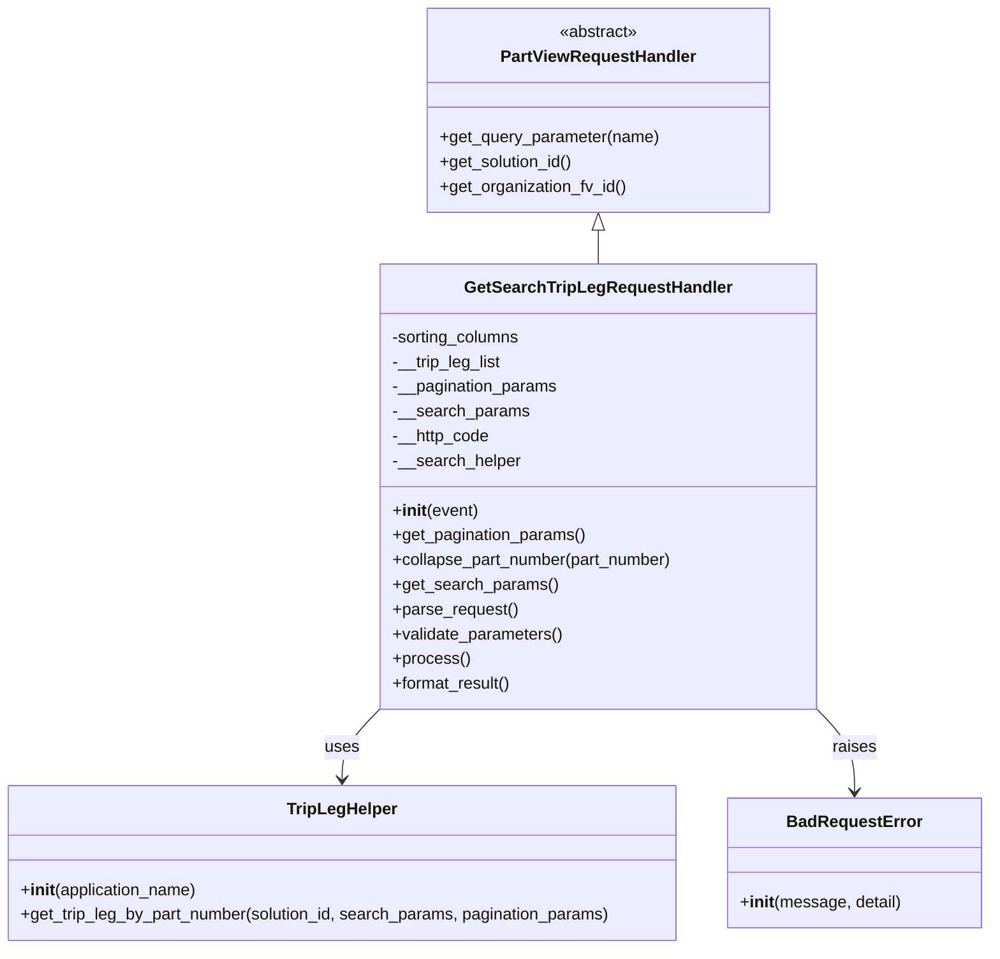

# Diagram: partview_core/partview_service/partview_service/api/search/handlers/trip_leg/GetSearchTripLegRequestHandler.py


> Auto-generated by Obscura crawlers

## Diagram 1



### SVG

<svg id="container" width="963.2265625" xmlns="http://www.w3.org/2000/svg" class="classDiagram" height="920" viewBox="0 0 963.2265625 920" role="graphics-document document" aria-roledescription="class"><style>#container{font-family:"trebuchet ms",verdana,arial,sans-serif;font-size:16px;fill:#333;}@keyframes edge-animation-frame{from{stroke-dashoffset:0;}}@keyframes dash{to{stroke-dashoffset:0;}}#container .edge-animation-slow{stroke-dasharray:9,5!important;stroke-dashoffset:900;animation:dash 50s linear infinite;stroke-linecap:round;}#container .edge-animation-fast{stroke-dasharray:9,5!important;stroke-dashoffset:900;animation:dash 20s linear infinite;stroke-linecap:round;}#container .error-icon{fill:#552222;}#container .error-text{fill:#552222;stroke:#552222;}#container .edge-thickness-normal{stroke-width:1px;}#container .edge-thickness-thick{stroke-width:3.5px;}#container .edge-pattern-solid{stroke-dasharray:0;}#container .edge-thickness-invisible{stroke-width:0;fill:none;}#container .edge-pattern-dashed{stroke-dasharray:3;}#container .edge-pattern-dotted{stroke-dasharray:2;}#container .marker{fill:#333333;stroke:#333333;}#container .marker.cross{stroke:#333333;}#container svg{font-family:"trebuchet ms",verdana,arial,sans-serif;font-size:16px;}#container p{margin:0;}#container g.classGroup text{fill:#9370DB;stroke:none;font-family:"trebuchet ms",verdana,arial,sans-serif;font-size:10px;}#container g.classGroup text .title{font-weight:bolder;}#container .nodeLabel,#container .edgeLabel{color:#131300;}#container .edgeLabel .label rect{fill:#ECECFF;}#container .label text{fill:#131300;}#container .labelBkg{background:#ECECFF;}#container .edgeLabel .label span{background:#ECECFF;}#container .classTitle{font-weight:bolder;}#container .node rect,#container .node circle,#container .node ellipse,#container .node polygon,#container .node path{fill:#ECECFF;stroke:#9370DB;stroke-width:1px;}#container .divider{stroke:#9370DB;stroke-width:1;}#container g.clickable{cursor:pointer;}#container g.classGroup rect{fill:#ECECFF;stroke:#9370DB;}#container g.classGroup line{stroke:#9370DB;stroke-width:1;}#container .classLabel .box{stroke:none;stroke-width:0;fill:#ECECFF;opacity:0.5;}#container .classLabel .label{fill:#9370DB;font-size:10px;}#container .relation{stroke:#333333;stroke-width:1;fill:none;}#container .dashed-line{stroke-dasharray:3;}#container .dotted-line{stroke-dasharray:1 2;}#container #compositionStart,#container .composition{fill:#333333!important;stroke:#333333!important;stroke-width:1;}#container #compositionEnd,#container .composition{fill:#333333!important;stroke:#333333!important;stroke-width:1;}#container #dependencyStart,#container .dependency{fill:#333333!important;stroke:#333333!important;stroke-width:1;}#container #dependencyStart,#container .dependency{fill:#333333!important;stroke:#333333!important;stroke-width:1;}#container #extensionStart,#container .extension{fill:transparent!important;stroke:#333333!important;stroke-width:1;}#container #extensionEnd,#container .extension{fill:transparent!important;stroke:#333333!important;stroke-width:1;}#container #aggregationStart,#container .aggregation{fill:transparent!important;stroke:#333333!important;stroke-width:1;}#container #aggregationEnd,#container .aggregation{fill:transparent!important;stroke:#333333!important;stroke-width:1;}#container #lollipopStart,#container .lollipop{fill:#ECECFF!important;stroke:#333333!important;stroke-width:1;}#container #lollipopEnd,#container .lollipop{fill:#ECECFF!important;stroke:#333333!important;stroke-width:1;}#container .edgeTerminals{font-size:11px;line-height:initial;}#container .classTitleText{text-anchor:middle;font-size:18px;fill:#333;}#container .label-icon{display:inline-block;height:1em;overflow:visible;vertical-align:-0.125em;}#container .node .label-icon path{fill:currentColor;stroke:revert;stroke-width:revert;}#container :root{--mermaid-font-family:"trebuchet ms",verdana,arial,sans-serif;}</style><g><defs><marker id="container_class-aggregationStart" class="marker aggregation class" refX="18" refY="7" markerWidth="190" markerHeight="240" orient="auto"><path d="M 18,7 L9,13 L1,7 L9,1 Z"></path></marker></defs><defs><marker id="container_class-aggregationEnd" class="marker aggregation class" refX="1" refY="7" markerWidth="20" markerHeight="28" orient="auto"><path d="M 18,7 L9,13 L1,7 L9,1 Z"></path></marker></defs><defs><marker id="container_class-extensionStart" class="marker extension class" refX="18" refY="7" markerWidth="190" markerHeight="240" orient="auto"><path d="M 1,7 L18,13 V 1 Z"></path></marker></defs><defs><marker id="container_class-extensionEnd" class="marker extension class" refX="1" refY="7" markerWidth="20" markerHeight="28" orient="auto"><path d="M 1,1 V 13 L18,7 Z"></path></marker></defs><defs><marker id="container_class-compositionStart" class="marker composition class" refX="18" refY="7" markerWidth="190" markerHeight="240" orient="auto"><path d="M 18,7 L9,13 L1,7 L9,1 Z"></path></marker></defs><defs><marker id="container_class-compositionEnd" class="marker composition class" refX="1" refY="7" markerWidth="20" markerHeight="28" orient="auto"><path d="M 18,7 L9,13 L1,7 L9,1 Z"></path></marker></defs><defs><marker id="container_class-dependencyStart" class="marker dependency class" refX="6" refY="7" markerWidth="190" markerHeight="240" orient="auto"><path d="M 5,7 L9,13 L1,7 L9,1 Z"></path></marker></defs><defs><marker id="container_class-dependencyEnd" class="marker dependency class" refX="13" refY="7" markerWidth="20" markerHeight="28" orient="auto"><path d="M 18,7 L9,13 L14,7 L9,1 Z"></path></marker></defs><defs><marker id="container_class-lollipopStart" class="marker lollipop class" refX="13" refY="7" markerWidth="190" markerHeight="240" orient="auto"><circle stroke="black" fill="transparent" cx="7" cy="7" r="6"></circle></marker></defs><defs><marker id="container_class-lollipopEnd" class="marker lollipop class" refX="1" refY="7" markerWidth="190" markerHeight="240" orient="auto"><circle stroke="black" fill="transparent" cx="7" cy="7" r="6"></circle></marker></defs><g class="root"><g class="clusters"></g><g class="edgePaths"><path d="M585.303,223.25L585.303,224.542C585.303,225.833,585.303,228.417,585.303,233.875C585.303,239.333,585.303,247.667,585.303,251.833L585.303,256" id="id_PartViewRequestHandler_GetSearchTripLegRequestHandler_1" class="edge-thickness-normal edge-pattern-solid relation" style=";;;" data-edge="true" data-et="edge" data-id="id_PartViewRequestHandler_GetSearchTripLegRequestHandler_1" data-points="W3sieCI6NTg1LjMwMjczNDM3NSwieSI6MjA2fSx7IngiOjU4NS4zMDI3MzQzNzUsInkiOjIzMX0seyJ4Ijo1ODUuMzAyNzM0Mzc1LCJ5IjoyNTZ9XQ==" marker-start="url(#container_class-extensionStart)"></path><path d="M373.072,687.375L366.893,693.645C360.714,699.916,348.355,712.458,342.175,723.896C335.996,735.333,335.996,745.667,335.996,750.833L335.996,756" id="id_GetSearchTripLegRequestHandler_TripLegHelper_2" class="edge-thickness-normal edge-pattern-solid relation" style=";;;" data-edge="true" data-et="edge" data-id="id_GetSearchTripLegRequestHandler_TripLegHelper_2" data-points="W3sieCI6MzczLjA3MjI2NTYyNSwieSI6Njg3LjM3NDU2MjI2MjUyNDl9LHsieCI6MzM1Ljk5NjA5Mzc1LCJ5Ijo3MjV9LHsieCI6MzM1Ljk5NjA5Mzc1LCJ5Ijo3NjJ9XQ==" marker-end="url(#container_class-dependencyEnd)"></path><path d="M797.533,687.375L803.713,693.645C809.892,699.916,822.251,712.458,828.43,725.896C834.609,739.333,834.609,753.667,834.609,760.833L834.609,768" id="id_GetSearchTripLegRequestHandler_BadRequestError_3" class="edge-thickness-normal edge-pattern-solid relation" style=";;;" data-edge="true" data-et="edge" data-id="id_GetSearchTripLegRequestHandler_BadRequestError_3" data-points="W3sieCI6Nzk3LjUzMzIwMzEyNSwieSI6Njg3LjM3NDU2MjI2MjUyNDl9LHsieCI6ODM0LjYwOTM3NSwieSI6NzI1fSx7IngiOjgzNC42MDkzNzUsInkiOjc3NH1d" marker-end="url(#container_class-dependencyEnd)"></path></g><g class="edgeLabels"><g class="edgeLabel"><g class="label" data-id="id_PartViewRequestHandler_GetSearchTripLegRequestHandler_1" transform="translate(0, 0)"><foreignObject width="0" height="0"><div xmlns="http://www.w3.org/1999/xhtml" class="labelBkg" style="display: table-cell; white-space: nowrap; line-height: 1.5; max-width: 200px; text-align: center;"><span class="edgeLabel"></span></div></foreignObject></g></g><g class="edgeLabel" transform="translate(335.99609375, 725)"><g class="label" data-id="id_GetSearchTripLegRequestHandler_TripLegHelper_2" transform="translate(-16.4921875, -12)"><foreignObject width="32.984375" height="24"><div xmlns="http://www.w3.org/1999/xhtml" class="labelBkg" style="display: table-cell; white-space: nowrap; line-height: 1.5; max-width: 200px; text-align: center;"><span class="edgeLabel"><p>uses</p></span></div></foreignObject></g></g><g class="edgeLabel" transform="translate(834.609375, 725)"><g class="label" data-id="id_GetSearchTripLegRequestHandler_BadRequestError_3" transform="translate(-21.25, -12)"><foreignObject width="42.5" height="24"><div xmlns="http://www.w3.org/1999/xhtml" class="labelBkg" style="display: table-cell; white-space: nowrap; line-height: 1.5; max-width: 200px; text-align: center;"><span class="edgeLabel"><p>raises</p></span></div></foreignObject></g></g></g><g class="nodes"><g class="node default" id="classId-PartViewRequestHandler-0" transform="translate(585.302734375, 107)"><g class="basic label-container"><path d="M-164.7578125 -99 L164.7578125 -99 L164.7578125 99 L-164.7578125 99" stroke="none" stroke-width="0" fill="#ECECFF" style=""></path><path d="M-164.7578125 -99 C-47.485285509426944 -99, 69.78724148114611 -99, 164.7578125 -99 M-164.7578125 -99 C-74.34556716424076 -99, 16.066678171518475 -99, 164.7578125 -99 M164.7578125 -99 C164.7578125 -37.92613991942808, 164.7578125 23.147720161143837, 164.7578125 99 M164.7578125 -99 C164.7578125 -53.53012479598336, 164.7578125 -8.060249591966723, 164.7578125 99 M164.7578125 99 C56.28911327682334 99, -52.17958594635331 99, -164.7578125 99 M164.7578125 99 C50.82753993567519 99, -63.10273262864962 99, -164.7578125 99 M-164.7578125 99 C-164.7578125 49.5095284673113, -164.7578125 0.019056934622597055, -164.7578125 -99 M-164.7578125 99 C-164.7578125 58.39627609862392, -164.7578125 17.792552197247844, -164.7578125 -99" stroke="#9370DB" stroke-width="1.3" fill="none" stroke-dasharray="0 0" style=""></path></g><g class="annotation-group text" transform="translate(-38.609375, -75)"><g class="label" style="" transform="translate(0,-12)"><foreignObject width="77.21875" height="24"><div xmlns="http://www.w3.org/1999/xhtml" style="display: table-cell; white-space: nowrap; line-height: 1.5; max-width: 127px; text-align: center;"><span class="nodeLabel markdown-node-label" style=""><p>«abstract»</p></span></div></foreignObject></g></g><g class="label-group text" transform="translate(-91.359375, -51)"><g class="label" style="font-weight: bolder" transform="translate(0,-12)"><foreignObject width="182.71875" height="24"><div xmlns="http://www.w3.org/1999/xhtml" style="display: table-cell; white-space: nowrap; line-height: 1.5; max-width: 231px; text-align: center;"><span class="nodeLabel markdown-node-label" style=""><p>PartViewRequestHandler</p></span></div></foreignObject></g></g><g class="members-group text" transform="translate(-152.7578125, -3)"></g><g class="methods-group text" transform="translate(-152.7578125, 27)"><g class="label" style="" transform="translate(0,-12)"><foreignObject width="214.15625" height="24"><div xmlns="http://www.w3.org/1999/xhtml" style="display: table-cell; white-space: nowrap; line-height: 1.5; max-width: 272px; text-align: center;"><span class="nodeLabel markdown-node-label" style=""><p>+get_query_parameter(name)</p></span></div></foreignObject></g><g class="label" style="" transform="translate(0,12)"><foreignObject width="131.46875" height="24"><div xmlns="http://www.w3.org/1999/xhtml" style="display: table-cell; white-space: nowrap; line-height: 1.5; max-width: 189px; text-align: center;"><span class="nodeLabel markdown-node-label" style=""><p>+get_solution_id()</p></span></div></foreignObject></g><g class="label" style="" transform="translate(0,36)"><foreignObject width="182.421875" height="24"><div xmlns="http://www.w3.org/1999/xhtml" style="display: table-cell; white-space: nowrap; line-height: 1.5; max-width: 240px; text-align: center;"><span class="nodeLabel markdown-node-label" style=""><p>+get_organization_fv_id()</p></span></div></foreignObject></g></g><g class="divider" style=""><path d="M-164.7578125 -27 C-46.9610196124156 -27, 70.8357732751688 -27, 164.7578125 -27 M-164.7578125 -27 C-53.38616668692521 -27, 57.985479126149585 -27, 164.7578125 -27" stroke="#9370DB" stroke-width="1.3" fill="none" stroke-dasharray="0 0" style=""></path></g><g class="divider" style=""><path d="M-164.7578125 -3 C-75.16175146458725 -3, 14.43430957082549 -3, 164.7578125 -3 M-164.7578125 -3 C-98.03120794275294 -3, -31.304603385505885 -3, 164.7578125 -3" stroke="#9370DB" stroke-width="1.3" fill="none" stroke-dasharray="0 0" style=""></path></g></g><g class="node default" id="classId-GetSearchTripLegRequestHandler-1" transform="translate(585.302734375, 472)"><g class="basic label-container"><path d="M-212.23046875 -216 L212.23046875 -216 L212.23046875 216 L-212.23046875 216" stroke="none" stroke-width="0" fill="#ECECFF" style=""></path><path d="M-212.23046875 -216 C-53.19574513349258 -216, 105.83897848301484 -216, 212.23046875 -216 M-212.23046875 -216 C-43.862844489809504 -216, 124.50477977038099 -216, 212.23046875 -216 M212.23046875 -216 C212.23046875 -100.43082128083596, 212.23046875 15.138357438328086, 212.23046875 216 M212.23046875 -216 C212.23046875 -105.69122545108338, 212.23046875 4.617549097833233, 212.23046875 216 M212.23046875 216 C122.53098872459661 216, 32.83150869919322 216, -212.23046875 216 M212.23046875 216 C118.42095283925907 216, 24.611436928518145 216, -212.23046875 216 M-212.23046875 216 C-212.23046875 50.36124168094295, -212.23046875 -115.2775166381141, -212.23046875 -216 M-212.23046875 216 C-212.23046875 65.45627870311182, -212.23046875 -85.08744259377636, -212.23046875 -216" stroke="#9370DB" stroke-width="1.3" fill="none" stroke-dasharray="0 0" style=""></path></g><g class="annotation-group text" transform="translate(0, -192)"></g><g class="label-group text" transform="translate(-123.4921875, -192)"><g class="label" style="font-weight: bolder" transform="translate(0,-12)"><foreignObject width="246.984375" height="24"><div xmlns="http://www.w3.org/1999/xhtml" style="display: table-cell; white-space: nowrap; line-height: 1.5; max-width: 294px; text-align: center;"><span class="nodeLabel markdown-node-label" style=""><p>GetSearchTripLegRequestHandler</p></span></div></foreignObject></g></g><g class="members-group text" transform="translate(-200.23046875, -144)"><g class="label" style="" transform="translate(0,-12)"><foreignObject width="126.734375" height="24"><div xmlns="http://www.w3.org/1999/xhtml" style="display: table-cell; white-space: nowrap; line-height: 1.5; max-width: 184px; text-align: center;"><span class="nodeLabel markdown-node-label" style=""><p>-sorting_columns</p></span></div></foreignObject></g><g class="label" style="" transform="translate(0,12)"><foreignObject width="107.46875" height="24"><div xmlns="http://www.w3.org/1999/xhtml" style="display: table-cell; white-space: nowrap; line-height: 1.5; max-width: 165px; text-align: center;"><span class="nodeLabel markdown-node-label" style=""><p>-__trip_leg_list</p></span></div></foreignObject></g><g class="label" style="" transform="translate(0,36)"><foreignObject width="161.34375" height="24"><div xmlns="http://www.w3.org/1999/xhtml" style="display: table-cell; white-space: nowrap; line-height: 1.5; max-width: 219px; text-align: center;"><span class="nodeLabel markdown-node-label" style=""><p>-__pagination_params</p></span></div></foreignObject></g><g class="label" style="" transform="translate(0,60)"><foreignObject width="130.984375" height="24"><div xmlns="http://www.w3.org/1999/xhtml" style="display: table-cell; white-space: nowrap; line-height: 1.5; max-width: 188px; text-align: center;"><span class="nodeLabel markdown-node-label" style=""><p>-__search_params</p></span></div></foreignObject></g><g class="label" style="" transform="translate(0,84)"><foreignObject width="94.734375" height="24"><div xmlns="http://www.w3.org/1999/xhtml" style="display: table-cell; white-space: nowrap; line-height: 1.5; max-width: 152px; text-align: center;"><span class="nodeLabel markdown-node-label" style=""><p>-__http_code</p></span></div></foreignObject></g><g class="label" style="" transform="translate(0,108)"><foreignObject width="124.609375" height="24"><div xmlns="http://www.w3.org/1999/xhtml" style="display: table-cell; white-space: nowrap; line-height: 1.5; max-width: 183px; text-align: center;"><span class="nodeLabel markdown-node-label" style=""><p>-__search_helper</p></span></div></foreignObject></g></g><g class="methods-group text" transform="translate(-200.23046875, 24)"><g class="label" style="" transform="translate(0,-12)"><foreignObject width="83.140625" height="24"><div xmlns="http://www.w3.org/1999/xhtml" style="display: table-cell; white-space: nowrap; line-height: 1.5; max-width: 172px; text-align: center;"><span class="nodeLabel markdown-node-label" style=""><p>+<strong>init</strong>(event)</p></span></div></foreignObject></g><g class="label" style="" transform="translate(0,12)"><foreignObject width="188.921875" height="24"><div xmlns="http://www.w3.org/1999/xhtml" style="display: table-cell; white-space: nowrap; line-height: 1.5; max-width: 246px; text-align: center;"><span class="nodeLabel markdown-node-label" style=""><p>+get_pagination_params()</p></span></div></foreignObject></g><g class="label" style="" transform="translate(0,36)"><foreignObject width="276.96875" height="24"><div xmlns="http://www.w3.org/1999/xhtml" style="display: table-cell; white-space: nowrap; line-height: 1.5; max-width: 334px; text-align: center;"><span class="nodeLabel markdown-node-label" style=""><p>+collapse_part_number(part_number)</p></span></div></foreignObject></g><g class="label" style="" transform="translate(0,60)"><foreignObject width="158.5625" height="24"><div xmlns="http://www.w3.org/1999/xhtml" style="display: table-cell; white-space: nowrap; line-height: 1.5; max-width: 216px; text-align: center;"><span class="nodeLabel markdown-node-label" style=""><p>+get_search_params()</p></span></div></foreignObject></g><g class="label" style="" transform="translate(0,84)"><foreignObject width="121.796875" height="24"><div xmlns="http://www.w3.org/1999/xhtml" style="display: table-cell; white-space: nowrap; line-height: 1.5; max-width: 179px; text-align: center;"><span class="nodeLabel markdown-node-label" style=""><p>+parse_request()</p></span></div></foreignObject></g><g class="label" style="" transform="translate(0,108)"><foreignObject width="166.546875" height="24"><div xmlns="http://www.w3.org/1999/xhtml" style="display: table-cell; white-space: nowrap; line-height: 1.5; max-width: 224px; text-align: center;"><span class="nodeLabel markdown-node-label" style=""><p>+validate_parameters()</p></span></div></foreignObject></g><g class="label" style="" transform="translate(0,132)"><foreignObject width="73.734375" height="24"><div xmlns="http://www.w3.org/1999/xhtml" style="display: table-cell; white-space: nowrap; line-height: 1.5; max-width: 131px; text-align: center;"><span class="nodeLabel markdown-node-label" style=""><p>+process()</p></span></div></foreignObject></g><g class="label" style="" transform="translate(0,156)"><foreignObject width="117.015625" height="24"><div xmlns="http://www.w3.org/1999/xhtml" style="display: table-cell; white-space: nowrap; line-height: 1.5; max-width: 174px; text-align: center;"><span class="nodeLabel markdown-node-label" style=""><p>+format_result()</p></span></div></foreignObject></g></g><g class="divider" style=""><path d="M-212.23046875 -168 C-100.36219742548981 -168, 11.506073899020379 -168, 212.23046875 -168 M-212.23046875 -168 C-57.84827403423316 -168, 96.53392068153369 -168, 212.23046875 -168" stroke="#9370DB" stroke-width="1.3" fill="none" stroke-dasharray="0 0" style=""></path></g><g class="divider" style=""><path d="M-212.23046875 0 C-74.73542445772858 0, 62.75961983454283 0, 212.23046875 0 M-212.23046875 0 C-51.31656955505858 0, 109.59732963988284 0, 212.23046875 0" stroke="#9370DB" stroke-width="1.3" fill="none" stroke-dasharray="0 0" style=""></path></g></g><g class="node default" id="classId-TripLegHelper-2" transform="translate(335.99609375, 837)"><g class="basic label-container"><path d="M-327.99609375 -75 L327.99609375 -75 L327.99609375 75 L-327.99609375 75" stroke="none" stroke-width="0" fill="#ECECFF" style=""></path><path d="M-327.99609375 -75 C-117.73796937267602 -75, 92.52015500464796 -75, 327.99609375 -75 M-327.99609375 -75 C-109.86437305510788 -75, 108.26734763978425 -75, 327.99609375 -75 M327.99609375 -75 C327.99609375 -41.148419784767746, 327.99609375 -7.296839569535493, 327.99609375 75 M327.99609375 -75 C327.99609375 -31.98075530990276, 327.99609375 11.038489380194477, 327.99609375 75 M327.99609375 75 C120.50031381063943 75, -86.99546612872115 75, -327.99609375 75 M327.99609375 75 C85.84774439763717 75, -156.30060495472566 75, -327.99609375 75 M-327.99609375 75 C-327.99609375 27.96765680410484, -327.99609375 -19.064686391790318, -327.99609375 -75 M-327.99609375 75 C-327.99609375 23.72849159531546, -327.99609375 -27.543016809369078, -327.99609375 -75" stroke="#9370DB" stroke-width="1.3" fill="none" stroke-dasharray="0 0" style=""></path></g><g class="annotation-group text" transform="translate(0, -51)"></g><g class="label-group text" transform="translate(-51.5703125, -51)"><g class="label" style="font-weight: bolder" transform="translate(0,-12)"><foreignObject width="103.140625" height="24"><div xmlns="http://www.w3.org/1999/xhtml" style="display: table-cell; white-space: nowrap; line-height: 1.5; max-width: 152px; text-align: center;"><span class="nodeLabel markdown-node-label" style=""><p>TripLegHelper</p></span></div></foreignObject></g></g><g class="members-group text" transform="translate(-315.99609375, -3)"></g><g class="methods-group text" transform="translate(-315.99609375, 27)"><g class="label" style="" transform="translate(0,-12)"><foreignObject width="173.734375" height="24"><div xmlns="http://www.w3.org/1999/xhtml" style="display: table-cell; white-space: nowrap; line-height: 1.5; max-width: 263px; text-align: center;"><span class="nodeLabel markdown-node-label" style=""><p>+<strong>init</strong>(application_name)</p></span></div></foreignObject></g><g class="label" style="" transform="translate(0,12)"><foreignObject width="580.421875" height="24"><div xmlns="http://www.w3.org/1999/xhtml" style="display: table-cell; white-space: nowrap; line-height: 1.5; max-width: 638px; text-align: center;"><span class="nodeLabel markdown-node-label" style=""><p>+get_trip_leg_by_part_number(solution_id, search_params, pagination_params)</p></span></div></foreignObject></g></g><g class="divider" style=""><path d="M-327.99609375 -27 C-185.8005766824978 -27, -43.60505961499558 -27, 327.99609375 -27 M-327.99609375 -27 C-124.50777469992113 -27, 78.98054435015774 -27, 327.99609375 -27" stroke="#9370DB" stroke-width="1.3" fill="none" stroke-dasharray="0 0" style=""></path></g><g class="divider" style=""><path d="M-327.99609375 -3 C-132.13554336487118 -3, 63.725007020257635 -3, 327.99609375 -3 M-327.99609375 -3 C-162.30685129655808 -3, 3.382391156883841 -3, 327.99609375 -3" stroke="#9370DB" stroke-width="1.3" fill="none" stroke-dasharray="0 0" style=""></path></g></g><g class="node default" id="classId-BadRequestError-3" transform="translate(834.609375, 837)"><g class="basic label-container"><path d="M-120.6171875 -63 L120.6171875 -63 L120.6171875 63 L-120.6171875 63" stroke="none" stroke-width="0" fill="#ECECFF" style=""></path><path d="M-120.6171875 -63 C-46.03119754697278 -63, 28.554792406054446 -63, 120.6171875 -63 M-120.6171875 -63 C-54.36370134206827 -63, 11.889784815863464 -63, 120.6171875 -63 M120.6171875 -63 C120.6171875 -29.843892315370823, 120.6171875 3.312215369258354, 120.6171875 63 M120.6171875 -63 C120.6171875 -18.456803626658527, 120.6171875 26.086392746682947, 120.6171875 63 M120.6171875 63 C32.94658123263787 63, -54.724025034724264 63, -120.6171875 63 M120.6171875 63 C29.232315062781183 63, -62.152557374437635 63, -120.6171875 63 M-120.6171875 63 C-120.6171875 16.705910419149113, -120.6171875 -29.588179161701774, -120.6171875 -63 M-120.6171875 63 C-120.6171875 36.41601752077801, -120.6171875 9.832035041556033, -120.6171875 -63" stroke="#9370DB" stroke-width="1.3" fill="none" stroke-dasharray="0 0" style=""></path></g><g class="annotation-group text" transform="translate(0, -39)"></g><g class="label-group text" transform="translate(-62.28125, -39)"><g class="label" style="font-weight: bolder" transform="translate(0,-12)"><foreignObject width="124.5625" height="24"><div xmlns="http://www.w3.org/1999/xhtml" style="display: table-cell; white-space: nowrap; line-height: 1.5; max-width: 174px; text-align: center;"><span class="nodeLabel markdown-node-label" style=""><p>BadRequestError</p></span></div></foreignObject></g></g><g class="members-group text" transform="translate(-108.6171875, 9)"></g><g class="methods-group text" transform="translate(-108.6171875, 39)"><g class="label" style="" transform="translate(0,-12)"><foreignObject width="154.953125" height="24"><div xmlns="http://www.w3.org/1999/xhtml" style="display: table-cell; white-space: nowrap; line-height: 1.5; max-width: 244px; text-align: center;"><span class="nodeLabel markdown-node-label" style=""><p>+<strong>init</strong>(message, detail)</p></span></div></foreignObject></g></g><g class="divider" style=""><path d="M-120.6171875 -15 C-43.73698984245071 -15, 33.14320781509858 -15, 120.6171875 -15 M-120.6171875 -15 C-51.19870930455522 -15, 18.219768890889554 -15, 120.6171875 -15" stroke="#9370DB" stroke-width="1.3" fill="none" stroke-dasharray="0 0" style=""></path></g><g class="divider" style=""><path d="M-120.6171875 9 C-24.866659617072813 9, 70.88386826585437 9, 120.6171875 9 M-120.6171875 9 C-33.52109719584057 9, 53.574993108318864 9, 120.6171875 9" stroke="#9370DB" stroke-width="1.3" fill="none" stroke-dasharray="0 0" style=""></path></g></g></g></g></g></svg>

## Diagram 2

```mermaid
sequenceDiagram
    participant Client
    participant Handler as GetSearchTripLegRequestHandler
    participant Helper as TripLegHelper
    participant HTTP as HTTPStatus
    Client->>Handler: HTTP request (query params)
    Handler->>Handler: parse_request()
    Handler->>Handler: get_search_params()
    alt missing or invalid search params
        Handler->>Errors: validate_parameters() raises BadRequestError
        Errors-->>Client: HTTP 400 Bad Request
    else valid params
        Handler->>Handler: validate_parameters()
        Handler->>Helper: get_trip_leg_by_part_number(solution_id, search_params, pagination_params)
        Helper-->>Handler: list of TripLeg objects
        Handler->>Handler: format_result()
        Handler-->>Client: HTTP 200 with formatted result
```

> SVG rendering failed for this diagram.
