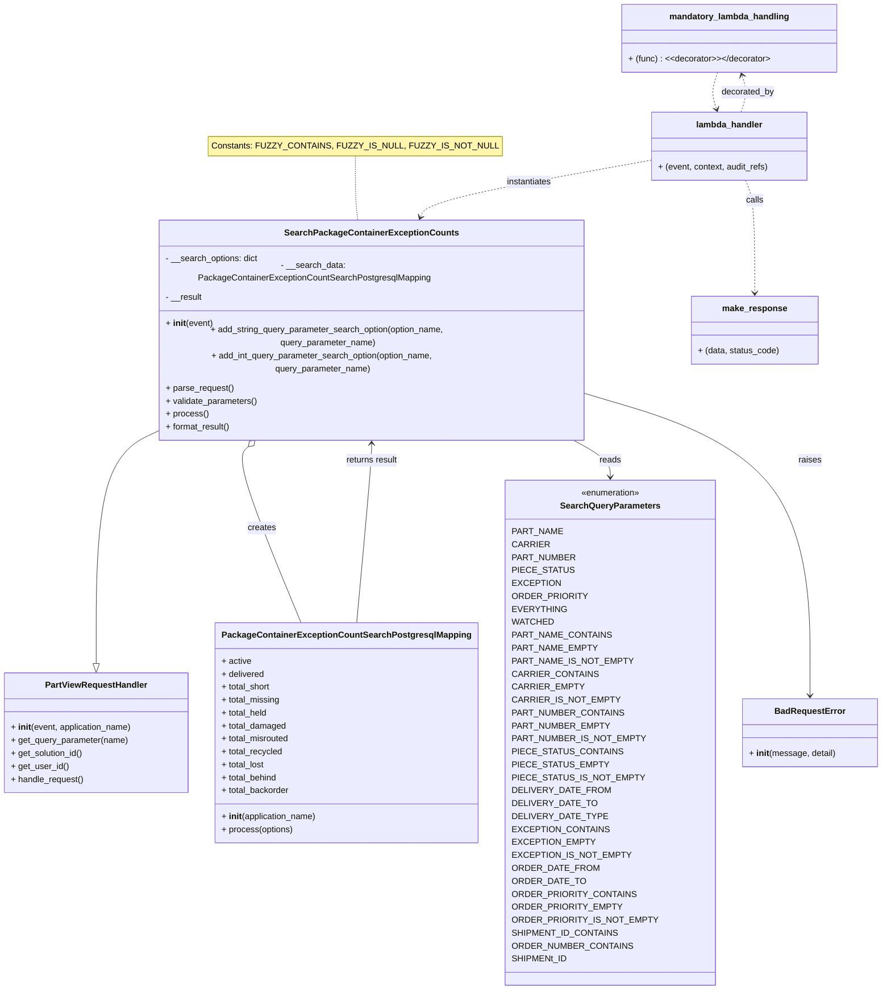

# Diagram: partview_core/partview_service/partview_service/api/search/package_container_exception/search_package_container_exception_counts.py

> Auto-generated by Obscura crawlers

## Mermaid

### SVG

<svg id="container" width="1561.1875" xmlns="http://www.w3.org/2000/svg" class="classDiagram" height="1762" viewBox="0 0 1561.1875 1762" role="graphics-document document" aria-roledescription="class"><g><defs><marker id="container_class-aggregationStart" class="marker aggregation class" refX="18" refY="7" markerWidth="190" markerHeight="240" orient="auto"><path d="M 18,7 L9,13 L1,7 L9,1 Z"></path></marker></defs><defs><marker id="container_class-aggregationEnd" class="marker aggregation class" refX="1" refY="7" markerWidth="20" markerHeight="28" orient="auto"><path d="M 18,7 L9,13 L1,7 L9,1 Z"></path></marker></defs><defs><marker id="container_class-extensionStart" class="marker extension class" refX="18" refY="7" markerWidth="190" markerHeight="240" orient="auto"><path d="M 1,7 L18,13 V 1 Z"></path></marker></defs><defs><marker id="container_class-extensionEnd" class="marker extension class" refX="1" refY="7" markerWidth="20" markerHeight="28" orient="auto"><path d="M 1,1 V 13 L18,7 Z"></path></marker></defs><defs><marker id="container_class-compositionStart" class="marker composition class" refX="18" refY="7" markerWidth="190" markerHeight="240" orient="auto"><path d="M 18,7 L9,13 L1,7 L9,1 Z"></path></marker></defs><defs><marker id="container_class-compositionEnd" class="marker composition class" refX="1" refY="7" markerWidth="20" markerHeight="28" orient="auto"><path d="M 18,7 L9,13 L1,7 L9,1 Z"></path></marker></defs><defs><marker id="container_class-dependencyStart" class="marker dependency class" refX="6" refY="7" markerWidth="190" markerHeight="240" orient="auto"><path d="M 5,7 L9,13 L1,7 L9,1 Z"></path></marker></defs><defs><marker id="container_class-dependencyEnd" class="marker dependency class" refX="13" refY="7" markerWidth="20" markerHeight="28" orient="auto"><path d="M 18,7 L9,13 L14,7 L9,1 Z"></path></marker></defs><defs><marker id="container_class-lollipopStart" class="marker lollipop class" refX="13" refY="7" markerWidth="190" markerHeight="240" orient="auto"><circle stroke="black" fill="transparent" cx="7" cy="7" r="6"></circle></marker></defs><defs><marker id="container_class-lollipopEnd" class="marker lollipop class" refX="1" refY="7" markerWidth="190" markerHeight="240" orient="auto"><circle stroke="black" fill="transparent" cx="7" cy="7" r="6"></circle></marker></defs><g class="root"><g class="clusters"></g><g class="edgePaths"><path d="M645.723,289L645.723,302.667C645.723,316.333,645.723,343.667,646.669,363.5C647.615,383.333,649.508,395.667,650.454,401.833L651.4,408" id="edgeNote1" class="edge-thickness-normal edge-pattern-dotted relation" style="fill: none;;;fill: none" data-edge="true" data-et="edge" data-id="edgeNote1" data-points="W3sieCI6NjQ1LjcyMjY1NjI1LCJ5IjoyODl9LHsieCI6NjQ1LjcyMjY1NjI1LCJ5IjozNzF9LHsieCI6NjUxLjQwMDI2Njc2ODI5MjcsInkiOjQwOH1d"></path><path d="M279.418,739.65L262.667,746.542C245.917,753.433,212.415,767.217,195.665,836.9C178.914,906.583,178.914,1032.167,178.914,1094.958L178.914,1157.75" id="id_SearchPackageContainerExceptionCounts_PartViewRequestHandler_1" class="edge-thickness-normal edge-pattern-solid relation" style=";;;" data-edge="true" data-et="edge" data-id="id_SearchPackageContainerExceptionCounts_PartViewRequestHandler_1" data-points="W3sieCI6Mjc5LjQxNzk2ODc1LCJ5Ijo3MzkuNjQ5OTY1NTA1MzQ2N30seyJ4IjoxNzguOTE0MDYyNSwieSI6NzgxfSx7IngiOjE3OC45MTQwNjI1LCJ5IjoxMTc1fV0=" marker-end="url(#container_class-extensionEnd)"></path><path d="M459.051,754.941L453.757,759.284C448.463,763.627,437.874,772.314,452.666,826.823C467.458,881.333,507.631,981.667,527.717,1031.833L547.804,1082" id="id_SearchPackageContainerExceptionCounts_PackageContainerExceptionCountSearchPostgresqlMapping_2" class="edge-thickness-normal edge-pattern-solid relation" style=";;;" data-edge="true" data-et="edge" data-id="id_SearchPackageContainerExceptionCounts_PackageContainerExceptionCountSearchPostgresqlMapping_2" data-points="W3sieCI6NDcyLjM4ODA3MTY0NjM0MTUsInkiOjc0NH0seyJ4Ijo0MjcuMjg1MTU2MjUsInkiOjc4MX0seyJ4Ijo1NDcuODAzODk4NTE0ODUxNCwieSI6MTA4Mn1d" marker-start="url(#container_class-aggregationStart)"></path><path d="M1010.1,744L1022.32,750.167C1034.541,756.333,1058.981,768.667,1071.202,780C1083.422,791.333,1083.422,801.667,1083.422,806.833L1083.422,812" id="id_SearchPackageContainerExceptionCounts_SearchQueryParameters_3" class="edge-thickness-normal edge-pattern-solid relation" style=";;;" data-edge="true" data-et="edge" data-id="id_SearchPackageContainerExceptionCounts_SearchQueryParameters_3" data-points="W3sieCI6MTAxMC4xMDAxMTQzMjkyNjgzLCJ5Ijo3NDR9LHsieCI6MTA4My40MjE4NzUsInkiOjc4MX0seyJ4IjoxMDgzLjQyMTg3NSwieSI6ODE4fV0=" marker-end="url(#container_class-dependencyEnd)"></path><path d="M1074.941,684.25L1134.192,700.375C1193.443,716.5,1311.944,748.75,1371.195,837.542C1430.445,926.333,1430.445,1071.667,1430.445,1144.333L1430.445,1217" id="id_SearchPackageContainerExceptionCounts_BadRequestError_4" class="edge-thickness-normal edge-pattern-solid relation" style=";;;" data-edge="true" data-et="edge" data-id="id_SearchPackageContainerExceptionCounts_BadRequestError_4" data-points="W3sieCI6MTA3NC45NDE0MDYyNSwieSI6Njg0LjI1MDE5NzA1ODY0MDV9LHsieCI6MTQzMC40NDUzMTI1LCJ5Ijo3ODF9LHsieCI6MTQzMC40NDUzMTI1LCJ5IjoxMjIzfV0=" marker-end="url(#container_class-dependencyEnd)"></path><path d="M1151.58,297.455L1084.338,309.713C1017.096,321.97,882.611,346.485,813.562,363.964C744.513,381.443,740.898,391.887,739.091,397.108L737.284,402.33" id="id_lambda_handler_SearchPackageContainerExceptionCounts_5" class="edge-thickness-normal edge-pattern-dashed relation" style=";;;" data-edge="true" data-et="edge" data-id="id_lambda_handler_SearchPackageContainerExceptionCounts_5" data-points="W3sieCI6MTE1MS41ODAwNzgxMjUsInkiOjI5Ny40NTUyNzg4Nzk0OTc1NH0seyJ4Ijo3NDguMTI2OTUzMTI1LCJ5IjozNzF9LHsieCI6NzM1LjMyMTgzNjg5MDI0NCwieSI6NDA4fV0=" marker-end="url(#container_class-dependencyEnd)"></path><path d="M1336.266,334L1340.138,340.167C1344.01,346.333,1351.754,358.667,1355.626,387.5C1359.498,416.333,1359.498,461.667,1359.498,484.333L1359.498,507" id="id_lambda_handler_make_response_6" class="edge-thickness-normal edge-pattern-dashed relation" style=";;;" data-edge="true" data-et="edge" data-id="id_lambda_handler_make_response_6" data-points="W3sieCI6MTMzNi4yNjYwOTM3NSwieSI6MzM0fSx7IngiOjEzNTkuNDk4MDQ2ODc1LCJ5IjozNzF9LHsieCI6MTM1OS40OTgwNDY4NzUsInkiOjUxM31d" marker-end="url(#container_class-dependencyEnd)"></path><path d="M1318.562,208L1320.701,201.833C1322.84,195.667,1327.118,183.333,1327.446,171.945C1327.774,160.556,1324.151,150.112,1322.34,144.891L1320.528,139.669" id="id_lambda_handler_mandatory_lambda_handling_7" class="edge-thickness-normal edge-pattern-dashed relation" style=";;;" data-edge="true" data-et="edge" data-id="id_lambda_handler_mandatory_lambda_handling_7" data-points="W3sieCI6MTMxOC41NjIxMDkzNzUsInkiOjIwOH0seyJ4IjoxMzMxLjM5NjQ4NDM3NSwieSI6MTcxfSx7IngiOjEzMTguNTYyMTA5Mzc1LCJ5IjoxMzR9XQ==" marker-end="url(#container_class-dependencyEnd)"></path><path d="M1274.856,134L1272.717,140.167C1270.578,146.333,1266.3,158.667,1265.972,170.055C1265.644,181.444,1269.267,191.888,1271.078,197.109L1272.89,202.331" id="id_mandatory_lambda_handling_lambda_handler_8" class="edge-thickness-normal edge-pattern-dashed relation" style=";;;" data-edge="true" data-et="edge" data-id="id_mandatory_lambda_handling_lambda_handler_8" data-points="W3sieCI6MTI3NC44NTU4NTkzNzUsInkiOjEzNH0seyJ4IjoxMjYyLjAyMTQ4NDM3NSwieSI6MTcxfSx7IngiOjEyNzQuODU1ODU5Mzc1LCJ5IjoyMDh9XQ==" marker-end="url(#container_class-dependencyEnd)"></path><path d="M648.751,1082L653.489,1031.833C658.227,981.667,667.704,881.333,672.442,826C677.18,770.667,677.18,760.333,677.18,755.167L677.18,750" id="id_PackageContainerExceptionCountSearchPostgresqlMapping_SearchPackageContainerExceptionCounts_9" class="edge-thickness-normal edge-pattern-solid relation" style=";;;" data-edge="true" data-et="edge" data-id="id_PackageContainerExceptionCountSearchPostgresqlMapping_SearchPackageContainerExceptionCounts_9" data-points="W3sieCI6NjQ4Ljc1MTM5MjMyNjczMjcsInkiOjEwODJ9LHsieCI6Njc3LjE3OTY4NzUsInkiOjc4MX0seyJ4Ijo2NzcuMTc5Njg3NSwieSI6NzQ0fV0=" marker-end="url(#container_class-dependencyEnd)"></path></g><g class="edgeLabels"><g class="edgeLabel"><g class="label" data-id="edgeNote1" transform="translate(0, 0)"><foreignObject width="0" height="0">

</foreignObject></g></g><g class="edgeLabel"><g class="label" data-id="id_SearchPackageContainerExceptionCounts_PartViewRequestHandler_1" transform="translate(0, 0)"><foreignObject width="0" height="0">

</foreignObject></g></g><g class="edgeLabel" transform="translate(476.7023, 904.42114)"><g class="label" data-id="id_SearchPackageContainerExceptionCounts_PackageContainerExceptionCountSearchPostgresqlMapping_2" transform="translate(-26.171875, -12)"><foreignObject width="52.34375" height="24">

creates

</foreignObject></g></g><g class="edgeLabel" transform="translate(1083.421875, 781)"><g class="label" data-id="id_SearchPackageContainerExceptionCounts_SearchQueryParameters_3" transform="translate(-20.0078125, -12)"><foreignObject width="40.015625" height="24">

reads

</foreignObject></g></g><g class="edgeLabel" transform="translate(1430.4453125, 781)"><g class="label" data-id="id_SearchPackageContainerExceptionCounts_BadRequestError_4" transform="translate(-21.25, -12)"><foreignObject width="42.5" height="24">

raises

</foreignObject></g></g><g class="edgeLabel" transform="translate(930.5943, 337.73837)"><g class="label" data-id="id_lambda_handler_SearchPackageContainerExceptionCounts_5" transform="translate(-42.9140625, -12)"><foreignObject width="85.828125" height="24">

instantiates

</foreignObject></g></g><g class="edgeLabel" transform="translate(1359.498046875, 371)"><g class="label" data-id="id_lambda_handler_make_response_6" transform="translate(-16.4453125, -12)"><foreignObject width="32.890625" height="24">

calls

</foreignObject></g></g><g class="edgeLabel" transform="translate(1331.396484375, 171)"><g class="label" data-id="id_lambda_handler_mandatory_lambda_handling_7" transform="translate(-49.375, -12)"><foreignObject width="98.75" height="24">

decorated_by

</foreignObject></g></g><g class="edgeLabel"><g class="label" data-id="id_mandatory_lambda_handling_lambda_handler_8" transform="translate(0, 0)"><foreignObject width="0" height="0">

</foreignObject></g></g><g class="edgeLabel" transform="translate(677.1796875, 781)"><g class="label" data-id="id_PackageContainerExceptionCountSearchPostgresqlMapping_SearchPackageContainerExceptionCounts_9" transform="translate(-49.21875, -12)"><foreignObject width="98.4375" height="24">

returns result

</foreignObject></g></g></g><g class="nodes"><g class="node default" id="classId-SearchPackageContainerExceptionCounts-0" transform="translate(677.1796875, 576)"><g class="basic label-container"><path d="M-397.76171875 -168 L397.76171875 -168 L397.76171875 168 L-397.76171875 168" stroke="none" stroke-width="0" fill="#ECECFF" style=""></path><path d="M-397.76171875 -168 C-153.84769609449665 -168, 90.06632656100669 -168, 397.76171875 -168 M-397.76171875 -168 C-164.4565223012745 -168, 68.84867414745099 -168, 397.76171875 -168 M397.76171875 -168 C397.76171875 -67.42734088099536, 397.76171875 33.14531823800928, 397.76171875 168 M397.76171875 -168 C397.76171875 -58.633655170313475, 397.76171875 50.73268965937305, 397.76171875 168 M397.76171875 168 C103.14417898381078 168, -191.47336078237845 168, -397.76171875 168 M397.76171875 168 C158.60227109190333 168, -80.55717656619333 168, -397.76171875 168 M-397.76171875 168 C-397.76171875 50.9509674789289, -397.76171875 -66.0980650421422, -397.76171875 -168 M-397.76171875 168 C-397.76171875 35.97657080003083, -397.76171875 -96.04685839993834, -397.76171875 -168" stroke="#9370DB" stroke-width="1.3" fill="none" stroke-dasharray="0 0" style=""></path></g><g class="annotation-group text" transform="translate(0, -144)"></g><g class="label-group text" transform="translate(-151.1171875, -144)"><g class="label" style="font-weight: bolder" transform="translate(0,-12)"><foreignObject width="302.234375" height="24">

SearchPackageContainerExceptionCounts

</foreignObject></g></g><g class="members-group text" transform="translate(-385.76171875, -96)"><g class="label" style="" transform="translate(0,-12)"><foreignObject width="173.546875" height="24">

- __search_options: dict

</foreignObject></g><g class="label" style="" transform="translate(0,12)"><foreignObject width="551.796875" height="24">

- __search_data: PackageContainerExceptionCountSearchPostgresqlMapping

</foreignObject></g><g class="label" style="" transform="translate(0,36)"><foreignObject width="68.84375" height="24">

- __result

</foreignObject></g></g><g class="methods-group text" transform="translate(-385.76171875, 0)"><g class="label" style="" transform="translate(0,-12)"><foreignObject width="87.390625" height="24">

+ <strong>init</strong>(event)

</foreignObject></g><g class="label" style="" transform="translate(0,12)"><foreignObject width="620.40625" height="24">

+ add_string_query_parameter_search_option(option_name, query_parameter_name)

</foreignObject></g><g class="label" style="" transform="translate(0,36)"><foreignObject width="598.375" height="24">

+ add_int_query_parameter_search_option(option_name, query_parameter_name)

</foreignObject></g><g class="label" style="" transform="translate(0,60)"><foreignObject width="126.046875" height="24">

+ parse_request()

</foreignObject></g><g class="label" style="" transform="translate(0,84)"><foreignObject width="170.953125" height="24">

+ validate_parameters()

</foreignObject></g><g class="label" style="" transform="translate(0,108)"><foreignObject width="77.96875" height="24">

+ process()

</foreignObject></g><g class="label" style="" transform="translate(0,132)"><foreignObject width="121.5" height="24">

+ format_result()

</foreignObject></g></g><g class="divider" style=""><path d="M-397.76171875 -120 C-98.16923523241968 -120, 201.42324828516064 -120, 397.76171875 -120 M-397.76171875 -120 C-185.7347961749803 -120, 26.29212640003942 -120, 397.76171875 -120" stroke="#9370DB" stroke-width="1.3" fill="none" stroke-dasharray="0 0" style=""></path></g><g class="divider" style=""><path d="M-397.76171875 -24 C-178.34665549737625 -24, 41.068407755247506 -24, 397.76171875 -24 M-397.76171875 -24 C-159.08619386156545 -24, 79.5893310268691 -24, 397.76171875 -24" stroke="#9370DB" stroke-width="1.3" fill="none" stroke-dasharray="0 0" style=""></path></g></g><g class="node default" id="classId-PartViewRequestHandler-1" transform="translate(178.9140625, 1286)"><g class="basic label-container"><path d="M-170.9140625 -111 L170.9140625 -111 L170.9140625 111 L-170.9140625 111" stroke="none" stroke-width="0" fill="#ECECFF" style=""></path><path d="M-170.9140625 -111 C-39.064681476214815 -111, 92.78469954757037 -111, 170.9140625 -111 M-170.9140625 -111 C-40.96032216132215 -111, 88.9934181773557 -111, 170.9140625 -111 M170.9140625 -111 C170.9140625 -30.88303911345875, 170.9140625 49.2339217730825, 170.9140625 111 M170.9140625 -111 C170.9140625 -24.48480188935055, 170.9140625 62.0303962212989, 170.9140625 111 M170.9140625 111 C64.73437364010469 111, -41.445315219790615 111, -170.9140625 111 M170.9140625 111 C83.32991357107565 111, -4.2542353578486996 111, -170.9140625 111 M-170.9140625 111 C-170.9140625 41.27783248938357, -170.9140625 -28.44433502123286, -170.9140625 -111 M-170.9140625 111 C-170.9140625 28.478774906106835, -170.9140625 -54.04245018778633, -170.9140625 -111" stroke="#9370DB" stroke-width="1.3" fill="none" stroke-dasharray="0 0" style=""></path></g><g class="annotation-group text" transform="translate(0, -87)"></g><g class="label-group text" transform="translate(-91.359375, -87)"><g class="label" style="font-weight: bolder" transform="translate(0,-12)"><foreignObject width="182.71875" height="24">

PartViewRequestHandler

</foreignObject></g></g><g class="members-group text" transform="translate(-158.9140625, -39)"></g><g class="methods-group text" transform="translate(-158.9140625, -9)"><g class="label" style="" transform="translate(0,-12)"><foreignObject width="226.46875" height="24">

+ <strong>init</strong>(event, application_name)

</foreignObject></g><g class="label" style="" transform="translate(0,12)"><foreignObject width="218.390625" height="24">

+ get_query_parameter(name)

</foreignObject></g><g class="label" style="" transform="translate(0,36)"><foreignObject width="135.703125" height="24">

+ get_solution_id()

</foreignObject></g><g class="label" style="" transform="translate(0,60)"><foreignObject width="105.953125" height="24">

+ get_user_id()

</foreignObject></g><g class="label" style="" transform="translate(0,84)"><foreignObject width="136.21875" height="24">

+ handle_request()

</foreignObject></g></g><g class="divider" style=""><path d="M-170.9140625 -63 C-42.845883057190974 -63, 85.22229638561805 -63, 170.9140625 -63 M-170.9140625 -63 C-49.27956321589666 -63, 72.35493606820668 -63, 170.9140625 -63" stroke="#9370DB" stroke-width="1.3" fill="none" stroke-dasharray="0 0" style=""></path></g><g class="divider" style=""><path d="M-170.9140625 -39 C-46.79827302333952 -39, 77.31751645332096 -39, 170.9140625 -39 M-170.9140625 -39 C-67.56316854485685 -39, 35.7877254102863 -39, 170.9140625 -39" stroke="#9370DB" stroke-width="1.3" fill="none" stroke-dasharray="0 0" style=""></path></g></g><g class="node default" id="classId-PackageContainerExceptionCountSearchPostgresqlMapping-2" transform="translate(629.484375, 1286)"><g class="basic label-container"><path d="M-229.65625 -204 L229.65625 -204 L229.65625 204 L-229.65625 204" stroke="none" stroke-width="0" fill="#ECECFF" style=""></path><path d="M-229.65625 -204 C-77.96417105422293 -204, 73.72790789155414 -204, 229.65625 -204 M-229.65625 -204 C-118.53915354606228 -204, -7.422057092124561 -204, 229.65625 -204 M229.65625 -204 C229.65625 -110.10988874544793, 229.65625 -16.219777490895865, 229.65625 204 M229.65625 -204 C229.65625 -45.1712114206249, 229.65625 113.6575771587502, 229.65625 204 M229.65625 204 C71.8346325077789 204, -85.98698498444219 204, -229.65625 204 M229.65625 204 C48.2067706102535 204, -133.242708779493 204, -229.65625 204 M-229.65625 204 C-229.65625 70.30191363869613, -229.65625 -63.39617272260773, -229.65625 -204 M-229.65625 204 C-229.65625 108.81528169729052, -229.65625 13.630563394581031, -229.65625 -204" stroke="#9370DB" stroke-width="1.3" fill="none" stroke-dasharray="0 0" style=""></path></g><g class="annotation-group text" transform="translate(0, -180)"></g><g class="label-group text" transform="translate(-217.65625, -180)"><g class="label" style="font-weight: bolder" transform="translate(0,-12)"><foreignObject width="435.3125" height="24">

PackageContainerExceptionCountSearchPostgresqlMapping

</foreignObject></g></g><g class="members-group text" transform="translate(-217.65625, -132)"><g class="label" style="" transform="translate(0,-12)"><foreignObject width="55.40625" height="24">

+ active

</foreignObject></g><g class="label" style="" transform="translate(0,12)"><foreignObject width="80.234375" height="24">

+ delivered

</foreignObject></g><g class="label" style="" transform="translate(0,36)"><foreignObject width="92.46875" height="24">

+ total_short

</foreignObject></g><g class="label" style="" transform="translate(0,60)"><foreignObject width="109.546875" height="24">

+ total_missing

</foreignObject></g><g class="label" style="" transform="translate(0,84)"><foreignObject width="86.59375" height="24">

+ total_held

</foreignObject></g><g class="label" style="" transform="translate(0,108)"><foreignObject width="120.890625" height="24">

+ total_damaged

</foreignObject></g><g class="label" style="" transform="translate(0,132)"><foreignObject width="128.203125" height="24">

+ total_misrouted

</foreignObject></g><g class="label" style="" transform="translate(0,156)"><foreignObject width="114.75" height="24">

+ total_recycled

</foreignObject></g><g class="label" style="" transform="translate(0,180)"><foreignObject width="81.375" height="24">

+ total_lost

</foreignObject></g><g class="label" style="" transform="translate(0,204)"><foreignObject width="105.390625" height="24">

+ total_behind

</foreignObject></g><g class="label" style="" transform="translate(0,228)"><foreignObject width="127.578125" height="24">

+ total_backorder

</foreignObject></g></g><g class="methods-group text" transform="translate(-217.65625, 156)"><g class="label" style="" transform="translate(0,-12)"><foreignObject width="177.984375" height="24">

+ <strong>init</strong>(application_name)

</foreignObject></g><g class="label" style="" transform="translate(0,12)"><foreignObject width="133.296875" height="24">

+ process(options)

</foreignObject></g></g><g class="divider" style=""><path d="M-229.65625 -156 C-87.09612237892637 -156, 55.464005242147266 -156, 229.65625 -156 M-229.65625 -156 C-98.41653288398177 -156, 32.82318423203645 -156, 229.65625 -156" stroke="#9370DB" stroke-width="1.3" fill="none" stroke-dasharray="0 0" style=""></path></g><g class="divider" style=""><path d="M-229.65625 132 C-132.48719171572182 132, -35.31813343144364 132, 229.65625 132 M-229.65625 132 C-109.77213990900204 132, 10.111970181995929 132, 229.65625 132" stroke="#9370DB" stroke-width="1.3" fill="none" stroke-dasharray="0 0" style=""></path></g></g><g class="node default" id="classId-SearchQueryParameters-3" transform="translate(1083.421875, 1286)"><g class="basic label-container"><path d="M-174.28125 -468 L174.28125 -468 L174.28125 468 L-174.28125 468" stroke="none" stroke-width="0" fill="#ECECFF" style=""></path><path d="M-174.28125 -468 C-52.229303814113976 -468, 69.82264237177205 -468, 174.28125 -468 M-174.28125 -468 C-63.32885937109893 -468, 47.62353125780214 -468, 174.28125 -468 M174.28125 -468 C174.28125 -158.92002596716804, 174.28125 150.1599480656639, 174.28125 468 M174.28125 -468 C174.28125 -126.46718012210118, 174.28125 215.06563975579763, 174.28125 468 M174.28125 468 C69.70768523598339 468, -34.86587952803322 468, -174.28125 468 M174.28125 468 C44.98384675216445 468, -84.3135564956711 468, -174.28125 468 M-174.28125 468 C-174.28125 183.24684345494603, -174.28125 -101.50631309010794, -174.28125 -468 M-174.28125 468 C-174.28125 265.1399692051861, -174.28125 62.27993841037221, -174.28125 -468" stroke="#9370DB" stroke-width="1.3" fill="none" stroke-dasharray="0 0" style=""></path></g><g class="annotation-group text" transform="translate(-55.5546875, -444)"><g class="label" style="" transform="translate(0,-12)"><foreignObject width="111.109375" height="24">

«enumeration»

</foreignObject></g></g><g class="label-group text" transform="translate(-88.171875, -420)"><g class="label" style="font-weight: bolder" transform="translate(0,-12)"><foreignObject width="176.34375" height="24">

SearchQueryParameters

</foreignObject></g></g><g class="members-group text" transform="translate(-162.28125, -372)"><g class="label" style="" transform="translate(0,-12)"><foreignObject width="83.765625" height="24">

PART_NAME

</foreignObject></g><g class="label" style="" transform="translate(0,12)"><foreignObject width="60.453125" height="24">

CARRIER

</foreignObject></g><g class="label" style="" transform="translate(0,36)"><foreignObject width="104.59375" height="24">

PART_NUMBER

</foreignObject></g><g class="label" style="" transform="translate(0,60)"><foreignObject width="99.59375" height="24">

PIECE_STATUS

</foreignObject></g><g class="label" style="" transform="translate(0,84)"><foreignObject width="78.390625" height="24">

EXCEPTION

</foreignObject></g><g class="label" style="" transform="translate(0,108)"><foreignObject width="123.859375" height="24">

ORDER_PRIORITY

</foreignObject></g><g class="label" style="" transform="translate(0,132)"><foreignObject width="88.984375" height="24">

EVERYTHING

</foreignObject></g><g class="label" style="" transform="translate(0,156)"><foreignObject width="68.015625" height="24">

WATCHED

</foreignObject></g><g class="label" style="" transform="translate(0,180)"><foreignObject width="163.09375" height="24">

PART_NAME_CONTAINS

</foreignObject></g><g class="label" style="" transform="translate(0,204)"><foreignObject width="139.0625" height="24">

PART_NAME_EMPTY

</foreignObject></g><g class="label" style="" transform="translate(0,228)"><foreignObject width="197.578125" height="24">

PART_NAME_IS_NOT_EMPTY

</foreignObject></g><g class="label" style="" transform="translate(0,252)"><foreignObject width="139.78125" height="24">

CARRIER_CONTAINS

</foreignObject></g><g class="label" style="" transform="translate(0,276)"><foreignObject width="115.75" height="24">

CARRIER_EMPTY

</foreignObject></g><g class="label" style="" transform="translate(0,300)"><foreignObject width="174.265625" height="24">

CARRIER_IS_NOT_EMPTY

</foreignObject></g><g class="label" style="" transform="translate(0,324)"><foreignObject width="183.921875" height="24">

PART_NUMBER_CONTAINS

</foreignObject></g><g class="label" style="" transform="translate(0,348)"><foreignObject width="159.890625" height="24">

PART_NUMBER_EMPTY

</foreignObject></g><g class="label" style="" transform="translate(0,372)"><foreignObject width="218.40625" height="24">

PART_NUMBER_IS_NOT_EMPTY

</foreignObject></g><g class="label" style="" transform="translate(0,396)"><foreignObject width="178.4375" height="24">

PIECE_STATUS_CONTAINS

</foreignObject></g><g class="label" style="" transform="translate(0,420)"><foreignObject width="154.40625" height="24">

PIECE_STATUS_EMPTY

</foreignObject></g><g class="label" style="" transform="translate(0,444)"><foreignObject width="212.921875" height="24">

PIECE_STATUS_IS_NOT_EMPTY

</foreignObject></g><g class="label" style="" transform="translate(0,468)"><foreignObject width="158.578125" height="24">

DELIVERY_DATE_FROM

</foreignObject></g><g class="label" style="" transform="translate(0,492)"><foreignObject width="135.765625" height="24">

DELIVERY_DATE_TO

</foreignObject></g><g class="label" style="" transform="translate(0,516)"><foreignObject width="151.90625" height="24">

DELIVERY_DATE_TYPE

</foreignObject></g><g class="label" style="" transform="translate(0,540)"><foreignObject width="157.71875" height="24">

EXCEPTION_CONTAINS

</foreignObject></g><g class="label" style="" transform="translate(0,564)"><foreignObject width="133.6875" height="24">

EXCEPTION_EMPTY

</foreignObject></g><g class="label" style="" transform="translate(0,588)"><foreignObject width="192.203125" height="24">

EXCEPTION_IS_NOT_EMPTY

</foreignObject></g><g class="label" style="" transform="translate(0,612)"><foreignObject width="142.09375" height="24">

ORDER_DATE_FROM

</foreignObject></g><g class="label" style="" transform="translate(0,636)"><foreignObject width="119.265625" height="24">

ORDER_DATE_TO

</foreignObject></g><g class="label" style="" transform="translate(0,660)"><foreignObject width="201.90625" height="24">

ORDER_PRIORITY_CONTAINS

</foreignObject></g><g class="label" style="" transform="translate(0,684)"><foreignObject width="177.875" height="24">

ORDER_PRIORITY_EMPTY

</foreignObject></g><g class="label" style="" transform="translate(0,708)"><foreignObject width="236.390625" height="24">

ORDER_PRIORITY_IS_NOT_EMPTY

</foreignObject></g><g class="label" style="" transform="translate(0,732)"><foreignObject width="174.578125" height="24">

SHIPMENT_ID_CONTAINS

</foreignObject></g><g class="label" style="" transform="translate(0,756)"><foreignObject width="198.890625" height="24">

ORDER_NUMBER_CONTAINS

</foreignObject></g><g class="label" style="" transform="translate(0,780)"><foreignObject width="94.203125" height="24">

SHIPMENt_ID

</foreignObject></g></g><g class="methods-group text" transform="translate(-162.28125, 468)"></g><g class="divider" style=""><path d="M-174.28125 -396 C-59.46037504094821 -396, 55.360499918103585 -396, 174.28125 -396 M-174.28125 -396 C-47.54525423787254 -396, 79.19074152425492 -396, 174.28125 -396" stroke="#9370DB" stroke-width="1.3" fill="none" stroke-dasharray="0 0" style=""></path></g><g class="divider" style=""><path d="M-174.28125 444 C-84.06652932125469 444, 6.148191357490617 444, 174.28125 444 M-174.28125 444 C-72.22398651572912 444, 29.833276968541753 444, 174.28125 444" stroke="#9370DB" stroke-width="1.3" fill="none" stroke-dasharray="0 0" style=""></path></g></g><g class="node default" id="classId-BadRequestError-4" transform="translate(1430.4453125, 1286)"><g class="basic label-container"><path d="M-122.7421875 -63 L122.7421875 -63 L122.7421875 63 L-122.7421875 63" stroke="none" stroke-width="0" fill="#ECECFF" style=""></path><path d="M-122.7421875 -63 C-46.230984925272466 -63, 30.280217649455068 -63, 122.7421875 -63 M-122.7421875 -63 C-67.54323450022716 -63, -12.344281500454315 -63, 122.7421875 -63 M122.7421875 -63 C122.7421875 -16.83409953176554, 122.7421875 29.331800936468923, 122.7421875 63 M122.7421875 -63 C122.7421875 -25.370106442235226, 122.7421875 12.259787115529548, 122.7421875 63 M122.7421875 63 C70.46079678629185 63, 18.179406072583703 63, -122.7421875 63 M122.7421875 63 C39.898820178988785 63, -42.94454714202243 63, -122.7421875 63 M-122.7421875 63 C-122.7421875 13.226150006324353, -122.7421875 -36.547699987351294, -122.7421875 -63 M-122.7421875 63 C-122.7421875 21.16939443481472, -122.7421875 -20.66121113037056, -122.7421875 -63" stroke="#9370DB" stroke-width="1.3" fill="none" stroke-dasharray="0 0" style=""></path></g><g class="annotation-group text" transform="translate(0, -39)"></g><g class="label-group text" transform="translate(-62.28125, -39)"><g class="label" style="font-weight: bolder" transform="translate(0,-12)"><foreignObject width="124.5625" height="24">

BadRequestError

</foreignObject></g></g><g class="members-group text" transform="translate(-110.7421875, 9)"></g><g class="methods-group text" transform="translate(-110.7421875, 39)"><g class="label" style="" transform="translate(0,-12)"><foreignObject width="159.203125" height="24">

+ <strong>init</strong>(message, detail)

</foreignObject></g></g><g class="divider" style=""><path d="M-122.7421875 -15 C-37.999072455110635 -15, 46.74404258977873 -15, 122.7421875 -15 M-122.7421875 -15 C-58.52624974030434 -15, 5.689688019391326 -15, 122.7421875 -15" stroke="#9370DB" stroke-width="1.3" fill="none" stroke-dasharray="0 0" style=""></path></g><g class="divider" style=""><path d="M-122.7421875 9 C-44.593367101869006 9, 33.55545329626199 9, 122.7421875 9 M-122.7421875 9 C-34.09047727959479 9, 54.56123294081041 9, 122.7421875 9" stroke="#9370DB" stroke-width="1.3" fill="none" stroke-dasharray="0 0" style=""></path></g></g><g class="node default" id="classId-make_response-5" transform="translate(1359.498046875, 576)"><g class="basic label-container"><path d="M-115.9140625 -63 L115.9140625 -63 L115.9140625 63 L-115.9140625 63" stroke="none" stroke-width="0" fill="#ECECFF" style=""></path><path d="M-115.9140625 -63 C-58.23878713001432 -63, -0.5635117600286463 -63, 115.9140625 -63 M-115.9140625 -63 C-25.92077235405587 -63, 64.07251779188826 -63, 115.9140625 -63 M115.9140625 -63 C115.9140625 -15.54226150572726, 115.9140625 31.91547698854548, 115.9140625 63 M115.9140625 -63 C115.9140625 -30.155459831132617, 115.9140625 2.689080337734765, 115.9140625 63 M115.9140625 63 C37.99697713274554 63, -39.920108234508916 63, -115.9140625 63 M115.9140625 63 C47.48658854801573 63, -20.940885403968537 63, -115.9140625 63 M-115.9140625 63 C-115.9140625 17.640948528605293, -115.9140625 -27.718102942789415, -115.9140625 -63 M-115.9140625 63 C-115.9140625 22.960577625012668, -115.9140625 -17.078844749974664, -115.9140625 -63" stroke="#9370DB" stroke-width="1.3" fill="none" stroke-dasharray="0 0" style=""></path></g><g class="annotation-group text" transform="translate(0, -39)"></g><g class="label-group text" transform="translate(-57.46875, -39)"><g class="label" style="font-weight: bolder" transform="translate(0,-12)"><foreignObject width="114.9375" height="24">

make_response

</foreignObject></g></g><g class="members-group text" transform="translate(-103.9140625, 9)"></g><g class="methods-group text" transform="translate(-103.9140625, 39)"><g class="label" style="" transform="translate(0,-12)"><foreignObject width="150.359375" height="24">

+ (data, status_code)

</foreignObject></g></g><g class="divider" style=""><path d="M-115.9140625 -15 C-69.02440446162558 -15, -22.134746423251173 -15, 115.9140625 -15 M-115.9140625 -15 C-47.41198947508265 -15, 21.090083549834702 -15, 115.9140625 -15" stroke="#9370DB" stroke-width="1.3" fill="none" stroke-dasharray="0 0" style=""></path></g><g class="divider" style=""><path d="M-115.9140625 9 C-61.8168807772549 9, -7.719699054509803 9, 115.9140625 9 M-115.9140625 9 C-49.35503967195132 9, 17.203983156097365 9, 115.9140625 9" stroke="#9370DB" stroke-width="1.3" fill="none" stroke-dasharray="0 0" style=""></path></g></g><g class="node default" id="classId-mandatory_lambda_handling-6" transform="translate(1296.708984375, 71)"><g class="basic label-container"><path d="M-197.12109375 -63 L197.12109375 -63 L197.12109375 63 L-197.12109375 63" stroke="none" stroke-width="0" fill="#ECECFF" style=""></path><path d="M-197.12109375 -63 C-82.62060710894801 -63, 31.879879532103985 -63, 197.12109375 -63 M-197.12109375 -63 C-90.66251029211078 -63, 15.796073165778438 -63, 197.12109375 -63 M197.12109375 -63 C197.12109375 -28.408130956679216, 197.12109375 6.1837380866415685, 197.12109375 63 M197.12109375 -63 C197.12109375 -33.01795909932191, 197.12109375 -3.035918198643813, 197.12109375 63 M197.12109375 63 C50.25827581201395 63, -96.6045421259721 63, -197.12109375 63 M197.12109375 63 C46.03356087029127 63, -105.05397200941746 63, -197.12109375 63 M-197.12109375 63 C-197.12109375 25.77960470326461, -197.12109375 -11.44079059347078, -197.12109375 -63 M-197.12109375 63 C-197.12109375 17.870441332273344, -197.12109375 -27.25911733545331, -197.12109375 -63" stroke="#9370DB" stroke-width="1.3" fill="none" stroke-dasharray="0 0" style=""></path></g><g class="annotation-group text" transform="translate(0, -39)"></g><g class="label-group text" transform="translate(-107.4296875, -39)"><g class="label" style="font-weight: bolder" transform="translate(0,-12)"><foreignObject width="214.859375" height="24">

mandatory_lambda_handling

</foreignObject></g></g><g class="members-group text" transform="translate(-185.12109375, 9)"></g><g class="methods-group text" transform="translate(-185.12109375, 39)"><g class="label" style="" transform="translate(0,-12)"><foreignObject width="262.8125" height="24">

+ (func) : &lt;&lt;decorator&gt;&gt;&lt;/decorator&gt;

</foreignObject></g></g><g class="divider" style=""><path d="M-197.12109375 -15 C-48.16645660283584 -15, 100.78818054432833 -15, 197.12109375 -15 M-197.12109375 -15 C-108.9267951314754 -15, -20.732496512950803 -15, 197.12109375 -15" stroke="#9370DB" stroke-width="1.3" fill="none" stroke-dasharray="0 0" style=""></path></g><g class="divider" style=""><path d="M-197.12109375 9 C-76.06069131964756 9, 44.99971111070488 9, 197.12109375 9 M-197.12109375 9 C-87.03730752356418 9, 23.04647870287164 9, 197.12109375 9" stroke="#9370DB" stroke-width="1.3" fill="none" stroke-dasharray="0 0" style=""></path></g></g><g class="node default" id="classId-lambda_handler-7" transform="translate(1296.708984375, 271)"><g class="basic label-container"><path d="M-145.12890625 -63 L145.12890625 -63 L145.12890625 63 L-145.12890625 63" stroke="none" stroke-width="0" fill="#ECECFF" style=""></path><path d="M-145.12890625 -63 C-81.89788749595525 -63, -18.666868741910477 -63, 145.12890625 -63 M-145.12890625 -63 C-64.27971669696622 -63, 16.569472856067563 -63, 145.12890625 -63 M145.12890625 -63 C145.12890625 -28.523796779472953, 145.12890625 5.952406441054094, 145.12890625 63 M145.12890625 -63 C145.12890625 -31.071327544656402, 145.12890625 0.8573449106871962, 145.12890625 63 M145.12890625 63 C72.32817668496752 63, -0.472552880064967 63, -145.12890625 63 M145.12890625 63 C76.22144667077376 63, 7.313987091547517 63, -145.12890625 63 M-145.12890625 63 C-145.12890625 34.4448830526595, -145.12890625 5.889766105318998, -145.12890625 -63 M-145.12890625 63 C-145.12890625 33.87003695964219, -145.12890625 4.740073919284384, -145.12890625 -63" stroke="#9370DB" stroke-width="1.3" fill="none" stroke-dasharray="0 0" style=""></path></g><g class="annotation-group text" transform="translate(0, -39)"></g><g class="label-group text" transform="translate(-59.9765625, -39)"><g class="label" style="font-weight: bolder" transform="translate(0,-12)"><foreignObject width="119.953125" height="24">

lambda_handler

</foreignObject></g></g><g class="members-group text" transform="translate(-133.12890625, 9)"></g><g class="methods-group text" transform="translate(-133.12890625, 39)"><g class="label" style="" transform="translate(0,-12)"><foreignObject width="206.28125" height="24">

+ (event, context, audit_refs)

</foreignObject></g></g><g class="divider" style=""><path d="M-145.12890625 -15 C-76.60644070040254 -15, -8.083975150805088 -15, 145.12890625 -15 M-145.12890625 -15 C-74.03483587299553 -15, -2.9407654959910587 -15, 145.12890625 -15" stroke="#9370DB" stroke-width="1.3" fill="none" stroke-dasharray="0 0" style=""></path></g><g class="divider" style=""><path d="M-145.12890625 9 C-63.375760939057 9, 18.377384371885995 9, 145.12890625 9 M-145.12890625 9 C-33.91280756491129 9, 77.30329112017742 9, 145.12890625 9" stroke="#9370DB" stroke-width="1.3" fill="none" stroke-dasharray="0 0" style=""></path></g></g><g class="node undefined" id="note0" transform="translate(645.72265625, 271)"><g class="basic label-container"><path d="M-242.96875 -18 L242.96875 -18 L242.96875 18 L-242.96875 18" stroke="none" stroke-width="0" fill="#fff5ad" style="fill:#fff5ad !important;stroke:#aaaa33 !important"></path><path d="M-242.96875 -18 C-105.5194846017294 -18, 31.929780796541195 -18, 242.96875 -18 M-242.96875 -18 C-97.35283616350429 -18, 48.263077672991415 -18, 242.96875 -18 M242.96875 -18 C242.96875 -4.4983706079529, 242.96875 9.0032587840942, 242.96875 18 M242.96875 -18 C242.96875 -8.283711122838026, 242.96875 1.4325777543239475, 242.96875 18 M242.96875 18 C52.11134800409269 18, -138.74605399181462 18, -242.96875 18 M242.96875 18 C143.5491518543613 18, 44.129553708722625 18, -242.96875 18 M-242.96875 18 C-242.96875 7.053099549049529, -242.96875 -3.893800901900942, -242.96875 -18 M-242.96875 18 C-242.96875 10.13354433115658, -242.96875 2.26708866231316, -242.96875 -18" stroke="#aaaa33" stroke-width="1.3" fill="none" stroke-dasharray="0 0" style="fill:#fff5ad !important;stroke:#aaaa33 !important"></path></g><g class="label" style="text-align:left !important;white-space:nowrap !important" transform="translate(-236.96875, -12)"><rect></rect><foreignObject width="473.9375" height="24">

Constants: FUZZY_CONTAINS, FUZZY_IS_NULL, FUZZY_IS_NOT_NULL

</foreignObject></g></g></g></g></g></svg>
