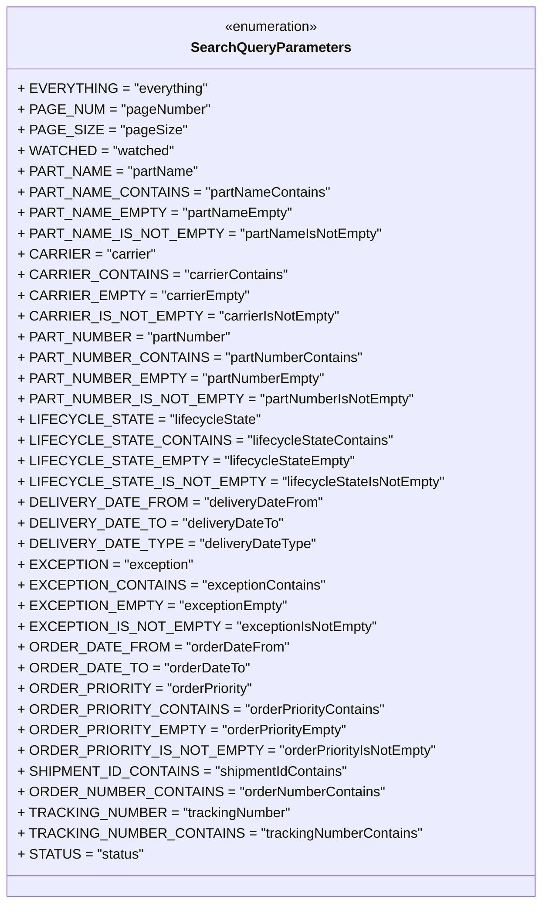

# Diagram: partview_core/partview_service/partview_service/api/search/package_container_exception/search_query_parameters.py

> Auto-generated by Obscura crawlers

## Mermaid

### SVG

<svg id="container" width="584.21875" xmlns="http://www.w3.org/2000/svg" class="classDiagram" height="1048" viewBox="0 0 584.21875 1048" role="graphics-document document" aria-roledescription="class"><g><defs><marker id="container_class-aggregationStart" class="marker aggregation class" refX="18" refY="7" markerWidth="190" markerHeight="240" orient="auto"><path d="M 18,7 L9,13 L1,7 L9,1 Z"></path></marker></defs><defs><marker id="container_class-aggregationEnd" class="marker aggregation class" refX="1" refY="7" markerWidth="20" markerHeight="28" orient="auto"><path d="M 18,7 L9,13 L1,7 L9,1 Z"></path></marker></defs><defs><marker id="container_class-extensionStart" class="marker extension class" refX="18" refY="7" markerWidth="190" markerHeight="240" orient="auto"><path d="M 1,7 L18,13 V 1 Z"></path></marker></defs><defs><marker id="container_class-extensionEnd" class="marker extension class" refX="1" refY="7" markerWidth="20" markerHeight="28" orient="auto"><path d="M 1,1 V 13 L18,7 Z"></path></marker></defs><defs><marker id="container_class-compositionStart" class="marker composition class" refX="18" refY="7" markerWidth="190" markerHeight="240" orient="auto"><path d="M 18,7 L9,13 L1,7 L9,1 Z"></path></marker></defs><defs><marker id="container_class-compositionEnd" class="marker composition class" refX="1" refY="7" markerWidth="20" markerHeight="28" orient="auto"><path d="M 18,7 L9,13 L1,7 L9,1 Z"></path></marker></defs><defs><marker id="container_class-dependencyStart" class="marker dependency class" refX="6" refY="7" markerWidth="190" markerHeight="240" orient="auto"><path d="M 5,7 L9,13 L1,7 L9,1 Z"></path></marker></defs><defs><marker id="container_class-dependencyEnd" class="marker dependency class" refX="13" refY="7" markerWidth="20" markerHeight="28" orient="auto"><path d="M 18,7 L9,13 L14,7 L9,1 Z"></path></marker></defs><defs><marker id="container_class-lollipopStart" class="marker lollipop class" refX="13" refY="7" markerWidth="190" markerHeight="240" orient="auto"><circle stroke="black" fill="transparent" cx="7" cy="7" r="6"></circle></marker></defs><defs><marker id="container_class-lollipopEnd" class="marker lollipop class" refX="1" refY="7" markerWidth="190" markerHeight="240" orient="auto"><circle stroke="black" fill="transparent" cx="7" cy="7" r="6"></circle></marker></defs><g class="root"><g class="clusters"></g><g class="edgePaths"></g><g class="edgeLabels"></g><g class="nodes"><g class="node default" id="classId-SearchQueryParameters-0" transform="translate(292.109375, 524)"><g class="basic label-container"><path d="M-284.109375 -516 L284.109375 -516 L284.109375 516 L-284.109375 516" stroke="none" stroke-width="0" fill="#ECECFF" style=""></path><path d="M-284.109375 -516 C-71.47521699106625 -516, 141.1589410178675 -516, 284.109375 -516 M-284.109375 -516 C-123.0824349046855 -516, 37.944505190629 -516, 284.109375 -516 M284.109375 -516 C284.109375 -286.99210065884165, 284.109375 -57.984201317683244, 284.109375 516 M284.109375 -516 C284.109375 -133.36113893674377, 284.109375 249.27772212651246, 284.109375 516 M284.109375 516 C151.72074466301882 516, 19.33211432603764 516, -284.109375 516 M284.109375 516 C92.67273990278369 516, -98.76389519443262 516, -284.109375 516 M-284.109375 516 C-284.109375 308.335503810153, -284.109375 100.67100762030606, -284.109375 -516 M-284.109375 516 C-284.109375 263.197560144577, -284.109375 10.395120289154022, -284.109375 -516" stroke="#9370DB" stroke-width="1.3" fill="none" stroke-dasharray="0 0" style=""></path></g><g class="annotation-group text" transform="translate(-55.5546875, -492)"><g class="label" style="" transform="translate(0,-12)"><foreignObject width="111.109375" height="24">

«enumeration»

</foreignObject></g></g><g class="label-group text" transform="translate(-88.171875, -468)"><g class="label" style="font-weight: bolder" transform="translate(0,-12)"><foreignObject width="176.34375" height="24">

SearchQueryParameters

</foreignObject></g></g><g class="members-group text" transform="translate(-272.109375, -420)"><g class="label" style="" transform="translate(0,-12)"><foreignObject width="206.890625" height="24">

+ EVERYTHING = "everything"

</foreignObject></g><g class="label" style="" transform="translate(0,12)"><foreignObject width="212.859375" height="24">

+ PAGE_NUM = "pageNumber"

</foreignObject></g><g class="label" style="" transform="translate(0,36)"><foreignObject width="179.171875" height="24">

+ PAGE_SIZE = "pageSize"

</foreignObject></g><g class="label" style="" transform="translate(0,60)"><foreignObject width="170.3125" height="24">

+ WATCHED = "watched"

</foreignObject></g><g class="label" style="" transform="translate(0,84)"><foreignObject width="197.140625" height="24">

+ PART_NAME = "partName"

</foreignObject></g><g class="label" style="" transform="translate(0,108)"><foreignObject width="339.484375" height="24">

+ PART_NAME_CONTAINS = "partNameContains"

</foreignObject></g><g class="label" style="" transform="translate(0,132)"><foreignObject width="297.78125" height="24">

+ PART_NAME_EMPTY = "partNameEmpty"

</foreignObject></g><g class="label" style="" transform="translate(0,156)"><foreignObject width="394.53125" height="24">

+ PART_NAME_IS_NOT_EMPTY = "partNameIsNotEmpty"

</foreignObject></g><g class="label" style="" transform="translate(0,180)"><foreignObject width="149.78125" height="24">

+ CARRIER = "carrier"

</foreignObject></g><g class="label" style="" transform="translate(0,204)"><foreignObject width="291.890625" height="24">

+ CARRIER_CONTAINS = "carrierContains"

</foreignObject></g><g class="label" style="" transform="translate(0,228)"><foreignObject width="250.203125" height="24">

+ CARRIER_EMPTY = "carrierEmpty"

</foreignObject></g><g class="label" style="" transform="translate(0,252)"><foreignObject width="346.953125" height="24">

+ CARRIER_IS_NOT_EMPTY = "carrierIsNotEmpty"

</foreignObject></g><g class="label" style="" transform="translate(0,276)"><foreignObject width="234.484375" height="24">

+ PART_NUMBER = "partNumber"

</foreignObject></g><g class="label" style="" transform="translate(0,300)"><foreignObject width="376.59375" height="24">

+ PART_NUMBER_CONTAINS = "partNumberContains"

</foreignObject></g><g class="label" style="" transform="translate(0,324)"><foreignObject width="334.90625" height="24">

+ PART_NUMBER_EMPTY = "partNumberEmpty"

</foreignObject></g><g class="label" style="" transform="translate(0,348)"><foreignObject width="431.65625" height="24">

+ PART_NUMBER_IS_NOT_EMPTY = "partNumberIsNotEmpty"

</foreignObject></g><g class="label" style="" transform="translate(0,372)"><foreignObject width="258.640625" height="24">

+ LIFECYCLE_STATE = "lifecycleState"

</foreignObject></g><g class="label" style="" transform="translate(0,396)"><foreignObject width="400.984375" height="24">

+ LIFECYCLE_STATE_CONTAINS = "lifecycleStateContains"

</foreignObject></g><g class="label" style="" transform="translate(0,420)"><foreignObject width="359.28125" height="24">

+ LIFECYCLE_STATE_EMPTY = "lifecycleStateEmpty"

</foreignObject></g><g class="label" style="" transform="translate(0,444)"><foreignObject width="456.046875" height="24">

+ LIFECYCLE_STATE_IS_NOT_EMPTY = "lifecycleStateIsNotEmpty"

</foreignObject></g><g class="label" style="" transform="translate(0,468)"><foreignObject width="326.953125" height="24">

+ DELIVERY_DATE_FROM = "deliveryDateFrom"

</foreignObject></g><g class="label" style="" transform="translate(0,492)"><foreignObject width="284.828125" height="24">

+ DELIVERY_DATE_TO = "deliveryDateTo"

</foreignObject></g><g class="label" style="" transform="translate(0,516)"><foreignObject width="317.953125" height="24">

+ DELIVERY_DATE_TYPE = "deliveryDateType"

</foreignObject></g><g class="label" style="" transform="translate(0,540)"><foreignObject width="190.296875" height="24">

+ EXCEPTION = "exception"

</foreignObject></g><g class="label" style="" transform="translate(0,564)"><foreignObject width="332.625" height="24">

+ EXCEPTION_CONTAINS = "exceptionContains"

</foreignObject></g><g class="label" style="" transform="translate(0,588)"><foreignObject width="290.9375" height="24">

+ EXCEPTION_EMPTY = "exceptionEmpty"

</foreignObject></g><g class="label" style="" transform="translate(0,612)"><foreignObject width="387.6875" height="24">

+ EXCEPTION_IS_NOT_EMPTY = "exceptionIsNotEmpty"

</foreignObject></g><g class="label" style="" transform="translate(0,636)"><foreignObject width="291.890625" height="24">

+ ORDER_DATE_FROM = "orderDateFrom"

</foreignObject></g><g class="label" style="" transform="translate(0,660)"><foreignObject width="249.765625" height="24">

+ ORDER_DATE_TO = "orderDateTo"

</foreignObject></g><g class="label" style="" transform="translate(0,684)"><foreignObject width="257.9375" height="24">

+ ORDER_PRIORITY = "orderPriority"

</foreignObject></g><g class="label" style="" transform="translate(0,708)"><foreignObject width="398.84375" height="24">

+ ORDER_PRIORITY_CONTAINS = "orderPriorityContains"

</foreignObject></g><g class="label" style="" transform="translate(0,732)"><foreignObject width="357.140625" height="24">

+ ORDER_PRIORITY_EMPTY = "orderPriorityEmpty"

</foreignObject></g><g class="label" style="" transform="translate(0,756)"><foreignObject width="453.890625" height="24">

+ ORDER_PRIORITY_IS_NOT_EMPTY = "orderPriorityIsNotEmpty"

</foreignObject></g><g class="label" style="" transform="translate(0,780)"><foreignObject width="361.484375" height="24">

+ SHIPMENT_ID_CONTAINS = "shipmentIdContains"

</foreignObject></g><g class="label" style="" transform="translate(0,804)"><foreignObject width="400.90625" height="24">

+ ORDER_NUMBER_CONTAINS = "orderNumberContains"

</foreignObject></g><g class="label" style="" transform="translate(0,828)"><foreignObject width="299.546875" height="24">

+ TRACKING_NUMBER = "trackingNumber"

</foreignObject></g><g class="label" style="" transform="translate(0,852)"><foreignObject width="441.65625" height="24">

+ TRACKING_NUMBER_CONTAINS = "trackingNumberContains"

</foreignObject></g><g class="label" style="" transform="translate(0,876)"><foreignObject width="137.15625" height="24">

+ STATUS = "status"

</foreignObject></g></g><g class="methods-group text" transform="translate(-272.109375, 516)"></g><g class="divider" style=""><path d="M-284.109375 -444 C-100.4893410128573 -444, 83.13069297428541 -444, 284.109375 -444 M-284.109375 -444 C-101.6684748148117 -444, 80.7724253703766 -444, 284.109375 -444" stroke="#9370DB" stroke-width="1.3" fill="none" stroke-dasharray="0 0" style=""></path></g><g class="divider" style=""><path d="M-284.109375 492 C-87.96065970985481 492, 108.18805558029038 492, 284.109375 492 M-284.109375 492 C-75.06837997810987 492, 133.97261504378025 492, 284.109375 492" stroke="#9370DB" stroke-width="1.3" fill="none" stroke-dasharray="0 0" style=""></path></g></g></g></g></g></svg>
