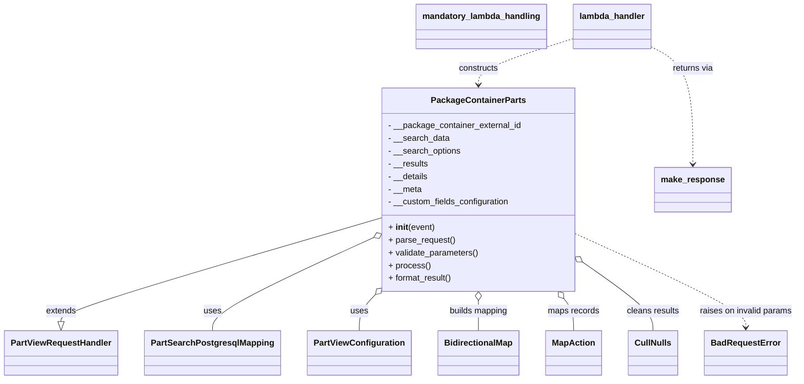

# Diagram: partview_core/partview_service/partview_service/api/search/package_container_parts.py


> Auto-generated by Obscura crawlers

## Diagram 1



### SVG

<svg id="container" width="1455.0859375" xmlns="http://www.w3.org/2000/svg" class="classDiagram" height="716" viewBox="0 0 1455.0859375 716" role="graphics-document document" aria-roledescription="class"><style>#container{font-family:"trebuchet ms",verdana,arial,sans-serif;font-size:16px;fill:#333;}@keyframes edge-animation-frame{from{stroke-dashoffset:0;}}@keyframes dash{to{stroke-dashoffset:0;}}#container .edge-animation-slow{stroke-dasharray:9,5!important;stroke-dashoffset:900;animation:dash 50s linear infinite;stroke-linecap:round;}#container .edge-animation-fast{stroke-dasharray:9,5!important;stroke-dashoffset:900;animation:dash 20s linear infinite;stroke-linecap:round;}#container .error-icon{fill:#552222;}#container .error-text{fill:#552222;stroke:#552222;}#container .edge-thickness-normal{stroke-width:1px;}#container .edge-thickness-thick{stroke-width:3.5px;}#container .edge-pattern-solid{stroke-dasharray:0;}#container .edge-thickness-invisible{stroke-width:0;fill:none;}#container .edge-pattern-dashed{stroke-dasharray:3;}#container .edge-pattern-dotted{stroke-dasharray:2;}#container .marker{fill:#333333;stroke:#333333;}#container .marker.cross{stroke:#333333;}#container svg{font-family:"trebuchet ms",verdana,arial,sans-serif;font-size:16px;}#container p{margin:0;}#container g.classGroup text{fill:#9370DB;stroke:none;font-family:"trebuchet ms",verdana,arial,sans-serif;font-size:10px;}#container g.classGroup text .title{font-weight:bolder;}#container .nodeLabel,#container .edgeLabel{color:#131300;}#container .edgeLabel .label rect{fill:#ECECFF;}#container .label text{fill:#131300;}#container .labelBkg{background:#ECECFF;}#container .edgeLabel .label span{background:#ECECFF;}#container .classTitle{font-weight:bolder;}#container .node rect,#container .node circle,#container .node ellipse,#container .node polygon,#container .node path{fill:#ECECFF;stroke:#9370DB;stroke-width:1px;}#container .divider{stroke:#9370DB;stroke-width:1;}#container g.clickable{cursor:pointer;}#container g.classGroup rect{fill:#ECECFF;stroke:#9370DB;}#container g.classGroup line{stroke:#9370DB;stroke-width:1;}#container .classLabel .box{stroke:none;stroke-width:0;fill:#ECECFF;opacity:0.5;}#container .classLabel .label{fill:#9370DB;font-size:10px;}#container .relation{stroke:#333333;stroke-width:1;fill:none;}#container .dashed-line{stroke-dasharray:3;}#container .dotted-line{stroke-dasharray:1 2;}#container #compositionStart,#container .composition{fill:#333333!important;stroke:#333333!important;stroke-width:1;}#container #compositionEnd,#container .composition{fill:#333333!important;stroke:#333333!important;stroke-width:1;}#container #dependencyStart,#container .dependency{fill:#333333!important;stroke:#333333!important;stroke-width:1;}#container #dependencyStart,#container .dependency{fill:#333333!important;stroke:#333333!important;stroke-width:1;}#container #extensionStart,#container .extension{fill:transparent!important;stroke:#333333!important;stroke-width:1;}#container #extensionEnd,#container .extension{fill:transparent!important;stroke:#333333!important;stroke-width:1;}#container #aggregationStart,#container .aggregation{fill:transparent!important;stroke:#333333!important;stroke-width:1;}#container #aggregationEnd,#container .aggregation{fill:transparent!important;stroke:#333333!important;stroke-width:1;}#container #lollipopStart,#container .lollipop{fill:#ECECFF!important;stroke:#333333!important;stroke-width:1;}#container #lollipopEnd,#container .lollipop{fill:#ECECFF!important;stroke:#333333!important;stroke-width:1;}#container .edgeTerminals{font-size:11px;line-height:initial;}#container .classTitleText{text-anchor:middle;font-size:18px;fill:#333;}#container .label-icon{display:inline-block;height:1em;overflow:visible;vertical-align:-0.125em;}#container .node .label-icon path{fill:currentColor;stroke:revert;stroke-width:revert;}#container :root{--mermaid-font-family:"trebuchet ms",verdana,arial,sans-serif;}</style><g><defs><marker id="container_class-aggregationStart" class="marker aggregation class" refX="18" refY="7" markerWidth="190" markerHeight="240" orient="auto"><path d="M 18,7 L9,13 L1,7 L9,1 Z"></path></marker></defs><defs><marker id="container_class-aggregationEnd" class="marker aggregation class" refX="1" refY="7" markerWidth="20" markerHeight="28" orient="auto"><path d="M 18,7 L9,13 L1,7 L9,1 Z"></path></marker></defs><defs><marker id="container_class-extensionStart" class="marker extension class" refX="18" refY="7" markerWidth="190" markerHeight="240" orient="auto"><path d="M 1,7 L18,13 V 1 Z"></path></marker></defs><defs><marker id="container_class-extensionEnd" class="marker extension class" refX="1" refY="7" markerWidth="20" markerHeight="28" orient="auto"><path d="M 1,1 V 13 L18,7 Z"></path></marker></defs><defs><marker id="container_class-compositionStart" class="marker composition class" refX="18" refY="7" markerWidth="190" markerHeight="240" orient="auto"><path d="M 18,7 L9,13 L1,7 L9,1 Z"></path></marker></defs><defs><marker id="container_class-compositionEnd" class="marker composition class" refX="1" refY="7" markerWidth="20" markerHeight="28" orient="auto"><path d="M 18,7 L9,13 L1,7 L9,1 Z"></path></marker></defs><defs><marker id="container_class-dependencyStart" class="marker dependency class" refX="6" refY="7" markerWidth="190" markerHeight="240" orient="auto"><path d="M 5,7 L9,13 L1,7 L9,1 Z"></path></marker></defs><defs><marker id="container_class-dependencyEnd" class="marker dependency class" refX="13" refY="7" markerWidth="20" markerHeight="28" orient="auto"><path d="M 18,7 L9,13 L14,7 L9,1 Z"></path></marker></defs><defs><marker id="container_class-lollipopStart" class="marker lollipop class" refX="13" refY="7" markerWidth="190" markerHeight="240" orient="auto"><circle stroke="black" fill="transparent" cx="7" cy="7" r="6"></circle></marker></defs><defs><marker id="container_class-lollipopEnd" class="marker lollipop class" refX="1" refY="7" markerWidth="190" markerHeight="240" orient="auto"><circle stroke="black" fill="transparent" cx="7" cy="7" r="6"></circle></marker></defs><g class="root"><g class="clusters"></g><g class="edgePaths"><path d="M690.66,412.277L594.11,441.397C497.56,470.518,304.46,528.759,207.91,561.171C111.359,593.583,111.359,600.167,111.359,603.458L111.359,606.75" id="id_PackageContainerParts_PartViewRequestHandler_1" class="edge-thickness-normal edge-pattern-solid relation" style=";;;" data-edge="true" data-et="edge" data-id="id_PackageContainerParts_PartViewRequestHandler_1" data-points="W3sieCI6NjkwLjY2MDE1NjI1LCJ5Ijo0MTIuMjc2ODk5NzI3MzI0Mn0seyJ4IjoxMTEuMzU5Mzc1LCJ5Ijo1ODd9LHsieCI6MTExLjM1OTM3NSwieSI6NjI0fV0=" marker-end="url(#container_class-extensionEnd)"></path><path d="M675.069,450.576L627.041,473.313C579.012,496.05,482.955,541.525,434.927,570.429C386.898,599.333,386.898,611.667,386.898,617.833L386.898,624" id="id_PackageContainerParts_PartSearchPostgresqlMapping_2" class="edge-thickness-normal edge-pattern-solid relation" style=";;;" data-edge="true" data-et="edge" data-id="id_PackageContainerParts_PartSearchPostgresqlMapping_2" data-points="W3sieCI6NjkwLjY2MDE1NjI1LCJ5Ijo0NDMuMTk0NDY1MDgxNzIzNn0seyJ4IjozODYuODk4NDM3NSwieSI6NTg3fSx7IngiOjM4Ni44OTg0Mzc1LCJ5Ijo2MjR9XQ==" marker-start="url(#container_class-aggregationStart)"></path><path d="M678.77,559.636L674.43,564.197C670.091,568.758,661.413,577.879,657.074,588.606C652.734,599.333,652.734,611.667,652.734,617.833L652.734,624" id="id_PackageContainerParts_PartViewConfiguration_3" class="edge-thickness-normal edge-pattern-solid relation" style=";;;" data-edge="true" data-et="edge" data-id="id_PackageContainerParts_PartViewConfiguration_3" data-points="W3sieCI6NjkwLjY2MDE1NjI1LCJ5Ijo1NDcuMTM5MTA1MDIzNDg2fSx7IngiOjY1Mi43MzQzNzUsInkiOjU4N30seyJ4Ijo2NTIuNzM0Mzc1LCJ5Ijo2MjR9XQ==" marker-start="url(#container_class-aggregationStart)"></path><path d="M870.617,567.25L870.617,570.542C870.617,573.833,870.617,580.417,870.617,589.875C870.617,599.333,870.617,611.667,870.617,617.833L870.617,624" id="id_PackageContainerParts_BidirectionalMap_4" class="edge-thickness-normal edge-pattern-solid relation" style=";;;" data-edge="true" data-et="edge" data-id="id_PackageContainerParts_BidirectionalMap_4" data-points="W3sieCI6ODcwLjYxNzE4NzUsInkiOjU1MH0seyJ4Ijo4NzAuNjE3MTg3NSwieSI6NTg3fSx7IngiOjg3MC42MTcxODc1LCJ5Ijo2MjR9XQ==" marker-start="url(#container_class-aggregationStart)"></path><path d="M1027.693,563.71L1030.657,567.592C1033.621,571.473,1039.549,579.237,1042.513,589.285C1045.477,599.333,1045.477,611.667,1045.477,617.833L1045.477,624" id="id_PackageContainerParts_MapAction_5" class="edge-thickness-normal edge-pattern-solid relation" style=";;;" data-edge="true" data-et="edge" data-id="id_PackageContainerParts_MapAction_5" data-points="W3sieCI6MTAxNy4yMjQxNzQzOTk1NjMzLCJ5Ijo1NTB9LHsieCI6MTA0NS40NzY1NjI1LCJ5Ijo1ODd9LHsieCI6MTA0NS40NzY1NjI1LCJ5Ijo2MjR9XQ==" marker-start="url(#container_class-aggregationStart)"></path><path d="M1064.599,496.91L1085.567,511.925C1106.535,526.94,1148.471,556.97,1169.438,578.152C1190.406,599.333,1190.406,611.667,1190.406,617.833L1190.406,624" id="id_PackageContainerParts_CullNulls_6" class="edge-thickness-normal edge-pattern-solid relation" style=";;;" data-edge="true" data-et="edge" data-id="id_PackageContainerParts_CullNulls_6" data-points="W3sieCI6MTA1MC41NzQyMTg3NSwieSI6NDg2Ljg2NjY5Njc5NzIwNTJ9LHsieCI6MTE5MC40MDYyNSwieSI6NTg3fSx7IngiOjExOTAuNDA2MjUsInkiOjYyNH1d" marker-start="url(#container_class-aggregationStart)"></path><path d="M1050.574,442.384L1101.976,466.486C1153.378,490.589,1256.181,538.795,1307.583,568.064C1358.984,597.333,1358.984,607.667,1358.984,612.833L1358.984,618" id="id_PackageContainerParts_BadRequestError_7" class="edge-thickness-normal edge-pattern-dashed relation" style=";;;" data-edge="true" data-et="edge" data-id="id_PackageContainerParts_BadRequestError_7" data-points="W3sieCI6MTA1MC41NzQyMTg3NSwieSI6NDQyLjM4MzU1NjQ5NDA1NzF9LHsieCI6MTM1OC45ODQzNzUsInkiOjU4N30seyJ4IjoxMzU4Ljk4NDM3NSwieSI6NjI0fV0=" marker-end="url(#container_class-dependencyEnd)"></path><path d="M1042.824,73.286L1014.123,82.572C985.422,91.858,928.02,110.429,899.318,124.881C870.617,139.333,870.617,149.667,870.617,154.833L870.617,160" id="id_lambda_handler_PackageContainerParts_8" class="edge-thickness-normal edge-pattern-dashed relation" style=";;;" data-edge="true" data-et="edge" data-id="id_lambda_handler_PackageContainerParts_8" data-points="W3sieCI6MTA0Mi44MjQyMTg3NSwieSI6NzMuMjg2MzY1NTk5NjU0NDZ9LHsieCI6ODcwLjYxNzE4NzUsInkiOjEyOX0seyJ4Ijo4NzAuNjE3MTg3NSwieSI6MTY2fV0=" marker-end="url(#container_class-dependencyEnd)"></path><path d="M1186.777,87.98L1199.733,94.817C1212.689,101.654,1238.602,115.327,1251.558,152.33C1264.514,189.333,1264.514,249.667,1264.514,279.833L1264.514,310" id="id_lambda_handler_make_response_9" class="edge-thickness-normal edge-pattern-dashed relation" style=";;;" data-edge="true" data-et="edge" data-id="id_lambda_handler_make_response_9" data-points="W3sieCI6MTE4Ni43NzczNDM3NSwieSI6ODcuOTgwMzUzMDE5NDUxMjl9LHsieCI6MTI2NC41MTM2NzE4NzUsInkiOjEyOX0seyJ4IjoxMjY0LjUxMzY3MTg3NSwieSI6MzE2fV0=" marker-end="url(#container_class-dependencyEnd)"></path></g><g class="edgeLabels"><g class="edgeLabel" transform="translate(111.359375, 587)"><g class="label" data-id="id_PackageContainerParts_PartViewRequestHandler_1" transform="translate(-28.5078125, -12)"><foreignObject width="57.015625" height="24"><div xmlns="http://www.w3.org/1999/xhtml" class="labelBkg" style="display: table-cell; white-space: nowrap; line-height: 1.5; max-width: 200px; text-align: center;"><span class="edgeLabel"><p>extends</p></span></div></foreignObject></g></g><g class="edgeLabel" transform="translate(386.8984375, 587)"><g class="label" data-id="id_PackageContainerParts_PartSearchPostgresqlMapping_2" transform="translate(-16.4921875, -12)"><foreignObject width="32.984375" height="24"><div xmlns="http://www.w3.org/1999/xhtml" class="labelBkg" style="display: table-cell; white-space: nowrap; line-height: 1.5; max-width: 200px; text-align: center;"><span class="edgeLabel"><p>uses</p></span></div></foreignObject></g></g><g class="edgeLabel" transform="translate(652.734375, 587)"><g class="label" data-id="id_PackageContainerParts_PartViewConfiguration_3" transform="translate(-16.4921875, -12)"><foreignObject width="32.984375" height="24"><div xmlns="http://www.w3.org/1999/xhtml" class="labelBkg" style="display: table-cell; white-space: nowrap; line-height: 1.5; max-width: 200px; text-align: center;"><span class="edgeLabel"><p>uses</p></span></div></foreignObject></g></g><g class="edgeLabel" transform="translate(870.6171875, 587)"><g class="label" data-id="id_PackageContainerParts_BidirectionalMap_4" transform="translate(-56.4296875, -12)"><foreignObject width="112.859375" height="24"><div xmlns="http://www.w3.org/1999/xhtml" class="labelBkg" style="display: table-cell; white-space: nowrap; line-height: 1.5; max-width: 200px; text-align: center;"><span class="edgeLabel"><p>builds mapping</p></span></div></foreignObject></g></g><g class="edgeLabel" transform="translate(1045.4765625, 587)"><g class="label" data-id="id_PackageContainerParts_MapAction_5" transform="translate(-48.734375, -12)"><foreignObject width="97.46875" height="24"><div xmlns="http://www.w3.org/1999/xhtml" class="labelBkg" style="display: table-cell; white-space: nowrap; line-height: 1.5; max-width: 200px; text-align: center;"><span class="edgeLabel"><p>maps records</p></span></div></foreignObject></g></g><g class="edgeLabel" transform="translate(1190.40625, 587)"><g class="label" data-id="id_PackageContainerParts_CullNulls_6" transform="translate(-49.875, -12)"><foreignObject width="99.75" height="24"><div xmlns="http://www.w3.org/1999/xhtml" class="labelBkg" style="display: table-cell; white-space: nowrap; line-height: 1.5; max-width: 200px; text-align: center;"><span class="edgeLabel"><p>cleans results</p></span></div></foreignObject></g></g><g class="edgeLabel" transform="translate(1358.984375, 587)"><g class="label" data-id="id_PackageContainerParts_BadRequestError_7" transform="translate(-88.1015625, -12)"><foreignObject width="176.203125" height="24"><div xmlns="http://www.w3.org/1999/xhtml" class="labelBkg" style="display: table-cell; white-space: nowrap; line-height: 1.5; max-width: 200px; text-align: center;"><span class="edgeLabel"><p>raises on invalid params</p></span></div></foreignObject></g></g><g class="edgeLabel" transform="translate(870.6171875, 129)"><g class="label" data-id="id_lambda_handler_PackageContainerParts_8" transform="translate(-37.84375, -12)"><foreignObject width="75.6875" height="24"><div xmlns="http://www.w3.org/1999/xhtml" class="labelBkg" style="display: table-cell; white-space: nowrap; line-height: 1.5; max-width: 200px; text-align: center;"><span class="edgeLabel"><p>constructs</p></span></div></foreignObject></g></g><g class="edgeLabel" transform="translate(1264.513671875, 129)"><g class="label" data-id="id_lambda_handler_make_response_9" transform="translate(-38.9296875, -12)"><foreignObject width="77.859375" height="24"><div xmlns="http://www.w3.org/1999/xhtml" class="labelBkg" style="display: table-cell; white-space: nowrap; line-height: 1.5; max-width: 200px; text-align: center;"><span class="edgeLabel"><p>returns via</p></span></div></foreignObject></g></g></g><g class="nodes"><g class="node default" id="classId-PackageContainerParts-0" transform="translate(870.6171875, 358)"><g class="basic label-container"><path d="M-179.95703125 -192 L179.95703125 -192 L179.95703125 192 L-179.95703125 192" stroke="none" stroke-width="0" fill="#ECECFF" style=""></path><path d="M-179.95703125 -192 C-87.80188769313034 -192, 4.353255863739321 -192, 179.95703125 -192 M-179.95703125 -192 C-56.26016183885852 -192, 67.43670757228296 -192, 179.95703125 -192 M179.95703125 -192 C179.95703125 -97.59262649992506, 179.95703125 -3.185252999850121, 179.95703125 192 M179.95703125 -192 C179.95703125 -105.54411448292188, 179.95703125 -19.08822896584377, 179.95703125 192 M179.95703125 192 C91.13685615159172 192, 2.31668105318343 192, -179.95703125 192 M179.95703125 192 C63.390617130866914 192, -53.17579698826617 192, -179.95703125 192 M-179.95703125 192 C-179.95703125 83.01508563189233, -179.95703125 -25.969828736215334, -179.95703125 -192 M-179.95703125 192 C-179.95703125 106.75515332194963, -179.95703125 21.51030664389927, -179.95703125 -192" stroke="#9370DB" stroke-width="1.3" fill="none" stroke-dasharray="0 0" style=""></path></g><g class="annotation-group text" transform="translate(0, -168)"></g><g class="label-group text" transform="translate(-84.3828125, -168)"><g class="label" style="font-weight: bolder" transform="translate(0,-12)"><foreignObject width="168.765625" height="24"><div xmlns="http://www.w3.org/1999/xhtml" style="display: table-cell; white-space: nowrap; line-height: 1.5; max-width: 215px; text-align: center;"><span class="nodeLabel markdown-node-label" style=""><p>PackageContainerParts</p></span></div></foreignObject></g></g><g class="members-group text" transform="translate(-167.95703125, -120)"><g class="label" style="" transform="translate(0,-12)"><foreignObject width="251.53125" height="24"><div xmlns="http://www.w3.org/1999/xhtml" style="display: table-cell; white-space: nowrap; line-height: 1.5; max-width: 309px; text-align: center;"><span class="nodeLabel markdown-node-label" style=""><p>- __package_container_external_id</p></span></div></foreignObject></g><g class="label" style="" transform="translate(0,12)"><foreignObject width="115.265625" height="24"><div xmlns="http://www.w3.org/1999/xhtml" style="display: table-cell; white-space: nowrap; line-height: 1.5; max-width: 173px; text-align: center;"><span class="nodeLabel markdown-node-label" style=""><p>- __search_data</p></span></div></foreignObject></g><g class="label" style="" transform="translate(0,36)"><foreignObject width="137.953125" height="24"><div xmlns="http://www.w3.org/1999/xhtml" style="display: table-cell; white-space: nowrap; line-height: 1.5; max-width: 195px; text-align: center;"><span class="nodeLabel markdown-node-label" style=""><p>- __search_options</p></span></div></foreignObject></g><g class="label" style="" transform="translate(0,60)"><foreignObject width="76.3125" height="24"><div xmlns="http://www.w3.org/1999/xhtml" style="display: table-cell; white-space: nowrap; line-height: 1.5; max-width: 134px; text-align: center;"><span class="nodeLabel markdown-node-label" style=""><p>- __results</p></span></div></foreignObject></g><g class="label" style="" transform="translate(0,84)"><foreignObject width="76.1875" height="24"><div xmlns="http://www.w3.org/1999/xhtml" style="display: table-cell; white-space: nowrap; line-height: 1.5; max-width: 134px; text-align: center;"><span class="nodeLabel markdown-node-label" style=""><p>- __details</p></span></div></foreignObject></g><g class="label" style="" transform="translate(0,108)"><foreignObject width="63.96875" height="24"><div xmlns="http://www.w3.org/1999/xhtml" style="display: table-cell; white-space: nowrap; line-height: 1.5; max-width: 121px; text-align: center;"><span class="nodeLabel markdown-node-label" style=""><p>- __meta</p></span></div></foreignObject></g><g class="label" style="" transform="translate(0,132)"><foreignObject width="231.015625" height="24"><div xmlns="http://www.w3.org/1999/xhtml" style="display: table-cell; white-space: nowrap; line-height: 1.5; max-width: 288px; text-align: center;"><span class="nodeLabel markdown-node-label" style=""><p>- __custom_fields_configuration</p></span></div></foreignObject></g></g><g class="methods-group text" transform="translate(-167.95703125, 72)"><g class="label" style="" transform="translate(0,-12)"><foreignObject width="87.390625" height="24"><div xmlns="http://www.w3.org/1999/xhtml" style="display: table-cell; white-space: nowrap; line-height: 1.5; max-width: 177px; text-align: center;"><span class="nodeLabel markdown-node-label" style=""><p>+ <strong>init</strong>(event)</p></span></div></foreignObject></g><g class="label" style="" transform="translate(0,12)"><foreignObject width="126.046875" height="24"><div xmlns="http://www.w3.org/1999/xhtml" style="display: table-cell; white-space: nowrap; line-height: 1.5; max-width: 183px; text-align: center;"><span class="nodeLabel markdown-node-label" style=""><p>+ parse_request()</p></span></div></foreignObject></g><g class="label" style="" transform="translate(0,36)"><foreignObject width="170.953125" height="24"><div xmlns="http://www.w3.org/1999/xhtml" style="display: table-cell; white-space: nowrap; line-height: 1.5; max-width: 228px; text-align: center;"><span class="nodeLabel markdown-node-label" style=""><p>+ validate_parameters()</p></span></div></foreignObject></g><g class="label" style="" transform="translate(0,60)"><foreignObject width="77.96875" height="24"><div xmlns="http://www.w3.org/1999/xhtml" style="display: table-cell; white-space: nowrap; line-height: 1.5; max-width: 135px; text-align: center;"><span class="nodeLabel markdown-node-label" style=""><p>+ process()</p></span></div></foreignObject></g><g class="label" style="" transform="translate(0,84)"><foreignObject width="121.5" height="24"><div xmlns="http://www.w3.org/1999/xhtml" style="display: table-cell; white-space: nowrap; line-height: 1.5; max-width: 179px; text-align: center;"><span class="nodeLabel markdown-node-label" style=""><p>+ format_result()</p></span></div></foreignObject></g></g><g class="divider" style=""><path d="M-179.95703125 -144 C-38.83808992451898 -144, 102.28085140096204 -144, 179.95703125 -144 M-179.95703125 -144 C-94.4866915500284 -144, -9.016351850056793 -144, 179.95703125 -144" stroke="#9370DB" stroke-width="1.3" fill="none" stroke-dasharray="0 0" style=""></path></g><g class="divider" style=""><path d="M-179.95703125 48 C-45.10940865594091 48, 89.73821393811818 48, 179.95703125 48 M-179.95703125 48 C-101.90959923618254 48, -23.862167222365088 48, 179.95703125 48" stroke="#9370DB" stroke-width="1.3" fill="none" stroke-dasharray="0 0" style=""></path></g></g><g class="node default" id="classId-PartViewRequestHandler-1" transform="translate(111.359375, 666)"><g class="basic label-container"><path d="M-103.359375 -42 L103.359375 -42 L103.359375 42 L-103.359375 42" stroke="none" stroke-width="0" fill="#ECECFF" style=""></path><path d="M-103.359375 -42 C-37.22775259799552 -42, 28.903869804008963 -42, 103.359375 -42 M-103.359375 -42 C-54.62102584508467 -42, -5.882676690169333 -42, 103.359375 -42 M103.359375 -42 C103.359375 -10.502952519708135, 103.359375 20.99409496058373, 103.359375 42 M103.359375 -42 C103.359375 -12.80330464136052, 103.359375 16.39339071727896, 103.359375 42 M103.359375 42 C28.930972021416892 42, -45.497430957166216 42, -103.359375 42 M103.359375 42 C21.941158071455945 42, -59.47705885708811 42, -103.359375 42 M-103.359375 42 C-103.359375 15.104948763643012, -103.359375 -11.790102472713976, -103.359375 -42 M-103.359375 42 C-103.359375 14.898228026141084, -103.359375 -12.203543947717833, -103.359375 -42" stroke="#9370DB" stroke-width="1.3" fill="none" stroke-dasharray="0 0" style=""></path></g><g class="annotation-group text" transform="translate(0, -18)"></g><g class="label-group text" transform="translate(-91.359375, -18)"><g class="label" style="font-weight: bolder" transform="translate(0,-12)"><foreignObject width="182.71875" height="24"><div xmlns="http://www.w3.org/1999/xhtml" style="display: table-cell; white-space: nowrap; line-height: 1.5; max-width: 231px; text-align: center;"><span class="nodeLabel markdown-node-label" style=""><p>PartViewRequestHandler</p></span></div></foreignObject></g></g><g class="members-group text" transform="translate(-91.359375, 30)"></g><g class="methods-group text" transform="translate(-91.359375, 60)"></g><g class="divider" style=""><path d="M-103.359375 6 C-60.932286799066254 6, -18.50519859813251 6, 103.359375 6 M-103.359375 6 C-48.551315439208715 6, 6.256744121582571 6, 103.359375 6" stroke="#9370DB" stroke-width="1.3" fill="none" stroke-dasharray="0 0" style=""></path></g><g class="divider" style=""><path d="M-103.359375 24 C-40.261783665379554 24, 22.835807669240893 24, 103.359375 24 M-103.359375 24 C-21.68607244869699 24, 59.98723010260602 24, 103.359375 24" stroke="#9370DB" stroke-width="1.3" fill="none" stroke-dasharray="0 0" style=""></path></g></g><g class="node default" id="classId-PartSearchPostgresqlMapping-2" transform="translate(386.8984375, 666)"><g class="basic label-container"><path d="M-122.1796875 -42 L122.1796875 -42 L122.1796875 42 L-122.1796875 42" stroke="none" stroke-width="0" fill="#ECECFF" style=""></path><path d="M-122.1796875 -42 C-54.96638548759681 -42, 12.24691652480638 -42, 122.1796875 -42 M-122.1796875 -42 C-30.122900888523162 -42, 61.933885722953676 -42, 122.1796875 -42 M122.1796875 -42 C122.1796875 -11.596655988016824, 122.1796875 18.806688023966352, 122.1796875 42 M122.1796875 -42 C122.1796875 -23.210336127407576, 122.1796875 -4.420672254815152, 122.1796875 42 M122.1796875 42 C33.11191142931416 42, -55.955864641371676 42, -122.1796875 42 M122.1796875 42 C59.00766203320943 42, -4.164363433581144 42, -122.1796875 42 M-122.1796875 42 C-122.1796875 10.842607909690436, -122.1796875 -20.314784180619128, -122.1796875 -42 M-122.1796875 42 C-122.1796875 23.943873046987108, -122.1796875 5.887746093974215, -122.1796875 -42" stroke="#9370DB" stroke-width="1.3" fill="none" stroke-dasharray="0 0" style=""></path></g><g class="annotation-group text" transform="translate(0, -18)"></g><g class="label-group text" transform="translate(-110.1796875, -18)"><g class="label" style="font-weight: bolder" transform="translate(0,-12)"><foreignObject width="220.359375" height="24"><div xmlns="http://www.w3.org/1999/xhtml" style="display: table-cell; white-space: nowrap; line-height: 1.5; max-width: 266px; text-align: center;"><span class="nodeLabel markdown-node-label" style=""><p>PartSearchPostgresqlMapping</p></span></div></foreignObject></g></g><g class="members-group text" transform="translate(-110.1796875, 30)"></g><g class="methods-group text" transform="translate(-110.1796875, 60)"></g><g class="divider" style=""><path d="M-122.1796875 6 C-34.74588351848364 6, 52.687920463032725 6, 122.1796875 6 M-122.1796875 6 C-46.08071647918533 6, 30.018254541629346 6, 122.1796875 6" stroke="#9370DB" stroke-width="1.3" fill="none" stroke-dasharray="0 0" style=""></path></g><g class="divider" style=""><path d="M-122.1796875 24 C-49.24131052268248 24, 23.697066454635035 24, 122.1796875 24 M-122.1796875 24 C-50.7693272992138 24, 20.6410329015724 24, 122.1796875 24" stroke="#9370DB" stroke-width="1.3" fill="none" stroke-dasharray="0 0" style=""></path></g></g><g class="node default" id="classId-PartViewConfiguration-3" transform="translate(652.734375, 666)"><g class="basic label-container"><path d="M-93.65625 -42 L93.65625 -42 L93.65625 42 L-93.65625 42" stroke="none" stroke-width="0" fill="#ECECFF" style=""></path><path d="M-93.65625 -42 C-40.45503519384853 -42, 12.746179612302939 -42, 93.65625 -42 M-93.65625 -42 C-52.79548332476091 -42, -11.934716649521818 -42, 93.65625 -42 M93.65625 -42 C93.65625 -9.116218606685656, 93.65625 23.767562786628687, 93.65625 42 M93.65625 -42 C93.65625 -10.84867823375508, 93.65625 20.30264353248984, 93.65625 42 M93.65625 42 C31.599615317568023 42, -30.457019364863953 42, -93.65625 42 M93.65625 42 C45.88571545661235 42, -1.8848190867752947 42, -93.65625 42 M-93.65625 42 C-93.65625 16.252863616310464, -93.65625 -9.494272767379073, -93.65625 -42 M-93.65625 42 C-93.65625 16.300422675076266, -93.65625 -9.399154649847468, -93.65625 -42" stroke="#9370DB" stroke-width="1.3" fill="none" stroke-dasharray="0 0" style=""></path></g><g class="annotation-group text" transform="translate(0, -18)"></g><g class="label-group text" transform="translate(-81.65625, -18)"><g class="label" style="font-weight: bolder" transform="translate(0,-12)"><foreignObject width="163.3125" height="24"><div xmlns="http://www.w3.org/1999/xhtml" style="display: table-cell; white-space: nowrap; line-height: 1.5; max-width: 210px; text-align: center;"><span class="nodeLabel markdown-node-label" style=""><p>PartViewConfiguration</p></span></div></foreignObject></g></g><g class="members-group text" transform="translate(-81.65625, 30)"></g><g class="methods-group text" transform="translate(-81.65625, 60)"></g><g class="divider" style=""><path d="M-93.65625 6 C-25.463683860703952 6, 42.728882278592096 6, 93.65625 6 M-93.65625 6 C-45.00171590778096 6, 3.6528181844380754 6, 93.65625 6" stroke="#9370DB" stroke-width="1.3" fill="none" stroke-dasharray="0 0" style=""></path></g><g class="divider" style=""><path d="M-93.65625 24 C-28.90275973861135 24, 35.8507305227773 24, 93.65625 24 M-93.65625 24 C-38.02002469603771 24, 17.616200607924583 24, 93.65625 24" stroke="#9370DB" stroke-width="1.3" fill="none" stroke-dasharray="0 0" style=""></path></g></g><g class="node default" id="classId-BidirectionalMap-4" transform="translate(870.6171875, 666)"><g class="basic label-container"><path d="M-74.2265625 -42 L74.2265625 -42 L74.2265625 42 L-74.2265625 42" stroke="none" stroke-width="0" fill="#ECECFF" style=""></path><path d="M-74.2265625 -42 C-34.142976326208625 -42, 5.940609847582749 -42, 74.2265625 -42 M-74.2265625 -42 C-39.94066825968553 -42, -5.654774019371061 -42, 74.2265625 -42 M74.2265625 -42 C74.2265625 -12.747928905290532, 74.2265625 16.504142189418936, 74.2265625 42 M74.2265625 -42 C74.2265625 -14.52333961961126, 74.2265625 12.95332076077748, 74.2265625 42 M74.2265625 42 C36.34360416444806 42, -1.5393541711038807 42, -74.2265625 42 M74.2265625 42 C43.23762840727511 42, 12.248694314550228 42, -74.2265625 42 M-74.2265625 42 C-74.2265625 20.32671109974651, -74.2265625 -1.346577800506978, -74.2265625 -42 M-74.2265625 42 C-74.2265625 20.036835824045625, -74.2265625 -1.9263283519087508, -74.2265625 -42" stroke="#9370DB" stroke-width="1.3" fill="none" stroke-dasharray="0 0" style=""></path></g><g class="annotation-group text" transform="translate(0, -18)"></g><g class="label-group text" transform="translate(-62.2265625, -18)"><g class="label" style="font-weight: bolder" transform="translate(0,-12)"><foreignObject width="124.453125" height="24"><div xmlns="http://www.w3.org/1999/xhtml" style="display: table-cell; white-space: nowrap; line-height: 1.5; max-width: 173px; text-align: center;"><span class="nodeLabel markdown-node-label" style=""><p>BidirectionalMap</p></span></div></foreignObject></g></g><g class="members-group text" transform="translate(-62.2265625, 30)"></g><g class="methods-group text" transform="translate(-62.2265625, 60)"></g><g class="divider" style=""><path d="M-74.2265625 6 C-34.09860585009906 6, 6.029350799801875 6, 74.2265625 6 M-74.2265625 6 C-33.84541623851976 6, 6.535730022960479 6, 74.2265625 6" stroke="#9370DB" stroke-width="1.3" fill="none" stroke-dasharray="0 0" style=""></path></g><g class="divider" style=""><path d="M-74.2265625 24 C-19.4964610299797 24, 35.2336404400406 24, 74.2265625 24 M-74.2265625 24 C-30.98887086852619 24, 12.248820762947616 24, 74.2265625 24" stroke="#9370DB" stroke-width="1.3" fill="none" stroke-dasharray="0 0" style=""></path></g></g><g class="node default" id="classId-MapAction-5" transform="translate(1045.4765625, 666)"><g class="basic label-container"><path d="M-50.6328125 -42 L50.6328125 -42 L50.6328125 42 L-50.6328125 42" stroke="none" stroke-width="0" fill="#ECECFF" style=""></path><path d="M-50.6328125 -42 C-22.664106068921985 -42, 5.30460036215603 -42, 50.6328125 -42 M-50.6328125 -42 C-23.689941067144574 -42, 3.252930365710853 -42, 50.6328125 -42 M50.6328125 -42 C50.6328125 -21.937454547795248, 50.6328125 -1.8749090955904961, 50.6328125 42 M50.6328125 -42 C50.6328125 -22.881670299584837, 50.6328125 -3.7633405991696733, 50.6328125 42 M50.6328125 42 C22.91188668356912 42, -4.809039132861763 42, -50.6328125 42 M50.6328125 42 C24.022237587855702 42, -2.588337324288595 42, -50.6328125 42 M-50.6328125 42 C-50.6328125 10.057355702402418, -50.6328125 -21.885288595195163, -50.6328125 -42 M-50.6328125 42 C-50.6328125 23.28500339118657, -50.6328125 4.570006782373142, -50.6328125 -42" stroke="#9370DB" stroke-width="1.3" fill="none" stroke-dasharray="0 0" style=""></path></g><g class="annotation-group text" transform="translate(0, -18)"></g><g class="label-group text" transform="translate(-38.6328125, -18)"><g class="label" style="font-weight: bolder" transform="translate(0,-12)"><foreignObject width="77.265625" height="24"><div xmlns="http://www.w3.org/1999/xhtml" style="display: table-cell; white-space: nowrap; line-height: 1.5; max-width: 126px; text-align: center;"><span class="nodeLabel markdown-node-label" style=""><p>MapAction</p></span></div></foreignObject></g></g><g class="members-group text" transform="translate(-38.6328125, 30)"></g><g class="methods-group text" transform="translate(-38.6328125, 60)"></g><g class="divider" style=""><path d="M-50.6328125 6 C-16.870110381367127 6, 16.892591737265747 6, 50.6328125 6 M-50.6328125 6 C-25.985259624746735 6, -1.3377067494934707 6, 50.6328125 6" stroke="#9370DB" stroke-width="1.3" fill="none" stroke-dasharray="0 0" style=""></path></g><g class="divider" style=""><path d="M-50.6328125 24 C-21.30483038486211 24, 8.023151730275778 24, 50.6328125 24 M-50.6328125 24 C-21.694656681880332 24, 7.243499136239336 24, 50.6328125 24" stroke="#9370DB" stroke-width="1.3" fill="none" stroke-dasharray="0 0" style=""></path></g></g><g class="node default" id="classId-CullNulls-6" transform="translate(1190.40625, 666)"><g class="basic label-container"><path d="M-44.296875 -42 L44.296875 -42 L44.296875 42 L-44.296875 42" stroke="none" stroke-width="0" fill="#ECECFF" style=""></path><path d="M-44.296875 -42 C-20.480927342952025 -42, 3.3350203140959493 -42, 44.296875 -42 M-44.296875 -42 C-23.380368275112232 -42, -2.4638615502244647 -42, 44.296875 -42 M44.296875 -42 C44.296875 -9.844840176863123, 44.296875 22.310319646273754, 44.296875 42 M44.296875 -42 C44.296875 -20.93587310468823, 44.296875 0.12825379062353903, 44.296875 42 M44.296875 42 C12.577703779993485 42, -19.14146744001303 42, -44.296875 42 M44.296875 42 C26.38594217457231 42, 8.47500934914462 42, -44.296875 42 M-44.296875 42 C-44.296875 15.009249786974635, -44.296875 -11.98150042605073, -44.296875 -42 M-44.296875 42 C-44.296875 10.542437507843278, -44.296875 -20.915124984313444, -44.296875 -42" stroke="#9370DB" stroke-width="1.3" fill="none" stroke-dasharray="0 0" style=""></path></g><g class="annotation-group text" transform="translate(0, -18)"></g><g class="label-group text" transform="translate(-32.296875, -18)"><g class="label" style="font-weight: bolder" transform="translate(0,-12)"><foreignObject width="64.59375" height="24"><div xmlns="http://www.w3.org/1999/xhtml" style="display: table-cell; white-space: nowrap; line-height: 1.5; max-width: 114px; text-align: center;"><span class="nodeLabel markdown-node-label" style=""><p>CullNulls</p></span></div></foreignObject></g></g><g class="members-group text" transform="translate(-32.296875, 30)"></g><g class="methods-group text" transform="translate(-32.296875, 60)"></g><g class="divider" style=""><path d="M-44.296875 6 C-24.976319487848123 6, -5.655763975696246 6, 44.296875 6 M-44.296875 6 C-15.035792066256263 6, 14.225290867487473 6, 44.296875 6" stroke="#9370DB" stroke-width="1.3" fill="none" stroke-dasharray="0 0" style=""></path></g><g class="divider" style=""><path d="M-44.296875 24 C-15.565099559732396 24, 13.166675880535209 24, 44.296875 24 M-44.296875 24 C-12.492846931195338 24, 19.311181137609324 24, 44.296875 24" stroke="#9370DB" stroke-width="1.3" fill="none" stroke-dasharray="0 0" style=""></path></g></g><g class="node default" id="classId-BadRequestError-7" transform="translate(1358.984375, 666)"><g class="basic label-container"><path d="M-74.28125 -42 L74.28125 -42 L74.28125 42 L-74.28125 42" stroke="none" stroke-width="0" fill="#ECECFF" style=""></path><path d="M-74.28125 -42 C-25.259463269483206 -42, 23.76232346103359 -42, 74.28125 -42 M-74.28125 -42 C-41.79106970772745 -42, -9.300889415454904 -42, 74.28125 -42 M74.28125 -42 C74.28125 -8.727043627842988, 74.28125 24.545912744314023, 74.28125 42 M74.28125 -42 C74.28125 -16.055535663292456, 74.28125 9.888928673415087, 74.28125 42 M74.28125 42 C26.675260530724515 42, -20.93072893855097 42, -74.28125 42 M74.28125 42 C22.578920428140854 42, -29.12340914371829 42, -74.28125 42 M-74.28125 42 C-74.28125 9.52777685771239, -74.28125 -22.94444628457522, -74.28125 -42 M-74.28125 42 C-74.28125 20.896192885438897, -74.28125 -0.20761422912220695, -74.28125 -42" stroke="#9370DB" stroke-width="1.3" fill="none" stroke-dasharray="0 0" style=""></path></g><g class="annotation-group text" transform="translate(0, -18)"></g><g class="label-group text" transform="translate(-62.28125, -18)"><g class="label" style="font-weight: bolder" transform="translate(0,-12)"><foreignObject width="124.5625" height="24"><div xmlns="http://www.w3.org/1999/xhtml" style="display: table-cell; white-space: nowrap; line-height: 1.5; max-width: 174px; text-align: center;"><span class="nodeLabel markdown-node-label" style=""><p>BadRequestError</p></span></div></foreignObject></g></g><g class="members-group text" transform="translate(-62.28125, 30)"></g><g class="methods-group text" transform="translate(-62.28125, 60)"></g><g class="divider" style=""><path d="M-74.28125 6 C-19.29234847046665 6, 35.6965530590667 6, 74.28125 6 M-74.28125 6 C-20.138619197767767 6, 34.004011604464466 6, 74.28125 6" stroke="#9370DB" stroke-width="1.3" fill="none" stroke-dasharray="0 0" style=""></path></g><g class="divider" style=""><path d="M-74.28125 24 C-17.063019668480635 24, 40.15521066303873 24, 74.28125 24 M-74.28125 24 C-17.457932641281715 24, 39.36538471743657 24, 74.28125 24" stroke="#9370DB" stroke-width="1.3" fill="none" stroke-dasharray="0 0" style=""></path></g></g><g class="node default" id="classId-make_response-8" transform="translate(1264.513671875, 358)"><g class="basic label-container"><path d="M-69.46875 -42 L69.46875 -42 L69.46875 42 L-69.46875 42" stroke="none" stroke-width="0" fill="#ECECFF" style=""></path><path d="M-69.46875 -42 C-37.627707631980954 -42, -5.7866652639619005 -42, 69.46875 -42 M-69.46875 -42 C-29.802627377648115 -42, 9.86349524470377 -42, 69.46875 -42 M69.46875 -42 C69.46875 -12.972380108911867, 69.46875 16.055239782176265, 69.46875 42 M69.46875 -42 C69.46875 -9.814177479380902, 69.46875 22.371645041238196, 69.46875 42 M69.46875 42 C38.26814274951312 42, 7.067535499026242 42, -69.46875 42 M69.46875 42 C38.91824812683765 42, 8.3677462536753 42, -69.46875 42 M-69.46875 42 C-69.46875 12.951557463620489, -69.46875 -16.096885072759022, -69.46875 -42 M-69.46875 42 C-69.46875 21.22219415911936, -69.46875 0.4443883182387225, -69.46875 -42" stroke="#9370DB" stroke-width="1.3" fill="none" stroke-dasharray="0 0" style=""></path></g><g class="annotation-group text" transform="translate(0, -18)"></g><g class="label-group text" transform="translate(-57.46875, -18)"><g class="label" style="font-weight: bolder" transform="translate(0,-12)"><foreignObject width="114.9375" height="24"><div xmlns="http://www.w3.org/1999/xhtml" style="display: table-cell; white-space: nowrap; line-height: 1.5; max-width: 164px; text-align: center;"><span class="nodeLabel markdown-node-label" style=""><p>make_response</p></span></div></foreignObject></g></g><g class="members-group text" transform="translate(-57.46875, 30)"></g><g class="methods-group text" transform="translate(-57.46875, 60)"></g><g class="divider" style=""><path d="M-69.46875 6 C-33.05113460455674 6, 3.366480790886527 6, 69.46875 6 M-69.46875 6 C-26.28940005557841 6, 16.889949888843176 6, 69.46875 6" stroke="#9370DB" stroke-width="1.3" fill="none" stroke-dasharray="0 0" style=""></path></g><g class="divider" style=""><path d="M-69.46875 24 C-15.868008142946131 24, 37.73273371410774 24, 69.46875 24 M-69.46875 24 C-17.023248081553476 24, 35.42225383689305 24, 69.46875 24" stroke="#9370DB" stroke-width="1.3" fill="none" stroke-dasharray="0 0" style=""></path></g></g><g class="node default" id="classId-mandatory_lambda_handling-9" transform="translate(873.39453125, 50)"><g class="basic label-container"><path d="M-119.4296875 -42 L119.4296875 -42 L119.4296875 42 L-119.4296875 42" stroke="none" stroke-width="0" fill="#ECECFF" style=""></path><path d="M-119.4296875 -42 C-48.75607032904021 -42, 21.917546841919574 -42, 119.4296875 -42 M-119.4296875 -42 C-71.28123936403671 -42, -23.13279122807343 -42, 119.4296875 -42 M119.4296875 -42 C119.4296875 -21.582212022080917, 119.4296875 -1.1644240441618336, 119.4296875 42 M119.4296875 -42 C119.4296875 -19.21699875703543, 119.4296875 3.5660024859291397, 119.4296875 42 M119.4296875 42 C54.89372220713052 42, -9.642243085738954 42, -119.4296875 42 M119.4296875 42 C31.346689495736214 42, -56.73630850852757 42, -119.4296875 42 M-119.4296875 42 C-119.4296875 22.971156528350935, -119.4296875 3.9423130567018703, -119.4296875 -42 M-119.4296875 42 C-119.4296875 14.269269038073723, -119.4296875 -13.461461923852553, -119.4296875 -42" stroke="#9370DB" stroke-width="1.3" fill="none" stroke-dasharray="0 0" style=""></path></g><g class="annotation-group text" transform="translate(0, -18)"></g><g class="label-group text" transform="translate(-107.4296875, -18)"><g class="label" style="font-weight: bolder" transform="translate(0,-12)"><foreignObject width="214.859375" height="24"><div xmlns="http://www.w3.org/1999/xhtml" style="display: table-cell; white-space: nowrap; line-height: 1.5; max-width: 264px; text-align: center;"><span class="nodeLabel markdown-node-label" style=""><p>mandatory_lambda_handling</p></span></div></foreignObject></g></g><g class="members-group text" transform="translate(-107.4296875, 30)"></g><g class="methods-group text" transform="translate(-107.4296875, 60)"></g><g class="divider" style=""><path d="M-119.4296875 6 C-64.21923934894102 6, -9.008791197882019 6, 119.4296875 6 M-119.4296875 6 C-51.430226143807275 6, 16.56923521238545 6, 119.4296875 6" stroke="#9370DB" stroke-width="1.3" fill="none" stroke-dasharray="0 0" style=""></path></g><g class="divider" style=""><path d="M-119.4296875 24 C-29.03417191560456 24, 61.36134366879088 24, 119.4296875 24 M-119.4296875 24 C-31.499226763753654 24, 56.43123397249269 24, 119.4296875 24" stroke="#9370DB" stroke-width="1.3" fill="none" stroke-dasharray="0 0" style=""></path></g></g><g class="node default" id="classId-lambda_handler-10" transform="translate(1114.80078125, 50)"><g class="basic label-container"><path d="M-71.9765625 -42 L71.9765625 -42 L71.9765625 42 L-71.9765625 42" stroke="none" stroke-width="0" fill="#ECECFF" style=""></path><path d="M-71.9765625 -42 C-18.59478322403117 -42, 34.78699605193766 -42, 71.9765625 -42 M-71.9765625 -42 C-36.20855383907114 -42, -0.4405451781422869 -42, 71.9765625 -42 M71.9765625 -42 C71.9765625 -13.506028642790735, 71.9765625 14.98794271441853, 71.9765625 42 M71.9765625 -42 C71.9765625 -24.796789802113715, 71.9765625 -7.593579604227429, 71.9765625 42 M71.9765625 42 C22.2723828706254 42, -27.4317967587492 42, -71.9765625 42 M71.9765625 42 C17.433508137857302 42, -37.109546224285396 42, -71.9765625 42 M-71.9765625 42 C-71.9765625 11.849599960292426, -71.9765625 -18.300800079415147, -71.9765625 -42 M-71.9765625 42 C-71.9765625 9.33593918322611, -71.9765625 -23.32812163354778, -71.9765625 -42" stroke="#9370DB" stroke-width="1.3" fill="none" stroke-dasharray="0 0" style=""></path></g><g class="annotation-group text" transform="translate(0, -18)"></g><g class="label-group text" transform="translate(-59.9765625, -18)"><g class="label" style="font-weight: bolder" transform="translate(0,-12)"><foreignObject width="119.953125" height="24"><div xmlns="http://www.w3.org/1999/xhtml" style="display: table-cell; white-space: nowrap; line-height: 1.5; max-width: 170px; text-align: center;"><span class="nodeLabel markdown-node-label" style=""><p>lambda_handler</p></span></div></foreignObject></g></g><g class="members-group text" transform="translate(-59.9765625, 30)"></g><g class="methods-group text" transform="translate(-59.9765625, 60)"></g><g class="divider" style=""><path d="M-71.9765625 6 C-17.833135444842476 6, 36.31029161031505 6, 71.9765625 6 M-71.9765625 6 C-41.939013622784195 6, -11.90146474556839 6, 71.9765625 6" stroke="#9370DB" stroke-width="1.3" fill="none" stroke-dasharray="0 0" style=""></path></g><g class="divider" style=""><path d="M-71.9765625 24 C-18.414982773775506 24, 35.14659695244899 24, 71.9765625 24 M-71.9765625 24 C-19.838436981624028 24, 32.299688536751944 24, 71.9765625 24" stroke="#9370DB" stroke-width="1.3" fill="none" stroke-dasharray="0 0" style=""></path></g></g></g></g></g></svg>

## Diagram 2

```mermaid
flowchart TD
    subgraph Lambda
        LH[lambda_handler(event, context, audit_refs)]
    end
    LH --> PH[create PackageContainerParts(event)]
    PH --> HR[handle_request()]
    HR --> PR[parse_request()]
    PR --> VP[validate_parameters()]
    VP --> PROC[process()]
    PROC --> FR[format_result()]
    FR --> MR[make_response(result, http_code)]
    MR --> RESP[return HTTP response]
    style LH fill:#f9f,stroke:#333,stroke-width:1px
    style PH fill:#bbf,stroke:#333
    style HR fill:#bbf,stroke:#333
    style PR fill:#ffd,stroke:#333
    style VP fill:#ffd,stroke:#333
    style PROC fill:#cfc,stroke:#333
    style FR fill:#cfc,stroke:#333
    style MR fill:#fcf,stroke:#333
    style RESP fill:#efe,stroke:#333
```

> SVG rendering failed for this diagram.
