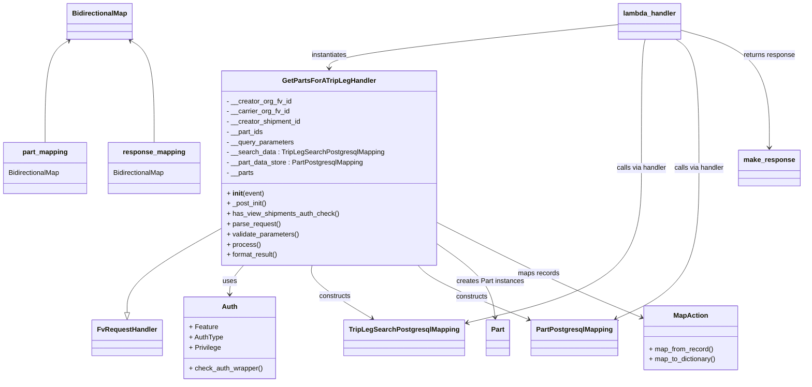

# Diagram: partview_core/partview_service/partview_service/api/search/part_search.py


> Auto-generated by Obscura crawlers

## Diagram 1



### SVG

<svg id="container" width="1868.365234375" xmlns="http://www.w3.org/2000/svg" class="classDiagram" height="896" viewBox="0 0 1868.365234375 896" role="graphics-document document" aria-roledescription="class"><style>#container{font-family:"trebuchet ms",verdana,arial,sans-serif;font-size:16px;fill:#333;}@keyframes edge-animation-frame{from{stroke-dashoffset:0;}}@keyframes dash{to{stroke-dashoffset:0;}}#container .edge-animation-slow{stroke-dasharray:9,5!important;stroke-dashoffset:900;animation:dash 50s linear infinite;stroke-linecap:round;}#container .edge-animation-fast{stroke-dasharray:9,5!important;stroke-dashoffset:900;animation:dash 20s linear infinite;stroke-linecap:round;}#container .error-icon{fill:#552222;}#container .error-text{fill:#552222;stroke:#552222;}#container .edge-thickness-normal{stroke-width:1px;}#container .edge-thickness-thick{stroke-width:3.5px;}#container .edge-pattern-solid{stroke-dasharray:0;}#container .edge-thickness-invisible{stroke-width:0;fill:none;}#container .edge-pattern-dashed{stroke-dasharray:3;}#container .edge-pattern-dotted{stroke-dasharray:2;}#container .marker{fill:#333333;stroke:#333333;}#container .marker.cross{stroke:#333333;}#container svg{font-family:"trebuchet ms",verdana,arial,sans-serif;font-size:16px;}#container p{margin:0;}#container g.classGroup text{fill:#9370DB;stroke:none;font-family:"trebuchet ms",verdana,arial,sans-serif;font-size:10px;}#container g.classGroup text .title{font-weight:bolder;}#container .nodeLabel,#container .edgeLabel{color:#131300;}#container .edgeLabel .label rect{fill:#ECECFF;}#container .label text{fill:#131300;}#container .labelBkg{background:#ECECFF;}#container .edgeLabel .label span{background:#ECECFF;}#container .classTitle{font-weight:bolder;}#container .node rect,#container .node circle,#container .node ellipse,#container .node polygon,#container .node path{fill:#ECECFF;stroke:#9370DB;stroke-width:1px;}#container .divider{stroke:#9370DB;stroke-width:1;}#container g.clickable{cursor:pointer;}#container g.classGroup rect{fill:#ECECFF;stroke:#9370DB;}#container g.classGroup line{stroke:#9370DB;stroke-width:1;}#container .classLabel .box{stroke:none;stroke-width:0;fill:#ECECFF;opacity:0.5;}#container .classLabel .label{fill:#9370DB;font-size:10px;}#container .relation{stroke:#333333;stroke-width:1;fill:none;}#container .dashed-line{stroke-dasharray:3;}#container .dotted-line{stroke-dasharray:1 2;}#container #compositionStart,#container .composition{fill:#333333!important;stroke:#333333!important;stroke-width:1;}#container #compositionEnd,#container .composition{fill:#333333!important;stroke:#333333!important;stroke-width:1;}#container #dependencyStart,#container .dependency{fill:#333333!important;stroke:#333333!important;stroke-width:1;}#container #dependencyStart,#container .dependency{fill:#333333!important;stroke:#333333!important;stroke-width:1;}#container #extensionStart,#container .extension{fill:transparent!important;stroke:#333333!important;stroke-width:1;}#container #extensionEnd,#container .extension{fill:transparent!important;stroke:#333333!important;stroke-width:1;}#container #aggregationStart,#container .aggregation{fill:transparent!important;stroke:#333333!important;stroke-width:1;}#container #aggregationEnd,#container .aggregation{fill:transparent!important;stroke:#333333!important;stroke-width:1;}#container #lollipopStart,#container .lollipop{fill:#ECECFF!important;stroke:#333333!important;stroke-width:1;}#container #lollipopEnd,#container .lollipop{fill:#ECECFF!important;stroke:#333333!important;stroke-width:1;}#container .edgeTerminals{font-size:11px;line-height:initial;}#container .classTitleText{text-anchor:middle;font-size:18px;fill:#333;}#container .label-icon{display:inline-block;height:1em;overflow:visible;vertical-align:-0.125em;}#container .node .label-icon path{fill:currentColor;stroke:revert;stroke-width:revert;}#container :root{--mermaid-font-family:"trebuchet ms",verdana,arial,sans-serif;}</style><g><defs><marker id="container_class-aggregationStart" class="marker aggregation class" refX="18" refY="7" markerWidth="190" markerHeight="240" orient="auto"><path d="M 18,7 L9,13 L1,7 L9,1 Z"></path></marker></defs><defs><marker id="container_class-aggregationEnd" class="marker aggregation class" refX="1" refY="7" markerWidth="20" markerHeight="28" orient="auto"><path d="M 18,7 L9,13 L1,7 L9,1 Z"></path></marker></defs><defs><marker id="container_class-extensionStart" class="marker extension class" refX="18" refY="7" markerWidth="190" markerHeight="240" orient="auto"><path d="M 1,7 L18,13 V 1 Z"></path></marker></defs><defs><marker id="container_class-extensionEnd" class="marker extension class" refX="1" refY="7" markerWidth="20" markerHeight="28" orient="auto"><path d="M 1,1 V 13 L18,7 Z"></path></marker></defs><defs><marker id="container_class-compositionStart" class="marker composition class" refX="18" refY="7" markerWidth="190" markerHeight="240" orient="auto"><path d="M 18,7 L9,13 L1,7 L9,1 Z"></path></marker></defs><defs><marker id="container_class-compositionEnd" class="marker composition class" refX="1" refY="7" markerWidth="20" markerHeight="28" orient="auto"><path d="M 18,7 L9,13 L1,7 L9,1 Z"></path></marker></defs><defs><marker id="container_class-dependencyStart" class="marker dependency class" refX="6" refY="7" markerWidth="190" markerHeight="240" orient="auto"><path d="M 5,7 L9,13 L1,7 L9,1 Z"></path></marker></defs><defs><marker id="container_class-dependencyEnd" class="marker dependency class" refX="13" refY="7" markerWidth="20" markerHeight="28" orient="auto"><path d="M 18,7 L9,13 L14,7 L9,1 Z"></path></marker></defs><defs><marker id="container_class-lollipopStart" class="marker lollipop class" refX="13" refY="7" markerWidth="190" markerHeight="240" orient="auto"><circle stroke="black" fill="transparent" cx="7" cy="7" r="6"></circle></marker></defs><defs><marker id="container_class-lollipopEnd" class="marker lollipop class" refX="1" refY="7" markerWidth="190" markerHeight="240" orient="auto"><circle stroke="black" fill="transparent" cx="7" cy="7" r="6"></circle></marker></defs><g class="root"><g class="clusters"></g><g class="edgePaths"><path d="M523.648,534.458L487.114,555.215C450.58,575.972,377.512,617.486,340.978,650.535C304.443,683.583,304.443,708.167,304.443,720.458L304.443,732.75" id="id_GetPartsForATripLegHandler_FvRequestHandler_1" class="edge-thickness-normal edge-pattern-solid relation" style=";;;" data-edge="true" data-et="edge" data-id="id_GetPartsForATripLegHandler_FvRequestHandler_1" data-points="W3sieCI6NTIzLjY0ODQzNzUsInkiOjUzNC40NTgwMjI5Mzg4MzR9LHsieCI6MzA0LjQ0MzM1OTM3NSwieSI6NjU5fSx7IngiOjMwNC40NDMzNTkzNzUsInkiOjc1MH1d" marker-end="url(#container_class-extensionEnd)"></path><path d="M572.458,622L567.091,628.167C561.725,634.333,550.992,646.667,545.626,658C540.26,669.333,540.26,679.667,540.26,684.833L540.26,690" id="id_GetPartsForATripLegHandler_Auth_2" class="edge-thickness-normal edge-pattern-solid relation" style=";;;" data-edge="true" data-et="edge" data-id="id_GetPartsForATripLegHandler_Auth_2" data-points="W3sieCI6NTcyLjQ1Nzc4MzAxODg2OCwieSI6NjIyfSx7IngiOjU0MC4yNTk3NjU2MjUsInkiOjY1OX0seyJ4Ijo1NDAuMjU5NzY1NjI1LCJ5Ijo2OTZ9XQ==" marker-end="url(#container_class-dependencyEnd)"></path><path d="M729.704,622L728.59,628.167C727.477,634.333,725.25,646.667,748.906,667.491C772.563,688.315,822.102,717.63,846.872,732.287L871.641,746.944" id="id_GetPartsForATripLegHandler_TripLegSearchPostgresqlMapping_3" class="edge-thickness-normal edge-pattern-solid relation" style=";;;" data-edge="true" data-et="edge" data-id="id_GetPartsForATripLegHandler_TripLegSearchPostgresqlMapping_3" data-points="W3sieCI6NzI5LjcwMzUwODI1NDcxNywieSI6NjIyfSx7IngiOjcyMy4wMjM0Mzc1LCJ5Ijo2NTl9LHsieCI6ODc2LjgwNTA5ODY4NDIxMDUsInkiOjc1MH1d" marker-end="url(#container_class-dependencyEnd)"></path><path d="M965.973,622L971.25,628.167C976.527,634.333,987.081,646.667,1031.17,668.2C1075.259,689.734,1152.883,720.467,1191.695,735.834L1230.507,751.201" id="id_GetPartsForATripLegHandler_PartPostgresqlMapping_4" class="edge-thickness-normal edge-pattern-solid relation" style=";;;" data-edge="true" data-et="edge" data-id="id_GetPartsForATripLegHandler_PartPostgresqlMapping_4" data-points="W3sieCI6OTY1Ljk3Mjg3NzM1ODQ5MDYsInkiOjYyMn0seyJ4Ijo5OTcuNjM0NzY1NjI1LCJ5Ijo2NTl9LHsieCI6MTIzNi4wODU5Mzc1LCJ5Ijo3NTMuNDA5NDIyNTg2MDY1Nn1d" marker-end="url(#container_class-dependencyEnd)"></path><path d="M1018.086,574.045L1037.528,588.205C1056.969,602.364,1095.853,630.682,1117.884,659.024C1139.915,687.366,1145.093,715.732,1147.682,729.915L1150.271,744.098" id="id_GetPartsForATripLegHandler_Part_5" class="edge-thickness-normal edge-pattern-solid relation" style=";;;" data-edge="true" data-et="edge" data-id="id_GetPartsForATripLegHandler_Part_5" data-points="W3sieCI6MTAxOC4wODU5Mzc1LCJ5Ijo1NzQuMDQ1NDEwMzg0MjcwNn0seyJ4IjoxMTM0LjczNjMyODEyNSwieSI6NjU5fSx7IngiOjExNTEuMzQ4NDc4NjE4NDIxLCJ5Ijo3NTB9XQ==" marker-end="url(#container_class-dependencyEnd)"></path><path d="M1018.086,521.99L1062.193,544.825C1106.3,567.66,1194.514,613.33,1273.011,650.355C1351.509,687.38,1420.289,715.761,1454.679,729.951L1489.069,744.141" id="id_GetPartsForATripLegHandler_MapAction_6" class="edge-thickness-normal edge-pattern-solid relation" style=";;;" data-edge="true" data-et="edge" data-id="id_GetPartsForATripLegHandler_MapAction_6" data-points="W3sieCI6MTAxOC4wODU5Mzc1LCJ5Ijo1MjEuOTg5NjgyMjY0MTAxOX0seyJ4IjoxMjgyLjcyODUxNTYyNSwieSI6NjU5fSx7IngiOjE0OTQuNjE1MjM0Mzc1LCJ5Ijo3NDYuNDI5MzM0OTE2ODY0Nn1d" marker-end="url(#container_class-dependencyEnd)"></path><path d="M162.659,95.135L153.449,100.779C144.239,106.423,125.819,117.712,116.609,157.523C107.398,197.333,107.398,265.667,107.398,299.833L107.398,334" id="id_BidirectionalMap_part_mapping_7" class="edge-thickness-normal edge-pattern-solid relation" style=";;;" data-edge="true" data-et="edge" data-id="id_BidirectionalMap_part_mapping_7" data-points="W3sieCI6MTY3Ljc3NDk5NTA1NTM3OTc1LCJ5Ijo5Mn0seyJ4IjoxMDcuMzk4NDM3NSwieSI6MTI5fSx7IngiOjEwNy4zOTg0Mzc1LCJ5IjozMzR9XQ==" marker-start="url(#container_class-dependencyStart)"></path><path d="M309.962,95.135L319.172,100.779C328.382,106.423,346.802,117.712,356.013,157.523C365.223,197.333,365.223,265.667,365.223,299.833L365.223,334" id="id_BidirectionalMap_response_mapping_8" class="edge-thickness-normal edge-pattern-solid relation" style=";;;" data-edge="true" data-et="edge" data-id="id_BidirectionalMap_response_mapping_8" data-points="W3sieCI6MzA0Ljg0NjA5ODY5NDYyMDI1LCJ5Ijo5Mn0seyJ4IjozNjUuMjIyNjU2MjUsInkiOjEyOX0seyJ4IjozNjUuMjIyNjU2MjUsInkiOjMzNH1d" marker-start="url(#container_class-dependencyStart)"></path><path d="M1438.492,57.688L1327.221,69.573C1215.951,81.459,993.409,105.229,882.138,122.281C770.867,139.333,770.867,149.667,770.867,154.833L770.867,160" id="id_lambda_handler_GetPartsForATripLegHandler_9" class="edge-thickness-normal edge-pattern-solid relation" style=";;;" data-edge="true" data-et="edge" data-id="id_lambda_handler_GetPartsForATripLegHandler_9" data-points="W3sieCI6MTQzOC40OTIxODc1LCJ5Ijo1Ny42ODgxMjM4ODQyNzA0Nn0seyJ4Ijo3NzAuODY3MTg3NSwieSI6MTI5fSx7IngiOjc3MC44NjcxODc1LCJ5IjoxNjZ9XQ==" marker-end="url(#container_class-dependencyEnd)"></path><path d="M1498.497,92L1496.74,98.167C1494.982,104.333,1491.467,116.667,1489.709,167C1487.951,217.333,1487.951,305.667,1487.951,394C1487.951,482.333,1487.951,570.667,1421.255,631.255C1354.558,691.844,1221.165,724.688,1154.468,741.11L1087.771,757.532" id="id_lambda_handler_TripLegSearchPostgresqlMapping_10" class="edge-thickness-normal edge-pattern-solid relation" style=";;;" data-edge="true" data-et="edge" data-id="id_lambda_handler_TripLegSearchPostgresqlMapping_10" data-points="W3sieCI6MTQ5OC40OTczNzkzNTEyNjU5LCJ5Ijo5Mn0seyJ4IjoxNDg3Ljk1MTE3MTg3NSwieSI6MTI5fSx7IngiOjE0ODcuOTUxMTcxODc1LCJ5IjozOTR9LHsieCI6MTQ4Ny45NTExNzE4NzUsInkiOjY1OX0seyJ4IjoxMDgxLjk0NTMxMjUsInkiOjc1OC45NjYyODMwMzQ0OTA3fV0=" marker-end="url(#container_class-dependencyEnd)"></path><path d="M1572.388,92L1581.479,98.167C1590.57,104.333,1608.753,116.667,1617.844,167C1626.936,217.333,1626.936,305.667,1626.936,394C1626.936,482.333,1626.936,570.667,1594.391,629.587C1561.846,688.508,1496.756,718.015,1464.211,732.769L1431.666,747.523" id="id_lambda_handler_PartPostgresqlMapping_11" class="edge-thickness-normal edge-pattern-solid relation" style=";;;" data-edge="true" data-et="edge" data-id="id_lambda_handler_PartPostgresqlMapping_11" data-points="W3sieCI6MTU3Mi4zODc4MDY1NjY0NTU4LCJ5Ijo5Mn0seyJ4IjoxNjI2LjkzNTU0Njg3NSwieSI6MTI5fSx7IngiOjE2MjYuOTM1NTQ2ODc1LCJ5IjozOTR9LHsieCI6MTYyNi45MzU1NDY4NzUsInkiOjY1OX0seyJ4IjoxNDI2LjIwMTI3NDY3MTA1MjcsInkiOjc1MH1d" marker-end="url(#container_class-dependencyEnd)"></path><path d="M1582.445,70.277L1617.187,80.064C1651.929,89.851,1721.413,109.426,1756.155,155.379C1790.896,201.333,1790.896,273.667,1790.896,309.833L1790.896,346" id="id_lambda_handler_make_response_12" class="edge-thickness-normal edge-pattern-solid relation" style=";;;" data-edge="true" data-et="edge" data-id="id_lambda_handler_make_response_12" data-points="W3sieCI6MTU4Mi40NDUzMTI1LCJ5Ijo3MC4yNzY2OTc4NDU3ODUyNX0seyJ4IjoxNzkwLjg5NjQ4NDM3NSwieSI6MTI5fSx7IngiOjE3OTAuODk2NDg0Mzc1LCJ5IjozNTJ9XQ==" marker-end="url(#container_class-dependencyEnd)"></path></g><g class="edgeLabels"><g class="edgeLabel"><g class="label" data-id="id_GetPartsForATripLegHandler_FvRequestHandler_1" transform="translate(0, 0)"><foreignObject width="0" height="0"><div xmlns="http://www.w3.org/1999/xhtml" class="labelBkg" style="display: table-cell; white-space: nowrap; line-height: 1.5; max-width: 200px; text-align: center;"><span class="edgeLabel"></span></div></foreignObject></g></g><g class="edgeLabel" transform="translate(540.259765625, 659)"><g class="label" data-id="id_GetPartsForATripLegHandler_Auth_2" transform="translate(-16.4921875, -12)"><foreignObject width="32.984375" height="24"><div xmlns="http://www.w3.org/1999/xhtml" class="labelBkg" style="display: table-cell; white-space: nowrap; line-height: 1.5; max-width: 200px; text-align: center;"><span class="edgeLabel"><p>uses</p></span></div></foreignObject></g></g><g class="edgeLabel" transform="translate(783.73558, 694.92629)"><g class="label" data-id="id_GetPartsForATripLegHandler_TripLegSearchPostgresqlMapping_3" transform="translate(-37.84375, -12)"><foreignObject width="75.6875" height="24"><div xmlns="http://www.w3.org/1999/xhtml" class="labelBkg" style="display: table-cell; white-space: nowrap; line-height: 1.5; max-width: 200px; text-align: center;"><span class="edgeLabel"><p>constructs</p></span></div></foreignObject></g></g><g class="edgeLabel" transform="translate(1094.22132, 697.24129)"><g class="label" data-id="id_GetPartsForATripLegHandler_PartPostgresqlMapping_4" transform="translate(-37.84375, -12)"><foreignObject width="75.6875" height="24"><div xmlns="http://www.w3.org/1999/xhtml" class="labelBkg" style="display: table-cell; white-space: nowrap; line-height: 1.5; max-width: 200px; text-align: center;"><span class="edgeLabel"><p>constructs</p></span></div></foreignObject></g></g><g class="edgeLabel" transform="translate(1134.736328125, 659)"><g class="label" data-id="id_GetPartsForATripLegHandler_Part_5" transform="translate(-79.2578125, -12)"><foreignObject width="158.515625" height="24"><div xmlns="http://www.w3.org/1999/xhtml" class="labelBkg" style="display: table-cell; white-space: nowrap; line-height: 1.5; max-width: 200px; text-align: center;"><span class="edgeLabel"><p>creates Part instances</p></span></div></foreignObject></g></g><g class="edgeLabel" transform="translate(1252.18416, 643.18662)"><g class="label" data-id="id_GetPartsForATripLegHandler_MapAction_6" transform="translate(-48.734375, -12)"><foreignObject width="97.46875" height="24"><div xmlns="http://www.w3.org/1999/xhtml" class="labelBkg" style="display: table-cell; white-space: nowrap; line-height: 1.5; max-width: 200px; text-align: center;"><span class="edgeLabel"><p>maps records</p></span></div></foreignObject></g></g><g class="edgeLabel"><g class="label" data-id="id_BidirectionalMap_part_mapping_7" transform="translate(0, 0)"><foreignObject width="0" height="0"><div xmlns="http://www.w3.org/1999/xhtml" class="labelBkg" style="display: table-cell; white-space: nowrap; line-height: 1.5; max-width: 200px; text-align: center;"><span class="edgeLabel"></span></div></foreignObject></g></g><g class="edgeLabel"><g class="label" data-id="id_BidirectionalMap_response_mapping_8" transform="translate(0, 0)"><foreignObject width="0" height="0"><div xmlns="http://www.w3.org/1999/xhtml" class="labelBkg" style="display: table-cell; white-space: nowrap; line-height: 1.5; max-width: 200px; text-align: center;"><span class="edgeLabel"></span></div></foreignObject></g></g><g class="edgeLabel" transform="translate(770.8671875, 129)"><g class="label" data-id="id_lambda_handler_GetPartsForATripLegHandler_9" transform="translate(-42.9140625, -12)"><foreignObject width="85.828125" height="24"><div xmlns="http://www.w3.org/1999/xhtml" class="labelBkg" style="display: table-cell; white-space: nowrap; line-height: 1.5; max-width: 200px; text-align: center;"><span class="edgeLabel"><p>instantiates</p></span></div></foreignObject></g></g><g class="edgeLabel" transform="translate(1487.951171875, 394)"><g class="label" data-id="id_lambda_handler_TripLegSearchPostgresqlMapping_10" transform="translate(-59.4921875, -12)"><foreignObject width="118.984375" height="24"><div xmlns="http://www.w3.org/1999/xhtml" class="labelBkg" style="display: table-cell; white-space: nowrap; line-height: 1.5; max-width: 200px; text-align: center;"><span class="edgeLabel"><p>calls via handler</p></span></div></foreignObject></g></g><g class="edgeLabel" transform="translate(1626.935546875, 394)"><g class="label" data-id="id_lambda_handler_PartPostgresqlMapping_11" transform="translate(-59.4921875, -12)"><foreignObject width="118.984375" height="24"><div xmlns="http://www.w3.org/1999/xhtml" class="labelBkg" style="display: table-cell; white-space: nowrap; line-height: 1.5; max-width: 200px; text-align: center;"><span class="edgeLabel"><p>calls via handler</p></span></div></foreignObject></g></g><g class="edgeLabel" transform="translate(1790.896484375, 129)"><g class="label" data-id="id_lambda_handler_make_response_12" transform="translate(-61.5390625, -12)"><foreignObject width="123.078125" height="24"><div xmlns="http://www.w3.org/1999/xhtml" class="labelBkg" style="display: table-cell; white-space: nowrap; line-height: 1.5; max-width: 200px; text-align: center;"><span class="edgeLabel"><p>returns response</p></span></div></foreignObject></g></g></g><g class="nodes"><g class="node default" id="classId-GetPartsForATripLegHandler-0" transform="translate(770.8671875, 394)"><g class="basic label-container"><path d="M-247.21875 -228 L247.21875 -228 L247.21875 228 L-247.21875 228" stroke="none" stroke-width="0" fill="#ECECFF" style=""></path><path d="M-247.21875 -228 C-139.600610407495 -228, -31.982470814989995 -228, 247.21875 -228 M-247.21875 -228 C-138.67682163820297 -228, -30.13489327640596 -228, 247.21875 -228 M247.21875 -228 C247.21875 -108.37342668371559, 247.21875 11.253146632568814, 247.21875 228 M247.21875 -228 C247.21875 -72.96560104573683, 247.21875 82.06879790852634, 247.21875 228 M247.21875 228 C140.47973432159384 228, 33.74071864318768 228, -247.21875 228 M247.21875 228 C132.46232423427557 228, 17.70589846855117 228, -247.21875 228 M-247.21875 228 C-247.21875 117.76828105514234, -247.21875 7.536562110284677, -247.21875 -228 M-247.21875 228 C-247.21875 134.25874684702455, -247.21875 40.517493694049136, -247.21875 -228" stroke="#9370DB" stroke-width="1.3" fill="none" stroke-dasharray="0 0" style=""></path></g><g class="annotation-group text" transform="translate(0, -204)"></g><g class="label-group text" transform="translate(-103.546875, -204)"><g class="label" style="font-weight: bolder" transform="translate(0,-12)"><foreignObject width="207.09375" height="24"><div xmlns="http://www.w3.org/1999/xhtml" style="display: table-cell; white-space: nowrap; line-height: 1.5; max-width: 254px; text-align: center;"><span class="nodeLabel markdown-node-label" style=""><p>GetPartsForATripLegHandler</p></span></div></foreignObject></g></g><g class="members-group text" transform="translate(-235.21875, -156)"><g class="label" style="" transform="translate(0,-12)"><foreignObject width="152.0625" height="24"><div xmlns="http://www.w3.org/1999/xhtml" style="display: table-cell; white-space: nowrap; line-height: 1.5; max-width: 209px; text-align: center;"><span class="nodeLabel markdown-node-label" style=""><p>- __creator_org_fv_id</p></span></div></foreignObject></g><g class="label" style="" transform="translate(0,12)"><foreignObject width="148.34375" height="24"><div xmlns="http://www.w3.org/1999/xhtml" style="display: table-cell; white-space: nowrap; line-height: 1.5; max-width: 206px; text-align: center;"><span class="nodeLabel markdown-node-label" style=""><p>- __carrier_org_fv_id</p></span></div></foreignObject></g><g class="label" style="" transform="translate(0,36)"><foreignObject width="176.40625" height="24"><div xmlns="http://www.w3.org/1999/xhtml" style="display: table-cell; white-space: nowrap; line-height: 1.5; max-width: 234px; text-align: center;"><span class="nodeLabel markdown-node-label" style=""><p>- __creator_shipment_id</p></span></div></foreignObject></g><g class="label" style="" transform="translate(0,60)"><foreignObject width="87.046875" height="24"><div xmlns="http://www.w3.org/1999/xhtml" style="display: table-cell; white-space: nowrap; line-height: 1.5; max-width: 144px; text-align: center;"><span class="nodeLabel markdown-node-label" style=""><p>- __part_ids</p></span></div></foreignObject></g><g class="label" style="" transform="translate(0,84)"><foreignObject width="158.8125" height="24"><div xmlns="http://www.w3.org/1999/xhtml" style="display: table-cell; white-space: nowrap; line-height: 1.5; max-width: 216px; text-align: center;"><span class="nodeLabel markdown-node-label" style=""><p>- __query_parameters</p></span></div></foreignObject></g><g class="label" style="" transform="translate(0,108)"><foreignObject width="366.890625" height="24"><div xmlns="http://www.w3.org/1999/xhtml" style="display: table-cell; white-space: nowrap; line-height: 1.5; max-width: 425px; text-align: center;"><span class="nodeLabel markdown-node-label" style=""><p>- __search_data : TripLegSearchPostgresqlMapping</p></span></div></foreignObject></g><g class="label" style="" transform="translate(0,132)"><foreignObject width="322.296875" height="24"><div xmlns="http://www.w3.org/1999/xhtml" style="display: table-cell; white-space: nowrap; line-height: 1.5; max-width: 380px; text-align: center;"><span class="nodeLabel markdown-node-label" style=""><p>- __part_data_store : PartPostgresqlMapping</p></span></div></foreignObject></g><g class="label" style="" transform="translate(0,156)"><foreignObject width="64.640625" height="24"><div xmlns="http://www.w3.org/1999/xhtml" style="display: table-cell; white-space: nowrap; line-height: 1.5; max-width: 122px; text-align: center;"><span class="nodeLabel markdown-node-label" style=""><p>- __parts</p></span></div></foreignObject></g></g><g class="methods-group text" transform="translate(-235.21875, 60)"><g class="label" style="" transform="translate(0,-12)"><foreignObject width="87.390625" height="24"><div xmlns="http://www.w3.org/1999/xhtml" style="display: table-cell; white-space: nowrap; line-height: 1.5; max-width: 177px; text-align: center;"><span class="nodeLabel markdown-node-label" style=""><p>+ <strong>init</strong>(event)</p></span></div></foreignObject></g><g class="label" style="" transform="translate(0,12)"><foreignObject width="95.515625" height="24"><div xmlns="http://www.w3.org/1999/xhtml" style="display: table-cell; white-space: nowrap; line-height: 1.5; max-width: 153px; text-align: center;"><span class="nodeLabel markdown-node-label" style=""><p>+ _post_init()</p></span></div></foreignObject></g><g class="label" style="" transform="translate(0,36)"><foreignObject width="262.4375" height="24"><div xmlns="http://www.w3.org/1999/xhtml" style="display: table-cell; white-space: nowrap; line-height: 1.5; max-width: 320px; text-align: center;"><span class="nodeLabel markdown-node-label" style=""><p>+ has_view_shipments_auth_check()</p></span></div></foreignObject></g><g class="label" style="" transform="translate(0,60)"><foreignObject width="126.046875" height="24"><div xmlns="http://www.w3.org/1999/xhtml" style="display: table-cell; white-space: nowrap; line-height: 1.5; max-width: 183px; text-align: center;"><span class="nodeLabel markdown-node-label" style=""><p>+ parse_request()</p></span></div></foreignObject></g><g class="label" style="" transform="translate(0,84)"><foreignObject width="170.953125" height="24"><div xmlns="http://www.w3.org/1999/xhtml" style="display: table-cell; white-space: nowrap; line-height: 1.5; max-width: 228px; text-align: center;"><span class="nodeLabel markdown-node-label" style=""><p>+ validate_parameters()</p></span></div></foreignObject></g><g class="label" style="" transform="translate(0,108)"><foreignObject width="77.96875" height="24"><div xmlns="http://www.w3.org/1999/xhtml" style="display: table-cell; white-space: nowrap; line-height: 1.5; max-width: 135px; text-align: center;"><span class="nodeLabel markdown-node-label" style=""><p>+ process()</p></span></div></foreignObject></g><g class="label" style="" transform="translate(0,132)"><foreignObject width="121.5" height="24"><div xmlns="http://www.w3.org/1999/xhtml" style="display: table-cell; white-space: nowrap; line-height: 1.5; max-width: 179px; text-align: center;"><span class="nodeLabel markdown-node-label" style=""><p>+ format_result()</p></span></div></foreignObject></g></g><g class="divider" style=""><path d="M-247.21875 -180 C-104.02620222339496 -180, 39.16634555321008 -180, 247.21875 -180 M-247.21875 -180 C-107.40113870398741 -180, 32.41647259202517 -180, 247.21875 -180" stroke="#9370DB" stroke-width="1.3" fill="none" stroke-dasharray="0 0" style=""></path></g><g class="divider" style=""><path d="M-247.21875 36 C-109.28727322634282 36, 28.644203547314362 36, 247.21875 36 M-247.21875 36 C-59.280523368021875 36, 128.65770326395625 36, 247.21875 36" stroke="#9370DB" stroke-width="1.3" fill="none" stroke-dasharray="0 0" style=""></path></g></g><g class="node default" id="classId-FvRequestHandler-1" transform="translate(304.443359375, 792)"><g class="basic label-container"><path d="M-78.7890625 -42 L78.7890625 -42 L78.7890625 42 L-78.7890625 42" stroke="none" stroke-width="0" fill="#ECECFF" style=""></path><path d="M-78.7890625 -42 C-26.933331820697546 -42, 24.922398858604907 -42, 78.7890625 -42 M-78.7890625 -42 C-36.100596513874336 -42, 6.587869472251327 -42, 78.7890625 -42 M78.7890625 -42 C78.7890625 -24.340417117386508, 78.7890625 -6.680834234773016, 78.7890625 42 M78.7890625 -42 C78.7890625 -23.01359230361055, 78.7890625 -4.027184607221102, 78.7890625 42 M78.7890625 42 C23.948988240570152 42, -30.891086018859696 42, -78.7890625 42 M78.7890625 42 C27.582343995923736 42, -23.624374508152528 42, -78.7890625 42 M-78.7890625 42 C-78.7890625 20.455009505437335, -78.7890625 -1.0899809891253298, -78.7890625 -42 M-78.7890625 42 C-78.7890625 16.80099681752655, -78.7890625 -8.398006364946902, -78.7890625 -42" stroke="#9370DB" stroke-width="1.3" fill="none" stroke-dasharray="0 0" style=""></path></g><g class="annotation-group text" transform="translate(0, -18)"></g><g class="label-group text" transform="translate(-66.7890625, -18)"><g class="label" style="font-weight: bolder" transform="translate(0,-12)"><foreignObject width="133.578125" height="24"><div xmlns="http://www.w3.org/1999/xhtml" style="display: table-cell; white-space: nowrap; line-height: 1.5; max-width: 183px; text-align: center;"><span class="nodeLabel markdown-node-label" style=""><p>FvRequestHandler</p></span></div></foreignObject></g></g><g class="members-group text" transform="translate(-66.7890625, 30)"></g><g class="methods-group text" transform="translate(-66.7890625, 60)"></g><g class="divider" style=""><path d="M-78.7890625 6 C-17.280022058298336 6, 44.22901838340333 6, 78.7890625 6 M-78.7890625 6 C-25.53354997609783 6, 27.72196254780434 6, 78.7890625 6" stroke="#9370DB" stroke-width="1.3" fill="none" stroke-dasharray="0 0" style=""></path></g><g class="divider" style=""><path d="M-78.7890625 24 C-41.96253737097795 24, -5.136012241955896 24, 78.7890625 24 M-78.7890625 24 C-19.25012115694068 24, 40.28882018611864 24, 78.7890625 24" stroke="#9370DB" stroke-width="1.3" fill="none" stroke-dasharray="0 0" style=""></path></g></g><g class="node default" id="classId-Auth-2" transform="translate(540.259765625, 792)"><g class="basic label-container"><path d="M-107.02734375 -96 L107.02734375 -96 L107.02734375 96 L-107.02734375 96" stroke="none" stroke-width="0" fill="#ECECFF" style=""></path><path d="M-107.02734375 -96 C-57.68563990117626 -96, -8.343936052352518 -96, 107.02734375 -96 M-107.02734375 -96 C-29.04114681374 -96, 48.94505012252 -96, 107.02734375 -96 M107.02734375 -96 C107.02734375 -46.75617216475378, 107.02734375 2.487655670492444, 107.02734375 96 M107.02734375 -96 C107.02734375 -46.96925395514754, 107.02734375 2.061492089704913, 107.02734375 96 M107.02734375 96 C31.417113708781272 96, -44.193116332437455 96, -107.02734375 96 M107.02734375 96 C25.556792551109808 96, -55.913758647780384 96, -107.02734375 96 M-107.02734375 96 C-107.02734375 24.138967919687772, -107.02734375 -47.722064160624456, -107.02734375 -96 M-107.02734375 96 C-107.02734375 49.891336856846806, -107.02734375 3.7826737136936117, -107.02734375 -96" stroke="#9370DB" stroke-width="1.3" fill="none" stroke-dasharray="0 0" style=""></path></g><g class="annotation-group text" transform="translate(0, -72)"></g><g class="label-group text" transform="translate(-17.0078125, -72)"><g class="label" style="font-weight: bolder" transform="translate(0,-12)"><foreignObject width="34.015625" height="24"><div xmlns="http://www.w3.org/1999/xhtml" style="display: table-cell; white-space: nowrap; line-height: 1.5; max-width: 84px; text-align: center;"><span class="nodeLabel markdown-node-label" style=""><p>Auth</p></span></div></foreignObject></g></g><g class="members-group text" transform="translate(-95.02734375, -24)"><g class="label" style="" transform="translate(0,-12)"><foreignObject width="66.296875" height="24"><div xmlns="http://www.w3.org/1999/xhtml" style="display: table-cell; white-space: nowrap; line-height: 1.5; max-width: 124px; text-align: center;"><span class="nodeLabel markdown-node-label" style=""><p>+ Feature</p></span></div></foreignObject></g><g class="label" style="" transform="translate(0,12)"><foreignObject width="79.59375" height="24"><div xmlns="http://www.w3.org/1999/xhtml" style="display: table-cell; white-space: nowrap; line-height: 1.5; max-width: 137px; text-align: center;"><span class="nodeLabel markdown-node-label" style=""><p>+ AuthType</p></span></div></foreignObject></g><g class="label" style="" transform="translate(0,36)"><foreignObject width="74.390625" height="24"><div xmlns="http://www.w3.org/1999/xhtml" style="display: table-cell; white-space: nowrap; line-height: 1.5; max-width: 132px; text-align: center;"><span class="nodeLabel markdown-node-label" style=""><p>+ Privilege</p></span></div></foreignObject></g></g><g class="methods-group text" transform="translate(-95.02734375, 72)"><g class="label" style="" transform="translate(0,-12)"><foreignObject width="173.046875" height="24"><div xmlns="http://www.w3.org/1999/xhtml" style="display: table-cell; white-space: nowrap; line-height: 1.5; max-width: 230px; text-align: center;"><span class="nodeLabel markdown-node-label" style=""><p>+ check_auth_wrapper()</p></span></div></foreignObject></g></g><g class="divider" style=""><path d="M-107.02734375 -48 C-59.29417957346308 -48, -11.561015396926166 -48, 107.02734375 -48 M-107.02734375 -48 C-59.11640950687396 -48, -11.205475263747914 -48, 107.02734375 -48" stroke="#9370DB" stroke-width="1.3" fill="none" stroke-dasharray="0 0" style=""></path></g><g class="divider" style=""><path d="M-107.02734375 48 C-35.22439032129306 48, 36.578563107413885 48, 107.02734375 48 M-107.02734375 48 C-58.13743667435761 48, -9.247529598715218 48, 107.02734375 48" stroke="#9370DB" stroke-width="1.3" fill="none" stroke-dasharray="0 0" style=""></path></g></g><g class="node default" id="classId-TripLegSearchPostgresqlMapping-3" transform="translate(947.78125, 792)"><g class="basic label-container"><path d="M-134.1640625 -42 L134.1640625 -42 L134.1640625 42 L-134.1640625 42" stroke="none" stroke-width="0" fill="#ECECFF" style=""></path><path d="M-134.1640625 -42 C-65.71930077766912 -42, 2.725460944661762 -42, 134.1640625 -42 M-134.1640625 -42 C-65.80277034024077 -42, 2.558521819518461 -42, 134.1640625 -42 M134.1640625 -42 C134.1640625 -10.173106387167788, 134.1640625 21.653787225664423, 134.1640625 42 M134.1640625 -42 C134.1640625 -25.119591855336427, 134.1640625 -8.239183710672854, 134.1640625 42 M134.1640625 42 C60.59622232699671 42, -12.97161784600658 42, -134.1640625 42 M134.1640625 42 C42.67819550905334 42, -48.80767148189332 42, -134.1640625 42 M-134.1640625 42 C-134.1640625 9.100677938116483, -134.1640625 -23.798644123767033, -134.1640625 -42 M-134.1640625 42 C-134.1640625 16.60169576446489, -134.1640625 -8.796608471070222, -134.1640625 -42" stroke="#9370DB" stroke-width="1.3" fill="none" stroke-dasharray="0 0" style=""></path></g><g class="annotation-group text" transform="translate(0, -18)"></g><g class="label-group text" transform="translate(-122.1640625, -18)"><g class="label" style="font-weight: bolder" transform="translate(0,-12)"><foreignObject width="244.328125" height="24"><div xmlns="http://www.w3.org/1999/xhtml" style="display: table-cell; white-space: nowrap; line-height: 1.5; max-width: 290px; text-align: center;"><span class="nodeLabel markdown-node-label" style=""><p>TripLegSearchPostgresqlMapping</p></span></div></foreignObject></g></g><g class="members-group text" transform="translate(-122.1640625, 30)"></g><g class="methods-group text" transform="translate(-122.1640625, 60)"></g><g class="divider" style=""><path d="M-134.1640625 6 C-32.51814181482659 6, 69.12777887034682 6, 134.1640625 6 M-134.1640625 6 C-38.221307245472744 6, 57.72144800905451 6, 134.1640625 6" stroke="#9370DB" stroke-width="1.3" fill="none" stroke-dasharray="0 0" style=""></path></g><g class="divider" style=""><path d="M-134.1640625 24 C-78.58984379610268 24, -23.015625092205354 24, 134.1640625 24 M-134.1640625 24 C-52.2694809115299 24, 29.625100676940207 24, 134.1640625 24" stroke="#9370DB" stroke-width="1.3" fill="none" stroke-dasharray="0 0" style=""></path></g></g><g class="node default" id="classId-PartPostgresqlMapping-4" transform="translate(1333.5546875, 792)"><g class="basic label-container"><path d="M-97.46875 -42 L97.46875 -42 L97.46875 42 L-97.46875 42" stroke="none" stroke-width="0" fill="#ECECFF" style=""></path><path d="M-97.46875 -42 C-44.54912099402335 -42, 8.370508011953305 -42, 97.46875 -42 M-97.46875 -42 C-55.53629093668182 -42, -13.603831873363646 -42, 97.46875 -42 M97.46875 -42 C97.46875 -24.51781011532035, 97.46875 -7.035620230640703, 97.46875 42 M97.46875 -42 C97.46875 -9.708611098677324, 97.46875 22.582777802645353, 97.46875 42 M97.46875 42 C19.889956520809562 42, -57.688836958380875 42, -97.46875 42 M97.46875 42 C39.172464114847465 42, -19.12382177030507 42, -97.46875 42 M-97.46875 42 C-97.46875 18.242743778294685, -97.46875 -5.514512443410631, -97.46875 -42 M-97.46875 42 C-97.46875 20.743563527562735, -97.46875 -0.5128729448745304, -97.46875 -42" stroke="#9370DB" stroke-width="1.3" fill="none" stroke-dasharray="0 0" style=""></path></g><g class="annotation-group text" transform="translate(0, -18)"></g><g class="label-group text" transform="translate(-85.46875, -18)"><g class="label" style="font-weight: bolder" transform="translate(0,-12)"><foreignObject width="170.9375" height="24"><div xmlns="http://www.w3.org/1999/xhtml" style="display: table-cell; white-space: nowrap; line-height: 1.5; max-width: 218px; text-align: center;"><span class="nodeLabel markdown-node-label" style=""><p>PartPostgresqlMapping</p></span></div></foreignObject></g></g><g class="members-group text" transform="translate(-85.46875, 30)"></g><g class="methods-group text" transform="translate(-85.46875, 60)"></g><g class="divider" style=""><path d="M-97.46875 6 C-54.964408166765615 6, -12.46006633353123 6, 97.46875 6 M-97.46875 6 C-31.32696975300452 6, 34.81481049399096 6, 97.46875 6" stroke="#9370DB" stroke-width="1.3" fill="none" stroke-dasharray="0 0" style=""></path></g><g class="divider" style=""><path d="M-97.46875 24 C-49.268533575422694 24, -1.0683171508453881 24, 97.46875 24 M-97.46875 24 C-36.26758255270401 24, 24.933584894591974 24, 97.46875 24" stroke="#9370DB" stroke-width="1.3" fill="none" stroke-dasharray="0 0" style=""></path></g></g><g class="node default" id="classId-Part-5" transform="translate(1159.015625, 792)"><g class="basic label-container"><path d="M-27.0703125 -42 L27.0703125 -42 L27.0703125 42 L-27.0703125 42" stroke="none" stroke-width="0" fill="#ECECFF" style=""></path><path d="M-27.0703125 -42 C-15.550150123955728 -42, -4.029987747911456 -42, 27.0703125 -42 M-27.0703125 -42 C-16.16324923314596 -42, -5.256185966291927 -42, 27.0703125 -42 M27.0703125 -42 C27.0703125 -9.867526191396124, 27.0703125 22.264947617207753, 27.0703125 42 M27.0703125 -42 C27.0703125 -17.54414220183523, 27.0703125 6.911715596329543, 27.0703125 42 M27.0703125 42 C11.32584609490372 42, -4.4186203101925585 42, -27.0703125 42 M27.0703125 42 C10.055200117145553 42, -6.959912265708894 42, -27.0703125 42 M-27.0703125 42 C-27.0703125 13.204420106067097, -27.0703125 -15.591159787865806, -27.0703125 -42 M-27.0703125 42 C-27.0703125 20.61598183361062, -27.0703125 -0.7680363327787632, -27.0703125 -42" stroke="#9370DB" stroke-width="1.3" fill="none" stroke-dasharray="0 0" style=""></path></g><g class="annotation-group text" transform="translate(0, -18)"></g><g class="label-group text" transform="translate(-15.0703125, -18)"><g class="label" style="font-weight: bolder" transform="translate(0,-12)"><foreignObject width="30.140625" height="24"><div xmlns="http://www.w3.org/1999/xhtml" style="display: table-cell; white-space: nowrap; line-height: 1.5; max-width: 79px; text-align: center;"><span class="nodeLabel markdown-node-label" style=""><p>Part</p></span></div></foreignObject></g></g><g class="members-group text" transform="translate(-15.0703125, 30)"></g><g class="methods-group text" transform="translate(-15.0703125, 60)"></g><g class="divider" style=""><path d="M-27.0703125 6 C-15.869815478982225 6, -4.669318457964451 6, 27.0703125 6 M-27.0703125 6 C-9.029804119061634 6, 9.010704261876732 6, 27.0703125 6" stroke="#9370DB" stroke-width="1.3" fill="none" stroke-dasharray="0 0" style=""></path></g><g class="divider" style=""><path d="M-27.0703125 24 C-10.813505671744306 24, 5.443301156511389 24, 27.0703125 24 M-27.0703125 24 C-12.841760417374218 24, 1.3867916652515646 24, 27.0703125 24" stroke="#9370DB" stroke-width="1.3" fill="none" stroke-dasharray="0 0" style=""></path></g></g><g class="node default" id="classId-MapAction-6" transform="translate(1605.056640625, 792)"><g class="basic label-container"><path d="M-110.44140625 -75 L110.44140625 -75 L110.44140625 75 L-110.44140625 75" stroke="none" stroke-width="0" fill="#ECECFF" style=""></path><path d="M-110.44140625 -75 C-58.5384638512229 -75, -6.635521452445801 -75, 110.44140625 -75 M-110.44140625 -75 C-39.76858050394959 -75, 30.904245242100814 -75, 110.44140625 -75 M110.44140625 -75 C110.44140625 -31.346606607496078, 110.44140625 12.306786785007844, 110.44140625 75 M110.44140625 -75 C110.44140625 -24.07440178346492, 110.44140625 26.851196433070157, 110.44140625 75 M110.44140625 75 C46.75494070091583 75, -16.931524848168337 75, -110.44140625 75 M110.44140625 75 C46.98520319049838 75, -16.470999869003236 75, -110.44140625 75 M-110.44140625 75 C-110.44140625 25.195831111119297, -110.44140625 -24.608337777761406, -110.44140625 -75 M-110.44140625 75 C-110.44140625 32.12272866463924, -110.44140625 -10.75454267072152, -110.44140625 -75" stroke="#9370DB" stroke-width="1.3" fill="none" stroke-dasharray="0 0" style=""></path></g><g class="annotation-group text" transform="translate(0, -51)"></g><g class="label-group text" transform="translate(-38.6328125, -51)"><g class="label" style="font-weight: bolder" transform="translate(0,-12)"><foreignObject width="77.265625" height="24"><div xmlns="http://www.w3.org/1999/xhtml" style="display: table-cell; white-space: nowrap; line-height: 1.5; max-width: 126px; text-align: center;"><span class="nodeLabel markdown-node-label" style=""><p>MapAction</p></span></div></foreignObject></g></g><g class="members-group text" transform="translate(-98.44140625, -3)"></g><g class="methods-group text" transform="translate(-98.44140625, 27)"><g class="label" style="" transform="translate(0,-12)"><foreignObject width="150.984375" height="24"><div xmlns="http://www.w3.org/1999/xhtml" style="display: table-cell; white-space: nowrap; line-height: 1.5; max-width: 208px; text-align: center;"><span class="nodeLabel markdown-node-label" style=""><p>+ map_from_record()</p></span></div></foreignObject></g><g class="label" style="" transform="translate(0,12)"><foreignObject width="158.25" height="24"><div xmlns="http://www.w3.org/1999/xhtml" style="display: table-cell; white-space: nowrap; line-height: 1.5; max-width: 216px; text-align: center;"><span class="nodeLabel markdown-node-label" style=""><p>+ map_to_dictionary()</p></span></div></foreignObject></g></g><g class="divider" style=""><path d="M-110.44140625 -27 C-65.3365317913684 -27, -20.231657332736802 -27, 110.44140625 -27 M-110.44140625 -27 C-65.46088514145922 -27, -20.48036403291843 -27, 110.44140625 -27" stroke="#9370DB" stroke-width="1.3" fill="none" stroke-dasharray="0 0" style=""></path></g><g class="divider" style=""><path d="M-110.44140625 -3 C-36.888669023293986 -3, 36.66406820341203 -3, 110.44140625 -3 M-110.44140625 -3 C-56.92009463390464 -3, -3.3987830178092793 -3, 110.44140625 -3" stroke="#9370DB" stroke-width="1.3" fill="none" stroke-dasharray="0 0" style=""></path></g></g><g class="node default" id="classId-BidirectionalMap-7" transform="translate(236.310546875, 50)"><g class="basic label-container"><path d="M-74.2265625 -42 L74.2265625 -42 L74.2265625 42 L-74.2265625 42" stroke="none" stroke-width="0" fill="#ECECFF" style=""></path><path d="M-74.2265625 -42 C-25.44798310427001 -42, 23.330596291459983 -42, 74.2265625 -42 M-74.2265625 -42 C-17.00093203538038 -42, 40.22469842923924 -42, 74.2265625 -42 M74.2265625 -42 C74.2265625 -8.583278776052495, 74.2265625 24.83344244789501, 74.2265625 42 M74.2265625 -42 C74.2265625 -9.39403770403895, 74.2265625 23.2119245919221, 74.2265625 42 M74.2265625 42 C41.94941899698527 42, 9.672275493970545 42, -74.2265625 42 M74.2265625 42 C30.780548574249742 42, -12.665465351500515 42, -74.2265625 42 M-74.2265625 42 C-74.2265625 11.970918697667848, -74.2265625 -18.058162604664304, -74.2265625 -42 M-74.2265625 42 C-74.2265625 21.561493708648122, -74.2265625 1.122987417296244, -74.2265625 -42" stroke="#9370DB" stroke-width="1.3" fill="none" stroke-dasharray="0 0" style=""></path></g><g class="annotation-group text" transform="translate(0, -18)"></g><g class="label-group text" transform="translate(-62.2265625, -18)"><g class="label" style="font-weight: bolder" transform="translate(0,-12)"><foreignObject width="124.453125" height="24"><div xmlns="http://www.w3.org/1999/xhtml" style="display: table-cell; white-space: nowrap; line-height: 1.5; max-width: 173px; text-align: center;"><span class="nodeLabel markdown-node-label" style=""><p>BidirectionalMap</p></span></div></foreignObject></g></g><g class="members-group text" transform="translate(-62.2265625, 30)"></g><g class="methods-group text" transform="translate(-62.2265625, 60)"></g><g class="divider" style=""><path d="M-74.2265625 6 C-27.363990082762946 6, 19.498582334474108 6, 74.2265625 6 M-74.2265625 6 C-16.156035827144777 6, 41.914490845710446 6, 74.2265625 6" stroke="#9370DB" stroke-width="1.3" fill="none" stroke-dasharray="0 0" style=""></path></g><g class="divider" style=""><path d="M-74.2265625 24 C-17.29868909712924 24, 39.62918430574152 24, 74.2265625 24 M-74.2265625 24 C-29.864850261256144 24, 14.496861977487711 24, 74.2265625 24" stroke="#9370DB" stroke-width="1.3" fill="none" stroke-dasharray="0 0" style=""></path></g></g><g class="node default" id="classId-lambda_handler-8" transform="translate(1510.46875, 50)"><g class="basic label-container"><path d="M-71.9765625 -42 L71.9765625 -42 L71.9765625 42 L-71.9765625 42" stroke="none" stroke-width="0" fill="#ECECFF" style=""></path><path d="M-71.9765625 -42 C-31.690406915023672 -42, 8.595748669952656 -42, 71.9765625 -42 M-71.9765625 -42 C-30.518505756321908 -42, 10.939550987356185 -42, 71.9765625 -42 M71.9765625 -42 C71.9765625 -23.325122710037135, 71.9765625 -4.65024542007427, 71.9765625 42 M71.9765625 -42 C71.9765625 -23.442151051601005, 71.9765625 -4.88430210320201, 71.9765625 42 M71.9765625 42 C28.92169486741564 42, -14.133172765168723 42, -71.9765625 42 M71.9765625 42 C31.896138429549005 42, -8.18428564090199 42, -71.9765625 42 M-71.9765625 42 C-71.9765625 16.08707199661745, -71.9765625 -9.8258560067651, -71.9765625 -42 M-71.9765625 42 C-71.9765625 11.515929874298038, -71.9765625 -18.968140251403923, -71.9765625 -42" stroke="#9370DB" stroke-width="1.3" fill="none" stroke-dasharray="0 0" style=""></path></g><g class="annotation-group text" transform="translate(0, -18)"></g><g class="label-group text" transform="translate(-59.9765625, -18)"><g class="label" style="font-weight: bolder" transform="translate(0,-12)"><foreignObject width="119.953125" height="24"><div xmlns="http://www.w3.org/1999/xhtml" style="display: table-cell; white-space: nowrap; line-height: 1.5; max-width: 170px; text-align: center;"><span class="nodeLabel markdown-node-label" style=""><p>lambda_handler</p></span></div></foreignObject></g></g><g class="members-group text" transform="translate(-59.9765625, 30)"></g><g class="methods-group text" transform="translate(-59.9765625, 60)"></g><g class="divider" style=""><path d="M-71.9765625 6 C-30.634743702166233 6, 10.707075095667534 6, 71.9765625 6 M-71.9765625 6 C-22.90270326222285 6, 26.1711559755543 6, 71.9765625 6" stroke="#9370DB" stroke-width="1.3" fill="none" stroke-dasharray="0 0" style=""></path></g><g class="divider" style=""><path d="M-71.9765625 24 C-42.441974788081225 24, -12.90738707616245 24, 71.9765625 24 M-71.9765625 24 C-27.45256018840238 24, 17.07144212319524 24, 71.9765625 24" stroke="#9370DB" stroke-width="1.3" fill="none" stroke-dasharray="0 0" style=""></path></g></g><g class="node default" id="classId-part_mapping-9" transform="translate(107.3984375, 394)"><g class="basic label-container"><path d="M-99.3984375 -60 L99.3984375 -60 L99.3984375 60 L-99.3984375 60" stroke="none" stroke-width="0" fill="#ECECFF" style=""></path><path d="M-99.3984375 -60 C-37.91191223354159 -60, 23.574613032916815 -60, 99.3984375 -60 M-99.3984375 -60 C-47.61225343981527 -60, 4.173930620369461 -60, 99.3984375 -60 M99.3984375 -60 C99.3984375 -31.36029176873744, 99.3984375 -2.72058353747488, 99.3984375 60 M99.3984375 -60 C99.3984375 -15.375967114298575, 99.3984375 29.24806577140285, 99.3984375 60 M99.3984375 60 C52.46610909171436 60, 5.533780683428716 60, -99.3984375 60 M99.3984375 60 C36.412765479821424 60, -26.572906540357152 60, -99.3984375 60 M-99.3984375 60 C-99.3984375 21.10668225445817, -99.3984375 -17.786635491083658, -99.3984375 -60 M-99.3984375 60 C-99.3984375 27.33656579606526, -99.3984375 -5.326868407869483, -99.3984375 -60" stroke="#9370DB" stroke-width="1.3" fill="none" stroke-dasharray="0 0" style=""></path></g><g class="annotation-group text" transform="translate(0, -36)"></g><g class="label-group text" transform="translate(-51.515625, -36)"><g class="label" style="font-weight: bolder" transform="translate(0,-12)"><foreignObject width="103.03125" height="24"><div xmlns="http://www.w3.org/1999/xhtml" style="display: table-cell; white-space: nowrap; line-height: 1.5; max-width: 153px; text-align: center;"><span class="nodeLabel markdown-node-label" style=""><p>part_mapping</p></span></div></foreignObject></g></g><g class="members-group text" transform="translate(-87.3984375, 12)"><g class="label" style="" transform="translate(0,-12)"><foreignObject width="123.28125" height="24"><div xmlns="http://www.w3.org/1999/xhtml" style="display: table-cell; white-space: nowrap; line-height: 1.5; max-width: 173px; text-align: center;"><span class="nodeLabel markdown-node-label" style=""><p>BidirectionalMap</p></span></div></foreignObject></g></g><g class="methods-group text" transform="translate(-87.3984375, 60)"></g><g class="divider" style=""><path d="M-99.3984375 -12 C-34.46985414842756 -12, 30.458729203144884 -12, 99.3984375 -12 M-99.3984375 -12 C-36.61846865731011 -12, 26.16150018537978 -12, 99.3984375 -12" stroke="#9370DB" stroke-width="1.3" fill="none" stroke-dasharray="0 0" style=""></path></g><g class="divider" style=""><path d="M-99.3984375 36 C-41.36497943833993 36, 16.66847862332014 36, 99.3984375 36 M-99.3984375 36 C-40.302213827699106 36, 18.79400984460179 36, 99.3984375 36" stroke="#9370DB" stroke-width="1.3" fill="none" stroke-dasharray="0 0" style=""></path></g></g><g class="node default" id="classId-response_mapping-10" transform="translate(365.22265625, 394)"><g class="basic label-container"><path d="M-108.42578125 -60 L108.42578125 -60 L108.42578125 60 L-108.42578125 60" stroke="none" stroke-width="0" fill="#ECECFF" style=""></path><path d="M-108.42578125 -60 C-49.546380562918756 -60, 9.333020124162488 -60, 108.42578125 -60 M-108.42578125 -60 C-24.454075320181857 -60, 59.517630609636285 -60, 108.42578125 -60 M108.42578125 -60 C108.42578125 -35.50282695807053, 108.42578125 -11.005653916141057, 108.42578125 60 M108.42578125 -60 C108.42578125 -25.43599937992743, 108.42578125 9.128001240145139, 108.42578125 60 M108.42578125 60 C44.356303867899044 60, -19.713173514201912 60, -108.42578125 60 M108.42578125 60 C59.979180809691194 60, 11.532580369382387 60, -108.42578125 60 M-108.42578125 60 C-108.42578125 18.212244511692212, -108.42578125 -23.575510976615575, -108.42578125 -60 M-108.42578125 60 C-108.42578125 16.034326204584175, -108.42578125 -27.93134759083165, -108.42578125 -60" stroke="#9370DB" stroke-width="1.3" fill="none" stroke-dasharray="0 0" style=""></path></g><g class="annotation-group text" transform="translate(0, -36)"></g><g class="label-group text" transform="translate(-69.5703125, -36)"><g class="label" style="font-weight: bolder" transform="translate(0,-12)"><foreignObject width="139.140625" height="24"><div xmlns="http://www.w3.org/1999/xhtml" style="display: table-cell; white-space: nowrap; line-height: 1.5; max-width: 189px; text-align: center;"><span class="nodeLabel markdown-node-label" style=""><p>response_mapping</p></span></div></foreignObject></g></g><g class="members-group text" transform="translate(-96.42578125, 12)"><g class="label" style="" transform="translate(0,-12)"><foreignObject width="123.28125" height="24"><div xmlns="http://www.w3.org/1999/xhtml" style="display: table-cell; white-space: nowrap; line-height: 1.5; max-width: 173px; text-align: center;"><span class="nodeLabel markdown-node-label" style=""><p>BidirectionalMap</p></span></div></foreignObject></g></g><g class="methods-group text" transform="translate(-96.42578125, 60)"></g><g class="divider" style=""><path d="M-108.42578125 -12 C-57.53155395336532 -12, -6.637326656730636 -12, 108.42578125 -12 M-108.42578125 -12 C-60.11868546389621 -12, -11.811589677792426 -12, 108.42578125 -12" stroke="#9370DB" stroke-width="1.3" fill="none" stroke-dasharray="0 0" style=""></path></g><g class="divider" style=""><path d="M-108.42578125 36 C-30.37396555414645 36, 47.6778501417071 36, 108.42578125 36 M-108.42578125 36 C-35.67705330164266 36, 37.07167464671468 36, 108.42578125 36" stroke="#9370DB" stroke-width="1.3" fill="none" stroke-dasharray="0 0" style=""></path></g></g><g class="node default" id="classId-make_response-11" transform="translate(1790.896484375, 394)"><g class="basic label-container"><path d="M-69.46875 -42 L69.46875 -42 L69.46875 42 L-69.46875 42" stroke="none" stroke-width="0" fill="#ECECFF" style=""></path><path d="M-69.46875 -42 C-40.48911713312896 -42, -11.509484266257914 -42, 69.46875 -42 M-69.46875 -42 C-40.716356948219186 -42, -11.963963896438372 -42, 69.46875 -42 M69.46875 -42 C69.46875 -19.166482345731637, 69.46875 3.6670353085367253, 69.46875 42 M69.46875 -42 C69.46875 -10.553754285643016, 69.46875 20.892491428713967, 69.46875 42 M69.46875 42 C41.41355614607052 42, 13.358362292141031 42, -69.46875 42 M69.46875 42 C40.927207166302594 42, 12.385664332605181 42, -69.46875 42 M-69.46875 42 C-69.46875 8.649155237106505, -69.46875 -24.70168952578699, -69.46875 -42 M-69.46875 42 C-69.46875 9.961479032087077, -69.46875 -22.077041935825847, -69.46875 -42" stroke="#9370DB" stroke-width="1.3" fill="none" stroke-dasharray="0 0" style=""></path></g><g class="annotation-group text" transform="translate(0, -18)"></g><g class="label-group text" transform="translate(-57.46875, -18)"><g class="label" style="font-weight: bolder" transform="translate(0,-12)"><foreignObject width="114.9375" height="24"><div xmlns="http://www.w3.org/1999/xhtml" style="display: table-cell; white-space: nowrap; line-height: 1.5; max-width: 164px; text-align: center;"><span class="nodeLabel markdown-node-label" style=""><p>make_response</p></span></div></foreignObject></g></g><g class="members-group text" transform="translate(-57.46875, 30)"></g><g class="methods-group text" transform="translate(-57.46875, 60)"></g><g class="divider" style=""><path d="M-69.46875 6 C-31.823294007049704 6, 5.822161985900593 6, 69.46875 6 M-69.46875 6 C-18.72194586703793 6, 32.02485826592414 6, 69.46875 6" stroke="#9370DB" stroke-width="1.3" fill="none" stroke-dasharray="0 0" style=""></path></g><g class="divider" style=""><path d="M-69.46875 24 C-36.341715566514594 24, -3.2146811330291882 24, 69.46875 24 M-69.46875 24 C-34.711424079967585 24, 0.045901840064829 24, 69.46875 24" stroke="#9370DB" stroke-width="1.3" fill="none" stroke-dasharray="0 0" style=""></path></g></g></g></g></g></svg>

## Diagram 2

```mermaid
flowchart TD
    A[lambda_handler(event)] --> B[auth.get_organization_id(event)]
    B --> C[Instantiate GetPartsForATripLegHandler(event)]
    C --> D[handle_request()]
    D --> E[_post_init -> has_view_shipments_auth_check]
    E --> F[parse_request()]
    F --> G[validate_parameters()]
    G --> H[process()]
    H --> I[run SQL search via TripLegSearchPostgresqlMapping]
    I --> J[for each result -> Part() and MapAction.map_from_record]
    J --> K[append to __parts]
    K --> L[format_result() -> MapAction.map_to_dictionary]
    L --> M[make_response(parts_data, HTTP 200)]
    M --> N[return HTTP response]
```

> SVG rendering failed for this diagram.
