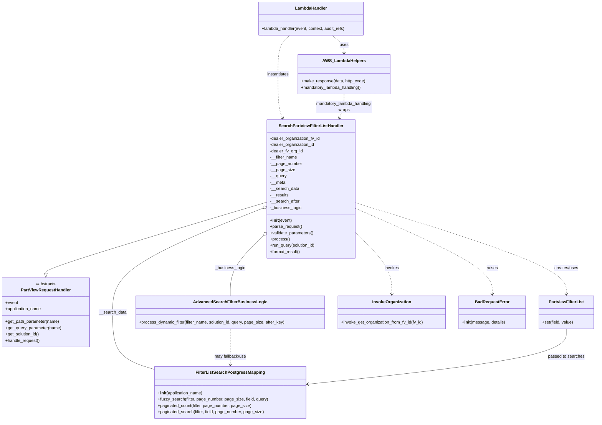

# Diagram: partview_core/partview_service/partview_service/api/search/search_filter_list.py

> Auto-generated by Obscura crawlers

## Mermaid

### SVG

<svg id="container" width="2249.6640625" xmlns="http://www.w3.org/2000/svg" class="classDiagram" height="1602" viewBox="0 0 2249.6640625 1602" role="graphics-document document" aria-roledescription="class"><g><defs><marker id="container_class-aggregationStart" class="marker aggregation class" refX="18" refY="7" markerWidth="190" markerHeight="240" orient="auto"><path d="M 18,7 L9,13 L1,7 L9,1 Z"></path></marker></defs><defs><marker id="container_class-aggregationEnd" class="marker aggregation class" refX="1" refY="7" markerWidth="20" markerHeight="28" orient="auto"><path d="M 18,7 L9,13 L1,7 L9,1 Z"></path></marker></defs><defs><marker id="container_class-extensionStart" class="marker extension class" refX="18" refY="7" markerWidth="190" markerHeight="240" orient="auto"><path d="M 1,7 L18,13 V 1 Z"></path></marker></defs><defs><marker id="container_class-extensionEnd" class="marker extension class" refX="1" refY="7" markerWidth="20" markerHeight="28" orient="auto"><path d="M 1,1 V 13 L18,7 Z"></path></marker></defs><defs><marker id="container_class-compositionStart" class="marker composition class" refX="18" refY="7" markerWidth="190" markerHeight="240" orient="auto"><path d="M 18,7 L9,13 L1,7 L9,1 Z"></path></marker></defs><defs><marker id="container_class-compositionEnd" class="marker composition class" refX="1" refY="7" markerWidth="20" markerHeight="28" orient="auto"><path d="M 18,7 L9,13 L1,7 L9,1 Z"></path></marker></defs><defs><marker id="container_class-dependencyStart" class="marker dependency class" refX="6" refY="7" markerWidth="190" markerHeight="240" orient="auto"><path d="M 5,7 L9,13 L1,7 L9,1 Z"></path></marker></defs><defs><marker id="container_class-dependencyEnd" class="marker dependency class" refX="13" refY="7" markerWidth="20" markerHeight="28" orient="auto"><path d="M 18,7 L9,13 L14,7 L9,1 Z"></path></marker></defs><defs><marker id="container_class-lollipopStart" class="marker lollipop class" refX="13" refY="7" markerWidth="190" markerHeight="240" orient="auto"><circle stroke="black" fill="transparent" cx="7" cy="7" r="6"></circle></marker></defs><defs><marker id="container_class-lollipopEnd" class="marker lollipop class" refX="1" refY="7" markerWidth="190" markerHeight="240" orient="auto"><circle stroke="black" fill="transparent" cx="7" cy="7" r="6"></circle></marker></defs><g class="root"><g class="clusters"></g><g class="edgePaths"><path d="M1007.107,770.278L868.049,812.065C728.991,853.852,450.874,937.426,311.816,982.505C172.758,1027.583,172.758,1034.167,172.758,1037.458L172.758,1040.75" id="id_SearchPartviewFilterListHandler_PartViewRequestHandler_1" class="edge-thickness-normal edge-pattern-solid relation" style=";;;" data-edge="true" data-et="edge" data-id="id_SearchPartviewFilterListHandler_PartViewRequestHandler_1" data-points="W3sieCI6MTAwNy4xMDc0MjE4NzUsInkiOjc3MC4yNzg0NzM1NTg3MDAxfSx7IngiOjE3Mi43NTc4MTI1LCJ5IjoxMDIxfSx7IngiOjE3Mi43NTc4MTI1LCJ5IjoxMDU4fV0=" marker-end="url(#container_class-extensionEnd)"></path><path d="M991.1,793.611L896.717,831.51C802.335,869.408,613.57,945.204,519.187,1011.269C424.805,1077.333,424.805,1133.667,424.805,1190C424.805,1246.333,424.805,1302.667,451.657,1339.063C478.509,1375.459,532.214,1391.919,559.066,1400.149L585.918,1408.378" id="id_SearchPartviewFilterListHandler_FilterListSearchPostgressMapping_2" class="edge-thickness-normal edge-pattern-solid relation" style=";;;" data-edge="true" data-et="edge" data-id="id_SearchPartviewFilterListHandler_FilterListSearchPostgressMapping_2" data-points="W3sieCI6MTAwNy4xMDc0MjE4NzUsInkiOjc4Ny4xODM3Njc3OTg3NTJ9LHsieCI6NDI0LjgwNDY4NzUsInkiOjEwMjF9LHsieCI6NDI0LjgwNDY4NzUsInkiOjExOTB9LHsieCI6NDI0LjgwNDY4NzUsInkiOjEzNTl9LHsieCI6NTg1LjkxNzk2ODc1LCJ5IjoxNDA4LjM3ODI1MTU2OTExNn1d" marker-start="url(#container_class-aggregationStart)"></path><path d="M994.812,896.75L973.769,917.458C952.725,938.167,910.638,979.583,889.594,1017.958C868.551,1056.333,868.551,1091.667,868.551,1109.333L868.551,1127" id="id_SearchPartviewFilterListHandler_AdvancedSearchFilterBusinessLogic_3" class="edge-thickness-normal edge-pattern-solid relation" style=";;;" data-edge="true" data-et="edge" data-id="id_SearchPartviewFilterListHandler_AdvancedSearchFilterBusinessLogic_3" data-points="W3sieCI6MTAwNy4xMDc0MjE4NzUsInkiOjg4NC42NTA3ODgyNzg5NDAyfSx7IngiOjg2OC41NTA3ODEyNSwieSI6MTAyMX0seyJ4Ijo4NjguNTUwNzgxMjUsInkiOjExMjd9XQ==" marker-start="url(#container_class-aggregationStart)"></path><path d="M1341.74,772.267L1474.448,813.722C1607.155,855.178,1872.57,938.089,2005.277,996.211C2137.984,1054.333,2137.984,1087.667,2137.984,1104.333L2137.984,1121" id="id_SearchPartviewFilterListHandler_PartviewFilterList_4" class="edge-thickness-normal edge-pattern-dashed relation" style=";;;" data-edge="true" data-et="edge" data-id="id_SearchPartviewFilterListHandler_PartviewFilterList_4" data-points="W3sieCI6MTM0MS43NDAyMzQzNzUsInkiOjc3Mi4yNjY4MTIzMzk0ODh9LHsieCI6MjEzNy45ODQzNzUsInkiOjEwMjF9LHsieCI6MjEzNy45ODQzNzUsInkiOjExMjd9XQ==" marker-end="url(#container_class-dependencyEnd)"></path><path d="M1341.74,884.651L1364.833,907.376C1387.926,930.101,1434.111,975.55,1457.204,1014.942C1480.297,1054.333,1480.297,1087.667,1480.297,1104.333L1480.297,1121" id="id_SearchPartviewFilterListHandler_InvokeOrganization_5" class="edge-thickness-normal edge-pattern-dashed relation" style=";;;" data-edge="true" data-et="edge" data-id="id_SearchPartviewFilterListHandler_InvokeOrganization_5" data-points="W3sieCI6MTM0MS43NDAyMzQzNzUsInkiOjg4NC42NTA3ODgyNzg5NDAyfSx7IngiOjE0ODAuMjk2ODc1LCJ5IjoxMDIxfSx7IngiOjE0ODAuMjk2ODc1LCJ5IjoxMTI3fV0=" marker-end="url(#container_class-dependencyEnd)"></path><path d="M1341.74,793.466L1428.108,831.388C1514.475,869.31,1687.21,945.155,1773.578,999.744C1859.945,1054.333,1859.945,1087.667,1859.945,1104.333L1859.945,1121" id="id_SearchPartviewFilterListHandler_BadRequestError_6" class="edge-thickness-normal edge-pattern-dashed relation" style=";;;" data-edge="true" data-et="edge" data-id="id_SearchPartviewFilterListHandler_BadRequestError_6" data-points="W3sieCI6MTM0MS43NDAyMzQzNzUsInkiOjc5My40NjU1ODcwNDQ1MzQ1fSx7IngiOjE4NTkuOTQ1MzEyNSwieSI6MTAyMX0seyJ4IjoxODU5Ljk0NTMxMjUsInkiOjExMjd9XQ==" marker-end="url(#container_class-dependencyEnd)"></path><path d="M1095.232,134L1087.481,140.167C1079.729,146.333,1064.226,158.667,1056.474,183.5C1048.723,208.333,1048.723,245.667,1048.723,285C1048.723,324.333,1048.723,365.667,1051.63,393.572C1054.537,421.477,1060.351,435.955,1063.258,443.194L1066.165,450.432" id="id_LambdaHandler_SearchPartviewFilterListHandler_7" class="edge-thickness-normal edge-pattern-dashed relation" style=";;;" data-edge="true" data-et="edge" data-id="id_LambdaHandler_SearchPartviewFilterListHandler_7" data-points="W3sieCI6MTA5NS4yMzIwODk4NDM3NSwieSI6MTM0fSx7IngiOjEwNDguNzIyNjU2MjUsInkiOjE3MX0seyJ4IjoxMDQ4LjcyMjY1NjI1LCJ5IjoyODN9LHsieCI6MTA0OC43MjI2NTYyNSwieSI6NDA3fSx7IngiOjEwNjguNDAxMTE0NDY2ODUzLCJ5Ijo0NTZ9XQ==" marker-end="url(#container_class-dependencyEnd)"></path><path d="M1253.616,134L1261.367,140.167C1269.119,146.333,1284.622,158.667,1292.373,170C1300.125,181.333,1300.125,191.667,1300.125,196.833L1300.125,202" id="id_LambdaHandler_AWS_LambdaHelpers_8" class="edge-thickness-normal edge-pattern-dashed relation" style=";;;" data-edge="true" data-et="edge" data-id="id_LambdaHandler_AWS_LambdaHelpers_8" data-points="W3sieCI6MTI1My42MTU1NjY0MDYyNSwieSI6MTM0fSx7IngiOjEzMDAuMTI1LCJ5IjoxNzF9LHsieCI6MTMwMC4xMjUsInkiOjIwOH1d" marker-end="url(#container_class-dependencyEnd)"></path><path d="M1300.125,358L1300.125,366.167C1300.125,374.333,1300.125,390.667,1297.218,406.072C1294.311,421.477,1288.497,435.955,1285.59,443.194L1282.683,450.432" id="id_AWS_LambdaHelpers_SearchPartviewFilterListHandler_9" class="edge-thickness-normal edge-pattern-dashed relation" style=";;;" data-edge="true" data-et="edge" data-id="id_AWS_LambdaHelpers_SearchPartviewFilterListHandler_9" data-points="W3sieCI6MTMwMC4xMjUsInkiOjM1OH0seyJ4IjoxMzAwLjEyNSwieSI6NDA3fSx7IngiOjEyODAuNDQ2NTQxNzgzMTQ3LCJ5Ijo0NTZ9XQ==" marker-end="url(#container_class-dependencyEnd)"></path><path d="M868.551,1253L868.551,1270.667C868.551,1288.333,868.551,1323.667,868.551,1346.5C868.551,1369.333,868.551,1379.667,868.551,1384.833L868.551,1390" id="id_AdvancedSearchFilterBusinessLogic_FilterListSearchPostgressMapping_10" class="edge-thickness-normal edge-pattern-dashed relation" style=";;;" data-edge="true" data-et="edge" data-id="id_AdvancedSearchFilterBusinessLogic_FilterListSearchPostgressMapping_10" data-points="W3sieCI6ODY4LjU1MDc4MTI1LCJ5IjoxMjUzfSx7IngiOjg2OC41NTA3ODEyNSwieSI6MTM1OX0seyJ4Ijo4NjguNTUwNzgxMjUsInkiOjEzOTZ9XQ==" marker-end="url(#container_class-dependencyEnd)"></path><path d="M2137.984,1253L2137.984,1270.667C2137.984,1288.333,2137.984,1323.667,1974.512,1358.847C1811.039,1394.027,1484.094,1429.054,1320.622,1446.568L1157.149,1464.081" id="id_PartviewFilterList_FilterListSearchPostgressMapping_11" class="edge-thickness-normal edge-pattern-solid relation" style=";;;" data-edge="true" data-et="edge" data-id="id_PartviewFilterList_FilterListSearchPostgressMapping_11" data-points="W3sieCI6MjEzNy45ODQzNzUsInkiOjEyNTN9LHsieCI6MjEzNy45ODQzNzUsInkiOjEzNTl9LHsieCI6MTE1MS4xODM1OTM3NSwieSI6MTQ2NC43MjAzMDQ2Mzg4MTgzfV0=" marker-end="url(#container_class-dependencyEnd)"></path></g><g class="edgeLabels"><g class="edgeLabel"><g class="label" data-id="id_SearchPartviewFilterListHandler_PartViewRequestHandler_1" transform="translate(0, 0)"><foreignObject width="0" height="0">

</foreignObject></g></g><g class="edgeLabel" transform="translate(424.8046875, 1190)"><g class="label" data-id="id_SearchPartviewFilterListHandler_FilterListSearchPostgressMapping_2" transform="translate(-52.2890625, -12)"><foreignObject width="104.578125" height="24">

__search_data

</foreignObject></g></g><g class="edgeLabel" transform="translate(868.55078125, 1021)"><g class="label" data-id="id_SearchPartviewFilterListHandler_AdvancedSearchFilterBusinessLogic_3" transform="translate(-57.140625, -12)"><foreignObject width="114.28125" height="24">

_business_logic

</foreignObject></g></g><g class="edgeLabel" transform="translate(2137.984375, 1021)"><g class="label" data-id="id_SearchPartviewFilterListHandler_PartviewFilterList_4" transform="translate(-46.578125, -12)"><foreignObject width="93.15625" height="24">

creates/uses

</foreignObject></g></g><g class="edgeLabel" transform="translate(1480.296875, 1021)"><g class="label" data-id="id_SearchPartviewFilterListHandler_InvokeOrganization_5" transform="translate(-27.5859375, -12)"><foreignObject width="55.171875" height="24">

invokes

</foreignObject></g></g><g class="edgeLabel" transform="translate(1859.9453125, 1021)"><g class="label" data-id="id_SearchPartviewFilterListHandler_BadRequestError_6" transform="translate(-21.25, -12)"><foreignObject width="42.5" height="24">

raises

</foreignObject></g></g><g class="edgeLabel" transform="translate(1048.72265625, 283)"><g class="label" data-id="id_LambdaHandler_SearchPartviewFilterListHandler_7" transform="translate(-42.9140625, -12)"><foreignObject width="85.828125" height="24">

instantiates

</foreignObject></g></g><g class="edgeLabel" transform="translate(1300.125, 171)"><g class="label" data-id="id_LambdaHandler_AWS_LambdaHelpers_8" transform="translate(-16.4921875, -12)"><foreignObject width="32.984375" height="24">

uses

</foreignObject></g></g><g class="edgeLabel" transform="translate(1300.125, 407)"><g class="label" data-id="id_AWS_LambdaHelpers_SearchPartviewFilterListHandler_9" transform="translate(-108.9765625, -24)"><foreignObject width="217.953125" height="48">

mandatory_lambda_handling wraps

</foreignObject></g></g><g class="edgeLabel" transform="translate(868.55078125, 1359)"><g class="label" data-id="id_AdvancedSearchFilterBusinessLogic_FilterListSearchPostgressMapping_10" transform="translate(-62.2265625, -12)"><foreignObject width="124.453125" height="24">

may fallback/use

</foreignObject></g></g><g class="edgeLabel" transform="translate(2137.984375, 1359)"><g class="label" data-id="id_PartviewFilterList_FilterListSearchPostgressMapping_11" transform="translate(-68.984375, -12)"><foreignObject width="137.96875" height="24">

passed to searches

</foreignObject></g></g></g><g class="nodes"><g class="node default" id="classId-PartViewRequestHandler-0" transform="translate(172.7578125, 1190)"><g class="basic label-container"><path d="M-164.7578125 -132 L164.7578125 -132 L164.7578125 132 L-164.7578125 132" stroke="none" stroke-width="0" fill="#ECECFF" style=""></path><path d="M-164.7578125 -132 C-37.31267001752026 -132, 90.13247246495948 -132, 164.7578125 -132 M-164.7578125 -132 C-91.45588189539755 -132, -18.153951290795106 -132, 164.7578125 -132 M164.7578125 -132 C164.7578125 -49.99840237595255, 164.7578125 32.0031952480949, 164.7578125 132 M164.7578125 -132 C164.7578125 -62.69136577697846, 164.7578125 6.617268446043084, 164.7578125 132 M164.7578125 132 C36.94105713509184 132, -90.87569822981632 132, -164.7578125 132 M164.7578125 132 C36.72929425204464 132, -91.29922399591072 132, -164.7578125 132 M-164.7578125 132 C-164.7578125 46.837229717653685, -164.7578125 -38.32554056469263, -164.7578125 -132 M-164.7578125 132 C-164.7578125 49.26514252933032, -164.7578125 -33.46971494133936, -164.7578125 -132" stroke="#9370DB" stroke-width="1.3" fill="none" stroke-dasharray="0 0" style=""></path></g><g class="annotation-group text" transform="translate(-38.609375, -108)"><g class="label" style="" transform="translate(0,-12)"><foreignObject width="77.21875" height="24">

«abstract»

</foreignObject></g></g><g class="label-group text" transform="translate(-91.359375, -84)"><g class="label" style="font-weight: bolder" transform="translate(0,-12)"><foreignObject width="182.71875" height="24">

PartViewRequestHandler

</foreignObject></g></g><g class="members-group text" transform="translate(-152.7578125, -36)"><g class="label" style="" transform="translate(0,-12)"><foreignObject width="48.328125" height="24">

+event

</foreignObject></g><g class="label" style="" transform="translate(0,12)"><foreignObject width="138.703125" height="24">

+application_name

</foreignObject></g></g><g class="methods-group text" transform="translate(-152.7578125, 36)"><g class="label" style="" transform="translate(0,-12)"><foreignObject width="206.5" height="24">

+get_path_parameter(name)

</foreignObject></g><g class="label" style="" transform="translate(0,12)"><foreignObject width="214.15625" height="24">

+get_query_parameter(name)

</foreignObject></g><g class="label" style="" transform="translate(0,36)"><foreignObject width="131.46875" height="24">

+get_solution_id()

</foreignObject></g><g class="label" style="" transform="translate(0,60)"><foreignObject width="131.96875" height="24">

+handle_request()

</foreignObject></g></g><g class="divider" style=""><path d="M-164.7578125 -60 C-58.95531382388616 -60, 46.847184852227684 -60, 164.7578125 -60 M-164.7578125 -60 C-78.91198426282861 -60, 6.933843974342778 -60, 164.7578125 -60" stroke="#9370DB" stroke-width="1.3" fill="none" stroke-dasharray="0 0" style=""></path></g><g class="divider" style=""><path d="M-164.7578125 12 C-89.95748366368207 12, -15.157154827364138 12, 164.7578125 12 M-164.7578125 12 C-82.70308758372266 12, -0.6483626674453262 12, 164.7578125 12" stroke="#9370DB" stroke-width="1.3" fill="none" stroke-dasharray="0 0" style=""></path></g></g><g class="node default" id="classId-SearchPartviewFilterListHandler-1" transform="translate(1174.423828125, 720)"><g class="basic label-container"><path d="M-167.31640625 -264 L167.31640625 -264 L167.31640625 264 L-167.31640625 264" stroke="none" stroke-width="0" fill="#ECECFF" style=""></path><path d="M-167.31640625 -264 C-37.15124371762067 -264, 93.01391881475865 -264, 167.31640625 -264 M-167.31640625 -264 C-78.27257819540645 -264, 10.771249859187094 -264, 167.31640625 -264 M167.31640625 -264 C167.31640625 -87.54486874979207, 167.31640625 88.91026250041585, 167.31640625 264 M167.31640625 -264 C167.31640625 -137.62037524124224, 167.31640625 -11.240750482484486, 167.31640625 264 M167.31640625 264 C73.3013016364612 264, -20.71380297707759 264, -167.31640625 264 M167.31640625 264 C75.28402242945657 264, -16.74836139108686 264, -167.31640625 264 M-167.31640625 264 C-167.31640625 146.346244107774, -167.31640625 28.692488215547996, -167.31640625 -264 M-167.31640625 264 C-167.31640625 78.03716203567677, -167.31640625 -107.92567592864646, -167.31640625 -264" stroke="#9370DB" stroke-width="1.3" fill="none" stroke-dasharray="0 0" style=""></path></g><g class="annotation-group text" transform="translate(0, -240)"></g><g class="label-group text" transform="translate(-117.7734375, -240)"><g class="label" style="font-weight: bolder" transform="translate(0,-12)"><foreignObject width="235.546875" height="24">

SearchPartviewFilterListHandler

</foreignObject></g></g><g class="members-group text" transform="translate(-155.31640625, -192)"><g class="label" style="" transform="translate(0,-12)"><foreignObject width="192.859375" height="24">

-dealer_organization_fv_id

</foreignObject></g><g class="label" style="" transform="translate(0,12)"><foreignObject width="172.109375" height="24">

-dealer_organization_id

</foreignObject></g><g class="label" style="" transform="translate(0,36)"><foreignObject width="126.171875" height="24">

-dealer_fv_org_id

</foreignObject></g><g class="label" style="" transform="translate(0,60)"><foreignObject width="103.203125" height="24">

-__filter_name

</foreignObject></g><g class="label" style="" transform="translate(0,84)"><foreignObject width="121.125" height="24">

-__page_number

</foreignObject></g><g class="label" style="" transform="translate(0,108)"><foreignObject width="91.90625" height="24">

-__page_size

</foreignObject></g><g class="label" style="" transform="translate(0,132)"><foreignObject width="62.984375" height="24">

-__query

</foreignObject></g><g class="label" style="" transform="translate(0,156)"><foreignObject width="58.453125" height="24">

-__meta

</foreignObject></g><g class="label" style="" transform="translate(0,180)"><foreignObject width="109.75" height="24">

-__search_data

</foreignObject></g><g class="label" style="" transform="translate(0,204)"><foreignObject width="70.796875" height="24">

-__results

</foreignObject></g><g class="label" style="" transform="translate(0,228)"><foreignObject width="111.609375" height="24">

-__search_after

</foreignObject></g><g class="label" style="" transform="translate(0,252)"><foreignObject width="119.453125" height="24">

-_business_logic

</foreignObject></g></g><g class="methods-group text" transform="translate(-155.31640625, 120)"><g class="label" style="" transform="translate(0,-12)"><foreignObject width="83.140625" height="24">

+<strong>init</strong>(event)

</foreignObject></g><g class="label" style="" transform="translate(0,12)"><foreignObject width="121.796875" height="24">

+parse_request()

</foreignObject></g><g class="label" style="" transform="translate(0,36)"><foreignObject width="166.546875" height="24">

+validate_parameters()

</foreignObject></g><g class="label" style="" transform="translate(0,60)"><foreignObject width="73.734375" height="24">

+process()

</foreignObject></g><g class="label" style="" transform="translate(0,84)"><foreignObject width="175.09375" height="24">

+run_query(solution_id)

</foreignObject></g><g class="label" style="" transform="translate(0,108)"><foreignObject width="117.015625" height="24">

+format_result()

</foreignObject></g></g><g class="divider" style=""><path d="M-167.31640625 -216 C-92.42136491341095 -216, -17.52632357682191 -216, 167.31640625 -216 M-167.31640625 -216 C-52.22859824678102 -216, 62.85920975643796 -216, 167.31640625 -216" stroke="#9370DB" stroke-width="1.3" fill="none" stroke-dasharray="0 0" style=""></path></g><g class="divider" style=""><path d="M-167.31640625 96 C-97.61444043595625 96, -27.91247462191251 96, 167.31640625 96 M-167.31640625 96 C-51.60990932876082 96, 64.09658759247836 96, 167.31640625 96" stroke="#9370DB" stroke-width="1.3" fill="none" stroke-dasharray="0 0" style=""></path></g></g><g class="node default" id="classId-FilterListSearchPostgressMapping-2" transform="translate(868.55078125, 1495)"><g class="basic label-container"><path d="M-282.6328125 -99 L282.6328125 -99 L282.6328125 99 L-282.6328125 99" stroke="none" stroke-width="0" fill="#ECECFF" style=""></path><path d="M-282.6328125 -99 C-128.08618618505943 -99, 26.460440129881135 -99, 282.6328125 -99 M-282.6328125 -99 C-93.14389335857109 -99, 96.34502578285782 -99, 282.6328125 -99 M282.6328125 -99 C282.6328125 -34.30451705384718, 282.6328125 30.390965892305644, 282.6328125 99 M282.6328125 -99 C282.6328125 -44.12720860806006, 282.6328125 10.745582783879883, 282.6328125 99 M282.6328125 99 C58.23981720643292 99, -166.15317808713417 99, -282.6328125 99 M282.6328125 99 C93.68496523696089 99, -95.26288202607822 99, -282.6328125 99 M-282.6328125 99 C-282.6328125 45.460326343614106, -282.6328125 -8.079347312771787, -282.6328125 -99 M-282.6328125 99 C-282.6328125 25.333222437981988, -282.6328125 -48.333555124036025, -282.6328125 -99" stroke="#9370DB" stroke-width="1.3" fill="none" stroke-dasharray="0 0" style=""></path></g><g class="annotation-group text" transform="translate(0, -75)"></g><g class="label-group text" transform="translate(-123.921875, -75)"><g class="label" style="font-weight: bolder" transform="translate(0,-12)"><foreignObject width="247.84375" height="24">

FilterListSearchPostgressMapping

</foreignObject></g></g><g class="members-group text" transform="translate(-270.6328125, -27)"></g><g class="methods-group text" transform="translate(-270.6328125, 3)"><g class="label" style="" transform="translate(0,-12)"><foreignObject width="173.734375" height="24">

+<strong>init</strong>(application_name)

</foreignObject></g><g class="label" style="" transform="translate(0,12)"><foreignObject width="417.34375" height="24">

+fuzzy_search(filter, page_number, page_size, field, query)

</foreignObject></g><g class="label" style="" transform="translate(0,36)"><foreignObject width="357.765625" height="24">

+paginated_count(filter, page_number, page_size)

</foreignObject></g><g class="label" style="" transform="translate(0,60)"><foreignObject width="404.578125" height="24">

+paginated_search(filter, field, page_number, page_size)

</foreignObject></g></g><g class="divider" style=""><path d="M-282.6328125 -51 C-162.82211486961455 -51, -43.01141723922913 -51, 282.6328125 -51 M-282.6328125 -51 C-132.76543601515434 -51, 17.10194046969133 -51, 282.6328125 -51" stroke="#9370DB" stroke-width="1.3" fill="none" stroke-dasharray="0 0" style=""></path></g><g class="divider" style=""><path d="M-282.6328125 -27 C-105.5168464068096 -27, 71.59911968638079 -27, 282.6328125 -27 M-282.6328125 -27 C-125.25641637359891 -27, 32.11997975280218 -27, 282.6328125 -27" stroke="#9370DB" stroke-width="1.3" fill="none" stroke-dasharray="0 0" style=""></path></g></g><g class="node default" id="classId-AdvancedSearchFilterBusinessLogic-3" transform="translate(868.55078125, 1190)"><g class="basic label-container"><path d="M-356.45703125 -63 L356.45703125 -63 L356.45703125 63 L-356.45703125 63" stroke="none" stroke-width="0" fill="#ECECFF" style=""></path><path d="M-356.45703125 -63 C-210.38307573580252 -63, -64.30912022160504 -63, 356.45703125 -63 M-356.45703125 -63 C-170.13155303612868 -63, 16.193925177742642 -63, 356.45703125 -63 M356.45703125 -63 C356.45703125 -23.22987865515644, 356.45703125 16.54024268968712, 356.45703125 63 M356.45703125 -63 C356.45703125 -36.92944909313392, 356.45703125 -10.858898186267837, 356.45703125 63 M356.45703125 63 C126.41461378754562 63, -103.62780367490876 63, -356.45703125 63 M356.45703125 63 C77.64081344397601 63, -201.17540436204797 63, -356.45703125 63 M-356.45703125 63 C-356.45703125 18.940210969474172, -356.45703125 -25.119578061051655, -356.45703125 -63 M-356.45703125 63 C-356.45703125 36.32925353052974, -356.45703125 9.658507061059474, -356.45703125 -63" stroke="#9370DB" stroke-width="1.3" fill="none" stroke-dasharray="0 0" style=""></path></g><g class="annotation-group text" transform="translate(0, -39)"></g><g class="label-group text" transform="translate(-130.3203125, -39)"><g class="label" style="font-weight: bolder" transform="translate(0,-12)"><foreignObject width="260.640625" height="24">

AdvancedSearchFilterBusinessLogic

</foreignObject></g></g><g class="members-group text" transform="translate(-344.45703125, 9)"></g><g class="methods-group text" transform="translate(-344.45703125, 39)"><g class="label" style="" transform="translate(0,-12)"><foreignObject width="558.59375" height="24">

+process_dynamic_filter(filter_name, solution_id, query, page_size, after_key)

</foreignObject></g></g><g class="divider" style=""><path d="M-356.45703125 -15 C-184.23592153784244 -15, -12.014811825684887 -15, 356.45703125 -15 M-356.45703125 -15 C-113.39869526597795 -15, 129.6596407180441 -15, 356.45703125 -15" stroke="#9370DB" stroke-width="1.3" fill="none" stroke-dasharray="0 0" style=""></path></g><g class="divider" style=""><path d="M-356.45703125 9 C-94.12615380158866 9, 168.20472364682269 9, 356.45703125 9 M-356.45703125 9 C-132.8627116252988 9, 90.7316079994024 9, 356.45703125 9" stroke="#9370DB" stroke-width="1.3" fill="none" stroke-dasharray="0 0" style=""></path></g></g><g class="node default" id="classId-PartviewFilterList-4" transform="translate(2137.984375, 1190)"><g class="basic label-container"><path d="M-103.6796875 -63 L103.6796875 -63 L103.6796875 63 L-103.6796875 63" stroke="none" stroke-width="0" fill="#ECECFF" style=""></path><path d="M-103.6796875 -63 C-32.27745136472818 -63, 39.12478477054364 -63, 103.6796875 -63 M-103.6796875 -63 C-47.36286922304871 -63, 8.953949053902576 -63, 103.6796875 -63 M103.6796875 -63 C103.6796875 -31.69068922389578, 103.6796875 -0.3813784477915618, 103.6796875 63 M103.6796875 -63 C103.6796875 -29.460839990242654, 103.6796875 4.078320019514692, 103.6796875 63 M103.6796875 63 C33.27506359049413 63, -37.129560319011745 63, -103.6796875 63 M103.6796875 63 C26.56660343609215 63, -50.5464806278157 63, -103.6796875 63 M-103.6796875 63 C-103.6796875 29.222754090334952, -103.6796875 -4.554491819330096, -103.6796875 -63 M-103.6796875 63 C-103.6796875 30.213639392217864, -103.6796875 -2.572721215564272, -103.6796875 -63" stroke="#9370DB" stroke-width="1.3" fill="none" stroke-dasharray="0 0" style=""></path></g><g class="annotation-group text" transform="translate(0, -39)"></g><g class="label-group text" transform="translate(-63.96875, -39)"><g class="label" style="font-weight: bolder" transform="translate(0,-12)"><foreignObject width="127.9375" height="24">

PartviewFilterList

</foreignObject></g></g><g class="members-group text" transform="translate(-91.6796875, 9)"></g><g class="methods-group text" transform="translate(-91.6796875, 39)"><g class="label" style="" transform="translate(0,-12)"><foreignObject width="119.390625" height="24">

+set(field, value)

</foreignObject></g></g><g class="divider" style=""><path d="M-103.6796875 -15 C-44.34471342647685 -15, 14.990260647046298 -15, 103.6796875 -15 M-103.6796875 -15 C-54.64632112013262 -15, -5.612954740265238 -15, 103.6796875 -15" stroke="#9370DB" stroke-width="1.3" fill="none" stroke-dasharray="0 0" style=""></path></g><g class="divider" style=""><path d="M-103.6796875 9 C-46.25885733896802 9, 11.161972822063959 9, 103.6796875 9 M-103.6796875 9 C-47.469361290671706 9, 8.740964918656587 9, 103.6796875 9" stroke="#9370DB" stroke-width="1.3" fill="none" stroke-dasharray="0 0" style=""></path></g></g><g class="node default" id="classId-InvokeOrganization-5" transform="translate(1480.296875, 1190)"><g class="basic label-container"><path d="M-205.2890625 -63 L205.2890625 -63 L205.2890625 63 L-205.2890625 63" stroke="none" stroke-width="0" fill="#ECECFF" style=""></path><path d="M-205.2890625 -63 C-71.07393468370816 -63, 63.14119313258368 -63, 205.2890625 -63 M-205.2890625 -63 C-107.15736890035828 -63, -9.025675300716557 -63, 205.2890625 -63 M205.2890625 -63 C205.2890625 -20.152441649292342, 205.2890625 22.695116701415316, 205.2890625 63 M205.2890625 -63 C205.2890625 -18.632285892028335, 205.2890625 25.73542821594333, 205.2890625 63 M205.2890625 63 C112.92173517856907 63, 20.55440785713813 63, -205.2890625 63 M205.2890625 63 C77.95685226856544 63, -49.37535796286912 63, -205.2890625 63 M-205.2890625 63 C-205.2890625 37.43020542747848, -205.2890625 11.860410854956953, -205.2890625 -63 M-205.2890625 63 C-205.2890625 28.646283398218152, -205.2890625 -5.707433203563696, -205.2890625 -63" stroke="#9370DB" stroke-width="1.3" fill="none" stroke-dasharray="0 0" style=""></path></g><g class="annotation-group text" transform="translate(0, -39)"></g><g class="label-group text" transform="translate(-71.046875, -39)"><g class="label" style="font-weight: bolder" transform="translate(0,-12)"><foreignObject width="142.09375" height="24">

InvokeOrganization

</foreignObject></g></g><g class="members-group text" transform="translate(-193.2890625, 9)"></g><g class="methods-group text" transform="translate(-193.2890625, 39)"><g class="label" style="" transform="translate(0,-12)"><foreignObject width="315.53125" height="24">

+invoke_get_organization_from_fv_id(fv_id)

</foreignObject></g></g><g class="divider" style=""><path d="M-205.2890625 -15 C-113.03992170255312 -15, -20.79078090510623 -15, 205.2890625 -15 M-205.2890625 -15 C-52.124795935924 -15, 101.039470628152 -15, 205.2890625 -15" stroke="#9370DB" stroke-width="1.3" fill="none" stroke-dasharray="0 0" style=""></path></g><g class="divider" style=""><path d="M-205.2890625 9 C-100.87897230631285 9, 3.5311178873743074 9, 205.2890625 9 M-205.2890625 9 C-109.31021380189632 9, -13.331365103792649 9, 205.2890625 9" stroke="#9370DB" stroke-width="1.3" fill="none" stroke-dasharray="0 0" style=""></path></g></g><g class="node default" id="classId-BadRequestError-6" transform="translate(1859.9453125, 1190)"><g class="basic label-container"><path d="M-124.359375 -63 L124.359375 -63 L124.359375 63 L-124.359375 63" stroke="none" stroke-width="0" fill="#ECECFF" style=""></path><path d="M-124.359375 -63 C-55.407685459187306 -63, 13.544004081625388 -63, 124.359375 -63 M-124.359375 -63 C-74.23054235053596 -63, -24.101709701071897 -63, 124.359375 -63 M124.359375 -63 C124.359375 -31.67865277512672, 124.359375 -0.357305550253443, 124.359375 63 M124.359375 -63 C124.359375 -29.462445222919307, 124.359375 4.075109554161386, 124.359375 63 M124.359375 63 C60.804278721896964 63, -2.750817556206073 63, -124.359375 63 M124.359375 63 C73.04613998350732 63, 21.732904967014633 63, -124.359375 63 M-124.359375 63 C-124.359375 13.423653656934782, -124.359375 -36.152692686130436, -124.359375 -63 M-124.359375 63 C-124.359375 14.157492864748114, -124.359375 -34.68501427050377, -124.359375 -63" stroke="#9370DB" stroke-width="1.3" fill="none" stroke-dasharray="0 0" style=""></path></g><g class="annotation-group text" transform="translate(0, -39)"></g><g class="label-group text" transform="translate(-62.28125, -39)"><g class="label" style="font-weight: bolder" transform="translate(0,-12)"><foreignObject width="124.5625" height="24">

BadRequestError

</foreignObject></g></g><g class="members-group text" transform="translate(-112.359375, 9)"></g><g class="methods-group text" transform="translate(-112.359375, 39)"><g class="label" style="" transform="translate(0,-12)"><foreignObject width="162.4375" height="24">

+<strong>init</strong>(message, details)

</foreignObject></g></g><g class="divider" style=""><path d="M-124.359375 -15 C-61.457515920531456 -15, 1.4443431589370874 -15, 124.359375 -15 M-124.359375 -15 C-37.87532963450569 -15, 48.60871573098862 -15, 124.359375 -15" stroke="#9370DB" stroke-width="1.3" fill="none" stroke-dasharray="0 0" style=""></path></g><g class="divider" style=""><path d="M-124.359375 9 C-32.03625497886874 9, 60.28686504226252 9, 124.359375 9 M-124.359375 9 C-25.103026174060957 9, 74.15332265187809 9, 124.359375 9" stroke="#9370DB" stroke-width="1.3" fill="none" stroke-dasharray="0 0" style=""></path></g></g><g class="node default" id="classId-AWS_LambdaHelpers-7" transform="translate(1300.125, 283)"><g class="basic label-container"><path d="M-173.48828125 -75 L173.48828125 -75 L173.48828125 75 L-173.48828125 75" stroke="none" stroke-width="0" fill="#ECECFF" style=""></path><path d="M-173.48828125 -75 C-40.57428863551078 -75, 92.33970397897843 -75, 173.48828125 -75 M-173.48828125 -75 C-84.81754785074706 -75, 3.853185548505877 -75, 173.48828125 -75 M173.48828125 -75 C173.48828125 -18.538590114781186, 173.48828125 37.92281977043763, 173.48828125 75 M173.48828125 -75 C173.48828125 -32.631624510631674, 173.48828125 9.736750978736652, 173.48828125 75 M173.48828125 75 C40.43641899904375 75, -92.6154432519125 75, -173.48828125 75 M173.48828125 75 C99.06259855321572 75, 24.636915856431443 75, -173.48828125 75 M-173.48828125 75 C-173.48828125 23.584122150347582, -173.48828125 -27.831755699304836, -173.48828125 -75 M-173.48828125 75 C-173.48828125 43.738610665799065, -173.48828125 12.47722133159813, -173.48828125 -75" stroke="#9370DB" stroke-width="1.3" fill="none" stroke-dasharray="0 0" style=""></path></g><g class="annotation-group text" transform="translate(0, -51)"></g><g class="label-group text" transform="translate(-77.3359375, -51)"><g class="label" style="font-weight: bolder" transform="translate(0,-12)"><foreignObject width="154.671875" height="24">

AWS_LambdaHelpers

</foreignObject></g></g><g class="members-group text" transform="translate(-161.48828125, -3)"></g><g class="methods-group text" transform="translate(-161.48828125, 27)"><g class="label" style="" transform="translate(0,-12)"><foreignObject width="245.640625" height="24">

+make_response(data, http_code)

</foreignObject></g><g class="label" style="" transform="translate(0,12)"><foreignObject width="232.078125" height="24">

+mandatory_lambda_handling()

</foreignObject></g></g><g class="divider" style=""><path d="M-173.48828125 -27 C-79.09867472391149 -27, 15.290931802177028 -27, 173.48828125 -27 M-173.48828125 -27 C-66.33434708099637 -27, 40.81958708800727 -27, 173.48828125 -27" stroke="#9370DB" stroke-width="1.3" fill="none" stroke-dasharray="0 0" style=""></path></g><g class="divider" style=""><path d="M-173.48828125 -3 C-39.18860844435176 -3, 95.11106436129649 -3, 173.48828125 -3 M-173.48828125 -3 C-56.0800647188438 -3, 61.3281518123124 -3, 173.48828125 -3" stroke="#9370DB" stroke-width="1.3" fill="none" stroke-dasharray="0 0" style=""></path></g></g><g class="node default" id="classId-LambdaHandler-8" transform="translate(1174.423828125, 71)"><g class="basic label-container"><path d="M-201.953125 -63 L201.953125 -63 L201.953125 63 L-201.953125 63" stroke="none" stroke-width="0" fill="#ECECFF" style=""></path><path d="M-201.953125 -63 C-47.50139707734155 -63, 106.9503308453169 -63, 201.953125 -63 M-201.953125 -63 C-97.29415982512751 -63, 7.364805349744984 -63, 201.953125 -63 M201.953125 -63 C201.953125 -14.811170062667472, 201.953125 33.377659874665056, 201.953125 63 M201.953125 -63 C201.953125 -12.67678705163673, 201.953125 37.64642589672654, 201.953125 63 M201.953125 63 C40.43274065985548 63, -121.08764368028903 63, -201.953125 63 M201.953125 63 C113.79633994715589 63, 25.63955489431177 63, -201.953125 63 M-201.953125 63 C-201.953125 22.058048201325597, -201.953125 -18.883903597348805, -201.953125 -63 M-201.953125 63 C-201.953125 35.31416925962647, -201.953125 7.628338519252935, -201.953125 -63" stroke="#9370DB" stroke-width="1.3" fill="none" stroke-dasharray="0 0" style=""></path></g><g class="annotation-group text" transform="translate(0, -39)"></g><g class="label-group text" transform="translate(-58.21875, -39)"><g class="label" style="font-weight: bolder" transform="translate(0,-12)"><foreignObject width="116.4375" height="24">

LambdaHandler

</foreignObject></g></g><g class="members-group text" transform="translate(-189.953125, 9)"></g><g class="methods-group text" transform="translate(-189.953125, 39)"><g class="label" style="" transform="translate(0,-12)"><foreignObject width="321.6875" height="24">

+lambda_handler(event, context, audit_refs)

</foreignObject></g></g><g class="divider" style=""><path d="M-201.953125 -15 C-95.26426144259614 -15, 11.424602114807726 -15, 201.953125 -15 M-201.953125 -15 C-47.279785114959395 -15, 107.39355477008121 -15, 201.953125 -15" stroke="#9370DB" stroke-width="1.3" fill="none" stroke-dasharray="0 0" style=""></path></g><g class="divider" style=""><path d="M-201.953125 9 C-43.69906518744 9, 114.55499462512 9, 201.953125 9 M-201.953125 9 C-48.57342124371172 9, 104.80628251257656 9, 201.953125 9" stroke="#9370DB" stroke-width="1.3" fill="none" stroke-dasharray="0 0" style=""></path></g></g></g></g></g></svg>
